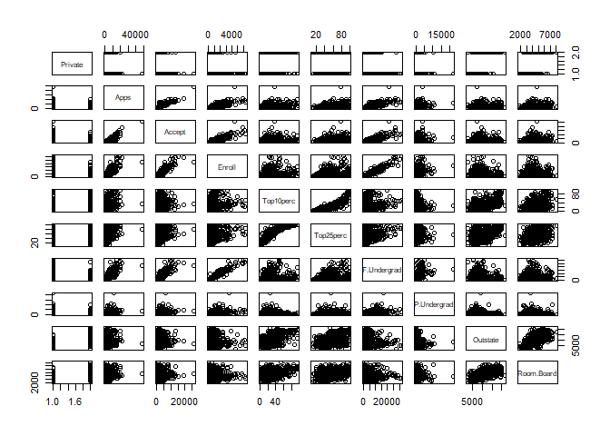
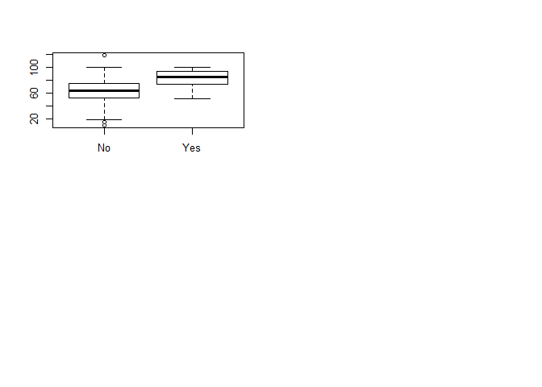
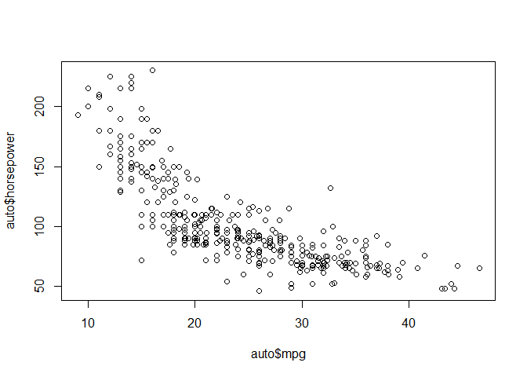

# Chapter 2 Applied
Rigel  
October 19, 2017  


```r
#Question 8 , Chapter 2 applied

#Since we have ISLR pre-installed, we can simply load it from the librarys 

college=ISLR::College

#We use head to show the head of the data frame since the entire data frame is too big to include here
head(college)
```

```
##                              Private Apps Accept Enroll Top10perc
## Abilene Christian University     Yes 1660   1232    721        23
## Adelphi University               Yes 2186   1924    512        16
## Adrian College                   Yes 1428   1097    336        22
## Agnes Scott College              Yes  417    349    137        60
## Alaska Pacific University        Yes  193    146     55        16
## Albertson College                Yes  587    479    158        38
##                              Top25perc F.Undergrad P.Undergrad Outstate
## Abilene Christian University        52        2885         537     7440
## Adelphi University                  29        2683        1227    12280
## Adrian College                      50        1036          99    11250
## Agnes Scott College                 89         510          63    12960
## Alaska Pacific University           44         249         869     7560
## Albertson College                   62         678          41    13500
##                              Room.Board Books Personal PhD Terminal
## Abilene Christian University       3300   450     2200  70       78
## Adelphi University                 6450   750     1500  29       30
## Adrian College                     3750   400     1165  53       66
## Agnes Scott College                5450   450      875  92       97
## Alaska Pacific University          4120   800     1500  76       72
## Albertson College                  3335   500      675  67       73
##                              S.F.Ratio perc.alumni Expend Grad.Rate
## Abilene Christian University      18.1          12   7041        60
## Adelphi University                12.2          16  10527        56
## Adrian College                    12.9          30   8735        54
## Agnes Scott College                7.7          37  19016        59
## Alaska Pacific University         11.9           2  10922        15
## Albertson College                  9.4          11   9727        55
```

```r
#We can also show the first 6 colleges by using row names and head together

head(rownames(college))
```

```
## [1] "Abilene Christian University" "Adelphi University"          
## [3] "Adrian College"               "Agnes Scott College"         
## [5] "Alaska Pacific University"    "Albertson College"
```

```r
#i)

# to get an overview of the the dataframe

summary(college)
```

```
##  Private        Apps           Accept          Enroll       Top10perc    
##  No :212   Min.   :   81   Min.   :   72   Min.   :  35   Min.   : 1.00  
##  Yes:565   1st Qu.:  776   1st Qu.:  604   1st Qu.: 242   1st Qu.:15.00  
##            Median : 1558   Median : 1110   Median : 434   Median :23.00  
##            Mean   : 3002   Mean   : 2019   Mean   : 780   Mean   :27.56  
##            3rd Qu.: 3624   3rd Qu.: 2424   3rd Qu.: 902   3rd Qu.:35.00  
##            Max.   :48094   Max.   :26330   Max.   :6392   Max.   :96.00  
##    Top25perc      F.Undergrad     P.Undergrad         Outstate    
##  Min.   :  9.0   Min.   :  139   Min.   :    1.0   Min.   : 2340  
##  1st Qu.: 41.0   1st Qu.:  992   1st Qu.:   95.0   1st Qu.: 7320  
##  Median : 54.0   Median : 1707   Median :  353.0   Median : 9990  
##  Mean   : 55.8   Mean   : 3700   Mean   :  855.3   Mean   :10441  
##  3rd Qu.: 69.0   3rd Qu.: 4005   3rd Qu.:  967.0   3rd Qu.:12925  
##  Max.   :100.0   Max.   :31643   Max.   :21836.0   Max.   :21700  
##    Room.Board       Books           Personal         PhD        
##  Min.   :1780   Min.   :  96.0   Min.   : 250   Min.   :  8.00  
##  1st Qu.:3597   1st Qu.: 470.0   1st Qu.: 850   1st Qu.: 62.00  
##  Median :4200   Median : 500.0   Median :1200   Median : 75.00  
##  Mean   :4358   Mean   : 549.4   Mean   :1341   Mean   : 72.66  
##  3rd Qu.:5050   3rd Qu.: 600.0   3rd Qu.:1700   3rd Qu.: 85.00  
##  Max.   :8124   Max.   :2340.0   Max.   :6800   Max.   :103.00  
##     Terminal       S.F.Ratio      perc.alumni        Expend     
##  Min.   : 24.0   Min.   : 2.50   Min.   : 0.00   Min.   : 3186  
##  1st Qu.: 71.0   1st Qu.:11.50   1st Qu.:13.00   1st Qu.: 6751  
##  Median : 82.0   Median :13.60   Median :21.00   Median : 8377  
##  Mean   : 79.7   Mean   :14.09   Mean   :22.74   Mean   : 9660  
##  3rd Qu.: 92.0   3rd Qu.:16.50   3rd Qu.:31.00   3rd Qu.:10830  
##  Max.   :100.0   Max.   :39.80   Max.   :64.00   Max.   :56233  
##    Grad.Rate     
##  Min.   : 10.00  
##  1st Qu.: 53.00  
##  Median : 65.00  
##  Mean   : 65.46  
##  3rd Qu.: 78.00  
##  Max.   :118.00
```

```r
#ii)
pairs(college[,1:10])
```

<!-- -->

```r
#iii)We can also do this by attaching the varaibles by using attach(college)

plot(college$Private, college$Outstate)
```

<!-- -->

```r
#iv) 

Elite= rep("No",nrow(college))
Elite[college$Top10perc>50]= "Yes"
Elite = as.factor(Elite)
college = data.frame(college,Elite)

summary(college)
```

```
##  Private        Apps           Accept          Enroll       Top10perc    
##  No :212   Min.   :   81   Min.   :   72   Min.   :  35   Min.   : 1.00  
##  Yes:565   1st Qu.:  776   1st Qu.:  604   1st Qu.: 242   1st Qu.:15.00  
##            Median : 1558   Median : 1110   Median : 434   Median :23.00  
##            Mean   : 3002   Mean   : 2019   Mean   : 780   Mean   :27.56  
##            3rd Qu.: 3624   3rd Qu.: 2424   3rd Qu.: 902   3rd Qu.:35.00  
##            Max.   :48094   Max.   :26330   Max.   :6392   Max.   :96.00  
##    Top25perc      F.Undergrad     P.Undergrad         Outstate    
##  Min.   :  9.0   Min.   :  139   Min.   :    1.0   Min.   : 2340  
##  1st Qu.: 41.0   1st Qu.:  992   1st Qu.:   95.0   1st Qu.: 7320  
##  Median : 54.0   Median : 1707   Median :  353.0   Median : 9990  
##  Mean   : 55.8   Mean   : 3700   Mean   :  855.3   Mean   :10441  
##  3rd Qu.: 69.0   3rd Qu.: 4005   3rd Qu.:  967.0   3rd Qu.:12925  
##  Max.   :100.0   Max.   :31643   Max.   :21836.0   Max.   :21700  
##    Room.Board       Books           Personal         PhD        
##  Min.   :1780   Min.   :  96.0   Min.   : 250   Min.   :  8.00  
##  1st Qu.:3597   1st Qu.: 470.0   1st Qu.: 850   1st Qu.: 62.00  
##  Median :4200   Median : 500.0   Median :1200   Median : 75.00  
##  Mean   :4358   Mean   : 549.4   Mean   :1341   Mean   : 72.66  
##  3rd Qu.:5050   3rd Qu.: 600.0   3rd Qu.:1700   3rd Qu.: 85.00  
##  Max.   :8124   Max.   :2340.0   Max.   :6800   Max.   :103.00  
##     Terminal       S.F.Ratio      perc.alumni        Expend     
##  Min.   : 24.0   Min.   : 2.50   Min.   : 0.00   Min.   : 3186  
##  1st Qu.: 71.0   1st Qu.:11.50   1st Qu.:13.00   1st Qu.: 6751  
##  Median : 82.0   Median :13.60   Median :21.00   Median : 8377  
##  Mean   : 79.7   Mean   :14.09   Mean   :22.74   Mean   : 9660  
##  3rd Qu.: 92.0   3rd Qu.:16.50   3rd Qu.:31.00   3rd Qu.:10830  
##  Max.   :100.0   Max.   :39.80   Max.   :64.00   Max.   :56233  
##    Grad.Rate      Elite    
##  Min.   : 10.00   No :699  
##  1st Qu.: 53.00   Yes: 78  
##  Median : 65.00            
##  Mean   : 65.46            
##  3rd Qu.: 78.00            
##  Max.   :118.00
```

```r
plot(college$Elite, college$Outstate)
```

<!-- -->

```r
# we can add lables to it as well 

plot(college$Elite, college$ Outstate, xlab = "Elite University", ylab = "Out of state tuition fee")
```

<!-- -->

```r
#As from the graph, we can clearly see that that the out of state tuition fee for an elite university is much higher than a non-elite university. 


#v)

par(mfrow=c(2,2))


hist(college$Apps)
hist(college$Accept)
hist(college$Enroll)
hist(college$Top10perc)
```

<!-- -->

```r
hist(college$Top25perc)

#vi)

# We can use plot to understand relationship between variables. 

#say we are trying to understand the relationship between the percentage of PHD and the percentage of alumni who donates

plot(college$PhD, college$perc.alumni)

# we can see that there is a slight positive trend with a lot of variation 

#We can also try to understand the relationship between the following variables.

plot(college$Top10perc, college$Grad.Rate)

plot(college$Expend, college$Grad.Rate)
```

<!-- -->

```r
plot(college$Elite, college$Grad.Rate)
```

<!-- -->


```r
#Question 9

#Data visualization
auto= ISLR::Auto
head(auto)
```

```
##   mpg cylinders displacement horsepower weight acceleration year origin
## 1  18         8          307        130   3504         12.0   70      1
## 2  15         8          350        165   3693         11.5   70      1
## 3  18         8          318        150   3436         11.0   70      1
## 4  16         8          304        150   3433         12.0   70      1
## 5  17         8          302        140   3449         10.5   70      1
## 6  15         8          429        198   4341         10.0   70      1
##                        name
## 1 chevrolet chevelle malibu
## 2         buick skylark 320
## 3        plymouth satellite
## 4             amc rebel sst
## 5               ford torino
## 6          ford galaxie 500
```

```r
auto$origin
```

```
##   [1] 1 1 1 1 1 1 1 1 1 1 1 1 1 1 3 1 1 1 3 2 2 2 2 2 1 1 1 1 1 3 1 3 1 1 1
##  [36] 1 1 1 1 1 1 1 1 1 1 1 1 1 1 2 2 2 3 3 2 1 3 1 2 1 1 1 1 1 1 1 1 1 1 1
##  [71] 3 1 1 1 1 2 2 2 2 1 3 3 1 3 1 1 1 1 1 1 1 1 1 1 1 1 1 1 1 1 1 2 1 1 1
## [106] 1 1 3 1 3 3 1 1 2 1 1 2 2 2 2 1 2 3 1 1 1 1 3 1 3 1 1 1 1 1 1 1 1 1 2
## [141] 2 2 3 3 1 2 2 3 3 2 1 1 1 1 1 1 1 1 1 1 1 1 1 1 1 3 1 1 1 3 2 3 1 2 1
## [176] 2 2 2 2 3 2 2 1 1 2 1 1 1 1 1 1 1 1 1 1 2 3 1 1 1 1 2 3 3 1 2 1 2 3 2
## [211] 1 1 1 1 3 1 2 1 3 1 1 1 1 1 1 1 1 1 1 1 1 2 1 3 1 1 1 3 2 3 2 3 2 1 3
## [246] 3 3 1 1 1 1 1 1 1 1 1 1 1 1 1 1 1 1 1 1 3 3 1 3 1 1 3 2 2 2 2 2 3 1 1
## [281] 1 1 1 1 1 1 1 1 1 1 1 2 3 1 1 2 1 2 1 1 1 3 2 1 1 1 1 2 3 1 3 1 1 1 1
## [316] 2 3 3 3 3 3 1 3 2 2 2 2 3 3 2 3 3 2 3 1 1 1 1 1 3 1 3 3 3 3 3 1 1 1 2
## [351] 3 3 3 3 2 2 3 3 1 1 1 1 1 1 1 1 1 1 1 2 3 3 1 1 3 3 3 3 3 3 1 1 1 1 3
## [386] 1 1 1 2 1 1 1
```

```r
head(summary(auto))
```

```
##       mpg          cylinders      displacement     horsepower   
##  Min.   : 9.00   Min.   :3.000   Min.   : 68.0   Min.   : 46.0  
##  1st Qu.:17.00   1st Qu.:4.000   1st Qu.:105.0   1st Qu.: 75.0  
##  Median :22.75   Median :4.000   Median :151.0   Median : 93.5  
##  Mean   :23.45   Mean   :5.472   Mean   :194.4   Mean   :104.5  
##  3rd Qu.:29.00   3rd Qu.:8.000   3rd Qu.:275.8   3rd Qu.:126.0  
##  Max.   :46.60   Max.   :8.000   Max.   :455.0   Max.   :230.0  
##      weight      acceleration        year           origin     
##  Min.   :1613   Min.   : 8.00   Min.   :70.00   Min.   :1.000  
##  1st Qu.:2225   1st Qu.:13.78   1st Qu.:73.00   1st Qu.:1.000  
##  Median :2804   Median :15.50   Median :76.00   Median :1.000  
##  Mean   :2978   Mean   :15.54   Mean   :75.98   Mean   :1.577  
##  3rd Qu.:3615   3rd Qu.:17.02   3rd Qu.:79.00   3rd Qu.:2.000  
##  Max.   :5140   Max.   :24.80   Max.   :82.00   Max.   :3.000  
##                  name    
##  amc matador       :  5  
##  ford pinto        :  5  
##  toyota corolla    :  5  
##  amc gremlin       :  4  
##  amc hornet        :  4  
##  chevrolet chevette:  4
```

```r
head(auto,10)
```

```
##    mpg cylinders displacement horsepower weight acceleration year origin
## 1   18         8          307        130   3504         12.0   70      1
## 2   15         8          350        165   3693         11.5   70      1
## 3   18         8          318        150   3436         11.0   70      1
## 4   16         8          304        150   3433         12.0   70      1
## 5   17         8          302        140   3449         10.5   70      1
## 6   15         8          429        198   4341         10.0   70      1
## 7   14         8          454        220   4354          9.0   70      1
## 8   14         8          440        215   4312          8.5   70      1
## 9   14         8          455        225   4425         10.0   70      1
## 10  15         8          390        190   3850          8.5   70      1
##                         name
## 1  chevrolet chevelle malibu
## 2          buick skylark 320
## 3         plymouth satellite
## 4              amc rebel sst
## 5                ford torino
## 6           ford galaxie 500
## 7           chevrolet impala
## 8          plymouth fury iii
## 9           pontiac catalina
## 10        amc ambassador dpl
```

```r
#a)

sapply(auto[1:8], unique)
```

```
## $mpg
##   [1] 18.0 15.0 16.0 17.0 14.0 24.0 22.0 21.0 27.0 26.0 25.0 10.0 11.0  9.0
##  [15] 28.0 19.0 12.0 13.0 23.0 30.0 31.0 35.0 20.0 29.0 32.0 33.0 17.5 15.5
##  [29] 14.5 22.5 24.5 18.5 29.5 26.5 16.5 31.5 36.0 25.5 33.5 20.5 30.5 21.5
##  [43] 43.1 36.1 32.8 39.4 19.9 19.4 20.2 19.2 25.1 20.6 20.8 18.6 18.1 17.7
##  [57] 27.5 27.2 30.9 21.1 23.2 23.8 23.9 20.3 21.6 16.2 19.8 22.3 17.6 18.2
##  [71] 16.9 31.9 34.1 35.7 27.4 25.4 34.2 34.5 31.8 37.3 28.4 28.8 26.8 41.5
##  [85] 38.1 32.1 37.2 26.4 24.3 19.1 34.3 29.8 31.3 37.0 32.2 46.6 27.9 40.8
##  [99] 44.3 43.4 36.4 44.6 33.8 32.7 23.7 32.4 26.6 25.8 23.5 39.1 39.0 35.1
## [113] 32.3 37.7 34.7 34.4 29.9 33.7 32.9 31.6 28.1 30.7 24.2 22.4 34.0 38.0
## [127] 44.0
## 
## $cylinders
## [1] 8 4 6 3 5
## 
## $displacement
##  [1] 307.0 350.0 318.0 304.0 302.0 429.0 454.0 440.0 455.0 390.0 383.0
## [12] 340.0 400.0 113.0 198.0 199.0 200.0  97.0 110.0 107.0 104.0 121.0
## [23] 360.0 140.0 232.0 225.0 250.0 351.0 258.0 122.0 116.0  79.0  88.0
## [34]  71.0  72.0  91.0  97.5  70.0 120.0  96.0  98.0 108.0 155.0  68.0
## [45] 114.0 156.0  76.0  83.0  90.0 231.0 262.0 134.0 119.0 171.0 115.0
## [56] 101.0 305.0  85.0 130.0 168.0 111.0 260.0 151.0 146.0  80.0  78.0
## [67] 105.0 131.0 163.0  89.0 267.0  86.0 183.0 141.0 173.0 135.0  81.0
## [78] 145.0 112.0 181.0 144.0
## 
## $horsepower
##  [1] 130 165 150 140 198 220 215 225 190 170 160  95  97  85  88  46  87
## [18]  90 113 200 210 193 100 105 175 153 180 110  72  86  70  76  65  69
## [35]  60  80  54 208 155 112  92 145 137 158 167  94 107 230  49  75  91
## [52] 122  67  83  78  52  61  93 148 129  96  71  98 115  53  81  79 120
## [69] 152 102 108  68  58 149  89  63  48  66 139 103 125 133 138 135 142
## [86]  77  62 132  84  64  74 116  82
## 
## $weight
##   [1] 3504 3693 3436 3433 3449 4341 4354 4312 4425 3850 3563 3609 3761 3086
##  [15] 2372 2833 2774 2587 2130 1835 2672 2430 2375 2234 2648 4615 4376 4382
##  [29] 4732 2264 2228 2634 3439 3329 3302 3288 4209 4464 4154 4096 4955 4746
##  [43] 5140 2962 2408 3282 3139 2220 2123 2074 2065 1773 1613 1834 1955 2278
##  [57] 2126 2254 2226 4274 4385 4135 4129 3672 4633 4502 4456 4422 2330 3892
##  [71] 4098 4294 4077 2933 2511 2979 2189 2395 2288 2506 2164 2100 4100 3988
##  [85] 4042 3777 4952 4363 4237 4735 4951 3821 3121 3278 2945 3021 2904 1950
##  [99] 4997 4906 4654 4499 2789 2279 2401 2379 2124 2310 2472 2265 4082 4278
## [113] 1867 2158 2582 2868 3399 2660 2807 3664 3102 2901 3336 2451 1836 2542
## [127] 3781 3632 3613 4141 4699 4457 4638 4257 2219 1963 2300 1649 2003 2125
## [141] 2108 2246 2489 2391 2000 3264 3459 3432 3158 4668 4440 4498 4657 3907
## [155] 3897 3730 3785 3039 3221 3169 2171 2639 2914 2592 2702 2223 2545 2984
## [169] 1937 3211 2694 2957 2671 1795 2464 2572 2255 2202 4215 4190 3962 3233
## [183] 3353 3012 3085 2035 3651 3574 3645 3193 1825 1990 2155 2565 3150 3940
## [197] 3270 2930 3820 4380 4055 3870 3755 2045 1945 3880 4060 4140 4295 3520
## [211] 3425 3630 3525 4220 4165 4325 4335 1940 2740 2755 2051 2075 1985 2190
## [225] 2815 2600 2720 1800 2070 3365 3735 3570 3535 3155 2965 3430 3210 3380
## [239] 3070 3620 3410 3445 3205 4080 2560 2230 2515 2745 2855 2405 2830 3140
## [253] 2795 2135 3245 2990 2890 3265 3360 3840 3725 3955 3830 4360 4054 3605
## [267] 1925 1975 1915 2670 3530 3900 3190 3420 2200 2150 2020 2595 2700 2556
## [281] 2144 1968 2120 2019 2678 2870 3003 3381 2188 2711 2434 2110 2800 2085
## [295] 2335 2950 3250 1850 2145 1845 2910 2420 2500 2290 2490 2635 2620 2725
## [309] 2385 1755 1875 1760 2050 2215 2380 2210 2350 2615 3230 3160 2900 3415
## [323] 3060 3465 2605 2640 2575 2525 2735 2865 1980 2025 1970 2160 2205 2245
## [337] 1965 1995 3015 2585 2835 2665 2370 2790 2295 2625
## 
## $acceleration
##  [1] 12.0 11.5 11.0 10.5 10.0  9.0  8.5  8.0  9.5 15.0 15.5 16.0 14.5 20.5
## [15] 17.5 12.5 14.0 13.5 18.5 13.0 19.0 19.5 18.0 17.0 23.5 16.5 21.0 16.9
## [29] 14.9 17.7 15.3 13.9 12.8 15.4 17.6 22.2 22.1 14.2 17.4 16.2 17.8 12.2
## [43] 16.4 13.6 15.7 13.2 21.9 16.7 12.1 14.8 18.6 16.8 13.7 11.1 11.4 18.2
## [57] 15.8 15.9 14.1 21.5 14.4 19.4 19.2 17.2 18.7 15.1 13.4 11.2 14.7 16.6
## [71] 17.3 15.2 14.3 20.1 24.8 11.3 12.9 18.8 18.1 17.9 21.7 23.7 19.9 21.8
## [85] 13.8 12.6 16.1 20.7 18.3 20.4 19.6 17.1 15.6 24.6 11.6
## 
## $year
##  [1] 70 71 72 73 74 75 76 77 78 79 80 81 82
## 
## $origin
## [1] 1 3 2
```

```r
#From just a glance it appears that mpg, displacement horsepower, weight and acceleration and year are quantitative and the rest are qualitative 

#Asadoughi thinks cylinders are quantitative, Since there are only 5 unique values I feel like this should be factorised by using the as.factor function so we will have 4 dummy variables. 

#b)
sapply(auto[c(1,3:7)], range)
```

```
##       mpg displacement horsepower weight acceleration year
## [1,]  9.0           68         46   1613          8.0   70
## [2,] 46.6          455        230   5140         24.8   82
```

```r
#c)
sapply(auto[c(1,3:7)], mean)
```

```
##          mpg displacement   horsepower       weight acceleration 
##     23.44592    194.41199    104.46939   2977.58418     15.54133 
##         year 
##     75.97959
```

```r
sapply(auto[c(1,3:7)], sd)
```

```
##          mpg displacement   horsepower       weight acceleration 
##     7.805007   104.644004    38.491160   849.402560     2.758864 
##         year 
##     3.683737
```

```r
#We create a new dataframe called newauto 

#From asadoughi
#d)

dim(auto)
```

```
## [1] 392   9
```

```r
newauto = auto[-(10:85),]
dim(newauto) == dim(auto) -c(76,0)
```

```
## [1] TRUE TRUE
```

```r
dim(newauto)
```

```
## [1] 316   9
```

```r
#The 9th observation matches
newauto[9,] == auto[9,]
```

```
##    mpg cylinders displacement horsepower weight acceleration year origin
## 9 TRUE      TRUE         TRUE       TRUE   TRUE         TRUE TRUE   TRUE
##   name
## 9 TRUE
```

```r
#The 10th observation from newauto matches the 86th observation from auto since everything in between is removed
newauto[10,] == auto[86,]
```

```
##     mpg cylinders displacement horsepower weight acceleration year origin
## 87 TRUE      TRUE         TRUE       TRUE   TRUE         TRUE TRUE   TRUE
##    name
## 87 TRUE
```

```r
sapply(newauto[c(1,3:7)], range)
```

```
##       mpg displacement horsepower weight acceleration year
## [1,] 11.0           68         46   1649          8.5   70
## [2,] 46.6          455        230   4997         24.8   82
```

```r
sapply(newauto[c(1,3:7)], mean)
```

```
##          mpg displacement   horsepower       weight acceleration 
##     24.40443    187.24051    100.72152   2935.97152     15.72690 
##         year 
##     77.14557
```

```r
sapply(newauto[c(1,3:7)], sd)
```

```
##          mpg displacement   horsepower       weight acceleration 
##     7.867283    99.678367    35.708853   811.300208     2.693721 
##         year 
##     3.106217
```

```r
#e)
pairs(auto)
```

<!-- -->

```r
plot(auto$mpg,auto$horsepower)
```

<!-- -->

```r
# miles per gallon decreases as the horse power increases
plot(auto$mpg, auto$displacement)
```

<!-- -->

```r
#similar trend for mpg and displacement
plot(auto$weight, auto$acceleration)
```

<!-- -->

```r
#No noticeable trend between acceleration and weight


#f)

attach(auto)
linear =lm(mpg~ cylinders+displacement+horsepower+weight+acceleration+year, data=auto)
linear
```

```
## 
## Call:
## lm(formula = mpg ~ cylinders + displacement + horsepower + weight + 
##     acceleration + year, data = auto)
## 
## Coefficients:
##  (Intercept)     cylinders  displacement    horsepower        weight  
##   -1.454e+01    -3.299e-01     7.678e-03    -3.914e-04    -6.795e-03  
## acceleration          year  
##    8.527e-02     7.534e-01
```

```r
summary(linear)
```

```
## 
## Call:
## lm(formula = mpg ~ cylinders + displacement + horsepower + weight + 
##     acceleration + year, data = auto)
## 
## Residuals:
##     Min      1Q  Median      3Q     Max 
## -8.6927 -2.3864 -0.0801  2.0291 14.3607 
## 
## Coefficients:
##                Estimate Std. Error t value Pr(>|t|)    
## (Intercept)  -1.454e+01  4.764e+00  -3.051  0.00244 ** 
## cylinders    -3.299e-01  3.321e-01  -0.993  0.32122    
## displacement  7.678e-03  7.358e-03   1.044  0.29733    
## horsepower   -3.914e-04  1.384e-02  -0.028  0.97745    
## weight       -6.795e-03  6.700e-04 -10.141  < 2e-16 ***
## acceleration  8.527e-02  1.020e-01   0.836  0.40383    
## year          7.534e-01  5.262e-02  14.318  < 2e-16 ***
## ---
## Signif. codes:  0 '***' 0.001 '**' 0.01 '*' 0.05 '.' 0.1 ' ' 1
## 
## Residual standard error: 3.435 on 385 degrees of freedom
## Multiple R-squared:  0.8093,	Adjusted R-squared:  0.8063 
## F-statistic: 272.2 on 6 and 385 DF,  p-value: < 2.2e-16
```

Roses are <span style="color:red">red</span>
