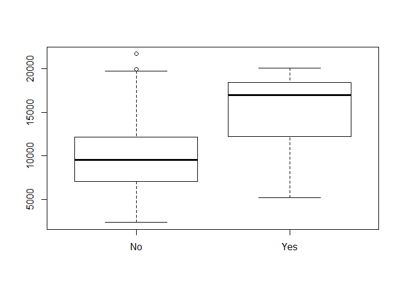
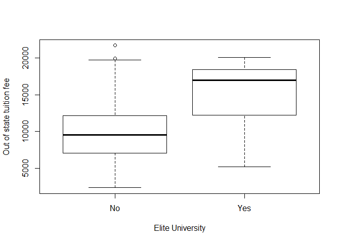

# Chapter 2 Applied
Rigel  
October 19, 2017  


```r
#Question 8 , Chapter 2 applied

#Since we have ISLR pre-installed, we can simply load it from the librarys 

college=ISLR::College

#We use head to show the head of the data frame since the entire data frame is too big to include here
head(college)
```

```
##                              Private Apps Accept Enroll Top10perc
## Abilene Christian University     Yes 1660   1232    721        23
## Adelphi University               Yes 2186   1924    512        16
## Adrian College                   Yes 1428   1097    336        22
## Agnes Scott College              Yes  417    349    137        60
## Alaska Pacific University        Yes  193    146     55        16
## Albertson College                Yes  587    479    158        38
##                              Top25perc F.Undergrad P.Undergrad Outstate
## Abilene Christian University        52        2885         537     7440
## Adelphi University                  29        2683        1227    12280
## Adrian College                      50        1036          99    11250
## Agnes Scott College                 89         510          63    12960
## Alaska Pacific University           44         249         869     7560
## Albertson College                   62         678          41    13500
##                              Room.Board Books Personal PhD Terminal
## Abilene Christian University       3300   450     2200  70       78
## Adelphi University                 6450   750     1500  29       30
## Adrian College                     3750   400     1165  53       66
## Agnes Scott College                5450   450      875  92       97
## Alaska Pacific University          4120   800     1500  76       72
## Albertson College                  3335   500      675  67       73
##                              S.F.Ratio perc.alumni Expend Grad.Rate
## Abilene Christian University      18.1          12   7041        60
## Adelphi University                12.2          16  10527        56
## Adrian College                    12.9          30   8735        54
## Agnes Scott College                7.7          37  19016        59
## Alaska Pacific University         11.9           2  10922        15
## Albertson College                  9.4          11   9727        55
```

```r
#We can also show the first 6 colleges by using row names and head together

head(rownames(college))
```

```
## [1] "Abilene Christian University" "Adelphi University"          
## [3] "Adrian College"               "Agnes Scott College"         
## [5] "Alaska Pacific University"    "Albertson College"
```

```r
#i)

# to get an overview of the the dataframe

summary(college)
```

```
##  Private        Apps           Accept          Enroll       Top10perc    
##  No :212   Min.   :   81   Min.   :   72   Min.   :  35   Min.   : 1.00  
##  Yes:565   1st Qu.:  776   1st Qu.:  604   1st Qu.: 242   1st Qu.:15.00  
##            Median : 1558   Median : 1110   Median : 434   Median :23.00  
##            Mean   : 3002   Mean   : 2019   Mean   : 780   Mean   :27.56  
##            3rd Qu.: 3624   3rd Qu.: 2424   3rd Qu.: 902   3rd Qu.:35.00  
##            Max.   :48094   Max.   :26330   Max.   :6392   Max.   :96.00  
##    Top25perc      F.Undergrad     P.Undergrad         Outstate    
##  Min.   :  9.0   Min.   :  139   Min.   :    1.0   Min.   : 2340  
##  1st Qu.: 41.0   1st Qu.:  992   1st Qu.:   95.0   1st Qu.: 7320  
##  Median : 54.0   Median : 1707   Median :  353.0   Median : 9990  
##  Mean   : 55.8   Mean   : 3700   Mean   :  855.3   Mean   :10441  
##  3rd Qu.: 69.0   3rd Qu.: 4005   3rd Qu.:  967.0   3rd Qu.:12925  
##  Max.   :100.0   Max.   :31643   Max.   :21836.0   Max.   :21700  
##    Room.Board       Books           Personal         PhD        
##  Min.   :1780   Min.   :  96.0   Min.   : 250   Min.   :  8.00  
##  1st Qu.:3597   1st Qu.: 470.0   1st Qu.: 850   1st Qu.: 62.00  
##  Median :4200   Median : 500.0   Median :1200   Median : 75.00  
##  Mean   :4358   Mean   : 549.4   Mean   :1341   Mean   : 72.66  
##  3rd Qu.:5050   3rd Qu.: 600.0   3rd Qu.:1700   3rd Qu.: 85.00  
##  Max.   :8124   Max.   :2340.0   Max.   :6800   Max.   :103.00  
##     Terminal       S.F.Ratio      perc.alumni        Expend     
##  Min.   : 24.0   Min.   : 2.50   Min.   : 0.00   Min.   : 3186  
##  1st Qu.: 71.0   1st Qu.:11.50   1st Qu.:13.00   1st Qu.: 6751  
##  Median : 82.0   Median :13.60   Median :21.00   Median : 8377  
##  Mean   : 79.7   Mean   :14.09   Mean   :22.74   Mean   : 9660  
##  3rd Qu.: 92.0   3rd Qu.:16.50   3rd Qu.:31.00   3rd Qu.:10830  
##  Max.   :100.0   Max.   :39.80   Max.   :64.00   Max.   :56233  
##    Grad.Rate     
##  Min.   : 10.00  
##  1st Qu.: 53.00  
##  Median : 65.00  
##  Mean   : 65.46  
##  3rd Qu.: 78.00  
##  Max.   :118.00
```

```r
#ii)
pairs(college[,1:10])
```

<!-- -->

```r
#iii)We can also do this by attaching the varaibles by using attach(college)

plot(college$Private, college$Outstate)
```

<!-- -->

```r
#iv) 

Elite= rep("No",nrow(college))
Elite[college$Top10perc>50]= "Yes"
Elite = as.factor(Elite)
college = data.frame(college,Elite)

summary(college)
```

```
##  Private        Apps           Accept          Enroll       Top10perc    
##  No :212   Min.   :   81   Min.   :   72   Min.   :  35   Min.   : 1.00  
##  Yes:565   1st Qu.:  776   1st Qu.:  604   1st Qu.: 242   1st Qu.:15.00  
##            Median : 1558   Median : 1110   Median : 434   Median :23.00  
##            Mean   : 3002   Mean   : 2019   Mean   : 780   Mean   :27.56  
##            3rd Qu.: 3624   3rd Qu.: 2424   3rd Qu.: 902   3rd Qu.:35.00  
##            Max.   :48094   Max.   :26330   Max.   :6392   Max.   :96.00  
##    Top25perc      F.Undergrad     P.Undergrad         Outstate    
##  Min.   :  9.0   Min.   :  139   Min.   :    1.0   Min.   : 2340  
##  1st Qu.: 41.0   1st Qu.:  992   1st Qu.:   95.0   1st Qu.: 7320  
##  Median : 54.0   Median : 1707   Median :  353.0   Median : 9990  
##  Mean   : 55.8   Mean   : 3700   Mean   :  855.3   Mean   :10441  
##  3rd Qu.: 69.0   3rd Qu.: 4005   3rd Qu.:  967.0   3rd Qu.:12925  
##  Max.   :100.0   Max.   :31643   Max.   :21836.0   Max.   :21700  
##    Room.Board       Books           Personal         PhD        
##  Min.   :1780   Min.   :  96.0   Min.   : 250   Min.   :  8.00  
##  1st Qu.:3597   1st Qu.: 470.0   1st Qu.: 850   1st Qu.: 62.00  
##  Median :4200   Median : 500.0   Median :1200   Median : 75.00  
##  Mean   :4358   Mean   : 549.4   Mean   :1341   Mean   : 72.66  
##  3rd Qu.:5050   3rd Qu.: 600.0   3rd Qu.:1700   3rd Qu.: 85.00  
##  Max.   :8124   Max.   :2340.0   Max.   :6800   Max.   :103.00  
##     Terminal       S.F.Ratio      perc.alumni        Expend     
##  Min.   : 24.0   Min.   : 2.50   Min.   : 0.00   Min.   : 3186  
##  1st Qu.: 71.0   1st Qu.:11.50   1st Qu.:13.00   1st Qu.: 6751  
##  Median : 82.0   Median :13.60   Median :21.00   Median : 8377  
##  Mean   : 79.7   Mean   :14.09   Mean   :22.74   Mean   : 9660  
##  3rd Qu.: 92.0   3rd Qu.:16.50   3rd Qu.:31.00   3rd Qu.:10830  
##  Max.   :100.0   Max.   :39.80   Max.   :64.00   Max.   :56233  
##    Grad.Rate      Elite    
##  Min.   : 10.00   No :699  
##  1st Qu.: 53.00   Yes: 78  
##  Median : 65.00            
##  Mean   : 65.46            
##  3rd Qu.: 78.00            
##  Max.   :118.00
```

```r
plot(college$Elite, college$Outstate)
```

<!-- -->

```r
# we can add lables to it as well 

plot(college$Elite, college$ Outstate, xlab = "Elite University", ylab = "Out of state tuition fee")
```

<!-- -->

```r
#As from the graph, we can clearly see that that the out of state tuition fee for an elite university is much higher than a non-elite university. 


#v)

par(mfrow=c(2,2))


hist(college$Apps)
hist(college$Accept)
hist(college$Enroll)
hist(college$Top10perc)
```

<!-- -->

```r
hist(college$Top25perc)

#vi)

# We can use plot to understand relationship between variables. 

#say we are trying to understand the relationship between the percentage of PHD and the percentage of alumni who donates

plot(college$PhD, college$perc.alumni)

# we can see that there is a slight positive trend with a lot of variation 

#We can also try to understand the 

plot(college$Top10perc, college$Grad.Rate)

plot(college$Expend, college$Grad.Rate)
```

<!-- -->


```r
#Question 9

auto= ISLR::Auto
head(auto)
```

```
##   mpg cylinders displacement horsepower weight acceleration year origin
## 1  18         8          307        130   3504         12.0   70      1
## 2  15         8          350        165   3693         11.5   70      1
## 3  18         8          318        150   3436         11.0   70      1
## 4  16         8          304        150   3433         12.0   70      1
## 5  17         8          302        140   3449         10.5   70      1
## 6  15         8          429        198   4341         10.0   70      1
##                        name
## 1 chevrolet chevelle malibu
## 2         buick skylark 320
## 3        plymouth satellite
## 4             amc rebel sst
## 5               ford torino
## 6          ford galaxie 500
```
