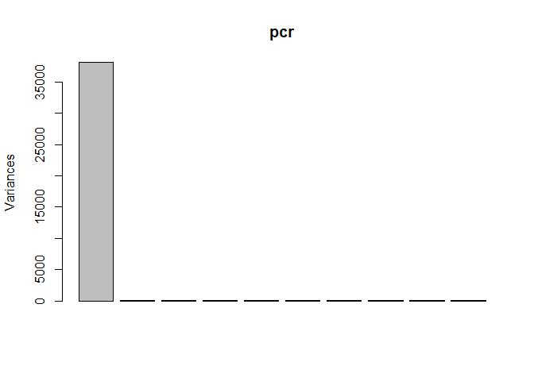

# Genes
Rigel  
November 1, 2017  


 The data set 'Genes' contains a single response Y (whether the leaf length for a particular plant was bigger than average) and p = 3,235 genetic markers. 
 . If Y = 1, then the leaf length is greater than average for that plant and Y = 0 otherwise. 
 . The genetic markers are coded as 1, 0.5, 0. A higher value suggests that the gene is more 'switched on'. You may treat these as continuous variables. 
 
 The Question?
 . Determine which, if any, of the genetic markers are associated with with a greater than average leaf length.


```r
library(readxl)
genes<- read_excel("C:/Users/Rigel/Desktop/Final Semester/STAT learning individual Assignment/Genes_Data_converted.xlsx")

head(genes)
```

```
## # A tibble: 6 × 3,237
##       Y   GM1   GM2   GM3   GM4   GM5   GM6   GM7   GM8   GM9  GM10  GM11
##   <dbl> <dbl> <dbl> <dbl> <dbl> <dbl> <dbl> <dbl> <dbl> <dbl> <dbl> <dbl>
## 1     1     0     0     0     1   0.5     0     0     0   0.5     1     1
## 2     2     0     0     0     1   0.5     0     0     0   0.5     1     1
## 3     3     0     0     0     1   0.5     0     0     0   0.5     1     1
## 4     4     0     0     0     1   0.5     0     0     0   0.5     1     1
## 5     5     1     0     0     1   0.5     0     0     0   0.5     1     1
## 6     6     1     0     0     1   0.5     0     0     0   0.5     1     1
## # ... with 3225 more variables: GM12 <dbl>, GM13 <dbl>, GM14 <dbl>,
## #   GM15 <dbl>, GM16 <dbl>, GM17 <dbl>, GM18 <dbl>, GM19 <dbl>,
## #   GM20 <dbl>, GM21 <dbl>, GM22 <dbl>, GM23 <dbl>, GM24 <dbl>,
## #   GM25 <dbl>, GM26 <dbl>, GM27 <dbl>, GM28 <dbl>, GM29 <dbl>,
## #   GM30 <dbl>, GM31 <dbl>, GM32 <dbl>, GM33 <dbl>, GM34 <dbl>,
## #   GM35 <dbl>, GM36 <dbl>, GM37 <dbl>, GM38 <dbl>, GM39 <dbl>,
## #   GM40 <dbl>, GM41 <dbl>, GM42 <dbl>, GM43 <dbl>, GM44 <dbl>,
## #   GM45 <dbl>, GM46 <dbl>, GM47 <dbl>, GM48 <dbl>, GM49 <dbl>,
## #   GM50 <dbl>, GM51 <dbl>, GM52 <dbl>, GM53 <dbl>, GM54 <dbl>,
## #   GM55 <dbl>, GM56 <dbl>, GM57 <dbl>, GM58 <dbl>, GM59 <dbl>,
## #   GM60 <dbl>, GM61 <dbl>, GM62 <dbl>, GM63 <dbl>, GM64 <dbl>,
## #   GM65 <dbl>, GM66 <dbl>, GM67 <dbl>, GM68 <dbl>, GM69 <dbl>,
## #   GM70 <dbl>, GM71 <dbl>, GM72 <dbl>, GM73 <dbl>, GM74 <dbl>,
## #   GM75 <dbl>, GM76 <dbl>, GM77 <dbl>, GM78 <dbl>, GM79 <dbl>,
## #   GM80 <dbl>, GM81 <dbl>, GM82 <dbl>, GM83 <dbl>, GM84 <dbl>,
## #   GM85 <dbl>, GM86 <dbl>, GM87 <dbl>, GM88 <dbl>, GM89 <dbl>,
## #   GM90 <dbl>, GM91 <dbl>, GM92 <dbl>, GM93 <dbl>, GM94 <dbl>,
## #   GM95 <dbl>, GM96 <dbl>, GM97 <dbl>, GM98 <dbl>, GM99 <dbl>,
## #   GM100 <dbl>, GM101 <dbl>, GM102 <dbl>, GM103 <dbl>, GM104 <dbl>,
## #   GM105 <dbl>, GM106 <dbl>, GM107 <dbl>, GM108 <dbl>, GM109 <dbl>,
## #   GM110 <dbl>, GM111 <dbl>, ...
```

```r
pcr <- prcomp(genes)
plot(pcr)
```

<!-- -->

```r
pcr
```

```
## Standard deviations:
##   [1] 1.953077e+02 5.896463e+00 5.814166e+00 5.383806e+00 5.029237e+00
##   [6] 4.866621e+00 4.756957e+00 4.535137e+00 4.418141e+00 4.317237e+00
##  [11] 4.187550e+00 4.181257e+00 3.936030e+00 3.864787e+00 3.688409e+00
##  [16] 3.623014e+00 3.574391e+00 3.510466e+00 3.484850e+00 3.467141e+00
##  [21] 3.380164e+00 3.267563e+00 3.218232e+00 3.121163e+00 3.057522e+00
##  [26] 2.982521e+00 2.966342e+00 2.946969e+00 2.873808e+00 2.846083e+00
##  [31] 2.788884e+00 2.737246e+00 2.704829e+00 2.702911e+00 2.613099e+00
##  [36] 2.575146e+00 2.552377e+00 2.538598e+00 2.514095e+00 2.495502e+00
##  [41] 2.453030e+00 2.428253e+00 2.382883e+00 2.372211e+00 2.350774e+00
##  [46] 2.289971e+00 2.278119e+00 2.245412e+00 2.203951e+00 2.174235e+00
##  [51] 2.138658e+00 2.100303e+00 2.085562e+00 2.065310e+00 2.047255e+00
##  [56] 2.029035e+00 1.994426e+00 1.977111e+00 1.946573e+00 1.934182e+00
##  [61] 1.921439e+00 1.900354e+00 1.882306e+00 1.861428e+00 1.857230e+00
##  [66] 1.832055e+00 1.805275e+00 1.791330e+00 1.780694e+00 1.746309e+00
##  [71] 1.722408e+00 1.702042e+00 1.658580e+00 1.637882e+00 1.616004e+00
##  [76] 1.606297e+00 1.587858e+00 1.585422e+00 1.546618e+00 1.532834e+00
##  [81] 1.509687e+00 1.492540e+00 1.480497e+00 1.475876e+00 1.443881e+00
##  [86] 1.392224e+00 1.368061e+00 1.294280e+00 1.026963e+00 3.853885e-01
##  [91] 2.112951e-02 8.673403e-14 1.945948e-14 1.945948e-14 1.945948e-14
##  [96] 1.945948e-14 1.945948e-14 1.945948e-14 1.945948e-14 1.945948e-14
## [101] 1.945948e-14 1.945948e-14 1.945948e-14 1.945948e-14 1.945948e-14
## [106] 1.945948e-14 1.945948e-14 1.945948e-14 1.945948e-14 1.945948e-14
## [111] 1.945948e-14 1.945948e-14 1.945948e-14 1.945948e-14 1.945948e-14
## [116] 1.945948e-14 1.945948e-14 1.945948e-14 1.945948e-14 1.945948e-14
## [121] 1.945948e-14 1.945948e-14 1.945948e-14 1.945948e-14 1.945948e-14
## [126] 1.945948e-14 1.945948e-14 1.945948e-14 1.945948e-14 1.945948e-14
## [131] 1.945948e-14 1.945948e-14 1.945948e-14 1.945948e-14 1.945948e-14
## [136] 1.945948e-14 1.945948e-14 1.945948e-14 1.945948e-14 1.945948e-14
## [141] 1.945948e-14 1.945948e-14 1.945948e-14 1.945948e-14 1.945948e-14
## [146] 1.945948e-14 1.945948e-14 1.945948e-14 1.945948e-14 1.945948e-14
## [151] 1.945948e-14 1.945948e-14 1.945948e-14 1.945948e-14 1.945948e-14
## [156] 1.945948e-14 1.945948e-14 1.945948e-14 1.945948e-14 1.945948e-14
## [161] 1.945948e-14 1.945948e-14 1.945948e-14 1.945948e-14 1.945948e-14
## [166] 1.945948e-14 1.945948e-14 1.945948e-14 1.945948e-14 1.945948e-14
## [171] 1.945948e-14 1.945948e-14 1.945948e-14 1.945948e-14 1.945948e-14
## [176] 1.945948e-14 1.945948e-14 1.945948e-14 1.945948e-14 1.945948e-14
## [181] 1.945948e-14 1.945948e-14 1.945948e-14 1.945948e-14 1.945948e-14
## [186] 1.945948e-14 1.945948e-14 1.945948e-14 1.945948e-14 1.945948e-14
## [191] 1.945948e-14 1.945948e-14 1.945948e-14 1.945948e-14 1.945948e-14
## [196] 1.945948e-14 1.945948e-14 1.945948e-14 1.945948e-14 1.945948e-14
## [201] 1.945948e-14 1.945948e-14 1.945948e-14 1.945948e-14 1.945948e-14
## [206] 1.945948e-14 1.945948e-14 1.945948e-14 1.945948e-14 1.945948e-14
## [211] 1.945948e-14 1.945948e-14 1.945948e-14 1.945948e-14 1.945948e-14
## [216] 1.945948e-14 1.945948e-14 1.945948e-14 1.945948e-14 1.945948e-14
## [221] 1.945948e-14 1.945948e-14 1.945948e-14 1.945948e-14 1.945948e-14
## [226] 1.945948e-14 1.945948e-14 1.945948e-14 1.945948e-14 1.945948e-14
## [231] 1.945948e-14 1.945948e-14 1.945948e-14 1.945948e-14 1.945948e-14
## [236] 1.945948e-14 1.945948e-14 1.945948e-14 1.945948e-14 1.945948e-14
## [241] 1.945948e-14 1.945948e-14 1.945948e-14 1.945948e-14 1.945948e-14
## [246] 1.945948e-14 1.945948e-14 1.945948e-14 1.945948e-14 1.945948e-14
## [251] 1.945948e-14 1.945948e-14 1.945948e-14 1.945948e-14 1.945948e-14
## [256] 1.945948e-14 1.945948e-14 1.945948e-14 1.945948e-14 1.945948e-14
## [261] 1.945948e-14 1.945948e-14 1.945948e-14 1.945948e-14 1.945948e-14
## [266] 1.945948e-14 1.945948e-14 1.945948e-14 1.945948e-14 1.945948e-14
## [271] 1.945948e-14 1.945948e-14 1.945948e-14 1.945948e-14 1.945948e-14
## [276] 1.945948e-14 1.945948e-14 1.945948e-14 1.945948e-14 1.945948e-14
## [281] 1.945948e-14 1.945948e-14 1.945948e-14 1.945948e-14 1.945948e-14
## [286] 1.945948e-14 1.945948e-14 1.945948e-14 1.945948e-14 1.945948e-14
## [291] 1.945948e-14 1.945948e-14 1.945948e-14 1.945948e-14 1.945948e-14
## [296] 1.945948e-14 1.945948e-14 1.945948e-14 1.945948e-14 1.945948e-14
## [301] 1.945948e-14 1.945948e-14 1.945948e-14 1.945948e-14 1.945948e-14
## [306] 1.945948e-14 1.945948e-14 1.945948e-14 1.945948e-14 1.945948e-14
## [311] 1.945948e-14 1.945948e-14 1.945948e-14 1.945948e-14 1.945948e-14
## [316] 1.945948e-14 1.945948e-14 1.945948e-14 1.945948e-14 1.945948e-14
## [321] 1.945948e-14 1.945948e-14 1.945948e-14 1.945948e-14 1.945948e-14
## [326] 1.945948e-14 1.945948e-14 1.945948e-14 1.945948e-14 1.945948e-14
## [331] 1.945948e-14 1.945948e-14 1.945948e-14 1.945948e-14 1.945948e-14
## [336] 1.945948e-14 1.945948e-14 1.945948e-14 1.945948e-14 1.945948e-14
## [341] 1.945948e-14 1.945948e-14 1.945948e-14 1.945948e-14 1.945948e-14
## [346] 1.945948e-14 1.945948e-14 1.945948e-14 1.945948e-14 1.945948e-14
## [351] 1.945948e-14 1.945948e-14 1.945948e-14 1.945948e-14 1.945948e-14
## [356] 1.945948e-14 1.945948e-14 1.945948e-14 1.945948e-14 1.945948e-14
## [361] 1.945948e-14 1.945948e-14 1.945948e-14 1.945948e-14 1.945948e-14
## [366] 1.945948e-14 1.945948e-14 1.945948e-14 1.945948e-14 1.945948e-14
## [371] 1.945948e-14 1.945948e-14 1.945948e-14 1.945948e-14 1.945948e-14
## [376] 1.945948e-14 1.945948e-14 1.945948e-14 1.945948e-14 1.945948e-14
## [381] 1.945948e-14 1.945948e-14 1.945948e-14 1.945948e-14 1.945948e-14
## [386] 1.945948e-14 1.945948e-14 1.945948e-14 1.945948e-14 1.945948e-14
## [391] 1.945948e-14 1.945948e-14 1.945948e-14 1.945948e-14 1.945948e-14
## [396] 1.945948e-14 1.945948e-14 1.945948e-14 1.945948e-14 1.945948e-14
## [401] 1.945948e-14 1.945948e-14 1.945948e-14 1.945948e-14 1.945948e-14
## [406] 1.945948e-14 1.945948e-14 1.945948e-14 1.945948e-14 1.945948e-14
## [411] 1.945948e-14 1.945948e-14 1.945948e-14 1.945948e-14 1.945948e-14
## [416] 1.945948e-14 1.945948e-14 1.945948e-14 1.945948e-14 1.945948e-14
## [421] 1.945948e-14 1.945948e-14 1.945948e-14 1.945948e-14 1.945948e-14
## [426] 1.945948e-14 1.945948e-14 1.945948e-14 1.945948e-14 1.945948e-14
## [431] 1.945948e-14 1.945948e-14 1.945948e-14 1.945948e-14 1.945948e-14
## [436] 1.945948e-14 1.945948e-14 1.945948e-14 1.945948e-14 1.945948e-14
## [441] 1.945948e-14 1.945948e-14 1.945948e-14 1.945948e-14 1.945948e-14
## [446] 1.945948e-14 1.945948e-14 1.945948e-14 1.945948e-14 1.945948e-14
## [451] 1.945948e-14 1.945948e-14 1.945948e-14 1.945948e-14 1.945948e-14
## [456] 1.945948e-14 1.945948e-14 1.945948e-14 1.945948e-14 1.945948e-14
## [461] 1.945948e-14 1.945948e-14 1.945948e-14 1.945948e-14 1.945948e-14
## [466] 1.945948e-14 1.945948e-14 1.945948e-14 1.945948e-14 1.945948e-14
## [471] 1.945948e-14 1.945948e-14 1.945948e-14 1.945948e-14 1.945948e-14
## [476] 1.945948e-14 1.945948e-14 1.945948e-14 1.945948e-14 1.945948e-14
## [481] 1.945948e-14 1.945948e-14 1.945948e-14 1.945948e-14 1.945948e-14
## [486] 1.945948e-14 1.945948e-14 1.945948e-14 1.945948e-14 1.945948e-14
## [491] 1.945948e-14 1.945948e-14 1.945948e-14 1.945948e-14 1.945948e-14
## [496] 1.945948e-14 1.945948e-14 1.945948e-14 1.945948e-14 1.945948e-14
## [501] 1.945948e-14 1.945948e-14 1.945948e-14 1.945948e-14 1.945948e-14
## [506] 1.945948e-14 1.945948e-14 1.945948e-14 1.945948e-14 1.945948e-14
## [511] 1.945948e-14 1.945948e-14 1.945948e-14 1.945948e-14 1.945948e-14
## [516] 1.945948e-14 1.945948e-14 1.945948e-14 1.945948e-14 1.945948e-14
## [521] 1.945948e-14 1.945948e-14 1.945948e-14 1.945948e-14 1.945948e-14
## [526] 1.945948e-14 1.945948e-14 1.945948e-14 1.945948e-14 1.945948e-14
## [531] 1.945948e-14 1.945948e-14 1.945948e-14 1.945948e-14 1.945948e-14
## [536] 1.945948e-14 1.945948e-14 1.945948e-14 1.945948e-14 1.945948e-14
## [541] 1.945948e-14 1.945948e-14 1.945948e-14 1.945948e-14 1.945948e-14
## [546] 1.945948e-14 1.945948e-14 1.945948e-14 1.945948e-14 1.945948e-14
## [551] 1.945948e-14 1.945948e-14 1.945948e-14 1.945948e-14 1.945948e-14
## [556] 1.945948e-14 1.945948e-14 1.945948e-14 1.945948e-14 1.945948e-14
## [561] 1.945948e-14 1.945948e-14 1.945948e-14 1.945948e-14 1.945948e-14
## [566] 1.945948e-14 1.945948e-14 1.945948e-14 1.945948e-14 1.945948e-14
## [571] 1.945948e-14 1.945948e-14 1.945948e-14 1.945948e-14 1.945948e-14
## [576] 1.945948e-14 1.945948e-14 1.945948e-14 1.945948e-14 1.945948e-14
## [581] 1.945948e-14 1.945948e-14 1.945948e-14 1.945948e-14 1.945948e-14
## [586] 1.945948e-14 1.945948e-14 1.945948e-14 1.945948e-14 1.945948e-14
## [591] 1.945948e-14 1.945948e-14 1.945948e-14 1.945948e-14 1.945948e-14
## [596] 1.945948e-14 1.945948e-14 1.945948e-14 1.945948e-14 1.945948e-14
## [601] 1.945948e-14 1.945948e-14 1.945948e-14 1.945948e-14 1.945948e-14
## [606] 1.945948e-14 1.945948e-14 1.945948e-14 1.945948e-14 1.945948e-14
## [611] 1.945948e-14 1.945948e-14 1.945948e-14 1.945948e-14 1.945948e-14
## [616] 1.945948e-14 1.945948e-14 1.945948e-14 1.945948e-14 1.945948e-14
## [621] 1.945948e-14 1.945948e-14 1.945948e-14 1.945948e-14 1.945948e-14
## [626] 1.945948e-14 1.945948e-14 1.945948e-14 1.945948e-14 1.945948e-14
## [631] 1.945948e-14 1.945948e-14 1.945948e-14 1.945948e-14 1.945948e-14
## [636] 1.945948e-14 1.945948e-14 1.945948e-14 1.945948e-14 1.945948e-14
## [641] 1.945948e-14 1.945948e-14 1.945948e-14 1.945948e-14 1.945948e-14
## [646] 1.945948e-14 1.945948e-14 1.945948e-14 1.945948e-14 1.945948e-14
## [651] 1.945948e-14 1.945948e-14 1.945948e-14 1.945948e-14 1.945948e-14
## [656] 1.945948e-14 1.945948e-14 1.945948e-14 1.945948e-14 1.945948e-14
## [661] 1.945948e-14 1.945948e-14 1.945948e-14 1.945948e-14 1.945948e-14
## [666] 1.945948e-14 1.945948e-14 1.945948e-14 1.945948e-14 1.945948e-14
## [671] 1.945948e-14 1.945948e-14 1.945948e-14 1.945948e-14 1.945948e-14
## [676] 5.642659e-15
## 
## Rotation:
##                  PC1           PC2           PC3           PC4
## Y       9.999027e-01  3.047320e-03 -6.607030e-04 -1.462743e-03
## GM1     2.088368e-04 -3.464568e-03 -2.040567e-02 -4.254961e-03
## GM2    -7.285725e-05  6.846739e-03 -9.716641e-03 -1.467427e-02
## GM3    -3.594864e-05  3.991614e-03 -1.245595e-02 -1.228605e-02
## GM4    -9.539123e-05  1.539365e-03 -8.964938e-03 -1.578307e-02
## GM5    -8.167413e-05  9.156400e-03 -2.033615e-02  5.914627e-03
## GM6    -1.666858e-04  5.554343e-03 -3.633790e-03 -7.147186e-03
## GM7    -2.329083e-05  5.007111e-03 -1.023875e-02 -5.576195e-03
## GM8    -1.471727e-04  7.594516e-03 -9.683791e-03 -7.828236e-03
## GM9    -1.704006e-04  7.768972e-03 -8.201909e-03 -4.343151e-03
## GM10   -1.360578e-04  3.375115e-03 -1.028745e-02 -4.717417e-03
## GM11   -2.679990e-05  3.664440e-03 -1.111270e-02 -7.784946e-05
## GM12   -2.668095e-04  3.205038e-03 -8.892391e-03 -3.309952e-03
## GM13   -2.785110e-05  1.083519e-02 -8.589025e-03 -5.907085e-03
## GM14   -1.222015e-04  3.254839e-03 -8.125533e-03  8.998494e-03
## GM15   -3.154669e-04  1.146968e-02 -7.524110e-03  2.982865e-03
## GM16   -4.365140e-04 -3.880085e-04 -4.934202e-03 -1.214694e-03
## GM17   -3.822803e-04  1.245524e-02 -6.942808e-03 -1.710115e-04
## GM18   -2.866577e-04  1.259656e-02 -6.222015e-03 -2.358575e-04
## GM19   -1.207314e-04  1.329404e-02 -3.206894e-03  8.201811e-03
## GM20   -3.161467e-04  1.467928e-02  1.552802e-04  1.206494e-02
## GM21   -1.379559e-04  1.673149e-02 -3.290354e-03  2.563036e-03
## GM22   -2.215623e-04  1.806625e-02  4.120944e-03  7.578849e-03
## GM23   -4.166426e-04  1.905901e-02  6.628282e-04  1.066276e-02
## GM24   -1.853532e-04  2.143031e-02 -8.845070e-03  1.419679e-02
## GM25   -1.886933e-04  2.278683e-02 -1.009913e-02  1.337650e-02
## GM26   -2.988283e-04  1.999646e-02 -6.842075e-03  1.777654e-03
## GM27   -2.233680e-04  2.226633e-02 -4.920155e-03  1.346299e-02
## GM28   -4.660133e-04  2.357831e-02 -8.379138e-03  2.411129e-04
## GM29   -2.431418e-04  1.641319e-02 -9.161021e-03  8.008776e-03
## GM30   -3.642326e-04  1.837085e-02 -4.421142e-03  3.221037e-03
## GM31   -2.705144e-04  1.692823e-02 -1.384490e-02  4.064804e-03
## GM32   -4.207647e-04  1.721354e-02 -3.381575e-03  1.475054e-02
## GM33   -1.459129e-04  1.876741e-02 -1.543307e-03  1.308426e-02
## GM34   -2.799547e-04  1.866803e-02 -6.343446e-03  1.076847e-02
## GM35   -3.210891e-04  1.722171e-02 -5.585407e-03  1.700672e-02
## GM36   -2.573708e-04  1.867204e-02 -8.860716e-03  1.426508e-02
## GM37   -3.659804e-04  2.082993e-02 -9.044146e-03  1.339313e-02
## GM38   -3.343831e-04  1.447793e-02 -1.071802e-02  1.351284e-02
## GM39   -2.654034e-04  1.419343e-02 -7.375398e-03  1.975652e-02
## GM40   -3.050144e-04  1.280064e-02 -3.277421e-03  1.173395e-02
## GM41   -2.897673e-04  1.639912e-02 -4.010094e-03  1.390995e-02
## GM42   -4.027985e-04  1.956749e-02 -4.432456e-03  1.538088e-02
## GM43   -2.026193e-04  1.282594e-02 -1.265402e-02  1.185458e-02
## GM44    2.281315e-04 -5.564071e-03  9.325303e-03  6.518511e-03
## GM45   -2.916599e-04  1.498697e-02 -1.256685e-02  7.971503e-03
## GM46   -4.472634e-04  1.579768e-02 -7.746855e-03  1.507728e-02
## GM47   -6.652563e-04  8.271723e-03 -8.666516e-03  9.872116e-03
## GM48   -3.465387e-04  1.594257e-02 -9.559507e-03  5.473463e-03
## GM49   -5.049167e-04  4.704283e-03 -1.076267e-02  5.115967e-03
## GM50   -4.732070e-04  1.431604e-02 -8.055823e-03  1.003337e-02
## GM51   -2.641271e-04  1.305305e-02 -1.531708e-03 -6.532129e-04
## GM52   -3.106855e-04  1.926882e-02 -2.488823e-03  8.217747e-03
## GM53   -4.729449e-04  1.077341e-02 -1.580666e-03 -1.021909e-02
## GM54   -3.515347e-04  6.542948e-03 -7.100977e-03 -6.415216e-03
## GM55   -3.329437e-04  6.733673e-03 -6.532830e-03 -4.778770e-03
## GM56   -5.132125e-04  1.263484e-02 -4.317003e-03  2.809023e-04
## GM57   -3.395872e-04  1.032669e-02  1.573850e-03 -3.234636e-03
## GM58   -3.610781e-04  1.048365e-02 -6.472250e-03 -1.304911e-04
## GM59   -4.194860e-04  1.077026e-02 -4.283429e-03 -4.670758e-03
## GM60   -4.683857e-04  1.592182e-02  6.102336e-03 -8.922407e-03
## GM61   -3.082165e-04  1.141117e-02 -1.547858e-03  3.733097e-03
## GM62   -4.169751e-04  1.829767e-02 -5.487913e-03 -3.895575e-03
## GM63   -4.147473e-04  1.926026e-02 -6.398221e-03 -3.715004e-03
## GM64   -1.801350e-05  1.972512e-02  3.503827e-03  1.160429e-02
## GM65   -5.299201e-05  1.141968e-02 -5.086249e-03 -1.053853e-02
## GM66   -3.784510e-05  1.654500e-02 -2.212203e-03 -1.384849e-02
## GM67    4.735766e-05  1.143218e-02 -7.073178e-03 -3.330939e-03
## GM68   -1.794558e-04  1.173371e-02 -7.402085e-04 -2.548145e-03
## GM69   -1.449690e-04  1.130239e-02  4.718964e-04 -6.905053e-03
## GM70   -1.325303e-04  1.048101e-02 -3.160830e-03 -1.272387e-03
## GM71   -5.924371e-05  1.274731e-02  6.394894e-03 -4.790369e-03
## GM72   -1.752006e-04  1.774966e-05 -8.647834e-03 -1.400567e-02
## GM73   -2.345856e-04  1.262047e-02 -9.746803e-03 -1.224556e-02
## GM74   -3.752339e-04  9.134451e-03 -4.603857e-03 -7.299701e-03
## GM75   -2.082104e-04  7.696695e-03 -7.765683e-03 -7.170891e-03
## GM76   -1.760651e-04  7.461880e-04 -2.239726e-02  1.033562e-03
## GM77   -3.331978e-04 -5.886664e-03 -1.114791e-02 -3.916767e-03
## GM78   -1.470539e-04  4.184032e-03 -2.011189e-02 -1.618674e-03
## GM79   -8.709850e-05  5.034072e-03 -2.012060e-02 -6.094419e-03
## GM80   -1.438369e-04  8.011122e-03 -2.047920e-02  4.729571e-03
## GM81   -2.871668e-04  7.499117e-03 -2.211102e-02  8.388860e-03
## GM82   -2.538224e-04  7.435039e-03 -1.785408e-02 -2.241621e-03
## GM83   -1.698214e-05  7.574196e-03 -2.298134e-02  5.440089e-03
## GM84    2.799317e-05  7.597398e-03 -1.686725e-02  2.429741e-03
## GM85   -5.991450e-06  3.400488e-03 -1.624736e-02 -2.072451e-03
## GM86   -1.760785e-04  3.226511e-03 -1.029434e-02  4.573323e-04
## GM87   -1.565055e-04 -6.537532e-04 -4.906432e-03  8.669645e-04
## GM88   -4.315863e-04  4.855644e-04 -8.722469e-03 -2.058262e-03
## GM89   -1.453067e-05 -5.553648e-03 -1.554704e-02 -4.201458e-03
## GM90    1.811575e-04 -4.810470e-03 -8.751693e-03  6.140199e-03
## GM91    2.605301e-04  1.807048e-03 -7.501835e-03  6.443603e-03
## GM92    1.349542e-04  2.096605e-03 -5.833097e-03  7.311572e-03
## GM93    2.185360e-04  3.825586e-03 -3.572970e-03  9.472416e-03
## GM94    5.640352e-05  6.686189e-03 -1.173877e-02  5.504327e-03
## GM95    2.003822e-04  2.566190e-03 -5.646208e-03  8.136115e-03
## GM96    3.730934e-05  3.521477e-03 -4.568474e-03  4.616680e-03
## GM97    3.730934e-05  3.521477e-03 -4.568474e-03  4.616680e-03
## GM98    5.316859e-05  2.820307e-03  1.387773e-03  9.609988e-03
## GM99    9.547739e-05  4.453629e-03 -3.068609e-03  7.965717e-03
## GM100   3.493805e-04 -5.645391e-03  2.459244e-03  1.473361e-02
## GM101   2.363615e-04  5.655498e-04  4.348818e-03  1.398179e-02
## GM102   3.526987e-04 -3.264674e-03  1.685460e-03  1.839495e-02
## GM103   5.117906e-04 -9.819529e-04  3.016796e-03  1.495131e-02
## GM104   3.293819e-04  7.114139e-03 -4.015438e-03  8.391892e-03
## GM105   4.357915e-04  7.995763e-03 -3.042939e-03  1.341477e-02
## GM106   3.289951e-04  1.117099e-02 -2.715540e-03  1.688660e-02
## GM107   2.280292e-04  7.715355e-03  3.417287e-03  1.089411e-02
## GM108   2.885531e-04  1.199877e-02 -1.292250e-03  8.300456e-03
## GM109   2.553623e-04  9.507933e-03 -6.977551e-04  1.341248e-02
## GM110   4.366324e-04  5.293145e-03  3.509194e-04  1.016559e-02
## GM111   4.945480e-04  1.049760e-02  2.524201e-04  1.687648e-02
## GM112   2.771360e-04  1.111266e-02 -1.321705e-03  5.694444e-03
## GM113  -1.291341e-05  1.372926e-04  4.925576e-03 -1.545723e-02
## GM114   7.385189e-05 -6.702570e-03  3.024774e-03  5.090325e-03
## GM115  -2.253256e-04  6.365262e-03  2.800238e-03  2.134443e-02
## GM116   4.016896e-04  1.225394e-02  3.131230e-04  3.178499e-02
## GM117   4.231396e-04  6.474105e-03  3.799887e-03  2.711558e-02
## GM118   4.129047e-04  4.917615e-03  2.872024e-03  2.886211e-02
## GM119   2.191934e-04  8.029433e-03  4.410641e-03  2.486585e-02
## GM120   5.946081e-04  1.218008e-02 -4.429208e-03  2.811329e-02
## GM121   5.151255e-04  4.980941e-03  7.617290e-04  2.719484e-02
## GM122   6.304741e-04  6.828971e-03 -7.738917e-03  2.522655e-02
## GM123   6.512463e-04  1.312314e-02 -5.745237e-05  2.922257e-02
## GM124   5.560081e-04  1.577806e-02 -3.197604e-03  2.543905e-02
## GM125   4.656872e-04  1.730003e-02  1.611213e-03  3.144339e-02
## GM126   4.650486e-04  7.837228e-03  3.270358e-03  2.796523e-02
## GM127   4.739556e-04  1.652249e-02  3.314800e-03  3.530282e-02
## GM128   5.176436e-04  1.036804e-02  3.251507e-03  2.544833e-02
## GM129   1.368250e-04  1.718635e-02 -3.453208e-03  3.272971e-02
## GM130   2.869144e-04  1.567434e-02  3.563098e-04  2.992090e-02
## GM131   5.185904e-04  1.271790e-02  8.882709e-04  2.767588e-02
## GM132   3.706273e-04  1.330227e-02  6.622145e-04  3.158374e-02
## GM133   4.355304e-04  1.183694e-02  2.995069e-03  2.710054e-02
## GM134   3.725283e-04  1.217517e-02 -6.821436e-05  2.747541e-02
## GM135   2.237592e-04  1.262785e-02 -7.238027e-04  2.678296e-02
## GM136   3.482172e-04  1.744191e-02 -8.455924e-03  1.815405e-02
## GM137   1.898568e-04  4.455148e-03 -4.994981e-03  2.269096e-02
## GM138   4.400276e-04  1.323164e-02 -4.561970e-03  2.176850e-02
## GM139   2.777745e-04  6.931135e-03  5.626034e-03  2.943268e-02
## GM140   2.769224e-04  7.762837e-03  1.316084e-03  1.653743e-02
## GM141   1.284780e-04  6.198217e-03  2.964318e-03  2.143925e-02
## GM142   3.156200e-04  3.722789e-03  5.916181e-03  2.459104e-02
## GM143   3.937937e-04  6.213090e-03  7.948297e-03  2.122359e-02
## GM144   3.886391e-04  3.002415e-03  2.282019e-03  1.919267e-02
## GM145   2.879151e-04  5.052090e-03  1.360941e-02  2.359147e-02
## GM146   2.497412e-04  5.012503e-03  1.277270e-02  2.250736e-02
##                  PC5           PC6           PC7           PC8
## Y       2.937055e-03  9.137529e-04 -9.091721e-04 -5.398547e-04
## GM1     6.349547e-04 -4.669089e-03  7.000271e-03  2.059845e-02
## GM2     9.838203e-03  8.866491e-03  4.447551e-03  1.604838e-04
## GM3     1.680247e-02  1.469271e-02  2.712679e-03  4.855615e-04
## GM4     7.377081e-03  3.292795e-03  9.587101e-03 -5.670722e-03
## GM5     1.369182e-02  2.407290e-03 -2.035564e-03 -4.801276e-02
## GM6     1.383813e-02  6.449307e-03  1.483839e-03 -1.222686e-02
## GM7     2.270056e-02  5.950328e-03 -1.256318e-03 -1.598397e-02
## GM8     1.354355e-02  6.592880e-03 -2.249113e-03  4.076401e-03
## GM9     1.232036e-02  2.392219e-03  3.763948e-03 -2.384569e-02
## GM10    1.399261e-02 -8.404400e-03 -7.991831e-03 -1.855658e-02
## GM11    1.330652e-02 -1.193676e-02 -1.049837e-02 -1.605966e-02
## GM12    1.719010e-02 -5.089480e-03 -1.444347e-02 -2.236731e-02
## GM13    9.102285e-03 -3.737130e-03 -1.939520e-03 -1.814201e-02
## GM14    1.330858e-02 -5.545383e-03  2.064528e-02  1.192472e-02
## GM15    1.132419e-02 -5.963283e-03 -1.337754e-02 -2.612750e-02
## GM16    1.673539e-02 -5.388833e-03 -9.198619e-03 -1.905088e-02
## GM17    2.468927e-02 -4.034445e-03 -1.313194e-02 -1.738517e-02
## GM18    2.077221e-02 -5.670062e-03 -1.146236e-02 -1.557006e-02
## GM19    1.506026e-02 -1.771374e-03 -8.162296e-03 -2.919985e-02
## GM20    2.032258e-02 -8.448509e-03  2.730444e-03 -2.508439e-02
## GM21    2.925703e-02 -4.479109e-03  5.790241e-03 -2.331566e-02
## GM22    1.201680e-02 -4.622958e-03  9.996258e-03 -2.803935e-02
## GM23    2.364686e-02 -3.660006e-03  7.199394e-03 -2.141098e-02
## GM24    6.570016e-03 -2.697397e-03 -7.950423e-03 -1.056106e-03
## GM25    1.902454e-03 -5.072765e-03 -8.801024e-03 -1.590114e-03
## GM26    8.602479e-03 -4.793852e-03 -2.320487e-02 -1.810925e-03
## GM27    5.870701e-03 -4.913525e-03 -6.917612e-03 -8.362079e-03
## GM28    7.783692e-03 -1.675951e-03 -2.665057e-02 -4.165162e-03
## GM29    8.474865e-03 -8.976194e-03 -1.982149e-02 -4.700420e-03
## GM30    1.305356e-02 -2.236119e-03 -2.574913e-02 -1.376047e-03
## GM31    1.225815e-02 -1.315001e-02 -1.691059e-02 -4.456712e-03
## GM32   -5.455517e-04 -1.429969e-02 -1.279617e-02 -7.002272e-03
## GM33    9.341504e-03 -4.414464e-03 -7.517636e-04  9.839030e-04
## GM34    1.007979e-02 -4.656076e-03 -5.017711e-03 -2.892165e-03
## GM35    1.032114e-02 -8.177989e-03 -1.318119e-02 -5.043591e-03
## GM36    2.546158e-03 -9.456814e-03 -5.306684e-03 -3.065316e-03
## GM37    6.865824e-03 -1.221156e-02 -1.874917e-02 -7.377902e-03
## GM38    5.595535e-03 -1.239828e-02 -1.040943e-02 -5.714607e-03
## GM39    9.790404e-03 -1.658829e-02 -1.431379e-02 -1.518963e-02
## GM40    1.345966e-02 -1.833085e-02 -2.529854e-02 -1.411152e-02
## GM41    6.092338e-03 -1.174824e-02 -2.953623e-02 -6.223725e-03
## GM42    3.322982e-03 -9.628794e-03 -2.168873e-02 -7.620139e-03
## GM43    1.426017e-03 -1.264226e-02 -1.497778e-02 -1.476916e-02
## GM44    4.886035e-04  4.123160e-03 -1.303906e-03  8.213603e-03
## GM45    1.259432e-04 -2.318266e-02 -2.140833e-02 -9.939914e-03
## GM46   -1.097011e-03 -1.842588e-02 -1.216771e-02 -7.841161e-03
## GM47   -1.479184e-03 -1.660386e-02 -1.232321e-02 -9.098854e-03
## GM48    8.580654e-03 -1.612760e-02 -1.454864e-02 -1.115159e-02
## GM49   -2.803435e-03 -1.476016e-02 -1.250479e-02 -1.193829e-02
## GM50    6.397561e-03 -1.664525e-02 -1.479227e-02 -1.332713e-02
## GM51    1.589938e-02 -1.335919e-02 -1.528795e-02 -2.957634e-03
## GM52    1.574901e-02 -1.021585e-02 -1.399941e-02 -7.608628e-03
## GM53    1.941711e-02 -1.040960e-02 -7.751362e-03 -4.508779e-03
## GM54    1.662977e-02 -1.107453e-02 -8.034640e-03 -7.778751e-03
## GM55    1.603385e-02 -7.863364e-03 -1.282924e-02 -8.548568e-03
## GM56    1.177438e-02 -4.156113e-03 -7.231273e-03 -1.345913e-03
## GM57    1.705805e-02 -1.305805e-02 -1.838800e-02 -1.203601e-02
## GM58    1.391586e-02 -6.933337e-03 -7.173957e-03 -8.212135e-03
## GM59    1.512139e-02 -6.015719e-03 -1.353783e-02 -1.430568e-02
## GM60    5.157604e-03 -7.896794e-03 -2.067515e-02 -6.169937e-03
## GM61    1.015495e-02 -5.843163e-03 -1.773634e-02 -1.070095e-02
## GM62    5.313822e-03 -8.468126e-03 -1.269856e-02 -1.730363e-02
## GM63    9.676198e-03 -3.080561e-03 -8.108624e-03 -1.878507e-02
## GM64    9.957958e-03 -1.463487e-02 -3.342692e-03 -1.434757e-02
## GM65    2.411157e-02 -4.690677e-03  5.873572e-03 -1.636021e-02
## GM66    2.375842e-02 -1.752630e-03  3.878908e-03 -1.862195e-02
## GM67    3.916372e-02  4.946460e-03  8.573148e-03 -3.266071e-02
## GM68    3.385425e-02  7.136618e-03  1.014305e-02 -2.496378e-02
## GM69    3.387072e-02  3.261683e-03  8.179161e-03 -2.627500e-02
## GM70    3.564412e-02  1.326229e-02  1.181564e-02 -2.834192e-02
## GM71    3.204380e-02  8.010262e-04  7.471422e-03 -2.089845e-02
## GM72    3.091637e-02 -5.768390e-03  7.933735e-03 -3.486527e-02
## GM73    3.397526e-02 -5.293776e-03  1.950733e-03 -3.148703e-02
## GM74    3.612354e-02 -3.962940e-03  3.004073e-04 -3.986463e-02
## GM75    3.749678e-02  7.166440e-04  1.988634e-03 -4.375282e-02
## GM76    2.645665e-02 -2.318210e-03 -1.947791e-03 -4.968796e-02
## GM77    1.702680e-02  9.927830e-04 -2.438592e-03 -3.488745e-02
## GM78    2.481184e-02  3.472012e-03 -6.045269e-04 -5.236408e-02
## GM79    2.813990e-02  1.933924e-03 -5.751889e-04 -5.119876e-02
## GM80    1.272709e-02 -2.514624e-03  4.423341e-03 -5.138416e-02
## GM81    1.115299e-02 -1.630547e-03 -1.274310e-03 -4.860306e-02
## GM82    1.238259e-02  2.748010e-03 -1.931130e-03 -4.559955e-02
## GM83    1.842908e-02  3.650452e-03 -7.243746e-03 -4.766526e-02
## GM84    1.482871e-02  4.416026e-03 -5.791628e-03 -4.409126e-02
## GM85    1.026747e-02 -3.284415e-03  1.947960e-03 -4.949387e-02
## GM86   -2.870292e-04 -6.862141e-03  1.009735e-03 -4.702649e-02
## GM87   -2.300136e-03 -1.880591e-03  7.938048e-04 -4.440314e-02
## GM88   -3.399331e-03 -2.434742e-03  2.036518e-03 -3.759826e-02
## GM89   -1.146205e-02  3.551054e-03  4.321773e-03 -2.784614e-02
## GM90   -1.134704e-02  3.274244e-03  6.627180e-03 -3.297844e-02
## GM91   -1.159314e-02  5.160243e-03  7.387414e-03 -3.835313e-02
## GM92   -1.159944e-02  4.950297e-03  3.480108e-03 -3.943569e-02
## GM93   -9.961781e-03  3.384674e-03  4.364166e-03 -4.171188e-02
## GM94   -5.766875e-03  9.298976e-03  1.605244e-03 -3.976305e-02
## GM95   -1.268537e-02  1.227934e-02  1.198062e-03 -4.471853e-02
## GM96   -1.551766e-02  7.687056e-03  4.401335e-03 -4.055801e-02
## GM97   -1.551766e-02  7.687056e-03  4.401335e-03 -4.055801e-02
## GM98   -1.405018e-02  6.466364e-03 -1.004251e-03 -2.937921e-02
## GM99   -1.761348e-02  1.296155e-02  1.823339e-03 -3.476898e-02
## GM100  -9.849555e-03  7.259583e-03  4.971331e-03 -2.214293e-02
## GM101  -1.689680e-02  8.317154e-03  1.199403e-03 -3.446290e-02
## GM102  -1.118436e-02  1.107562e-02  5.034157e-03 -2.818191e-02
## GM103  -8.823922e-03  9.304346e-03  4.039894e-03 -3.057915e-02
## GM104  -1.823694e-02  2.318962e-03  9.559745e-03 -2.502821e-02
## GM105  -1.260063e-02 -1.040612e-03 -2.650126e-03 -2.249732e-02
## GM106  -1.500260e-02 -1.054861e-03  6.370500e-03 -1.591207e-02
## GM107  -1.501288e-02  5.428444e-03  1.029259e-03 -2.309346e-02
## GM108  -1.290801e-02  4.772336e-03  5.988179e-03 -1.772354e-02
## GM109  -1.684690e-02  9.243641e-04  6.075918e-03 -2.140798e-02
## GM110  -1.197741e-02 -2.366570e-04 -3.401326e-03 -2.348895e-02
## GM111  -3.414599e-03 -1.068985e-02 -2.397380e-03 -1.824338e-02
## GM112  -1.266502e-02 -8.258648e-04  6.656535e-03 -1.670693e-02
## GM113   2.597880e-02 -9.504479e-03  6.264269e-03 -4.621110e-02
## GM114  -6.922618e-03 -3.643799e-03  8.147419e-03  1.598892e-03
## GM115   1.029902e-03  1.541673e-02  1.804874e-02 -1.170955e-03
## GM116   6.754020e-04  1.285481e-02  2.857689e-02 -1.002029e-02
## GM117   1.253165e-03  5.132760e-03  2.347449e-02  5.266956e-03
## GM118   8.184490e-04  5.653384e-03  2.200804e-02  8.052280e-03
## GM119   4.713393e-03  1.121097e-02  1.592684e-02 -8.065485e-03
## GM120   4.390872e-04  9.590786e-03  1.880719e-02 -4.686772e-03
## GM121  -2.354476e-03  9.173401e-03  2.290826e-02 -5.218654e-03
## GM122  -2.863613e-03  8.268316e-03  2.546121e-02 -5.766607e-03
## GM123   6.926737e-03  7.802295e-03  2.065510e-02 -1.005027e-02
## GM124   6.263912e-03  1.124838e-02  2.308008e-02 -1.099755e-02
## GM125  -5.508147e-03  1.505803e-02  3.149044e-02 -6.612032e-03
## GM126   7.322346e-04  9.224735e-03  2.209404e-02  6.237077e-03
## GM127  -4.552224e-03  1.567935e-02  2.758757e-02 -1.352979e-02
## GM128   4.578967e-03  8.911383e-03  2.670566e-02 -1.304188e-02
## GM129  -6.009865e-03  1.481850e-02  1.500882e-02 -1.446213e-02
## GM130  -4.861708e-03  8.870077e-03  1.869103e-02 -1.314605e-02
## GM131  -4.898934e-03  1.571947e-02  2.547997e-02 -1.422757e-02
## GM132  -3.502763e-03  1.216522e-02  2.078828e-02 -8.707724e-03
## GM133  -5.736543e-03  1.732530e-02  2.073864e-02 -7.043723e-03
## GM134   3.723757e-03  1.341066e-02  2.267751e-02 -9.200459e-03
## GM135  -5.713260e-03  1.193665e-02  1.476223e-02 -1.365509e-02
## GM136   2.642282e-03  1.496814e-02  1.594300e-02 -1.104958e-02
## GM137  -1.355378e-03  1.663962e-02  1.626675e-02 -1.175913e-02
## GM138  -4.754730e-03  5.624506e-03  2.996329e-03 -6.685323e-03
## GM139  -1.083238e-02  6.746587e-03  1.862860e-02  5.836067e-03
## GM140  -1.127013e-03  9.496553e-03  1.237949e-02 -4.443970e-03
## GM141  -6.886481e-03  5.281220e-03  2.149847e-02  6.016137e-03
## GM142  -7.575195e-03  1.825468e-03  2.567399e-02  5.374168e-03
## GM143  -5.487460e-03  2.372278e-04  2.601845e-02  5.066891e-03
## GM144  -2.767115e-03 -2.747196e-03  2.306454e-02  5.202583e-03
## GM145  -1.906557e-04  1.565624e-04  2.690614e-02 -5.416674e-05
## GM146  -4.759939e-03  5.519187e-03  2.308539e-02  3.791921e-03
##                  PC9          PC10          PC11          PC12
## Y       7.325189e-04  3.686468e-04  2.140242e-05  1.314843e-03
## GM1     7.873858e-04  1.079360e-02  3.332417e-03  2.361363e-03
## GM2     1.329249e-02  6.067643e-05  6.372377e-03  1.175937e-02
## GM3     6.968370e-03 -2.317566e-03  1.377714e-03  1.747749e-02
## GM4     1.470477e-02 -6.142922e-04  9.399997e-03  1.723768e-02
## GM5     5.156147e-03  7.704201e-03 -1.457217e-02  1.118787e-02
## GM6     5.162825e-03 -3.951959e-03  5.700392e-03  1.850985e-02
## GM7     9.602998e-03 -9.660902e-03  1.069437e-02  2.797151e-02
## GM8     9.658203e-03 -5.851718e-03 -3.801188e-03  1.026236e-02
## GM9     1.334173e-02 -2.382251e-03  1.428893e-04  3.138503e-02
## GM10    1.786565e-02 -7.365591e-03 -9.435211e-03  3.427714e-02
## GM11    1.298946e-02 -8.318160e-03 -7.847559e-03  3.325160e-02
## GM12    1.416201e-02 -1.089892e-02 -7.785871e-03  3.285122e-02
## GM13    1.859772e-02 -2.133702e-03 -1.630530e-03  3.756904e-02
## GM14    1.101134e-02  3.167674e-02 -3.651345e-02  3.158083e-03
## GM15    1.249770e-02 -1.327345e-02 -1.530979e-03  2.647144e-02
## GM16   -4.326955e-03 -5.837178e-03 -5.058660e-03  3.240620e-02
## GM17    2.391942e-02 -1.063754e-02 -9.878405e-03  3.482061e-02
## GM18    2.026194e-02 -3.153190e-03 -1.270647e-02  3.563716e-02
## GM19    1.334750e-02 -2.198981e-02 -8.474803e-04  2.688455e-02
## GM20    2.129022e-02 -7.625921e-03 -1.535227e-02  2.392653e-02
## GM21    2.332246e-02 -8.359952e-03 -1.952717e-02  2.046048e-02
## GM22    2.787375e-02 -1.731963e-02 -1.492306e-02  2.447087e-02
## GM23    1.482527e-02 -7.161431e-03 -1.342311e-02  2.188601e-02
## GM24    3.982018e-02 -3.619658e-03 -3.002910e-03  3.630109e-03
## GM25    3.694751e-02 -8.193157e-03 -2.510332e-04  1.286079e-02
## GM26    3.933402e-02 -6.140163e-03  1.847059e-03  7.365827e-03
## GM27    4.046883e-02 -4.723415e-03 -4.009360e-03  1.818494e-03
## GM28    3.968108e-02 -1.088931e-02 -3.438791e-03  2.165603e-03
## GM29    4.207521e-02 -6.444475e-03 -5.474414e-03 -8.255937e-03
## GM30    2.853109e-02 -6.847618e-03 -7.597872e-03 -7.105229e-03
## GM31    3.778404e-02 -1.010357e-02  9.276311e-03 -1.085891e-02
## GM32    4.213047e-02 -1.328581e-02 -7.738373e-03  4.176434e-03
## GM33    3.439368e-02 -8.231297e-03 -7.304500e-03 -1.648918e-04
## GM34    4.341766e-02 -6.177885e-03 -4.139045e-03  4.477312e-03
## GM35    4.071171e-02 -1.447311e-02  9.956001e-04  6.462022e-03
## GM36    3.845608e-02 -1.327029e-02 -1.202806e-02  4.013909e-03
## GM37    3.955171e-02 -1.456118e-02 -3.201379e-03  4.893522e-03
## GM38    3.706814e-02 -1.985349e-02 -6.632369e-03  8.156794e-03
## GM39    3.351676e-02 -1.285253e-02 -1.199188e-02  1.033315e-02
## GM40    4.136084e-02 -9.965342e-03 -5.228637e-03  9.653313e-03
## GM41    4.238294e-02 -1.949395e-02  4.985659e-03  5.745077e-03
## GM42    4.013938e-02 -1.942728e-02 -1.022167e-03  6.801634e-03
## GM43    3.863193e-02 -2.404572e-02  1.147022e-04  4.468915e-03
## GM44    2.443369e-02  5.031174e-02 -1.184865e-02  4.767404e-03
## GM45    2.370119e-02 -2.652812e-02  4.624317e-03  1.578269e-02
## GM46    2.583278e-02 -3.182762e-02  1.298714e-03  1.128969e-02
## GM47    2.555435e-02 -2.035882e-02  5.311743e-03  4.234444e-03
## GM48    2.243227e-02 -2.786918e-02  7.520224e-03  8.200778e-03
## GM49    1.949219e-02 -1.672063e-02 -3.347533e-03 -4.907788e-03
## GM50    2.448568e-02 -3.383866e-02  8.912437e-03  7.547362e-03
## GM51    2.510504e-02 -3.087035e-02  8.709689e-03  8.738164e-03
## GM52    2.645844e-02 -3.675667e-02  5.546928e-03  7.503843e-03
## GM53    1.916923e-02 -2.281029e-02  1.426426e-02  1.055336e-02
## GM54    7.472155e-03 -2.115806e-02  9.525113e-03  8.869057e-03
## GM55    6.213477e-03 -2.723968e-02  6.572503e-03  2.005551e-03
## GM56    1.099756e-02 -3.155499e-02  9.742072e-03  1.047423e-02
## GM57    8.609081e-03 -3.172407e-02  7.343540e-03  8.271527e-03
## GM58    1.322147e-02 -2.791532e-02  6.651943e-03  6.150243e-03
## GM59    1.301210e-03 -3.118551e-02  7.669280e-04  2.869297e-03
## GM60    5.942830e-03 -2.468425e-02  1.761542e-02  1.176666e-02
## GM61    4.831551e-03 -3.036233e-02  6.942558e-03  1.441119e-02
## GM62   -5.421655e-03 -3.416410e-02  2.748659e-02  8.627778e-03
## GM63   -9.190367e-03 -3.775549e-02  2.045571e-02  1.487545e-02
## GM64   -1.050472e-02 -3.494674e-02  4.074107e-03  6.596572e-03
## GM65   -1.973689e-03 -2.210734e-02  7.108455e-03  2.072852e-02
## GM66   -5.641821e-03 -2.089723e-02  1.189420e-02  1.563758e-02
## GM67    6.678152e-03 -2.125968e-02 -8.412273e-03  8.774569e-03
## GM68    1.225916e-03 -3.461697e-02 -1.378747e-02  6.232469e-03
## GM69    2.195217e-03 -3.418748e-02 -1.124605e-02  8.348568e-03
## GM70   -1.683692e-04 -3.019859e-02 -1.813381e-02  2.862337e-03
## GM71    5.412726e-03 -2.837280e-02 -8.352814e-03  9.012878e-03
## GM72    2.323770e-03 -3.221942e-02  3.683663e-03  1.904014e-02
## GM73    5.674743e-03 -2.490921e-02  2.713539e-03  1.151748e-02
## GM74    3.786926e-03 -2.931784e-02 -8.105529e-03  1.179351e-02
## GM75    3.381519e-03 -2.456318e-02 -8.467277e-03  9.066036e-03
## GM76    1.475427e-03 -4.719355e-03 -2.454171e-02  3.268281e-03
## GM77    4.176375e-03  3.752026e-03 -1.209105e-03  7.870959e-03
## GM78   -3.424320e-03 -4.138486e-03 -8.128747e-03 -1.398221e-03
## GM79   -4.109731e-03 -3.108665e-03 -8.246147e-03  7.216079e-04
## GM80   -2.199561e-03  3.468450e-03 -1.132722e-02  6.516980e-03
## GM81    1.866106e-03  6.619250e-03 -1.354177e-02  1.172879e-02
## GM82    3.620924e-03  8.630264e-03 -1.547297e-02  1.146432e-02
## GM83    9.552224e-04  2.403355e-03 -1.116722e-02  7.385109e-03
## GM84    3.522650e-03  2.008215e-03 -2.135988e-02  1.926075e-02
## GM85    1.337971e-02  1.266356e-02 -9.699874e-03  1.306088e-02
## GM86    3.445807e-02  2.368281e-02 -8.719968e-03  3.901688e-03
## GM87    1.913068e-02  3.153871e-02 -1.386041e-02  9.924858e-04
## GM88    2.003444e-02  2.708510e-02 -1.738485e-02  5.571975e-03
## GM89    1.070837e-02  2.704419e-02 -8.683869e-03 -1.625764e-02
## GM90    1.545440e-02  3.480081e-02 -1.493937e-02 -2.076862e-02
## GM91    1.022946e-02  3.680824e-02 -9.925185e-03 -2.475439e-02
## GM92    2.736659e-02  3.661415e-02 -1.865466e-02 -2.349962e-02
## GM93    2.373397e-02  3.868148e-02 -1.413431e-02 -1.932311e-02
## GM94    1.678674e-02  3.198698e-02 -1.079762e-02 -1.610304e-02
## GM95    1.830039e-02  3.602678e-02 -1.245089e-02 -2.689397e-02
## GM96    2.065329e-02  3.795983e-02 -1.193739e-02 -2.426658e-02
## GM97    2.065329e-02  3.795983e-02 -1.193739e-02 -2.426658e-02
## GM98    1.385981e-02  4.014609e-02 -1.853176e-02 -3.111941e-02
## GM99    2.071106e-02  3.449386e-02 -1.457531e-02 -2.007126e-02
## GM100   1.000181e-02  3.100573e-02 -2.125141e-02 -9.469639e-03
## GM101   5.206184e-03  2.844713e-02 -1.704620e-02 -1.612426e-03
## GM102   7.527312e-03  2.760464e-02 -2.311785e-02 -9.201560e-03
## GM103   2.541826e-03  2.155400e-02 -2.326490e-02 -7.294480e-03
## GM104   1.532265e-02  1.707957e-02 -2.530281e-02 -5.751850e-03
## GM105   2.054015e-02  1.948752e-02 -1.740686e-02 -5.390887e-03
## GM106   1.314308e-02  2.237283e-02 -2.094400e-02  5.521047e-03
## GM107   1.146063e-02  2.054877e-02 -1.942493e-02  1.197184e-02
## GM108   1.007882e-02  1.712929e-02 -1.255952e-02  7.895972e-03
## GM109   1.247047e-02  1.855266e-02 -2.193182e-02  9.925665e-03
## GM110   1.791813e-02  1.629404e-02 -1.750379e-02  1.663383e-02
## GM111   2.666489e-02  2.478630e-02 -1.237714e-02  1.194854e-02
## GM112   1.621820e-02  1.868437e-02 -5.933897e-03  2.050742e-02
## GM113   6.421549e-03 -1.918351e-02  7.081791e-04  2.148484e-02
## GM114  -2.683523e-03 -1.347471e-02 -1.421268e-02  4.096092e-04
## GM115   3.407020e-02 -1.009620e-02  1.270783e-02  1.942999e-02
## GM116   3.608297e-02  5.271456e-03 -9.852500e-04  3.163813e-02
## GM117   3.648218e-02  3.210673e-03  1.042379e-02  1.900629e-02
## GM118   3.517110e-02  4.449543e-03  1.762855e-02  2.186112e-02
## GM119   3.001063e-02  7.849024e-03  1.146437e-02  3.127724e-02
## GM120   3.330419e-02  3.045155e-03  1.520561e-02  3.420018e-02
## GM121   3.098651e-02  7.826325e-03  1.350081e-02  3.714496e-02
## GM122   3.058567e-02 -5.999750e-03  9.612549e-03  2.664352e-02
## GM123   3.199473e-02  6.416752e-03  8.668621e-03  3.086238e-02
## GM124   2.928393e-02  8.713839e-03  9.875659e-03  2.870639e-02
## GM125   4.006243e-02  7.379276e-03 -5.914145e-03  3.327731e-02
## GM126   3.416125e-02  3.722026e-03  1.726033e-02  2.198064e-02
## GM127   3.586336e-02  3.089135e-03 -5.554326e-04  2.802521e-02
## GM128   2.819844e-02  8.078331e-03  8.186995e-03  3.059191e-02
## GM129   3.300503e-02  7.313854e-05  2.849092e-03  2.760163e-02
## GM130   2.940884e-02  5.914059e-03  1.546456e-03  2.912430e-02
## GM131   2.730769e-02  7.650326e-03 -1.898696e-03  3.301437e-02
## GM132   3.501254e-02  1.024363e-02 -4.921134e-03  2.285593e-02
## GM133   3.676190e-02  8.219392e-03  3.537760e-04  1.878234e-02
## GM134   3.067527e-02  1.713231e-02 -5.868185e-05  2.685122e-02
## GM135   3.117870e-02  1.433738e-02 -1.094783e-02  1.044367e-02
## GM136   2.316699e-02  1.044018e-02 -9.488378e-03  1.884689e-02
## GM137   2.215172e-02  1.393578e-02 -7.607855e-03  1.825014e-02
## GM138   2.857446e-02  1.077852e-02 -1.401161e-02  1.737722e-02
## GM139   2.940254e-02  1.256470e-02 -1.164933e-02  2.343183e-02
## GM140   2.180153e-02  1.659584e-02 -1.250654e-02  2.113693e-02
## GM141   2.279506e-02  4.689949e-03 -1.822398e-02  1.905611e-02
## GM142   3.028022e-02 -2.724640e-03 -2.788621e-02  3.454191e-02
## GM143   2.752543e-02 -3.065887e-03 -2.126894e-02  3.655625e-02
## GM144   2.052148e-02 -1.002851e-02 -2.028270e-02  3.720747e-02
## GM145   3.046139e-02 -4.625143e-03 -1.504767e-02  3.795065e-02
## GM146   3.264378e-02 -3.091618e-03 -1.182208e-02  3.614674e-02
##                 PC13          PC14          PC15          PC16
## Y      -1.035250e-03 -2.478311e-04 -3.391595e-04 -5.946798e-04
## GM1    -1.503081e-02 -5.160081e-03 -1.709156e-04  8.395703e-03
## GM2    -1.652004e-02 -6.431299e-03  6.993688e-04 -2.159770e-02
## GM3    -1.273641e-02 -1.431276e-02  1.301831e-02 -1.906058e-02
## GM4    -1.473442e-02 -2.784815e-04  7.568480e-04 -2.519102e-02
## GM5    -1.120476e-02 -2.505584e-02  1.681536e-02 -2.238567e-02
## GM6    -2.691109e-03 -6.107047e-03  1.203973e-02 -1.485650e-02
## GM7    -8.316199e-03 -1.181338e-02  9.925324e-03 -1.885561e-02
## GM8     1.819021e-03 -5.000467e-03  3.801008e-03 -1.440259e-02
## GM9    -6.364637e-04 -7.731674e-03  4.593306e-03 -1.832883e-02
## GM10   -1.371328e-02 -1.301857e-02  2.174404e-03 -2.272455e-02
## GM11   -5.465977e-03 -1.355923e-02  3.716676e-03 -2.974585e-02
## GM12   -1.407640e-02 -1.449390e-02  3.243601e-03 -2.241435e-02
## GM13   -1.722415e-02 -1.203688e-02  5.662207e-03 -1.084951e-02
## GM14   -1.346693e-02  4.597010e-03  1.607282e-02  2.574963e-03
## GM15   -1.106566e-02 -1.492179e-02  4.149913e-03 -1.173038e-02
## GM16   -1.368353e-02 -1.197472e-02  9.007338e-03 -1.887299e-02
## GM17   -3.103174e-02 -1.680982e-03  8.653057e-03 -2.987521e-02
## GM18   -2.094273e-02 -8.889430e-03  1.530450e-02 -3.299239e-02
## GM19   -1.571122e-03 -3.018076e-02 -9.194777e-03 -2.220604e-02
## GM20   -4.661960e-03 -4.698521e-03  5.475928e-03 -3.734181e-02
## GM21   -6.832957e-03 -8.074640e-03  9.615225e-03 -3.857403e-02
## GM22   -4.571086e-03 -1.557792e-02  1.254476e-02 -2.299101e-02
## GM23   -1.124663e-03 -7.854418e-03  9.312508e-03 -3.179300e-02
## GM24    2.111336e-03 -1.891818e-02  1.281648e-02 -4.627949e-02
## GM25   -2.529313e-03 -1.622361e-02  2.712484e-02 -3.902616e-02
## GM26    5.787014e-03 -1.519244e-02  8.892387e-03 -2.898710e-02
## GM27   -6.066401e-03 -1.955372e-02  3.287043e-03 -4.354227e-02
## GM28   -4.558587e-03 -1.850239e-02  8.970189e-03 -3.601683e-02
## GM29   -3.164248e-03 -1.766451e-02  9.573169e-03 -2.450737e-02
## GM30   -4.840113e-05 -1.270548e-02  5.889850e-03 -2.567009e-02
## GM31    1.509807e-03 -1.249274e-02 -6.604813e-04 -4.008347e-02
## GM32   -1.083280e-02 -1.972605e-02  7.373862e-03 -5.028736e-02
## GM33    3.792466e-03 -1.516501e-02  7.246849e-03 -4.856515e-02
## GM34   -3.565288e-03 -1.966925e-02  4.814404e-03 -5.037025e-02
## GM35   -1.806358e-02 -2.204332e-02  1.034511e-03 -4.082206e-02
## GM36   -1.304717e-02 -1.289423e-02  1.146260e-02 -5.323853e-02
## GM37   -6.741903e-03 -1.724265e-02  1.797093e-02 -4.674510e-02
## GM38   -4.860891e-03 -1.714980e-02  1.275215e-02 -5.131094e-02
## GM39   -5.624207e-03 -1.006237e-02  1.967197e-02 -4.485161e-02
## GM40   -4.989875e-03 -1.233271e-02  3.227922e-02 -4.401098e-02
## GM41   -1.788866e-02 -1.393369e-02  1.613139e-02 -4.600020e-02
## GM42   -1.486175e-02 -1.241301e-02  2.202705e-02 -4.985880e-02
## GM43   -7.338010e-03 -1.828170e-02  1.663744e-02 -4.080263e-02
## GM44    1.202285e-02  2.970425e-02  1.180692e-03  1.940237e-02
## GM45   -4.210632e-03 -2.113003e-02  1.147908e-02 -5.505650e-02
## GM46   -9.192399e-03 -2.764991e-02  1.589008e-02 -4.503565e-02
## GM47    2.375119e-03 -5.728272e-03 -4.746705e-03 -4.914472e-02
## GM48   -4.579778e-04 -2.091411e-02  1.847226e-02 -5.358244e-02
## GM49   -7.532141e-03 -2.576106e-02  1.680400e-02 -3.706065e-02
## GM50   -1.328960e-03 -2.897470e-02  1.591226e-02 -5.343021e-02
## GM51   -5.117243e-03 -3.708049e-02  1.152853e-02 -4.690704e-02
## GM52   -2.973142e-03 -4.010333e-02  1.245736e-02 -4.333439e-02
## GM53   -8.723959e-04 -4.353629e-02 -6.347094e-04 -4.447392e-02
## GM54   -9.869166e-03 -3.722682e-02  6.026010e-03 -4.038937e-02
## GM55    7.575851e-03 -4.088359e-02  4.635408e-03 -3.771598e-02
## GM56   -1.629376e-05 -4.363042e-02  9.409663e-03 -3.718904e-02
## GM57    3.374126e-03 -2.905199e-02  1.249019e-02 -2.763250e-02
## GM58   -9.252831e-03 -4.544237e-02  7.650103e-03 -3.783011e-02
## GM59    6.189459e-03 -3.900441e-02  3.538648e-03 -3.443528e-02
## GM60   -4.356609e-03 -2.005992e-02 -4.410221e-03 -2.077268e-02
## GM61    1.994195e-04 -2.669913e-02 -3.741535e-03 -2.126866e-02
## GM62    8.501958e-03 -2.505306e-02 -2.762732e-03 -3.049176e-02
## GM63    3.131239e-03 -1.846604e-02 -1.078208e-02 -1.006671e-02
## GM64   -1.140692e-02 -2.512015e-02 -1.068242e-02 -2.534614e-02
## GM65   -5.234978e-03  1.157731e-03  8.526255e-03 -1.839278e-02
## GM66   -5.355108e-03  1.238025e-03  3.121177e-03 -1.101660e-02
## GM67   -1.829886e-03 -1.425240e-02  2.938393e-03 -2.113183e-02
## GM68   -8.468080e-03  7.037210e-04  1.976372e-03 -2.430979e-02
## GM69   -7.028511e-03 -7.445846e-03 -5.704457e-04 -3.077247e-02
## GM70   -1.067268e-02 -2.538001e-03  2.529384e-03 -2.242446e-02
## GM71   -8.983851e-03 -7.061465e-03  4.026810e-03 -2.799324e-02
## GM72    5.153310e-03 -1.196290e-02  6.558000e-03 -3.322554e-02
## GM73   -3.136300e-03 -2.087504e-02  8.268839e-04 -1.920695e-02
## GM74   -4.241805e-03 -9.528879e-03  2.538558e-03 -2.059270e-02
## GM75   -1.025163e-02 -1.197666e-02  3.258109e-03 -1.512868e-02
## GM76   -2.525234e-02 -6.894976e-03  9.209268e-03 -1.378587e-02
## GM77   -1.823642e-02 -2.276985e-02  2.368021e-03 -1.540719e-02
## GM78   -1.443307e-02 -9.898225e-03  9.399946e-03 -1.434569e-02
## GM79   -1.666329e-02 -8.658509e-03  1.142625e-02 -1.358978e-02
## GM80   -1.656826e-02 -9.301870e-03  2.105573e-02 -1.287906e-02
## GM81   -1.299304e-02 -2.257646e-02  1.762589e-02 -1.107713e-02
## GM82   -2.516793e-02 -2.277147e-02  9.549483e-03 -2.405126e-02
## GM83   -1.370346e-02 -2.869895e-02  8.672708e-03 -2.360746e-02
## GM84   -1.563197e-02 -3.035751e-02  2.095161e-02 -1.899470e-02
## GM85   -9.593219e-03 -2.355888e-02  1.681574e-02 -8.805801e-03
## GM86   -4.959906e-03 -2.446488e-02  2.027578e-03 -1.167413e-02
## GM87   -6.462704e-03 -3.177656e-02  4.070511e-03 -2.749057e-02
## GM88   -2.793180e-03 -3.050620e-02  3.809918e-03 -2.365877e-02
## GM89   -4.069896e-03  8.390623e-03  2.881593e-02 -4.753095e-03
## GM90   -1.282421e-02  1.024185e-02  1.603464e-02 -6.652119e-03
## GM91   -2.840371e-03  1.428612e-02  1.518777e-02 -1.116952e-02
## GM92   -1.949605e-03  1.988379e-02  1.637463e-02 -1.174262e-02
## GM93   -8.893926e-03  1.327540e-02  2.015795e-02 -6.999661e-03
## GM94    5.133647e-03  1.694902e-02  2.187756e-02 -1.217217e-02
## GM95   -1.240125e-03  2.280581e-02  1.806300e-02 -1.899032e-02
## GM96   -6.002902e-04  2.245859e-02  1.582717e-02 -1.470320e-02
## GM97   -6.002902e-04  2.245859e-02  1.582717e-02 -1.470320e-02
## GM98   -7.091465e-03  1.982433e-02  1.150232e-02 -1.640929e-02
## GM99   -2.920966e-03  2.175170e-02  1.321661e-02 -2.026137e-02
## GM100   1.164673e-03  7.342467e-03  1.905337e-02 -1.000373e-02
## GM101   4.036778e-03  2.268207e-02  3.139467e-02 -1.155363e-02
## GM102   4.474486e-03  1.238436e-02  2.575500e-02 -1.084676e-02
## GM103   7.273648e-03  1.652242e-02  2.167389e-02 -1.554536e-02
## GM104   8.539196e-03  2.656858e-02  2.101394e-04 -1.153172e-02
## GM105   9.929990e-03  1.795160e-02 -7.116248e-03 -6.391334e-03
## GM106   4.726716e-03  1.800227e-02  5.590677e-06 -1.182269e-02
## GM107   5.928341e-03  2.192780e-02 -8.907568e-04 -1.684382e-02
## GM108   5.930167e-03  1.262011e-02  1.045438e-03 -8.999977e-03
## GM109   1.798246e-02  2.010521e-02  2.401211e-04 -1.171202e-02
## GM110  -3.109706e-03  2.186921e-02  2.297035e-05 -8.956316e-03
## GM111  -5.913612e-03  2.242744e-02 -5.833495e-03 -1.899859e-03
## GM112   2.039743e-02  1.481722e-02 -4.613391e-03 -2.610618e-02
## GM113   8.833596e-03 -1.372175e-02 -6.539632e-03 -6.484525e-03
## GM114  -1.476840e-02  6.986161e-03  1.863610e-03 -1.883207e-05
## GM115  -2.802930e-03  1.389094e-02  4.347740e-03 -9.391245e-03
## GM116   7.202908e-03  1.145807e-02 -1.525857e-02 -2.409195e-02
## GM117   9.316136e-04  1.692378e-02 -1.507977e-02 -2.687950e-02
## GM118  -6.029112e-03  8.896714e-03 -1.386249e-02 -2.066865e-02
## GM119   4.735185e-03  1.562475e-02 -9.163266e-03 -2.270432e-02
## GM120   7.478116e-03  1.637421e-02 -7.546157e-03 -2.549550e-02
## GM121   9.257972e-03  2.098269e-02 -8.816632e-03 -2.504004e-02
## GM122   1.140489e-02  1.377706e-02 -4.878075e-03 -1.024907e-02
## GM123   2.563859e-03  9.868465e-03 -1.954798e-02 -1.378069e-02
## GM124   2.584910e-03  1.244475e-02 -1.304522e-02 -1.513404e-02
## GM125   2.846619e-03  8.584304e-03 -1.200775e-02 -2.549749e-02
## GM126   3.867710e-03  1.205061e-02 -1.092171e-02 -2.780282e-02
## GM127   8.783695e-03  4.977494e-03 -1.433755e-02 -1.815150e-02
## GM128  -9.466756e-04  1.816821e-02 -1.650520e-02 -1.490271e-02
## GM129   6.154750e-03  2.939425e-03 -3.568653e-02 -3.589971e-02
## GM130   1.181006e-02  5.728253e-03 -1.224924e-02 -2.429763e-02
## GM131  -2.155151e-04  8.161770e-03 -2.009214e-02 -1.956099e-02
## GM132   8.015224e-03  1.021074e-02 -3.003080e-02 -2.684678e-02
## GM133   5.014548e-03  4.636709e-03 -2.158516e-02 -1.778998e-02
## GM134   6.662976e-04  1.144027e-02 -2.207669e-02 -2.210205e-02
## GM135   6.528056e-03  7.316709e-03 -3.023737e-02 -2.209059e-02
## GM136   1.429388e-02  6.752237e-04 -1.955317e-02 -1.795136e-02
## GM137   1.380860e-02  6.929830e-03 -2.244589e-02 -1.587875e-02
## GM138   8.822785e-03  2.352921e-03 -2.844409e-02 -1.892470e-02
## GM139  -7.293335e-03 -1.562361e-03 -2.693229e-02 -3.965389e-02
## GM140   7.268410e-03 -1.937149e-03 -2.378673e-02 -3.935658e-02
## GM141  -1.160752e-02  7.136724e-03 -2.248503e-02 -4.255207e-02
## GM142  -1.150645e-04 -1.135772e-02 -2.363857e-02 -3.132025e-02
## GM143   3.004012e-03 -6.667161e-03 -2.789938e-02 -3.357164e-02
## GM144  -7.210109e-03 -5.134076e-03 -1.778306e-02 -4.034343e-02
## GM145  -1.106381e-02 -1.559146e-02 -1.881989e-02 -3.147560e-02
## GM146  -8.013999e-03 -1.528437e-02 -1.136564e-02 -3.843766e-02
##                 PC17          PC18          PC19          PC20
## Y      -8.063722e-04 -6.544451e-04  4.048030e-04 -8.876463e-04
## GM1     1.014680e-04 -9.753572e-03  9.496200e-03  3.665496e-03
## GM2     2.014219e-02 -2.319595e-02  2.923037e-03 -3.257908e-02
## GM3     1.711281e-02 -2.426664e-02  2.714841e-03 -3.339785e-02
## GM4     1.756227e-02 -8.518360e-03  1.814054e-03 -3.501323e-02
## GM5     2.537063e-02  9.484666e-03  4.833198e-03 -1.626453e-03
## GM6     2.076913e-02 -3.171229e-02  1.500132e-03 -3.304447e-02
## GM7     1.884247e-02 -2.569385e-02 -1.916411e-03 -3.003515e-02
## GM8     2.302074e-02 -1.370514e-02  2.651730e-03 -2.951093e-02
## GM9     3.062981e-02 -1.953410e-02  1.227245e-03 -3.588069e-02
## GM10    2.400573e-02 -2.006859e-02 -6.343735e-03 -2.255114e-02
## GM11    2.413500e-02 -1.726056e-02 -1.625496e-02 -2.029646e-02
## GM12    3.208065e-02 -1.035149e-02 -7.264955e-03 -2.234800e-02
## GM13    1.637405e-02 -2.207972e-02 -6.277897e-03 -2.023467e-02
## GM14    9.313300e-03  6.130086e-03 -1.197424e-03  2.150225e-02
## GM15    2.665505e-02 -9.866073e-03 -9.811021e-03 -1.409895e-02
## GM16    2.000514e-02  4.772660e-03 -2.626602e-03 -2.574022e-02
## GM17    2.128262e-02 -3.549639e-03 -1.122678e-02 -1.343326e-02
## GM18    1.808700e-02 -5.931459e-03  2.599237e-03 -2.201497e-02
## GM19    2.042881e-02  8.830861e-04  4.676008e-03 -3.009751e-02
## GM20    3.130132e-02 -9.246658e-03  7.900850e-03 -1.864279e-02
## GM21    1.908726e-02  3.743172e-04  2.089497e-02 -2.313288e-02
## GM22    1.715476e-02 -1.477658e-03  1.251869e-02 -6.208915e-03
## GM23    2.316958e-02 -6.588179e-03  9.960486e-03 -2.248185e-02
## GM24    3.764675e-02 -3.002584e-04  1.066675e-02 -9.258164e-03
## GM25    3.408305e-02  2.440065e-03  5.001844e-03 -2.484607e-03
## GM26    1.070799e-02 -7.162460e-04  1.734183e-02  9.438080e-03
## GM27    3.704089e-02 -4.969826e-03  1.687304e-02 -1.105612e-03
## GM28    6.088030e-03 -2.747471e-03  1.344222e-02  1.106535e-02
## GM29    7.169753e-03  3.209035e-05  1.094041e-02  1.504165e-02
## GM30    1.850195e-02 -9.224694e-03  1.525362e-02  1.337560e-02
## GM31    8.419136e-03 -7.336799e-03  1.889454e-03 -9.235541e-04
## GM32    1.731294e-02 -7.899240e-03  9.943868e-03 -6.527973e-03
## GM33    2.454671e-02 -2.372321e-03  1.736980e-02 -4.416594e-03
## GM34    2.923114e-02  7.365913e-05  1.257594e-02 -1.952157e-03
## GM35    2.128945e-02 -7.163342e-03 -5.405948e-03 -1.448193e-02
## GM36    1.651520e-02 -1.163534e-02  1.170764e-02 -9.149568e-03
## GM37    2.476084e-02 -9.060428e-03  6.993225e-03 -1.768197e-02
## GM38    2.580953e-02 -3.046720e-03  7.633816e-03 -2.128387e-02
## GM39    3.267289e-02 -1.329441e-02  4.448127e-03 -2.327146e-02
## GM40    2.121246e-02 -1.611698e-02  8.149493e-03 -2.024395e-02
## GM41    1.763975e-02 -5.293180e-03  7.553182e-03 -1.881473e-02
## GM42    3.678511e-03 -6.520025e-03  8.492841e-03 -1.815464e-02
## GM43    1.824032e-02 -1.089849e-02  3.597728e-03 -7.633656e-03
## GM44    1.808117e-02  9.242000e-05  9.306424e-03  4.120158e-03
## GM45    3.303509e-02 -1.987431e-03  1.049955e-02 -2.823147e-02
## GM46    3.016034e-02  1.075114e-02  1.127582e-03 -3.305636e-02
## GM47    2.615837e-02 -1.234518e-02  3.396187e-04 -1.631692e-02
## GM48    3.033903e-02 -3.371833e-03  4.165042e-03 -2.977066e-02
## GM49    3.077101e-02 -2.516977e-03 -2.723946e-03 -5.851410e-03
## GM50    2.883422e-02  6.508660e-04  1.725887e-03 -2.872315e-02
## GM51    4.440187e-02  1.198253e-02  1.489023e-02 -2.459240e-02
## GM52    3.524979e-02  1.560558e-02  1.351979e-02 -2.467717e-02
## GM53    4.534440e-02  3.422954e-03  9.385976e-03 -1.727499e-02
## GM54    5.281254e-02  4.017820e-03  1.132069e-02 -3.128472e-02
## GM55    4.773486e-02  5.223296e-03  5.657844e-03 -3.062843e-02
## GM56    3.311254e-02  1.400995e-02  1.206464e-02 -1.742448e-02
## GM57    5.305154e-02  4.252863e-03  8.611466e-03 -2.352991e-02
## GM58    4.123060e-02  8.638802e-03  1.270942e-03 -1.694261e-02
## GM59    4.062290e-02  4.025816e-03  5.580012e-03 -1.660594e-02
## GM60    3.359950e-02  2.111846e-03  9.668876e-03 -1.510279e-02
## GM61    5.767286e-02  8.079942e-03  6.042791e-03 -2.659405e-02
## GM62    4.183974e-02  5.647909e-03  1.020150e-02 -2.625599e-02
## GM63    3.259490e-02  6.630429e-03  1.296566e-02 -2.043978e-02
## GM64    2.620728e-02  4.566786e-04  1.286168e-02 -2.587057e-02
## GM65    3.244086e-02  3.433145e-03  2.591563e-02 -2.132286e-02
## GM66    3.304420e-02 -5.307465e-03  3.089160e-02 -2.321180e-02
## GM67    3.219454e-02 -1.412109e-02  2.533356e-02 -1.298780e-02
## GM68    4.102850e-02 -7.592310e-03  2.679639e-02 -1.552006e-02
## GM69    3.721473e-02 -1.346923e-02  2.431991e-02 -1.353746e-02
## GM70    3.974488e-02 -6.409675e-03  2.557613e-02 -1.407868e-02
## GM71    2.798467e-02  4.971414e-04  1.148026e-02 -1.253771e-02
## GM72    3.791225e-02  1.472191e-02  7.456751e-03 -2.348574e-02
## GM73    2.391087e-02  1.978009e-02  1.029751e-02 -1.433198e-02
## GM74    3.038661e-02  1.592944e-02  9.820758e-03 -1.864998e-02
## GM75    2.714140e-02  1.898898e-02  9.910277e-03 -1.861688e-02
## GM76    2.820392e-02  2.073464e-02  4.552611e-03 -1.022366e-02
## GM77    1.516469e-02  2.287406e-02  1.316346e-02 -1.184164e-03
## GM78    1.730379e-02  1.551008e-02  5.999928e-03 -5.965088e-03
## GM79    1.636667e-02  1.829368e-02  6.787053e-03 -3.695156e-03
## GM80    2.059086e-02  1.517477e-02  4.497481e-03  4.151327e-03
## GM81    1.794638e-02  1.166513e-02 -1.502207e-03  6.485027e-03
## GM82    2.527496e-02  7.397112e-03  4.287470e-03 -2.971278e-03
## GM83    3.156279e-02  1.747368e-02  7.836841e-03 -3.886756e-03
## GM84    2.268419e-02  6.173596e-03  7.466166e-03 -1.558617e-03
## GM85    2.198217e-02  1.091192e-02  3.719798e-03  1.506815e-03
## GM86    1.117745e-02  2.060330e-02  5.438235e-03 -1.064433e-02
## GM87    6.276226e-05  1.509312e-02 -2.369206e-04 -1.377377e-02
## GM88    3.413344e-03  2.624953e-03 -3.024550e-03  3.510304e-03
## GM89   -4.832338e-03  2.418738e-02  1.148716e-02 -1.545727e-02
## GM90   -7.613618e-03  2.189210e-02  4.242065e-03 -1.363816e-02
## GM91   -1.269023e-02  1.792453e-02  5.950767e-03 -2.142923e-02
## GM92   -8.889880e-03  1.861058e-02  1.918689e-03 -2.191134e-02
## GM93   -9.470965e-03  1.833603e-02  5.904229e-03 -2.767377e-02
## GM94   -5.315258e-03  1.029941e-02  5.775560e-03 -2.655756e-02
## GM95   -3.057817e-03  1.909299e-02  6.664685e-03 -2.933151e-02
## GM96   -5.414606e-03  1.992908e-02  6.244095e-03 -2.822859e-02
## GM97   -5.414606e-03  1.992908e-02  6.244095e-03 -2.822859e-02
## GM98   -1.566593e-02  2.612627e-02  7.512073e-03 -2.054852e-02
## GM99   -5.292221e-03  2.173868e-02  6.080662e-03 -2.362897e-02
## GM100  -2.259783e-02  2.652337e-02 -1.134909e-02  8.327078e-03
## GM101  -1.555955e-02  1.986378e-02 -7.447780e-03 -2.363708e-03
## GM102  -2.066937e-02  2.578624e-02 -1.189162e-02  5.271567e-03
## GM103  -1.345723e-02  1.376627e-02 -1.588716e-02  3.664075e-04
## GM104  -1.181992e-02  6.953818e-03 -2.080300e-02  3.433210e-03
## GM105  -2.622899e-02  1.482700e-02 -1.789689e-02  5.977486e-03
## GM106  -1.756815e-02  2.573211e-02 -1.794838e-02  8.055717e-03
## GM107  -2.684216e-03  2.782902e-02 -7.604032e-03 -4.530401e-03
## GM108  -1.101355e-02  3.552405e-02 -8.104866e-03  1.148471e-03
## GM109  -1.251500e-02  2.857444e-02 -1.618251e-02  8.856428e-03
## GM110  -1.016431e-02  2.646783e-02 -1.596555e-02  1.895723e-03
## GM111  -1.244317e-02  2.384033e-02 -1.133387e-02  3.123799e-03
## GM112  -8.696041e-03 -4.025460e-04 -1.380256e-02 -1.282572e-03
## GM113   2.945927e-02  2.727953e-03  6.422724e-03 -3.032341e-02
## GM114   1.990099e-03 -1.741322e-03 -6.891023e-03 -2.848110e-03
## GM115  -8.015548e-03  6.167319e-03 -8.435192e-03  1.050215e-03
## GM116   5.847832e-03  1.046177e-02 -6.160981e-03 -2.818723e-03
## GM117  -3.610274e-03  3.877165e-03 -3.284210e-03 -2.322867e-03
## GM118  -2.768137e-03  7.380830e-03 -1.871547e-03 -3.115815e-04
## GM119  -8.618839e-03  1.115536e-02 -5.400161e-03 -1.218251e-02
## GM120   2.505760e-03  1.115830e-02 -4.300195e-03 -9.974606e-03
## GM121  -3.999114e-03  1.323388e-02 -7.533449e-03 -6.430393e-03
## GM122   8.890293e-03  1.370821e-02  1.220624e-03  1.307436e-02
## GM123  -5.965657e-03  6.458261e-03 -3.901689e-03  1.244024e-03
## GM124   2.903013e-05  1.327438e-02 -5.351986e-03 -1.190403e-04
## GM125   1.909474e-03 -1.349908e-04  1.328502e-03  1.702990e-03
## GM126   2.017962e-03  7.457378e-03  1.630476e-03 -6.936844e-03
## GM127   3.901452e-03  5.924251e-03  5.768515e-03 -7.002495e-03
## GM128   2.099966e-04  6.512371e-03  2.948822e-03  1.264295e-03
## GM129  -5.133789e-03  4.476587e-03 -1.589770e-02  2.947883e-05
## GM130   1.814113e-03 -1.193896e-02  3.429575e-03  7.549097e-04
## GM131   9.983141e-03 -5.027525e-03  7.853518e-03  1.595782e-03
## GM132  -6.273210e-03  3.073625e-03 -3.251239e-03  7.930934e-03
## GM133  -8.556249e-03  4.684319e-03 -4.207400e-03  7.579467e-03
## GM134  -7.851838e-04  1.123979e-03 -1.579984e-03  8.442574e-03
## GM135  -4.096208e-04  1.934284e-04 -1.545803e-03 -3.342273e-03
## GM136  -2.307208e-03 -7.256618e-03  2.639101e-03  1.267638e-03
## GM137   2.136239e-03 -1.462774e-02 -1.177114e-02  1.839645e-02
## GM138  -1.601454e-02 -4.520375e-03  5.290451e-03  1.939210e-03
## GM139  -2.146753e-02  7.775824e-03 -1.426397e-02  1.561606e-02
## GM140  -1.895011e-02 -6.130824e-03 -1.142796e-02  2.196806e-02
## GM141  -2.244271e-02  8.151280e-03 -1.292210e-02  1.714538e-02
## GM142  -2.843263e-02  4.070130e-03 -9.610825e-03  1.647709e-02
## GM143  -2.588457e-02 -4.410681e-03 -6.270032e-03  1.772031e-02
## GM144  -2.899994e-02  8.321711e-03 -1.036857e-02  8.980053e-03
## GM145  -2.611770e-02  4.180472e-03 -2.051785e-02  1.169150e-02
## GM146  -2.839336e-02  7.599839e-03 -1.428236e-02  1.323546e-02
##                 PC21          PC22          PC23          PC24
## Y      -3.929649e-04  1.463209e-03  4.601417e-04  2.796318e-04
## GM1     1.628826e-02  9.043636e-04 -2.116882e-02  1.498233e-02
## GM2    -1.036733e-02  1.302830e-02 -2.047533e-02  2.506975e-02
## GM3    -6.686996e-03  3.873291e-03 -1.837245e-02  2.729565e-02
## GM4    -9.908591e-03  4.779162e-03 -7.382799e-03  1.172991e-02
## GM5     5.758226e-03 -2.800036e-02 -1.652832e-03  2.411841e-02
## GM6     5.298926e-03  1.316350e-02 -2.217172e-02  2.574858e-02
## GM7     3.066148e-03  1.453758e-02 -1.797824e-02  2.683407e-02
## GM8    -3.527182e-03  6.529777e-03 -2.642890e-02  2.796733e-02
## GM9     6.192757e-03  6.934953e-03 -1.838666e-02  2.862903e-02
## GM10    1.292791e-02 -7.469044e-03 -1.398950e-02  1.774790e-02
## GM11    4.993416e-03 -8.322004e-03 -6.952000e-03  1.761156e-02
## GM12    1.119177e-02 -1.203693e-02 -1.844407e-02  2.508070e-02
## GM13    1.082375e-02  2.469079e-04 -1.986558e-02  1.289667e-02
## GM14   -1.725407e-02  9.418195e-03  1.100529e-02  9.013404e-03
## GM15    8.524495e-03 -1.103218e-02 -2.362180e-02  2.784351e-02
## GM16    9.929861e-03 -1.929449e-02 -1.018734e-02  1.642846e-02
## GM17   -9.202889e-04 -1.996546e-02 -1.260952e-02  3.029631e-02
## GM18   -8.269338e-03 -5.240227e-04 -2.574748e-03  3.452980e-02
## GM19    9.359018e-04 -5.435048e-03 -6.372330e-03  1.759292e-02
## GM20   -1.658885e-02 -3.314329e-03 -7.143103e-03  1.806395e-02
## GM21   -1.725161e-02  6.785863e-04 -1.367618e-02  2.177653e-02
## GM22   -2.532692e-02  5.836697e-03 -1.080889e-02  1.833365e-04
## GM23   -2.516261e-02  2.613263e-03 -1.616085e-03  1.283017e-02
## GM24   -3.231669e-02  1.455255e-02 -9.841815e-03 -3.204869e-04
## GM25   -3.341472e-02  1.701884e-02 -8.038813e-03 -9.099113e-03
## GM26   -3.154423e-02  3.378718e-03 -1.383081e-02 -6.126736e-03
## GM27   -2.791867e-02  1.089721e-02 -6.971385e-03 -7.892792e-03
## GM28   -3.167734e-02  4.806257e-03 -1.384498e-02  2.813951e-03
## GM29   -2.633099e-02  1.407073e-03 -6.907983e-03  1.441335e-02
## GM30   -1.976153e-02  1.350818e-04 -8.293190e-03  2.303174e-03
## GM31   -3.226387e-02 -5.185012e-03 -8.348425e-03 -1.757974e-03
## GM32   -2.855699e-02 -5.353401e-04  2.585699e-03  1.198915e-02
## GM33   -2.630508e-02  7.145263e-03 -5.586118e-03 -1.313139e-02
## GM34   -2.988852e-02  7.609883e-03 -4.812088e-03 -3.132256e-03
## GM35   -2.749874e-02 -8.099616e-03  1.228187e-02 -5.133251e-03
## GM36   -2.094148e-02 -5.280132e-04  5.359454e-03 -1.372054e-03
## GM37   -1.638806e-02 -1.088640e-03 -4.457213e-03  6.368507e-03
## GM38   -2.206575e-02 -1.741446e-03 -1.414220e-03 -4.444597e-04
## GM39   -1.259860e-02 -1.568442e-02 -4.095243e-03  1.649131e-02
## GM40   -2.068268e-02 -5.285313e-04 -1.208301e-02  3.009062e-02
## GM41   -2.190165e-02 -3.160452e-03 -2.252300e-03  1.589605e-02
## GM42   -2.382659e-02  4.630906e-03 -7.788634e-03  1.246319e-02
## GM43   -2.638719e-02 -1.151571e-02 -5.790942e-03  6.194427e-03
## GM44    2.718353e-02 -1.971827e-02 -5.147248e-02  4.856085e-03
## GM45   -3.082449e-02 -1.796718e-02  1.546088e-02  2.767556e-03
## GM46   -1.115160e-02 -1.098331e-02  1.487826e-02 -2.317602e-03
## GM47   -3.516553e-02 -2.205575e-02  2.759681e-02  1.753926e-02
## GM48   -1.484178e-02 -1.206000e-02  1.981648e-02 -1.515853e-02
## GM49   -2.950937e-02 -1.810980e-02  2.041136e-02 -1.510097e-02
## GM50   -2.213822e-02 -1.346550e-02  1.359461e-02 -7.981947e-03
## GM51   -1.730063e-02  4.776081e-03  1.268964e-02 -1.160022e-02
## GM52   -1.017406e-02 -1.626924e-03  1.419913e-02 -2.283414e-02
## GM53   -1.832486e-02 -1.401492e-02  1.683018e-02 -7.686485e-03
## GM54   -1.820163e-02 -1.054651e-02  2.445634e-02 -2.211697e-03
## GM55   -1.577246e-02 -1.167499e-02  8.442045e-03 -2.161910e-03
## GM56   -7.595821e-03 -1.251772e-02  1.531577e-02 -1.812516e-02
## GM57   -1.819269e-02 -2.306072e-02  1.884461e-02  7.470985e-04
## GM58   -7.982012e-03 -1.894445e-02  1.578578e-02 -1.378392e-02
## GM59   -1.848657e-02 -1.462623e-02  4.671954e-03 -1.407588e-02
## GM60   -2.744747e-02 -1.051939e-02 -9.163546e-03 -1.291560e-02
## GM61   -1.026012e-02 -1.740095e-02  6.601362e-03 -1.072487e-02
## GM62   -1.254009e-02 -2.809399e-02 -1.328317e-03  4.700304e-03
## GM63   -3.202615e-03 -3.091604e-02 -7.907418e-03  1.289678e-03
## GM64    4.908628e-03 -1.960459e-02 -2.820365e-03  3.408659e-03
## GM65   -5.008230e-03 -4.082654e-02 -7.517755e-04  6.498336e-03
## GM66   -4.955479e-03 -4.530071e-02 -6.043414e-03  8.297660e-03
## GM67    1.849680e-02 -4.564835e-02  1.662176e-02 -1.182499e-02
## GM68    1.399292e-02 -4.232644e-02  1.872465e-02 -4.476455e-03
## GM69    1.048064e-02 -4.839928e-02  1.312089e-02 -6.673511e-03
## GM70    1.032710e-02 -4.136216e-02  1.860562e-02 -6.969356e-03
## GM71    8.710029e-03 -5.580156e-02  3.317058e-03  5.209360e-03
## GM72   -6.380305e-03 -3.128148e-02  2.063804e-02 -1.342441e-03
## GM73   -5.375948e-03 -3.309873e-02  1.117205e-02 -5.615337e-03
## GM74   -2.710136e-03 -2.877159e-02  1.968779e-02 -2.988420e-03
## GM75   -4.700897e-03 -3.702695e-02  1.879868e-02 -8.698073e-03
## GM76    3.401039e-03 -2.405339e-02  1.258178e-02 -2.062460e-03
## GM77    2.634065e-04 -3.393038e-02  2.103751e-02  6.430713e-03
## GM78   -3.655024e-03 -3.059797e-02  3.630471e-03  4.871555e-03
## GM79   -1.010104e-02 -3.182547e-02  1.322368e-03  6.837160e-03
## GM80   -1.640576e-03 -2.479446e-02  1.218873e-02  2.667029e-02
## GM81   -3.793599e-03 -3.647984e-02  8.293704e-03  2.123247e-02
## GM82   -4.068132e-07 -1.944691e-02  8.137316e-04  2.267821e-02
## GM83    4.400431e-03 -2.810391e-02 -4.950688e-04  2.268924e-02
## GM84   -6.337328e-03 -2.059071e-02 -1.244264e-02  3.188090e-02
## GM85    5.196998e-03 -2.322837e-02  1.196173e-02  3.003929e-02
## GM86    8.124610e-03 -1.982308e-02  6.526437e-03  2.854718e-02
## GM87    1.089383e-02 -2.150986e-02  1.273833e-02  2.007465e-02
## GM88    1.129519e-02 -7.369511e-03  4.058601e-03  2.011927e-02
## GM89    3.037403e-03 -2.143404e-02  3.149000e-02  2.084581e-02
## GM90    7.418913e-03 -2.295446e-02  2.562156e-02  1.313875e-02
## GM91    9.082253e-03 -3.141806e-02  3.703270e-02  2.053676e-02
## GM92    1.004268e-02 -1.000218e-02  2.579022e-02  5.613172e-03
## GM93    7.732305e-04 -9.300841e-03  3.571309e-02  7.819675e-03
## GM94    5.999431e-03 -7.370119e-03  2.845528e-02  1.104559e-02
## GM95    3.956758e-03 -4.646641e-03  2.371394e-02  5.168061e-03
## GM96    6.241850e-03 -8.396656e-03  3.044478e-02  6.594160e-03
## GM97    6.241850e-03 -8.396656e-03  3.044478e-02  6.594160e-03
## GM98   -4.937718e-05 -2.274748e-03  1.869369e-02  1.361783e-02
## GM99    1.635863e-03 -2.038925e-03  2.892791e-02  6.407424e-03
## GM100   1.526041e-02 -1.154359e-02  2.339693e-02  1.538855e-03
## GM101   2.094485e-02 -1.494356e-02  3.792053e-02  6.713188e-03
## GM102   1.576161e-02 -1.655020e-02  3.235386e-02  7.964324e-03
## GM103   1.653328e-02 -1.070661e-02  4.679443e-02  1.519873e-02
## GM104   2.404660e-02 -2.146664e-02  4.560641e-02  1.276622e-02
## GM105   2.187425e-02 -1.810944e-02  4.139012e-02  1.007040e-03
## GM106   3.159122e-02 -1.787674e-02  3.332819e-02  1.405492e-02
## GM107   3.555225e-02 -1.680260e-02  3.728914e-02  9.443323e-03
## GM108   3.860973e-02 -2.512397e-02  2.924969e-02  1.669706e-02
## GM109   3.331056e-02 -2.399983e-02  2.860820e-02  1.334466e-02
## GM110   2.498982e-02 -1.059233e-02  3.269285e-02  5.115165e-03
## GM111   2.423914e-02 -1.453826e-02  3.670606e-02 -1.605184e-03
## GM112   2.965114e-02 -2.608872e-02  1.508955e-02  1.322055e-02
## GM113  -1.026182e-02 -2.181863e-02  1.396453e-03 -9.951875e-04
## GM114   9.331939e-03 -6.834170e-03 -7.322420e-03  9.259650e-03
## GM115   3.324213e-02 -1.521434e-02  1.535079e-02  1.879553e-03
## GM116   4.477615e-02 -1.973211e-02  1.426984e-02 -9.010582e-03
## GM117   2.967790e-02 -2.225298e-02  2.276282e-02 -6.986150e-03
## GM118   2.370583e-02 -2.173002e-02  2.445424e-02 -1.183777e-02
## GM119   2.470566e-02  1.521084e-03  2.590847e-02 -2.297695e-03
## GM120   4.178738e-02 -2.429906e-02  9.615025e-03 -4.655193e-03
## GM121   4.122863e-02 -2.531220e-02  1.050145e-02 -5.239776e-03
## GM122   4.118513e-02 -2.802497e-02  1.152640e-02  4.648440e-03
## GM123   3.527878e-02 -3.095750e-02  1.023369e-02 -8.053550e-03
## GM124   4.531251e-02 -2.580057e-02  1.422467e-02 -1.113139e-02
## GM125   3.911062e-02 -1.828606e-02  9.008761e-03 -7.418658e-03
## GM126   3.012669e-02 -2.568937e-02  2.771000e-02 -7.551874e-03
## GM127   4.455606e-02 -1.966133e-02  1.154808e-02 -3.732954e-03
## GM128   3.538986e-02 -2.787995e-02  1.934114e-02 -3.270373e-03
## GM129   3.328473e-02 -4.910512e-03  2.510359e-03 -6.921082e-03
## GM130   3.683352e-02 -4.861778e-03  3.977965e-03 -1.321617e-03
## GM131   3.869004e-02 -2.117430e-02  2.105930e-02  8.744476e-03
## GM132   4.783387e-02 -1.693390e-02  1.614251e-02  9.049794e-03
## GM133   4.139867e-02 -1.112319e-02  1.217339e-02  1.743708e-03
## GM134   4.272942e-02 -1.565763e-02  2.440353e-02  1.429851e-02
## GM135   4.594243e-02 -1.098461e-02  6.904306e-03 -3.858220e-03
## GM136   4.958423e-02  4.361098e-04  1.228875e-02  5.476426e-03
## GM137   3.728102e-02 -1.514097e-03 -5.837202e-04  1.020864e-02
## GM138   3.673757e-02 -1.335534e-02  2.233764e-02  2.218269e-05
## GM139   3.986127e-02 -8.053682e-03  4.803324e-03  1.408084e-02
## GM140   2.446861e-02  1.259155e-02 -9.043410e-03  8.306876e-03
## GM141   2.283575e-02 -9.912778e-03  8.358485e-03  1.581897e-02
## GM142   3.999456e-02  4.533499e-03 -1.074831e-02  2.309536e-03
## GM143   2.477662e-02  3.758506e-03 -9.084378e-03 -5.512991e-05
## GM144   2.922126e-02  2.229256e-03 -3.832777e-03 -6.647774e-03
## GM145   2.748927e-02  1.015047e-02 -1.038885e-02 -7.520777e-03
## GM146   3.288646e-02  1.065743e-02 -2.878466e-03 -6.803071e-03
##                 PC25          PC26          PC27          PC28
## Y      -2.820843e-04 -1.136117e-03  8.993138e-04  2.250160e-03
## GM1     5.393466e-03 -1.305942e-02 -1.459026e-02  2.348403e-02
## GM2     1.055838e-02 -1.889541e-02  1.802504e-02 -1.600110e-02
## GM3     1.904697e-02 -2.138874e-02  2.978766e-02 -3.326071e-02
## GM4     9.047653e-03 -2.550811e-02  3.055403e-03 -1.739553e-02
## GM5    -2.845115e-03 -9.885117e-03 -3.686178e-02 -2.388653e-02
## GM6     5.811410e-03 -1.195582e-02  1.984562e-02 -3.404136e-02
## GM7     1.494625e-02 -2.021077e-02  3.185211e-02 -3.649725e-02
## GM8     2.233566e-02 -4.046097e-03  1.260345e-02 -1.997106e-02
## GM9     8.648755e-03 -2.442289e-02  2.717629e-02 -9.006870e-03
## GM10    2.269376e-02 -4.984634e-02  1.479792e-02 -2.012333e-02
## GM11    2.201166e-02 -4.296715e-02  8.718774e-03 -1.531085e-02
## GM12    1.899254e-02 -3.855756e-02  1.422695e-02 -3.282278e-02
## GM13    5.706635e-03 -3.929821e-02  1.176373e-02 -1.879585e-02
## GM14    5.357324e-02  6.408889e-03  3.961737e-03  3.367453e-03
## GM15    8.974431e-04 -2.637090e-02  7.504564e-03 -2.458623e-02
## GM16    2.033714e-02 -1.956222e-02  2.149998e-02 -2.636960e-02
## GM17    2.265982e-02 -2.308260e-02 -5.513600e-04 -7.211704e-03
## GM18    1.327850e-02 -3.303229e-02 -4.380824e-03 -2.271951e-03
## GM19    9.896951e-03 -1.071723e-02 -1.850178e-02  2.421707e-02
## GM20   -3.505707e-02 -8.402747e-03  2.002031e-03 -1.125518e-03
## GM21   -2.512322e-02 -9.559120e-03 -2.112007e-03 -1.242634e-03
## GM22   -2.574040e-02 -1.765015e-02 -2.397815e-03 -4.357517e-03
## GM23   -3.420119e-02 -1.785436e-02  8.963471e-03 -1.121279e-02
## GM24   -4.449519e-02 -2.056362e-02  2.018949e-02 -9.795364e-03
## GM25   -3.366777e-02 -1.107942e-02  1.732705e-02 -8.955291e-03
## GM26   -3.092067e-02 -1.451717e-02  1.647982e-02 -1.273784e-02
## GM27   -3.852983e-02 -1.289367e-02  4.990509e-03 -5.930231e-03
## GM28   -2.422672e-02 -2.308506e-02  1.173737e-02 -1.055362e-02
## GM29   -2.308417e-02 -2.412988e-02  3.242022e-02 -1.148882e-02
## GM30   -3.570764e-02 -1.537136e-02  3.171720e-02 -2.032374e-02
## GM31   -2.502284e-02 -1.496739e-02  7.770153e-03  1.327745e-02
## GM32   -1.111267e-02 -1.786614e-02  1.122503e-02 -5.581929e-03
## GM33   -2.760285e-02 -1.652988e-02  7.324814e-04 -4.106336e-03
## GM34   -2.242911e-02 -1.975697e-02  4.470267e-03 -6.995096e-03
## GM35   -2.325196e-02 -3.369860e-02  1.985855e-02 -1.479333e-03
## GM36   -2.373869e-02 -2.496905e-02  2.553438e-02 -2.046419e-02
## GM37   -1.983556e-02 -9.454084e-03  2.504075e-02 -2.039769e-02
## GM38   -1.797098e-02 -1.467365e-02  3.091422e-02 -2.236717e-02
## GM39   -1.207228e-02 -1.612180e-02  1.556106e-02 -1.429577e-02
## GM40   -1.880441e-02 -1.058679e-02  2.765731e-02 -2.286844e-02
## GM41   -1.750644e-02 -1.408938e-02  1.894107e-02 -2.276036e-02
## GM42   -1.681817e-02 -2.029088e-02  2.092660e-02 -1.157038e-02
## GM43   -1.521419e-02 -3.093981e-02  2.916607e-02 -2.996171e-02
## GM44    4.062988e-02 -2.839401e-02 -2.523510e-02  9.655055e-03
## GM45   -1.548037e-02 -1.579206e-02  3.007402e-02 -1.891451e-02
## GM46   -1.501970e-02 -1.681374e-02  2.932882e-02 -1.547697e-02
## GM47    2.173221e-03  1.343417e-03  2.175889e-02  1.190943e-03
## GM48   -1.181367e-02 -1.828410e-02  2.139827e-02 -5.633965e-03
## GM49   -1.985168e-02 -2.077667e-02  3.594437e-02 -7.130591e-03
## GM50   -1.413480e-02 -1.928804e-02  2.616776e-02 -1.493108e-02
## GM51   -1.810187e-02 -5.308659e-03 -2.998004e-03 -8.218849e-03
## GM52   -8.477743e-03 -9.753899e-03 -3.538350e-03 -6.063116e-03
## GM53   -1.975787e-02 -1.086140e-02  2.117422e-04  1.872927e-04
## GM54   -9.666336e-03 -9.297278e-03  1.398792e-02 -4.661339e-03
## GM55   -8.672114e-03 -9.643472e-03  1.091639e-02  6.436146e-03
## GM56   -3.586098e-03 -4.913305e-03 -8.535572e-03  7.455365e-03
## GM57    1.010707e-02 -3.543675e-03  3.933382e-03  8.919515e-03
## GM58   -1.569409e-03  1.601531e-04  6.698481e-03  4.593563e-04
## GM59   -3.309540e-03 -1.217299e-02  7.725056e-03 -1.524385e-03
## GM60   -2.162817e-03 -1.045538e-02  6.282365e-03  8.550383e-03
## GM61    9.223387e-03 -1.253595e-02 -3.770472e-03  5.287085e-04
## GM62   -8.109626e-03 -1.023992e-02 -1.795543e-02  1.403111e-02
## GM63   -9.810734e-03 -1.613767e-02 -1.884222e-02  2.034867e-02
## GM64   -2.676832e-02  5.003485e-03 -2.876666e-02 -1.309331e-02
## GM65   -8.627356e-03 -1.753426e-02 -1.551604e-02  4.422542e-03
## GM66   -1.260720e-02 -4.978544e-03 -2.350365e-02  5.631478e-03
## GM67   -8.512784e-03 -1.013555e-02 -2.965776e-02 -1.752091e-02
## GM68   -3.758924e-03 -6.712234e-03 -2.528666e-02 -1.761505e-02
## GM69   -1.114568e-02 -7.705547e-03 -2.647661e-02 -1.362171e-02
## GM70   -4.444353e-03  1.385720e-03 -1.644963e-02 -2.178220e-02
## GM71   -9.142640e-03 -6.021156e-03 -1.099401e-02  1.223154e-02
## GM72   -2.279553e-02 -1.528976e-02 -3.255100e-02  1.793950e-03
## GM73   -1.291992e-02 -1.380394e-02 -3.177854e-02 -1.186455e-02
## GM74   -1.605674e-02 -1.770441e-02 -3.590406e-02 -1.421401e-02
## GM75   -1.575252e-02 -1.141137e-02 -2.748308e-02 -1.706319e-02
## GM76   -2.475397e-02 -1.015440e-02 -4.535136e-02 -1.886401e-02
## GM77   -2.775477e-02 -2.078870e-02 -4.300244e-02 -9.810757e-03
## GM78   -3.440296e-02 -1.464780e-03 -3.086835e-02 -2.728309e-03
## GM79   -3.751127e-02 -4.639019e-03 -3.276074e-02 -1.141993e-02
## GM80   -4.706170e-04 -1.228120e-04 -4.420786e-02 -8.031971e-03
## GM81    4.615493e-03 -7.243802e-03 -4.137014e-02 -1.216624e-02
## GM82   -2.762571e-03 -5.749888e-03 -3.479692e-02 -2.571797e-02
## GM83   -9.578442e-04 -1.266064e-02 -4.216449e-02 -1.907598e-02
## GM84    1.726400e-03 -2.016079e-04 -3.258822e-02 -2.454468e-02
## GM85   -9.601387e-03 -1.501922e-02 -3.521594e-02 -1.601983e-02
## GM86    1.813536e-03 -1.182710e-02 -2.447404e-02 -3.479002e-02
## GM87    8.157878e-03 -9.091819e-03 -2.540568e-02 -2.336161e-02
## GM88    4.810708e-03 -1.092297e-02 -4.945376e-03 -2.306059e-02
## GM89    2.901110e-02 -1.840272e-02 -2.015840e-02 -9.783275e-03
## GM90    2.432248e-02 -1.002416e-02 -9.868177e-03 -6.113356e-05
## GM91    2.996233e-02 -6.258607e-03  4.386931e-04  1.552697e-02
## GM92    2.320584e-02 -9.366003e-03 -1.738171e-02  8.873455e-03
## GM93    1.255344e-02 -1.919410e-02 -9.150535e-03  5.051672e-03
## GM94    2.668981e-02 -1.131774e-02 -9.297732e-03  1.458691e-02
## GM95    2.737221e-02 -1.238206e-02 -1.616979e-02  6.238553e-03
## GM96    2.624256e-02 -1.259323e-02 -1.481836e-02  1.094270e-02
## GM97    2.624256e-02 -1.259323e-02 -1.481836e-02  1.094270e-02
## GM98    2.189842e-02 -5.980308e-03 -1.699310e-02  2.382849e-03
## GM99    1.710944e-02  4.143304e-03 -2.402598e-02  1.179929e-02
## GM100   1.764049e-03 -3.387973e-03  6.522774e-03 -6.185169e-03
## GM101   1.401732e-03 -3.832466e-03 -2.702325e-03 -6.122147e-03
## GM102   1.363641e-03 -1.623595e-02  1.069930e-02 -1.149950e-02
## GM103   6.138669e-03  7.757452e-04  4.079475e-03 -2.712829e-03
## GM104  -9.952239e-03  3.989394e-04 -1.239749e-04 -2.588917e-02
## GM105  -1.469802e-02 -8.429458e-03 -9.035982e-04 -2.554436e-02
## GM106  -1.635825e-03  5.062959e-03  4.843341e-03 -2.369007e-02
## GM107   2.641049e-03 -6.138163e-03 -3.406243e-04 -1.863666e-02
## GM108  -1.518263e-02 -1.283080e-02  8.782928e-03 -2.493954e-02
## GM109   8.868817e-04 -1.405236e-03  4.851651e-03 -2.116616e-02
## GM110  -3.468027e-03 -7.065353e-03  4.313325e-03 -2.046079e-02
## GM111  -9.494963e-03 -8.325436e-03  4.293845e-03 -2.152437e-02
## GM112  -1.581043e-02  4.638820e-03  6.739810e-03 -1.856331e-02
## GM113  -1.592329e-02 -1.327140e-02 -3.314175e-03  1.903507e-02
## GM114   2.386440e-03 -2.732035e-02 -1.667359e-03 -5.091350e-03
## GM115  -1.060630e-02  8.258480e-03 -1.981173e-03 -1.800874e-02
## GM116  -6.661153e-03  2.673363e-02  4.442512e-03 -3.380033e-02
## GM117   4.921821e-04  2.967235e-02  2.522990e-02 -4.154668e-02
## GM118   4.405649e-03  1.586095e-02  2.409932e-02 -4.462908e-02
## GM119  -3.415800e-03  1.588686e-02  3.156745e-02 -5.016201e-02
## GM120  -6.503401e-03  1.107386e-02  1.344773e-02 -3.306689e-02
## GM121  -1.579905e-04  8.942843e-03  9.724232e-03 -3.483700e-02
## GM122  -8.477309e-03  2.223249e-02  1.069042e-02 -1.848406e-02
## GM123  -3.946645e-03  2.545344e-02  1.051361e-02 -2.873488e-02
## GM124  -1.617176e-03  2.275195e-02  7.577935e-03 -2.468043e-02
## GM125  -6.874226e-04  2.021279e-02  8.745191e-03 -2.109363e-02
## GM126   4.227410e-03  2.131985e-02  2.613429e-02 -3.774793e-02
## GM127  -7.499884e-03  2.681438e-02  1.793552e-03 -2.392558e-02
## GM128  -1.953100e-02  2.620663e-02  9.509597e-03 -3.442300e-02
## GM129  -2.094593e-03  1.073721e-02  4.736579e-03 -8.210491e-03
## GM130   3.021679e-03  2.682391e-02 -2.144123e-03 -5.942566e-03
## GM131  -9.717047e-03  3.333932e-02 -4.085449e-03 -3.539732e-02
## GM132  -5.913010e-03  4.193871e-02 -8.319334e-03 -3.266316e-02
## GM133  -1.732772e-03  3.408652e-02 -1.148024e-02 -3.475035e-02
## GM134  -1.371957e-03  4.693923e-02 -3.898471e-03 -3.154066e-02
## GM135  -1.055261e-02  3.605834e-02 -1.707178e-02 -3.982039e-02
## GM136  -6.286070e-03  3.847932e-02 -1.438895e-02 -1.284818e-02
## GM137   1.229900e-03  3.121370e-02 -1.843997e-02 -1.490933e-02
## GM138  -1.063526e-03  2.835588e-02  6.407141e-03 -2.169453e-02
## GM139   8.633692e-03  6.139140e-03 -7.814938e-03 -1.185080e-02
## GM140   8.583709e-03  2.370306e-03  4.913051e-03 -1.379456e-02
## GM141   6.055883e-03  1.004049e-02 -4.950827e-03 -2.354156e-04
## GM142   1.476056e-02  1.518898e-02 -1.919822e-03 -3.195187e-03
## GM143   1.352600e-02  1.332282e-02  3.844954e-03 -4.950451e-03
## GM144   8.789980e-03 -1.887186e-03 -1.377808e-02 -1.236624e-02
## GM145   5.434376e-03  4.451199e-03 -1.735481e-02 -2.555629e-02
## GM146   1.288726e-03  1.035694e-02 -1.454627e-02 -2.811915e-02
##                 PC29          PC30          PC31          PC32
## Y      -9.154789e-04 -1.526995e-03 -1.074728e-03 -2.001769e-03
## GM1    -4.599477e-03 -3.161883e-03  7.807102e-03 -9.878493e-03
## GM2    -1.300499e-02  1.933676e-02  2.200996e-02  9.332552e-04
## GM3    -2.836042e-02  2.900383e-02  9.259732e-03  3.064221e-04
## GM4    -1.010585e-02  3.070578e-03  7.575374e-04  5.339585e-03
## GM5     4.542975e-02  1.905664e-03  8.667174e-03  2.528102e-02
## GM6    -2.581972e-02  9.170346e-03  1.187254e-02  1.051869e-02
## GM7    -4.113998e-02  1.898084e-02  2.207288e-03  7.457671e-03
## GM8    -1.490443e-02  2.300259e-02  1.583666e-02 -9.713373e-03
## GM9    -2.397639e-02  4.631476e-03  3.256685e-03  2.462586e-02
## GM10   -2.705655e-02  1.892990e-02 -2.054405e-02  4.761383e-02
## GM11   -1.468560e-02  1.934616e-02 -1.749058e-02  3.057997e-02
## GM12   -2.680278e-02  1.643865e-02 -1.710937e-02  4.215066e-02
## GM13   -1.063549e-02  2.021354e-02 -5.977390e-03  4.608203e-02
## GM14    6.294962e-03  2.237807e-02 -1.502278e-03  8.907455e-03
## GM15   -1.045373e-02  1.238840e-02 -7.234577e-03  3.702136e-02
## GM16   -2.828884e-02  1.561955e-02 -8.155980e-03  4.560283e-02
## GM17   -2.919142e-02  2.394917e-02  1.908742e-04  4.204777e-02
## GM18   -1.902410e-02  1.310627e-02 -5.028987e-03  2.564307e-02
## GM19   -1.612565e-02  1.056675e-02 -1.058649e-02  5.819863e-02
## GM20   -1.290369e-02  1.618458e-02  5.271926e-03  3.899784e-02
## GM21   -2.068277e-02  2.038022e-02  1.047606e-02  2.521785e-02
## GM22   -7.840441e-04  5.952568e-03  7.525872e-03  3.345877e-02
## GM23   -1.750341e-02  1.708568e-02  1.053174e-02  4.165254e-02
## GM24   -1.136634e-02  1.770388e-02  1.111104e-02  2.198052e-02
## GM25   -1.171189e-02  1.081589e-02  1.978192e-02  2.590282e-02
## GM26    4.597645e-03  1.603569e-02  1.408289e-02  2.945336e-02
## GM27   -3.777570e-03  1.870047e-02  1.760024e-02  2.083280e-02
## GM28    2.511262e-04 -5.206472e-03  4.721869e-03  2.122801e-02
## GM29    1.060838e-02  8.727314e-03  1.198750e-02  2.777714e-02
## GM30    1.217909e-02 -9.934414e-03  7.726973e-03  1.462323e-02
## GM31    1.244103e-02  1.591474e-02  1.230365e-02  2.572901e-02
## GM32   -4.607993e-03  2.178315e-02  5.178750e-03  1.226525e-02
## GM33   -1.425881e-02  2.288322e-02  1.175101e-02  1.476671e-02
## GM34   -3.921644e-03  1.614312e-02  7.683826e-03  2.548052e-02
## GM35   -1.143528e-02  1.443818e-02  1.093988e-02  2.464366e-02
## GM36   -3.173116e-02  3.278433e-02  1.248615e-02  5.561878e-04
## GM37   -2.574965e-02  3.331848e-02  2.085645e-02  1.358147e-02
## GM38   -2.322479e-02  3.260927e-02  2.576964e-02  2.530934e-03
## GM39   -1.729278e-02  2.446829e-02  1.828709e-02  1.463683e-02
## GM40   -1.016202e-02  1.902018e-02  8.926958e-03  1.498477e-02
## GM41   -1.900544e-02  2.346958e-02  1.857991e-02  7.293374e-03
## GM42   -2.537629e-02  3.649719e-02  1.223837e-02  1.049940e-02
## GM43   -2.555575e-02  2.301986e-02  2.106090e-02  1.885262e-02
## GM44    3.918286e-03 -1.081793e-02  8.911594e-03  2.479872e-02
## GM45   -9.547939e-03  5.516312e-03  1.598622e-02  5.257396e-03
## GM46   -7.751616e-03  1.204184e-02  6.009283e-03  2.723357e-03
## GM47   -9.804181e-05 -1.158267e-02 -6.652239e-03 -5.217471e-03
## GM48   -7.341899e-03  3.598838e-03  4.601923e-03  9.139021e-03
## GM49   -1.298196e-02  2.516129e-02 -6.068649e-03  9.615822e-03
## GM50   -1.228829e-02  1.281226e-02  5.599048e-03  3.279572e-03
## GM51    1.063195e-02 -6.080441e-03  7.951755e-03  1.038818e-02
## GM52    4.130882e-03 -1.449111e-03  1.025621e-02  6.375465e-03
## GM53    9.663209e-03 -1.159661e-02  4.330721e-03  2.124770e-03
## GM54    1.125732e-02 -1.253236e-02  9.680867e-03 -1.124853e-02
## GM55    8.591033e-03 -1.216857e-02  9.183838e-06 -1.679245e-02
## GM56    5.758397e-03 -1.145256e-03  2.109458e-02 -1.817244e-02
## GM57    2.160012e-02 -1.151628e-02 -6.653377e-05 -1.796591e-02
## GM58    4.381897e-03 -1.031492e-02  2.361530e-02 -2.111542e-02
## GM59   -4.814918e-03 -1.141291e-02  6.618438e-03 -1.399854e-02
## GM60    9.548698e-03 -8.972912e-03  7.767625e-03  4.602203e-03
## GM61    6.453893e-03 -8.626580e-03 -5.117173e-03 -4.922274e-03
## GM62   -4.602673e-03 -1.080127e-03 -1.346972e-02  5.215546e-04
## GM63    1.073986e-03 -1.127095e-02 -9.201749e-03 -8.675930e-03
## GM64   -9.189312e-03 -3.348732e-02  3.538337e-03  2.204937e-02
## GM65   -2.392611e-02  1.031449e-02 -9.450119e-03  1.663818e-02
## GM66    1.360653e-02 -2.646927e-02 -5.269687e-03  9.741879e-03
## GM67    1.098823e-02 -7.166322e-03  2.029228e-03  2.761716e-02
## GM68    1.932281e-02 -1.453704e-02  3.290290e-03  2.500723e-02
## GM69    1.732739e-02 -1.537536e-02  3.435772e-03  2.556584e-02
## GM70    1.633341e-02 -8.578332e-03 -2.880060e-03  2.729945e-02
## GM71    4.741709e-03 -1.200351e-02  6.311019e-03  1.255240e-02
## GM72    1.312115e-02 -1.269412e-02  1.843329e-02  1.451257e-02
## GM73    3.383403e-02 -2.478176e-02  7.009062e-03  1.552266e-02
## GM74    3.277716e-02 -8.313711e-03  1.174918e-02  1.729910e-02
## GM75    3.506095e-02 -6.864263e-03  5.446638e-03  1.899308e-02
## GM76    4.845034e-02  2.013261e-02 -1.004286e-02  3.965943e-02
## GM77    3.704242e-02  1.873271e-02 -1.976785e-03  4.110273e-02
## GM78    4.291708e-02  5.949604e-03 -6.655016e-03  3.604853e-02
## GM79    4.465711e-02 -2.714493e-03 -1.225408e-02  2.972678e-02
## GM80    4.061973e-02  7.181206e-03  8.692692e-03  2.297376e-02
## GM81    3.829833e-02  7.077327e-03  1.035396e-02  2.536593e-02
## GM82    5.166030e-02 -3.288781e-03  1.719471e-03  2.256816e-02
## GM83    2.573941e-02  6.612339e-03  3.823878e-03  2.795138e-02
## GM84    3.601267e-02  5.572093e-03  4.275933e-03  2.374143e-02
## GM85    4.280817e-02  3.473738e-03 -8.531468e-03  1.933657e-02
## GM86    2.876868e-02  8.585888e-04 -1.798609e-02  1.128646e-02
## GM87    2.830397e-02  3.237248e-03 -1.672529e-02 -1.665017e-03
## GM88    1.418926e-02  1.207460e-02  5.918771e-03 -4.916117e-03
## GM89   -3.493180e-03 -9.032080e-03 -2.748154e-02  2.287210e-02
## GM90    4.699363e-03 -2.884284e-03 -5.029577e-03  2.174032e-02
## GM91   -9.970998e-03  2.444150e-02 -1.832069e-03  1.566142e-02
## GM92    9.417761e-03  1.994468e-03 -2.015771e-02  9.024947e-03
## GM93   -1.030445e-03  7.095791e-03 -1.232934e-02  1.266620e-02
## GM94   -1.283425e-02  3.624250e-03 -2.075281e-02  1.096439e-02
## GM95    6.669690e-04 -1.139314e-03 -2.034557e-02  1.707945e-02
## GM96   -2.827071e-04 -2.820981e-03 -1.983687e-02  1.224906e-02
## GM97   -2.827071e-04 -2.820981e-03 -1.983687e-02  1.224906e-02
## GM98   -1.192331e-02  9.746288e-03 -1.588258e-02  2.543337e-02
## GM99    5.299322e-03 -9.742424e-03 -1.173657e-02  2.782409e-02
## GM100   5.576421e-03 -8.857374e-03 -2.126311e-02  7.307787e-03
## GM101   4.798901e-03 -3.088965e-02 -2.204155e-02  1.213729e-02
## GM102   4.977161e-03 -1.598409e-02 -3.023905e-02  9.293852e-03
## GM103   1.549824e-02 -2.249125e-02 -3.045463e-02 -4.168207e-03
## GM104   1.376145e-02 -2.799031e-02 -4.089823e-02  7.494308e-03
## GM105   5.646235e-03 -1.604409e-02 -1.491265e-02 -9.180211e-03
## GM106  -6.757721e-03 -1.336424e-02 -3.729585e-02  3.659664e-03
## GM107   1.802960e-02 -9.485025e-03 -2.767750e-02  1.717731e-02
## GM108   3.686563e-03 -1.397282e-02 -4.194262e-02  3.447307e-02
## GM109  -2.031204e-03 -4.955505e-03 -4.035952e-02  1.875151e-02
## GM110   3.842853e-03 -7.121675e-03 -2.728007e-02  1.236590e-02
## GM111   2.436392e-03 -9.171757e-03 -2.575405e-02  5.220467e-03
## GM112  -1.101464e-02 -2.963098e-02 -4.074684e-02  2.812294e-02
## GM113   9.407032e-03 -1.849738e-02  2.148152e-02 -2.105281e-02
## GM114   5.305553e-04  2.139605e-03 -1.335544e-02 -1.203820e-02
## GM115  -3.417700e-03 -3.042839e-02 -7.789890e-03  1.343832e-02
## GM116   5.412450e-03  2.192711e-03 -1.269720e-02  1.039326e-02
## GM117   2.116652e-03 -1.288617e-03 -3.523610e-02 -2.317546e-03
## GM118   6.631485e-03 -4.658517e-03 -3.220146e-02  7.248161e-03
## GM119   1.441788e-03 -1.134499e-02 -3.010010e-02 -8.533300e-03
## GM120   1.140024e-02  2.503563e-03 -1.114604e-02 -1.921114e-03
## GM121   1.058635e-02 -6.759362e-03 -1.973586e-02  7.871852e-03
## GM122   3.557414e-03 -1.662310e-02 -1.314066e-02  7.264225e-05
## GM123   1.706209e-02 -2.532660e-03 -1.375821e-02  3.077385e-03
## GM124   1.315551e-02 -2.411764e-03 -1.404339e-02  3.946017e-03
## GM125   4.441329e-03  8.181940e-03 -1.678658e-02  1.821269e-02
## GM126   1.197244e-02 -2.821717e-03 -3.398306e-02 -2.798472e-03
## GM127   3.227235e-03  1.479161e-02 -1.515164e-02  1.348925e-02
## GM128   1.624513e-02  1.799276e-03  5.837203e-04  1.002076e-02
## GM129   2.535833e-02  2.092284e-02 -3.185348e-02  4.189711e-02
## GM130   1.545531e-02  9.839173e-03 -1.558245e-02  2.408858e-02
## GM131   1.364853e-02  8.880516e-03 -2.960336e-03  2.277335e-02
## GM132   7.964844e-03 -2.195614e-03 -1.817801e-02  2.036581e-02
## GM133  -1.330083e-03 -6.897871e-03 -2.006649e-02  3.046045e-02
## GM134   6.378524e-03 -4.399013e-03 -1.641381e-03  7.838698e-03
## GM135   1.585950e-02  1.042098e-02 -1.719229e-02  1.541412e-02
## GM136   2.138611e-02  3.102918e-04  7.018008e-04  2.661309e-02
## GM137  -2.788680e-03 -1.390959e-02  1.380356e-04  2.489722e-02
## GM138   1.446402e-02  6.301314e-03 -1.690429e-02  6.736653e-03
## GM139   8.096578e-03  4.545292e-03 -1.443333e-02  3.308605e-02
## GM140   1.242231e-02  1.557520e-03 -4.843733e-03  4.574538e-02
## GM141   1.569914e-03  3.039461e-03 -1.864775e-02  3.786942e-02
## GM142   2.000026e-03  2.724345e-02 -2.096733e-02  2.832038e-02
## GM143  -1.256680e-02  2.954365e-02 -1.227396e-02  3.077125e-02
## GM144  -1.319180e-02  8.537148e-03 -2.891004e-02  3.296817e-02
## GM145  -4.181463e-03  1.851229e-02 -3.472059e-02  1.942954e-02
## GM146  -6.130873e-03  2.013617e-02 -3.843937e-02  2.180004e-02
##                 PC33          PC34          PC35          PC36
## Y      -1.862485e-03  2.836150e-04 -1.431921e-03  1.485879e-03
## GM1     7.235872e-03  1.979176e-03  2.348597e-02  3.260827e-02
## GM2    -6.389510e-03  4.773601e-03 -3.054259e-02 -1.179652e-03
## GM3    -1.140591e-02 -2.898595e-03 -1.743541e-02 -1.984996e-02
## GM4    -7.064280e-03 -1.905744e-03 -1.474755e-02 -1.307642e-03
## GM5     1.647339e-03 -8.105996e-03  3.799708e-03  8.894413e-03
## GM6    -1.721424e-02 -7.802571e-03 -2.955373e-02 -1.206543e-02
## GM7    -2.256864e-02  3.413662e-03 -2.057756e-02 -6.132303e-03
## GM8     5.038928e-04 -7.697297e-03 -3.404628e-02 -1.041918e-02
## GM9    -1.264264e-02 -7.509233e-03 -4.761945e-02  7.129360e-03
## GM10   -1.498410e-02 -2.847782e-02 -2.320132e-02  2.038122e-02
## GM11   -4.440228e-03 -7.140797e-03 -2.323111e-02  1.267503e-02
## GM12   -1.888919e-02 -3.136114e-02 -1.964562e-02  1.367493e-02
## GM13   -3.203346e-03 -1.926856e-02 -2.611342e-02  6.553506e-03
## GM14    1.007716e-02 -1.927719e-02  1.391373e-02  2.552496e-02
## GM15   -2.463813e-02 -2.393794e-02 -1.624623e-02  7.158009e-03
## GM16   -1.927830e-02 -2.571144e-02 -1.132977e-02  2.727950e-02
## GM17   -1.179888e-02 -1.039363e-02 -7.401713e-03  9.855788e-03
## GM18    3.280393e-03 -1.317858e-02  1.373276e-03  1.862514e-02
## GM19    1.780009e-02 -4.563350e-02  3.443446e-03 -1.118358e-02
## GM20    2.386660e-02 -3.114067e-02 -1.803564e-02 -1.087114e-02
## GM21    1.608209e-02 -3.164529e-02 -1.501914e-02 -2.227886e-02
## GM22    1.472068e-02 -2.072890e-02  1.659454e-02 -1.881473e-02
## GM23    2.068266e-02 -3.337227e-02 -1.092851e-02 -1.647763e-02
## GM24    1.241839e-02 -1.874388e-02 -7.734597e-03  5.037938e-03
## GM25    7.967053e-03 -1.306125e-02 -3.916620e-03  8.017568e-03
## GM26    2.925863e-05 -3.341593e-02  1.236168e-02  4.162487e-03
## GM27    2.211271e-03 -1.972633e-02 -6.963874e-03  1.497200e-02
## GM28   -1.004427e-03 -1.719631e-02  7.720947e-03  9.583799e-05
## GM29    6.230218e-03 -9.444882e-06 -8.549147e-03 -5.019202e-03
## GM30    3.851388e-03 -1.946980e-03 -3.645754e-04 -1.145392e-02
## GM31    5.886044e-03 -3.448690e-02 -1.079986e-02  3.959303e-03
## GM32    1.378982e-02 -5.977344e-03  4.961755e-03  3.266712e-02
## GM33    1.139839e-02 -1.208907e-02 -7.573485e-04  1.390785e-02
## GM34    9.166171e-03 -2.732601e-02 -7.272627e-03  2.434406e-02
## GM35    2.591717e-02 -5.256984e-03  1.292673e-02  1.323110e-02
## GM36    2.364031e-02 -9.139104e-03  8.032651e-03  5.310375e-03
## GM37    7.126885e-03 -8.397561e-03  5.710683e-03  3.252771e-03
## GM38    1.136550e-02 -6.812088e-03  5.743137e-03  6.963518e-03
## GM39    1.113645e-02 -1.060476e-02  1.610883e-02 -4.494510e-03
## GM40   -3.073724e-03 -6.691339e-03  8.817159e-03  1.440946e-02
## GM41    4.083032e-03  6.445889e-03  1.776778e-02  1.244779e-02
## GM42    1.411667e-02 -1.622898e-03  4.310697e-03  1.698629e-02
## GM43   -5.395020e-03 -1.934183e-02  1.419818e-02  1.416223e-02
## GM44    2.130433e-02 -3.250071e-02  1.654294e-02  2.423140e-02
## GM45   -1.353297e-02  5.570325e-03  4.167210e-02 -1.673614e-02
## GM46   -2.928630e-02  7.527945e-04  4.225161e-02 -2.241997e-02
## GM47   -1.446815e-03  2.264260e-03  1.221858e-02 -1.003929e-02
## GM48   -2.287486e-02  8.419082e-03  4.427673e-02 -1.660348e-02
## GM49   -1.017064e-02  1.569060e-02  3.281855e-02 -2.228612e-02
## GM50   -2.674381e-02 -1.249251e-03  3.452061e-02 -1.578283e-02
## GM51   -2.657092e-02  1.367150e-02  1.656088e-02 -1.652160e-02
## GM52   -2.966869e-02  2.065305e-02  2.760278e-02 -2.718608e-02
## GM53   -2.267497e-02  2.009824e-02  1.242994e-02 -2.864442e-03
## GM54   -4.200331e-02  2.203961e-02  9.281822e-03 -1.533902e-02
## GM55   -2.905807e-02  3.575905e-03  3.749853e-04 -1.214709e-02
## GM56   -3.725103e-02  3.386316e-02  1.899667e-02 -1.255806e-02
## GM57   -2.727026e-02  7.114277e-03 -4.504429e-04 -1.108883e-02
## GM58   -3.529126e-02  2.648347e-02  8.573065e-03 -1.965334e-02
## GM59   -5.490391e-02  1.340642e-03  7.861701e-03 -3.258263e-02
## GM60   -4.434369e-02  3.376276e-03 -1.682751e-02 -5.009765e-03
## GM61   -5.245504e-02  1.021745e-02  9.598061e-03 -4.280407e-02
## GM62   -3.252504e-02 -5.318621e-03 -8.938248e-03 -2.344743e-02
## GM63   -3.565180e-02  3.414643e-03 -4.712651e-03 -3.588337e-02
## GM64   -4.784872e-02 -9.297879e-03 -8.562648e-03 -1.170410e-02
## GM65   -4.671668e-02 -4.666178e-03 -9.807968e-03 -2.557686e-02
## GM66   -4.902540e-02  1.147856e-02 -1.124703e-02 -1.668821e-02
## GM67   -2.373203e-02  1.064521e-02  2.047282e-03  7.052054e-03
## GM68   -3.970976e-02 -2.302256e-03 -3.922556e-03 -8.820312e-04
## GM69   -3.373036e-02 -6.216633e-03  8.533989e-04  5.086965e-03
## GM70   -3.774778e-02 -4.719368e-03 -8.763022e-03  2.644970e-03
## GM71   -3.753405e-02  4.901669e-03 -6.328813e-03  1.007888e-03
## GM72   -1.061992e-02 -1.069894e-02 -1.665132e-02 -3.853025e-03
## GM73   -1.900753e-02 -6.105940e-03 -2.460426e-02 -3.596531e-03
## GM74   -3.233137e-02 -1.150674e-02 -2.214007e-02 -1.234385e-02
## GM75   -2.884754e-02 -1.219238e-02 -2.943847e-02 -8.304123e-03
## GM76   -2.447847e-02 -3.420138e-03 -4.862871e-04  4.730790e-03
## GM77   -1.023533e-02  3.289301e-04  1.339655e-03  1.614718e-02
## GM78   -1.148916e-02 -5.736014e-03 -1.140110e-02  1.093993e-02
## GM79   -1.609547e-02 -3.748504e-03 -1.719552e-02  1.317850e-02
## GM80    8.844938e-04 -1.508096e-02  5.295545e-03  1.596494e-02
## GM81    5.946088e-03 -1.384006e-02  4.617231e-03  2.369667e-02
## GM82    3.215580e-04 -9.655489e-03  5.225703e-03  2.102425e-02
## GM83   -1.140855e-02 -1.005685e-02 -2.810340e-04  2.132954e-02
## GM84   -1.975332e-03 -1.966669e-03  8.249720e-03  1.473288e-02
## GM85   -2.348025e-03 -6.709665e-03  2.444328e-03  9.675909e-03
## GM86    4.878907e-04 -9.743550e-04  9.958055e-03  3.965733e-02
## GM87   -3.645809e-03  1.119133e-02  9.313363e-03  3.063894e-02
## GM88    4.038243e-03  1.012947e-02 -5.481599e-03  1.717286e-02
## GM89    2.434173e-03  3.193114e-02 -1.246186e-03  3.854495e-02
## GM90   -2.316466e-03  3.476310e-02  3.922744e-03  3.547077e-02
## GM91    2.622310e-03  3.559170e-02 -4.193650e-03  4.697774e-02
## GM92    1.045127e-02  2.427571e-02  1.015626e-03  5.497877e-02
## GM93   -5.020046e-03  3.123333e-02  1.500424e-02  3.197330e-02
## GM94    3.163859e-03  1.533400e-02  1.996591e-04  3.304932e-02
## GM95    9.648141e-03  1.424526e-02  7.480248e-04  5.201113e-02
## GM96    1.031698e-02  2.090386e-02  3.705458e-03  5.157625e-02
## GM97    1.031698e-02  2.090386e-02  3.705458e-03  5.157625e-02
## GM98   -4.182320e-03  1.470658e-02 -1.937067e-02  5.568805e-02
## GM99    8.997469e-03  2.288630e-02 -5.410482e-03  5.134068e-02
## GM100   2.551479e-02  3.006138e-02 -2.990891e-02  5.336769e-02
## GM101   9.651996e-03  2.555466e-02 -3.250274e-02  3.962395e-02
## GM102   1.933055e-02  2.736272e-02 -2.875835e-02  3.729776e-02
## GM103   2.108948e-02  2.113346e-02 -3.519476e-02  2.773251e-02
## GM104   2.205174e-02  5.634464e-03 -2.802363e-02  2.026390e-02
## GM105   2.449824e-02  1.252570e-02 -1.037714e-02  1.295463e-02
## GM106   1.508003e-02  1.211396e-02 -3.510896e-02  1.979847e-02
## GM107   1.922503e-02  1.745533e-02 -2.816651e-02  3.983302e-02
## GM108   1.146554e-02  1.447970e-02 -3.811368e-02  3.480531e-02
## GM109   5.726371e-03  1.274446e-03 -4.632405e-02  2.890063e-02
## GM110   2.582755e-02  1.260034e-02 -1.694913e-02  2.873227e-02
## GM111   2.280800e-02  1.014553e-02 -1.341154e-02  2.658683e-02
## GM112   3.341718e-02 -1.214973e-02 -2.253329e-02  2.279512e-02
## GM113  -4.047684e-03 -8.479592e-03 -1.276082e-02 -5.065338e-03
## GM114  -5.206073e-03  8.873205e-03  4.435154e-04  1.481255e-02
## GM115   3.766853e-03 -4.269720e-03 -7.081911e-03 -2.868166e-02
## GM116   1.973680e-02  6.193860e-03 -9.142597e-03 -2.880026e-04
## GM117   2.116368e-02 -5.644388e-03 -2.957625e-02  6.479419e-03
## GM118   2.166375e-02 -2.201399e-03 -1.620696e-02  6.353196e-03
## GM119   3.232928e-02 -1.611123e-02 -3.265907e-02  1.928237e-02
## GM120   1.887412e-02  7.103581e-03 -1.876451e-02  1.168473e-03
## GM121   2.092759e-02  3.707463e-03 -1.227340e-02 -4.512261e-03
## GM122   1.157023e-02 -7.564096e-03  2.114671e-03 -1.868639e-02
## GM123   1.471060e-02  1.321274e-02 -1.002460e-02  9.530984e-04
## GM124   1.745315e-02  9.084323e-03 -1.445779e-02  5.411987e-03
## GM125   1.704534e-02  3.644097e-03 -7.310514e-03  4.204171e-03
## GM126   1.848853e-02  8.532368e-04 -2.511454e-02  1.163428e-02
## GM127   1.640284e-02  1.409056e-02 -5.771566e-03 -3.294984e-03
## GM128   8.475712e-03  2.517641e-03 -2.356814e-02  5.300855e-03
## GM129   1.780472e-02  1.010657e-02 -2.318475e-02 -6.921096e-03
## GM130   1.666786e-02  2.103805e-03 -1.851458e-02  3.755229e-03
## GM131   6.972181e-03  1.612796e-02 -5.863905e-03  1.037669e-02
## GM132   1.255158e-02  8.665193e-03 -2.169755e-02 -1.035356e-02
## GM133   1.433620e-02  9.357720e-03 -1.785493e-02 -7.409096e-03
## GM134   1.507779e-02  1.404970e-02 -1.645894e-02 -3.421799e-03
## GM135  -5.721558e-03  1.262049e-02 -2.246460e-02 -2.309346e-03
## GM136   2.910763e-03  6.086933e-03 -2.387180e-02 -5.836656e-03
## GM137   1.117075e-02  1.663140e-03 -2.313720e-02 -1.794884e-02
## GM138   4.722322e-03  3.633030e-03 -2.884235e-02  1.290322e-02
## GM139   1.930817e-02  1.784774e-03 -9.986444e-03 -2.052362e-02
## GM140   6.774536e-03 -7.394661e-03 -1.941534e-02 -2.593823e-02
## GM141   1.233884e-02 -1.097270e-04 -2.040955e-02 -1.547152e-02
## GM142   9.821449e-03 -9.116929e-03 -1.966698e-02 -7.804536e-03
## GM143   2.029837e-02 -1.045209e-02 -1.310361e-02 -8.743152e-03
## GM144   1.997723e-02 -7.472349e-03 -1.091543e-02 -3.038538e-03
## GM145   4.504840e-03 -1.532322e-02 -9.835321e-03 -1.223460e-02
## GM146   7.635990e-03 -2.212457e-02 -1.226383e-02 -1.223868e-02
##                 PC37          PC38          PC39          PC40
## Y       1.270377e-03  5.839249e-04 -1.493986e-03  1.923072e-05
## GM1     3.845085e-03  5.253385e-03  1.345022e-02 -1.262560e-02
## GM2     3.261499e-02 -3.329346e-02 -4.590102e-02 -8.241341e-03
## GM3     3.756482e-02 -3.313069e-02 -4.367137e-02 -4.739457e-03
## GM4     3.726805e-02 -3.373017e-02 -4.555893e-02 -2.133219e-02
## GM5    -1.939807e-03  3.417783e-02 -5.887310e-03  7.392443e-03
## GM6     2.324320e-02 -3.379821e-02 -3.212741e-02 -4.491761e-03
## GM7     3.331249e-02 -3.186016e-02 -2.901286e-02 -2.465098e-04
## GM8     2.830465e-02 -2.686388e-02 -4.484502e-02 -6.682375e-03
## GM9     2.152447e-02 -7.089244e-03 -4.517468e-02 -8.496726e-03
## GM10    3.037917e-02 -7.524486e-03 -3.040273e-02 -2.293179e-03
## GM11    1.859178e-02 -8.753862e-03 -3.955526e-02 -8.545393e-03
## GM12    3.311788e-02 -9.058000e-03 -2.634542e-02  2.594891e-03
## GM13    3.781185e-02  1.800364e-02 -4.658455e-02 -4.754896e-03
## GM14    7.886368e-03  3.493648e-02  5.382395e-03  1.959337e-02
## GM15    4.313561e-02 -8.503132e-03 -2.972790e-02  2.640604e-03
## GM16    2.273495e-02  2.292301e-03 -2.337929e-02  4.845047e-03
## GM17    9.094017e-03 -4.245134e-03 -1.161785e-02  2.092201e-02
## GM18    2.491192e-02  2.114575e-02 -2.293141e-02  2.703425e-02
## GM19    2.539136e-02 -1.706959e-03  2.356459e-02  4.313041e-02
## GM20    2.892900e-02 -8.075673e-03  3.847372e-02  3.662381e-02
## GM21    3.059463e-02 -2.768079e-03  3.250884e-02  2.973288e-02
## GM22    3.853727e-02  6.528351e-04  1.403605e-02  5.102112e-02
## GM23    3.357403e-02 -3.734084e-03  3.351198e-02  3.833707e-02
## GM24    1.966942e-02  2.629459e-02  1.196305e-02  3.095091e-02
## GM25    9.528750e-03  2.344646e-02  1.868249e-03  1.647501e-02
## GM26    1.504421e-02 -2.402716e-03 -8.925734e-03  3.029575e-02
## GM27   -9.838616e-04  1.349601e-02 -8.492284e-04  3.258393e-02
## GM28    2.516134e-02  7.794559e-03 -2.107146e-02  3.788398e-02
## GM29    2.593036e-02  1.663403e-02 -1.878674e-02  3.874015e-02
## GM30    2.813023e-02  1.080702e-02 -1.167474e-02  3.992664e-02
## GM31    1.243861e-02  5.842979e-04 -1.026850e-02  2.884232e-02
## GM32    1.466163e-02  3.419123e-02 -2.445215e-02  3.938161e-02
## GM33   -2.517006e-03  2.176948e-02 -4.534504e-03  2.888514e-02
## GM34    5.507878e-03  1.392920e-02 -3.558233e-03  2.824288e-02
## GM35    2.514025e-02  1.926881e-02 -5.043361e-03  3.025014e-02
## GM36    1.310105e-02  2.641990e-02 -5.262349e-03  4.527241e-02
## GM37    2.166610e-02  2.993916e-02 -1.422517e-02  3.510189e-02
## GM38    2.371178e-02  3.187302e-02 -1.242762e-02  5.103255e-02
## GM39    2.360331e-02  1.094167e-02  6.533769e-03  5.210095e-02
## GM40    2.113231e-02  2.491508e-02 -1.477130e-02  2.845529e-02
## GM41    2.156726e-02  3.052257e-02 -2.602819e-02  2.262325e-02
## GM42    1.475006e-02  2.230810e-02 -2.749613e-02  1.457305e-02
## GM43    2.128406e-02  2.433874e-02  4.748567e-03  2.302189e-02
## GM44   -3.312862e-03  3.085131e-03 -2.636577e-03 -4.314523e-03
## GM45    1.325203e-02  1.045649e-02 -2.183192e-02  1.622365e-02
## GM46    5.334807e-03 -1.168420e-02 -2.465412e-02  1.027059e-02
## GM47   -5.385662e-03  5.744275e-03 -9.463863e-03 -8.265671e-03
## GM48    2.940494e-03  4.692009e-03 -2.206099e-02  1.397480e-02
## GM49    1.448047e-02 -1.525075e-02 -9.684690e-03  1.587221e-02
## GM50    6.682027e-03  2.792635e-03 -2.061660e-02  1.586756e-02
## GM51    3.938022e-03 -1.511956e-03 -2.177259e-02  7.813138e-03
## GM52    5.022001e-03 -9.448315e-03 -3.244095e-02  1.484338e-02
## GM53   -4.543605e-03  1.952286e-03 -4.888502e-03 -1.984135e-02
## GM54   -8.218194e-03  3.410037e-03  1.058512e-02 -3.297582e-02
## GM55   -1.641528e-02  7.653418e-03  1.725975e-02 -3.196349e-02
## GM56    1.302275e-02 -4.042225e-03 -1.763446e-02 -1.833821e-02
## GM57   -9.488760e-03  1.486419e-02  6.951302e-03 -2.276591e-02
## GM58   -1.184667e-02 -7.106587e-03  7.102441e-03 -2.007847e-02
## GM59   -2.200581e-02 -4.346087e-03  2.911565e-04 -2.969030e-02
## GM60   -1.860910e-02  6.299519e-03 -6.382586e-03 -1.761798e-02
## GM61   -1.301234e-02 -1.440686e-02  2.586977e-03 -2.727971e-02
## GM62   -8.431524e-03 -2.327305e-02  2.389286e-02 -2.680759e-02
## GM63    8.728381e-05 -2.030548e-02  2.422080e-03 -1.762328e-02
## GM64   -1.778326e-02 -4.016485e-02  3.193315e-02 -1.211284e-03
## GM65   -1.855277e-02 -3.710869e-03  2.626253e-02 -5.576030e-03
## GM66   -9.006565e-03 -7.156164e-03  2.417905e-02  8.250252e-03
## GM67   -1.400002e-02 -2.105704e-02  1.508451e-02 -2.423650e-03
## GM68   -2.369220e-03 -2.315011e-02  1.254855e-02 -1.236343e-02
## GM69   -5.028619e-03 -1.801852e-02  1.919579e-02 -1.361013e-02
## GM70   -1.158297e-02 -2.535292e-02  5.311215e-03 -9.762554e-03
## GM71    5.134802e-03 -3.795749e-02  8.131900e-03 -8.447140e-03
## GM72    1.012314e-02 -6.780445e-03  1.848994e-02 -1.509113e-02
## GM73    1.649451e-02 -2.778872e-03 -3.368819e-03 -7.605909e-04
## GM74   -5.861842e-03 -1.720876e-02 -1.964977e-03 -9.699496e-03
## GM75   -1.130735e-02 -2.090082e-02 -1.946846e-03 -3.172767e-03
## GM76   -1.668459e-02  6.514106e-03  1.056187e-02 -1.738620e-02
## GM77   -3.022559e-02  7.568451e-03  2.355933e-02  2.491778e-03
## GM78   -6.149723e-04  2.483332e-02  1.283652e-03 -4.543891e-03
## GM79   -8.689350e-04  2.045520e-02  4.644245e-03 -1.807847e-03
## GM80   -6.214906e-03  2.637317e-02 -2.472099e-02  5.388300e-03
## GM81   -1.001523e-02  3.262185e-02 -1.802895e-02  1.507754e-02
## GM82   -1.890868e-02  2.214785e-02 -1.020227e-02  7.221825e-03
## GM83   -9.427842e-03  1.650634e-02  3.323092e-03  1.151243e-02
## GM84   -8.050361e-03  3.757959e-02 -1.700678e-03  1.830599e-02
## GM85   -6.085180e-03  3.299344e-02 -3.778751e-04  2.138014e-02
## GM86   -2.085249e-02  1.289154e-02  1.303666e-02  1.398616e-02
## GM87   -1.547277e-02  9.969846e-03  9.116059e-03 -6.137794e-04
## GM88   -1.366749e-02  9.195449e-04  1.558514e-02  6.311133e-03
## GM89   -2.778518e-02 -4.564342e-03  3.195782e-03 -3.701876e-02
## GM90   -1.485631e-02 -1.424080e-02  8.626662e-03 -6.530681e-02
## GM91    4.604073e-03 -7.978670e-03  1.230010e-02 -4.364474e-02
## GM92   -1.103641e-02 -7.955777e-03  6.232675e-03 -3.854301e-02
## GM93    4.287947e-03 -3.751439e-03  1.014652e-02 -4.608644e-02
## GM94    9.682848e-03  1.718623e-03  1.114383e-02 -4.531113e-02
## GM95   -2.646745e-03 -7.790118e-03  1.213739e-03 -3.736477e-02
## GM96   -1.142092e-02 -1.273606e-02  7.346599e-03 -4.033576e-02
## GM97   -1.142092e-02 -1.273606e-02  7.346599e-03 -4.033576e-02
## GM98    6.682534e-03 -5.854186e-03 -6.162126e-03 -3.486437e-02
## GM99    1.674890e-03 -3.779223e-03 -1.307113e-02 -5.026179e-02
## GM100   7.321280e-03 -1.388416e-04  8.762701e-03 -2.230531e-02
## GM101  -6.166636e-03  4.094448e-03  8.234263e-03 -4.083576e-02
## GM102   1.131700e-02 -1.152313e-02  1.701332e-02 -2.790943e-02
## GM103  -1.674896e-03  3.677014e-03 -1.237048e-03 -2.020640e-02
## GM104  -1.715331e-02 -2.023179e-02  1.570652e-02 -1.772576e-02
## GM105  -1.035996e-02  4.542612e-03  3.594970e-04 -1.914895e-02
## GM106   1.012348e-02  2.008308e-03 -3.853456e-03 -3.004214e-04
## GM107  -2.090709e-03  4.163605e-03  6.727882e-03 -6.770059e-03
## GM108   7.986507e-03 -1.195893e-02  7.524622e-03 -1.519670e-02
## GM109   9.680918e-03  1.230114e-02  1.325126e-03 -4.795218e-03
## GM110   5.834290e-03  2.089403e-03 -5.633377e-03  1.085577e-03
## GM111   6.632172e-03 -5.182300e-03  4.651551e-04 -1.066993e-03
## GM112   1.299255e-02  1.561163e-02  1.134539e-02 -7.916472e-03
## GM113   8.742035e-03  1.372175e-03  1.484577e-02  1.771570e-02
## GM114   1.239466e-02  1.606250e-03 -1.035247e-02  1.651206e-02
## GM115   1.621343e-02 -3.659326e-03  1.426878e-02  2.942841e-02
## GM116   1.087044e-02 -4.047785e-03 -1.370689e-02  4.659503e-02
## GM117  -5.741831e-03 -2.706957e-03 -4.635425e-03  4.125407e-02
## GM118  -8.168093e-03 -1.590650e-02  9.734737e-03  3.474352e-02
## GM119  -9.593804e-03 -1.492028e-03 -9.333810e-05  1.811902e-02
## GM120   9.426651e-03 -1.368585e-03  5.149197e-03  5.295734e-02
## GM121   2.765977e-03 -6.094825e-03 -2.989241e-03  5.534749e-02
## GM122   3.241307e-02 -4.504088e-03 -1.586945e-02  2.746418e-02
## GM123   5.375184e-03 -8.164143e-04 -1.275161e-02  5.518769e-02
## GM124   4.186827e-03 -5.788087e-04 -1.100678e-02  5.576533e-02
## GM125   9.628313e-03 -9.674226e-03 -1.674454e-02  4.386637e-02
## GM126   1.075571e-03 -5.064288e-03  3.396765e-03  4.037263e-02
## GM127   1.107261e-02  4.574470e-04 -8.824167e-03  5.537946e-02
## GM128   4.885029e-03  3.943465e-03 -5.211288e-03  4.413035e-02
## GM129  -2.809798e-03 -8.497378e-04 -1.216681e-02  3.321471e-02
## GM130   1.891523e-02 -8.651386e-03 -1.285006e-02  3.550048e-02
## GM131   6.495602e-03  5.230923e-03 -1.473525e-03  4.030648e-02
## GM132  -1.010427e-02 -1.859973e-02  2.695930e-03  5.153492e-02
## GM133  -1.059606e-02 -2.990638e-02  9.938910e-03  4.646997e-02
## GM134  -1.542069e-03 -1.190482e-02 -1.748437e-03  4.700139e-02
## GM135   4.002520e-05 -2.190236e-02  4.927578e-03  4.414361e-02
## GM136   3.467969e-03 -8.118166e-03 -2.283065e-03  5.731044e-02
## GM137  -2.810605e-02  2.423751e-04 -1.115557e-02  4.705334e-02
## GM138  -1.777110e-02 -1.354957e-02  4.806066e-03  4.141587e-02
## GM139  -2.576956e-02 -2.733754e-02 -4.817055e-03  2.208314e-02
## GM140  -3.475655e-02 -4.360355e-03  2.639033e-03  2.560710e-02
## GM141  -2.463250e-02 -8.795232e-03 -1.084818e-02  1.848258e-02
## GM142  -3.131870e-02 -1.997062e-03 -1.958656e-02  2.353798e-02
## GM143  -2.625406e-02 -4.316330e-03 -2.160655e-02  2.203904e-02
## GM144  -3.745489e-02 -3.752328e-03 -1.585462e-02  2.108315e-02
## GM145  -3.195062e-02 -4.507392e-03 -1.333011e-02  1.557326e-02
## GM146  -3.627598e-02 -1.234720e-02 -1.198104e-02  1.773353e-02
##                 PC41          PC42          PC43          PC44
## Y       6.237202e-04 -1.067358e-03  9.865443e-04  1.728933e-04
## GM1    -1.959667e-02 -8.119916e-03 -1.786683e-02  1.884228e-04
## GM2     9.614425e-03 -2.946784e-02 -1.988284e-03 -1.673217e-02
## GM3     1.190737e-02 -2.117980e-02  7.818315e-03 -3.222394e-03
## GM4     1.529255e-02 -1.596202e-02  8.441330e-03 -4.197810e-04
## GM5     8.168254e-03  1.000529e-02 -1.527963e-02  3.262928e-03
## GM6     9.240506e-03 -1.929345e-02  2.645361e-03 -8.716708e-03
## GM7     3.435273e-02 -1.636171e-02  1.275266e-02 -1.133605e-02
## GM8    -7.762968e-03 -2.774425e-02 -1.649925e-02 -1.215050e-02
## GM9     8.300998e-03 -2.845307e-02  1.062518e-02 -5.089846e-03
## GM10    1.188267e-02 -4.129977e-02  7.844040e-03 -4.296780e-03
## GM11    1.147296e-02 -4.498979e-02  2.541925e-02  1.116529e-02
## GM12    4.213248e-03 -3.845466e-02  1.234731e-02 -2.127691e-03
## GM13    7.089733e-03 -3.275134e-02 -5.819341e-03  4.151931e-03
## GM14   -1.325562e-02 -1.799691e-02 -1.534336e-02 -1.253681e-02
## GM15    1.150463e-02 -4.175016e-02  2.215380e-02 -1.224308e-03
## GM16    2.292009e-02 -3.269077e-02  3.528935e-03  1.269650e-03
## GM17    4.306865e-03 -4.020195e-02  2.032867e-02  1.166110e-02
## GM18   -1.394237e-02 -2.504208e-02 -3.978754e-03 -6.604986e-03
## GM19    1.526455e-03 -3.862737e-02  1.466099e-02 -1.049671e-02
## GM20    2.507609e-04 -5.696768e-02  1.314852e-02  8.153370e-03
## GM21    4.772858e-03 -5.615915e-02  2.415016e-02  1.644881e-04
## GM22    1.193769e-02 -4.897289e-02  2.643091e-03 -2.182777e-03
## GM23   -7.259013e-03 -5.081565e-02  9.497829e-03  1.664988e-02
## GM24    9.813845e-03 -5.925838e-02 -1.578987e-02 -9.032305e-03
## GM25    9.415207e-03 -5.586018e-02 -1.102176e-02 -1.322168e-02
## GM26    1.750383e-02 -5.171650e-02 -8.989145e-03  9.107803e-03
## GM27    4.238811e-03 -6.318152e-02 -1.651865e-02 -5.077790e-03
## GM28    2.459015e-02 -3.403939e-02 -1.840182e-02  2.382224e-03
## GM29    3.093366e-02 -5.358101e-02 -2.550970e-02 -4.430401e-03
## GM30    1.081604e-02 -3.239654e-02 -4.842024e-03  2.100534e-02
## GM31    7.831612e-03 -3.407862e-02 -1.670438e-02  4.002012e-03
## GM32    1.371077e-02 -4.159549e-02 -1.180538e-02  1.879076e-03
## GM33    4.039845e-03 -5.961344e-02 -2.105987e-02 -1.173177e-03
## GM34    8.574240e-03 -5.362808e-02 -1.938005e-02 -2.249911e-03
## GM35    1.595768e-02 -4.345029e-02  2.957704e-03 -8.663771e-03
## GM36    5.734407e-03 -5.795072e-02 -1.419230e-02 -1.458192e-02
## GM37   -1.264034e-03 -3.812982e-02 -5.596075e-03  7.361105e-03
## GM38    4.184619e-03 -3.476586e-02 -1.602412e-02  7.956370e-04
## GM39    6.736943e-03 -2.406562e-02 -4.823536e-03 -3.893419e-03
## GM40    3.876187e-03 -2.066623e-02  4.414648e-03  6.878812e-03
## GM41    9.115876e-03 -2.708512e-02  2.113205e-03 -1.978293e-03
## GM42    3.480725e-03 -4.028250e-02 -1.349919e-02 -8.984548e-03
## GM43    1.888205e-02 -2.961589e-02  1.895069e-02  2.918490e-03
## GM44   -2.619514e-02 -2.053823e-02 -9.865210e-03  6.466030e-03
## GM45   -1.682748e-03  8.502670e-03  1.312861e-03  1.498526e-02
## GM46   -1.639779e-02  2.397685e-03 -1.859743e-02  8.050911e-03
## GM47   -1.900903e-02 -7.307995e-03 -1.752687e-02  1.468441e-03
## GM48   -1.530170e-02 -5.076246e-03 -2.211633e-02  9.415773e-03
## GM49   -7.410621e-03 -8.923513e-03 -1.541924e-02  1.566109e-02
## GM50   -1.791848e-02 -7.361230e-03 -2.414712e-02  1.135488e-02
## GM51   -1.123451e-02 -8.707530e-03 -9.609490e-03  1.376946e-03
## GM52   -1.713780e-02 -2.185849e-02 -1.524218e-02  2.853108e-03
## GM53   -4.304779e-03 -1.132446e-02 -2.065636e-02  5.081477e-03
## GM54   -7.747160e-03 -4.281584e-03 -8.694654e-03  9.212715e-03
## GM55   -1.551774e-02 -4.666931e-03 -2.582581e-02  9.529174e-04
## GM56   -2.008174e-04 -2.995440e-02 -2.532544e-02  7.959589e-03
## GM57   -2.936611e-02 -1.775750e-02 -9.430682e-03 -2.860247e-04
## GM58   -2.835816e-02 -3.484919e-02 -9.889695e-03  5.383367e-03
## GM59   -2.352468e-02 -3.711813e-02 -2.243270e-02  8.783577e-03
## GM60   -1.863904e-02 -2.944598e-02 -3.605386e-02 -5.854580e-03
## GM61   -2.498170e-02 -2.966030e-02 -2.051957e-02  8.392906e-03
## GM62    3.319556e-03 -1.022987e-02 -1.901027e-02  1.639093e-02
## GM63    2.698089e-03 -2.362921e-02 -1.165243e-02  1.600852e-02
## GM64    4.653240e-03 -1.092340e-02 -2.378150e-02  3.966832e-03
## GM65    1.112543e-02 -1.192692e-03 -5.390096e-03  2.500808e-02
## GM66    5.582759e-03 -1.408825e-02 -6.228155e-03  1.388836e-02
## GM67    1.763718e-02 -6.570571e-03  1.524591e-02  1.460472e-02
## GM68    1.529225e-02 -8.637639e-03  1.336222e-02  4.391561e-03
## GM69    1.420567e-02 -1.135109e-02  1.162634e-02  3.200709e-03
## GM70    9.835450e-03 -3.799637e-03  1.851207e-02  1.021500e-02
## GM71   -3.774491e-03 -1.669569e-02  2.573212e-02 -9.320168e-04
## GM72    2.081637e-02  1.308486e-02 -3.707940e-03  1.451603e-02
## GM73    1.099586e-02 -7.322886e-03  6.819581e-03  1.220400e-02
## GM74    8.978086e-03 -4.070579e-03  1.077737e-02  1.178845e-02
## GM75    4.154325e-03  2.363090e-03  1.648600e-02  1.763107e-02
## GM76    2.037173e-02  6.045856e-03 -2.443467e-03  5.893605e-03
## GM77    2.732423e-02  1.467549e-02  6.559582e-03  1.345431e-02
## GM78    2.997419e-02  8.800294e-03 -8.840870e-03  9.730524e-03
## GM79    2.015410e-02  3.125558e-03 -8.138104e-03  9.053443e-03
## GM80    1.209294e-02  1.132532e-02 -1.151262e-02  2.279859e-02
## GM81    1.110952e-02  1.723045e-02 -1.572962e-02  2.067573e-02
## GM82   -2.372435e-03  7.688987e-03 -2.571128e-02  1.778277e-02
## GM83    1.447785e-02 -5.004162e-03 -8.667523e-03  1.297152e-02
## GM84    7.620984e-03  1.605880e-03 -1.874726e-02  4.695945e-03
## GM85    5.028969e-03  3.916151e-03  5.706365e-03 -1.721337e-03
## GM86   -4.327950e-03  1.402942e-02 -7.776034e-03  1.063400e-02
## GM87    3.326195e-05  1.108809e-02 -7.757961e-03  1.801286e-02
## GM88   -1.281400e-04 -7.942331e-03 -1.319368e-02  1.930463e-02
## GM89   -1.943897e-02  2.917301e-02  7.808970e-03  1.003627e-02
## GM90   -8.680808e-03  2.659709e-02 -4.001895e-03  1.585574e-02
## GM91   -6.464122e-03  2.916729e-02 -1.355696e-02  1.881525e-02
## GM92   -2.034299e-02  2.550823e-02 -3.141219e-02 -1.079877e-02
## GM93   -5.069732e-03  2.569725e-02 -9.354308e-03 -1.691324e-02
## GM94   -1.531202e-02  3.224032e-02 -1.237144e-02 -1.178667e-02
## GM95   -2.687872e-02  3.794390e-02 -2.448232e-02 -1.224372e-02
## GM96   -2.345464e-02  3.965322e-02 -2.695388e-02 -1.439146e-02
## GM97   -2.345464e-02  3.965322e-02 -2.695388e-02 -1.439146e-02
## GM98   -2.808231e-02  2.771088e-02 -3.601978e-02 -6.656576e-03
## GM99   -1.790294e-02  3.631997e-02 -3.802661e-02 -1.301093e-02
## GM100   5.099703e-03  2.706000e-02 -4.153431e-02  3.381868e-02
## GM101   3.997656e-03  3.743038e-02 -3.233219e-02  3.405819e-05
## GM102   8.089459e-03  2.621333e-02 -2.381007e-02  1.995702e-02
## GM103   1.159097e-02  2.917066e-02 -4.012943e-02  8.539882e-03
## GM104   2.072109e-02  3.415093e-02 -4.881398e-02  8.972754e-03
## GM105   4.600984e-03  1.820742e-02 -3.496216e-02  2.538154e-02
## GM106   8.132389e-03  2.235440e-02 -6.202371e-02  1.229566e-02
## GM107   5.024416e-03  3.529675e-02 -4.994216e-02  1.720103e-02
## GM108   1.767786e-02  3.111834e-02 -5.178542e-02  1.862226e-02
## GM109  -4.183708e-04  2.529061e-02 -4.864420e-02  9.242730e-03
## GM110   6.358034e-03  3.340556e-02 -4.237197e-02  1.289156e-02
## GM111  -1.388553e-03  1.980020e-02 -4.691209e-02  1.375003e-02
## GM112   3.927416e-03  3.224415e-02 -2.394001e-02  1.272887e-02
## GM113  -1.720798e-02  2.818349e-02 -1.113219e-02  2.025039e-03
## GM114   1.391683e-03  1.419494e-02 -1.003346e-03  7.510763e-03
## GM115  -1.722588e-02  2.262844e-02 -7.555303e-03  7.838899e-03
## GM116  -2.754037e-02 -6.957467e-03  7.157209e-03  1.166348e-02
## GM117  -2.312835e-02 -1.901805e-03 -1.168446e-02  1.807733e-02
## GM118  -1.378857e-02  4.291003e-03 -4.715319e-04  2.525698e-02
## GM119  -3.534383e-03  2.402513e-02 -1.153793e-02  1.380051e-02
## GM120  -2.651687e-02 -1.361242e-03 -4.165613e-03  1.652313e-02
## GM121  -2.422830e-02 -8.032439e-03 -4.132081e-03  3.115490e-02
## GM122  -1.769751e-02 -8.728438e-03  1.853406e-02  4.955687e-02
## GM123  -1.138413e-02 -3.634647e-03  8.384387e-03  2.582408e-02
## GM124  -3.135916e-02 -1.220106e-02  7.945366e-03  1.770818e-02
## GM125  -2.260371e-02 -8.654042e-03  3.041847e-03  5.006527e-03
## GM126  -2.229645e-02  3.393986e-03 -7.000111e-03  1.873965e-02
## GM127  -1.900678e-02 -6.642907e-04  1.387253e-02  1.273020e-02
## GM128  -1.803459e-02 -8.042241e-03  1.271801e-02  2.057642e-02
## GM129   1.919872e-02  3.255636e-03  1.676343e-02  1.773667e-02
## GM130  -6.461713e-03  1.300761e-02  1.429322e-02  9.036078e-03
## GM131  -3.742008e-03  1.469177e-02  2.118785e-02  1.389049e-02
## GM132  -1.571379e-02  6.982126e-03  7.322950e-03 -9.829689e-04
## GM133  -7.701181e-03  8.338191e-03  1.850673e-02  7.605288e-04
## GM134  -2.841094e-03  2.241089e-03  5.119353e-04  7.516066e-03
## GM135   1.260801e-03  1.138656e-03 -1.137403e-03 -8.646075e-03
## GM136  -1.039742e-02  4.194601e-03  1.347046e-02 -5.965891e-04
## GM137  -1.285866e-02 -5.902380e-03  3.264190e-02 -6.389843e-04
## GM138  -1.263869e-02 -9.793771e-03 -1.968752e-02 -7.981128e-03
## GM139  -2.482377e-02  9.235337e-03  4.423080e-02 -1.496501e-02
## GM140  -1.487899e-02 -2.259468e-02  6.218965e-02 -2.061166e-02
## GM141  -3.133301e-02 -4.416667e-03  4.605992e-02 -2.175550e-02
## GM142  -9.252962e-03  2.305164e-03  3.654710e-02  1.346864e-02
## GM143  -3.892643e-03  8.769987e-03  5.161145e-02 -9.161098e-03
## GM144  -2.542802e-02  1.520414e-02  2.816026e-02 -1.257047e-02
## GM145   7.973395e-04  2.305954e-02  3.040960e-02 -1.696783e-02
## GM146  -9.919584e-03  1.490543e-02  3.237390e-02 -2.798263e-02
##                 PC45          PC46          PC47          PC48
## Y       6.729003e-04  9.339843e-04  2.080840e-04  9.557665e-04
## GM1     1.992742e-02 -1.032408e-02  5.313291e-03  2.583845e-03
## GM2    -1.580042e-02 -1.750570e-02 -1.279781e-02 -4.006628e-02
## GM3    -9.652880e-03 -6.152066e-03 -1.891000e-02 -2.505620e-02
## GM4    -9.700954e-03  3.692112e-03 -2.308743e-02 -3.363513e-02
## GM5    -5.725133e-03 -6.329060e-05 -1.046275e-02  2.039237e-02
## GM6    -5.991050e-03 -1.602662e-02 -2.336613e-02 -3.949257e-02
## GM7    -8.954276e-03 -2.630134e-03 -1.993098e-02 -2.600939e-02
## GM8    -1.027701e-02 -1.419858e-02 -9.787689e-03 -3.770439e-02
## GM9    -2.314020e-02 -9.741710e-03 -1.487840e-02 -3.428073e-02
## GM10   -2.541636e-02 -5.524335e-03 -3.296842e-02 -3.072045e-02
## GM11   -2.985678e-02 -8.847394e-03 -2.617423e-02 -5.118585e-02
## GM12   -2.824535e-02  5.258815e-03 -4.053763e-02 -2.059949e-02
## GM13    1.661204e-03 -1.009601e-02 -2.331651e-02 -3.897044e-02
## GM14   -1.800256e-02 -7.017541e-03  2.383771e-02 -1.482079e-02
## GM15   -2.225217e-02 -6.600638e-04 -2.642928e-02 -2.158480e-02
## GM16   -6.738136e-03 -5.409699e-03 -1.577842e-02 -6.932783e-03
## GM17   -2.226169e-02  7.413191e-03 -1.529583e-02 -3.296413e-02
## GM18   -1.408557e-02  1.193398e-02 -1.905752e-02 -3.608955e-02
## GM19    8.150776e-03  4.658376e-03  1.483434e-03  5.845994e-03
## GM20   -8.444669e-03  2.183621e-02 -5.837958e-03 -4.378186e-03
## GM21   -2.413291e-03  9.128917e-03 -3.020156e-03 -5.411707e-03
## GM22    1.871531e-02  2.530810e-02  7.335534e-03  1.209832e-02
## GM23   -7.864930e-03  2.299667e-02  1.794341e-03 -1.083549e-02
## GM24    7.835111e-03  2.935987e-02  1.989300e-02 -1.992826e-02
## GM25    1.193403e-02  2.624892e-02  1.873649e-02 -2.902703e-02
## GM26    9.996689e-03  2.415542e-02  1.130251e-02 -1.096991e-02
## GM27    1.735406e-03  2.649843e-02  1.990997e-03 -1.464630e-02
## GM28    1.038644e-02  1.871028e-02  2.066463e-02 -2.986209e-03
## GM29    1.676788e-02  2.130824e-02  2.665230e-02 -1.944098e-02
## GM30    3.272312e-03  1.376770e-02 -1.838532e-03 -1.345672e-02
## GM31    1.242791e-02  2.858709e-02  1.753759e-02 -1.083394e-02
## GM32    1.218622e-03  1.805076e-02  7.796058e-04 -6.573360e-03
## GM33   -4.646243e-04  2.053203e-02  4.094024e-03 -1.465354e-02
## GM34   -1.037067e-03  1.920245e-02 -1.756021e-03 -1.469771e-02
## GM35    2.029665e-02  9.335038e-03  1.319356e-02  1.740779e-02
## GM36    8.864934e-03  1.616857e-02  1.157362e-02 -2.243659e-03
## GM37    5.606665e-03  2.490171e-02  1.135083e-02  8.592937e-03
## GM38    6.818425e-03  1.675743e-02 -5.454948e-04 -4.506666e-05
## GM39    1.325841e-02  2.097817e-02 -5.275571e-03  1.638376e-02
## GM40   -4.918383e-03  3.826667e-02  8.151667e-03  4.450352e-03
## GM41    1.351119e-03  3.816580e-02 -1.079760e-02  2.900437e-03
## GM42   -1.635607e-03  2.178877e-02  7.377675e-04 -4.603211e-03
## GM43   -5.043528e-04  2.103877e-02  7.584737e-03 -9.975710e-03
## GM44   -2.292506e-03  1.026467e-02 -1.839760e-02 -2.511058e-02
## GM45    9.330802e-03  1.621503e-02  1.308462e-02 -3.139322e-03
## GM46    1.508987e-02  2.198871e-03  9.323814e-03 -1.586243e-02
## GM47    3.692469e-02  1.371013e-02  1.408992e-02 -1.558682e-02
## GM48    2.443909e-02 -6.096684e-03  2.441632e-02 -1.505151e-02
## GM49    8.682720e-03 -7.538118e-03  1.167401e-02 -2.101091e-02
## GM50    1.494079e-02  2.219333e-03  2.226784e-02 -1.131334e-02
## GM51    1.312947e-02 -1.538952e-02  3.134033e-02 -1.382244e-02
## GM52    2.645999e-02 -8.913340e-03  2.020710e-02 -9.612299e-03
## GM53    3.569350e-02  5.268129e-04  2.907255e-02 -6.080146e-03
## GM54    3.435590e-02  1.277927e-02  3.094029e-02 -1.683001e-02
## GM55    4.746889e-02  7.694073e-03  2.850242e-02 -4.785337e-03
## GM56    3.741812e-02  6.274699e-03  2.185774e-02 -2.913133e-03
## GM57    3.702107e-02  3.497411e-03  2.955159e-02 -1.279353e-02
## GM58    4.128956e-02  9.151377e-03  1.982918e-02 -4.974646e-03
## GM59    5.241332e-02  1.422444e-02  1.892162e-02 -1.690491e-02
## GM60    4.481269e-02 -6.227055e-03  4.327488e-02 -9.439145e-03
## GM61    4.861871e-02 -6.995168e-03  3.327829e-02 -1.728922e-02
## GM62    4.829507e-02 -4.334989e-03  3.686598e-02 -2.672865e-02
## GM63    4.369685e-02 -1.405105e-03  3.300409e-02 -1.318293e-02
## GM64    3.645681e-02 -1.142698e-02  4.856043e-02 -1.805762e-02
## GM65    6.361395e-02  8.609941e-03  2.301592e-02 -2.666056e-02
## GM66    4.883698e-02  7.828732e-03  2.978378e-02 -9.723738e-03
## GM67    2.697368e-02 -5.380515e-03  1.781909e-02 -2.600548e-02
## GM68    3.753476e-02  4.895325e-03 -2.905719e-03 -2.268172e-02
## GM69    4.440254e-02  9.935972e-03  4.673458e-03 -1.690549e-02
## GM70    2.938460e-02 -1.479675e-03 -2.926951e-04 -3.082956e-02
## GM71    4.007501e-02  1.859908e-02 -1.547035e-02 -7.381296e-03
## GM72    1.454629e-02 -1.258967e-02 -4.526583e-03  1.231014e-03
## GM73    2.583129e-02  1.322875e-02  1.029879e-02  2.713889e-02
## GM74    1.320194e-02  1.442571e-04  5.107775e-03  3.833940e-03
## GM75    8.657155e-03 -5.535376e-03  6.120227e-03 -5.010867e-04
## GM76    1.261506e-02  4.412157e-03 -1.112343e-02 -1.121234e-02
## GM77    2.208766e-02  1.804403e-02 -7.105691e-03 -1.409754e-03
## GM78    2.257412e-02  1.675392e-02 -6.832787e-03  1.874277e-02
## GM79    1.895327e-02  1.448814e-02 -6.901875e-03  1.728423e-02
## GM80    8.579379e-03 -1.193791e-02 -2.376589e-02  1.954615e-02
## GM81    1.486815e-02 -9.799764e-03 -1.983639e-02  2.234998e-02
## GM82    5.988521e-04 -5.190278e-03 -2.035619e-02  2.247693e-02
## GM83   -1.278758e-02  7.207103e-03 -2.646588e-02  2.725457e-02
## GM84   -2.811787e-03  2.550675e-03 -9.216691e-03  4.946078e-03
## GM85   -2.538636e-03  5.671942e-03 -2.274591e-02  2.227950e-02
## GM86   -1.479045e-02 -5.591158e-03 -1.435144e-02  4.078943e-02
## GM87   -1.744465e-02  1.715815e-02 -1.502975e-02  4.866114e-02
## GM88   -3.891498e-03  9.861192e-03 -2.474834e-03  4.082769e-02
## GM89   -4.901131e-03  3.322795e-02  8.642617e-03  9.430085e-03
## GM90   -1.051052e-02  1.102380e-02  1.880742e-02  1.770642e-02
## GM91   -6.555970e-03  1.459359e-02  3.904691e-03  3.417479e-02
## GM92   -2.295810e-02  5.130643e-03  1.710396e-02  1.348057e-02
## GM93   -1.356148e-02  8.728768e-03  2.637728e-02  8.522804e-03
## GM94   -1.696870e-02 -2.080994e-04  1.838841e-02  2.056160e-02
## GM95   -1.055982e-02  3.383071e-03  5.344862e-03  8.204005e-03
## GM96   -2.149011e-02  1.082670e-02  1.219509e-02  1.339040e-02
## GM97   -2.149011e-02  1.082670e-02  1.219509e-02  1.339040e-02
## GM98   -7.696194e-03 -4.784823e-03  2.514648e-02  6.328571e-04
## GM99   -5.122479e-03 -1.333347e-02  9.616878e-03  4.695780e-03
## GM100   2.529849e-02 -3.311113e-02  8.721827e-03  1.611034e-02
## GM101   7.717056e-03 -1.385469e-02  2.364802e-02 -3.186904e-03
## GM102   2.176575e-02 -2.690044e-02  2.761601e-02  2.966440e-03
## GM103   1.724808e-02 -2.623427e-02  3.253748e-02 -1.573470e-03
## GM104   1.567647e-02 -2.920817e-02  3.075251e-02  1.000379e-02
## GM105   3.079542e-02 -2.698791e-02  1.414453e-02  1.056502e-02
## GM106   3.415999e-02 -2.208532e-02  3.832768e-02 -1.987254e-03
## GM107   2.294744e-02 -3.328812e-02  4.152062e-02 -1.751577e-02
## GM108   2.626194e-02 -2.792248e-02  3.310075e-02 -8.443569e-03
## GM109   2.442471e-02 -2.897997e-02  2.746915e-02 -1.465311e-02
## GM110   2.396869e-02 -4.021046e-02  3.037743e-02 -3.432508e-03
## GM111   3.358145e-02 -3.814985e-02  3.205086e-02 -1.251165e-02
## GM112   2.369830e-02 -3.867983e-02  3.468266e-02  2.004287e-03
## GM113   1.895019e-02 -1.437340e-02  4.047162e-03  1.331040e-02
## GM114  -4.169916e-04 -2.206972e-02 -8.113640e-03  2.893389e-02
## GM115   1.702833e-02  4.253354e-03  1.562569e-02 -5.889816e-03
## GM116  -5.256039e-03 -9.285865e-05  2.248379e-03 -1.281363e-02
## GM117   4.657621e-03 -1.345269e-02  2.684336e-03 -1.728103e-02
## GM118   1.552878e-02 -2.303785e-02  1.005079e-02 -1.818080e-02
## GM119   3.227350e-02 -1.003763e-02  1.759420e-02 -2.102234e-03
## GM120   6.166671e-04 -2.353939e-03  8.452919e-03 -1.158536e-02
## GM121   3.335937e-04 -1.276496e-02  4.840495e-04 -1.473168e-02
## GM122  -3.060400e-02 -2.296385e-02  3.038904e-02 -6.430789e-03
## GM123   9.922000e-04  2.451482e-03  1.865628e-03 -1.032803e-02
## GM124  -1.141024e-03 -1.112605e-02  3.901520e-03 -5.634906e-03
## GM125  -2.027183e-03  1.138636e-03  6.573765e-03 -2.674041e-02
## GM126   6.954820e-03 -1.698451e-02  4.647277e-03 -1.910961e-02
## GM127   1.133589e-02  6.804200e-03  6.253650e-03 -1.490825e-02
## GM128  -8.252699e-03 -1.176974e-02  7.156092e-03 -3.980513e-03
## GM129  -3.918142e-03 -6.648171e-04 -4.066418e-03 -8.894517e-03
## GM130  -1.307557e-02  5.699951e-03 -5.755915e-03  2.391140e-03
## GM131  -4.717023e-03  2.154649e-03 -2.498246e-03 -1.004017e-02
## GM132  -8.771046e-03  7.518853e-03  3.890381e-05 -2.472630e-02
## GM133  -7.520338e-03  1.062909e-02  7.688197e-04 -1.486690e-02
## GM134  -3.117826e-04  5.747407e-03  5.918585e-03 -2.047130e-02
## GM135  -1.963268e-02  9.075353e-03 -4.653414e-03 -1.753578e-02
## GM136  -1.035619e-02  7.613926e-03 -1.075025e-02 -3.302354e-02
## GM137   5.305624e-03  1.615474e-02 -4.693907e-03 -3.413937e-02
## GM138  -3.059230e-02 -1.850176e-02 -1.661265e-04 -3.465226e-02
## GM139  -1.291899e-02  8.848760e-03  2.324535e-02 -3.965091e-02
## GM140  -3.265289e-03  1.824434e-02  9.321619e-03 -4.646356e-02
## GM141  -8.272964e-03  5.305423e-03  3.673107e-02 -4.267968e-02
## GM142  -8.649755e-03  2.409530e-03  2.611941e-02 -1.105589e-02
## GM143  -8.324315e-03  6.103823e-03  3.091838e-02 -3.434333e-03
## GM144  -6.529931e-03 -9.160786e-03  1.946124e-02 -2.402941e-02
## GM145  -8.681032e-03  6.501199e-03  2.310044e-02 -2.351028e-02
## GM146   2.688010e-04  9.316124e-04  2.668891e-02 -1.699177e-02
##                 PC49          PC50          PC51          PC52
## Y       1.469202e-04  3.266452e-04 -3.607302e-04  4.617148e-04
## GM1    -1.196022e-02 -5.823661e-03  1.477565e-02  1.917344e-02
## GM2     1.781711e-03  3.375006e-02 -2.316870e-02 -4.430835e-02
## GM3     1.450924e-02  3.074916e-02 -2.768361e-02 -4.432743e-02
## GM4     1.801870e-02  2.206101e-02 -3.358905e-02 -4.603766e-02
## GM5     1.382636e-02  2.081333e-02  4.493222e-04 -8.139891e-03
## GM6     2.544677e-02  2.662273e-02 -4.441804e-02 -4.156573e-02
## GM7     2.402113e-02  1.798673e-02 -3.392610e-02 -3.998792e-02
## GM8     3.639568e-03  5.963358e-02 -3.811268e-02 -2.648324e-02
## GM9     3.505141e-03 -2.141867e-03 -3.300778e-02 -4.726520e-02
## GM10    1.897442e-02 -1.030756e-02 -1.850406e-02 -3.980281e-02
## GM11    1.195190e-02 -1.139414e-02 -2.146203e-02 -3.074181e-02
## GM12    2.475646e-02 -4.365488e-03 -2.259340e-02 -2.468078e-02
## GM13    2.984779e-02 -1.914382e-02 -2.321001e-02 -4.765727e-02
## GM14   -2.007139e-02 -1.148579e-02 -2.661343e-02 -7.562483e-03
## GM15    2.456507e-02 -2.941674e-03 -1.522945e-02 -4.711882e-02
## GM16    1.675821e-02 -1.868313e-02 -2.945224e-02 -2.104520e-02
## GM17    3.645582e-03  1.224484e-02 -6.878269e-03 -4.359253e-03
## GM18    2.080839e-02 -3.562511e-03 -3.877744e-03 -1.895760e-02
## GM19   -1.037176e-03 -2.142136e-02 -1.591217e-02  1.236896e-02
## GM20   -5.935050e-03 -4.981225e-03 -3.567673e-02  7.025932e-03
## GM21   -8.696210e-03 -1.640171e-02 -2.407472e-02  1.854514e-02
## GM22    1.755751e-02 -2.711617e-02 -1.294253e-03 -1.349424e-02
## GM23    1.351884e-02 -1.028805e-02 -2.410480e-02  5.268737e-03
## GM24   -8.330638e-03 -2.813014e-02  1.721519e-02  4.197408e-03
## GM25    4.641466e-03 -2.640699e-02  1.663082e-02 -2.338857e-03
## GM26   -8.620726e-04 -4.093089e-02 -1.047127e-02 -1.603261e-02
## GM27   -1.991886e-02 -2.123497e-02  1.429796e-02 -1.031962e-03
## GM28   -4.053264e-03 -3.888685e-02  2.508031e-03 -4.473243e-03
## GM29   -2.242821e-02 -3.460879e-02 -7.992159e-03  7.188045e-03
## GM30   -1.638140e-02 -2.024259e-02 -2.113894e-02 -1.887243e-02
## GM31   -3.325121e-02 -4.518149e-02 -2.884239e-02  7.911244e-03
## GM32   -2.617891e-02 -1.485543e-02  5.031830e-03  6.054476e-03
## GM33   -8.102709e-03 -1.621014e-02  2.053088e-02  4.524991e-03
## GM34   -2.453006e-02 -3.027982e-02  9.203387e-03  1.126470e-02
## GM35   -3.571627e-02 -3.023149e-02 -6.325717e-03  1.554540e-03
## GM36   -1.141480e-02 -1.091591e-02  4.370613e-03 -6.190609e-03
## GM37   -1.705693e-02  2.949940e-05 -2.032163e-02  1.379318e-02
## GM38   -3.257955e-03 -3.826523e-03 -1.695389e-02  1.480962e-02
## GM39   -2.260245e-02 -1.034577e-02 -3.531472e-02 -2.224101e-04
## GM40   -1.711809e-02 -6.761845e-03 -1.024385e-02 -1.778620e-03
## GM41   -2.536954e-02 -1.115460e-03 -1.819370e-02  1.056350e-02
## GM42   -3.880502e-02 -1.188648e-02 -1.391920e-02  9.743186e-03
## GM43   -2.222496e-03 -8.075796e-03 -9.822873e-03 -5.321492e-03
## GM44   -8.666838e-03  2.190338e-02 -3.258598e-02  3.082661e-02
## GM45   -4.510755e-03 -1.851461e-03 -3.379179e-02 -1.330200e-02
## GM46   -1.693237e-02  7.430886e-03 -4.839104e-02  9.503483e-03
## GM47    1.118965e-02 -3.665219e-03 -5.639754e-02 -5.622851e-04
## GM48   -2.184910e-02  2.488436e-03 -4.388065e-02  1.712896e-03
## GM49   -2.001789e-02 -6.064435e-03 -1.687002e-02 -4.313861e-03
## GM50   -1.292717e-02 -5.354742e-03 -2.993770e-02  3.751886e-03
## GM51    7.448676e-03 -8.449515e-03 -3.507364e-02 -8.320062e-03
## GM52   -1.482732e-03 -8.389411e-03 -3.009764e-02 -2.472968e-03
## GM53    9.786048e-03 -1.240433e-02 -2.037028e-02 -6.547987e-04
## GM54    1.290725e-02 -1.471694e-02 -1.896401e-02 -1.310842e-02
## GM55    1.526561e-02 -6.259093e-03 -1.847129e-02 -2.027995e-02
## GM56    1.265553e-02 -2.021096e-02 -1.905742e-02 -4.961644e-03
## GM57    2.959800e-02 -1.206924e-02 -4.071722e-02 -6.780978e-03
## GM58   -4.399453e-03 -1.119376e-02 -5.923069e-03 -1.108464e-02
## GM59    4.585462e-03  1.078697e-03  1.391954e-02 -1.295780e-02
## GM60    1.213318e-02 -2.289994e-02 -8.002145e-04  1.133014e-02
## GM61    9.275907e-03 -8.275854e-03 -1.770148e-02 -1.192779e-02
## GM62   -1.670385e-02 -2.102810e-04 -1.255810e-02 -6.293256e-03
## GM63   -2.285746e-02 -8.292963e-03 -1.776017e-02 -1.911730e-02
## GM64   -2.453531e-02 -7.489881e-03 -3.470253e-02  4.010977e-04
## GM65   -7.165717e-03  2.153401e-02  1.538324e-03 -9.181371e-03
## GM66   -1.618268e-02  2.059905e-02  4.531713e-03 -1.430566e-02
## GM67   -1.401773e-02  5.443334e-03 -2.096420e-02 -2.000122e-02
## GM68   -2.001548e-02  1.281602e-02 -2.330941e-02 -2.717607e-02
## GM69   -1.926329e-02  1.222433e-02 -1.869043e-02 -1.297836e-02
## GM70   -1.625394e-02  3.731321e-03 -1.185519e-02 -2.420959e-02
## GM71   -1.180477e-02  2.973941e-02 -1.365390e-02 -5.421979e-03
## GM72    8.343110e-03  1.975967e-02 -2.177970e-02 -2.637539e-02
## GM73   -2.016151e-03  1.682457e-02 -1.102510e-02 -1.810839e-02
## GM74   -6.943312e-03  2.124425e-02 -1.065711e-02 -3.390572e-02
## GM75   -4.235148e-03  7.991378e-03 -6.143766e-03 -2.967816e-02
## GM76   -6.374017e-03  1.481432e-02 -2.928785e-02 -2.144458e-02
## GM77   -1.811155e-02  2.551762e-02 -2.661092e-02 -1.419997e-02
## GM78   -1.143732e-02  1.314391e-02 -1.589958e-02 -1.062205e-02
## GM79   -1.022475e-02  3.591981e-03 -1.939138e-02 -1.131075e-02
## GM80    3.116909e-03  1.549722e-02 -1.338744e-02 -1.101341e-02
## GM81    6.844907e-04  1.740586e-02 -1.809274e-02 -2.772329e-03
## GM82   -1.490196e-03  1.534090e-02 -1.610740e-02 -8.331249e-03
## GM83    8.042857e-03  2.397707e-02 -1.026608e-02 -1.166445e-02
## GM84    1.236158e-02  2.225806e-02 -2.129645e-02 -1.860394e-02
## GM85    2.385411e-03  2.195171e-02 -9.009130e-03 -1.625388e-02
## GM86   -2.499136e-03  3.269824e-02  3.592541e-03 -3.763212e-02
## GM87    1.345300e-02  1.383157e-02  8.062902e-03 -4.085100e-02
## GM88    5.038858e-03  5.497900e-03  3.258550e-02 -5.222597e-02
## GM89   -1.114554e-02  2.710581e-02  2.098545e-02 -4.993527e-02
## GM90   -3.889753e-03  3.375802e-02  1.809302e-02 -1.338917e-02
## GM91   -2.449521e-02  3.599774e-02 -1.506000e-02 -7.731746e-03
## GM92   -2.273128e-02  4.051519e-02 -2.249287e-03 -2.799925e-03
## GM93   -2.095494e-03  3.322691e-02 -2.867603e-03 -4.355917e-03
## GM94   -1.692957e-02  3.473991e-02  3.995393e-04 -2.066441e-02
## GM95   -1.529725e-02  4.137960e-02 -2.579175e-03 -1.216392e-02
## GM96   -1.781755e-02  4.377651e-02 -6.309305e-03 -6.432320e-03
## GM97   -1.781755e-02  4.377651e-02 -6.309305e-03 -6.432320e-03
## GM98    1.698174e-02  2.675114e-02  8.533543e-03  4.024280e-03
## GM99   -5.336885e-03  3.903359e-02 -2.222113e-03 -1.398203e-03
## GM100   7.405375e-03 -4.508403e-03  1.078984e-02  4.793901e-03
## GM101  -8.808721e-06  1.251450e-02  5.820800e-03 -1.119717e-03
## GM102   2.782578e-03 -1.933859e-03  1.605169e-02  4.447678e-03
## GM103   8.516628e-04  1.127177e-03  6.954000e-03 -7.948756e-03
## GM104   2.517351e-02 -1.892634e-02  8.786446e-03  6.506218e-03
## GM105   8.955154e-03 -9.449422e-03 -8.241544e-03  2.444820e-02
## GM106   3.392600e-02 -1.874137e-02  2.325672e-02  1.284194e-03
## GM107   4.260878e-03 -9.786838e-03  1.324177e-02 -2.079891e-03
## GM108   6.724722e-03 -1.159979e-02  3.095096e-02 -1.547534e-02
## GM109   3.019004e-02 -1.045791e-02  3.412654e-02  1.589934e-03
## GM110   1.614506e-02  5.601580e-03  9.302786e-03 -7.817752e-03
## GM111   2.774813e-02  3.576905e-04  5.008838e-03 -1.455019e-02
## GM112   2.466399e-02  2.676157e-03  7.900533e-03  5.787764e-03
## GM113   6.224405e-03  2.850329e-02 -1.019590e-02 -3.124993e-03
## GM114   2.361988e-03  8.504249e-03 -1.553997e-03 -8.250946e-03
## GM115  -2.872271e-02  4.073639e-03  1.639907e-02  1.414183e-02
## GM116  -1.801151e-02  1.460242e-02  2.616633e-02  1.516405e-03
## GM117  -5.644002e-03  5.578478e-05  1.589092e-02  1.562164e-02
## GM118   5.967661e-03 -4.446573e-03  9.776245e-03  1.230194e-02
## GM119   1.741702e-02  1.400004e-02  1.068103e-02 -9.543628e-03
## GM120  -1.506615e-02  9.966228e-04  9.247878e-03  2.014900e-02
## GM121  -3.041612e-02 -2.041892e-03  1.572453e-02  1.929260e-02
## GM122  -1.779042e-02  6.613242e-03  1.260523e-02  2.200278e-02
## GM123  -1.890481e-02  7.969939e-03  1.218621e-02  7.229526e-03
## GM124  -2.591048e-02 -4.762446e-03  1.309660e-02  5.766434e-03
## GM125  -2.378120e-02 -4.385898e-03  2.570755e-02 -9.036832e-03
## GM126  -1.398981e-02 -5.511588e-03  1.097803e-02  1.709028e-02
## GM127  -2.367914e-02  5.139490e-04  7.244215e-03  8.277419e-03
## GM128  -5.928728e-03 -8.950593e-03  1.628753e-02  9.425153e-03
## GM129  -2.624868e-02 -3.340496e-02  6.615780e-03 -2.356329e-02
## GM130  -2.988391e-02 -2.502395e-03 -3.298525e-03 -7.736270e-03
## GM131  -8.947671e-03 -9.817279e-03  9.898937e-03  7.642311e-03
## GM132  -8.421006e-03  1.549080e-02 -1.156521e-02 -1.044486e-02
## GM133   9.920139e-03  8.952656e-03 -2.724057e-03 -4.439799e-03
## GM134   4.418564e-03  3.066113e-03 -1.075742e-02 -8.999079e-03
## GM135  -1.589601e-02  5.388348e-03 -1.022327e-02  8.034791e-03
## GM136  -6.899806e-04  5.393573e-03 -1.185522e-02  1.754552e-02
## GM137   5.297621e-03  1.859302e-02  7.684077e-03  3.720101e-02
## GM138  -6.816620e-03 -7.794879e-03  5.995171e-03  2.066297e-03
## GM139   2.278699e-03 -6.635536e-04 -2.718044e-02 -1.141657e-02
## GM140   6.298869e-03  4.463506e-03 -1.057972e-02  1.440071e-02
## GM141   1.565471e-02  7.069770e-03 -4.850401e-03  6.710717e-03
## GM142   4.892272e-03 -1.142157e-02 -6.224593e-03  2.517712e-02
## GM143  -8.983187e-05 -2.938061e-03 -1.257927e-02  3.266351e-02
## GM144   3.319738e-02 -9.825932e-03  6.514019e-03  1.767008e-02
## GM145   2.386506e-02 -8.661250e-03 -8.957726e-04  1.179376e-02
## GM146   2.145419e-02 -9.881072e-03  5.746619e-03  1.764935e-02
##                 PC53          PC54          PC55          PC56
## Y      -1.262490e-03 -7.791673e-04 -5.313256e-04  1.521063e-04
## GM1    -2.232099e-02  8.239707e-03 -1.237974e-02 -5.161001e-03
## GM2     3.204797e-02 -2.062746e-02 -2.577820e-03 -3.146397e-04
## GM3     1.481453e-02 -2.875159e-02  1.323037e-02  1.159752e-02
## GM4     3.586587e-02 -2.113913e-02  1.466067e-03 -5.871609e-03
## GM5     4.803059e-03  1.268228e-02  8.224029e-03  1.559293e-02
## GM6     3.801592e-02 -4.002761e-02  2.702483e-02 -9.145958e-03
## GM7     3.146154e-02 -3.904887e-02  2.597373e-02  1.558145e-02
## GM8     3.480007e-02 -3.638102e-02  2.016478e-02  1.145712e-03
## GM9     1.562533e-02 -3.441971e-02  1.789444e-02  1.633179e-02
## GM10    2.629108e-03 -2.927391e-02 -5.212602e-04 -3.568358e-03
## GM11    1.681102e-02 -1.547040e-02  6.921272e-03  2.495383e-03
## GM12    8.667059e-03 -3.428725e-02 -4.182082e-03 -1.067324e-02
## GM13    9.996710e-03 -1.422754e-02 -5.646289e-03 -2.140520e-02
## GM14   -4.003353e-02  7.947443e-04 -1.980372e-03  5.991931e-04
## GM15    4.163318e-02 -3.298771e-02  2.993885e-03 -2.115355e-02
## GM16    2.782786e-02 -3.636247e-02 -2.706586e-02  1.764374e-03
## GM17    2.411308e-02 -2.438229e-02 -1.999470e-02 -6.911505e-03
## GM18    2.720075e-02 -2.924620e-02 -1.109190e-02 -1.350130e-03
## GM19    5.544922e-04 -1.636268e-02 -3.037355e-02 -3.082798e-02
## GM20   -3.808303e-02 -5.854059e-03 -9.930004e-03 -2.174455e-03
## GM21   -2.838575e-03 -9.165493e-04 -2.345930e-02 -1.367069e-02
## GM22   -9.041644e-03 -5.122908e-03 -2.232500e-02 -3.532805e-04
## GM23   -2.086445e-02 -6.243222e-04 -1.009965e-02 -9.714488e-03
## GM24   -3.032574e-02 -1.366751e-03 -3.568244e-03  1.823797e-02
## GM25   -2.642193e-02  9.927675e-03  1.669448e-03  5.638859e-03
## GM26   -3.715746e-02  1.119216e-02  4.831995e-02  8.178013e-03
## GM27   -3.001624e-02  1.448057e-04  3.307798e-04  1.713579e-02
## GM28   -3.243505e-02  7.818298e-03  4.680780e-02  2.464802e-02
## GM29   -3.586115e-02 -5.205689e-03  2.742637e-02  1.998030e-02
## GM30   -3.567867e-02 -1.494945e-03  9.365733e-03  4.270655e-02
## GM31   -3.107143e-02  8.574793e-03  1.038823e-03  1.324474e-02
## GM32   -1.348971e-02  1.266495e-02 -1.313345e-02  3.413782e-03
## GM33   -3.223458e-02  7.462635e-04 -5.797148e-03  1.670310e-02
## GM34   -3.148833e-02 -7.531626e-03 -8.789367e-03  1.291291e-02
## GM35   -3.411053e-02  9.729542e-03 -2.028002e-02  1.957237e-02
## GM36   -2.011970e-02  2.540141e-02 -1.174839e-02  1.325106e-02
## GM37   -1.992729e-02  2.219279e-02 -8.744398e-03  7.908743e-03
## GM38   -3.784824e-02  1.050638e-02 -1.077737e-02 -3.645301e-03
## GM39   -3.974097e-02  1.670539e-02 -2.589651e-02  9.196656e-03
## GM40    7.601010e-03  1.228068e-03 -2.082183e-02  3.616242e-03
## GM41   -1.745851e-02  1.577878e-02 -2.744643e-02  1.721875e-02
## GM42   -2.859275e-02  2.628350e-02 -1.597311e-04  2.170549e-02
## GM43   -9.043453e-03  1.721867e-03 -1.661717e-02  5.378531e-03
## GM44    1.042364e-03  1.439657e-02 -5.120942e-03  2.473242e-04
## GM45   -2.502006e-02  1.272433e-02 -1.373849e-02 -7.739464e-03
## GM46   -3.100921e-02 -1.544667e-02  2.231591e-03 -6.360915e-03
## GM47   -9.200352e-03 -1.152391e-03  1.729446e-03 -2.462184e-02
## GM48   -7.417567e-03 -1.028509e-03 -8.846970e-03 -3.476055e-02
## GM49   -1.220648e-02  7.395620e-03 -8.227866e-03 -1.855591e-02
## GM50   -1.467029e-02  5.404358e-03 -8.318628e-03 -3.151013e-02
## GM51   -1.740680e-02 -2.321290e-02 -2.389790e-03 -1.474516e-02
## GM52   -2.631243e-02 -3.644319e-03 -3.731649e-03 -1.935967e-02
## GM53   -2.069993e-02 -1.533029e-02  1.565860e-04 -8.912438e-03
## GM54   -1.688459e-02 -4.070483e-02 -4.751978e-03  7.419829e-03
## GM55   -1.231429e-02 -1.345438e-02  6.819918e-03  2.108930e-02
## GM56   -3.564859e-02  5.389823e-03  5.661457e-03 -1.967501e-02
## GM57   -1.096005e-03 -1.039167e-02  2.091466e-03  1.551338e-02
## GM58   -2.845608e-02 -2.939007e-02 -1.429023e-03  9.827600e-03
## GM59   -1.190923e-02 -1.075239e-02  2.459336e-02  1.710946e-02
## GM60    1.613261e-02 -6.302225e-03  2.016694e-02  3.170654e-02
## GM61   -6.576545e-03 -3.258351e-02  1.075685e-02  3.988915e-02
## GM62   -1.114092e-03 -1.088689e-02  2.423385e-02  2.747225e-02
## GM63    1.576138e-02  9.493717e-05  3.942510e-02  2.352902e-02
## GM64    2.958204e-02  4.762809e-03  3.059876e-02  2.876585e-02
## GM65    4.383194e-02  8.074794e-03  2.020742e-02  6.450439e-03
## GM66    2.378076e-02 -3.780825e-03  2.305581e-02  3.527673e-02
## GM67    3.727959e-02  1.868233e-02  9.257194e-03 -1.266031e-03
## GM68    3.618369e-02  3.172730e-03  1.579277e-02  2.241901e-02
## GM69    4.368100e-02  1.545580e-02  2.551643e-02  1.703215e-02
## GM70    4.011709e-02  5.684180e-03  1.870659e-02  1.046950e-02
## GM71    2.017352e-02  1.849448e-02  3.449181e-02  2.754972e-02
## GM72    3.031140e-02  1.306126e-05  2.598227e-02  1.063104e-02
## GM73    2.149985e-02  3.481165e-03  2.798512e-02  3.556816e-02
## GM74    3.116992e-02  9.657428e-03  1.820001e-02  3.039850e-02
## GM75    2.228135e-02  1.464286e-02  1.864359e-02  1.993428e-02
## GM76    1.036900e-02 -4.498799e-03  1.262902e-02  1.391712e-02
## GM77    1.440115e-02  1.205302e-02  1.975715e-02  5.608376e-03
## GM78    1.140720e-02 -1.490184e-02  2.243785e-02  1.331779e-02
## GM79    5.451686e-03 -7.752006e-03  2.628833e-02  2.359560e-02
## GM80    1.073956e-02 -4.073432e-03 -3.253848e-03  2.369636e-02
## GM81    2.730269e-02  1.398344e-02 -1.803859e-02  9.871930e-03
## GM82    1.795485e-02  4.744390e-03  4.068692e-03  2.472901e-02
## GM83    1.107176e-03  2.667800e-02  1.426870e-02  1.005574e-02
## GM84   -9.722310e-03  8.927445e-03 -3.174379e-03  2.550560e-03
## GM85   -1.836564e-02  7.039462e-03  9.991191e-03  5.175559e-03
## GM86   -1.913390e-02  2.009087e-02 -1.103751e-02 -6.561670e-03
## GM87   -2.505818e-02  7.133589e-03 -5.020071e-03  5.997744e-03
## GM88   -2.598339e-02  1.855162e-02 -1.453565e-03  2.726506e-02
## GM89   -2.710450e-02 -5.765366e-04 -1.543765e-02  2.577275e-02
## GM90   -1.690545e-02 -2.771320e-03 -3.245929e-03  3.679809e-02
## GM91   -1.580135e-02 -5.122841e-04 -2.092203e-02  2.484398e-02
## GM92   -1.503523e-02 -6.481807e-03  1.164717e-02  2.125066e-02
## GM93   -2.304858e-02  1.543992e-02  9.303314e-03  1.103264e-02
## GM94   -2.740660e-02  3.839479e-03  2.235631e-02  2.371009e-02
## GM95   -5.698577e-03 -5.133453e-04  2.498892e-02  1.720988e-02
## GM96   -1.561076e-02 -6.741107e-03  2.563598e-02  2.201469e-02
## GM97   -1.561076e-02 -6.741107e-03  2.563598e-02  2.201469e-02
## GM98   -5.004490e-03  2.091128e-02  2.279328e-02  7.155017e-03
## GM99   -1.838592e-02  9.225606e-03  2.164622e-02  9.404730e-03
## GM100  -4.168047e-02 -9.833132e-03  1.235054e-02  1.035486e-02
## GM101  -2.285667e-02  1.601857e-02  1.663026e-02  9.838103e-03
## GM102  -3.901041e-02  4.078008e-03  1.150782e-02  1.206507e-02
## GM103  -3.141444e-02  1.574194e-02  1.136148e-02  1.651314e-03
## GM104  -1.362383e-02 -9.288233e-03  2.047211e-02 -4.114991e-03
## GM105  -6.659199e-03  1.247857e-02  4.212190e-03 -2.255260e-03
## GM106  -8.879253e-03  1.588584e-02  1.436532e-02 -4.256321e-04
## GM107  -1.655277e-02  2.766561e-02  1.710187e-02  7.079777e-03
## GM108  -2.524086e-02  8.045936e-03  8.442967e-03 -1.301959e-04
## GM109  -1.479668e-02  2.220824e-02  2.882264e-02 -1.082195e-03
## GM110  -2.531011e-02  2.487263e-02 -1.048877e-02  7.859024e-03
## GM111  -1.027048e-02  2.927893e-02  1.543768e-03  3.176390e-03
## GM112  -3.670757e-02  5.044031e-02 -3.809591e-03  9.816601e-03
## GM113   1.486665e-02  2.519469e-02  1.772943e-02  1.590703e-02
## GM114   4.696763e-03  1.213487e-02  7.965014e-04 -1.147949e-02
## GM115  -1.111235e-02  2.323835e-02  1.512137e-02  1.537419e-02
## GM116   2.622201e-02  1.618172e-02  5.039013e-03  1.912793e-02
## GM117   1.268206e-02  2.390793e-02 -5.890437e-05  2.423437e-02
## GM118   1.762235e-02  2.314902e-02  7.241637e-03  1.967278e-02
## GM119  -7.986262e-03  3.410410e-02  2.832647e-03  2.024216e-02
## GM120   1.425705e-02  2.342498e-02 -2.099415e-03  2.854504e-02
## GM121   1.147744e-02  1.651057e-02  2.105223e-04  2.413725e-02
## GM122   1.902397e-02  1.843580e-02  4.441677e-03  1.834685e-02
## GM123   2.967810e-02  1.759590e-02 -1.005030e-02  1.251512e-02
## GM124   2.585608e-02  1.448762e-02  4.124776e-03  2.204223e-02
## GM125   1.640322e-02  1.558087e-02  6.289560e-03  2.558798e-02
## GM126   6.895662e-03  2.977062e-02 -8.874532e-03  2.568690e-02
## GM127   2.577915e-02  7.704808e-03 -7.162155e-03  1.518805e-02
## GM128   2.244328e-02  1.464782e-02 -5.323930e-03  3.172550e-02
## GM129   1.996963e-02 -7.541545e-03 -1.933886e-02  1.553981e-02
## GM130   2.502132e-02  6.408777e-03 -1.382593e-02  1.988904e-02
## GM131   2.222792e-02 -2.253757e-03 -2.609615e-02  3.237704e-02
## GM132   7.240152e-03  1.217917e-02  4.898128e-04  6.497272e-03
## GM133   2.358641e-02  6.405028e-04  3.403493e-03  5.802665e-03
## GM134   1.242401e-02  1.022966e-02 -2.193522e-02  1.655594e-02
## GM135   4.377464e-03  2.074572e-02 -4.519299e-03  1.540955e-03
## GM136  -7.518713e-03  5.357090e-03 -1.643724e-02  2.728109e-02
## GM137  -5.202874e-03  1.393271e-02 -6.259891e-03  2.840398e-02
## GM138  -4.610199e-03  2.130096e-02  2.471717e-03  3.036372e-02
## GM139   1.085233e-04  1.979294e-02 -1.809269e-02 -4.911189e-03
## GM140  -7.252822e-04  8.596321e-03  2.419214e-02  2.909940e-03
## GM141   7.246807e-03  2.793824e-03  9.949103e-03 -1.456132e-02
## GM142   2.335274e-02  1.337199e-02 -2.164541e-02 -1.731550e-02
## GM143   1.456681e-02  2.427770e-02 -1.370634e-02 -7.139245e-03
## GM144   1.412168e-02 -1.384834e-02  1.146634e-02 -2.551163e-02
## GM145   1.937514e-02  5.553591e-04 -2.356247e-03 -7.928676e-03
## GM146   1.650854e-02 -1.772163e-03  9.031853e-04 -7.464512e-03
##                 PC57          PC58          PC59          PC60
## Y       7.502490e-05  2.756260e-04  8.268362e-04 -1.425899e-04
## GM1    -1.078381e-03  1.444708e-02 -4.087839e-03  1.613856e-02
## GM2    -1.249605e-02  4.003760e-02 -2.824817e-03 -3.723114e-02
## GM3    -3.029917e-02  3.183590e-02 -3.773198e-03 -4.697264e-02
## GM4    -3.117163e-02  2.903375e-02  1.864326e-02 -5.883525e-02
## GM5    -9.037583e-03  1.204668e-02  6.601745e-03  3.249908e-02
## GM6    -2.187397e-02  3.767827e-02 -1.222537e-02 -4.246027e-02
## GM7    -1.731670e-02  3.009258e-02 -2.078007e-02 -1.469856e-02
## GM8    -4.264875e-02  2.438597e-02 -3.102071e-02 -2.090971e-02
## GM9    -1.709587e-02  1.972568e-02 -1.349132e-02  5.307952e-03
## GM10   -7.307359e-03  1.607065e-02  1.954823e-02  3.392169e-03
## GM11   -1.949303e-03  2.183663e-03  2.294109e-02  3.851340e-03
## GM12   -1.167084e-02  2.323965e-03  3.990129e-03  2.885376e-04
## GM13    9.616626e-03 -6.574814e-03  1.783790e-02  2.706223e-02
## GM14   -8.156787e-03  8.775244e-03 -3.099164e-02  2.771729e-02
## GM15    1.443167e-03 -5.669076e-04  2.661674e-02  1.756810e-02
## GM16    1.535875e-02  2.816593e-03  1.544133e-02  2.280056e-02
## GM17    1.117667e-02  1.137540e-02  1.802949e-03 -1.721034e-03
## GM18   -1.120539e-02  1.266777e-03  2.872123e-03 -1.078042e-02
## GM19   -1.456849e-02  2.817397e-02 -1.384178e-02  2.917109e-03
## GM20   -3.069906e-02  7.283751e-03 -7.079343e-04  2.476517e-02
## GM21   -7.974525e-03  1.872212e-02  1.215875e-02  3.024587e-02
## GM22   -1.936205e-02  1.758057e-02  3.920851e-02  1.752301e-02
## GM23   -3.500281e-02  1.176062e-02 -1.057845e-02  2.393033e-02
## GM24   -1.323050e-02  7.032101e-03 -1.866189e-03  1.289633e-02
## GM25   -1.193225e-02 -4.553184e-04 -1.179376e-02  7.412473e-03
## GM26    1.709932e-02  1.632131e-02 -2.938766e-03 -3.569013e-02
## GM27   -2.305898e-02  8.328540e-03  1.639087e-02 -6.295936e-03
## GM28    1.049250e-02 -2.652588e-03 -2.808699e-03 -2.564559e-02
## GM29    9.076589e-03 -2.490782e-03  2.636509e-03 -3.089699e-02
## GM30    2.846761e-02  7.686067e-03  5.520911e-03 -3.521821e-02
## GM31   -1.297477e-02  5.470657e-03 -7.161339e-03 -6.316384e-03
## GM32    2.351830e-03 -9.846640e-03 -1.256309e-03 -2.162692e-02
## GM33   -2.287244e-02  2.251949e-02  4.422558e-03  7.424771e-03
## GM34   -2.716755e-02  3.828000e-03  3.307678e-03 -1.166945e-02
## GM35   -1.167787e-02 -2.279881e-02 -2.290959e-02 -1.848458e-02
## GM36   -1.409483e-02 -1.017127e-02 -3.492375e-02 -1.247613e-02
## GM37    3.665519e-03 -1.840102e-02 -3.669801e-02 -1.898284e-03
## GM38    2.301053e-03 -2.852681e-02 -3.532638e-02 -5.792461e-03
## GM39    2.774389e-03  4.638281e-03 -2.695101e-02 -2.508232e-02
## GM40    3.371814e-02 -3.410994e-03 -1.824049e-02 -6.767436e-03
## GM41    5.011450e-03 -2.241356e-02 -1.138822e-02 -3.635693e-03
## GM42    5.066610e-03 -2.297115e-02 -1.083771e-02 -1.077622e-02
## GM43   -1.032776e-03  1.498319e-03 -3.224583e-03 -1.709219e-02
## GM44    3.710736e-03  1.169838e-05 -1.381081e-02 -6.512758e-03
## GM45    6.642716e-03 -2.092452e-02 -1.582963e-02 -1.133097e-02
## GM46    8.149262e-03 -1.022654e-02 -3.054760e-02 -2.498410e-02
## GM47   -5.034833e-03 -3.161571e-02 -1.507305e-02 -1.850195e-02
## GM48   -1.766871e-02  5.439422e-03 -3.632469e-02 -2.224511e-02
## GM49   -2.701361e-03 -2.832779e-02 -1.909264e-02 -1.222412e-02
## GM50    5.814322e-03 -1.188440e-02 -4.107402e-02 -2.130573e-02
## GM51    2.826540e-03 -3.814460e-03 -1.687587e-02 -2.347571e-02
## GM52    1.670747e-02 -1.462284e-02 -2.723608e-02 -2.490268e-02
## GM53    1.395801e-03 -8.404467e-03 -1.985842e-02 -1.454250e-02
## GM54    2.571105e-02  1.786471e-02 -4.585318e-03 -5.511554e-03
## GM55   -8.275305e-03  9.009100e-04 -2.353189e-02 -6.021703e-04
## GM56    1.962002e-02  1.787363e-03 -2.949626e-02 -1.281718e-02
## GM57    4.820925e-05  3.866265e-03  4.162813e-03  1.801232e-04
## GM58    1.815333e-02  1.174693e-02 -1.015515e-02 -1.150104e-02
## GM59   -4.485526e-03 -1.427021e-02 -1.767228e-02  8.261853e-03
## GM60    5.014739e-04 -2.157604e-02 -9.015514e-03 -2.699718e-03
## GM61   -4.021472e-03 -2.114621e-02 -3.586534e-03 -1.073523e-02
## GM62   -7.318398e-03 -7.431140e-03 -9.826664e-03  6.005738e-03
## GM63   -1.015254e-02  1.003407e-02 -9.345308e-03  9.147711e-03
## GM64    8.201309e-03 -1.522425e-02 -4.038709e-04  1.579601e-02
## GM65    1.878607e-02  7.958983e-03 -1.218501e-02  1.317445e-02
## GM66   -3.134796e-03  3.621782e-02 -1.101491e-02 -9.944377e-03
## GM67   -2.660162e-02  3.432100e-02  1.571747e-02  7.353000e-03
## GM68   -4.765979e-03  3.049333e-02  1.552766e-02  6.371559e-04
## GM69   -1.103076e-02  2.453427e-02  1.304362e-02  1.674130e-02
## GM70   -4.471193e-03  2.703094e-02  1.750748e-02 -2.129976e-03
## GM71   -6.802106e-03  4.046317e-02  6.532188e-03  1.769357e-02
## GM72   -2.122527e-02  2.218501e-02  6.080710e-03  2.339745e-02
## GM73   -1.438922e-02  2.297676e-02 -4.859773e-04  6.889596e-03
## GM74   -1.809025e-02  2.474712e-02  1.149508e-02 -3.170777e-03
## GM75   -2.251924e-02  3.456899e-02  8.299813e-03 -7.638017e-03
## GM76   -3.282472e-02  4.711497e-03  1.342358e-02  8.255759e-04
## GM77   -3.882883e-02  2.883639e-03 -4.711427e-03  2.782641e-02
## GM78   -2.294166e-02  6.154952e-03  1.026919e-02 -5.313372e-04
## GM79   -2.682757e-02  1.476689e-02  2.668497e-03  2.166418e-03
## GM80   -1.283821e-02  1.295118e-02  1.912581e-02  2.417130e-02
## GM81   -2.392901e-02  1.443457e-02  2.183356e-02  3.468911e-02
## GM82   -9.015250e-03  2.493819e-02  1.721167e-02  2.622863e-02
## GM83    6.548453e-03  2.653381e-02 -1.481304e-03  1.980020e-02
## GM84   -2.190800e-02  2.648586e-02  7.585269e-03  2.881210e-02
## GM85   -1.008992e-02  8.859877e-03 -4.028363e-03  3.410535e-02
## GM86    2.205409e-02  8.578246e-03 -1.090467e-02  7.364033e-03
## GM87    8.636600e-03  1.541604e-02 -1.389458e-02  2.531783e-02
## GM88    2.599185e-03  2.258259e-02 -1.196566e-02  3.487655e-03
## GM89   -6.593514e-03  2.983817e-03 -4.067066e-05 -1.392628e-02
## GM90    9.120769e-03  4.365923e-04  9.739442e-03 -1.915197e-02
## GM91    9.966394e-03 -5.245503e-03  1.410370e-02 -7.173660e-03
## GM92   -1.227403e-02  7.925290e-03  1.783988e-04 -2.660563e-02
## GM93   -1.037668e-02 -3.061531e-03  5.676492e-03 -8.442816e-03
## GM94   -1.235457e-02  5.474328e-03 -1.158471e-02 -1.686341e-02
## GM95   -1.963774e-02  1.287025e-02 -5.547305e-03 -1.921928e-02
## GM96   -1.080503e-02  1.410135e-02 -2.540903e-03 -2.433166e-02
## GM97   -1.080503e-02  1.410135e-02 -2.540903e-03 -2.433166e-02
## GM98   -1.571326e-02 -2.014648e-03 -1.189366e-02 -1.461797e-02
## GM99   -1.586528e-02  1.610178e-03 -1.924481e-02 -8.819447e-03
## GM100  -1.032315e-02 -1.952829e-02 -8.711982e-03  8.415301e-03
## GM101  -2.126911e-02  1.926253e-02  1.174839e-03  1.450906e-02
## GM102  -1.259647e-02  2.562985e-03 -2.481915e-03  1.061197e-02
## GM103  -3.364932e-02  2.469421e-02 -1.581648e-02 -2.905338e-03
## GM104  -4.157124e-02  1.299402e-02  5.595702e-03 -3.104662e-03
## GM105  -2.618982e-02 -2.250677e-02 -1.237838e-02  4.587755e-03
## GM106  -1.466402e-02 -4.655756e-03 -1.840228e-02 -1.965971e-02
## GM107  -3.341399e-02  5.730609e-03 -1.858555e-02 -3.698830e-02
## GM108  -3.167114e-02 -1.274861e-02 -1.682272e-02 -2.611068e-02
## GM109  -1.392847e-02 -1.554097e-02 -9.946673e-03 -2.648810e-02
## GM110  -8.419907e-03 -1.744004e-02 -3.015778e-03 -3.593304e-02
## GM111  -1.641706e-02 -2.658333e-02  5.407659e-03 -2.753519e-02
## GM112   2.303994e-02 -1.011137e-02 -2.422812e-02 -3.821113e-02
## GM113  -1.281952e-03 -1.332082e-02 -5.937962e-03  2.865739e-02
## GM114  -9.222211e-03 -3.798858e-03 -2.715047e-02 -1.316119e-02
## GM115   2.456989e-02  1.543913e-02 -9.093442e-03  1.645677e-02
## GM116   8.153110e-03 -1.577275e-02 -5.830714e-03 -6.981667e-04
## GM117   7.787458e-03  4.489784e-03 -3.247157e-02 -3.512033e-03
## GM118  -5.642122e-03  7.583561e-03 -3.335892e-02 -5.353552e-03
## GM119  -3.448787e-03 -8.085165e-03 -2.127925e-02 -1.266600e-02
## GM120   1.338518e-02  2.627077e-03 -2.794658e-02  1.518252e-04
## GM121   9.821626e-04 -1.079627e-02 -3.782390e-02  1.983520e-03
## GM122   1.349006e-02  2.776814e-02 -6.085939e-03 -9.370239e-03
## GM123   3.992717e-03  1.422480e-03 -5.516168e-03  2.716799e-03
## GM124   4.345643e-04 -7.727038e-03 -8.677353e-03 -4.169624e-03
## GM125   1.853406e-02 -1.099856e-02  1.385880e-03  6.451994e-03
## GM126   7.712754e-03 -1.897267e-03 -3.431700e-02 -7.556702e-03
## GM127   1.473755e-02 -1.555766e-03 -1.662574e-03  9.072891e-03
## GM128  -1.274002e-02 -6.464603e-03  9.296898e-04 -7.816841e-03
## GM129   2.226695e-02  8.456581e-03 -2.860175e-03  1.010933e-02
## GM130  -9.570190e-03 -1.623349e-02 -7.197226e-03  9.044593e-03
## GM131  -3.592435e-03 -3.096046e-03 -3.114959e-03  4.220818e-03
## GM132   1.606737e-02 -1.638729e-02 -2.300772e-03  3.422249e-03
## GM133   8.458012e-03 -1.354614e-02  9.791203e-03  4.437984e-03
## GM134   7.230795e-04 -1.723638e-02  9.111715e-03  7.448508e-03
## GM135   1.682873e-02 -6.732529e-03 -1.407726e-02 -6.576880e-03
## GM136  -1.538560e-02 -1.433819e-02 -5.559771e-03 -7.074665e-03
## GM137  -1.941712e-02 -1.671471e-02 -4.137190e-03 -6.240504e-03
## GM138   2.537444e-02 -1.236004e-02  2.049627e-03 -1.083199e-02
## GM139   1.239560e-02  4.835750e-03  2.436919e-03 -1.335457e-03
## GM140  -2.122461e-02 -1.971887e-02  4.666324e-03  8.662017e-03
## GM141   1.272468e-02 -6.268231e-03  2.782587e-03 -2.635018e-03
## GM142   2.034457e-02  1.372383e-02  1.119900e-02 -1.206344e-02
## GM143   1.254076e-02 -9.839876e-04  3.129536e-03 -1.395593e-02
## GM144   1.313512e-02  1.018053e-03  1.127961e-02 -6.018670e-03
## GM145   3.326947e-02  9.835285e-03  1.775042e-02 -9.210086e-03
## GM146   2.503402e-02  5.700578e-03  1.277063e-02 -1.846449e-02
##                 PC61          PC62          PC63          PC64
## Y       4.224867e-04 -7.879864e-04 -6.737090e-04 -1.421244e-04
## GM1    -1.138193e-02  1.579876e-02  3.091293e-02 -1.096568e-02
## GM2     9.899330e-03  2.433814e-03  1.721332e-02  2.698354e-02
## GM3     3.479395e-02  3.049981e-03  1.772317e-02  1.071973e-02
## GM4     2.168865e-02  2.267849e-02  4.584007e-03  1.367066e-02
## GM5     1.765564e-02  1.978110e-03 -6.073956e-03 -6.473312e-03
## GM6     5.063188e-03  1.314534e-03 -1.587253e-02 -6.287689e-03
## GM7     2.639764e-02 -8.463467e-03 -1.343121e-03 -3.837368e-03
## GM8     1.260968e-02 -1.387931e-02 -1.507889e-02  1.305784e-02
## GM9     1.081163e-02 -2.319855e-03 -1.029166e-02  7.325292e-04
## GM10    1.952106e-02 -1.242231e-02  2.011197e-02 -4.513191e-03
## GM11    4.104035e-03 -2.510787e-02 -8.002503e-04 -2.465846e-03
## GM12    1.013231e-02 -5.199891e-03  1.953578e-02 -9.028150e-03
## GM13    2.775363e-04 -7.225984e-03  1.504264e-02 -4.515180e-03
## GM14   -1.916058e-02  2.175022e-02 -3.495565e-02  1.799719e-02
## GM15   -4.323567e-03 -1.059025e-02  1.101240e-02 -6.960130e-03
## GM16    2.059397e-02 -2.913402e-02  3.093093e-02  1.950157e-03
## GM17    2.901402e-03  1.889197e-02 -4.049310e-03  2.738130e-02
## GM18   -2.366032e-02  1.254137e-02  1.731028e-02  1.751173e-02
## GM19    2.189298e-02  1.712698e-02  7.335457e-03  3.197046e-02
## GM20   -1.175410e-03  1.880657e-02  2.919215e-03  2.914128e-02
## GM21   -1.206644e-02  2.623001e-02  3.331279e-03  2.152991e-02
## GM22    3.282169e-03  2.813632e-02  5.903632e-03  1.813007e-02
## GM23   -7.552268e-03  2.184995e-02  5.153061e-03  2.849634e-02
## GM24   -6.286131e-03  2.767950e-02  2.233616e-02  4.065057e-02
## GM25   -8.633540e-03  3.559039e-02 -3.133573e-03  5.655320e-02
## GM26    1.423252e-02  1.084909e-02  9.378070e-03  4.443940e-02
## GM27   -8.504129e-03  6.971134e-03  2.203504e-02  4.871721e-02
## GM28    7.775028e-03  1.668147e-02  1.588236e-02  3.133130e-02
## GM29   -9.167446e-03  6.446071e-03  6.441138e-03  2.256242e-02
## GM30    8.234795e-03  1.267380e-02  1.703306e-02  2.897097e-02
## GM31    1.656057e-02  9.045360e-03  1.837798e-02  5.874151e-03
## GM32   -1.084137e-02  4.208385e-04  9.225704e-03  3.340852e-02
## GM33   -8.809031e-03  1.759511e-02  3.029518e-03  4.313533e-02
## GM34   -3.231630e-03  1.368532e-02  3.039273e-02  4.358292e-02
## GM35    2.269556e-02 -1.772613e-03  1.112757e-02 -1.566402e-03
## GM36    3.596254e-03 -8.454665e-03  4.677031e-03  2.008517e-02
## GM37   -1.599038e-03  5.405331e-03 -5.103561e-03  1.262662e-02
## GM38    1.424703e-02 -5.717428e-03 -3.116779e-03  1.114033e-02
## GM39    6.068181e-03  9.589806e-03 -1.317818e-02 -5.247394e-03
## GM40    9.183741e-03  1.537310e-02 -6.675581e-03  1.219687e-02
## GM41    7.833278e-03  1.173629e-02  4.755844e-03  1.473646e-02
## GM42    6.809573e-03  1.637394e-02  4.332778e-03  7.386374e-04
## GM43    4.928152e-03 -3.233174e-03 -1.234616e-02  1.755247e-02
## GM44    1.607293e-02 -2.469963e-02  4.256149e-03  4.128007e-05
## GM45    2.015903e-02  1.121585e-02 -3.504713e-02 -5.001456e-03
## GM46    8.667012e-03  3.217490e-03 -2.906092e-02 -1.423442e-02
## GM47    2.376904e-02  2.191765e-02 -2.519745e-02 -1.376447e-02
## GM48    2.012007e-02 -6.770615e-03 -3.185941e-02  3.959337e-04
## GM49    2.305384e-02  6.049694e-03 -4.406188e-02  2.015505e-02
## GM50    1.922786e-02 -1.047757e-03 -3.654485e-02 -4.129594e-03
## GM51   -1.446166e-02 -6.621758e-03 -1.024193e-02  4.595519e-03
## GM52    6.614494e-03 -1.237664e-02 -1.340885e-02 -1.251359e-02
## GM53   -1.422420e-02  1.616440e-02 -9.332150e-03 -4.306286e-03
## GM54   -2.141266e-02  1.889390e-02 -6.806196e-03  3.721283e-03
## GM55   -7.801976e-03  8.616801e-03 -3.888977e-02 -4.317902e-03
## GM56   -8.098241e-03 -1.843865e-03 -1.029735e-02 -3.024285e-02
## GM57   -1.729486e-02  3.696048e-03 -1.682234e-02 -3.074885e-03
## GM58   -7.370521e-03  4.809327e-03 -2.047223e-02 -1.915519e-02
## GM59    4.655419e-03  8.536258e-03  2.058750e-05 -3.055127e-02
## GM60   -3.994397e-03  7.424132e-03 -5.993241e-03 -3.910832e-03
## GM61    1.008248e-02  6.943455e-03  4.950984e-03 -3.093174e-02
## GM62    1.662286e-03 -7.277630e-03 -4.555925e-03 -2.564448e-02
## GM63    5.371904e-03 -1.825957e-02 -2.821532e-03 -1.810100e-02
## GM64    1.784487e-02 -1.769038e-02  9.241638e-03 -3.595812e-02
## GM65    1.025037e-02 -1.387532e-02  1.689856e-02 -4.018322e-02
## GM66   -4.384585e-03 -7.097538e-04 -1.907060e-02 -3.052634e-02
## GM67   -1.047847e-02 -1.448208e-03 -1.679801e-02 -3.635121e-02
## GM68   -1.865908e-02 -4.347442e-04 -1.110347e-02 -4.977599e-02
## GM69    2.480685e-03 -8.421746e-03 -1.770552e-02 -4.171120e-02
## GM70   -2.220277e-02  6.128111e-03 -1.228990e-02 -5.528643e-02
## GM71    8.518135e-03 -1.875106e-02 -2.260736e-02 -7.524483e-03
## GM72    2.773774e-02 -4.808149e-03 -6.153790e-03 -2.846037e-02
## GM73   -1.126551e-02  1.102623e-02 -4.170262e-03 -8.672392e-03
## GM74   -1.500643e-02  8.153722e-03  8.964281e-04 -3.055417e-02
## GM75   -1.351399e-02  1.115881e-02 -4.693481e-03 -3.112982e-02
## GM76   -1.059536e-02 -4.685866e-03 -4.841714e-03 -1.045585e-02
## GM77   -9.522329e-03  3.338349e-03 -8.295155e-03 -3.764186e-02
## GM78   -1.053719e-03  7.046846e-03 -2.107799e-02 -1.585718e-04
## GM79   -3.714738e-03  5.147564e-03 -2.534269e-02  3.828495e-03
## GM80    4.630353e-03 -1.560792e-02 -1.320109e-02 -1.712853e-02
## GM81    1.657599e-02 -9.958709e-03 -1.738352e-02 -1.578071e-02
## GM82    2.040185e-02  4.397064e-04  1.600740e-03 -8.067302e-03
## GM83    2.785891e-02 -3.206113e-02 -4.794113e-03 -5.917786e-03
## GM84    3.934377e-03 -1.089350e-02  1.431012e-03  3.929624e-03
## GM85   -1.800400e-03  3.784599e-02 -1.701288e-02 -2.844716e-02
## GM86   -5.255447e-04  3.834466e-02 -2.964917e-02 -7.126792e-03
## GM87   -1.512341e-02  3.094338e-02 -4.375764e-02  9.782099e-03
## GM88   -8.494964e-03  3.113836e-02 -3.266306e-02  2.087240e-02
## GM89   -7.442522e-03 -7.340607e-03 -4.656148e-02 -5.110316e-03
## GM90   -1.495615e-02 -4.956771e-03 -6.369627e-03  3.224232e-02
## GM91   -3.458755e-03 -7.934324e-03  5.483329e-03  1.178480e-02
## GM92   -1.477042e-02  7.296954e-03 -1.174587e-03  3.187416e-03
## GM93   -1.523398e-02  2.138603e-02 -2.869421e-03 -9.435618e-04
## GM94   -4.336978e-03  2.820362e-02 -1.191582e-02 -1.119857e-02
## GM95   -6.897379e-03  4.404130e-03 -9.668942e-03  5.803959e-03
## GM96   -1.248191e-02  2.395249e-02 -7.339455e-03 -6.505264e-03
## GM97   -1.248191e-02  2.395249e-02 -7.339455e-03 -6.505264e-03
## GM98   -2.583310e-02  2.721809e-02  2.671809e-03  5.488366e-03
## GM99   -2.566311e-02  2.017112e-02 -2.142147e-02  9.979280e-03
## GM100  -1.370581e-02 -1.857781e-02 -6.351488e-03  4.070015e-02
## GM101  -7.404999e-03 -1.037785e-03 -1.964092e-02  5.025115e-02
## GM102   5.119469e-03 -6.922501e-03 -4.849561e-03  4.142717e-02
## GM103  -4.673556e-03 -4.425955e-03  9.809931e-03  2.229422e-02
## GM104   2.195863e-03 -2.983880e-04  5.178562e-03  2.190709e-02
## GM105   1.665736e-03 -1.303677e-02 -6.043306e-03  1.557899e-02
## GM106   5.561603e-03  1.367153e-02  1.682133e-02  6.340254e-04
## GM107   3.734310e-03 -5.632604e-03 -6.116498e-03  2.669956e-02
## GM108   1.015391e-02 -7.133570e-03  1.149955e-03  3.431826e-02
## GM109  -1.504255e-02 -6.531447e-03  7.410995e-03  2.071047e-02
## GM110  -7.827800e-03 -1.987429e-02  3.511995e-03  2.335169e-02
## GM111  -1.912710e-02 -1.194574e-02 -6.761745e-03  1.589800e-02
## GM112  -1.112749e-02  1.686386e-04 -8.451262e-03  2.275470e-02
## GM113  -7.362946e-03  7.088467e-03 -2.720033e-02 -4.824135e-03
## GM114  -2.935551e-02  1.153152e-02 -1.047269e-02 -3.169059e-03
## GM115  -3.374142e-02 -6.683944e-03 -1.885115e-02  2.929342e-03
## GM116  -1.653554e-02  3.560059e-02  1.829995e-02 -7.146261e-03
## GM117   3.662310e-03  4.399929e-02  3.120283e-02 -1.926964e-02
## GM118   1.060888e-02  3.997568e-02  2.148713e-02 -9.751227e-03
## GM119   1.019224e-03  3.980228e-02  2.339703e-02 -1.777307e-02
## GM120  -1.920911e-02  2.751833e-02  1.531672e-02  1.159128e-02
## GM121  -9.775027e-03  3.600538e-02  2.483428e-02 -8.099731e-03
## GM122  -1.852652e-02  3.418015e-02 -5.498533e-04  1.808795e-02
## GM123  -1.191004e-02  3.115717e-02  2.345402e-02  3.097734e-03
## GM124  -2.386527e-02  2.761885e-02  1.369906e-02  2.125031e-02
## GM125  -1.350754e-02  2.426140e-02  1.384413e-02 -1.127186e-02
## GM126   2.287064e-03  3.597941e-02  2.688271e-02 -7.182506e-03
## GM127  -6.157319e-03  1.590436e-02  1.207331e-02 -1.369679e-02
## GM128  -3.636592e-02  2.064103e-02  8.665900e-03  1.816171e-02
## GM129   7.189243e-03  1.655280e-02 -1.046746e-02  9.676631e-03
## GM130  -2.405981e-02 -5.736769e-04 -3.986319e-03 -7.319797e-03
## GM131  -2.000502e-02  1.002454e-02  2.157706e-02  2.175325e-02
## GM132   1.448618e-02  1.656779e-02  1.156661e-02  5.766516e-03
## GM133   1.634669e-02  1.302948e-02 -9.922208e-05  1.419258e-02
## GM134  -1.051555e-02  9.968015e-03  1.096019e-02  9.034769e-03
## GM135   1.327393e-02  2.359379e-02  1.079184e-03  2.969261e-03
## GM136   8.064559e-03  2.129798e-02  4.003700e-03 -1.050869e-02
## GM137   1.344237e-02  1.099793e-02  9.494741e-04 -2.165312e-02
## GM138   4.863872e-02  5.232696e-03 -1.509676e-02  1.583869e-02
## GM139   1.854959e-02 -8.138573e-03  3.604179e-03 -3.617957e-04
## GM140   2.996427e-02 -1.300567e-03  1.279358e-02 -1.204795e-02
## GM141   9.484432e-03 -2.484830e-03  2.790607e-02  9.756257e-03
## GM142   1.146794e-02 -2.119652e-02 -1.951169e-04 -1.896791e-02
## GM143   1.816828e-02 -1.913021e-02 -1.193502e-02 -2.275043e-02
## GM144  -6.655182e-03 -1.978842e-04  2.187033e-02 -1.162448e-02
## GM145  -2.158761e-03 -1.644939e-02  1.063853e-03  6.208394e-03
## GM146  -4.412532e-03 -1.153243e-02 -9.179605e-03 -8.594685e-03
##                 PC65          PC66          PC67          PC68
## Y       1.882770e-05 -4.842403e-04 -7.105203e-05  6.099226e-04
## GM1     6.863262e-04  2.039214e-02 -7.780170e-03  6.302402e-03
## GM2    -2.156015e-03  1.774286e-02  1.518625e-02 -1.376503e-02
## GM3    -1.375585e-02  1.134200e-02  8.201620e-03 -2.348222e-02
## GM4    -1.096109e-02  2.674319e-02 -1.583299e-03 -1.671302e-02
## GM5     1.756723e-02  9.205732e-03 -1.066663e-02 -4.671526e-02
## GM6     2.535058e-03  2.964845e-02  1.179449e-02 -2.241572e-02
## GM7    -9.268170e-03  7.851986e-03  3.435056e-03 -2.827271e-02
## GM8     1.058286e-02  2.706105e-02  1.399759e-02 -3.029414e-02
## GM9    -7.589906e-05 -6.713104e-03  7.812861e-03 -1.410842e-02
## GM10   -2.607985e-02  2.175507e-02  2.203262e-02 -8.912209e-03
## GM11   -3.665382e-02  3.995737e-02  2.625372e-03  3.752546e-03
## GM12   -1.218051e-02  1.914212e-02  1.733722e-02 -8.881020e-03
## GM13    1.778799e-02  2.416395e-02  1.754126e-02  4.157691e-03
## GM14   -6.679644e-03 -9.814084e-03  6.105827e-02  4.458422e-02
## GM15   -6.114661e-03  1.898238e-02  2.671290e-03 -1.194592e-03
## GM16    8.385774e-03 -1.900211e-03  1.096128e-02  1.823599e-02
## GM17    1.351018e-02  2.289377e-02 -1.430607e-02  2.347611e-03
## GM18   -9.214058e-03  8.342129e-03  1.600641e-03 -1.168688e-02
## GM19    8.493929e-03  2.469098e-02 -6.317142e-03  2.839733e-02
## GM20   -3.820423e-03  2.219260e-02 -8.437560e-03  6.810898e-03
## GM21    3.369628e-03  2.596068e-03  7.494701e-03  1.808992e-02
## GM22    5.423621e-03  1.001709e-02  2.827184e-03  6.741570e-03
## GM23   -7.760628e-03  3.224010e-03 -1.056130e-02  3.337421e-03
## GM24    4.933177e-03  3.676202e-03  1.634033e-03  4.990835e-03
## GM25    1.618721e-02  1.310214e-02  5.229831e-04 -1.052061e-02
## GM26   -1.132043e-02  3.519306e-03 -1.751619e-02 -1.570100e-03
## GM27   -3.802889e-03  2.458070e-03 -2.969975e-03 -4.480481e-03
## GM28   -7.355386e-03  1.091970e-04 -1.234878e-02  1.378922e-02
## GM29    7.650549e-03 -7.929174e-03 -7.157955e-03  1.192521e-02
## GM30    3.088571e-04  1.930961e-03 -3.114930e-02  5.244565e-03
## GM31    1.893348e-03 -1.947646e-02  2.353082e-03  7.781432e-03
## GM32   -1.122794e-03 -2.205964e-02 -7.632033e-03 -7.176360e-04
## GM33   -8.434214e-03 -6.389863e-03  7.815247e-03 -8.166081e-03
## GM34   -1.001281e-02 -8.750271e-04 -2.112720e-03 -8.674511e-03
## GM35    4.472235e-03 -1.936914e-02  1.787869e-03  1.483051e-02
## GM36    7.429339e-04 -1.664335e-02  7.390445e-03  3.968609e-03
## GM37    1.346987e-02 -1.209431e-02 -1.077148e-02  1.399258e-03
## GM38    9.686730e-03 -2.041499e-02 -4.342981e-03  9.295481e-03
## GM39    2.059889e-02  1.174054e-02 -1.855152e-02  1.082328e-02
## GM40    1.669027e-02 -5.357471e-03 -1.702161e-02  2.458845e-02
## GM41    5.233203e-03 -7.160709e-03  1.418097e-02  1.156105e-02
## GM42   -8.604975e-03 -1.714622e-02 -6.102875e-04  1.439836e-02
## GM43    1.205273e-02 -2.799679e-02 -3.051302e-04 -3.124547e-03
## GM44   -2.742231e-02 -1.016093e-02 -1.360810e-03 -2.824951e-03
## GM45   -1.320039e-02 -1.430052e-02 -4.874673e-03  1.071887e-02
## GM46   -6.330707e-03 -3.973727e-03 -3.012852e-02  1.771385e-02
## GM47   -2.146225e-02 -2.314043e-02 -4.522175e-03 -4.212744e-03
## GM48   -1.811711e-02  4.563320e-04 -1.691616e-02  1.399350e-02
## GM49   -1.205536e-02 -3.810566e-03 -1.702525e-02  8.587892e-04
## GM50   -1.140771e-02 -8.507437e-03 -1.909779e-02  1.582502e-02
## GM51   -2.058662e-02 -2.285441e-02  1.227627e-02  1.487212e-02
## GM52   -1.746984e-02 -1.614147e-02 -9.114178e-03  1.566488e-02
## GM53   -2.557932e-02 -1.151249e-02  2.311449e-02  8.950769e-03
## GM54   -1.332834e-02 -3.596085e-03  8.657712e-03  2.621683e-02
## GM55   -9.168122e-03 -4.684059e-04  8.759669e-03  3.085867e-02
## GM56   -1.069551e-02  9.372960e-03 -4.940195e-03  1.603151e-02
## GM57   -5.131915e-03 -1.914628e-02  4.356616e-03  5.365262e-03
## GM58   -1.999379e-02  2.577749e-02 -1.398009e-02  5.224403e-03
## GM59    4.461654e-03  5.324686e-03  1.425693e-02  1.970224e-02
## GM60    1.258463e-02 -3.438233e-02  2.765950e-02  1.454012e-02
## GM61    1.223154e-02 -2.137013e-03  6.819026e-03  1.376379e-02
## GM62    4.705664e-02 -4.670534e-03  9.892557e-03  1.460972e-03
## GM63    2.314025e-02  1.045670e-02  1.512840e-02 -3.275639e-03
## GM64    4.312053e-03  2.407457e-03  3.621948e-04 -8.303529e-04
## GM65    3.433787e-02  4.985215e-03  4.102822e-02  1.823948e-02
## GM66    1.942159e-02 -2.424321e-02  4.346180e-02  1.625716e-03
## GM67    1.451910e-02 -3.476886e-02  3.560334e-02 -7.307905e-03
## GM68    1.880114e-02 -3.324847e-02  8.334814e-03 -9.237548e-03
## GM69    1.682337e-02 -3.194378e-02  1.820246e-02 -1.986538e-02
## GM70    2.655358e-02 -3.825324e-02  2.015714e-02 -1.400963e-02
## GM71    4.190604e-02 -2.136182e-02  9.240576e-03 -2.636427e-02
## GM72    1.072064e-02 -2.580162e-02  1.250849e-03 -1.226108e-02
## GM73    1.208283e-02 -4.451351e-02 -1.047577e-02 -1.109329e-02
## GM74    5.731991e-03 -3.696885e-02 -1.716214e-02 -3.387623e-03
## GM75    2.192494e-02 -4.468949e-02 -7.246600e-03 -1.115667e-02
## GM76    1.400807e-02  1.442367e-02 -2.745729e-02 -2.797679e-02
## GM77    1.984786e-02 -1.267203e-02 -7.716037e-04 -2.404081e-02
## GM78    2.134061e-02  3.287948e-04 -2.138669e-02 -3.292394e-02
## GM79    1.779112e-02  6.532799e-03 -1.876322e-02 -3.941509e-02
## GM80    2.899797e-02  1.522331e-02 -1.346370e-02 -6.364007e-02
## GM81    2.515542e-02  4.662304e-03 -1.670535e-02 -4.271499e-02
## GM82    1.744483e-02  2.109368e-02 -4.066301e-03 -3.844331e-02
## GM83    1.264255e-02  2.226548e-02 -5.908978e-03 -3.198431e-02
## GM84    1.999493e-02  1.322574e-02 -9.182812e-03 -3.029393e-02
## GM85    1.122001e-02  6.868664e-03 -2.261550e-03 -6.877861e-02
## GM86    2.863376e-02  2.555568e-02 -1.873332e-02 -6.816909e-02
## GM87    4.823439e-02  3.595613e-02 -3.127306e-02 -5.680364e-02
## GM88    3.893552e-02  5.293900e-02 -3.642057e-02 -2.527302e-02
## GM89    2.476226e-02  1.299959e-02  5.954621e-04 -1.688433e-02
## GM90    1.948891e-02  1.217617e-02  3.137101e-03  6.580880e-03
## GM91    1.253995e-02 -4.305291e-03 -3.838859e-03  2.935982e-02
## GM92   -1.005563e-02  8.339969e-03  9.670642e-03  1.591563e-02
## GM93   -1.715464e-02  1.222168e-02  1.024121e-02  1.491393e-02
## GM94   -4.125586e-03  4.086774e-03  1.594253e-02  1.438217e-02
## GM95   -8.450134e-03 -8.196906e-03 -7.382276e-03  1.633070e-02
## GM96    4.135279e-04  8.662896e-03  1.941068e-02  1.294102e-02
## GM97    4.135279e-04  8.662896e-03  1.941068e-02  1.294102e-02
## GM98   -1.034690e-02  1.438742e-02 -4.915624e-04  2.038593e-02
## GM99    6.642923e-03  1.318403e-03  1.057028e-02  9.279282e-03
## GM100  -2.718099e-02  3.273036e-02  1.184906e-03  3.331110e-02
## GM101  -1.362716e-02  9.170686e-03 -3.035966e-02  2.656698e-02
## GM102  -1.497414e-02  3.001351e-02 -2.342027e-02  3.988322e-02
## GM103  -9.305288e-03  1.126566e-03 -2.640190e-02  2.100364e-02
## GM104  -1.821969e-02 -9.490742e-03 -2.520769e-02  2.674686e-02
## GM105  -2.535949e-02 -1.347786e-02 -1.886417e-02  2.824206e-02
## GM106  -1.662190e-02  1.163743e-03 -1.049523e-02 -2.279667e-03
## GM107  -1.492758e-02 -2.473916e-02 -1.212811e-03 -6.497183e-03
## GM108  -9.331484e-03 -4.796559e-03 -1.488834e-03  2.055930e-02
## GM109  -1.310856e-02 -4.387295e-03 -1.606702e-03  3.771942e-03
## GM110  -3.239326e-02 -1.285682e-02  1.344229e-02 -2.407890e-02
## GM111  -2.902248e-02 -2.783003e-02  1.053739e-03 -1.385360e-02
## GM112  -2.547863e-02 -8.476396e-03 -1.790862e-02 -7.717454e-03
## GM113  -2.107886e-03 -1.732239e-02 -9.943827e-03 -5.236080e-04
## GM114  -1.328906e-02 -1.702061e-02  1.493801e-02  6.970661e-03
## GM115  -2.186223e-02  1.915317e-02 -6.073087e-03 -6.973842e-03
## GM116  -3.464287e-03  2.060292e-02 -1.231864e-02  1.462192e-02
## GM117   7.163356e-03  2.313474e-02 -3.243414e-02  1.458587e-02
## GM118   4.839132e-03  2.414973e-02 -3.690727e-02  2.777156e-02
## GM119  -7.251268e-03  2.283786e-02 -2.611754e-02 -2.455250e-02
## GM120  -3.479898e-03  1.426824e-02 -2.001141e-02  3.177287e-02
## GM121   2.750184e-03  9.446452e-03 -2.747184e-03  2.246288e-02
## GM122  -9.257749e-03  3.473555e-02 -6.103731e-02 -1.991590e-02
## GM123  -4.296119e-03  7.778748e-03 -2.979667e-02  1.953146e-02
## GM124  -9.479970e-03  2.360205e-02 -2.193183e-02  1.461168e-02
## GM125  -2.122290e-02  1.249177e-02 -3.882907e-03  8.808791e-03
## GM126   1.149350e-02  9.404094e-03 -3.617179e-02  2.025038e-02
## GM127  -1.558551e-02  9.048108e-03 -2.529683e-03  1.952178e-02
## GM128  -1.992455e-02 -7.496594e-03 -1.198317e-02  2.462180e-02
## GM129  -2.299744e-02  2.396239e-04 -1.057643e-02  2.859509e-02
## GM130  -3.479581e-02  1.985801e-03 -1.077503e-03  6.521359e-03
## GM131  -2.944723e-02  3.900621e-03  6.131525e-03  1.008349e-02
## GM132  -1.991223e-02  1.533602e-02 -4.221118e-03 -2.624550e-03
## GM133  -2.619146e-02  1.600472e-02  1.249629e-03  1.524039e-02
## GM134  -3.857576e-02 -1.454194e-02 -1.044760e-02 -3.294587e-03
## GM135  -1.588481e-03 -4.418910e-04 -1.213281e-02 -9.302037e-03
## GM136  -2.046018e-02 -3.021861e-03 -5.074966e-03 -2.421118e-02
## GM137  -3.402362e-02 -1.329576e-03 -2.689729e-03 -3.732380e-02
## GM138  -1.040683e-02 -4.557850e-04 -1.230632e-02  1.713406e-02
## GM139  -2.959201e-03  4.941755e-03 -6.358877e-03 -5.737077e-04
## GM140   3.394414e-04 -2.880172e-02  9.485492e-03  3.292357e-06
## GM141   1.165743e-02  5.130676e-03 -1.383739e-02 -7.101604e-03
## GM142   3.393589e-03 -1.434071e-02 -2.039564e-02  5.842985e-03
## GM143  -2.549028e-03 -2.498181e-02 -9.051489e-03 -1.913498e-03
## GM144   2.285106e-03 -5.328523e-03  4.542076e-03 -9.147237e-03
## GM145  -1.363550e-02 -1.620687e-02  1.437694e-02 -1.773378e-02
## GM146  -6.322903e-03 -1.323774e-02 -3.480297e-03 -1.674783e-02
##                 PC69          PC70          PC71          PC72
## Y      -2.695495e-04  7.117879e-04  2.712001e-05  4.690990e-05
## GM1     2.695269e-02  7.214421e-03  1.825502e-02  2.769205e-02
## GM2     4.942776e-03  3.692292e-02  4.244699e-03 -5.030170e-02
## GM3     1.675440e-02  5.027995e-03  2.107497e-02 -5.267764e-02
## GM4    -1.011220e-02  4.692213e-02  3.669523e-03 -4.350162e-02
## GM5     3.457050e-02  3.537519e-03  1.534584e-02 -2.772145e-02
## GM6     2.584712e-02  4.064997e-02 -7.841439e-03 -2.529379e-02
## GM7     1.478597e-02  1.291304e-03  1.232889e-02 -2.958153e-02
## GM8    -9.358315e-03  3.125453e-02 -5.814349e-04 -3.918412e-02
## GM9     2.389897e-02  2.497103e-02 -1.139655e-02  3.546571e-03
## GM10    2.222046e-02  1.538435e-02 -2.827689e-02  1.759402e-03
## GM11   -5.439324e-04  5.206621e-03 -1.351205e-03 -6.945599e-05
## GM12    2.585295e-02  1.299858e-02 -3.501327e-02  2.327888e-02
## GM13   -5.106985e-04  3.484761e-02 -2.840893e-02 -1.392492e-03
## GM14   -6.169382e-03  1.242265e-02  3.741584e-02 -1.569370e-02
## GM15    7.381290e-03  1.565966e-02 -3.549181e-02  4.361259e-02
## GM16    2.879002e-04  1.190030e-02 -3.129117e-02  7.356448e-03
## GM17   -1.517638e-02  4.243225e-03 -7.756449e-03  2.677350e-02
## GM18    9.696182e-03  1.209436e-02 -6.113026e-03  2.098535e-02
## GM19    6.841085e-03  2.803149e-02 -4.713134e-03  2.250382e-02
## GM20    4.465771e-03  3.753592e-02  2.048100e-02  3.759668e-03
## GM21    1.568446e-02  2.275726e-02  2.518908e-02  1.080306e-02
## GM22   -1.223439e-02  3.268162e-02  1.508877e-02  1.695130e-02
## GM23   -1.003380e-02  2.867562e-02  1.158592e-02  5.248694e-03
## GM24   -1.271485e-02  2.137391e-02 -2.300481e-02 -5.996765e-04
## GM25   -2.453193e-02  2.728824e-02 -2.063198e-02 -1.044847e-02
## GM26   -1.643244e-02 -8.611527e-03 -1.755843e-02  2.313308e-02
## GM27   -1.695632e-03  8.464721e-03 -3.002070e-02  9.594527e-03
## GM28   -2.658935e-04  3.505575e-03 -8.254885e-03  4.156705e-03
## GM29   -1.194258e-02 -1.124197e-02 -2.903566e-02  2.023296e-02
## GM30   -2.361831e-02 -9.546070e-03 -1.806162e-02  1.581850e-02
## GM31    1.602957e-02  1.979897e-02 -1.540474e-02  1.718567e-02
## GM32    3.878360e-03  1.486193e-02 -1.466018e-02  1.020169e-03
## GM33    6.105842e-03  6.814637e-03 -3.790782e-02  2.438797e-02
## GM34    7.118751e-03  1.046849e-02 -2.302340e-02  6.920008e-03
## GM35   -2.790366e-02  1.504608e-02 -1.161931e-02  2.309153e-02
## GM36   -1.815315e-02 -1.965243e-03 -2.329453e-02 -5.761851e-03
## GM37   -2.434944e-02 -4.792703e-03 -1.038295e-02  7.551848e-03
## GM38   -3.969343e-03 -4.194515e-03 -1.678920e-02  1.036788e-02
## GM39   -1.941008e-03  1.263050e-02 -2.026589e-02 -8.701539e-03
## GM40   -3.999372e-03  2.103493e-03  4.136668e-03  1.617154e-03
## GM41    5.912955e-03  6.856775e-03  7.465266e-03 -3.190071e-03
## GM42   -2.393990e-03  2.324321e-03 -3.153821e-03 -1.549350e-02
## GM43    1.997125e-03 -3.454679e-03 -1.750754e-02  8.098051e-03
## GM44   -1.510598e-02  2.757523e-02 -1.082013e-02  1.525025e-02
## GM45    8.053611e-03 -5.555376e-03  1.114079e-02 -2.265810e-03
## GM46   -8.651189e-03 -4.586361e-03 -6.214651e-03 -3.188812e-03
## GM47    6.282293e-03 -3.005916e-03 -1.962841e-02  2.895888e-02
## GM48   -1.205059e-02 -8.251159e-04  5.406282e-03 -2.426129e-04
## GM49   -2.028201e-02 -3.922552e-03  8.436759e-03 -8.420897e-03
## GM50   -1.526571e-02 -1.312021e-02  5.397971e-03 -3.629431e-03
## GM51   -2.214447e-02  4.075102e-03  4.806844e-03  1.437712e-02
## GM52   -3.164663e-02 -2.005655e-02 -7.149704e-03  2.108445e-03
## GM53   -1.061463e-02  1.556050e-02  5.213339e-03  2.414096e-02
## GM54   -1.279941e-02  2.605270e-02  3.232806e-04  2.821963e-02
## GM55   -8.540687e-03  2.204076e-02  1.255797e-02  3.872133e-02
## GM56   -1.790521e-02 -1.310201e-03  3.325779e-03  1.205662e-02
## GM57   -1.084119e-02 -1.901545e-02  1.517965e-02  1.887247e-02
## GM58   -2.297830e-02 -6.866816e-03 -3.712756e-03  1.604908e-02
## GM59    6.494554e-03 -7.171635e-03  1.801854e-02  8.481029e-04
## GM60    9.538746e-03 -1.997147e-02  1.282033e-03 -5.832252e-03
## GM61   -1.826312e-03 -4.747571e-02  1.594926e-03 -2.065150e-03
## GM62   -4.885753e-03 -4.466771e-03  3.104818e-02 -1.295159e-02
## GM63    2.448035e-03 -1.041301e-02  2.648687e-02 -3.640207e-02
## GM64    2.141156e-03  1.410861e-02  1.384622e-02 -4.804865e-02
## GM65    4.419238e-02 -1.601870e-02  1.677479e-02 -3.750702e-02
## GM66    4.042519e-02 -1.121431e-02  2.229030e-02 -2.171583e-02
## GM67    1.417363e-02  2.352710e-02  2.236994e-02  1.250595e-02
## GM68    9.731356e-03  1.445189e-02  3.630131e-03  1.976936e-02
## GM69    2.632482e-02  1.502310e-02  9.227780e-03  1.561550e-02
## GM70    1.202916e-02  1.220761e-02  1.735959e-02  1.152224e-02
## GM71   -5.176343e-03  1.199810e-02  3.052250e-02 -1.731553e-02
## GM72    3.161172e-03  3.742465e-02  1.917330e-02 -1.373374e-02
## GM73    6.540296e-03  1.009394e-02  2.538088e-02 -1.563567e-02
## GM74   -3.139200e-03  1.486044e-02  1.707947e-02 -5.459506e-03
## GM75    4.520309e-04  1.544859e-02  1.681728e-02 -1.181165e-02
## GM76    1.086313e-02  1.172219e-03  2.121616e-02 -1.326829e-02
## GM77   -6.521191e-03 -1.754245e-02  2.218330e-02 -3.917254e-02
## GM78    1.709201e-02  1.761108e-03  4.668521e-02 -2.732797e-02
## GM79    1.903766e-02 -1.007455e-03  4.539246e-02 -2.293550e-02
## GM80    1.840668e-02  1.025013e-02  1.227541e-02 -6.299263e-03
## GM81    2.459697e-02  8.862681e-03  1.216868e-03 -1.721359e-02
## GM82    3.235197e-02 -2.130866e-03  2.305491e-02 -5.236873e-03
## GM83    4.082945e-02 -1.638020e-02  8.341980e-03 -2.956671e-02
## GM84    2.233512e-02 -1.226949e-02  2.511834e-02 -7.468803e-03
## GM85    3.155697e-02  2.691665e-03  9.791167e-03 -3.198222e-02
## GM86    3.187617e-02  2.265418e-03  2.156881e-02  5.240397e-04
## GM87    4.903127e-02  6.010948e-03  2.411792e-03  9.241946e-03
## GM88    1.579600e-02 -3.721351e-04 -1.526068e-02  6.087276e-03
## GM89    1.393326e-02  1.798658e-02  2.090877e-02 -1.520244e-02
## GM90    2.109343e-03  9.472840e-03  1.471057e-02  1.096171e-02
## GM91   -7.454457e-04 -7.399135e-03  1.314670e-02 -4.550019e-03
## GM92   -3.708171e-04  1.324955e-03 -1.778143e-02  2.126773e-02
## GM93    5.347187e-03 -1.385793e-04 -8.221902e-03  1.037751e-02
## GM94   -1.180542e-02  1.992914e-04  9.088298e-03 -2.393359e-03
## GM95   -9.032086e-03  1.117936e-02 -1.136166e-02  2.883759e-02
## GM96   -6.723971e-04  1.154434e-02 -1.022352e-02  1.684959e-02
## GM97   -6.723971e-04  1.154434e-02 -1.022352e-02  1.684959e-02
## GM98    1.448581e-02  2.682144e-02 -4.887235e-03 -6.744404e-03
## GM99    4.141394e-03  3.502308e-02 -2.726413e-03 -1.054406e-03
## GM100  -8.222895e-03 -5.117543e-03 -1.934448e-02  1.414779e-02
## GM101  -2.042282e-02  1.006934e-02 -3.166349e-02  1.758384e-02
## GM102  -1.056759e-02 -6.394188e-03 -9.584479e-03  8.678095e-03
## GM103   5.048597e-03 -2.129967e-03 -1.025895e-02  2.216748e-02
## GM104  -2.705800e-03  6.911961e-03 -2.572278e-03  3.336255e-03
## GM105   5.252147e-03 -1.334011e-02  1.006051e-02  2.293498e-02
## GM106  -1.239928e-02 -1.819803e-02  1.997326e-02 -2.117683e-02
## GM107  -1.783508e-02 -7.825404e-03 -3.994242e-03  1.633719e-02
## GM108  -2.539252e-02  1.637262e-02  1.344710e-02  1.385703e-02
## GM109  -4.220050e-04 -1.468721e-02  2.587068e-02 -4.650302e-03
## GM110  -1.888997e-03 -1.824344e-02  3.509646e-03  2.552430e-02
## GM111   1.820861e-03 -8.542325e-03 -8.931328e-03  4.286056e-03
## GM112  -3.256172e-02 -1.591164e-02  2.531463e-02  9.882335e-03
## GM113  -2.400003e-02 -1.051805e-03  2.973564e-03 -1.352789e-02
## GM114  -1.002748e-02  8.251818e-03  6.439424e-03 -2.418099e-02
## GM115   1.338603e-02  4.053185e-03 -2.207181e-02 -2.869828e-02
## GM116   5.633270e-03 -1.096350e-02 -1.056801e-02 -2.276921e-02
## GM117   8.368603e-03 -6.141112e-03 -5.066017e-03 -1.790341e-02
## GM118  -1.026398e-02 -4.483434e-03 -1.028141e-02 -1.262045e-03
## GM119   1.296012e-02 -1.173454e-02 -1.000358e-02 -1.730187e-02
## GM120  -1.269143e-02  1.160983e-03 -2.640142e-02 -1.107184e-02
## GM121   5.634212e-03  1.302444e-04 -5.722925e-03 -2.491138e-02
## GM122  -2.002919e-02  3.342132e-03 -8.560822e-03  1.620636e-04
## GM123  -1.475260e-02 -3.436017e-03 -2.720514e-02 -1.969511e-02
## GM124  -4.279069e-03 -2.505923e-04 -2.219690e-02 -7.870412e-03
## GM125  -3.340655e-03 -4.457817e-03 -7.119749e-03 -2.506470e-02
## GM126  -9.771197e-03 -7.370751e-03 -1.119618e-02 -1.226210e-03
## GM127  -2.520511e-02 -4.190230e-03 -1.129362e-02  1.066730e-02
## GM128   1.136085e-02  5.535886e-03 -5.961391e-03 -6.415059e-03
## GM129  -2.710279e-02 -1.540792e-02 -9.158438e-03 -4.901887e-03
## GM130  -1.595114e-02 -1.001535e-02 -2.358665e-03 -7.391203e-03
## GM131  -9.404232e-04  2.095563e-03  9.225716e-03  1.068660e-04
## GM132  -1.481972e-02  1.886031e-03 -1.500038e-02 -3.858426e-03
## GM133  -4.322576e-02 -4.629411e-03 -2.808277e-02  1.626394e-02
## GM134  -3.111476e-03  4.333359e-03 -1.054810e-02 -5.448143e-03
## GM135  -3.200109e-02 -8.607159e-03  1.256872e-02  1.198536e-02
## GM136  -1.608088e-02 -2.513904e-03  6.066654e-03  5.737054e-03
## GM137   5.229450e-03  1.130303e-03  1.153824e-02 -1.073606e-02
## GM138  -3.568931e-02 -4.008394e-03 -9.421253e-03  2.119151e-02
## GM139  -6.529671e-03 -1.077341e-02  3.344680e-03  2.763260e-04
## GM140   9.281512e-03 -1.236336e-02  2.463487e-02 -2.949645e-02
## GM141  -3.916371e-03 -1.064798e-02  9.883460e-03 -2.820051e-02
## GM142  -9.827824e-03 -9.068105e-03  2.535096e-03 -1.071738e-02
## GM143   1.520745e-03 -3.589897e-03  2.136753e-02 -2.261253e-02
## GM144  -1.184068e-02 -9.491390e-03 -4.902563e-03 -1.208562e-02
## GM145  -7.363797e-03 -1.586950e-02  2.353683e-02 -2.010106e-02
## GM146  -4.119351e-04 -1.817138e-02  2.137834e-02 -9.098187e-03
##                 PC73          PC74          PC75          PC76
## Y       4.708831e-04 -5.597513e-04 -2.134259e-04 -4.689679e-04
## GM1    -3.692980e-03 -1.226776e-02  7.457992e-03 -1.673486e-02
## GM2    -3.485837e-02 -8.801729e-03  1.116971e-02 -2.100146e-02
## GM3    -5.646365e-02  7.481529e-03  3.482563e-03 -1.625117e-03
## GM4    -3.315577e-02 -1.219042e-02  8.583935e-03 -8.223875e-03
## GM5     1.158296e-02  1.699352e-02 -5.541833e-03 -9.912400e-03
## GM6    -3.967149e-02  3.264046e-02 -3.554633e-03 -1.694325e-02
## GM7    -1.596015e-02  4.482740e-02 -1.052569e-02 -2.091348e-02
## GM8    -5.748064e-02  5.106704e-03  4.373025e-03 -1.190551e-02
## GM9    -1.588347e-02  4.239475e-02 -9.001027e-03 -2.108577e-02
## GM10    4.251449e-03  1.996145e-02 -1.165789e-03 -4.753756e-03
## GM11    4.751570e-02  1.724922e-02  1.116077e-02 -8.108402e-03
## GM12    3.160976e-03  3.406382e-02 -8.366105e-03  1.609052e-03
## GM13    1.337069e-02  7.623511e-03 -1.312405e-02 -3.672844e-02
## GM14    1.120429e-02  3.571157e-02 -1.208241e-02 -3.098047e-02
## GM15    2.000974e-02  2.006804e-02 -2.411667e-02 -1.145131e-02
## GM16   -4.123841e-03  4.554563e-02 -4.675297e-03 -1.121762e-02
## GM17    1.501717e-02  2.087027e-02  6.650478e-03 -2.149643e-03
## GM18    2.658118e-02  2.098181e-02  7.442851e-03  1.966065e-03
## GM19    1.348785e-02  3.349532e-02 -5.491745e-03 -1.015677e-02
## GM20   -7.484571e-03  3.787050e-02 -3.908309e-03 -1.509315e-03
## GM21   -1.543716e-03  3.367884e-02 -1.204460e-02 -1.450964e-02
## GM22    1.743188e-02  2.645847e-02 -7.662895e-03 -9.026259e-03
## GM23    6.177927e-03  2.817670e-02 -1.556262e-02  6.170878e-03
## GM24   -7.523420e-03  8.544088e-03  4.736533e-03 -1.524778e-02
## GM25   -6.171825e-03  1.400384e-02  6.680018e-03 -1.218829e-02
## GM26    6.876039e-03  1.767232e-02  5.867151e-03 -2.669953e-02
## GM27    1.832059e-03  1.221749e-02 -1.877628e-02 -2.082976e-02
## GM28    1.784188e-02  1.876098e-02 -5.072138e-03 -1.318605e-02
## GM29    3.121665e-03  2.752579e-02  1.045444e-03 -6.290953e-03
## GM30    6.407775e-03  3.694138e-02  6.748293e-03  2.190154e-02
## GM31    1.409977e-02 -8.455754e-03  5.523295e-03 -1.518836e-02
## GM32    7.307582e-03 -6.327451e-03 -1.706488e-02 -5.249061e-03
## GM33    1.940919e-02 -1.859687e-03  3.065345e-03  8.664560e-03
## GM34   -3.680364e-03  5.917378e-04 -1.167765e-02 -2.025041e-02
## GM35   -1.393952e-02 -7.085221e-03  5.459991e-03 -6.496613e-03
## GM36    5.995923e-03 -2.796331e-04 -2.948628e-04  2.132335e-02
## GM37    7.314472e-04  1.962428e-02 -1.103275e-02  2.361888e-03
## GM38   -4.311429e-03  1.559276e-02 -2.181583e-02  8.392070e-03
## GM39   -5.369501e-03  3.062796e-02 -1.953793e-03  2.601077e-02
## GM40    1.505980e-02  2.064283e-02 -3.961506e-03  1.304508e-02
## GM41   -1.318319e-02  2.363246e-02 -4.355369e-03  4.491240e-03
## GM42   -1.468675e-02  1.616385e-02 -6.599374e-04 -3.563979e-03
## GM43   -4.659690e-03  2.092513e-03  1.576440e-04  7.022253e-03
## GM44   -7.076857e-03 -1.082214e-03  6.895142e-03 -1.959478e-02
## GM45   -1.040195e-02  2.733705e-03  1.629039e-02  2.408226e-02
## GM46    4.447421e-03 -2.604892e-02  1.207136e-02  2.691102e-02
## GM47    1.191247e-02 -2.420172e-02 -1.808275e-02  6.714880e-04
## GM48    1.863200e-02 -9.670925e-03 -1.316604e-02  1.814662e-02
## GM49    1.307969e-02 -5.492293e-03  1.420094e-02  1.719933e-02
## GM50    1.734645e-02 -1.798044e-02 -2.398063e-03  1.025366e-02
## GM51   -2.182708e-03 -1.062979e-02  2.934101e-02  3.387868e-03
## GM52    5.078748e-03 -4.740532e-03  9.476063e-03  1.095460e-02
## GM53   -1.352866e-03 -2.183194e-02  6.557267e-03 -3.291883e-03
## GM54    1.316496e-02 -1.773565e-02  1.455557e-02 -5.953007e-04
## GM55    3.891053e-04 -4.239815e-02 -2.018115e-02 -3.759007e-03
## GM56    2.623900e-02 -2.777526e-02 -1.176699e-02  3.601398e-03
## GM57   -1.472156e-03 -4.041939e-02 -6.323143e-03  1.119488e-02
## GM58    2.931727e-02 -6.939086e-03 -8.225395e-03  3.180785e-03
## GM59   -1.579431e-04 -3.223908e-02 -1.809444e-02  9.637350e-03
## GM60   -2.329196e-03 -3.754076e-02 -1.234839e-02 -7.725607e-03
## GM61   -8.365728e-03 -2.885043e-02 -1.167479e-02  1.794246e-02
## GM62    5.358488e-03 -3.124292e-02 -9.351317e-03 -9.004991e-03
## GM63    5.048740e-03 -3.191913e-02 -1.243301e-02 -1.004464e-02
## GM64    2.830627e-02 -1.571363e-02 -1.015137e-03 -1.500081e-02
## GM65    2.291738e-02 -3.249182e-02 -2.144629e-02 -1.140810e-02
## GM66   -1.299298e-03 -2.376294e-02  7.401720e-03  7.339288e-03
## GM67    9.580219e-04 -4.675308e-02 -2.355052e-02 -1.550096e-02
## GM68   -9.143349e-03 -1.088868e-02  6.604397e-03 -3.871426e-03
## GM69    1.844930e-03 -7.548774e-03 -1.870359e-02 -6.144140e-03
## GM70   -6.423637e-03 -2.013092e-02  2.865447e-04 -3.949836e-03
## GM71   -3.919839e-03 -3.888672e-02  4.068933e-03 -4.907515e-03
## GM72    4.317213e-03 -2.929880e-02 -6.897584e-03 -6.610136e-03
## GM73   -1.927352e-02 -2.270500e-02  2.361288e-02  2.153416e-03
## GM74    7.960841e-03 -2.077800e-02  2.213335e-02 -2.163997e-03
## GM75   -1.507390e-03 -2.753877e-02  1.662772e-02  7.186527e-03
## GM76   -1.838570e-02  6.894838e-03 -2.280016e-02  1.793857e-02
## GM77   -5.697038e-03 -1.585564e-03 -5.142550e-02 -1.756751e-02
## GM78   -2.043230e-02  2.039284e-02 -9.725462e-03  3.138262e-02
## GM79   -2.580003e-02  1.863107e-02 -8.707151e-03  3.106246e-02
## GM80   -2.310994e-03  1.825431e-02 -3.648586e-02 -1.959680e-02
## GM81    1.090567e-02  4.241516e-04 -2.502473e-02 -1.856091e-02
## GM82    2.813418e-02  3.650778e-02 -1.099860e-02 -2.577456e-02
## GM83    2.135403e-02  1.436944e-02 -1.183373e-02 -4.497115e-03
## GM84    1.447897e-02  2.845197e-02  5.043924e-03 -1.123032e-02
## GM85    2.272215e-02  2.129991e-02 -3.112457e-02 -3.365329e-02
## GM86    1.637426e-02  2.293058e-02 -9.987413e-03 -1.375117e-02
## GM87    1.503082e-02  5.112238e-03  7.307391e-03 -3.133825e-02
## GM88    3.238959e-02 -1.770942e-03 -8.514104e-03 -2.776317e-02
## GM89    1.150022e-02 -5.721756e-03  1.646407e-02 -6.396006e-02
## GM90    3.244046e-02 -3.557769e-02 -2.060721e-03 -4.632034e-02
## GM91    3.292099e-02 -2.720467e-02 -1.417947e-02 -1.209109e-02
## GM92    3.096850e-02 -2.622576e-02 -2.800694e-02 -1.197345e-02
## GM93    2.617318e-02 -1.353910e-02 -3.428536e-02 -1.375886e-02
## GM94    8.015129e-03 -8.108359e-03 -4.229680e-02 -1.122457e-02
## GM95    2.424906e-02 -2.495265e-02 -7.689780e-03 -2.008252e-02
## GM96    1.965671e-02 -1.528917e-02 -1.048583e-02 -1.365196e-02
## GM97    1.965671e-02 -1.528917e-02 -1.048583e-02 -1.365196e-02
## GM98    2.388564e-03 -1.804592e-02  1.952908e-02 -3.304851e-02
## GM99    3.462851e-03 -1.451421e-02  9.192560e-03 -2.722297e-02
## GM100  -2.390884e-03  1.456231e-03  5.148983e-03 -6.679044e-03
## GM101   2.217048e-03  4.759192e-03 -4.535277e-03 -9.104964e-03
## GM102   2.192297e-03 -3.580797e-03 -1.092875e-02  1.081592e-03
## GM103   8.701477e-03 -1.827165e-02 -2.510401e-03  2.698872e-03
## GM104  -1.992722e-02 -8.029123e-03  2.621335e-02  7.699782e-03
## GM105   3.250835e-03 -2.621930e-02  1.082301e-02  1.685258e-02
## GM106  -1.943599e-02  1.357639e-03  1.745004e-02  1.379069e-02
## GM107   8.964232e-03 -8.217086e-03  7.146068e-03  2.920997e-03
## GM108  -1.186251e-02 -4.468113e-03  1.433559e-02 -9.153597e-03
## GM109  -1.247860e-02 -1.087131e-02  1.974254e-02  4.726340e-03
## GM110   3.377126e-03  1.787592e-03 -6.260368e-03  2.500978e-02
## GM111   1.411318e-02  5.203012e-03 -9.973766e-03  3.429985e-02
## GM112  -5.475531e-03 -2.209148e-03  1.338825e-03  7.656063e-03
## GM113  -5.053005e-03 -2.207254e-02  1.410303e-02  3.353172e-02
## GM114  -1.524729e-02 -9.753900e-03  9.221896e-03 -1.751754e-04
## GM115   4.635283e-03  1.219613e-02 -9.604219e-03 -3.297750e-02
## GM116  -5.645493e-03  1.849200e-02 -9.122152e-03 -1.590554e-02
## GM117  -8.722972e-03  2.816727e-02  4.143358e-03  7.054757e-03
## GM118  -3.184861e-03  2.309222e-02 -1.216287e-02 -9.118098e-03
## GM119   4.054670e-03  3.069987e-02  3.405430e-02  2.261645e-02
## GM120   7.032693e-04  2.988694e-02  1.833034e-03 -1.652763e-02
## GM121  -2.262509e-02  1.467767e-02  1.001502e-02  1.527311e-02
## GM122  -1.815209e-02 -6.104570e-04 -2.106577e-02 -1.798853e-02
## GM123  -1.574289e-03  2.577267e-02 -9.369857e-04 -1.197404e-02
## GM124  -1.891839e-03  2.667668e-02 -8.375104e-03  3.110050e-03
## GM125  -1.191203e-03  2.394481e-03  1.264518e-04  4.172915e-03
## GM126  -4.245067e-03  2.268239e-02 -6.899150e-03 -1.089573e-03
## GM127  -6.216187e-03  1.057440e-02 -1.720534e-02 -1.596214e-04
## GM128  -1.289831e-02  1.529759e-02 -8.894529e-03 -2.083040e-02
## GM129  -2.107506e-02 -5.985927e-03 -7.885620e-03  2.134191e-03
## GM130  -8.572693e-03  4.763282e-03 -2.118743e-02  6.490874e-03
## GM131  -2.012109e-02 -6.035389e-03 -9.419192e-03 -6.632368e-03
## GM132   4.254041e-03 -7.783894e-03 -1.164126e-03 -5.412832e-03
## GM133   1.474449e-02 -4.826324e-03 -5.088983e-03 -2.013173e-02
## GM134   9.139386e-03 -1.035048e-02 -1.150526e-02 -6.219903e-03
## GM135   3.743143e-02 -3.307894e-02 -9.409721e-03 -1.197274e-02
## GM136   1.935156e-02  4.210631e-03 -3.044781e-03 -2.683458e-03
## GM137  -9.067614e-04 -2.730582e-03 -1.768380e-03 -7.826655e-03
## GM138  -2.028208e-02 -2.708152e-02 -7.879965e-04  1.329601e-02
## GM139  -4.733188e-03 -1.523796e-02 -1.148711e-02 -2.999705e-02
## GM140   2.876844e-03 -3.374542e-02  6.586283e-03 -2.607194e-02
## GM141   1.318735e-02 -3.040882e-03 -2.774841e-02 -3.336826e-02
## GM142  -4.334170e-03 -7.740215e-03  1.083099e-02 -2.754861e-02
## GM143  -1.391555e-02  2.965902e-03  2.323003e-03 -2.254007e-02
## GM144  -3.296019e-03  1.701112e-02 -6.040550e-03 -1.081921e-02
## GM145  -2.041196e-02 -6.774423e-03  7.257036e-03 -1.174752e-02
## GM146  -1.527828e-02 -1.000083e-02 -4.474283e-03 -4.350977e-03
##                 PC77          PC78          PC79          PC80
## Y       6.006916e-04 -6.377810e-04  4.710594e-04  3.416926e-05
## GM1    -1.518813e-03  3.109387e-03 -9.450314e-03 -1.163668e-02
## GM2    -7.056405e-03  2.017278e-02 -1.870907e-02 -1.681031e-02
## GM3    -1.035660e-02  3.055122e-02 -3.993350e-03  1.789411e-02
## GM4    -2.293034e-03  2.612655e-02  1.259563e-02 -4.223974e-02
## GM5    -1.546191e-02 -4.045288e-03  6.066589e-03 -1.687548e-02
## GM6    -3.340630e-02  2.519992e-02 -1.596352e-02 -2.101200e-02
## GM7    -2.488993e-02  1.396827e-02 -9.407644e-03 -3.424486e-03
## GM8    -3.801526e-02  2.766467e-02 -1.615408e-02 -2.104034e-02
## GM9    -2.880074e-02  6.229093e-03 -1.304392e-02 -3.086088e-02
## GM10    5.064068e-03  9.993495e-03  7.051571e-03  9.665424e-03
## GM11    2.661811e-02  2.506995e-03 -4.291359e-05 -1.546890e-02
## GM12    1.897273e-02  7.244800e-03  3.622487e-03  1.529329e-02
## GM13    7.338027e-04 -1.377789e-02 -1.479321e-02 -1.145839e-02
## GM14   -3.163254e-02 -1.825897e-02 -1.595871e-02 -2.281276e-02
## GM15    6.349111e-03 -2.693680e-02  1.126930e-02  7.801878e-03
## GM16    3.953943e-02  9.803300e-03  1.436593e-02  1.084423e-02
## GM17    3.120138e-02 -5.322579e-03  4.351661e-03 -8.907601e-03
## GM18    9.530600e-03 -2.687981e-02  2.026206e-02 -5.229313e-03
## GM19    1.823103e-02 -1.607807e-02 -1.463928e-02 -1.988511e-02
## GM20    5.033870e-03 -1.118577e-03  1.122256e-02 -8.910918e-03
## GM21    3.205241e-02 -2.267991e-02 -8.741924e-03 -5.535253e-03
## GM22    1.201196e-02 -3.283622e-02  2.119732e-02  1.045402e-02
## GM23   -8.686818e-05 -6.730417e-03  6.194992e-03 -2.384100e-02
## GM24   -7.290488e-03 -1.638095e-02  1.293059e-02 -4.655832e-03
## GM25    7.443804e-03 -4.998018e-03  2.601634e-03  4.479632e-03
## GM26    2.838071e-03 -1.738686e-02  3.309090e-02  3.211195e-02
## GM27   -1.556197e-02 -2.030814e-02  9.221612e-03 -9.626118e-03
## GM28    8.210753e-03 -2.101570e-02  4.999638e-02  1.756116e-02
## GM29   -1.606991e-03 -1.749613e-02  2.941294e-02  2.306128e-02
## GM30    1.177447e-02 -3.782451e-03  3.081849e-02  2.047790e-02
## GM31    3.467426e-02 -2.783682e-02  6.667889e-03  1.334024e-02
## GM32    1.432552e-02  1.453971e-03  9.026605e-03  6.636603e-03
## GM33    1.925302e-02 -2.680008e-02  1.062588e-02  1.204504e-02
## GM34    8.089819e-03 -1.177664e-02  7.649699e-03  5.779041e-03
## GM35    4.325425e-02  1.262553e-02 -5.364662e-03  9.150177e-03
## GM36    1.085015e-02 -1.732041e-03 -3.114158e-03  2.857523e-02
## GM37    8.504093e-03 -4.980169e-03 -9.876241e-04  9.843344e-03
## GM38    1.215183e-02 -1.093987e-02 -2.237269e-03  3.523478e-02
## GM39   -7.995885e-04  6.832722e-03  1.157951e-02  1.847215e-02
## GM40    1.665080e-02  6.443397e-04 -1.040158e-03  3.719090e-02
## GM41    1.568067e-02  4.975055e-03 -1.972267e-03  3.903510e-02
## GM42    1.145444e-02  1.201162e-02 -9.279473e-03  2.775018e-02
## GM43    2.721090e-02  9.958131e-03 -2.650933e-02  1.804699e-02
## GM44   -3.182386e-02  1.310088e-02 -1.828252e-02 -2.543647e-02
## GM45    1.135774e-02  7.412262e-03  8.676854e-03  1.638582e-03
## GM46    4.710315e-03  8.026344e-03  1.805370e-02  9.693968e-04
## GM47    1.696666e-02 -7.171925e-04  3.147598e-02  1.062294e-04
## GM48    1.302128e-02  8.903902e-03 -4.165173e-04  1.284400e-02
## GM49    1.809319e-02  1.715485e-02  7.713337e-03  4.852810e-03
## GM50    1.014231e-02  1.478917e-02  4.713489e-03 -5.929929e-03
## GM51    2.246104e-02 -3.373005e-02  1.894681e-02 -9.525894e-03
## GM52    1.037654e-02 -2.779111e-02  8.955403e-03  1.435993e-02
## GM53    1.732918e-02 -2.710363e-02  6.942195e-03  3.039748e-03
## GM54    1.294917e-02 -1.836308e-02 -5.870151e-03 -2.600624e-02
## GM55   -6.898998e-03  1.165580e-02 -2.280702e-02 -3.896737e-02
## GM56    2.717087e-03 -2.443638e-02  1.128109e-02  1.991421e-02
## GM57   -3.006112e-03  2.233926e-03  2.349916e-02 -1.383637e-02
## GM58    1.725694e-02 -2.148054e-02 -6.146284e-03 -1.554352e-02
## GM59   -1.830155e-02  9.952571e-03 -1.177425e-02 -2.392929e-02
## GM60   -2.527833e-02 -2.468701e-02  1.152306e-02  1.011540e-02
## GM61   -2.258028e-02 -3.317489e-04 -1.893447e-03 -1.102903e-02
## GM62    1.506799e-02  1.206446e-02 -2.545902e-02 -2.315349e-02
## GM63   -1.000122e-02 -1.122657e-02 -1.034810e-02 -2.185349e-02
## GM64   -5.876602e-03 -3.946782e-03  9.418810e-04 -2.509244e-02
## GM65    6.442143e-03  1.591240e-02 -2.777276e-02 -3.834219e-02
## GM66   -1.027948e-02 -2.074712e-02 -2.670728e-02 -2.359585e-02
## GM67   -9.620419e-03  1.053925e-02 -1.640966e-02 -1.313522e-02
## GM68    1.081215e-02  7.056739e-03 -3.771547e-02 -2.832772e-02
## GM69    1.081557e-02  9.354881e-03 -2.991000e-02 -3.510585e-02
## GM70   -9.613085e-04  1.824481e-03 -2.494606e-02 -1.910762e-02
## GM71    2.975914e-02 -1.096695e-02 -3.863235e-02 -2.109835e-03
## GM72   -2.710156e-02  1.187433e-02 -4.231702e-02 -7.203371e-03
## GM73   -3.759757e-02 -1.583603e-02 -2.606164e-02 -1.821830e-02
## GM74   -2.946086e-02  1.008235e-02 -4.108565e-02 -4.935288e-04
## GM75   -4.754923e-02 -2.743191e-03 -2.336544e-02  1.088044e-02
## GM76   -1.541880e-02  1.352589e-02 -6.011191e-03  5.957597e-03
## GM77   -3.289622e-02 -1.682260e-02  1.644302e-04 -5.047474e-03
## GM78   -2.545228e-02  9.640369e-03 -6.631866e-03  4.357278e-03
## GM79   -2.722898e-02  5.912385e-03 -9.464688e-04  7.728308e-03
## GM80   -2.458549e-02  7.456993e-03 -9.130034e-03 -4.505350e-03
## GM81   -9.527353e-03 -8.128732e-03 -1.634190e-02 -2.873951e-02
## GM82   -9.871746e-03 -1.446308e-03  9.738882e-03 -2.896008e-02
## GM83   -1.604691e-02  1.099084e-02  1.592095e-02 -8.541298e-03
## GM84   -3.203934e-02  6.641751e-03  1.542111e-02 -3.309763e-02
## GM85    3.285433e-03 -6.162682e-03  1.578574e-02 -1.119316e-02
## GM86    2.052247e-02 -6.679325e-03  1.719255e-02 -1.902270e-02
## GM87    2.906884e-02 -4.577671e-03  7.646587e-03 -5.580498e-03
## GM88    3.056074e-02 -1.740682e-02 -5.770395e-03 -1.472591e-02
## GM89    1.824080e-02  1.981533e-02 -4.625508e-03  1.571500e-02
## GM90    1.446039e-03  1.387369e-02  1.104948e-02  2.465925e-02
## GM91    3.784737e-03  1.119994e-02 -9.004486e-03  1.323692e-02
## GM92    1.805748e-02 -5.738004e-03  2.435308e-02  1.551046e-02
## GM93    4.298210e-03 -2.237158e-02  3.496510e-02  3.758647e-05
## GM94   -5.858321e-03 -3.696222e-03  2.049978e-02 -8.464388e-03
## GM95    5.164261e-03  2.414199e-03  1.446467e-02 -1.465582e-03
## GM96   -3.994351e-03  1.566580e-02  1.776392e-02  5.669859e-03
## GM97   -3.994351e-03  1.566580e-02  1.776392e-02  5.669859e-03
## GM98   -1.104979e-02 -1.384919e-02  1.598753e-02  7.820472e-03
## GM99   -2.654488e-03 -9.151613e-03  1.825739e-02 -1.275204e-02
## GM100  -5.355161e-03  4.571965e-03  1.841114e-03  1.566231e-02
## GM101  -1.190974e-02  4.479992e-02 -5.014567e-03 -1.121998e-02
## GM102  -8.941443e-03  3.088593e-02  7.020042e-03  1.816876e-02
## GM103  -7.686053e-03  4.696641e-02  1.001790e-02  2.382462e-03
## GM104  -2.089450e-02  3.485344e-02 -1.318639e-02  2.423645e-02
## GM105  -1.118224e-02 -9.076623e-03  1.552148e-02  5.433538e-03
## GM106  -3.267511e-02  1.943590e-02 -1.686878e-02  3.408434e-02
## GM107  -2.652076e-02  1.958391e-02 -1.308521e-02  3.819189e-02
## GM108  -2.744737e-02 -4.380682e-03 -2.697686e-02  1.566849e-02
## GM109  -2.815304e-02  2.415274e-02 -1.796475e-02  3.545510e-02
## GM110  -2.143649e-02 -1.918157e-02  2.849249e-03  1.650640e-02
## GM111  -1.713859e-02 -8.214302e-03 -1.965292e-03  1.807717e-02
## GM112  -2.655111e-02 -3.052826e-02  9.458387e-03  3.202248e-02
## GM113  -2.982176e-02  8.426545e-03 -6.474255e-04  1.670875e-02
## GM114   9.031610e-03  1.393699e-02  5.009438e-04  1.088906e-02
## GM115   3.420855e-02 -1.142750e-02  2.989609e-02  6.813223e-03
## GM116  -2.534441e-02  5.536818e-03 -2.437712e-03  1.490547e-03
## GM117   6.665805e-03 -3.475148e-03 -1.090350e-02  2.824779e-02
## GM118   1.116643e-02 -2.133048e-02 -1.254811e-02  1.863937e-02
## GM119  -1.013510e-02 -1.765082e-02  3.367626e-03  3.578662e-02
## GM120  -1.591732e-02  5.861768e-03 -7.558030e-03 -6.715666e-03
## GM121  -1.638730e-03  2.203572e-03  1.235851e-02  2.342753e-02
## GM122  -2.500222e-02 -1.021894e-02  3.742826e-02 -2.152119e-02
## GM123  -2.407814e-02 -1.182750e-02  8.037276e-03  1.658310e-02
## GM124  -2.549371e-02 -2.267699e-02  2.857581e-03  1.331183e-02
## GM125  -2.366736e-02  1.966874e-02 -7.682055e-03 -5.566825e-03
## GM126  -2.079435e-03 -1.611121e-02 -5.016346e-03  1.782864e-02
## GM127  -9.560201e-03 -1.129798e-02 -6.047815e-03  1.437525e-02
## GM128  -1.757859e-02 -2.217874e-02 -8.473013e-03 -4.044856e-03
## GM129  -2.462217e-02 -1.330463e-03 -2.606154e-02 -1.128979e-02
## GM130  -1.583493e-02 -2.320211e-02 -8.653324e-03 -1.197972e-02
## GM131   2.154061e-03 -2.079865e-02 -2.281354e-02 -1.763469e-02
## GM132  -1.983557e-02  1.522247e-02 -1.790629e-02  7.388267e-03
## GM133  -7.748866e-03 -2.709356e-03 -2.665790e-02  1.528415e-02
## GM134  -2.011396e-02 -5.626366e-03 -3.048041e-02 -1.375880e-02
## GM135   6.824274e-03 -2.013071e-03 -1.969178e-02  1.279240e-02
## GM136  -3.555270e-03 -2.177238e-02 -4.298282e-03 -3.296922e-02
## GM137  -2.367508e-02 -1.203291e-02 -3.282427e-02  3.519804e-03
## GM138  -2.868024e-02 -1.098558e-02 -1.645108e-02  1.942490e-02
## GM139  -3.329287e-02 -9.312141e-03 -1.063680e-02 -8.962148e-03
## GM140  -1.771055e-02 -1.496301e-02 -3.550917e-03 -1.600201e-02
## GM141  -2.971096e-02 -3.447418e-02 -8.171419e-03 -8.083460e-03
## GM142   9.126134e-03  1.455661e-03 -1.108046e-02  2.605978e-02
## GM143   5.447148e-03 -1.076806e-02  6.527764e-03  1.099183e-02
## GM144   1.857335e-02 -2.774718e-04  1.542314e-03  3.384651e-02
## GM145   4.381270e-03  4.124511e-05 -2.976418e-03  2.101856e-02
## GM146   1.566805e-02  5.545303e-04 -4.330171e-03  1.837446e-02
##                 PC81          PC82          PC83          PC84
## Y      -1.156165e-04 -6.902092e-04  2.472535e-04 -6.031615e-04
## GM1     4.143185e-03  2.011409e-02 -5.199004e-03 -2.303699e-02
## GM2     8.013846e-03  2.797141e-02 -3.229726e-02  4.551975e-02
## GM3    -2.125274e-02  7.514353e-03  9.261071e-05  2.810226e-02
## GM4    -1.579342e-02  1.112040e-03 -1.980825e-02  2.635803e-02
## GM5    -1.602726e-02 -1.871500e-02  4.451558e-02  3.441906e-02
## GM6    -1.319840e-03  8.969677e-03 -1.600008e-02  1.415014e-02
## GM7    -5.449060e-03 -2.445817e-02 -7.203156e-03  7.999822e-03
## GM8    -1.042554e-02 -1.245728e-03 -1.821060e-02  3.664885e-02
## GM9     1.560017e-02 -9.654562e-03 -1.256507e-02 -1.193915e-02
## GM10   -2.468784e-02 -3.438638e-02 -2.093316e-02 -2.727468e-02
## GM11   -2.369230e-02 -3.607161e-02 -3.227621e-02 -4.037916e-02
## GM12   -2.448630e-02 -2.110512e-02 -2.857311e-02 -1.273565e-02
## GM13   -2.224777e-02 -2.127574e-02 -4.677226e-02 -2.279052e-02
## GM14    1.822865e-02 -1.864186e-02 -7.490979e-03 -3.795532e-02
## GM15   -2.504926e-02 -3.863040e-02 -3.574594e-02  2.268432e-03
## GM16   -3.192510e-02 -4.565941e-02 -3.803000e-02  1.758033e-02
## GM17   -3.362975e-02  6.595396e-04 -2.595368e-02 -2.707809e-02
## GM18   -3.005834e-02 -2.768361e-03 -1.342153e-02  7.074635e-03
## GM19   -3.018490e-02 -1.040590e-02 -3.834884e-02  9.912569e-03
## GM20    3.143857e-03 -1.719084e-02 -1.132233e-02  2.589464e-02
## GM21    2.920302e-04 -3.006485e-02 -9.545828e-03  7.785359e-03
## GM22   -4.789256e-03 -3.959406e-02  2.733726e-03  1.321561e-02
## GM23    9.845880e-03 -2.697271e-02 -8.247063e-03  1.772004e-02
## GM24    8.199158e-03  6.551329e-03  7.289074e-03  1.274840e-02
## GM25    1.439871e-02  1.315482e-02  2.272022e-02  6.269575e-03
## GM26    7.245442e-04 -3.437566e-02  1.130059e-02  3.017269e-03
## GM27    2.096808e-02 -7.119259e-03 -1.378020e-02  9.496564e-03
## GM28   -3.879347e-03 -1.269032e-02  1.749798e-02  4.010564e-03
## GM29    3.932206e-03 -2.431080e-02 -1.299428e-02  7.833838e-03
## GM30    2.185898e-03 -8.187310e-03  1.111256e-02 -8.414306e-03
## GM31   -2.772786e-02  1.503665e-02  4.141830e-03 -6.354721e-03
## GM32   -1.218117e-03 -1.670496e-03  5.220648e-04 -1.387205e-02
## GM33    2.010261e-02  6.804472e-03 -8.151095e-03 -2.089442e-03
## GM34    1.796981e-02 -9.323488e-03 -9.093504e-03 -1.024881e-03
## GM35    6.628421e-03  7.995576e-03  1.587144e-02 -4.703711e-03
## GM36   -2.941861e-02  8.072943e-03  1.316035e-02  1.487404e-02
## GM37   -2.446202e-02 -1.715460e-02  1.335299e-02 -1.788398e-02
## GM38   -9.106538e-03 -2.387724e-02 -1.600167e-03 -4.750246e-03
## GM39    1.024956e-02 -1.786146e-02  2.657391e-02 -2.873614e-02
## GM40   -2.473783e-04 -1.756334e-02  3.087102e-02 -4.726785e-02
## GM41   -1.940925e-02  1.822918e-02  2.265847e-02 -2.746777e-02
## GM42    2.643931e-03  1.568129e-02  3.336513e-02 -7.148657e-04
## GM43   -2.668173e-02 -2.133921e-02  3.442873e-02 -1.682807e-02
## GM44   -3.545455e-03  1.005010e-02 -7.302281e-03 -3.407483e-03
## GM45   -1.435221e-02 -1.988419e-02  5.126973e-03 -3.378025e-02
## GM46   -2.523496e-02 -5.568772e-03 -1.336110e-02 -5.549102e-02
## GM47   -3.258707e-02 -7.720783e-03  3.657642e-02 -8.153469e-03
## GM48   -3.661356e-03 -1.411659e-02 -7.391038e-03 -2.877744e-02
## GM49    4.122942e-03 -9.862860e-03 -2.357099e-02 -6.173938e-02
## GM50   -1.110974e-04 -1.770901e-02 -1.138236e-02 -3.860775e-02
## GM51    4.877237e-03 -1.187111e-02 -3.606907e-02 -1.605435e-02
## GM52   -9.883572e-03 -1.681050e-02 -4.956592e-02 -1.540190e-02
## GM53    4.106647e-03 -3.217681e-02 -2.568290e-02 -3.189646e-03
## GM54   -2.689425e-02 -2.336919e-02 -2.136578e-02  1.083453e-02
## GM55   -9.930265e-03 -3.845165e-02  9.168656e-03  1.082072e-02
## GM56   -2.650259e-02 -2.768232e-02 -2.977081e-02  7.336146e-03
## GM57   -1.737147e-02 -4.265935e-02 -8.687892e-03  1.273784e-02
## GM58   -2.397111e-03 -3.860713e-02 -1.535531e-02  1.244948e-02
## GM59    5.836273e-04 -7.826404e-02 -2.187136e-02  3.360793e-03
## GM60   -1.220051e-02 -4.032568e-02 -2.060524e-02  3.717134e-02
## GM61   -1.294667e-02 -3.938683e-02 -2.150688e-02  1.204073e-02
## GM62   -3.283553e-02 -8.260793e-03  1.275741e-02  1.778202e-02
## GM63   -1.727799e-02 -2.895104e-02  1.177374e-02  1.791076e-02
## GM64    3.006814e-03 -2.795165e-02  3.288632e-03 -1.638556e-02
## GM65   -1.406771e-03 -1.250264e-02  6.136561e-03  1.731621e-02
## GM66   -2.529053e-03 -3.196205e-02  2.426450e-02  2.606887e-02
## GM67   -6.591688e-05 -3.169372e-02  1.833876e-03 -1.327667e-02
## GM68   -1.293973e-02 -1.180232e-02 -1.421245e-02  5.920281e-03
## GM69   -2.429113e-03 -7.950366e-03  1.332009e-03  8.029436e-03
## GM70   -2.229242e-02 -1.647215e-02 -6.635343e-03  6.648529e-03
## GM71   -1.648061e-02 -2.038719e-02  1.961249e-02 -1.144046e-02
## GM72   -9.552280e-03  1.145181e-02 -6.402294e-03 -2.558878e-02
## GM73   -5.892667e-03  1.623901e-02  3.723724e-03  6.603445e-03
## GM74   -2.228483e-02 -1.216858e-03 -2.512461e-02 -2.053188e-02
## GM75   -2.970979e-02 -6.002252e-03 -1.606002e-02 -1.231483e-02
## GM76   -1.020192e-02 -7.558903e-03 -8.970690e-03 -1.915357e-02
## GM77    6.540787e-03 -1.346242e-02 -5.266639e-02 -6.667947e-03
## GM78    9.774148e-04 -1.845964e-02  2.425033e-02 -2.032363e-02
## GM79   -1.745030e-03 -1.622287e-02  1.987463e-02 -2.390092e-02
## GM80   -1.068636e-02 -1.112864e-02  1.996300e-02  7.484472e-03
## GM81   -1.300458e-02 -3.238284e-02  1.695830e-02  2.060440e-02
## GM82    4.012099e-03 -1.348535e-02  3.106764e-02  1.887671e-02
## GM83   -1.290428e-02  3.622248e-04  3.109634e-02  3.258181e-02
## GM84    3.277632e-03 -1.321756e-02  4.162933e-02  2.977956e-02
## GM85   -5.553679e-03 -1.003674e-04  1.269054e-02  3.451450e-02
## GM86    2.114329e-02  6.709040e-03 -2.078317e-02  3.479755e-02
## GM87    1.850494e-02 -8.596264e-03 -2.119181e-02  3.311948e-02
## GM88    4.344547e-02  3.460869e-03 -1.341804e-02  2.757513e-02
## GM89    1.951049e-02  1.225901e-02 -3.835969e-03 -6.269111e-03
## GM90    3.552780e-02 -1.508772e-02 -4.803338e-04  6.319840e-04
## GM91   -2.865865e-02 -2.482385e-02 -2.472893e-02 -1.265513e-02
## GM92    1.377587e-02 -3.020682e-02  6.989693e-03 -2.617686e-03
## GM93    2.722933e-03 -2.372782e-02  1.418554e-02  1.605139e-03
## GM94   -2.108169e-02 -1.962220e-02  7.258340e-03 -5.071141e-03
## GM95    9.291636e-04 -1.734768e-02  1.791226e-02 -2.466045e-02
## GM96    1.067953e-03 -1.934161e-02  3.043042e-03 -1.012040e-02
## GM97    1.067953e-03 -1.934161e-02  3.043042e-03 -1.012040e-02
## GM98   -1.462554e-02 -9.346100e-03 -3.483170e-03 -2.976271e-03
## GM99    1.444784e-03  9.276172e-03 -1.478059e-03 -2.185633e-02
## GM100  -4.897760e-03  4.299318e-03  3.193741e-03 -4.317934e-03
## GM101  -2.022792e-02 -3.852200e-03 -1.643980e-02 -1.333270e-02
## GM102  -9.348951e-03  1.411295e-03 -6.603379e-04 -1.090728e-02
## GM103  -4.268897e-03  2.366776e-03 -6.967330e-03 -1.846736e-02
## GM104  -1.922087e-02  1.989755e-02 -3.714786e-03 -2.478777e-03
## GM105   7.595514e-03 -5.893093e-03  1.343930e-02  2.193691e-02
## GM106  -2.933295e-02  2.898233e-02 -4.347876e-04 -1.236377e-03
## GM107  -3.977548e-02  4.256928e-03 -1.473898e-02 -6.230174e-03
## GM108  -2.849925e-02  1.249204e-02 -5.059426e-03 -3.271712e-03
## GM109  -3.761078e-02  2.495514e-02 -6.316097e-03 -8.780049e-04
## GM110  -1.223378e-02 -2.047693e-02 -1.176434e-02  1.198267e-02
## GM111  -1.964682e-02  9.153939e-03  1.018600e-02  1.172287e-02
## GM112  -1.559286e-02 -2.746667e-03  2.871944e-02  2.412929e-02
## GM113  -3.271154e-02  1.711342e-02  6.144573e-03 -7.732758e-03
## GM114   1.913939e-02 -7.215486e-04 -6.572429e-04 -1.007490e-02
## GM115  -4.077630e-03 -4.724765e-04  5.421137e-03 -1.193446e-02
## GM116   1.277752e-02 -4.758928e-03 -1.019607e-02 -8.000578e-03
## GM117  -2.135431e-02  3.047103e-03  1.164612e-02 -2.875084e-03
## GM118  -7.272265e-03  3.313857e-03  2.144604e-02 -1.626611e-03
## GM119  -5.161169e-02 -2.557881e-03  1.788693e-02  2.363602e-02
## GM120   5.054617e-03  6.559204e-03 -4.834544e-03 -2.329397e-02
## GM121   9.920065e-04  5.634163e-03  6.768112e-03 -1.913321e-02
## GM122   1.245090e-02 -1.038625e-02  2.260400e-02  1.462101e-02
## GM123  -3.516935e-03 -7.022775e-03 -1.394522e-02  1.126232e-03
## GM124   1.744322e-02 -7.569724e-03 -1.042411e-02 -6.157072e-03
## GM125   2.235145e-02  1.920962e-03 -1.548218e-02  5.127053e-03
## GM126  -5.450920e-03 -1.477316e-03  1.621065e-02 -2.028451e-02
## GM127   2.215180e-02 -3.696855e-03 -8.858953e-03 -2.517363e-03
## GM128  -9.246861e-03 -9.121119e-03 -9.123578e-03 -3.664972e-03
## GM129   3.640153e-02  8.592398e-04 -2.744600e-02  8.025964e-03
## GM130  -2.267819e-02  1.091758e-02  1.045402e-02  2.109732e-02
## GM131   1.161495e-02 -2.165183e-03 -1.645285e-02  6.928319e-03
## GM132   3.949492e-03  1.951147e-02 -1.797563e-03  1.793019e-02
## GM133  -3.704229e-03  6.227672e-03  6.934524e-03  3.905307e-03
## GM134  -1.085850e-02  1.942451e-02  1.748524e-02  1.740229e-02
## GM135   1.356501e-03  1.937589e-02  1.476211e-03  3.586266e-02
## GM136   4.393794e-03  4.642768e-03  1.863601e-02  1.776554e-02
## GM137   7.855049e-03  1.430728e-02  2.678197e-02  3.446848e-02
## GM138   5.694878e-03 -9.049876e-03 -2.028060e-02  2.181738e-02
## GM139   4.251481e-02  6.010601e-03 -7.881327e-04  2.893258e-02
## GM140   3.409375e-02 -2.371082e-02  2.202146e-02  4.364597e-02
## GM141   2.627358e-02  4.720242e-04  4.516126e-03  1.646582e-02
## GM142   1.332334e-02 -6.640512e-03  6.813288e-03  2.910043e-02
## GM143   1.332226e-02 -2.296403e-02  1.313699e-02  3.685573e-02
## GM144   1.624298e-02 -1.362483e-03  1.401659e-02  9.535592e-03
## GM145   1.628156e-02 -1.288868e-02  1.287250e-02  2.303316e-02
## GM146   1.865366e-02 -7.060381e-03  9.154469e-04  4.491903e-02
##                 PC85          PC86          PC87          PC88
## Y      -5.305158e-04  6.173490e-05 -2.325787e-04  1.040980e-04
## GM1    -4.231932e-03  1.256617e-02 -1.742232e-02  5.184804e-03
## GM2     1.714323e-02 -3.666096e-03 -8.271269e-03 -7.467910e-03
## GM3    -1.566078e-02 -7.031888e-03  9.654584e-03  1.625225e-02
## GM4     2.758732e-02 -1.736154e-02 -1.947258e-02  7.788751e-03
## GM5    -3.657300e-02 -2.375921e-03  3.012783e-03  2.152632e-03
## GM6    -1.008386e-02 -2.198759e-02 -1.350250e-02 -8.150195e-04
## GM7    -2.709886e-02 -3.581546e-02  1.566693e-02 -1.666141e-02
## GM8     2.889290e-04  5.593633e-03 -9.595380e-03  1.938974e-03
## GM9    -2.613887e-02 -4.545946e-03 -6.070190e-03  2.984090e-03
## GM10   -8.491770e-03 -2.269863e-02  1.896117e-02 -3.575324e-02
## GM11    1.609250e-02 -3.266007e-02  3.700783e-03 -7.605812e-03
## GM12   -1.871435e-02 -2.181007e-02  3.996773e-02  6.707638e-03
## GM13    3.652220e-03 -3.299249e-02 -9.713773e-03 -2.078479e-02
## GM14   -3.557844e-02 -1.027845e-02  4.246215e-02 -1.318932e-02
## GM15    2.402790e-03 -1.557009e-02  3.411725e-04  2.730188e-02
## GM16   -6.896858e-03 -5.012598e-02  4.274120e-02  5.958544e-03
## GM17   -3.088115e-02 -1.761401e-02  1.457589e-02  2.300512e-02
## GM18    2.062188e-03 -3.711005e-02  1.792742e-02 -2.572306e-02
## GM19   -2.340813e-03 -2.092568e-02  1.402993e-02  1.444412e-02
## GM20   -3.294348e-02  2.826009e-02  1.845164e-02  9.581198e-03
## GM21   -2.722260e-02 -2.155575e-03  4.157022e-03  1.895724e-02
## GM22   -3.423448e-02 -2.617097e-02  2.223829e-02  2.165889e-02
## GM23   -4.387126e-02  1.367374e-02 -5.625590e-03  1.101111e-02
## GM24    9.276011e-03  8.850615e-03 -4.623291e-03  3.698490e-03
## GM25    4.769279e-03  6.961323e-03 -1.780304e-02  1.001504e-02
## GM26    2.222445e-04 -3.104279e-03  2.190567e-02  1.440534e-02
## GM27    1.141623e-02  9.927558e-03  2.367563e-03 -1.626400e-02
## GM28    4.172828e-03  1.195262e-02 -4.856969e-03  6.024980e-03
## GM29   -7.740613e-03  1.306826e-02 -4.940197e-03  1.005578e-02
## GM30   -5.026837e-03 -6.770655e-03  6.888850e-03 -1.527206e-04
## GM31    1.538633e-02 -3.106248e-03  1.226717e-02 -1.782409e-02
## GM32    8.100618e-03  6.187517e-03  1.409717e-02 -1.895295e-02
## GM33   -1.831818e-02  1.287543e-02  3.448221e-02 -2.203544e-02
## GM34   -6.151344e-03 -5.870331e-03  1.799280e-02 -1.653638e-02
## GM35    1.532431e-02  2.923362e-03  1.579145e-03 -6.823016e-03
## GM36   -8.174908e-03 -2.867438e-03  3.248691e-03 -1.269735e-03
## GM37   -3.378948e-03  1.658383e-02  3.579451e-03  2.765631e-03
## GM38    7.802006e-03  1.018121e-02  1.453693e-03  7.369050e-03
## GM39   -1.479142e-02 -2.541855e-03  2.556791e-02  8.227578e-03
## GM40   -3.448036e-02 -4.245427e-03 -1.079332e-02  8.514405e-03
## GM41   -2.269737e-02  1.166658e-02  3.416966e-04 -6.602541e-03
## GM42   -1.844380e-02  3.399177e-02 -1.699217e-02 -1.436674e-02
## GM43   -2.376174e-02  4.715815e-03  4.868675e-03 -2.834398e-03
## GM44    4.483062e-03 -5.038709e-03 -5.809406e-03 -1.423655e-02
## GM45   -4.171012e-02 -1.255803e-02 -1.429282e-02  3.579446e-02
## GM46   -2.052144e-02  8.822659e-03 -5.812353e-03  1.919196e-02
## GM47   -6.306708e-03 -6.037885e-02 -3.028193e-02  1.333449e-02
## GM48   -9.925938e-03  9.266055e-03 -1.514307e-02  3.474707e-02
## GM49   -5.596099e-03 -6.528040e-04  2.461672e-04  4.237901e-02
## GM50   -1.129784e-02  4.343829e-03 -1.090444e-02  3.398182e-02
## GM51   -3.006353e-02 -3.884874e-03  1.038595e-02 -1.567370e-02
## GM52   -3.114565e-02  7.688046e-03 -3.996979e-03  5.618413e-03
## GM53   -1.832808e-02 -2.869880e-02 -1.250737e-03  1.469175e-02
## GM54   -1.504224e-02 -3.947228e-03 -4.666165e-03  1.662677e-04
## GM55    6.327517e-03 -1.334641e-02  6.098783e-04  8.813233e-03
## GM56   -2.877869e-02 -9.693443e-03 -3.821691e-03  3.766970e-02
## GM57    1.731316e-02 -1.670724e-02 -2.738276e-02 -6.128862e-04
## GM58    4.187654e-03  2.112921e-03 -2.834874e-02  3.409961e-02
## GM59    7.695789e-03 -6.967541e-03 -1.118835e-02 -1.264854e-02
## GM60    4.162907e-02 -6.167536e-03 -3.422394e-02  9.634457e-03
## GM61    2.483283e-02 -2.203063e-02 -3.152916e-02 -2.379168e-02
## GM62   -8.513708e-03  2.997855e-03 -1.558064e-02 -8.531326e-03
## GM63   -3.599489e-03 -1.332420e-02 -5.606967e-03  1.393590e-02
## GM64   -3.146476e-02 -1.097318e-02 -4.006893e-04  3.279361e-03
## GM65   -6.388915e-03  5.399862e-03  7.859248e-03  4.953051e-03
## GM66    1.073662e-02 -2.299523e-02  3.484449e-03  2.589026e-02
## GM67    2.113252e-02 -8.303752e-03 -5.343436e-03  5.363506e-03
## GM68    1.396910e-02 -1.365092e-02  1.680214e-02 -2.494734e-02
## GM69    2.288527e-03 -1.800843e-02  1.083649e-02 -8.998129e-03
## GM70    1.634940e-02  3.411446e-03  2.320316e-02 -2.251976e-02
## GM71    8.491443e-03 -2.116113e-02 -3.274256e-02 -5.828114e-03
## GM72    3.296047e-02  9.719425e-03  1.683437e-02 -1.065188e-02
## GM73    2.328732e-02 -5.340664e-03  3.317525e-02 -3.721255e-03
## GM74    1.872618e-02  6.316014e-03  2.701545e-02 -3.060138e-02
## GM75    2.797760e-02  1.417417e-02  4.288887e-02 -2.933934e-02
## GM76    1.261408e-02  8.205954e-03  1.314683e-02 -1.793994e-02
## GM77    8.577829e-03 -2.740861e-03 -4.181654e-03  1.432500e-02
## GM78    2.296811e-02 -8.498501e-03 -3.571194e-03  2.779525e-02
## GM79    3.018384e-02 -4.302633e-03 -3.850249e-03  2.121360e-02
## GM80   -1.526338e-02  1.346584e-02  1.494944e-02 -2.203830e-02
## GM81   -2.206029e-02  1.493300e-02  1.029804e-02 -1.741572e-02
## GM82   -3.831753e-02  1.041162e-02  1.717972e-03  1.132219e-03
## GM83   -2.630093e-02  1.852226e-02 -1.251840e-02 -3.890964e-02
## GM84   -2.919787e-02 -5.222779e-03 -4.482203e-05  1.897025e-03
## GM85   -3.520366e-02 -1.348356e-02 -3.784441e-02  1.471942e-02
## GM86   -2.495827e-02 -4.651203e-04 -3.743280e-02  2.419491e-02
## GM87   -2.486032e-02  8.451919e-03 -2.640932e-02  3.073238e-02
## GM88   -4.304037e-03  1.330100e-02 -9.863671e-03  2.946555e-02
## GM89    6.825709e-03  9.197619e-03 -4.300559e-02  8.118613e-03
## GM90   -1.280056e-02 -2.851738e-02 -3.648835e-02  3.146924e-02
## GM91   -1.880697e-02  7.611085e-03 -9.249020e-03  1.376283e-02
## GM92   -1.937294e-02 -1.878227e-02  3.294449e-04  1.009614e-02
## GM93   -2.391198e-02 -2.778786e-02 -1.886230e-02 -1.000098e-02
## GM94   -1.090633e-02 -3.749501e-02 -2.351229e-03 -1.476218e-02
## GM95   -6.820752e-03 -1.210779e-02 -5.115382e-04 -5.343536e-03
## GM96   -1.031498e-02 -5.307069e-03 -2.095723e-03  2.068309e-03
## GM97   -1.031498e-02 -5.307069e-03 -2.095723e-03  2.068309e-03
## GM98    2.126439e-02 -4.842232e-03  6.801316e-03  3.201291e-03
## GM99   -6.375412e-03 -8.138763e-03  3.634023e-03  4.411471e-03
## GM100   1.535235e-02 -2.092166e-02  1.481248e-02 -2.128257e-02
## GM101   1.601146e-02 -1.807127e-02  1.680119e-02 -2.529852e-02
## GM102  -8.835003e-03 -3.259531e-02  2.462887e-02 -1.345142e-02
## GM103   3.382710e-03 -2.438078e-02  4.154265e-02 -2.238539e-02
## GM104  -2.967269e-03 -6.103472e-03  2.802165e-02 -2.470149e-02
## GM105  -3.060325e-02 -2.120757e-03  1.701898e-02  5.631264e-03
## GM106   1.874233e-03 -1.174509e-02 -2.482863e-03 -3.054215e-02
## GM107  -5.199129e-03 -1.451707e-02  3.626324e-03 -2.702005e-02
## GM108  -1.391083e-02 -8.712934e-03  1.470226e-03 -2.468790e-02
## GM109  -6.913569e-04  1.391753e-02  8.412280e-04 -3.776518e-02
## GM110  -1.030073e-02 -1.837947e-03 -1.005643e-02 -7.453858e-03
## GM111  -2.904253e-02 -9.802006e-03  1.325622e-02 -9.934837e-03
## GM112  -4.859892e-03 -2.380187e-04  1.912862e-02  1.812389e-02
## GM113  -1.377351e-02 -1.591626e-02  3.142955e-02  2.088910e-03
## GM114  -7.469842e-03 -3.221346e-02  4.815201e-03  1.470506e-02
## GM115   1.571186e-02 -3.687582e-03  1.705621e-02  3.008622e-02
## GM116  -4.478026e-03  1.735205e-02 -1.271172e-02 -1.439463e-02
## GM117  -1.641400e-02 -4.358364e-03 -7.634533e-04 -2.455025e-02
## GM118  -2.315708e-02 -2.425982e-02 -3.486482e-03 -1.683120e-02
## GM119   4.919448e-03 -3.874330e-02  2.964353e-03 -1.786615e-02
## GM120   4.013291e-03  4.594614e-03 -1.257434e-02 -2.351019e-02
## GM121  -7.280380e-03  2.694972e-03  2.059914e-02 -2.719310e-02
## GM122   3.294320e-02  4.213551e-03 -5.759942e-05  4.580576e-03
## GM123  -5.318893e-05  7.687018e-03 -1.798197e-02 -1.036473e-02
## GM124  -2.345525e-03 -5.470429e-04 -1.660967e-02 -1.029800e-02
## GM125   1.283136e-02  1.155124e-02 -1.487001e-02 -1.237566e-02
## GM126  -2.585156e-02 -1.250526e-02 -8.280492e-03 -2.145446e-02
## GM127   1.043298e-02 -6.450508e-03 -1.442477e-02 -7.492061e-03
## GM128   9.303276e-03  2.331595e-02 -2.398548e-03  1.204844e-02
## GM129   1.009986e-02  1.383962e-02 -4.178576e-02  1.438772e-03
## GM130   1.274685e-02  3.268886e-02 -2.144491e-02  1.822301e-03
## GM131   2.604536e-03  1.003663e-02 -8.306925e-03  1.894570e-02
## GM132   1.364291e-02 -7.806204e-03  1.094835e-02 -1.197872e-02
## GM133   3.074235e-02 -2.688093e-02  2.145685e-02 -9.088518e-03
## GM134   2.092780e-02 -1.567413e-02  1.704294e-02  1.835380e-02
## GM135   1.343568e-02 -3.711296e-02 -1.642357e-04 -9.496319e-03
## GM136  -1.158556e-02  4.201780e-03  4.419569e-03  4.800674e-03
## GM137   1.541134e-02 -2.675599e-03 -2.091163e-03  5.362594e-03
## GM138   5.035122e-02 -4.524048e-02 -1.177458e-02 -1.422707e-02
## GM139   1.287019e-03 -4.522380e-03 -1.829073e-02 -1.908243e-02
## GM140  -1.750268e-02 -2.029817e-02 -2.107025e-02 -2.036689e-02
## GM141  -1.355896e-02  1.994654e-02 -3.172504e-02 -2.153126e-02
## GM142  -3.228006e-03 -1.519762e-02 -1.814542e-02  5.779809e-04
## GM143  -2.759425e-02 -1.549145e-02 -1.892383e-02  4.948640e-03
## GM144  -9.553821e-03  7.252084e-03 -3.484094e-02 -2.141909e-02
## GM145  -1.212807e-02 -2.201687e-04  4.703614e-03 -8.567313e-03
## GM146  -6.375882e-03 -8.713005e-03 -3.736106e-03 -1.330773e-02
##                 PC89          PC90          PC91          PC92
## Y       1.459847e-03 -6.006373e-05  1.094559e-02  3.020080e-16
## GM1     7.727699e-03 -9.919318e-01 -2.985873e-02  1.733507e-16
## GM2     2.137598e-02 -2.188099e-03 -9.011661e-03 -1.718825e-02
## GM3     1.496277e-02 -4.966566e-03 -1.276956e-02 -5.299046e-02
## GM4     3.145950e-02 -3.969828e-03 -1.392640e-02  1.536767e-01
## GM5     1.133300e-02 -1.540358e-03  1.374418e-02  8.838506e-02
## GM6     2.650672e-02 -4.724992e-03  4.899109e-03  2.964897e-02
## GM7     2.767280e-02 -6.317073e-03 -2.485730e-02 -2.916477e-03
## GM8     2.786688e-02 -4.526240e-03  5.837555e-03  4.434901e-02
## GM9     2.494426e-02 -2.364958e-03 -1.674003e-02 -1.372100e-03
## GM10    1.578913e-02 -1.971436e-03 -1.727978e-02  4.330110e-03
## GM11   -2.348748e-02 -2.869386e-03 -2.093898e-02 -1.549381e-02
## GM12    7.373870e-03 -3.290212e-03  2.153441e-03  1.500268e-02
## GM13    9.613948e-03  1.088457e-04 -2.462334e-02 -1.512828e-02
## GM14    1.686941e-02  2.973187e-03  5.817422e-03 -6.190778e-03
## GM15    1.115618e-02 -4.109104e-03  4.086973e-03  7.825359e-03
## GM16    1.098147e-02 -5.995895e-03  1.683142e-02  1.016884e-02
## GM17    1.125014e-02 -8.644376e-04  1.047960e-02 -2.155773e-02
## GM18   -1.586335e-02 -1.160139e-03  4.960343e-03  2.533218e-02
## GM19   -2.950787e-02  1.197168e-03  2.263694e-03 -2.979162e-02
## GM20   -1.835276e-02 -8.569205e-04  1.645668e-02  4.818014e-02
## GM21   -1.869527e-02  1.040358e-03 -9.551418e-03  3.491859e-02
## GM22   -2.024534e-02 -2.051766e-03 -9.273236e-04 -3.890537e-02
## GM23   -2.036125e-02 -2.221482e-03  2.647821e-02  2.489980e-02
## GM24   -2.871301e-02  8.306106e-04  3.953975e-03 -2.521904e-02
## GM25   -1.039566e-02 -3.489675e-04  6.999684e-03 -8.540223e-04
## GM26    2.497127e-02 -3.260900e-03  6.138444e-03 -1.632190e-02
## GM27   -2.650314e-02  7.702404e-06  7.194330e-03  2.251489e-02
## GM28    2.735575e-02 -1.841046e-03  9.133723e-03 -8.558321e-03
## GM29    2.817421e-02 -2.075301e-03 -4.524374e-03 -5.681342e-03
## GM30    2.274366e-02 -4.206912e-03  9.401220e-03  3.733027e-03
## GM31    2.884345e-02  1.395266e-03 -2.723110e-03  2.086669e-02
## GM32    1.377434e-02 -3.391289e-04  1.229855e-02  9.986044e-03
## GM33   -1.339862e-02  7.250533e-04 -1.744437e-03  5.459925e-03
## GM34   -2.592933e-02  8.599204e-04  9.963224e-03 -6.072067e-03
## GM35   -6.661723e-03  6.088057e-04  2.688543e-03  3.148238e-02
## GM36    7.784937e-03 -2.756348e-03  8.073659e-03  3.657684e-04
## GM37    9.351186e-03 -2.052550e-03  1.238179e-02 -6.975540e-03
## GM38    1.079075e-02 -2.717292e-03  9.059238e-03  2.783712e-03
## GM39    1.319674e-02 -1.780820e-03  9.316288e-03 -2.842282e-02
## GM40   -6.223417e-04 -1.360829e-03 -8.275497e-04  4.684254e-04
## GM41    6.338907e-03 -3.212015e-05  8.128289e-04 -1.674084e-02
## GM42    1.603140e-03  1.176820e-04  1.440951e-02 -1.181439e-02
## GM43   -1.846801e-02 -3.353719e-03  1.753303e-03  1.475313e-02
## GM44   -2.721980e-02  5.526033e-03 -2.591569e-03 -6.710999e-03
## GM45    1.574477e-02 -2.966361e-03  6.140909e-03 -7.890559e-03
## GM46    2.417572e-02 -1.818031e-03  2.111941e-02  4.901440e-03
## GM47    2.272463e-02 -3.915061e-03  3.871447e-02 -4.324596e-02
## GM48    2.116245e-02 -1.686871e-03  1.053793e-02  7.227242e-03
## GM49   -1.583022e-02 -4.385967e-03  4.514856e-02  9.774649e-03
## GM50    1.723915e-02 -2.508739e-03  2.368586e-02  1.958113e-03
## GM51   -2.128074e-02 -2.895257e-03  3.034011e-03  1.545503e-02
## GM52   -2.684136e-02 -3.591816e-03  8.385282e-03  5.873669e-03
## GM53   -2.611143e-02 -5.202916e-04  1.885845e-02 -4.038439e-03
## GM54   -3.130309e-02 -5.265706e-05  6.431707e-03 -2.498852e-02
## GM55   -3.729367e-02 -1.675509e-04  1.167807e-02 -2.630847e-03
## GM56   -1.564322e-02  1.295397e-04  1.739675e-02 -1.953356e-02
## GM57   -3.965070e-02 -2.481247e-03  1.358099e-02 -2.101728e-03
## GM58   -3.805991e-02 -3.251498e-06  1.189195e-02  3.404570e-03
## GM59   -3.175488e-02 -1.305497e-03  2.266747e-02  3.232392e-02
## GM60    1.506453e-02 -2.416075e-03  2.155730e-02 -2.127548e-02
## GM61   -2.852750e-02 -3.079875e-03  2.271861e-02  4.142276e-03
## GM62   -1.220437e-02 -7.779372e-04  2.868338e-02 -1.546347e-03
## GM63   -8.577359e-03 -2.291165e-03  2.084310e-02  5.213299e-03
## GM64   -1.436545e-02 -1.532834e-03 -1.955643e-03  2.186231e-02
## GM65   -6.649428e-03  3.450542e-04 -4.878042e-04 -1.201056e-02
## GM66   -9.185548e-04 -1.050883e-03 -1.399067e-02 -3.629219e-02
## GM67   -2.023813e-02 -4.544588e-04 -9.143250e-03 -2.658182e-02
## GM68   -1.775503e-02 -2.676915e-03  1.431087e-02  1.630369e-02
## GM69   -2.023870e-02 -1.794092e-03  1.020757e-02 -1.545150e-02
## GM70   -2.744002e-02 -3.670136e-03  1.430985e-02  2.478716e-03
## GM71   -1.195830e-03 -9.446448e-04 -2.064222e-02  1.065069e-03
## GM72    9.204248e-04 -2.239948e-03  1.132176e-02 -7.230452e-03
## GM73   -2.744399e-03 -3.061245e-03  7.059352e-03  3.402384e-02
## GM74   -6.113905e-03 -4.367422e-03  2.891575e-02 -1.487784e-02
## GM75   -1.168721e-02 -5.501004e-03  1.705013e-02 -7.946571e-03
## GM76   -6.073875e-04 -3.293920e-03  2.873848e-02 -9.838316e-03
## GM77    3.282520e-03 -3.262781e-03  4.403484e-02 -2.170613e-03
## GM78    2.970615e-03 -3.302304e-03  1.113110e-02 -2.465997e-03
## GM79    3.131198e-03 -2.678414e-03  3.350773e-03 -5.626736e-03
## GM80    9.548238e-03 -1.230767e-03  1.646548e-02  3.090472e-02
## GM81    9.096731e-03 -1.469107e-03  2.911285e-02  1.526031e-02
## GM82    2.079215e-03  2.854726e-04  2.712224e-02 -1.187124e-03
## GM83    1.685767e-02 -1.178945e-03  1.332672e-03  6.084033e-03
## GM84   -1.559123e-03  2.343087e-04  2.475372e-03  1.607912e-02
## GM85   -1.880235e-03 -6.203494e-05  1.532000e-03 -3.424448e-02
## GM86    3.877041e-03  1.607008e-03  2.546512e-02 -6.871523e-03
## GM87   -1.687363e-03  2.167369e-03  1.409213e-02  1.392744e-02
## GM88    1.947623e-02  1.491730e-03  3.802183e-02 -6.905404e-03
## GM89   -1.245958e-02  2.360587e-03 -1.457130e-03  2.029891e-02
## GM90   -1.326693e-02  3.273190e-03 -1.853189e-02 -1.956439e-03
## GM91   -5.917516e-03  3.160724e-03 -3.613981e-02 -1.230999e-02
## GM92   -1.090965e-02  2.022615e-03 -2.015292e-02 -1.033038e-02
## GM93    7.434012e-04  2.009996e-03 -3.256694e-02  2.198889e-02
## GM94   -4.866172e-03  6.759564e-04 -1.810027e-02 -2.571413e-02
## GM95   -1.167749e-02  2.148376e-03 -2.462469e-02  7.013849e-04
## GM96   -6.506460e-03  2.041953e-03 -6.389847e-03 -2.038602e-02
## GM97   -6.506460e-03  2.041953e-03 -6.389847e-03 -1.706231e-02
## GM98    2.832311e-02  3.630912e-03 -7.486945e-03  1.254892e-02
## GM99    3.157479e-03  3.479748e-03 -1.156748e-02 -6.913188e-04
## GM100   2.876266e-02  2.905533e-03 -3.458299e-02 -2.702802e-02
## GM101   3.822909e-03  3.858621e-04 -1.954297e-02  1.195470e-02
## GM102   3.211430e-02  2.030243e-03 -3.605531e-02 -1.376321e-02
## GM103  -5.015701e-03  2.311582e-03 -4.529720e-02  1.227404e-02
## GM104  -3.661403e-03 -3.986673e-04 -1.264125e-02 -5.735672e-03
## GM105  -7.279502e-03  6.868895e-04 -3.521841e-02  1.629218e-02
## GM106   4.573468e-04  5.356185e-04 -1.386481e-02  8.797162e-03
## GM107  -1.624763e-03 -9.389539e-04 -6.328793e-03  1.431760e-02
## GM108   5.563107e-03  8.307500e-04 -2.003435e-02  2.919551e-02
## GM109   5.888787e-04  2.500668e-04 -6.059487e-03  2.562047e-02
## GM110  -1.504436e-02 -8.328518e-04 -3.155123e-02 -2.633904e-03
## GM111  -1.717473e-02 -1.603366e-03 -3.643200e-02 -7.624301e-03
## GM112  -1.596952e-02 -1.170492e-03 -1.767263e-02 -3.585553e-03
## GM113  -1.411438e-02 -3.018072e-03 -7.820451e-03  5.525685e-03
## GM114  -2.282659e-02 -3.139159e-04 -4.021183e-03  8.295529e-04
## GM115   1.233824e-02 -1.411769e-03  2.383418e-02 -9.991102e-03
## GM116  -9.218903e-03 -4.019331e-04 -1.309355e-02 -2.552028e-03
## GM117  -9.954449e-03  4.213025e-06 -1.659546e-02  3.881584e-02
## GM118  -1.050295e-02 -3.136194e-04 -1.490207e-02  5.123245e-03
## GM119  -1.275732e-02 -3.169532e-03 -6.811824e-03  8.876117e-03
## GM120  -8.195584e-03  1.605136e-03 -3.753169e-02 -6.626346e-03
## GM121   2.398757e-04  2.543890e-04 -2.309952e-02  3.357377e-03
## GM122   9.601919e-03  4.489585e-04 -4.315281e-02 -1.844271e-02
## GM123  -1.226630e-02 -7.569732e-04 -4.616179e-02 -6.491163e-04
## GM124  -1.159321e-02 -6.574132e-05 -3.630641e-02  9.955802e-03
## GM125  -2.628489e-02 -2.323787e-04 -1.920110e-02 -8.745481e-03
## GM126  -1.099750e-02  7.879787e-04 -2.714961e-02  7.557300e-03
## GM127  -1.727155e-02 -9.067140e-04 -2.699004e-02 -7.845501e-03
## GM128  -1.160753e-02 -3.308053e-04 -3.392066e-02 -1.126530e-02
## GM129  -2.455643e-02 -3.675588e-03  1.648828e-03  4.472560e-04
## GM130  -2.837975e-02 -2.656531e-03 -1.313576e-02  5.576229e-03
## GM131  -2.104450e-02  3.538430e-04 -2.784082e-02 -2.374239e-02
## GM132  -7.554841e-03 -3.977827e-03 -5.628834e-03  8.379491e-03
## GM133   1.256048e-02 -5.232184e-03 -1.934029e-02 -1.500427e-02
## GM134  -1.548327e-02 -2.794571e-03 -1.615812e-02  8.713481e-03
## GM135  -4.626258e-03 -4.077575e-03 -6.963152e-05  1.391759e-02
## GM136  -3.715579e-03 -1.747135e-03 -2.550869e-02  5.230614e-03
## GM137  -1.414086e-02 -2.342931e-03  9.993564e-04 -4.873289e-03
## GM138  -2.589898e-02 -4.194760e-03 -2.418874e-02  2.370049e-03
## GM139  -2.058924e-02 -2.219779e-03 -9.691418e-04 -3.707168e-03
## GM140  -2.700854e-02 -4.351200e-03 -1.598393e-02 -1.771252e-02
## GM141  -2.024381e-02 -1.925983e-03  1.618254e-03  1.280301e-02
## GM142   1.785471e-02 -1.930645e-03 -2.575895e-02  6.324938e-03
## GM143   1.246777e-02 -3.220203e-03 -3.676495e-02  1.120129e-03
## GM144   1.629275e-02 -1.225320e-03 -2.528446e-02 -4.576752e-03
## GM145   1.548564e-02 -4.603806e-03 -1.876279e-02 -1.116008e-03
## GM146   1.786063e-02 -4.511059e-03 -1.251647e-02 -1.191430e-02
##                 PC93          PC94          PC95          PC96
## Y      -3.086417e-17  5.278515e-17 -1.661581e-16 -5.135676e-17
## GM1     1.894553e-17  1.596586e-15 -3.044674e-15 -1.577254e-15
## GM2     2.651965e-01  3.461852e-01 -2.882227e-01 -2.478132e-02
## GM3    -1.582698e-01 -1.025136e-01  1.128701e-01  7.133958e-02
## GM4    -2.153643e-01 -1.474421e-01  1.890944e-01  7.877942e-02
## GM5    -1.193041e-01  2.599196e-01 -2.168289e-01 -6.966239e-02
## GM6     5.105924e-02 -3.932403e-02  7.632883e-02  9.893677e-02
## GM7     2.378421e-01 -7.252592e-03  4.388097e-02 -4.041609e-02
## GM8    -3.043195e-02 -1.858667e-01 -4.090165e-02 -1.633881e-01
## GM9     5.547366e-02  4.929591e-02  4.596732e-02 -2.434495e-02
## GM10   -4.385452e-02  1.831757e-02  2.480291e-02  2.323022e-02
## GM11   -1.635503e-02  9.703901e-03  3.722957e-02  8.607802e-03
## GM12   -4.199091e-02 -7.722116e-02 -9.669025e-03 -7.726307e-03
## GM13   -4.583567e-02 -5.769721e-02 -1.816127e-02 -3.466168e-03
## GM14    4.132963e-02 -3.641182e-02 -1.860060e-02  1.623466e-03
## GM15    3.018275e-02 -3.785914e-02 -4.960643e-02 -2.646591e-02
## GM16   -6.897430e-02  6.479559e-02  1.522436e-01 -1.478834e-02
## GM17   -3.095092e-02  5.355069e-02  2.459794e-03 -1.833423e-02
## GM18   -1.376960e-02 -8.039434e-03 -2.242130e-02 -1.728753e-03
## GM19    6.542240e-03 -6.899197e-03 -3.279758e-02 -1.492690e-02
## GM20   -6.609367e-02  1.104351e-02  7.798321e-03  3.753842e-02
## GM21    3.327575e-03  2.844329e-02 -2.590254e-03 -3.463498e-02
## GM22   -1.330312e-03  1.628051e-02  4.862323e-02 -1.899194e-02
## GM23   -4.857504e-02  1.845734e-02  2.788095e-02  4.584635e-02
## GM24    1.567724e-01 -1.223553e-01 -7.018035e-02  6.213316e-02
## GM25   -3.252249e-02  2.273907e-02 -7.790483e-03 -2.191008e-02
## GM26   -8.740355e-03 -2.729805e-02  1.592014e-02 -3.435315e-02
## GM27    2.174745e-02  1.817003e-02  3.623797e-02 -1.115271e-02
## GM28   -1.158727e-02  2.646742e-02  3.295561e-03 -1.466712e-02
## GM29    1.162801e-02 -3.363275e-02 -1.539189e-02 -1.714312e-02
## GM30    2.625736e-02 -7.343290e-03 -1.234287e-02  5.823071e-02
## GM31   -1.696559e-02  6.325423e-03 -6.388089e-03  9.932102e-03
## GM32   -2.407049e-02 -5.542306e-03 -1.301934e-01  4.405749e-02
## GM33   -3.571887e-02  3.083662e-02 -1.741815e-02  2.881229e-03
## GM34   -3.022074e-02 -1.137579e-01 -1.288199e-01 -2.428300e-01
## GM35   -5.531705e-02  5.391450e-02  3.973354e-02 -5.001812e-02
## GM36   -2.058680e-02 -4.905697e-03 -1.070734e-02  8.477030e-02
## GM37    1.723948e-02  2.118987e-02  1.246065e-02 -1.076237e-02
## GM38    2.384102e-02  1.850667e-02  5.145262e-02 -3.533085e-02
## GM39   -2.307449e-02 -4.911264e-03 -2.993546e-02 -1.735629e-02
## GM40   -1.629755e-02  8.224695e-03 -3.102513e-02  4.680831e-03
## GM41    2.423436e-02  4.313346e-02  3.126812e-02 -2.426483e-02
## GM42    1.187253e-02 -6.639445e-03  6.049401e-02  9.550353e-02
## GM43   -2.582222e-02 -1.488336e-02 -6.326011e-02  3.323223e-04
## GM44    2.377740e-02 -1.641869e-03  6.276941e-03  1.215911e-02
## GM45    4.313833e-03 -1.471356e-02  3.134204e-02  1.906155e-03
## GM46   -5.813622e-02  4.291271e-02 -2.853399e-03  3.081527e-02
## GM47   -2.481935e-02 -5.214584e-03  2.545899e-02  4.081933e-03
## GM48    4.445234e-03 -3.634260e-02  1.695867e-02 -6.882386e-02
## GM49    1.059706e-02  1.905438e-02  2.310356e-03  9.807493e-03
## GM50    3.440907e-02 -9.365235e-02 -6.895023e-02  4.023645e-03
## GM51    2.023508e-02 -7.491097e-02 -7.384726e-02 -1.619307e-02
## GM52    5.659032e-02 -1.806564e-02  2.251317e-02 -3.522798e-02
## GM53   -3.797542e-02  1.974843e-02 -1.656595e-02  2.613475e-02
## GM54    4.125093e-02 -1.985691e-02  5.516150e-03  1.382836e-02
## GM55    6.947953e-03  1.636815e-02  1.816487e-02 -2.741006e-02
## GM56    3.049804e-02 -1.088896e-03 -5.887555e-03 -3.896142e-02
## GM57    1.922768e-02 -3.861617e-02 -4.761350e-02  5.045094e-02
## GM58    1.894706e-02  5.876462e-02  4.803346e-02  1.280395e-01
## GM59   -1.527195e-02  4.691645e-02  7.593811e-02 -9.213054e-02
## GM60    8.708819e-03  3.754011e-03  1.578081e-02  2.023015e-02
## GM61    1.293044e-02 -5.243505e-02 -3.148275e-02  1.546712e-02
## GM62    1.130812e-02 -2.476780e-02  1.263800e-02  1.786677e-02
## GM63    2.198745e-02  3.500843e-03  5.556077e-02  3.701944e-02
## GM64   -5.291222e-03 -2.947875e-02  9.580760e-03 -5.240996e-02
## GM65   -1.431321e-01  2.400453e-01 -1.268622e-02  1.208515e-01
## GM66   -7.008524e-03 -1.889154e-03  5.608302e-02 -7.589240e-02
## GM67   -2.374581e-02 -4.109165e-04 -1.087045e-02 -3.783092e-02
## GM68    2.032772e-03  4.864602e-03  6.517318e-03 -3.699153e-02
## GM69    2.127741e-02 -3.056677e-02 -1.884251e-02  3.578835e-02
## GM70   -3.952080e-02 -3.667961e-02  2.120490e-03 -1.880592e-02
## GM71    1.416127e-02 -2.659638e-02 -2.014875e-02  1.617863e-02
## GM72   -1.541630e-03  2.796569e-04 -2.433207e-02 -2.351917e-02
## GM73    1.425424e-02  4.675866e-02  6.153637e-02  2.519116e-01
## GM74   -2.557049e-03 -2.719058e-03  1.124432e-02 -3.796570e-02
## GM75   -6.457334e-03  1.641888e-02  2.574973e-02 -7.446080e-03
## GM76   -2.288782e-02  7.932279e-03 -9.896580e-03  3.937757e-02
## GM77   -4.239533e-02  2.298796e-02  4.162558e-02 -3.677647e-02
## GM78    1.325369e-02  1.394429e-02 -1.486052e-03 -1.033056e-02
## GM79    1.675106e-02  8.478111e-03  4.426452e-04  2.484603e-03
## GM80    1.839644e-02 -5.462217e-02 -3.312978e-02 -2.082256e-02
## GM81   -2.104640e-02  4.381629e-03  5.215373e-03 -9.735717e-03
## GM82   -1.219461e-02  4.247408e-04  1.048101e-02 -1.924108e-02
## GM83   -1.187137e-02 -5.862318e-03  1.709738e-02  1.358537e-02
## GM84   -5.879044e-05 -1.445489e-02  1.198106e-02  6.876147e-03
## GM85    3.413280e-02  1.596534e-03  2.981363e-02 -6.738724e-03
## GM86    6.473128e-02 -1.296740e-01 -8.972110e-02  1.982646e-02
## GM87    1.498683e-02 -2.518595e-02 -1.142006e-02  1.410875e-02
## GM88    8.458840e-04  9.754483e-03  1.202757e-02  6.522205e-03
## GM89    2.278768e-02  1.405977e-02  7.692106e-03  2.178460e-03
## GM90   -2.182238e-02 -2.630341e-03  9.354074e-03 -3.406092e-02
## GM91   -6.185390e-03 -8.209067e-03 -1.032791e-02 -1.161477e-03
## GM92    4.883717e-02 -2.177469e-02  1.790587e-03  1.014222e-02
## GM93    8.403572e-04  1.518977e-02  4.987121e-03  1.161527e-02
## GM94   -2.179124e-02  3.462585e-02  2.582461e-02  7.353461e-02
## GM95    2.169800e-02  6.973704e-03  3.324238e-03 -1.084956e-02
## GM96   -2.023320e-03 -2.740828e-02 -3.064704e-03 -1.797349e-02
## GM97   -7.706301e-03 -1.664655e-02  3.445487e-03 -1.839903e-02
## GM98   -3.083720e-02  1.883424e-02 -6.567057e-03 -3.683889e-02
## GM99   -4.147732e-03  1.703214e-03  2.510773e-02 -3.830942e-02
## GM100  -3.315404e-03  1.738424e-02  3.847142e-04 -1.565920e-02
## GM101  -2.442179e-02 -9.322918e-03 -5.067744e-03  2.072997e-02
## GM102   1.706202e-02  5.105200e-03  8.877834e-03 -1.832067e-02
## GM103  -5.089481e-03  1.874718e-02 -4.219123e-03  1.369846e-02
## GM104  -5.892582e-03 -7.219280e-03  6.254632e-03 -1.758998e-02
## GM105   2.446266e-03  1.487930e-02  4.638010e-03 -2.305883e-02
## GM106  -8.911590e-03 -6.382706e-03 -2.232855e-02 -8.151446e-03
## GM107   4.281199e-02  6.764113e-03  2.644920e-02  1.393730e-02
## GM108   1.828545e-02 -2.919921e-03 -7.350595e-02  6.557953e-02
## GM109  -1.970361e-02 -1.826274e-02  1.325570e-02 -1.099960e-02
## GM110   7.304636e-03  1.154583e-02  1.687901e-02  2.904194e-02
## GM111   5.699798e-03 -3.129860e-02  2.836078e-03 -5.572162e-03
## GM112   2.137825e-02 -1.655460e-02  1.306706e-03 -2.034672e-02
## GM113  -5.786340e-03  1.424851e-02 -2.533073e-03  3.196113e-03
## GM114  -4.034126e-03  9.395087e-03  6.225573e-03  3.394043e-03
## GM115  -1.010602e-02  8.113111e-03  1.415161e-02 -1.117620e-02
## GM116  -1.809526e-04  3.111071e-02 -1.955361e-02 -4.813524e-03
## GM117  -2.795330e-02  1.928155e-02  5.564888e-03 -2.841168e-02
## GM118   2.786063e-02 -2.077736e-03  1.482766e-02 -8.774786e-04
## GM119  -1.914564e-02 -6.296860e-03  6.824020e-03 -4.402801e-02
## GM120  -8.785330e-03  5.359100e-03 -1.705159e-03 -7.507622e-03
## GM121  -7.265278e-03  1.418652e-02  1.998929e-02 -1.143256e-03
## GM122   1.618126e-02  1.706924e-02  2.635946e-03  4.940887e-03
## GM123   1.462034e-02  1.409443e-02  1.976672e-02  4.811109e-04
## GM124  -1.285390e-02 -3.698527e-02 -2.189642e-02 -4.009820e-02
## GM125   2.142605e-02  2.679170e-02 -5.598060e-02  1.804553e-02
## GM126   9.900549e-03  1.058326e-02  2.222804e-02 -1.832414e-02
## GM127   3.678803e-03 -2.122483e-03  5.231124e-04  5.584157e-03
## GM128   1.030867e-03  6.264765e-03 -2.057137e-02  1.216340e-02
## GM129  -2.744855e-02  1.225626e-02  1.403525e-02 -2.042343e-02
## GM130   1.777258e-02  2.428972e-02  6.642652e-03  2.961306e-02
## GM131   3.583678e-02 -2.370680e-02  1.095139e-02  7.039543e-03
## GM132  -2.086464e-03 -1.656708e-02 -4.343838e-02  3.414363e-02
## GM133  -2.467356e-02  2.033165e-02  2.899487e-02 -3.217995e-02
## GM134   1.699058e-02  3.307586e-02  3.030644e-02  1.825233e-02
## GM135  -2.562402e-02 -1.752069e-02 -1.878275e-02 -8.603614e-03
## GM136  -2.499727e-02  2.031806e-03  1.351518e-02 -3.994281e-04
## GM137   3.583859e-03 -7.721878e-03 -1.587746e-03  1.889571e-03
## GM138   3.587104e-02 -1.122343e-02 -1.733951e-02  3.512180e-02
## GM139  -2.593752e-02  2.369609e-02  2.616100e-02 -2.600071e-02
## GM140  -9.204317e-03 -7.575656e-03  1.128057e-02  2.980874e-02
## GM141   1.421974e-02 -1.474003e-02 -2.446745e-02  2.325210e-02
## GM142   4.544099e-02  4.665507e-03  2.183728e-02  1.442878e-02
## GM143  -1.513429e-02 -1.214324e-02  1.012019e-02  2.310058e-02
## GM144  -9.673571e-03 -2.960215e-03  1.889843e-02 -2.092788e-02
## GM145  -7.370943e-03 -3.518824e-05  2.414974e-02  2.427658e-02
## GM146   2.135036e-02 -3.612560e-02 -1.718873e-04 -7.272813e-03
##                 PC97          PC98          PC99         PC100
## Y       2.047097e-17 -2.177968e-16  1.768245e-16  1.669890e-16
## GM1     5.457277e-16  8.846858e-16  1.469379e-17 -6.851824e-16
## GM2    -2.245540e-01  8.669076e-02  1.221431e-01  1.569663e-01
## GM3    -1.872850e-03 -1.332644e-02  5.629139e-02 -1.085816e-02
## GM4    -7.877065e-02  7.162324e-02 -5.476999e-02  2.238079e-02
## GM5     2.076539e-02 -8.177186e-02  4.603136e-02 -1.134002e-01
## GM6     6.136324e-02 -1.126797e-02 -4.607623e-03  1.147409e-02
## GM7     6.835806e-04  1.155436e-02 -8.080745e-02  1.332013e-02
## GM8     3.967120e-02 -6.982853e-02  6.341029e-02 -1.068511e-01
## GM9     7.358532e-02 -3.055181e-02 -1.377498e-03 -6.156807e-02
## GM10    4.049073e-02 -3.562877e-02 -1.758977e-02 -1.006166e-02
## GM11   -1.025952e-02 -8.046984e-03  1.684976e-02  3.607615e-02
## GM12   -4.880509e-02  4.086551e-02  1.685818e-02  1.875459e-03
## GM13   -7.332735e-02  2.243333e-03 -1.742092e-02  1.825733e-02
## GM14   -1.264451e-02 -2.254382e-02 -4.466998e-02 -4.637968e-02
## GM15    6.943435e-02 -6.089046e-02 -6.441931e-02 -2.773236e-02
## GM16   -1.816966e-02  2.198606e-02  1.310211e-01 -8.527275e-03
## GM17    3.508039e-02 -4.215693e-03 -3.326239e-03  1.058915e-03
## GM18   -2.063602e-02  5.358385e-02 -2.286631e-02 -8.664836e-03
## GM19    6.880690e-03 -3.319999e-02 -4.737008e-02 -2.984361e-02
## GM20    3.723834e-02  2.459116e-02 -3.379549e-04  7.333866e-02
## GM21    1.799479e-03  1.881671e-03 -2.550161e-02 -2.522880e-02
## GM22   -1.360043e-02 -1.602368e-02  3.886269e-02  1.493330e-02
## GM23   -1.819615e-03 -4.180982e-03  2.105256e-02  3.265507e-03
## GM24   -3.971513e-02  3.352234e-02 -3.670425e-02  4.395617e-02
## GM25    1.281039e-02  3.326334e-02 -2.406241e-02  1.619066e-02
## GM26   -4.411959e-03  3.038223e-03  7.130619e-03 -2.829828e-03
## GM27   -2.500894e-02 -8.879207e-03  1.004578e-02 -1.707348e-02
## GM28   -2.064629e-02  7.085409e-03  3.820163e-02 -2.928856e-02
## GM29    3.546654e-02 -2.856030e-02  1.859484e-02  2.647949e-02
## GM30    1.150692e-02 -1.357464e-02 -6.029030e-03 -2.219082e-02
## GM31    3.150575e-02  1.561269e-02 -3.011866e-02 -1.599706e-02
## GM32   -3.527298e-02 -1.023039e-01 -2.602731e-02  1.517251e-02
## GM33   -1.043924e-02 -3.346515e-03 -7.008441e-02  2.897753e-02
## GM34    5.502044e-02  3.028279e-02 -3.042246e-02  9.547895e-03
## GM35   -2.882905e-02  7.812069e-02  1.103199e-01 -6.148713e-02
## GM36   -7.103728e-03 -6.650072e-03 -1.182497e-02 -9.023815e-03
## GM37   -4.766610e-03 -3.164855e-02 -2.150399e-02  2.295027e-02
## GM38   -1.517006e-03  6.545639e-02  1.181213e-02  4.129267e-02
## GM39    7.056838e-03  4.195603e-02  6.849034e-02 -6.321229e-04
## GM40   -1.981688e-02 -5.598772e-02  1.927442e-03 -4.417079e-02
## GM41   -3.204750e-02 -1.931070e-02  5.445857e-02 -3.484354e-02
## GM42    5.044432e-02 -5.721220e-03 -1.958471e-01  8.643969e-02
## GM43   -5.331662e-04  1.093105e-02 -1.034635e-02  8.739761e-02
## GM44    1.787614e-03 -3.997692e-02 -5.849147e-03  1.029620e-02
## GM45   -4.380846e-02 -3.133687e-02 -5.089525e-03  1.548073e-02
## GM46    5.784007e-02  2.881154e-02 -3.864707e-02  5.264338e-02
## GM47    5.354280e-03 -2.396320e-02  2.617311e-05  3.972005e-03
## GM48    3.096418e-02 -6.490156e-04 -1.985045e-02 -2.786312e-03
## GM49   -1.025980e-02  2.668213e-02  2.307865e-02  7.568589e-03
## GM50    1.082904e-02 -2.562290e-03 -1.279822e-01  5.652150e-02
## GM51   -2.846490e-02 -1.932174e-03  3.161862e-02  6.238189e-03
## GM52    3.201985e-03 -1.784832e-02  3.830438e-03 -7.545796e-03
## GM53    4.558186e-02  2.873471e-03 -2.923308e-02  4.886661e-02
## GM54    9.115702e-04 -1.475373e-02  4.440172e-03 -1.607286e-02
## GM55    1.124063e-02  6.562984e-03  1.295280e-02 -2.863332e-02
## GM56   -2.481727e-02  7.138277e-03  3.183353e-04 -2.707041e-03
## GM57    1.802909e-02  8.275453e-03  3.154760e-02 -1.521797e-02
## GM58   -2.370924e-02 -9.338968e-02  3.073150e-02 -3.079048e-02
## GM59    5.935335e-02  6.211224e-02  2.120392e-02  1.602208e-02
## GM60   -6.076379e-03  2.729771e-02 -1.420756e-02  1.011408e-02
## GM61    3.500309e-03 -1.470460e-02 -1.227293e-02  3.093968e-02
## GM62    3.080970e-02  1.399709e-02 -1.178140e-02  1.595738e-02
## GM63    1.633711e-02  4.211515e-03 -2.176369e-02  1.175541e-02
## GM64   -4.944319e-02 -2.836599e-03  1.661944e-02 -1.345525e-03
## GM65    1.143741e-01 -7.193364e-03 -1.363696e-01  4.389309e-02
## GM66    2.849580e-02  3.997538e-02  5.026584e-02 -4.865539e-02
## GM67   -2.315225e-02  2.924403e-02  1.382934e-03  7.607971e-03
## GM68   -1.600948e-02 -7.990868e-03 -1.325412e-02  4.009156e-04
## GM69   -1.737892e-02  1.853921e-02  4.515891e-02 -1.382375e-02
## GM70   -4.498754e-02 -7.352302e-02 -9.747953e-03  9.599150e-03
## GM71    2.212344e-02  3.446003e-02  2.129234e-02 -2.183150e-02
## GM72   -1.134918e-02  4.022497e-02 -2.610636e-02  5.316748e-03
## GM73   -1.936173e-01 -1.583553e-01  1.633445e-02 -1.758780e-01
## GM74    4.061575e-02  5.707002e-03 -1.081007e-03 -1.258114e-02
## GM75   -1.225771e-02 -3.118085e-02 -1.969445e-03 -8.776410e-04
## GM76    3.482706e-02 -1.380516e-02  5.203521e-03  1.307123e-02
## GM77    9.827575e-03 -2.423779e-02 -2.790679e-02 -6.550517e-03
## GM78    8.990516e-03 -2.039111e-02 -9.935962e-03  2.646082e-03
## GM79    1.172859e-02  4.813262e-03  1.731181e-02  5.973875e-03
## GM80   -9.688314e-02 -6.892786e-02  2.432230e-02 -1.134026e-01
## GM81    7.365881e-03 -2.469299e-02 -4.403826e-02  2.897945e-02
## GM82    2.244928e-02 -1.266476e-02 -1.142111e-02  5.122365e-03
## GM83   -1.445547e-02 -1.663307e-02 -4.909089e-02  2.237424e-02
## GM84    5.515073e-02  2.170123e-02  2.030847e-02 -1.275903e-02
## GM85    7.701659e-03 -2.282236e-02  6.061408e-03 -1.529905e-02
## GM86   -2.137355e-02  1.377137e-02 -2.392978e-03  5.004470e-04
## GM87    2.481672e-02  6.318640e-02  4.265954e-02 -2.998005e-02
## GM88    8.610126e-03  1.806236e-02 -4.116379e-02  1.245957e-03
## GM89    4.954777e-03  5.438114e-03 -1.309195e-02  2.496087e-03
## GM90   -4.631476e-02 -5.398049e-03 -5.682031e-03  1.926430e-02
## GM91    3.266042e-02  2.971992e-03  2.543166e-02  4.211621e-03
## GM92    3.604227e-02 -4.690852e-03  3.338530e-02 -1.487880e-02
## GM93    3.459646e-02  1.924684e-02  1.954586e-02 -1.156182e-02
## GM94    1.303330e-01  3.921052e-02 -1.651357e-01  1.526744e-01
## GM95   -4.103675e-02  1.664211e-03  2.858328e-02 -1.601112e-02
## GM96    2.454360e-02 -5.900484e-03  4.640527e-02 -2.098764e-02
## GM97    7.881513e-03 -8.953315e-03 -3.005086e-03 -9.871530e-03
## GM98   -2.421213e-03  3.555015e-04  1.128769e-03 -3.803271e-03
## GM99   -2.127778e-03  1.341794e-02  1.688251e-03  1.556562e-02
## GM100  -3.012986e-02  4.779529e-02  2.850410e-03 -6.588128e-02
## GM101   3.586290e-02 -4.421392e-02  1.804969e-02  3.865198e-02
## GM102   7.240234e-03 -1.508189e-02 -3.602742e-03 -1.155923e-02
## GM103  -1.960075e-02  7.883602e-03  7.301345e-03 -6.840054e-03
## GM104   1.279300e-03  1.257574e-02  9.928348e-03  5.123892e-02
## GM105   2.446482e-03 -2.151712e-02 -1.325213e-02 -1.761510e-02
## GM106  -4.471848e-02 -1.598161e-02  1.069173e-02  1.642624e-02
## GM107  -1.137435e-02  1.376701e-02 -4.163042e-03  1.899175e-02
## GM108   4.048823e-02 -8.396385e-03 -1.994066e-02  2.252876e-03
## GM109  -2.073797e-02  4.529695e-02 -2.204839e-02 -3.238815e-02
## GM110   9.248727e-03 -6.618688e-03 -5.314354e-03  8.648879e-03
## GM111  -1.781702e-02  4.235353e-02 -7.098173e-03  2.093289e-02
## GM112   8.315226e-03  1.402023e-02  3.000312e-02  3.117130e-03
## GM113   1.039612e-02  1.237004e-02  1.172431e-02 -1.189696e-03
## GM114   6.662293e-05  2.369237e-03 -9.001485e-03  3.855806e-03
## GM115   1.104146e-04  6.167548e-03  6.274273e-03  1.798290e-02
## GM116  -2.376978e-02 -3.876106e-02 -2.406467e-03 -2.140073e-03
## GM117  -3.134106e-02 -2.836368e-02 -7.114643e-03  2.694596e-02
## GM118  -3.373705e-02  8.958119e-03 -2.257732e-02 -1.416778e-02
## GM119   3.012468e-02 -1.859586e-02 -2.583021e-02  2.493938e-02
## GM120   4.132892e-03  1.854334e-02 -2.241181e-02 -6.531914e-03
## GM121  -7.621353e-03  2.055125e-02  2.379454e-02  1.161704e-02
## GM122   6.442745e-03  2.452476e-02 -2.199277e-02 -7.628538e-02
## GM123  -1.899270e-02  2.243126e-02  1.531988e-02  2.239925e-02
## GM124   1.693492e-01 -4.094087e-01  4.400670e-01  3.526401e-01
## GM125  -1.272867e-01  2.753667e-01 -2.278461e-01 -2.856854e-01
## GM126  -4.401851e-02  3.797228e-02 -5.844084e-02 -8.959453e-02
## GM127   3.051097e-02  1.363356e-02  3.063513e-03  1.377181e-02
## GM128   2.775039e-02 -1.610057e-02  7.565025e-03 -2.107313e-02
## GM129  -6.943516e-03 -3.920448e-03 -1.727917e-02  4.479403e-03
## GM130   5.358876e-03 -1.008762e-03  3.959471e-03 -1.329697e-02
## GM131   2.006266e-02  9.214731e-03  1.120494e-02 -1.862099e-02
## GM132   2.290919e-02  8.962174e-03 -1.579014e-02  3.222421e-02
## GM133  -5.216988e-02 -9.525832e-03  4.360421e-03 -1.063183e-02
## GM134  -2.820725e-02 -3.212027e-02 -6.280444e-02  8.106709e-02
## GM135  -5.099955e-02 -2.773165e-02 -2.435660e-03  2.211084e-02
## GM136  -1.177275e-02  4.313501e-02  5.411846e-03  3.175354e-02
## GM137   7.200462e-03  1.629111e-02  1.369277e-03 -2.710610e-03
## GM138   4.730983e-02  1.682696e-02  1.815363e-02  9.887415e-03
## GM139  -3.824643e-02 -1.837161e-02 -1.431744e-02 -2.619560e-03
## GM140   2.184092e-02  8.200344e-03  3.152974e-02 -5.199249e-02
## GM141  -3.185123e-03 -9.347454e-03 -8.669045e-03  6.257389e-03
## GM142   6.619666e-03 -6.373049e-03  5.491688e-03 -3.277350e-03
## GM143   1.702098e-02  5.073082e-02  3.381574e-02  6.091978e-03
## GM144  -3.862970e-02 -1.933212e-02  5.073346e-03  5.512843e-03
## GM145   3.468056e-03 -1.056448e-02 -9.426653e-03  5.244055e-03
## GM146   1.141557e-02  1.277165e-02  1.098197e-02  2.161567e-03
##                PC101         PC102         PC103         PC104
## Y       1.573167e-17 -1.445503e-16 -1.509388e-16  2.451282e-16
## GM1     3.234586e-16  3.982272e-16  1.769765e-16  1.344065e-15
## GM2    -1.039369e-01  1.258156e-01  6.098088e-02  3.743539e-02
## GM3     7.413425e-02  5.379024e-02  1.772881e-02  5.511320e-02
## GM4    -1.704060e-01  1.480086e-01  2.987055e-02  1.307825e-01
## GM5     1.074537e-01 -6.631227e-02  4.955887e-02 -1.261560e-01
## GM6     7.552936e-02 -6.342843e-02 -3.532743e-02 -2.881248e-02
## GM7    -5.844125e-02  2.384075e-02  1.941375e-02  2.438306e-02
## GM8     1.706608e-01  1.056150e-01  1.854416e-01 -6.541312e-02
## GM9     2.161673e-02  4.067430e-02  5.336068e-02 -3.767294e-02
## GM10    3.494675e-02 -2.566396e-02  2.237888e-02  1.381428e-02
## GM11   -6.839749e-07 -3.735251e-02 -5.977569e-04  5.141216e-02
## GM12   -1.637799e-02  2.923194e-02  6.951603e-02 -5.304810e-02
## GM13    2.275520e-02 -1.041910e-01 -5.620609e-02  1.331163e-02
## GM14   -2.760654e-02 -1.375775e-02 -1.414183e-03  4.048156e-03
## GM15   -4.945466e-02  3.341846e-02 -3.765443e-02 -1.683500e-03
## GM16    6.667099e-02 -1.235533e-01 -4.342220e-02 -5.880876e-02
## GM17    3.319601e-03  3.691424e-02  9.746637e-02 -5.565664e-02
## GM18    1.473422e-02 -3.108928e-02  3.466176e-03 -5.894549e-02
## GM19    1.812226e-02 -2.308051e-03 -2.622926e-02 -3.238557e-03
## GM20    4.937573e-02  1.952798e-02  2.391364e-02  2.490286e-02
## GM21    3.292520e-03  1.022752e-02  2.486822e-03 -1.878429e-02
## GM22   -6.878347e-03 -6.738104e-03 -3.050821e-02  4.518464e-03
## GM23   -9.745446e-03  3.524785e-02 -9.221751e-03 -3.784798e-02
## GM24    9.357679e-02  7.229397e-02  1.704809e-01  1.812837e-01
## GM25   -1.331274e-02  4.185381e-02 -2.426945e-02  1.743469e-02
## GM26    4.302566e-03 -2.739990e-04 -2.139623e-02 -9.882290e-03
## GM27   -9.630064e-03 -1.253814e-02  2.220283e-02 -4.095564e-03
## GM28    5.129724e-03  1.804726e-02  1.252934e-02  3.838356e-02
## GM29    1.379847e-02  2.478426e-03  1.943581e-02  1.893322e-02
## GM30    8.886157e-03  6.048282e-03 -1.219433e-03  1.526420e-02
## GM31   -2.696728e-02 -9.731768e-03  9.858393e-03 -3.692685e-02
## GM32    9.886996e-03 -8.017672e-02  7.628937e-02  7.296591e-03
## GM33   -7.422078e-02 -4.377855e-02 -2.819596e-02  3.920326e-02
## GM34   -5.738900e-02  1.776977e-02 -1.076745e-02 -1.744676e-02
## GM35   -1.272239e-02 -4.424891e-02 -5.982839e-02 -1.813671e-02
## GM36    1.712907e-03 -1.643267e-02 -1.051717e-02 -3.771998e-02
## GM37    1.462147e-02  3.897886e-03  1.421738e-02  1.836467e-03
## GM38   -7.280259e-03 -4.640281e-02  1.116743e-02  3.434721e-02
## GM39   -2.664726e-04 -2.436237e-02 -1.057389e-02 -2.248843e-02
## GM40   -2.905083e-02  2.659784e-03  5.005640e-03 -1.360918e-02
## GM41   -2.450522e-02 -3.295565e-03  1.002822e-02  3.316661e-02
## GM42   -1.404537e-01 -1.248754e-01 -6.578083e-02 -4.510635e-02
## GM43    9.921126e-02  4.561238e-02 -3.508816e-02  4.250806e-02
## GM44    6.979868e-02  7.574565e-02 -5.909849e-03 -8.012814e-03
## GM45    8.861406e-03 -4.663036e-03  2.912474e-02 -3.597098e-03
## GM46    7.023918e-03  3.361210e-02 -2.478933e-02  1.977397e-02
## GM47    1.050144e-02  8.554100e-03 -3.879006e-02 -1.447891e-03
## GM48    8.024904e-03  2.901811e-02 -7.906504e-03  9.948143e-03
## GM49    3.723942e-02  4.475835e-04 -1.761446e-02 -3.586000e-02
## GM50   -1.461457e-01  2.868830e-02 -4.987024e-02 -3.840856e-02
## GM51    4.008256e-02  3.318701e-02 -1.988238e-02 -6.068279e-03
## GM52    2.037312e-02 -4.463911e-02  1.939982e-02  2.496456e-02
## GM53    4.714391e-02  3.741659e-02  9.497162e-03  3.378566e-02
## GM54   -7.987994e-03  1.899388e-02  1.784744e-02 -5.878794e-03
## GM55   -1.382828e-02  9.236417e-03 -6.282196e-02 -3.062266e-03
## GM56   -1.047558e-02 -2.039992e-03  1.923180e-02 -5.395268e-03
## GM57    1.317617e-02 -1.732243e-02  8.801082e-03 -1.533106e-02
## GM58    7.590070e-03  1.027345e-02  1.070238e-01 -3.016606e-02
## GM59   -5.913509e-02  2.192395e-03 -1.894505e-01 -6.186338e-02
## GM60    1.975673e-02 -2.028151e-02 -2.207894e-02 -1.082740e-02
## GM61    2.896119e-03  4.566294e-03 -1.608779e-03 -3.997929e-02
## GM62    1.400812e-02  3.945423e-02  1.940530e-02  2.397745e-02
## GM63    1.919620e-02  1.519462e-02  8.679583e-03  3.819169e-02
## GM64   -4.584255e-02 -4.336748e-02  9.512966e-03  1.294289e-02
## GM65   -1.241639e-01 -7.497777e-02 -9.737223e-02  5.082983e-02
## GM66   -7.710356e-02 -5.571126e-02  4.699446e-02  2.430390e-02
## GM67   -2.486022e-04  2.905623e-02  1.416284e-03 -1.017589e-02
## GM68    2.681065e-02  5.684467e-03  8.713826e-03 -4.059272e-03
## GM69   -2.961664e-02 -9.042392e-03 -4.032958e-02 -1.506025e-02
## GM70   -2.887468e-02  1.764454e-02 -1.462186e-03  3.881681e-02
## GM71   -1.828341e-02 -5.734025e-02  2.640443e-02  3.014351e-02
## GM72   -1.056210e-02 -5.307631e-02 -1.870577e-02  4.469622e-02
## GM73   -5.299963e-02  6.282835e-02 -1.372117e-02 -7.026841e-02
## GM74   -4.006311e-02 -5.792178e-03 -1.521592e-02 -2.297222e-02
## GM75    1.354073e-02  3.745674e-02  1.893258e-02  3.299942e-02
## GM76    3.477984e-02  3.719442e-03  4.239171e-03  5.234789e-03
## GM77   -4.845699e-04  7.450290e-03  2.724533e-03  1.025786e-02
## GM78    1.620483e-02  5.029495e-02 -1.386730e-02  1.311280e-02
## GM79    6.557395e-03 -4.008933e-02  1.330378e-02  2.623517e-02
## GM80   -4.577296e-02 -3.213188e-02 -3.704164e-02 -3.353742e-02
## GM81    3.412168e-03  1.518619e-02 -1.465025e-02 -5.872232e-02
## GM82   -1.334951e-02 -1.830157e-02  2.454726e-02  1.515378e-02
## GM83    5.020598e-03 -1.048693e-02 -1.602984e-03 -9.602065e-03
## GM84   -1.101613e-03 -3.013964e-02 -2.229482e-02 -1.049943e-02
## GM85   -3.485934e-03  3.769254e-02  1.931677e-02  3.203375e-02
## GM86   -1.727730e-02 -4.898009e-02  4.455379e-02  1.200310e-02
## GM87    1.612258e-03 -2.370527e-02 -1.598055e-02 -9.701546e-03
## GM88    1.567534e-02  2.245033e-02 -3.858706e-02 -2.735587e-03
## GM89    3.275567e-02  1.583360e-03  2.399844e-02  1.261649e-03
## GM90   -5.276884e-03  2.285300e-02 -2.093532e-02  2.428993e-02
## GM91   -1.776806e-02 -2.221537e-03 -1.520551e-02  5.056355e-03
## GM92   -1.378324e-02  5.296090e-02 -5.718601e-02 -9.612065e-03
## GM93   -2.942089e-02 -3.841088e-02  2.417815e-02  5.576292e-03
## GM94   -2.502350e-02 -9.333244e-02  1.553908e-01 -1.216365e-01
## GM95    1.329377e-02  2.028583e-02 -3.860182e-02 -2.850583e-02
## GM96   -2.099052e-02 -2.633492e-02 -2.436550e-02  5.594057e-03
## GM97    9.759569e-03 -2.898500e-02 -1.437682e-02  8.297218e-03
## GM98   -2.873402e-02 -1.954106e-02  3.130275e-02  1.381666e-02
## GM99   -9.189685e-03 -2.139822e-02  3.205238e-02  1.390989e-02
## GM100   3.415346e-02  2.005249e-02 -1.358885e-02 -1.459093e-02
## GM101  -5.790428e-03  5.483088e-02 -2.076932e-02 -5.104081e-03
## GM102   7.549097e-03 -5.725502e-04  8.191765e-03 -5.214217e-04
## GM103  -1.393375e-02 -2.341388e-02  2.482948e-02  5.292468e-03
## GM104   2.409179e-02 -9.576279e-03  2.553024e-02 -2.221766e-02
## GM105   4.636316e-04 -1.529782e-02  9.841402e-03  2.204642e-02
## GM106   1.532620e-03 -3.512033e-02  9.495066e-03 -1.945404e-02
## GM107   2.534801e-03  1.934233e-03 -1.965321e-02 -9.701996e-03
## GM108   5.144259e-02  4.040528e-02 -3.736756e-02 -3.688294e-02
## GM109   7.436605e-03 -8.081109e-03  2.862513e-02  1.905032e-02
## GM110  -3.046976e-03  1.611998e-02 -7.599146e-03 -1.108074e-02
## GM111   1.999402e-02 -2.404698e-02  4.432722e-02 -2.097007e-02
## GM112  -2.271341e-02  7.818627e-03 -2.064720e-02 -2.807289e-03
## GM113  -1.404453e-02  8.161054e-04 -7.649047e-04 -3.953863e-03
## GM114   2.089595e-02 -2.695583e-04 -4.533535e-03 -1.992356e-02
## GM115   1.872054e-02 -7.348018e-03  1.626603e-02  3.777219e-03
## GM116   1.443476e-02  2.698910e-02 -3.532773e-02 -9.594832e-03
## GM117   2.167320e-02 -2.286978e-02  1.563071e-02  7.795554e-03
## GM118   1.459626e-02 -3.567668e-04  1.376193e-02  1.926196e-03
## GM119   3.656011e-02  2.371131e-04  2.200217e-02 -2.576718e-02
## GM120   1.843011e-02 -6.289244e-03 -1.101857e-02 -8.348935e-03
## GM121  -1.160659e-02 -1.682633e-02 -4.201520e-03 -1.296946e-02
## GM122  -3.630915e-02 -4.193077e-02  1.201964e-02 -9.428008e-03
## GM123  -5.349924e-04 -2.720982e-03 -1.007554e-02  6.379322e-03
## GM124  -2.227027e-01  1.793533e-02 -2.333719e-02  7.020538e-02
## GM125   1.058245e-01 -4.572975e-02  9.509084e-03 -2.204734e-02
## GM126   5.601115e-03 -2.048263e-02 -6.982674e-03 -7.237875e-03
## GM127  -1.901548e-02 -4.381218e-02 -3.463406e-02  2.871974e-02
## GM128   4.477394e-02 -1.475570e-02  5.951919e-03  2.850728e-02
## GM129  -6.689900e-03  2.395072e-02  1.183328e-02  1.357423e-02
## GM130   1.033699e-02  4.222835e-02 -1.029527e-02 -6.079080e-03
## GM131   4.461279e-03 -3.091015e-02  2.151715e-03 -3.905558e-02
## GM132   4.465339e-02  3.827892e-02 -3.122329e-02 -2.874238e-02
## GM133   7.131886e-03  2.245662e-02 -3.578794e-03  1.977343e-02
## GM134   5.479194e-02  1.687174e-03  1.179709e-02  7.105793e-03
## GM135  -9.597645e-03 -2.120595e-02  7.727156e-03 -2.367456e-02
## GM136  -9.765149e-03 -3.398703e-03 -1.251862e-03 -5.565747e-03
## GM137  -2.058514e-02 -2.221961e-02  6.755344e-03 -1.727397e-03
## GM138   2.535833e-02  3.435037e-02 -3.080607e-02 -2.087447e-02
## GM139   7.839086e-03 -3.482974e-03  4.630394e-03 -1.634272e-02
## GM140   1.724971e-02  6.142652e-02 -9.105185e-02 -4.804504e-04
## GM141  -6.233368e-03 -2.060401e-02  1.130702e-02 -2.194464e-02
## GM142   2.831833e-02  3.686640e-02 -9.937950e-03 -2.148903e-02
## GM143  -9.170083e-03 -1.372826e-02 -1.021754e-02  4.359664e-02
## GM144  -1.365992e-02 -9.086015e-04 -1.854966e-02 -8.374405e-03
## GM145  -1.812944e-02 -2.192880e-02 -7.048285e-04 -1.006604e-02
## GM146  -1.715607e-02 -1.292911e-02 -1.848854e-04  1.588471e-02
##                PC105         PC106         PC107         PC108
## Y      -3.428906e-16 -2.199667e-17  1.770566e-16 -7.406979e-17
## GM1    -1.454720e-15 -5.299937e-16  1.401104e-16 -4.360953e-17
## GM2    -8.907497e-02 -8.468945e-02 -1.395436e-01  1.490062e-01
## GM3    -1.362310e-02 -3.003625e-02 -2.048744e-03 -6.334892e-02
## GM4    -8.265484e-02  5.641462e-02  5.544992e-02 -3.729103e-02
## GM5     1.348857e-01  1.232890e-01  6.402137e-02 -1.279548e-01
## GM6     4.776089e-02  3.484879e-02 -1.709337e-02  1.314840e-02
## GM7     3.635334e-02  3.194880e-02 -7.139031e-02 -2.286123e-03
## GM8     3.200352e-02 -4.293728e-03  5.161806e-02 -1.528822e-02
## GM9     2.860893e-02 -5.707186e-02  8.332177e-03 -9.346735e-03
## GM10    3.758362e-03 -4.291749e-04 -2.006835e-02 -2.313832e-02
## GM11   -2.390817e-02 -1.910208e-02  1.785529e-02  9.872422e-05
## GM12    5.255612e-02 -2.993041e-02 -5.937285e-02  5.625600e-02
## GM13    1.280876e-02  6.210666e-03 -1.526241e-02 -1.948061e-02
## GM14   -5.500707e-02 -9.768623e-03  5.998906e-03 -5.017546e-02
## GM15    8.602123e-02  2.006432e-02  2.530561e-02 -2.043871e-02
## GM16    8.731805e-03 -1.264522e-01 -1.382250e-01  1.458850e-01
## GM17    3.382616e-02 -5.288841e-02  2.751361e-03 -2.174481e-02
## GM18    1.160107e-02  2.178405e-02 -2.350227e-03 -3.389812e-02
## GM19    1.373441e-02 -4.157588e-03  6.510525e-02  4.944062e-02
## GM20    2.165596e-02 -4.293511e-03 -1.041191e-02  1.319103e-02
## GM21   -1.936811e-02 -2.320744e-02  3.648838e-02  7.574711e-03
## GM22    4.326969e-03 -4.705921e-03  5.389845e-02 -3.949559e-02
## GM23    1.415953e-02  7.572026e-03 -8.306394e-03  4.723781e-02
## GM24   -5.612195e-02  4.791609e-03  3.329396e-02 -1.271488e-01
## GM25    8.967147e-03  2.885858e-02  2.504650e-02 -1.619349e-02
## GM26    2.774969e-02  6.678398e-03 -3.961438e-03  3.091884e-02
## GM27   -1.278313e-02  2.315375e-02  1.779590e-02  1.796500e-02
## GM28   -8.553231e-03 -1.412692e-02  5.169969e-02 -5.098608e-03
## GM29   -1.836471e-02  1.534470e-02  6.813065e-04  1.256951e-02
## GM30    2.789703e-02  8.572977e-03 -2.598123e-02  2.689261e-02
## GM31    2.439477e-02 -1.143976e-02 -4.303814e-02  3.983032e-03
## GM32   -1.203131e-01  6.738049e-02 -1.662570e-02  2.053548e-01
## GM33    3.131691e-02 -2.142765e-02  1.870650e-02 -2.144285e-02
## GM34    1.613026e-01  5.726195e-02 -9.385150e-02 -9.407985e-02
## GM35   -3.361005e-02  3.582557e-02  1.326371e-02 -9.133740e-03
## GM36    4.253334e-03 -3.696744e-02  2.902877e-02 -3.718032e-02
## GM37    1.080503e-03 -5.081035e-04 -2.955391e-02 -3.337934e-02
## GM38   -4.278729e-02 -7.055329e-03 -2.719936e-02 -6.677890e-02
## GM39    3.068596e-02 -1.856228e-02  1.506786e-02  2.988454e-02
## GM40    6.399207e-03  3.100726e-02  2.293827e-02  5.583077e-02
## GM41    6.439567e-03  2.073418e-02 -1.741791e-02 -2.231240e-02
## GM42   -1.318882e-02 -2.501462e-02  9.552701e-03 -6.338999e-02
## GM43    6.457186e-02 -2.148508e-02 -2.153164e-02  2.328594e-02
## GM44   -1.440040e-02  3.872641e-02  1.634800e-02  2.197523e-02
## GM45   -4.955988e-02  2.585778e-02  1.321238e-02 -1.472638e-03
## GM46   -1.895766e-02 -6.522438e-02 -1.796310e-03  7.570924e-03
## GM47   -4.222254e-02 -1.566723e-02  9.160162e-03 -5.179129e-03
## GM48   -1.983040e-02  1.477681e-04  2.987999e-02  7.291582e-03
## GM49   -1.486832e-02  3.131401e-03 -3.339842e-03 -3.171958e-02
## GM50    8.525258e-02  5.568417e-02  4.621229e-02  3.666400e-02
## GM51   -3.007758e-02 -2.509448e-02  6.709519e-02 -2.812338e-02
## GM52   -2.603558e-02  3.922667e-02 -3.206992e-02 -2.508002e-02
## GM53    1.358766e-02  1.430934e-02 -7.861491e-02  8.230181e-03
## GM54   -2.455284e-02 -3.000727e-02  8.271695e-02  3.610310e-02
## GM55   -1.533404e-02  1.829815e-02 -2.623592e-02 -3.676898e-02
## GM56   -1.473113e-02 -3.573235e-02  3.470734e-02  3.233265e-02
## GM57    1.948050e-02  1.987899e-02 -3.138439e-02 -3.781633e-03
## GM58   -4.779943e-02  6.906547e-02 -8.342244e-02  1.099370e-01
## GM59    1.538090e-01 -8.998541e-02 -8.068145e-02 -1.134763e-01
## GM60    3.624493e-02  1.604346e-02 -2.018131e-03 -9.691711e-03
## GM61   -5.988705e-03 -4.571638e-03 -2.011492e-02 -8.892115e-03
## GM62   -9.976512e-02  2.688304e-02  1.541645e-03  5.508732e-03
## GM63    1.639191e-02 -3.118823e-02  1.208272e-02  9.207072e-03
## GM64   -4.654350e-02  1.049319e-02 -1.156266e-02  1.673235e-02
## GM65   -5.583033e-03  6.226631e-02 -9.584862e-02  6.706458e-02
## GM66   -2.686431e-02  9.922539e-03 -8.701538e-03 -4.535312e-02
## GM67    1.385273e-02 -1.373356e-02  3.155978e-02  4.474453e-03
## GM68   -3.196145e-03  1.220143e-02 -2.193321e-02 -2.076456e-02
## GM69   -8.645045e-03  1.442335e-02  4.439420e-03  1.572474e-03
## GM70   -1.293868e-03 -3.053079e-02 -3.103089e-02 -2.526104e-02
## GM71   -2.812347e-03  8.612187e-03  1.445280e-02 -1.889242e-02
## GM72   -3.674749e-03 -8.560863e-04 -5.089439e-03 -4.738190e-02
## GM73    4.526882e-02  3.212713e-03 -4.498595e-02 -3.741780e-03
## GM74   -5.918192e-02  1.564911e-02  4.291389e-02 -2.936964e-02
## GM75   -5.209261e-04  6.583619e-03 -5.976475e-03 -1.643000e-02
## GM76    2.006743e-04 -8.718776e-03 -1.312067e-02  6.080495e-03
## GM77   -3.728876e-02 -1.674001e-02  3.274300e-02  4.717304e-03
## GM78   -1.451315e-02 -1.599161e-02 -3.851394e-02  8.735164e-03
## GM79    1.070410e-02 -1.342207e-02  3.433912e-02 -4.409090e-03
## GM80   -4.314254e-02  8.391360e-02 -4.707200e-02  2.923868e-02
## GM81   -7.551490e-03 -3.066740e-02  5.782117e-02  9.562575e-02
## GM82   -1.331746e-02 -3.560607e-02  1.560215e-02 -1.397334e-02
## GM83   -1.148674e-02 -3.994971e-02  1.802748e-03  2.604994e-02
## GM84   -1.168650e-02 -1.517942e-02 -5.104345e-03 -1.746980e-02
## GM85   -5.075836e-02 -2.374637e-02 -2.156311e-02 -2.314925e-03
## GM86   -8.732273e-03 -1.046953e-02  2.127516e-02 -1.539581e-02
## GM87    4.882382e-03 -4.466112e-02 -1.057183e-02  1.414703e-02
## GM88    2.160725e-03  5.478156e-03 -2.947683e-02  1.321658e-02
## GM89   -2.222504e-03  5.086969e-03  8.651799e-03  1.003805e-02
## GM90    4.137488e-02 -1.426397e-02 -3.163718e-02 -2.010241e-02
## GM91    4.033046e-02  3.833114e-02  7.756725e-05 -9.927224e-03
## GM92    3.080200e-03  8.166876e-05  3.759442e-02 -2.276438e-02
## GM93   -2.121989e-02 -4.623470e-03  1.496465e-03 -2.123341e-02
## GM94   -1.041768e-01 -2.516548e-04  7.610160e-02 -2.887253e-02
## GM95   -3.232910e-02  2.779934e-02 -2.581068e-02  2.741127e-02
## GM96    2.041912e-02 -9.204656e-03 -6.203702e-03  2.473820e-02
## GM97    7.306106e-03 -1.115418e-02 -2.426914e-02 -2.823773e-05
## GM98   -1.016796e-02  6.818448e-03 -6.892380e-03  2.141744e-02
## GM99    2.784806e-03 -2.256133e-02 -1.451336e-03  2.549368e-02
## GM100  -7.099589e-02  3.807949e-03  2.052341e-02  1.626988e-02
## GM101   1.661650e-02  3.644494e-02 -2.544207e-02  1.295333e-02
## GM102  -2.189264e-03  2.214869e-02  7.702100e-04 -1.926261e-02
## GM103   3.450112e-02 -4.304138e-02 -7.177001e-03 -2.848718e-03
## GM104   1.488857e-02  7.064590e-03 -1.063216e-03  2.066631e-02
## GM105   2.089462e-02 -2.602695e-02 -1.309836e-03  8.676389e-03
## GM106   2.707264e-03  2.259134e-02  1.500201e-02 -1.924864e-02
## GM107   2.344584e-02  1.097253e-02  4.031779e-02  1.248896e-02
## GM108   1.292513e-02 -1.604713e-02 -7.674769e-02 -2.857365e-02
## GM109  -3.689959e-02  7.006015e-02 -7.218636e-02 -2.077322e-02
## GM110   9.783037e-03  2.049041e-02 -1.501660e-02 -3.285225e-02
## GM111  -3.203564e-03  9.755750e-03 -1.546136e-02 -8.572155e-03
## GM112  -1.618480e-03 -1.767864e-02 -1.166505e-02 -2.234398e-02
## GM113   1.315715e-03 -1.044147e-02  7.124451e-03  3.141615e-02
## GM114  -7.511013e-04  9.593741e-03 -3.166330e-03 -2.402742e-02
## GM115   9.997255e-03 -1.258809e-02 -1.026508e-02 -1.617559e-02
## GM116  -2.301807e-02  1.205426e-02  7.688903e-03 -1.921860e-02
## GM117  -2.590452e-02  3.536935e-02 -1.791703e-02 -3.715113e-03
## GM118   2.354453e-03 -2.413228e-02 -2.868754e-03  1.600112e-02
## GM119  -8.112080e-04 -9.408326e-03 -3.839069e-03  1.483301e-02
## GM120  -2.144881e-02 -3.082999e-02  4.583537e-02  3.096392e-02
## GM121   1.460478e-02 -3.417088e-02  1.450444e-02  2.721901e-02
## GM122  -1.456337e-02 -7.546164e-04  1.165543e-02  3.613341e-02
## GM123   1.112778e-02  8.248280e-03  6.700577e-03  7.859499e-03
## GM124  -5.117348e-02  2.524852e-02  9.444840e-02 -6.318498e-02
## GM125   3.741467e-02 -5.464615e-02 -4.723652e-02  4.140487e-02
## GM126  -1.460931e-02  3.724061e-02 -5.006435e-02 -1.993650e-02
## GM127   7.427355e-03  5.215311e-02  7.366645e-03  1.957752e-02
## GM128   1.865036e-02 -3.788644e-02  3.953362e-02  2.927463e-02
## GM129   1.149839e-02  3.119521e-02 -2.246175e-02 -2.385349e-03
## GM130  -2.105558e-02 -1.622620e-02 -2.501494e-02 -1.188175e-02
## GM131   1.923925e-03  1.678938e-02 -1.638972e-02 -3.027477e-04
## GM132   4.242273e-02 -8.567670e-04  5.686830e-03  1.346799e-02
## GM133   8.430829e-03  8.429689e-04 -8.441706e-03 -2.580935e-02
## GM134   2.675924e-02 -9.194583e-03  3.843799e-02  4.377827e-02
## GM135   5.691561e-02 -7.883382e-03  4.439318e-03  5.378311e-03
## GM136   1.016416e-02  5.269188e-02 -5.143583e-04  1.531745e-02
## GM137  -1.546184e-02 -1.416782e-02 -1.674208e-02 -1.323515e-02
## GM138  -4.803482e-02  4.006793e-03 -1.884207e-02 -1.187523e-02
## GM139   1.335875e-02 -1.648109e-02  2.082980e-02  8.715155e-03
## GM140  -3.677052e-03 -5.865328e-02  1.178896e-01 -3.672838e-02
## GM141   2.114341e-03  1.945997e-02 -5.561935e-03 -2.622735e-03
## GM142  -2.150714e-03 -7.482828e-03  2.859350e-02 -1.760630e-03
## GM143   3.419411e-02 -4.283339e-02  5.712742e-02  3.154043e-02
## GM144   7.906564e-03  9.726125e-04 -2.841989e-02  4.353295e-03
## GM145  -2.650152e-02 -2.334840e-02 -3.077040e-02 -1.814025e-02
## GM146   1.643095e-02  2.528547e-02 -3.578217e-02 -3.774348e-03
##                PC109         PC110         PC111         PC112
## Y      -1.605997e-16 -3.945447e-16  2.948837e-16  4.692067e-17
## GM1     1.049538e-15  1.866837e-15 -2.058816e-15  1.443823e-16
## GM2    -7.200855e-03  5.220679e-02  7.284995e-03  2.640694e-02
## GM3     2.069241e-02 -6.796114e-02  2.755550e-02  1.114472e-01
## GM4    -7.953152e-02 -1.713669e-01  6.621077e-02  3.516468e-02
## GM5     6.928013e-02  1.580708e-01 -2.208177e-01  1.176671e-01
## GM6     4.856559e-02  9.516442e-02 -4.196129e-02 -1.842059e-02
## GM7     2.919014e-03 -9.076619e-03 -2.283581e-02 -5.283686e-02
## GM8     4.033477e-02  1.455961e-01 -4.320063e-02 -1.231794e-01
## GM9    -5.197160e-02  6.990213e-03 -2.941553e-02 -1.448860e-03
## GM10    2.586296e-02 -6.473961e-03  4.347423e-02  3.532069e-02
## GM11   -4.803736e-02 -6.053470e-02 -1.396050e-02  2.423360e-02
## GM12   -2.368706e-02  8.637396e-04 -1.776184e-02 -5.159058e-02
## GM13    4.172976e-02  5.837472e-02  4.721284e-02 -1.886438e-02
## GM14    6.542783e-02  5.075368e-02 -5.900354e-03 -1.267287e-05
## GM15   -1.821907e-02 -2.985700e-02  2.226010e-02  4.132755e-02
## GM16   -8.684934e-02  2.748587e-02  3.143806e-03  2.936973e-02
## GM17    1.590526e-02 -1.445749e-03 -7.977291e-03 -4.993204e-02
## GM18    5.086336e-02  6.221105e-03 -1.404212e-02 -1.003254e-02
## GM19   -9.339310e-04  2.206537e-02 -5.844814e-03  4.834537e-02
## GM20   -2.814734e-02 -3.439938e-02  2.163017e-02 -3.904188e-02
## GM21    1.018434e-02 -1.064767e-02  1.953966e-02 -4.478519e-02
## GM22    3.162334e-03 -2.888909e-03  4.111552e-02 -6.441353e-03
## GM23    7.551482e-03 -1.336619e-02  7.267291e-03 -2.915450e-03
## GM24    5.117128e-02  1.194340e-02 -1.415541e-02  1.861584e-02
## GM25    3.375524e-02  7.524463e-02  4.671202e-02 -6.462275e-03
## GM26   -1.445657e-02 -2.164367e-02  1.838599e-02 -3.672253e-03
## GM27   -1.636127e-02 -3.050620e-02  1.182572e-03 -1.885173e-02
## GM28    2.656215e-03  1.742220e-02 -3.376532e-02  2.316813e-02
## GM29   -1.716064e-03 -1.582114e-02 -2.236695e-02 -5.938555e-02
## GM30    5.250812e-03 -1.111179e-02  1.247462e-02 -1.758574e-02
## GM31   -2.770594e-02 -1.317281e-02 -1.016459e-02 -2.055870e-02
## GM32   -1.589126e-02 -2.503932e-03  1.268372e-02  1.008634e-01
## GM33   -4.306811e-03  4.560676e-02  3.546369e-02 -9.623495e-03
## GM34    5.337860e-02 -2.511266e-02 -4.601069e-02  1.239292e-02
## GM35    7.640988e-03 -2.435632e-02 -6.013331e-02 -1.110614e-01
## GM36   -2.158635e-02  2.232021e-02  1.352260e-02 -3.911558e-02
## GM37   -1.839548e-02 -2.657298e-04 -3.821229e-03 -2.527984e-02
## GM38    7.349051e-02 -5.998419e-02  2.250526e-02  2.638189e-02
## GM39   -4.044087e-03 -1.509811e-02  3.891985e-02  2.025689e-02
## GM40   -4.461922e-02  7.657371e-03  5.928660e-03 -2.185041e-02
## GM41   -1.765552e-02 -2.966317e-02  4.099528e-03 -2.528851e-02
## GM42    6.747245e-03 -1.081231e-01 -6.116022e-02  1.905911e-01
## GM43   -4.831227e-02  6.750684e-02 -2.666279e-03 -4.346174e-02
## GM44   -3.751722e-02 -2.343346e-02 -1.641205e-02 -2.300284e-02
## GM45   -4.372244e-02 -2.995534e-03 -1.593026e-02 -3.944275e-02
## GM46    2.750776e-02  7.045011e-02  1.430569e-03 -5.648498e-02
## GM47   -1.177786e-02  4.111304e-02  1.654513e-02  3.266892e-02
## GM48   -3.270051e-02  4.160511e-03  1.251607e-02 -1.525474e-02
## GM49    7.793651e-03 -3.813515e-03 -1.857594e-02 -1.254269e-02
## GM50    6.502752e-02  6.175091e-02  1.429463e-01 -4.904231e-02
## GM51    1.223683e-02  3.762864e-02 -2.970532e-03 -1.081173e-02
## GM52    1.850798e-02 -2.477008e-02 -1.936799e-02  6.612203e-02
## GM53   -7.265171e-03 -2.811632e-02 -6.368164e-02  4.503467e-03
## GM54    1.776888e-02 -2.251747e-02 -7.358991e-03  3.535666e-02
## GM55   -4.916481e-02  2.932094e-02  3.100126e-03  2.426286e-02
## GM56    5.212518e-02  5.418265e-02 -3.988566e-02  1.351719e-02
## GM57    1.135448e-02 -4.843313e-02 -2.978041e-02 -9.063303e-03
## GM58   -7.447257e-02 -4.820963e-02 -1.078516e-01  8.008645e-02
## GM59   -1.349476e-02 -8.726161e-02 -4.542582e-02 -1.768049e-02
## GM60   -3.000515e-02  4.018136e-04 -2.502475e-02 -1.689331e-02
## GM61   -3.260624e-02  2.091675e-02  4.167602e-02  3.641888e-02
## GM62    2.250042e-02  1.781393e-02 -1.349179e-02  4.637374e-02
## GM63    2.744651e-02  1.694983e-02  3.873878e-02  3.700424e-02
## GM64    2.303390e-02  3.316476e-02  3.218684e-02  1.871116e-03
## GM65    2.040177e-01  1.399836e-01  9.273098e-04 -9.300774e-02
## GM66   -9.080929e-02  2.345206e-02 -1.311480e-02  1.246148e-02
## GM67    2.315189e-02 -6.435114e-03 -3.417454e-03  6.067625e-02
## GM68   -9.229886e-03  4.033147e-04  1.301427e-02 -4.966671e-03
## GM69   -3.474416e-02 -2.372520e-02  2.371845e-02 -1.673491e-02
## GM70    2.612098e-02  8.392325e-03 -3.641893e-04 -3.100234e-02
## GM71   -1.693012e-02 -3.330590e-02 -1.608107e-03  4.282149e-02
## GM72   -5.492203e-02  3.536610e-02 -1.714779e-03 -9.781890e-03
## GM73    4.544956e-02 -1.428234e-01  2.039362e-01 -4.970438e-02
## GM74   -6.627805e-02  6.082339e-02  2.031132e-02  2.612418e-02
## GM75   -1.804941e-03  2.224947e-02 -1.092290e-02 -2.590785e-02
## GM76   -6.685097e-03 -2.750936e-02 -6.281636e-03  1.989168e-02
## GM77   -4.228707e-02  3.766391e-02  5.311905e-03  2.780583e-02
## GM78    4.302757e-02 -1.331820e-02  1.358031e-02  1.513642e-03
## GM79    1.765220e-03 -1.306120e-02 -4.526155e-03 -9.117330e-03
## GM80    8.681446e-03 -4.363827e-02 -2.445955e-02 -1.030119e-01
## GM81    6.156083e-04 -7.804819e-03 -3.766569e-02 -1.413160e-03
## GM82    1.544571e-02 -5.758405e-04 -1.609381e-02 -4.609621e-02
## GM83    2.728207e-02 -4.822275e-04 -5.910774e-02 -1.465205e-02
## GM84    2.102086e-02  2.263294e-02 -1.855893e-02  1.153679e-02
## GM85    3.609646e-02 -1.990315e-03  5.576772e-03  2.488492e-02
## GM86   -3.940493e-02 -1.058249e-02  1.652546e-02 -2.183394e-02
## GM87   -6.444152e-03  3.573098e-02  3.462849e-02  2.747753e-02
## GM88   -3.472439e-03 -4.101087e-03  3.130574e-02  2.342397e-02
## GM89   -9.778515e-03 -2.010868e-02  3.399685e-03 -1.032857e-02
## GM90    2.253327e-02  1.336842e-02  9.468528e-03  1.344644e-03
## GM91   -1.552257e-03  4.688768e-03 -9.066283e-03 -2.403091e-02
## GM92    2.334005e-02  2.964359e-02 -1.826086e-02  2.528435e-02
## GM93   -7.336825e-03  2.768879e-02  3.605384e-02 -1.081754e-03
## GM94   -7.163317e-02 -1.313027e-01  6.615812e-03  1.881060e-01
## GM95    1.007119e-02  6.216471e-03  8.596099e-03 -2.257988e-02
## GM96    4.925659e-02 -2.057279e-02  1.704044e-02  2.198902e-02
## GM97    1.372722e-02 -4.075323e-03  2.149878e-02 -1.890575e-02
## GM98   -1.664626e-02 -2.376840e-02  1.210161e-03 -3.491039e-03
## GM99   -1.770716e-02  1.299433e-02  5.869554e-03 -7.727617e-03
## GM100   4.415152e-02 -1.743159e-02  6.444114e-03  6.468334e-03
## GM101   1.804610e-03  2.053792e-02 -4.761205e-03 -3.739926e-02
## GM102  -7.218463e-03 -3.709165e-03  3.982353e-02  1.072187e-02
## GM103  -2.046038e-03 -3.795670e-03 -1.820809e-03 -1.040467e-02
## GM104  -1.436392e-02 -1.074887e-02 -2.876633e-02 -3.045762e-02
## GM105   1.530623e-02 -1.275050e-02 -1.292348e-03  2.655036e-03
## GM106  -3.671348e-02 -1.250373e-02 -1.451463e-02  2.138743e-02
## GM107   2.015581e-02 -2.616418e-02 -2.837261e-02 -2.906212e-02
## GM108  -1.531156e-02  3.252907e-02  2.500358e-02 -2.362120e-02
## GM109  -5.043288e-02  3.468377e-02  4.107771e-02  3.192416e-02
## GM110  -2.771762e-03 -2.503809e-03  9.534440e-03 -1.312295e-02
## GM111  -3.225366e-02  1.047373e-02 -1.326416e-02 -1.103207e-02
## GM112   1.677631e-03  5.139462e-03 -1.631403e-02 -1.353561e-02
## GM113   2.678167e-02 -1.875726e-02 -9.794524e-03 -4.750570e-03
## GM114  -1.479470e-02  1.042568e-02  3.497684e-03 -5.518111e-03
## GM115  -1.306760e-02  3.457445e-03 -9.769920e-04  8.517764e-03
## GM116   1.323775e-02 -7.254482e-02  2.619368e-02 -1.963287e-02
## GM117  -6.087889e-06 -4.831510e-02  2.090801e-02  2.069936e-02
## GM118   4.702650e-02 -5.735726e-03  1.157507e-03  1.190146e-02
## GM119   1.261890e-02 -1.388087e-02  6.990190e-03  1.036277e-02
## GM120   3.067994e-03  5.980136e-03 -4.191544e-03 -8.591239e-04
## GM121  -1.058344e-02  5.810588e-03  4.246475e-03  1.684058e-02
## GM122  -2.885272e-02  1.633881e-02 -6.137659e-02 -1.139510e-02
## GM123  -2.324476e-02  7.483101e-03 -2.805055e-02  7.115599e-04
## GM124   3.444357e-02  3.460991e-02 -1.238231e-02  1.671981e-02
## GM125  -1.716482e-02 -4.223133e-02  7.111416e-02  1.899489e-02
## GM126  -2.884251e-02  4.869276e-02 -1.455991e-03  2.075345e-02
## GM127  -1.143560e-02 -7.156500e-03 -1.586804e-02 -7.094649e-03
## GM128   4.108663e-02 -1.981054e-02 -1.794602e-02  2.054886e-02
## GM129   6.405450e-03 -2.169764e-02 -1.761173e-02 -7.602006e-03
## GM130   3.446970e-02  1.129462e-03 -2.061689e-02 -2.018722e-02
## GM131   2.704731e-02 -2.680627e-04 -1.697360e-02 -9.731662e-03
## GM132   1.550295e-03  3.978327e-02  4.230074e-02  4.603230e-02
## GM133  -2.660676e-02  1.670342e-02  1.540229e-02 -8.058493e-03
## GM134   6.139512e-02 -1.509580e-02  9.341867e-03  1.207656e-02
## GM135  -2.722125e-02 -1.315348e-02  1.730428e-02  4.824492e-02
## GM136   1.637147e-02  1.717812e-02  3.068656e-03  5.018566e-03
## GM137   2.140037e-02  1.106379e-02  6.367544e-03  7.832348e-03
## GM138  -1.704247e-02  7.580029e-03 -1.165183e-02 -1.028785e-02
## GM139   1.231387e-02 -1.249250e-02 -1.141651e-02 -7.299263e-03
## GM140  -1.138433e-01  7.222766e-02  1.448897e-02 -1.156181e-01
## GM141  -6.528730e-03  1.449219e-02  3.553247e-02 -2.168895e-02
## GM142   1.156990e-02 -1.546154e-02 -2.789715e-02 -2.335447e-02
## GM143   3.361332e-02 -5.369134e-02  5.136697e-03  1.974306e-02
## GM144   8.188766e-03 -3.450736e-04  5.769961e-03 -2.281422e-02
## GM145   7.045157e-03  1.094239e-02 -3.470631e-02 -4.664909e-02
## GM146  -3.683485e-03  5.757227e-03 -6.220498e-03 -1.837851e-02
##                PC113         PC114         PC115         PC116
## Y       3.337610e-17 -4.704907e-17 -9.776254e-17  1.425352e-16
## GM1    -2.976433e-16 -8.956627e-16 -7.187849e-16 -1.006906e-15
## GM2    -7.947555e-02 -1.111001e-01 -1.830196e-02  1.557176e-01
## GM3     3.834592e-03  3.247000e-02  3.895184e-06  6.725795e-02
## GM4    -1.249512e-01 -2.418972e-01 -8.933250e-02  3.674751e-02
## GM5    -2.759922e-02  6.410647e-02  1.242818e-01  6.085503e-02
## GM6    -4.099109e-03 -5.359758e-02 -1.716186e-02 -7.475630e-03
## GM7     7.844224e-02  1.109176e-01  1.761581e-02 -4.269546e-02
## GM8     1.584533e-01  3.823457e-02 -1.953183e-01 -4.230017e-02
## GM9     3.126570e-02 -1.925446e-02  3.947524e-03 -5.042430e-02
## GM10    1.580033e-03  6.379542e-02  7.411371e-02  7.619338e-02
## GM11   -2.034644e-02 -1.827964e-02 -1.810161e-02 -2.127021e-02
## GM12   -2.254423e-02  4.988357e-02 -3.290421e-03 -3.990270e-03
## GM13   -6.401108e-03 -1.984183e-02  6.220345e-02  3.615514e-02
## GM14    3.715576e-02  5.592336e-03  4.997411e-03  4.640276e-02
## GM15   -4.003439e-02 -3.331507e-02 -5.610435e-03 -3.058315e-02
## GM16   -1.261565e-01 -1.371685e-02  5.291985e-02 -2.896406e-02
## GM17   -4.343569e-03  6.623952e-04  1.367213e-02 -3.987534e-02
## GM18   -2.199853e-02  1.886684e-02  1.000990e-02  2.447942e-02
## GM19    3.270769e-03 -2.592600e-04 -5.136698e-03 -2.398467e-02
## GM20    6.606782e-02  4.326286e-02  7.811994e-02  1.122025e-02
## GM21   -7.276929e-03 -4.526176e-02 -1.118784e-02 -1.836028e-02
## GM22   -1.918472e-02 -1.982094e-03  3.399575e-02  3.796855e-02
## GM23    1.995128e-02  1.557546e-02  2.577137e-02  5.608248e-02
## GM24   -1.105355e-01 -1.415134e-01 -1.705188e-01 -1.477463e-01
## GM25    3.606189e-02  6.063895e-02  2.218346e-02  3.528648e-02
## GM26    2.539107e-02 -7.645062e-03  2.264566e-02 -1.258002e-02
## GM27    5.482988e-02  2.198997e-02  3.903021e-02  2.093849e-02
## GM28    1.134002e-02  3.678508e-02 -8.385543e-03 -6.599240e-03
## GM29    2.709202e-02  9.519715e-03  2.108363e-02  1.512732e-02
## GM30    1.058764e-02  2.166181e-02  2.577828e-02  3.764259e-03
## GM31    1.225219e-02  2.174280e-02 -3.125971e-03 -1.806660e-02
## GM32   -1.127273e-03 -4.968395e-02 -1.862146e-01 -3.199916e-02
## GM33    3.220737e-02 -5.621119e-02 -1.088781e-01 -4.134953e-02
## GM34   -2.045841e-01 -1.974083e-01  1.056185e-01  8.488224e-02
## GM35    5.976029e-03 -6.166398e-02 -2.621242e-02  2.313529e-02
## GM36   -5.981646e-02 -5.548697e-02  4.671423e-02  4.990880e-03
## GM37   -2.326268e-02  1.369214e-03  5.008296e-02 -4.964639e-02
## GM38   -3.030336e-02  5.451256e-02  3.540077e-02 -4.486916e-02
## GM39   -5.373922e-03  2.946800e-03 -2.187477e-02 -3.679958e-03
## GM40    7.061398e-03 -4.928447e-03 -2.339578e-02  3.375715e-02
## GM41    2.308436e-02  4.545018e-03 -1.194442e-02 -1.799231e-02
## GM42    9.826337e-02 -5.039725e-02 -1.668321e-01  2.054139e-01
## GM43    4.535414e-02 -3.365873e-02  1.542673e-02  3.483338e-02
## GM44   -9.147236e-03  7.733053e-04 -1.725823e-02  5.121501e-02
## GM45    2.098552e-02 -1.639525e-02  4.412149e-02  1.897376e-02
## GM46    1.273983e-02 -1.427846e-02 -2.127436e-02  5.288675e-03
## GM47   -1.765327e-02  5.019326e-03  2.325172e-02  2.825209e-02
## GM48   -7.051744e-02 -6.509171e-02  2.941778e-02  4.861622e-02
## GM49   -9.487124e-03  1.749519e-03 -1.420365e-02  3.884693e-02
## GM50   -8.628730e-03  2.982704e-02 -4.526159e-02  9.934283e-03
## GM51   -7.203459e-02 -1.757701e-02  6.245943e-02 -1.362295e-02
## GM52   -1.467198e-02 -4.361570e-03  1.112546e-02 -6.467985e-03
## GM53   -8.479652e-04  1.189137e-02  1.084108e-02 -1.522879e-02
## GM54   -4.289778e-04  2.339274e-02  4.652358e-02  1.881240e-02
## GM55   -1.498065e-02  1.000679e-02 -6.030916e-03 -2.319550e-03
## GM56   -3.265986e-02  2.371614e-02 -2.769347e-02 -2.847023e-02
## GM57    4.512744e-03  5.911484e-02  1.217810e-02  3.486337e-02
## GM58    4.512813e-02  4.183352e-02 -3.049506e-02 -1.167045e-01
## GM59    6.786789e-02 -1.638970e-01 -1.356653e-01 -2.370279e-02
## GM60    7.473977e-03 -9.614720e-03 -3.991740e-02  4.047387e-02
## GM61   -2.042468e-02  6.854325e-02  2.211745e-02 -2.238931e-04
## GM62   -6.295873e-03  5.641871e-02  4.554347e-02  1.864823e-03
## GM63    2.451581e-02 -1.352911e-02 -4.860103e-03  2.413918e-03
## GM64   -5.131207e-03 -8.033247e-03  6.612582e-03  1.430325e-02
## GM65    6.277435e-02  1.785598e-02 -1.894176e-01 -2.538824e-01
## GM66   -6.045935e-02  5.912064e-02  4.632900e-03 -3.541044e-02
## GM67    3.629803e-03  5.670389e-02  3.270269e-03 -1.088273e-02
## GM68   -1.448236e-02  4.515734e-02  2.693789e-02 -1.094700e-02
## GM69    1.931171e-02 -2.045304e-02  9.030957e-03  3.321587e-02
## GM70    1.229046e-02 -3.620260e-02  1.816824e-02  3.429435e-02
## GM71   -2.330447e-03 -5.182800e-03  3.564237e-02 -1.553412e-02
## GM72   -3.695195e-02  7.045019e-03 -2.016097e-02  1.232218e-02
## GM73    1.907800e-02  5.794418e-02 -1.021609e-01 -1.444517e-01
## GM74   -5.895048e-02  1.755816e-02 -2.386272e-02  2.763656e-02
## GM75    2.132430e-02 -3.050264e-02  4.230317e-02  2.082975e-02
## GM76    8.606315e-03 -1.789376e-02  3.131363e-02  2.618598e-02
## GM77   -4.010522e-02 -1.258470e-02 -1.627653e-02 -4.009195e-03
## GM78    3.690033e-03 -3.368280e-02  5.700202e-03  1.949872e-02
## GM79    1.853815e-03  3.494510e-02 -1.683098e-02  3.470075e-02
## GM80    1.110675e-01 -1.011286e-01  2.179395e-02  6.552367e-03
## GM81    2.829588e-02  2.748146e-03  4.037372e-03  1.619695e-02
## GM82   -3.311145e-02  3.068783e-02 -5.086364e-03  1.975991e-02
## GM83   -4.150353e-02  2.539544e-02  2.361339e-02 -3.224336e-02
## GM84   -8.900806e-03 -1.931682e-02 -6.646493e-03  2.933927e-03
## GM85    1.821272e-02 -8.928498e-03  3.629813e-02  7.350324e-03
## GM86   -1.825273e-02  8.388988e-03 -3.990041e-02 -2.735984e-02
## GM87   -4.607060e-04  1.665332e-02 -2.844336e-02  4.119879e-02
## GM88    2.949252e-02 -5.288251e-03  4.182299e-02  6.597495e-03
## GM89    1.123665e-02 -1.462346e-03 -1.343989e-02  1.973067e-02
## GM90   -3.517073e-03  2.139759e-03  1.159948e-02 -1.823828e-02
## GM91   -4.562328e-02  2.532931e-02 -5.158484e-02  1.546251e-02
## GM92   -7.265573e-03  2.254218e-04  1.805677e-03 -3.415274e-03
## GM93    5.152449e-03  1.351055e-02  7.395401e-03 -1.318322e-02
## GM94   -1.433025e-01  6.096727e-02  1.083342e-01 -6.338032e-05
## GM95    3.825281e-03 -2.744398e-02  3.088199e-02 -4.324213e-02
## GM96    4.766143e-02 -2.134326e-02  4.262369e-03  7.793629e-03
## GM97   -9.243099e-03  8.450599e-03 -2.173692e-02  2.137685e-02
## GM98   -2.162550e-02  6.805376e-03 -4.064422e-02  1.449927e-02
## GM99    4.933987e-03  7.329992e-03 -4.582719e-02  2.915964e-02
## GM100  -2.443244e-02 -4.639691e-02 -2.345963e-02  1.534730e-03
## GM101   9.828053e-03  1.965600e-02  3.668066e-02 -1.671432e-02
## GM102   1.411711e-02 -1.464158e-02  3.049426e-02 -3.450863e-02
## GM103  -8.663238e-03 -3.491579e-02  3.507125e-02 -1.487331e-02
## GM104  -3.006872e-03  3.001119e-02  2.446155e-04  2.213491e-02
## GM105   5.065616e-02 -3.353436e-02  2.361678e-02 -1.226787e-02
## GM106  -1.853286e-02 -1.889002e-02 -1.216553e-02 -1.023971e-03
## GM107  -7.748952e-03  6.375794e-03 -1.366842e-03 -1.001452e-02
## GM108  -5.743945e-03  9.230145e-03 -7.555837e-03  2.591827e-02
## GM109   5.796552e-02  2.412242e-02  2.201790e-03  8.786384e-03
## GM110   4.467953e-03  2.458115e-02 -3.620471e-02  1.921512e-02
## GM111  -2.633508e-03 -2.697097e-03 -6.417383e-03 -5.086176e-03
## GM112  -4.303698e-02  4.435070e-03 -3.452176e-02 -2.501287e-02
## GM113  -1.080295e-02  2.106815e-02  3.961502e-03 -2.153170e-02
## GM114   8.650623e-04  2.638310e-03 -1.001627e-02  6.145074e-03
## GM115  -8.265770e-03 -7.477874e-03 -3.509931e-02  1.358898e-02
## GM116  -2.257017e-02  2.729236e-02  1.512590e-03  1.115732e-02
## GM117  -2.884014e-03  8.078201e-04 -5.993008e-03 -1.097044e-03
## GM118  -2.546763e-02  1.094206e-03 -5.478999e-04  5.438741e-03
## GM119   1.595498e-02 -1.550919e-02  7.461364e-03 -3.073716e-02
## GM120  -1.094423e-02  3.610614e-03 -2.492580e-03  1.212246e-02
## GM121   2.952561e-02 -3.295840e-02  3.981169e-02 -2.624369e-02
## GM122  -3.699359e-02 -2.784850e-03 -2.559993e-02  8.721818e-03
## GM123   2.451969e-02  2.823697e-02  8.549982e-03 -1.101418e-04
## GM124   3.646677e-02  2.055268e-02 -4.417347e-03 -1.671485e-02
## GM125  -1.067776e-02  4.368412e-03  2.776214e-02 -1.064716e-03
## GM126   3.339286e-02 -6.732490e-03 -2.876511e-02  1.260237e-02
## GM127   3.980800e-02  4.604912e-03  2.918218e-02 -3.461828e-02
## GM128  -2.946350e-03 -2.793747e-02 -2.514977e-02  9.348251e-03
## GM129  -2.142003e-02  3.397695e-02 -8.052553e-04 -3.389917e-02
## GM130   1.297538e-02 -2.490273e-02  5.548736e-03  1.817349e-02
## GM131   7.760492e-03  3.017372e-02  6.825200e-03 -6.880038e-03
## GM132   3.116228e-02 -3.442877e-02 -1.148561e-02  4.597169e-02
## GM133   3.655358e-03 -1.903392e-02  1.285541e-02  2.021861e-02
## GM134   6.506456e-02 -1.723591e-02  1.459339e-02  1.512731e-02
## GM135  -3.779158e-03 -2.826854e-02  7.999855e-03 -7.716611e-03
## GM136  -1.131101e-02  1.648858e-02  1.136385e-02  1.448146e-02
## GM137   7.227268e-03  2.283709e-02 -2.115735e-02 -4.484639e-03
## GM138   2.989293e-02 -6.341506e-02  1.158774e-02  8.931864e-03
## GM139   1.779898e-02 -4.319575e-03  4.485088e-02 -4.130444e-02
## GM140  -8.343249e-02 -6.972489e-02  9.594417e-02  9.919655e-03
## GM141  -4.044315e-02  4.486219e-02 -3.847358e-03 -9.888966e-04
## GM142  -4.731463e-02  4.113035e-02 -4.303260e-02  7.579568e-03
## GM143   2.501110e-02  1.568258e-02  9.500107e-03  1.871805e-03
## GM144   1.963670e-02 -2.565451e-02  2.668545e-02 -4.083518e-03
## GM145   4.914267e-03  1.669756e-03  3.143193e-03  3.545102e-03
## GM146   1.632511e-02 -6.083996e-03 -1.624094e-02  2.295854e-02
##                PC117         PC118         PC119         PC120
## Y      -5.679618e-17 -1.764278e-16  1.245910e-16  1.691235e-16
## GM1    -2.010989e-16  1.633613e-15 -1.131487e-15 -1.895894e-15
## GM2    -9.901784e-02  1.926995e-02  2.740380e-02 -4.000881e-02
## GM3    -2.335381e-02  1.242361e-02 -4.486935e-02  5.464753e-02
## GM4    -1.622291e-02 -3.379246e-02  1.201388e-01 -1.166442e-01
## GM5    -4.991655e-02  5.904169e-03 -6.980918e-03 -7.399351e-02
## GM6     7.493939e-03  3.767532e-02  2.603536e-03  4.097959e-02
## GM7    -8.897465e-02  4.506972e-02  6.083776e-03 -1.895566e-03
## GM8    -6.382689e-02 -4.951868e-02 -7.849004e-02  1.800433e-01
## GM9     2.138430e-02  4.367959e-02  6.610575e-03  1.506293e-04
## GM10   -3.041563e-02  2.738244e-02  1.512628e-02 -1.462461e-02
## GM11   -8.754301e-03 -7.172149e-02  1.515352e-02  4.708402e-04
## GM12   -4.428356e-02  5.559761e-03 -5.338795e-02 -4.940958e-02
## GM13   -4.241686e-02 -7.869150e-03 -5.000738e-04 -5.020609e-02
## GM14   -4.081226e-03 -9.163907e-03  2.361421e-02 -4.154049e-02
## GM15   -4.197259e-02  1.073692e-01 -1.269836e-02 -4.681263e-03
## GM16    1.688179e-01 -2.245480e-01  7.581425e-02 -2.021713e-03
## GM17    9.139637e-02  2.354536e-03  2.880089e-02 -1.736967e-02
## GM18   -2.654447e-02  2.211458e-02 -4.173852e-02  1.663880e-02
## GM19    1.441423e-02  8.370924e-03  9.042741e-03 -2.339462e-02
## GM20    1.326234e-02  1.914185e-02 -4.234050e-02 -4.077861e-02
## GM21    6.876130e-02  1.272679e-02  2.710445e-02 -6.868265e-03
## GM22    6.290629e-04  2.762050e-02  7.508141e-03 -9.315365e-03
## GM23   -8.496353e-03  2.755850e-02 -8.895068e-04  5.341191e-03
## GM24    2.645806e-02 -4.480142e-02  1.069846e-01 -3.768679e-02
## GM25    1.056239e-02  6.544738e-03  2.768324e-02 -7.454018e-03
## GM26   -1.782229e-03 -8.024273e-03 -2.088876e-02  6.084401e-03
## GM27    1.187068e-02 -1.528506e-02  1.437563e-03 -1.063471e-02
## GM28    2.225069e-02 -1.433370e-02  1.504282e-02 -9.778873e-03
## GM29   -2.750455e-02  1.030143e-02  1.188989e-02  1.113720e-02
## GM30   -2.045155e-02 -9.780432e-03  3.897746e-02  1.735919e-02
## GM31   -1.854019e-02  3.244266e-02  8.231549e-03  3.947727e-02
## GM32   -3.954154e-02  2.358521e-02 -1.823861e-02 -1.826562e-02
## GM33    4.362327e-02  9.228093e-03 -5.077345e-02 -8.200248e-04
## GM34   -2.261945e-02 -8.026930e-02  8.440932e-02  1.918139e-01
## GM35   -4.492098e-02 -3.046271e-02  5.530611e-03  2.520374e-02
## GM36    1.441650e-02  8.481506e-03  3.187338e-02 -5.855802e-02
## GM37    1.369245e-02  1.533595e-02 -2.147322e-02 -7.180006e-04
## GM38    5.664435e-02  1.309465e-02 -9.811056e-02 -2.545703e-05
## GM39    1.066302e-02  2.475825e-02 -7.729951e-03  1.650943e-02
## GM40   -2.089205e-02 -2.178214e-02  8.175289e-02 -1.521769e-02
## GM41    1.040428e-01  6.078400e-02 -1.052773e-01  3.170121e-02
## GM42   -3.009896e-01  5.105794e-02 -1.727301e-02  9.786736e-02
## GM43    3.019269e-02  6.983062e-03  1.948107e-02  3.510999e-02
## GM44   -1.248057e-02  2.242676e-03 -5.075531e-03 -2.005896e-02
## GM45    3.805829e-02 -4.652913e-03 -7.409047e-03 -3.730884e-03
## GM46    1.522871e-03 -1.556577e-02 -2.144756e-02 -1.464858e-03
## GM47   -4.963456e-02 -4.268992e-03 -1.603872e-02 -5.140701e-02
## GM48   -7.754839e-02 -2.063856e-02  2.176250e-02  8.247644e-03
## GM49    7.253995e-03  8.437893e-03  2.758940e-03  1.088533e-02
## GM50    3.312548e-02 -4.172160e-02 -1.169308e-01  1.366012e-02
## GM51    4.512610e-03 -1.294095e-03  3.491538e-02  5.488659e-03
## GM52    8.133244e-03  3.984448e-02 -1.117622e-02  1.460330e-03
## GM53   -1.025873e-02  1.695724e-03  8.923496e-03  4.737697e-03
## GM54    1.347508e-02  5.137515e-02 -3.223152e-03  1.109808e-02
## GM55   -2.807678e-02  4.168379e-02 -1.990605e-02  3.287567e-02
## GM56   -2.667821e-03  4.137785e-02  4.539586e-03  2.048035e-03
## GM57   -1.215714e-02  2.029921e-03  6.227733e-03 -1.400476e-02
## GM58   -1.371563e-02  1.178488e-01 -9.928408e-02  2.537944e-02
## GM59    3.197469e-02 -2.455618e-02  1.000035e-01 -2.650991e-02
## GM60    3.392353e-02  2.608633e-03  2.808677e-02 -1.288100e-02
## GM61    1.988690e-02 -7.061697e-04 -1.568662e-02 -6.180175e-03
## GM62   -1.959133e-02  1.991573e-02 -1.107741e-02  1.889670e-03
## GM63   -1.913770e-02 -5.306116e-03 -3.612146e-03  1.921646e-02
## GM64    3.549374e-03 -2.775204e-02 -7.228075e-03 -4.783497e-02
## GM65    6.106841e-03  1.972534e-03  1.002102e-01 -2.081184e-03
## GM66   -1.581585e-02 -1.574686e-02 -2.507949e-02 -3.401788e-02
## GM67   -1.268316e-02 -1.474222e-02 -3.026933e-02  5.417307e-02
## GM68   -2.041797e-03  3.815033e-02  4.104015e-02  6.245190e-03
## GM69    4.967999e-02 -5.858583e-03 -2.398692e-02 -2.452330e-02
## GM70    9.046640e-03 -2.709874e-02  1.695357e-02  4.204289e-03
## GM71   -9.229659e-03  2.606172e-02  3.803744e-03  1.806790e-02
## GM72    9.177584e-03  1.497209e-02  3.922332e-02 -4.390777e-02
## GM73    7.954345e-02 -6.409744e-03 -7.043165e-03 -3.725715e-02
## GM74   -4.793222e-02  3.651502e-04  4.514238e-02  1.047894e-02
## GM75   -1.808527e-02 -2.370481e-02  2.428354e-02  8.641419e-03
## GM76    5.065908e-02 -4.869403e-03 -2.252478e-02 -3.830616e-02
## GM77   -4.066745e-02 -7.061659e-03 -6.600004e-03  2.435764e-03
## GM78    5.622132e-02 -1.721732e-02  9.580402e-04  2.403814e-02
## GM79    1.145381e-02 -1.412179e-02  4.181517e-03  3.005264e-02
## GM80    9.676791e-02  3.470700e-02 -4.363289e-02  3.384713e-03
## GM81   -5.262010e-04  5.784780e-02  3.909109e-02  8.440522e-03
## GM82   -1.651573e-02 -1.319287e-02  6.426139e-03 -2.904569e-03
## GM83   -1.369496e-02 -3.465055e-02  4.571420e-02  2.976855e-02
## GM84   -8.368887e-03 -1.231016e-02 -2.153020e-02 -4.642964e-02
## GM85   -4.060113e-02 -3.512582e-02  8.295200e-03  1.951881e-03
## GM86   -2.138426e-02 -3.100752e-02 -3.222778e-02  9.803234e-03
## GM87    3.977896e-02  5.080331e-02 -1.305310e-02 -4.507597e-02
## GM88   -3.635478e-03 -3.230198e-02  5.247557e-03  1.638044e-02
## GM89   -1.150338e-02 -2.166240e-02  1.380033e-02  9.493644e-03
## GM90    5.912268e-03  9.439210e-04  1.781270e-02  6.502768e-03
## GM91    6.854768e-03 -1.397204e-02 -2.917248e-02 -1.944593e-02
## GM92    5.008114e-03  2.382263e-02 -1.812249e-02  3.694367e-04
## GM93   -3.201505e-02 -2.744392e-04 -8.334869e-04  4.922976e-04
## GM94    1.922055e-02  1.668014e-02 -5.862848e-02 -4.394731e-02
## GM95   -4.058803e-02 -5.005430e-02  6.618400e-03 -2.802084e-04
## GM96   -2.828034e-02 -1.934658e-02 -9.821858e-03 -1.423769e-02
## GM97   -3.533437e-02 -2.657418e-02 -2.474588e-02 -3.459847e-02
## GM98    6.491914e-02  2.335595e-02  1.585840e-02  2.107638e-02
## GM99    3.682664e-02  1.232143e-02  1.110269e-02 -9.824765e-03
## GM100   1.686542e-02 -1.100918e-02  1.145787e-02 -4.918567e-02
## GM101  -2.908940e-02 -1.418333e-02  5.094243e-02  6.229691e-03
## GM102  -2.539762e-02 -2.756630e-02 -1.375065e-02 -1.710489e-02
## GM103  -1.004151e-02  6.439423e-02  7.249851e-03  2.690437e-02
## GM104   2.281038e-02  2.043683e-02  2.601300e-02  6.765619e-03
## GM105  -1.754007e-05 -1.121280e-02  1.013199e-02 -1.083090e-02
## GM106   6.200153e-03 -1.303575e-02  2.053045e-02 -1.372042e-03
## GM107  -4.103292e-03  2.147584e-03  2.525227e-02 -1.736609e-02
## GM108  -1.258215e-02  2.363202e-03  1.657109e-02  3.258568e-02
## GM109   1.719391e-02  5.481595e-02 -1.721591e-02  1.113784e-02
## GM110   4.527778e-02  3.993820e-03  1.529582e-02  2.027967e-02
## GM111  -1.712985e-03  2.299924e-02 -1.579254e-02 -2.680941e-02
## GM112   1.187882e-02 -1.175847e-02  4.687858e-04 -6.303901e-03
## GM113  -2.911651e-02 -6.507951e-03 -7.509736e-03  1.015867e-02
## GM114  -2.189308e-03 -1.411541e-02 -4.352761e-02 -7.628079e-03
## GM115  -9.337117e-03 -3.033013e-03 -4.333226e-02 -1.901764e-02
## GM116  -1.718140e-02 -9.170706e-03 -7.574424e-03 -4.086735e-02
## GM117   1.132732e-02  4.890116e-03  7.032911e-03  2.739514e-02
## GM118  -1.505016e-03 -2.169047e-02 -1.344499e-02  4.043642e-03
## GM119  -4.799703e-03 -5.066802e-03  2.996558e-03 -4.860961e-03
## GM120  -2.184127e-02  4.115325e-04  1.015065e-02  7.433292e-03
## GM121  -8.270119e-03 -5.807380e-03  2.001672e-02  4.541601e-02
## GM122   9.440898e-03 -2.694981e-02  5.836315e-03  1.028559e-02
## GM123  -2.697183e-02  3.976299e-03  5.825940e-03  3.009489e-03
## GM124   1.210602e-02  1.602718e-03  1.798334e-03 -1.782397e-02
## GM125  -2.380912e-02 -1.216883e-02 -3.023622e-04  4.060392e-02
## GM126  -2.895064e-02  1.771243e-02  3.098197e-02  2.591277e-02
## GM127  -6.612195e-03  2.842106e-02  1.264975e-03  3.137024e-02
## GM128  -1.929731e-02 -3.209335e-02 -2.475727e-02 -1.455894e-02
## GM129   1.841530e-02  3.865235e-03  1.612514e-02 -5.402812e-03
## GM130   3.447213e-04 -2.998371e-02  1.753200e-03 -1.114590e-02
## GM131  -1.046235e-02  3.622338e-02 -3.581392e-02 -3.527795e-02
## GM132   2.041332e-02  3.679795e-02  1.240392e-02  1.624838e-02
## GM133   5.664802e-03 -2.931314e-03 -2.699335e-02 -5.301762e-02
## GM134   6.470395e-03  3.665016e-03  2.915632e-02  1.383205e-03
## GM135   4.250318e-03 -2.755397e-03  9.871649e-03  3.614072e-02
## GM136   1.859465e-02 -6.184759e-03  2.036954e-02  2.078705e-02
## GM137   1.928702e-02 -1.722269e-02 -1.495818e-03  1.743989e-02
## GM138   1.928256e-02 -1.135364e-02 -1.969865e-02 -4.547480e-03
## GM139  -2.833270e-02 -9.148131e-03  1.754552e-03 -1.222849e-02
## GM140   1.596017e-02  6.707458e-02  3.767226e-02 -1.317894e-01
## GM141   2.121830e-02  4.868098e-02  3.991619e-02  3.682154e-02
## GM142  -6.113514e-03  5.995422e-03 -2.007497e-02 -1.614437e-02
## GM143  -3.106038e-02 -2.351621e-02  7.588852e-03  1.152557e-02
## GM144  -1.924682e-02 -2.164829e-02 -1.358782e-02 -3.010092e-02
## GM145  -2.261202e-02  1.124989e-02  2.517574e-02 -2.577864e-03
## GM146  -1.259305e-02 -1.808328e-02  2.388895e-02  2.419671e-02
##                PC121         PC122         PC123         PC124
## Y       2.186212e-16 -4.526439e-17  1.049007e-16  5.014408e-17
## GM1    -3.868225e-15  1.797006e-15 -1.297879e-15 -8.288118e-16
## GM2     4.024899e-02 -2.961473e-02 -3.115095e-02  5.949590e-02
## GM3     1.215136e-01 -4.113590e-02  1.580299e-02  6.225430e-02
## GM4     5.138515e-02 -1.332670e-01  8.733929e-02  3.235796e-02
## GM5    -1.070277e-01  6.852851e-02 -3.288994e-03  4.414349e-02
## GM6     1.798764e-02  1.060696e-02 -3.501419e-02 -4.945779e-02
## GM7     7.467006e-03 -3.796460e-03  5.327739e-02 -6.182889e-02
## GM8    -2.160701e-02  9.206079e-02  2.037180e-02  1.145446e-01
## GM9    -9.771815e-03 -2.141800e-03  1.583011e-02  3.214085e-04
## GM10    2.582662e-02 -4.460957e-02 -3.930657e-02  9.995090e-03
## GM11    5.348916e-02 -1.619014e-02  1.028279e-02 -4.046399e-03
## GM12   -8.989289e-02 -4.157586e-02 -1.268001e-03  1.947907e-02
## GM13   -5.308490e-02  3.279896e-02 -4.787311e-02 -4.101005e-03
## GM14    2.056476e-02 -3.986157e-02 -2.805495e-02 -1.415991e-02
## GM15    2.425932e-02 -2.646721e-02  8.791417e-03 -4.979361e-02
## GM16   -9.253139e-02  2.236774e-02 -9.182195e-02 -1.097560e-01
## GM17    1.696026e-02 -2.226699e-02 -1.759792e-02  2.791315e-02
## GM18   -5.142410e-02  2.777410e-02 -1.134089e-02  3.231534e-02
## GM19    7.279076e-02 -1.166566e-02 -2.497702e-02 -2.789722e-02
## GM20    9.501713e-02 -8.101255e-03 -1.259693e-02  9.052069e-03
## GM21    1.374503e-02  3.033106e-02 -1.116574e-02  8.653668e-03
## GM22   -1.821255e-02  1.336458e-02 -1.398363e-03 -5.371770e-03
## GM23   -2.956286e-02  4.097337e-02  1.344557e-02  1.573256e-02
## GM24   -1.792223e-01  2.006316e-01  5.950318e-02  5.877379e-02
## GM25   -1.839835e-02 -4.306787e-02  3.745695e-02 -2.249127e-02
## GM26   -2.159424e-02 -1.033889e-02  1.590695e-02 -6.181615e-03
## GM27   -5.355306e-03 -1.479400e-02 -9.899463e-03  1.222390e-02
## GM28    6.684813e-03 -3.282800e-02 -1.716935e-02 -7.905192e-03
## GM29    3.896820e-02 -2.809123e-02  5.065620e-03  1.263429e-03
## GM30    1.804912e-02  1.374674e-02 -7.652610e-04  3.743095e-02
## GM31    2.818805e-02  8.818932e-03  8.184721e-03  2.953501e-03
## GM32    6.653996e-02  1.379855e-02  1.675498e-02  2.097853e-01
## GM33   -5.874813e-02 -2.767337e-02  5.521997e-02  4.774448e-02
## GM34    1.637428e-01  2.301778e-02 -4.708952e-02 -2.328013e-01
## GM35   -8.998401e-02  4.355920e-02  3.454867e-02  5.137887e-03
## GM36    8.170439e-03  9.728982e-03 -4.500318e-02  2.546894e-02
## GM37   -1.316896e-02 -1.354892e-02  2.971996e-02  3.927347e-04
## GM38   -5.988731e-03 -2.309197e-02 -6.982040e-02 -1.136926e-02
## GM39   -2.913601e-02 -3.066766e-02 -5.043267e-03  7.453238e-02
## GM40   -5.259430e-03  9.116554e-03  4.542453e-02  1.981464e-02
## GM41   -4.624407e-03  2.002964e-03  8.766397e-03 -2.861926e-02
## GM42    3.412758e-02  1.553033e-01 -2.463250e-01 -3.339378e-02
## GM43   -5.022279e-04 -2.110400e-02  1.976568e-02 -2.042684e-02
## GM44    1.836212e-03  8.435254e-03 -9.808369e-03 -1.290585e-02
## GM45   -5.341993e-02 -2.012372e-02 -2.329582e-02 -8.550974e-02
## GM46    1.674074e-02  9.641368e-03 -1.226308e-02  5.480398e-02
## GM47   -1.904843e-02  1.937933e-02  1.193542e-02 -5.104710e-03
## GM48   -3.575606e-02 -6.401471e-03 -4.595190e-02 -1.662407e-02
## GM49    1.080980e-02 -7.131245e-03  4.439358e-03 -3.358627e-02
## GM50   -1.009001e-03 -5.567837e-02 -1.042080e-01  5.197418e-02
## GM51    8.133367e-03  1.846004e-02  7.203885e-02  1.314656e-02
## GM52    2.224370e-02  5.188745e-02  2.471074e-02  3.361207e-02
## GM53   -1.257114e-02 -1.801314e-03 -7.900127e-03  3.358169e-02
## GM54    9.625348e-03 -5.341257e-03  9.495942e-03  3.677946e-03
## GM55    8.586333e-02  1.081173e-02 -3.431097e-02  2.818196e-02
## GM56    1.727472e-02  2.569558e-03  8.359855e-02  1.889054e-02
## GM57   -3.013107e-02  1.612820e-02 -3.065987e-03 -3.388785e-02
## GM58   -2.667453e-02 -8.228860e-02  4.907728e-02 -1.131773e-01
## GM59   -6.536476e-02  5.704185e-02  1.292603e-01  1.333047e-01
## GM60   -2.425229e-02  6.384363e-03  3.033256e-03  2.945212e-02
## GM61   -1.331382e-02  4.165115e-02  1.391447e-02  1.724730e-02
## GM62    1.249441e-02 -3.772296e-02  3.289280e-03  1.017885e-02
## GM63   -4.419199e-02 -1.993866e-02  2.144408e-03 -1.750283e-02
## GM64   -8.592295e-03 -9.459786e-03 -1.347701e-02 -3.786575e-02
## GM65    1.503683e-01 -1.195458e-01  8.639261e-02 -8.624712e-03
## GM66   -1.092117e-02  2.646258e-02  5.088132e-03 -3.025606e-03
## GM67   -4.903023e-04  5.812503e-03  1.639154e-03 -4.228535e-03
## GM68    5.851737e-03 -3.053986e-02  3.628946e-03  5.142080e-03
## GM69   -3.065715e-02 -4.761097e-03 -1.444119e-02 -1.379808e-02
## GM70   -4.193558e-02  2.053230e-02 -5.289471e-02 -1.572182e-02
## GM71   -3.988702e-02 -8.598015e-03  1.545558e-02  1.371315e-02
## GM72    3.165868e-02 -1.703632e-02 -1.150864e-02 -1.422013e-03
## GM73   -1.281883e-01  1.917975e-01 -2.330775e-01 -1.299884e-02
## GM74   -3.333334e-02 -3.941286e-02 -9.919123e-03 -1.247107e-02
## GM75   -8.910934e-03 -7.652293e-03 -2.530196e-02 -6.565955e-03
## GM76   -6.504573e-04 -2.113855e-02 -9.121148e-03 -5.191249e-04
## GM77   -7.219689e-03 -7.047161e-03  9.301327e-03 -2.658341e-02
## GM78    2.812284e-02 -1.129478e-02 -1.624042e-02 -4.536718e-03
## GM79    2.040416e-02  3.252521e-02 -7.301976e-03  5.496631e-02
## GM80    1.064528e-01 -1.321099e-03 -1.252227e-02 -3.010982e-02
## GM81   -1.989099e-02 -2.018931e-02  2.062316e-03 -1.060351e-02
## GM82    2.183764e-03  1.507821e-02  2.065490e-02 -5.177862e-02
## GM83    1.645073e-02 -2.017267e-03 -1.978315e-02  4.910939e-03
## GM84    3.532800e-02  1.847615e-02  1.198245e-02  2.406893e-03
## GM85    1.660016e-02  4.000311e-03 -8.135665e-03 -1.800823e-03
## GM86   -2.422210e-02 -3.688320e-02 -2.945425e-02  2.186748e-02
## GM87    3.170183e-02  1.561961e-03 -1.822906e-02  2.657397e-02
## GM88   -1.284657e-02  2.860793e-02  1.503121e-02  2.497848e-02
## GM89    4.811865e-03 -2.385205e-02 -4.759414e-03 -3.469048e-03
## GM90    1.212310e-02  2.008651e-02  8.694577e-03  3.035349e-03
## GM91   -3.826303e-04 -1.065167e-02 -1.556759e-02  3.961117e-02
## GM92    6.674745e-03 -1.945109e-02  1.087107e-02  2.504783e-02
## GM93    3.114015e-02  1.756057e-02  4.460132e-02 -3.943547e-02
## GM94   -1.696441e-01  8.261044e-02  1.288391e-02 -4.405986e-02
## GM95    7.928196e-03 -3.520738e-02 -3.758052e-03  2.152335e-02
## GM96   -2.763867e-02 -9.473045e-03  2.206397e-02 -1.485672e-03
## GM97   -2.369625e-03 -1.011136e-03  1.989525e-02  1.632012e-02
## GM98   -2.754089e-03  1.482557e-02 -3.797927e-02 -3.080708e-02
## GM99    4.672822e-02 -1.408223e-02  1.019386e-02  3.144993e-03
## GM100   7.719349e-03 -1.104175e-03 -2.656833e-02  3.821119e-02
## GM101   2.559790e-02  2.512643e-02 -2.707915e-02  3.913218e-03
## GM102   8.914550e-03 -1.323078e-02 -1.913358e-02  2.389700e-02
## GM103   5.057044e-03  3.122127e-02  2.292472e-02 -1.463600e-02
## GM104  -1.515272e-03  2.124035e-02 -1.702542e-02 -3.768357e-02
## GM105  -6.289494e-03 -2.758711e-02  1.938663e-02 -3.428751e-02
## GM106   3.057783e-02 -2.701476e-03  1.982152e-02 -1.100327e-02
## GM107   2.121252e-02  4.443960e-03 -8.586194e-03  7.700685e-04
## GM108   9.643028e-03  2.406862e-02  2.807151e-03 -1.091318e-03
## GM109   1.428575e-02 -2.458830e-02 -2.282972e-02  2.308256e-02
## GM110   9.309674e-03  3.595634e-03 -9.289264e-03  5.937486e-03
## GM111   6.528850e-04 -2.884527e-02 -5.811646e-02  1.775330e-02
## GM112   6.002071e-03 -2.644505e-02 -5.828514e-02  2.597670e-02
## GM113   3.917790e-02  1.863356e-02 -1.047865e-02  2.483738e-02
## GM114  -1.175729e-02 -2.271076e-02 -4.074500e-03  1.263541e-02
## GM115   2.757096e-02 -7.238444e-03 -2.143312e-02  1.635294e-02
## GM116  -6.527046e-03  1.591557e-02  3.446739e-02  2.154866e-02
## GM117  -2.344075e-02 -2.812336e-04 -2.963370e-02 -3.762966e-03
## GM118  -2.025280e-02 -4.639053e-02 -2.194085e-03  8.887511e-03
## GM119   4.919422e-03 -4.307106e-04 -1.781931e-02  4.773256e-02
## GM120  -4.746238e-03  1.086408e-03  2.226588e-02 -3.559394e-03
## GM121  -2.760056e-02 -2.053576e-02 -3.126061e-03  5.645184e-03
## GM122  -1.558233e-02 -2.962627e-03  1.823972e-02  1.465939e-02
## GM123   1.314566e-02  1.253202e-03  1.259691e-02 -1.278367e-02
## GM124  -8.109863e-02  4.057681e-02 -5.018154e-02 -4.191973e-02
## GM125   2.530171e-02 -5.457484e-02  4.728528e-02  1.862407e-02
## GM126  -9.515077e-03 -3.471582e-02  1.819905e-02 -9.559763e-03
## GM127  -2.671847e-02  4.025224e-04 -1.660944e-02 -7.370875e-03
## GM128   1.470069e-02  1.013466e-02  6.083574e-03 -1.488613e-02
## GM129  -1.790556e-03 -1.449062e-02 -3.503398e-02  1.288000e-02
## GM130   4.912581e-05 -1.624702e-02 -2.122108e-02 -7.235643e-04
## GM131  -5.434085e-03 -6.889425e-03 -5.992844e-03  3.054099e-02
## GM132   3.946892e-02  3.043045e-02  7.316428e-02 -5.145815e-02
## GM133   1.932197e-02 -1.116359e-02  7.965281e-04 -1.485858e-02
## GM134   7.098441e-04 -1.915316e-02  2.267551e-02 -1.429642e-02
## GM135   1.506182e-02 -2.467967e-02  2.312656e-02 -8.215671e-03
## GM136   1.562173e-03  7.320915e-03 -5.212962e-03  1.003084e-02
## GM137  -1.447206e-02  8.136862e-03  1.323906e-02  2.352330e-02
## GM138   1.936497e-03  3.020556e-02  3.574585e-02 -6.743479e-03
## GM139  -1.495397e-02  3.798517e-03  1.973357e-02  5.895971e-03
## GM140   1.602076e-02 -9.877971e-03 -5.289235e-02  5.487950e-02
## GM141   4.467966e-02  4.373847e-02  3.794217e-02 -5.144726e-02
## GM142   2.641791e-02  2.931383e-03  3.133976e-02 -1.113665e-02
## GM143   5.845756e-03  1.122388e-02  1.799535e-02 -4.607206e-03
## GM144   1.837362e-02  1.456606e-02 -2.948306e-02 -1.084751e-04
## GM145  -4.328099e-02 -2.879447e-02 -1.517939e-02  3.880290e-02
## GM146  -2.162800e-02  9.000791e-03 -1.646302e-02 -1.652015e-02
##                PC125         PC126         PC127         PC128
## Y       1.657037e-16 -4.458050e-17  4.150722e-17 -1.381865e-16
## GM1    -7.497590e-16  4.868168e-16 -1.153572e-16 -5.124976e-16
## GM2    -4.240030e-02 -1.475003e-02  5.838472e-02  5.141236e-02
## GM3    -6.263652e-02  2.963234e-02  2.409432e-02 -2.034971e-02
## GM4     5.208716e-02 -5.957398e-02  8.898295e-04  1.030298e-01
## GM5     2.562558e-03 -2.991302e-02 -7.655835e-02 -1.599663e-01
## GM6    -3.116397e-02  2.541546e-02 -1.736889e-02  6.377552e-04
## GM7     4.544827e-02 -4.498772e-02 -9.637080e-02 -6.644335e-02
## GM8    -1.178888e-01  6.794682e-02  8.198646e-02  9.024130e-02
## GM9    -1.014194e-02  1.372208e-02  2.790434e-02  1.873024e-02
## GM10    2.865754e-03 -1.214511e-02 -4.089879e-03 -1.555067e-03
## GM11    3.231572e-02  1.333843e-02  5.398856e-02 -1.254532e-03
## GM12   -1.021317e-02 -4.317350e-03 -2.427765e-02 -6.022848e-02
## GM13   -1.030361e-02 -1.679541e-02 -2.647173e-03  3.895588e-02
## GM14    2.883284e-02 -2.593552e-02  3.179822e-02 -5.809931e-03
## GM15    3.256465e-02 -2.783051e-02  6.777245e-02  5.916942e-02
## GM16   -3.846830e-02 -1.592637e-01 -9.336394e-02  2.007616e-01
## GM17   -2.273525e-02  4.185653e-02 -6.653694e-03 -3.266961e-03
## GM18   -3.435863e-02  2.752581e-02 -3.424541e-03 -3.074368e-02
## GM19    3.758298e-02  2.709326e-02  3.668461e-02  4.995161e-02
## GM20    1.333901e-02 -1.526313e-02  1.462064e-02 -1.774659e-02
## GM21   -2.059080e-02 -1.104143e-02  3.424226e-02 -2.310663e-02
## GM22   -3.544006e-03 -2.311026e-02 -2.418315e-02  1.005046e-02
## GM23    3.444054e-02  9.049285e-04  3.587260e-02 -2.174146e-02
## GM24   -1.108276e-02  2.334938e-02 -4.433066e-02 -1.401968e-03
## GM25    3.644276e-02 -3.937259e-02  4.437103e-02 -2.290965e-02
## GM26    1.589612e-02 -1.385187e-02  1.303374e-02 -1.243567e-02
## GM27    3.337611e-02  1.828031e-02  4.678174e-03  1.022979e-02
## GM28    3.600505e-02 -2.565515e-02  1.304815e-04 -2.592505e-02
## GM29    9.511398e-03 -1.010597e-02 -1.074021e-02  5.865650e-02
## GM30   -1.918646e-02  3.416724e-02  2.471737e-02 -3.719340e-02
## GM31    3.291922e-03  9.871783e-03  1.186606e-02  3.689751e-02
## GM32   -3.425306e-02 -1.991587e-01 -2.710494e-02 -1.165329e-02
## GM33    2.500808e-02 -1.950353e-02 -2.185560e-02 -1.509881e-02
## GM34    1.197323e-01  1.498341e-01  1.270837e-01  6.014502e-02
## GM35   -9.308329e-03  6.127446e-02  4.174798e-03 -5.282449e-02
## GM36   -4.599013e-02  4.841154e-02 -6.227100e-02 -5.275236e-03
## GM37   -1.421778e-02 -4.461140e-02 -1.272218e-02 -2.617224e-02
## GM38   -1.301259e-02  1.850615e-03  4.900063e-02 -2.942055e-02
## GM39   -2.041721e-02  2.331020e-02  6.045949e-03  5.161284e-02
## GM40   -2.324736e-02 -1.819028e-02 -5.354483e-03 -4.338360e-02
## GM41    7.273445e-02 -6.279869e-03 -3.865286e-02 -5.429539e-03
## GM42   -1.304993e-01  7.179291e-02  1.199325e-01  1.610782e-01
## GM43   -6.180755e-03 -1.206737e-02 -6.348633e-03  3.918980e-02
## GM44    2.875685e-02  1.652486e-02 -3.637789e-02 -7.012650e-03
## GM45   -7.779557e-02 -1.844964e-02 -4.541792e-02 -2.586118e-02
## GM46   -4.397233e-03  1.568373e-02 -2.161911e-02  4.101850e-02
## GM47    1.613499e-04  2.230313e-02 -4.114683e-02 -8.527347e-02
## GM48    1.102561e-02  3.775197e-02 -5.653742e-02 -1.193111e-01
## GM49   -6.575458e-04  3.463142e-02 -7.650896e-05 -1.941346e-02
## GM50   -7.394737e-02 -1.253239e-01  1.701237e-02  5.616838e-02
## GM51    2.831567e-02 -2.165745e-02  2.086105e-02  5.514287e-02
## GM52    4.716068e-03 -8.621878e-03 -3.023188e-02  6.225465e-03
## GM53   -1.531526e-02 -1.333333e-02 -3.071659e-02 -3.760744e-03
## GM54    3.392657e-03 -6.320315e-02 -5.453375e-02 -6.845960e-03
## GM55   -6.239680e-04 -2.587710e-02 -5.363374e-02 -2.259902e-02
## GM56    5.994766e-02 -4.209803e-02  7.977692e-03  9.949869e-02
## GM57   -2.177461e-02  7.711944e-02 -3.846782e-03 -2.598582e-02
## GM58   -9.495730e-03  2.105742e-01  1.060958e-01 -1.446091e-02
## GM59   -5.270088e-02 -3.780267e-02  2.827272e-03 -7.403929e-02
## GM60    3.975054e-03  1.356081e-02  9.568214e-03 -1.211735e-02
## GM61    1.718404e-02 -1.953902e-02 -3.636232e-03  7.768330e-03
## GM62    1.506619e-02 -2.109244e-02 -2.082923e-02  4.317102e-02
## GM63   -9.615825e-03 -3.570298e-02 -5.540227e-02 -6.600442e-02
## GM64    6.108564e-03  6.029830e-03 -5.512364e-03 -4.991983e-03
## GM65   -2.578801e-02 -2.221177e-03 -6.556513e-02  4.670176e-03
## GM66    3.543422e-02 -6.015829e-02  4.651770e-02 -2.884024e-02
## GM67   -5.447282e-03 -4.239963e-02  5.469978e-03  3.992941e-02
## GM68   -4.435590e-03 -3.210496e-02  2.399450e-02  3.081982e-02
## GM69    1.644751e-02  1.468890e-02 -3.775460e-02 -7.094676e-03
## GM70    3.037276e-02  3.329656e-02  1.647159e-02 -8.369849e-02
## GM71   -9.340257e-03  2.688950e-02  1.665634e-02  2.741505e-02
## GM72   -1.668116e-02 -2.388788e-03  1.090924e-02 -4.462148e-03
## GM73   -6.354053e-02  4.124765e-02  5.668327e-02  1.938317e-02
## GM74    1.682810e-02  2.593486e-02 -2.260520e-04 -4.257457e-02
## GM75    4.739877e-02  9.677046e-03  1.591284e-02 -2.830266e-02
## GM76   -1.237111e-02  1.613038e-02 -1.635479e-02  1.170872e-02
## GM77   -4.390295e-04 -2.293014e-02 -2.297349e-02 -2.291415e-02
## GM78   -1.370397e-02  1.136274e-02 -2.098205e-02 -1.791606e-03
## GM79   -1.719599e-04  1.252951e-02  2.591528e-03  2.726799e-02
## GM80    2.394225e-03  4.563026e-02 -4.277958e-02  2.019350e-02
## GM81    2.274488e-02 -3.687546e-03  4.255068e-02 -1.231711e-02
## GM82   -1.575741e-02 -8.754684e-03  3.138125e-02 -3.144522e-02
## GM83    7.822405e-03 -4.818244e-03 -4.203089e-02  2.038967e-02
## GM84    8.198610e-03  3.673314e-04 -8.191832e-03  7.382405e-03
## GM85    3.274843e-02  7.991785e-03 -4.746530e-02  2.974936e-02
## GM86    2.399235e-02 -2.879684e-02  3.946266e-02 -1.065634e-02
## GM87    3.513659e-02  5.367916e-02 -4.087941e-02  1.067912e-02
## GM88   -1.089322e-02  1.696863e-02 -3.450086e-03  2.380443e-02
## GM89   -2.609620e-02  3.976431e-03 -9.164825e-03 -6.124562e-04
## GM90   -1.990801e-02 -1.088944e-02 -9.160150e-03 -1.618320e-02
## GM91    2.113494e-02  9.648691e-03  1.193778e-02  7.656370e-03
## GM92    5.789081e-03  1.891664e-02  7.749726e-03  4.090443e-02
## GM93   -3.082915e-02 -1.452907e-02 -1.287376e-02  2.589515e-02
## GM94    1.038020e-01  2.942302e-02  7.776589e-02  5.846437e-02
## GM95   -4.326403e-02 -2.654965e-02 -1.632881e-03 -1.172527e-02
## GM96   -9.158104e-03 -1.081000e-02 -8.232652e-03  7.478900e-03
## GM97    2.453939e-02 -2.462609e-02 -1.883732e-02 -3.084403e-02
## GM98   -2.873543e-03  7.502947e-03  5.229497e-03 -5.552560e-03
## GM99    3.433557e-03  1.796225e-02 -2.536492e-02  2.517740e-02
## GM100   4.037152e-02  3.035130e-02  1.937048e-03 -4.206812e-02
## GM101   1.240375e-02  4.072336e-02 -2.355070e-02  1.791988e-02
## GM102   2.211103e-02 -4.126049e-02  2.156259e-02  1.532407e-02
## GM103  -3.827133e-02 -8.097027e-03 -2.505525e-02  1.481137e-02
## GM104  -3.517795e-02  1.039341e-02  1.963451e-02 -5.059921e-02
## GM105   4.258548e-03  3.778290e-02  7.655361e-03 -1.405613e-03
## GM106  -1.572304e-02 -8.554891e-03 -2.303472e-02 -2.277565e-02
## GM107  -3.047570e-03 -1.412627e-02  2.248797e-02 -1.353362e-02
## GM108   2.364776e-02  4.630099e-02  2.788166e-03 -5.808744e-03
## GM109   5.485106e-03 -3.616197e-02  9.091815e-03 -2.026846e-02
## GM110  -7.508689e-03  2.742894e-02  7.241044e-03  2.090020e-02
## GM111  -1.433778e-02  1.338362e-03 -1.159396e-02  8.546645e-03
## GM112   2.271094e-02 -9.525464e-03 -1.961131e-02  2.879049e-03
## GM113  -1.033295e-02 -2.837566e-02 -1.960271e-02  1.287838e-02
## GM114   2.423656e-02  5.391557e-03 -1.759550e-03 -3.930860e-03
## GM115   2.902210e-02  1.120405e-02 -4.687013e-02  1.170040e-02
## GM116   3.686448e-02  3.109023e-02 -5.226325e-02  2.081236e-02
## GM117   5.011928e-03 -2.256888e-02  4.386701e-04 -1.858246e-02
## GM118   9.986324e-03 -5.010344e-03 -8.513657e-03 -1.643267e-02
## GM119   2.305994e-02  1.053167e-02 -2.326645e-02  2.588118e-02
## GM120  -2.338623e-03 -1.474823e-02  4.758398e-03  2.508892e-03
## GM121  -1.476086e-03  5.962370e-03  2.595109e-02  1.768740e-03
## GM122   3.308489e-02  1.272836e-02  1.685452e-02 -1.270606e-02
## GM123  -8.013491e-03  6.736255e-03 -1.996891e-02  1.676887e-02
## GM124   1.237309e-02  6.305062e-03  1.667446e-02 -9.479484e-03
## GM125  -2.051568e-02  1.575787e-03 -1.005916e-03 -3.339886e-02
## GM126  -3.228689e-03 -7.155447e-03  2.273174e-02 -1.855865e-02
## GM127   9.217845e-05 -6.310008e-05 -1.548268e-02  2.764981e-02
## GM128   4.821494e-03 -1.365009e-02  2.039929e-02 -7.513066e-04
## GM129   3.055603e-02 -2.006465e-02 -1.454090e-02 -5.170666e-03
## GM130   2.901800e-02  1.589506e-02 -5.285932e-03  2.302917e-02
## GM131   1.057524e-02 -5.271219e-03  6.104216e-03  2.746145e-02
## GM132  -5.093083e-03  5.240655e-02 -4.416667e-02  4.983607e-02
## GM133  -2.921097e-02 -3.472997e-02  2.899958e-02 -2.058737e-02
## GM134  -1.245027e-02 -2.803583e-02 -3.051921e-02 -8.253696e-03
## GM135  -3.970850e-02 -1.578274e-02 -3.076471e-02 -1.817620e-02
## GM136  -3.028576e-02 -8.008587e-03 -5.372082e-03 -5.207045e-02
## GM137   6.486266e-03  1.152073e-02 -3.037236e-02  8.911045e-03
## GM138  -1.903422e-02 -3.944920e-03  5.216223e-02 -1.998447e-02
## GM139   2.461728e-02 -7.740055e-04  6.161452e-03  1.912669e-02
## GM140  -2.454851e-02 -5.114402e-02  1.043835e-02 -2.629122e-03
## GM141  -4.676209e-02 -9.335537e-03  3.220000e-02  1.908716e-03
## GM142  -5.171399e-02  1.214044e-02  6.702617e-03  1.897671e-02
## GM143   1.964498e-02 -8.456830e-03  1.680493e-02 -2.213318e-02
## GM144   1.680203e-02 -1.445546e-02  2.981794e-02 -3.714018e-02
## GM145   1.872412e-02  8.235469e-05  3.751672e-02 -1.556920e-02
## GM146  -2.780569e-02 -1.777441e-02  1.714105e-02 -1.621918e-02
##                PC129         PC130         PC131         PC132
## Y       6.499678e-17 -9.620084e-17  1.146867e-16 -3.942997e-17
## GM1     8.393532e-16 -2.675782e-17 -9.852168e-16  8.810176e-16
## GM2    -1.523343e-03 -3.930180e-02  3.691837e-02  5.089777e-02
## GM3     6.105090e-03  6.884284e-03 -4.147359e-02  1.900206e-02
## GM4    -1.573333e-01  4.569767e-02  9.358169e-03 -8.672025e-03
## GM5     1.658080e-02  9.231491e-02 -2.960663e-02  2.952039e-02
## GM6     4.534374e-02 -3.073083e-02  4.655657e-02  3.629266e-02
## GM7    -2.433583e-03  2.258842e-02 -8.502834e-03  3.212275e-03
## GM8     2.431017e-02 -3.820829e-02 -4.254591e-02  3.761775e-02
## GM9    -3.365116e-02  2.060017e-02  2.057861e-02  4.426321e-03
## GM10   -2.543854e-02 -4.587786e-02 -1.453985e-04  2.936867e-03
## GM11   -1.799554e-02  5.166402e-02  5.820186e-03 -5.034114e-03
## GM12    7.443312e-02 -1.089614e-02  3.472459e-02 -1.736646e-02
## GM13   -2.117435e-02  3.999306e-02 -3.674470e-02  4.691460e-02
## GM14    3.319323e-03  2.433858e-02 -2.391792e-02  1.898695e-02
## GM15   -4.742173e-02  8.712298e-02 -4.731998e-02 -5.091411e-02
## GM16   -4.976892e-02 -1.411576e-02 -6.885982e-02 -8.354245e-02
## GM17   -2.797407e-02  1.741810e-03  5.552089e-02 -6.779340e-03
## GM18    1.173968e-02 -2.021685e-02 -6.984191e-04 -1.494851e-02
## GM19   -3.307999e-02  2.374541e-02  3.363042e-04  3.523195e-02
## GM20    4.354458e-02 -3.020250e-02  2.564561e-02 -4.476421e-02
## GM21   -1.126862e-02  1.542295e-02 -1.958202e-02  4.341971e-03
## GM22   -1.257648e-02 -6.914768e-03 -1.459176e-02  7.844324e-03
## GM23    2.956450e-02  9.300988e-03 -2.050125e-02  1.860523e-02
## GM24   -3.721695e-02  3.219872e-02 -4.826380e-02 -6.760414e-02
## GM25    4.382132e-02 -2.943144e-02  5.734584e-02 -5.856915e-02
## GM26   -9.244755e-03 -4.305344e-03 -3.991666e-02  1.066106e-02
## GM27   -4.979947e-03  1.447018e-02 -9.965560e-03 -1.136426e-02
## GM28    1.213188e-02  1.470312e-02  2.388018e-02  1.235698e-02
## GM29   -3.987294e-02  2.394429e-02 -7.854877e-03 -6.914864e-03
## GM30   -2.417001e-02 -1.054911e-02  1.233727e-02 -9.690090e-03
## GM31    1.801874e-02  2.848645e-02  3.773021e-02  3.488421e-02
## GM32   -8.128820e-03  1.018133e-01 -1.550979e-01  1.189377e-01
## GM33    2.950739e-03 -3.890916e-02 -1.522420e-02  1.387928e-01
## GM34    1.128043e-01 -1.478406e-01  2.856098e-02 -2.054733e-02
## GM35   -1.636163e-02 -2.225638e-02  6.129190e-03  2.285273e-02
## GM36    5.030838e-03 -3.604783e-02  5.515490e-02  4.706807e-02
## GM37   -5.061257e-02  2.903546e-03 -7.463933e-03  4.516200e-02
## GM38   -7.863753e-03 -4.575870e-03  1.249627e-02 -7.545496e-02
## GM39    3.314205e-02  4.308813e-03 -1.168879e-02 -2.210281e-02
## GM40    2.834303e-03 -3.371480e-02  2.727150e-02  1.134976e-02
## GM41    2.406210e-02  8.249951e-03 -3.827945e-02  5.814720e-02
## GM42   -9.186576e-02  1.387511e-02  9.174811e-02 -1.283748e-01
## GM43    1.541517e-02  3.925189e-03 -1.956876e-02  3.944553e-04
## GM44   -3.671868e-02  1.431451e-02 -1.105397e-02 -1.030508e-02
## GM45    5.638211e-03  2.482260e-02  4.305616e-02 -3.829460e-02
## GM46    4.174738e-02 -2.336117e-02  1.378788e-02 -1.974088e-02
## GM47    1.250609e-03 -2.537382e-02 -1.572589e-02 -6.762855e-02
## GM48   -1.774351e-02  6.266900e-02 -2.890619e-02  4.000144e-02
## GM49   -2.776581e-02 -2.571798e-03  2.137364e-02 -2.465149e-02
## GM50    1.267230e-01 -1.169307e-01  2.937947e-02  3.704857e-02
## GM51   -6.061604e-02 -3.992293e-02  5.406988e-02 -2.690841e-02
## GM52   -3.146264e-04  3.504885e-02 -4.994099e-02  3.753533e-02
## GM53    2.856539e-02  4.548300e-02 -9.461729e-02 -4.850982e-03
## GM54   -1.035539e-02 -1.493086e-02 -1.011424e-02 -5.258167e-02
## GM55    3.571969e-02 -1.848253e-02 -3.875556e-02 -4.589735e-02
## GM56   -8.310854e-02 -2.947742e-02 -7.393428e-03 -8.224351e-03
## GM57    1.939324e-02  4.926787e-02 -3.498521e-02 -1.871494e-02
## GM58    1.130349e-02  3.026411e-02  2.071139e-02  9.098224e-03
## GM59    2.031628e-01 -2.767920e-02 -1.987483e-01  1.852090e-01
## GM60   -1.957197e-02 -3.199955e-02 -1.774531e-02  6.733496e-02
## GM61   -6.185328e-02  3.258422e-02  1.006230e-02 -8.023096e-04
## GM62   -1.954911e-02 -9.194983e-03  5.647604e-02  3.577513e-03
## GM63   -3.856218e-02  1.876041e-03  7.142162e-03 -1.433682e-02
## GM64   -4.697941e-03  4.081131e-02 -3.470488e-02 -2.823354e-02
## GM65   -1.542723e-02 -1.481262e-01  7.286844e-02 -9.334202e-02
## GM66    3.399903e-04  4.982913e-02  1.012736e-01  9.325248e-03
## GM67    1.730152e-02  2.766013e-02 -2.183142e-02 -4.464836e-02
## GM68    2.109274e-02  4.176082e-02  3.259999e-03 -4.517172e-03
## GM69    8.451480e-03 -1.286166e-02 -7.063652e-03 -3.177334e-02
## GM70    4.925976e-03  2.390172e-02  2.907940e-02 -2.129362e-02
## GM71    2.171494e-02 -5.175327e-03 -2.065139e-03 -5.656192e-03
## GM72    2.677479e-03 -2.990042e-03 -1.762581e-02 -4.544539e-02
## GM73    8.355822e-03 -6.843141e-02  1.221701e-01  4.567539e-03
## GM74   -6.041040e-02 -3.037235e-02  2.306352e-03  4.600509e-02
## GM75   -2.071034e-02 -9.204541e-04  2.787265e-05  4.007759e-02
## GM76    8.331539e-03 -3.880213e-02 -2.686796e-03 -8.079444e-03
## GM77    2.613933e-02  4.055229e-02  2.432924e-02  9.241827e-03
## GM78    2.281994e-02  2.669610e-02 -2.020855e-02  2.069315e-03
## GM79   -7.740436e-03  2.224113e-02  2.158776e-02 -2.671255e-02
## GM80   -1.854744e-01  2.576572e-03  1.740978e-02 -3.136639e-02
## GM81   -5.590808e-02 -3.469213e-02  3.227876e-02  2.233023e-02
## GM82   -1.881517e-02 -2.338471e-02  2.407327e-02  1.591501e-02
## GM83    3.804739e-02  1.327773e-02 -1.150595e-02  1.822021e-02
## GM84    2.245049e-03  5.911215e-03  1.709999e-02  3.602173e-03
## GM85   -1.501718e-02 -1.255267e-02 -1.689024e-03  1.909022e-02
## GM86    3.984618e-02  4.594307e-02 -4.862397e-02 -1.838104e-02
## GM87    9.824814e-04  1.161595e-02 -2.551406e-02 -6.387767e-03
## GM88    1.514463e-02  1.036964e-02  1.173528e-02  1.144907e-02
## GM89    1.242665e-02 -3.244280e-02 -9.955581e-03  2.623337e-02
## GM90   -1.277593e-03 -3.542050e-02 -1.068153e-03 -4.192199e-02
## GM91   -4.613040e-03  1.817326e-02  3.897855e-02 -2.491735e-03
## GM92    1.771976e-02  1.141556e-02  5.898568e-03  2.057635e-02
## GM93    1.668093e-02  2.590494e-03 -2.454724e-02 -3.129995e-02
## GM94    1.180475e-01 -2.409363e-01 -1.450447e-02  2.160837e-01
## GM95    8.084195e-03  9.001237e-03 -2.639738e-03 -2.314399e-02
## GM96   -2.930445e-03  2.106174e-02  3.844378e-03 -2.634261e-02
## GM97    1.052252e-02  7.750792e-03  1.639739e-03 -2.124753e-02
## GM98    5.121405e-03  4.589197e-02 -5.050403e-03  1.557471e-02
## GM99   -2.557776e-03  5.639138e-03 -2.198525e-02 -7.351476e-03
## GM100  -6.000637e-02 -2.572311e-02  7.618336e-03  4.662272e-02
## GM101   7.447440e-03  4.719356e-03 -3.246846e-03  3.641978e-03
## GM102   1.750973e-02  3.797882e-02  1.557156e-02  1.881406e-02
## GM103   5.589408e-03  2.243051e-02  3.826259e-02 -4.850901e-03
## GM104  -2.042975e-02 -8.778872e-03 -8.218396e-04 -2.734692e-02
## GM105   8.649215e-04  1.754496e-02  7.083036e-03  1.137760e-02
## GM106   7.955952e-03 -1.540658e-02  7.881764e-03 -2.019034e-02
## GM107  -2.202371e-03 -2.516622e-03 -5.060361e-03 -2.288761e-02
## GM108  -4.024833e-02 -3.522645e-02 -5.831751e-02  3.386154e-02
## GM109   2.302421e-02  2.486446e-02  1.037161e-02  2.381194e-02
## GM110   4.536672e-03  2.468387e-02 -1.570207e-02  6.328031e-03
## GM111   2.063827e-02 -4.388979e-03  2.810341e-02 -1.267993e-03
## GM112  -9.163176e-03  4.650737e-03 -2.527905e-02 -9.168013e-03
## GM113   1.509384e-02 -5.852364e-03 -2.686059e-02 -3.267257e-03
## GM114  -3.023235e-02 -3.544358e-02 -2.750117e-02 -1.530242e-02
## GM115   1.063423e-02  1.959788e-02  8.581999e-03 -9.613900e-03
## GM116   2.112703e-02 -5.969915e-03 -1.975308e-02 -1.529339e-03
## GM117   1.538131e-02  4.291857e-03  1.154301e-02 -3.448046e-02
## GM118  -1.675193e-02 -3.457623e-02 -1.642768e-02 -2.907017e-02
## GM119   1.259770e-02 -1.255698e-02  1.809010e-02 -1.245451e-02
## GM120  -7.290177e-03  4.380456e-05  1.359005e-02 -2.402482e-02
## GM121  -2.996759e-02 -4.124182e-02  2.814573e-02 -5.519429e-03
## GM122   8.057385e-03 -7.391858e-03  1.988785e-02  4.985966e-02
## GM123  -3.394715e-03 -3.004571e-02 -9.109026e-03 -1.560417e-02
## GM124   4.957289e-03 -4.328066e-02 -2.052939e-03 -1.243913e-02
## GM125  -1.013389e-02 -3.458534e-02 -2.753125e-02  1.568721e-03
## GM126  -2.244073e-02 -2.961059e-02 -3.239114e-02 -1.245952e-02
## GM127   1.665035e-02  2.691021e-02  3.930953e-02  5.190096e-03
## GM128   1.083860e-02  5.950657e-02  4.661821e-02  3.077260e-03
## GM129   2.562556e-02 -1.252220e-02 -4.347383e-03  2.561751e-02
## GM130   2.347632e-02  4.132715e-02 -5.582277e-03  3.877966e-03
## GM131  -4.355268e-02 -2.021768e-02  1.033777e-02  1.422587e-02
## GM132   1.600290e-02 -4.358018e-02 -6.133730e-02 -3.830572e-02
## GM133   4.440044e-04 -8.465554e-03  2.769213e-02  2.766634e-03
## GM134   4.615017e-02  8.155147e-04 -6.931266e-03 -1.771043e-02
## GM135   3.222148e-02 -9.892738e-03  1.649477e-02 -6.582498e-03
## GM136   1.410624e-02  2.751647e-02 -1.261359e-02 -8.194597e-03
## GM137  -3.613000e-02 -2.702054e-02 -1.121613e-02 -4.285817e-03
## GM138  -2.685826e-02 -1.555193e-02  2.208322e-02  2.565629e-02
## GM139   7.619320e-03 -2.829241e-02  3.878434e-02  2.706810e-02
## GM140   3.377414e-02  4.040876e-02 -1.539463e-02 -8.731386e-02
## GM141   1.991334e-02 -9.584033e-03 -1.020337e-02  1.650023e-02
## GM142  -4.126906e-04 -6.112661e-02 -4.805427e-02  1.689626e-02
## GM143  -1.376117e-02 -7.124546e-03  2.544425e-03 -1.302612e-03
## GM144  -1.807484e-02 -3.794804e-03  1.194046e-02  1.051843e-02
## GM145  -1.461638e-02  1.916930e-02  4.039921e-02  1.827619e-02
## GM146  -8.520342e-03 -1.350806e-02 -1.285768e-02 -2.422802e-02
##                PC133         PC134         PC135         PC136
## Y       2.538052e-16  2.671881e-16  8.355978e-17 -3.051700e-16
## GM1    -1.393450e-15 -2.517748e-15  4.932630e-16  1.576022e-15
## GM2     9.652431e-02  3.977206e-02 -7.251292e-02 -2.687444e-02
## GM3    -9.655397e-02 -5.702057e-02 -1.247697e-01  1.034176e-01
## GM4     2.370771e-02  2.664340e-02 -2.668575e-03 -3.627195e-02
## GM5     4.931523e-02  1.344194e-02 -6.230636e-03  6.709120e-02
## GM6     9.647478e-02 -1.238426e-02  6.482245e-02 -8.101588e-04
## GM7     2.983113e-02 -3.979985e-02  3.502181e-02  1.310199e-02
## GM8     6.049860e-02  9.883065e-02  1.058378e-03 -1.477918e-01
## GM9     4.605099e-05 -5.263573e-02  1.239072e-02 -4.876528e-03
## GM10   -3.250271e-02  3.915110e-02 -3.201579e-02 -4.136599e-03
## GM11   -5.802575e-02 -3.760125e-03 -1.595922e-02  4.879161e-03
## GM12   -3.655349e-02 -2.523447e-02 -4.652439e-03  8.322254e-02
## GM13    2.321901e-02  3.941533e-02 -3.879316e-02 -3.463151e-02
## GM14    3.294671e-02 -1.038615e-02  3.299794e-02 -3.546836e-02
## GM15   -1.117118e-02 -4.916764e-02 -1.160871e-02  3.779969e-03
## GM16   -8.345897e-02  5.300870e-02 -6.749339e-02  4.261990e-02
## GM17    1.838034e-02  3.069157e-03  1.282872e-02  2.472993e-02
## GM18   -1.862713e-02 -2.778472e-02  1.345709e-02  1.474360e-02
## GM19    2.511604e-02  2.163676e-02 -9.895661e-03  1.866104e-02
## GM20   -3.166727e-02 -1.028918e-02 -5.672621e-02 -1.582116e-03
## GM21    2.193075e-02  1.009837e-02 -3.320827e-04  9.033655e-03
## GM22   -9.991346e-03  2.653746e-02  1.404208e-04 -2.950683e-02
## GM23   -5.397942e-02 -9.459622e-03 -2.676324e-02  1.544344e-02
## GM24   -9.928710e-02 -2.991834e-02 -4.466365e-02  7.837307e-02
## GM25   -1.735867e-02 -1.481539e-02  1.622602e-02 -5.708568e-03
## GM26    1.711111e-02  7.598612e-04  2.944921e-02 -1.144902e-02
## GM27   -4.401985e-03 -7.086358e-03 -2.679284e-02  1.265449e-02
## GM28    2.267933e-02  4.221434e-04  7.478502e-02  1.216386e-02
## GM29    4.451391e-03  3.792801e-03  1.755002e-02 -9.347469e-03
## GM30    2.703155e-02 -9.332500e-03  1.593694e-02 -1.095168e-02
## GM31    5.045094e-03 -1.115196e-02 -1.812765e-02  5.155574e-03
## GM32    1.065571e-01  1.331980e-01 -1.824877e-01  1.275140e-01
## GM33    3.028012e-02 -1.306905e-01  4.871639e-02 -1.373133e-02
## GM34    2.518633e-02  9.465612e-02 -8.723808e-02  1.411918e-01
## GM35    5.330338e-02  5.123773e-02  4.513966e-03 -2.844428e-02
## GM36    1.484137e-02 -4.854174e-02  6.115346e-02 -7.197464e-02
## GM37    7.286496e-02 -2.785940e-02  2.076568e-03 -2.581565e-02
## GM38    2.864812e-02  4.101217e-02 -3.201593e-02  1.012230e-01
## GM39   -4.963231e-02 -2.059853e-02  3.687841e-02  2.770713e-02
## GM40   -3.986738e-02 -6.477681e-02  8.046176e-03 -1.018852e-01
## GM41    4.992704e-02  5.977672e-02 -5.518096e-02  2.189529e-02
## GM42   -3.202988e-02 -5.780509e-02  1.677669e-01 -1.351920e-01
## GM43   -4.011311e-02  1.762815e-02  2.106217e-02 -3.575663e-02
## GM44   -6.890461e-03  2.835780e-02 -2.745245e-02  1.311946e-02
## GM45    2.520000e-02  5.276918e-02  3.340255e-03 -3.146382e-02
## GM46   -8.689225e-03 -2.450567e-02 -1.357958e-02 -4.139821e-02
## GM47   -1.392509e-02  7.633239e-03 -3.635937e-02 -8.238192e-03
## GM48   -2.313439e-02  4.769308e-02  6.758105e-03 -4.022020e-02
## GM49   -4.082297e-02  1.999472e-02 -1.176117e-02 -6.462873e-03
## GM50   -1.677492e-01 -1.267156e-01 -7.012123e-02  8.910431e-02
## GM51   -5.484494e-02 -1.160119e-03 -3.299730e-02 -2.789905e-02
## GM52   -9.916011e-02 -1.917258e-02  2.239609e-02 -2.276808e-02
## GM53    2.036351e-02  1.908596e-02  3.661851e-02  3.690447e-03
## GM54    3.361875e-02  5.844273e-02 -2.561082e-02  4.251815e-02
## GM55   -1.191478e-02  1.009778e-02 -4.904232e-02 -1.333612e-02
## GM56    2.286631e-02  8.114602e-03  8.766853e-04 -1.202598e-02
## GM57   -1.559358e-02  3.055048e-02 -1.053711e-02 -4.827007e-03
## GM58    3.455022e-02 -4.610852e-02 -2.467405e-02  4.769758e-02
## GM59    1.042587e-02 -1.316124e-01  2.063720e-02 -4.792705e-03
## GM60   -3.399849e-02  5.840835e-03 -3.429019e-03 -9.456356e-03
## GM61   -1.264203e-02  1.439049e-02  1.841088e-02  6.883481e-03
## GM62   -1.298680e-02  3.064059e-02 -7.856740e-03  5.240087e-02
## GM63    1.972647e-02  2.790603e-02 -3.198290e-02  7.832491e-03
## GM64    4.121971e-02 -8.459839e-03 -4.075252e-02 -1.284975e-02
## GM65   -1.144224e-01 -1.709055e-02 -1.704279e-02 -9.699133e-03
## GM66   -6.486074e-04 -3.261189e-03 -4.417409e-02 -2.420514e-02
## GM67    1.220679e-02 -3.324946e-02 -4.938061e-02 -7.908329e-03
## GM68   -1.746349e-02 -3.190763e-02  2.060123e-02  1.178047e-02
## GM69    3.060539e-02  5.259594e-02  1.455223e-02 -1.570757e-02
## GM70    1.121773e-02  3.940358e-02 -8.753529e-03 -5.226935e-02
## GM71   -7.682268e-03  3.188750e-03  1.391873e-02  5.075472e-03
## GM72    1.796514e-02 -2.781500e-02  1.582495e-02 -8.704148e-03
## GM73    1.246557e-01  1.139168e-01  2.469536e-03  4.485316e-03
## GM74   -4.790896e-02 -2.086280e-02 -3.365058e-03 -1.429582e-02
## GM75   -2.603105e-02 -4.547341e-02 -5.071384e-02 -3.058776e-02
## GM76   -3.035779e-02  2.132351e-02  3.028881e-02 -3.189083e-03
## GM77    3.438100e-02 -8.837796e-03  3.104093e-02 -5.044761e-03
## GM78    6.944480e-03 -1.699185e-02  2.372676e-02 -1.233498e-03
## GM79   -8.521803e-03  4.594731e-03 -1.305286e-02  7.749769e-03
## GM80   -1.003118e-01  8.003730e-03  2.099225e-02 -1.115546e-01
## GM81   -1.978251e-02 -5.135997e-02  5.666842e-02  5.067514e-02
## GM82   -1.461838e-02 -3.726698e-03 -2.076729e-02  2.122815e-02
## GM83    5.703860e-02 -5.435000e-02  2.460957e-02  3.019654e-02
## GM84    4.577978e-02  1.215738e-02  9.404646e-03  5.901111e-03
## GM85   -5.098800e-03  1.756055e-02 -3.314759e-03  1.522169e-02
## GM86   -2.186634e-02  3.864165e-02  5.658052e-02 -3.843409e-03
## GM87    2.320851e-03  1.081811e-03  1.972360e-02  1.898415e-02
## GM88    1.290825e-02 -1.895859e-02 -3.033751e-02  1.173774e-02
## GM89    1.218924e-02 -2.936105e-02 -2.184340e-02 -2.018811e-02
## GM90   -5.251183e-03  1.122644e-02 -1.034755e-02 -4.862279e-02
## GM91    4.731499e-02  1.078112e-03 -8.801218e-03  3.031409e-03
## GM92   -2.110841e-02  3.931067e-02  2.467663e-02  2.162212e-02
## GM93    1.595703e-02 -2.033831e-02 -8.714053e-03 -1.085414e-02
## GM94    2.067808e-01  1.051057e-01 -3.928851e-03 -3.877544e-02
## GM95   -2.228343e-02 -1.947290e-02  5.298224e-02  3.493335e-02
## GM96   -3.098505e-04 -3.842320e-05  7.954993e-03  4.567037e-03
## GM97    3.367380e-03 -9.720167e-03  3.983612e-02 -2.187546e-02
## GM98   -1.124995e-02 -2.826052e-02 -3.681873e-02  9.342030e-03
## GM99    1.474708e-02  1.848731e-02  4.052276e-02  3.197828e-02
## GM100  -8.913888e-02  4.285731e-02 -5.147654e-02 -8.907064e-02
## GM101   2.605934e-02 -5.666023e-02 -2.679349e-02  1.265776e-02
## GM102  -1.229759e-02  2.016591e-02  3.994322e-02  7.958639e-03
## GM103  -1.373444e-03  1.678582e-02  8.478421e-03 -1.359880e-03
## GM104  -1.528083e-02 -1.261378e-02 -1.417332e-02 -1.553749e-02
## GM105   1.155163e-02 -2.861503e-02 -4.382954e-02  8.931724e-03
## GM106   1.825771e-02  1.987995e-03  1.136580e-02  3.096899e-02
## GM107  -2.699780e-02  2.415001e-02 -8.912748e-04  2.873974e-02
## GM108  -5.881083e-02  3.872874e-02  1.260729e-02  1.330762e-02
## GM109  -4.114308e-03  3.695731e-03 -1.953422e-02 -1.655833e-02
## GM110  -5.992951e-02  4.680943e-03  5.128400e-03  1.972603e-02
## GM111   1.347799e-02 -2.979166e-02  8.269819e-03 -2.466934e-02
## GM112   1.677885e-02 -2.134707e-03 -2.338879e-03 -6.234149e-02
## GM113   4.910763e-03 -1.698838e-02 -3.982498e-02  1.348351e-02
## GM114   1.451075e-02  1.423271e-02 -1.070717e-02 -8.586201e-03
## GM115  -8.293533e-03  3.136966e-02  6.496242e-03 -1.437054e-02
## GM116  -1.191934e-02  1.261785e-02 -1.550538e-02 -5.176607e-02
## GM117   1.094187e-02 -3.667419e-02 -3.563353e-02 -3.394691e-02
## GM118   1.815725e-02 -5.053889e-03 -1.525198e-02 -3.562268e-02
## GM119   9.602067e-03 -1.435078e-02  8.734624e-03  1.982091e-02
## GM120   3.050814e-02 -2.914343e-02 -3.355521e-02 -1.630159e-02
## GM121   1.009533e-02  4.673845e-03 -2.745379e-02  8.432430e-03
## GM122  -7.138596e-03 -2.681731e-02  3.882677e-03 -2.330623e-02
## GM123  -1.692300e-02  1.700278e-02 -2.184825e-02  1.347855e-04
## GM124  -2.497508e-02 -1.117213e-02  8.272057e-02  3.513323e-02
## GM125   2.372560e-02  5.269986e-02  2.698838e-02  4.276328e-02
## GM126   3.053850e-02  3.238664e-02 -1.198473e-02 -1.256738e-04
## GM127  -1.150560e-02  8.234840e-03 -2.060041e-03  9.962364e-03
## GM128  -1.203297e-02 -2.200487e-02  1.386165e-02 -1.527153e-02
## GM129  -1.880732e-02  4.418796e-02  1.090519e-02  9.241223e-03
## GM130   2.732295e-02 -1.752294e-02 -3.558146e-02  2.337353e-02
## GM131  -2.127912e-02  4.151284e-03  6.394796e-03 -4.467058e-02
## GM132   3.309411e-02 -4.266016e-02 -3.375984e-03  7.597059e-02
## GM133  -2.034436e-02  1.989864e-02  2.904307e-02  1.105135e-02
## GM134   7.379830e-03  1.575674e-02 -2.531300e-02 -3.513133e-02
## GM135  -5.890832e-05  3.258142e-02  5.415414e-02  1.864481e-03
## GM136   1.853054e-02 -3.382925e-02 -2.047049e-02 -4.116544e-02
## GM137   1.432296e-02 -3.416750e-02 -1.908330e-02 -1.853390e-02
## GM138  -2.540513e-02  3.502575e-02  3.638433e-03  3.593282e-02
## GM139  -8.321603e-03 -1.811921e-02  4.041017e-02  1.765848e-02
## GM140   4.513028e-02  1.145903e-01  6.462120e-02 -7.452734e-02
## GM141  -1.638365e-02 -4.729117e-02 -1.088588e-02  2.956430e-02
## GM142  -3.149618e-03 -2.386094e-02 -3.906542e-02 -1.550373e-02
## GM143  -1.189393e-03 -2.665522e-03  5.015934e-03  3.456025e-02
## GM144  -1.943635e-03  1.127758e-03 -1.947987e-02 -2.255446e-02
## GM145  -1.621263e-02  3.160549e-02  1.291647e-02  3.488024e-03
## GM146   2.130032e-02 -3.663305e-03 -5.479096e-02 -2.683268e-02
##                PC137         PC138         PC139         PC140
## Y       1.775326e-16  4.793499e-17 -7.984210e-17  6.041141e-18
## GM1    -1.504058e-15  6.282538e-16  1.230573e-15  7.601210e-16
## GM2     1.026364e-02  4.178332e-02 -3.355565e-03  2.144250e-03
## GM3     8.065295e-03 -4.217046e-03  1.225499e-02  1.702136e-03
## GM4     6.649400e-03  8.554052e-03 -5.777218e-02 -2.484115e-02
## GM5    -8.691714e-02  2.125322e-02  2.646682e-02  3.304067e-03
## GM6     1.150426e-02 -5.841763e-02  5.595253e-03  1.543384e-03
## GM7     3.072981e-02 -1.082361e-01 -5.729767e-02 -3.137867e-02
## GM8     2.385463e-02  1.328760e-02 -9.788425e-02  8.845385e-02
## GM9    -1.399010e-02  9.654503e-03 -5.730037e-02 -1.026191e-02
## GM10    1.495318e-02 -2.193780e-02  1.133651e-04 -3.528003e-03
## GM11    2.939837e-02  2.045911e-02 -3.344867e-02  2.479684e-02
## GM12   -6.692856e-02  5.900031e-02  1.099587e-02 -2.638113e-03
## GM13   -9.768361e-03  3.957251e-02  3.372230e-02  5.692787e-02
## GM14   -2.039409e-02  1.668517e-03  1.866877e-02  1.586859e-02
## GM15    2.908581e-02 -2.926364e-02  2.165293e-02  9.715568e-03
## GM16    1.811567e-01 -2.153265e-01  2.385929e-03  6.639987e-02
## GM17   -2.727615e-02 -2.631326e-02 -1.128332e-02 -4.297050e-02
## GM18   -3.719973e-02  1.039413e-02  2.211434e-02  3.197689e-02
## GM19    4.139067e-02 -5.124009e-03 -1.467654e-03 -2.420735e-02
## GM20    2.816109e-02  2.209986e-02  1.712519e-02  1.120570e-02
## GM21    4.410527e-03  4.941492e-03 -1.476241e-02 -9.820857e-03
## GM22   -9.625817e-04 -1.926609e-02  1.489534e-02  2.662529e-02
## GM23   -2.433741e-02 -4.075114e-02 -2.896079e-02  9.977891e-03
## GM24   -1.248255e-02  2.048479e-02  1.590878e-02 -2.470879e-02
## GM25    2.142076e-02 -2.053592e-02 -1.684968e-02 -3.300243e-02
## GM26    1.435482e-02  2.241679e-02 -1.761285e-02  2.019695e-02
## GM27   -3.371189e-02  1.071555e-02  5.177495e-03 -1.973812e-02
## GM28    1.663034e-02 -2.202470e-02 -5.663352e-02 -3.895795e-03
## GM29    7.773425e-03 -2.231427e-02  3.594617e-02 -1.836560e-02
## GM30   -7.828932e-03 -1.814832e-02 -1.421118e-02  3.068523e-02
## GM31    6.924146e-03 -4.048265e-02  1.932138e-02  2.022925e-02
## GM32   -7.981412e-02 -4.082666e-02 -4.954074e-02 -5.023605e-02
## GM33    2.725908e-02  3.721462e-02 -1.688124e-02 -1.752531e-02
## GM34   -1.013646e-01  1.399511e-02  5.852550e-02  1.586494e-02
## GM35    6.618744e-02  2.482272e-02  4.244263e-03 -1.474042e-01
## GM36   -1.389262e-02 -4.156983e-02  8.688429e-04 -3.811369e-02
## GM37    2.656797e-02  4.445901e-02  4.778475e-02  1.825375e-02
## GM38   -1.435383e-01  4.267646e-02 -4.312359e-02  2.452859e-02
## GM39   -6.001771e-03  2.235375e-02 -4.201041e-02 -3.699927e-02
## GM40    5.083873e-02 -2.912342e-02 -3.680421e-03 -1.747300e-02
## GM41   -6.333136e-02  1.935380e-02  1.696263e-02 -2.015022e-02
## GM42   -3.034337e-03  3.053588e-02  5.667005e-02 -2.799312e-02
## GM43   -2.157702e-02  2.089399e-02  7.800443e-03 -8.096235e-02
## GM44    4.553288e-03  2.357009e-02 -1.348488e-02  2.644915e-02
## GM45    2.665914e-02  7.317655e-02  2.309083e-02 -4.312036e-03
## GM46   -3.410078e-02  2.358971e-02 -1.700870e-03 -1.588919e-02
## GM47   -2.277479e-02  1.583110e-02  1.816866e-03 -1.762641e-02
## GM48    1.491796e-04  1.638729e-03 -3.875490e-02  4.353008e-02
## GM49    4.515199e-02  2.267195e-02 -3.338471e-02  1.577329e-02
## GM50    1.073589e-01 -1.087282e-01 -5.646540e-03  8.843564e-03
## GM51    1.726805e-02  1.934156e-02  2.883176e-02 -2.024596e-02
## GM52   -2.512972e-02 -2.573553e-02 -4.044653e-02 -3.450336e-02
## GM53   -6.055656e-03  4.972030e-02  9.958755e-03  2.416262e-02
## GM54    3.367285e-02  2.060152e-02  7.131587e-02  4.752806e-02
## GM55    1.679168e-02  1.282504e-02  3.666682e-02  6.726624e-03
## GM56    1.805208e-02 -1.285501e-03  3.537506e-02  4.601712e-02
## GM57    3.148935e-02 -7.017380e-04  5.899776e-03 -2.007838e-02
## GM58    1.135247e-01 -6.882973e-02  1.285445e-01  1.204673e-01
## GM59    3.593789e-02  3.186513e-03 -5.097259e-02 -4.236363e-02
## GM60    7.266104e-03  2.667606e-03  2.040781e-02  2.698535e-02
## GM61   -3.045253e-03 -8.199117e-03  2.143454e-02  2.499326e-02
## GM62   -3.965606e-03  4.136940e-03  5.733314e-02  4.393781e-02
## GM63   -3.052342e-03  2.315690e-02  2.355498e-02  3.934744e-04
## GM64    1.736541e-02  4.873314e-02 -3.541611e-02  1.755358e-02
## GM65   -5.660426e-02  6.498350e-02 -1.672608e-02 -7.260693e-03
## GM66    4.637008e-02  1.397923e-02 -2.734759e-02 -1.567612e-02
## GM67   -1.865044e-02 -6.979008e-03 -3.165709e-02 -2.227026e-02
## GM68   -2.264037e-02  9.190649e-03 -2.247504e-02 -1.154545e-02
## GM69    1.770374e-03  1.852435e-02 -1.288104e-02  6.725515e-03
## GM70    2.465400e-02 -3.237281e-02 -2.876818e-02  6.045427e-02
## GM71   -7.675343e-03 -4.286033e-02 -2.111384e-02 -1.883060e-02
## GM72   -2.875045e-03 -4.843665e-04 -4.639102e-02  2.205822e-02
## GM73   -8.417513e-02  7.111466e-02  3.716327e-02  1.385957e-01
## GM74   -5.969340e-02 -3.246307e-02 -3.202395e-02 -1.869707e-02
## GM75    2.354399e-02 -1.960307e-02  1.354980e-02  1.527997e-02
## GM76    4.996059e-03  1.867855e-02 -2.200939e-02  2.404346e-02
## GM77   -1.899385e-02 -3.342015e-02  2.113402e-02  5.142170e-03
## GM78    4.204333e-02  1.012787e-02  1.524417e-02 -6.928039e-03
## GM79    4.778823e-02  4.262637e-02 -1.385001e-02 -2.507185e-02
## GM80   -1.001999e-01  1.715874e-01  1.188768e-01 -4.358139e-02
## GM81   -3.857750e-02  2.730442e-02  1.164914e-02 -3.248685e-02
## GM82    3.416233e-02 -1.830404e-02 -3.534773e-02 -8.906146e-03
## GM83   -2.713088e-03  1.055589e-02  6.061369e-03  1.043485e-02
## GM84    1.219615e-02 -2.138376e-02  2.017950e-02 -5.134207e-03
## GM85    7.002915e-03  1.514219e-02  7.248461e-03  4.487084e-03
## GM86   -4.998687e-02 -4.392339e-02  2.185769e-02  5.825913e-02
## GM87    8.636824e-02  2.415415e-02 -2.732615e-02 -8.782138e-03
## GM88   -8.242034e-03  2.476379e-03  1.022575e-02 -1.746775e-02
## GM89    7.844571e-03  3.329132e-02  6.503853e-03  1.648198e-03
## GM90   -2.347789e-02 -2.459422e-02 -2.592443e-02  4.258440e-02
## GM91    2.569073e-02  2.201972e-02 -2.406923e-02 -1.114503e-02
## GM92    5.553429e-02  5.631457e-02 -2.020517e-02  3.368035e-02
## GM93   -2.369371e-02 -1.588204e-02  1.153333e-02 -2.267393e-02
## GM94    3.067584e-02 -1.685644e-01 -2.697811e-01 -1.126420e-01
## GM95   -1.180695e-02  1.362661e-02  5.944058e-02  3.108843e-03
## GM96   -1.464854e-03  2.465296e-02 -3.330814e-02  2.191461e-02
## GM97   -1.570887e-02 -1.528117e-02  3.034726e-02 -1.274724e-02
## GM98   -5.690999e-02 -1.723076e-03  1.165240e-02 -1.544650e-02
## GM99    8.125546e-03 -2.270490e-02  2.378524e-02 -1.311881e-02
## GM100  -4.871619e-02 -4.225719e-02 -1.977273e-02  8.716159e-02
## GM101   1.446075e-02 -1.507873e-02  4.414637e-02 -3.535432e-02
## GM102  -1.149037e-02  4.331127e-02 -1.826231e-03  9.284706e-03
## GM103  -2.172419e-02 -1.598742e-03 -2.443574e-03  1.368588e-02
## GM104   9.346524e-03  3.696864e-02 -4.983667e-02  4.891533e-02
## GM105  -1.050404e-02 -7.021954e-04  8.802596e-03 -7.765091e-03
## GM106   3.759907e-02  2.082013e-03  4.998918e-02 -6.863458e-03
## GM107  -1.534673e-02 -1.782494e-02  2.067423e-02 -8.028995e-03
## GM108  -8.748555e-04 -7.671062e-02  2.158815e-02 -8.464688e-03
## GM109   9.245796e-03 -8.412169e-03 -3.380655e-02  2.449390e-02
## GM110   4.126604e-02  5.319601e-03  2.143136e-02 -2.273162e-02
## GM111  -3.755092e-02 -2.551957e-02  2.034763e-02 -5.276225e-03
## GM112  -1.780590e-02 -1.640408e-02 -2.782058e-02 -1.269225e-02
## GM113   2.637426e-02  3.444569e-02 -9.325129e-03  1.365792e-02
## GM114  -2.313566e-03  2.245331e-02 -1.726939e-02 -8.332236e-04
## GM115   1.100806e-02  1.241060e-03 -5.049122e-04 -1.600999e-02
## GM116   8.828086e-04 -9.745834e-03 -2.849363e-03 -1.803301e-03
## GM117  -1.223961e-02  2.862695e-02 -1.669967e-02  2.325988e-02
## GM118  -3.821464e-02 -1.277531e-03  2.985113e-02 -1.960394e-02
## GM119   2.122298e-02  7.227627e-03  4.063351e-02 -5.350368e-03
## GM120  -2.707090e-02 -6.935137e-03  2.553169e-03  1.986427e-02
## GM121   3.207708e-04  2.313244e-02  1.229236e-02 -1.635196e-02
## GM122  -1.117030e-02 -1.426505e-02  1.358736e-02  5.982308e-03
## GM123  -2.902761e-02 -6.301107e-03 -1.794750e-02 -3.186034e-04
## GM124   1.757186e-02 -1.609273e-03  9.941162e-03 -2.297950e-02
## GM125   8.280903e-02  4.078439e-03  4.292996e-02 -2.807455e-02
## GM126   3.124060e-02 -3.437917e-02  3.276821e-02  1.900664e-03
## GM127   1.053483e-02  2.036470e-03 -3.834161e-02 -8.872677e-03
## GM128  -1.719738e-02  4.460504e-02 -5.174331e-02  1.824085e-02
## GM129  -1.519756e-03 -7.838393e-03  2.799294e-02 -8.346921e-03
## GM130   6.725972e-03  6.468692e-03 -1.947167e-02  3.127619e-02
## GM131   2.099302e-02 -2.738837e-02  2.519045e-02 -1.466331e-02
## GM132   9.691344e-03 -2.445037e-03 -2.895304e-02  3.783293e-02
## GM133   6.366028e-03 -4.264762e-04  3.738605e-03 -2.432286e-02
## GM134   6.662154e-03 -2.470305e-02 -1.416442e-02 -3.092564e-03
## GM135   2.138717e-02  1.549016e-02 -4.723630e-04  1.793517e-02
## GM136  -1.351931e-02 -4.128788e-02  1.642133e-02  2.979581e-02
## GM137   1.175664e-02  3.821481e-03  3.052146e-02 -6.038613e-04
## GM138  -2.897360e-03 -1.692937e-02  3.834085e-03  3.274137e-02
## GM139   2.026704e-02  3.305052e-02 -3.859129e-02  1.308731e-03
## GM140  -1.319960e-01  7.373075e-02 -1.291285e-01 -9.697353e-02
## GM141   3.025275e-02  4.097707e-02  1.132769e-03  9.739600e-03
## GM142  -3.253061e-02  2.964326e-02 -2.881435e-02  3.587257e-02
## GM143   5.480857e-03  1.932628e-02  1.140781e-02  4.044618e-04
## GM144   6.339800e-04 -5.278258e-02  3.850374e-02 -4.896378e-02
## GM145  -4.229454e-02 -3.128737e-02  1.143974e-02  1.169689e-02
## GM146  -1.765573e-02 -2.674911e-02  1.614012e-02 -7.085343e-03
##                PC141         PC142         PC143         PC144
## Y       1.554538e-16 -2.371064e-17  1.483439e-16  6.408192e-17
## GM1    -4.904995e-16  9.949073e-16 -2.914148e-15 -1.728338e-15
## GM2    -1.523018e-03 -6.475533e-03 -1.063462e-02 -8.278959e-02
## GM3     2.595896e-02  2.741601e-02 -2.352881e-02  3.008147e-04
## GM4     3.840705e-02  6.137709e-03  3.367160e-02  1.745682e-02
## GM5     7.816830e-02  6.002567e-02  4.788479e-02 -3.277783e-03
## GM6    -7.324870e-02 -3.111139e-02 -1.000909e-02  1.068598e-02
## GM7    -1.486519e-02  3.866842e-03  1.803987e-02  6.503965e-02
## GM8     1.782385e-01 -8.013578e-02  3.927766e-02 -8.941503e-02
## GM9    -3.536818e-02 -5.766170e-02  3.126536e-02  1.632066e-02
## GM10    5.726210e-03  1.327899e-02 -3.706935e-02 -4.864756e-02
## GM11    9.128860e-03 -2.040122e-02  5.840791e-03 -1.902002e-02
## GM12   -2.937573e-03  4.112714e-02 -3.501714e-02  2.258699e-03
## GM13   -1.144737e-02  6.403728e-02  3.354474e-03 -1.100396e-02
## GM14    4.209407e-02  3.742104e-02 -7.563967e-03  4.652852e-04
## GM15    2.779782e-02  6.834549e-02 -4.373971e-02 -1.056159e-02
## GM16   -4.489797e-02 -9.070418e-02  2.631643e-02 -1.490373e-02
## GM17   -5.852583e-02 -2.101923e-02 -1.687469e-02 -1.705630e-02
## GM18   -2.266046e-02 -3.787712e-02  1.070941e-02  3.744962e-02
## GM19    3.188409e-03 -7.988357e-03 -1.846028e-02 -2.993882e-03
## GM20   -1.413160e-02 -3.242934e-02 -8.395323e-02 -3.301653e-02
## GM21   -2.911063e-02 -3.155638e-02  2.669157e-03  3.370209e-02
## GM22    4.739676e-02  3.994397e-03 -1.147378e-02  6.258421e-03
## GM23    7.862464e-03 -1.000001e-02 -3.136665e-02 -1.351724e-02
## GM24    5.528364e-02 -2.422138e-02  2.055406e-02 -5.541518e-02
## GM25    4.572964e-03 -8.065746e-03 -8.306411e-04  1.151707e-02
## GM26   -3.593384e-02  4.647364e-02  6.887386e-03 -9.316208e-03
## GM27    4.450308e-03  2.214977e-02 -4.289042e-03 -1.266661e-03
## GM28   -1.071244e-03 -2.929525e-02 -4.349650e-03  3.280277e-02
## GM29    8.569997e-03  1.396925e-02 -1.443190e-03 -1.169292e-02
## GM30    1.089274e-02 -8.221078e-03 -2.383131e-02  3.449789e-02
## GM31   -7.800460e-04  1.215065e-02 -3.033452e-02 -1.553753e-02
## GM32   -5.066462e-02 -7.621985e-02  1.209959e-01  1.560831e-01
## GM33   -4.157198e-02 -3.238341e-02 -8.249358e-02 -2.686528e-02
## GM34   -4.537018e-02  2.055282e-02 -1.882250e-02  8.953290e-02
## GM35   -5.129230e-02 -4.198880e-03  1.507397e-02  9.268720e-03
## GM36    1.541093e-02 -2.850500e-03 -3.402795e-02 -9.776188e-03
## GM37    2.819947e-03 -7.887895e-03  5.302958e-03 -2.965219e-02
## GM38    3.785877e-02  4.475768e-02  4.933316e-02  4.533019e-02
## GM39   -7.797652e-02  6.130019e-02 -2.160806e-02  3.198548e-02
## GM40    8.925101e-03  5.911519e-02  2.941113e-02  2.879523e-02
## GM41    1.026936e-02 -1.815952e-02  3.238456e-03 -7.237494e-02
## GM42   -4.639934e-02 -1.960885e-02  8.686866e-03 -2.993801e-02
## GM43    2.401416e-02  3.866357e-02 -6.866145e-03  9.536827e-03
## GM44   -3.423374e-02  1.920860e-02 -2.776452e-03  1.615030e-02
## GM45    3.919920e-02 -6.270756e-03 -2.318061e-02  6.859233e-03
## GM46    1.336824e-02  2.993429e-02 -6.072040e-03  3.050203e-02
## GM47   -2.801246e-02 -2.192005e-02 -3.585163e-02 -4.068033e-02
## GM48    1.966173e-02 -1.801525e-02 -1.911754e-02 -6.378112e-03
## GM49   -2.172207e-03  8.646787e-03 -4.407839e-03 -7.280086e-03
## GM50   -3.611817e-03 -5.086131e-02  5.110933e-02 -1.087694e-02
## GM51    4.096247e-03 -3.648647e-02  3.335580e-02  3.104891e-02
## GM52   -3.131628e-02  5.204606e-02 -3.981985e-02 -5.889773e-02
## GM53   -5.783833e-03 -2.657054e-02 -2.658075e-02 -5.648477e-02
## GM54   -3.278334e-02 -2.096297e-02 -2.558466e-02 -5.523562e-02
## GM55   -3.558063e-02  4.070603e-02  1.687121e-02 -3.048658e-02
## GM56   -1.922522e-02 -3.073329e-03  4.103156e-02  7.254163e-03
## GM57   -3.454504e-02 -1.885771e-02 -8.562555e-03 -1.588184e-02
## GM58    4.644834e-02  6.637603e-03  7.953328e-02  6.864091e-02
## GM59   -3.165741e-02 -1.181899e-02 -9.321932e-03 -9.927482e-02
## GM60   -2.622110e-02 -5.815030e-03 -4.205773e-02  1.245070e-02
## GM61   -3.346258e-02 -1.245175e-02 -3.218566e-02 -4.353981e-02
## GM62   -8.197988e-03  2.139405e-02 -4.245394e-03  2.993460e-02
## GM63   -3.151637e-03 -1.245846e-02 -3.751775e-02 -3.091258e-02
## GM64   -2.511195e-02 -1.437759e-02  4.329679e-02 -1.053576e-03
## GM65    1.350169e-01  1.449257e-01 -6.487249e-02  9.921217e-02
## GM66    1.422808e-02  8.911120e-02  1.318194e-03  3.850512e-02
## GM67    1.397818e-02  4.541972e-02  2.744557e-02  1.041602e-02
## GM68    1.835887e-02 -5.609184e-03  3.670384e-02 -5.028550e-02
## GM69    3.493523e-02 -2.715005e-03  4.290370e-02  2.451474e-02
## GM70   -1.095594e-02 -2.160367e-02 -4.178154e-02  3.532409e-02
## GM71    3.837741e-04  2.922719e-02  1.268112e-02  2.575806e-02
## GM72   -2.196222e-02  4.331942e-02  3.083190e-02  1.590899e-02
## GM73    2.181826e-01  8.159643e-02  2.237776e-02 -3.176745e-03
## GM74   -2.710012e-02  1.330927e-02  5.042114e-02  1.904389e-02
## GM75   -7.523999e-03  9.111183e-03 -3.100868e-02 -1.669812e-02
## GM76    8.814917e-03 -6.800295e-03 -3.772498e-03 -2.439819e-02
## GM77    1.464609e-02 -6.024109e-02  3.234686e-02  5.997220e-03
## GM78    3.868751e-03 -6.754511e-03  2.837648e-02 -1.147525e-02
## GM79    1.175374e-02  1.933969e-02  2.077908e-03 -2.322373e-02
## GM80   -1.331547e-01  2.816569e-02 -1.400734e-01 -8.945620e-02
## GM81    3.046618e-02 -1.753032e-02 -1.534741e-02 -3.067080e-02
## GM82   -8.381051e-03 -1.733780e-02  1.960307e-02  2.234128e-02
## GM83    2.117307e-02 -4.090498e-02 -1.258697e-02  2.704385e-02
## GM84   -6.777658e-03  3.620426e-02 -3.368962e-02 -5.050738e-03
## GM85   -3.592264e-02  1.245147e-02  5.164752e-03 -1.070817e-02
## GM86   -4.284132e-02 -1.199916e-02 -6.831044e-02  5.741091e-03
## GM87    2.998918e-02 -2.206964e-02 -2.806918e-03 -2.588822e-02
## GM88    1.259339e-02 -1.894868e-02 -1.300799e-02  2.255006e-03
## GM89   -1.970855e-02 -3.222168e-03 -8.098710e-04  9.811822e-03
## GM90   -2.002964e-02  5.249820e-03 -1.973804e-02  1.064340e-02
## GM91    4.153434e-03 -2.949186e-02  1.383781e-02  1.294218e-02
## GM92   -1.711317e-02 -1.095785e-02 -3.492465e-02 -4.631406e-02
## GM93    2.596706e-02  2.893815e-02  2.742773e-02 -2.861059e-02
## GM94    1.193914e-01  2.298626e-01 -1.385953e-01 -3.073169e-02
## GM95   -3.149607e-02 -3.320770e-02 -2.988002e-02  1.341842e-02
## GM96    2.371446e-02 -1.493593e-02  1.823167e-02 -1.204308e-02
## GM97    4.218893e-03 -8.100830e-03  2.906272e-02 -1.070508e-03
## GM98   -3.275755e-03 -1.479913e-02 -1.217285e-02 -5.326029e-03
## GM99    3.595577e-02  2.263494e-03  9.939026e-03  1.518631e-03
## GM100  -3.228145e-02 -5.409213e-02 -6.697538e-02 -4.668630e-02
## GM101  -6.181604e-03  8.415500e-02  6.959017e-02 -3.991834e-02
## GM102   3.556723e-03 -3.168133e-02 -4.946923e-02  2.629726e-02
## GM103   1.155625e-02 -2.766268e-04  2.598861e-02 -1.695800e-02
## GM104  -1.363896e-02  1.625487e-02 -1.672290e-02  2.851992e-02
## GM105  -1.000798e-02  5.599032e-04  7.044958e-03  1.888802e-02
## GM106   3.881808e-02 -1.849794e-02  3.386253e-02  6.530136e-03
## GM107  -3.873164e-03 -2.119710e-02 -2.939967e-02  1.117238e-03
## GM108   2.835094e-03  7.381466e-02  2.117448e-02  2.483347e-02
## GM109  -3.030665e-03 -5.261239e-02 -1.197808e-02  4.708177e-03
## GM110   1.498330e-02 -1.076706e-02  3.221198e-02  3.513844e-04
## GM111   2.000833e-02  1.911011e-02  5.498519e-03  1.516713e-02
## GM112  -2.279900e-03  1.622669e-02  3.811279e-02  3.596262e-03
## GM113   1.187675e-02  7.157835e-03 -2.152488e-02  2.254555e-02
## GM114   1.521027e-02 -8.016891e-03  2.373150e-02  4.407945e-03
## GM115  -1.773852e-02  1.186229e-03  1.000821e-02 -2.110949e-02
## GM116   1.962136e-02 -1.994963e-02 -5.065834e-03 -2.066308e-02
## GM117  -1.374478e-02  1.566332e-03 -3.434916e-02  1.302338e-02
## GM118   3.002151e-02  1.392427e-02  8.343575e-03  4.333225e-03
## GM119  -7.863760e-03  1.932586e-04  2.840438e-02  5.170363e-03
## GM120   2.513528e-02 -2.069359e-02 -8.044282e-03 -6.055519e-03
## GM121   2.100233e-02 -1.318386e-02 -3.870849e-02 -9.541847e-03
## GM122  -1.465313e-02 -3.187743e-02  5.835638e-02  7.807730e-03
## GM123   7.299298e-03 -1.862867e-02 -8.130683e-03  8.380528e-03
## GM124   1.224806e-02 -3.228503e-02 -1.794593e-02 -4.409242e-03
## GM125   5.664022e-02 -5.458001e-03 -4.733342e-02 -2.621282e-02
## GM126   3.183002e-02 -2.145171e-02 -3.866010e-03 -1.398245e-02
## GM127   9.361486e-03 -3.390800e-02  1.505757e-02  1.812124e-03
## GM128  -3.299620e-02  1.990846e-02  1.882044e-02  2.163517e-02
## GM129  -1.815626e-02  1.063944e-02  1.820679e-02 -1.535519e-02
## GM130  -2.217126e-02  4.887362e-02 -3.175470e-02 -2.013724e-02
## GM131  -1.351675e-02 -4.954922e-02 -6.189334e-03 -1.218917e-02
## GM132  -2.021532e-02 -4.092187e-03 -2.714789e-02 -1.364193e-02
## GM133  -2.423259e-02  3.195007e-02  3.795660e-02  2.564994e-02
## GM134   7.996006e-03 -2.931493e-02  6.701141e-03  1.080930e-02
## GM135  -1.125350e-02  1.944072e-02 -1.172172e-02 -3.048243e-02
## GM136   9.389369e-03  5.506983e-03  2.696066e-02 -1.895596e-02
## GM137  -1.013576e-02  3.999502e-04 -1.363368e-02  7.569225e-03
## GM138  -8.416552e-04  2.512040e-02  4.778901e-02 -7.057383e-03
## GM139  -4.592570e-02 -9.350295e-03  2.181907e-02 -5.438391e-03
## GM140   3.876389e-02  4.282954e-02  4.954917e-02  2.706641e-02
## GM141  -5.041684e-03 -1.368471e-02 -3.864529e-02  8.910786e-03
## GM142  -1.555473e-02  2.885868e-02  6.314537e-03 -5.316188e-02
## GM143   2.071422e-02 -6.130851e-03 -4.751344e-02  1.059875e-02
## GM144   4.362809e-02 -2.647719e-02 -1.052359e-03  4.473726e-02
## GM145  -9.019286e-03  5.698218e-03  2.483159e-03  2.850617e-02
## GM146   2.897838e-02 -3.485035e-02 -1.143675e-02  2.658521e-02
##                PC145         PC146         PC147         PC148
## Y      -9.237859e-18 -1.575687e-17 -5.205862e-17 -2.946068e-17
## GM1     1.568929e-16  1.122933e-15  7.293153e-16  6.361017e-16
## GM2     5.378631e-02  1.167184e-02 -5.879702e-03 -1.626842e-02
## GM3    -1.155616e-02 -8.992477e-03  7.439590e-02 -4.072782e-03
## GM4    -3.121516e-02 -6.078476e-02  2.767656e-02 -8.594493e-02
## GM5     3.469961e-02  6.980039e-02  9.023742e-02 -6.160976e-03
## GM6     1.673048e-02  4.648270e-02 -1.827288e-02  1.697974e-02
## GM7    -4.801620e-02 -2.367205e-02  6.793450e-04 -2.145541e-02
## GM8     7.949221e-03 -1.563375e-01  3.122107e-02 -1.122566e-01
## GM9    -2.678794e-02  3.029460e-02  7.019335e-03  4.819280e-02
## GM10    3.142825e-02 -2.075538e-02 -2.661906e-02  8.574448e-04
## GM11   -2.883254e-03 -1.392903e-02 -5.869411e-03 -2.933085e-02
## GM12    2.727489e-02  3.237371e-02  1.709310e-02 -1.041857e-02
## GM13   -1.884583e-03  1.524668e-02 -2.157407e-02  1.020143e-02
## GM14    1.607985e-02  7.642709e-03  2.398010e-02 -9.356827e-03
## GM15   -3.436365e-02  2.693376e-02 -4.440112e-02  1.284644e-02
## GM16   -7.120137e-02 -7.992967e-02 -5.751504e-03  4.747540e-03
## GM17    5.022066e-02  1.066218e-02  2.303881e-02  4.321892e-02
## GM18   -1.788492e-02  7.049894e-02 -1.636323e-02  3.452227e-02
## GM19   -2.975153e-02 -7.804435e-03 -7.190847e-03 -2.120896e-02
## GM20   -4.992986e-02 -3.694192e-03 -2.501634e-02 -2.904692e-02
## GM21    7.770874e-03  4.137527e-02  1.547456e-02  3.218819e-02
## GM22   -1.900625e-03  1.027587e-02  1.403976e-02  1.263104e-03
## GM23   -1.471694e-02 -1.516136e-02  1.772735e-02  4.074563e-02
## GM24    7.744765e-02 -2.341429e-02  7.073591e-03 -6.985994e-02
## GM25   -1.351108e-02  6.569603e-03 -4.383504e-02  2.728715e-03
## GM26    1.399921e-02  1.934774e-02 -1.816248e-02 -1.545703e-02
## GM27    2.005379e-02  1.760215e-02 -7.241405e-03  5.396869e-03
## GM28   -1.727381e-02  7.951643e-03 -4.202473e-03 -5.111740e-02
## GM29    1.360327e-02 -2.148159e-02  5.315874e-03 -1.472315e-03
## GM30    3.772910e-02 -2.283992e-02 -1.543307e-02  1.646325e-02
## GM31   -1.516698e-02  3.799319e-03 -3.174795e-02  1.249775e-02
## GM32   -8.319712e-02 -7.128021e-03  2.787474e-02  4.380029e-02
## GM33   -1.659871e-02  2.177729e-02 -4.641281e-02  2.704464e-02
## GM34   -1.584611e-01 -1.049577e-01  8.797528e-02 -9.484264e-02
## GM35    3.173445e-02 -3.178854e-02  1.752064e-02  3.171315e-02
## GM36   -5.422294e-02 -7.033351e-03  3.873731e-02  2.349508e-02
## GM37   -2.586909e-02 -3.239712e-02 -1.699020e-02 -2.273297e-02
## GM38    1.878821e-02  1.041418e-02 -2.393718e-02 -1.335700e-02
## GM39   -8.387429e-03  4.358160e-03  9.657814e-03 -3.538640e-03
## GM40   -2.890567e-02  3.595187e-03  2.398068e-02  2.734310e-02
## GM41    1.887455e-02 -5.590901e-02  1.180189e-02 -1.370325e-02
## GM42    9.741604e-02  9.987469e-02  1.129805e-01 -2.016097e-03
## GM43   -1.881950e-02  1.022131e-03 -5.374143e-02 -1.583541e-02
## GM44   -9.030485e-04  4.944611e-04 -7.315997e-03  1.641512e-02
## GM45    3.698220e-02 -3.050342e-02  5.149814e-02 -2.132923e-03
## GM46   -1.195355e-02  8.693591e-04  3.439603e-03  4.620040e-02
## GM47   -1.747842e-02 -2.622713e-02  4.732095e-03 -6.249816e-02
## GM48    7.613720e-02  3.168571e-02 -1.239307e-02  3.226704e-04
## GM49   -1.046640e-02 -2.659971e-02 -4.319131e-03  1.874580e-02
## GM50    5.464889e-02 -8.339355e-03 -3.690737e-02  7.132975e-02
## GM51   -5.399404e-03  3.563423e-02 -9.344081e-02  3.684669e-02
## GM52    3.507582e-02  3.078231e-03 -1.069417e-02  1.850293e-02
## GM53    1.920659e-03 -4.034021e-02 -4.035305e-02 -4.278308e-02
## GM54    2.093169e-02  2.237876e-02 -5.886852e-02 -2.462752e-02
## GM55    7.137423e-03  4.062425e-02 -2.152519e-03 -2.970987e-02
## GM56   -1.315309e-02 -1.139459e-02 -1.040100e-03  2.716800e-02
## GM57   -2.602983e-02 -2.692988e-02  3.552838e-02 -5.878824e-02
## GM58    4.665266e-02 -6.191918e-02 -5.133976e-02 -1.633454e-01
## GM59    1.950137e-02 -5.423902e-02  3.662316e-02 -2.177992e-02
## GM60    2.428795e-02  3.635938e-02  2.256070e-02 -2.080038e-02
## GM61   -3.524300e-02  4.266999e-02  2.183086e-02  3.364085e-02
## GM62   -2.758863e-02  3.853319e-02 -3.754616e-03 -2.514160e-02
## GM63    1.839540e-02  2.232456e-02  1.613922e-02  1.583214e-03
## GM64    3.187228e-02  3.783071e-03  1.096951e-02 -3.560685e-02
## GM65   -7.927851e-02  5.037425e-03  9.034767e-02 -1.121252e-01
## GM66    7.674677e-02 -1.641263e-02 -6.281834e-02 -5.367133e-03
## GM67   -1.728064e-02 -1.867714e-02 -1.861712e-02  3.976728e-02
## GM68   -1.348281e-02  4.199507e-02  1.181915e-02  5.011603e-03
## GM69   -1.144742e-02  3.194553e-03  8.332398e-03  6.394047e-02
## GM70   -1.834712e-02  5.158724e-02  2.159765e-02  8.253597e-03
## GM71    4.507634e-03  4.910449e-03  4.401248e-03 -3.493030e-02
## GM72   -2.875689e-02  4.840094e-02 -5.195762e-02 -3.169647e-02
## GM73   -1.218587e-02 -5.503701e-02 -5.820568e-02  7.482714e-03
## GM74    1.255569e-02 -1.134205e-02  1.251886e-03 -6.502516e-03
## GM75   -1.199631e-02 -2.268199e-02  2.932075e-02  8.028796e-03
## GM76   -6.598652e-03 -2.100022e-02  1.851288e-02  2.955721e-02
## GM77    2.396131e-02  1.904391e-02  1.387221e-02 -1.516944e-02
## GM78   -1.302211e-02  7.834837e-03  1.966080e-02  1.634624e-02
## GM79   -5.556381e-03 -3.367000e-03 -3.118480e-03  1.254860e-02
## GM80    4.641214e-02 -5.362240e-02 -2.417927e-02 -9.096186e-02
## GM81   -1.910413e-02  2.972556e-03  3.812018e-02  1.657203e-02
## GM82    1.726908e-02 -8.976164e-03  9.000039e-03 -3.622360e-02
## GM83    6.417979e-03 -3.988201e-03 -1.264836e-02 -1.060159e-02
## GM84    9.042136e-03 -1.494944e-02  4.398368e-04  2.822859e-03
## GM85    1.232814e-02 -1.398785e-02  1.377898e-02 -3.452361e-03
## GM86    2.059157e-02  2.830076e-02 -7.024249e-02 -2.087985e-02
## GM87    2.171991e-02 -3.176414e-03  5.569319e-02  2.784611e-02
## GM88    1.384427e-03 -1.797410e-02  1.678905e-02 -1.498346e-03
## GM89    1.038841e-02  1.449723e-02 -2.421428e-02  1.876041e-02
## GM90    3.007025e-02  1.206422e-04 -1.769187e-02  1.055569e-02
## GM91    4.040574e-02 -2.530732e-02  1.058317e-02 -1.733400e-03
## GM92   -2.858544e-02 -1.777380e-02  5.781164e-03 -2.045762e-02
## GM93    2.070196e-02  2.232353e-03  2.689063e-02  1.624853e-02
## GM94   -5.482070e-03 -1.232826e-02  2.062363e-02 -6.637529e-02
## GM95    6.523894e-02 -3.287255e-02  6.286466e-02  3.614940e-02
## GM96   -3.210180e-02  7.075453e-03  1.556812e-02 -1.913947e-02
## GM97   -2.529867e-02  1.406285e-02 -3.036514e-02 -5.292986e-02
## GM98    5.959984e-03  1.603775e-02 -5.302913e-03 -4.826131e-03
## GM99   -1.707899e-02  3.451030e-02 -2.985120e-02 -1.137790e-02
## GM100  -1.047458e-01  3.739590e-02  4.387242e-03  2.938746e-02
## GM101   5.510212e-03  5.466161e-03  1.110216e-02  1.707453e-02
## GM102   1.815542e-02 -3.470016e-02  1.660976e-03 -1.051825e-02
## GM103  -1.498452e-02  2.709875e-02 -1.552411e-02  1.061041e-02
## GM104  -2.900804e-02  2.029731e-02 -1.808060e-02  2.152573e-02
## GM105   2.911289e-02  4.676616e-03 -2.081760e-02 -3.926705e-03
## GM106   1.578359e-02  3.185945e-02 -1.338771e-02 -1.094121e-02
## GM107   3.451146e-02  8.740973e-03 -3.332222e-02 -2.233400e-02
## GM108   4.803151e-02 -3.638027e-02  2.863963e-02  1.065598e-02
## GM109  -2.159137e-02  2.656345e-02 -1.693156e-02 -1.061596e-02
## GM110  -3.519136e-02  2.847833e-02 -9.204828e-03  2.099650e-02
## GM111  -7.299032e-03 -3.336037e-02 -1.096926e-02 -7.358923e-03
## GM112   4.043743e-02  1.027592e-02  1.821611e-02 -8.670523e-03
## GM113  -1.447577e-02 -1.072773e-02  6.470302e-03  1.751913e-02
## GM114  -1.214743e-02  2.716198e-02  1.272362e-03  4.495004e-03
## GM115  -3.156633e-02 -1.195575e-02  1.537029e-02  5.261736e-02
## GM116   2.291581e-02 -3.950679e-02 -5.084573e-03 -1.645641e-02
## GM117  -3.307898e-02  3.820517e-02 -2.642810e-02  2.258721e-02
## GM118   1.666934e-02 -2.297202e-03  1.044753e-02  4.350098e-02
## GM119   2.496036e-02 -8.966088e-03  2.122469e-02  7.847652e-03
## GM120  -8.085557e-03 -5.446200e-03 -1.423182e-02 -1.463601e-02
## GM121  -5.024027e-03  3.204778e-02 -6.620014e-02  2.498581e-02
## GM122   9.437612e-03 -1.650126e-02  1.577633e-02 -2.832348e-03
## GM123  -1.300641e-02  5.223645e-03 -8.197613e-03 -6.719737e-02
## GM124  -1.066471e-02 -2.420732e-02 -1.515073e-02  3.499577e-03
## GM125   2.349169e-02 -3.343739e-02  5.016158e-03 -1.119248e-02
## GM126   5.634412e-03 -2.805018e-02  1.177081e-03 -9.868425e-03
## GM127  -1.142077e-02 -6.646533e-03  1.877783e-02  3.628516e-02
## GM128  -7.042333e-03  1.188816e-03 -1.024761e-02 -1.801949e-02
## GM129   4.611949e-02 -7.218821e-03  1.974013e-02  1.945308e-02
## GM130  -4.878787e-03 -1.380474e-02 -1.642663e-02  3.874707e-03
## GM131  -6.930604e-02  1.310345e-02  4.344531e-03 -1.787274e-02
## GM132   3.781146e-02  2.571842e-02 -1.444223e-02 -5.562061e-02
## GM133  -1.340711e-02  3.177993e-02 -2.226408e-02 -4.050162e-02
## GM134   3.047375e-02 -3.259800e-02  5.969104e-02 -2.922302e-02
## GM135   3.831945e-03 -1.543393e-03  6.056185e-03 -6.748278e-03
## GM136   1.581447e-02 -1.129141e-02  7.416827e-03 -8.087555e-03
## GM137  -3.855980e-03 -1.864765e-02  2.125262e-02  3.067505e-02
## GM138   2.581666e-02  7.515236e-03  7.249477e-03 -4.609612e-02
## GM139   1.067567e-02  1.220366e-02  2.314836e-02 -3.097137e-02
## GM140   1.222635e-01  6.088457e-02 -1.470356e-01  2.184592e-02
## GM141   1.979768e-02 -8.467878e-03  2.942603e-02  6.804469e-03
## GM142  -3.621905e-02  1.982914e-02  3.847101e-02  4.823714e-02
## GM143   2.002590e-02 -7.401668e-03  5.164652e-03  9.711230e-03
## GM144   2.057714e-02 -1.156852e-02  2.142140e-04  1.485068e-03
## GM145  -4.506036e-03 -7.972555e-03 -6.558925e-03 -1.409543e-02
## GM146  -2.570524e-02 -3.361640e-03 -2.737207e-02 -5.459443e-03
##                PC149         PC150         PC151         PC152
## Y      -4.747706e-17 -4.999545e-17  1.176083e-16 -1.501047e-16
## GM1     4.364149e-16  1.160951e-15 -2.122200e-16  1.050341e-15
## GM2    -2.396875e-02 -1.460096e-02  1.857304e-02 -7.132633e-03
## GM3    -5.435896e-02 -1.612914e-02 -2.692081e-03 -5.074311e-02
## GM4     3.839000e-02 -4.868265e-02 -7.719014e-02  7.358386e-02
## GM5    -6.227599e-02  1.450421e-02  5.127217e-02 -1.328270e-02
## GM6    -6.342988e-03 -2.236783e-02 -1.362879e-02 -4.472301e-03
## GM7     9.283872e-04 -7.205706e-02 -4.584981e-02 -2.006503e-02
## GM8     4.780823e-02 -4.881139e-02 -7.154621e-02  2.876283e-02
## GM9     3.389470e-02 -9.440717e-03  1.119808e-03  3.393981e-02
## GM10   -2.899215e-03 -1.648243e-02 -2.579632e-02  2.367239e-02
## GM11    1.677528e-02  2.878975e-03 -5.062571e-03 -8.139006e-03
## GM12    7.212358e-03 -8.284239e-03 -4.035441e-02  4.134619e-02
## GM13    3.321867e-02  1.434226e-02  3.145772e-02 -2.441237e-02
## GM14    3.129401e-02  3.496185e-02  2.350765e-02  2.223087e-02
## GM15    1.895961e-02  1.289546e-02  4.424904e-02 -1.343771e-02
## GM16   -8.954597e-02 -7.877741e-02  1.073534e-01 -1.482360e-01
## GM17   -3.478669e-03 -2.338378e-02 -8.521669e-03 -4.108195e-05
## GM18    2.580391e-02  2.608367e-03  1.024227e-02 -1.171137e-02
## GM19   -6.088206e-03 -6.429293e-03  1.677036e-02  2.386575e-03
## GM20    2.310913e-02 -4.756891e-02 -1.373881e-02 -2.781280e-02
## GM21    1.052144e-02  1.010150e-02 -6.540626e-03  1.204324e-02
## GM22   -9.426171e-03  1.626058e-02 -3.352783e-04  5.797634e-02
## GM23    1.095738e-02  2.464240e-02  1.276359e-02 -1.590335e-02
## GM24    1.231605e-02 -3.871773e-02 -6.513807e-02  2.700708e-02
## GM25    1.901415e-02  5.028825e-03 -4.062868e-02 -3.253015e-02
## GM26    1.075040e-02  2.428688e-02  1.179626e-02  1.952599e-02
## GM27    2.215940e-02  1.710557e-02 -3.169616e-03 -8.670168e-03
## GM28    1.112085e-02  7.538429e-03  1.026711e-02 -2.249586e-02
## GM29   -4.541224e-03  3.432861e-02  1.090865e-02  3.581761e-02
## GM30   -1.038725e-02  2.330753e-03  2.011537e-02  2.622824e-02
## GM31   -1.032736e-02  2.095912e-03 -2.206599e-02 -5.053667e-02
## GM32    4.035721e-02  4.102637e-02 -2.280228e-02 -6.452864e-02
## GM33   -3.826410e-02  4.858451e-03  3.955282e-03 -1.599114e-01
## GM34    9.139504e-03 -1.171385e-02  2.929405e-03  8.392406e-04
## GM35   -8.399111e-02 -7.851099e-02  2.995871e-02  2.275695e-02
## GM36   -6.301211e-02 -7.339162e-03 -4.546981e-02 -2.090997e-02
## GM37    1.644287e-02  6.016912e-03  2.390365e-02  8.852618e-03
## GM38    7.150433e-03 -5.793276e-03  5.462362e-03  7.323619e-02
## GM39   -2.654459e-02  1.417349e-02 -2.043078e-02 -2.692294e-02
## GM40    7.226712e-03 -2.616790e-02  3.388831e-02  3.595956e-02
## GM41    2.325729e-02  4.943066e-02 -2.378941e-02 -1.581662e-02
## GM42   -2.133855e-02  3.090813e-02  2.707639e-02 -5.041894e-02
## GM43   -1.881924e-03 -2.130603e-02  1.210247e-02  3.976696e-02
## GM44   -3.245771e-03  2.197976e-02  3.913461e-02 -2.173603e-02
## GM45   -2.397556e-02 -3.034537e-03 -7.020399e-02 -1.207820e-02
## GM46    1.160945e-02 -6.773123e-03  7.024096e-04 -6.403742e-03
## GM47   -1.095070e-02 -2.941410e-02  4.134383e-02 -3.106866e-02
## GM48   -4.618765e-02 -1.632297e-02 -1.863186e-02 -3.672142e-02
## GM49    2.159410e-02  2.519631e-02 -4.321651e-02 -1.372665e-02
## GM50   -7.512535e-02  5.638913e-02  7.418658e-02  4.196923e-02
## GM51   -7.471776e-03 -9.495944e-03 -1.114551e-02 -1.417741e-03
## GM52    2.106991e-02 -4.612434e-02 -2.533337e-02 -2.794596e-02
## GM53   -2.626974e-03 -3.681122e-04  3.632852e-02 -1.766998e-02
## GM54    6.961108e-03 -1.549480e-02 -3.795166e-02 -4.203946e-02
## GM55    1.730188e-02 -1.513462e-02  2.249825e-02 -9.335086e-03
## GM56   -1.572054e-02  2.110893e-02  3.267437e-02  5.496063e-02
## GM57    2.483660e-03 -1.423117e-02 -2.206221e-02  4.062556e-02
## GM58    1.723822e-01 -1.226789e-02  3.071201e-02 -1.291880e-01
## GM59   -8.552353e-02 -3.633256e-02  4.924495e-02 -2.170819e-02
## GM60   -4.461580e-02 -5.023585e-02 -1.747935e-03  1.032794e-02
## GM61    3.175984e-02 -9.396209e-03  1.861406e-02 -4.463265e-02
## GM62   -2.620745e-03  8.400037e-03  9.114879e-04  4.795727e-02
## GM63   -1.538100e-04 -3.518468e-02 -6.762133e-03  2.251241e-02
## GM64   -1.299657e-02  1.477970e-02 -3.329142e-02  6.655742e-03
## GM65    7.584037e-02 -3.296880e-02 -4.381378e-02  3.120441e-02
## GM66    1.045854e-03  6.258829e-02 -5.882927e-02  8.324355e-02
## GM67    4.223303e-02 -1.500600e-02 -2.646322e-02 -1.726808e-02
## GM68    1.429209e-02 -1.344671e-02  1.774945e-02 -6.528877e-03
## GM69   -5.002659e-02  6.979284e-02 -7.189600e-02  6.410317e-02
## GM70   -3.057988e-03  2.247174e-03 -9.356881e-03  2.113894e-02
## GM71   -2.749943e-02  2.817544e-02  1.374158e-02 -2.621883e-02
## GM72   -1.989251e-02 -6.715988e-03  3.388033e-02  1.435294e-02
## GM73   -6.247768e-02  3.802962e-02  2.026806e-01 -1.089938e-01
## GM74   -1.617853e-02  9.830743e-03  6.617666e-02  3.563392e-02
## GM75   -4.999685e-02  2.129004e-02 -1.278502e-02  2.192593e-02
## GM76    2.498131e-02 -1.891556e-02  4.013486e-03 -5.904570e-03
## GM77   -1.054196e-02  2.983114e-02  2.063480e-03 -2.199301e-02
## GM78    7.320634e-04 -3.759794e-03  3.217237e-02  9.290919e-04
## GM79    3.337038e-02 -1.077679e-03 -6.534996e-03  1.855604e-02
## GM80    8.877802e-03 -1.819967e-01 -6.701113e-02 -5.767362e-02
## GM81    1.100096e-02  4.174189e-02 -3.747729e-02 -3.862430e-02
## GM82   -3.211262e-02  8.408042e-03  6.495024e-03  3.145627e-02
## GM83    7.417578e-03 -5.011696e-03  3.323776e-02 -6.940872e-03
## GM84   -1.552044e-02 -2.598422e-02 -7.761338e-03 -3.843308e-02
## GM85   -1.462663e-03  1.823393e-02 -7.516854e-03 -3.924681e-02
## GM86    5.024485e-02 -5.657515e-02 -1.816097e-04 -2.406079e-02
## GM87    1.320534e-04  3.803122e-02 -2.727949e-02 -2.846446e-02
## GM88   -1.446777e-02 -2.670506e-02  2.287094e-02  2.341861e-02
## GM89    2.265488e-02 -2.838579e-03 -5.676526e-03 -1.543277e-02
## GM90   -1.740064e-02  4.918746e-03  2.882395e-03 -2.438088e-02
## GM91    1.278814e-02 -1.663199e-02 -1.542216e-02  5.740855e-03
## GM92   -2.489882e-02 -4.369836e-03  2.219753e-02 -1.236182e-03
## GM93   -3.634581e-03  1.989621e-02 -3.394868e-02 -1.749079e-02
## GM94   -2.063705e-02 -1.302798e-01 -1.007026e-01  9.660193e-02
## GM95    5.445267e-03  7.142644e-02 -1.954985e-02  6.566469e-03
## GM96    6.434820e-04  8.463507e-03 -1.073362e-02 -2.551577e-02
## GM97   -1.299038e-02 -2.733213e-02  2.359211e-03  8.967347e-03
## GM98   -3.887993e-04 -1.594694e-02 -1.507832e-02 -2.101419e-02
## GM99   -4.614999e-03  4.507905e-03  2.743718e-02 -1.394589e-02
## GM100   5.207076e-02  1.620788e-02 -9.098358e-02 -6.357276e-04
## GM101  -1.779411e-02 -2.990957e-02  2.124392e-02  2.432542e-02
## GM102  -3.277295e-02  3.625473e-03 -1.915339e-03  1.685176e-02
## GM103   1.015967e-02 -2.902157e-02 -1.741954e-02 -1.405419e-02
## GM104   3.975288e-02 -2.851655e-02 -1.069651e-02  6.006903e-03
## GM105  -1.338465e-02 -1.059441e-03  4.252881e-03  9.333479e-04
## GM106  -3.335315e-02  2.961400e-03 -2.253407e-03 -1.123440e-02
## GM107  -8.749489e-03 -2.008233e-02  2.008212e-02 -1.348447e-02
## GM108   1.113178e-02  5.307737e-02 -9.076475e-02 -6.323802e-02
## GM109  -5.573086e-03 -2.661231e-02  2.142611e-02  1.197114e-02
## GM110  -3.534710e-02  9.189070e-03 -1.334133e-02  1.576540e-03
## GM111  -2.306305e-02 -3.900523e-03  6.278504e-03 -6.533783e-03
## GM112  -5.011053e-03  9.340539e-03  7.426226e-03 -4.255584e-03
## GM113   3.122414e-02 -3.037233e-02  8.096441e-03  1.580965e-02
## GM114   1.412217e-02  1.235553e-02  2.445648e-03 -4.778222e-02
## GM115   2.402027e-02 -1.730770e-02  2.055625e-02  2.037153e-02
## GM116  -2.789502e-02  3.829172e-02 -3.394547e-02  4.434648e-02
## GM117   2.113686e-02  6.122024e-03 -7.709901e-03 -2.490114e-03
## GM118   1.024011e-02 -2.771840e-03 -2.677814e-02 -2.069234e-02
## GM119  -1.947970e-02  9.927602e-03 -2.741749e-02 -1.610103e-02
## GM120   7.184632e-03 -1.347912e-02  3.050845e-02 -2.272691e-03
## GM121   3.544794e-03 -1.938506e-02  2.119143e-02  8.613564e-03
## GM122   1.665353e-02  6.621483e-03  3.102532e-02 -2.026841e-02
## GM123  -5.000571e-03  1.389603e-02  4.143437e-02  7.401026e-03
## GM124   2.313752e-02 -3.075801e-03 -2.035759e-02 -1.213813e-03
## GM125   2.724075e-02  3.392109e-02 -9.893578e-03  3.340814e-02
## GM126  -3.786442e-02 -2.340686e-02 -3.928502e-03  2.907707e-02
## GM127   4.644204e-03 -1.783805e-02  7.521710e-03 -7.082002e-03
## GM128   1.022005e-02 -2.408038e-02  2.718340e-02 -5.941027e-03
## GM129  -4.149262e-03 -3.683123e-02  5.334161e-02  3.242140e-02
## GM130  -2.719952e-04  1.431271e-02 -1.736738e-02 -7.377031e-03
## GM131   3.632767e-02 -2.178583e-03 -6.255710e-03  1.135995e-02
## GM132  -5.792560e-02  1.459813e-02  5.647283e-02  4.674001e-02
## GM133  -8.403229e-03  2.406901e-02 -5.631363e-02 -2.803793e-02
## GM134  -3.750985e-03 -1.688626e-02  9.370444e-03  2.856688e-03
## GM135  -1.198831e-02  4.184574e-02 -2.049623e-02 -2.481990e-02
## GM136   3.065561e-02  5.472212e-03 -4.832399e-03  1.035343e-02
## GM137  -8.469856e-03 -2.149561e-02  1.049668e-02  3.666411e-03
## GM138  -8.224584e-03 -1.743063e-02  4.496404e-02  1.428396e-02
## GM139   5.068627e-02  2.982222e-02  1.103541e-03 -4.033736e-02
## GM140   9.511106e-02 -8.193649e-02  6.410121e-03 -1.067506e-01
## GM141  -5.818103e-03 -9.293020e-03 -2.033147e-02 -2.214170e-02
## GM142   3.101438e-02 -1.264269e-02  4.588504e-02 -7.471231e-03
## GM143  -1.423891e-02 -1.666632e-03  1.491320e-02 -2.712922e-02
## GM144   6.331441e-02 -2.787452e-02  3.084738e-02  5.489274e-02
## GM145  -1.309393e-02 -8.191102e-04  9.968469e-05 -2.185455e-02
## GM146   1.684014e-04 -2.320540e-02  2.028059e-02  5.367140e-02
##                PC153         PC154         PC155         PC156
## Y      -5.764191e-17  1.094944e-17  9.406505e-18 -1.162656e-16
## GM1     5.809851e-17  2.407677e-16 -4.063515e-16  8.186449e-16
## GM2     3.824108e-02 -4.867987e-02  1.323728e-02 -8.409703e-05
## GM3     1.072958e-03 -6.335255e-03  3.754150e-02  1.176376e-03
## GM4     5.161127e-02  2.265493e-02  8.524242e-02 -1.315797e-01
## GM5     9.435470e-03  2.083996e-02 -9.759094e-03 -4.623540e-02
## GM6    -3.856347e-02  1.835553e-02  2.098365e-02 -3.986848e-02
## GM7    -1.182030e-02  9.223634e-03  2.413218e-02 -1.228936e-01
## GM8    -7.027253e-02 -2.456986e-03 -1.115913e-01  7.651607e-02
## GM9     5.925332e-02  2.606548e-02  1.457597e-02  3.728025e-02
## GM10   -3.964999e-02  2.526979e-02 -6.787958e-03 -5.228479e-02
## GM11    3.223449e-02 -3.413027e-02  3.158273e-02  6.375788e-03
## GM12    5.352032e-03 -1.466538e-03 -3.688455e-02  1.829121e-02
## GM13    1.967598e-02  3.115715e-02 -9.845611e-03  2.945617e-02
## GM14   -1.137441e-03  7.125098e-02  9.169210e-04 -1.564575e-02
## GM15    2.141427e-02  1.514851e-02 -6.297732e-04  2.038325e-02
## GM16   -3.327273e-02  4.172421e-02  3.351228e-02  2.948445e-02
## GM17    4.687371e-03 -1.775329e-02 -2.370677e-02  1.651501e-02
## GM18   -4.449977e-02  3.634669e-02 -4.767763e-03  2.534590e-02
## GM19    1.985215e-02 -4.175819e-02  2.180591e-03  4.333666e-03
## GM20   -7.232162e-03  1.238482e-02  3.332828e-02 -3.744249e-03
## GM21   -9.118328e-03  1.231889e-02 -1.925520e-02  4.835930e-03
## GM22   -9.806918e-03  3.015143e-02  4.564752e-03  1.978021e-02
## GM23   -6.508041e-03  1.418449e-03 -1.411365e-02  2.449854e-02
## GM24    3.467042e-04  6.651127e-02 -2.305327e-03  1.220836e-01
## GM25   -3.337761e-02 -8.551452e-03  5.133943e-03  1.111410e-02
## GM26   -3.117467e-03  1.762999e-02  2.347388e-03  3.750644e-03
## GM27   -4.666491e-03  1.922405e-02  1.506017e-02  1.039358e-02
## GM28   -2.168488e-03  1.671802e-02 -1.493547e-02 -5.030528e-03
## GM29    2.436332e-02 -1.120779e-02  5.473109e-03 -2.038410e-03
## GM30    1.292819e-02 -5.192040e-03  1.203064e-02 -1.144476e-02
## GM31    4.218057e-02  3.652652e-03 -2.958022e-02  2.273401e-02
## GM32   -1.972119e-01  7.631540e-02 -8.537043e-03 -5.424068e-02
## GM33    2.587213e-02 -9.752473e-02  1.748726e-02 -1.110209e-02
## GM34    1.549832e-02 -1.979178e-02  4.961275e-02 -1.579375e-01
## GM35    9.495650e-02 -4.487258e-02 -4.566245e-02  2.059515e-02
## GM36   -1.159283e-01  8.266177e-03 -2.939010e-02 -4.506011e-02
## GM37   -2.093940e-03  1.676627e-02  3.282336e-03  1.797767e-02
## GM38    2.809089e-02  4.675668e-02 -1.655496e-02  1.720933e-02
## GM39    1.431184e-02 -1.080865e-02  4.022514e-02 -1.203049e-02
## GM40    5.224890e-02  3.365433e-03 -1.562587e-02 -2.774149e-02
## GM41   -2.583268e-02  7.700994e-03 -2.181900e-02  2.413209e-02
## GM42   -6.035458e-02 -8.521840e-02 -1.089685e-01  1.245628e-02
## GM43    3.244654e-02 -2.577389e-02 -3.529328e-02  2.991118e-02
## GM44    2.705625e-02  2.197783e-02 -8.376166e-03  2.899861e-02
## GM45    1.962260e-04 -7.005927e-05 -6.112883e-02  4.386113e-02
## GM46    4.303194e-02  6.962210e-02 -1.085682e-02  1.879188e-02
## GM47   -3.683181e-02 -8.885424e-03  1.507113e-02 -6.646381e-03
## GM48    2.517937e-02  2.500087e-03  4.097506e-02  2.967704e-02
## GM49    2.210616e-02  1.971148e-02 -6.513481e-02 -3.933560e-02
## GM50    1.102621e-01 -6.589059e-02  5.098304e-02 -7.107226e-02
## GM51   -7.827202e-03 -1.086443e-01 -5.478632e-02 -1.372634e-02
## GM52    3.796727e-03 -1.883014e-02  2.149226e-02 -2.312018e-02
## GM53   -4.411558e-02  1.598651e-02  5.313717e-03  1.336364e-02
## GM54    4.826205e-02 -1.861940e-02  2.979384e-02  4.443516e-02
## GM55    2.182567e-02  7.753337e-04  1.157729e-02  2.590640e-02
## GM56    3.409316e-02 -5.534612e-02 -3.416283e-03  2.530508e-02
## GM57   -7.943705e-03 -6.649156e-03  1.237974e-02 -2.613402e-02
## GM58   -1.028482e-01 -1.024468e-01 -1.839634e-01  6.440259e-02
## GM59   -5.368179e-02 -1.094491e-02 -2.031426e-02 -7.361376e-02
## GM60   -2.025786e-02 -1.572111e-02 -1.462271e-02 -4.459855e-02
## GM61    1.154148e-02 -2.481385e-02  3.827703e-03 -4.764773e-03
## GM62    4.790915e-02 -1.831150e-02  1.888574e-02  7.297691e-02
## GM63    1.228405e-02  1.252834e-02  5.083825e-03  4.598545e-02
## GM64    7.800956e-03 -4.814852e-02 -2.943272e-02  3.316483e-02
## GM65   -2.896451e-02  1.402872e-01  1.000042e-01 -1.890400e-02
## GM66   -3.474442e-03 -2.450767e-02 -2.350619e-02 -9.713204e-03
## GM67   -3.787215e-03  4.161811e-04  8.226060e-03 -1.322176e-02
## GM68   -3.227618e-02 -2.894219e-02  5.214998e-03 -3.611112e-03
## GM69   -2.444223e-02 -1.548570e-02 -2.898039e-02 -3.616421e-02
## GM70    5.255434e-02 -4.812817e-03  2.014030e-02  6.726517e-03
## GM71    2.135106e-02  2.309964e-02  1.883144e-02 -2.439645e-02
## GM72   -2.960245e-02  5.701999e-03 -1.721084e-03 -1.812927e-02
## GM73    9.298648e-02 -8.628945e-02  5.964095e-02 -1.444124e-01
## GM74   -2.114543e-02  3.596869e-02  3.860632e-02  5.902978e-02
## GM75   -2.940617e-02 -3.906989e-02 -3.973781e-02 -1.752960e-05
## GM76   -1.530784e-02 -5.806464e-03  4.216307e-03  8.164640e-03
## GM77   -2.280796e-02  5.171336e-03  2.708128e-02 -2.365840e-02
## GM78   -4.513943e-03 -2.496980e-02 -4.928912e-03  3.785194e-02
## GM79    4.414137e-02  8.716446e-04 -2.521747e-02 -5.418570e-02
## GM80   -4.175985e-02 -1.074149e-02 -4.498502e-02  1.045941e-01
## GM81    4.743763e-02  3.498725e-02 -2.769918e-02  2.353276e-02
## GM82    3.439298e-02  2.963102e-02 -2.603241e-02 -2.125787e-02
## GM83   -1.642302e-03 -1.298184e-02 -1.321087e-02  4.971109e-02
## GM84    2.270555e-02 -2.021721e-02 -1.205427e-02  1.305854e-02
## GM85   -1.499315e-02 -9.972604e-03  1.208681e-02 -1.251426e-02
## GM86   -4.478605e-03  1.792539e-02  3.257118e-02  2.431783e-03
## GM87    1.088961e-03  1.469681e-02  2.417986e-02  1.363794e-03
## GM88    3.921585e-03  1.046034e-02 -4.475379e-03 -1.057558e-02
## GM89    2.952505e-02  1.585949e-02  7.848948e-03 -9.351818e-04
## GM90   -1.131997e-02  2.317817e-02 -2.254105e-02 -1.255661e-02
## GM91    1.465454e-02  1.067553e-02 -2.684823e-02 -7.193854e-04
## GM92   -7.408093e-03  1.321200e-02 -3.174178e-02 -3.299342e-02
## GM93   -2.475027e-03 -3.483173e-02  1.946706e-02  2.061353e-02
## GM94    8.613827e-02 -3.545903e-02 -1.245396e-01  1.222150e-01
## GM95   -1.472841e-02  7.503119e-03 -8.127822e-03 -3.706058e-02
## GM96   -5.958402e-03 -7.176846e-03 -9.820300e-03  2.942427e-02
## GM97    2.809933e-02  6.680994e-03 -8.109580e-03 -4.788833e-03
## GM98    3.320758e-03  2.174273e-03  1.528197e-03 -4.286394e-03
## GM99    3.639036e-03  7.781283e-03 -7.520665e-03 -6.745231e-03
## GM100  -5.075002e-02 -3.750538e-02 -2.460958e-02 -2.417132e-02
## GM101   8.765587e-03 -5.354080e-02 -5.484382e-02 -3.706621e-02
## GM102  -1.535674e-02 -2.417940e-02 -1.897690e-02  1.262647e-02
## GM103  -5.164289e-03  2.585421e-02  2.559903e-02  2.163495e-02
## GM104   2.438157e-02  1.158023e-02  9.272803e-03 -4.101092e-02
## GM105   5.090948e-03 -8.765810e-03  6.087646e-03  2.270748e-02
## GM106  -6.237148e-03 -2.419980e-02  1.612410e-02  3.731340e-03
## GM107   2.698225e-02  6.158004e-03 -2.258847e-02 -1.791064e-02
## GM108   2.506871e-02 -3.884692e-02  4.438513e-02  3.437539e-02
## GM109   4.090176e-02  2.032768e-02 -4.304721e-02  9.874509e-04
## GM110  -5.338206e-03  1.369575e-02 -1.717173e-02  9.458426e-03
## GM111   1.399249e-02  3.263339e-02  7.105560e-03 -3.067235e-02
## GM112  -4.274958e-02 -3.917579e-02  1.462340e-02  1.939928e-03
## GM113  -8.006981e-04  1.996463e-02 -3.021274e-02 -2.036048e-02
## GM114   3.555997e-02  1.417525e-02  7.664830e-03 -1.923292e-02
## GM115  -5.526253e-03 -1.693331e-02 -1.284376e-02  7.285154e-03
## GM116  -5.772806e-02 -1.645929e-02  5.787666e-03 -3.562642e-02
## GM117   2.354235e-03 -1.248944e-02  2.174049e-02  2.073326e-02
## GM118   1.655688e-02  1.207517e-02 -9.873364e-03 -1.196736e-02
## GM119   1.984259e-02  1.461843e-02  1.283849e-02  1.203490e-02
## GM120   2.364839e-02  2.202718e-02  1.950716e-02 -7.389600e-03
## GM121  -2.861277e-02  3.416195e-02 -1.524198e-02  2.078393e-02
## GM122   2.911618e-02  5.400852e-02 -2.010198e-02 -1.123833e-02
## GM123   1.089040e-02  8.860953e-03  4.085885e-02  1.139422e-02
## GM124  -6.390376e-03  3.360226e-02  7.699455e-03 -2.677757e-02
## GM125   2.264523e-02  2.333439e-02 -4.402437e-02 -3.183889e-02
## GM126  -1.458646e-02 -2.569279e-02  3.053864e-02  5.982030e-03
## GM127  -1.806415e-02 -1.329877e-02  3.186485e-02  4.792860e-02
## GM128   3.800919e-02  4.808950e-03 -7.428260e-03 -2.264815e-02
## GM129   2.064134e-03 -2.098261e-02 -3.459862e-03  9.418129e-03
## GM130  -2.781362e-02 -2.536882e-02  1.887802e-02  1.456259e-02
## GM131   3.238661e-02  4.691408e-02 -4.272251e-03 -2.610632e-02
## GM132  -1.006662e-02  1.236908e-02 -3.187913e-02  8.410712e-03
## GM133  -2.126801e-02 -4.705959e-02 -1.288016e-03  1.809589e-02
## GM134  -2.261903e-02 -2.851525e-03 -7.112870e-04  2.997906e-03
## GM135  -3.900026e-02  1.366615e-02 -2.254062e-02 -2.381389e-02
## GM136   2.729113e-02 -4.536334e-04  1.320370e-02  1.138479e-02
## GM137   9.499767e-03 -2.266216e-02 -2.220683e-02  2.460348e-02
## GM138  -1.037848e-03  3.139344e-02  4.831475e-02 -2.484480e-02
## GM139   9.078587e-03  4.634724e-02  2.439510e-02 -5.425133e-03
## GM140  -7.712469e-03  1.407560e-02  7.847869e-02  1.882006e-02
## GM141  -1.472840e-03 -1.187424e-02  2.997734e-02  3.334004e-02
## GM142   1.330898e-02  3.026745e-02 -2.546096e-03 -1.226783e-02
## GM143   2.875380e-02 -1.621272e-02 -2.640341e-02  6.199016e-03
## GM144  -1.614747e-02 -2.941676e-02  2.248313e-03  3.115289e-02
## GM145   1.137793e-02 -1.186687e-02 -6.899730e-03 -5.638579e-03
## GM146  -1.848085e-02 -5.015845e-02 -1.730707e-02  3.453470e-02
##                PC157         PC158         PC159         PC160
## Y       5.034184e-17 -1.096682e-16 -1.806245e-16  9.631573e-17
## GM1    -2.966052e-16 -4.886197e-16 -9.362998e-16 -3.998761e-16
## GM2    -2.296105e-02  4.223286e-02  3.976815e-02  2.265180e-03
## GM3    -3.863504e-02  2.619454e-02  9.734379e-03 -2.660528e-03
## GM4     5.835851e-02 -1.250175e-04 -6.569314e-04  2.332672e-03
## GM5    -3.053340e-02 -1.052131e-03  2.378906e-02  1.057713e-01
## GM6     3.332059e-03  8.419133e-03  6.786743e-02  2.384193e-02
## GM7     4.446158e-02 -1.449681e-03 -7.568632e-03  4.328262e-02
## GM8    -3.265621e-03 -4.812238e-02 -2.779383e-02 -2.664099e-02
## GM9    -3.152183e-02  4.532602e-02  7.221568e-04 -3.127080e-02
## GM10    7.293827e-02 -9.796126e-03 -1.585009e-02 -1.435656e-02
## GM11   -1.634776e-02 -1.800899e-02 -2.388515e-04 -3.997215e-02
## GM12    2.120135e-02 -1.205590e-02  4.219439e-02  1.914405e-02
## GM13    6.548606e-03 -8.348383e-03 -2.762342e-03 -3.241796e-02
## GM14    1.495477e-02 -3.621207e-02  1.727398e-02 -2.889687e-02
## GM15   -2.999404e-03  4.397999e-02  9.013682e-03  5.091308e-02
## GM16   -8.490134e-02  6.452807e-02  1.385874e-01  2.868777e-02
## GM17    2.439539e-02  3.342006e-02  4.654960e-02 -1.382118e-02
## GM18   -1.228284e-03  4.708048e-02  4.865861e-02  2.284072e-03
## GM19   -4.731323e-02  1.555404e-02 -1.812055e-02  1.914810e-02
## GM20   -1.308831e-03  2.900332e-02 -1.694317e-02 -2.042340e-02
## GM21   -1.499974e-02 -9.632392e-03  2.098612e-02 -1.461581e-02
## GM22    2.273807e-02  2.296979e-03 -2.634366e-02 -4.575436e-02
## GM23    6.092862e-03  4.277885e-02  5.007832e-03 -2.472206e-02
## GM24   -4.374769e-02 -9.781652e-03  2.426803e-02  2.574119e-02
## GM25    2.527313e-02 -4.283546e-03 -1.479150e-02  2.253256e-02
## GM26   -1.181733e-02  2.822523e-02 -1.668260e-03  1.759720e-02
## GM27   -2.744890e-02  1.116850e-02  1.844649e-02  1.376420e-02
## GM28   -2.439680e-02  3.027395e-03  1.784401e-02 -2.253592e-02
## GM29    8.117364e-03  1.490287e-02  2.861962e-02  3.661816e-02
## GM30   -1.359310e-02 -4.324188e-03  3.889355e-02 -1.204979e-02
## GM31   -1.308468e-02  1.758403e-02 -3.475136e-02 -5.721831e-03
## GM32    2.050362e-01  8.940661e-02 -1.603990e-01 -1.246908e-01
## GM33    2.635328e-02 -4.159575e-02  2.618695e-02  4.465126e-02
## GM34    7.304015e-02 -7.395863e-02  4.603181e-03  1.642363e-03
## GM35    4.377983e-02 -2.436626e-02  8.650379e-03 -8.014475e-02
## GM36    9.504827e-03 -1.794719e-02  1.216881e-03 -1.589532e-03
## GM37   -6.459064e-02 -3.280672e-02 -2.159305e-02  1.351631e-02
## GM38   -9.997909e-03  3.695760e-02 -1.858398e-02  7.130239e-03
## GM39    2.901912e-02 -1.224931e-02 -3.076144e-02  6.933668e-02
## GM40    4.431449e-03 -6.537381e-02 -1.127673e-02  1.706969e-02
## GM41    5.080192e-03 -2.573819e-02  2.108881e-02  3.442331e-02
## GM42    2.219808e-02  5.000367e-02 -2.759148e-03  1.383056e-02
## GM43    4.148967e-02 -2.703054e-02 -5.379112e-02 -2.606511e-02
## GM44    2.601039e-02 -1.455974e-02  4.882115e-02  3.802487e-03
## GM45    2.310195e-03  5.365278e-02  1.427135e-02  3.932156e-02
## GM46    1.951674e-02  2.843219e-02 -5.109307e-02  1.070457e-03
## GM47    2.115011e-02 -3.010026e-02 -3.277754e-02  8.207698e-03
## GM48    1.194280e-02  4.468053e-02 -2.084701e-02 -3.711898e-03
## GM49    6.976475e-03 -1.284429e-03  1.988518e-02  3.228169e-02
## GM50    1.119484e-02 -3.345659e-02  3.495288e-02  4.136915e-02
## GM51   -1.330470e-02  1.716742e-02  1.085904e-02 -2.395596e-02
## GM52    3.130221e-02  2.346193e-03  1.581989e-02 -2.505608e-02
## GM53   -4.485615e-02 -4.721508e-02 -5.085456e-02 -1.011353e-02
## GM54    1.027708e-03 -4.195676e-02 -7.429912e-02 -1.277550e-02
## GM55   -1.725891e-02 -1.042099e-02 -3.914049e-02 -1.704060e-02
## GM56   -3.695180e-02 -4.562791e-02 -4.113134e-03  2.210216e-02
## GM57    1.764574e-02 -6.616750e-03 -1.904934e-02 -2.512801e-02
## GM58    1.145574e-03 -4.244699e-02  4.191592e-02  2.009418e-02
## GM59    2.921908e-02 -3.965001e-02 -8.051511e-02  8.969945e-02
## GM60   -2.831168e-02 -4.667268e-02 -2.302974e-02  3.085626e-03
## GM61   -2.941196e-03 -3.778209e-02 -1.228197e-02  1.496755e-02
## GM62   -7.894579e-02 -7.646394e-03  3.563435e-03 -3.566676e-02
## GM63   -3.592594e-03 -1.371705e-02  2.474452e-02  9.359783e-05
## GM64    1.084266e-02  9.640550e-03  1.524600e-02 -9.814491e-04
## GM65   -2.907388e-03 -8.767297e-03  6.499825e-02 -2.518755e-02
## GM66    3.752557e-02  5.334086e-02 -5.911454e-02  5.562951e-02
## GM67    5.582158e-02 -2.852705e-02  5.431417e-02  3.670702e-02
## GM68    1.311849e-02 -5.106348e-02  6.860342e-03 -3.324092e-02
## GM69   -1.299072e-02 -4.872492e-03  9.314238e-03  6.822644e-02
## GM70    2.861600e-02  4.405494e-02  2.648218e-03 -3.311636e-02
## GM71   -2.116109e-03  1.810657e-02  6.805970e-04 -2.811491e-02
## GM72   -2.443702e-02  2.304665e-03 -1.737267e-03 -3.682587e-02
## GM73    2.315334e-02 -1.047777e-01 -1.043576e-01  2.385625e-02
## GM74   -3.905278e-02  2.624203e-02 -2.621734e-02 -3.579472e-02
## GM75    2.425303e-02  1.705120e-02  2.545126e-02 -1.375381e-02
## GM76    4.176506e-02 -5.720589e-03 -5.820262e-03  1.565161e-02
## GM77   -7.872979e-03  6.116288e-04 -2.225380e-02 -2.258359e-03
## GM78    2.448387e-02 -1.626346e-03  5.502926e-03  2.720456e-02
## GM79   -3.733202e-02  3.821926e-02 -4.446394e-03 -2.176451e-02
## GM80    1.083621e-02  1.233471e-01  6.952659e-02 -1.066863e-01
## GM81    6.276036e-03  1.463682e-02  3.029938e-02  1.791168e-02
## GM82    8.476684e-05 -1.292572e-02 -4.704941e-02 -4.233306e-03
## GM83   -2.683053e-02 -6.300391e-03  2.360832e-02 -5.157835e-02
## GM84   -2.462739e-02  4.896712e-03 -4.845536e-02 -4.725867e-03
## GM85   -9.738538e-03 -2.282536e-02 -9.480871e-03  6.673435e-03
## GM86    2.696025e-02 -2.510669e-02 -1.053602e-01  3.426679e-04
## GM87    2.038861e-02  1.991454e-02  1.472461e-03  2.114979e-02
## GM88   -2.481728e-02  7.781932e-03  9.163602e-03  1.206269e-02
## GM89   -8.348969e-03  2.268322e-02 -2.755652e-02  1.997530e-02
## GM90   -1.368182e-02 -5.348495e-03 -5.516645e-02 -1.705293e-02
## GM91    2.072769e-03 -1.247755e-02  2.563097e-02  1.102948e-02
## GM92    8.301624e-04  5.843055e-02 -2.340391e-02 -2.463153e-03
## GM93    2.527960e-02 -1.602285e-02  2.349545e-03  2.639242e-02
## GM94    4.466527e-02  8.341437e-02  7.056541e-02 -1.296087e-02
## GM95   -3.888260e-02 -1.739395e-02  1.203111e-02 -2.734022e-02
## GM96    1.702254e-03 -3.341338e-03  2.642136e-02 -1.458447e-02
## GM97    2.101868e-02  5.489239e-03  6.801872e-03 -9.210480e-03
## GM98   -3.678645e-02  6.341432e-03 -1.359976e-02  6.212756e-02
## GM99    1.571460e-02  1.573551e-02  1.848146e-02 -3.056535e-02
## GM100   1.376835e-02 -3.154463e-02 -7.514171e-02  6.104001e-02
## GM101  -3.647280e-02  5.295853e-02 -4.325323e-03 -1.961728e-02
## GM102   2.792303e-02 -5.215068e-02  3.727354e-02  2.358472e-02
## GM103  -2.421577e-02 -2.268400e-02 -3.065793e-02 -2.236553e-02
## GM104   3.480235e-02 -3.543886e-02 -8.018761e-03 -2.558232e-02
## GM105   3.806228e-02 -3.392654e-02  2.647105e-02  1.172897e-02
## GM106  -2.745789e-02 -1.551166e-02 -6.573512e-03 -6.642664e-03
## GM107   4.077176e-02  4.829798e-02 -4.505591e-02  3.567415e-03
## GM108   2.512380e-02  6.646094e-03 -2.322467e-02  4.473353e-02
## GM109  -2.643191e-02 -2.722021e-02  1.701891e-02  7.324651e-04
## GM110   1.506959e-02 -3.623414e-02 -1.904538e-02 -3.159676e-02
## GM111  -1.137659e-03  5.121549e-04 -6.421272e-02  1.235546e-02
## GM112  -3.980982e-02 -6.214067e-03 -1.581264e-02 -2.921937e-03
## GM113  -1.775222e-02 -9.366947e-03  2.405037e-02 -2.324113e-02
## GM114  -1.893880e-02  4.284070e-02  3.859907e-03  1.535433e-02
## GM115   1.343108e-02 -1.560842e-02  4.644105e-02 -6.130772e-02
## GM116  -5.655635e-02  3.058620e-02 -3.947867e-02 -3.277734e-02
## GM117   1.741879e-02 -1.233234e-02  2.784352e-03  4.150280e-02
## GM118  -1.606491e-02 -2.323343e-02 -2.204605e-02 -2.949369e-02
## GM119  -1.553008e-02 -9.675353e-03  1.446538e-02 -3.138215e-02
## GM120  -1.992571e-02  1.253870e-02  2.962075e-03  5.900415e-03
## GM121   2.836571e-02 -2.300801e-02  1.314114e-02  1.815817e-02
## GM122   3.151624e-03 -2.509549e-03 -1.385500e-02  2.350209e-02
## GM123  -3.267034e-02  1.900920e-02 -4.621579e-02  4.356663e-02
## GM124   5.163006e-04  2.264965e-02 -1.109092e-02 -1.387771e-02
## GM125  -4.374624e-03  1.335136e-02 -1.930478e-03 -4.733606e-03
## GM126  -6.484653e-03 -1.954161e-04  8.680655e-03  2.739974e-02
## GM127   3.823711e-02 -3.534866e-02 -1.462488e-03  4.592840e-02
## GM128  -2.216981e-02  1.916557e-02 -2.579678e-02  1.412332e-02
## GM129  -2.977734e-03  1.622445e-02 -4.494708e-02 -3.624632e-02
## GM130   1.337509e-02  2.869321e-02 -4.196558e-02  3.663675e-02
## GM131  -5.651337e-03  1.605437e-02 -5.097603e-04 -2.902697e-02
## GM132   1.575188e-02 -2.275589e-02  2.681363e-02  1.135726e-02
## GM133  -1.689366e-02  2.899550e-02 -2.135293e-02  2.315212e-02
## GM134  -1.157634e-02 -8.434394e-03  1.207156e-02 -2.364038e-02
## GM135  -8.103899e-02  7.393716e-03 -1.457360e-02 -2.446011e-03
## GM136   3.376726e-02 -8.531616e-04  4.851905e-02 -2.929465e-02
## GM137   5.314967e-02 -2.614137e-02  3.874990e-03 -2.106310e-02
## GM138   7.017398e-02 -3.109204e-03  1.527691e-02  2.663994e-02
## GM139   9.499669e-03  1.358642e-02 -2.148310e-02 -1.684532e-03
## GM140  -1.240885e-01 -1.161348e-01  5.324314e-02  1.288393e-01
## GM141   7.077825e-02  3.038385e-02 -1.076913e-02 -5.376032e-02
## GM142   1.132730e-02  9.903546e-03  6.911508e-03  3.075982e-02
## GM143  -1.251422e-03  5.882645e-03  1.221203e-02 -1.108622e-02
## GM144   7.087451e-03 -3.386239e-03 -6.418074e-03  6.901287e-03
## GM145   5.590683e-03  6.485351e-03  2.491275e-02 -1.750636e-02
## GM146  -1.137646e-04 -1.462656e-02 -2.015908e-02 -1.912078e-02
##                PC161         PC162         PC163         PC164
## Y       6.456458e-17 -1.712649e-17  3.853075e-17  1.149888e-16
## GM1     6.204285e-16 -4.998411e-16  3.326735e-16 -1.057593e-15
## GM2    -2.155753e-02  1.344168e-02 -1.346912e-02  1.973578e-02
## GM3    -3.238271e-02 -1.099763e-02  4.297892e-02 -7.529831e-03
## GM4    -8.282855e-04  1.844457e-03 -6.183548e-02 -6.101853e-02
## GM5    -4.016610e-02  7.625690e-02 -7.246284e-02 -1.842029e-02
## GM6    -5.366415e-05 -1.572901e-02  4.801002e-02 -1.843168e-02
## GM7     6.397993e-02 -8.247283e-02  1.398137e-02 -7.353465e-03
## GM8    -6.887930e-02  5.863814e-02  3.340547e-02  1.931909e-02
## GM9    -1.421722e-02  2.330315e-03  1.433963e-02 -9.689360e-03
## GM10    2.523299e-02 -2.752844e-02  1.236667e-02  9.702308e-03
## GM11   -7.702087e-03 -1.306047e-03  9.159237e-04 -4.636257e-02
## GM12    4.362446e-02 -4.767679e-02 -4.770247e-02 -1.767141e-02
## GM13    8.300815e-03  4.563383e-03 -5.895975e-03  7.268510e-03
## GM14    1.601389e-02 -7.628121e-03  1.611040e-02 -5.941913e-03
## GM15    5.780660e-02 -6.414429e-02  4.490218e-03  2.520866e-02
## GM16   -9.083456e-02  1.378734e-01 -4.856016e-02  3.818264e-02
## GM17    2.654345e-02 -4.833287e-02 -8.264791e-03 -4.653871e-02
## GM18   -1.405160e-02  6.978179e-04  8.553068e-03 -5.855825e-03
## GM19    2.904302e-03 -3.528042e-02  1.081101e-02 -1.632511e-02
## GM20    2.191109e-02  4.062938e-03  3.335002e-02  1.336285e-02
## GM21    2.203305e-02  3.233662e-04 -4.244429e-02  4.192376e-04
## GM22   -2.200934e-02 -7.413509e-03 -1.001312e-02 -4.465943e-02
## GM23   -2.073878e-02  2.041491e-02  2.282652e-02  2.133354e-02
## GM24   -7.905725e-02  2.686385e-02 -1.235818e-02 -3.234430e-02
## GM25   -6.660517e-03  2.663051e-02  5.597281e-03 -8.860207e-03
## GM26    7.634892e-03  3.629527e-02  1.779164e-02  1.364394e-02
## GM27    2.189453e-03  7.097440e-04 -1.904997e-02  6.123026e-03
## GM28   -1.325434e-02 -1.097258e-02  8.374718e-03 -3.667053e-02
## GM29   -7.055622e-04 -3.939207e-02  8.507520e-04 -9.915865e-03
## GM30   -3.838549e-03  8.253200e-03  6.510717e-03  2.314058e-02
## GM31   -9.910652e-03 -1.310139e-02  7.661921e-05  7.942651e-03
## GM32   -3.239856e-02  5.118371e-03  4.695153e-02  5.917534e-02
## GM33    8.928994e-02  4.767032e-03 -9.908680e-03  2.092322e-02
## GM34   -1.026973e-01  6.101342e-02  1.132595e-01  4.795369e-02
## GM35    7.640621e-03 -1.782835e-01  5.428769e-02 -4.654927e-02
## GM36   -1.447003e-02 -4.380125e-03  9.147566e-02  8.697053e-02
## GM37   -5.490993e-03  9.456009e-03  2.199739e-02 -8.932073e-03
## GM38   -1.694693e-02 -3.950185e-02  1.885257e-04  2.173356e-02
## GM39    2.717590e-02  3.288955e-02  1.323063e-03 -2.758715e-03
## GM40   -3.670684e-02  1.129833e-02  2.120083e-02 -2.690624e-02
## GM41   -1.751412e-02 -1.092571e-02 -2.575666e-02 -5.388632e-02
## GM42    4.931049e-02  2.235472e-02 -1.126453e-01 -7.166370e-02
## GM43    2.709678e-02  1.783979e-02  1.088993e-02  1.329671e-02
## GM44   -3.200351e-03  1.327605e-02  2.287166e-02 -5.226656e-03
## GM45   -1.261900e-03  2.274362e-02  3.721184e-02  4.391273e-03
## GM46   -3.972335e-03  3.030058e-02 -7.433551e-02 -1.141863e-02
## GM47    9.924029e-03  2.243358e-02  3.204800e-03 -1.616071e-02
## GM48   -1.755057e-02  9.611912e-03 -3.887033e-02  6.942044e-02
## GM49   -6.888679e-03 -4.978409e-02  7.083131e-03 -1.240862e-02
## GM50   -3.613911e-02  1.949376e-02  6.606016e-03 -1.189281e-02
## GM51   -7.894564e-03 -1.364082e-02  2.321165e-02  2.565251e-02
## GM52    2.364485e-02 -3.712424e-02  1.095288e-01  7.006575e-03
## GM53    4.590577e-02 -4.278015e-02 -2.037311e-03 -3.629701e-02
## GM54   -1.251792e-02 -6.214238e-02  7.299417e-02 -9.054729e-03
## GM55    1.551703e-02 -1.703956e-02 -1.158168e-02 -2.556396e-02
## GM56    5.950353e-02 -3.140367e-02  2.276781e-02  8.865181e-02
## GM57    1.375819e-02  2.728001e-03 -2.166098e-02 -1.495715e-02
## GM58   -1.404044e-01  1.779843e-01 -1.194220e-01 -4.232466e-02
## GM59    1.046090e-01 -7.988229e-02  4.103646e-02  1.321918e-01
## GM60    8.663579e-03 -1.798481e-03  2.478840e-02  5.195380e-02
## GM61   -1.549536e-02 -2.091692e-02  1.016431e-02  3.520850e-02
## GM62   -1.968102e-02  1.576747e-02  1.866474e-04 -4.091971e-02
## GM63   -1.032531e-02 -1.451767e-02  3.330014e-02  1.721156e-02
## GM64   -1.959350e-02 -2.389320e-02 -1.924170e-02 -1.786798e-02
## GM65   -8.334586e-02  5.820764e-02  4.207612e-02  9.597278e-02
## GM66    1.249147e-02 -2.187042e-02 -1.974240e-02 -4.270850e-02
## GM67   -1.646216e-02 -4.327392e-02 -2.393689e-02 -1.393408e-02
## GM68   -1.419693e-02 -6.722561e-03 -6.407842e-04  1.588332e-02
## GM69   -2.393605e-02  8.504915e-03 -4.341572e-03  1.741861e-02
## GM70   -1.670854e-02  3.008442e-02  1.153887e-02 -9.715063e-03
## GM71   -3.525096e-02 -1.588237e-02 -1.037569e-02  3.508370e-02
## GM72   -3.375411e-02  1.231656e-02 -1.753141e-03 -1.492017e-02
## GM73    1.154321e-01 -9.225643e-02  3.398890e-02  3.525361e-02
## GM74    2.350288e-02  7.320210e-02 -2.936523e-02 -8.724398e-03
## GM75   -1.934065e-02 -7.124857e-03 -1.273554e-02  5.713454e-02
## GM76    7.863747e-04 -3.313042e-02 -6.732772e-03 -4.226168e-02
## GM77   -2.801439e-02  1.551436e-02 -7.212909e-03  1.083887e-03
## GM78   -1.217196e-02 -1.692866e-02 -1.452949e-02 -1.216655e-02
## GM79   -5.481467e-03 -4.345901e-02  1.991876e-03  7.944496e-03
## GM80   -7.809677e-02 -3.694245e-02  1.689320e-01  2.179443e-01
## GM81    2.215063e-02  5.619231e-02  1.143279e-01 -1.224292e-02
## GM82    2.476042e-02 -2.261972e-02  3.207296e-03 -1.501543e-02
## GM83    3.007174e-03 -1.185412e-02  5.631953e-03  7.602871e-04
## GM84    3.701885e-02  8.028474e-03  1.780417e-02 -1.480359e-02
## GM85    3.872160e-02  2.511889e-02  2.846451e-02 -4.612442e-02
## GM86   -5.426563e-02  2.049310e-02  2.152443e-02 -3.048364e-02
## GM87   -1.335581e-02  2.997117e-02  1.923437e-02 -1.206086e-02
## GM88    2.331890e-02  1.581857e-02  1.512544e-02  1.398514e-03
## GM89    1.584337e-02  1.050390e-02  1.344863e-03  1.410863e-02
## GM90   -3.843425e-02 -3.236340e-02 -4.586019e-04  6.023107e-03
## GM91   -1.509016e-02  4.778522e-03  1.172322e-02  2.703199e-02
## GM92   -9.990195e-03 -1.326769e-02 -1.426931e-02 -2.662584e-02
## GM93    1.181412e-02  1.702106e-03 -2.958525e-02  3.602316e-02
## GM94   -3.780986e-02  1.759583e-02  1.099927e-02  3.149913e-02
## GM95    4.107923e-02  1.574328e-02 -2.583588e-02 -2.821287e-02
## GM96    4.642233e-03 -1.324663e-03 -2.615607e-02  1.895759e-02
## GM97   -1.255170e-02  3.031182e-02 -3.812968e-03  1.081429e-02
## GM98    5.569302e-02  3.887411e-02  1.959071e-02 -1.655637e-02
## GM99    2.605505e-02  2.115599e-02  1.227183e-02  3.154373e-03
## GM100   1.194546e-02 -8.273917e-03 -4.637671e-02  3.367280e-02
## GM101   4.056297e-03  2.831426e-03  4.264947e-02 -1.820371e-02
## GM102  -3.930089e-02 -2.410804e-03  8.545296e-03  3.622953e-02
## GM103   5.295501e-03  1.206622e-02 -3.113933e-02  1.387815e-02
## GM104  -3.706722e-03 -2.978258e-02 -2.083370e-02 -5.041482e-03
## GM105   6.633018e-03  7.242932e-03 -1.853739e-03 -2.095001e-02
## GM106  -4.481747e-06  9.745521e-03  2.623270e-02  4.238931e-02
## GM107   1.813568e-02  2.043805e-02  2.943339e-02 -1.924140e-02
## GM108  -1.163688e-02 -5.924247e-02  8.113239e-03 -2.668497e-02
## GM109  -4.144968e-02  5.938528e-03  2.237456e-02 -5.072006e-02
## GM110  -4.588528e-02 -2.756852e-02 -3.006417e-03  6.968764e-05
## GM111   4.966340e-03 -2.445158e-02 -4.543260e-02  2.274753e-02
## GM112  -4.509203e-02  1.953479e-02  2.442866e-02 -3.030787e-02
## GM113   1.177245e-02 -1.220311e-02 -9.725584e-03 -3.038683e-02
## GM114  -6.881414e-03 -3.023418e-02 -2.414502e-03  1.304925e-02
## GM115   3.331642e-02 -9.179911e-03 -1.546367e-02  1.123015e-03
## GM116   3.904716e-02  4.615931e-02 -8.664896e-03 -3.058402e-02
## GM117  -5.859176e-02 -1.810260e-02 -1.919562e-02  2.162459e-02
## GM118  -1.265256e-02  1.162443e-02 -2.696747e-02  4.559059e-03
## GM119   1.242045e-02  3.562016e-02 -2.781449e-02  9.865401e-03
## GM120  -1.979925e-02 -1.585395e-02 -2.179989e-03  6.277368e-02
## GM121  -2.637178e-02 -3.851787e-02 -1.097927e-02  4.172384e-02
## GM122   3.872228e-02  2.115111e-02 -1.215248e-02  3.879493e-02
## GM123   2.210526e-02 -2.261608e-02  1.064432e-02 -3.326600e-03
## GM124   3.566440e-02 -4.722899e-02  4.757754e-02 -3.669911e-03
## GM125  -1.305939e-02  9.379161e-03  3.015278e-02 -7.846609e-02
## GM126   7.757745e-03 -2.759291e-03  2.210035e-02  1.266102e-03
## GM127  -1.672957e-02  4.626295e-02 -1.204869e-04 -2.798097e-02
## GM128  -1.667375e-02 -2.313235e-02 -3.089266e-02  3.114892e-02
## GM129  -6.995137e-03 -2.191532e-02 -1.841232e-02  3.034715e-02
## GM130  -4.017725e-03  4.432613e-03  2.574917e-03 -1.842144e-02
## GM131   2.392058e-02 -1.200355e-02 -2.891466e-03 -5.033230e-04
## GM132  -2.617668e-02 -5.269647e-02 -8.057490e-03 -2.003279e-03
## GM133  -4.612608e-03  4.025688e-02  1.352038e-02 -1.335070e-02
## GM134   2.178796e-03 -5.487118e-02 -4.454671e-02  2.124270e-02
## GM135  -2.280672e-02 -1.073248e-04 -2.034058e-04  2.283599e-02
## GM136   4.554446e-03 -5.208159e-03  2.889522e-02 -1.108362e-02
## GM137  -3.472472e-04 -1.417182e-03 -3.044428e-03 -1.537648e-02
## GM138   5.220268e-03  1.686056e-02  2.418165e-02 -3.332469e-02
## GM139  -8.483186e-03  2.401307e-02 -2.036408e-02  2.085640e-02
## GM140  -3.988671e-02  1.110092e-01 -6.068427e-03  3.823308e-02
## GM141   1.770883e-02 -5.311585e-03 -1.116301e-02  1.225213e-02
## GM142  -4.613969e-03  1.069738e-02 -9.639039e-03 -6.796623e-03
## GM143  -8.584843e-03 -6.532407e-03  1.916270e-03  1.898903e-02
## GM144  -1.280732e-02 -1.118393e-02 -2.050688e-02 -5.330747e-03
## GM145   7.550370e-03 -5.102328e-03 -4.659066e-03  3.246374e-03
## GM146   2.422286e-02  1.735160e-02 -2.800699e-02 -1.790749e-02
##                PC165         PC166         PC167         PC168
## Y       3.669278e-17  1.389893e-16 -1.547574e-16 -8.143701e-17
## GM1     1.119790e-15  2.277455e-16  1.178643e-15  8.683662e-16
## GM2     7.080834e-03  5.290355e-02 -5.885936e-02 -6.183766e-02
## GM3     6.480362e-02  2.158600e-02  4.796799e-02  8.155525e-02
## GM4     3.185451e-02  1.180443e-02 -6.251242e-02 -9.218954e-02
## GM5    -2.212070e-02  1.030710e-02 -3.831943e-02  6.299194e-02
## GM6    -7.604405e-03  2.262438e-02  2.464686e-02  3.499142e-02
## GM7    -3.697143e-04  2.346518e-02 -1.759708e-02  5.105611e-02
## GM8     1.004805e-01  1.060321e-01 -3.281494e-03  4.076977e-02
## GM9     1.391130e-02 -2.873918e-03 -8.338114e-04  1.427298e-02
## GM10    4.517638e-03  5.847432e-03 -1.676063e-03 -5.291429e-02
## GM11    2.667268e-02  4.145139e-03  5.166753e-02  3.177783e-02
## GM12   -1.470010e-02  8.202373e-03 -2.330764e-02  1.244681e-02
## GM13    3.512394e-02 -4.242438e-02 -3.596297e-02  7.058388e-03
## GM14   -1.854162e-02 -1.233561e-02 -8.645325e-03 -3.200637e-02
## GM15    2.747405e-02 -1.785811e-02  7.108339e-02  1.170403e-02
## GM16   -7.324939e-02 -1.080253e-02 -3.393023e-02  4.701015e-02
## GM17   -2.905255e-03 -7.771695e-03  1.417556e-02 -8.888674e-03
## GM18    3.485503e-02  1.513601e-03  7.786085e-03 -6.325814e-03
## GM19   -1.218043e-02 -3.383250e-02  1.146300e-02 -5.034376e-02
## GM20   -5.606865e-03 -5.322011e-03  1.214400e-02  5.935574e-03
## GM21    1.897111e-02 -1.658667e-02 -1.068771e-02  2.960769e-02
## GM22   -2.446962e-02  4.686707e-03  7.736518e-03  2.260579e-02
## GM23   -3.049623e-02 -2.650811e-02  1.684515e-03 -1.945750e-02
## GM24   -1.942959e-02  5.022824e-02 -6.445034e-02  2.894983e-03
## GM25    1.840985e-02 -6.779301e-03 -1.955741e-02  6.437263e-03
## GM26    1.440448e-02  1.322293e-02 -1.920831e-02 -2.798064e-02
## GM27    1.757476e-02  3.287141e-02 -3.521024e-02 -1.200489e-02
## GM28    3.046148e-03 -7.668238e-03  2.612274e-02  7.826069e-03
## GM29   -3.143458e-03 -3.734800e-02 -7.310686e-03 -6.788072e-03
## GM30    1.176747e-02  3.676067e-03  3.402650e-02  1.129734e-02
## GM31   -2.059366e-03  2.111185e-02 -3.715674e-02 -1.926232e-02
## GM32   -5.220511e-02 -6.657096e-02  1.444568e-01  1.431825e-01
## GM33    4.498574e-03  1.583414e-02  4.698502e-02 -3.993858e-02
## GM34    2.879029e-02  3.010149e-02 -2.352006e-02 -5.208351e-02
## GM35   -1.775456e-02  1.627453e-02  6.234670e-02  1.252676e-01
## GM36   -2.448738e-02 -6.474410e-03  7.740073e-02 -5.078462e-02
## GM37    1.728848e-02  3.446471e-02  5.352388e-02  2.467818e-03
## GM38   -3.988643e-02 -2.194509e-02 -1.717157e-02  1.296899e-02
## GM39   -3.339382e-02  5.503552e-03 -1.044789e-02 -5.549317e-02
## GM40   -5.721501e-03 -1.937962e-02 -5.820731e-03 -7.712115e-03
## GM41    2.951415e-02 -2.734172e-02 -9.487595e-03 -5.299694e-02
## GM42    9.837300e-04  4.411298e-02 -9.658086e-02  2.378388e-04
## GM43   -3.185553e-02 -1.500397e-02  8.975203e-03  1.431926e-02
## GM44    2.677781e-02 -6.391231e-03  8.264287e-03  1.583325e-03
## GM45   -9.892285e-04 -9.385652e-02  8.407565e-03 -3.582866e-02
## GM46   -5.066819e-03 -4.120687e-02 -6.408856e-03  2.395636e-02
## GM47   -4.387551e-02 -8.800617e-02 -2.263272e-02 -6.729402e-02
## GM48    2.039582e-02 -2.120773e-02 -1.680201e-02 -2.492985e-03
## GM49   -1.801756e-02  3.860211e-02  4.104592e-02  1.654764e-02
## GM50   -1.106784e-02  1.033329e-01 -1.162823e-01  1.683470e-01
## GM51   -1.503659e-02 -6.490023e-02  1.461635e-02 -4.701484e-02
## GM52    2.859468e-02  7.634315e-02 -4.005887e-02  2.335278e-02
## GM53   -1.005859e-02 -4.672213e-02 -1.193635e-02 -6.113829e-02
## GM54    4.968944e-02  2.780050e-03 -2.134979e-04  3.761908e-02
## GM55    1.335228e-02  3.144314e-03  2.368572e-02 -4.398936e-02
## GM56   -2.775683e-02  9.178331e-03  1.463643e-02  5.322747e-02
## GM57    1.269595e-03  1.059825e-02 -4.346168e-03 -2.032272e-02
## GM58   -8.872877e-02 -2.491218e-02  1.437081e-03  3.827609e-02
## GM59   -7.459976e-02 -2.256010e-02  2.952815e-02  4.915397e-03
## GM60    8.878458e-03  1.707266e-02  3.289332e-02  1.575532e-02
## GM61    4.359041e-02 -2.520098e-03 -2.832148e-02 -7.395719e-02
## GM62    6.582584e-02  2.422427e-02  2.602249e-02 -3.485183e-05
## GM63   -5.222588e-03  3.539086e-02  1.816954e-02  6.634448e-03
## GM64   -3.773431e-02  1.624082e-03  3.971811e-02 -2.987875e-02
## GM65    2.408935e-02  3.250332e-02 -4.950111e-02 -4.617168e-02
## GM66   -1.354909e-02  3.840122e-02 -2.748532e-02  3.886914e-03
## GM67   -2.918951e-02 -7.958200e-03 -3.489494e-02  1.762706e-02
## GM68    9.575353e-03  5.559143e-03 -1.051806e-02 -6.371222e-03
## GM69   -7.372335e-02 -5.604293e-02 -4.459281e-02 -3.909443e-02
## GM70   -3.062951e-02 -2.996013e-03  6.150533e-02  3.310734e-02
## GM71   -3.211181e-02  5.173756e-03 -1.270664e-02 -3.966123e-02
## GM72   -1.992703e-02 -5.469876e-03  2.090673e-02  5.591648e-02
## GM73   -2.997771e-02 -4.361837e-02  1.993566e-02  2.510765e-02
## GM74   -1.967158e-02  2.375854e-02  3.625845e-02  8.280299e-03
## GM75    1.188839e-02 -7.363860e-03 -2.252664e-02  2.091179e-02
## GM76    3.202831e-02  1.759464e-02  3.245975e-04 -1.668828e-03
## GM77   -4.247203e-03 -2.766073e-02 -2.940777e-02 -5.927862e-03
## GM78   -2.484932e-03  3.041626e-02  5.517128e-02  4.195066e-02
## GM79    3.546658e-02  1.232309e-02  4.032213e-02  8.388015e-03
## GM80   -9.605834e-02  1.196757e-01 -1.368051e-01  5.708052e-02
## GM81   -3.996997e-04 -8.160297e-02 -6.442279e-02  3.130276e-02
## GM82    2.032147e-02 -2.548427e-02 -5.013396e-02  1.469128e-02
## GM83    3.970909e-02  8.664837e-03 -3.196081e-02 -5.219021e-02
## GM84    1.301985e-02 -8.970322e-03 -1.240312e-02  5.131490e-03
## GM85   -2.408123e-02  4.126470e-02  1.219483e-02  3.461442e-02
## GM86   -1.214816e-01 -9.300072e-02 -6.518307e-02  6.323451e-02
## GM87    3.732069e-02  1.006340e-02  1.697979e-02 -2.723088e-02
## GM88    1.077194e-02  1.737337e-02  3.148009e-02 -1.218479e-02
## GM89   -1.800024e-02  6.666549e-03  2.740110e-02 -3.925078e-02
## GM90    2.144345e-03  8.057961e-03  6.640590e-03  3.923132e-02
## GM91    2.277095e-02  1.283941e-03 -5.862325e-02 -5.047471e-03
## GM92   -1.504962e-02 -2.784182e-04 -6.920140e-03  6.547221e-03
## GM93    2.319349e-03 -6.349344e-03  1.937993e-02 -2.070348e-02
## GM94   -9.789025e-03 -1.195044e-02  4.847911e-02  6.471691e-02
## GM95   -9.876253e-03  4.204372e-02  2.406984e-02 -1.454937e-02
## GM96   -1.022577e-02  2.454470e-02  4.979242e-02 -1.847519e-02
## GM97   -1.785405e-02 -8.591954e-03  3.213311e-02 -1.822976e-02
## GM98   -5.185447e-03 -3.165022e-03 -2.086166e-02  3.448112e-04
## GM99   -2.919938e-03 -1.297100e-03 -1.155808e-04  2.219912e-02
## GM100  -5.284305e-02  2.225968e-02 -2.438303e-02  2.692178e-02
## GM101   5.274796e-03 -4.405609e-02 -2.998244e-02  3.700600e-02
## GM102  -2.679479e-02  2.833899e-02 -4.222623e-02  3.844778e-02
## GM103   2.484605e-02 -2.061087e-02 -1.515689e-02  3.589324e-03
## GM104  -4.490332e-04  1.727809e-02 -1.844326e-02  1.001283e-04
## GM105   5.077598e-03 -1.402601e-02 -1.850998e-02 -2.271463e-03
## GM106   3.078120e-02 -1.698427e-02 -1.650293e-02 -3.174964e-02
## GM107   2.130954e-02 -1.894486e-03  1.293098e-02 -2.775860e-03
## GM108  -3.002568e-02 -1.234459e-02  5.610578e-02  5.725742e-03
## GM109  -1.431950e-02  5.955572e-03  1.343498e-03 -7.736971e-02
## GM110  -6.112560e-03 -8.676552e-03 -3.023113e-02  1.247174e-02
## GM111   4.136880e-03  2.417377e-02  3.895847e-02 -3.246176e-02
## GM112   5.112299e-03 -1.560323e-03 -2.123934e-02  5.944018e-03
## GM113  -1.028881e-02  1.031907e-02 -2.600554e-02 -2.019648e-02
## GM114   8.747524e-03  3.047972e-02 -1.301162e-02  2.909410e-03
## GM115  -9.252679e-04  2.020542e-02  2.094671e-02 -1.593903e-02
## GM116   1.551463e-02  5.710796e-03 -5.163396e-02  2.205732e-03
## GM117  -1.413225e-02  1.610364e-02  3.807121e-02 -1.007416e-02
## GM118   2.463476e-02  7.838587e-03 -6.536231e-03  1.658311e-02
## GM119   1.423516e-02 -2.803018e-03 -3.140912e-02  1.633730e-02
## GM120   7.805809e-03 -4.912438e-03 -1.903135e-02 -2.950989e-02
## GM121  -1.222497e-02  8.289376e-03  1.587418e-02 -2.333211e-02
## GM122   3.376163e-02 -3.007741e-03 -3.177689e-02  5.773172e-02
## GM123  -2.292713e-02  2.076620e-02  2.503022e-02  1.070942e-02
## GM124  -4.975637e-03 -2.142231e-03 -1.839988e-02  1.234612e-02
## GM125   1.191706e-02 -1.772557e-02 -3.545412e-02  3.773551e-02
## GM126  -1.545974e-02 -1.909411e-02  2.861752e-03 -9.481774e-03
## GM127  -3.885969e-03 -2.882338e-03 -3.098150e-02 -1.085914e-02
## GM128   2.032524e-02  3.020334e-02  2.256365e-02 -1.453132e-02
## GM129  -1.418968e-02  3.609292e-02  2.858674e-03  3.634975e-02
## GM130   1.925385e-02 -7.765976e-03 -1.658542e-02 -1.796968e-02
## GM131   1.979432e-02 -2.832222e-02 -4.542950e-03  5.964374e-03
## GM132  -5.283297e-02 -8.770778e-04  5.499182e-02 -4.336335e-02
## GM133  -3.143602e-02  4.250370e-02  7.919811e-04  5.406872e-02
## GM134   2.246599e-02 -6.630406e-03 -3.502270e-02 -1.935241e-02
## GM135   2.215878e-03 -1.237607e-02 -3.145744e-03  5.039214e-02
## GM136  -1.374617e-02 -2.030369e-02 -1.511872e-02  8.102133e-03
## GM137   8.958772e-03 -1.721859e-02  1.241104e-02  2.189529e-02
## GM138   2.823448e-02 -1.743131e-02  7.452933e-03 -3.075131e-02
## GM139  -3.848540e-02  3.304361e-02  4.120618e-02 -1.252077e-02
## GM140   7.028113e-02  1.970033e-01 -5.723299e-02  6.895541e-02
## GM141  -2.215313e-02 -3.673549e-02  1.582599e-03  2.987432e-03
## GM142   1.628709e-02 -4.198156e-02 -4.170010e-02  1.700005e-02
## GM143  -2.721249e-02 -2.079003e-02 -3.328776e-02  5.598107e-02
## GM144  -2.172389e-02 -8.792846e-03  1.422188e-02  7.911201e-03
## GM145   3.943960e-02 -2.124800e-02  5.684198e-03 -8.898768e-03
## GM146  -2.032785e-02  1.857969e-03  1.906232e-02 -2.047021e-02
##                PC169         PC170         PC171         PC172
## Y       1.160912e-17  1.104092e-16  2.337536e-17  4.163709e-18
## GM1    -2.800782e-16 -8.658514e-16 -3.329727e-16 -6.367608e-16
## GM2    -2.749831e-02  8.507042e-03  6.827114e-02  6.501380e-02
## GM3     6.343518e-02  3.898106e-02  3.532008e-02  4.012349e-02
## GM4    -4.338707e-02 -3.510918e-03  2.082163e-02  7.919415e-02
## GM5     1.015509e-01  8.625137e-02 -8.490936e-04  2.989410e-02
## GM6    -1.174929e-02 -1.431366e-02  8.339042e-03 -4.285697e-02
## GM7     9.048845e-02  5.558676e-02 -1.694513e-02  4.406977e-02
## GM8     8.435852e-03  2.819563e-02 -2.427089e-02  3.032324e-02
## GM9     2.484378e-02  1.139157e-02  3.574329e-03 -2.374265e-02
## GM10   -7.426432e-02 -9.744132e-03  5.826268e-02  2.013202e-02
## GM11    2.575489e-04  5.175065e-05  1.037316e-02 -5.239797e-03
## GM12    3.094900e-02 -5.387295e-03 -4.854868e-03 -8.807995e-02
## GM13    2.889055e-02  4.589216e-02  2.236354e-02 -3.169518e-02
## GM14    7.074308e-03  8.667132e-03  4.887319e-02 -2.395033e-02
## GM15    1.770374e-02  4.094796e-02  4.325473e-02  5.214874e-02
## GM16    7.003292e-02  3.698045e-02 -1.910788e-02  4.166350e-02
## GM17   -2.349715e-02 -3.242919e-02 -1.137950e-02  1.933395e-02
## GM18    3.178904e-02  2.550047e-02 -1.064011e-02 -1.116311e-02
## GM19   -6.957157e-02 -2.369233e-02  2.392405e-02 -1.300853e-02
## GM20   -1.739414e-02  7.372694e-02  4.369649e-02 -4.846460e-02
## GM21    7.325196e-03 -9.613317e-03 -1.722808e-02  3.094249e-02
## GM22    4.366739e-02 -6.417727e-03 -1.342940e-03 -1.320897e-02
## GM23    5.699831e-03 -3.105169e-02  1.090435e-02 -1.906472e-02
## GM24    3.704539e-02  3.660560e-04 -2.301874e-02  2.621883e-02
## GM25   -2.692848e-02 -3.759937e-03  3.591063e-02  7.754697e-03
## GM26   -1.456365e-02  2.038101e-02  1.039195e-02 -2.904390e-02
## GM27   -4.604984e-03  5.724597e-03 -2.595584e-02 -1.370790e-02
## GM28   -2.675882e-02  4.821296e-03 -2.645821e-03  1.410064e-02
## GM29   -2.298064e-02  1.119740e-02  1.296343e-02  8.489402e-03
## GM30    1.427978e-03  4.558114e-03 -2.078919e-02 -2.045198e-02
## GM31   -6.310916e-02  1.221089e-02  3.523295e-02  1.108776e-02
## GM32    3.216905e-02 -3.272435e-02 -8.033432e-02 -9.230117e-02
## GM33   -5.323213e-02  7.037236e-03  1.305730e-02  4.084706e-02
## GM34    4.387853e-02  1.778561e-02 -9.660332e-02 -1.193079e-01
## GM35   -4.773427e-02 -9.847730e-02 -7.870836e-03  1.109099e-02
## GM36   -6.064628e-02  8.445757e-03 -8.612420e-03  6.223425e-03
## GM37   -4.808789e-02  3.214603e-02 -2.295973e-02 -2.886026e-02
## GM38   -3.372492e-02 -2.738749e-02 -7.668733e-03 -4.595153e-03
## GM39    6.046798e-02  3.165478e-03  2.288555e-02  6.190355e-02
## GM40    9.481150e-03 -7.520765e-04  3.862543e-03 -2.562898e-02
## GM41    1.887398e-02 -1.753470e-02  4.475961e-02  1.042677e-03
## GM42   -4.131199e-02 -6.997697e-02 -6.061101e-02  1.203495e-02
## GM43    4.154098e-02  1.726439e-02 -4.237510e-02  8.744231e-03
## GM44   -1.355279e-02 -2.199427e-02  3.110616e-02 -4.991643e-03
## GM45   -2.472523e-02 -9.371710e-03 -1.820109e-02  1.917238e-02
## GM46    3.082493e-02  4.084119e-02  3.600248e-02 -1.230763e-02
## GM47    4.318659e-03 -2.157622e-03 -9.507678e-03 -2.429851e-02
## GM48   -2.656508e-02 -3.687808e-02 -1.392450e-02  1.849665e-02
## GM49   -5.297930e-03  7.050878e-03 -7.171681e-04 -4.641684e-02
## GM50    2.288262e-01  1.203124e-02 -1.016053e-01 -5.860691e-03
## GM51    3.027853e-03  6.313660e-02 -4.757804e-04  3.087969e-02
## GM52   -3.859943e-02 -4.323144e-02  4.640596e-03 -1.149419e-02
## GM53   -7.714815e-03 -2.953604e-02  7.882753e-03 -3.778477e-02
## GM54   -2.942833e-02 -2.227155e-02 -2.712614e-02  1.651163e-02
## GM55   -2.160978e-02 -8.364933e-03 -3.122416e-02  1.381092e-04
## GM56   -1.729448e-02  1.584014e-02  3.161582e-02 -1.501618e-02
## GM57    1.339243e-02 -6.576773e-02  1.971301e-02 -2.933064e-02
## GM58    7.222775e-02  1.217908e-01  2.033492e-01  8.904256e-02
## GM59   -1.205589e-01 -3.542456e-02  8.300721e-02  5.342640e-02
## GM60   -4.348759e-02 -1.655406e-02  1.561961e-02  2.737071e-02
## GM61    1.260549e-02  4.423840e-02 -5.783240e-02  2.278947e-02
## GM62   -2.172233e-03  2.752936e-03 -5.244424e-03 -1.792516e-02
## GM63   -2.318430e-02  8.343161e-04 -1.634870e-02 -3.846638e-02
## GM64    1.065214e-02  3.665097e-02 -2.794971e-02 -7.209114e-03
## GM65   -2.324457e-02 -3.287846e-02 -2.246500e-02  4.780133e-05
## GM66   -2.298472e-02  5.603196e-03 -1.935052e-02  1.751473e-04
## GM67   -3.320728e-02 -6.228762e-02 -1.347473e-02 -1.493439e-02
## GM68   -2.845312e-02 -2.530281e-03  5.315446e-03  1.363129e-02
## GM69    1.404585e-02  2.970120e-02 -1.677135e-02  3.044649e-02
## GM70    1.894638e-02 -1.361440e-02 -2.100843e-02  1.547652e-03
## GM71    1.062405e-02 -1.404270e-02  1.392745e-03 -2.265769e-02
## GM72   -2.432966e-03 -1.597239e-02 -1.917946e-03 -6.292123e-03
## GM73    5.017500e-02  2.005908e-02  4.914426e-02  6.918404e-02
## GM74   -4.011873e-02 -6.435375e-05  2.763118e-02 -1.374106e-03
## GM75   -2.583648e-03 -4.354708e-02 -3.270017e-02  1.120544e-03
## GM76   -1.960200e-02 -2.912828e-02  1.591077e-02 -5.061605e-03
## GM77   -7.588434e-03 -1.809790e-02 -1.627254e-02  4.580295e-02
## GM78   -3.295171e-02 -3.198069e-03  2.035819e-02 -3.000533e-02
## GM79    4.228874e-03  8.153398e-03 -2.633559e-02 -2.924549e-02
## GM80    1.627891e-01  1.097313e-01 -5.097096e-04  1.273588e-02
## GM81    2.618204e-02 -7.473379e-02  5.671762e-02 -2.989781e-03
## GM82    8.361267e-03 -2.055334e-03  4.530321e-02  9.806920e-03
## GM83   -2.851348e-02  1.575246e-02  1.113776e-02 -9.652500e-03
## GM84   -1.060012e-02  4.068719e-03  4.744189e-03 -2.072608e-02
## GM85   -8.962026e-03 -1.604586e-03 -2.513649e-02 -2.452147e-02
## GM86    2.607201e-02 -1.142300e-01  6.171937e-02  1.027325e-01
## GM87    1.925963e-03 -1.027371e-02 -6.720640e-02  4.335728e-02
## GM88    1.077188e-03 -1.673043e-02 -1.648625e-03  1.888487e-02
## GM89    3.687157e-03  1.370456e-02 -2.518108e-03 -3.380943e-02
## GM90   -3.462576e-02 -1.206042e-02  2.559632e-02 -1.804352e-02
## GM91   -1.826255e-02  1.935336e-02  1.549794e-02 -1.311493e-02
## GM92    8.041129e-03 -4.353189e-03 -3.940335e-03  3.004497e-03
## GM93    1.068393e-02  4.288597e-02 -3.873251e-02 -4.367165e-03
## GM94    5.648045e-02  4.412506e-03 -4.577206e-02 -8.085247e-03
## GM95    1.448663e-02  1.680653e-02 -6.451831e-02  3.640978e-02
## GM96    2.953891e-02 -3.973544e-02  1.584424e-02 -1.123175e-02
## GM97    4.950133e-03  4.316606e-02 -3.707518e-02  6.837964e-02
## GM98    3.181668e-02 -5.846283e-02  1.240252e-02  1.802248e-02
## GM99    1.219078e-02 -6.500092e-03 -1.464219e-02  3.170776e-03
## GM100  -8.115767e-02  2.897452e-02  8.753895e-02 -5.050707e-02
## GM101   2.422026e-02 -3.066832e-02  1.774561e-02  2.390380e-02
## GM102  -2.058954e-04 -1.322797e-02  2.114330e-02 -1.771327e-02
## GM103   1.832489e-02  9.586094e-03  1.227359e-03 -1.021276e-02
## GM104  -6.659826e-03 -4.736836e-04  2.830275e-03  6.378896e-02
## GM105  -3.568892e-02  2.296214e-02  2.564400e-02 -3.983419e-02
## GM106   1.178786e-03 -2.308327e-03 -1.830024e-02  2.763298e-02
## GM107   5.420846e-04  5.170489e-02 -1.438671e-02  3.488178e-02
## GM108  -1.917964e-02  5.390208e-02  1.302656e-02 -3.728864e-02
## GM109   4.384120e-02  1.262538e-03 -1.747314e-02  4.077006e-02
## GM110  -4.589294e-03  2.128263e-02  1.307199e-02 -1.862336e-02
## GM111   4.752649e-02  1.383190e-02 -6.546350e-02  2.690263e-02
## GM112  -3.335649e-02  4.606182e-02  2.032162e-02 -3.883292e-02
## GM113  -1.890066e-03  1.675250e-02 -2.121004e-02  2.678666e-02
## GM114  -1.857509e-02  6.156221e-03 -1.538628e-02  1.357673e-02
## GM115   4.967740e-02 -3.346624e-02  1.160908e-02  3.372429e-03
## GM116   5.719395e-03 -5.459677e-02 -1.648846e-02 -1.078704e-02
## GM117  -1.117763e-02  3.828354e-02  1.375492e-02 -4.792102e-02
## GM118  -7.601417e-03  4.352618e-03 -2.858450e-03 -1.592999e-02
## GM119  -3.269859e-02  3.955725e-04  8.083507e-03 -1.518089e-02
## GM120  -4.604603e-03  6.057350e-03 -1.277817e-02  4.046742e-02
## GM121   1.398604e-02  8.634557e-03 -2.175245e-02  2.718462e-03
## GM122  -2.001961e-02 -6.442843e-03 -1.214577e-02  3.105173e-03
## GM123  -8.254561e-03  8.181826e-03 -8.308803e-03 -2.392392e-03
## GM124  -8.145146e-03 -1.371767e-03 -5.268569e-03 -8.268996e-03
## GM125  -2.588706e-02 -2.729990e-02 -7.688568e-03 -1.959109e-02
## GM126   2.393254e-02 -6.082546e-03 -7.456665e-03 -1.686628e-02
## GM127  -3.461476e-03  1.370737e-02 -3.380332e-02  2.001321e-04
## GM128   3.878291e-02 -3.008941e-02  1.162600e-03  9.819968e-03
## GM129  -3.221017e-02  8.096204e-03  7.958523e-04  1.515287e-03
## GM130  -1.788740e-02  5.656107e-03 -1.991493e-02 -1.377677e-02
## GM131  -7.417196e-03  4.915778e-03  2.754429e-02 -1.037222e-02
## GM132  -1.049008e-02  2.743941e-02 -3.328668e-02  4.877083e-02
## GM133  -1.359716e-02 -3.468824e-03 -1.008703e-02 -3.200859e-02
## GM134   4.383434e-03 -2.988978e-02  3.515529e-02 -2.405142e-02
## GM135  -5.265967e-02 -1.154281e-02  7.365957e-03  8.707337e-03
## GM136  -1.522283e-02 -2.335765e-02 -8.319400e-03  7.677257e-03
## GM137  -3.475000e-02  2.752703e-02  2.136960e-02 -1.690199e-04
## GM138   5.742303e-03  1.062941e-02  1.495834e-02 -6.788920e-03
## GM139   2.362655e-02 -2.254154e-02  1.223627e-02 -3.705589e-02
## GM140  -3.920409e-02 -9.042240e-02  6.177471e-02  8.761777e-02
## GM141  -6.417185e-03 -1.749532e-02  2.417880e-02 -3.080299e-02
## GM142  -3.200226e-02  1.667704e-03 -4.296223e-02 -7.291446e-04
## GM143  -1.119802e-02  2.120454e-02  2.314833e-02  4.766844e-03
## GM144  -6.990200e-03 -1.682537e-02 -2.048506e-02  2.046402e-03
## GM145  -9.995350e-04  2.270555e-02 -8.197080e-03 -3.928366e-02
## GM146   1.216694e-02 -2.576679e-02 -2.288211e-02  5.727705e-02
##                PC173         PC174         PC175         PC176
## Y       8.744195e-17  2.290674e-16 -3.269067e-17 -1.043457e-17
## GM1    -8.348634e-16 -1.315861e-15  4.410385e-16 -6.907120e-17
## GM2     1.638555e-02  1.056348e-02  6.676834e-02 -1.117619e-02
## GM3    -9.180346e-02 -4.611822e-02 -1.369172e-03  3.384971e-02
## GM4     4.741668e-02  5.825499e-02  5.903946e-02 -2.748621e-02
## GM5     5.430074e-02  5.892486e-02 -6.586602e-02  5.014666e-03
## GM6    -5.450962e-02 -5.389391e-02  4.667052e-02 -8.105729e-03
## GM7     7.008055e-02  5.563089e-02 -2.378854e-02 -3.485649e-03
## GM8     9.738584e-02  7.683199e-02  1.844660e-03  2.228543e-03
## GM9     2.400158e-02 -3.425105e-02 -1.284805e-02  8.458551e-03
## GM10   -3.063546e-02 -1.686150e-02 -3.645277e-02  2.715665e-02
## GM11    1.439188e-03 -7.278224e-03  7.499368e-03  1.430639e-02
## GM12    4.391130e-03  1.221294e-02  5.473248e-04  2.263400e-02
## GM13   -1.174451e-02  5.258046e-04  6.077257e-02 -7.799832e-03
## GM14   -1.190409e-02 -6.229830e-03 -2.639912e-03 -1.854254e-02
## GM15   -1.001839e-02 -3.907774e-02  4.158877e-02 -7.928405e-02
## GM16    5.171026e-02 -2.421693e-02 -7.078020e-02 -1.131677e-02
## GM17   -4.720781e-03 -2.528941e-02  1.451252e-02 -3.316084e-02
## GM18   -1.380406e-02 -4.009577e-02  5.563855e-03  4.057034e-02
## GM19    2.250754e-02 -5.484473e-02  4.622321e-02  1.625914e-02
## GM20   -1.137370e-01 -5.138102e-02  2.771216e-02 -4.620470e-02
## GM21   -8.408456e-03  4.290887e-04  3.125557e-02 -2.228134e-03
## GM22   -1.442561e-02 -3.662227e-03  2.171156e-02  4.910286e-03
## GM23    2.007788e-02 -1.829693e-02  4.368393e-02  3.634784e-02
## GM24    1.372450e-01  1.059145e-01 -5.520109e-02 -1.611856e-03
## GM25   -2.361273e-02 -2.656338e-02 -3.051055e-02 -1.027133e-02
## GM26   -9.417906e-03  4.963117e-02  2.461584e-03 -3.064841e-02
## GM27    1.195843e-02  6.879794e-03  2.268189e-02 -4.526756e-03
## GM28   -1.161421e-02  1.893749e-02  1.259744e-02 -4.443291e-03
## GM29   -3.074491e-02 -7.637191e-03  2.467067e-02 -2.663321e-02
## GM30    1.088099e-03 -1.098903e-02  4.128669e-03 -1.071695e-02
## GM31   -6.301971e-03 -2.915204e-02  7.655655e-03 -1.833077e-03
## GM32   -4.930413e-02 -6.863710e-02 -8.815696e-02 -3.740518e-02
## GM33   -3.200115e-02 -2.609353e-02 -1.389688e-01  9.770351e-02
## GM34   -4.939904e-02 -7.180733e-02 -6.450504e-02 -2.377323e-02
## GM35   -2.454726e-02 -4.163626e-02 -2.571180e-02  4.118125e-02
## GM36    2.318663e-02  4.986292e-03  2.404589e-02 -4.585081e-02
## GM37    5.122111e-03  1.330488e-02 -1.133191e-02  5.365643e-03
## GM38    5.450368e-02  5.121796e-02 -1.185287e-02  2.934490e-02
## GM39    3.517583e-03  4.659536e-02  1.591559e-02  1.117455e-03
## GM40   -4.645296e-02  8.002760e-02  8.693274e-02 -3.934339e-03
## GM41   -6.883435e-03  9.166954e-03  3.285365e-02  2.751227e-02
## GM42    5.242001e-02  2.111213e-02 -7.854915e-02 -2.205055e-03
## GM43   -2.604655e-03 -5.529489e-02  7.649973e-02 -3.592497e-02
## GM44   -1.851854e-02  3.262921e-02 -2.688197e-02 -6.528365e-03
## GM45   -3.683321e-03 -3.422720e-02 -2.489827e-02 -1.529090e-02
## GM46   -3.899034e-02  2.102656e-03 -5.590922e-02  4.893163e-02
## GM47    5.450952e-02  3.870273e-02  1.128693e-02 -9.207592e-02
## GM48   -2.176906e-02 -1.449593e-02  4.883625e-03  3.952937e-02
## GM49    2.168227e-02  1.036957e-02 -2.607935e-02  2.750516e-03
## GM50    8.891028e-02  5.091193e-02 -1.834267e-02  4.057408e-02
## GM51   -1.979505e-02  5.954291e-02  4.447079e-02 -1.428684e-02
## GM52   -4.980958e-02  1.898262e-02  5.465936e-02  2.588290e-02
## GM53    8.720993e-03 -3.605741e-02 -1.768762e-02  6.987542e-03
## GM54   -3.593227e-02 -2.016918e-02  3.578087e-02 -2.487266e-02
## GM55    6.644350e-02 -3.556651e-03 -3.776334e-02 -4.673438e-02
## GM56    3.510541e-03 -1.118365e-02  5.949241e-04 -2.911109e-02
## GM57   -8.446142e-04 -3.107004e-02 -1.888107e-02 -1.362611e-02
## GM58   -1.067492e-01 -6.077068e-02  3.777452e-02  8.538098e-02
## GM59   -3.989812e-02  3.966516e-02  1.609167e-02  4.094499e-02
## GM60   -4.603005e-02 -5.147590e-02  2.381312e-02 -1.292383e-02
## GM61   -7.115032e-03 -4.060502e-03  1.759158e-02 -2.200055e-02
## GM62    7.948697e-03  2.456319e-02 -3.045228e-02 -2.177589e-02
## GM63   -3.302110e-02 -3.024856e-02 -1.995444e-02  5.630659e-02
## GM64   -3.134864e-02  2.314761e-02 -3.843714e-02 -3.546532e-02
## GM65    1.740350e-02  6.538586e-02  1.060434e-01 -8.421761e-02
## GM66    5.723954e-02 -1.357123e-02 -2.993491e-02  4.504315e-03
## GM67    2.809205e-02 -6.315636e-03 -2.282245e-02 -1.249345e-02
## GM68    1.242660e-02 -1.486156e-02  4.158203e-02 -4.634492e-03
## GM69    4.550092e-02  2.013441e-02 -3.524188e-02 -1.210485e-02
## GM70   -1.544621e-02 -1.066192e-02  1.014487e-02  5.760206e-02
## GM71    4.606532e-03 -1.228413e-02 -2.783399e-02 -1.609942e-02
## GM72    4.887633e-02  9.126024e-03 -4.983147e-03  6.893871e-02
## GM73   -7.974817e-03 -4.324153e-02  6.685022e-02 -8.727706e-02
## GM74   -3.976960e-02  1.743343e-02  3.956248e-02  1.672553e-02
## GM75    1.332822e-03 -3.437849e-02 -1.048705e-02 -2.588878e-02
## GM76   -3.276434e-02  2.274489e-02  7.759643e-03  3.706150e-02
## GM77    2.339361e-02  1.186231e-02  4.977870e-03 -5.811054e-02
## GM78    3.814160e-02 -1.766624e-02  9.530085e-03 -1.857611e-03
## GM79   -4.072546e-02  9.061700e-04 -4.908370e-03 -1.596769e-02
## GM80    4.025168e-02  9.172727e-02 -2.472953e-02  6.183613e-02
## GM81    6.308810e-02 -2.780575e-02 -2.401359e-02  2.320185e-02
## GM82   -2.143909e-02  3.364840e-02 -3.437068e-02 -4.951395e-02
## GM83    8.688348e-03 -3.790098e-03  1.951346e-02  8.277479e-03
## GM84    2.962928e-02  2.599446e-03  1.337646e-02  1.894114e-02
## GM85   -6.694893e-02  3.175189e-02 -9.364059e-04  1.201979e-02
## GM86   -4.705318e-02 -5.557101e-03  9.867594e-02 -9.102703e-02
## GM87   -7.413748e-02 -6.504802e-03  5.821113e-02  7.904294e-02
## GM88   -1.021448e-02  9.483133e-03  3.245942e-02  3.191949e-02
## GM89    2.356863e-02  4.130411e-03 -1.521721e-03 -1.139079e-02
## GM90   -1.855394e-02  8.642543e-03 -3.288451e-02  7.617019e-03
## GM91   -9.432524e-03  2.121675e-03  3.006945e-03 -1.147075e-02
## GM92   -2.285775e-03  2.820364e-03 -2.887224e-02 -1.195677e-02
## GM93    4.113842e-03  4.315802e-03 -7.261675e-03 -1.040561e-03
## GM94   -3.955811e-02  1.471292e-02  1.793658e-02 -4.056936e-02
## GM95   -3.205624e-02 -6.536631e-03  3.374279e-02 -1.975278e-02
## GM96    2.876098e-02 -2.040790e-02 -1.079152e-02  1.254933e-02
## GM97   -4.922572e-03 -3.424961e-02  1.913814e-02  1.518036e-02
## GM98   -3.344019e-02  4.023475e-02 -1.507984e-02 -5.162993e-02
## GM99   -1.916790e-02  2.124524e-02  8.285531e-04  2.995027e-02
## GM100  -1.276279e-02  6.106445e-02 -1.668991e-02 -3.877280e-02
## GM101   2.426557e-02 -2.906878e-02 -7.113151e-03 -2.723989e-02
## GM102  -1.095766e-02 -1.392319e-02  1.363344e-02  2.260197e-02
## GM103  -4.295715e-02  2.601875e-02 -3.541960e-02  8.527213e-03
## GM104  -2.938955e-02 -1.059903e-02  4.502758e-02  2.460028e-02
## GM105   2.864471e-02  1.038754e-02 -2.918441e-02  2.442124e-02
## GM106   1.474685e-02 -7.095587e-03  1.837509e-02  1.280419e-02
## GM107  -5.637589e-03  2.181960e-03  1.821395e-03 -8.766018e-04
## GM108   1.858728e-02 -1.947933e-03 -2.009484e-02  3.866817e-02
## GM109  -1.560505e-02  2.197902e-02  1.921897e-02  2.273576e-02
## GM110   9.168599e-03  4.135396e-03  2.673668e-03 -1.433731e-02
## GM111   2.340936e-02  2.096182e-02  1.744535e-02  2.390255e-02
## GM112   6.680611e-02 -3.502127e-02  1.421989e-02 -3.334903e-02
## GM113  -2.795671e-02 -1.740835e-02 -1.577734e-02  1.653938e-02
## GM114  -1.261596e-02 -7.148290e-03  2.242834e-03  8.824756e-03
## GM115   1.857176e-02 -1.747466e-02  2.442041e-02  1.518137e-02
## GM116  -4.326064e-02  3.093478e-03  5.139565e-02  6.573914e-02
## GM117   7.443709e-02 -3.823421e-02  3.129646e-02  1.843512e-02
## GM118  -1.108688e-03 -1.992599e-02 -6.029337e-03  2.957318e-02
## GM119  -3.254492e-02 -7.341852e-03  6.311590e-03 -2.487120e-02
## GM120  -2.802909e-02  1.643123e-02 -3.281243e-02 -5.230274e-03
## GM121  -1.634748e-02 -9.324295e-03  9.946366e-04  2.803238e-02
## GM122   1.256735e-02  6.792866e-04  5.319376e-02 -4.581735e-02
## GM123  -1.283637e-02  3.639497e-03  2.201494e-02  5.056314e-03
## GM124   2.118725e-02 -9.136564e-03  2.231971e-02 -3.663110e-02
## GM125   2.693823e-02 -1.556666e-03 -6.159915e-03 -1.796995e-02
## GM126   1.577073e-02 -9.598050e-03  1.670604e-02  4.284194e-02
## GM127  -2.273462e-02  8.685014e-04  1.621650e-02  1.904152e-03
## GM128  -7.019088e-02  2.459658e-02  7.907899e-03 -1.022861e-02
## GM129   1.188978e-02  1.136120e-02 -2.608208e-02  2.848380e-03
## GM130   2.591130e-02  2.325092e-02  2.188899e-02 -4.293738e-03
## GM131   1.861721e-02 -1.674623e-03  9.846074e-03 -5.320832e-02
## GM132  -1.855897e-02 -7.151821e-02  1.719238e-02  4.408917e-02
## GM133   2.054377e-03 -3.063776e-03  3.484166e-02 -5.903199e-03
## GM134   2.832237e-03  4.064919e-02  2.621732e-03  3.871269e-03
## GM135   2.723096e-02  5.627127e-03 -3.456519e-03 -2.899049e-03
## GM136  -8.557325e-03  3.207513e-02 -7.605645e-03 -5.307191e-02
## GM137  -9.544824e-03  6.408028e-03 -2.457239e-02 -3.017730e-02
## GM138  -3.280901e-03  1.862294e-02 -1.002279e-02 -1.484817e-02
## GM139   2.205972e-04 -3.448200e-02 -2.198300e-02 -4.271762e-02
## GM140  -5.984963e-02 -6.732696e-02 -1.421652e-02 -8.019925e-02
## GM141  -8.047953e-03  1.033117e-03 -2.972915e-02  1.244181e-02
## GM142   9.117160e-03 -6.882809e-03 -4.148258e-02  9.143739e-03
## GM143   2.267882e-02 -1.188780e-02 -5.237510e-03  2.206790e-02
## GM144  -3.843252e-02  1.144563e-02 -3.343080e-02  3.600530e-02
## GM145   2.301323e-03 -6.989156e-03  9.877176e-03  1.428604e-02
## GM146  -1.617043e-02 -4.306849e-02  2.590807e-02  2.710246e-02
##                PC177         PC178         PC179         PC180
## Y      -9.347206e-17 -1.074266e-16 -1.634901e-17 -1.261261e-16
## GM1     2.772550e-16 -9.064522e-17  4.870912e-16  7.084732e-16
## GM2    -2.007385e-02 -6.093708e-03  1.780354e-03  2.877583e-02
## GM3     5.244216e-02 -3.974498e-02  6.992405e-03 -2.213050e-02
## GM4     1.129403e-02 -1.156264e-02 -3.011957e-02 -2.757776e-02
## GM5     1.838798e-02 -1.887579e-02 -1.429287e-02 -3.678892e-02
## GM6     4.528817e-02  5.287935e-02  1.789639e-02 -2.707267e-02
## GM7    -4.097340e-02 -2.427356e-02 -2.169497e-02 -1.682220e-02
## GM8    -1.114259e-02  1.880306e-02  6.677822e-02  9.697098e-02
## GM9    -2.298823e-02  5.878251e-02 -4.990256e-02 -3.571316e-02
## GM10   -1.962237e-02  7.840418e-02 -3.572156e-03  4.834097e-03
## GM11   -3.484518e-02 -3.810066e-02  3.064340e-03  1.271364e-03
## GM12   -5.285213e-02 -3.860728e-02  3.367578e-02  3.755017e-03
## GM13    1.308182e-02 -1.513763e-02 -1.509175e-02  2.609075e-02
## GM14    5.553636e-03 -1.492792e-02 -3.372027e-04  3.128039e-02
## GM15   -8.502616e-02 -5.521321e-02  2.667329e-02  1.996142e-02
## GM16   -3.072740e-02 -4.048274e-02  6.972205e-02 -2.077743e-02
## GM17    2.157424e-02 -1.081613e-02 -3.838316e-02 -3.636965e-02
## GM18    1.661398e-02  3.135833e-02  4.630910e-02  3.084897e-02
## GM19    5.379311e-04 -2.262720e-02 -4.602440e-03 -1.653197e-02
## GM20    3.327958e-03  6.088560e-03  1.546115e-02  1.147713e-02
## GM21    1.241986e-02  1.449398e-02 -1.057739e-02  4.093062e-03
## GM22    1.769091e-02  5.878127e-03 -1.790989e-02  3.616371e-02
## GM23    1.161499e-02  2.257663e-02  1.544602e-02  2.141460e-02
## GM24   -8.828766e-02 -3.161384e-02 -3.156864e-02 -5.593469e-02
## GM25    6.619265e-04  7.228771e-04  1.808490e-02 -9.330528e-04
## GM26   -2.603030e-02  2.615936e-02 -3.765710e-03 -3.060005e-02
## GM27    1.074390e-02  6.545118e-03  8.137254e-03 -2.565614e-03
## GM28    7.083160e-02 -2.313322e-04 -3.312848e-04 -2.630646e-03
## GM29   -5.496875e-03  2.183659e-02  1.218588e-02  1.582500e-02
## GM30    2.983310e-03  6.364368e-03  1.151333e-02  5.624539e-03
## GM31    2.012671e-02 -7.460426e-03 -3.132814e-02 -2.753763e-02
## GM32   -6.558108e-02 -3.354674e-02  8.125458e-02  1.501503e-01
## GM33    8.219269e-02  1.189298e-03 -1.061915e-02 -8.350643e-03
## GM34   -3.708609e-02  5.810576e-02 -1.175438e-01 -4.600887e-02
## GM35    4.747223e-02 -1.947131e-02  2.335418e-02  1.603611e-02
## GM36   -4.714394e-02 -9.623021e-02  6.426203e-02  3.485905e-03
## GM37   -1.790431e-02  3.235752e-04 -3.469418e-02  9.424426e-03
## GM38    3.889171e-02  1.186838e-02  6.028276e-04  1.182767e-02
## GM39    1.394878e-02  7.314810e-02 -2.535885e-02  4.346579e-02
## GM40    1.975224e-02 -1.634254e-02  6.422502e-02  1.673427e-02
## GM41    3.505167e-02  2.328556e-02 -2.960819e-02 -4.557859e-02
## GM42   -8.877958e-04 -1.547768e-02  6.104311e-02  3.029826e-02
## GM43    7.704050e-02 -3.326056e-02  1.324223e-02 -2.509357e-02
## GM44   -2.484668e-02  2.677241e-02 -1.515404e-02 -7.894248e-03
## GM45   -1.098597e-02  1.509113e-02  3.349484e-02  1.867065e-02
## GM46   -2.056710e-02  2.401217e-03 -4.425988e-02 -3.726421e-02
## GM47   -2.051423e-02  1.997326e-03  1.173816e-02 -3.389519e-02
## GM48   -1.754853e-02 -1.515957e-02 -1.948765e-02 -1.784737e-02
## GM49   -6.560470e-04  1.195888e-02  5.488983e-02 -3.055062e-02
## GM50   -3.069377e-02  4.811536e-03 -1.029254e-02  5.197852e-03
## GM51    7.654108e-02  2.870692e-02  5.393260e-04  2.693278e-02
## GM52    8.961604e-02  5.204374e-02 -1.692365e-02  1.958279e-02
## GM53   -5.133278e-02 -3.466993e-02  1.137246e-02 -1.916005e-02
## GM54    3.393356e-03 -1.000074e-02  2.142456e-02 -2.856378e-03
## GM55    1.537619e-02 -5.048858e-02  2.694623e-02 -4.246434e-03
## GM56    1.186887e-02 -4.206062e-02 -5.432688e-03  2.069875e-02
## GM57   -4.229005e-02  8.772687e-03  5.521777e-02 -1.536710e-02
## GM58    5.075265e-02  1.865138e-02 -2.707170e-02  4.506903e-02
## GM59   -5.711476e-04  4.246003e-02 -8.874025e-02 -4.564309e-02
## GM60   -2.574130e-02  1.706010e-02 -2.382006e-02  7.346395e-02
## GM61   -1.964854e-02  5.152597e-04 -4.536858e-02  6.170708e-02
## GM62   -1.972841e-02 -9.945653e-03  2.286961e-02 -5.375612e-04
## GM63   -3.777241e-02 -3.081017e-02  3.104283e-02  2.263894e-02
## GM64    5.374158e-02  6.657218e-02  3.852563e-02 -1.949474e-02
## GM65   -4.761733e-02 -3.735153e-02  8.322284e-02  8.954184e-02
## GM66    1.793572e-02  4.849361e-02  4.045706e-02  3.619279e-02
## GM67    7.148528e-03  1.313904e-02 -4.081805e-02  3.708825e-03
## GM68    2.888858e-02  1.709010e-02 -4.965397e-03  1.972056e-02
## GM69   -3.754748e-02  7.792118e-03  1.464818e-03 -5.711742e-02
## GM70   -3.224263e-02 -4.281345e-02  6.400051e-03  2.751948e-02
## GM71    2.128044e-02  2.450037e-02  1.545091e-02  4.119945e-03
## GM72    3.099992e-02  1.253626e-03  2.693706e-02 -2.631921e-02
## GM73   -6.352075e-02  7.783225e-02 -5.898150e-02 -1.588702e-02
## GM74   -3.061423e-02 -9.201340e-03  2.137136e-02 -3.737804e-02
## GM75   -1.958049e-02 -2.503926e-02  8.870975e-03  1.598684e-02
## GM76   -2.260511e-02  2.322598e-02  1.280166e-03 -1.233301e-02
## GM77    3.308502e-03  1.690935e-02  5.379004e-03 -3.852858e-02
## GM78    1.560591e-02 -2.734574e-02 -1.769544e-02  4.043429e-02
## GM79    3.719946e-02  5.712880e-03 -8.198720e-04  1.272366e-02
## GM80    7.744340e-03 -3.054453e-02  3.688613e-03  2.664824e-02
## GM81   -3.035848e-02 -1.753011e-02 -7.886964e-03 -3.572858e-02
## GM82    2.774398e-02 -3.626341e-02 -1.027228e-02 -5.558501e-03
## GM83    1.156005e-02 -8.270207e-03  3.085762e-02 -4.096314e-02
## GM84    3.706428e-03  3.026586e-02  3.404059e-02 -3.810861e-02
## GM85    2.705128e-02  9.507340e-03  4.373885e-02 -3.941826e-02
## GM86    1.822565e-02  4.478509e-02 -2.093958e-02 -2.258139e-02
## GM87   -2.869967e-02  8.170425e-03 -6.860426e-02  2.805168e-02
## GM88    1.729922e-02 -2.750899e-02  3.742028e-03 -4.084187e-02
## GM89    3.414918e-02 -9.608837e-03  9.405260e-04 -1.945672e-02
## GM90   -6.731205e-04 -8.760598e-03  3.118667e-02 -2.234671e-02
## GM91   -6.619065e-03 -2.182467e-03 -2.093128e-02  2.217072e-02
## GM92   -2.665348e-02 -2.393405e-02  1.667838e-02  8.611690e-03
## GM93    9.181254e-03 -2.491948e-03  2.354178e-02 -2.760445e-02
## GM94   -8.992488e-02 -9.575139e-02  5.126679e-02  1.025277e-01
## GM95    1.779707e-02  1.024935e-02  5.338081e-03  7.550878e-04
## GM96    1.496692e-02  3.380387e-02 -3.015499e-02 -2.290190e-02
## GM97   -2.053396e-02  1.457602e-02 -5.527625e-02  1.144274e-02
## GM98   -1.664122e-02  9.882450e-03  1.955738e-02  3.585336e-02
## GM99    1.216334e-03  2.005598e-02 -5.990580e-03  3.934607e-03
## GM100   3.124112e-02  1.097079e-02  3.227402e-02  1.143544e-02
## GM101   6.858900e-02 -1.699385e-02 -1.343173e-02  2.920351e-02
## GM102   7.146054e-03  1.213684e-02  3.478054e-02  5.844812e-03
## GM103   7.479591e-03 -2.597344e-03 -6.258941e-03 -7.627154e-03
## GM104  -4.233084e-02  2.175572e-02  2.234964e-02  2.787428e-02
## GM105   1.950608e-04 -5.404656e-02  1.783432e-02  4.547592e-02
## GM106  -9.881950e-03 -2.386387e-02 -2.419159e-03  1.363363e-02
## GM107   2.245597e-02 -5.498927e-02 -3.247224e-02  1.691714e-02
## GM108  -2.784701e-03  1.832237e-02  2.089989e-02  5.773765e-03
## GM109  -2.842754e-02 -1.819063e-02 -2.349885e-02 -5.721236e-03
## GM110  -1.536933e-02 -7.707211e-03  8.927305e-03 -5.311067e-03
## GM111   2.506660e-03 -1.716346e-02  2.776040e-03 -9.234175e-03
## GM112   2.247480e-02 -1.653643e-02 -4.989447e-06  1.261228e-03
## GM113   2.768814e-02  1.417768e-02  2.452458e-02 -3.746368e-02
## GM114  -1.802041e-02  5.807648e-03  2.770393e-02 -2.794498e-02
## GM115  -4.308853e-02  1.220319e-02 -1.811165e-02  1.525553e-02
## GM116  -4.412097e-03 -8.772938e-04 -4.483418e-02  9.738054e-03
## GM117   2.499066e-02 -1.402043e-02  5.011866e-03 -3.426802e-02
## GM118   1.272756e-02  6.765286e-05  8.035858e-04  1.816144e-03
## GM119  -9.667746e-03  1.686222e-03 -1.616324e-02 -1.790944e-02
## GM120   3.866905e-03 -2.070487e-03  3.125417e-02 -7.139131e-02
## GM121   1.456640e-02 -9.238487e-03 -4.210327e-02 -2.639210e-02
## GM122  -2.905397e-02  1.282349e-02  4.852862e-03  2.938906e-03
## GM123   3.150850e-02 -3.312492e-02 -3.885294e-03  4.220450e-03
## GM124   2.073875e-03 -2.562756e-02  3.666708e-02 -2.026601e-03
## GM125   5.375140e-02  1.668682e-03  8.534401e-03 -3.430352e-02
## GM126  -1.550020e-02 -1.614418e-02  1.302707e-04  6.587584e-03
## GM127   1.582066e-02  4.589914e-03 -6.723766e-02 -1.797585e-03
## GM128  -8.069615e-03  2.052694e-02  3.810566e-03  6.996572e-03
## GM129   2.322751e-02 -1.250710e-02 -1.353866e-02 -2.250397e-02
## GM130   3.339410e-02 -2.743336e-02  8.134358e-04  7.580279e-03
## GM131  -3.210482e-02 -7.907792e-03 -1.215054e-02 -1.114402e-02
## GM132   7.722235e-03 -9.129051e-03  2.691307e-02  2.230106e-02
## GM133   1.173962e-02 -1.922349e-02 -1.584789e-02  2.228890e-03
## GM134  -1.967889e-03  3.730267e-02  1.173601e-03 -3.839720e-02
## GM135  -9.022557e-03 -4.865607e-03  9.515910e-03  2.150668e-02
## GM136   4.419325e-03  2.146647e-03 -2.508482e-02  6.824932e-03
## GM137   2.532221e-02 -2.750602e-03 -1.181020e-03  1.107176e-02
## GM138  -7.250200e-03 -1.555858e-02  2.168128e-02  6.477781e-03
## GM139  -1.346172e-02  3.822917e-02  7.243442e-03 -1.015035e-03
## GM140  -1.460255e-01 -5.946772e-02 -4.835122e-02  3.819230e-02
## GM141   2.916977e-02  6.368073e-02  2.138933e-02 -1.935875e-02
## GM142  -1.107428e-02  2.792103e-02  5.046650e-02 -4.302404e-02
## GM143  -7.431039e-03 -1.449434e-02 -1.287676e-02  1.996927e-02
## GM144  -1.771914e-02  3.338389e-02  4.731060e-03  1.268669e-03
## GM145  -4.376841e-03 -2.272125e-02 -2.839557e-02  3.153168e-03
## GM146  -1.613737e-02  2.647391e-02  2.127372e-02 -7.153097e-03
##                PC181         PC182         PC183         PC184
## Y       4.951187e-17 -7.938173e-19 -4.488253e-17  1.806442e-17
## GM1    -6.579629e-16  1.486721e-16  6.314890e-16  5.524141e-16
## GM2    -2.626748e-02  3.754979e-02  1.675227e-02  2.660826e-02
## GM3     9.128478e-03  2.743565e-02  6.784864e-02  1.039380e-01
## GM4     4.980851e-02 -6.590678e-02 -9.831398e-02 -3.806863e-02
## GM5     2.551743e-02 -2.077413e-02 -6.452058e-02 -4.675857e-02
## GM6    -2.997077e-02 -1.577926e-02  4.560167e-02  7.779617e-02
## GM7     1.187730e-02  6.988232e-02  8.518360e-03  1.573466e-02
## GM8    -6.693948e-03  4.114651e-02  2.002430e-02 -1.369675e-01
## GM9    -8.412296e-03  4.389645e-03  3.925533e-02  2.777145e-02
## GM10   -1.946170e-02  3.813718e-02  2.565030e-02  3.221589e-02
## GM11   -2.011644e-02 -5.290072e-03  4.510654e-02 -1.269894e-02
## GM12   -3.086291e-03 -1.111555e-02  4.963711e-03  8.544806e-03
## GM13   -7.823310e-03 -9.049957e-03 -4.484919e-02 -4.788872e-02
## GM14   -2.807241e-02 -3.610832e-02 -4.343255e-02 -4.358475e-03
## GM15   -7.407596e-02  1.857608e-02  1.951953e-02  3.400983e-02
## GM16    8.382194e-02 -4.319320e-02 -7.890172e-02 -1.269660e-01
## GM17    5.242829e-03 -2.091936e-03  4.101582e-02 -1.633179e-02
## GM18   -6.383596e-03 -3.332673e-02  2.412519e-02 -1.614972e-02
## GM19    2.579637e-02 -1.979014e-03 -1.402833e-02  1.182287e-02
## GM20   -2.592308e-02  3.235508e-02  1.673381e-02  4.783942e-02
## GM21   -3.456366e-04 -1.731389e-02 -3.798883e-03 -1.153121e-02
## GM22   -1.031518e-02 -1.063063e-02  9.912245e-03 -1.818914e-02
## GM23    5.806596e-03  1.283177e-02 -1.848664e-03  1.760559e-02
## GM24   -7.401780e-03  3.217872e-03 -3.071440e-03  7.357152e-02
## GM25   -1.202042e-02  8.035200e-03  3.270955e-02  1.047060e-02
## GM26    1.451868e-02 -1.933297e-02 -2.628286e-02  1.247579e-02
## GM27   -3.514724e-04  4.632513e-03  1.600933e-02 -1.868468e-02
## GM28   -2.721648e-02 -1.999370e-02  6.004024e-03  3.076049e-03
## GM29    2.343269e-02 -2.056186e-02  2.291026e-02  2.136026e-02
## GM30    6.554136e-03  2.864167e-02 -2.954658e-02 -2.558388e-03
## GM31   -4.440249e-02  1.054052e-02  2.742533e-02 -2.067250e-02
## GM32   -7.101221e-02  5.005705e-03 -2.260894e-02 -3.259067e-02
## GM33   -2.709542e-02 -2.667228e-02 -1.658450e-02 -3.450777e-02
## GM34   -9.297161e-02  1.105496e-01  3.339802e-03 -7.463920e-02
## GM35    1.103597e-01  2.226131e-02  1.427638e-02 -2.370463e-02
## GM36    2.856131e-02 -3.764240e-02  6.090669e-02  9.697594e-02
## GM37   -1.540455e-02 -4.091805e-02 -4.167287e-03  1.465478e-02
## GM38    3.661138e-02 -1.989455e-02  5.110817e-02 -2.700652e-03
## GM39   -4.049366e-02 -2.139736e-02 -1.345736e-02 -5.109126e-03
## GM40    4.625771e-02  1.259598e-02  1.707941e-02  1.081365e-02
## GM41    5.656425e-03 -3.076331e-02 -3.554724e-02 -2.052444e-02
## GM42    2.463096e-02 -1.147121e-02 -3.923538e-02 -4.415929e-02
## GM43   -1.091860e-02  3.493287e-02  1.994224e-02 -2.845115e-02
## GM44    8.401676e-03  2.681227e-02 -4.168833e-02 -2.735387e-02
## GM45    6.516987e-02  2.533087e-02  4.704040e-02  3.446059e-02
## GM46    4.408244e-03 -1.365836e-02 -2.299517e-02 -7.358743e-03
## GM47   -1.054312e-02 -2.571739e-02  8.216968e-03 -2.813354e-02
## GM48    7.538379e-03 -6.418749e-02 -2.469479e-02 -2.146303e-02
## GM49   -2.273108e-02 -3.667727e-02  1.402087e-03 -1.821346e-02
## GM50   -1.103599e-02 -1.170064e-01 -7.324805e-02 -2.660384e-02
## GM51    7.362639e-04  7.433792e-02  4.764231e-02 -2.692306e-02
## GM52    2.681762e-02 -6.646886e-02 -5.462595e-02  1.633685e-02
## GM53    2.049298e-02 -5.552494e-02 -3.112319e-02 -2.071177e-02
## GM54   -2.607672e-03  2.390939e-02 -5.285241e-03 -4.913499e-02
## GM55    6.353996e-03 -3.173774e-02  5.329391e-02 -3.806501e-02
## GM56   -4.092659e-02 -1.766764e-02 -3.474119e-02  2.534412e-02
## GM57    3.347295e-02 -6.708242e-03 -3.600332e-02 -2.258370e-02
## GM58   -6.668110e-02 -9.195260e-02 -1.117991e-01  7.968022e-03
## GM59   -1.007474e-01  4.135131e-02 -7.944591e-02 -3.162361e-02
## GM60   -7.325845e-04 -4.027024e-02 -6.194153e-02  9.219102e-03
## GM61    4.183509e-02  2.095675e-02  1.218874e-02 -2.740150e-02
## GM62    3.256126e-02  2.397319e-02  3.216812e-02 -5.190401e-02
## GM63    1.618847e-02 -5.492174e-03  1.441366e-02 -1.346268e-02
## GM64   -2.580903e-02 -3.795758e-03 -7.121874e-03  2.412121e-02
## GM65    2.529072e-03 -2.480575e-02 -3.899772e-03  2.753895e-02
## GM66   -2.779238e-03  2.790203e-02 -8.596733e-02  4.960972e-02
## GM67    5.521574e-02 -1.521962e-02  9.134898e-03  3.291775e-02
## GM68   -1.469304e-02  3.644082e-02 -1.184935e-02 -4.922134e-03
## GM69    2.349611e-02  2.479671e-02  3.305769e-02 -1.156150e-02
## GM70   -3.273982e-02  3.762813e-02  3.376937e-02  1.010458e-02
## GM71    2.825671e-03  4.274348e-04  2.913066e-02 -1.654947e-02
## GM72   -1.514893e-02 -1.011928e-03  2.638749e-02 -2.770657e-03
## GM73   -1.873068e-02  4.096645e-02  1.221355e-01  6.441251e-02
## GM74    3.982871e-02 -4.598364e-02 -2.819014e-02 -2.506203e-02
## GM75   -1.028316e-02 -1.917251e-02  5.246993e-03  1.417636e-02
## GM76   -1.026748e-02  6.812830e-03  1.869240e-02 -2.560538e-03
## GM77    1.327914e-02  3.739815e-02  3.135180e-03  1.001762e-02
## GM78    2.727287e-02 -1.671232e-02  8.454491e-03  4.317677e-02
## GM79   -6.647333e-05 -2.146074e-03 -2.241329e-02  8.741873e-03
## GM80   -1.795030e-02  6.708856e-02  2.082808e-02 -2.912890e-02
## GM81   -4.760690e-02  3.589665e-02 -1.161715e-03 -2.876935e-02
## GM82   -1.531455e-02  1.071128e-03 -1.373432e-03 -2.735341e-02
## GM83   -6.856982e-03  6.190030e-02  4.036046e-02 -1.484930e-02
## GM84    2.398079e-02  1.477494e-03 -3.387993e-02  1.236460e-02
## GM85   -2.059111e-02 -3.404681e-02 -5.413100e-03 -9.261765e-03
## GM86    3.587671e-02 -3.029410e-03 -2.164204e-02  9.209161e-02
## GM87    3.898743e-02  5.383968e-02  7.090362e-02 -3.448636e-02
## GM88   -1.568210e-02  3.126035e-03 -1.240100e-02  1.999376e-02
## GM89    5.369838e-03  2.327146e-02  1.288619e-02 -9.645971e-03
## GM90   -7.732024e-03 -2.452552e-02  3.806334e-03 -1.626567e-02
## GM91    1.616435e-02 -2.285278e-02 -2.777614e-02  2.418132e-02
## GM92    5.268367e-03 -1.517410e-02 -1.601716e-02  5.192488e-02
## GM93    1.269489e-03  5.650570e-03 -4.138126e-02  2.208400e-02
## GM94   -8.758021e-02  7.355165e-02  1.068052e-02 -3.903351e-02
## GM95    3.860924e-02  1.308325e-02 -4.122482e-02  2.420613e-02
## GM96   -3.015932e-02  5.002402e-03  4.004917e-02 -2.869640e-03
## GM97   -2.302164e-02 -1.301352e-02  2.766331e-02 -2.583577e-03
## GM98    6.759216e-02  7.801704e-03 -3.765465e-02  9.427072e-03
## GM99   -1.594655e-02 -3.414413e-02  5.404309e-02  2.044130e-02
## GM100   1.742829e-02 -8.212443e-03  2.317112e-02 -4.401285e-02
## GM101  -3.283050e-03 -3.923767e-02 -9.443257e-03  1.508097e-02
## GM102   2.362260e-03  2.240885e-02 -3.289961e-02  1.032985e-02
## GM103  -2.458987e-02 -1.184564e-02  1.099163e-02 -2.036328e-02
## GM104   4.341861e-02 -2.996393e-02 -1.741958e-02 -1.918887e-02
## GM105   2.547700e-02  3.964603e-02 -2.532845e-02  1.925642e-02
## GM106   2.397883e-02  2.849287e-02 -1.323244e-02 -4.113919e-02
## GM107  -2.954447e-02 -4.123061e-03 -2.175708e-02 -9.192166e-03
## GM108   9.184774e-02  2.872267e-02  2.978934e-02 -8.789790e-03
## GM109  -2.363491e-02 -3.725667e-02  1.792112e-02  2.202424e-02
## GM110  -3.561920e-02  1.276545e-02 -3.022719e-02 -1.623961e-02
## GM111  -2.032474e-02 -1.548661e-02 -1.939323e-02  2.516182e-03
## GM112  -3.990688e-02 -1.248262e-02  1.129847e-02  3.977227e-02
## GM113  -3.662590e-02  2.126045e-02 -3.090559e-03 -6.604808e-03
## GM114  -2.175556e-02 -5.182068e-02  3.240131e-02 -2.374433e-02
## GM115   1.042215e-02  3.834334e-02 -1.031358e-03  2.147314e-02
## GM116  -1.336798e-02 -9.116702e-02  9.289272e-02 -7.615736e-03
## GM117   2.455684e-02  1.552569e-02 -5.602198e-03 -2.328163e-02
## GM118   4.170825e-03  9.339067e-03 -3.472948e-02  5.972521e-03
## GM119   1.911342e-02  2.044575e-02  1.290936e-02  2.042759e-02
## GM120  -1.988460e-02 -9.015460e-03  1.872346e-02 -4.139487e-03
## GM121   2.830387e-03 -5.306580e-02 -1.575923e-02  3.908307e-03
## GM122   3.636815e-03  4.024420e-02 -2.166674e-02 -3.419496e-03
## GM123  -6.609100e-02  4.697655e-03 -7.110078e-03  1.677690e-02
## GM124  -1.181374e-02 -2.774038e-02 -3.462607e-02  4.053377e-03
## GM125  -4.370518e-03 -2.448370e-02 -1.101296e-02  5.555097e-02
## GM126   1.074321e-02 -1.935034e-02 -1.420990e-02  2.283766e-02
## GM127   7.954814e-03  2.913857e-02  1.193646e-02 -6.484469e-03
## GM128   5.030950e-03 -2.775713e-02 -3.255604e-02 -1.372947e-02
## GM129   1.026673e-02 -8.425362e-03 -2.374446e-02 -1.264038e-02
## GM130  -2.109068e-02 -1.805670e-02 -7.614775e-03 -2.675270e-02
## GM131  -9.559787e-03 -9.943105e-03 -1.715365e-03 -3.044782e-02
## GM132   2.599173e-02  1.708463e-02 -4.701944e-03  1.792391e-02
## GM133   1.306820e-02  3.206538e-02 -2.091383e-02 -3.230432e-02
## GM134   2.375575e-02  5.603295e-03  5.148750e-02 -3.524313e-02
## GM135   1.928516e-02  1.315514e-03  3.868990e-03 -1.073897e-02
## GM136  -2.046888e-02 -1.435098e-02 -2.834230e-02  1.934556e-03
## GM137  -2.651704e-02 -1.386736e-02  1.450803e-02 -1.389950e-02
## GM138   3.413087e-02 -2.725869e-02  3.246613e-02  2.191484e-02
## GM139  -4.606523e-04 -4.890055e-03  5.051940e-02 -3.461173e-02
## GM140  -9.965716e-02  1.621566e-02 -7.765879e-02 -3.669686e-02
## GM141   8.311474e-03  2.543752e-02  1.649192e-02  3.297345e-02
## GM142  -1.571773e-02  2.386236e-02  1.522989e-02 -6.634313e-03
## GM143  -2.207475e-02  5.183288e-02 -4.144124e-02 -1.391911e-04
## GM144   1.702700e-02  1.962754e-02 -9.547807e-03  2.391603e-02
## GM145   5.029329e-02  1.344143e-03 -8.073867e-03 -6.508870e-02
## GM146   2.716236e-03  2.683703e-02 -2.270187e-04  3.758542e-02
##                PC185         PC186         PC187         PC188
## Y       4.125431e-17  2.181428e-17 -6.484617e-17 -2.094567e-17
## GM1    -3.070625e-16 -7.890137e-16 -1.645068e-16  9.164826e-16
## GM2    -1.877106e-02 -8.069602e-03 -5.926777e-03 -1.087563e-05
## GM3     7.110150e-02  2.523699e-02 -1.446566e-02 -3.369121e-02
## GM4     1.729608e-02  2.622110e-03  3.187252e-02 -1.205224e-03
## GM5     2.317394e-02  3.246785e-02  3.399369e-02 -1.401515e-02
## GM6     1.565246e-02 -1.124143e-02  3.178367e-02  5.268201e-03
## GM7     3.814284e-02  6.852458e-02  1.407521e-02 -4.140958e-02
## GM8    -7.652293e-02  6.436828e-02 -6.841983e-02 -2.508380e-02
## GM9    -6.060371e-04 -1.652153e-02  1.039160e-02  4.703673e-03
## GM10    1.888653e-02  7.631975e-03 -1.689349e-02  2.227120e-02
## GM11   -1.683916e-02 -1.757935e-02 -1.213966e-02  5.924874e-03
## GM12    1.078574e-02  2.750323e-03 -1.328984e-02 -3.884394e-02
## GM13   -1.725322e-02  1.512017e-02 -5.738820e-03  1.776780e-02
## GM14   -5.068097e-02  1.138556e-02 -2.712062e-03 -1.161923e-02
## GM15    3.905367e-02 -5.274749e-03 -1.983214e-02 -2.816649e-02
## GM16    2.569919e-03  1.510153e-01 -5.636788e-02 -6.056640e-02
## GM17   -1.449237e-02  4.501542e-03  1.737522e-02  2.306627e-02
## GM18   -1.927723e-02 -7.731905e-03  1.925438e-02  3.476616e-02
## GM19   -1.020343e-02 -6.681225e-03 -2.901041e-02 -1.223280e-03
## GM20    7.281210e-03 -1.869056e-02  7.345416e-02 -1.293448e-02
## GM21   -1.892167e-03 -1.139990e-02 -2.624802e-02  8.838062e-03
## GM22   -2.521532e-02 -3.941721e-03 -3.288170e-02  4.267266e-03
## GM23    5.049017e-02  2.249674e-02 -1.805508e-02 -3.570568e-02
## GM24    1.657054e-01  6.469737e-02  2.258977e-02 -1.637745e-02
## GM25   -8.811997e-03  3.829499e-02  4.618296e-02 -2.401999e-02
## GM26   -1.728783e-03 -3.011218e-02 -5.341588e-03  1.563122e-03
## GM27   -1.474215e-02  1.570240e-02 -8.743450e-03  1.869520e-02
## GM28    2.498784e-02 -2.358840e-02 -3.538870e-03  1.169463e-02
## GM29    2.681637e-02  3.162450e-02  6.504275e-03 -9.030222e-03
## GM30    1.434154e-02  2.112012e-03  2.347793e-02  1.747069e-02
## GM31   -4.101087e-03 -9.904198e-03  3.044998e-02  3.266485e-03
## GM32   -9.257092e-02 -1.194713e-01  4.969153e-02 -1.832838e-02
## GM33   -3.118719e-02  1.392915e-02 -4.099441e-02 -1.127957e-02
## GM34    3.264190e-03  5.154923e-02  3.835666e-02 -1.245242e-01
## GM35   -2.208527e-02  1.935827e-02  1.238924e-02  7.559600e-03
## GM36    1.503207e-02 -5.928013e-02 -1.191172e-02 -1.869077e-02
## GM37   -6.220106e-03 -2.748757e-02 -2.494696e-03  3.649384e-02
## GM38   -1.130022e-02 -3.973877e-02 -5.553461e-02  5.552615e-02
## GM39    2.697952e-02  3.715252e-02 -1.450883e-03  1.716882e-02
## GM40    2.607529e-02  5.150882e-02  3.947601e-02 -7.340531e-03
## GM41    2.735989e-02 -1.715693e-03 -3.194442e-03 -3.845854e-03
## GM42   -1.381151e-03  3.649441e-02 -1.976628e-02 -3.541475e-02
## GM43    9.197440e-02 -1.415433e-02  1.209189e-02  1.197291e-03
## GM44    3.743855e-02  4.339004e-02 -5.601276e-03  4.570361e-02
## GM45   -1.325216e-02  6.367219e-02  3.196470e-02 -1.460101e-02
## GM46   -1.124548e-02  1.745804e-02 -1.233001e-02  9.944817e-03
## GM47   -7.761402e-02 -1.220066e-02 -2.138672e-02  2.010590e-02
## GM48   -2.655820e-03 -7.404638e-02  1.315694e-02 -9.672549e-03
## GM49    2.134133e-02  1.121530e-02  3.342610e-02 -1.130686e-03
## GM50   -1.504790e-01 -9.936698e-02 -7.734243e-02  1.034925e-01
## GM51   -2.955669e-02 -4.075855e-02 -6.033579e-02  3.083293e-02
## GM52   -1.495221e-02  1.616650e-02 -2.763594e-02  1.263459e-03
## GM53    2.308503e-02 -1.799347e-02  4.655080e-02 -1.666700e-02
## GM54   -1.326350e-02 -1.387755e-02  9.437189e-03 -8.807347e-03
## GM55   -4.241058e-02  5.827598e-02  3.765556e-02  2.908896e-02
## GM56    2.824097e-02  2.132513e-02  1.188594e-03  1.692710e-02
## GM57    3.298819e-02 -2.608499e-02  2.509875e-02 -2.172913e-02
## GM58    4.164883e-02  3.031164e-02 -8.815120e-02  2.098161e-02
## GM59    2.568983e-02  4.195064e-02 -1.049384e-01  5.376847e-02
## GM60   -4.662617e-03  1.388918e-02 -3.140196e-02 -1.363673e-03
## GM61    8.916552e-03 -6.932303e-02 -6.028437e-03 -1.020497e-02
## GM62    2.580370e-02  6.354910e-03  1.665856e-02 -2.744108e-02
## GM63   -2.885560e-02  4.249946e-02 -2.589217e-03  4.913721e-03
## GM64   -1.480492e-02  1.139594e-02  2.866304e-02  3.224792e-02
## GM65    7.380158e-02  5.769017e-02 -6.643817e-02  2.189611e-02
## GM66    1.294781e-02 -1.091202e-02 -2.930410e-02  3.670941e-03
## GM67   -1.874869e-02  1.197882e-02  2.047856e-02  2.937998e-02
## GM68    3.253385e-02  2.324398e-03  1.658454e-02  3.735561e-02
## GM69    2.031442e-02  2.280719e-03 -3.645389e-02 -3.347151e-03
## GM70    1.674430e-02 -4.541741e-02 -3.548980e-02  2.958880e-02
## GM71   -3.939771e-03  3.188092e-02  5.454581e-02  1.216774e-02
## GM72    3.807328e-03 -2.358265e-02 -4.545529e-03 -1.512996e-02
## GM73    2.757665e-02 -2.511316e-02  8.939622e-02 -1.065168e-01
## GM74    4.570391e-02 -1.949974e-02  1.787330e-03 -7.187919e-02
## GM75   -6.483227e-03  6.585884e-03 -2.481715e-02  2.522222e-02
## GM76   -2.393037e-02  5.587607e-02  2.258772e-02  3.372629e-02
## GM77    2.051024e-03  2.193760e-02  1.266856e-02  2.892601e-04
## GM78    1.793350e-02 -2.463550e-02  1.669252e-02  1.779956e-02
## GM79   -6.738190e-02  1.519240e-02  1.663962e-02  3.904281e-02
## GM80   -8.908602e-02 -2.662040e-02  1.831333e-02 -7.189176e-02
## GM81    4.966922e-02 -5.395658e-02 -4.291930e-02  7.735328e-03
## GM82   -1.645381e-02 -2.688991e-03 -1.411084e-02 -3.646221e-02
## GM83   -4.720966e-02 -9.641346e-03  7.077513e-03  2.568776e-02
## GM84   -4.003149e-02  6.707493e-03  3.426268e-03 -8.247644e-03
## GM85    1.939002e-02 -1.501033e-02  2.545012e-02  8.172503e-03
## GM86    3.849268e-02 -6.259919e-02  1.496557e-02  7.134341e-02
## GM87    3.298444e-02 -4.364132e-02 -8.316420e-03 -1.239038e-02
## GM88   -3.338652e-02  2.361234e-02  3.802586e-02 -5.364296e-03
## GM89    1.593594e-02 -3.938346e-03 -1.428173e-02  1.253401e-02
## GM90    4.388181e-02 -5.648430e-02 -3.141683e-02  1.990572e-02
## GM91   -1.765602e-02  6.138926e-03  2.540766e-02  5.094272e-04
## GM92   -1.988689e-03  1.762851e-02  9.203560e-03 -2.575980e-02
## GM93    5.508895e-03  3.180185e-02 -1.018274e-02 -3.323493e-02
## GM94    6.531929e-03  1.961001e-02 -1.846338e-03  3.512429e-02
## GM95   -4.152952e-02 -2.390377e-02  7.103661e-03  4.098036e-02
## GM96    2.667516e-03  2.002525e-02  2.143673e-03  2.562066e-03
## GM97    6.417792e-03  3.084209e-02  1.152516e-02 -2.361601e-02
## GM98   -2.905550e-02  9.948056e-03  5.515497e-02  2.426323e-02
## GM99    1.010698e-02  3.760564e-02  2.642284e-02  2.887769e-02
## GM100   1.832688e-02  7.115236e-02  3.946321e-02  1.322274e-02
## GM101   8.429888e-03 -1.240601e-02  5.289362e-03 -5.159912e-02
## GM102   3.015542e-02 -3.008604e-02 -2.857678e-02 -3.390168e-02
## GM103   1.467867e-03 -2.630614e-02 -4.440695e-02 -4.676986e-05
## GM104   3.825029e-02 -3.128815e-02 -1.617025e-02  2.839995e-02
## GM105   9.019735e-03  6.360709e-03 -4.924107e-05 -5.446131e-02
## GM106   2.550204e-02 -6.670003e-03 -1.166404e-03  4.225035e-02
## GM107   1.882393e-03  2.247377e-02  2.095199e-02  1.615923e-02
## GM108   1.523765e-02 -1.404362e-02  3.168629e-03 -6.772947e-02
## GM109  -3.119424e-03 -2.906932e-03 -3.168239e-02 -8.477025e-05
## GM110   1.683027e-02 -3.093670e-02 -5.138231e-03  1.935593e-03
## GM111   8.921247e-03  3.148474e-02 -5.571783e-03 -5.628227e-02
## GM112  -1.223369e-02  3.553625e-03  3.463100e-02 -6.067314e-04
## GM113  -1.979100e-03 -7.840974e-03  1.830698e-02 -3.001167e-02
## GM114   1.206546e-02 -2.502246e-02 -1.737484e-02 -1.513031e-02
## GM115   6.860089e-04  1.555899e-03 -2.071773e-02 -1.688737e-02
## GM116  -5.833651e-02  8.856776e-02  2.800810e-02 -5.151687e-02
## GM117   4.337427e-02 -1.726017e-02 -4.613796e-02  1.415459e-02
## GM118   3.212933e-02 -1.689144e-02 -2.138893e-02  3.196122e-02
## GM119  -2.396946e-02  5.963256e-04 -3.184300e-03  5.908746e-03
## GM120  -8.558030e-03 -1.565229e-02 -1.800762e-02 -2.977409e-03
## GM121   3.887227e-03 -5.358040e-02 -1.538785e-02  6.733997e-03
## GM122  -1.631354e-02  1.772896e-03 -2.051606e-02 -3.351941e-02
## GM123  -4.272920e-02 -1.290215e-02  2.008935e-02 -1.064804e-02
## GM124  -5.895729e-03  7.233896e-03  1.676874e-02  1.720296e-03
## GM125  -8.214695e-03  9.881132e-03 -1.308020e-04  2.679045e-02
## GM126   5.631177e-03 -1.896104e-02  2.229902e-03  1.045246e-02
## GM127  -1.315295e-02  7.379435e-03  5.010166e-02  6.975100e-04
## GM128   1.497704e-02  2.569886e-02 -1.715584e-02  1.083439e-03
## GM129  -1.713703e-02  8.596766e-03 -3.647073e-02 -2.555080e-02
## GM130  -9.979724e-03  2.752938e-02 -2.357235e-05  5.354466e-03
## GM131   3.702274e-04  8.946172e-03  2.784186e-02  5.227458e-02
## GM132   2.040060e-02 -3.087816e-02 -6.901716e-03  2.464699e-02
## GM133  -1.272818e-02  3.751528e-03  1.784285e-02 -7.375879e-03
## GM134   4.225284e-02 -6.083727e-02  2.432616e-03 -7.777210e-03
## GM135  -1.443971e-02  1.896521e-02  7.414210e-03  5.708288e-03
## GM136  -3.544797e-02 -5.762851e-03 -3.332134e-03  4.625306e-03
## GM137  -2.034141e-02  1.802717e-02 -2.997886e-02 -1.867737e-03
## GM138  -2.082593e-03 -2.633139e-02 -1.458546e-02  2.178250e-02
## GM139   2.610185e-02 -2.020646e-03 -2.148275e-02 -6.265420e-03
## GM140   2.019929e-03 -6.833961e-02  1.292405e-01 -5.378429e-02
## GM141  -1.715818e-02  4.515110e-02 -2.673787e-02 -1.735656e-03
## GM142  -7.012093e-03 -1.629452e-02 -6.951279e-03  1.341629e-02
## GM143   1.897703e-02  3.942740e-04  2.969169e-02  2.334746e-02
## GM144   2.527428e-02  3.406806e-02  1.519400e-02 -1.955972e-02
## GM145   8.814045e-03  6.995509e-03  8.707249e-03  3.026152e-02
## GM146  -2.944522e-02  9.661354e-03  1.472597e-02  3.909390e-02
##                PC189         PC190         PC191         PC192
## Y      -5.424405e-17  1.745993e-17 -5.298323e-17  3.694944e-17
## GM1     7.697148e-16 -6.510241e-17  9.431306e-16 -3.486396e-16
## GM2    -1.291410e-02 -9.880816e-03 -3.366984e-03 -3.748614e-02
## GM3     1.190754e-02 -3.344010e-02 -4.980953e-02 -1.241558e-02
## GM4     2.225406e-02  1.265509e-02 -4.828473e-03  1.172418e-03
## GM5     4.881000e-02 -2.732099e-02 -5.245683e-02  7.313195e-02
## GM6     3.433952e-02 -1.447123e-02  3.767108e-02 -1.441852e-02
## GM7    -4.856621e-02  6.883250e-02  3.390958e-03  3.567746e-02
## GM8    -6.083117e-02  6.220832e-02  5.530885e-02 -3.515236e-03
## GM9     1.546356e-02 -1.705500e-02 -3.428166e-02  4.874202e-02
## GM10   -3.228997e-02 -5.249147e-03  6.230324e-02 -3.763182e-02
## GM11   -7.722111e-04  2.232159e-02  3.031520e-02 -4.998489e-02
## GM12   -3.238675e-02 -5.604451e-03 -3.519711e-02  4.067432e-03
## GM13    3.840984e-02  1.157806e-02  2.187235e-02 -3.165364e-02
## GM14    2.697157e-02  3.090957e-02  2.107423e-02 -1.030961e-02
## GM15   -1.995273e-02 -2.490269e-03  4.275755e-02 -7.438527e-02
## GM16   -5.594360e-02 -3.620568e-02 -5.066196e-02  1.077416e-01
## GM17   -1.899298e-02  8.433262e-03  2.759570e-03  2.023049e-02
## GM18    2.919267e-03  2.509176e-03 -2.358426e-03 -1.787342e-02
## GM19    1.178700e-02  1.913759e-02  3.679532e-02  2.045556e-02
## GM20    4.178456e-02  7.097955e-03  2.618400e-02 -1.669528e-02
## GM21    1.721305e-02  3.378651e-02  3.681369e-02 -2.824031e-02
## GM22   -3.050451e-02 -7.736851e-03  1.537378e-03 -2.123670e-02
## GM23    4.071307e-02 -3.556943e-02 -8.697530e-04 -1.761738e-02
## GM24    4.774710e-02 -5.184177e-02 -8.591214e-03 -6.549152e-02
## GM25    1.189716e-02 -4.923948e-04  7.911587e-03  6.413830e-03
## GM26    1.901101e-02 -2.733956e-02  1.221975e-03  1.089102e-02
## GM27    1.447079e-02  2.709278e-02  1.820193e-02 -1.005483e-02
## GM28    2.816489e-02 -3.995157e-03 -3.501767e-02 -7.344128e-03
## GM29    6.166769e-03 -7.746297e-03  2.656800e-02  1.388039e-02
## GM30   -2.349150e-03 -1.000345e-02  1.021915e-02 -1.382219e-03
## GM31    6.669511e-04  3.042059e-02  1.624558e-02 -3.533323e-02
## GM32   -5.355171e-02 -4.400097e-02 -9.621096e-02  7.767016e-02
## GM33   -5.690857e-03  1.377249e-02 -6.417207e-02  2.345810e-02
## GM34   -7.178950e-02 -5.337215e-02 -8.562248e-02  1.786233e-02
## GM35    8.975822e-03 -2.403726e-02 -6.153364e-02  3.909708e-02
## GM36    3.286785e-03  2.546016e-03 -1.204935e-02  3.441542e-02
## GM37   -1.298194e-02 -3.164764e-02 -1.788905e-02  5.309516e-03
## GM38   -2.219217e-02  4.540652e-02  8.261607e-03  5.568059e-02
## GM39    1.121019e-02  3.824173e-02 -9.618080e-03  2.857002e-02
## GM40    1.740500e-03 -4.762805e-02 -3.834763e-02  3.082487e-02
## GM41    2.010681e-02 -2.893674e-02  2.090801e-02 -6.113593e-02
## GM42   -8.245412e-02  2.667471e-02 -6.124944e-02  5.867082e-02
## GM43   -1.418603e-02 -1.521745e-02 -5.531162e-02  6.277091e-02
## GM44   -2.198006e-02  8.563153e-03 -2.068035e-02 -2.097236e-02
## GM45    8.409906e-03 -2.841126e-02  3.972227e-02  3.891559e-02
## GM46   -6.209604e-02 -1.882054e-02  1.725544e-02  8.419398e-03
## GM47   -3.284732e-02  5.421145e-02  6.484083e-02 -1.004930e-02
## GM48   -5.328351e-02 -1.476858e-02 -3.612342e-02  5.743716e-04
## GM49    6.723311e-02 -2.798230e-02 -8.753856e-03  1.685362e-02
## GM50    1.460900e-01 -8.666433e-02 -6.967092e-02 -6.220720e-02
## GM51    7.652504e-02  3.242505e-02  6.631982e-02  1.498828e-02
## GM52    4.443424e-02 -7.266481e-02 -7.265352e-02  1.221640e-01
## GM53   -2.565556e-02  3.906178e-03  1.670189e-03 -5.487308e-02
## GM54    7.527597e-02  3.659975e-02 -3.793195e-02  1.918320e-02
## GM55   -9.930652e-03  5.765874e-04  3.782039e-02 -6.359349e-02
## GM56    6.378333e-03 -1.893931e-02  5.297845e-03 -2.348187e-02
## GM57    1.216712e-02 -3.163376e-02  1.391558e-02  1.355302e-02
## GM58   -5.530468e-02  1.041040e-01  4.695149e-02 -4.179290e-03
## GM59   -4.239792e-02  5.639352e-03  5.037211e-02  1.560168e-03
## GM60   -3.540617e-03 -3.437945e-02 -2.225986e-02 -2.172012e-02
## GM61   -3.405520e-02 -3.099011e-03  5.032440e-02  1.945377e-02
## GM62   -1.373066e-03 -4.021043e-03 -3.910341e-02  3.827572e-02
## GM63    1.811030e-03 -9.677651e-03  1.708309e-02  5.252129e-02
## GM64    3.562196e-02 -6.878340e-03  1.059176e-02  1.229479e-02
## GM65   -7.394497e-03 -3.040800e-02  1.877564e-02 -5.215008e-02
## GM66   -1.162964e-02 -9.217754e-02 -2.178594e-02 -4.637503e-02
## GM67    2.997609e-02 -3.947058e-04  3.418206e-02 -3.098872e-02
## GM68    7.387131e-03 -1.112071e-02 -5.956878e-02  7.684106e-03
## GM69   -4.406202e-02  5.223466e-02  6.489089e-03  1.052607e-03
## GM70   -8.931603e-03  2.542370e-02  1.858501e-03 -1.319012e-02
## GM71    1.663212e-02 -1.434554e-02 -1.813354e-03 -1.832715e-02
## GM72   -9.516906e-03 -3.591822e-02  4.148133e-02 -1.269436e-02
## GM73    4.121233e-02 -1.341764e-01 -8.637486e-02  6.219182e-02
## GM74   -2.346742e-02  3.741240e-02 -2.824127e-02  3.415025e-02
## GM75    3.315497e-02  2.937901e-02  2.687608e-02  4.462092e-02
## GM76    1.096030e-03  3.300201e-03 -3.619586e-03  4.561923e-02
## GM77    1.025158e-02 -1.420399e-02  1.829978e-02 -2.859507e-02
## GM78    6.460171e-03  1.211133e-02 -4.840308e-03  2.020604e-02
## GM79   -8.560387e-03  1.548237e-02 -7.072794e-03  5.653219e-03
## GM80   -1.879136e-02 -3.037997e-02 -3.271029e-02 -2.127985e-02
## GM81   -8.497245e-02 -5.496209e-02  3.528116e-02  9.005528e-03
## GM82   -6.797491e-03  3.519245e-02 -5.416810e-03 -1.901343e-02
## GM83    2.604171e-02 -5.211474e-02  2.462918e-02  4.348278e-03
## GM84    2.078824e-02  6.489140e-02 -2.949802e-02  1.630395e-02
## GM85    3.494185e-02  4.209724e-02 -1.433272e-02  3.075759e-02
## GM86    5.391016e-02  9.822135e-02  1.364545e-01  6.740022e-03
## GM87   -8.821641e-02 -6.796145e-02  1.074488e-04 -4.423203e-02
## GM88    6.958344e-03 -3.401072e-03  1.235631e-02 -2.526808e-02
## GM89    1.819705e-02 -9.634028e-03 -4.155930e-03  1.793201e-02
## GM90   -5.921131e-02  5.001361e-03 -5.220691e-03  9.782740e-03
## GM91    4.717337e-02  3.850053e-02  7.627536e-03  3.719434e-02
## GM92    1.533512e-03 -3.076425e-02 -1.291262e-02 -5.231487e-03
## GM93    1.228996e-02 -4.917592e-02  2.718750e-02 -4.247164e-02
## GM94    6.661705e-02 -2.221160e-02  2.576304e-02 -3.350070e-02
## GM95   -3.092112e-02 -3.180544e-02 -2.266806e-02  1.829686e-02
## GM96    3.500264e-04  1.331386e-02  3.619427e-03 -1.710422e-02
## GM97   -3.556907e-03  1.333616e-02 -2.236234e-02 -2.147989e-03
## GM98    1.443847e-02 -2.906471e-03  3.895672e-02  2.656560e-02
## GM99    1.843604e-03 -2.394692e-02 -1.464289e-02 -3.477444e-02
## GM100   5.923275e-02  5.661080e-02 -4.117699e-02  8.446152e-02
## GM101   1.133364e-02 -6.091780e-03 -1.330586e-03  1.673332e-02
## GM102  -2.638559e-02 -3.171057e-02  4.789122e-02 -1.487131e-02
## GM103   3.059149e-03  5.728856e-03 -5.658594e-03 -1.612699e-02
## GM104  -1.559585e-02 -1.718473e-02 -1.189327e-02 -2.047535e-02
## GM105   3.232521e-02  2.912462e-03 -3.900080e-02  3.617146e-04
## GM106   2.611335e-02 -6.089609e-03 -6.741679e-03 -3.998312e-02
## GM107   1.645044e-02  2.138160e-02  9.790069e-03 -1.024799e-02
## GM108   1.931538e-02 -3.803776e-02  4.768626e-02 -9.765765e-03
## GM109  -1.346459e-02 -5.850456e-02 -2.165270e-02  8.684195e-03
## GM110   7.028079e-03 -1.177542e-02 -4.157011e-03 -3.474158e-03
## GM111  -2.433903e-03 -6.136193e-05  3.601957e-03  3.236662e-03
## GM112   1.147922e-02  1.528967e-03  1.412526e-03  1.285924e-02
## GM113  -1.262638e-02 -5.673788e-03  5.283038e-02 -1.074623e-02
## GM114   2.759973e-03  1.623817e-02 -2.038671e-02 -1.782478e-02
## GM115  -1.149852e-02 -1.001533e-02  1.895918e-02  7.733155e-03
## GM116   4.675526e-02  1.030711e-01 -4.603239e-02  2.283151e-02
## GM117   3.174493e-02 -7.004688e-03 -2.240586e-02 -6.826504e-03
## GM118  -2.817119e-02 -1.033936e-02 -1.135449e-02 -3.003016e-03
## GM119   3.142560e-02  6.959989e-03  1.465426e-02  8.848576e-03
## GM120   1.277744e-02 -2.507479e-02 -7.103225e-03  4.280672e-04
## GM121   1.189258e-02 -2.178606e-02  2.072308e-02 -1.141067e-02
## GM122   1.019750e-02 -3.664929e-02  4.435630e-02 -1.536364e-02
## GM123   2.645693e-02  2.465486e-02  8.618991e-03 -1.564482e-03
## GM124  -1.556290e-02 -4.641259e-03 -8.821728e-03 -2.022053e-02
## GM125  -1.357268e-02  1.810013e-02 -3.036116e-02  3.342317e-02
## GM126  -4.557662e-03  6.424515e-04  2.214441e-02 -4.821785e-02
## GM127   1.778938e-02 -9.637220e-03  1.326720e-03 -1.987506e-02
## GM128  -1.980674e-02 -1.872798e-02  4.533731e-02  5.324025e-02
## GM129   3.517942e-03  1.970844e-02 -1.475901e-02 -1.510587e-02
## GM130  -2.840057e-02 -1.172978e-02 -3.239550e-02 -5.080295e-02
## GM131  -1.668571e-02  4.164189e-02 -4.582073e-02 -5.347104e-03
## GM132   1.629024e-02  5.090975e-03 -5.353262e-03  2.880407e-02
## GM133   1.646874e-02  1.973818e-03 -3.532421e-02 -2.239350e-02
## GM134   8.215860e-03  2.917560e-02 -1.908786e-02 -3.689327e-02
## GM135  -7.832319e-03 -1.796965e-02 -1.032923e-03 -2.635643e-03
## GM136  -4.285998e-02 -3.917642e-03 -1.809857e-02  5.279852e-03
## GM137  -1.075844e-02 -1.265311e-02  2.567220e-02 -1.213785e-02
## GM138  -2.864815e-04 -1.470268e-02  2.213835e-02 -3.212411e-02
## GM139   3.487783e-02  4.396020e-02  1.835650e-02 -6.244348e-04
## GM140   1.558596e-02  5.896446e-02  6.497409e-02  1.003606e-01
## GM141  -2.359448e-02  7.095174e-03  2.014529e-02  4.569170e-03
## GM142   2.503418e-03  1.986986e-02 -7.989305e-03 -2.038283e-02
## GM143  -2.712272e-03 -1.316790e-02 -1.008599e-02 -2.603214e-02
## GM144   2.033472e-02  6.380602e-02  1.660074e-02 -1.234490e-02
## GM145  -2.532772e-03  5.127117e-02 -1.365418e-02 -1.486268e-02
## GM146  -1.989761e-02 -1.316521e-02  2.111955e-02  2.212319e-02
##                PC193         PC194         PC195         PC196
## Y      -4.216098e-18  6.398520e-17 -7.673599e-17  1.880953e-17
## GM1    -1.817047e-16 -8.234478e-16  6.807821e-16 -2.446610e-16
## GM2    -5.952895e-02 -2.716641e-02  3.431594e-02  4.247355e-03
## GM3    -2.939994e-02  2.067856e-03  1.749723e-02 -1.959830e-02
## GM4    -1.482053e-02  9.523940e-03 -2.555826e-02  1.487499e-02
## GM5    -3.528630e-02 -3.888992e-02 -2.923897e-03  1.164508e-02
## GM6     9.430313e-03 -3.625784e-02  3.081146e-02 -6.581564e-02
## GM7     2.647654e-02  3.206987e-02 -6.464383e-02  5.613763e-02
## GM8    -1.619850e-03 -2.446734e-03  1.537389e-02 -1.125479e-02
## GM9     1.044055e-02 -3.994693e-02 -2.924175e-02 -2.992304e-02
## GM10   -5.952487e-02  9.826718e-03  3.613033e-02 -4.337239e-02
## GM11   -1.808997e-02 -1.652979e-03  2.313605e-02 -1.559379e-02
## GM12   -4.325515e-03 -4.154485e-03 -3.236076e-02  3.263035e-02
## GM13    5.426365e-03  2.759520e-02  1.886050e-02 -6.631721e-04
## GM14   -8.465802e-03  3.401969e-02  1.515341e-02  5.283536e-02
## GM15   -1.018325e-03  9.801163e-03 -9.344672e-03 -2.119061e-03
## GM16    1.019858e-01  2.872972e-02 -2.598093e-02  8.989987e-02
## GM17   -9.687885e-03  1.043676e-02 -1.155335e-02 -3.427881e-03
## GM18   -3.378484e-02  9.939922e-03 -1.482042e-02 -2.557113e-02
## GM19    1.059861e-02  2.809887e-02  4.183005e-03 -2.555378e-02
## GM20   -4.045783e-02 -3.302523e-02  2.077122e-02 -5.531501e-02
## GM21   -1.640770e-02  2.589753e-02  6.879729e-03 -2.735806e-02
## GM22    2.453021e-04 -6.631395e-03  1.989417e-02 -2.969314e-02
## GM23   -1.826897e-02 -4.812296e-02 -1.591978e-02 -2.012033e-02
## GM24   -2.726961e-02  4.457909e-02 -9.002131e-02  7.072668e-02
## GM25    2.726242e-02  6.473760e-03  1.550547e-02 -8.040162e-02
## GM26   -4.791527e-02 -1.464446e-02  4.130756e-03 -1.599248e-02
## GM27    8.379909e-03 -2.316814e-02 -1.921153e-02 -1.253318e-02
## GM28   -2.273013e-02  4.713870e-03 -9.848022e-03  9.806229e-04
## GM29   -4.692560e-03  2.660004e-03 -1.902097e-02 -2.083416e-02
## GM30    1.172732e-02  2.735967e-02 -8.189111e-03  1.565828e-02
## GM31   -7.806529e-03  3.794391e-02  2.063129e-02 -1.907670e-02
## GM32    5.763461e-02  2.978994e-02 -4.113965e-02 -2.402377e-02
## GM33    4.915140e-02 -1.946091e-02  3.993711e-02  6.722609e-02
## GM34   -3.359409e-02 -3.243628e-02 -5.376141e-02 -1.864756e-02
## GM35   -2.372346e-02  4.399899e-02  6.964587e-02 -8.735988e-02
## GM36   -1.286845e-02 -5.481599e-02  1.171728e-02  3.579196e-02
## GM37   -3.553276e-02 -2.170386e-02 -2.044914e-02  7.646319e-02
## GM38    3.246653e-04 -2.677121e-02  2.306126e-02 -1.014502e-02
## GM39    1.320087e-02 -1.121219e-02 -1.878838e-02 -4.578131e-02
## GM40   -2.541110e-02 -4.916368e-02 -2.438706e-02  2.213106e-02
## GM41    3.666724e-02  3.212951e-02 -6.965937e-02  4.217538e-03
## GM42    3.943945e-03 -6.908980e-03 -4.282050e-02  2.141861e-03
## GM43    2.741237e-02  1.300625e-02  2.626015e-02  1.412689e-02
## GM44   -1.693754e-03  4.050924e-02 -2.259642e-02 -1.128582e-02
## GM45   -2.225384e-02  7.406998e-03  3.460911e-02  4.542634e-02
## GM46    3.012889e-02  1.326799e-02 -4.358985e-02  7.687869e-03
## GM47    7.213728e-03 -1.512553e-02  1.821337e-02 -4.153204e-02
## GM48    5.151688e-02  4.814570e-03 -1.236074e-03 -2.458016e-02
## GM49   -2.674751e-03 -4.476379e-02  4.914549e-03  3.633713e-02
## GM50   -1.014568e-01 -2.610079e-02  2.753273e-02 -9.053097e-02
## GM51    7.158174e-02  8.373214e-02 -2.813585e-03  3.875040e-03
## GM52    8.151020e-02  6.056427e-02 -2.269341e-02 -2.515296e-02
## GM53   -1.002287e-02 -1.962348e-02  5.759084e-03 -1.606784e-02
## GM54    2.313709e-02 -3.641158e-02 -6.498068e-02  1.018151e-02
## GM55   -1.751923e-02  5.894555e-02  3.516244e-02 -1.677170e-02
## GM56    2.198221e-03  2.620712e-03  1.636417e-02 -3.493754e-02
## GM57    2.772566e-02 -2.016281e-02 -1.861500e-02  7.729651e-03
## GM58    5.371068e-03 -2.080852e-02  4.499088e-02 -5.300459e-02
## GM59   -2.873181e-03  3.733499e-02  3.546010e-03 -1.808765e-02
## GM60   -1.797737e-02  2.578422e-02 -2.861188e-02  3.211573e-02
## GM61   -3.823818e-02 -4.694382e-02  1.146999e-02 -6.928932e-03
## GM62    7.690592e-04  1.053615e-02  4.981528e-02  3.681054e-02
## GM63    3.935883e-04  1.329399e-02  8.423588e-03 -1.536343e-03
## GM64   -2.722832e-02  2.019600e-02 -7.575851e-03 -7.417821e-03
## GM65   -2.007711e-02  1.056611e-03  2.320451e-02 -2.204864e-02
## GM66    3.960041e-03 -9.573256e-03  3.297427e-02  9.851492e-02
## GM67   -5.969776e-02 -7.093227e-04 -1.505142e-02  1.165629e-02
## GM68    8.072377e-03  3.646078e-02 -3.349802e-04  2.411151e-02
## GM69   -6.488956e-02 -4.451645e-02  5.130842e-02 -1.387752e-02
## GM70   -2.964163e-02 -1.350602e-02  7.212164e-03 -2.100830e-02
## GM71   -2.105245e-03  8.563834e-03 -2.540870e-03  3.007705e-02
## GM72    2.456748e-02 -3.812619e-03 -1.329755e-02 -1.912466e-03
## GM73    8.955261e-02  6.309961e-02 -3.595175e-02 -5.391649e-02
## GM74   -4.542139e-02  3.406527e-02 -2.903542e-02 -2.582119e-02
## GM75   -2.140904e-02 -1.831168e-02  4.105284e-02  3.797605e-02
## GM76   -3.137070e-02 -2.527595e-03 -2.335037e-03  1.249546e-03
## GM77   -1.292066e-02 -2.340472e-02 -8.311241e-03  2.829197e-02
## GM78   -1.760952e-03 -1.017468e-02  1.751431e-02  4.938571e-02
## GM79    8.488563e-03  5.423436e-02 -3.303917e-02  4.001918e-02
## GM80    9.953814e-02  3.221627e-02  3.917774e-02 -8.005368e-03
## GM81   -7.676517e-03  7.050668e-03  3.267820e-02 -1.363313e-02
## GM82    2.799928e-02  6.185104e-03 -3.317925e-02 -1.215005e-02
## GM83    1.229028e-02 -2.845489e-02 -3.715003e-02  4.028427e-02
## GM84   -8.168417e-03 -2.070288e-03  2.275952e-03  2.706575e-02
## GM85   -5.418879e-03  1.730999e-02 -3.314558e-02  1.796353e-03
## GM86   -1.046075e-01 -6.105455e-02 -7.033306e-02  8.424188e-02
## GM87    3.862031e-02  6.430506e-02  5.693585e-02  9.102859e-03
## GM88    1.966698e-02 -1.519648e-03  1.366261e-02  3.663322e-04
## GM89    3.114415e-02 -2.209497e-02 -2.489389e-02 -2.213173e-02
## GM90   -2.551609e-02  4.143802e-02 -1.879876e-02 -1.860056e-02
## GM91   -1.888157e-02  2.715676e-02 -2.565078e-02 -3.699133e-02
## GM92    3.197189e-02 -1.250350e-02 -5.064189e-02 -4.566400e-02
## GM93    1.315764e-02 -1.313701e-02  3.079813e-02 -3.206579e-02
## GM94    4.834033e-02  5.923265e-02 -2.747217e-02 -1.364265e-02
## GM95    1.790718e-02 -1.461212e-02 -2.126869e-02  6.921955e-06
## GM96   -1.654560e-02  9.505773e-04  8.216375e-04  2.509952e-02
## GM97    6.971325e-03  5.937559e-03  4.559985e-02  4.643005e-02
## GM98   -3.697503e-02  3.041786e-02  4.204542e-02 -1.099325e-02
## GM99    2.820733e-02 -2.523820e-02  6.076025e-03 -3.059696e-02
## GM100  -1.185810e-01 -1.324440e-01 -1.171448e-01  8.613401e-02
## GM101   1.057355e-03  2.312800e-02  3.263603e-02  1.087261e-03
## GM102   6.216995e-03 -1.905438e-03 -6.322114e-03 -7.449263e-03
## GM103  -1.486334e-02 -2.658200e-02 -1.541352e-02 -2.073880e-02
## GM104  -1.618548e-03  2.111105e-02  1.467316e-03  7.864953e-03
## GM105   4.691254e-02  1.121509e-02  9.912276e-03 -7.926015e-04
## GM106   6.462545e-03  1.054267e-02  2.547628e-02 -5.209573e-03
## GM107  -2.051745e-02  5.781238e-03 -2.055320e-02 -1.621929e-02
## GM108   4.108943e-02 -6.560280e-03  4.067510e-02  3.256070e-02
## GM109  -3.115914e-02  1.435919e-02 -2.869245e-02 -2.869914e-02
## GM110   2.956257e-02 -6.427946e-03  2.156364e-02 -6.187994e-03
## GM111  -3.567879e-02 -2.277809e-02  1.349646e-02 -6.990229e-04
## GM112   1.944194e-03 -5.490337e-03  6.976726e-03 -1.147177e-02
## GM113   1.584504e-02 -1.765738e-02 -3.803832e-02 -1.789859e-02
## GM114  -2.511260e-02 -1.989910e-02 -2.631911e-03 -3.305237e-03
## GM115   3.509765e-03 -1.729136e-02 -1.859918e-02  1.734626e-02
## GM116  -1.876830e-02  5.685934e-03  4.098280e-02 -3.017246e-02
## GM117  -4.133196e-03  1.290379e-02  1.576679e-02  3.730786e-02
## GM118   1.967563e-02 -4.844036e-02  5.028330e-03 -1.541570e-02
## GM119  -6.897662e-02  5.716634e-02 -4.095796e-04 -4.570823e-02
## GM120   5.095029e-02 -4.068697e-02 -2.809037e-03  2.345533e-03
## GM121  -6.200394e-03 -1.445373e-02 -7.213703e-03 -1.287101e-02
## GM122  -1.490065e-02 -4.493810e-02  1.743691e-02  9.107657e-03
## GM123  -2.083948e-02  4.463408e-02  1.548897e-02  1.530379e-02
## GM124  -4.453831e-02  7.790957e-03  6.062903e-03  1.142501e-02
## GM125  -4.464423e-02  3.466681e-02  2.444877e-02 -1.184892e-02
## GM126   3.320251e-03 -3.265428e-03  2.870545e-02  3.075119e-04
## GM127   2.820260e-02  2.363434e-02  1.564061e-02  2.812196e-03
## GM128  -3.754701e-02  3.465800e-02  6.305225e-03  8.531910e-03
## GM129  -1.885741e-02  9.446014e-03 -3.125970e-02 -1.537535e-02
## GM130   4.152439e-02  3.216216e-02  1.506649e-02  5.406517e-02
## GM131   2.873895e-02  1.628260e-02  1.829701e-02  3.093820e-02
## GM132   2.278362e-02 -5.423871e-02 -1.446013e-02  2.629960e-03
## GM133   6.053494e-03 -1.572389e-02 -1.761945e-02 -3.923172e-02
## GM134   6.637970e-03 -1.444439e-02 -2.744155e-02 -3.903828e-02
## GM135  -1.876305e-02  9.290147e-03 -1.971053e-02 -3.991692e-02
## GM136   1.754654e-02 -8.466907e-05  1.361431e-04  3.294979e-02
## GM137   2.277774e-02 -3.418351e-02 -8.031212e-05 -2.105357e-02
## GM138   3.776913e-02 -2.386526e-02  3.735009e-02  7.567319e-02
## GM139  -1.879435e-02  6.270948e-02 -1.372002e-02 -5.602407e-03
## GM140   1.185366e-01 -2.369574e-02  3.529981e-02 -4.266979e-02
## GM141   5.446494e-03 -1.239255e-03 -4.555128e-03  7.744599e-03
## GM142   6.154315e-03  4.560769e-03  2.906991e-03  2.487873e-02
## GM143  -6.595309e-03 -5.091384e-02  2.525569e-02  1.520283e-02
## GM144   1.609559e-03  5.430267e-03 -1.181979e-02 -3.064736e-02
## GM145  -1.580764e-02 -1.454270e-02 -2.342290e-02 -3.276456e-02
## GM146   1.255555e-02  2.629184e-02  6.681850e-02  1.666741e-02
##                PC197         PC198         PC199         PC200
## Y      -1.171568e-17 -1.689135e-17 -5.047113e-17 -8.072085e-17
## GM1     1.231040e-16 -2.895405e-16 -1.220681e-16  7.306549e-16
## GM2    -1.545631e-02  5.372782e-03 -1.015472e-02 -1.656172e-02
## GM3    -1.541911e-02  7.732230e-02  5.837999e-02 -1.273716e-03
## GM4     1.394903e-02 -1.883065e-03 -1.048409e-03 -3.311610e-02
## GM5    -4.629561e-05  3.325531e-02  3.445759e-02  3.015925e-02
## GM6     3.606156e-02 -7.430806e-03 -1.562599e-02  4.795791e-03
## GM7    -3.719255e-02  4.992777e-03 -1.650504e-02 -1.499489e-02
## GM8     1.928912e-02  1.793607e-02  6.209312e-02  7.190174e-02
## GM9     2.055014e-02 -1.209184e-02  3.715706e-02  2.734663e-02
## GM10    7.001836e-03  2.372351e-02  4.873687e-04 -3.300788e-02
## GM11   -3.379263e-02  1.097130e-02  3.265521e-02 -1.480675e-02
## GM12   -1.499862e-02 -2.581807e-02  1.160209e-02  1.833284e-02
## GM13    2.285798e-04 -1.519427e-02 -8.291021e-03 -2.699613e-02
## GM14   -4.909773e-03  2.361264e-02 -7.587523e-03  7.211523e-03
## GM15    3.257412e-03  2.613814e-02  1.408935e-02 -6.258110e-03
## GM16   -7.493223e-02  1.816773e-02 -6.080751e-02 -4.312753e-02
## GM17   -7.776012e-03 -1.656294e-02  2.882367e-02  4.230104e-02
## GM18    1.525726e-02 -2.362379e-02 -7.865961e-04  1.100930e-02
## GM19   -1.156840e-02  1.313510e-02  8.368524e-03 -4.614977e-03
## GM20   -2.248617e-02  2.414404e-02 -1.884676e-02 -4.084953e-02
## GM21   -1.485792e-02  5.559506e-03 -7.885073e-04 -3.427294e-04
## GM22   -4.286141e-03 -2.004030e-02  3.361165e-03 -1.883367e-03
## GM23    1.683783e-02 -1.823450e-04  2.195273e-02  5.163760e-02
## GM24   -7.383508e-02  3.627574e-02 -6.746344e-02 -8.000645e-02
## GM25    3.054008e-03  5.217921e-02 -1.026868e-02 -5.910526e-02
## GM26   -4.881092e-03 -4.955919e-03 -1.154038e-02 -1.727461e-02
## GM27   -2.265813e-03 -1.486461e-02  5.614878e-03  1.191429e-02
## GM28    1.447898e-02 -3.972406e-03  1.877907e-02  3.968245e-03
## GM29    1.826821e-02 -1.603505e-02  1.833190e-03  2.302088e-02
## GM30    3.615776e-02  2.521717e-02 -2.181242e-02 -1.018221e-02
## GM31   -5.582060e-04  3.347028e-02  1.791445e-02 -2.007368e-02
## GM32    1.268685e-02 -6.333731e-02 -1.066803e-01 -1.097690e-01
## GM33    5.803280e-02 -6.501180e-02 -2.085618e-02  3.636918e-02
## GM34    1.276576e-01 -1.694452e-01 -6.688201e-02 -1.000655e-02
## GM35    2.039759e-02  1.040610e-01  2.939162e-02 -7.168755e-02
## GM36   -6.274357e-02  1.622937e-02  2.481918e-02  3.853069e-02
## GM37    4.523915e-03  2.056942e-02  2.077404e-02 -1.182923e-02
## GM38   -3.011893e-02 -8.507405e-03  1.240515e-02  5.135195e-02
## GM39   -1.246568e-02  1.433758e-02 -1.954704e-02  1.510591e-02
## GM40   -2.024140e-02 -3.655347e-02  3.324779e-02  2.658725e-02
## GM41   -9.851721e-03  6.063270e-02  2.887200e-02  9.565663e-03
## GM42   -3.467801e-03  1.948157e-02  6.247786e-03  1.498244e-02
## GM43    2.496634e-02  4.964747e-02  8.627555e-02 -1.951749e-02
## GM44    1.778067e-03  3.279959e-04 -2.259017e-03  2.474032e-02
## GM45    4.905691e-02 -6.470752e-02  9.518509e-03  4.411141e-03
## GM46    3.464064e-02  1.179824e-02 -3.841562e-02 -2.544896e-02
## GM47    3.980343e-02 -2.310540e-04 -1.806483e-02 -2.424350e-02
## GM48   -5.266959e-03  1.446730e-02  1.022912e-02 -2.002722e-02
## GM49   -1.283207e-02  4.943600e-03 -3.560045e-02  1.393550e-03
## GM50   -4.523010e-02  8.316016e-02  4.247937e-02 -1.155279e-02
## GM51    7.259735e-03 -1.917975e-02 -3.374885e-02 -3.214590e-02
## GM52    5.023956e-02 -8.524217e-02 -5.378079e-02  2.110180e-02
## GM53   -3.722365e-02  2.771963e-02  2.440513e-02 -1.638028e-03
## GM54   -1.843221e-02 -4.400226e-02  4.871417e-02  5.583715e-02
## GM55    1.825509e-02  4.083680e-02 -4.488089e-02 -3.437354e-02
## GM56   -1.638167e-02 -2.635608e-02 -3.493383e-02  3.428514e-02
## GM57   -5.093952e-02  7.900708e-02  1.099301e-03 -1.091382e-02
## GM58    1.905097e-02 -1.979027e-02 -2.139295e-02 -7.449750e-02
## GM59   -7.204581e-02  6.189473e-02 -3.798925e-03 -7.173479e-02
## GM60   -3.135239e-05 -6.698874e-04  1.631469e-02 -3.863096e-02
## GM61    3.579101e-02  1.148325e-02 -2.844021e-02  1.402980e-02
## GM62    3.086940e-03 -6.294845e-02  2.971205e-02  3.362361e-02
## GM63    7.746678e-02 -1.769648e-02 -6.857027e-02  1.319948e-02
## GM64    3.115566e-02 -4.329711e-02  5.292495e-02 -6.596603e-02
## GM65    4.566880e-03 -9.953291e-03 -9.989269e-03 -4.984594e-03
## GM66   -3.505722e-02 -6.349331e-02 -3.026556e-02  2.532647e-02
## GM67   -1.180352e-02 -1.484442e-02  1.122396e-02 -1.885416e-02
## GM68   -1.037630e-02  2.284257e-03 -1.909570e-02  8.706747e-02
## GM69   -5.053499e-03  1.239220e-02 -6.580361e-02  2.932429e-02
## GM70   -6.800642e-02  7.637586e-03 -1.925434e-06 -5.431874e-03
## GM71   -9.392291e-03  5.539365e-02  6.048510e-03  2.037949e-02
## GM72   -1.065467e-02 -3.241080e-02  3.445535e-02  5.739979e-04
## GM73    6.741029e-02 -7.554113e-02 -7.984370e-02 -7.840124e-02
## GM74   -1.474089e-02  3.955757e-02 -1.111637e-02 -2.931569e-04
## GM75    4.147025e-02  2.948422e-02 -1.116629e-02  1.223643e-02
## GM76    3.029801e-02 -1.365590e-02 -7.630272e-03 -2.030768e-02
## GM77   -3.093230e-02  4.660353e-03 -1.480562e-03  1.495778e-02
## GM78    2.107330e-02  2.111867e-02 -7.309384e-03  3.203970e-02
## GM79   -1.685175e-03  2.429558e-02 -1.567769e-02 -3.327518e-02
## GM80   -8.306920e-02  9.645064e-02  1.418379e-02 -3.576110e-02
## GM81   -5.769521e-02 -1.880217e-03  2.506245e-04 -6.179487e-03
## GM82    1.940296e-02 -1.438569e-02 -3.933309e-02  3.472801e-02
## GM83    5.158016e-02  2.750282e-02  2.995508e-02 -3.061393e-02
## GM84    2.463121e-02 -4.963273e-02  3.448631e-02 -2.760024e-02
## GM85   -1.696298e-02  9.907774e-03  5.149169e-03  9.690701e-03
## GM86    9.393479e-02 -4.481696e-02  1.264880e-03 -1.564202e-02
## GM87   -4.063006e-02 -9.509090e-03 -1.493514e-02  4.476599e-02
## GM88   -2.326160e-02  4.383458e-04 -7.800937e-03  3.509515e-02
## GM89    2.498986e-02  3.899015e-02 -2.060575e-02  3.017934e-02
## GM90    1.301562e-02  1.617022e-02 -3.464411e-03  4.877826e-03
## GM91   -2.227159e-02 -3.736197e-02 -4.351546e-02 -2.183880e-02
## GM92   -2.524828e-02 -4.837224e-02  4.636810e-02 -3.598789e-02
## GM93    1.023231e-02 -3.715772e-02 -2.965216e-02 -2.287965e-02
## GM94   -1.450268e-02  6.087767e-02  1.378041e-02 -1.648528e-02
## GM95    5.945692e-02  4.220179e-03 -1.039445e-03  2.569984e-02
## GM96   -1.257912e-03 -6.406952e-03 -2.937466e-02 -2.924181e-02
## GM97    2.430699e-03  6.012437e-03 -7.852127e-03  3.136513e-02
## GM98   -1.620169e-02  7.206521e-03  1.008491e-02  4.738162e-03
## GM99    2.314181e-02 -9.484191e-04  2.385736e-02 -4.747750e-03
## GM100   4.841586e-02 -2.716413e-03  2.417872e-04 -1.135454e-01
## GM101  -3.686208e-02  3.523800e-02 -1.607194e-02 -1.431504e-03
## GM102  -1.752799e-02  1.543888e-02  2.409756e-02  8.522581e-03
## GM103  -1.979478e-02 -3.272747e-02  1.895133e-02 -1.801582e-02
## GM104  -2.164655e-02  1.329031e-02 -1.911768e-02  9.658786e-03
## GM105   6.748303e-03 -2.641826e-02  1.839102e-02  1.623531e-02
## GM106  -3.611651e-03 -1.401688e-02 -4.123248e-03 -1.132749e-02
## GM107   3.408579e-02  3.199610e-02 -3.232148e-02  3.116333e-02
## GM108  -1.674684e-02 -3.436660e-02  6.465350e-02  1.031857e-02
## GM109   1.046373e-02  1.763368e-02 -6.513646e-02  5.001357e-02
## GM110  -1.429231e-02  7.872967e-03  2.079404e-02  1.399030e-03
## GM111   2.192393e-02 -2.460023e-02  4.430005e-02 -2.931064e-02
## GM112   4.810790e-02  1.123719e-02  6.292595e-03 -7.940387e-03
## GM113  -3.071207e-02  1.847723e-02 -3.160540e-02  1.808777e-02
## GM114   4.472957e-03 -5.505015e-03 -2.105325e-02  7.876270e-03
## GM115   1.492546e-02  2.600958e-03 -3.128375e-02 -2.064536e-02
## GM116  -3.999269e-02 -1.478203e-02 -3.012757e-03  3.765876e-02
## GM117  -2.778548e-02 -3.964668e-02  2.797395e-02  1.101958e-02
## GM118   8.080667e-03  3.359023e-02  2.921408e-03 -9.588644e-03
## GM119   2.810744e-02  3.260229e-02 -2.388543e-02 -2.457474e-02
## GM120  -2.660079e-02  9.063201e-03  4.011372e-03  5.970567e-03
## GM121  -1.203412e-02  1.004676e-02  1.926532e-02 -4.910766e-03
## GM122   6.292149e-02  4.020554e-02 -2.782740e-02 -1.521833e-03
## GM123  -7.327825e-03 -1.735625e-02  3.066769e-02 -6.189970e-03
## GM124  -2.283872e-02 -9.900391e-03 -1.454463e-02  1.813805e-02
## GM125  -4.047300e-02 -1.866449e-02  5.434157e-03  2.792942e-02
## GM126   1.378774e-02  5.522909e-03 -1.651138e-02  3.878771e-02
## GM127  -2.807311e-02  1.659805e-03  2.456323e-02 -2.513367e-02
## GM128   1.103182e-02 -1.969481e-03  2.449977e-02 -4.709129e-02
## GM129  -4.327978e-02 -3.560734e-02  6.192101e-02  3.948330e-02
## GM130  -2.818830e-03  3.605109e-02  1.129204e-02 -1.629437e-02
## GM131   1.362855e-02  4.684519e-03  6.685207e-03 -8.674209e-03
## GM132   1.229704e-02  5.657552e-02 -3.711649e-02 -2.056237e-04
## GM133   3.108175e-02  4.898380e-02 -2.359873e-02 -1.319435e-02
## GM134  -3.758555e-02 -3.575586e-02  8.354832e-03 -1.539673e-02
## GM135  -4.738131e-03 -6.378168e-03 -2.163980e-02 -9.189563e-03
## GM136   4.137486e-03 -3.092380e-02 -3.825905e-02  4.824510e-03
## GM137   1.518947e-02 -2.892358e-02  7.321540e-03 -3.024283e-02
## GM138   4.241266e-02 -1.616245e-03  2.857578e-02  1.850243e-02
## GM139  -2.482463e-02 -2.237347e-02 -3.267948e-02  1.871288e-02
## GM140   2.179858e-02  3.489346e-02  4.503297e-02  1.195524e-02
## GM141  -1.797183e-03 -2.060888e-02 -1.620439e-04  1.127685e-02
## GM142   7.587775e-03 -3.820599e-02  3.821099e-02 -4.539538e-02
## GM143   2.160135e-02 -2.117618e-02 -8.215525e-03  1.129850e-02
## GM144  -1.259287e-02  1.698014e-03 -3.232537e-02  2.722783e-02
## GM145  -2.172817e-03  3.030797e-03 -4.070728e-02 -4.366942e-03
## GM146  -2.585723e-02  2.810722e-02 -1.441329e-02  1.581068e-02
##                PC201         PC202         PC203         PC204
## Y      -2.443205e-17 -4.972805e-17  2.562129e-17  7.851575e-17
## GM1     3.632021e-16  1.230414e-16 -2.962423e-16 -3.869572e-16
## GM2    -2.715406e-03  1.106576e-03  1.027809e-02  1.807870e-02
## GM3     9.786663e-03 -5.044457e-02  1.405333e-04  1.997327e-02
## GM4    -3.291198e-02  7.319386e-05  6.976113e-03 -8.208066e-03
## GM5     7.181352e-02 -5.329046e-02  6.638220e-02 -2.362369e-02
## GM6     7.080221e-03  7.945402e-03  2.443155e-02  4.189226e-02
## GM7    -3.356103e-02  2.570525e-02  2.986285e-02 -7.726892e-03
## GM8     5.540113e-02 -4.297677e-02 -2.495376e-02  3.977956e-02
## GM9    -1.481048e-02  3.386171e-02  1.369730e-02 -1.157145e-02
## GM10   -2.729514e-02 -1.411394e-02  1.824094e-02  4.065124e-02
## GM11    3.864664e-02 -5.935179e-02  1.964509e-02 -1.768798e-02
## GM12    9.105746e-03  7.366549e-03 -2.570950e-02 -2.365527e-02
## GM13    1.029660e-02 -1.119757e-02  2.377143e-02 -1.737680e-02
## GM14   -4.342315e-02  4.816653e-02 -1.436957e-02 -3.714130e-02
## GM15    1.045142e-02  5.950013e-03  2.414308e-02 -3.859135e-02
## GM16   -5.827938e-02  1.000657e-01 -6.883998e-02  1.968684e-02
## GM17    1.836090e-03 -2.913853e-02 -2.346503e-03  1.501087e-02
## GM18    3.580591e-02  4.451682e-03  4.527584e-03 -5.622328e-03
## GM19    8.860491e-03  1.162807e-02 -5.612801e-03 -3.587387e-02
## GM20   -1.713183e-02  2.377027e-02 -2.854180e-02  5.075055e-02
## GM21    2.770745e-04  5.719340e-03  2.018799e-03 -9.657101e-03
## GM22    9.577025e-03  6.475912e-03 -4.542838e-04 -4.156977e-03
## GM23    7.550313e-02 -3.378992e-02 -6.569798e-03 -1.029266e-02
## GM24   -2.959777e-02 -4.440519e-02  3.454124e-02 -2.960605e-02
## GM25   -3.411026e-02  2.192945e-03 -2.440248e-02  2.269925e-02
## GM26    7.051782e-03 -5.696240e-03  3.157256e-02 -7.197863e-03
## GM27   -1.268552e-02 -2.028204e-02  1.007365e-02  6.199235e-03
## GM28   -4.298302e-03 -8.837654e-03 -5.591961e-03  8.096248e-03
## GM29    2.136771e-02  2.175763e-02 -1.228537e-02  1.226939e-04
## GM30   -4.126137e-03  2.449551e-02 -1.324294e-02 -6.710574e-03
## GM31   -5.993536e-03 -2.819691e-02 -3.853040e-03  1.925048e-02
## GM32   -1.008789e-01  4.758482e-02 -1.129305e-02  2.142635e-02
## GM33    5.237846e-05  3.258927e-02  9.720476e-03 -4.759973e-03
## GM34    1.204348e-02  2.516753e-02  3.720278e-02  4.495314e-03
## GM35   -6.066216e-02 -5.917016e-02  7.070395e-02 -9.448829e-03
## GM36   -1.307615e-02 -5.988564e-03  4.822277e-02  1.093516e-02
## GM37    1.748053e-03 -2.449433e-02  1.105536e-02  1.900922e-02
## GM38    1.947120e-02  4.135814e-02 -8.933261e-02  1.493970e-02
## GM39    7.958362e-02 -1.093174e-02  4.294805e-02 -9.316138e-02
## GM40    4.777180e-02  1.098934e-02  9.405435e-03 -2.815037e-02
## GM41    8.969619e-03  8.481529e-02  2.045436e-02 -3.601058e-03
## GM42   -2.766614e-02  3.013028e-02  2.182180e-03  1.016555e-02
## GM43   -4.158675e-02  4.556113e-02 -7.272995e-02 -1.318849e-02
## GM44   -9.637268e-03  8.974136e-02  3.497168e-02 -5.269344e-02
## GM45    1.243169e-03 -2.779937e-02 -6.084331e-02 -2.377788e-02
## GM46    3.654002e-02 -4.294706e-02  3.875020e-02 -7.329244e-05
## GM47    2.796403e-02 -4.647750e-02 -1.916276e-02  1.500905e-02
## GM48   -8.307616e-03 -1.454806e-02  1.821146e-02  3.349980e-02
## GM49   -1.016410e-02  3.699716e-02 -3.631126e-03  1.713957e-02
## GM50   -1.807427e-02 -1.895966e-02 -2.918383e-02  4.591617e-02
## GM51   -1.819432e-02  2.074677e-02  3.812614e-02 -4.744045e-02
## GM52    5.192940e-02 -8.728377e-03  5.034851e-03  2.050732e-02
## GM53    2.934439e-02 -9.733243e-03  1.428450e-02  5.494797e-02
## GM54    2.684220e-02  2.962194e-02 -8.679410e-03  1.494293e-02
## GM55    4.469721e-02 -4.624319e-04  3.433503e-02  7.210683e-04
## GM56    2.086885e-02 -3.859581e-02  9.194751e-03  1.736025e-02
## GM57   -1.694992e-03  2.884908e-02 -2.701759e-02  2.415500e-03
## GM58   -9.212512e-02  3.215711e-02  1.882833e-02 -2.896303e-03
## GM59    1.804307e-02 -6.955799e-02 -9.627846e-03  6.150715e-02
## GM60    3.135922e-02 -2.864455e-02  1.989729e-02 -9.720502e-03
## GM61    7.038784e-03 -3.525194e-02  5.253393e-03 -2.408423e-03
## GM62   -5.142623e-03  1.024183e-02  1.331899e-02  4.914641e-03
## GM63    2.480048e-02  5.225161e-02  2.800820e-02 -4.739417e-02
## GM64    3.787224e-02 -2.003571e-02 -2.709640e-02  2.784434e-02
## GM65    2.796077e-02 -2.126871e-02  2.140360e-02  1.816518e-02
## GM66    4.907417e-02  2.802734e-02 -2.287854e-02 -9.357958e-03
## GM67   -1.971667e-02 -1.053567e-02  1.917157e-02 -4.972534e-03
## GM68    4.116088e-03  4.322445e-03 -2.612947e-02  3.367811e-02
## GM69   -6.555805e-03  3.570152e-02 -2.648467e-02  1.481784e-02
## GM70    3.578325e-02  1.856783e-02  1.898848e-02  1.030952e-02
## GM71   -1.756062e-02 -3.321565e-02 -5.370144e-02 -1.300636e-03
## GM72   -2.388039e-02  3.237555e-02 -9.516206e-03 -3.715008e-02
## GM73    1.807716e-02 -2.935461e-02 -5.494962e-03 -3.973472e-03
## GM74    3.186787e-02  2.245053e-02  1.716385e-02 -4.797165e-02
## GM75   -4.144942e-02 -3.891173e-02  2.562036e-02  1.123681e-02
## GM76   -3.390119e-02 -4.531839e-03 -2.053813e-03 -5.902213e-03
## GM77   -2.231070e-02  3.287828e-02  2.140140e-02  3.941184e-02
## GM78   -1.720158e-02 -2.934534e-02  4.539551e-03  3.092123e-02
## GM79    5.676951e-03 -1.333959e-02 -1.476106e-02 -1.654502e-02
## GM80    3.322379e-02 -6.854470e-02 -1.030150e-02  5.527629e-02
## GM81   -4.235738e-03  2.543723e-02  2.472701e-02 -2.966830e-02
## GM82   -5.057034e-02 -1.351963e-02 -2.408158e-02  1.185089e-02
## GM83   -8.001132e-03 -6.085154e-03 -8.183720e-03  5.304690e-02
## GM84    1.778158e-02  1.211974e-02 -1.169622e-02  1.801552e-02
## GM85    1.023383e-02 -3.255378e-02  4.063645e-04  1.151598e-02
## GM86   -5.982950e-02 -7.767963e-02  7.495144e-02  8.180900e-03
## GM87    2.350378e-02 -3.230166e-02 -4.977461e-03 -3.242621e-02
## GM88   -4.125361e-03  3.470712e-02 -4.108431e-02 -1.335871e-02
## GM89   -1.307631e-02  1.279193e-02 -1.655608e-02  2.191586e-03
## GM90    4.786824e-02  2.008889e-02  7.263178e-04 -6.120019e-03
## GM91    9.773370e-03 -1.469267e-02 -2.646102e-02 -9.479880e-04
## GM92    1.239746e-02  2.691713e-02  2.242843e-03  1.190281e-02
## GM93    9.784169e-03 -3.590051e-03 -3.646392e-03  1.350556e-02
## GM94    9.074402e-03 -1.088306e-02 -2.129899e-02 -5.077919e-03
## GM95    3.556324e-02  3.583587e-03 -4.193823e-02 -2.767342e-02
## GM96    2.372803e-02  2.805891e-03 -1.829605e-02 -8.930616e-03
## GM97   -2.443740e-02 -1.312563e-02 -3.219036e-02 -7.932789e-03
## GM98    5.888825e-04  1.196869e-02  1.776050e-02  1.357244e-02
## GM99   -3.050412e-02 -4.107076e-02  9.574102e-03 -1.392047e-02
## GM100  -3.701921e-02  1.601461e-02 -1.279081e-01  6.826691e-02
## GM101  -4.064673e-03  3.522052e-03  5.696790e-03 -7.662921e-03
## GM102  -2.804454e-02 -2.180329e-02 -1.300093e-02  3.512319e-02
## GM103   5.110427e-03 -4.466520e-04  6.301431e-02  6.421946e-02
## GM104  -7.912460e-03  2.442819e-02  8.874544e-03 -1.541423e-02
## GM105  -1.628412e-03 -4.170227e-02  9.162950e-03  6.207321e-02
## GM106   2.254681e-02 -1.042929e-02 -3.770624e-02  1.497021e-03
## GM107  -8.680704e-03  3.025223e-03  3.085609e-02 -3.452154e-02
## GM108  -7.293652e-02 -2.394615e-02  8.675132e-02  4.251223e-02
## GM109   4.135536e-02  6.173220e-02  1.241710e-02 -4.531242e-02
## GM110   3.265666e-03  1.367495e-03  2.549103e-02  3.390982e-02
## GM111   1.440234e-02 -1.891196e-04  9.076769e-03  6.900935e-03
## GM112   1.332207e-02 -3.318904e-02 -2.009332e-02  3.568431e-02
## GM113  -2.216259e-03 -3.343301e-02 -4.284562e-02 -1.014113e-02
## GM114  -1.151753e-02 -1.789223e-03  3.886092e-03 -1.680040e-02
## GM115   3.177647e-02 -3.346552e-02 -9.799190e-03  8.065754e-04
## GM116  -2.065155e-02  4.048892e-02  2.263546e-02 -3.497757e-02
## GM117  -6.287622e-03 -4.260122e-02  1.536639e-02 -2.288332e-02
## GM118  -9.056799e-03 -2.807516e-02 -3.093375e-02  1.708860e-02
## GM119  -1.629791e-02  4.718242e-02 -1.052050e-02  4.133107e-02
## GM120  -5.161888e-02  1.640976e-02  7.932071e-03 -2.572454e-02
## GM121   2.173399e-02  1.625704e-02  2.714824e-03 -4.245879e-02
## GM122   1.952037e-02  9.508982e-03 -6.699422e-02 -1.916817e-02
## GM123   7.683205e-03 -1.656876e-02  2.379816e-02 -2.985513e-02
## GM124   1.019674e-02  3.433673e-02  1.802911e-02 -9.997679e-03
## GM125   8.086524e-03  3.055641e-02  4.091656e-02  6.500818e-03
## GM126   1.556825e-02 -8.996904e-04 -2.693100e-02 -7.004434e-03
## GM127  -1.694447e-02  1.625801e-02  5.652289e-02  4.156444e-03
## GM128  -3.217106e-03 -2.813262e-03 -1.165046e-02 -8.496670e-03
## GM129   1.298623e-02  1.000241e-02  1.575775e-02 -1.301018e-02
## GM130   2.471176e-02  2.513636e-02  1.014135e-02 -2.641561e-02
## GM131   1.818572e-02 -1.084374e-02  3.006605e-02 -4.537038e-03
## GM132  -3.412337e-02 -2.150183e-02  2.852068e-02 -6.293340e-04
## GM133  -2.521335e-02 -4.396849e-02  2.181544e-02  2.517612e-02
## GM134   2.470188e-03  1.780763e-02 -1.318981e-02 -3.043181e-02
## GM135   2.339723e-02  2.273314e-02 -3.145052e-02  2.708457e-03
## GM136  -9.259947e-03 -2.525094e-02 -2.396074e-03 -1.967313e-02
## GM137   2.016771e-02  7.231105e-03  2.771310e-02 -1.409128e-02
## GM138  -4.474307e-03  2.356014e-02  3.837951e-03 -3.276770e-02
## GM139   8.564972e-03 -5.745437e-03 -1.230909e-02  9.667662e-03
## GM140  -2.241334e-02  1.125411e-01 -1.503491e-01  1.726198e-01
## GM141  -2.392808e-02 -2.451325e-02 -7.780808e-02  5.941668e-03
## GM142  -3.604565e-02  2.725704e-04  1.784189e-02  6.907809e-03
## GM143   1.297068e-02 -7.257910e-03 -1.336250e-02 -1.729872e-02
## GM144   7.392711e-03  2.511741e-03  1.422097e-02 -3.800051e-02
## GM145  -9.595933e-04 -2.781047e-02 -5.523229e-03 -1.278613e-02
## GM146   5.608223e-03  2.309777e-02  3.112352e-02 -7.432671e-03
##                PC205         PC206         PC207         PC208
## Y      -9.286647e-17  1.395920e-16 -3.305433e-18 -1.942838e-17
## GM1     3.274190e-16 -5.335297e-16  3.128739e-16  5.009368e-16
## GM2     1.715773e-02  9.319776e-03  5.679107e-02  4.518819e-02
## GM3     1.389803e-02 -1.884697e-02  3.184086e-02 -3.817602e-02
## GM4    -8.296332e-03  5.199956e-02  5.319952e-02 -2.779244e-03
## GM5    -1.842799e-02 -3.093675e-02 -8.764129e-02  1.612865e-02
## GM6    -5.374298e-02 -2.607929e-02 -3.956645e-02 -4.363779e-03
## GM7     1.664304e-03 -4.054360e-03  1.283744e-02  4.253224e-03
## GM8    -1.706866e-02 -3.983071e-03  4.639632e-02  1.017249e-01
## GM9     2.602002e-03 -4.011710e-02 -3.915306e-02 -3.052235e-02
## GM10   -1.493489e-02  5.071046e-02  2.555485e-02  5.560638e-02
## GM11    6.820700e-03 -1.004258e-02  1.820470e-02  2.876335e-02
## GM12   -2.776639e-02 -3.026627e-02 -6.860930e-02 -6.723684e-02
## GM13    1.462643e-02 -9.919732e-03  7.712674e-03  8.548129e-03
## GM14    2.102487e-02  1.614897e-02  1.659446e-03 -5.734358e-04
## GM15    3.856316e-02  1.440511e-02  1.034121e-02  2.087834e-02
## GM16    1.834706e-02 -4.715530e-02 -6.896132e-02 -5.573969e-03
## GM17   -1.905175e-02 -2.679883e-02 -4.931116e-03 -3.335414e-03
## GM18   -9.172765e-03 -9.472678e-03 -1.003134e-02 -4.085021e-02
## GM19   -2.765351e-02 -1.456166e-02  7.775153e-02 -4.025246e-02
## GM20   -5.851668e-03 -2.820989e-02 -4.048925e-02  4.236741e-02
## GM21    4.659728e-02 -4.244724e-02  3.944795e-02 -4.824953e-03
## GM22    3.882565e-04  1.130045e-02 -6.091718e-04  4.176183e-03
## GM23    1.286042e-02  6.425838e-03  1.427885e-03  1.908298e-02
## GM24    5.426721e-02 -3.739521e-02 -3.483493e-02  5.929210e-04
## GM25    5.587482e-03 -5.671447e-02 -2.783404e-02 -1.169253e-02
## GM26    2.637381e-02  4.645151e-02  1.370947e-02  5.427725e-03
## GM27    2.783559e-02  5.988869e-04 -1.522096e-03  5.007313e-04
## GM28   -4.432012e-02  1.350525e-03 -8.162074e-03 -6.496163e-03
## GM29   -8.564313e-03 -3.096555e-03  1.913922e-02 -2.094247e-03
## GM30    3.549104e-02 -9.484903e-03  1.784255e-02 -3.752508e-02
## GM31    9.076911e-03 -1.401576e-02  2.332093e-02 -1.986346e-02
## GM32   -2.696728e-02  1.463042e-03 -1.857651e-02  1.958608e-02
## GM33   -3.110021e-03 -4.959914e-02 -3.409476e-03  3.962339e-02
## GM34   -3.159995e-02  2.785599e-02  1.162958e-02  2.644272e-02
## GM35    4.047703e-03  1.242957e-02 -1.399053e-02 -2.803608e-02
## GM36    1.102969e-02  5.106209e-03  4.905034e-03  2.398092e-02
## GM37   -5.078140e-02  9.170327e-03  4.918999e-03  2.378584e-03
## GM38   -2.686821e-02 -1.169267e-02 -2.297718e-02  4.821951e-02
## GM39   -7.203899e-03  4.079948e-02  3.428941e-02  1.335903e-02
## GM40   -7.009595e-02  2.261429e-02  9.571057e-03 -3.364090e-03
## GM41   -1.286797e-02 -8.879497e-03 -8.107893e-03 -2.383219e-02
## GM42   -7.148600e-02 -1.287314e-03 -9.602602e-02 -4.893875e-02
## GM43    5.439418e-02  6.170508e-02  2.829361e-02 -7.446022e-02
## GM44    7.182543e-03  2.214743e-02  1.673127e-02  1.415187e-02
## GM45   -2.498435e-02  4.748989e-02  3.200933e-02  3.601021e-02
## GM46    4.444153e-02 -3.394693e-02  1.187981e-02 -3.667786e-03
## GM47    2.442010e-03 -7.527210e-03  2.829183e-03  1.090500e-02
## GM48    5.959684e-02 -1.596968e-02 -6.087406e-03  3.041495e-02
## GM49   -3.408300e-02  1.299469e-02  3.774282e-02  6.427148e-03
## GM50   -2.079332e-02  1.007154e-01  1.526696e-01  1.055174e-01
## GM51    2.897413e-02  2.028536e-02 -3.746926e-02 -8.695432e-02
## GM52    4.267229e-03 -1.302369e-02 -6.783667e-03 -5.820173e-04
## GM53   -2.300837e-02 -4.235297e-02  3.132480e-02  3.152183e-03
## GM54   -2.512102e-02  8.043453e-02 -6.070598e-03 -1.580266e-02
## GM55    1.137146e-02 -1.576510e-03  2.805194e-02 -1.149421e-02
## GM56    2.702317e-03  1.821779e-02 -1.259469e-04 -3.472033e-02
## GM57   -1.125376e-02 -3.292821e-02  5.372672e-02  1.045326e-02
## GM58   -5.284356e-02  9.710470e-02  5.760773e-02 -8.307322e-04
## GM59   -6.381871e-02  3.917287e-03 -7.082823e-02 -1.053896e-01
## GM60    2.559509e-02  5.232268e-03 -7.439179e-03 -2.325737e-03
## GM61    2.263044e-02  3.385410e-03  1.544044e-02  3.449764e-02
## GM62   -1.809495e-02 -3.497799e-02  1.500789e-03 -1.081425e-02
## GM63    1.381298e-02  5.945554e-02 -3.175573e-02  1.889012e-02
## GM64    6.349475e-02 -5.765327e-02  1.033832e-02  1.603435e-02
## GM65   -4.302987e-02  2.876192e-02  2.766370e-02  1.760457e-02
## GM66   -5.496739e-02  5.237811e-04 -2.017131e-02  2.928974e-02
## GM67   -2.538336e-02  2.909468e-02 -6.070310e-02  8.679901e-03
## GM68   -4.431665e-03  8.688458e-03  1.699436e-03  2.688512e-02
## GM69   -1.063745e-02  2.524253e-03  4.656283e-02  2.255196e-02
## GM70    1.035537e-02 -5.908306e-03  4.669507e-02 -1.861788e-02
## GM71    3.806611e-02 -1.374465e-02  4.495304e-02  5.489324e-03
## GM72    1.996419e-03 -5.144697e-03 -3.040819e-02  2.093869e-02
## GM73    3.712153e-02 -6.677076e-02 -5.077962e-02 -3.460388e-02
## GM74   -2.774333e-03 -5.109463e-03  1.336623e-02 -1.988292e-02
## GM75    7.468545e-02 -8.433351e-03 -4.388601e-02 -1.461959e-02
## GM76    1.985318e-02  1.494493e-02  9.631934e-03  2.317699e-03
## GM77    9.599683e-03 -4.015176e-02  2.391371e-02  1.944629e-02
## GM78    2.282356e-02  5.216417e-02  1.030847e-02 -2.317235e-03
## GM79   -2.479500e-02  6.052524e-03  3.761591e-02 -2.736994e-02
## GM80   -3.399143e-02 -2.087618e-03 -4.532366e-02 -1.147966e-02
## GM81    3.918452e-02  4.450412e-02  3.552374e-03  2.373798e-02
## GM82    1.722916e-02 -2.525030e-02  5.117148e-02 -4.266825e-02
## GM83    1.570331e-02  2.242844e-02 -1.009780e-02  3.271233e-03
## GM84    3.697743e-02  7.382310e-03  1.631934e-02 -1.880965e-02
## GM85    1.046994e-03 -2.853193e-02  2.819944e-02 -4.188089e-02
## GM86   -3.427961e-02 -8.566613e-02 -1.150613e-01  4.835780e-03
## GM87   -3.370605e-02  1.917765e-03 -2.074105e-03  5.251666e-02
## GM88    1.671843e-02  2.167210e-02 -4.499543e-02  3.122159e-02
## GM89   -2.943839e-03  5.220683e-04  3.678157e-03 -4.894881e-03
## GM90   -4.697044e-02  2.911436e-02 -1.800429e-02  1.154536e-02
## GM91   -4.639396e-02  4.849774e-04  2.714620e-02 -4.850934e-02
## GM92   -5.194600e-03  3.293212e-02  1.834311e-02  3.579468e-02
## GM93    6.215896e-03 -1.309244e-02 -3.418701e-03 -1.135057e-02
## GM94    2.017403e-02  1.414155e-02  1.130825e-02 -2.536841e-02
## GM95    1.846221e-02  4.920747e-02 -6.946069e-02  2.387235e-02
## GM96    3.504144e-03 -4.097092e-02 -8.067814e-03  1.669695e-03
## GM97    2.705938e-02  1.424916e-02  2.728442e-02 -4.920159e-02
## GM98   -9.306620e-05 -1.687192e-03  2.334812e-02  1.259608e-03
## GM99    5.338045e-03  3.030476e-02 -2.957952e-02  1.144016e-02
## GM100   7.443870e-02 -1.589053e-03  6.505714e-02 -2.460846e-02
## GM101  -1.260485e-02  3.274049e-02 -4.100929e-02  3.813838e-03
## GM102  -4.217442e-03  7.735164e-03 -2.989349e-03 -2.723870e-02
## GM103   2.238369e-02  2.090553e-02  3.980002e-02 -3.173189e-02
## GM104  -1.678016e-02 -2.159910e-02 -3.920492e-02  2.361156e-02
## GM105   5.147518e-02  2.703522e-03  2.988790e-02  6.130913e-03
## GM106  -4.521336e-02  3.306349e-03  2.277546e-02 -1.251442e-02
## GM107   1.199150e-02  2.127275e-02 -4.672690e-03  5.720479e-02
## GM108  -3.485116e-02 -4.915015e-02 -4.147652e-02  1.870209e-02
## GM109   9.467917e-03  2.860426e-02  1.594097e-02 -5.646981e-03
## GM110   5.818066e-02 -1.800932e-02 -3.807532e-03  3.586000e-04
## GM111   1.826526e-02  3.683018e-02 -5.811375e-04  4.183479e-03
## GM112   2.681890e-02  2.172948e-02 -1.327011e-03  4.506120e-02
## GM113   2.404729e-02 -2.233977e-03  6.776009e-03 -1.365486e-02
## GM114  -1.140211e-02  1.677417e-02 -2.100533e-02 -1.235196e-02
## GM115  -5.432286e-02 -1.647897e-02  3.268130e-02 -1.724149e-02
## GM116  -5.799230e-02  1.451114e-03  1.004018e-02 -1.752721e-02
## GM117   2.955294e-02 -5.133973e-03  2.177810e-02 -1.649120e-02
## GM118  -1.479494e-02  3.932112e-02  8.899489e-03  1.015153e-02
## GM119  -1.179468e-02 -1.290925e-02 -6.922490e-03 -2.292930e-02
## GM120  -3.268218e-02  2.777226e-02  9.899669e-03 -3.128877e-02
## GM121  -1.774277e-02 -2.882645e-02  3.478116e-02 -2.739754e-02
## GM122  -1.864782e-02 -3.024337e-02  1.458095e-02 -1.350426e-02
## GM123  -7.584410e-03 -7.938091e-03  2.108944e-02  8.165244e-03
## GM124   3.364940e-03 -7.478483e-03  1.848368e-02 -1.066136e-02
## GM125  -2.698517e-02 -2.552459e-03  1.254571e-02 -4.016429e-02
## GM126  -1.260475e-02 -2.849909e-03  1.661389e-02  2.983976e-02
## GM127   5.900340e-02  9.881202e-03 -7.876840e-02 -4.639294e-03
## GM128   3.307356e-02  4.029885e-03 -2.152009e-03  1.687473e-03
## GM129  -1.475457e-02 -2.079174e-02 -1.126919e-02 -1.513754e-02
## GM130  -1.963042e-02 -4.832477e-02 -8.478198e-03  3.739889e-02
## GM131   1.657029e-02  1.523411e-02  1.277023e-02 -1.220123e-02
## GM132  -9.410843e-03 -1.725066e-02 -6.758669e-02  3.736367e-02
## GM133   2.435995e-02  1.854767e-03 -1.351473e-02  4.757663e-02
## GM134   1.812578e-03  1.512526e-02  3.733840e-02 -2.512903e-02
## GM135   2.824014e-03  1.491765e-02  4.573565e-03  2.709111e-02
## GM136   6.654728e-03 -6.173909e-03  2.897753e-03  1.969169e-03
## GM137  -2.947208e-02 -3.980142e-02  3.774185e-02  1.466087e-02
## GM138  -2.904490e-02  2.065230e-02 -6.809645e-03 -2.566941e-02
## GM139  -9.874957e-03  2.632909e-02 -5.237194e-02 -1.852069e-02
## GM140  -1.765629e-01  1.242279e-01  7.872227e-02  8.286195e-02
## GM141   8.282689e-02 -6.080671e-03 -5.262082e-02 -3.447030e-02
## GM142  -4.427560e-03 -2.370758e-02  6.016347e-03  5.283196e-02
## GM143   5.793204e-03  2.470505e-02  1.563495e-02 -7.176375e-04
## GM144   4.832245e-02 -2.627856e-02  1.322421e-02 -1.838390e-02
## GM145  -4.237332e-03 -2.721301e-03  1.624875e-02 -2.728581e-02
## GM146   1.590958e-02 -3.700628e-02  6.920506e-04  4.332507e-02
##                PC209         PC210         PC211         PC212
## Y       9.363529e-17 -3.569942e-18 -7.933119e-17 -1.051565e-17
## GM1    -3.677131e-16  5.599973e-17  1.331452e-16  9.278332e-18
## GM2     1.822653e-02 -1.478366e-02  2.881486e-03  3.784387e-02
## GM3     4.342976e-02 -1.626942e-02  1.773082e-03  1.601538e-02
## GM4     2.058100e-02 -1.266983e-02  1.197692e-02  1.716165e-03
## GM5     4.589448e-04  7.602781e-03 -1.581518e-02 -1.021236e-02
## GM6    -2.238319e-02 -4.535498e-04  8.021700e-03  2.594812e-02
## GM7     5.793103e-02 -6.955743e-02  1.614567e-02  2.476802e-02
## GM8    -2.916848e-02 -5.718098e-02 -5.304617e-02  8.591059e-03
## GM9    -2.719210e-03  1.465108e-02  1.442321e-02 -4.640297e-02
## GM10   -1.168569e-02  4.151195e-03 -1.356808e-02  5.117961e-02
## GM11    1.091433e-02  1.312930e-02  3.549930e-02  2.686669e-03
## GM12   -2.797069e-02  1.766992e-02 -2.719627e-02 -7.104793e-02
## GM13    4.073726e-02  7.468387e-03  2.416696e-02  3.788253e-03
## GM14   -3.419297e-03 -2.462289e-02 -3.738781e-02 -5.252085e-03
## GM15    1.551938e-02  1.100961e-04  1.860067e-02  3.109033e-02
## GM16    2.406074e-02 -8.076435e-02 -5.004418e-02  6.593202e-02
## GM17   -1.472517e-04  1.593309e-03  6.968610e-03 -2.047095e-02
## GM18    1.757299e-02 -9.096538e-04 -1.705676e-03 -2.227291e-02
## GM19   -4.755936e-03 -1.217065e-02  2.042353e-02  2.132238e-02
## GM20    1.398400e-02 -3.261354e-02 -1.727257e-02  2.743436e-02
## GM21   -2.452965e-02 -7.749908e-04 -7.457604e-03  2.741830e-02
## GM22   -7.942810e-03  3.862989e-02 -3.827024e-02 -1.138566e-02
## GM23   -1.585737e-02  1.994453e-02 -1.482065e-02  3.204274e-03
## GM24   -2.250220e-02  3.868268e-02 -8.947693e-03 -7.402906e-03
## GM25   -1.513095e-02  6.781725e-03  4.289201e-02  2.723639e-02
## GM26    7.000374e-03  2.942584e-03  1.348333e-03  4.991959e-02
## GM27    2.270394e-02 -5.529989e-03  7.738359e-04  2.628329e-02
## GM28    5.931046e-03 -3.950741e-04 -3.291572e-03 -3.227882e-02
## GM29    2.522187e-02 -2.916484e-02 -6.714398e-04  1.185691e-03
## GM30   -2.888402e-03  7.535228e-03 -1.505498e-02  3.449493e-03
## GM31    7.786996e-03 -1.734045e-02  2.732164e-02  4.045877e-02
## GM32   -6.290977e-02  2.145252e-02 -2.439330e-02 -5.389708e-02
## GM33   -2.807211e-02 -9.834511e-03 -1.827287e-02 -1.214874e-02
## GM34   -1.322365e-02  2.615866e-03 -1.736405e-02 -9.202661e-02
## GM35    7.242409e-02 -6.299762e-02 -2.824598e-03 -1.308371e-02
## GM36   -1.674215e-02 -2.394479e-02  2.535452e-02  2.064749e-02
## GM37    3.358726e-03 -1.301655e-02  9.310382e-03  8.928969e-04
## GM38    1.096285e-02 -7.228454e-02 -1.006164e-02  4.466345e-02
## GM39   -5.260371e-03  3.930533e-02  7.228675e-03 -1.848596e-02
## GM40   -3.710032e-02  4.247931e-03  2.626629e-02  7.369514e-03
## GM41    3.987442e-02  5.912126e-03 -6.564097e-03  1.469794e-02
## GM42    4.354770e-02 -2.954056e-02 -3.509791e-02 -5.445450e-02
## GM43    1.024433e-02  6.292983e-02  4.485598e-02  5.732978e-02
## GM44   -1.021432e-02  2.844923e-02 -1.600683e-02  6.838999e-02
## GM45    1.726748e-03 -1.976098e-03  1.129592e-02  3.351039e-02
## GM46    2.294727e-02  4.434634e-02 -1.464158e-02 -1.060562e-02
## GM47    3.988538e-04 -3.331071e-03 -3.268312e-02 -2.137848e-03
## GM48    3.834743e-02 -1.306976e-02  6.042429e-02  4.546427e-02
## GM49    1.204139e-02  4.231809e-02 -6.506101e-02 -4.732821e-03
## GM50   -6.119578e-02  2.875254e-02  1.987331e-02 -3.814516e-02
## GM51    1.483173e-01 -7.534016e-02 -4.690064e-02 -3.757128e-02
## GM52    8.102022e-03  3.396438e-02  8.910342e-02  6.795680e-02
## GM53    2.705498e-02 -4.341351e-02  4.277275e-02 -2.699320e-02
## GM54   -4.478956e-02 -1.515640e-02  5.532418e-02  5.987433e-03
## GM55   -6.409703e-03 -2.992885e-03 -5.889905e-03 -1.747879e-03
## GM56    3.392839e-02 -8.396480e-03 -1.835992e-02 -3.489086e-02
## GM57   -2.755707e-02  4.068245e-02 -1.630035e-02 -1.924309e-02
## GM58    2.550746e-02  1.585789e-02  7.697610e-02 -2.706194e-02
## GM59    4.343924e-02 -2.459485e-02 -4.847773e-02 -3.951236e-02
## GM60   -5.088856e-02  2.338022e-02 -4.693414e-02  2.400026e-02
## GM61   -9.253216e-03  6.695985e-03 -2.203611e-03 -1.550953e-02
## GM62   -3.891038e-02  1.742338e-02 -3.380199e-02  6.669182e-03
## GM63    2.190844e-02 -2.393758e-03  5.516215e-02  6.519614e-02
## GM64   -1.841189e-02 -4.460085e-02 -2.009751e-02 -6.373828e-03
## GM65    1.611233e-02 -5.410875e-02 -1.149232e-03  4.171487e-02
## GM66    1.677441e-02  3.516012e-02  1.648116e-02  3.069758e-02
## GM67   -1.995620e-02 -5.435773e-03 -2.889450e-02 -1.574253e-02
## GM68    1.487320e-02  6.414164e-04 -4.841371e-03 -3.990480e-02
## GM69    7.301342e-03 -2.320163e-02 -4.143001e-02 -3.946669e-02
## GM70    3.438231e-02  2.313583e-02  1.547873e-02  1.536406e-02
## GM71    1.077503e-02 -9.385407e-03  9.840497e-02  3.469568e-02
## GM72    5.583391e-02  2.558614e-02  8.449275e-03  3.162694e-02
## GM73    1.206178e-02  1.146995e-02  2.048786e-02  1.132469e-02
## GM74   -6.424032e-04  3.016262e-02 -6.199947e-04  4.760698e-02
## GM75    1.200115e-02 -2.911147e-02 -2.125676e-02 -1.837974e-02
## GM76   -1.421024e-02 -1.477637e-02 -2.142757e-02 -2.646791e-02
## GM77   -3.473040e-03  1.090021e-02 -6.556692e-03 -2.291182e-02
## GM78   -6.783496e-02  2.364207e-02 -1.285725e-02  1.124143e-02
## GM79   -1.154220e-02 -5.400592e-03 -6.846414e-03 -3.422474e-02
## GM80   -4.596579e-02 -2.138003e-02 -6.159631e-02 -4.155015e-02
## GM81    6.214248e-03  2.974209e-02 -1.563586e-02 -1.149541e-02
## GM82   -2.255455e-02  9.660455e-03  4.286148e-02  3.535362e-03
## GM83    9.737112e-03  3.887879e-02 -1.069300e-02 -2.271564e-02
## GM84   -4.478309e-02 -3.269949e-02  2.181884e-02  4.816406e-03
## GM85   -4.578773e-03 -1.416144e-02 -1.884123e-02 -1.875131e-04
## GM86   -6.277673e-02 -7.341955e-02 -1.219238e-01 -3.497633e-02
## GM87    2.021414e-02 -7.835606e-02  1.046786e-01 -1.338533e-03
## GM88   -4.009463e-02  2.333551e-02 -3.887536e-02  2.315299e-02
## GM89    1.469311e-02  2.100710e-02  3.012665e-02  2.287035e-03
## GM90    3.742793e-03  1.772882e-02  7.144546e-03  2.860558e-02
## GM91   -2.230514e-02 -4.702968e-02  2.372868e-02 -5.487285e-03
## GM92   -2.842184e-03 -1.360694e-02 -4.651729e-02  3.065298e-02
## GM93   -2.763559e-02 -1.298416e-03  1.022760e-03  2.070789e-02
## GM94    2.432682e-02 -3.462389e-02 -3.683315e-02 -3.281725e-02
## GM95   -2.396121e-02 -1.403373e-02  3.886959e-02 -3.820835e-02
## GM96   -1.424785e-02 -1.114577e-02 -2.332869e-02  2.939550e-02
## GM97   -3.220373e-02  2.414047e-02 -1.672847e-02  2.943908e-03
## GM98   -1.802803e-02  6.794327e-02  2.482814e-03  7.092899e-03
## GM99    1.132984e-02 -1.289172e-02  1.127949e-02 -4.373024e-03
## GM100   1.624876e-02  6.247659e-02  1.064421e-01  4.055898e-02
## GM101   7.705960e-03  2.814689e-03 -1.292859e-02  1.082978e-02
## GM102  -2.495130e-03  3.571282e-02  3.707537e-02 -2.274479e-02
## GM103   1.055005e-02  1.777688e-02 -1.986143e-02  1.587189e-02
## GM104   2.254321e-02  2.471239e-02  4.966342e-02 -7.624268e-02
## GM105  -1.172227e-02 -1.709599e-02 -4.208754e-02  1.111638e-03
## GM106   2.718556e-03 -1.470442e-02  5.318690e-03  3.300866e-03
## GM107   8.367599e-03  1.236830e-03 -2.433726e-02  4.798514e-02
## GM108  -5.724773e-02 -1.520961e-02 -9.908222e-02  3.680234e-02
## GM109   6.657498e-02  5.225591e-02  5.365847e-02  1.005557e-02
## GM110   2.503576e-02  6.938763e-03  4.862077e-03  1.010733e-02
## GM111   1.134131e-02 -1.567256e-02  2.814327e-02  3.440625e-02
## GM112   2.282334e-02  1.988471e-02  1.861447e-02 -9.959825e-03
## GM113  -3.717123e-04  1.241387e-03  8.917652e-03 -7.786009e-03
## GM114   2.777277e-02  2.725201e-02  2.924113e-03  1.692951e-02
## GM115   3.218407e-02 -2.369216e-02 -1.906479e-02  3.678108e-02
## GM116   6.498735e-02  4.818568e-02 -7.358450e-03  2.049816e-02
## GM117  -3.307355e-02 -3.646889e-02  6.390985e-03 -2.188430e-02
## GM118   1.033292e-02 -9.601777e-03 -5.907460e-03 -1.856551e-02
## GM119   2.748678e-02  2.747926e-02 -4.232777e-02  1.873326e-02
## GM120  -3.016185e-02 -2.328667e-02 -4.920100e-02  5.409454e-03
## GM121  -1.447086e-02 -2.108811e-02 -3.207286e-02  2.931733e-02
## GM122  -2.793018e-02  3.559341e-03  4.859713e-03 -2.782198e-03
## GM123  -1.090682e-02  1.904647e-02 -1.511248e-02  1.840571e-02
## GM124  -1.993509e-04  1.770657e-02  2.749772e-02 -1.288771e-02
## GM125  -3.142220e-02  1.556943e-02  2.017214e-02 -1.007943e-02
## GM126   1.477743e-02  2.058510e-02 -3.186612e-03  1.208804e-02
## GM127   1.688170e-02  1.273455e-02 -1.104575e-02  6.376199e-03
## GM128  -2.321327e-02 -5.161099e-02  1.966433e-02  1.251245e-02
## GM129  -5.649578e-03  7.176071e-03 -2.266972e-02  1.157542e-02
## GM130   1.777435e-02  3.701270e-02  1.475756e-02  5.212000e-04
## GM131   9.553823e-03  4.122304e-02 -3.273919e-02 -5.750139e-03
## GM132   4.102900e-02 -3.396507e-02  1.181753e-01  3.738761e-02
## GM133   3.134275e-02  2.507331e-02 -6.549430e-03 -2.364994e-02
## GM134  -4.616761e-02  1.885183e-02 -2.502928e-02 -3.511107e-02
## GM135   4.328962e-02 -1.100966e-02 -3.103688e-03  4.386130e-02
## GM136   4.514681e-02 -1.653026e-02 -1.844880e-02  1.070761e-02
## GM137   6.398858e-02  2.500793e-02  4.012622e-02 -4.707862e-02
## GM138  -3.407173e-02  1.773962e-02 -2.559643e-02  6.914682e-02
## GM139  -1.949040e-03 -2.147876e-02  1.727341e-02  2.099120e-02
## GM140   3.619925e-03 -4.652257e-02 -1.083767e-01 -1.974020e-01
## GM141   3.116973e-02  8.117582e-03  2.480201e-02 -2.856973e-02
## GM142   4.310732e-02 -2.556140e-03  4.583576e-02 -3.083237e-02
## GM143  -5.357515e-02 -1.493284e-02 -2.621034e-02  6.038251e-02
## GM144  -4.219725e-02 -2.582603e-02 -7.981000e-03  2.033150e-02
## GM145  -3.741556e-02 -4.368942e-02  2.505187e-02  1.141032e-02
## GM146  -1.967357e-03  4.047867e-02 -1.876122e-02  4.171560e-04
##                PC213         PC214         PC215         PC216
## Y      -8.657892e-17 -1.076058e-16 -6.220107e-17 -9.961399e-17
## GM1     7.104747e-16  6.199877e-16  6.742114e-16  6.345407e-16
## GM2    -5.348297e-02 -3.840652e-02 -4.217376e-02 -9.407290e-03
## GM3    -7.882379e-03  5.822824e-02  5.302059e-02  1.537606e-02
## GM4     2.978322e-02  2.442158e-03 -2.195230e-02 -3.035626e-02
## GM5    -7.457193e-03 -1.509689e-02 -2.094744e-02 -2.059478e-02
## GM6    -2.263437e-02 -1.088309e-02  5.484885e-02  4.238790e-02
## GM7     2.533265e-03 -3.433360e-03  2.034539e-02  1.774523e-03
## GM8    -3.060370e-02 -6.615328e-02 -9.457335e-04  5.412259e-02
## GM9     1.832204e-02 -9.348880e-03  1.434833e-02  5.268779e-02
## GM10   -2.153049e-02 -1.754251e-02 -4.033854e-03 -7.884550e-03
## GM11   -4.973455e-03 -1.942461e-02 -1.492342e-02  2.675459e-02
## GM12   -6.385657e-04  5.009122e-03 -1.118286e-02  1.599467e-02
## GM13   -1.256600e-02  2.356895e-02  2.161549e-03  3.227111e-03
## GM14   -1.898908e-02  1.804024e-02  1.100091e-02  5.134115e-03
## GM15   -2.074192e-02 -1.205539e-02  4.067359e-03  6.477302e-02
## GM16   -7.017985e-02 -9.241759e-03  6.031882e-02  1.001545e-01
## GM17    4.093247e-02 -9.626275e-03 -3.264321e-03 -2.011185e-02
## GM18    5.293503e-02  1.526062e-02  2.763630e-02  7.077251e-03
## GM19   -1.274234e-02  1.553129e-02  1.296679e-02 -3.857015e-02
## GM20   -2.898254e-02 -1.482909e-02  3.719081e-02  1.371638e-02
## GM21    1.985107e-02  9.638617e-03 -1.836220e-04  1.948853e-03
## GM22    2.104828e-02  1.244985e-02 -7.788458e-03 -2.434806e-02
## GM23    2.498753e-02 -1.495057e-02  2.939564e-03 -2.585322e-03
## GM24   -1.697364e-02 -4.255421e-02  2.185417e-03 -2.246369e-02
## GM25   -4.333702e-02 -3.953295e-02  1.244708e-02  4.582600e-02
## GM26   -2.393882e-02  2.475416e-02 -1.178430e-02 -6.670711e-03
## GM27    2.456430e-03  3.168939e-03  2.554410e-03 -4.545835e-03
## GM28   -2.242208e-02 -1.949221e-02 -2.004538e-02  2.661044e-03
## GM29   -1.915840e-02 -1.709591e-03  3.065948e-02 -2.889463e-02
## GM30    2.287386e-02 -2.911180e-02 -2.500625e-02  1.443692e-02
## GM31    1.023553e-02 -4.855712e-02 -8.470099e-03  2.804871e-02
## GM32    3.801395e-02  2.403397e-02  5.275803e-02  6.388689e-02
## GM33    1.048090e-02 -2.024573e-03 -2.805888e-02 -2.427234e-02
## GM34    6.379032e-02 -1.353081e-02 -3.730538e-02 -5.733707e-02
## GM35    6.873783e-02  9.745790e-02  4.582802e-02 -5.493663e-02
## GM36   -1.390871e-02  2.247193e-02 -3.537955e-03 -2.734462e-02
## GM37   -1.955521e-02 -5.699734e-03 -2.708639e-02  3.034668e-02
## GM38   -3.053221e-02 -1.118877e-02  1.842555e-02  5.610217e-03
## GM39   -1.572691e-02 -2.068921e-02  2.394927e-02  2.598757e-02
## GM40    4.398561e-02 -1.701265e-02 -2.004335e-03  1.457581e-02
## GM41   -1.146773e-02  2.194041e-02 -3.210936e-03  2.952401e-02
## GM42    2.886052e-02  2.403352e-02  2.298090e-02  6.761195e-02
## GM43   -4.498176e-02  2.469550e-02  5.870141e-02  4.010074e-02
## GM44    1.239487e-02  3.030076e-02  3.930795e-02  1.466735e-02
## GM45    1.325016e-02 -1.392531e-02 -2.176006e-02 -1.944562e-02
## GM46    8.724238e-03 -2.304967e-03 -2.279748e-02 -2.649976e-02
## GM47    1.240732e-02 -2.022981e-02  8.500008e-03  2.851487e-02
## GM48   -4.387490e-03 -9.449508e-03 -3.251993e-03 -3.744929e-02
## GM49   -6.087489e-03 -1.088972e-02 -7.829510e-04  1.611381e-02
## GM50    2.656857e-02 -3.727156e-03 -9.854445e-02 -6.692183e-02
## GM51   -1.149957e-02  3.687915e-02  2.858542e-02  5.009328e-02
## GM52   -5.397940e-02 -2.902775e-02 -1.414972e-02 -1.625801e-02
## GM53   -2.357468e-02 -6.724134e-02 -3.661559e-02 -6.465719e-02
## GM54   -6.335993e-02  1.285218e-02  4.254316e-02  2.632629e-02
## GM55   -2.383002e-02 -1.526889e-02  5.460004e-02 -3.556601e-02
## GM56    5.020853e-02  9.606531e-03 -1.065704e-02  2.935226e-02
## GM57   -2.756306e-02 -2.345851e-02 -1.483818e-02 -4.024830e-03
## GM58    1.541096e-01  1.623077e-01  1.097973e-02 -1.121574e-01
## GM59    2.369846e-02  4.190303e-03  2.195432e-02  5.890455e-02
## GM60    1.394207e-02 -2.944036e-02  7.540444e-02  2.941887e-04
## GM61    4.635302e-02  2.995709e-02  1.688681e-02  9.332757e-03
## GM62   -2.281059e-03 -3.067325e-02 -1.386402e-02  3.282028e-02
## GM63    1.746971e-02 -8.258022e-03 -5.100428e-02 -4.320631e-03
## GM64   -5.439394e-02  4.111050e-02  8.722535e-03 -7.779391e-03
## GM65   -3.378932e-02  4.439252e-02  6.595859e-02  5.329261e-02
## GM66    1.703158e-02  8.110681e-03  1.213425e-02 -3.598022e-02
## GM67    2.824169e-03  4.672282e-03 -1.305332e-03 -3.794409e-02
## GM68   -1.671527e-02 -8.936223e-03  1.724337e-02 -1.399450e-02
## GM69    2.215152e-02 -8.119171e-03 -2.203958e-02 -1.110046e-02
## GM70    1.645852e-02  1.675943e-02  6.095123e-02  1.006846e-02
## GM71    3.505090e-02 -1.986540e-02 -2.985851e-02 -1.713993e-02
## GM72    1.215926e-02  5.878337e-02 -2.188496e-02 -1.642321e-02
## GM73   -3.219776e-02 -3.462805e-02 -2.949457e-02 -7.669037e-03
## GM74    2.300590e-02  1.306839e-02 -5.286448e-02  1.875679e-02
## GM75    3.744846e-02  6.495191e-02  2.246191e-03 -4.431122e-02
## GM76   -4.356099e-02  2.388716e-02 -3.928255e-02  1.866039e-02
## GM77   -2.663920e-03  1.103405e-02 -2.297325e-02 -4.687180e-02
## GM78    5.994946e-03 -2.259841e-02  2.781254e-02 -1.055735e-02
## GM79   -3.249766e-02  3.029703e-02  3.512322e-02  1.254187e-02
## GM80    1.992070e-02 -3.622129e-02 -1.115925e-01 -7.525012e-02
## GM81   -5.189901e-02 -4.563845e-03  9.143842e-02 -1.020859e-02
## GM82    9.780729e-03  1.400655e-02 -4.318693e-02 -7.734514e-03
## GM83   -7.879567e-03  7.524757e-05  1.588828e-02 -9.776565e-03
## GM84    6.561004e-02 -6.985523e-03 -1.223612e-02  4.001212e-02
## GM85    5.459057e-03  2.562561e-02  5.708637e-03 -2.759639e-02
## GM86   -1.142553e-01 -7.266073e-02 -6.781456e-02 -2.399148e-02
## GM87    3.351042e-02  6.014219e-02 -1.039390e-02  2.834424e-02
## GM88   -4.182826e-02  2.800627e-02  1.100708e-02  4.403142e-03
## GM89    1.758158e-02 -3.536023e-02  3.873203e-02  1.424241e-03
## GM90    2.416348e-02 -5.305853e-03  1.396068e-02 -3.424422e-02
## GM91    4.629683e-04 -2.392554e-02  5.184623e-03 -5.891565e-04
## GM92   -1.459481e-02  4.423139e-02 -4.078594e-02  1.239976e-02
## GM93    1.736729e-02 -4.035145e-02 -7.245430e-03 -2.937732e-02
## GM94   -3.529679e-03 -2.639788e-02  2.530168e-03 -6.762374e-03
## GM95   -3.949986e-03 -1.251398e-02  1.602906e-02 -9.178544e-03
## GM96   -1.847115e-03 -3.784602e-04 -7.926590e-03 -1.479030e-02
## GM97   -2.103153e-02 -1.395724e-02  9.252871e-03 -1.500710e-02
## GM98   -1.561524e-02  1.380063e-02  1.095311e-02  8.942124e-03
## GM99    2.029558e-02  7.474283e-03 -8.382631e-03 -2.012860e-02
## GM100   9.356339e-02  7.359847e-02  4.165199e-02 -1.440388e-03
## GM101   2.886798e-03 -2.801109e-02 -3.984233e-02  2.109429e-02
## GM102  -4.792554e-02  2.999504e-03  5.615715e-02  3.369120e-02
## GM103  -2.180593e-02  4.330918e-02  2.195471e-02  3.034254e-02
## GM104  -2.161465e-02 -8.590841e-03  4.781636e-02  3.206184e-02
## GM105  -2.327404e-02  1.475268e-02  3.320989e-02  4.639960e-02
## GM106  -2.013464e-03  5.693974e-03 -2.496249e-02 -2.056138e-02
## GM107   1.364352e-02  2.523673e-02 -1.044961e-02  2.577405e-02
## GM108  -3.186186e-02  5.117231e-02  2.422733e-02 -6.147200e-03
## GM109   5.380339e-02 -1.982001e-02  1.870425e-02  1.540483e-02
## GM110   1.038071e-02  1.144178e-03 -3.018909e-02 -2.554208e-03
## GM111   2.257207e-02  2.430941e-02  1.959974e-02  1.896689e-02
## GM112   1.463921e-02 -1.050849e-02  3.596009e-02  1.175750e-03
## GM113  -1.321955e-03  7.328114e-03 -2.719020e-02  1.352265e-02
## GM114  -3.435757e-02 -4.162926e-03  2.851861e-02  9.356207e-03
## GM115   1.320841e-02  3.226069e-03 -1.461279e-02  3.224487e-02
## GM116  -3.181661e-02  3.117401e-02 -2.918852e-03  1.740999e-02
## GM117   2.776059e-02 -1.937555e-02  1.118895e-02 -1.074397e-02
## GM118   2.321526e-02 -3.269210e-02  1.417991e-02  1.104770e-03
## GM119  -7.404268e-03  2.435252e-02 -2.813634e-02 -1.986159e-02
## GM120  -1.218448e-02 -9.483202e-04 -3.297807e-02 -2.967083e-02
## GM121  -2.518570e-02  5.923490e-03  7.617938e-02 -2.689780e-02
## GM122  -4.149521e-02  5.470940e-02  3.759851e-02 -5.259232e-02
## GM123   2.920395e-02 -5.342260e-02 -3.494536e-02  3.051570e-02
## GM124  -1.324888e-02  1.009710e-02  5.050172e-02 -8.164116e-02
## GM125  -2.273346e-02 -1.805599e-02  4.735850e-02 -1.102130e-01
## GM126  -2.462526e-02  1.383742e-03  3.549342e-03  7.411257e-03
## GM127   8.209345e-03 -1.265918e-02 -9.507668e-03 -4.975117e-03
## GM128  -2.602658e-02 -3.687238e-02 -2.162294e-02  2.714714e-02
## GM129  -1.703800e-02  3.289507e-02 -1.828637e-02 -8.039538e-03
## GM130  -2.847845e-02  3.620743e-02  1.682322e-02 -1.014491e-02
## GM131   6.058204e-03  2.305382e-02 -5.837941e-03  3.854592e-02
## GM132   7.587583e-02 -8.090492e-03 -1.733605e-02  6.999092e-02
## GM133  -4.110772e-02 -2.840491e-02  3.467798e-04  3.777451e-02
## GM134   1.236867e-02  2.991537e-03 -1.997818e-02  3.062592e-02
## GM135   2.552409e-02 -1.943326e-02  1.233243e-02  3.767371e-03
## GM136  -1.695546e-02 -2.053945e-03  3.441721e-03 -1.278310e-02
## GM137  -5.740705e-02 -3.117425e-02  8.971809e-03 -3.798864e-04
## GM138   1.599052e-02  4.546955e-02  1.122819e-02  2.523675e-03
## GM139   3.680119e-02  1.522061e-03  3.184533e-03 -2.264451e-03
## GM140   1.367561e-01  3.333379e-02  1.274903e-02  5.327637e-02
## GM141  -4.362011e-02 -1.022064e-02 -5.625431e-03  9.836091e-03
## GM142  -2.704825e-02 -3.606071e-03 -3.723503e-02 -1.101630e-02
## GM143   7.414522e-03 -3.510798e-04 -7.571667e-02 -7.258808e-03
## GM144   3.837302e-02 -2.073396e-02 -2.148707e-02  4.393101e-02
## GM145   2.065527e-02 -3.735417e-03  5.539421e-03 -9.652304e-03
## GM146   2.526734e-03  4.728268e-03  9.734186e-03  2.890080e-02
##                PC217         PC218         PC219         PC220
## Y      -2.851238e-17  9.020954e-18  3.397348e-17 -3.954154e-17
## GM1     1.793238e-16 -4.804376e-16  5.657137e-16 -2.953866e-17
## GM2    -1.342816e-02  3.759491e-02 -8.387554e-02  5.954142e-02
## GM3    -7.545143e-03 -3.074386e-02 -2.037104e-02  5.473992e-02
## GM4     1.992802e-03 -3.966620e-03 -2.398138e-02  4.029640e-02
## GM5    -1.684649e-02 -1.576820e-02 -1.406390e-02  1.786985e-02
## GM6     1.672411e-02 -1.386966e-02 -1.775948e-02 -1.617105e-02
## GM7     3.064327e-02 -1.352969e-02  2.274028e-02 -4.539962e-02
## GM8    -8.206986e-03  7.533532e-02 -1.025050e-01  9.948673e-02
## GM9    -3.324562e-02  6.501494e-03 -8.405228e-03  3.313350e-02
## GM10   -8.234197e-04  1.277370e-02 -2.579628e-03  9.037773e-03
## GM11    5.104714e-02  3.034312e-02  3.385116e-02 -3.204660e-02
## GM12   -1.743396e-02  2.351738e-02  3.152624e-02 -2.250090e-02
## GM13   -4.622441e-03  6.096918e-03  1.652675e-02 -4.084753e-05
## GM14   -9.966722e-03 -2.369734e-02 -6.919343e-03 -6.338276e-03
## GM15   -9.710830e-03  1.637783e-02 -4.109597e-02 -2.225880e-02
## GM16    5.771401e-02  5.329150e-02 -1.039271e-01  3.138838e-02
## GM17    3.268272e-02 -3.303680e-02  2.505513e-02 -1.824111e-02
## GM18   -8.671780e-03  3.771283e-02  3.285073e-03 -2.549462e-03
## GM19   -7.040785e-03 -9.361576e-03 -2.430310e-02  1.369569e-02
## GM20    1.796165e-02  4.047035e-02 -8.003184e-03 -7.823521e-03
## GM21    1.281494e-02 -1.069723e-02  4.285167e-03 -4.975469e-02
## GM22    5.175016e-02 -1.854588e-02 -1.527648e-03 -2.821206e-02
## GM23    2.622899e-02 -1.006410e-02 -4.286927e-02 -7.651924e-03
## GM24   -1.624781e-02  4.220355e-03  4.898661e-02 -4.064352e-02
## GM25    4.985763e-03  4.981152e-03 -4.634276e-02  2.503416e-02
## GM26    8.117506e-03  4.318771e-02  3.273325e-02  8.682696e-03
## GM27    1.225023e-02  3.649236e-03  2.056708e-02  3.774075e-02
## GM28    1.400576e-02  1.275794e-02  1.273945e-02 -5.553913e-04
## GM29   -1.603978e-02 -1.161112e-02 -2.073397e-02 -4.225445e-03
## GM30    2.685926e-02  2.929297e-02 -1.093647e-03 -2.577269e-02
## GM31    7.442520e-03  4.647079e-02 -1.370738e-02 -1.425759e-03
## GM32    3.750157e-02 -3.847813e-02  3.976277e-02 -5.343079e-02
## GM33    2.960933e-02 -5.430951e-03 -3.766865e-02  6.315541e-02
## GM34   -1.981700e-02  7.311061e-03 -2.477338e-03  2.023876e-02
## GM35   -6.108693e-02 -4.862730e-03  3.430904e-02 -4.581688e-02
## GM36    5.540468e-04  5.131514e-02 -8.052428e-03  7.675298e-02
## GM37    3.699078e-02 -9.175665e-03  2.221415e-02  8.182028e-03
## GM38   -5.498323e-02  9.438770e-02 -4.481131e-02  4.041125e-03
## GM39    9.674200e-03  1.775067e-02  1.078247e-02 -5.834355e-03
## GM40   -1.481854e-02 -1.180874e-02  8.020558e-03 -5.189274e-03
## GM41    5.673070e-03  3.290949e-02 -8.719320e-03  9.402523e-03
## GM42    4.537687e-02  3.068644e-02 -2.962409e-02  9.947227e-03
## GM43    1.944108e-02  9.926303e-03 -1.247542e-02 -1.979362e-02
## GM44    3.413908e-02  4.744033e-02  2.742153e-02  2.259008e-02
## GM45   -7.994434e-03  5.231225e-02 -5.510914e-04  3.439635e-02
## GM46    2.814841e-02 -2.513259e-02  2.620580e-02 -2.361600e-02
## GM47   -5.477566e-02  1.879557e-02 -5.396845e-03 -2.284819e-02
## GM48    1.106129e-02 -6.284203e-02 -1.235721e-02  8.907427e-03
## GM49   -2.552268e-02 -3.200751e-02  2.276086e-02 -4.352537e-03
## GM50   -1.028492e-01 -3.547913e-02  4.410959e-02  2.990078e-02
## GM51    1.776349e-02 -8.570248e-02 -2.119069e-03  2.974840e-02
## GM52    2.644212e-02  5.618974e-02 -5.924647e-02 -5.882797e-02
## GM53   -3.296568e-02  2.410856e-02  2.442885e-05  1.805733e-02
## GM54   -3.830246e-03 -5.635658e-03 -5.547101e-02  7.166306e-02
## GM55   -2.503796e-02  2.035338e-02 -1.135125e-02 -2.143902e-02
## GM56   -2.406508e-02  3.016486e-02  8.393070e-04 -9.452500e-03
## GM57   -1.497873e-02  2.949412e-03  6.220297e-03  3.137493e-02
## GM58   -4.781740e-02 -4.174260e-02  7.283644e-02 -9.442458e-03
## GM59    3.054045e-02 -3.606386e-02  3.063840e-02 -6.775134e-03
## GM60   -2.335156e-02 -5.322687e-02  3.933600e-03  4.877763e-03
## GM61   -5.845014e-03  1.567446e-02 -1.257746e-02  1.728461e-02
## GM62   -2.287992e-02 -3.684434e-03 -8.847139e-03 -2.506238e-03
## GM63   -2.418726e-02 -4.915807e-02  1.432255e-02  2.189565e-02
## GM64   -1.028958e-02  2.868066e-02 -1.842805e-02 -3.531504e-03
## GM65   -8.843578e-03  4.357124e-02 -5.666844e-03 -1.545843e-02
## GM66   -8.128868e-03 -3.213800e-02  6.062009e-03  5.572474e-02
## GM67    5.700074e-02  4.864461e-03  3.592121e-02 -1.591371e-02
## GM68   -2.266969e-02 -1.623382e-02  4.996757e-03  1.934133e-02
## GM69    5.849113e-02 -2.164268e-02 -1.426399e-02  1.058115e-02
## GM70    2.317388e-03  3.538617e-02 -2.277773e-02 -2.494228e-03
## GM71    2.031634e-02 -6.423577e-02  1.641507e-03 -8.203442e-03
## GM72    2.125313e-03  2.529040e-02  1.029014e-02  4.788966e-02
## GM73   -1.730905e-02  5.222041e-03 -1.102852e-03 -8.159314e-03
## GM74    2.041281e-02  4.207197e-02 -1.650086e-02 -4.406960e-02
## GM75   -1.495131e-02 -4.744960e-04 -1.137651e-02 -8.653584e-03
## GM76    1.933112e-02 -2.346519e-02  3.842474e-03  7.886187e-03
## GM77   -7.977980e-03  8.577653e-03  1.815372e-02  2.357369e-03
## GM78    1.949753e-02 -8.033545e-03  2.955040e-03 -4.360359e-02
## GM79   -7.624055e-03 -7.703462e-02 -2.116218e-03 -4.112073e-02
## GM80    2.446604e-02 -6.895394e-02  7.878515e-02 -1.226278e-01
## GM81   -4.286038e-02  1.453387e-02  3.187096e-02  1.755152e-02
## GM82    7.896729e-02  2.638924e-02  3.451803e-02  7.298123e-03
## GM83    1.715826e-03  1.997571e-02 -4.437959e-03 -1.843712e-02
## GM84   -9.775073e-03 -2.291135e-02  3.032775e-02 -3.322522e-03
## GM85   -1.277400e-03 -5.030389e-02 -7.391553e-02  4.377516e-03
## GM86    6.877091e-02 -6.006516e-02 -1.563736e-02  5.604700e-02
## GM87   -4.459487e-02  4.118167e-02  4.130404e-02  7.607838e-03
## GM88   -4.251800e-03 -1.233108e-03  2.162231e-02  6.494360e-03
## GM89    8.683292e-03  3.706497e-02 -3.177923e-02 -2.479009e-02
## GM90    2.867736e-02 -1.878588e-02 -7.123834e-03  9.069110e-03
## GM91    4.420473e-02  1.428095e-02 -5.684401e-02 -2.813671e-02
## GM92    2.114291e-02  4.481164e-03  9.444614e-03 -2.174823e-02
## GM93    3.652403e-03  2.075643e-02  1.979773e-02 -8.316812e-03
## GM94    4.962570e-03 -4.047044e-02  3.802704e-02  7.335874e-03
## GM95    4.368387e-02 -2.592457e-05 -1.099096e-02  4.050522e-02
## GM96    2.098209e-02  2.998334e-02  2.720338e-02  2.251813e-03
## GM97   -1.137584e-02  9.916197e-03  6.210153e-02  1.867373e-02
## GM98   -2.689084e-03  5.995855e-03 -3.160015e-02 -1.993871e-02
## GM99    4.384810e-03  4.509868e-02 -1.442045e-02 -1.002671e-02
## GM100  -2.224236e-02 -1.137483e-02  5.437346e-02 -4.501725e-02
## GM101   3.279629e-03  9.931718e-02 -4.144269e-03  1.868870e-02
## GM102  -2.742718e-02  1.292586e-02  1.626073e-02  1.873972e-02
## GM103  -2.509062e-02  9.409701e-03 -2.308195e-02 -2.492764e-02
## GM104   2.352322e-02 -5.732695e-03  2.843502e-02  1.409135e-02
## GM105  -1.440213e-02  1.981546e-02 -1.991328e-02 -2.640946e-02
## GM106   3.575724e-02 -1.939138e-02  2.397722e-03 -9.724373e-03
## GM107  -2.027888e-02 -5.125377e-03 -7.401501e-03  1.129307e-02
## GM108  -2.600831e-02  9.875060e-03  5.028590e-02  2.166445e-02
## GM109   1.185146e-02 -2.796328e-02 -1.139656e-03 -6.973573e-03
## GM110   2.355303e-02 -4.716887e-03 -8.320323e-05  4.986205e-02
## GM111   5.410090e-03 -5.511344e-02 -5.195079e-03 -2.701604e-02
## GM112  -4.746888e-02  8.707080e-03  1.113341e-02 -2.827753e-03
## GM113   9.416289e-03 -3.079539e-02 -3.688394e-02 -7.566255e-04
## GM114  -2.208195e-02 -4.369018e-02  1.543637e-02  1.710244e-02
## GM115  -1.219432e-02  3.724365e-02 -5.858016e-03  1.600946e-02
## GM116  -1.436072e-02 -1.850699e-03  7.594275e-03  2.534952e-02
## GM117  -1.038936e-03 -2.882972e-02  3.771543e-03  1.472111e-02
## GM118   1.469456e-02 -1.056310e-03  1.756719e-02  7.292757e-03
## GM119   2.948999e-02 -2.318077e-02 -3.370902e-02 -2.305810e-03
## GM120  -4.893668e-03 -2.592424e-02 -1.946418e-02  2.712337e-02
## GM121   7.167212e-02  5.613815e-02  3.563766e-02  2.129048e-02
## GM122   3.288798e-02  1.220449e-02  4.625628e-03  5.500364e-02
## GM123  -4.229475e-03 -3.260271e-02  9.931432e-03  2.244462e-02
## GM124  -1.208525e-02 -5.504675e-02  2.099229e-02 -1.426878e-02
## GM125   2.740950e-03 -5.278976e-02 -7.603285e-03  7.977834e-03
## GM126   7.837301e-03 -3.421179e-03 -1.726663e-02 -3.000496e-02
## GM127   1.378692e-02 -1.047359e-02  2.461617e-02 -1.940754e-03
## GM128   1.121768e-02  5.405031e-02  1.342459e-02  6.775275e-03
## GM129   5.505075e-03  2.094873e-02 -9.345921e-03 -3.192923e-02
## GM130   1.281374e-02  1.903417e-03  1.813640e-02 -3.782471e-02
## GM131  -3.308490e-02  6.412896e-03 -4.134537e-03 -1.611678e-03
## GM132   2.461708e-02  4.399777e-02 -3.116412e-02 -1.925287e-02
## GM133  -2.099388e-02 -1.144463e-02  4.283760e-03 -3.810145e-02
## GM134  -5.597169e-02  1.360679e-02 -2.373546e-02  2.436728e-02
## GM135  -1.471471e-02  3.565770e-02  4.003116e-02 -1.189305e-02
## GM136   1.127977e-02 -8.991503e-03  6.927718e-03 -3.974094e-03
## GM137   9.021021e-03  1.019314e-02  1.122410e-02 -4.332218e-03
## GM138   5.366359e-03 -2.553276e-02 -7.176121e-03  2.875402e-02
## GM139  -5.259836e-02  2.230242e-02 -9.903456e-03  3.521053e-02
## GM140   5.662748e-02 -2.313731e-02  1.401979e-02 -2.388936e-02
## GM141   1.419939e-02  6.625326e-02  1.305719e-02  1.105057e-02
## GM142  -1.989814e-02 -1.049722e-02  1.062365e-02 -4.070096e-03
## GM143  -8.798976e-04  1.962337e-02 -1.799841e-02  2.126131e-02
## GM144  -1.518224e-02  3.059657e-03  3.869534e-03  2.636630e-02
## GM145  -2.378235e-02 -3.727842e-02 -4.078693e-02 -1.046684e-02
## GM146  -1.362963e-02 -7.023783e-04  5.531559e-02  1.566177e-03
##                PC221         PC222         PC223         PC224
## Y       6.045981e-17 -4.350593e-17  1.995118e-17 -2.256185e-18
## GM1    -5.149582e-16 -1.534553e-16 -1.389162e-17  3.781738e-16
## GM2    -1.904042e-02 -7.067368e-03 -5.228832e-02 -1.762579e-02
## GM3    -2.490408e-02  1.285333e-02  5.215718e-03  2.984931e-03
## GM4     7.842220e-03  2.903066e-02 -1.535589e-02 -4.347765e-02
## GM5    -3.808674e-02  8.589887e-03  3.075571e-02 -2.648091e-02
## GM6     3.449643e-04 -3.825038e-02 -1.694100e-02  2.783731e-02
## GM7     3.393829e-02  1.147073e-03 -3.397362e-02 -2.125094e-03
## GM8    -3.453096e-02 -4.836311e-03 -4.457899e-02 -9.865439e-02
## GM9    -1.392150e-02 -5.632421e-03 -1.147647e-02  1.360830e-02
## GM10    2.267219e-02 -4.217590e-03 -2.158132e-02  4.370674e-03
## GM11    1.587571e-02 -3.576634e-02 -3.029839e-02 -1.135574e-02
## GM12   -1.577304e-02 -1.545033e-04  3.855149e-02 -1.623009e-02
## GM13    3.619623e-03 -1.217214e-02  3.056214e-02 -6.144577e-03
## GM14   -7.441944e-03 -1.244776e-03  2.995190e-03 -2.234185e-02
## GM15    5.724399e-03 -6.687236e-03 -2.025560e-02  1.613833e-02
## GM16    1.705873e-02 -2.261544e-02 -2.723928e-02 -3.075279e-02
## GM17   -7.795565e-04  5.073065e-03 -2.765376e-02  1.504836e-02
## GM18    4.223304e-03  4.433581e-03  2.758443e-02  1.784486e-02
## GM19    5.312078e-03  2.322306e-02  1.791634e-02 -1.100571e-02
## GM20    1.715550e-02 -5.502369e-02 -5.653930e-02 -3.330317e-02
## GM21    1.713908e-02  2.519621e-02 -6.394321e-05 -6.166779e-03
## GM22   -1.922799e-02  7.559110e-03 -6.162826e-03 -4.340062e-02
## GM23    1.282585e-02  3.778316e-02 -3.492705e-03  4.964469e-02
## GM24    2.764874e-02 -2.534099e-02 -3.695602e-02  4.116627e-02
## GM25   -1.304371e-02 -6.720511e-03 -3.398362e-02 -2.024323e-02
## GM26    1.546550e-02  8.943486e-03  7.178642e-03 -1.366655e-02
## GM27    1.187203e-02 -1.150616e-02 -1.598668e-02 -7.821100e-03
## GM28   -2.037505e-02 -1.067126e-02 -2.542121e-02 -3.003021e-03
## GM29    2.245478e-02  6.105079e-03 -5.674283e-03 -8.657406e-03
## GM30    6.473533e-03  2.249473e-02 -1.010159e-02  3.665199e-02
## GM31    4.008625e-02  5.201294e-06 -1.618159e-02  1.526082e-02
## GM32    2.596098e-02  6.386025e-02  4.281792e-02  1.597180e-02
## GM33   -5.047584e-02 -3.133796e-02 -3.131520e-02 -4.973922e-03
## GM34   -1.713790e-02  3.837928e-02  2.838703e-02  9.795132e-03
## GM35   -1.547780e-02 -2.337280e-02 -5.556995e-02 -2.154268e-02
## GM36   -6.835620e-03  7.683812e-03 -4.015167e-02 -2.071721e-02
## GM37    1.971908e-02 -2.119898e-02  6.422380e-02  1.171337e-02
## GM38   -2.034058e-04 -4.021065e-02 -2.984121e-02 -1.623706e-02
## GM39   -3.111061e-03 -2.973225e-02 -4.052855e-02  2.002739e-02
## GM40   -9.034059e-04  5.104425e-02  1.259112e-02  7.189701e-03
## GM41    3.595753e-02  7.324127e-02  6.420706e-02  6.029955e-02
## GM42   -1.162539e-02  3.528611e-02  3.790426e-02 -8.373575e-03
## GM43    4.247693e-02  1.298848e-02  1.006416e-02 -3.445846e-02
## GM44   -1.430475e-02 -7.307583e-03  5.530368e-02  1.444623e-02
## GM45   -3.259846e-02 -8.013367e-03  1.608670e-02  3.168251e-02
## GM46   -5.335916e-02 -2.370789e-02 -1.971217e-02 -7.300294e-02
## GM47   -5.031075e-03 -3.920418e-02 -6.679592e-02 -2.790933e-02
## GM48    7.779652e-04 -1.407998e-02 -2.436714e-02  1.216216e-02
## GM49   -3.339881e-02 -4.521738e-03 -3.016360e-02  1.669286e-02
## GM50   -3.033726e-02 -6.665475e-02 -7.357976e-02  4.493876e-02
## GM51   -1.695679e-02  6.132344e-02 -6.710337e-03 -5.935124e-02
## GM52    3.537774e-02 -2.087815e-02  3.651030e-02  5.468572e-02
## GM53   -2.856681e-03 -1.046492e-02 -2.734159e-03  4.613040e-03
## GM54    3.404532e-02 -2.311974e-02  2.458550e-02 -2.980043e-02
## GM55   -6.724435e-02 -1.063112e-02 -2.476619e-02 -2.610444e-03
## GM56    4.316187e-02 -6.905447e-03  2.407900e-02  8.552670e-03
## GM57   -9.268345e-03 -1.821835e-02  1.324161e-02  3.048780e-02
## GM58   -1.465382e-02 -7.930924e-03 -1.737113e-02  8.431081e-03
## GM59   -2.468523e-03  1.891864e-02  3.095991e-02  6.450441e-03
## GM60    3.405311e-02 -3.637276e-02 -4.837496e-02 -4.796922e-02
## GM61    1.178076e-02  1.139223e-02  1.203235e-02 -3.726669e-02
## GM62    5.395551e-03 -6.508053e-03  1.667676e-03  2.388020e-02
## GM63   -2.538834e-02  1.843744e-02 -3.216345e-02 -6.923474e-03
## GM64   -1.746261e-02 -1.577621e-02  8.173432e-02  9.222023e-02
## GM65    1.280465e-02  5.446659e-02  7.172235e-02  1.955531e-02
## GM66    9.142510e-03  6.874487e-02  1.791399e-02 -4.523199e-02
## GM67   -4.697966e-03 -3.018637e-02  2.292818e-02  1.208513e-02
## GM68    2.038196e-02  4.697869e-03  7.487245e-03  3.880611e-02
## GM69   -4.976309e-03  4.771131e-02  5.394402e-02  1.672819e-03
## GM70   -1.980292e-02 -1.642950e-02 -2.727097e-02 -3.397473e-03
## GM71   -3.933656e-03 -1.056779e-03  1.529875e-02  8.896464e-03
## GM72   -1.277883e-02  2.277039e-02 -2.967760e-02 -7.589563e-03
## GM73   -6.754437e-03 -2.499082e-02 -4.025958e-02 -5.774746e-02
## GM74    3.677221e-02 -2.086928e-02 -4.987521e-03  3.013432e-02
## GM75    1.636881e-02 -4.388250e-02  4.603880e-02  2.592039e-03
## GM76    1.486493e-02  7.248787e-03  6.768788e-03  7.871283e-03
## GM77   -4.319266e-02 -3.381018e-03  9.444546e-03  1.723567e-02
## GM78   -9.106952e-03  4.085763e-02 -1.058305e-02  2.455318e-02
## GM79   -2.284633e-03 -2.999252e-02  2.654254e-02  1.016079e-02
## GM80    7.418452e-02 -1.884115e-02 -9.696306e-03 -6.062102e-03
## GM81    4.126397e-02  5.369003e-02 -2.674978e-02  3.558516e-03
## GM82    2.090354e-02 -4.534919e-02  6.471463e-02 -4.631643e-03
## GM83   -4.233206e-02 -1.110910e-02 -2.472114e-02  2.047601e-03
## GM84    1.605837e-02  4.481674e-02 -5.066790e-02 -6.686790e-03
## GM85    1.839290e-02  2.171741e-02  1.763648e-02  7.400310e-03
## GM86    2.869503e-02  3.599659e-02 -6.040557e-02 -1.199416e-01
## GM87    3.213236e-02 -2.573382e-02 -2.039135e-02  4.615165e-02
## GM88    1.675598e-02  3.073323e-02 -2.501023e-02 -8.272984e-02
## GM89   -1.020682e-02 -2.832516e-02  1.535886e-02  6.481149e-03
## GM90    2.870102e-02  6.305269e-03 -5.032329e-02  8.455348e-03
## GM91    6.777692e-03  1.459579e-02 -2.113833e-02 -3.116897e-04
## GM92    3.678809e-03 -4.839361e-02  1.465861e-02 -1.651024e-02
## GM93    3.312994e-02  4.047469e-03 -1.717746e-02 -6.381664e-02
## GM94   -4.542465e-03  6.463296e-03  7.496571e-03  2.654784e-02
## GM95    6.206174e-02  3.579491e-02  8.601159e-03  1.365333e-03
## GM96    9.977824e-03  4.545839e-02 -2.765785e-02  5.880300e-04
## GM97   -2.388436e-02  2.268725e-02 -2.294767e-03  2.740130e-02
## GM98   -1.712554e-02 -1.282526e-02  9.244434e-03  3.801627e-02
## GM99    4.276535e-03 -1.633706e-04 -3.112333e-02 -1.216426e-02
## GM100   1.055042e-01  7.592699e-02 -6.601576e-02 -2.583423e-02
## GM101  -6.135309e-02 -1.715762e-02  2.471279e-02  3.821113e-02
## GM102   1.584795e-02 -2.718175e-02  3.779803e-02 -1.602052e-02
## GM103  -1.451439e-02 -1.949733e-03 -1.988763e-02 -4.356539e-02
## GM104   1.322064e-02  1.667219e-02 -1.604613e-02  3.707302e-03
## GM105  -3.783565e-02  2.626806e-02 -5.047592e-02 -3.190031e-02
## GM106  -3.132233e-02 -6.279154e-03 -7.019770e-03  1.174605e-03
## GM107   4.078883e-02 -5.822502e-03  3.213149e-03 -1.702043e-02
## GM108   8.752467e-03  1.507446e-02 -2.870609e-02  2.772140e-02
## GM109   2.498069e-03  1.464737e-02  9.733915e-03 -2.523447e-02
## GM110  -5.599390e-04 -2.747560e-02  8.053201e-03  3.886039e-03
## GM111   4.176166e-02 -1.942667e-02  1.611901e-02  2.295893e-02
## GM112  -2.892845e-02  4.544520e-02 -8.711669e-03  5.739109e-03
## GM113   1.410317e-02 -2.374851e-02  5.506612e-03  8.646125e-03
## GM114  -2.502157e-03  1.088009e-02  1.972943e-02 -2.736471e-02
## GM115   1.204714e-02  5.495959e-03  1.033344e-02  1.369836e-03
## GM116   6.834867e-02  1.479329e-02 -8.728872e-03  1.353532e-02
## GM117  -5.706883e-03 -1.377689e-02  4.021799e-02 -7.647419e-03
## GM118   1.994358e-02 -6.558446e-03  5.607420e-02 -1.878555e-02
## GM119  -2.342415e-03  6.303180e-02  3.303143e-02  3.685311e-02
## GM120   3.531947e-03 -2.417711e-02 -1.126390e-02 -2.423860e-02
## GM121  -3.744259e-03 -2.831411e-02  3.146973e-02 -2.574989e-02
## GM122   3.542935e-02 -4.516088e-02 -1.018079e-02  3.379918e-02
## GM123  -2.691541e-02  5.382198e-02 -1.153383e-02  2.649665e-02
## GM124   1.538734e-02  1.101429e-02 -2.318668e-02 -4.111567e-02
## GM125   6.176780e-03  2.371527e-02 -2.268106e-03 -3.341863e-02
## GM126  -2.571377e-02  2.729295e-02  6.966299e-03  2.119062e-02
## GM127   1.906333e-02 -3.557792e-02  3.133328e-02  2.251561e-02
## GM128  -2.926963e-02 -1.418023e-02 -8.448357e-03  2.330008e-03
## GM129  -5.165826e-03  5.434282e-02 -8.278469e-03  4.011158e-02
## GM130  -6.395705e-02  7.231586e-03  1.641318e-02 -6.373826e-03
## GM131  -2.995327e-02  4.010911e-02  4.818049e-03  2.882606e-02
## GM132  -4.836595e-02 -1.031997e-02 -1.277842e-02 -4.666921e-02
## GM133  -3.995076e-02  2.652014e-02  2.686744e-02  6.794419e-03
## GM134  -1.083259e-02  1.398458e-02  1.559442e-02 -3.154871e-02
## GM135   6.789736e-03 -1.816295e-02  4.157656e-03 -4.176630e-03
## GM136   2.987109e-03 -1.146131e-02  2.135063e-02 -1.348744e-02
## GM137   1.596705e-02  7.452982e-03 -3.811601e-02 -3.384987e-02
## GM138  -1.288720e-02 -1.453046e-02 -4.927690e-02  1.342613e-02
## GM139   8.112509e-03 -2.588679e-02 -4.615626e-02 -2.726256e-02
## GM140   1.657470e-02  4.393555e-02  6.014200e-02  7.720828e-02
## GM141  -5.655472e-02  7.578659e-02 -6.760591e-02  2.681995e-02
## GM142   5.294272e-02  8.694846e-03 -1.028478e-02  5.635904e-03
## GM143   1.251789e-02  3.568819e-03 -2.043004e-02  2.813408e-02
## GM144   2.843903e-02 -1.472138e-02  4.694273e-02  7.206448e-03
## GM145   7.848710e-03  2.170659e-02  7.135063e-03 -3.387174e-02
## GM146  -1.831075e-02  1.992512e-02 -7.536764e-03 -1.105165e-02
##                PC225         PC226         PC227         PC228
## Y      -2.909956e-17  2.740912e-17 -1.316415e-17  6.702710e-17
## GM1     3.235199e-16  1.244583e-16 -4.230766e-16  1.603358e-16
## GM2    -1.080211e-03 -5.996743e-04  5.867763e-03 -2.497223e-02
## GM3    -1.649368e-02 -2.811519e-02  3.946995e-03 -5.513745e-03
## GM4    -1.725390e-02 -9.021983e-03  1.900645e-02  1.295231e-02
## GM5    -2.088473e-02 -2.322695e-02  8.393210e-04  9.248154e-05
## GM6     5.210971e-02  1.349140e-03 -1.008781e-02 -9.241160e-03
## GM7    -2.375317e-02 -1.976816e-03 -5.062599e-02  5.248118e-02
## GM8    -4.754359e-02  2.415025e-02  3.651355e-02  1.882007e-02
## GM9     5.461618e-03  2.943228e-02  7.500635e-03 -3.021408e-02
## GM10   -8.250116e-03  1.445833e-02 -1.509840e-02 -7.785055e-03
## GM11   -2.256478e-02 -3.266777e-02  4.093296e-03  1.689164e-02
## GM12    2.285866e-02 -2.531179e-02 -1.821424e-02 -1.921794e-02
## GM13    1.087075e-02  2.308412e-02  2.798287e-02 -2.461917e-02
## GM14   -2.757421e-02  5.144293e-03  1.882593e-02  3.658324e-03
## GM15    3.387660e-03  1.727759e-02  1.152240e-02  1.200924e-03
## GM16    6.728013e-03  2.278483e-03  1.560459e-02 -5.145079e-02
## GM17    8.241435e-03  2.710176e-02 -9.805078e-03  2.633908e-02
## GM18    3.057009e-02  1.932110e-02  2.064936e-02 -6.246153e-03
## GM19    2.524523e-02  1.830151e-02 -1.520297e-03  2.907720e-03
## GM20    3.188943e-02  3.180893e-02 -5.061739e-03  1.399333e-02
## GM21   -4.354557e-02 -2.094721e-02  9.051411e-04  1.051468e-02
## GM22   -2.791830e-02 -1.726716e-02 -9.200129e-04 -1.098915e-02
## GM23    2.509987e-03 -3.277724e-04  4.004593e-03  2.695627e-02
## GM24    6.187518e-02 -3.233489e-03  8.628158e-02 -8.327500e-02
## GM25    3.914012e-02 -3.502185e-02  9.455230e-03  9.155066e-03
## GM26   -2.013814e-02  5.237002e-03  3.010095e-02 -1.035391e-03
## GM27    4.332690e-02  2.829346e-02  1.168295e-02 -7.079781e-03
## GM28    1.488134e-02  1.819308e-02  2.014322e-02 -2.312726e-02
## GM29   -9.090049e-03  4.767853e-03 -1.846165e-02 -9.261326e-04
## GM30    1.045511e-02  3.737799e-02  6.647007e-03  1.670217e-03
## GM31   -7.159057e-03 -2.466953e-02 -2.076306e-02 -5.180673e-03
## GM32    4.969539e-04 -1.387438e-02 -3.609273e-02  5.675548e-02
## GM33   -6.925496e-02  1.677143e-02  1.160922e-02  4.194775e-02
## GM34   -1.393716e-02  2.755406e-02  2.342947e-02 -6.052462e-03
## GM35   -4.264736e-02 -9.971772e-03 -4.308970e-02 -8.450659e-02
## GM36    3.881648e-02 -1.701791e-02 -7.073911e-02  2.595713e-02
## GM37   -4.865663e-02 -3.124532e-03  1.434440e-03 -1.943308e-02
## GM38    4.671852e-02 -3.417968e-02 -4.731155e-02  3.740741e-02
## GM39    1.106971e-02  6.067010e-03 -1.963566e-02  1.853394e-03
## GM40    1.702642e-02 -2.172948e-02 -8.497602e-03  1.041727e-02
## GM41    3.264434e-02  4.701544e-02  3.270024e-02  1.225741e-02
## GM42   -6.028374e-03  4.001006e-02  7.514782e-03 -9.898976e-03
## GM43    3.194396e-03 -8.062210e-02 -3.223705e-02 -2.371318e-02
## GM44   -5.315304e-02  1.957814e-02 -2.303398e-02 -2.804625e-02
## GM45    2.416120e-02 -4.019712e-02  1.755112e-02 -2.944995e-02
## GM46   -2.342432e-02 -2.142772e-02  1.554888e-03 -2.037601e-03
## GM47   -4.605986e-02 -1.024116e-02  3.437584e-02  3.175949e-02
## GM48    2.069133e-02 -1.282237e-02 -6.097630e-02 -3.090762e-02
## GM49    3.168717e-02 -4.325151e-02 -6.006054e-03  1.541713e-02
## GM50    3.149093e-02  1.158595e-02  2.333198e-02  6.419083e-03
## GM51   -5.893910e-02  5.092660e-02  3.530589e-02 -2.186859e-02
## GM52   -2.505464e-02 -4.644792e-02  2.531381e-02 -2.980682e-02
## GM53    2.558537e-02  2.368822e-03  9.845897e-03  2.007478e-02
## GM54   -3.435905e-02 -2.577120e-02  8.391913e-03  1.989461e-03
## GM55    1.358221e-03  2.695163e-02  2.998229e-02 -6.757104e-03
## GM56    7.717286e-03  2.144747e-03  1.890686e-02 -2.453055e-02
## GM57    2.127258e-02 -2.839460e-02  2.429278e-02  5.272854e-02
## GM58    3.135913e-02 -7.061561e-02 -1.067082e-01  1.217997e-02
## GM59    3.691223e-02 -5.269495e-02 -7.669574e-02  5.888471e-02
## GM60    5.709221e-02 -3.458387e-02  1.700450e-02  1.100840e-02
## GM61   -1.515458e-03 -3.159415e-02  4.293257e-03  1.964882e-02
## GM62   -3.199724e-02  3.508812e-02  1.901281e-03  2.079651e-02
## GM63   -1.184123e-02  5.359571e-02 -3.088902e-02  7.106086e-02
## GM64   -1.491993e-02  9.924326e-03  4.252935e-02  2.101759e-02
## GM65   -5.545636e-02  4.612520e-02  2.451838e-02 -7.944843e-02
## GM66   -4.273153e-02  9.894113e-03 -5.973256e-02  1.853426e-02
## GM67    1.146204e-02  6.216054e-04  8.339262e-03 -1.345489e-03
## GM68   -2.766300e-02 -5.099600e-02  3.823013e-02 -2.162266e-02
## GM69   -9.408780e-03  3.036283e-02 -6.526038e-02 -1.668415e-02
## GM70    1.154335e-02 -3.338856e-02 -2.385981e-02  3.291484e-02
## GM71   -4.904427e-02  3.822687e-02 -4.567467e-02  2.469056e-02
## GM72   -5.051369e-02  5.643296e-03  2.086055e-02  1.676188e-02
## GM73   -2.702367e-02  1.268891e-02  7.175139e-03 -1.296586e-02
## GM74    9.769824e-04 -2.305396e-02 -7.809943e-03  3.508800e-02
## GM75    1.929552e-03 -1.234632e-02  1.614507e-02  1.529181e-02
## GM76    1.190508e-02 -2.061918e-02  3.131544e-02 -1.040861e-03
## GM77    5.207357e-03  3.901609e-02  2.580081e-02  5.457493e-02
## GM78    6.181669e-02  2.002025e-02 -3.901318e-02 -2.499642e-02
## GM79    2.718086e-02 -8.738463e-04  2.291732e-02  2.239532e-02
## GM80    3.379769e-02 -3.996569e-02 -6.802393e-02  1.025491e-01
## GM81   -1.815280e-02  3.051367e-02 -3.543152e-02  2.870629e-02
## GM82   -7.889346e-03 -4.726977e-03 -9.537021e-03  1.287977e-02
## GM83   -1.855665e-02 -3.549807e-02 -3.579250e-02 -8.547967e-03
## GM84    4.040277e-02  6.072160e-02  2.238498e-03 -5.396234e-02
## GM85   -8.812354e-03 -1.018670e-02 -1.120483e-02 -4.488021e-02
## GM86   -7.862759e-02  2.099591e-02 -3.203156e-02 -2.799409e-02
## GM87    4.146225e-02  1.247545e-02  2.946033e-02  2.480431e-02
## GM88    5.921296e-03  1.240114e-02 -1.952396e-03 -2.106714e-02
## GM89   -8.597300e-03  1.179448e-02 -1.222402e-02 -1.431791e-02
## GM90    1.085338e-02 -3.003848e-02  3.725464e-02  4.178002e-02
## GM91    2.006302e-02 -2.243548e-02  1.909942e-02  1.991724e-03
## GM92   -1.510941e-02 -3.685752e-03 -1.368827e-03 -1.475527e-02
## GM93    1.543849e-02 -5.220992e-02 -1.394772e-02  4.948395e-02
## GM94   -1.109207e-02  2.481133e-02  4.070162e-02 -1.320158e-02
## GM95    1.133657e-02  2.810772e-02 -3.270595e-02 -6.991773e-03
## GM96    8.749191e-04 -2.365466e-02  3.566671e-02  1.296894e-03
## GM97   -1.854130e-03 -1.485793e-02 -3.012328e-03  8.284220e-04
## GM98   -2.221993e-02  1.674775e-02 -4.053461e-03  6.240004e-03
## GM99    2.980378e-02  1.157332e-02 -1.251189e-02 -3.071968e-02
## GM100  -3.180622e-02  1.075865e-01  1.856832e-02  1.039627e-01
## GM101   6.790985e-02 -2.546210e-02  8.470285e-03 -7.976243e-03
## GM102  -6.940177e-02  2.933825e-02  3.111120e-02 -1.101762e-02
## GM103   1.152142e-02 -1.514823e-02  1.008561e-03 -3.851629e-02
## GM104  -1.632789e-02 -2.118067e-02  4.189767e-03  2.876182e-02
## GM105   7.905796e-03 -1.300134e-02  2.293600e-03  1.774852e-02
## GM106   1.001471e-02 -2.353136e-02 -2.629004e-02  1.423296e-02
## GM107   1.088409e-02 -3.823625e-03  3.302448e-02  2.750546e-02
## GM108   3.848617e-02  9.303291e-02 -2.690338e-02 -1.760646e-02
## GM109  -4.830858e-03  2.200184e-03 -3.923500e-02 -4.982143e-02
## GM110  -3.355357e-02  5.153251e-02  3.883932e-02 -3.039331e-03
## GM111  -1.922867e-02 -1.684675e-02 -2.775909e-02  4.971310e-03
## GM112   1.491712e-02 -3.140764e-02 -4.319907e-03 -3.858043e-02
## GM113  -2.827870e-02 -3.260550e-02 -3.690250e-02 -4.940050e-02
## GM114   2.475593e-02 -8.770229e-03  4.408301e-03  1.102961e-02
## GM115   1.814986e-03  2.797645e-02 -1.099915e-02  2.129529e-03
## GM116   1.595481e-02  6.470041e-04  4.891681e-02  3.972936e-02
## GM117  -2.614598e-02 -9.510321e-03  4.173199e-02 -5.388090e-03
## GM118   1.324320e-02 -2.577348e-02  1.257980e-02 -1.314576e-02
## GM119   6.576143e-03  1.441191e-02 -2.002177e-02 -7.590389e-03
## GM120   3.983689e-02  1.147743e-02 -2.769381e-02  1.600110e-02
## GM121   5.888473e-03  6.361175e-02 -2.283187e-02 -8.756064e-03
## GM122   1.285961e-02  6.829803e-02 -8.551583e-03 -1.980681e-02
## GM123   3.229936e-02  2.169510e-02  3.101597e-03  1.272193e-02
## GM124   1.516205e-02 -8.955884e-04 -1.054787e-03  2.272124e-02
## GM125   3.414599e-02 -4.063459e-02  2.854740e-03  1.625423e-02
## GM126   2.640522e-02 -1.334244e-02  4.822725e-02  2.306842e-02
## GM127  -4.654746e-02 -2.638942e-02  3.095039e-02  3.158727e-02
## GM128   2.646923e-02  3.394151e-02  5.706035e-03 -6.466425e-03
## GM129   2.142182e-02 -3.249038e-02  1.468549e-02  2.785240e-02
## GM130  -1.559904e-02  1.864014e-02 -3.527443e-02  8.660336e-03
## GM131  -1.142594e-03 -2.248460e-02 -1.542592e-02 -2.728178e-02
## GM132   5.453776e-02 -2.694248e-02  4.691384e-02  1.977964e-02
## GM133   1.530332e-02  6.770023e-02 -6.435222e-03 -3.474206e-03
## GM134  -1.697932e-02 -1.488014e-02 -2.872733e-02 -7.074882e-03
## GM135  -4.917666e-03 -4.522988e-02  2.405569e-02  1.544846e-02
## GM136  -4.784154e-03 -2.080203e-02 -3.409425e-02 -2.374200e-02
## GM137   1.249026e-02  7.412409e-03  9.480161e-03 -2.946230e-03
## GM138  -5.365413e-02  1.017729e-02  2.345984e-02  4.344481e-02
## GM139   4.239825e-02 -7.307129e-03 -8.883222e-03 -1.429649e-02
## GM140   6.996493e-02 -6.996052e-02 -2.247343e-03 -3.670708e-02
## GM141   3.038336e-02 -1.252109e-02  4.063506e-02  2.142214e-02
## GM142  -3.282503e-03 -1.837617e-02 -6.938846e-03  5.023952e-02
## GM143  -1.360938e-02 -6.288030e-03 -2.334934e-02 -2.123722e-02
## GM144   3.026343e-02 -2.525392e-02  2.221947e-02  9.446863e-03
## GM145   1.433754e-02  4.574603e-03  3.530546e-02 -7.032639e-03
## GM146   3.113892e-03 -3.388882e-02  5.765326e-02 -7.260232e-02
##                PC229         PC230         PC231         PC232
## Y      -8.598433e-17  2.520650e-17 -2.797099e-17 -7.006735e-17
## GM1     2.959822e-16  2.619236e-16 -6.152050e-16 -4.419914e-16
## GM2     3.330916e-02  1.378676e-02  3.272756e-02  1.655248e-02
## GM3     1.542352e-02  7.527787e-03  1.055866e-04 -4.572632e-03
## GM4    -1.970919e-02 -1.166078e-02  3.918806e-02  2.679658e-02
## GM5     4.161683e-02  1.080725e-02 -2.355120e-02 -1.393438e-02
## GM6     3.088913e-02 -6.708491e-04 -5.834016e-03  9.554410e-04
## GM7     7.625456e-04  1.070684e-02 -7.717935e-02 -2.160160e-02
## GM8    -5.123533e-02 -1.826840e-02  3.830517e-03 -9.344878e-03
## GM9     2.546178e-02  1.306156e-02  1.729474e-02 -3.047549e-03
## GM10    8.716271e-04 -8.719931e-03 -9.620171e-03 -1.785278e-02
## GM11    3.928961e-02 -3.283961e-03  5.387719e-03  2.024428e-02
## GM12    1.680000e-03  8.767625e-03 -3.933290e-02 -6.521072e-03
## GM13    1.927114e-03  3.947609e-03 -1.379767e-02  2.308283e-03
## GM14    2.320485e-02  8.133529e-03  7.780578e-03 -1.095132e-02
## GM15   -3.931945e-03 -1.275702e-03  7.926764e-03 -2.355880e-02
## GM16    4.959001e-02 -2.442803e-02 -2.637272e-02  1.472084e-02
## GM17    3.962392e-03 -2.855179e-04  1.035781e-02  2.778113e-02
## GM18    1.780860e-02 -1.213401e-02 -7.013371e-03 -4.194218e-02
## GM19   -5.728354e-03 -3.224543e-03 -1.419713e-04  3.013576e-02
## GM20    1.034827e-02  2.183791e-02 -5.472363e-02 -4.250769e-03
## GM21    2.948832e-03 -1.810567e-02  3.213492e-02  5.029922e-03
## GM22   -6.705267e-03  8.029144e-03 -1.784874e-02  4.431572e-03
## GM23   -3.809980e-04 -5.531957e-03  7.024921e-03  1.439433e-02
## GM24   -8.245778e-03 -1.028241e-01 -5.720191e-02 -4.585788e-02
## GM25    5.157753e-05  3.226682e-03  7.752146e-03 -1.026321e-02
## GM26   -6.506754e-03  1.891074e-03  9.061114e-03 -1.854294e-03
## GM27   -2.921142e-02 -1.560286e-02  2.402409e-02  1.597854e-02
## GM28   -3.877736e-03  2.787566e-02 -2.284903e-03 -3.781608e-03
## GM29    2.009630e-03  2.104307e-02 -3.004995e-02  2.236322e-02
## GM30   -1.113391e-02  2.016571e-02 -1.084660e-02  3.008591e-03
## GM31   -2.761250e-03 -3.904267e-02 -3.382957e-03  1.452387e-02
## GM32   -2.577964e-02 -3.448603e-02 -2.003436e-02 -5.709223e-03
## GM33    5.127951e-03 -1.109099e-02 -3.241620e-02 -3.305902e-02
## GM34   -5.946528e-03 -1.302440e-02 -2.990073e-03 -5.584711e-04
## GM35    1.127374e-01 -1.592132e-02 -3.663098e-02  1.311436e-02
## GM36   -4.273944e-02  1.379390e-02 -2.857840e-03  2.743861e-03
## GM37   -1.107254e-02  4.630275e-03  1.598727e-02  4.742855e-02
## GM38    5.849342e-03 -1.594012e-02  4.292786e-02  4.087582e-02
## GM39   -3.241228e-02 -3.805547e-02 -3.782667e-02 -1.160620e-02
## GM40   -3.039742e-02  2.969884e-03 -4.012017e-02  2.334429e-02
## GM41    1.915023e-02  1.570035e-02  5.920989e-02  2.954511e-02
## GM42    8.808723e-03 -1.124086e-02 -8.274667e-03  3.209208e-02
## GM43    7.613101e-03 -1.428659e-02 -2.950649e-02 -2.703755e-02
## GM44   -1.707910e-03  1.436847e-03  3.688688e-02  1.206507e-02
## GM45   -1.654288e-02 -1.663756e-02 -8.603338e-03  1.914153e-02
## GM46   -2.628268e-02  2.854724e-02  2.560124e-02 -6.388598e-02
## GM47    1.475724e-02 -4.339917e-02 -4.542241e-02  2.204573e-02
## GM48    6.268055e-02 -8.673559e-03 -1.597242e-02 -3.332050e-02
## GM49   -5.839421e-03  4.948677e-02 -3.395381e-03 -1.088969e-02
## GM50    1.546825e-02 -2.800747e-03 -2.898539e-02 -3.577624e-02
## GM51   -1.281131e-02 -2.166763e-02 -3.064093e-03 -5.616580e-02
## GM52   -3.030405e-02 -3.531445e-02  3.426017e-03  8.866892e-04
## GM53    9.634304e-03  4.607508e-02 -1.398962e-02 -4.897592e-02
## GM54    5.167866e-02 -8.810881e-03  3.083312e-02  2.463129e-02
## GM55    1.511107e-03 -1.161279e-02 -1.813289e-02 -5.546723e-03
## GM56    1.514260e-02  7.454949e-03  7.140981e-03 -1.995134e-03
## GM57    1.308680e-02  2.621211e-02  9.828937e-03 -3.776899e-02
## GM58    5.053473e-03 -2.935606e-02 -1.722679e-02 -1.625768e-02
## GM59    1.164869e-02  4.050850e-02  9.436856e-02  6.013380e-02
## GM60   -7.857227e-03  2.593204e-02 -1.320370e-02 -3.309888e-02
## GM61    1.538982e-02 -3.675336e-02  9.387419e-03 -1.852541e-02
## GM62   -1.599355e-03 -2.093543e-02 -4.934922e-02  2.590412e-02
## GM63    2.018260e-02  6.155519e-03  2.179479e-02 -1.589260e-02
## GM64   -3.305483e-06  1.544158e-02 -4.315688e-02 -3.041423e-02
## GM65    1.156111e-01 -9.100769e-04 -3.574384e-02 -4.622502e-02
## GM66   -4.425756e-02  2.734064e-03 -2.799034e-02 -2.767077e-02
## GM67   -2.891569e-02  1.313201e-02 -4.255893e-02  7.570054e-02
## GM68   -2.939034e-02 -3.655500e-02  2.259702e-02  1.733341e-02
## GM69   -1.725690e-02 -2.370489e-02  1.671738e-06 -3.160275e-02
## GM70    2.070132e-02 -2.679675e-02  3.717500e-02  5.429991e-02
## GM71   -9.032607e-03  1.743939e-02  2.003554e-02 -2.809469e-02
## GM72    9.089054e-03  2.987048e-02  4.002310e-02 -5.357787e-02
## GM73    3.088637e-02  1.826298e-02 -1.533369e-02 -6.370029e-02
## GM74    4.283417e-02  2.775170e-02  6.642257e-03 -1.306476e-02
## GM75   -2.104599e-02 -4.041126e-03 -5.153788e-03  1.713130e-02
## GM76    1.066395e-02 -9.376821e-03  1.511236e-02  5.142330e-02
## GM77   -3.844764e-02  3.178615e-02  1.325400e-02 -3.690011e-02
## GM78    1.432535e-03 -5.050467e-02  7.192884e-04  1.601058e-02
## GM79    4.775214e-02 -3.047389e-02 -2.081619e-02 -1.961077e-02
## GM80   -3.528282e-02  1.310932e-01  1.215511e-01  6.344728e-02
## GM81    1.526052e-02  4.474314e-02  5.392229e-02 -3.172947e-02
## GM82    9.628566e-03 -3.047495e-02 -1.908213e-02  9.924968e-03
## GM83   -1.625664e-02 -4.307176e-02  1.013190e-02  2.855901e-02
## GM84   -5.418514e-04 -3.520885e-02  4.536339e-02 -4.497462e-02
## GM85   -1.855612e-02 -6.436855e-03 -3.078878e-02 -3.619737e-02
## GM86    3.997306e-02 -4.899267e-02  1.835556e-02  1.949051e-01
## GM87   -2.496226e-02  4.119698e-02  3.654320e-03 -1.997917e-02
## GM88   -6.105281e-02 -1.599879e-02  3.484088e-02  5.244196e-03
## GM89   -4.888232e-02 -8.676132e-03 -3.819408e-02  1.576013e-02
## GM90   -1.376634e-02 -1.137100e-02 -2.124020e-02  8.880461e-04
## GM91    3.179472e-03 -2.172414e-02  9.639153e-03 -2.391313e-02
## GM92    1.090663e-02  1.220789e-02 -3.057293e-02  3.025628e-02
## GM93   -1.873021e-03  2.402476e-02 -7.113520e-02  5.348931e-02
## GM94    1.185144e-02  3.363601e-02  3.420499e-02 -3.497239e-03
## GM95    2.872901e-03 -2.244655e-02  9.736322e-03 -1.641123e-02
## GM96    2.242391e-02 -8.659703e-03 -2.121095e-02  8.386122e-03
## GM97    4.449517e-02 -4.930573e-02 -2.046895e-03  2.349319e-02
## GM98   -3.082199e-02  3.381686e-03  4.655545e-02 -4.435131e-02
## GM99   -1.574076e-02 -3.027768e-03  3.599349e-02  1.027663e-02
## GM100  -3.733485e-02  9.866344e-02  1.963429e-02 -1.249997e-02
## GM101   4.904289e-03 -5.583803e-03  1.347833e-02 -1.879397e-02
## GM102   1.034681e-02  5.631410e-03 -3.406838e-02  2.354003e-02
## GM103  -3.481106e-02  1.857054e-02  2.028516e-03 -1.393047e-02
## GM104  -1.234416e-03  3.545006e-02  1.957205e-02  1.947930e-03
## GM105  -2.189875e-03 -2.755300e-02 -1.310877e-02  1.952386e-02
## GM106   2.469967e-02 -1.398002e-02  9.218803e-03 -4.367428e-03
## GM107   2.920926e-02 -4.768178e-02  1.162538e-02  1.694621e-02
## GM108   3.467219e-02  4.088080e-03 -2.762678e-02 -2.512459e-02
## GM109  -5.416572e-03 -3.903091e-02  6.423563e-02  5.522718e-02
## GM110   4.402649e-02 -2.045777e-02  3.197659e-03 -1.176646e-02
## GM111  -7.601981e-03 -2.018149e-02  1.889529e-03 -1.445414e-03
## GM112  -1.499623e-02  2.263294e-02 -2.390663e-02  3.628992e-02
## GM113  -1.632408e-02 -2.396572e-02  2.337620e-02  2.387268e-02
## GM114  -3.667716e-02  2.741110e-03 -4.036733e-02  6.425156e-03
## GM115  -6.752407e-03 -4.457978e-03  2.750693e-03 -3.464065e-02
## GM116   2.044129e-03  2.561654e-02 -4.533478e-02  4.767465e-02
## GM117   1.961282e-03 -2.472086e-02  3.262600e-02 -3.912040e-02
## GM118   1.474218e-02 -1.259718e-02  1.268076e-02 -1.861513e-02
## GM119  -4.637933e-02  3.428005e-02 -5.035657e-02  5.926257e-03
## GM120  -9.360800e-03  2.346529e-02 -3.519262e-02 -3.034503e-03
## GM121  -2.903928e-02 -2.038896e-02  7.648947e-03 -1.906587e-02
## GM122   5.236728e-03 -5.856715e-02  3.064839e-02  3.985790e-02
## GM123   3.538745e-02 -3.694394e-02  2.099039e-02 -1.263224e-02
## GM124  -1.654214e-02  4.473307e-02  5.961058e-04 -1.101117e-03
## GM125  -1.544342e-02  4.786592e-02 -2.670497e-02  1.921192e-02
## GM126  -8.907152e-03  4.873730e-02  1.046430e-02  3.471633e-02
## GM127   1.949190e-02 -3.112403e-02  2.805686e-02 -3.897105e-02
## GM128  -1.079393e-02  1.098850e-02 -1.859903e-02  3.188478e-02
## GM129  -3.973703e-02 -9.415305e-03 -2.140490e-02  5.598573e-03
## GM130   1.929219e-02 -5.749703e-02  1.319954e-02  3.162345e-02
## GM131  -5.452165e-03  1.481046e-02  2.652325e-03 -4.857517e-05
## GM132  -4.326203e-02  2.336354e-02  1.459442e-02 -4.150507e-02
## GM133   2.441330e-02  1.434149e-03 -1.449697e-02 -8.419473e-03
## GM134  -4.084212e-02  3.805579e-03  3.615890e-02 -1.322501e-03
## GM135   2.102029e-02 -1.815764e-02  1.289109e-02 -2.221365e-03
## GM136  -4.299868e-02  1.898701e-02 -1.365569e-02 -7.750580e-03
## GM137  -7.218343e-02  2.018682e-02  6.960170e-03 -3.845983e-04
## GM138   6.698874e-02  4.764585e-02 -6.382929e-02  6.728609e-02
## GM139   4.131002e-02  9.585819e-04  3.053160e-02  3.339743e-02
## GM140   1.026703e-02 -2.706847e-02 -7.323420e-02 -6.307648e-02
## GM141  -5.389712e-02  2.775929e-02  5.138830e-04 -6.668303e-02
## GM142  -1.089751e-02  9.421921e-03 -1.844380e-02  1.538766e-02
## GM143  -2.897262e-02  1.494729e-02 -2.256441e-02 -4.108139e-03
## GM144   1.825189e-05 -3.873544e-02 -5.026375e-03 -3.847806e-02
## GM145  -1.743023e-02 -1.996894e-02  4.741346e-02  1.337074e-02
## GM146  -2.572690e-03 -2.256255e-02  1.629945e-02  2.237676e-02
##                PC233         PC234         PC235         PC236
## Y       6.470724e-17 -2.810217e-18 -7.989490e-17 -6.364772e-17
## GM1    -4.075014e-16  1.641001e-16  6.045992e-16  4.049777e-16
## GM2     6.882258e-03 -1.056314e-02 -5.075811e-03 -1.309219e-02
## GM3     4.545577e-02 -4.813755e-02 -3.272773e-02 -1.397157e-02
## GM4     1.252705e-02 -7.656950e-03 -7.218755e-03  9.407967e-03
## GM5     2.644840e-02 -2.636781e-02 -2.411699e-02  2.277762e-02
## GM6     1.813114e-02 -4.604748e-03 -4.955491e-03 -2.353280e-02
## GM7     1.107915e-02  2.135366e-02 -3.586658e-02 -1.032156e-02
## GM8     2.512438e-02 -3.036638e-02 -4.259656e-02 -4.486605e-02
## GM9    -4.527857e-02  9.683362e-03  8.903968e-03  4.761056e-02
## GM10    1.539129e-02  3.971317e-02  9.064767e-03  1.845471e-02
## GM11   -4.431190e-03 -4.476644e-03  6.888594e-03 -3.310425e-02
## GM12    1.923463e-02 -4.280977e-02 -1.760480e-02 -1.725663e-03
## GM13    1.747298e-03  2.402707e-02 -1.353478e-02 -6.456199e-03
## GM14    1.593248e-02  7.030059e-03 -1.833118e-02 -9.073229e-03
## GM15    5.927851e-03 -5.139039e-02  1.814397e-02 -3.117060e-03
## GM16    3.450131e-02 -1.726948e-02  5.646714e-03  6.361415e-03
## GM17   -6.812136e-03 -6.574637e-03 -3.045088e-02  2.843085e-02
## GM18    6.002096e-03 -1.387483e-02  5.307652e-03 -2.420314e-02
## GM19   -3.142297e-04 -1.645582e-02  4.161916e-03  1.024048e-03
## GM20    5.170455e-04  2.796205e-02 -9.869446e-03 -3.125591e-02
## GM21    1.967044e-02 -2.782423e-02 -3.285001e-02 -4.766327e-03
## GM22    3.389659e-02  1.761553e-02  1.102765e-02 -3.170420e-02
## GM23   -1.690293e-04  1.084433e-02 -3.688660e-02  2.763163e-02
## GM24   -4.371393e-02  7.406801e-02  5.872382e-02  3.736568e-02
## GM25    9.576071e-03  3.090543e-02  3.573420e-03  2.373617e-03
## GM26   -2.373571e-02  4.621704e-03 -1.055531e-02 -4.835573e-03
## GM27    3.899220e-02 -4.753130e-03  1.794511e-02 -7.489106e-03
## GM28   -6.789770e-03  4.802823e-03  1.309967e-02  1.290995e-02
## GM29    8.365897e-04  1.832250e-02  2.055896e-02 -2.741158e-02
## GM30   -5.497127e-02 -5.483925e-02 -8.124424e-03 -4.855399e-03
## GM31   -3.336009e-02 -3.930619e-02  2.127521e-02 -3.733399e-03
## GM32   -8.435038e-03  6.983567e-02  7.640137e-02  9.203207e-03
## GM33    5.649852e-02  1.063427e-02  3.465748e-02 -2.151340e-02
## GM34   -3.200431e-03  6.266587e-03 -2.360858e-02  5.800673e-03
## GM35    3.428616e-03  8.147186e-03 -1.734428e-02  4.144922e-02
## GM36    2.372757e-02  1.178153e-02  1.546953e-02  1.010384e-02
## GM37    4.919478e-02 -3.500043e-02 -1.332649e-02  1.610571e-02
## GM38   -3.176371e-02 -8.603961e-03  1.806820e-02  9.459132e-03
## GM39    4.447787e-02 -4.025290e-02 -2.413528e-02 -1.302586e-02
## GM40   -1.954816e-02  9.780966e-03  2.529768e-02  1.402369e-02
## GM41   -1.319887e-02  3.340228e-02  5.258347e-03 -2.286583e-03
## GM42    1.247603e-02  9.724372e-03 -2.274596e-02 -2.122156e-02
## GM43   -1.621989e-02  4.876966e-02  2.157364e-04 -5.462038e-02
## GM44   -6.156546e-02 -8.562950e-03  2.777355e-02  3.401064e-02
## GM45   -3.181364e-03  5.057315e-03  4.137817e-02  5.791637e-03
## GM46   -3.702522e-03  1.590381e-02  1.235276e-02  2.187117e-02
## GM47   -2.071629e-02 -1.305429e-03 -2.043642e-02 -6.411521e-02
## GM48   -5.155040e-02 -1.686962e-02 -2.325584e-02 -1.082406e-02
## GM49   -1.692399e-02  7.333883e-03  3.464376e-02  6.920771e-03
## GM50    2.961119e-02  1.594760e-02  2.892537e-02  5.758130e-02
## GM51   -2.491179e-02 -2.318894e-02 -6.021367e-02 -5.835556e-02
## GM52    2.939318e-02 -3.017626e-02 -3.642916e-02 -4.174392e-02
## GM53   -1.362018e-02 -1.667310e-02  2.395869e-03  1.360833e-02
## GM54   -2.862069e-03  4.585520e-02  3.830276e-02  5.988883e-02
## GM55    1.246856e-02  2.369684e-02  4.558549e-02  2.411381e-02
## GM56   -1.582654e-02  6.141970e-03 -2.434092e-02 -5.320653e-02
## GM57    8.546263e-03 -1.249802e-02 -1.761646e-02 -1.033904e-03
## GM58   -7.653204e-03  5.534334e-03  2.315002e-02  3.829926e-02
## GM59    4.568026e-03  4.602679e-02  5.018405e-02  5.018829e-03
## GM60   -3.308120e-02 -4.514625e-02 -3.892904e-02 -3.392801e-02
## GM61   -1.393329e-02 -2.187189e-02  4.731973e-02  1.638497e-02
## GM62   -4.196092e-02  6.563941e-04  3.944272e-02  4.662975e-02
## GM63    5.724764e-02  5.133593e-03  2.179409e-02 -3.795662e-02
## GM64   -5.590490e-03  2.176481e-02 -2.420489e-02 -3.763172e-02
## GM65   -2.274809e-02 -2.425147e-02 -4.860541e-02  1.525041e-02
## GM66   -3.127424e-02  6.733132e-02  1.577460e-02 -2.043724e-02
## GM67    1.770270e-02 -6.090257e-03 -4.110750e-02  2.195454e-02
## GM68    3.245971e-02 -7.469446e-02  3.170794e-02  3.065329e-03
## GM69   -6.977283e-03 -1.419324e-02  3.391260e-02 -1.069540e-02
## GM70   -1.441091e-02 -4.774451e-03 -1.201911e-02 -6.314281e-03
## GM71   -3.051405e-02  6.483904e-03  1.875788e-02 -2.080125e-02
## GM72   -3.367179e-02 -2.812174e-02  6.937469e-03  2.617747e-02
## GM73   -2.987223e-02 -1.244936e-02 -1.020032e-01 -3.506568e-02
## GM74    3.575101e-02  7.257172e-02 -3.694926e-02 -2.505928e-02
## GM75   -3.289828e-02  2.595346e-02 -8.215229e-03  3.256903e-02
## GM76   -8.090322e-03 -1.033628e-02  4.085643e-02  1.534222e-02
## GM77   -1.581361e-02 -3.148608e-02  2.500033e-02 -2.166272e-02
## GM78    3.341881e-03 -1.062224e-02 -4.375166e-02 -5.891907e-03
## GM79    5.460031e-03 -3.230098e-02 -1.292668e-02  3.752897e-02
## GM80   -3.187981e-02  5.384808e-02  6.969193e-02  5.759173e-02
## GM81    1.055776e-02 -1.346600e-02  2.608638e-02 -3.396448e-02
## GM82    2.830699e-03  2.720587e-02  1.062112e-02 -3.618235e-03
## GM83    1.106301e-02  3.218385e-02  3.147481e-02  4.653666e-04
## GM84    5.429210e-02 -5.781807e-02  4.066270e-02 -2.660278e-02
## GM85   -8.310019e-05 -4.712166e-03 -2.756063e-02 -3.802500e-02
## GM86    1.517379e-01 -3.918820e-02  1.002279e-01  8.996648e-02
## GM87   -6.945025e-02  3.361613e-02 -4.685267e-02 -9.003316e-03
## GM88   -2.558046e-02  2.893057e-02 -4.117999e-03  3.492079e-02
## GM89   -3.412668e-02 -3.236167e-02  1.980703e-02 -3.150031e-02
## GM90   -7.349860e-03 -1.677576e-02 -3.003506e-02  3.253063e-02
## GM91   -1.448845e-02  4.170644e-03 -3.025641e-03 -5.626519e-02
## GM92   -1.691205e-02  3.176447e-03 -1.738249e-03  2.039618e-03
## GM93   -3.301933e-02 -5.818663e-02  2.533640e-04 -5.401692e-02
## GM94   -1.103432e-02 -6.446625e-03  9.534856e-03  3.262325e-02
## GM95    1.953579e-02 -2.787907e-02 -2.911125e-02  4.429512e-02
## GM96   -3.549970e-02  3.468197e-03 -2.464699e-02  3.463910e-02
## GM97   -1.876382e-03  3.107386e-02 -2.647492e-02 -2.877646e-03
## GM98   -8.411190e-03  3.723968e-02 -2.239128e-02  2.483628e-03
## GM99    5.370591e-02  8.045223e-03 -1.781677e-02 -5.863118e-02
## GM100   1.454151e-01 -1.980211e-01 -7.889318e-02  9.092993e-02
## GM101   1.011159e-02  5.306260e-02  5.746790e-02 -3.290528e-02
## GM102  -3.127815e-02  4.892080e-03 -1.815065e-02 -1.155201e-02
## GM103  -3.934775e-03 -2.020691e-03  2.988011e-02  4.731696e-03
## GM104  -8.665211e-04  2.798082e-02  4.157608e-02 -1.154868e-02
## GM105   1.703603e-02  5.983353e-03 -1.832613e-02  1.872730e-02
## GM106  -6.064381e-03  5.033748e-02 -8.109428e-03 -1.891807e-02
## GM107  -3.506046e-02 -1.627629e-02 -2.227499e-02  2.742042e-02
## GM108   3.153241e-02 -2.142350e-02 -1.786135e-02 -4.898704e-02
## GM109   3.474835e-03 -3.356851e-02  1.806540e-02 -2.330505e-02
## GM110   7.730987e-03  1.435166e-02  4.983539e-02 -2.358321e-04
## GM111  -2.057165e-02 -1.905476e-02  1.389495e-02  2.392525e-02
## GM112  -1.821949e-03 -1.697920e-02 -9.546322e-03  1.845924e-02
## GM113   7.929625e-03 -1.212770e-02 -3.738467e-03 -6.069488e-04
## GM114   4.033131e-02  3.579426e-02 -1.148480e-02  4.180749e-02
## GM115   1.776215e-02 -1.834635e-02 -4.637851e-03  1.257743e-02
## GM116  -3.807764e-02 -9.878022e-03  4.458687e-04  9.479847e-03
## GM117   4.005073e-02  8.616675e-03 -5.213939e-05 -1.710979e-02
## GM118  -3.917809e-03 -4.297653e-02  4.375930e-02 -8.181036e-03
## GM119  -5.193364e-02  2.930326e-02 -4.064053e-02 -2.798488e-03
## GM120  -8.022293e-03  2.665651e-02 -3.182104e-02 -2.661370e-02
## GM121   4.212406e-02  2.404457e-02 -2.088946e-02  1.376856e-02
## GM122  -3.826339e-02  1.680963e-02 -2.726243e-03  1.165863e-03
## GM123   5.139021e-03  1.041806e-02  9.220496e-03 -6.925317e-03
## GM124  -1.560637e-02 -3.680278e-02 -2.492129e-02  2.569325e-03
## GM125  -2.940418e-02  1.385844e-02  3.465441e-02 -3.382260e-02
## GM126   1.432501e-02 -5.900941e-02  1.724094e-02 -1.492508e-02
## GM127   5.452099e-02 -2.136896e-02 -4.108524e-02 -5.820116e-03
## GM128  -2.782603e-02  4.842641e-03  3.115308e-02 -1.863820e-02
## GM129   2.344837e-02 -1.518498e-02  2.458933e-02 -3.902646e-02
## GM130  -2.004998e-03  1.207647e-02 -3.582533e-02 -2.823877e-02
## GM131  -1.898604e-02  2.665566e-02 -8.867760e-03  5.074935e-03
## GM132   4.406911e-02 -5.345264e-02 -3.866572e-02  1.911332e-02
## GM133   3.562558e-02  4.701757e-02 -7.282775e-05 -4.140335e-02
## GM134   5.981105e-03 -4.690899e-02  1.257426e-02  2.266855e-02
## GM135   2.454481e-02  4.129438e-02 -2.522450e-03 -3.059358e-03
## GM136  -1.649106e-02 -3.981746e-02 -3.502727e-02  1.485031e-02
## GM137   2.670806e-02 -4.135445e-03 -3.095768e-03 -2.670818e-02
## GM138   3.767904e-02  4.428581e-02  7.061722e-03 -5.793775e-02
## GM139   9.976213e-03 -7.885562e-03  5.513345e-02  1.575375e-02
## GM140   6.758487e-03 -4.839625e-02 -7.205459e-02 -1.761964e-02
## GM141  -6.318019e-04 -4.229171e-02  2.997557e-02  6.605635e-02
## GM142  -1.533599e-02  6.976116e-02  3.128436e-03  1.145524e-02
## GM143   2.357700e-02  1.465656e-02  2.191059e-02  2.229977e-02
## GM144  -2.190815e-02 -3.567774e-02 -2.812096e-03  2.765535e-02
## GM145  -3.903536e-02  1.886787e-02 -1.904646e-03 -3.663481e-02
## GM146  -1.384664e-02  1.719827e-03 -2.491193e-02 -4.921982e-02
##                PC237         PC238         PC239         PC240
## Y      -1.137252e-16  8.417397e-17  9.413212e-17  3.687286e-17
## GM1     4.524810e-16 -4.943801e-18 -6.782382e-17  1.482694e-17
## GM2    -2.927201e-02 -9.107011e-03  3.194618e-02  2.999052e-02
## GM3    -4.301613e-02  1.619381e-02  6.209357e-03  1.560533e-02
## GM4    -2.989411e-02  5.417223e-03  1.159359e-02  8.037006e-03
## GM5     2.072169e-02 -1.015393e-02  1.715690e-02  5.612173e-03
## GM6     3.145911e-02 -1.450425e-02  8.337369e-04  1.510573e-02
## GM7    -3.042018e-02  7.331589e-03  5.749014e-03 -1.640623e-02
## GM8    -5.358573e-02  4.489600e-02  2.318217e-02 -2.741562e-02
## GM9     3.733290e-02 -5.538728e-02  1.178820e-02 -1.895732e-02
## GM10   -1.554415e-02 -2.028385e-02 -3.301002e-02 -2.030467e-03
## GM11   -3.878052e-02  9.682755e-03 -1.592068e-02  7.527533e-04
## GM12    1.545683e-02 -8.060026e-03 -4.270232e-03 -3.385851e-03
## GM13   -2.085297e-02 -2.156029e-02  1.100938e-02 -4.516424e-02
## GM14   -1.348402e-02 -3.191051e-02 -1.934313e-02 -1.289228e-02
## GM15    1.164382e-03  3.001113e-02  1.723627e-02 -5.001833e-02
## GM16   -1.439993e-02  4.421397e-02 -6.004268e-04 -1.062877e-02
## GM17    1.811218e-02  1.887910e-02 -7.425973e-03 -3.407729e-02
## GM18   -1.786007e-02  5.931449e-03 -1.434751e-03  4.842645e-03
## GM19    8.293777e-03  1.038997e-02  1.389362e-02  4.098625e-02
## GM20    1.131791e-03 -1.403484e-02 -1.050623e-02 -3.229359e-02
## GM21   -2.502447e-02  1.515147e-03 -4.733055e-03 -2.374140e-02
## GM22    3.855080e-02 -6.236861e-03 -7.381694e-03  4.558944e-02
## GM23    3.045571e-02 -7.963128e-04 -2.922329e-03  1.589448e-02
## GM24    6.564433e-02 -1.029436e-01 -3.814904e-02  2.592165e-02
## GM25    3.151161e-03  1.445403e-02  4.371531e-03  4.851122e-02
## GM26    6.019188e-03 -1.239296e-02 -5.065467e-04 -1.712513e-02
## GM27   -1.533252e-02  1.704471e-02 -1.258332e-02 -1.393984e-02
## GM28    1.049302e-02  2.490216e-03  3.291619e-02  1.582418e-02
## GM29   -5.329742e-03 -2.243359e-02  7.743995e-04 -3.965076e-03
## GM30    1.399287e-02  7.514840e-04 -2.491416e-02  3.485482e-02
## GM31    2.231293e-02 -2.530717e-03 -7.471032e-03 -2.203737e-03
## GM32    6.931700e-03 -3.004314e-02 -4.824466e-02 -3.461659e-02
## GM33   -2.414439e-02  6.891846e-02  7.780528e-03  1.213656e-02
## GM34   -1.073713e-02 -3.220188e-02 -1.093639e-02 -1.926407e-02
## GM35    5.479160e-02 -1.218952e-02  1.524774e-02 -8.569889e-03
## GM36    2.070123e-02  3.000228e-02  2.600952e-02  1.332861e-03
## GM37   -1.982374e-02  4.254389e-02  3.705666e-02  5.891154e-02
## GM38    2.962176e-02  1.378950e-02  6.348123e-03  3.125829e-02
## GM39    4.937809e-02  1.275083e-02  5.464704e-03  3.296410e-02
## GM40   -1.180158e-02 -1.443266e-02 -3.592695e-02 -1.354474e-02
## GM41   -4.568958e-02 -4.428154e-02 -2.898971e-02 -5.858524e-02
## GM42    1.925084e-02 -1.806148e-02 -4.588823e-03  2.136198e-02
## GM43   -1.544203e-02 -1.848827e-02 -6.346935e-02  2.119909e-02
## GM44    3.492087e-03  4.900354e-02  1.104475e-02  3.517443e-02
## GM45   -5.661629e-03  7.172477e-03 -4.977907e-03 -2.356864e-02
## GM46   -3.905888e-02  3.168225e-02 -6.600244e-02 -6.137798e-03
## GM47   -3.556963e-02 -3.702679e-02 -9.207073e-04 -2.998667e-02
## GM48    6.395413e-03  1.083760e-02  1.031267e-02 -9.184247e-03
## GM49    5.314139e-03 -1.737895e-02  2.819881e-03 -2.108645e-02
## GM50    5.794436e-02  4.152317e-03  4.591843e-02  5.577215e-03
## GM51   -1.949554e-02  1.530721e-02  5.412918e-02  3.277737e-02
## GM52   -4.252698e-02 -7.892780e-03  2.670006e-02 -2.176108e-03
## GM53   -6.142957e-03  3.068994e-02  8.163052e-04  5.983739e-02
## GM54   -1.635514e-02  1.481999e-02 -2.006812e-02 -2.598149e-02
## GM55    6.728458e-03  2.477739e-02 -2.965570e-02  1.917260e-02
## GM56    5.404352e-03 -2.442356e-02  5.014600e-03 -4.383426e-02
## GM57   -4.083863e-02 -8.564574e-02 -1.283220e-02 -2.921384e-02
## GM58    3.267925e-02 -4.190391e-02  2.977615e-03  2.271131e-03
## GM59   -2.418227e-02 -3.879016e-02 -1.134479e-02 -1.376012e-02
## GM60   -1.482688e-02  5.826371e-03  2.810516e-02 -1.256326e-02
## GM61    2.539226e-02 -5.184416e-02 -6.690631e-03 -3.983440e-03
## GM62   -1.572433e-02  2.512936e-02 -4.509636e-02  1.611312e-02
## GM63   -1.341919e-02 -3.542914e-02 -4.942739e-02 -1.174671e-02
## GM64    6.178795e-03  2.270732e-02  5.311013e-02  3.318646e-02
## GM65    1.048873e-03  1.425995e-02  1.920798e-02  3.129440e-02
## GM66   -1.997502e-02  1.397653e-02  1.353122e-03 -3.488826e-02
## GM67   -5.940122e-03 -2.735025e-03  3.432420e-02  1.390012e-02
## GM68    2.460996e-02  2.556870e-02  4.755992e-02  1.035960e-02
## GM69    7.797650e-03  2.500436e-02 -1.932632e-02 -1.324959e-02
## GM70    5.765855e-02  2.512741e-03  5.253491e-02 -4.175503e-03
## GM71    4.335044e-02 -2.744798e-03  1.929855e-02  2.071749e-02
## GM72    7.537568e-03  2.594611e-02  4.010693e-03 -3.230425e-02
## GM73   -7.785395e-03  1.277968e-02 -6.782500e-03 -1.629951e-02
## GM74    3.793442e-02  6.110885e-03  1.049642e-02  3.143195e-02
## GM75    1.196271e-03 -8.468054e-03  7.792214e-03 -3.485469e-02
## GM76   -9.374715e-03 -4.304232e-03  2.755180e-02  9.346586e-03
## GM77    1.066095e-02 -4.725056e-02  2.920982e-02 -2.455970e-02
## GM78    3.711825e-03  3.132244e-02 -3.034220e-02 -1.624375e-02
## GM79    6.708277e-03 -1.938751e-02  5.147059e-02 -2.050734e-02
## GM80    2.647442e-02  4.268298e-02 -2.645947e-03  1.451934e-02
## GM81   -2.804457e-02  1.139920e-02  5.825795e-02  1.811464e-02
## GM82    2.177530e-03  2.023259e-02  1.070316e-02  2.723916e-02
## GM83    9.325217e-02  4.973681e-02 -4.496604e-02 -9.594866e-03
## GM84   -9.098015e-03 -7.863756e-04  2.036193e-02  2.156773e-02
## GM85    1.841861e-02  4.129425e-02 -1.549863e-02 -1.973911e-02
## GM86    1.484593e-02  2.261598e-04  6.887318e-02  5.191310e-02
## GM87   -4.863854e-02 -6.155758e-02 -1.395787e-02 -1.548022e-02
## GM88   -5.093954e-02 -3.437966e-02  4.450804e-02  4.322662e-02
## GM89    1.354264e-02 -5.017201e-02 -1.249083e-02  1.594286e-02
## GM90    3.253415e-02 -7.173718e-03  4.927772e-04  2.717708e-02
## GM91   -1.668993e-02 -1.720264e-02 -1.002806e-02  2.228546e-02
## GM92    1.416995e-04  2.131376e-02 -3.415340e-02  2.962907e-02
## GM93    3.040044e-02  2.302703e-02  2.134646e-02 -1.924266e-03
## GM94   -6.744402e-03  5.381831e-02  3.763912e-02  3.058294e-02
## GM95   -5.309317e-03 -4.370751e-02 -2.823039e-02 -1.504715e-02
## GM96    1.924453e-02 -2.359274e-02  3.462305e-02 -6.146300e-03
## GM97   -3.014977e-02  2.917519e-02 -2.054383e-02 -9.255948e-03
## GM98   -4.223392e-03 -3.755021e-02  1.966315e-02 -2.550746e-02
## GM99    1.243398e-02 -2.756081e-02  5.615491e-02  1.259440e-02
## GM100   7.501440e-02  2.594302e-02  4.714926e-02 -3.502836e-02
## GM101  -6.621715e-02 -3.839847e-02 -2.990777e-02  2.099687e-02
## GM102   5.500704e-04  1.036846e-02  2.880736e-02 -6.724009e-04
## GM103   3.348430e-03  1.317124e-02 -1.003685e-03  1.693070e-02
## GM104  -2.039038e-03  2.405077e-02 -1.099017e-02 -1.110267e-02
## GM105  -1.304685e-02 -1.027807e-02  4.951031e-03  2.834773e-03
## GM106  -4.405355e-02  1.175418e-02  1.425338e-02 -3.185474e-02
## GM107   1.817042e-02  1.772881e-02 -4.902511e-02 -2.134264e-02
## GM108   1.220099e-02 -1.859871e-02 -3.744779e-03 -6.837713e-02
## GM109  -2.291948e-03 -2.763515e-02 -3.159224e-02  3.025289e-02
## GM110  -2.741366e-02  1.323594e-03  8.364498e-03  1.749258e-02
## GM111   4.282321e-02  3.009402e-02  2.273423e-03 -2.928266e-02
## GM112  -3.451134e-02  4.095017e-02 -2.258839e-02 -1.309706e-02
## GM113   3.666463e-02  4.227505e-02 -4.362336e-02  3.339145e-02
## GM114  -3.628456e-02 -6.127583e-02 -1.991298e-02  6.645070e-03
## GM115   1.507904e-02 -2.019249e-02  1.514399e-02 -1.231785e-02
## GM116  -5.440626e-03  2.263566e-02 -1.871344e-02  5.428914e-02
## GM117  -3.496969e-02 -3.404247e-02 -3.826237e-02  4.471056e-03
## GM118  -5.017043e-02  1.956777e-02  3.726337e-03 -3.234914e-02
## GM119  -4.269307e-03  5.397269e-03  8.575742e-03 -1.521898e-02
## GM120  -1.075102e-02 -5.393220e-02  1.149888e-02 -1.919402e-02
## GM121  -3.297559e-02  3.266146e-04  7.699955e-02 -1.124197e-02
## GM122  -1.790250e-02  6.888712e-03  9.525503e-03  2.174639e-02
## GM123   3.367298e-02 -4.700031e-03 -1.122291e-02 -5.157413e-02
## GM124  -9.515854e-03 -1.027248e-02 -4.262467e-02  4.911419e-03
## GM125  -1.247641e-02 -1.439548e-02 -5.442156e-02  1.265917e-02
## GM126  -7.716624e-03 -1.165639e-02  1.350589e-02  1.173053e-03
## GM127  -2.266980e-03  8.958991e-03  1.224212e-02 -1.630193e-02
## GM128   4.981611e-02  2.003357e-02  1.762775e-02  2.205184e-02
## GM129  -8.048548e-03 -3.359881e-03  1.669090e-02  3.165728e-04
## GM130   2.222833e-03 -3.240904e-02  2.246483e-02  4.081572e-02
## GM131  -5.016125e-03 -4.153710e-02 -3.408928e-02  1.931918e-02
## GM132  -2.180120e-02  3.773723e-02 -4.546485e-02 -9.210980e-02
## GM133   3.919414e-02 -2.733008e-02  4.602670e-02  5.571050e-02
## GM134   8.502182e-03 -1.726213e-02  2.789890e-02 -4.395359e-02
## GM135   7.398273e-04 -4.488545e-02 -6.440881e-03  5.041672e-02
## GM136   2.208846e-03  3.211712e-02 -2.611547e-02  2.072190e-03
## GM137   4.460560e-02  1.527736e-02  4.345560e-02 -1.720953e-02
## GM138   2.397232e-02  1.468299e-02 -2.406378e-03  8.593830e-03
## GM139  -5.522017e-02  3.323290e-02 -3.162264e-02  1.446517e-02
## GM140  -2.330061e-02  6.401792e-03 -2.647675e-02 -6.027244e-02
## GM141   5.080785e-03  4.755714e-03  1.066523e-02 -7.951569e-03
## GM142   2.024072e-02  3.294300e-02  1.604262e-02 -3.774974e-02
## GM143  -5.057267e-03  7.511242e-03 -3.274029e-02 -3.729962e-02
## GM144  -8.180927e-03 -1.831437e-02  2.321851e-02 -2.058597e-02
## GM145  -1.149163e-03  1.260094e-02  8.698926e-03  1.152428e-02
## GM146   2.538599e-02  5.726056e-02  3.525257e-02  2.258682e-03
##                PC241         PC242         PC243         PC244
## Y       1.114185e-18  1.902781e-17  6.073515e-17  1.352469e-16
## GM1     1.061923e-16 -1.575912e-16 -1.911933e-16 -4.239846e-16
## GM2     1.451634e-02  7.069307e-03 -2.851065e-02  1.491304e-02
## GM3     1.256215e-03 -5.279534e-03 -2.901328e-02 -2.854099e-02
## GM4     1.594853e-02  9.685086e-04 -7.191238e-03  1.059945e-02
## GM5    -5.569118e-02 -3.123972e-02 -3.516140e-02 -3.537435e-03
## GM6    -3.703914e-04 -1.903856e-02 -1.691988e-02 -4.889444e-02
## GM7    -2.090797e-02  2.589007e-02  3.931931e-02  2.843095e-02
## GM8     7.950136e-02  1.101565e-01  9.423243e-02  8.507856e-02
## GM9    -3.570013e-03 -3.190947e-02  2.283262e-03  2.096162e-02
## GM10    1.403651e-03  8.976700e-03 -4.269893e-02  4.592066e-03
## GM11    3.413038e-02  1.582957e-03  2.800140e-02  1.799070e-02
## GM12   -2.457299e-02 -4.125902e-02  1.074875e-02 -1.720454e-02
## GM13   -1.563361e-03 -1.708059e-02  2.854461e-03  9.647448e-03
## GM14    2.041271e-02 -4.229153e-02 -1.688881e-02  2.436499e-02
## GM15    3.125653e-02  4.721301e-02  1.968407e-02  1.189333e-02
## GM16   -1.071851e-02  1.335074e-02 -1.966060e-02 -5.744690e-03
## GM17   -1.631861e-03  2.291994e-02 -1.550250e-02 -5.329605e-02
## GM18   -3.444949e-04  1.888100e-02  2.259211e-02 -1.937995e-02
## GM19    9.509775e-03  3.273172e-02  2.590716e-02 -5.670929e-03
## GM20    1.275071e-02  2.188505e-02  9.894045e-03  2.612905e-02
## GM21   -2.338273e-02 -2.085754e-02  2.683032e-02  2.632076e-02
## GM22    7.737301e-03 -1.393139e-02  2.036233e-02  2.734202e-02
## GM23    1.052004e-03  1.028133e-02 -2.493517e-03  1.916824e-03
## GM24   -2.973482e-02 -4.039693e-02 -4.670244e-02 -2.636246e-02
## GM25   -7.244763e-04  6.096755e-03 -2.101269e-02 -7.232841e-03
## GM26    4.557090e-02  5.782971e-03  2.597040e-02  2.103551e-02
## GM27    1.954488e-02 -2.348555e-02 -7.666266e-03 -4.186150e-02
## GM28    3.172774e-02  1.838115e-02 -1.065023e-03 -1.990381e-02
## GM29   -1.006715e-02  2.957826e-04 -2.490839e-02  1.071078e-02
## GM30   -1.730213e-02  1.449572e-02  5.229061e-03 -1.827833e-02
## GM31    1.958380e-02  3.057800e-02 -7.268096e-03 -1.726857e-02
## GM32    3.641227e-02  4.479728e-02  1.128204e-02  4.949252e-03
## GM33    1.153286e-02 -6.664372e-03 -4.788314e-02  1.239273e-02
## GM34   -1.989576e-02 -8.477787e-03 -1.066564e-02  4.978333e-02
## GM35    3.973641e-02  8.168387e-02  3.554342e-02  4.504907e-02
## GM36    9.328046e-03 -3.544887e-03  6.561314e-03 -2.356022e-02
## GM37    1.937737e-03 -8.222112e-03 -2.332984e-02 -3.162617e-02
## GM38    2.900622e-02  3.617882e-02  2.364288e-02  1.418115e-03
## GM39    2.696193e-02  8.348861e-02  2.310334e-02 -1.327871e-02
## GM40   -1.645039e-02  5.845114e-03 -2.347382e-03 -6.298374e-02
## GM41    1.394892e-02 -2.436618e-03 -1.429823e-02 -5.984529e-03
## GM42   -3.157601e-02 -9.083032e-03  1.810003e-02  1.181531e-02
## GM43   -2.906254e-02 -8.464000e-02  7.160697e-02  3.502651e-03
## GM44    2.805657e-02  1.135338e-02  4.363940e-03  9.619968e-03
## GM45    3.454418e-02  2.348638e-02  2.591856e-02  6.171168e-02
## GM46   -2.689358e-02  8.373755e-04  2.179780e-02 -1.159357e-03
## GM47    2.876587e-03 -7.459732e-03  6.452040e-03  1.410545e-03
## GM48    4.026416e-02  2.004572e-02  7.548955e-03  3.997959e-02
## GM49   -3.966922e-02 -2.459759e-02  4.077133e-02 -9.502664e-03
## GM50    9.942669e-03  2.179974e-02 -4.968867e-04  2.898152e-02
## GM51   -6.624963e-02  3.382820e-02  3.561557e-02  6.168861e-02
## GM52    1.161478e-02 -4.205647e-02 -2.003929e-02  2.539075e-02
## GM53   -2.993981e-02  8.467354e-02  3.782550e-02 -1.825983e-02
## GM54   -6.924148e-02 -8.163743e-02 -1.056524e-02  6.111736e-03
## GM55   -3.168787e-02 -5.045105e-03 -9.746528e-03  5.024506e-03
## GM56   -4.985395e-02 -5.325338e-02 -4.965628e-02 -5.373008e-02
## GM57   -2.753844e-02  8.000144e-03 -2.554094e-02  9.771399e-04
## GM58   -2.431352e-02 -4.721885e-02 -5.404270e-03  8.623225e-02
## GM59   -2.489427e-02 -2.957001e-02 -1.913333e-02  6.836104e-02
## GM60   -2.293385e-02 -1.956628e-02  3.378124e-02  1.667479e-02
## GM61    4.594473e-02  1.904054e-02  2.662147e-03 -1.482308e-02
## GM62    3.488897e-02  8.754688e-04  1.165337e-02 -8.136189e-03
## GM63    1.958694e-02  8.944035e-03 -2.755287e-02  1.049256e-02
## GM64    3.305183e-02  4.510762e-02 -7.514405e-03  2.020373e-02
## GM65   -4.068176e-02 -1.039803e-02  1.182586e-02  4.067186e-02
## GM66   -9.688069e-03 -6.642104e-02 -3.127003e-02  6.537221e-02
## GM67    1.894141e-02 -4.036318e-02 -3.002194e-02 -6.321512e-02
## GM68    4.089700e-02  5.117807e-03  3.748406e-02 -2.323436e-02
## GM69    4.173620e-02  1.747629e-02  1.176889e-02 -2.660020e-03
## GM70    1.825624e-02 -4.761018e-02 -2.305547e-02 -4.134311e-02
## GM71   -2.610413e-03  3.655481e-02 -1.247082e-02  3.481461e-02
## GM72   -5.327015e-02 -5.555733e-02  1.620331e-02  1.029112e-02
## GM73    8.489824e-03  1.581656e-02  2.808398e-02  1.882223e-03
## GM74   -2.988024e-02  4.513224e-02  1.979773e-02 -2.604354e-02
## GM75    3.558008e-02 -8.213436e-03  3.472747e-02 -9.458015e-03
## GM76    3.865366e-02  3.583526e-02  6.050826e-03  4.109122e-03
## GM77    1.992181e-02 -2.377903e-02  2.896813e-02 -3.749557e-02
## GM78    3.353499e-02  5.175557e-03  2.390588e-02 -2.646683e-02
## GM79   -1.443610e-02 -4.854183e-02  4.033759e-03 -2.698716e-02
## GM80    3.865990e-03 -3.709383e-02 -8.738187e-02 -1.061769e-01
## GM81    4.981471e-02  4.168617e-02 -6.135278e-02 -5.459571e-02
## GM82    2.876012e-02 -9.425609e-03  1.657972e-02  2.260248e-02
## GM83   -3.807746e-03 -3.476299e-02  4.165575e-02  5.989732e-03
## GM84    4.861413e-02  1.692436e-02 -1.565743e-02  1.489152e-02
## GM85    6.363173e-03  4.735356e-02 -5.623153e-03 -4.162027e-02
## GM86   -1.466163e-01 -1.094805e-01 -4.900395e-02  6.348064e-02
## GM87    5.084370e-04  7.180707e-02  7.234868e-02  5.981341e-03
## GM88    4.629314e-02 -1.333961e-02  2.079079e-02  5.877541e-04
## GM89    3.137824e-02 -1.387281e-02  2.691371e-02  2.830921e-03
## GM90   -2.025708e-02  3.646335e-02  4.864835e-02 -2.192014e-03
## GM91   -1.380894e-03 -2.939578e-03 -6.908856e-04 -6.451012e-03
## GM92   -1.184042e-02 -3.071001e-03 -3.035884e-03 -1.136217e-02
## GM93    2.454402e-02  9.263065e-03 -3.565929e-02 -3.593848e-02
## GM94   -8.540092e-03 -3.412725e-03 -1.439242e-02 -5.228174e-02
## GM95    9.544963e-03  2.724447e-02  2.331598e-02 -2.772299e-03
## GM96   -1.019826e-02  2.449614e-02 -8.848590e-04 -3.749302e-03
## GM97   -2.341874e-02  5.364902e-02  1.083284e-02 -1.698854e-02
## GM98   -2.776971e-02  7.626870e-03  4.628872e-03  3.773620e-02
## GM99    1.341996e-02 -1.341965e-02  1.747214e-03  2.173806e-02
## GM100   4.672493e-02  2.923652e-02 -6.926775e-02 -6.450409e-02
## GM101   3.484348e-03 -3.241811e-02  1.684043e-02  6.188719e-03
## GM102  -2.853207e-02  1.986016e-02  3.363325e-02 -3.136227e-02
## GM103   1.235964e-02 -1.958603e-02  2.175606e-02  3.335004e-02
## GM104   3.626044e-02 -1.252847e-02  7.841812e-03  6.294733e-02
## GM105  -4.927461e-03 -7.459572e-02  3.515964e-02 -2.406432e-02
## GM106  -5.383562e-02  2.950017e-02 -4.080883e-02 -7.739622e-03
## GM107  -1.753496e-02  2.392320e-02 -2.926409e-02 -2.695580e-02
## GM108   1.483607e-02 -8.330204e-02 -8.179839e-02  7.657964e-02
## GM109  -4.449698e-02  5.684156e-02  3.823103e-02 -3.372748e-02
## GM110   9.857933e-03 -4.414599e-02  2.007963e-02 -2.151056e-02
## GM111  -1.646187e-02 -2.856947e-02  1.020632e-02 -2.188319e-02
## GM112   2.293163e-02 -3.569848e-02 -1.895479e-02  2.799142e-02
## GM113  -2.716573e-02 -2.195115e-03 -1.861395e-02  1.257288e-02
## GM114  -2.264512e-02  3.043049e-02 -3.448265e-03  1.245664e-02
## GM115   3.109119e-03 -1.655533e-02 -3.414714e-02  9.191895e-03
## GM116  -5.153966e-02 -1.498959e-02  3.471007e-02  1.596782e-02
## GM117   1.439207e-02 -2.616042e-02 -4.036296e-02  2.648271e-02
## GM118   8.541874e-03  8.464085e-05  2.459168e-02 -2.490253e-02
## GM119   1.458553e-02  1.938238e-02  9.800214e-03 -3.258345e-02
## GM120   2.163236e-02 -1.116561e-02 -2.050879e-02  8.303831e-03
## GM121   6.876632e-03 -4.660578e-03 -1.762288e-02  8.006582e-03
## GM122  -2.251589e-03 -1.047056e-03 -2.563255e-02  4.202228e-02
## GM123   5.392150e-04 -6.209961e-03  3.082731e-03  1.131356e-02
## GM124  -1.990425e-02  8.332478e-03  1.361277e-02 -5.080356e-03
## GM125  -2.436775e-02  4.100206e-03  1.168718e-02  1.431135e-02
## GM126   2.071993e-02  3.764173e-03 -3.656709e-03 -3.081839e-02
## GM127   3.214689e-02 -1.847773e-02  2.770247e-02  3.423464e-02
## GM128   1.290370e-02 -5.339543e-02  1.399412e-02  8.077020e-03
## GM129   4.685413e-02 -2.180756e-02  6.027933e-02  1.302128e-02
## GM130   2.187078e-02  1.747191e-02  2.753591e-03 -2.327313e-02
## GM131   1.477087e-02  1.415901e-02 -6.628121e-03  3.086147e-02
## GM132   2.355160e-03 -7.910840e-02 -2.801763e-02  1.890681e-02
## GM133  -2.280465e-02  5.421193e-02 -4.013905e-02 -7.191929e-03
## GM134   3.482900e-03  8.316281e-03  2.578710e-03  1.730666e-02
## GM135  -1.430058e-02 -2.526254e-02  2.297801e-02 -2.657908e-02
## GM136   1.399036e-02 -1.601858e-02  8.791594e-03 -1.335393e-02
## GM137   1.362336e-02  1.635653e-02 -2.791908e-02 -1.089322e-03
## GM138  -3.015557e-03  1.597181e-02  3.051040e-02 -1.245466e-02
## GM139   3.501656e-02 -1.553559e-02  2.317340e-02 -3.368704e-02
## GM140  -1.186696e-02 -5.416655e-03 -9.642258e-04  1.841789e-02
## GM141  -7.948301e-02  4.878100e-02 -2.170267e-03 -4.800012e-02
## GM142  -2.196418e-02  2.269553e-02 -3.904935e-02  2.821989e-02
## GM143  -8.735501e-02  2.754571e-02  3.800225e-02 -6.964798e-04
## GM144   1.926311e-05  1.124632e-02 -1.135181e-02  9.093869e-03
## GM145  -2.566378e-02 -2.811448e-02  5.899349e-03 -4.048830e-02
## GM146  -2.981207e-02 -5.260685e-03 -3.921377e-02 -3.858903e-02
##                PC245         PC246         PC247         PC248
## Y       5.337683e-17 -6.640726e-17  1.055254e-16 -4.670281e-17
## GM1    -5.391986e-16 -3.907879e-16  8.956108e-17  5.513915e-16
## GM2    -7.251342e-03  2.065505e-02  1.899690e-02 -4.720556e-02
## GM3    -6.848038e-02 -3.753627e-02  4.289883e-03 -1.509261e-02
## GM4     1.431159e-02  3.370110e-02 -3.453886e-02 -2.492016e-02
## GM5    -6.519220e-03  5.352335e-02 -8.685058e-02 -4.962484e-03
## GM6    -1.868348e-02  2.226765e-02 -2.462256e-02  1.648820e-02
## GM7     2.253564e-02 -5.305665e-03  4.105502e-03  1.251006e-02
## GM8     6.344552e-02  3.878354e-02  6.935930e-03 -3.566629e-02
## GM9    -6.526541e-03 -1.135579e-02  2.222520e-02 -8.311744e-03
## GM10    2.525736e-04  7.878771e-03 -2.998963e-02 -3.819668e-02
## GM11   -2.554347e-02  3.198755e-03  2.022033e-02  1.556386e-02
## GM12   -4.362857e-03 -1.124454e-02  2.173546e-02  1.425791e-02
## GM13   -2.758764e-02 -2.360543e-02  1.785850e-03  3.660633e-03
## GM14    1.694741e-02  3.112534e-02  6.349251e-03 -5.962093e-02
## GM15   -2.979656e-02 -7.863802e-03 -2.991982e-03 -4.120565e-02
## GM16    6.184077e-03  1.863531e-02 -6.110816e-02 -6.913846e-02
## GM17   -8.207215e-03  1.088920e-02 -6.764525e-03  1.707511e-02
## GM18    4.950320e-03 -3.914068e-02  3.495714e-02  3.596759e-04
## GM19    4.716957e-03 -1.470984e-02 -3.139671e-02 -4.498303e-03
## GM20    2.553004e-02 -5.030797e-03  3.192544e-02  2.095586e-02
## GM21   -1.422236e-02  3.704874e-02 -2.045241e-02 -4.820823e-02
## GM22    3.467724e-02  1.785635e-02  1.911761e-02  2.214681e-02
## GM23    7.597174e-03 -5.314107e-03 -3.117765e-02  1.418418e-03
## GM24    2.664517e-02  4.628525e-02 -2.450259e-02 -1.535747e-03
## GM25   -2.709723e-02 -1.969318e-02 -1.374733e-02 -2.021143e-02
## GM26    6.113202e-03  1.665111e-02 -8.151371e-03 -1.778339e-02
## GM27   -1.764259e-02 -2.817993e-02  4.027037e-02  7.481698e-04
## GM28    5.914914e-03  1.930360e-02 -1.129723e-02 -2.322292e-03
## GM29   -4.448382e-02  2.221093e-02 -8.182977e-03 -1.912227e-03
## GM30   -1.256897e-02  2.554917e-03  1.383019e-02 -2.453500e-02
## GM31   -5.054937e-02 -3.908419e-02 -8.796968e-03  1.189476e-02
## GM32   -1.040115e-02 -2.224534e-02  4.093139e-02  4.409317e-02
## GM33   -5.354754e-02 -3.672605e-02  6.847443e-03  1.080451e-03
## GM34    7.199234e-02  6.713836e-02 -1.254964e-03  1.706212e-02
## GM35    1.615453e-02 -5.258639e-02  5.873764e-02 -3.672471e-02
## GM36    6.258877e-03  1.253819e-02 -2.851377e-03 -2.701209e-02
## GM37    5.194380e-02  1.131208e-03 -1.919816e-02  6.486580e-03
## GM38   -2.463392e-02 -4.434779e-03  3.561658e-02  4.411900e-02
## GM39    8.204947e-03 -2.187498e-02  2.106711e-02  7.808844e-03
## GM40    6.986216e-02  2.171051e-03  5.427510e-02 -3.813554e-03
## GM41   -3.934683e-02 -4.107044e-03  1.125811e-03  2.689607e-02
## GM42    1.263207e-02  1.600619e-02 -2.223069e-02  1.795358e-02
## GM43    2.002049e-02  2.563256e-02 -7.573073e-03  3.310540e-02
## GM44    3.947851e-02  2.625755e-02  1.086320e-02 -2.504960e-02
## GM45    1.097125e-02 -4.787261e-02  3.260502e-02  2.359166e-02
## GM46   -3.323959e-02 -2.472386e-02  1.909549e-02 -3.039692e-02
## GM47   -5.425261e-02  5.818960e-02  1.557240e-02  1.898570e-02
## GM48    2.052380e-02 -1.455530e-02 -5.634429e-02  2.938297e-02
## GM49   -3.629138e-02  2.081746e-02  1.151126e-02  5.800981e-03
## GM50    3.246448e-02  3.237663e-02  2.413303e-03  1.307796e-02
## GM51   -5.271002e-02 -8.290803e-02  2.315494e-02  2.519572e-02
## GM52   -1.570417e-02  1.460530e-04  1.913899e-02  1.306223e-02
## GM53    4.089340e-03  4.826714e-02 -6.875835e-02  4.129427e-02
## GM54    8.697278e-02 -9.544291e-04 -3.416548e-02 -1.944813e-02
## GM55   -3.584900e-03 -1.339873e-02  5.233603e-03 -1.160207e-02
## GM56   -1.043787e-02 -2.906568e-02 -1.466959e-02 -2.365407e-02
## GM57   -2.564877e-02 -2.517099e-02 -1.681116e-02 -2.957760e-02
## GM58    1.177324e-01  4.986670e-02  1.876409e-02  1.760041e-02
## GM59    7.477230e-02  3.173950e-02 -4.144337e-02 -3.917563e-02
## GM60   -7.531325e-03 -6.160299e-02  4.585205e-02 -1.804444e-02
## GM61   -2.759904e-02 -2.196127e-03  1.202019e-02  2.661120e-02
## GM62   -3.381162e-02 -1.284097e-02  2.917353e-02  1.005744e-02
## GM63    2.914352e-02  4.599013e-02  7.276492e-03 -3.538631e-02
## GM64    1.448788e-02 -5.097059e-02  8.089769e-03 -7.182880e-03
## GM65   -1.876193e-02 -4.008721e-02  1.023183e-02  1.658010e-02
## GM66    7.552482e-03  4.927329e-03  2.131771e-02  1.685967e-02
## GM67    7.754596e-03  5.878528e-02 -2.297391e-02  3.117036e-02
## GM68    5.359245e-03 -4.656088e-03 -2.656713e-02  5.376140e-02
## GM69   -2.287843e-02 -3.961699e-02  4.230651e-02  2.109842e-02
## GM70   -2.664019e-02 -1.350828e-02  3.178794e-02 -1.908880e-02
## GM71    2.723406e-02  1.398588e-03 -2.050009e-02  4.890270e-02
## GM72    2.479146e-02  4.858466e-02 -1.168443e-02 -5.594502e-03
## GM73    5.279201e-02  8.283395e-02 -5.377198e-02 -2.756428e-02
## GM74    2.026775e-04 -3.352314e-02  3.048441e-02 -5.992486e-04
## GM75   -1.344062e-02  2.967316e-02 -7.400790e-04  1.712668e-02
## GM76   -8.348288e-03  2.196808e-02  2.241807e-02 -2.773523e-03
## GM77   -9.231205e-03  3.417124e-02  2.176726e-02 -4.955586e-02
## GM78    1.769856e-02  4.184619e-03  1.667597e-03 -2.917377e-02
## GM79   -2.590580e-02  1.067687e-02  1.486247e-02 -1.327765e-03
## GM80   -4.989736e-02 -3.323805e-03 -3.034470e-02  2.854347e-02
## GM81   -3.560245e-02  4.546568e-02  3.953560e-02  2.710475e-02
## GM82   -1.551220e-02 -1.013222e-02 -5.180063e-03  6.616743e-02
## GM83    1.856123e-02 -3.820086e-02 -1.216905e-02  1.818737e-02
## GM84   -4.492489e-02 -9.436008e-03 -9.382131e-03  3.520436e-02
## GM85    9.187634e-03 -1.667454e-03  1.434873e-02 -1.433174e-02
## GM86    5.063377e-03 -5.279423e-02  3.346131e-02 -5.466113e-02
## GM87   -3.143335e-02 -4.403203e-03 -3.292754e-02 -6.067788e-02
## GM88   -1.053971e-02 -4.742940e-03  2.428866e-02  2.560664e-02
## GM89    3.042581e-02  1.258416e-02 -8.498138e-03 -1.267705e-02
## GM90   -3.768617e-03  8.566153e-03 -1.871875e-04 -1.122035e-02
## GM91    3.660104e-02 -3.555607e-02  3.775133e-02  2.052305e-02
## GM92    3.423113e-02 -3.045575e-02 -1.117522e-02  5.723290e-02
## GM93    2.214337e-02  1.066105e-02  1.311485e-02 -1.263685e-02
## GM94   -2.753968e-02 -6.953077e-03 -3.337773e-02 -1.178353e-02
## GM95   -4.981616e-03 -2.875700e-02 -4.793070e-02  3.105954e-02
## GM96    4.244445e-02 -3.806051e-02 -2.777295e-02  1.092567e-02
## GM97   -4.280449e-03  2.913509e-02  5.619805e-02 -1.197178e-02
## GM98   -4.160285e-02 -2.210379e-02  2.436713e-03 -1.575283e-02
## GM99   -9.767453e-03 -1.562575e-02 -9.992105e-02 -2.732134e-03
## GM100   1.960906e-02  8.071956e-02 -3.025296e-02 -1.146230e-03
## GM101  -6.785170e-03 -6.659241e-03  1.936563e-02 -1.086878e-02
## GM102  -7.496808e-03  1.085703e-02 -1.446129e-02 -1.646561e-02
## GM103   5.189607e-03 -1.861164e-02 -9.375504e-03 -4.991221e-02
## GM104   5.973327e-03 -1.163583e-02 -5.937262e-03 -8.412517e-03
## GM105  -3.035679e-02  4.035904e-02 -2.202756e-03  2.468719e-02
## GM106  -1.256879e-02 -1.105948e-02  2.042177e-02  1.275417e-02
## GM107  -4.449491e-02  4.040443e-02 -5.895535e-03 -2.597256e-02
## GM108   5.501632e-03 -4.928290e-02 -2.200572e-02 -9.921650e-03
## GM109  -8.188350e-02  4.422376e-02  2.808701e-03  8.246536e-02
## GM110   4.369300e-03 -5.933763e-03  3.097856e-02 -2.389051e-03
## GM111  -5.536532e-03 -1.344452e-02  2.103320e-02 -6.894135e-02
## GM112  -1.903036e-02 -9.454847e-03 -1.600960e-02  4.829832e-02
## GM113  -3.814032e-02 -3.324316e-02  2.026208e-02 -7.537511e-02
## GM114  -5.069029e-02 -2.426374e-02 -2.079065e-02 -9.061414e-03
## GM115   2.259699e-02 -3.088296e-02 -1.235067e-02 -9.991379e-03
## GM116   2.377720e-03 -5.477448e-02  7.644138e-02 -2.305528e-02
## GM117   5.698788e-02 -2.166132e-02 -2.806990e-02 -1.577385e-02
## GM118  -4.306939e-03  5.585910e-03 -4.461868e-02  5.775727e-03
## GM119   1.996138e-02  4.644314e-02  5.793083e-02  1.093075e-02
## GM120  -6.722881e-03  2.217790e-02  2.139978e-02  1.422300e-02
## GM121  -2.367721e-02 -3.668253e-03  1.031617e-02 -8.864000e-04
## GM122  -3.970638e-02 -2.484045e-02 -1.555773e-02 -1.257897e-02
## GM123   4.179000e-02  3.225355e-03 -4.727028e-02 -1.309799e-02
## GM124   2.795675e-02  9.626117e-03 -5.711691e-03  2.806012e-02
## GM125   2.963382e-02 -2.641724e-02  1.903441e-02  6.699040e-02
## GM126   1.390626e-02  5.540117e-02  1.413715e-02 -3.229320e-02
## GM127  -1.820193e-02  1.038012e-02  2.415645e-02 -1.787480e-02
## GM128  -5.696818e-02 -2.831179e-02 -1.345405e-02  9.152901e-03
## GM129  -5.754738e-02 -9.649728e-03 -2.006154e-02 -1.743072e-02
## GM130   6.548369e-03  1.917682e-02  6.541134e-03 -1.185926e-03
## GM131   1.132085e-02  4.934036e-04 -2.993817e-02 -9.325710e-03
## GM132  -3.758705e-02  6.024861e-03  3.632937e-02  4.368750e-02
## GM133  -2.717912e-03  6.562770e-02 -5.018997e-03 -3.583066e-02
## GM134  -1.514155e-02 -2.008748e-04  1.205689e-02 -1.065325e-02
## GM135  -3.139792e-02 -4.654069e-04 -4.243373e-02 -1.578094e-02
## GM136  -1.886191e-02 -5.751680e-03 -2.707051e-02  7.028426e-03
## GM137  -2.776420e-02  2.331378e-02  5.810085e-03 -2.811910e-03
## GM138  -2.735079e-03  4.237058e-02  2.910685e-02  3.140036e-02
## GM139   3.095081e-02 -2.095809e-02 -4.099919e-02 -1.380636e-03
## GM140   1.806342e-03 -7.085603e-03  5.172989e-02  1.296793e-02
## GM141  -5.781958e-02  1.727038e-02  4.731331e-02 -5.480774e-03
## GM142  -2.936482e-03  1.148943e-03 -6.667684e-03  3.502208e-02
## GM143  -2.033581e-02 -2.004283e-02 -1.403289e-02 -2.541588e-02
## GM144  -1.873594e-02 -1.252901e-02 -3.401363e-02 -1.391440e-02
## GM145  -3.706403e-02 -3.899134e-03 -1.780464e-02 -2.883071e-02
## GM146  -4.427658e-03 -1.292608e-02  7.373041e-03  3.988503e-02
##                PC249         PC250         PC251         PC252
## Y      -2.189232e-17 -7.619278e-17 -2.267142e-17 -5.344007e-17
## GM1     1.711767e-16  2.086496e-16  5.776040e-16  9.519036e-16
## GM2    -4.455339e-02  3.654217e-02  2.691814e-02 -2.454605e-04
## GM3     1.825140e-02 -4.305576e-02 -6.988928e-02 -9.215371e-03
## GM4    -3.070275e-03 -1.956547e-02 -2.337561e-02 -2.267851e-02
## GM5     5.310873e-02 -2.661630e-02  1.275211e-02  7.119221e-03
## GM6     1.039142e-02 -1.698712e-02 -7.069588e-03 -4.741646e-02
## GM7    -4.687344e-02 -1.469845e-02 -4.663102e-03 -3.719384e-02
## GM8    -5.304644e-02  5.366650e-02  6.828763e-02  6.556980e-02
## GM9     1.682163e-02  2.862228e-02 -1.677736e-02  1.118373e-02
## GM10    7.283409e-03 -3.375454e-02 -4.142545e-03 -3.931073e-02
## GM11    2.626528e-02 -3.208457e-02 -2.060551e-02  1.321471e-02
## GM12    5.608811e-03 -9.382601e-03  1.919067e-02  2.868478e-02
## GM13   -4.053016e-02  1.307558e-02  2.922689e-02 -4.787808e-02
## GM14   -1.434282e-03 -4.304895e-03  2.582565e-02  1.266450e-02
## GM15   -2.741332e-02  2.471842e-02 -5.760964e-03 -2.174240e-02
## GM16   -6.162091e-02  3.716126e-02 -1.056308e-02 -2.282777e-02
## GM17    2.298351e-02  4.363426e-03 -2.470981e-02  3.698970e-02
## GM18   -2.189226e-02 -1.228051e-02 -1.763745e-02 -1.171279e-02
## GM19   -3.199596e-02 -2.652772e-03 -3.929835e-02  2.728507e-02
## GM20    2.209167e-02 -7.152096e-03  5.613427e-03  7.936550e-03
## GM21    2.857183e-02 -1.924626e-03 -3.005723e-03 -2.147621e-02
## GM22   -2.577744e-03 -2.182623e-03  3.558871e-02  9.276592e-03
## GM23    2.086386e-02  1.305014e-02  9.210451e-03 -1.037666e-02
## GM24    2.005660e-02  1.423823e-02 -4.084346e-02 -1.071000e-01
## GM25   -2.408875e-02  4.141264e-03 -1.336699e-02 -2.965042e-02
## GM26   -1.443421e-02  3.251361e-03 -2.667206e-03  1.184960e-02
## GM27    5.772865e-03  2.020346e-02 -3.095248e-03  1.408589e-03
## GM28    1.656495e-02  4.794287e-03 -3.395393e-02  1.643219e-03
## GM29    2.310714e-02  3.438025e-03  4.407029e-03 -7.259197e-03
## GM30   -4.134678e-04 -1.924996e-03 -1.380423e-02  1.753264e-02
## GM31    8.368710e-03 -1.000608e-02 -3.088680e-02 -1.525367e-02
## GM32    1.005029e-02 -2.907059e-02  8.642898e-03  3.721136e-02
## GM33    4.527175e-03 -2.863403e-02 -3.875667e-02 -7.811466e-03
## GM34    8.580901e-03 -1.132877e-02 -1.924287e-02 -1.199024e-02
## GM35   -7.030808e-02  4.739690e-02  6.430269e-02 -7.933544e-02
## GM36    8.040733e-03  1.205607e-02  5.894142e-02  1.190430e-02
## GM37    2.289784e-02 -1.084348e-02  1.149444e-02 -1.716493e-02
## GM38   -8.469029e-03 -3.020744e-03 -5.337705e-02 -1.231470e-02
## GM39   -4.863351e-02  3.732011e-02  3.330792e-02  2.589631e-02
## GM40    7.368419e-03  3.441284e-03  5.256883e-02  5.065149e-03
## GM41   -7.738857e-03  2.965882e-02 -6.795140e-02  2.252818e-02
## GM42   -1.026744e-02  4.367568e-03 -1.864443e-02  4.393867e-02
## GM43    2.143903e-02 -2.636176e-02  2.083529e-02  5.527836e-02
## GM44    5.244914e-03 -6.997342e-02 -5.277341e-03  2.007754e-02
## GM45    4.786719e-02 -3.576440e-02 -9.889034e-03  3.782742e-02
## GM46   -5.124719e-02 -2.443003e-02 -5.343533e-02  4.883183e-03
## GM47    1.611032e-02 -5.872710e-02 -3.616923e-02  1.765998e-02
## GM48    3.471027e-02 -7.174841e-05  2.027288e-02  4.596771e-02
## GM49    1.453620e-03  3.727989e-02  4.413995e-02  2.251852e-02
## GM50    3.622890e-02 -4.310943e-02 -4.430651e-02 -4.389174e-02
## GM51    3.216622e-02  1.355485e-02 -1.667250e-03 -4.199427e-03
## GM52   -2.264830e-02  3.357707e-02  3.928434e-02  1.057653e-01
## GM53    5.723671e-03 -3.986555e-02  2.723221e-02 -1.056117e-02
## GM54   -2.278984e-02 -3.220447e-02 -1.747696e-02 -1.755586e-02
## GM55    2.074684e-02 -1.295286e-02 -6.984019e-03 -1.219970e-03
## GM56   -1.652298e-02 -3.725103e-02 -4.459984e-02  4.410446e-03
## GM57   -2.166388e-02  6.081719e-03  1.242714e-04 -1.780561e-03
## GM58   -5.512486e-04  3.437888e-02  3.217412e-02 -1.548166e-02
## GM59   -5.215638e-02  4.579522e-02  2.397342e-02 -1.193205e-02
## GM60    1.373518e-02 -2.056863e-02 -3.457175e-02  6.682271e-03
## GM61    1.925531e-02  1.682623e-02  9.300460e-03  1.121066e-02
## GM62   -5.060109e-02  3.728873e-03 -2.122689e-02 -5.118529e-02
## GM63    1.341126e-02 -4.239202e-02 -2.963487e-02  1.306742e-02
## GM64    2.976218e-02 -5.072767e-02  6.355708e-02 -3.864342e-02
## GM65   -1.607110e-02  6.109649e-02  6.071277e-02  1.189652e-01
## GM66    3.307320e-02 -9.289316e-03 -5.058604e-02  1.963861e-02
## GM67   -1.257675e-02  1.089135e-02 -2.874707e-02 -1.479250e-02
## GM68    4.762614e-03  2.538544e-02 -1.824476e-02 -1.440633e-02
## GM69    2.809307e-02 -2.341745e-02  5.010159e-02  2.388004e-02
## GM70   -4.521517e-02  1.710174e-02  2.428423e-03  5.323970e-03
## GM71    2.318720e-02  3.684803e-02  9.229349e-02 -2.218739e-03
## GM72   -1.532578e-03 -4.124355e-03  1.966829e-02 -2.167316e-02
## GM73    1.184779e-02 -1.128069e-02  1.977146e-03  1.138516e-02
## GM74    4.339108e-03  1.471894e-02  2.364257e-02  6.435866e-02
## GM75   -3.145281e-02  2.056432e-02 -9.750390e-03  3.595259e-02
## GM76   -6.394004e-03  6.280269e-03 -6.123528e-02  1.158974e-02
## GM77   -2.753220e-02  1.613515e-02  3.987853e-02 -4.828403e-02
## GM78    9.373152e-03  3.986462e-02 -3.078144e-03 -1.273353e-02
## GM79   -1.133790e-02  1.084393e-03  3.115326e-03 -2.360060e-03
## GM80   -1.328773e-02 -1.176903e-02 -1.539865e-02 -4.321045e-02
## GM81    7.021548e-02 -2.092210e-02 -2.230368e-02 -8.546593e-02
## GM82    3.999390e-02  3.776995e-02  2.163431e-02  1.880839e-02
## GM83   -4.246491e-02 -1.570996e-02  1.571435e-02  2.791934e-02
## GM84   -1.197137e-02 -1.864866e-03 -2.141108e-02  3.667637e-02
## GM85    3.841967e-02 -3.354564e-02  1.180855e-02 -2.468970e-03
## GM86   -6.493721e-02  6.931947e-02  1.961201e-02  4.603612e-02
## GM87    3.377213e-02 -1.784545e-02  2.022806e-03 -5.981393e-02
## GM88   -3.302727e-02 -2.354751e-02 -5.294638e-02  2.140055e-02
## GM89    2.436996e-03 -8.818297e-03 -3.280005e-03  1.277938e-02
## GM90   -4.330338e-02 -3.987840e-02 -1.398810e-02  5.622490e-02
## GM91    5.195455e-02  4.223207e-02  5.129179e-03 -3.781388e-02
## GM92    1.987876e-02  3.284265e-02  4.831144e-02 -1.269596e-03
## GM93    4.743664e-02 -3.585708e-02  2.727351e-02 -2.720372e-02
## GM94   -2.194873e-02 -4.317749e-03 -7.641596e-03  2.333313e-04
## GM95   -7.360336e-03  4.259907e-02 -4.866362e-02 -3.328449e-02
## GM96    4.326419e-03 -3.776358e-02 -1.300458e-02  3.013476e-02
## GM97    2.746950e-02 -5.151504e-02  3.830505e-02  1.396488e-02
## GM98    5.439433e-02  7.508514e-03  1.182854e-02  1.209413e-02
## GM99    1.318872e-02  5.755487e-03  2.154401e-02  3.470194e-03
## GM100   6.101615e-03 -5.087800e-03 -1.071921e-02  5.046288e-03
## GM101   1.963311e-02  9.103442e-03  1.274054e-02 -4.097274e-03
## GM102  -2.650333e-03 -7.905640e-03  1.416154e-02  9.208265e-03
## GM103   1.832424e-02  1.949841e-02 -1.654275e-02  1.290266e-02
## GM104  -1.594249e-02 -3.175060e-02 -6.485245e-02 -2.772733e-02
## GM105  -2.609700e-03  1.650900e-02 -3.026702e-02  2.421364e-02
## GM106  -2.848784e-02  4.993046e-02  1.458876e-02  1.777123e-02
## GM107  -2.329773e-03  7.339721e-03  1.659986e-02  4.256644e-02
## GM108   2.060001e-02 -5.102188e-02 -5.809176e-02  4.889751e-02
## GM109  -7.197191e-03  5.489882e-02  2.261239e-02 -7.006722e-02
## GM110  -3.115286e-02 -2.143624e-02  4.006966e-02  1.258957e-02
## GM111   2.591113e-02 -3.099935e-03 -4.011267e-02  1.790562e-02
## GM112   5.501557e-03  5.088298e-03  2.261938e-02  1.342579e-02
## GM113   2.380671e-02 -3.360484e-02 -2.370704e-02  3.170341e-02
## GM114   3.686178e-02  3.420923e-02  2.606246e-02 -8.614423e-03
## GM115  -2.431668e-02 -1.646445e-02  4.957170e-02 -4.725211e-02
## GM116  -5.066485e-03 -9.146937e-02  4.245803e-02 -1.440134e-02
## GM117   1.183736e-02 -5.492735e-02  4.306418e-02 -3.626686e-02
## GM118   5.391044e-03 -1.559396e-02  5.471521e-02  3.344247e-02
## GM119   2.810107e-03  1.354499e-02  2.625813e-02 -3.963221e-02
## GM120   1.059571e-02 -2.289776e-02  3.129670e-02  2.720760e-02
## GM121   5.098129e-03  4.087754e-02 -8.374765e-03  4.106741e-02
## GM122   4.350926e-02 -5.830006e-02 -1.357655e-02 -3.543529e-02
## GM123   1.039249e-02  1.205680e-03  4.359868e-03 -2.650810e-02
## GM124  -3.704784e-02 -1.166327e-02 -4.330661e-02  2.150711e-02
## GM125  -2.107221e-02  9.949966e-03 -4.382562e-02  4.116238e-02
## GM126  -2.825022e-02 -6.682210e-02 -2.978729e-03  2.776844e-02
## GM127   2.725373e-02  5.250590e-02  5.770541e-02 -8.495877e-03
## GM128   1.437059e-02 -1.361656e-02  2.489967e-02  8.267283e-03
## GM129   2.177181e-02  9.342933e-03  1.559303e-02 -5.611276e-03
## GM130   8.639212e-04 -4.188845e-02 -3.036405e-02 -8.371006e-03
## GM131   3.129443e-02  5.319483e-04 -1.036272e-02 -2.155034e-02
## GM132  -1.679081e-03  8.137887e-02  2.703634e-02 -1.387215e-02
## GM133   2.469348e-02 -3.010225e-02  3.415352e-02  1.770811e-02
## GM134   1.701363e-02 -1.984990e-02 -2.997972e-02 -5.365690e-03
## GM135  -1.232298e-02  2.099116e-02 -2.188579e-02  3.237339e-02
## GM136  -1.559178e-02 -1.049780e-02 -6.935921e-03 -2.910132e-02
## GM137   3.436766e-02  1.924379e-02 -2.846397e-02  1.140359e-02
## GM138  -2.606741e-03 -1.657870e-03 -2.583771e-02  1.250260e-02
## GM139   4.322434e-02 -4.779226e-02 -2.990432e-02 -2.358438e-02
## GM140   7.329946e-03 -2.342119e-02 -9.076672e-02 -6.196876e-02
## GM141   2.581481e-02 -5.298659e-02 -2.602549e-02  3.227445e-02
## GM142  -5.669878e-04  5.297247e-02  5.131700e-02 -3.243545e-03
## GM143   5.473204e-03  3.900026e-02 -2.738156e-02 -2.010738e-03
## GM144  -3.342401e-03  4.257372e-02 -2.130631e-02  2.122547e-02
## GM145  -3.601553e-02  2.140116e-02  3.553991e-02 -3.016552e-02
## GM146   5.931069e-02 -1.032166e-02  2.299201e-02  3.063238e-02
##                PC253         PC254         PC255         PC256
## Y       2.400738e-17 -1.346368e-17  4.255052e-17 -7.453282e-18
## GM1    -5.135933e-16  2.355412e-16  6.156518e-17  1.876339e-16
## GM2     1.889354e-02  9.955678e-03  2.096151e-02  1.590243e-02
## GM3    -1.391640e-02 -4.158809e-03 -5.180001e-03  5.377300e-02
## GM4    -1.195466e-02 -4.489973e-03 -4.280696e-03  8.341565e-03
## GM5     1.060924e-02 -6.216292e-04 -4.341600e-02  5.041251e-02
## GM6    -3.904496e-03 -1.112740e-02 -9.577102e-03  7.141236e-03
## GM7     9.844021e-03  1.616517e-02  1.009242e-02 -7.487777e-03
## GM8    -3.309827e-02  2.766128e-03 -2.363786e-02  4.342560e-02
## GM9     4.775673e-03 -3.333666e-02  1.605185e-02 -1.702961e-02
## GM10   -2.977735e-02 -2.633235e-02 -4.940496e-03 -1.331769e-02
## GM11   -1.944341e-02  2.823190e-03 -1.648617e-02 -4.957700e-03
## GM12    1.820963e-02 -9.335499e-03  2.323737e-02 -1.668118e-02
## GM13   -2.050929e-02 -2.049787e-02  2.053352e-02  5.060818e-03
## GM14    4.314579e-02  2.403681e-02  2.124677e-02 -9.195816e-03
## GM15    9.030636e-03 -3.472277e-02  1.416327e-02  1.329207e-02
## GM16    1.984796e-02  6.225023e-03 -3.049633e-03 -1.372761e-02
## GM17    1.191328e-02  2.632821e-02  8.040527e-03 -1.540818e-03
## GM18   -1.534861e-02 -2.888951e-02 -8.904918e-03 -1.955664e-03
## GM19    2.012219e-02 -8.396383e-03  3.921120e-02 -1.485503e-02
## GM20   -3.199552e-03  3.986343e-02  1.258323e-02  3.851599e-02
## GM21   -1.489927e-02  1.787705e-02  1.667692e-03  3.576696e-02
## GM22    1.962577e-02  1.916153e-02  2.765099e-02  4.285308e-02
## GM23   -3.371442e-03 -2.250059e-02 -1.385332e-03 -1.032903e-02
## GM24    4.092228e-02 -1.581977e-02 -2.348322e-03 -1.552096e-02
## GM25    1.212564e-02 -1.872533e-02  4.540969e-02 -1.696708e-02
## GM26    2.116634e-02  1.487283e-02  8.145038e-03  1.158430e-02
## GM27    2.933626e-02 -3.271868e-03  4.288962e-02  3.779100e-03
## GM28    3.166812e-02 -4.180473e-02  4.167679e-03  1.568511e-02
## GM29    2.208100e-02  4.530160e-03 -6.504411e-03 -4.148181e-02
## GM30   -1.692822e-02  1.659451e-02 -1.037720e-02 -3.223619e-03
## GM31    2.872478e-02  6.403055e-03  1.983450e-02  2.782708e-02
## GM32   -1.975345e-03  3.412908e-03 -6.139704e-03  3.933358e-02
## GM33    4.797029e-04  1.831984e-02 -2.076550e-02  4.963687e-03
## GM34   -3.340320e-02 -2.088449e-02 -6.698751e-02 -1.028513e-02
## GM35   -1.603840e-03 -5.633187e-02 -7.871438e-02  2.561399e-02
## GM36    4.896787e-02  2.483497e-02 -1.387669e-02 -1.508830e-03
## GM37   -2.759531e-02  1.286152e-02 -1.251213e-02 -4.664696e-02
## GM38   -3.889458e-02  7.978973e-06 -3.783685e-03  2.316326e-02
## GM39   -3.205829e-02  4.692387e-02  1.246633e-02 -5.118590e-03
## GM40   -1.075881e-02  1.715049e-02  2.528845e-02  3.792521e-02
## GM41    3.627503e-02  5.807990e-02 -6.955727e-03  7.759352e-02
## GM42   -5.052796e-03  2.498224e-02  1.904508e-03  2.593313e-02
## GM43   -2.198895e-02  4.280824e-02  6.402688e-02 -3.195037e-02
## GM44   -5.185147e-02  8.100588e-03  1.332691e-02  8.217784e-04
## GM45   -4.409418e-02 -2.861996e-02  1.090654e-02  1.683781e-02
## GM46   -2.051289e-02 -3.016566e-02  6.559875e-03 -1.236019e-02
## GM47   -1.441724e-02  2.538944e-02  2.103721e-02 -1.914277e-02
## GM48   -4.637931e-02  3.809750e-02 -2.342244e-03 -1.499806e-03
## GM49    8.029371e-04  2.820498e-02 -1.722788e-02 -5.895125e-04
## GM50    7.808061e-04 -5.194126e-02  1.067518e-02  8.156032e-03
## GM51    6.511956e-03  2.817769e-02 -8.898883e-04 -4.944363e-04
## GM52   -5.074098e-02 -3.892459e-02  3.748626e-02  2.097852e-02
## GM53    1.866914e-02 -1.875417e-03  5.226687e-02 -8.184725e-03
## GM54    3.225502e-02  1.458766e-02 -6.437880e-02  1.716066e-02
## GM55    1.265953e-02 -8.935633e-03 -9.172455e-03 -2.277393e-02
## GM56   -2.742234e-02 -1.608727e-02 -4.895589e-02  1.144271e-02
## GM57   -3.227249e-02  1.557624e-02  4.937511e-03 -5.280458e-03
## GM58   -2.736986e-02 -3.855062e-02 -1.101383e-02 -3.218516e-02
## GM59   -1.360368e-02 -3.544019e-02 -4.954936e-02  2.928888e-02
## GM60   -9.441797e-03 -2.573930e-02  9.674451e-03 -1.542746e-02
## GM61    4.631026e-02  7.795492e-02 -4.825907e-03 -4.111329e-02
## GM62    2.186834e-02  2.351152e-02  2.138798e-02  1.903297e-02
## GM63   -2.127296e-02  6.637370e-02 -1.798439e-02 -4.313389e-02
## GM64   -1.357585e-03 -3.387728e-02  1.984529e-02 -4.440267e-02
## GM65   -6.059209e-02 -2.249012e-02 -2.787486e-02  5.390178e-02
## GM66   -3.745976e-03 -2.887050e-02 -2.116004e-02  3.648214e-03
## GM67    1.830999e-02  2.154789e-03  3.920584e-02  4.776755e-03
## GM68    1.145851e-02 -2.079306e-02 -4.182612e-03  1.451776e-02
## GM69    9.872544e-04 -1.053530e-02  2.616337e-03  1.130474e-02
## GM70    1.517093e-02  3.534889e-03 -9.501239e-03 -6.495938e-03
## GM71   -3.169316e-06 -2.087972e-02 -6.180634e-02 -2.255847e-02
## GM72    2.568970e-02  2.134404e-02 -5.492020e-02  2.508050e-02
## GM73   -2.174221e-02 -1.929787e-02 -1.989465e-03 -8.880406e-03
## GM74    3.695178e-02  1.525206e-02 -6.600222e-02 -4.088388e-03
## GM75    1.249774e-03  5.187640e-02 -2.760845e-02  5.552589e-02
## GM76   -1.802194e-02 -2.610675e-02  1.079433e-02 -7.082035e-03
## GM77   -1.487299e-02  3.070313e-03  2.928807e-02  6.017267e-02
## GM78   -3.210616e-03 -2.065031e-02  4.054008e-03  1.743131e-02
## GM79   -2.821572e-03  2.578296e-02 -4.323394e-02 -2.777912e-02
## GM80   -1.748143e-02 -1.009864e-02  3.086520e-02 -8.716976e-02
## GM81    1.312814e-02 -6.178960e-02 -5.505786e-02  6.533550e-03
## GM82    4.771282e-02 -1.035524e-02 -2.167292e-03 -3.826869e-02
## GM83    1.486474e-02  2.427497e-02  4.539516e-02 -2.316781e-02
## GM84   -3.152230e-04 -1.311770e-02  3.404295e-02  2.479344e-02
## GM85   -2.028244e-02 -1.372029e-02 -6.649585e-03 -1.325288e-02
## GM86   -1.140026e-01 -1.016833e-01 -7.322717e-02  7.423041e-02
## GM87    2.458227e-03 -3.559651e-02  3.474253e-02 -7.554610e-03
## GM88   -3.158869e-02  1.040046e-02 -1.493714e-03 -9.388282e-03
## GM89    1.826305e-02 -2.384329e-02 -2.651356e-03 -6.792745e-03
## GM90    2.768526e-02 -3.127292e-02  2.680013e-02 -2.211848e-02
## GM91    3.002429e-03  2.537255e-02  2.381603e-02  2.864848e-02
## GM92    5.885957e-03  3.773456e-02 -4.660441e-02  8.383752e-03
## GM93   -5.630177e-02  3.467134e-02 -7.762750e-03  4.704215e-02
## GM94   -3.580418e-02 -5.734175e-04  2.449638e-02 -5.463907e-02
## GM95    1.125758e-02  7.649136e-03  1.645495e-02  1.767447e-02
## GM96    2.317117e-02 -2.489864e-03 -2.026492e-02 -2.856146e-02
## GM97    2.763991e-02  3.475971e-02  5.892411e-02  5.393173e-02
## GM98    6.406520e-02  8.156128e-03 -3.680672e-02 -4.278758e-03
## GM99    1.712561e-02 -1.783626e-04  1.448384e-02  7.461372e-02
## GM100  -7.464468e-03  7.132924e-02  1.108382e-01 -9.061087e-02
## GM101  -5.829586e-02  6.040267e-02 -8.641877e-03  5.440077e-02
## GM102   3.274214e-02  2.972034e-02  3.331132e-02  2.560981e-02
## GM103   2.400082e-02 -6.725027e-03 -1.865264e-02 -1.761866e-02
## GM104  -4.213675e-02  3.982088e-02  5.637723e-03  6.210218e-03
## GM105  -4.959030e-02 -3.007946e-02  1.877153e-02 -2.746909e-02
## GM106   2.491421e-02 -1.419998e-02  3.525639e-02 -1.922617e-02
## GM107   2.625106e-03 -1.474905e-02  9.621739e-03  5.300736e-02
## GM108   1.212248e-02  9.105910e-02  4.369304e-02  7.556246e-02
## GM109  -1.285191e-02  5.120068e-03 -6.927635e-02  3.013948e-03
## GM110  -2.910469e-02  6.932588e-02 -1.502961e-02 -6.128831e-02
## GM111   7.101922e-03 -3.480453e-03  3.869852e-02  6.032438e-02
## GM112   4.057323e-02 -4.559762e-02 -2.298135e-03 -7.066591e-03
## GM113   1.321872e-02 -1.674033e-03 -1.554740e-02 -6.179065e-03
## GM114  -2.248782e-03 -2.076499e-02 -3.691795e-02 -1.141806e-02
## GM115   2.475311e-02 -3.626642e-02  8.114251e-03 -1.290456e-02
## GM116  -4.780888e-02 -5.206604e-02 -7.244851e-03  1.405621e-02
## GM117   1.700895e-02  1.692557e-02  2.334728e-02 -1.423128e-02
## GM118   1.255632e-02 -1.703036e-03  1.026987e-02 -5.594383e-04
## GM119   5.530141e-02 -1.764767e-02  2.510718e-02 -2.079023e-02
## GM120  -5.314366e-03  2.438742e-02 -3.665505e-02 -1.034240e-02
## GM121  -4.108884e-02  3.994713e-02 -1.805930e-02 -1.489214e-02
## GM122  -1.116865e-02 -7.668019e-03  2.409437e-02 -4.292003e-02
## GM123  -3.086453e-02  2.649031e-03  1.120112e-02 -1.614732e-03
## GM124  -1.445005e-02 -1.422297e-03  1.427101e-02 -2.512290e-02
## GM125   3.693688e-03  3.912323e-03  7.319215e-03 -3.197903e-02
## GM126   3.012277e-02  1.610081e-02 -1.563378e-02  3.005342e-02
## GM127   3.892910e-02 -1.905301e-02 -1.973686e-02  2.009210e-02
## GM128   2.624909e-02 -1.151376e-02 -1.547147e-02  5.045529e-03
## GM129   4.268415e-03 -3.763289e-02  6.319085e-02 -4.884383e-03
## GM130  -2.580212e-02  1.274712e-03 -1.829815e-02 -4.607170e-02
## GM131   4.272479e-02  2.715130e-02 -1.872526e-02 -1.675736e-02
## GM132  -6.255072e-02 -3.842311e-02  3.985936e-03 -2.439062e-03
## GM133  -3.421788e-02  6.821951e-04 -5.237130e-04 -3.849617e-02
## GM134  -1.173216e-02  1.012505e-02 -4.589080e-02 -4.629321e-02
## GM135   2.655866e-02  1.959239e-02  3.828315e-03 -1.280032e-02
## GM136   1.558247e-02 -7.469133e-03  3.501618e-02  1.455200e-02
## GM137  -2.489455e-02  1.579455e-02 -3.036245e-02  1.376185e-02
## GM138  -3.979892e-02 -2.759728e-02  2.140021e-02 -1.377753e-02
## GM139   2.059364e-03 -2.225972e-02 -7.116303e-03  4.541074e-02
## GM140   7.182863e-03 -6.558948e-03 -1.505624e-02  5.871138e-02
## GM141  -3.493689e-02 -2.522749e-02  8.711424e-03  1.771539e-02
## GM142  -1.558510e-02  1.317841e-02  9.834457e-03 -5.414385e-02
## GM143   1.995870e-02 -4.975648e-04 -1.797367e-03  2.530397e-02
## GM144  -1.022602e-02 -1.196974e-02  2.305258e-03 -1.119798e-02
## GM145   4.284166e-03  5.670244e-03 -2.782212e-04 -9.080461e-03
## GM146   3.159992e-02 -3.255382e-02 -1.657200e-02 -9.271960e-03
##                PC257         PC258         PC259         PC260
## Y      -5.366023e-17 -4.104111e-17  1.028762e-16 -1.208479e-16
## GM1     2.429415e-16  2.482325e-17 -5.855865e-16  5.458329e-16
## GM2    -4.382956e-03 -1.650895e-02 -1.035739e-03 -1.093385e-04
## GM3    -2.076206e-02  2.714876e-02 -1.150400e-02  5.000882e-02
## GM4    -3.690986e-03  9.105322e-03 -5.487860e-05 -1.322661e-03
## GM5    -1.731565e-02  3.803395e-02  1.026826e-02  4.203542e-02
## GM6     1.361390e-02 -1.155742e-03 -2.151027e-02  3.630202e-02
## GM7    -6.430613e-03  5.355168e-03  2.523014e-02 -1.199851e-02
## GM8    -7.813524e-02 -7.282394e-02  4.498687e-02 -4.106126e-02
## GM9     1.444818e-02  1.351376e-03 -3.750478e-02 -3.712756e-02
## GM10   -4.182343e-02 -1.303784e-02  7.160012e-03  1.470823e-02
## GM11    1.951017e-02 -8.802152e-03  1.490798e-03  3.119379e-02
## GM12    1.487111e-02  2.363947e-02  4.359195e-02 -3.664504e-02
## GM13   -4.875347e-03  5.585632e-04 -9.861979e-03 -3.678272e-02
## GM14    3.115661e-02  9.098426e-03  7.527950e-03 -1.404673e-02
## GM15   -2.533681e-02 -2.941049e-02  1.597728e-02  1.602747e-02
## GM16    1.942357e-02  1.817806e-02  5.981449e-04  2.337813e-02
## GM17   -9.088451e-03  1.360906e-02  7.992187e-03  3.642640e-03
## GM18   -2.079085e-02 -1.314940e-02 -4.522518e-02 -2.984523e-03
## GM19   -1.543813e-02 -4.085581e-02 -2.712760e-02  2.274120e-02
## GM20   -7.802906e-03 -1.611777e-02  2.828976e-02 -8.098460e-03
## GM21    5.031994e-03  5.386595e-03 -7.969867e-03  3.158153e-03
## GM22    7.514890e-03  5.796242e-03  8.522044e-03  9.464430e-03
## GM23   -2.557101e-03 -1.674801e-02 -3.534061e-03 -1.014829e-04
## GM24    1.036795e-02  1.226444e-03 -5.891654e-03  8.134479e-03
## GM25    2.308117e-03 -2.098536e-02  1.964447e-02 -6.540749e-03
## GM26    1.000264e-02  7.633216e-03  4.098407e-04 -6.406728e-03
## GM27   -1.276349e-02 -2.540485e-03 -6.943463e-03 -7.454104e-05
## GM28    3.828644e-03 -2.059941e-02  3.963810e-03  2.417034e-02
## GM29   -1.114329e-02 -2.169769e-02 -2.339161e-03  1.730787e-02
## GM30    6.687634e-03 -8.806811e-03  2.958057e-02 -7.334630e-04
## GM31    5.963233e-03  4.846531e-03 -1.082020e-02 -7.013130e-03
## GM32   -2.702228e-02  4.495831e-02 -2.169025e-02  2.437769e-02
## GM33   -6.773518e-02 -4.944152e-02  2.747663e-02  2.534751e-02
## GM34    1.330398e-02  2.456508e-02  1.146538e-02  9.163887e-03
## GM35   -3.565051e-02  4.006575e-02  8.269999e-03 -3.885234e-02
## GM36   -7.932570e-03 -4.531903e-02  1.964970e-02 -3.434252e-02
## GM37    1.669580e-02  6.763382e-03  1.588875e-02 -5.962479e-02
## GM38    1.319368e-02 -6.348255e-03 -5.184614e-02  5.338619e-03
## GM39    6.695129e-02  2.763692e-02  6.683488e-03  1.729848e-02
## GM40   -2.429082e-03  2.363631e-02 -1.938645e-02 -1.356646e-02
## GM41    1.642095e-02 -2.335440e-02  1.108377e-02 -3.075439e-03
## GM42    3.335244e-03  3.393773e-02 -2.465072e-02  5.931650e-02
## GM43   -5.045210e-02 -1.553627e-02 -3.666675e-02  4.742985e-02
## GM44    6.986200e-02 -3.222941e-02 -1.453815e-02  2.173092e-03
## GM45    4.102529e-03 -9.400018e-03  5.186288e-03 -3.529063e-02
## GM46    6.006758e-02  2.049557e-03  4.249331e-02 -3.972416e-02
## GM47    4.351526e-02 -9.773627e-03 -5.187991e-02  3.906279e-03
## GM48    3.989647e-02  2.312616e-02  6.844085e-02 -5.051208e-02
## GM49   -2.977165e-02  1.096472e-02 -3.752957e-03 -5.174044e-02
## GM50   -2.639235e-02 -1.467343e-02 -1.443719e-02 -2.462151e-02
## GM51    2.340218e-02  4.542893e-02 -5.054180e-02  2.191747e-02
## GM52   -3.184778e-02 -1.420964e-02 -1.232605e-02 -4.608684e-02
## GM53    1.079121e-02  1.699812e-02 -3.621347e-02  4.841104e-02
## GM54    7.766395e-03 -1.005449e-02 -1.053122e-02  7.116556e-02
## GM55   -7.794029e-03 -2.218962e-02 -1.977613e-02  2.878582e-02
## GM56   -2.080396e-02 -1.286280e-02  7.731286e-03 -1.918896e-02
## GM57    4.809164e-03 -1.186965e-02 -4.296150e-03 -4.221011e-02
## GM58    7.103287e-05  2.625165e-02 -2.465450e-02  1.581657e-02
## GM59   -2.336679e-02 -1.348315e-02 -2.852418e-03 -1.293999e-02
## GM60    3.049614e-02 -3.852316e-02  3.188952e-02  4.634928e-03
## GM61    5.805779e-02  3.725384e-02  1.382741e-02  7.632456e-03
## GM62   -4.166315e-02  2.139984e-03  5.924487e-02  7.073382e-02
## GM63   -6.928442e-03 -3.428251e-02  1.035757e-02  1.294610e-02
## GM64   -4.072011e-02 -6.947681e-03 -4.867521e-03  6.406504e-03
## GM65    6.468754e-03 -4.560007e-03 -3.528248e-02  3.570741e-02
## GM66    6.686370e-02 -4.237516e-02  4.244617e-02  2.606149e-03
## GM67   -2.212880e-02 -2.083935e-02  5.913704e-04  1.017286e-02
## GM68   -1.104758e-02  4.283526e-02 -5.893623e-02  3.082421e-02
## GM69   -3.672704e-02  6.993002e-02  7.437220e-04  3.525061e-02
## GM70   -1.113894e-02 -4.353762e-02  1.242133e-02  1.392380e-02
## GM71    1.922887e-02  1.207987e-02  1.233966e-02 -4.500518e-02
## GM72   -4.731763e-02 -7.605536e-03  6.854464e-02 -1.618814e-02
## GM73    9.548009e-03  1.079791e-02 -5.601415e-03  1.168437e-02
## GM74   -3.296107e-02  7.845162e-03 -7.310769e-03 -9.161816e-03
## GM75    1.799266e-02  2.417176e-02  1.254906e-02  2.849989e-02
## GM76   -1.669997e-02  9.808982e-03 -9.130780e-03 -3.868215e-02
## GM77    3.704001e-03 -4.962600e-03  2.806479e-04 -3.149811e-02
## GM78    1.203414e-04  5.031111e-02  3.094366e-02  5.141184e-02
## GM79   -1.585357e-02 -2.333742e-02  5.012190e-02 -6.630235e-03
## GM80    5.494848e-02  3.995984e-02 -2.225495e-02  8.414939e-02
## GM81    4.219736e-02  3.374986e-03 -1.462496e-02  1.568406e-02
## GM82   -1.246237e-03 -1.199165e-02 -9.723139e-03 -9.124584e-02
## GM83   -2.696996e-02 -3.044880e-02  3.462068e-02  1.773121e-02
## GM84    3.853128e-02 -5.374622e-03  1.388435e-02 -1.612862e-02
## GM85   -1.869000e-02  7.001880e-03  1.895263e-02 -2.312414e-02
## GM86   -2.195148e-02 -2.666311e-02 -4.865095e-02  1.018218e-02
## GM87    1.819819e-03  1.616356e-04 -9.652395e-03 -4.738218e-03
## GM88   -5.105850e-02  5.986883e-03  3.271440e-02 -8.542460e-03
## GM89    4.280866e-02 -1.212047e-02 -2.922511e-02  2.354809e-02
## GM90    1.736853e-02  7.672043e-03 -4.706467e-02  1.383012e-02
## GM91    2.315473e-03 -6.359479e-03 -1.679802e-02 -1.614778e-02
## GM92    9.895124e-03  9.435398e-03  3.730432e-02  2.587902e-02
## GM93   -5.103253e-02  1.606104e-02  5.007115e-03 -8.835120e-03
## GM94    4.015457e-02  2.223767e-03  2.638349e-03  2.031742e-02
## GM95    3.710648e-03 -6.242241e-02 -4.216681e-03  6.531067e-02
## GM96   -4.007578e-02  1.220815e-02 -1.088292e-02  3.643927e-02
## GM97   -1.209145e-02  4.506003e-02 -3.553364e-02  2.208649e-02
## GM98   -2.833228e-02 -5.355536e-02  2.596278e-02 -7.756947e-03
## GM99    4.643016e-02  4.574223e-02  3.640992e-03 -5.230689e-02
## GM100   2.214004e-02 -2.014997e-02  2.932655e-02 -3.876663e-02
## GM101  -5.862020e-02  7.073963e-02 -6.428051e-02 -4.548709e-02
## GM102   2.203858e-03  1.765728e-02 -1.882641e-02 -3.228735e-02
## GM103   6.855114e-03  5.905421e-03  1.455147e-02 -1.179971e-02
## GM104  -4.666466e-02  2.720171e-02  1.019089e-01 -2.981360e-03
## GM105  -4.878478e-02 -1.922315e-02  4.695352e-02 -9.578104e-03
## GM106  -2.007333e-02 -8.225438e-04 -1.957523e-02 -8.050447e-04
## GM107   2.523197e-02 -4.959970e-02 -1.735869e-02 -1.441258e-02
## GM108  -3.015410e-03  7.428871e-02 -1.234772e-01  2.589016e-02
## GM109  -3.577082e-02 -4.357258e-02  3.798388e-02 -3.126513e-05
## GM110  -1.395890e-02  3.905817e-03  2.616254e-03 -1.669739e-02
## GM111  -3.209758e-02  1.792638e-02  6.809824e-03 -1.423875e-02
## GM112  -1.938744e-03  5.703582e-02 -8.255425e-03  6.758498e-04
## GM113   3.402894e-02  7.291061e-03 -6.183098e-03 -1.992411e-02
## GM114   3.331718e-02  1.235161e-03  1.308324e-02  1.943097e-02
## GM115  -1.863535e-02  4.073566e-03  1.294594e-02  2.721774e-02
## GM116   2.297955e-03  2.192994e-02  3.254540e-02  3.792086e-02
## GM117  -6.129684e-02  5.510841e-03 -6.757379e-02  1.548922e-02
## GM118   6.739992e-02 -7.201346e-02 -3.562486e-03  4.533935e-02
## GM119  -2.630709e-02 -2.683604e-02  1.032667e-02  1.558191e-02
## GM120   7.195976e-03 -1.387064e-02  1.618388e-02  1.298162e-02
## GM121   1.218900e-02  2.870411e-02  9.848634e-03 -3.380302e-03
## GM122   1.399324e-03  5.483519e-04  1.437431e-02  1.161401e-02
## GM123   9.535251e-03  1.598425e-02 -2.814154e-02 -4.657270e-02
## GM124   2.374107e-02 -2.624553e-02  3.268806e-02  3.898586e-02
## GM125   2.979668e-02 -1.449293e-02  4.539433e-02  5.265887e-02
## GM126   3.639911e-02  3.234525e-02  3.849080e-04  6.118432e-03
## GM127   1.075763e-02 -5.355375e-02 -4.111629e-03  1.064213e-02
## GM128   1.713990e-02  1.096496e-02 -1.298380e-02  1.667907e-02
## GM129   3.765519e-03  1.827871e-02 -4.812697e-02  1.594343e-02
## GM130   2.239478e-02  1.170545e-02  5.878509e-03 -1.181843e-02
## GM131  -5.204274e-03  1.871614e-02 -2.136880e-02 -1.000752e-02
## GM132  -4.171685e-02 -1.501703e-01  9.353261e-02  1.797193e-02
## GM133   2.152846e-02  4.027981e-02 -2.542658e-02  5.297498e-02
## GM134  -4.619115e-03  9.351320e-03 -2.065592e-02  2.924086e-02
## GM135   1.964135e-03  3.601121e-02  3.073472e-02  2.332701e-02
## GM136   3.960640e-03 -7.586837e-03 -6.464687e-03 -9.149890e-03
## GM137   8.134927e-03  6.283291e-02  2.984868e-02 -2.500366e-02
## GM138  -4.885325e-02 -2.251536e-02  6.477988e-02 -1.471842e-02
## GM139  -1.165085e-02 -7.389453e-03  9.501538e-02  2.539383e-02
## GM140  -7.999282e-02 -1.564029e-02  4.903789e-03 -2.937099e-02
## GM141   3.419624e-02  4.693526e-02 -1.521404e-02 -4.653753e-02
## GM142   8.074563e-03  2.496436e-03 -2.252687e-02 -1.370588e-02
## GM143   2.651046e-02  1.908483e-02 -1.100004e-02 -3.480183e-02
## GM144  -2.015996e-02 -1.524669e-02 -1.799115e-02  6.121731e-02
## GM145  -1.857801e-02  3.653757e-02 -1.783795e-02 -2.800268e-02
## GM146   2.201969e-02 -5.231089e-02  2.248825e-02  5.852509e-03
##                PC261         PC262         PC263         PC264
## Y       1.163488e-16  3.414123e-17  6.014783e-17  7.480511e-17
## GM1    -3.751399e-16 -2.487666e-16  3.024741e-17 -1.323549e-16
## GM2     7.035122e-03  2.471051e-02 -3.047376e-02  7.375405e-03
## GM3    -3.408690e-02 -2.325314e-02  8.325635e-03  3.270260e-02
## GM4     2.783562e-02  2.089765e-02 -9.806519e-03  1.175591e-02
## GM5     3.403559e-02 -4.844582e-02  2.694474e-02  4.127196e-02
## GM6    -8.634849e-02 -1.084644e-02  1.713272e-02 -7.875672e-03
## GM7     3.947635e-02  3.722735e-03 -1.612792e-03  4.757391e-02
## GM8     5.106648e-03  1.422281e-02  7.966163e-03  1.945993e-02
## GM9    -5.429421e-02 -1.725095e-02 -1.830866e-03 -3.398575e-02
## GM10    6.513369e-03  2.844469e-04  5.854177e-04 -1.605226e-02
## GM11    2.263482e-02 -2.045665e-02 -8.672751e-04  2.004281e-02
## GM12    1.168642e-03 -1.454550e-02 -2.579673e-03 -1.356823e-02
## GM13    9.580806e-03  2.334604e-02  2.187997e-03  2.310406e-02
## GM14    3.059558e-02 -5.373558e-02  3.129512e-02 -1.739431e-02
## GM15   -1.725400e-02  3.472146e-02 -5.064973e-02  4.536092e-03
## GM16   -2.721224e-02 -3.912401e-02  1.313089e-02 -2.555640e-02
## GM17   -2.283751e-02  1.623512e-02 -1.329785e-02 -5.960996e-02
## GM18    3.396681e-03  2.304493e-02 -1.370259e-02 -1.005843e-02
## GM19   -1.448693e-02 -2.118652e-02  1.626870e-02  2.377221e-02
## GM20   -1.263517e-02  1.194917e-03  4.274953e-02 -1.370611e-02
## GM21    3.365873e-02  1.563936e-02  6.698317e-03 -2.118551e-02
## GM22    2.864756e-02 -3.355196e-04 -3.361573e-03  3.505972e-02
## GM23   -9.121353e-03 -1.405081e-02  3.082866e-02 -2.388214e-02
## GM24    1.358672e-02  4.638786e-02 -3.089929e-02  9.079484e-03
## GM25   -1.161706e-02  4.066680e-02 -5.876709e-03 -9.923047e-03
## GM26    3.697057e-04 -3.594438e-02  3.577972e-03  1.146373e-02
## GM27    1.051858e-02 -1.810292e-02  3.616292e-02  1.138374e-03
## GM28   -2.749796e-02  3.943606e-03  2.339923e-02 -4.150112e-03
## GM29   -2.461972e-03 -6.249301e-03 -1.548363e-02 -3.162583e-02
## GM30   -3.860577e-03 -9.084176e-05 -1.111823e-02 -3.416175e-02
## GM31   -4.861977e-02 -2.208951e-02  4.658934e-03  1.629711e-02
## GM32   -3.068175e-02 -1.790497e-02 -5.256258e-03 -2.937802e-03
## GM33    2.449654e-02  4.272180e-02  1.874947e-02  3.999787e-02
## GM34    1.408817e-02  1.614227e-02 -2.149436e-02 -3.911299e-02
## GM35    1.019168e-02  2.739339e-02 -4.600453e-03  1.199812e-02
## GM36    3.611283e-02 -1.852786e-02 -1.306636e-02 -4.154632e-02
## GM37   -2.652591e-02  6.689989e-03  1.895278e-02 -4.058368e-02
## GM38    2.629407e-02 -2.591675e-04 -5.443629e-03  3.258141e-02
## GM39    4.678146e-03  2.441506e-02  3.058114e-02  3.350376e-02
## GM40   -4.571949e-03 -9.547155e-03 -1.264479e-02 -3.201943e-02
## GM41   -3.645307e-02 -4.462945e-04  1.025631e-02  1.998610e-02
## GM42   -6.205034e-02 -7.779741e-02  3.488345e-02 -1.263399e-02
## GM43   -2.577944e-02  4.626403e-02 -1.858961e-03  2.847031e-02
## GM44   -1.730872e-02 -1.375781e-04  7.534670e-03  1.009602e-02
## GM45    1.420842e-02  5.229265e-02  1.007203e-02  1.462386e-02
## GM46    1.956305e-02  3.570184e-02 -1.980496e-02 -6.131881e-02
## GM47   -4.321031e-02  1.047119e-02  3.533173e-02  2.511868e-02
## GM48    1.879321e-02  4.536238e-02 -4.175264e-03 -2.131141e-02
## GM49   -6.230166e-04 -3.587218e-03 -2.873751e-03  3.968292e-02
## GM50   -1.787942e-02 -3.424175e-02  3.117174e-02  1.644986e-03
## GM51   -2.819034e-02 -6.748622e-02  1.248612e-03 -2.226118e-02
## GM52    4.451658e-02  3.399336e-02 -6.878307e-03  1.208203e-02
## GM53   -7.940660e-03  4.228013e-03 -5.800559e-02 -8.771655e-04
## GM54   -4.172517e-02  5.390620e-03  8.030723e-03  4.911048e-02
## GM55   -1.076794e-02  2.160259e-02 -1.861564e-02 -1.465044e-02
## GM56   -7.640216e-04 -5.718683e-02  2.380902e-02 -2.654565e-03
## GM57    1.219935e-02  1.915463e-02  8.591176e-04  1.330045e-02
## GM58    4.322829e-03  3.902227e-02 -4.374241e-02 -4.404204e-02
## GM59   -1.315735e-02 -3.137610e-02 -6.831437e-03  1.264508e-02
## GM60    3.936618e-02 -6.832332e-03 -3.530559e-02 -2.039697e-02
## GM61   -9.258734e-03 -6.538405e-02  4.494208e-02 -2.525823e-02
## GM62   -3.634564e-02  5.283476e-02 -3.863984e-02 -1.588655e-02
## GM63    6.412628e-02  1.315015e-02  2.383685e-02 -3.513076e-02
## GM64   -4.841518e-03 -3.925343e-02 -7.057475e-03  3.935174e-03
## GM65   -2.973026e-02 -3.186368e-02  2.691984e-02  1.650036e-02
## GM66    1.706011e-02 -6.341106e-02  2.821825e-02  6.481700e-03
## GM67   -4.900088e-02  4.026694e-02 -5.432623e-02 -2.447305e-02
## GM68   -2.795733e-02 -2.048661e-02 -7.392278e-03 -7.178395e-03
## GM69   -7.301515e-03  1.482708e-02  3.111372e-02  3.139396e-02
## GM70   -6.195018e-03  2.574628e-03  3.877508e-03 -1.775839e-02
## GM71    1.844649e-02 -2.624969e-02 -6.719135e-03  2.074475e-02
## GM72   -6.121505e-02  3.985755e-02 -5.423899e-02 -2.121797e-02
## GM73    6.999427e-03  1.932686e-02 -4.541465e-03  7.668452e-03
## GM74    8.334102e-02  2.283329e-02 -1.100793e-02 -1.260509e-02
## GM75   -3.587884e-02 -1.641035e-02 -6.455199e-02 -8.721875e-03
## GM76   -1.369496e-02  3.871328e-02  3.939295e-03  3.753112e-02
## GM77    4.936572e-02 -3.765430e-02  6.714281e-02  5.069400e-02
## GM78   -2.196631e-02  8.511579e-03 -2.837437e-02  1.815606e-02
## GM79   -2.709512e-02 -9.393771e-03  2.341327e-02  2.537148e-02
## GM80   -5.998526e-02 -5.507367e-02  3.444972e-02 -1.206743e-03
## GM81   -8.286492e-03  1.237269e-04 -3.145747e-02  1.210475e-03
## GM82   -2.648782e-02 -1.508728e-02 -3.114309e-02 -2.999079e-02
## GM83    4.297468e-02 -3.269393e-02 -3.859513e-02  5.619364e-03
## GM84   -3.911339e-04  2.156318e-02  9.333545e-03  1.151956e-02
## GM85   -8.519839e-03 -1.544589e-02 -3.945380e-02  1.362766e-02
## GM86   -6.331164e-02  2.061232e-02 -2.729048e-02 -1.019467e-01
## GM87   -5.889726e-02 -1.342017e-02 -5.632211e-02  3.285516e-02
## GM88   -6.927331e-03 -6.048534e-03 -1.742922e-02  7.882383e-03
## GM89    2.343697e-02 -6.701369e-02  3.541202e-02 -4.481741e-02
## GM90    1.631791e-02 -1.179044e-03  4.546525e-02 -1.337278e-02
## GM91   -5.721593e-02  5.496082e-03 -1.870578e-02 -2.275548e-02
## GM92    2.533490e-02 -1.731841e-02 -3.500841e-02  1.911554e-02
## GM93   -2.207317e-02 -5.161062e-03  2.249101e-03 -5.170421e-03
## GM94   -1.249586e-02  1.076497e-03  3.096004e-02  1.662014e-02
## GM95   -3.139397e-02  2.532934e-02 -7.017059e-03 -4.607287e-03
## GM96   -1.100646e-02  5.627497e-03 -9.899187e-03  5.754104e-03
## GM97    1.020761e-02 -2.470440e-02  8.173796e-03 -1.052033e-02
## GM98    2.787551e-02  5.737136e-03 -5.201355e-03  3.989996e-02
## GM99    1.206250e-02 -6.574898e-03 -1.553980e-02 -2.410502e-03
## GM100  -2.736303e-02 -7.974212e-02  1.225889e-01  1.557379e-01
## GM101   5.341084e-02  8.724727e-03 -3.701818e-02 -2.545277e-02
## GM102  -1.421828e-02  1.450176e-02 -3.593824e-02 -3.946550e-02
## GM103   1.771091e-02 -2.963431e-02 -1.531335e-02  3.401425e-02
## GM104  -3.110736e-03 -5.841446e-02  1.812476e-02 -4.316645e-02
## GM105   3.202246e-02 -1.820669e-02  2.812844e-02  5.828065e-04
## GM106  -1.031224e-02  2.517964e-02  1.193010e-02 -5.633983e-02
## GM107  -1.527986e-02  1.868683e-02  3.047425e-04 -5.709283e-02
## GM108   6.067237e-02 -1.290661e-02 -1.090917e-02 -5.239941e-02
## GM109  -2.986303e-03 -6.826216e-02  2.419652e-02  6.421891e-03
## GM110   1.722148e-02 -1.754641e-02 -1.273549e-02 -2.435189e-02
## GM111  -2.694679e-02  2.506736e-02 -3.735817e-03 -1.649912e-02
## GM112   5.946407e-04  2.335747e-02 -2.323446e-02  2.506533e-02
## GM113   3.276370e-02 -2.516948e-02  1.154797e-03  3.775138e-02
## GM114  -8.232366e-03  6.071773e-03  7.280258e-03 -1.025583e-02
## GM115   2.840647e-02 -5.171191e-03 -2.323980e-02 -1.139533e-02
## GM116  -5.229538e-03 -7.008855e-02  3.530787e-02 -1.528985e-02
## GM117   8.924006e-03  3.016573e-02  2.280588e-02  3.040066e-03
## GM118   1.619053e-03  4.002877e-02 -2.603764e-03 -2.202516e-02
## GM119   2.092405e-04  5.701630e-03 -3.171314e-02 -1.285942e-02
## GM120  -1.569786e-02  1.384178e-02 -1.228625e-02 -3.107463e-02
## GM121   5.202673e-02  2.872795e-02 -4.769469e-02  3.682073e-02
## GM122   8.078579e-03  3.470925e-02 -4.568572e-03  2.031736e-02
## GM123  -9.099831e-03 -1.783171e-02  1.645560e-02  2.856277e-02
## GM124  -1.113442e-02  1.010308e-02  1.734242e-02  2.016648e-02
## GM125  -1.149787e-02 -5.258213e-03  2.711774e-02  1.929385e-02
## GM126  -1.713435e-02  2.285324e-02 -4.193892e-02  1.624479e-02
## GM127  -7.147810e-02  1.723110e-02  2.840992e-02 -8.030110e-03
## GM128   7.233506e-02 -2.995795e-02  2.324760e-02 -1.318224e-03
## GM129  -1.433018e-02  3.181194e-02  9.849364e-03 -1.109094e-02
## GM130  -3.412120e-02 -2.756467e-02  2.241273e-03  2.022153e-03
## GM131   1.478691e-02  4.399500e-02 -2.209840e-04  1.260921e-02
## GM132  -2.700388e-02 -7.065065e-02  6.222896e-02  2.983072e-02
## GM133   1.389344e-02  1.776208e-02 -1.423077e-02 -3.050861e-02
## GM134   5.831449e-02 -3.495161e-03 -1.217207e-02  1.020452e-02
## GM135  -2.513110e-02  1.680062e-02 -1.855292e-02  3.585719e-02
## GM136   7.542733e-03  4.484891e-02  5.610073e-02  2.527628e-02
## GM137   3.724117e-02  1.255709e-02 -4.254269e-02 -2.168882e-02
## GM138  -7.066563e-02 -5.361693e-02 -1.295093e-02  1.724961e-02
## GM139   1.884652e-02 -2.014310e-02 -1.714749e-02  3.551101e-02
## GM140  -2.212267e-03 -4.919237e-02 -2.090062e-03 -1.771440e-02
## GM141  -2.085839e-02 -2.385098e-02 -9.908687e-03 -2.298871e-02
## GM142   2.614371e-02 -6.632419e-02 -4.546457e-02 -9.812307e-03
## GM143  -1.895910e-02  4.581410e-02 -9.771359e-03  1.956554e-02
## GM144  -1.515602e-02  1.152736e-02 -1.972638e-02 -3.981746e-03
## GM145   6.767081e-04  1.581848e-02 -8.933708e-03  8.407964e-03
## GM146   2.023809e-02 -6.531219e-02 -4.201443e-03  1.922517e-02
##                PC265         PC266         PC267         PC268
## Y       8.830997e-17  3.074072e-17  2.432147e-17 -3.703306e-18
## GM1     3.064393e-18 -1.750722e-16  2.898820e-16 -6.362822e-17
## GM2     4.407547e-03  1.793518e-02  1.344362e-02 -5.257877e-03
## GM3    -4.697185e-03  8.236577e-03  4.945104e-03 -1.706820e-02
## GM4     6.478494e-03  1.259101e-02 -1.419501e-02  1.286704e-02
## GM5     1.612231e-02  1.858222e-02 -4.915562e-02  2.522606e-02
## GM6     1.640261e-02  1.689686e-02 -1.986509e-03 -3.829683e-03
## GM7    -7.999016e-03 -1.603363e-02 -1.402254e-02  2.276368e-02
## GM8     1.688781e-02  1.222981e-02  3.336105e-02 -5.487046e-02
## GM9     1.205346e-04 -4.374695e-02 -1.757433e-02  4.322929e-02
## GM10    2.207674e-02  4.564397e-05  2.414061e-02 -1.543277e-02
## GM11   -2.577335e-03  7.400022e-03  1.469394e-03  2.469990e-02
## GM12    1.003263e-02 -2.549943e-02 -1.577751e-02  5.607895e-03
## GM13    2.330772e-03  1.123485e-02  2.654356e-02  1.555272e-02
## GM14   -1.334568e-02  2.517780e-03 -7.619525e-03 -4.766259e-03
## GM15    2.020306e-02  3.647113e-02 -1.136537e-02  4.404145e-03
## GM16   -2.005016e-02 -4.211744e-03 -1.679436e-02 -4.598665e-02
## GM17    1.674419e-03  1.137141e-03 -1.473084e-02  1.775202e-02
## GM18   -9.604748e-03 -2.376989e-02  2.609397e-03 -1.761405e-02
## GM19    1.443972e-02  9.724922e-03 -7.513986e-03 -7.923328e-03
## GM20    2.462062e-02 -2.069856e-02 -3.557794e-02 -1.288391e-02
## GM21   -4.258838e-02 -1.011372e-02 -2.442888e-02  1.107663e-02
## GM22    3.477771e-02  1.505934e-02 -5.655573e-03 -1.091290e-02
## GM23   -2.899328e-02  4.148839e-02 -8.143723e-03  7.668133e-03
## GM24    1.870758e-02 -2.552635e-02  1.765211e-03 -2.369715e-02
## GM25    4.248049e-03 -2.261077e-02  4.909830e-02  7.382511e-03
## GM26   -9.816713e-03  3.325576e-02 -4.324942e-03  2.649616e-02
## GM27    1.210482e-02 -7.238034e-04  6.581708e-03  2.666306e-03
## GM28   -5.533012e-03  1.175005e-02  2.631030e-02 -6.995042e-03
## GM29   -2.788068e-03 -5.067233e-04  8.376075e-03  1.844808e-02
## GM30    1.231916e-02 -6.983646e-03  1.223303e-02 -2.252506e-03
## GM31    1.323631e-02  1.443950e-02 -5.613960e-04 -1.564954e-02
## GM32   -9.459214e-03  1.820428e-02  2.677507e-02 -1.181888e-02
## GM33    7.202327e-02 -4.745169e-02  2.878793e-02 -1.886010e-02
## GM34   -1.959307e-02 -8.410244e-03 -7.180148e-03  7.650515e-03
## GM35   -8.789575e-03 -2.906496e-02  2.056858e-02 -2.547688e-03
## GM36   -5.496580e-02 -6.128096e-03 -2.435244e-02  2.624186e-02
## GM37   -2.058959e-02  1.342843e-02  1.136785e-02  9.578777e-03
## GM38    2.696725e-03  4.753493e-02  3.589268e-02  2.230032e-02
## GM39    4.188457e-02 -1.367774e-02 -1.116823e-02 -1.287457e-02
## GM40    4.310640e-02  2.977787e-02  4.385643e-03 -1.884345e-02
## GM41   -1.808524e-02 -1.067566e-03  8.417262e-03  3.175902e-03
## GM42   -4.185100e-03 -1.771682e-02 -2.261909e-02  1.937684e-02
## GM43    3.675327e-03 -4.615220e-03 -3.641279e-02  2.815969e-02
## GM44   -5.148838e-03  2.564654e-03  4.990031e-02  2.449066e-02
## GM45    5.605595e-03  3.007248e-03 -3.944980e-02  7.960232e-02
## GM46    1.080000e-03  5.293600e-02  2.266416e-02 -1.578625e-05
## GM47    6.290609e-04 -1.425633e-02 -1.148089e-02  2.041839e-03
## GM48   -6.145674e-02  1.411239e-02 -3.356884e-02  2.217971e-03
## GM49   -3.839500e-03 -1.734531e-02  6.059687e-03 -2.103791e-02
## GM50   -1.973836e-02 -3.110654e-02 -1.604924e-03  5.283399e-02
## GM51    8.004351e-04  2.695020e-02  2.274030e-02 -3.169221e-02
## GM52    2.797764e-03 -2.442046e-02 -3.359497e-02 -4.120383e-02
## GM53    3.001934e-03 -2.530762e-02  5.979638e-03 -6.558789e-03
## GM54    6.524200e-02  2.034888e-02  1.439599e-02 -6.825746e-03
## GM55    2.769047e-02  2.837948e-02 -2.248579e-02 -4.825206e-02
## GM56    5.759127e-02  2.503248e-02 -6.059793e-02  5.865970e-02
## GM57    8.600592e-03 -2.835908e-02  1.324695e-02  2.796880e-02
## GM58    3.162274e-02  4.509807e-02  9.885733e-03  7.628367e-03
## GM59    1.081499e-01  1.005195e-01  1.640317e-02  3.898957e-02
## GM60   -3.830352e-02 -4.109963e-02 -1.326780e-02  3.739840e-03
## GM61   -1.097773e-02 -4.061819e-02  1.420923e-03 -4.178281e-02
## GM62   -8.024578e-03  1.872638e-02  5.320580e-02 -2.472216e-02
## GM63    3.206853e-03 -1.104004e-03  4.571403e-03  6.223754e-04
## GM64   -2.327303e-02 -2.433248e-02  4.303007e-03  2.862408e-02
## GM65    1.248130e-02 -4.848415e-03 -1.039649e-02  1.853692e-02
## GM66   -2.300557e-02  9.508539e-02  5.878603e-02 -2.846098e-02
## GM67    5.760787e-02  2.753193e-02 -2.291942e-02 -5.836421e-02
## GM68    2.719686e-02 -1.416580e-02  1.050759e-02  5.373404e-02
## GM69    3.764047e-02  1.190863e-02 -2.927087e-02 -6.134897e-02
## GM70    2.757190e-03 -2.317285e-02 -1.914793e-02  2.094775e-02
## GM71   -3.606495e-02  1.788978e-02  5.973654e-02 -8.908382e-02
## GM72    3.441540e-02  4.044108e-02  2.427267e-02 -6.318045e-02
## GM73   -1.602564e-03  3.792787e-02  2.867139e-03  6.837688e-03
## GM74   -2.254208e-02 -1.857964e-03  1.067989e-02 -6.180910e-02
## GM75   -1.310204e-02 -2.824045e-02 -7.065396e-04  3.596617e-02
## GM76   -4.778211e-03 -2.447610e-02  2.378415e-02  4.660257e-02
## GM77   -8.407874e-03  2.265333e-02  6.011637e-02  2.296844e-03
## GM78    2.401367e-02 -1.062710e-02 -5.080753e-02  2.793617e-02
## GM79    2.636865e-02 -6.968368e-03 -1.945887e-02 -2.785346e-02
## GM80   -1.519253e-02  8.193377e-02  4.076730e-02 -1.339090e-02
## GM81   -2.548134e-02 -2.027843e-02  4.431088e-02  5.126521e-03
## GM82    9.050532e-03  2.528668e-02  1.207140e-02 -2.299018e-02
## GM83   -1.873894e-03 -3.407180e-02  4.475791e-02  1.796294e-02
## GM84   -3.905127e-02 -8.297913e-03 -5.299548e-03  2.043258e-02
## GM85    4.204316e-02 -7.052457e-03 -1.788809e-02 -4.314485e-03
## GM86   -9.216906e-02 -1.115619e-01 -7.298623e-02  5.735314e-02
## GM87    6.801176e-02 -6.623730e-03 -2.393020e-03 -8.940123e-03
## GM88    7.682520e-03 -4.230547e-02 -2.595101e-02  1.044845e-02
## GM89    3.744919e-02  9.422940e-03  1.193333e-02  1.343724e-02
## GM90   -7.493044e-02 -3.901880e-02 -5.640289e-02 -3.891108e-02
## GM91   -6.401308e-02  1.554826e-02  1.538680e-02 -3.646231e-03
## GM92   -7.311830e-03  1.541650e-02 -2.731807e-02 -2.111236e-02
## GM93   -1.889678e-02 -4.640463e-03  4.919882e-02  2.768968e-02
## GM94    2.094726e-02  3.323268e-03 -3.158631e-02  4.735059e-02
## GM95   -1.669787e-02 -3.012929e-02  5.648371e-02 -1.826742e-04
## GM96    2.365590e-02  2.395478e-02 -4.412941e-02  1.192746e-03
## GM97   -1.215378e-02  3.574273e-02  3.508533e-03 -3.863203e-02
## GM98    2.305558e-02  3.871978e-03  2.258122e-02  2.028214e-02
## GM99    2.096536e-02 -7.728872e-02  3.079107e-02 -3.516619e-02
## GM100   1.668643e-01  6.784148e-02 -1.409350e-04  6.772157e-03
## GM101  -6.777032e-02  6.676333e-04  1.001217e-02 -1.757868e-02
## GM102  -2.000817e-02 -3.495282e-02  1.215959e-02 -9.886396e-03
## GM103  -3.356775e-02 -1.180126e-02  3.595703e-03  1.078454e-02
## GM104  -2.153708e-02  1.778303e-02  5.257953e-02 -1.186012e-02
## GM105  -3.509360e-02  3.899889e-03 -2.398586e-03  1.544245e-02
## GM106   7.986052e-03  2.018247e-02 -1.514355e-02  4.124455e-02
## GM107   2.421365e-02 -2.830035e-02  2.609280e-02 -2.022064e-02
## GM108   4.120343e-02  3.210081e-02 -7.213658e-04 -9.757265e-03
## GM109  -1.053855e-02 -2.795833e-02 -9.643866e-02  8.683236e-03
## GM110   3.467456e-02  3.242083e-02 -3.656253e-03  7.048871e-02
## GM111  -2.461299e-02 -2.657585e-02  3.665503e-02 -3.296742e-02
## GM112  -5.400961e-03  3.610148e-02 -1.063122e-02 -2.415736e-02
## GM113  -3.185026e-02  4.453310e-03 -2.373115e-02  3.547247e-02
## GM114   5.159778e-02  9.682776e-03  1.694920e-02 -2.114377e-02
## GM115  -1.124651e-02 -1.404951e-02 -1.562373e-02  3.467703e-03
## GM116  -1.955045e-03 -2.172879e-02  4.775188e-02 -7.615285e-03
## GM117  -2.969706e-02  4.729190e-03 -3.225567e-02 -1.320375e-02
## GM118   1.609283e-02 -7.158716e-02 -1.110980e-02 -1.985408e-02
## GM119  -1.277834e-02  3.082386e-02 -3.142787e-02  3.845614e-03
## GM120  -4.454206e-03 -2.629634e-02  3.696359e-02 -9.029728e-03
## GM121   4.156930e-03 -1.298855e-02  1.492547e-02 -2.426075e-02
## GM122  -1.285870e-02  8.316154e-03 -4.814218e-03  8.566267e-03
## GM123  -3.272327e-02  1.856355e-02  7.444022e-03 -3.485268e-03
## GM124   1.394500e-02  8.388635e-03 -1.956868e-02 -8.212635e-03
## GM125   1.089496e-02  2.701206e-02 -1.205916e-02 -1.355239e-02
## GM126  -5.599512e-02  2.480168e-02 -4.182849e-04 -1.140093e-02
## GM127   4.268944e-02  1.769527e-02 -9.263266e-04 -2.523032e-02
## GM128  -1.005558e-02  2.713462e-02 -1.938718e-02 -8.109708e-04
## GM129   8.287180e-03  3.994852e-02 -2.290492e-02  2.839193e-02
## GM130  -4.097712e-02 -2.998051e-02  1.218777e-02  2.865469e-02
## GM131  -2.298498e-02 -1.074876e-03  1.843744e-02  3.870958e-02
## GM132   3.934937e-04  2.199976e-02  1.535921e-02  1.085973e-02
## GM133   2.734877e-02 -7.809144e-02  2.144487e-02  4.492331e-02
## GM134  -8.923517e-04  1.980685e-02 -1.844726e-02 -4.318440e-02
## GM135  -2.095717e-02 -3.908868e-02  3.264427e-02  7.114655e-03
## GM136   7.054727e-03 -2.702045e-02  3.727003e-02 -2.556041e-02
## GM137  -1.701277e-02 -2.157549e-02  2.388301e-02  7.455379e-03
## GM138   2.762795e-02  1.158706e-03 -1.938357e-02 -2.664833e-02
## GM139  -3.618716e-03 -2.329767e-02  4.303678e-02  1.082189e-03
## GM140  -1.992234e-02 -9.488494e-03 -9.903226e-03  1.532220e-02
## GM141   1.189966e-02 -1.979555e-02 -2.096843e-02  1.797600e-02
## GM142   1.417915e-02 -4.511554e-02  1.541130e-02  5.507993e-02
## GM143   5.875127e-02  2.270401e-02 -5.044903e-02 -1.014472e-02
## GM144   6.617768e-03 -2.928081e-02  4.754410e-04  2.415175e-02
## GM145   4.848269e-02 -6.664221e-02 -2.249345e-03  3.219120e-02
## GM146  -1.012905e-02  8.063927e-02  4.073871e-02  2.491066e-02
##                PC269         PC270         PC271         PC272
## Y      -2.663473e-17  2.482879e-17 -3.794854e-17  2.678443e-17
## GM1    -2.478155e-16  5.749481e-17  1.676161e-17  1.062110e-16
## GM2     1.572870e-03 -4.630034e-03 -1.575402e-03  1.496587e-02
## GM3     3.559932e-02 -4.354999e-02 -2.840596e-02  1.349570e-02
## GM4     1.415502e-02 -2.214929e-02 -2.676984e-03 -6.685155e-03
## GM5     3.162503e-03  6.439787e-02 -1.787428e-02 -6.753576e-03
## GM6    -1.175488e-02  1.348200e-02  2.253665e-02  7.077586e-04
## GM7    -1.384001e-02  1.356963e-02  1.503265e-02  8.249193e-03
## GM8    -1.896891e-03 -2.295803e-02  3.784620e-03  1.348631e-02
## GM9    -1.142018e-02  2.426992e-02  1.938916e-02 -9.079454e-03
## GM10    1.492535e-02 -4.696150e-02 -1.421912e-02 -1.358978e-02
## GM11    1.651476e-02  4.808289e-02 -1.281880e-02  2.055285e-02
## GM12   -3.074836e-02  6.301974e-03 -2.573469e-02  2.863151e-04
## GM13   -2.280363e-02 -4.932418e-03 -1.388744e-02 -1.899168e-02
## GM14    4.051032e-02  1.810795e-02  1.579174e-02 -9.648023e-03
## GM15   -1.522299e-02 -1.400343e-02 -1.980585e-02  9.402250e-03
## GM16   -7.233341e-03  1.998122e-02  2.496786e-02  8.177798e-04
## GM17   -4.539583e-03 -1.233858e-02  5.337248e-02  2.366030e-03
## GM18    4.257392e-02  3.440237e-02  3.095893e-02 -2.085814e-02
## GM19    4.978111e-02  9.643695e-03 -2.429516e-02  1.762085e-02
## GM20   -2.314770e-03  8.983486e-03 -1.513542e-02  2.730624e-02
## GM21    2.660408e-02 -2.229055e-02  3.232302e-03 -1.106852e-02
## GM22   -5.761397e-03 -1.694219e-02 -7.912181e-03  2.089441e-02
## GM23   -6.031201e-03 -8.366609e-03  1.315051e-02 -2.045544e-02
## GM24   -8.006878e-02  6.388718e-02 -7.393670e-02 -5.998154e-02
## GM25   -1.824517e-02  1.073676e-02  2.766195e-02  2.276656e-02
## GM26    3.660919e-02  2.896894e-02  2.689151e-02  3.114368e-02
## GM27    7.614547e-03 -1.244875e-02 -2.689311e-02 -5.544975e-04
## GM28   -3.501798e-02 -2.111946e-02  8.213544e-03 -5.327469e-03
## GM29    1.771112e-02 -1.895836e-02  4.335110e-03 -3.183196e-02
## GM30   -3.596721e-03 -2.652277e-02 -1.475017e-02  4.785720e-03
## GM31   -4.520905e-03  2.445649e-02 -1.224249e-02  1.633227e-02
## GM32   -8.500277e-03  1.765304e-02 -2.389001e-02 -4.156595e-02
## GM33    4.928700e-02  1.372132e-03 -3.960102e-02 -8.039512e-02
## GM34   -2.675715e-02  3.612393e-02  1.109157e-02  1.385340e-02
## GM35   -5.992556e-02  2.553510e-03 -5.524275e-02  2.551375e-02
## GM36   -8.462989e-02  5.059078e-02 -4.678519e-03 -1.697823e-02
## GM37    2.897305e-02  2.729078e-02 -1.343309e-02  2.759859e-02
## GM38   -1.527673e-02  4.180354e-02 -2.422122e-02 -1.025622e-02
## GM39   -1.239725e-02 -2.529866e-02  1.905366e-03 -4.173829e-02
## GM40   -3.445233e-02  1.835974e-02 -3.544098e-03  1.370586e-03
## GM41    4.959767e-03 -1.647516e-02 -8.536060e-03 -1.630019e-02
## GM42   -1.636892e-02  3.340466e-02 -2.478962e-02 -1.794809e-02
## GM43   -5.748848e-03 -5.285375e-03 -2.301671e-02  3.522307e-02
## GM44    2.088440e-02 -1.696783e-02 -2.669364e-02 -6.331657e-03
## GM45   -2.820468e-02 -1.558880e-02 -2.111656e-02  1.358907e-02
## GM46   -2.483126e-02 -5.203729e-03  3.459887e-02 -6.383352e-02
## GM47    1.279473e-02  1.916445e-02 -1.074580e-03  3.486901e-02
## GM48   -2.534620e-02  5.691458e-03  1.676351e-02 -2.524635e-02
## GM49    8.882154e-03 -1.844110e-02 -1.390081e-02 -6.275744e-03
## GM50    1.107823e-02 -1.424041e-02 -6.448740e-03  1.511448e-02
## GM51    2.903255e-02  2.167137e-02 -4.974250e-02 -4.745829e-02
## GM52    9.206710e-03  1.382435e-02 -3.494524e-03  4.388486e-02
## GM53    3.106116e-02 -6.658911e-03  1.034498e-02  7.809526e-03
## GM54    8.576801e-04  3.621368e-02  1.093877e-02 -1.080461e-02
## GM55    7.935501e-03 -3.842904e-02 -6.973644e-03  1.046714e-02
## GM56    1.527295e-03 -2.531620e-02  3.297378e-02  4.566180e-02
## GM57    2.917553e-02  3.059731e-03 -1.312668e-02  1.509065e-02
## GM58   -2.289816e-02  2.219734e-02 -3.380852e-03  3.020840e-02
## GM59    1.905349e-02 -7.219356e-03  1.848618e-02  4.439705e-02
## GM60   -2.326854e-02  1.507220e-02 -1.982131e-02  1.479771e-02
## GM61   -5.914881e-02 -2.616790e-02  1.118110e-02  4.543153e-02
## GM62    9.615773e-03  1.908321e-03 -1.779369e-02  4.252198e-03
## GM63   -1.488575e-02  3.897727e-02 -4.181249e-02  1.175733e-02
## GM64    9.597420e-03  1.659555e-02  1.707131e-02  3.262659e-03
## GM65    1.347968e-02  1.166299e-02 -3.011193e-02 -3.466281e-02
## GM66    4.084868e-04 -2.410538e-03  3.962038e-02 -4.640968e-04
## GM67   -3.309460e-03  6.277672e-03 -1.248330e-03  1.686925e-02
## GM68   -1.701900e-02  1.709178e-02 -3.339099e-03  3.321954e-02
## GM69   -1.873964e-02  3.511092e-03 -2.202752e-02  7.759966e-03
## GM70   -8.898715e-03 -6.556925e-03 -2.094563e-02  5.433720e-02
## GM71    2.026349e-02 -5.421252e-02 -1.412260e-02 -3.395342e-02
## GM72   -7.722307e-03 -2.949406e-02  5.270520e-02 -1.280896e-02
## GM73    4.955781e-02 -4.042466e-02  5.332515e-02 -3.382279e-03
## GM74   -1.539418e-02 -2.103415e-02  5.152829e-02 -4.332427e-02
## GM75   -1.364006e-02  1.304717e-02 -2.914088e-02 -4.670069e-03
## GM76   -2.477105e-02  5.765308e-02  5.403540e-02 -6.305408e-03
## GM77    5.865906e-02 -1.505988e-02 -3.852569e-05  1.119179e-02
## GM78    6.575585e-04  1.520186e-02 -5.741955e-02  2.665014e-02
## GM79    5.408470e-03  1.745532e-02 -4.055974e-03 -5.288039e-02
## GM80    3.759646e-02  2.291241e-04  4.210847e-02 -2.812425e-02
## GM81    2.324178e-02  1.458941e-04 -1.653151e-02 -6.457223e-02
## GM82    2.872256e-02 -3.439851e-02  1.660671e-02  2.640124e-02
## GM83    2.641076e-02 -3.874599e-02 -1.747677e-02 -7.137816e-02
## GM84   -6.927465e-02 -1.601981e-03  1.501151e-02 -2.315547e-02
## GM85    2.671647e-02 -1.575987e-03  8.653180e-03  7.189149e-02
## GM86    4.838831e-02 -8.052040e-02  5.459031e-02  2.087145e-02
## GM87   -2.082894e-02  9.211035e-03 -2.805004e-02 -3.795592e-02
## GM88   -5.065510e-04  4.748081e-02 -3.031071e-02  2.111264e-02
## GM89    4.932267e-03 -9.552337e-03  1.635117e-02 -1.825752e-02
## GM90    4.901157e-02 -5.441278e-03 -9.656678e-02  8.746256e-03
## GM91    3.020538e-02  7.327888e-03 -3.455079e-02  3.345057e-02
## GM92   -3.454689e-03 -6.785190e-03 -1.163122e-02  5.070539e-03
## GM93   -3.894572e-02 -3.128338e-02  6.771315e-02  1.897791e-02
## GM94    5.594305e-02 -2.823509e-02  2.508416e-02 -9.971110e-03
## GM95   -3.618178e-02  5.772796e-02 -1.820949e-02 -8.777102e-02
## GM96    1.308456e-02 -2.710554e-02 -3.292339e-02  1.016684e-02
## GM97   -4.295554e-03  4.244026e-02 -2.353560e-03  5.800690e-02
## GM98   -1.211989e-02 -7.239028e-03 -2.183097e-02  7.581398e-02
## GM99   -1.304959e-02 -1.661471e-02 -4.862123e-03 -2.642566e-02
## GM100  -2.741703e-02  4.198621e-02  4.821904e-02  5.878111e-02
## GM101   5.178524e-02 -9.365723e-03 -3.735616e-02  1.195865e-02
## GM102   5.102442e-03 -6.762504e-03 -4.024554e-02  1.032982e-03
## GM103  -2.046056e-02 -1.386136e-02 -1.850874e-02 -5.365358e-03
## GM104   8.355101e-03 -3.818801e-02 -1.173992e-02 -1.356366e-02
## GM105  -1.042398e-02  2.821148e-02 -3.512612e-03  4.906254e-02
## GM106  -4.595831e-02  3.827401e-02 -1.146591e-02  9.693104e-03
## GM107  -5.668176e-02 -3.926488e-02 -2.109468e-02 -2.468297e-02
## GM108  -5.757156e-04 -5.565178e-02  5.175879e-02  7.080356e-02
## GM109  -1.012303e-02 -1.094601e-02 -2.995337e-02  1.306994e-02
## GM110  -3.850585e-02  2.865052e-02  7.680225e-02  1.031044e-02
## GM111  -2.511704e-03 -1.754108e-02 -1.307283e-02 -1.752344e-02
## GM112   5.254270e-04  1.203868e-03  2.440010e-02 -1.018766e-02
## GM113   1.095066e-02  2.931310e-02 -2.129610e-02  4.723268e-03
## GM114   4.066751e-03  4.350444e-03 -6.717498e-04  2.442635e-02
## GM115  -2.391802e-03  2.859294e-02 -1.766782e-02  1.332739e-02
## GM116   6.324099e-02 -2.497864e-02  6.227851e-03 -7.029532e-03
## GM117  -9.580861e-04  1.846642e-02  3.414770e-02 -3.004121e-03
## GM118   2.654690e-02 -2.981518e-02 -4.770762e-03 -2.808920e-02
## GM119   6.189413e-03 -6.446283e-03  5.349827e-02  4.354270e-02
## GM120   1.704058e-02 -5.290629e-02 -6.201146e-03  1.194969e-02
## GM121  -7.028147e-04  6.618106e-03 -4.114309e-02 -3.408621e-02
## GM122   1.950906e-02  1.673564e-02 -2.844519e-02  3.609966e-03
## GM123   3.073025e-02 -2.923738e-02 -3.060449e-02 -7.999253e-03
## GM124  -9.359128e-03  2.795098e-02  1.527950e-03 -3.048261e-02
## GM125  -1.723001e-02  4.659952e-02 -1.385070e-02 -3.389833e-02
## GM126   1.725826e-02 -1.101275e-02  3.445358e-02  4.560578e-03
## GM127   5.549045e-02  1.785914e-03 -3.620158e-02  2.866724e-03
## GM128  -4.422283e-03 -4.165365e-03  1.922673e-02 -4.577010e-02
## GM129   4.091309e-02  4.494053e-02 -2.391004e-03 -3.484127e-03
## GM130   4.866563e-03 -4.074102e-02 -5.896750e-02  1.724727e-02
## GM131   1.377250e-03  7.404024e-03  7.548267e-03  2.619328e-02
## GM132  -3.826339e-02  1.856451e-02  7.155216e-02  4.153469e-03
## GM133  -1.503734e-03 -7.224917e-02 -1.381891e-02  3.530612e-02
## GM134  -5.904051e-02 -5.537896e-02  2.063894e-02 -5.718380e-03
## GM135   3.424440e-02  2.553662e-02  3.911411e-02  4.081863e-02
## GM136   7.560206e-03 -4.039448e-02  3.417181e-02  7.502891e-03
## GM137   6.808363e-03  6.200385e-03 -6.504026e-03  1.172490e-02
## GM138   1.800805e-03 -1.523120e-02  8.697210e-03 -3.550733e-02
## GM139   1.049138e-03  2.112409e-02 -3.243526e-02 -1.572712e-02
## GM140  -2.484398e-02  4.053244e-02 -1.223976e-02 -1.093754e-02
## GM141   9.532023e-03  1.998105e-02 -2.913946e-02 -5.624806e-03
## GM142  -5.649590e-02 -5.772657e-03 -4.539371e-02  3.558852e-02
## GM143  -1.344053e-02  9.670314e-04  5.240464e-02  1.030394e-02
## GM144   1.608159e-02  2.319325e-04 -1.502499e-02 -4.614799e-02
## GM145  -2.021119e-02 -2.674417e-02 -2.032891e-02  6.426416e-02
## GM146   3.060385e-02  1.548666e-02  2.347408e-02 -2.590047e-02
##                PC273         PC274         PC275         PC276
## Y       7.070724e-18 -1.974529e-17  9.634948e-17  5.109250e-17
## GM1     1.339515e-16  3.488061e-17 -1.892713e-16 -1.509569e-17
## GM2    -1.052222e-02  1.684079e-02 -2.260537e-02 -5.267395e-03
## GM3    -1.862659e-02 -7.485032e-04  8.440282e-03 -2.457035e-02
## GM4    -1.831738e-03 -2.226461e-03  1.268276e-02  3.039275e-03
## GM5    -7.582832e-02 -3.051186e-02  1.920517e-02 -4.573249e-03
## GM6    -2.550015e-02 -1.120272e-02  2.601811e-02 -2.293531e-02
## GM7    -2.381872e-02 -3.920360e-03 -1.236485e-02 -1.545849e-02
## GM8     3.568178e-02  1.676836e-02  3.584924e-02  6.265932e-03
## GM9    -9.294652e-03 -8.924287e-04 -2.523351e-03 -6.505611e-03
## GM10   -2.196862e-02 -1.675416e-02  1.570007e-02 -9.762659e-03
## GM11   -1.894896e-02 -2.305550e-02  3.677372e-03  2.032872e-02
## GM12    1.132418e-02 -3.897038e-03 -7.431412e-03  1.298961e-03
## GM13   -2.584239e-02 -3.429591e-03 -1.872679e-02 -4.556016e-03
## GM14    1.315889e-02 -6.057701e-03 -4.628537e-02 -1.836907e-02
## GM15   -1.408666e-02  7.215298e-03 -2.898608e-03 -5.349199e-03
## GM16    2.651014e-02  6.374295e-03 -2.295748e-02 -9.672472e-04
## GM17    5.316412e-03  2.946894e-02  3.077358e-02  3.025509e-02
## GM18   -8.691738e-04 -6.915640e-03 -3.458133e-04  2.208600e-03
## GM19    1.261363e-02  6.621149e-03 -5.425418e-03  2.037020e-02
## GM20   -1.521053e-02 -9.603203e-03  2.400834e-02 -4.445241e-02
## GM21    3.108789e-02 -3.604679e-02 -3.586646e-02  1.147187e-02
## GM22   -5.198783e-03  5.111754e-03  1.807927e-02  1.881247e-02
## GM23    1.142159e-02  9.634497e-03 -1.785130e-02  2.955879e-02
## GM24   -1.034604e-01 -5.896990e-02  4.086842e-02  2.444634e-02
## GM25   -2.527832e-02  2.185198e-02 -2.795800e-02  5.159881e-03
## GM26   -1.852856e-03 -3.089113e-02  1.165192e-02 -7.726465e-03
## GM27   -1.762659e-04  6.393969e-03 -2.030692e-02 -4.720660e-03
## GM28   -1.637684e-02 -2.236139e-03 -1.282909e-03  2.783492e-02
## GM29    2.044880e-03 -8.789328e-03  1.746833e-02  2.567707e-02
## GM30    2.809031e-02  9.995679e-04  2.698611e-02  9.851464e-03
## GM31   -3.390234e-02  4.046309e-03  2.185941e-02  4.287022e-03
## GM32   -5.844364e-02 -4.809925e-02  4.706205e-03  9.054014e-03
## GM33   -3.714951e-02 -3.497481e-02  6.150870e-02 -4.229864e-03
## GM34    2.404472e-02  1.966501e-02  1.691267e-03 -1.959208e-02
## GM35    2.095055e-02  1.641454e-04  3.325513e-02  3.064057e-02
## GM36    1.608879e-02  3.062236e-03  2.439451e-02 -3.876799e-02
## GM37   -7.998494e-03  1.919066e-02 -3.780149e-02  3.001668e-04
## GM38    5.111311e-03 -6.623226e-03  4.017791e-02 -1.678131e-02
## GM39   -7.545606e-03  3.171453e-02  1.641780e-02 -1.306466e-02
## GM40    3.487172e-02  4.488479e-02 -4.970448e-02 -4.315869e-02
## GM41    3.027482e-02  7.301873e-03 -2.440309e-03 -1.875616e-02
## GM42   -2.669535e-02  4.458601e-03 -6.662761e-03 -8.491565e-03
## GM43    9.295886e-02  2.312910e-02 -1.037803e-02  5.281113e-03
## GM44   -5.064843e-03  2.821758e-02  9.201939e-03 -1.108579e-02
## GM45   -3.798596e-02 -2.303455e-02 -2.741435e-02  2.104816e-02
## GM46    3.130328e-02  1.217966e-02 -3.608140e-02 -1.999237e-02
## GM47   -4.558431e-04 -5.121592e-04 -9.507547e-03  2.863656e-02
## GM48   -6.792147e-03 -3.102595e-02  3.438274e-03 -1.178269e-02
## GM49   -4.307389e-02  2.616289e-02 -6.191754e-02 -4.226860e-02
## GM50    5.140891e-02  4.637974e-02 -2.089532e-02 -1.069011e-02
## GM51   -2.244596e-02 -1.903911e-02 -1.100396e-02  9.279712e-03
## GM52   -4.836584e-02  3.288260e-02 -3.171656e-03  2.443166e-02
## GM53    3.609499e-02 -1.681949e-02  3.216415e-02 -2.869878e-02
## GM54    6.911789e-03  4.102879e-02  1.958478e-02 -3.816256e-03
## GM55   -1.526127e-02 -3.904680e-02 -4.349263e-03 -7.786457e-03
## GM56    2.110966e-02  1.938295e-03  1.798658e-02  1.017560e-02
## GM57   -9.456058e-04  2.542637e-02 -3.567742e-02 -2.710874e-03
## GM58    5.435532e-02  1.769955e-02  3.070039e-03 -1.088278e-02
## GM59    2.572032e-02  2.062137e-02 -4.376033e-02 -2.645553e-02
## GM60    4.970755e-02  4.561870e-02  5.411683e-02  4.712194e-02
## GM61   -7.090797e-02 -3.829049e-02 -2.151829e-04  5.307801e-03
## GM62    6.214269e-02 -9.923604e-03  1.318113e-02  1.479288e-02
## GM63    3.370698e-03  2.109207e-02 -2.105956e-02 -2.030804e-03
## GM64    1.363405e-03  5.934613e-02 -6.972420e-03 -4.036389e-03
## GM65   -1.341780e-02 -4.679757e-03  2.629096e-02  1.710303e-02
## GM66   -7.177814e-02  7.495123e-03 -5.198679e-02 -3.341198e-02
## GM67    3.593611e-02 -2.811310e-02  1.812104e-02  1.055932e-02
## GM68    3.436458e-02 -3.676256e-02 -3.922899e-03  1.015339e-02
## GM69   -2.132701e-02  1.664301e-02 -4.491102e-02 -1.719209e-02
## GM70    4.203375e-02 -5.543268e-02 -1.349283e-02 -1.321152e-02
## GM71    3.768637e-02 -2.461944e-02 -4.682435e-03 -4.493578e-02
## GM72   -4.698388e-03 -4.360905e-03  1.894308e-02  1.974616e-02
## GM73   -6.809626e-03 -1.694032e-02  8.282136e-04 -1.782868e-02
## GM74   -4.280398e-02 -7.696970e-02 -2.138141e-02 -3.637268e-02
## GM75   -2.659509e-02 -2.059524e-03 -1.939480e-02  2.291645e-02
## GM76    7.577325e-03  1.985982e-02  3.018241e-02  2.659358e-03
## GM77   -4.240736e-02  2.834148e-02  3.187419e-02 -2.750102e-02
## GM78    4.020364e-02  1.746841e-02  1.222757e-02  2.692324e-02
## GM79    6.466440e-03 -1.024367e-02 -8.071214e-03 -2.517556e-02
## GM80   -4.420723e-02  1.974179e-02 -3.955653e-02  2.700914e-03
## GM81    2.188010e-02  4.931126e-02  1.727823e-02 -5.193679e-03
## GM82    3.673206e-03 -1.095923e-02 -1.528797e-02 -3.244343e-02
## GM83   -1.457939e-03 -3.042908e-02 -1.554289e-02  4.780551e-03
## GM84    4.320674e-02 -3.800034e-02  4.989648e-02 -1.859666e-03
## GM85    2.355408e-02  5.309475e-03  3.270629e-02  1.218665e-02
## GM86    4.555451e-02  2.952668e-02  1.481106e-02  4.751805e-02
## GM87    6.674238e-03 -1.636611e-02  3.602681e-02 -7.642945e-03
## GM88    3.882140e-02 -3.153293e-02 -3.955522e-02 -2.846039e-02
## GM89   -1.448914e-02  1.550659e-02  4.997907e-02  3.722634e-03
## GM90    4.322785e-03 -2.392827e-02  3.198225e-02 -9.698229e-03
## GM91    3.906136e-03 -2.233862e-03 -1.241050e-02 -3.582962e-03
## GM92   -1.386954e-02 -4.267358e-02 -3.777269e-02  5.409102e-02
## GM93   -4.506836e-02 -2.028469e-02  3.191407e-02  3.331142e-02
## GM94   -2.829254e-03  2.083554e-02 -1.233289e-02  9.752909e-03
## GM95   -5.271798e-02  3.445978e-02 -8.968700e-04  3.710391e-02
## GM96    5.313680e-02  7.617697e-03  3.490347e-02 -1.767886e-02
## GM97    8.531134e-03 -1.296496e-02  4.307250e-03 -4.609810e-02
## GM98    1.859240e-02 -2.208058e-02  2.140392e-02 -2.291161e-02
## GM99    1.957869e-02  4.794246e-02  1.957557e-03  4.462574e-03
## GM100   4.277459e-02  6.818812e-03 -5.714609e-03  1.867303e-02
## GM101   9.443347e-03  1.331021e-03 -2.417442e-02  6.742392e-03
## GM102   8.457612e-03  1.762479e-02 -4.325400e-03 -2.074886e-02
## GM103   8.449896e-03  2.374419e-02  1.762349e-02 -1.368028e-03
## GM104   1.217302e-02  2.981270e-02 -2.315556e-02  5.966687e-02
## GM105  -6.339499e-03  2.416054e-02  3.619008e-02 -6.849520e-03
## GM106   7.496836e-03 -1.341815e-02  1.620701e-02 -4.035125e-02
## GM107   4.142780e-03  3.126636e-02 -2.012471e-02 -1.027836e-02
## GM108  -3.913891e-03 -2.947131e-02 -1.340543e-02  6.243444e-02
## GM109  -3.430025e-02 -2.599912e-02 -5.341657e-02  2.021568e-02
## GM110  -3.791988e-02  3.409622e-02  1.546161e-02 -1.425304e-02
## GM111   4.087753e-03  7.553231e-03  3.200849e-02 -2.301660e-03
## GM112  -1.696026e-02  6.385325e-03  1.236450e-02  6.757030e-03
## GM113  -1.134286e-02  1.862797e-02  3.915258e-02  1.287255e-02
## GM114   5.807243e-02  6.057540e-02  1.570792e-03 -1.384593e-02
## GM115   2.226967e-02  5.803572e-02  1.253271e-02 -2.738381e-02
## GM116  -2.269985e-02 -4.618477e-02  2.996094e-02 -1.622503e-02
## GM117   9.578010e-03  4.963151e-02  3.254626e-03 -3.758264e-02
## GM118  -2.114028e-03 -1.603329e-02  2.591532e-02  4.159488e-02
## GM119  -3.395596e-02 -2.572680e-03 -1.247246e-02  2.794140e-02
## GM120   3.061233e-02 -2.377499e-02 -2.913160e-02  2.183588e-03
## GM121  -2.770550e-02  1.712832e-02  2.313887e-02  2.736900e-02
## GM122  -2.439899e-02  2.968211e-03 -8.820994e-03 -2.255405e-03
## GM123  -8.244060e-03 -5.314669e-03  5.736867e-02 -1.949509e-02
## GM124  -5.015016e-03  2.165117e-03  3.086228e-02  1.874585e-02
## GM125  -3.346859e-02  2.649779e-02  1.249498e-02  1.613421e-02
## GM126   1.680557e-02 -1.952104e-02  3.017027e-02 -1.695022e-02
## GM127   1.790331e-02 -2.921998e-02 -1.046415e-02  3.157660e-02
## GM128   2.203191e-02 -1.502864e-02  4.164020e-02 -1.446350e-03
## GM129   5.314688e-02  1.481827e-03 -3.601177e-02  5.561161e-02
## GM130  -8.101647e-03  2.813326e-02 -1.572252e-02 -4.252334e-02
## GM131   1.064513e-02  2.046114e-03  3.913442e-03 -4.384866e-02
## GM132  -1.477169e-02 -4.795010e-03 -9.852548e-02  2.431649e-02
## GM133   3.920866e-02 -1.592861e-02 -8.542328e-03  6.997836e-02
## GM134  -2.625298e-02 -3.048233e-02 -1.123337e-02 -9.293748e-03
## GM135  -2.641855e-03 -2.129970e-02  6.405139e-04  4.684288e-02
## GM136   9.843868e-03  4.064797e-02  3.477636e-02  3.403359e-02
## GM137   8.065659e-03 -3.207352e-02  2.781167e-02  1.439415e-02
## GM138  -2.683249e-02  1.001583e-01 -3.047271e-02 -4.168763e-02
## GM139  -8.554616e-04  6.187569e-03 -2.042644e-02 -2.438319e-02
## GM140  -2.060088e-02 -2.444122e-02  1.719720e-02  4.304197e-03
## GM141   2.874067e-02 -7.276287e-02 -5.460146e-02 -5.027730e-02
## GM142  -1.545378e-02 -3.664376e-02  1.277214e-02 -2.828419e-02
## GM143   1.504777e-02 -4.686101e-02 -1.515192e-02  9.545463e-04
## GM144   1.730684e-02 -1.094750e-02 -2.860804e-02 -2.051762e-02
## GM145  -4.740178e-03  9.150907e-03  1.700064e-03 -1.630459e-02
## GM146  -2.231953e-02  9.217775e-04  1.331917e-02  7.974866e-03
##                PC277         PC278         PC279         PC280
## Y      -5.076954e-17 -2.033992e-17  4.191847e-17 -8.818640e-17
## GM1    -1.880852e-16  2.011672e-16 -1.229515e-16  5.592445e-17
## GM2     1.518017e-03 -2.387876e-02 -7.989748e-03  1.529240e-03
## GM3     4.925369e-02  7.952190e-03 -2.379336e-02 -1.602598e-02
## GM4     5.481696e-03 -5.591470e-04 -1.127778e-02  1.642579e-03
## GM5     7.444958e-03  2.217103e-02 -2.441675e-03 -3.851457e-02
## GM6    -6.513119e-03  1.200112e-02 -1.686092e-02 -3.053249e-02
## GM7    -7.037959e-03  1.604996e-02 -1.632913e-02 -6.477335e-04
## GM8    -4.217029e-03 -1.799498e-02 -8.666272e-03 -2.202137e-02
## GM9     1.994358e-02  2.250423e-03 -2.304939e-02  1.757851e-02
## GM10    1.138160e-02 -2.707948e-02  9.410767e-04  1.136322e-03
## GM11   -2.837951e-03 -2.244621e-03 -4.799987e-03 -1.069227e-02
## GM12   -4.117109e-04  1.413253e-03  3.721710e-02 -4.149010e-02
## GM13   -2.299311e-02 -5.528895e-03  5.395632e-03  2.190362e-02
## GM14   -4.747555e-03 -1.958004e-02 -2.261548e-02  7.995275e-03
## GM15    1.767149e-02 -1.399273e-03 -9.879879e-03  1.112423e-02
## GM16    2.120702e-02  1.672340e-02  2.277894e-02  1.178555e-02
## GM17   -3.220925e-02 -1.305905e-02 -5.063415e-02 -2.136530e-02
## GM18   -9.137230e-03 -2.859445e-03 -1.697859e-02  2.087016e-02
## GM19   -1.455387e-02 -1.223683e-02 -2.045153e-02 -8.287508e-03
## GM20   -1.317322e-02 -3.063704e-02  3.500853e-03  4.130319e-04
## GM21    1.662713e-02 -2.258094e-04  6.457665e-03 -6.164972e-04
## GM22    3.167354e-02  9.959822e-03  3.476600e-03 -1.009977e-02
## GM23    1.151205e-02 -4.647564e-03  6.214758e-03  1.061818e-03
## GM24   -3.331268e-02  1.819950e-02  1.973170e-03  3.833678e-02
## GM25    3.989224e-02  6.271473e-04  2.425857e-02  4.264717e-02
## GM26   -4.217713e-02 -2.890096e-03 -1.085320e-02  1.507773e-02
## GM27    1.563214e-02  1.106162e-02  1.308092e-02 -2.198636e-02
## GM28    3.127481e-02 -4.273290e-03 -1.858101e-02  2.323541e-02
## GM29    1.636200e-02  3.445258e-03  6.447753e-03 -2.109743e-02
## GM30    7.822581e-04  6.977768e-03  8.712521e-03  2.647685e-03
## GM31    1.448561e-02 -1.766954e-02  2.305721e-02  2.778109e-02
## GM32   -9.668224e-03 -8.169972e-03 -2.387583e-02 -1.246848e-02
## GM33   -2.933772e-03 -1.035403e-02 -9.093944e-03 -2.457808e-02
## GM34    1.245537e-02  3.383903e-02 -8.216269e-03 -4.358345e-03
## GM35   -1.914558e-02  2.432122e-02  1.056503e-02 -4.045074e-02
## GM36   -4.025799e-02 -7.425837e-03 -4.841101e-03  1.338817e-02
## GM37   -5.250667e-02 -1.685078e-02 -8.993675e-03  8.092986e-03
## GM38    2.360999e-03  4.905919e-02 -3.212793e-02 -2.159705e-02
## GM39    2.530504e-02 -6.517867e-03 -5.852131e-03  2.856210e-02
## GM40    3.726033e-02 -1.753921e-02  3.144030e-02  2.475296e-02
## GM41    2.699992e-02 -3.003041e-02 -1.090660e-02  6.914008e-03
## GM42    9.783706e-03 -5.433631e-03 -7.654472e-04  1.193274e-02
## GM43   -3.043999e-02 -7.831114e-03  3.018692e-02 -3.341199e-02
## GM44    2.283034e-02 -1.946358e-02 -6.121673e-04  8.673579e-03
## GM45   -3.627854e-02  3.650217e-02 -3.281202e-03  2.152923e-03
## GM46    2.341536e-02  1.147881e-02 -2.571316e-02 -2.874684e-02
## GM47   -1.066659e-02  2.002069e-02 -1.154000e-02 -2.651008e-02
## GM48    1.422968e-02 -1.920164e-02 -1.737258e-05  5.614367e-03
## GM49   -2.770831e-02 -6.652182e-03 -3.857523e-02  3.531416e-02
## GM50    6.420204e-03 -2.481533e-02  2.291490e-02 -1.026180e-02
## GM51   -9.832403e-03 -3.663725e-02  1.993536e-02  1.534826e-02
## GM52    3.959840e-02  2.205698e-02  4.462761e-02 -5.872009e-02
## GM53    4.660463e-02  8.304925e-03 -3.043298e-02  3.643268e-03
## GM54   -7.517336e-03  3.604408e-02  1.562698e-02  2.599439e-02
## GM55   -5.837003e-03  9.716147e-03 -3.983318e-02 -1.693244e-02
## GM56   -1.844133e-02  3.523478e-02  6.317981e-04  2.414513e-02
## GM57   -1.179177e-02 -6.532986e-03 -7.009990e-03  2.838566e-02
## GM58    4.321269e-03 -1.254294e-02  3.613971e-02 -6.435170e-03
## GM59    2.470258e-02 -5.556155e-02  4.005585e-02 -5.399506e-04
## GM60    1.346579e-02  1.721617e-02 -5.639852e-03  6.127999e-03
## GM61   -1.552924e-02  2.718059e-02  3.035215e-03 -3.922847e-03
## GM62   -5.772732e-03  1.442478e-02  8.454231e-03  1.901321e-02
## GM63    8.650368e-03 -5.574964e-02 -1.470933e-02  1.785812e-02
## GM64   -1.358822e-03  3.155689e-02 -1.991551e-02  1.899262e-02
## GM65   -1.259930e-02  3.913235e-03 -7.163817e-03  1.418166e-02
## GM66    3.083579e-02  2.147030e-02  8.973223e-03 -5.464968e-02
## GM67    2.654656e-03 -5.613456e-02  2.696778e-02  3.385783e-02
## GM68   -2.962194e-02  5.700782e-03  2.160847e-02 -3.371409e-02
## GM69    2.198469e-02 -2.285704e-02 -1.929117e-02 -1.479955e-02
## GM70   -6.760002e-02  4.945768e-02 -3.867740e-03 -3.847343e-02
## GM71    3.646444e-02 -2.004848e-02  3.989070e-02  3.973423e-03
## GM72   -4.700688e-02 -1.672665e-02  3.789934e-02 -1.225763e-02
## GM73    1.586500e-02 -5.766124e-03 -4.579893e-03 -1.727844e-02
## GM74    2.313356e-02  1.909083e-02 -4.336133e-02  3.147827e-02
## GM75   -1.899129e-02  1.958615e-02  4.782405e-02  5.035223e-02
## GM76    6.047558e-02  1.381512e-02  6.813601e-03  3.580291e-02
## GM77   -3.123170e-02 -1.597113e-02  5.195452e-02  6.898274e-03
## GM78    5.765466e-02  3.121264e-02  1.702423e-03  1.887207e-02
## GM79   -2.116958e-03 -5.273706e-02  1.026097e-02  5.415893e-02
## GM80    2.383040e-02  1.162761e-02 -7.094426e-02  1.912445e-02
## GM81   -2.927490e-02  3.695752e-02  3.421460e-02 -2.971870e-02
## GM82   -1.428624e-02 -5.827121e-04 -1.020103e-02 -8.937889e-03
## GM83    1.987108e-02  2.401817e-02  3.407424e-02  2.874157e-03
## GM84   -3.062136e-02 -1.262475e-02  4.842687e-03 -5.361153e-04
## GM85   -1.110519e-02 -3.965910e-02 -2.636380e-02 -2.222595e-02
## GM86   -4.963938e-03  1.823989e-02 -1.339732e-02  2.240768e-02
## GM87   -1.590147e-02  8.075754e-02  1.463884e-02  8.856019e-03
## GM88   -4.612753e-02 -4.620951e-03 -1.857243e-02  6.874071e-03
## GM89    1.162085e-02 -1.795818e-02 -3.107702e-02  6.226149e-03
## GM90    2.293585e-02  2.934456e-03  1.644503e-02  3.845350e-03
## GM91   -2.277799e-02 -1.268820e-02  5.659089e-02  4.705384e-03
## GM92   -2.068784e-02  3.769917e-03  1.096716e-02 -4.292311e-03
## GM93   -2.284944e-02 -1.054183e-02  3.636071e-02 -5.473143e-03
## GM94    1.646468e-03  5.565977e-03 -5.706174e-03 -2.533406e-02
## GM95   -4.452490e-02  2.776752e-03  3.220017e-02 -6.317224e-02
## GM96    3.756588e-02  9.818754e-03  4.509702e-03  1.564764e-02
## GM97   -9.170048e-03 -4.483214e-03 -2.363867e-02  5.396734e-02
## GM98    4.742497e-02  1.408234e-02 -3.955238e-02  2.518781e-02
## GM99    9.712830e-03  1.852982e-03 -8.279496e-03 -1.029550e-02
## GM100  -9.155196e-03  4.686115e-02  2.702431e-02 -6.761420e-02
## GM101   7.049177e-03  1.393513e-02 -4.106846e-02 -5.943544e-03
## GM102   5.007504e-02 -1.759747e-02  2.015808e-02 -3.158266e-02
## GM103   3.052722e-02 -2.386207e-02 -3.398570e-02  8.681630e-03
## GM104   2.888187e-02  8.856902e-03  1.351860e-02 -2.980698e-03
## GM105   1.444087e-02 -1.102364e-02 -3.344227e-03 -2.249582e-02
## GM106  -8.505819e-03 -4.077648e-02  1.518739e-02 -1.422963e-02
## GM107   1.741455e-02  3.821673e-02  1.298529e-02  1.083034e-02
## GM108  -2.454497e-02 -4.430700e-02  5.968987e-02  2.106099e-04
## GM109   1.084808e-02 -1.255611e-02 -6.810428e-02  2.948073e-02
## GM110  -3.173025e-02 -8.032780e-03  1.847619e-02 -3.842572e-03
## GM111   4.562236e-02 -3.701232e-02 -6.886731e-03  5.250096e-02
## GM112   1.549686e-02 -2.429725e-02  6.408381e-02 -8.135763e-03
## GM113  -4.231335e-02 -1.595481e-02 -6.183350e-03  5.021931e-02
## GM114   1.608451e-03 -5.596149e-03  1.626870e-03 -4.036900e-02
## GM115   2.404191e-03  2.105827e-02 -3.287237e-02  3.246526e-02
## GM116   2.140752e-04  3.888339e-02  2.759635e-03 -3.422263e-03
## GM117   8.527999e-03 -5.042321e-02 -6.434375e-02  8.620229e-03
## GM118  -1.523352e-02  1.766483e-02 -5.759260e-03  2.883490e-02
## GM119  -2.377499e-02 -1.553818e-02  1.468290e-02 -1.776110e-02
## GM120  -1.099627e-02  3.505548e-02  2.145462e-02 -7.503791e-02
## GM121  -2.005396e-02  3.264502e-02 -2.665246e-02 -2.130585e-02
## GM122   4.814458e-02 -2.493011e-02 -6.201572e-02 -1.867984e-02
## GM123  -9.161911e-03 -1.585742e-03 -4.055931e-02  7.398737e-03
## GM124   6.384925e-03 -2.141415e-02 -3.228346e-02  2.284790e-02
## GM125   6.704298e-03 -2.351811e-02 -2.639035e-02  8.394267e-03
## GM126   3.329597e-02 -8.697404e-03  7.182356e-03  5.145651e-02
## GM127   3.959578e-03 -5.469783e-03 -5.521715e-02  8.847027e-03
## GM128  -3.182487e-02  8.836361e-03  3.190887e-02 -6.832814e-02
## GM129  -1.714364e-03 -5.103746e-02  2.220125e-02  8.627390e-02
## GM130  -1.245980e-02 -4.890000e-02  1.003282e-02  1.340620e-02
## GM131  -6.623802e-03 -3.986318e-02 -5.804257e-02 -8.456815e-03
## GM132  -5.637776e-02  6.845014e-02 -3.321292e-02 -3.983032e-02
## GM133  -4.015829e-02 -1.679686e-02  2.312078e-03 -1.539810e-02
## GM134  -4.332781e-02  2.501402e-02  2.341440e-02 -3.142352e-02
## GM135   7.403931e-03 -3.846954e-02 -4.518188e-03  1.843053e-02
## GM136   1.176466e-02 -1.105948e-02 -2.988217e-03 -2.692104e-02
## GM137  -1.293908e-02  3.157929e-03 -2.195582e-02  3.830210e-02
## GM138  -6.075320e-02 -4.366809e-02 -3.827449e-03 -1.480738e-02
## GM139   5.561423e-02 -3.705165e-03 -2.065437e-02  3.127543e-03
## GM140  -8.703145e-04  1.319167e-02  1.830461e-04  2.822545e-03
## GM141  -3.310598e-02  6.341667e-03  5.480069e-03  8.183011e-03
## GM142   4.749888e-02  1.761428e-02  5.234280e-02  6.923770e-02
## GM143   2.191767e-02  7.844079e-02 -9.402415e-03 -3.558715e-02
## GM144  -2.008451e-02 -2.591006e-02  5.599277e-02 -3.616324e-02
## GM145   9.920760e-04 -4.620717e-02 -2.185088e-03 -4.735759e-03
## GM146   1.467215e-02 -1.529190e-02  4.835673e-02  1.908301e-02
##                PC281         PC282         PC283         PC284
## Y      -2.653865e-17 -1.907525e-17 -3.278193e-17 -5.060359e-17
## GM1     9.842366e-17 -1.419191e-16  5.139535e-17  3.082570e-16
## GM2     1.847415e-02  4.345202e-03 -4.008901e-04  1.394316e-02
## GM3    -4.833293e-03  2.473281e-04 -1.633848e-02 -1.080338e-02
## GM4    -8.387506e-03 -9.388379e-03 -2.355531e-02 -4.087569e-03
## GM5    -3.540717e-02  1.512258e-02  2.906422e-02 -4.836045e-02
## GM6     2.808912e-02  2.109456e-02  1.112540e-02 -3.885394e-02
## GM7    -2.678097e-02  4.960711e-03 -9.901997e-03 -5.804147e-03
## GM8    -1.691002e-02 -4.567464e-02 -3.895014e-02  3.994127e-02
## GM9     2.392158e-02  3.650928e-02  1.066183e-02  1.018147e-02
## GM10   -4.859975e-02 -2.331627e-02  2.541492e-02 -3.615397e-02
## GM11   -1.770275e-02  3.030150e-02 -3.378616e-02  1.641839e-02
## GM12   -9.797062e-03 -1.323327e-02  3.440267e-02 -2.151246e-02
## GM13    3.133246e-04 -6.191294e-03  7.878855e-03 -6.427259e-03
## GM14   -2.380914e-02 -2.620159e-02 -1.199621e-02 -7.184936e-03
## GM15    3.807980e-02  2.538271e-02 -2.760618e-02 -1.145391e-02
## GM16   -3.849749e-02 -9.731558e-03 -7.161101e-03 -5.192410e-03
## GM17   -2.284158e-02  1.019824e-02  1.514031e-02  4.002667e-02
## GM18    1.536751e-02 -2.439354e-02  3.652416e-03  8.223574e-03
## GM19    1.442372e-02 -2.941084e-03 -9.001908e-03 -2.481949e-02
## GM20    4.003783e-02 -1.952817e-02 -3.758679e-02  4.531098e-03
## GM21    4.351687e-03 -1.298728e-02 -1.829362e-02  3.977209e-02
## GM22    1.424611e-02 -2.803339e-02  3.075377e-02 -1.305339e-02
## GM23    6.828927e-03 -9.461916e-03 -1.642399e-02  2.252403e-02
## GM24    5.047715e-02  5.669829e-02 -3.079555e-02 -6.490948e-03
## GM25    1.694248e-02  4.225104e-02  1.720730e-02  1.040246e-03
## GM26   -2.759122e-02  4.547283e-02  3.080811e-02 -1.200372e-02
## GM27   -1.883826e-02 -9.956864e-03 -1.729295e-03  3.833995e-03
## GM28    3.287728e-02 -5.343319e-03 -1.352358e-02  8.518815e-03
## GM29    1.244358e-02 -1.539930e-02  2.945313e-02  8.370507e-03
## GM30    2.214438e-02  3.754963e-04  1.755315e-02 -2.923935e-03
## GM31    3.653128e-02  3.101051e-02 -1.084260e-02 -1.876445e-02
## GM32   -9.788863e-03 -1.024103e-02  3.779195e-02  1.251221e-02
## GM33   -2.702085e-02 -1.275887e-02 -6.304111e-02  3.542384e-02
## GM34   -6.095150e-03  4.998016e-03 -1.193714e-02  4.871803e-03
## GM35   -1.066497e-02  5.004699e-02 -7.033669e-03 -4.138668e-02
## GM36    1.432639e-03  1.924535e-03 -1.987000e-03 -3.024804e-03
## GM37   -5.634086e-03 -1.144820e-02 -1.908269e-02  2.202446e-02
## GM38   -1.624405e-02 -4.506127e-03 -8.122718e-02  1.102746e-03
## GM39    1.523248e-02 -1.248481e-02  1.719813e-02 -1.549629e-02
## GM40   -5.047829e-03  4.206737e-02 -2.252335e-02  3.062246e-03
## GM41   -8.243241e-04 -1.077313e-02 -3.503201e-02 -6.106729e-04
## GM42    1.063716e-02  1.569311e-02  7.902039e-03 -8.354487e-03
## GM43    1.834475e-02  1.958983e-02  2.110727e-02 -3.567952e-02
## GM44   -5.213763e-02 -4.012967e-03  1.716631e-02  8.683812e-03
## GM45   -2.004892e-02  1.027871e-02  2.807321e-02 -8.413406e-03
## GM46    9.168610e-03 -4.349635e-02 -4.529469e-02 -8.432739e-03
## GM47   -3.074339e-02 -3.688642e-02 -9.886081e-03 -4.799679e-02
## GM48   -9.000174e-03 -3.359692e-02  1.440373e-02  1.079477e-02
## GM49    2.196349e-02  4.503749e-02  3.897381e-03 -2.517901e-02
## GM50   -3.679125e-03  6.158164e-02  4.208979e-02  3.323901e-03
## GM51   -3.627854e-03  2.818291e-02  5.977552e-02 -6.881901e-02
## GM52    4.405482e-02  2.359472e-02 -1.917931e-02  4.363820e-02
## GM53    5.015133e-02  1.550014e-02  3.406820e-02  9.130956e-03
## GM54   -2.741562e-02 -4.472132e-02 -6.113391e-02  1.364134e-02
## GM55   -2.470691e-02  2.854240e-02  5.567714e-02  2.941619e-02
## GM56   -4.634663e-02 -3.255623e-02 -2.150778e-02 -1.710533e-02
## GM57   -1.228700e-02  1.357964e-02 -7.682109e-03 -1.929094e-02
## GM58    8.734505e-03  3.859758e-02 -1.755311e-02 -3.264185e-03
## GM59    9.932954e-03  1.678724e-02  1.007384e-02  9.440084e-03
## GM60   -1.519927e-03 -2.500191e-02  3.567950e-02 -5.234025e-03
## GM61    1.845059e-02  5.246340e-02 -2.802553e-02 -3.482835e-02
## GM62    1.873457e-02  2.706299e-03  4.479115e-02  1.114337e-03
## GM63    4.336481e-03 -1.349457e-02  1.617768e-02 -5.680997e-03
## GM64    5.634113e-03 -2.903031e-02 -4.535249e-02 -1.870426e-03
## GM65   -7.768290e-03  8.095120e-03  2.325259e-02 -2.036356e-02
## GM66   -1.268709e-02  2.733653e-02 -2.071315e-02 -2.454497e-02
## GM67    2.786145e-02 -9.591397e-04  6.931184e-03 -6.061062e-03
## GM68   -1.632988e-02 -2.235896e-02 -1.108483e-02 -2.419190e-04
## GM69    4.211367e-02 -3.060702e-02 -4.249048e-02  6.179760e-02
## GM70    9.293874e-03 -3.188819e-02 -1.220343e-02  7.063403e-04
## GM71    1.608949e-02  1.846862e-02  4.027546e-02 -2.592992e-03
## GM72    1.520008e-03  4.889089e-02  3.196625e-02  2.773923e-02
## GM73   -2.728323e-03  6.505199e-03  1.879841e-02  2.577279e-03
## GM74   -2.144477e-02 -2.658945e-02 -1.907616e-02  3.255802e-02
## GM75    3.973050e-03  4.983112e-02 -3.603060e-02 -2.072060e-02
## GM76   -3.602032e-02 -5.611723e-03 -9.969312e-03  2.422575e-02
## GM77   -3.624997e-03 -1.085545e-02 -3.171529e-02  5.572805e-03
## GM78   -3.497913e-03 -1.572079e-02 -3.486568e-03 -1.237804e-02
## GM79   -2.688093e-03 -9.184945e-03 -1.242773e-02 -1.719018e-02
## GM80    3.337564e-03  8.149436e-04  3.598622e-02  3.142859e-02
## GM81   -2.721996e-02  1.048159e-02  2.650584e-02 -4.155803e-02
## GM82   -3.307459e-03 -3.580137e-05 -2.415230e-03 -2.642201e-02
## GM83    3.670151e-02  1.628022e-03 -9.709755e-03 -1.986614e-02
## GM84    5.052192e-02  1.341230e-02  1.309786e-02 -9.424435e-03
## GM85   -1.923301e-02 -1.553402e-02 -1.393336e-02 -2.992631e-02
## GM86   -6.101637e-02 -3.628545e-03 -1.816619e-02 -5.378357e-02
## GM87   -3.032425e-03 -1.917455e-02 -5.949189e-02 -1.026806e-03
## GM88   -2.972261e-02 -3.349590e-02  1.392937e-02 -2.639967e-03
## GM89   -1.831869e-02 -1.225221e-03  1.588848e-02  2.410358e-02
## GM90    1.870315e-02  4.691805e-02  1.176333e-02  4.941918e-02
## GM91   -1.252702e-02 -6.722030e-03  4.698755e-02 -1.807234e-02
## GM92   -1.453767e-02 -4.216426e-03  2.104156e-02 -9.621484e-05
## GM93   -1.340650e-03  1.516700e-02 -3.057429e-03  9.198084e-03
## GM94   -1.327003e-02  1.566177e-03  6.520605e-03  1.427599e-02
## GM95   -1.818153e-02 -8.802007e-03 -1.284524e-02  3.636395e-02
## GM96    2.947529e-02 -4.550055e-02 -1.048739e-03 -4.122625e-02
## GM97    4.169798e-03 -1.967230e-02 -1.683825e-02  2.758943e-02
## GM98   -1.408498e-02 -3.634872e-02  2.078787e-02 -6.936854e-03
## GM99    2.550042e-02  1.295276e-02  1.763165e-02  6.359775e-03
## GM100  -7.113279e-03  8.720888e-02  7.297223e-02 -7.016776e-02
## GM101  -5.955307e-02 -2.139701e-02 -4.512927e-02 -1.654792e-02
## GM102   2.302316e-03  3.831771e-02 -4.573131e-02 -5.616571e-02
## GM103  -1.549007e-02 -4.920990e-03 -1.696798e-02 -2.554988e-02
## GM104  -2.483803e-04 -1.257572e-02  1.756625e-02 -2.199181e-02
## GM105   2.485484e-02  2.834354e-02 -1.863327e-02 -1.088632e-02
## GM106  -1.231366e-02  2.345139e-02 -1.088655e-02  2.064321e-02
## GM107  -1.803899e-02 -1.975539e-02 -2.777804e-02  3.465741e-02
## GM108  -2.201188e-02  1.800627e-02  1.621457e-02  1.140170e-01
## GM109  -1.178428e-02 -1.429623e-02  1.551409e-02  3.898240e-03
## GM110  -5.914495e-02 -4.898307e-02 -2.813003e-02 -1.974615e-04
## GM111   4.432226e-02 -2.284746e-02 -3.357519e-02 -7.779156e-03
## GM112  -1.444978e-02 -1.337918e-02 -4.611737e-02 -3.583815e-02
## GM113   4.218799e-02 -2.149446e-02  5.732132e-03  6.458154e-02
## GM114  -3.009548e-02  8.452279e-03 -2.004252e-02  1.165705e-02
## GM115  -1.728305e-02  2.578070e-02  1.968413e-02 -1.239887e-02
## GM116  -3.074345e-02  1.373219e-02  6.807823e-02 -2.004312e-02
## GM117   6.340812e-03  6.382592e-02  6.405205e-02  3.152664e-02
## GM118  -3.188310e-02  3.083291e-02 -2.038844e-02  1.195857e-02
## GM119   9.852815e-03 -3.337072e-02 -1.236021e-02  8.582530e-03
## GM120   1.864788e-02  2.430755e-02 -1.153991e-02  4.482473e-02
## GM121   1.602494e-02  1.406616e-02 -1.641948e-02  2.217579e-02
## GM122  -2.835543e-02 -4.950327e-02  9.882004e-03 -1.087727e-02
## GM123   4.277791e-03  1.427001e-03  4.358792e-04 -2.891017e-02
## GM124  -1.729935e-02 -3.770046e-02 -7.082045e-03  4.025612e-03
## GM125  -3.251173e-02 -5.897240e-02 -3.358845e-02  9.303973e-03
## GM126   8.490004e-03 -2.444335e-03  5.203234e-03 -3.598638e-02
## GM127   2.038517e-02  9.333248e-03 -1.511235e-02  1.762666e-02
## GM128  -1.176776e-02  7.724094e-02 -2.360091e-02  3.162290e-02
## GM129   5.060609e-02 -4.324903e-02 -3.680087e-02  1.285997e-02
## GM130   1.494687e-03  1.986479e-02 -2.922383e-02  2.730261e-02
## GM131   3.271995e-02 -7.955036e-03 -4.394890e-02 -2.602323e-02
## GM132  -3.185324e-02 -1.716713e-03 -1.702926e-02  3.554827e-02
## GM133   2.875861e-02  3.102546e-02 -3.167726e-02  2.139613e-02
## GM134  -4.758555e-02  5.548922e-02  1.447920e-02  7.168893e-02
## GM135   2.571806e-02  1.530732e-03 -1.579082e-02  1.390279e-02
## GM136   4.253571e-02 -4.567877e-02 -3.925581e-02 -3.870738e-02
## GM137  -6.104174e-04  5.728504e-03  5.366980e-02  2.143526e-02
## GM138   3.399535e-03 -4.981499e-02  4.804544e-02 -4.552500e-02
## GM139  -2.490987e-02 -7.682226e-03  4.650513e-03 -5.442825e-03
## GM140  -1.704384e-02 -1.077917e-02  1.054330e-02  6.197817e-03
## GM141   2.200851e-02 -7.800884e-03 -7.505942e-03  9.979634e-03
## GM142   1.668604e-02 -7.442261e-02 -3.331472e-02  3.034034e-03
## GM143   4.339388e-02  4.754811e-03 -1.522591e-02  1.369996e-02
## GM144  -2.678096e-02  3.703176e-03  1.552240e-02  5.051205e-03
## GM145   1.116319e-02 -1.984088e-02  4.826060e-03  3.972703e-02
## GM146   4.369206e-02  4.056797e-02 -3.506708e-02  2.925551e-02
##                PC285         PC286         PC287         PC288
## Y       1.091332e-17  5.645876e-18  4.704199e-17  4.810697e-17
## GM1    -3.518657e-16  1.179457e-16 -5.481175e-16 -4.232204e-16
## GM2    -1.802309e-02  1.154688e-02  3.703209e-03  6.616069e-03
## GM3    -2.301603e-02 -1.988769e-02 -5.099791e-02 -3.545756e-03
## GM4    -5.669516e-04 -5.487176e-03  3.021057e-02  3.250846e-02
## GM5     3.081636e-02 -2.253734e-02  1.066346e-02 -1.224921e-02
## GM6     2.026894e-02  3.106708e-02  4.603875e-03  1.190318e-02
## GM7     8.536253e-03  1.709895e-02  5.574731e-03 -2.921563e-02
## GM8    -2.180877e-02  9.622925e-03  1.043171e-02  1.466374e-02
## GM9     7.718603e-03 -3.890964e-02 -2.617882e-02 -2.753244e-02
## GM10   -1.094940e-02 -2.307054e-02  4.218673e-03  2.688538e-02
## GM11    3.633881e-02 -1.741121e-02  7.213474e-03 -3.551812e-03
## GM12    1.421599e-02  2.079980e-02  9.861289e-03 -3.216587e-03
## GM13   -3.598511e-03 -1.906067e-04 -3.562130e-03  2.228279e-02
## GM14   -1.852247e-02 -2.988382e-03  3.388589e-02 -4.220589e-03
## GM15    1.048954e-02  7.301838e-03 -1.964256e-02 -1.698827e-02
## GM16   -1.208164e-02  3.543959e-02  9.139039e-03 -1.363443e-02
## GM17   -1.078278e-02  5.052528e-03 -3.299860e-02 -3.773487e-02
## GM18   -3.233538e-02 -1.681747e-02 -2.183802e-02 -1.360263e-02
## GM19    5.173012e-03  2.236142e-02  1.763592e-03  2.520386e-02
## GM20   -5.855784e-03  5.979751e-03  3.136749e-02 -1.568783e-02
## GM21    2.227386e-02  2.257193e-02  1.233680e-03  3.284621e-02
## GM22    7.959347e-03 -6.276710e-03 -5.176014e-03  1.650703e-02
## GM23   -4.593674e-03 -1.178334e-02 -3.370019e-03 -2.671031e-02
## GM24   -1.328772e-02 -3.509167e-02  5.006636e-02  4.418380e-02
## GM25    1.765431e-02  2.424015e-02 -7.487184e-03 -1.137467e-02
## GM26    1.525664e-02 -6.201425e-03  2.674769e-02  1.365461e-02
## GM27    1.205485e-02 -3.126641e-02 -9.639314e-03  3.317497e-02
## GM28   -2.655983e-03 -4.726591e-03 -3.173194e-02 -8.453682e-03
## GM29    2.426245e-02  7.804003e-03 -3.617717e-02  1.473111e-03
## GM30   -4.746608e-02  1.459183e-02  9.910284e-03  1.849892e-02
## GM31    1.071541e-02  1.490900e-02 -2.407252e-02  3.905574e-03
## GM32    2.153646e-02 -2.124087e-02 -4.032903e-02 -1.283213e-02
## GM33   -2.318212e-02  2.724159e-02 -1.696812e-02 -1.180424e-02
## GM34   -3.429665e-03 -1.930719e-03  3.524391e-02  1.603625e-02
## GM35    1.198686e-02 -9.591637e-03  1.610063e-02 -3.101658e-02
## GM36   -4.022644e-02  2.166838e-02  8.746382e-03  5.584257e-02
## GM37   -1.851619e-02 -1.004077e-02 -4.114237e-03  5.078957e-02
## GM38   -2.436352e-02  3.293907e-03 -1.867889e-02 -2.550211e-02
## GM39   -5.589835e-03  3.270860e-03  2.501007e-02 -9.018599e-03
## GM40    1.070931e-02  3.216725e-02 -3.741384e-02  4.088620e-03
## GM41   -2.768510e-02  1.604428e-02  9.009879e-03  5.734330e-02
## GM42    2.161468e-03 -2.157746e-02 -6.067756e-03 -4.780149e-03
## GM43    2.339608e-02  4.812081e-02 -3.831915e-02 -1.781713e-02
## GM44   -3.584358e-03 -1.855546e-02 -2.624970e-02 -6.926668e-03
## GM45    1.096039e-02 -1.425423e-02  1.691026e-02 -2.043024e-02
## GM46    2.998146e-03  1.464214e-02 -2.758939e-02 -1.252573e-02
## GM47   -2.394141e-02 -1.453108e-02  3.398892e-02 -9.246651e-03
## GM48   -3.411019e-02 -1.955612e-03 -6.481878e-02  4.333246e-02
## GM49    1.575778e-02 -1.959017e-02 -1.559801e-02  9.719890e-03
## GM50   -3.617215e-02 -1.908932e-02  1.592186e-02 -1.996190e-03
## GM51    4.181560e-02 -1.584970e-02  1.638364e-02 -2.066626e-03
## GM52    3.213056e-03 -5.627640e-03 -1.791760e-02  1.771047e-02
## GM53    1.326539e-02 -2.476943e-02  2.840711e-02 -2.489322e-02
## GM54    2.711275e-02  4.455051e-02  1.838851e-02 -1.004306e-02
## GM55    2.763722e-02 -4.184047e-02  3.972691e-02 -3.843420e-03
## GM56    3.698075e-02 -3.636513e-02  1.148033e-02  2.171219e-03
## GM57    2.268807e-02 -1.783538e-03 -1.186594e-02  1.803697e-02
## GM58    2.984965e-03 -7.696706e-03  1.462546e-02  1.635638e-02
## GM59   -1.562889e-02 -2.441525e-02  2.017375e-02  1.493647e-02
## GM60   -1.564542e-03  2.223398e-02  1.689026e-02  6.462126e-03
## GM61   -3.254868e-02  2.504676e-02 -2.112757e-02  7.138133e-03
## GM62   -8.546457e-03 -3.491072e-02  2.117689e-02 -1.150979e-02
## GM63    1.878488e-02  3.145693e-04  1.254350e-02 -7.924032e-04
## GM64    1.121342e-02 -1.251481e-02 -3.698350e-03  5.099879e-03
## GM65    2.210405e-03  2.513690e-03 -2.501842e-02  1.338766e-02
## GM66   -8.544757e-04 -1.565328e-02  1.856507e-02  8.480838e-03
## GM67    4.995250e-03  1.097619e-02 -3.022030e-02  2.745665e-02
## GM68    2.365757e-02  4.316612e-02  5.573933e-02 -2.175947e-02
## GM69   -1.978009e-02  2.051189e-02 -2.040990e-02 -3.289354e-02
## GM70    9.184535e-04  8.264636e-03  1.820911e-02 -4.275801e-02
## GM71    7.072630e-03 -1.873998e-03  3.244659e-02 -3.300897e-02
## GM72   -5.731335e-03 -1.233866e-03 -7.932146e-03  3.098337e-02
## GM73   -1.815766e-02 -2.580417e-02  1.169818e-03  8.174276e-03
## GM74   -4.371354e-02 -2.289550e-02  6.974576e-03 -2.383805e-02
## GM75    1.396138e-02  1.392759e-02 -5.906688e-03  3.749166e-02
## GM76    1.171749e-02  1.614364e-02 -2.350792e-02 -4.089744e-02
## GM77   -5.524395e-02  9.860438e-03 -6.569241e-03 -2.573460e-02
## GM78   -5.213998e-03  1.438949e-03  1.644742e-02  1.161605e-02
## GM79   -3.064515e-02  9.573139e-03  1.490261e-02  3.459785e-02
## GM80   -5.420490e-03  5.374414e-03 -2.894053e-02 -3.138661e-02
## GM81   -1.343966e-02 -1.719371e-02  6.172803e-02  2.022090e-02
## GM82    2.955895e-02  3.078085e-02 -3.259518e-03  3.384145e-04
## GM83    4.918893e-03 -5.975089e-02  2.930563e-02  3.968527e-02
## GM84    7.562818e-03  3.622204e-03 -1.896944e-02  4.187654e-02
## GM85   -6.401885e-02 -7.962678e-03 -4.188596e-02 -1.741384e-02
## GM86    2.491326e-02  5.521313e-02 -1.326576e-02 -7.907544e-02
## GM87   -1.981140e-02 -1.059630e-03 -4.374599e-02  3.489680e-03
## GM88    1.767708e-02 -1.790315e-02 -3.797008e-02 -1.928233e-02
## GM89   -4.149438e-02  1.385906e-02  4.490718e-02  3.524779e-02
## GM90    2.012151e-02 -4.664085e-04  4.583834e-03 -8.769911e-03
## GM91   -2.971441e-02 -2.982891e-03  5.092056e-03 -6.841447e-04
## GM92    1.257587e-02  7.623198e-02 -1.212215e-02  7.687125e-02
## GM93   -2.639935e-03  3.398210e-02 -2.716499e-02 -1.558148e-02
## GM94    4.070128e-03  1.531780e-02  7.768405e-03 -2.140382e-02
## GM95    3.443858e-02  1.536774e-02  1.081471e-01  7.664811e-03
## GM96    2.171693e-02 -3.971797e-03 -3.539560e-02 -2.757010e-02
## GM97   -1.367711e-02  3.774835e-02  1.166300e-02 -1.094970e-02
## GM98    1.757384e-02 -2.311628e-02 -6.105476e-02 -3.355138e-02
## GM99   -1.273176e-02  1.786957e-02 -4.082697e-02 -2.380586e-02
## GM100   2.413284e-02 -1.573415e-02  5.641069e-02  5.774240e-02
## GM101  -1.297722e-03  4.310295e-02 -3.912335e-02  1.302188e-02
## GM102   1.402222e-02 -3.214001e-02  8.713246e-03 -4.006767e-02
## GM103   3.719399e-03 -1.422460e-02  1.059873e-02 -3.762029e-02
## GM104   1.227118e-03 -6.070050e-03  3.027919e-02  1.141537e-02
## GM105   1.300746e-02  4.300317e-04 -1.127091e-02 -3.389214e-02
## GM106   2.681379e-03  7.833455e-04 -1.218191e-02  1.880273e-02
## GM107  -2.001543e-02  5.992429e-03 -5.391629e-02 -1.078225e-02
## GM108  -1.233868e-01 -9.810966e-02 -7.236311e-03 -5.803234e-02
## GM109   6.642555e-02  4.006578e-02  1.046525e-02  2.608961e-02
## GM110  -5.843220e-03  3.905476e-02  4.483789e-02 -7.056105e-03
## GM111   4.583037e-02  5.152551e-03  1.485024e-02  2.331582e-02
## GM112   2.393152e-02  2.986540e-02  5.849663e-04 -7.100168e-02
## GM113   5.301512e-04  2.972062e-02 -5.281747e-03 -9.692668e-03
## GM114  -5.227194e-04  1.911232e-02  3.841739e-02 -1.024398e-02
## GM115   1.630753e-02 -1.685677e-02 -7.561095e-03 -1.029493e-02
## GM116  -1.741910e-02 -6.924779e-04  2.891836e-02  7.391502e-02
## GM117  -5.058087e-03  9.801113e-03 -3.120639e-02  9.057133e-03
## GM118  -3.360458e-02 -1.122119e-02 -3.607304e-02 -1.571394e-02
## GM119  -2.327682e-02  1.125196e-02 -3.620101e-03 -5.005309e-03
## GM120   1.612701e-02 -2.538586e-02 -2.771219e-02  1.000984e-02
## GM121   1.293769e-02  1.382529e-02 -9.807254e-04  1.629167e-02
## GM122   1.127300e-02 -5.360761e-03 -1.236438e-02  7.064681e-02
## GM123   2.438347e-02 -1.376453e-02  1.858759e-02 -6.570820e-03
## GM124  -1.222192e-02 -4.175047e-03 -3.539081e-02  4.218331e-02
## GM125  -3.166193e-02  2.366424e-02 -5.740520e-02  2.799031e-02
## GM126  -2.231847e-02  2.300562e-03 -2.691285e-02 -1.239387e-02
## GM127  -3.214244e-03  7.937265e-03 -2.766106e-02  7.841001e-02
## GM128  -1.776643e-03 -2.465095e-02  4.972091e-02  9.363359e-03
## GM129   4.574757e-02  3.228634e-02  3.725216e-03  2.247380e-02
## GM130  -4.413506e-02  2.447106e-02  8.116697e-03 -4.883001e-02
## GM131  -9.262731e-03  7.266616e-03 -1.248440e-02  3.417987e-02
## GM132  -8.907643e-02 -6.461357e-02 -1.213094e-02  5.891505e-03
## GM133   3.624805e-02 -2.315075e-02  2.434944e-04 -1.621972e-02
## GM134   4.507782e-02  1.693254e-02 -2.334108e-02  5.825246e-02
## GM135  -2.823202e-02 -2.802376e-02  2.598606e-02 -6.661756e-02
## GM136  -2.538988e-02 -3.138734e-03 -4.360469e-02 -2.530732e-02
## GM137   1.981857e-02 -2.418755e-02 -3.268359e-02 -2.434384e-02
## GM138  -2.174570e-03 -3.378378e-02  9.328996e-03 -3.409878e-02
## GM139  -2.071757e-02  4.386222e-02 -3.124479e-02 -4.129986e-02
## GM140   8.678914e-03  1.199941e-02 -2.082376e-02 -8.801110e-03
## GM141   1.015915e-01  7.388523e-02  1.911233e-03  2.169908e-02
## GM142   2.456030e-02  1.819823e-02 -2.252858e-02  4.533337e-04
## GM143   2.108368e-02  1.510751e-02  2.358439e-03  3.690146e-02
## GM144  -1.524101e-02 -4.663490e-02  1.517963e-02 -8.519366e-02
## GM145  -7.313630e-02 -3.753305e-02 -3.131794e-02  2.668959e-02
## GM146   3.803262e-02 -1.100752e-02 -1.459497e-02 -2.612324e-02
##                PC289         PC290         PC291         PC292
## Y       2.494554e-18  7.202358e-17 -3.005341e-17 -9.199687e-18
## GM1    -3.843966e-16  1.444537e-16 -7.832248e-17 -1.111555e-16
## GM2    -2.244834e-02  1.930884e-02 -7.501076e-03  4.809759e-03
## GM3    -2.310758e-02 -2.763176e-03  1.630244e-03  4.449059e-03
## GM4     1.481392e-02 -7.639890e-03 -8.942436e-03 -1.658984e-03
## GM5     1.726907e-02 -3.862875e-02  1.935744e-02 -1.702361e-03
## GM6    -5.272356e-02  1.251517e-02  8.074660e-03  3.023133e-02
## GM7     2.496940e-02  7.291212e-03  2.442861e-02 -7.776182e-03
## GM8    -2.942202e-03  3.068904e-02 -3.035184e-02 -1.349994e-02
## GM9    -6.457471e-03  5.258312e-03 -5.914595e-03  8.651201e-03
## GM10    2.315128e-02 -1.235628e-02 -2.076151e-02 -1.901986e-02
## GM11   -1.061893e-02 -2.132529e-02 -7.927512e-03 -6.546373e-03
## GM12   -7.357143e-03 -1.067884e-02 -6.144539e-03 -1.697722e-02
## GM13    2.155370e-02  4.177805e-02 -2.174542e-02  1.851182e-02
## GM14    1.734713e-02 -8.173802e-03  2.145246e-02  1.795421e-03
## GM15    1.896428e-02 -2.754111e-04  1.657658e-03  2.806714e-02
## GM16   -9.537741e-04  5.453590e-03  3.085251e-02 -1.896238e-02
## GM17   -5.033436e-03 -1.508371e-02 -3.535716e-03  2.717528e-02
## GM18   -3.047300e-02  1.782550e-02 -2.720613e-03  7.699480e-04
## GM19    1.623849e-02  5.620292e-03 -4.962434e-03  1.330331e-02
## GM20    1.604421e-03  4.326124e-03  9.866519e-03 -1.324541e-02
## GM21   -4.231568e-02  8.104333e-03  3.558846e-02  8.601335e-03
## GM22   -6.482813e-03 -1.753255e-02  4.057984e-03 -5.417109e-02
## GM23   -1.005095e-02  2.107651e-03  2.331499e-04  2.679205e-02
## GM24    3.413727e-02 -2.969273e-02  5.542799e-03  1.156120e-02
## GM25   -1.509880e-03  1.251984e-02 -6.731355e-03 -9.358532e-03
## GM26   -6.098942e-03  3.478059e-02  1.916640e-02  3.624547e-02
## GM27    2.078242e-02  9.858177e-03  1.068478e-02 -1.942574e-02
## GM28   -2.300848e-02  1.426237e-02  9.514775e-03 -1.077191e-02
## GM29    1.409864e-02  2.660460e-03  1.252311e-02 -1.761846e-02
## GM30   -3.371281e-02  2.101260e-02 -8.338573e-03 -1.382170e-02
## GM31    1.808815e-02  4.766428e-03 -1.407380e-03  2.963557e-02
## GM32    1.217179e-02 -3.282729e-02 -1.457929e-02  2.521921e-02
## GM33   -4.001034e-02  6.496362e-02  8.079500e-03 -1.576652e-03
## GM34    2.352172e-02 -1.661228e-02  1.574648e-03  7.082990e-03
## GM35    5.202581e-02  1.075578e-02  5.299146e-02 -4.128131e-02
## GM36   -1.384878e-02  1.482882e-02 -6.128968e-02  4.503807e-02
## GM37   -1.305441e-02 -2.692254e-02  1.912928e-02  2.013687e-03
## GM38    1.624121e-03 -4.558782e-03  2.407525e-03  3.931256e-02
## GM39   -3.169327e-02  3.064706e-02  1.773202e-02 -6.173250e-03
## GM40   -5.247412e-02 -1.217148e-02 -2.892467e-03  2.833789e-02
## GM41    3.689248e-02  1.513449e-04 -1.359822e-02  2.774412e-02
## GM42    3.913124e-03 -4.669129e-02  1.343473e-02  5.774562e-03
## GM43   -1.234521e-02  1.091572e-02 -1.880690e-03 -4.232764e-02
## GM44   -1.110471e-02 -8.404790e-04  3.054158e-02 -4.676480e-02
## GM45   -2.412990e-02 -5.078053e-02  8.209985e-03  2.209638e-02
## GM46   -3.147869e-02  5.740014e-03  1.081297e-02 -1.196039e-02
## GM47   -2.901277e-02  3.429530e-02 -1.058371e-02 -1.596582e-02
## GM48   -7.469564e-03  5.175662e-02  1.107823e-03  9.091545e-03
## GM49    8.359375e-03  6.885632e-03  1.054726e-03  5.288782e-02
## GM50   -4.337125e-03 -3.244115e-02 -6.684839e-03 -2.429615e-02
## GM51   -1.254641e-02 -3.641170e-02 -2.482839e-02 -1.931105e-02
## GM52    1.594644e-02  1.421876e-02 -1.198980e-02  1.179695e-02
## GM53   -6.205762e-03 -1.028085e-01  4.546141e-02 -2.602442e-02
## GM54   -3.326778e-02  8.943689e-03 -1.716158e-02 -1.304127e-02
## GM55    1.693718e-02 -9.673798e-03 -2.458786e-02  6.717481e-04
## GM56    4.539079e-02 -9.910930e-03  4.760850e-02  4.526699e-03
## GM57   -3.944540e-02  2.089365e-02  2.792748e-02 -3.574894e-03
## GM58   -8.610859e-05  2.053994e-03 -2.273405e-02  7.614132e-03
## GM59   -4.347141e-03  1.562603e-02 -4.520208e-02 -3.078108e-02
## GM60    5.835534e-02 -4.499852e-02 -2.597403e-02  1.624954e-02
## GM61   -7.569064e-02 -3.629732e-03  1.639496e-02  2.264179e-02
## GM62    1.690114e-02  3.447939e-03 -2.582373e-02 -1.126337e-02
## GM63   -4.238466e-02  6.829990e-03  3.448598e-02 -4.222489e-02
## GM64   -9.331145e-03 -1.227842e-02 -2.858254e-03 -1.221959e-02
## GM65    1.364415e-02 -1.863987e-02  4.423480e-02 -2.255478e-02
## GM66   -4.399980e-02  3.102378e-02 -5.181579e-03  2.937988e-02
## GM67   -3.872129e-02  5.311060e-02  6.682174e-03  3.986951e-02
## GM68   -3.560156e-02  3.966108e-03  9.993170e-03  5.349995e-03
## GM69    5.712992e-02 -3.223191e-02 -1.630239e-02 -3.585502e-02
## GM70    2.338763e-02 -1.589986e-02 -1.979286e-02  2.555249e-02
## GM71   -2.489139e-02  6.063123e-03 -8.157069e-03 -2.076719e-02
## GM72    5.208385e-02  3.814647e-03 -1.161576e-02 -2.956767e-03
## GM73   -5.673149e-03  7.378286e-03  4.655879e-03 -2.262879e-02
## GM74   -4.449659e-02 -3.529134e-02  1.991540e-02  2.693274e-02
## GM75    5.755566e-03  5.927329e-04  8.315030e-03 -4.229603e-02
## GM76   -2.545028e-02  9.400337e-03  3.866076e-02  1.747716e-02
## GM77   -7.306440e-03  1.693677e-02 -3.323018e-03 -1.778463e-02
## GM78    5.706987e-02  2.581487e-02 -9.388825e-03  2.276794e-02
## GM79   -2.256189e-02 -2.336867e-02 -5.526239e-02  2.809774e-02
## GM80   -6.054709e-02  3.102546e-02 -1.991598e-02 -1.725951e-02
## GM81    6.847539e-02 -8.186165e-03 -3.165174e-02  1.520684e-03
## GM82   -1.927589e-02  8.987223e-03  3.228097e-02  5.058968e-02
## GM83   -6.779388e-03 -2.588134e-02 -2.111109e-02 -3.033774e-02
## GM84    6.255404e-02  2.000736e-02 -1.166741e-02 -2.135484e-02
## GM85    6.410077e-02 -5.041113e-02  1.037600e-02  1.673526e-02
## GM86   -9.843876e-03 -2.492591e-02  2.158722e-02  3.557524e-02
## GM87   -1.652664e-02  1.419324e-02  1.965498e-02  2.970474e-02
## GM88    3.577003e-02 -4.971073e-02 -7.374026e-03 -8.993961e-04
## GM89   -6.306482e-03  3.594432e-02  1.749500e-02 -1.346739e-02
## GM90    1.442100e-02  4.143986e-02 -5.680753e-03 -1.340151e-02
## GM91    2.048742e-02 -1.544882e-02 -2.890400e-02 -2.358675e-02
## GM92   -9.887488e-02  3.519850e-02 -1.761678e-02 -3.249437e-02
## GM93    3.035251e-02 -4.629616e-02 -9.304946e-03  5.698095e-02
## GM94   -2.479945e-02  2.248496e-02  2.013408e-02 -2.272163e-02
## GM95    1.250454e-02 -1.463711e-02 -1.890826e-02 -8.072510e-02
## GM96    3.678367e-02  2.154970e-03 -1.901720e-02  1.379288e-02
## GM97   -1.354717e-02 -3.267667e-02  1.528007e-02  3.539444e-03
## GM98   -1.095642e-02 -6.274369e-03  2.189726e-02  3.924965e-03
## GM99   -4.062085e-03 -4.214308e-02 -1.025744e-03  4.577057e-02
## GM100   5.844022e-02 -5.156019e-02  4.524600e-02  2.320910e-02
## GM101  -2.732911e-02  2.449741e-02  1.869859e-02  3.933836e-02
## GM102   2.853985e-02 -2.224089e-02  1.151748e-03  5.205298e-02
## GM103  -3.107186e-02  2.888935e-02  1.457167e-04 -3.669678e-02
## GM104   2.495439e-02 -7.345830e-03  4.035157e-02  3.658158e-02
## GM105   2.752239e-02  2.103414e-02  2.901361e-02 -1.307416e-02
## GM106  -3.027848e-02 -7.730397e-03  1.826328e-02  5.744911e-02
## GM107   4.845803e-02 -1.854515e-02 -1.242770e-03 -4.352072e-02
## GM108  -3.249908e-05 -2.226976e-02  7.589539e-03 -4.162653e-03
## GM109   6.496919e-02  4.443801e-02 -6.491886e-02 -2.279538e-02
## GM110  -3.406051e-04  2.876024e-02  4.181269e-02 -9.330967e-03
## GM111   1.617080e-02  2.449397e-02  1.306704e-02 -2.099040e-02
## GM112   2.614524e-03  1.362108e-02  1.019889e-02 -6.242621e-02
## GM113   4.140769e-02  2.928853e-02 -2.618365e-02 -1.152063e-02
## GM114   4.037216e-02  3.209652e-02 -4.605701e-02 -4.416427e-03
## GM115   8.380606e-03  2.602998e-03 -7.966862e-02  6.231412e-03
## GM116  -1.203779e-02 -3.515964e-02 -7.171807e-03  4.306824e-03
## GM117   7.136202e-03  3.804835e-02 -4.219472e-02 -1.698188e-02
## GM118  -1.126772e-02  1.430926e-02  2.050683e-02 -3.259320e-02
## GM119  -7.320848e-03 -9.777809e-03 -3.474400e-02  4.258769e-03
## GM120   5.167419e-02 -1.799063e-02 -2.163479e-02  3.576674e-02
## GM121  -3.729041e-02 -8.902461e-03  1.663846e-02 -6.296197e-02
## GM122  -1.742720e-02 -3.990078e-02 -3.057549e-02 -4.095533e-02
## GM123   1.377348e-02 -1.996204e-02 -4.742575e-03  1.358414e-02
## GM124   4.305174e-02  2.774653e-03  3.917000e-02 -1.774879e-02
## GM125   2.970411e-02  3.572768e-02  4.421966e-02 -5.085873e-03
## GM126  -1.236161e-02 -1.347430e-02  4.828706e-02 -3.891983e-02
## GM127  -1.954029e-03  1.055947e-02 -5.797469e-02  3.277193e-02
## GM128   5.015808e-02  4.195093e-02 -1.074852e-02  3.190408e-02
## GM129   3.010727e-03 -1.992790e-02  2.477066e-03  1.422253e-02
## GM130   9.422095e-03 -2.691242e-02 -8.514944e-03 -4.135900e-04
## GM131   2.100282e-02 -1.088207e-02  6.294278e-03  2.028867e-02
## GM132   5.571681e-02 -9.217039e-02  2.677103e-02  5.041226e-02
## GM133  -4.757348e-02  4.226764e-02  8.552349e-04 -1.116089e-02
## GM134  -3.798670e-02 -1.017323e-02  1.912808e-02 -4.341352e-02
## GM135  -2.146116e-02  5.845628e-03 -1.891394e-02  2.431319e-02
## GM136  -2.820399e-02 -4.861202e-03  5.086000e-03 -1.978573e-02
## GM137  -1.333677e-02  1.728537e-03 -3.257900e-02  1.797481e-02
## GM138   2.088082e-02 -6.168665e-03  2.683569e-02 -5.470315e-04
## GM139  -8.244180e-03  5.462050e-03 -2.194042e-02 -1.365363e-02
## GM140  -7.541955e-03 -1.353255e-02  5.049891e-03  3.470394e-03
## GM141   3.317067e-03 -6.456270e-03 -7.614605e-02 -2.900527e-03
## GM142   4.332582e-02  6.969880e-03  3.257332e-02  1.840158e-02
## GM143   1.238361e-02 -1.940132e-02 -1.546210e-03 -1.082336e-02
## GM144  -3.346431e-02  1.641496e-02  8.170645e-03 -4.055372e-02
## GM145   4.946559e-02  2.312593e-03  1.316218e-04  8.246092e-04
## GM146   3.402292e-03 -5.672778e-02 -2.717444e-02 -1.178273e-02
##                PC293         PC294         PC295         PC296
## Y      -1.441745e-18  5.727886e-18 -5.247729e-17  8.087628e-18
## GM1    -1.274151e-16  2.950993e-17  4.051425e-16  3.640218e-17
## GM2     3.244304e-03  1.587661e-02 -1.325897e-02 -2.603530e-02
## GM3    -1.668248e-02  1.568270e-02  5.068939e-03 -2.898578e-02
## GM4     1.791978e-02 -1.260197e-03 -2.723181e-02 -1.852927e-02
## GM5     1.825571e-02  4.275052e-02 -2.180818e-02 -3.552693e-03
## GM6    -1.326120e-02  3.806383e-03  2.283578e-02  1.299638e-02
## GM7     5.452647e-04 -7.868120e-03  2.219087e-02  2.568255e-02
## GM8    -3.231157e-03 -4.757583e-02  2.527230e-02 -7.462511e-04
## GM9    -1.809668e-02 -4.781539e-03 -5.311524e-03 -1.807499e-02
## GM10   -3.381682e-03 -1.333004e-02  6.321732e-04 -2.021826e-02
## GM11   -2.331663e-02 -5.930899e-04 -1.916474e-02 -1.087570e-02
## GM12   -3.288147e-03 -2.548181e-02  3.030781e-03  2.868762e-02
## GM13   -2.044347e-03 -3.436074e-03  2.246362e-02 -1.205714e-02
## GM14    2.213934e-02 -5.525230e-02  2.914979e-02 -1.245559e-02
## GM15    2.181802e-02  4.742920e-02  2.942431e-03 -3.387904e-02
## GM16   -1.535410e-02 -1.493756e-03  1.017788e-02 -8.148608e-03
## GM17    2.674098e-02 -8.884234e-03  9.082790e-04  1.639604e-02
## GM18   -1.129773e-02 -3.526326e-03  6.553872e-03 -3.837285e-02
## GM19    1.836534e-02 -5.173256e-04 -1.821752e-02 -2.598879e-02
## GM20    1.946925e-02 -1.235677e-02 -3.970957e-02  4.351728e-03
## GM21   -4.978647e-02 -3.122956e-03  3.722676e-02 -3.162828e-02
## GM22   -1.384326e-02  1.944792e-02  9.720021e-03 -3.530869e-03
## GM23    2.632492e-02  3.242462e-03 -2.637545e-02  1.055095e-02
## GM24    2.402920e-02  4.079164e-02 -4.714797e-02  2.708329e-02
## GM25   -2.803711e-03 -4.103780e-03 -2.137939e-02  3.490469e-02
## GM26    6.289970e-03 -3.203984e-02 -1.636324e-02 -6.064951e-03
## GM27   -1.130859e-02 -1.606976e-02  2.108558e-02  8.302047e-03
## GM28   -3.554828e-02  1.974354e-02 -3.641623e-03  2.800011e-03
## GM29    8.644958e-03  1.654415e-03  2.322624e-02 -1.624467e-02
## GM30   -2.125040e-02  6.361334e-03  2.006085e-02 -3.242534e-02
## GM31    1.460292e-02  7.175699e-03  1.760820e-02 -2.204119e-02
## GM32    9.467677e-03  2.227605e-02 -1.432186e-02  2.141771e-02
## GM33    6.816821e-03  2.052543e-02  2.089025e-02  1.125464e-02
## GM34    9.179595e-03  1.966378e-02 -1.724330e-02  1.378214e-02
## GM35   -2.432420e-03  2.088252e-02 -1.760603e-02 -5.159895e-02
## GM36    6.938474e-03  2.944981e-02  2.347414e-02  5.715248e-02
## GM37    5.448181e-02  5.856486e-03 -3.728008e-02  7.357392e-03
## GM38    1.804257e-02 -3.616436e-02 -8.106290e-03  2.060050e-02
## GM39   -1.263254e-02 -1.668309e-02 -3.638090e-03  2.742706e-02
## GM40   -2.546341e-02 -1.941268e-02 -5.594767e-03  1.446562e-02
## GM41   -1.367981e-02 -1.360943e-02  1.059874e-02  1.296600e-02
## GM42    4.856304e-03  1.865213e-02 -3.223511e-02  7.721992e-04
## GM43   -3.747981e-02  3.411101e-02 -1.221230e-03  5.140680e-02
## GM44   -8.234255e-02  3.612077e-03  4.844416e-02  5.750697e-03
## GM45   -7.137843e-03  3.796043e-02 -3.180559e-02 -1.666490e-02
## GM46    2.670797e-03  2.089330e-02  1.792846e-02  5.559568e-03
## GM47    7.646615e-03  1.750333e-02 -3.105703e-02 -1.999368e-02
## GM48   -7.965718e-03 -3.316827e-02  3.740161e-02  7.015214e-02
## GM49    6.704758e-03 -8.682415e-03 -2.334092e-02 -2.326167e-02
## GM50   -4.600880e-03 -4.031700e-03 -2.309101e-03 -7.937629e-04
## GM51    3.264723e-02  2.356252e-02  3.158856e-02  3.287714e-02
## GM52    1.490197e-02  2.945144e-02  7.294853e-04 -4.214249e-03
## GM53   -1.813053e-02  9.121989e-03  4.452189e-02  2.016846e-02
## GM54    1.526650e-02 -1.254753e-02  3.212814e-02  7.978711e-03
## GM55   -6.938293e-03  2.591153e-02  1.063354e-02  8.598248e-03
## GM56   -1.949573e-02 -1.795018e-02 -1.845196e-02  2.633904e-02
## GM57   -2.206336e-02  5.436692e-03  9.287890e-03 -5.140511e-02
## GM58    1.342543e-02  1.232447e-02 -6.095754e-03  4.268695e-03
## GM59   -3.820341e-03  8.407130e-03 -5.460099e-02 -5.359088e-02
## GM60   -3.332162e-03  8.353501e-03 -1.163802e-03  4.771005e-02
## GM61   -2.483799e-02 -2.117491e-02  2.118046e-02 -5.529466e-02
## GM62   -1.373118e-02 -1.176479e-03 -1.004633e-02 -1.428046e-02
## GM63   -2.161585e-03 -6.743769e-03 -5.535936e-02 -4.768057e-02
## GM64   -4.906557e-02  2.578505e-02 -3.251378e-02  3.702060e-03
## GM65   -5.384851e-03  2.987338e-02 -1.384802e-02 -1.106973e-02
## GM66    4.943952e-02 -4.918823e-02  4.309474e-02  9.476932e-02
## GM67   -1.410510e-02  1.725468e-02 -1.711119e-02  1.469303e-02
## GM68    3.326530e-02  2.665917e-03  1.519158e-02 -3.047450e-02
## GM69   -1.994464e-02 -1.146538e-02  1.906533e-02 -4.319240e-02
## GM70    7.070354e-02 -1.230588e-02 -1.195002e-02  4.935376e-02
## GM71   -1.611712e-02  1.117602e-03  7.578837e-02  1.431590e-02
## GM72   -2.305428e-02 -6.113801e-02 -1.133583e-02 -1.690187e-02
## GM73   -1.274714e-02 -1.784594e-02  9.721446e-03  1.408353e-02
## GM74    3.092940e-02 -8.725714e-02  5.254927e-02  2.879631e-02
## GM75   -1.425117e-02  3.727263e-02  4.030929e-02  2.438453e-02
## GM76   -9.861734e-03  3.965294e-02  2.556072e-02  2.179379e-02
## GM77   -7.747621e-03  2.760628e-02 -5.795857e-03  3.213829e-02
## GM78    2.408398e-02 -5.432805e-02 -4.820432e-03  2.175710e-03
## GM79    6.219474e-03  1.901900e-02  9.878477e-03  2.035352e-02
## GM80   -2.505334e-02 -3.785048e-02  4.389081e-02  3.111530e-02
## GM81    1.310931e-02  5.388169e-03  4.068186e-03  4.293871e-02
## GM82   -2.989151e-02  1.436966e-02 -4.280857e-02 -5.077400e-02
## GM83    6.737318e-02 -2.944851e-02  1.341802e-03 -3.255496e-02
## GM84   -3.502962e-02  6.402051e-03 -1.471717e-02 -2.537881e-02
## GM85   -3.471635e-04 -8.747946e-03  2.794790e-02 -3.478469e-02
## GM86   -7.280147e-03  5.272268e-03 -2.208280e-04  1.379852e-02
## GM87    1.598161e-02 -2.070553e-02 -6.725357e-02 -1.941184e-02
## GM88    1.104969e-02  3.721480e-02  5.145110e-02  3.562339e-02
## GM89    3.027943e-02  6.329367e-02 -2.495172e-02 -1.096483e-02
## GM90   -3.320777e-02  1.653296e-02  8.697115e-03 -1.753669e-02
## GM91   -2.601101e-02 -5.088929e-02 -2.214966e-02  9.796670e-04
## GM92    1.179768e-02 -1.604352e-02 -1.841830e-02  1.280173e-02
## GM93    1.001857e-02 -7.471146e-02  1.466534e-02  6.645225e-03
## GM94   -2.824948e-02 -1.062501e-02  2.418817e-02 -6.405892e-03
## GM95   -2.357248e-02  1.878277e-02 -2.190598e-02 -5.130306e-02
## GM96    5.715725e-02 -1.956680e-02 -7.041284e-02  5.257107e-02
## GM97   -1.110156e-02  4.731187e-03 -1.857044e-02 -1.959339e-03
## GM98    2.353770e-02 -3.173045e-02  2.049494e-02 -7.099149e-03
## GM99    4.988585e-02  5.827357e-02 -7.442363e-03  4.691297e-02
## GM100   2.056780e-02  2.053447e-02 -3.010193e-02 -3.641580e-02
## GM101  -4.243401e-02 -3.416366e-02  1.911200e-02 -1.168732e-02
## GM102   1.818234e-02  1.508731e-02 -4.060581e-03  1.588452e-02
## GM103  -3.270485e-02 -6.877422e-03  1.515469e-02  1.732844e-02
## GM104   2.047699e-02  3.322429e-02 -8.159046e-03  9.935049e-04
## GM105  -2.348662e-03 -2.514010e-03  1.834055e-02 -5.244043e-02
## GM106   1.545935e-02  1.621212e-02  3.612449e-02 -3.198427e-02
## GM107  -1.778422e-04 -6.816478e-02 -1.313667e-02  2.519247e-02
## GM108   6.757268e-02  1.933790e-02 -7.899678e-02 -5.601342e-02
## GM109  -4.385889e-02  1.872559e-02 -6.280501e-02 -3.569174e-02
## GM110   9.585883e-03 -1.692320e-02  5.864038e-02 -1.419480e-02
## GM111  -4.607406e-04  5.750114e-02 -2.749141e-02 -2.268040e-02
## GM112  -6.899859e-02  2.825528e-02  6.293934e-03  2.412474e-02
## GM113  -4.245720e-02 -1.301886e-02 -2.780595e-02 -2.389496e-02
## GM114  -4.434900e-03  3.009590e-03  4.624912e-02 -2.917753e-02
## GM115  -3.974430e-03  1.767891e-02  5.837427e-02 -4.166959e-02
## GM116   7.716663e-02  2.298542e-02  9.232219e-04  1.070301e-01
## GM117  -5.042380e-02  1.892648e-02 -1.806534e-02 -4.504829e-02
## GM118   2.987055e-02 -4.798466e-02  1.607260e-02 -5.212355e-02
## GM119   2.470725e-02 -4.982910e-02  5.761479e-03 -4.785463e-03
## GM120   4.556722e-02  5.561827e-02 -1.443718e-02 -6.437351e-02
## GM121   2.351885e-02  6.608767e-03 -2.077268e-02  1.702993e-02
## GM122  -1.557903e-02 -3.334449e-03 -4.683766e-02  1.468618e-02
## GM123   1.266460e-02 -1.434065e-02 -3.534547e-03 -2.448130e-02
## GM124   1.798780e-02  2.102913e-02 -2.157338e-02 -4.946486e-02
## GM125   1.326126e-02  3.163838e-02  1.226922e-02 -6.120144e-02
## GM126  -9.371616e-03  3.906570e-02 -1.767500e-02 -3.126767e-03
## GM127   1.286757e-02 -3.026703e-02 -2.931932e-02  2.939447e-02
## GM128  -1.147914e-03 -9.999734e-03  2.126620e-02 -2.824265e-02
## GM129  -1.680665e-02 -2.104570e-02 -1.812280e-02 -1.313212e-02
## GM130   6.075265e-03 -4.487628e-02 -2.036995e-02 -1.630931e-03
## GM131   1.973328e-02 -1.598410e-03  1.794414e-02 -1.058312e-02
## GM132   4.030509e-03 -7.536639e-03  4.782892e-02  1.706199e-01
## GM133  -4.302716e-02  5.428998e-03  3.524944e-02  1.317580e-02
## GM134   2.256395e-05 -2.441398e-02  1.442904e-02  5.440952e-02
## GM135   1.404583e-02 -7.354105e-03  8.299840e-04  1.025588e-02
## GM136  -1.888157e-02 -3.781541e-03  1.395359e-02  8.608974e-03
## GM137  -2.902669e-02  1.605335e-02 -2.064515e-02  2.419585e-02
## GM138  -4.703212e-02  2.291466e-02  7.438359e-02  1.796358e-02
## GM139   3.216776e-03 -1.512699e-02 -6.786888e-02 -1.762064e-02
## GM140   1.582935e-02  1.280913e-02  8.833970e-03 -1.203920e-02
## GM141   5.223451e-02 -2.722980e-02  5.950256e-02 -4.647877e-02
## GM142  -3.546155e-02 -1.595628e-02  8.486165e-04 -1.600627e-02
## GM143   2.285629e-02 -2.726074e-02  4.673762e-02 -2.742413e-02
## GM144  -5.380587e-02  1.208844e-03 -1.811915e-02  9.398674e-03
## GM145   1.712273e-02  1.785063e-02  3.095072e-02  1.020143e-02
## GM146  -1.363243e-02 -3.392787e-02  2.272619e-02 -1.909815e-02
##                PC297         PC298         PC299         PC300
## Y       1.018609e-17 -2.705545e-17  6.408612e-17 -1.441709e-17
## GM1    -9.965663e-17 -3.939282e-17 -1.699952e-16  3.490165e-16
## GM2    -1.759768e-02  1.935184e-02  1.053212e-02  1.521740e-04
## GM3     2.593289e-02  1.281178e-02  1.980035e-02 -1.978611e-02
## GM4    -4.277622e-03 -8.044040e-03 -2.479628e-02 -2.087896e-02
## GM5     2.079199e-02 -1.468528e-02  2.526839e-02 -1.490066e-02
## GM6    -1.983647e-02 -4.152503e-03 -3.635513e-02 -3.652590e-02
## GM7     8.669067e-03 -2.760006e-02  2.865641e-02 -3.070057e-02
## GM8    -1.647058e-03  2.211646e-03 -4.305741e-03  2.078655e-02
## GM9     2.311854e-02 -5.165885e-03 -1.390163e-02 -2.018985e-02
## GM10    2.818012e-02  2.231445e-03  2.944830e-02 -2.226643e-02
## GM11   -3.478645e-02  1.716024e-02 -3.614977e-03 -3.112932e-03
## GM12   -6.713723e-03 -2.178332e-02  4.098785e-02  1.598687e-03
## GM13   -6.556217e-03  3.495683e-02 -8.284795e-03 -1.707093e-02
## GM14   -4.027533e-03 -9.048352e-03  5.619685e-03 -7.349640e-03
## GM15   -5.861431e-03 -9.125024e-03 -6.415108e-03 -1.003651e-02
## GM16   -6.006590e-03  1.463828e-02 -1.617086e-02 -4.904889e-02
## GM17   -1.136162e-02  2.334889e-02  7.773680e-03 -1.882884e-02
## GM18   -5.762494e-02  7.152972e-03 -8.117092e-03 -1.125714e-02
## GM19   -3.564799e-02  4.242029e-02  9.543483e-03  3.558619e-03
## GM20    5.464891e-03 -2.146487e-02  5.160372e-03 -2.380830e-03
## GM21    9.869586e-03 -5.425138e-03 -8.882466e-03 -1.308318e-02
## GM22    2.055978e-02 -6.676128e-02  3.747803e-02  4.602006e-02
## GM23   -2.369782e-02  2.917675e-02  5.519968e-03 -7.088952e-03
## GM24    2.052657e-02 -3.766283e-02 -4.147525e-02  3.107513e-03
## GM25    4.720385e-02 -2.071969e-02 -3.154121e-02  3.952352e-02
## GM26    1.710128e-02  1.139921e-02  5.457705e-03  3.353041e-03
## GM27    1.451970e-02  1.113246e-02 -2.912975e-02  8.866610e-03
## GM28   -2.326484e-02  2.375393e-02 -1.256662e-02 -9.570785e-03
## GM29   -3.142619e-02 -9.969977e-03  1.280899e-02 -6.318945e-03
## GM30    2.498644e-02  1.844802e-02  4.542703e-03  1.201389e-02
## GM31   -2.172693e-02 -9.001066e-04 -3.197630e-02 -1.659450e-02
## GM32    7.526264e-03 -5.933062e-03  7.885971e-03 -1.721774e-03
## GM33    2.860019e-02 -2.693160e-02 -1.716125e-02 -4.362782e-02
## GM34    9.095304e-03 -1.912059e-02  2.301082e-02  6.288129e-03
## GM35   -2.936586e-02  1.350145e-02  1.156758e-02  5.190548e-05
## GM36   -1.668049e-02 -3.280117e-02  2.114542e-02  1.417637e-02
## GM37    1.379105e-02  2.990689e-02 -2.244183e-02  6.471214e-03
## GM38    4.221492e-02  1.808923e-03  1.526104e-02  4.850378e-03
## GM39    4.858519e-02 -9.134218e-03 -5.431558e-03  3.714005e-02
## GM40    4.578617e-02 -1.659917e-02  3.589382e-02  3.686121e-02
## GM41   -2.696438e-02  2.189358e-02  5.612241e-03  6.121055e-03
## GM42   -1.093560e-02  3.192211e-02 -2.904989e-02 -1.013227e-02
## GM43    8.179149e-03 -7.057940e-02 -8.472799e-03 -8.685128e-02
## GM44    1.068526e-03  3.762176e-02  3.924977e-02  1.920383e-02
## GM45   -1.038078e-02 -4.626695e-02  2.850582e-02 -1.319363e-03
## GM46    1.885051e-02 -1.021713e-02  2.702208e-02  4.099833e-02
## GM47    9.056968e-03  1.018582e-02  6.087944e-03  1.206700e-02
## GM48    9.756263e-03  2.630300e-02  4.464718e-02  1.649999e-02
## GM49    1.206215e-02  2.410569e-02  1.713364e-02  1.685887e-02
## GM50   -4.653304e-02  2.023339e-02 -3.953438e-02 -1.141994e-02
## GM51    4.266244e-02  6.995534e-03 -3.611151e-02  2.667980e-02
## GM52    1.994002e-02 -1.357018e-02  3.835466e-02  5.635959e-02
## GM53    2.879331e-02 -1.066374e-02 -2.139825e-03  2.718673e-02
## GM54   -1.219956e-02  2.593486e-02  3.718785e-03  2.790312e-03
## GM55    1.963228e-03 -1.848845e-02 -3.326385e-02 -4.841306e-02
## GM56   -1.984170e-02  1.454837e-02 -2.523958e-02  4.148476e-02
## GM57    1.814042e-03 -2.284368e-02 -2.947630e-02 -1.912292e-02
## GM58   -9.244597e-03 -3.035863e-02  2.357000e-02  2.175519e-02
## GM59   -6.431676e-02  1.140864e-02 -8.966011e-04 -3.048777e-02
## GM60    4.506188e-02  3.386002e-02 -3.548163e-03 -3.564055e-02
## GM61   -1.027782e-03 -1.594911e-02 -3.278066e-04 -2.310253e-02
## GM62   -5.818383e-02  2.137005e-02  8.775637e-03 -6.272932e-04
## GM63    1.905629e-02  4.613898e-02 -1.236195e-02  1.856827e-02
## GM64   -1.184583e-02 -5.817378e-02 -3.700987e-02 -5.649515e-02
## GM65    3.915590e-03 -1.150304e-03  1.807961e-02  1.542152e-02
## GM66    3.137370e-02 -1.418891e-02 -3.118659e-02 -2.346445e-02
## GM67   -1.102837e-02  5.276493e-03 -5.836909e-03 -6.362670e-03
## GM68    3.510895e-02  3.780656e-02 -1.354828e-02 -9.295437e-03
## GM69    1.691518e-02  1.947174e-02 -1.111410e-02  3.958769e-03
## GM70    4.073297e-02 -2.163550e-02 -1.429085e-02  3.832298e-02
## GM71   -2.378055e-02  2.559130e-02 -1.315749e-02 -8.709819e-03
## GM72    2.128566e-02 -2.487829e-02  2.824101e-02  6.344171e-03
## GM73    2.578603e-03  1.164931e-02 -3.435051e-03 -2.014592e-02
## GM74   -9.909205e-02  5.805727e-03 -1.351390e-02  5.164144e-02
## GM75   -3.685069e-02  3.970369e-02  4.262022e-02 -3.172476e-03
## GM76    3.719320e-02 -3.575213e-02 -2.157396e-02  6.203731e-02
## GM77    1.674881e-02 -2.982961e-02  1.911462e-02 -1.938417e-04
## GM78    1.436668e-03  1.123349e-02 -1.407153e-02  8.398865e-03
## GM79    2.921976e-02 -1.646568e-02  4.459096e-02  8.381633e-03
## GM80   -1.195531e-02  1.116115e-02 -7.447905e-06 -4.940694e-03
## GM81   -6.442301e-03  1.884551e-02 -3.006715e-02 -1.516139e-02
## GM82   -2.935293e-02  2.753425e-02  3.262680e-02  1.299862e-02
## GM83   -2.300581e-02  2.510073e-03  1.289417e-02  3.088106e-02
## GM84   -1.129541e-03 -3.020815e-02 -2.355197e-02  9.038366e-03
## GM85    2.602757e-02 -2.236094e-02  2.767568e-02  1.463412e-02
## GM86    2.032132e-02  1.783235e-02  1.500962e-02 -1.973624e-02
## GM87    3.666099e-02 -6.739449e-03 -3.078563e-02 -1.302247e-02
## GM88    1.909636e-02 -6.994146e-03  2.258617e-02  7.693719e-04
## GM89   -3.805540e-02 -2.275975e-02  1.569426e-02 -1.664054e-03
## GM90   -7.478467e-03 -4.221779e-02  1.184230e-02  3.052219e-02
## GM91   -2.788779e-02  3.850620e-02  6.297861e-02 -2.683008e-02
## GM92    2.190269e-03 -7.823974e-03 -1.870046e-02  2.250845e-02
## GM93   -9.595399e-02 -2.470013e-02 -1.807415e-02 -8.065400e-02
## GM94    1.404722e-02  8.116465e-03  1.322919e-02  6.419793e-03
## GM95    6.427182e-02 -7.521614e-03  2.769199e-02  2.232875e-02
## GM96    1.212878e-02  8.788179e-03  1.803001e-02  2.121127e-02
## GM97    3.225219e-02  1.423706e-02 -1.018216e-02 -4.574262e-02
## GM98   -2.423675e-02  3.128599e-03  1.962459e-02 -1.426074e-02
## GM99    1.896531e-02  5.008999e-02  5.617563e-02 -1.590719e-02
## GM100  -7.531260e-03  2.755931e-02 -9.921015e-03 -2.491670e-02
## GM101   7.986319e-02 -2.338917e-03  3.315531e-02 -1.886448e-02
## GM102  -2.209925e-02 -1.901023e-02 -2.219942e-02  1.429562e-02
## GM103  -4.998390e-02  4.498365e-02 -1.656344e-02  1.924016e-02
## GM104  -5.755796e-02  1.247140e-02 -2.091249e-02  4.342958e-02
## GM105  -1.604923e-02  5.849359e-04  2.959384e-03 -1.483172e-02
## GM106  -9.805320e-03  2.250817e-02 -1.931266e-02  4.629120e-02
## GM107   2.087354e-02 -1.999968e-02  7.801548e-03  1.582785e-02
## GM108  -1.481198e-02  1.075193e-01 -1.049501e-01  9.609261e-02
## GM109   5.348285e-02 -8.075493e-02  9.203140e-03  5.047410e-03
## GM110  -8.180372e-03 -1.082551e-02  3.230223e-03  1.255121e-02
## GM111   1.799585e-02 -6.718187e-03 -4.328791e-02 -4.146242e-03
## GM112  -2.891741e-02  2.371220e-02  9.996119e-03  4.956613e-02
## GM113  -2.785426e-02  4.710705e-02  3.505530e-02 -4.361542e-03
## GM114   1.770111e-02 -1.124405e-02  1.197825e-02 -2.033279e-02
## GM115  -1.572497e-02  1.524068e-02  9.348164e-03 -3.260849e-02
## GM116  -2.780035e-02  4.072253e-02 -4.129896e-02 -5.679928e-02
## GM117  -3.177574e-02 -4.652926e-02 -7.552056e-03  3.130417e-02
## GM118  -3.398540e-02 -4.835538e-02 -1.741367e-02 -4.695848e-02
## GM119  -1.630769e-03 -1.160635e-02  2.782578e-02  2.159967e-03
## GM120  -2.097319e-02  1.650964e-02  3.968233e-02  3.987803e-02
## GM121   2.964004e-02 -1.100055e-02 -1.257059e-02 -3.871338e-02
## GM122  -2.868955e-02 -2.561542e-02  8.712433e-03 -6.911780e-03
## GM123  -1.529794e-02  8.457795e-04 -1.001050e-02  2.076193e-02
## GM124  -1.717432e-03  2.343555e-02 -2.697952e-02 -4.409846e-02
## GM125  -1.231592e-02  4.009876e-02 -1.639265e-02 -5.348646e-02
## GM126   5.033462e-02 -1.112680e-02  6.201135e-04  2.796078e-02
## GM127  -1.753624e-02 -4.237651e-02 -3.556613e-02  5.180415e-02
## GM128   3.569822e-02 -3.161602e-02  8.002822e-03 -1.620359e-02
## GM129   1.759409e-02 -7.723191e-02  5.479090e-02  3.135770e-02
## GM130  -1.947314e-02  2.203537e-02 -2.182318e-02  2.178240e-02
## GM131  -2.306677e-02  1.744028e-02  2.540950e-03  5.170875e-04
## GM132   9.436066e-02  8.065346e-02 -5.682840e-02  5.151914e-02
## GM133  -3.274217e-02 -2.687233e-02  5.858327e-02  1.862812e-02
## GM134   3.030028e-02  1.670722e-02  3.787856e-02  1.294475e-02
## GM135  -2.787415e-02  1.358520e-02  1.029664e-03  1.098615e-02
## GM136   1.563932e-02 -1.209836e-02 -1.747388e-02  4.254265e-02
## GM137   3.847369e-02  1.407764e-02 -1.134608e-02 -2.066984e-02
## GM138   9.500648e-03  1.792002e-03 -1.743666e-03 -5.029899e-02
## GM139  -7.845134e-03 -2.462674e-02  1.855410e-02  2.754297e-02
## GM140  -8.276048e-03  2.696272e-02 -3.031513e-02 -9.332178e-03
## GM141  -7.094042e-02  4.836504e-02 -3.056291e-02  6.700909e-02
## GM142   2.206486e-02 -2.887491e-02  1.219827e-02 -5.244184e-02
## GM143  -3.540465e-04 -1.810310e-02 -3.122321e-02 -1.915321e-03
## GM144  -4.778131e-03  1.364058e-02 -7.355176e-03  9.487527e-03
## GM145   2.893165e-03 -2.656709e-02 -8.109111e-03 -3.317420e-02
## GM146  -4.090069e-02 -2.919026e-02  6.839396e-02 -7.891096e-03
##                PC301         PC302         PC303         PC304
## Y       7.151622e-18  3.819547e-17 -1.781990e-17  1.457688e-17
## GM1     1.085898e-16 -2.963700e-16  4.163252e-16  4.676993e-17
## GM2     7.591289e-03  8.795777e-03 -6.811932e-03  1.359374e-02
## GM3     1.011917e-02  1.074132e-03 -2.238051e-02  1.080660e-02
## GM4    -1.769156e-02  1.121079e-02 -1.179527e-02 -1.098633e-03
## GM5    -1.657240e-02  2.769427e-02  2.875108e-02 -4.249502e-04
## GM6     9.127500e-03 -5.928544e-02  1.014830e-02 -1.335259e-02
## GM7     2.209918e-02  1.781038e-02 -1.943920e-03  2.771405e-02
## GM8     1.913037e-02 -3.547765e-02 -3.920709e-02  3.346916e-02
## GM9    -2.561799e-02  6.886603e-03  1.636168e-02 -3.396668e-03
## GM10   -4.776806e-02  7.719891e-03 -4.303639e-02  1.456229e-02
## GM11    7.889968e-03  1.634513e-03  1.266344e-03  7.163018e-03
## GM12   -1.752744e-02 -3.802890e-03 -2.786920e-02 -1.063531e-02
## GM13   -5.513222e-04  1.954069e-02 -6.090124e-03  1.388237e-02
## GM14    2.704356e-03 -2.213532e-02  2.591989e-02  3.468078e-02
## GM15   -5.904973e-03 -1.116882e-02  2.956122e-03  3.315587e-02
## GM16   -2.269581e-02 -5.465183e-03  5.967665e-04 -2.713923e-04
## GM17    3.018962e-02 -2.696499e-02  4.243309e-03 -8.181209e-03
## GM18   -7.724728e-03  1.216864e-02  1.412663e-02  8.726792e-03
## GM19    3.354359e-02 -4.018715e-02 -8.993904e-03  2.337091e-02
## GM20   -4.798169e-02 -2.526838e-02  1.019997e-02 -2.295776e-02
## GM21    6.482232e-03  1.234842e-02 -2.975319e-02  1.750545e-02
## GM22    1.005442e-03  2.898254e-02 -1.957430e-02 -1.194004e-02
## GM23    2.325771e-02  6.010949e-03 -1.961271e-03  1.121626e-03
## GM24   -9.242576e-03 -8.567949e-03  2.614131e-02 -1.025324e-02
## GM25   -1.443392e-02 -6.056460e-02 -9.708849e-03 -9.217020e-04
## GM26    2.889562e-02 -5.929983e-03 -6.423200e-03  1.982687e-02
## GM27   -9.551643e-03 -2.876847e-02 -5.366450e-03 -4.167309e-03
## GM28   -1.315733e-02 -2.588365e-02 -1.252388e-02  2.774636e-03
## GM29   -1.255965e-02 -4.455494e-02  1.515159e-02 -3.535028e-03
## GM30    3.521595e-03  1.623669e-02  2.792598e-02 -1.574697e-02
## GM31   -4.904864e-03  1.734962e-02  2.361790e-02 -1.405360e-02
## GM32    2.330737e-03 -7.237038e-03 -3.676538e-03 -1.177307e-02
## GM33   -2.782150e-02  2.999919e-02  4.832135e-02 -1.657013e-02
## GM34   -2.777601e-02 -2.836719e-03 -2.501040e-02  6.177439e-03
## GM35   -5.406080e-02  1.202117e-02  2.985709e-02  2.111712e-02
## GM36   -9.448075e-03  2.235745e-02  3.564477e-02 -1.686438e-02
## GM37    3.437154e-02  6.256873e-03  5.100091e-03  2.429687e-02
## GM38    5.955812e-05  4.376894e-03 -1.321293e-02 -2.724621e-02
## GM39    4.758990e-02  1.143786e-02 -1.565355e-02  4.286877e-03
## GM40    7.872103e-03 -5.378423e-03 -5.816794e-03  6.735981e-03
## GM41    2.302674e-02 -1.717265e-02  4.381579e-02  1.710617e-02
## GM42   -3.374960e-02 -1.029793e-02 -1.343761e-02 -1.805549e-03
## GM43   -1.469263e-03 -7.781917e-03 -7.799626e-03  2.253757e-02
## GM44    3.155959e-02 -1.040159e-03 -1.643251e-02 -3.479844e-02
## GM45    1.069456e-02 -6.764271e-03 -1.199556e-03 -6.361512e-02
## GM46    1.017466e-02 -1.938986e-03  1.901850e-02  2.193474e-03
## GM47   -1.634651e-02  1.600585e-02 -4.097101e-02 -1.733066e-02
## GM48    1.883889e-02 -1.304318e-02  2.096301e-02  1.267835e-02
## GM49    1.451165e-02 -2.519805e-02  2.428504e-02  1.880948e-02
## GM50    2.987303e-03 -2.045547e-02 -1.035784e-02 -2.252384e-02
## GM51   -4.725668e-03  2.529169e-02 -3.292595e-02 -5.006706e-02
## GM52    3.163103e-02  3.939074e-02  2.125782e-02 -1.516040e-02
## GM53    5.630249e-03  1.803549e-02 -4.547082e-02  2.284782e-02
## GM54    3.250687e-02 -1.426223e-02  2.100023e-03  1.437031e-02
## GM55    3.440375e-02 -2.347330e-02  2.366842e-03  1.381573e-02
## GM56   -3.022071e-02  3.717796e-02  1.865460e-02 -4.254357e-02
## GM57    9.698654e-03  6.966287e-02  1.235246e-02  2.486813e-02
## GM58   -5.818182e-03  1.247345e-02  9.524233e-03 -9.838528e-03
## GM59   -1.636473e-02  2.060063e-03 -4.015183e-02  1.415184e-02
## GM60    3.877500e-04  2.866763e-03  2.373616e-02 -2.141976e-03
## GM61    5.427975e-03  6.021375e-04 -7.825727e-03 -1.358609e-02
## GM62   -8.027795e-02 -9.816090e-03  3.279636e-02  2.377779e-02
## GM63    2.513120e-02 -1.076555e-02 -4.360007e-02  1.362384e-02
## GM64    3.786393e-03  1.831039e-02  2.202797e-02 -1.632062e-02
## GM65    2.085925e-04  9.366042e-03 -3.952507e-03  1.000106e-02
## GM66   -2.593545e-02 -4.453872e-02 -9.998941e-03  6.674200e-03
## GM67    1.355588e-02 -2.836403e-02  2.017450e-02  1.915072e-02
## GM68   -1.805602e-02  2.845604e-02  3.015968e-03 -6.787603e-02
## GM69    3.374973e-02 -3.740767e-02 -1.402044e-02  5.901220e-02
## GM70    8.601395e-03  2.524038e-02  2.009621e-02  2.248793e-02
## GM71   -1.242794e-02  2.764461e-02  3.695371e-02 -9.378897e-02
## GM72    2.982840e-02 -9.081734e-03 -5.570693e-04 -1.882327e-02
## GM73   -2.342691e-03  2.556284e-03 -3.226079e-02  1.554778e-02
## GM74    3.634663e-02 -2.104961e-02 -3.023819e-02 -3.889861e-02
## GM75    2.122658e-02  3.901991e-02  3.582347e-02  2.479882e-02
## GM76    1.969439e-02 -1.367026e-02  1.044013e-02  2.359487e-02
## GM77   -4.420086e-02  7.807273e-03  1.890800e-02  8.337377e-03
## GM78    1.654568e-02  2.290158e-02 -5.404305e-02 -2.180701e-02
## GM79   -3.007017e-02  2.217237e-02 -4.463594e-03 -7.069341e-02
## GM80    8.522290e-03  3.168779e-04 -2.269769e-02 -1.240187e-02
## GM81   -1.714779e-02 -2.214003e-02  1.364785e-02  3.481443e-02
## GM82   -1.605738e-02 -1.636029e-02  1.038465e-02  1.046081e-02
## GM83   -3.879345e-02  1.137805e-02  9.537111e-03 -2.458249e-02
## GM84    2.213355e-02 -8.402630e-03  1.495211e-02 -7.757972e-03
## GM85    7.743934e-03 -7.462735e-03  5.359577e-02  1.359488e-02
## GM86   -4.012060e-03 -4.108944e-02 -2.323468e-02  4.798008e-02
## GM87   -8.694414e-03 -1.016004e-02  4.078855e-02  2.005030e-02
## GM88   -2.102425e-02 -2.084455e-03 -1.421939e-02  3.508570e-02
## GM89    1.666868e-02  1.674292e-03 -1.297479e-02 -3.252642e-02
## GM90    4.683083e-02  1.524366e-02  6.079717e-02 -3.057058e-02
## GM91   -4.097236e-02  1.361143e-02 -9.903396e-03  3.194728e-02
## GM92   -4.088616e-02 -1.193074e-02  2.364138e-02  6.036471e-03
## GM93    1.376372e-02 -4.599061e-02  8.503376e-03 -1.853018e-02
## GM94    2.385530e-02 -1.722927e-03 -4.705335e-03 -2.652928e-03
## GM95    7.636469e-02 -9.825421e-04  4.877676e-02  3.520416e-02
## GM96   -1.605042e-02 -3.795939e-02 -1.648051e-02 -3.775693e-02
## GM97    2.600065e-02  4.001302e-02 -1.086832e-02 -2.113769e-02
## GM98    1.179499e-02 -4.022331e-02 -6.331539e-02  2.295699e-02
## GM99    3.074026e-02 -2.726195e-02  2.269254e-02 -9.885347e-03
## GM100  -2.617450e-02 -7.590196e-03  1.464789e-02  3.623220e-02
## GM101  -5.803095e-02  2.123850e-02  2.909414e-03 -1.835489e-02
## GM102   6.218727e-03  9.094068e-03 -5.286794e-02  1.280735e-02
## GM103  -2.859560e-02  3.137975e-02  2.054009e-02 -5.655377e-03
## GM104  -1.895929e-02  3.232751e-03 -2.623997e-02  1.971886e-02
## GM105   2.612070e-02  8.603974e-03 -1.681431e-02 -3.073503e-02
## GM106  -1.685761e-02 -4.920600e-03  9.674138e-03  5.809674e-02
## GM107   1.351588e-02  2.719917e-02 -4.103959e-02  6.834919e-03
## GM108   5.503639e-02  6.408633e-02  9.654738e-02 -3.474962e-02
## GM109  -4.371710e-02  1.036126e-03 -3.557927e-02  8.536171e-02
## GM110  -4.836460e-03 -1.553542e-02  1.314233e-02  1.806358e-02
## GM111   1.107986e-02 -1.302089e-02  1.882120e-02  1.804550e-02
## GM112  -6.784462e-03  4.127637e-02  3.910214e-02  3.774590e-02
## GM113   5.504306e-02 -3.802848e-02  3.763492e-03  1.364731e-02
## GM114   4.119803e-02 -1.024266e-03  6.165159e-03 -1.268208e-02
## GM115   4.412862e-02 -3.036686e-02 -1.189235e-02 -2.481937e-02
## GM116  -4.845219e-02  6.557728e-03  5.989759e-02  1.320716e-02
## GM117   1.168189e-02 -7.207805e-02 -2.320973e-02 -2.334431e-02
## GM118   2.576334e-02  2.169414e-03  2.678402e-02  1.174887e-02
## GM119   6.410602e-03  5.451665e-03 -1.906184e-02 -1.329649e-02
## GM120   1.027717e-02  1.811589e-02  3.123684e-02  1.888302e-02
## GM121  -5.323434e-02 -1.155939e-02 -1.936944e-02  2.837281e-02
## GM122  -3.804983e-03  1.848262e-02 -3.221713e-02  3.907815e-02
## GM123  -2.185656e-02 -1.625076e-02  8.746768e-03  3.449983e-02
## GM124   3.589532e-04 -2.299410e-02  1.680452e-02 -2.592951e-02
## GM125   3.964321e-03 -5.361331e-02  1.585230e-02 -6.552514e-02
## GM126  -8.247133e-03  2.215650e-02  4.994647e-02 -5.733046e-02
## GM127   3.221125e-02 -1.326427e-02 -2.664252e-02 -1.709588e-02
## GM128   1.922785e-02  2.568424e-02 -4.092348e-02 -6.225601e-03
## GM129  -2.838496e-02 -9.293677e-03 -2.059929e-02  2.537877e-02
## GM130   3.460951e-02  1.761541e-02  1.771650e-02 -2.003769e-02
## GM131   1.991678e-04 -6.371468e-02  1.103350e-02  2.992433e-02
## GM132   3.093136e-03  2.266035e-02  6.776565e-02 -3.949472e-02
## GM133   5.350331e-03 -4.391955e-02 -3.631805e-02 -4.890317e-02
## GM134  -1.304201e-02  3.658790e-02  3.679017e-02 -2.045548e-02
## GM135   2.017999e-02 -4.728748e-02 -3.986701e-02 -1.461514e-02
## GM136   2.750177e-02  3.598101e-03  9.107894e-03 -2.220431e-02
## GM137   1.193583e-02  8.683487e-02  6.405863e-03 -9.698786e-03
## GM138   1.688251e-02  6.914949e-02  9.410892e-03 -2.994237e-02
## GM139  -3.671197e-02 -5.433521e-03 -1.584130e-02 -4.874105e-03
## GM140   1.139384e-02  2.409991e-02  2.348382e-02  1.415922e-02
## GM141   5.456680e-02 -5.910527e-02 -3.131678e-02  5.621952e-02
## GM142  -3.042703e-02  2.517355e-02 -4.030325e-02  2.048931e-02
## GM143  -2.762887e-02  3.396395e-02 -9.252337e-03 -4.803302e-02
## GM144  -2.012900e-02  2.040705e-02  9.295107e-03 -2.471078e-02
## GM145  -4.377520e-03  1.246407e-02 -1.840353e-02 -3.087995e-02
## GM146   3.904194e-02  7.950870e-02  6.880946e-04 -2.911766e-02
##                PC305         PC306         PC307         PC308
## Y      -5.224376e-17 -8.077815e-19  5.762090e-17 -1.567628e-17
## GM1     1.989471e-16 -1.649120e-16 -4.330220e-16 -1.292534e-17
## GM2    -2.127352e-03  8.210925e-03 -1.147759e-05 -1.853451e-04
## GM3    -3.032330e-02 -7.638850e-03  8.735287e-03  1.108088e-02
## GM4    -4.826659e-03  1.240716e-02  2.360828e-02  1.476590e-03
## GM5    -2.910983e-02  2.780330e-02 -1.530242e-02 -1.083365e-03
## GM6    -1.499045e-02 -1.814130e-02 -5.844229e-03  2.282726e-03
## GM7    -1.026931e-02  2.058017e-02  3.004979e-02  1.520770e-02
## GM8    -2.712394e-02  3.577373e-03 -1.362927e-02  3.960832e-02
## GM9    -2.275877e-03 -4.581726e-02  1.977912e-03  1.826953e-02
## GM10    3.078657e-02 -1.394682e-03  2.421003e-04 -1.511708e-02
## GM11    2.274457e-02 -3.739079e-02 -2.034724e-02  2.482996e-02
## GM12   -3.307244e-02 -1.677956e-02  4.276290e-02 -4.744861e-03
## GM13    8.601978e-03  1.663810e-02 -3.507444e-02 -2.253368e-02
## GM14    1.030075e-02 -3.757361e-03  1.646095e-02  2.940380e-03
## GM15   -3.324810e-02 -1.366545e-02 -1.014701e-02  2.046657e-02
## GM16    8.500855e-05  1.891661e-02  1.099671e-02 -1.813968e-02
## GM17   -2.756087e-02  4.592348e-02 -4.049205e-02  1.708521e-03
## GM18   -2.146383e-02  1.191518e-02  7.001180e-03 -2.362336e-02
## GM19   -1.759400e-02 -2.730899e-02 -2.691023e-03 -1.519505e-02
## GM20    2.742843e-02 -1.369315e-02 -7.210504e-02 -2.066855e-02
## GM21   -2.596442e-02 -7.642902e-03  9.551337e-03 -7.590828e-03
## GM22   -7.576801e-03  7.574480e-03  3.740614e-02  6.175238e-03
## GM23    8.851062e-03 -1.529170e-02  1.282822e-03  1.780759e-02
## GM24    3.398513e-02 -6.583327e-04 -1.861428e-02 -1.506522e-02
## GM25   -3.062138e-02 -1.333327e-02 -3.134881e-02 -6.217107e-03
## GM26   -1.091503e-04  1.822632e-02  6.243726e-04  1.386467e-02
## GM27    1.966017e-02 -9.165559e-03  3.938421e-03 -1.948429e-02
## GM28    2.138407e-02  1.231210e-02 -5.500103e-03  3.605307e-03
## GM29   -2.301131e-02  2.099286e-02 -1.774003e-02  9.689798e-04
## GM30    2.401297e-02  8.272318e-03  7.269548e-03  1.743873e-02
## GM31    8.627295e-03  8.533970e-03 -2.997088e-02 -3.045999e-02
## GM32   -8.331527e-04  6.090640e-03 -1.524766e-03 -1.720068e-02
## GM33    7.850082e-03  5.076187e-02  7.924369e-03  4.488825e-02
## GM34   -6.508223e-03  4.972303e-03  3.223835e-02 -4.833447e-03
## GM35    8.507359e-03  1.946981e-02  2.144154e-02  1.801879e-03
## GM36    1.638464e-02 -5.981045e-02 -1.325798e-02 -1.665918e-02
## GM37    5.064119e-03 -4.185829e-04  6.537282e-02 -5.380036e-03
## GM38    5.836206e-02 -9.734430e-03 -1.894609e-03  9.053154e-03
## GM39    2.143338e-02  1.255781e-03  3.217814e-02 -2.797992e-02
## GM40   -3.627617e-02  2.650531e-02 -4.407233e-02  1.450591e-02
## GM41   -5.986284e-02  3.358852e-03  1.320159e-02  1.205006e-02
## GM42    1.775012e-02 -9.405035e-03 -2.832964e-02  9.486924e-03
## GM43    6.670394e-02 -2.858629e-04 -3.540655e-02  5.045323e-02
## GM44    3.282308e-02  2.512011e-02 -4.550820e-02 -5.082718e-02
## GM45   -8.688606e-03  4.469986e-03  1.295385e-02 -2.869219e-02
## GM46    2.178607e-03 -3.919035e-03  6.023615e-04 -1.844900e-02
## GM47   -4.772604e-02 -1.640022e-02  1.096126e-02  7.911919e-03
## GM48    1.553409e-02 -5.374948e-02  1.180667e-03 -1.961179e-02
## GM49    2.905637e-02  8.982139e-03  1.023502e-02 -2.069018e-02
## GM50   -1.126965e-02  3.010670e-03 -7.025933e-02  9.047892e-03
## GM51   -4.278751e-03 -1.310946e-02 -5.505168e-02 -1.609128e-02
## GM52   -2.960707e-02  3.163514e-02 -5.039371e-02  1.243912e-02
## GM53   -3.868373e-02  1.479608e-02 -7.633524e-03 -3.821734e-02
## GM54    1.786475e-03 -7.954793e-03  4.958858e-03  2.212112e-03
## GM55   -2.379618e-02 -3.375610e-02 -3.787990e-03 -1.715300e-02
## GM56   -7.271158e-03  6.153495e-03  3.335765e-02  4.869070e-02
## GM57   -1.127155e-02 -2.155951e-03 -2.236035e-02  4.243303e-02
## GM58    2.023648e-02  3.040499e-02  1.932597e-02 -3.218199e-02
## GM59    1.153644e-02 -6.600876e-03  3.912889e-02 -5.033841e-02
## GM60   -4.943927e-02  3.606327e-02 -2.038197e-02  3.040748e-02
## GM61    5.191399e-02 -2.447058e-02  4.279511e-02 -1.666179e-02
## GM62    3.024534e-02  3.702809e-02  1.246673e-03 -2.358192e-03
## GM63   -3.542756e-02 -5.683895e-03 -4.782626e-02  3.225056e-02
## GM64    3.191674e-02 -3.947604e-02  3.144956e-02 -6.410188e-03
## GM65   -8.849432e-03  9.312800e-04  1.677894e-02 -1.114607e-02
## GM66   -6.595520e-03  4.132880e-03 -8.703008e-03  1.989025e-02
## GM67    1.143081e-02  3.481691e-02 -1.279364e-02  2.379469e-02
## GM68    3.030725e-03 -9.340373e-03  6.781104e-03 -6.358049e-03
## GM69   -8.591480e-02 -1.020439e-02  1.820864e-02  2.453900e-02
## GM70    4.393900e-02  2.501712e-02 -5.801303e-03 -4.042326e-02
## GM71    5.916754e-02 -4.248546e-02 -3.134611e-02  4.928961e-02
## GM72   -8.424365e-03 -3.126594e-02 -3.582382e-02  2.815656e-02
## GM73   -1.989102e-02  8.825681e-03  1.269871e-02 -1.155755e-03
## GM74    2.697874e-02  2.539363e-04 -2.236368e-02  2.166401e-02
## GM75   -8.704762e-03  2.112653e-02  2.100696e-02 -1.519074e-02
## GM76   -1.930309e-02  2.029908e-02 -8.910275e-03 -5.689355e-04
## GM77   -6.904561e-03  1.117569e-02 -3.144184e-02 -6.306862e-03
## GM78   -1.975055e-02  1.284820e-02 -2.145332e-02  1.428077e-02
## GM79    2.036556e-02  1.968945e-02  2.605529e-02  3.680501e-02
## GM80   -4.571396e-02  1.299198e-02  2.618671e-02 -2.905936e-02
## GM81    5.761887e-02 -9.470957e-03 -3.646903e-03  7.843930e-02
## GM82   -1.760792e-02  1.949948e-02  1.375111e-02 -8.405921e-03
## GM83   -6.479571e-02  1.370253e-02 -3.140617e-02 -3.642486e-02
## GM84    2.317358e-02 -5.677684e-02  4.025902e-03  4.081118e-02
## GM85    7.235113e-03 -3.630528e-02  3.089846e-02  2.382488e-02
## GM86   -1.321032e-02  1.806878e-02 -1.168691e-02  3.397410e-02
## GM87   -4.439582e-02  9.444407e-02 -9.477442e-03  3.336678e-02
## GM88   -3.614310e-03  2.862624e-02 -3.015337e-02 -3.053482e-02
## GM89    3.602931e-02  1.644747e-02  8.151263e-03 -1.785524e-02
## GM90    6.659634e-03 -3.459033e-03 -7.642360e-03  9.803252e-03
## GM91   -7.072400e-03 -5.568870e-02  4.326171e-02  2.860456e-02
## GM92    5.146777e-03 -6.083008e-03 -5.708707e-02 -4.343444e-05
## GM93    4.240703e-03  4.826974e-02 -4.019648e-02  5.764081e-03
## GM94   -2.345312e-02  6.435028e-03  1.794284e-02 -1.722342e-02
## GM95   -1.479390e-02 -4.447007e-02 -4.997056e-02  6.840084e-03
## GM96    9.708474e-03 -2.741088e-02  2.382070e-02 -4.332169e-02
## GM97   -3.198800e-02 -2.464591e-02 -2.773038e-02  1.304735e-02
## GM98    3.015369e-02  5.623481e-02  1.335210e-02 -4.076329e-03
## GM99    8.321550e-03 -7.279426e-03  1.238959e-03 -1.409233e-02
## GM100  -8.161777e-02  2.239483e-02 -6.925137e-02  4.574406e-02
## GM101  -1.444135e-02 -2.295239e-02  1.478720e-02 -4.089061e-02
## GM102   5.480231e-02  1.328313e-02 -1.241753e-02 -2.925618e-02
## GM103   9.790967e-03 -1.092395e-02 -2.200880e-02  4.906509e-03
## GM104   1.028318e-02 -1.775004e-02 -3.361480e-02  1.758085e-03
## GM105   4.419673e-02 -2.077589e-02 -1.726773e-02 -2.323222e-02
## GM106  -3.096592e-02 -2.656898e-02 -3.378309e-02 -1.842516e-02
## GM107   2.534214e-02 -5.567171e-02  5.765752e-03  8.680316e-04
## GM108   8.714689e-02 -5.101802e-02  1.571523e-02  4.422383e-02
## GM109  -5.588159e-02  2.587506e-02  6.467474e-02  1.161657e-02
## GM110  -4.559449e-02  1.228639e-02  1.816517e-02 -1.166771e-02
## GM111  -2.978277e-02  2.499481e-02  3.432755e-02 -1.368857e-02
## GM112  -1.426113e-02  2.382113e-02 -7.055539e-03  2.835846e-02
## GM113   4.612488e-02 -1.115544e-03 -1.898049e-02  1.132171e-02
## GM114   5.134703e-02 -1.218565e-02 -4.374371e-02 -1.811346e-02
## GM115  -2.627253e-02  1.452762e-03 -2.098635e-02  2.116118e-03
## GM116  -4.898708e-02  1.414201e-01  1.076282e-01  9.514698e-03
## GM117   4.135478e-02  5.279159e-02 -1.920566e-02  4.410779e-03
## GM118   2.453181e-02 -1.143421e-02 -1.207138e-02  6.105079e-03
## GM119   4.763969e-02  2.159776e-02  2.610851e-02 -3.336475e-02
## GM120  -1.996485e-02  9.335015e-02  5.775875e-02  1.890514e-02
## GM121  -6.276497e-03  3.611425e-02 -5.556872e-02  2.239856e-02
## GM122  -4.262306e-03 -5.865305e-02 -4.056423e-03  6.558446e-02
## GM123   3.533975e-02  1.613250e-02 -2.609485e-02 -3.100205e-02
## GM124  -3.706615e-02  2.615882e-02  2.501961e-02 -4.756340e-03
## GM125  -1.523070e-03  2.859776e-02  4.039669e-02 -3.834032e-02
## GM126  -1.608790e-02 -4.947699e-02  8.780348e-03  2.582234e-02
## GM127  -4.440836e-02  1.682479e-03  2.489163e-02  7.206736e-03
## GM128  -3.400857e-02  3.837188e-02  1.596217e-02 -2.671011e-02
## GM129   3.527061e-02 -4.165144e-02  1.865666e-02  2.114180e-02
## GM130  -5.991510e-02 -2.627523e-02  4.105934e-03 -1.084297e-02
## GM131  -7.335371e-03 -2.230070e-02  3.413421e-02 -4.857883e-02
## GM132   2.798753e-02 -1.944038e-02  1.060683e-02 -2.781866e-02
## GM133   9.559886e-03  6.979315e-03  1.692733e-02 -1.236478e-02
## GM134  -1.916279e-02 -4.368039e-02  1.568320e-02  2.446800e-03
## GM135  -7.034039e-03 -1.356603e-02  1.149750e-02  3.417816e-02
## GM136   2.885798e-02  2.110494e-02  1.689274e-02  6.202810e-02
## GM137  -7.503546e-02 -2.456018e-02  8.809017e-03 -2.838890e-02
## GM138   4.347559e-03  2.837661e-03 -4.245483e-02  6.016554e-03
## GM139  -1.705068e-02  3.386681e-02 -2.939901e-02 -4.255306e-03
## GM140  -2.088255e-02  1.142635e-03 -6.379056e-04 -2.851574e-03
## GM141  -2.804442e-02  4.383089e-02  1.379755e-03  9.063059e-03
## GM142   4.647045e-04  2.922771e-02 -1.840979e-02 -7.225469e-03
## GM143  -3.396509e-02  3.565306e-03 -3.385564e-02  7.509758e-03
## GM144  -2.607638e-02 -1.124256e-02 -1.524785e-02 -2.988626e-02
## GM145   6.168671e-04 -1.541697e-02 -1.020086e-02  8.381946e-03
## GM146   6.912514e-03 -1.654555e-02 -2.298852e-03 -3.119067e-02
##                PC309         PC310         PC311         PC312
## Y      -2.281690e-17  2.057587e-17  4.370779e-17 -2.352489e-17
## GM1    -6.103925e-17 -4.757894e-16 -3.027052e-16  2.471599e-16
## GM2    -1.688893e-02  1.003714e-02  9.084759e-03 -4.996309e-03
## GM3    -2.713136e-02  4.372818e-02 -3.742955e-03  3.096689e-03
## GM4    -8.293780e-03  1.076438e-02  1.932409e-03  1.110417e-02
## GM5     2.873207e-03  3.840006e-02  1.379370e-02 -1.420403e-02
## GM6    -9.442856e-03 -5.199049e-02 -2.659406e-02  1.998333e-02
## GM7    -3.346863e-03 -1.109760e-03  2.852444e-02 -2.942921e-02
## GM8    -1.619124e-02  2.707459e-02  3.759307e-03 -4.119801e-02
## GM9     1.649315e-03 -2.959715e-02 -1.414514e-02  8.278535e-03
## GM10    2.871839e-03  2.766292e-02  5.112263e-03  2.551392e-02
## GM11    2.263586e-02  2.455241e-02 -2.096128e-02 -1.985780e-04
## GM12    1.547532e-02  5.348218e-03  1.993975e-02 -1.951612e-02
## GM13   -1.226826e-02 -9.249209e-03  1.495011e-02 -1.391977e-02
## GM14    1.154236e-02 -1.801330e-02 -7.050739e-03  1.524445e-02
## GM15   -5.326532e-02  3.955381e-02 -6.698738e-03 -2.012187e-02
## GM16   -1.671102e-02  6.940299e-03  7.542064e-03  3.221713e-03
## GM17    1.121619e-02 -1.014917e-02 -1.235331e-02  5.128437e-03
## GM18    6.591488e-03 -1.623698e-02  7.737701e-03  7.499329e-03
## GM19   -1.326155e-02 -1.425903e-02 -7.878208e-03  2.558213e-02
## GM20   -1.825092e-02 -4.483204e-02  9.987588e-03 -2.271639e-02
## GM21    2.187361e-04 -9.714300e-03  7.643634e-04 -1.411335e-02
## GM22    3.099496e-02 -2.447873e-03  1.075100e-02 -8.223623e-03
## GM23    2.696071e-02 -7.284595e-03 -1.053046e-02  5.319572e-04
## GM24   -7.972221e-03 -4.889767e-02 -1.125993e-02  3.674682e-02
## GM25    1.020683e-02 -4.730007e-02  1.833812e-02 -2.002643e-02
## GM26   -2.552181e-03  1.773500e-04  1.269565e-02 -2.395634e-02
## GM27    3.966220e-02  2.397670e-02  1.518247e-02 -4.062494e-03
## GM28   -2.829808e-02 -2.074118e-02  2.153823e-02 -3.623239e-02
## GM29   -1.174975e-02 -5.584881e-03  2.492266e-02 -5.469869e-03
## GM30   -8.130035e-03 -5.918004e-03 -2.318351e-02 -2.566190e-03
## GM31   -2.424781e-03  5.459984e-03 -3.442772e-02  2.749773e-02
## GM32   -2.323764e-02 -1.226004e-02  1.672008e-02  1.994043e-02
## GM33    2.404194e-02  2.691972e-02 -2.727677e-02 -3.257828e-03
## GM34   -1.644623e-02  9.307680e-03  3.455517e-03  8.216622e-03
## GM35   -3.476893e-03  8.096988e-03  4.617896e-03 -2.876840e-04
## GM36    4.213451e-02  1.209210e-02 -6.916082e-04 -5.835937e-02
## GM37    2.849014e-02  3.762873e-02  4.230224e-02  1.638155e-02
## GM38    2.298205e-03  8.712703e-03  7.071311e-03 -2.436123e-02
## GM39   -6.068335e-02  1.124502e-02 -4.534026e-02  4.852315e-02
## GM40   -6.766135e-03  7.289974e-03  4.026099e-03 -1.834685e-04
## GM41    2.922439e-02 -5.579513e-03 -3.128456e-02  6.404055e-03
## GM42    2.806052e-02 -2.977946e-03  4.197525e-03  2.051641e-02
## GM43    8.826257e-02  6.210607e-03 -4.572219e-02 -3.645247e-02
## GM44   -9.883607e-03 -1.357235e-02 -4.724095e-02  3.276643e-05
## GM45   -1.980426e-03  1.915231e-02 -3.289617e-03  1.473197e-03
## GM46   -2.756241e-02 -9.918104e-03 -2.542099e-02  1.283112e-02
## GM47    6.300739e-03  1.141945e-02  1.737749e-02  3.483508e-02
## GM48    1.718973e-03 -5.039962e-02  2.805110e-02 -4.135734e-02
## GM49   -4.433046e-02  4.270991e-02  2.852038e-02  2.274534e-02
## GM50   -4.589230e-03 -2.614215e-02  1.784277e-02  8.104258e-03
## GM51   -2.403070e-02 -3.232628e-03  5.434083e-02 -3.541435e-03
## GM52    2.014429e-02 -5.460939e-04 -1.947820e-02 -9.253685e-03
## GM53   -3.274206e-02  2.120930e-02  7.909017e-04 -8.595007e-03
## GM54    2.878928e-02  6.837351e-03  2.805381e-03  1.751208e-02
## GM55    1.770318e-02 -1.412831e-02  4.949009e-03  6.342278e-03
## GM56   -2.971497e-03  9.733800e-03 -3.796919e-02 -3.763119e-02
## GM57   -1.549000e-02 -4.516568e-03 -3.705095e-02  5.025276e-03
## GM58    1.877227e-02 -3.393806e-02  1.692114e-02 -3.409154e-04
## GM59   -3.404169e-02 -2.595283e-02  4.394350e-02 -1.986886e-02
## GM60    2.966569e-02  5.031275e-02  2.650568e-02 -6.177227e-03
## GM61   -4.070401e-02  1.548449e-02 -3.390415e-02  1.165513e-02
## GM62    4.454966e-03 -3.137272e-02  1.225896e-02 -2.256804e-02
## GM63    3.148566e-02 -4.174787e-02 -2.189037e-02  1.741808e-02
## GM64    2.824839e-02  5.990534e-03  4.363481e-02 -1.302153e-02
## GM65    2.608455e-03 -9.737815e-03 -1.264765e-02  8.517919e-03
## GM66    6.276136e-03  4.448912e-02  4.770547e-02 -2.307725e-03
## GM67   -2.894711e-02  2.359762e-02 -4.686785e-02 -3.261370e-02
## GM68    3.133939e-02 -6.282263e-02  3.648404e-02 -6.665278e-03
## GM69    1.457084e-03  1.789521e-02  6.564107e-03  7.047262e-03
## GM70    6.087434e-02  2.369780e-02 -3.910831e-02  6.201086e-02
## GM71   -5.199655e-02 -3.151835e-02 -4.680265e-02 -3.508503e-02
## GM72   -1.556642e-02  4.445653e-03  2.444913e-04  6.494940e-03
## GM73   -1.508899e-02  2.837634e-03  1.387263e-02 -1.640125e-02
## GM74   -1.453052e-02 -7.013466e-03 -1.087683e-02 -7.912427e-03
## GM75   -3.528505e-02  2.716750e-02 -2.806910e-02  1.763856e-02
## GM76   -4.064523e-02 -1.162730e-02  4.376145e-02 -1.050989e-02
## GM77    2.952010e-02  3.016349e-03 -2.443778e-07 -1.039157e-02
## GM78    3.330276e-02  6.196143e-03 -5.982901e-02 -3.522565e-03
## GM79   -1.908965e-02 -2.609700e-02 -4.639921e-02  5.060862e-02
## GM80   -2.833276e-02 -9.933659e-03 -3.821201e-03  7.073910e-03
## GM81    3.261085e-02  3.081523e-04 -6.574413e-02  5.041412e-03
## GM82   -4.183559e-02 -5.663163e-03  6.249462e-03  5.957531e-05
## GM83   -3.164355e-02  5.371847e-02 -1.384163e-02 -1.496942e-02
## GM84   -2.829576e-02 -1.587973e-02 -4.204776e-05  3.636936e-02
## GM85    2.059020e-02  2.065546e-04  1.986024e-02 -2.452229e-02
## GM86    3.576557e-02 -4.004194e-03  4.112670e-02 -1.430311e-02
## GM87    7.842110e-02 -1.156286e-03  7.005357e-02  5.934558e-02
## GM88   -1.505343e-02 -3.756441e-02 -1.371892e-04 -2.909113e-02
## GM89    2.147619e-03  7.818583e-03 -1.081102e-02  9.024310e-03
## GM90   -9.838059e-04  2.041786e-02 -1.507773e-02  6.614161e-03
## GM91    2.077712e-02  3.051419e-02 -2.096463e-02  1.505686e-02
## GM92    2.281901e-02  1.249227e-02  1.118692e-02 -3.840654e-02
## GM93   -3.632123e-02 -1.410541e-02  5.349236e-02 -3.167703e-02
## GM94   -1.146225e-02 -1.802355e-02 -2.613555e-02  2.508626e-02
## GM95   -1.649205e-02 -7.369569e-02 -2.524348e-02 -4.714191e-03
## GM96   -6.554477e-02 -9.978698e-03 -5.228088e-02  4.228921e-02
## GM97   -1.246562e-02  1.356011e-02 -2.162901e-02 -3.707176e-02
## GM98    3.234471e-02 -4.176773e-02  7.486755e-04 -1.986402e-02
## GM99    3.185311e-02  5.946207e-02 -3.896836e-03 -3.155038e-03
## GM100   3.941078e-02 -3.863651e-02 -4.011180e-02  1.574658e-02
## GM101  -3.938090e-03 -1.021610e-04 -7.263693e-04  1.193082e-02
## GM102  -3.096212e-02 -1.863405e-02  3.580387e-02 -2.169661e-02
## GM103   3.567013e-02  9.451576e-04 -4.102796e-02 -2.162181e-02
## GM104  -1.349018e-03  4.156443e-02 -2.249661e-02 -2.801050e-02
## GM105  -3.604040e-02 -5.047604e-02  2.544017e-02 -4.537171e-02
## GM106   1.124523e-02 -5.291871e-02 -1.741921e-02  7.750181e-03
## GM107   4.548595e-03  6.243973e-02 -4.314544e-03 -1.798913e-02
## GM108   2.064527e-02 -1.957380e-02 -1.965494e-02  4.016711e-02
## GM109  -3.015238e-02  2.078473e-02  3.764539e-02 -3.582010e-02
## GM110  -1.415106e-02 -8.123984e-03  1.841529e-02  3.408052e-02
## GM111   1.499971e-02  2.958094e-02  1.450382e-03 -9.232044e-03
## GM112  -3.926436e-02 -1.185797e-02 -3.824389e-02  1.453630e-02
## GM113   1.130920e-02 -2.952945e-02  6.852312e-03  8.569886e-03
## GM114   2.845765e-03 -6.208480e-02  1.226530e-02 -3.797581e-02
## GM115   8.941483e-03 -4.922210e-02  3.137227e-02 -1.110541e-02
## GM116  -7.377389e-02 -6.059785e-02 -4.830953e-02 -2.669278e-02
## GM117   4.244067e-03  3.382365e-02  3.242822e-02  2.337332e-02
## GM118   6.617709e-03  7.930420e-03  1.598123e-02  7.919958e-04
## GM119   4.391965e-02  4.388856e-02  6.630796e-03 -2.034569e-02
## GM120   5.744493e-03 -8.056108e-05 -3.441482e-02  6.455106e-02
## GM121  -4.585707e-02  2.505758e-03  8.222635e-02  3.061667e-03
## GM122  -1.653165e-02 -3.609608e-02 -6.028519e-02 -1.043954e-02
## GM123  -1.112722e-02  3.954995e-02 -5.138818e-02 -4.648659e-02
## GM124   2.744395e-02 -8.682135e-03  2.577113e-03 -1.660540e-02
## GM125   1.220826e-03 -5.860359e-03  2.528404e-02 -2.183196e-03
## GM126   3.125088e-02 -2.320619e-02 -5.173323e-02  3.737629e-02
## GM127  -3.667979e-02 -6.112157e-03 -2.263155e-02  3.078102e-02
## GM128   3.712950e-02 -1.665809e-02  2.867085e-02  1.042196e-02
## GM129  -1.933200e-02 -2.859714e-02 -9.056582e-03 -1.461135e-03
## GM130  -2.238396e-02  9.976547e-03 -5.126875e-03 -1.723212e-02
## GM131  -1.356323e-02 -7.702322e-03  1.741875e-03 -6.108525e-02
## GM132  -1.023820e-02 -9.528787e-02 -3.135909e-02  1.144141e-02
## GM133   5.133106e-02  6.527034e-02  1.541546e-02 -1.094677e-02
## GM134  -2.568557e-02  1.679008e-02 -1.253177e-02  4.897748e-03
## GM135  -2.130916e-02 -1.296200e-02 -6.929353e-03  4.671769e-03
## GM136  -1.428013e-02  9.163140e-03 -1.897193e-02 -1.867127e-02
## GM137   1.926828e-03  6.402785e-02 -8.952130e-03  3.037726e-02
## GM138  -1.590576e-02  4.310818e-02  7.063158e-02  2.017336e-02
## GM139   5.568376e-02  2.062681e-02  2.739581e-02  5.864507e-03
## GM140  -7.728176e-03  2.672449e-02  1.836397e-02  4.237580e-03
## GM141   1.433944e-02  2.593337e-02  3.239535e-02 -3.638919e-02
## GM142   8.326688e-02 -1.325948e-03  1.794956e-02  2.404872e-02
## GM143  -4.984239e-03  2.797144e-02 -3.061782e-02 -4.525559e-02
## GM144   5.919050e-03  4.099749e-02  2.386605e-03 -4.478724e-02
## GM145  -3.091264e-02 -1.132824e-02  3.552154e-02  1.724080e-02
## GM146   3.040109e-02 -5.004338e-02 -1.904114e-02  3.941564e-02
##                PC313         PC314         PC315         PC316
## Y      -1.754483e-17 -6.737335e-17 -1.769636e-17 -8.855206e-18
## GM1     2.906986e-17  6.306723e-17  2.549524e-16  8.688933e-17
## GM2     7.259474e-03 -1.328101e-02 -1.280153e-02 -4.583403e-02
## GM3     2.367393e-02  9.787361e-03 -3.345514e-02  2.849168e-02
## GM4     2.429207e-02 -1.714246e-02 -1.843772e-02  6.266962e-03
## GM5     3.357842e-02  2.830717e-02 -3.045474e-02  3.270219e-02
## GM6     2.109343e-02 -1.603029e-02  4.483003e-02 -3.307238e-02
## GM7     4.464841e-03  2.476836e-02  9.688459e-03 -5.026783e-03
## GM8     3.053439e-02 -2.597447e-02 -1.391068e-02 -3.138554e-02
## GM9     6.915971e-03  1.189551e-03  4.743690e-02  2.805752e-02
## GM10   -8.025331e-03  6.724027e-03 -3.048107e-02 -2.397577e-02
## GM11   -1.341134e-02 -1.018585e-02  1.607990e-02  1.606534e-02
## GM12   -2.435729e-02 -5.592604e-02  1.209592e-02  2.779578e-03
## GM13    2.700067e-02 -4.510055e-04 -1.026799e-02 -1.004551e-02
## GM14   -3.307419e-03  2.132867e-02 -1.993928e-02  1.293636e-02
## GM15    1.287630e-02  2.348934e-02 -3.439562e-03  8.854166e-03
## GM16    3.089230e-03  1.924270e-03  4.738024e-03 -2.540540e-02
## GM17   -2.309148e-02  7.665984e-03  1.222594e-02  9.463855e-03
## GM18    4.842835e-03 -2.253967e-03  5.162833e-03  5.624337e-03
## GM19   -5.625506e-02 -1.795222e-02 -3.436217e-02 -4.373117e-02
## GM20    2.729881e-03 -2.007289e-02 -1.299652e-02 -7.926015e-03
## GM21    1.261260e-02  2.529019e-02 -1.762767e-02 -1.034873e-02
## GM22   -2.372020e-02  9.172018e-03  7.485130e-03  1.686680e-03
## GM23    3.539488e-02 -4.181371e-03  3.595936e-02  5.397854e-03
## GM24    8.749920e-03  3.673942e-03  2.245627e-03 -1.509925e-02
## GM25    2.502016e-02 -9.853275e-03  2.576674e-02 -3.781046e-02
## GM26   -2.217121e-03  2.032048e-02  2.142761e-02  2.455366e-02
## GM27    2.136755e-02 -1.204500e-02 -2.870929e-02 -5.161489e-03
## GM28   -3.062218e-03  5.795418e-03  2.260371e-03 -1.475157e-02
## GM29    2.335594e-02  2.431425e-02 -6.070466e-03  2.429645e-03
## GM30   -3.971478e-02  2.855320e-02 -1.196812e-02 -1.200595e-02
## GM31    1.983544e-02  1.101280e-03  1.168830e-02 -2.052238e-02
## GM32    8.427290e-03  9.789082e-03  2.151547e-02 -2.177683e-03
## GM33    1.576296e-02  3.528207e-02 -2.346544e-02 -2.415681e-02
## GM34    2.687980e-03 -1.218408e-02 -2.297903e-02 -1.384074e-02
## GM35    4.853418e-02  9.065361e-03 -5.333961e-02 -5.529326e-02
## GM36   -2.268971e-02 -7.768946e-03 -1.065907e-02  1.894617e-02
## GM37   -5.297942e-03  1.194151e-02  1.262973e-02  7.599962e-03
## GM38    1.172854e-03 -1.017333e-02 -3.410234e-02 -7.015610e-03
## GM39    5.368928e-02  1.128323e-02 -2.656607e-02  4.338748e-02
## GM40    3.751696e-03 -1.642555e-02 -1.208900e-02 -3.419996e-02
## GM41   -6.372956e-03 -3.626528e-02  2.032586e-02  2.977167e-02
## GM42    2.315600e-03 -3.795797e-03 -4.508363e-03  6.509647e-04
## GM43   -9.011327e-02 -1.489897e-02 -8.238023e-03  2.786901e-02
## GM44    3.115152e-02 -4.872416e-03  7.687219e-03  5.498602e-02
## GM45   -3.590706e-02  8.447950e-03  4.938642e-03 -1.044653e-02
## GM46    6.255378e-03  1.323966e-02 -1.166295e-02 -2.646472e-02
## GM47   -2.410867e-03  2.755735e-02  2.603113e-02  3.302062e-02
## GM48    1.462040e-02 -1.094197e-03  4.573903e-02  3.130392e-03
## GM49    2.738221e-02  1.218391e-03  7.022733e-02  2.293768e-02
## GM50   -3.007489e-02  3.069736e-02  3.194193e-02  1.274889e-02
## GM51   -1.486086e-02 -2.657162e-02  4.043180e-02 -1.816277e-03
## GM52   -1.562302e-02  1.452825e-02 -5.376163e-03 -2.918558e-02
## GM53   -6.321419e-02 -1.146968e-02 -3.917729e-02 -2.922013e-02
## GM54   -3.176855e-02  6.369105e-03 -4.937713e-03 -3.560674e-02
## GM55    2.162663e-02 -2.450049e-02  3.829146e-02  4.270705e-02
## GM56    8.238345e-03  2.767843e-02 -2.595896e-02  6.159507e-02
## GM57   -1.723890e-02 -3.770299e-02  1.153539e-02 -4.123200e-02
## GM58   -3.413059e-03 -5.651927e-03  4.401463e-03  2.727501e-02
## GM59   -5.194540e-02 -9.732369e-03 -2.513529e-03 -2.531729e-02
## GM60    9.801000e-03 -2.729917e-02 -5.047241e-02  3.366893e-02
## GM61   -3.137827e-02 -6.661221e-02 -1.463902e-03  2.441809e-02
## GM62    2.420618e-02 -2.840467e-03 -1.832914e-02  5.092034e-02
## GM63    6.207333e-04  8.061617e-02 -1.121424e-02  8.895943e-03
## GM64    7.508332e-02  7.227665e-04 -1.869622e-02 -2.243017e-02
## GM65   -1.965921e-02  2.473350e-02  2.550083e-02 -2.141869e-02
## GM66   -1.323197e-02 -2.403796e-02  2.168620e-02 -5.685167e-02
## GM67   -7.973647e-03 -2.815792e-02  1.831105e-02  1.795033e-02
## GM68   -2.505871e-02 -1.865667e-02 -2.800944e-02  1.505713e-02
## GM69   -1.615125e-04  4.022105e-02  3.818664e-02 -1.761132e-02
## GM70   -1.644009e-02  1.691027e-03  2.034742e-02  1.965201e-02
## GM71   -3.532111e-02  4.101773e-02 -2.979802e-02 -1.269092e-02
## GM72    4.364000e-03 -3.032766e-02  2.585104e-03  8.087116e-03
## GM73    1.487645e-02 -1.936456e-02 -1.993756e-03  2.303819e-02
## GM74    3.002571e-02 -3.168876e-02 -4.807344e-02  3.108774e-02
## GM75   -2.775315e-02  2.609239e-03  2.345523e-02  4.698657e-02
## GM76    3.343469e-03  1.877080e-02  3.385563e-02 -2.824717e-02
## GM77    6.334178e-03 -8.434993e-02  1.049533e-02  2.440046e-02
## GM78   -1.482586e-02  2.444988e-02 -1.225980e-02 -9.532587e-03
## GM79    2.185294e-03 -2.339371e-02  2.655096e-02 -8.656913e-03
## GM80    2.391387e-02  3.035685e-02 -4.620073e-02  1.440869e-02
## GM81   -9.809859e-03 -1.922004e-02  2.559355e-02 -2.119858e-02
## GM82   -3.645975e-02  3.585793e-04  1.843811e-03  5.590899e-04
## GM83    2.488786e-02  1.381791e-02 -2.737213e-03  1.373238e-02
## GM84    2.226590e-02 -4.179737e-02 -9.076651e-03  3.492988e-03
## GM85    1.530145e-02  4.224503e-02 -2.955781e-02 -1.308944e-02
## GM86   -1.449038e-03  4.455964e-02 -2.134729e-03 -2.970846e-02
## GM87    1.748237e-02  1.859562e-02  5.151855e-02  3.544524e-02
## GM88    2.279859e-02 -1.648763e-02  1.053109e-02  3.816217e-03
## GM89    5.140047e-02 -4.714444e-03 -2.122184e-02  7.974880e-03
## GM90    4.926566e-03 -2.241555e-02  2.219823e-02  5.918845e-03
## GM91   -1.258135e-02 -3.648641e-02  1.375737e-02  3.464009e-02
## GM92   -2.114931e-02 -1.316363e-02  1.855384e-02  3.585343e-02
## GM93   -1.213535e-02 -1.564313e-02 -3.734839e-02  2.296275e-02
## GM94    1.619944e-02  1.407405e-02  1.504560e-02  1.065140e-02
## GM95   -2.157331e-02  1.082447e-01  2.735635e-02 -6.978079e-03
## GM96   -7.638702e-02 -4.375348e-03  3.094577e-02 -2.989701e-02
## GM97   -3.619571e-02 -1.090408e-02 -2.520231e-02  6.095257e-04
## GM98   -1.107225e-02 -1.507051e-02 -5.267154e-02 -2.735899e-02
## GM99   -1.636810e-02  3.810444e-02 -1.717402e-02  4.360317e-02
## GM100   2.374398e-02  5.218953e-03  3.867459e-02  4.965460e-03
## GM101  -7.178068e-03 -1.986694e-02  4.529194e-02 -2.451732e-02
## GM102  -5.491925e-03  8.798635e-03  3.575720e-02  4.796548e-02
## GM103  -6.400735e-03 -1.336823e-02  6.289661e-03 -5.728074e-02
## GM104   1.980221e-02  2.446826e-02 -3.074049e-02 -1.908722e-02
## GM105  -3.586352e-02  1.757275e-03 -3.187761e-02  2.917164e-02
## GM106  -4.588774e-02 -1.064337e-02  1.946312e-02  5.257036e-02
## GM107   3.509262e-03  5.105196e-02  5.114274e-02  1.566290e-02
## GM108   6.167670e-02 -8.038415e-03 -1.568140e-02 -3.544438e-02
## GM109  -2.562709e-02  1.690328e-02 -3.317832e-02 -7.421702e-02
## GM110   5.494887e-02 -2.530163e-02  1.028872e-02  1.309741e-02
## GM111   2.459716e-02  4.041214e-02 -8.920124e-02  3.971428e-02
## GM112  -1.867530e-02  2.223809e-02 -1.063891e-02 -1.270367e-02
## GM113   5.845662e-03 -7.806393e-02 -3.231941e-02  2.748173e-02
## GM114   1.405011e-02 -1.649918e-02 -1.789833e-03  1.410402e-02
## GM115   1.424012e-02  4.400692e-03  6.412557e-02  4.158429e-02
## GM116  -3.757172e-02  3.531395e-02 -1.919862e-02 -4.829818e-02
## GM117   3.611632e-02  3.174017e-02  3.647555e-02 -6.365179e-03
## GM118  -1.796736e-02 -4.741719e-02 -6.771547e-03  3.883265e-02
## GM119  -1.156917e-02  6.289960e-02 -1.672742e-02  4.296178e-02
## GM120  -1.588765e-03  1.243829e-02  3.723267e-03  2.101423e-03
## GM121  -1.889812e-02 -2.170052e-02 -1.079392e-02 -2.924938e-03
## GM122  -3.546413e-02 -1.861066e-02 -3.879703e-02  3.782628e-02
## GM123   8.127977e-03  3.322812e-02 -2.650249e-02  1.093444e-02
## GM124   3.679352e-02 -4.775442e-02 -3.469215e-02 -3.845887e-02
## GM125   4.885013e-02 -7.400523e-02 -1.599869e-02 -4.617349e-02
## GM126   3.457897e-02 -3.668516e-02  3.411590e-02 -3.682010e-02
## GM127  -1.887624e-03  3.479931e-02  9.591512e-03 -3.487969e-02
## GM128  -2.337841e-02  4.520494e-02 -5.199683e-03  3.163582e-02
## GM129   9.895823e-03 -2.755841e-03  1.972614e-02  3.488276e-02
## GM130  -1.394566e-02  9.574626e-03 -1.028209e-02 -5.181264e-02
## GM131   4.005970e-02 -1.753503e-02 -5.180603e-02  1.877370e-02
## GM132   9.204868e-03  6.016868e-02  2.236475e-02  1.419175e-02
## GM133   4.732865e-02 -6.660631e-02  3.542256e-04 -2.443517e-02
## GM134  -1.761505e-02  1.168057e-02 -7.966930e-03 -5.545974e-03
## GM135   2.073155e-02  1.751296e-02 -1.103111e-02 -2.121636e-03
## GM136   2.749158e-03  3.285252e-02  6.570747e-03  6.439660e-04
## GM137  -2.914791e-03 -1.552662e-03  2.119890e-02  3.634156e-03
## GM138   2.090071e-02 -3.932647e-02 -2.949136e-02  1.938222e-02
## GM139   2.831771e-02 -2.305228e-02  4.747758e-03 -2.879292e-03
## GM140   1.313397e-02  3.343846e-02  3.578875e-02  9.692386e-03
## GM141   1.035001e-02  2.431596e-03  2.436931e-02  2.445804e-02
## GM142  -6.665667e-03 -7.540337e-03  1.768002e-02 -7.448312e-03
## GM143   4.614852e-04  5.791499e-02  2.349919e-02  1.098215e-02
## GM144  -2.427000e-02 -1.636228e-02 -8.343891e-03  3.844523e-03
## GM145   1.069470e-02 -1.329199e-02 -6.570282e-03  1.155793e-02
## GM146  -8.731006e-03  7.060916e-03 -9.140116e-03 -3.956910e-02
##                PC317         PC318         PC319         PC320
## Y       4.550384e-17  1.158799e-17 -3.237419e-17 -3.923748e-17
## GM1    -1.303615e-16 -1.262805e-16 -2.635048e-17 -1.719057e-16
## GM2    -1.002954e-03  1.677260e-02 -2.339241e-03 -2.592863e-02
## GM3    -7.329003e-03 -4.773405e-03  1.906972e-02  5.658308e-03
## GM4     9.495856e-03  5.090744e-04  1.727092e-02  6.478549e-03
## GM5     2.296969e-02  3.145301e-02  1.330920e-02  1.848382e-02
## GM6    -1.706995e-02  2.578214e-03 -1.842358e-02  1.122717e-02
## GM7     1.432086e-02  9.189234e-03  3.230024e-02 -2.065185e-04
## GM8    -1.237742e-02  1.397628e-02 -1.625214e-02 -5.451958e-03
## GM9     1.959509e-02  2.487489e-02 -2.823733e-02  3.157456e-02
## GM10   -6.843325e-03 -1.056094e-02  2.053674e-02 -1.587933e-02
## GM11    2.828497e-02  2.758399e-02  1.049646e-02 -1.965333e-02
## GM12   -3.113026e-02  2.802190e-04 -6.346443e-02  2.968330e-03
## GM13    1.899798e-02  1.711558e-02 -2.149060e-02 -1.613975e-02
## GM14    3.001979e-02 -7.774278e-03  2.836055e-03 -4.916419e-03
## GM15    1.099824e-02 -7.541593e-03  7.249055e-03 -6.069381e-03
## GM16   -8.690985e-03 -5.556922e-03 -4.211436e-02  1.218943e-02
## GM17   -1.365285e-02  3.491692e-03 -4.554309e-03 -1.743618e-02
## GM18   -4.100371e-02 -1.259506e-02 -3.048908e-03 -1.650362e-03
## GM19   -1.987964e-02  1.257613e-02  1.023114e-02 -2.954342e-02
## GM20    2.876894e-02 -3.021768e-02  6.968456e-04 -3.816205e-03
## GM21    3.917852e-03 -1.466980e-02  1.497522e-02 -2.883850e-02
## GM22   -1.925259e-02  2.958601e-02 -4.563389e-02  4.339117e-03
## GM23    1.592560e-02  2.003953e-03 -1.088892e-02 -5.482471e-03
## GM24    1.072494e-02 -4.098608e-03  1.742326e-02 -1.275835e-02
## GM25   -2.317742e-02  3.258988e-03  2.129914e-02  3.244979e-02
## GM26    1.130013e-02  1.771613e-02 -2.412055e-03  1.698563e-02
## GM27    1.319098e-02 -7.415473e-04 -1.989089e-02 -1.781797e-02
## GM28   -2.707419e-02 -8.618912e-03 -5.081111e-03 -1.495319e-02
## GM29    8.970701e-03 -3.564625e-02 -1.170996e-02  4.356681e-02
## GM30    1.150093e-02 -1.816323e-03 -1.720510e-02  2.460508e-02
## GM31   -4.608759e-02  9.152982e-04 -1.853337e-02  5.776206e-03
## GM32    2.405656e-02 -2.941035e-02  3.744954e-02 -2.072775e-02
## GM33    2.657945e-02  4.877891e-02 -3.774238e-02  3.208450e-02
## GM34   -4.979992e-03  1.144282e-02  6.132217e-03  2.032431e-02
## GM35    4.055552e-03 -5.756049e-03  3.643727e-02  4.162074e-02
## GM36    2.865542e-02  2.191915e-02 -7.105941e-03  2.505624e-02
## GM37   -5.459700e-03 -8.573125e-02  3.147432e-02 -1.506361e-02
## GM38    2.058675e-02  2.598207e-02  2.433338e-02  2.112170e-02
## GM39    9.274859e-03 -3.064908e-02  2.765808e-02  5.088703e-02
## GM40   -3.070073e-02 -1.417548e-02  3.500347e-03 -2.884989e-02
## GM41   -1.319252e-02 -7.555050e-02 -2.585908e-02 -7.086581e-03
## GM42   -8.800812e-03 -1.823661e-02  2.384432e-02 -1.169016e-03
## GM43    2.984414e-02  6.260530e-02 -6.068559e-02  9.548538e-03
## GM44   -1.856343e-02 -3.970321e-03 -3.569100e-03 -1.745994e-02
## GM45    1.425297e-02 -3.751912e-02  1.308483e-02  4.166594e-02
## GM46    3.524796e-02 -1.572556e-03  2.009873e-02  7.095829e-03
## GM47    2.326235e-02 -2.771721e-02 -4.499870e-03 -1.547386e-02
## GM48   -8.729956e-02  1.184093e-02 -2.143424e-02  5.979492e-03
## GM49   -1.134000e-02 -4.503620e-02 -1.170465e-02 -9.792026e-03
## GM50    1.518388e-02  4.977991e-03  2.376640e-03 -3.086167e-02
## GM51    2.036511e-02  2.609264e-03 -4.330541e-02  1.691356e-02
## GM52    2.826404e-02  1.989074e-03  2.093830e-02  2.671003e-02
## GM53   -4.110531e-02 -2.023675e-02  9.085260e-03  4.565281e-02
## GM54   -4.968009e-02  3.428870e-02  5.024252e-02 -2.383581e-02
## GM55   -1.517392e-03 -1.197638e-02 -1.068964e-02 -2.935911e-02
## GM56   -4.307943e-02  1.912823e-02  2.060552e-02 -3.244409e-02
## GM57   -3.544421e-02  1.573324e-02  3.320727e-02 -2.555508e-02
## GM58    1.758192e-02  2.008799e-02  1.136348e-02 -3.320252e-03
## GM59    2.164708e-02  2.871093e-03 -1.252652e-02 -2.024665e-02
## GM60    8.647253e-03 -1.011193e-03  1.935838e-02 -2.659237e-02
## GM61    3.798530e-02  3.109475e-02 -1.837859e-02  1.487571e-02
## GM62    2.516351e-02  1.359659e-02  9.469455e-03  7.969150e-03
## GM63    8.281185e-03 -3.270887e-02  2.614799e-02 -8.467305e-03
## GM64   -9.253568e-02  2.385414e-03  3.415194e-02  1.168327e-02
## GM65   -2.454208e-02  6.674734e-03 -1.439640e-02 -8.201538e-03
## GM66   -4.557363e-02  4.165736e-02 -7.675114e-02  3.266981e-05
## GM67    5.005920e-02 -9.929562e-03 -3.270990e-02  1.674675e-02
## GM68   -8.634481e-03  2.469759e-02 -1.163560e-02  4.012650e-04
## GM69   -4.264881e-02  3.768409e-02  2.351332e-03 -2.656278e-02
## GM70    1.536016e-02  1.116587e-02 -1.352056e-02  3.034546e-02
## GM71   -5.902644e-02 -6.489210e-03 -1.177183e-02 -4.616925e-02
## GM72   -1.116977e-02 -3.053652e-02 -5.631708e-02 -4.898054e-05
## GM73    5.345020e-03  4.172278e-03  2.810654e-04  1.519794e-02
## GM74    6.774794e-02 -1.011343e-02 -1.484189e-03  3.077863e-02
## GM75    9.727420e-03 -5.318640e-03  2.807846e-03  1.177009e-02
## GM76    4.666297e-02  3.195613e-02 -3.687970e-02 -3.819837e-02
## GM77    4.730524e-03  1.794174e-02  5.117391e-02  1.464257e-02
## GM78   -2.809813e-04  6.617969e-03 -6.373497e-03  6.880403e-03
## GM79   -7.644591e-02 -2.789326e-03 -2.201842e-02 -3.064409e-02
## GM80    1.449163e-02  1.382812e-02 -2.392419e-03  1.148087e-02
## GM81    5.215649e-03 -3.459056e-02  4.487002e-02  9.003473e-02
## GM82    4.497719e-02 -3.573267e-02 -1.323642e-03 -4.588421e-03
## GM83   -2.234379e-02  2.168709e-02 -1.721743e-02 -1.340444e-02
## GM84    1.132006e-02 -2.504287e-02 -1.687307e-02 -4.083044e-02
## GM85   -5.273092e-03 -4.097830e-02  3.552470e-02  1.937434e-02
## GM86   -1.986497e-03  3.637918e-03  2.824396e-02  2.706999e-03
## GM87   -4.127173e-02 -4.803441e-02 -1.284016e-02  2.829219e-02
## GM88    3.217103e-02 -3.132956e-02  4.286965e-02  1.483472e-03
## GM89    4.328259e-02  6.626912e-02 -1.625734e-02 -1.079632e-02
## GM90   -6.198311e-02  1.512211e-02 -3.072643e-02 -8.087162e-03
## GM91    2.375191e-02  9.162200e-03 -3.699286e-02  1.517137e-03
## GM92    3.385776e-02  1.439165e-02  1.022197e-02 -2.021796e-02
## GM93   -5.197957e-02  3.731472e-02 -7.254597e-02 -6.586223e-03
## GM94   -7.286543e-03  9.287558e-03  4.556654e-03  1.912622e-02
## GM95    1.007334e-02 -3.652077e-02  7.373852e-02 -1.284033e-02
## GM96    3.958363e-03 -3.230850e-02  2.176647e-02 -3.204635e-03
## GM97    4.674030e-02  6.864754e-03 -1.372723e-02  6.704283e-03
## GM98    7.216204e-03  5.520557e-02  7.713566e-03  1.669328e-02
## GM99    3.903107e-02  2.359760e-02 -2.188903e-02  7.139996e-03
## GM100  -3.832578e-02  2.253544e-02 -3.093411e-02  5.842514e-02
## GM101   6.386612e-03 -6.697687e-02  1.178540e-02 -1.237612e-03
## GM102   2.396911e-02 -6.347074e-02 -2.118109e-02 -2.474122e-02
## GM103   3.176370e-02 -4.243457e-02  5.490172e-02  2.143783e-03
## GM104  -5.348325e-03 -4.544557e-02  3.309493e-03  1.964466e-03
## GM105  -6.353674e-02 -3.314946e-02  4.186020e-02 -4.715204e-03
## GM106  -1.970542e-02 -9.420779e-04 -2.284569e-02 -3.277604e-02
## GM107  -1.473391e-02  5.401567e-02 -5.810124e-04  1.298699e-03
## GM108   7.118975e-03  1.338281e-02 -3.177428e-02  3.286411e-02
## GM109   2.393170e-02 -2.287623e-02 -1.358686e-02  2.393375e-02
## GM110  -3.649753e-02  1.638827e-02  1.932564e-02 -2.260510e-02
## GM111  -1.559309e-04  1.345993e-04 -1.310689e-02  6.304607e-02
## GM112  -4.143963e-03  3.830980e-02 -3.290627e-02  9.672562e-03
## GM113  -3.933759e-02 -3.737944e-02  3.867670e-03  7.046027e-02
## GM114   1.962122e-02  1.303849e-02 -2.088354e-03 -3.210931e-02
## GM115  -3.663251e-02  1.520290e-02  3.305874e-02 -7.964890e-03
## GM116  -1.749991e-02  5.640309e-02  2.220574e-02 -3.062953e-02
## GM117  -1.927664e-03 -1.849200e-02  1.314319e-02 -7.975809e-04
## GM118   6.593835e-02 -5.752516e-03 -6.125462e-02  1.433966e-02
## GM119  -1.828565e-02  4.662746e-02 -1.913111e-03  1.423420e-02
## GM120  -1.863121e-02  7.011785e-02 -2.346935e-02 -1.038957e-02
## GM121  -2.466557e-02  1.236030e-03  1.192129e-02 -2.228628e-02
## GM122   8.165102e-03 -2.070933e-02 -3.571459e-02  1.248504e-02
## GM123   1.563134e-02  7.580244e-02 -2.308770e-02 -4.755784e-02
## GM124   2.276348e-02 -8.986726e-03 -2.199800e-02  4.498163e-02
## GM125   4.459605e-02  1.459404e-02 -1.938440e-02  7.114130e-02
## GM126   5.255669e-03 -1.029780e-02  6.780026e-02  1.691808e-02
## GM127  -3.667762e-02  1.250081e-02  4.691642e-02 -2.003984e-02
## GM128  -3.944404e-02  8.580056e-03  2.848276e-02 -9.753085e-03
## GM129   1.237759e-02  5.104582e-02  3.004847e-02 -3.354636e-02
## GM130  -3.755456e-03 -2.126989e-02 -6.932941e-03  3.635132e-02
## GM131  -2.460548e-02  1.009211e-03  7.362783e-03 -1.593588e-03
## GM132   5.585058e-02 -7.025853e-02  1.806812e-03 -6.576000e-02
## GM133  -1.793261e-02 -2.747212e-02  2.321942e-02 -5.327109e-03
## GM134   3.678728e-02  3.487453e-02  2.996613e-03  1.395805e-02
## GM135  -1.888336e-02  2.466606e-02 -3.866720e-02 -2.106859e-02
## GM136  -3.819967e-02  3.079218e-02 -3.464576e-03 -2.205269e-03
## GM137  -5.268827e-02  1.047804e-02 -2.729166e-02 -5.773672e-02
## GM138   1.377753e-02 -7.493935e-02  3.253645e-02 -2.931112e-03
## GM139  -3.544465e-02  1.511742e-02 -3.568994e-02 -4.098022e-02
## GM140   2.552692e-02 -1.790562e-02  1.158979e-02  2.800972e-04
## GM141  -4.597777e-02  6.909750e-02 -1.000701e-05 -7.665265e-02
## GM142  -4.220921e-02 -2.361040e-02 -1.207583e-02  8.207656e-02
## GM143   2.228886e-02  5.616295e-03 -3.447857e-02 -5.409093e-02
## GM144  -5.178876e-02 -1.282952e-02 -8.938180e-03  1.387279e-02
## GM145   2.645905e-02 -1.001900e-02  7.004236e-03  1.161553e-03
## GM146  -6.661346e-04 -2.849158e-02  1.287098e-02  1.514481e-02
##                PC321         PC322         PC323         PC324
## Y       1.846100e-17 -1.148596e-17 -3.933641e-18 -4.074378e-18
## GM1     1.450866e-16  2.815810e-16 -1.156059e-16  6.291313e-16
## GM2     1.131152e-02 -1.201123e-02 -6.763641e-04 -3.289299e-02
## GM3    -1.530070e-02  2.267092e-02 -5.054221e-03  3.831091e-03
## GM4     1.612337e-03 -2.313366e-02  2.957729e-03 -1.558894e-02
## GM5    -1.920072e-02 -6.038819e-03 -3.334068e-02 -1.530375e-03
## GM6     8.852568e-03  4.925818e-02 -1.937919e-02  1.459469e-03
## GM7    -1.627998e-02 -3.431054e-02 -2.140449e-02  1.993584e-02
## GM8    -9.442035e-04 -4.652627e-03  3.107750e-03 -2.243311e-02
## GM9    -3.002163e-03  1.863523e-02  6.482173e-03  2.401362e-02
## GM10    7.970733e-03 -2.117209e-02 -5.964975e-03  2.569436e-02
## GM11    1.672228e-03  1.972985e-03  4.583377e-02 -1.045862e-02
## GM12    1.421914e-02  5.711929e-03 -2.565487e-02  7.690538e-04
## GM13    7.858763e-03 -1.752401e-02  7.014726e-03  4.086637e-02
## GM14    2.765213e-02 -1.761815e-02  1.832610e-02 -2.039980e-02
## GM15   -2.226573e-02 -3.808813e-04 -1.707064e-02 -2.160503e-02
## GM16    3.141604e-03  5.047328e-03  8.568651e-03 -2.772132e-02
## GM17   -7.867953e-03 -1.161990e-02 -1.202340e-02  3.931240e-02
## GM18    2.406254e-02 -2.797780e-02  2.226044e-02 -3.850259e-03
## GM19   -4.299316e-02  1.406601e-02  5.608757e-03 -1.374607e-02
## GM20   -2.101788e-03 -7.775954e-03  4.060810e-03  3.584937e-02
## GM21   -1.735845e-02 -5.332782e-02 -4.938833e-02 -2.140303e-02
## GM22    4.647027e-03  1.574832e-02 -5.059640e-03 -1.684352e-02
## GM23   -1.021371e-02  2.091761e-02  8.765054e-04  1.671451e-02
## GM24    2.763109e-03 -2.997436e-02  3.600614e-02  1.010691e-02
## GM25    1.594517e-04  1.819025e-02  1.294368e-02  1.947975e-02
## GM26   -2.692851e-02  1.328324e-02 -2.434496e-03  1.898867e-02
## GM27    1.859007e-02  1.575927e-02  6.566712e-03  3.832193e-02
## GM28   -3.571799e-03 -1.394728e-02 -6.205219e-03 -7.193091e-03
## GM29   -2.835367e-02  3.059809e-04 -2.129840e-02  2.883854e-04
## GM30   -1.650607e-02 -2.116201e-02 -4.212124e-03 -2.234981e-02
## GM31    1.043501e-02  3.419977e-02  3.233946e-02 -3.437532e-02
## GM32    2.792007e-03  2.813485e-02 -2.547256e-02  1.236349e-02
## GM33   -2.078722e-02  3.910347e-02 -1.439811e-02  2.566179e-02
## GM34    1.116894e-02  1.162321e-02  6.990000e-03 -1.400567e-02
## GM35    4.459111e-02 -2.419910e-02  7.021426e-03 -1.434183e-02
## GM36   -1.297247e-02 -5.919699e-03 -2.839112e-02 -1.581042e-02
## GM37    9.660675e-03  7.530244e-02 -3.089008e-02 -6.133936e-04
## GM38   -1.341665e-02 -9.644732e-07 -4.075886e-02 -2.365076e-02
## GM39    1.949044e-02  1.054973e-02  3.222859e-02 -3.778923e-02
## GM40   -1.520799e-02 -1.501601e-02  1.365879e-02 -3.172609e-02
## GM41   -3.638575e-02  2.898133e-03 -3.726499e-02  4.754944e-02
## GM42   -1.413664e-02  1.460624e-02 -7.874320e-03  1.624393e-02
## GM43   -5.910632e-02  1.157469e-03  7.770424e-02 -3.204312e-02
## GM44   -1.449470e-03 -3.623604e-02  9.739667e-03  1.688089e-02
## GM45    5.958984e-03  6.624577e-02 -3.091573e-02 -5.974595e-03
## GM46    4.121821e-02 -4.123334e-02 -2.145681e-02  1.254332e-03
## GM47   -8.881670e-03 -3.389468e-02  3.115427e-02  3.601997e-02
## GM48   -4.227972e-02  4.274826e-03  2.911906e-03  2.702416e-03
## GM49   -2.747725e-02 -8.496951e-02  2.086900e-02  5.825032e-03
## GM50   -7.087759e-03  5.504394e-03 -1.196537e-02  2.977856e-02
## GM51    5.734104e-03  1.983300e-02 -3.873816e-02  7.425363e-02
## GM52   -2.928982e-02 -3.339400e-02  2.176219e-02  3.854146e-03
## GM53    2.264980e-02  2.630727e-02  9.984287e-04 -2.265366e-02
## GM54    2.338865e-02 -4.771261e-02 -1.406970e-02 -2.893446e-03
## GM55    2.757314e-02  1.361289e-02 -2.595173e-02  7.862431e-04
## GM56   -7.402747e-02  4.797684e-02 -4.110394e-02  2.349471e-02
## GM57   -4.032670e-03  4.560413e-02 -3.371674e-02  7.398924e-03
## GM58    5.129844e-03 -3.444108e-02 -2.590905e-02 -3.796745e-03
## GM59    1.288337e-02 -1.415432e-02 -8.897122e-04 -2.732808e-02
## GM60    1.188399e-03 -2.598148e-02  1.810730e-02  2.112318e-02
## GM61    4.005627e-03 -7.540823e-03  1.392920e-02  7.272281e-03
## GM62    3.613489e-02  2.439572e-02 -8.461981e-04 -6.414005e-02
## GM63   -1.569589e-02  5.887234e-03 -2.068339e-02 -1.386025e-02
## GM64   -2.164160e-02 -7.378361e-02  3.336135e-02  1.770068e-02
## GM65    1.408161e-02  1.664487e-02 -3.104528e-03  4.280618e-02
## GM66   -1.416310e-02 -2.350562e-03  3.319722e-02 -4.284162e-03
## GM67   -6.280896e-03 -2.968164e-02  1.816412e-02  1.195810e-02
## GM68    2.467627e-03 -1.562841e-02 -1.878899e-03 -1.678011e-02
## GM69   -1.931130e-03 -3.441740e-03  2.469088e-02 -2.824339e-02
## GM70    7.786738e-04 -2.047676e-03  6.742922e-03  2.084360e-02
## GM71   -3.762160e-02  1.923805e-02 -3.532539e-02 -2.737441e-02
## GM72    1.386738e-02  2.024145e-02  2.111664e-02  1.456945e-02
## GM73    2.528638e-03  9.864876e-03  2.397026e-02 -1.294647e-02
## GM74   -1.680424e-02  8.249967e-02 -2.641106e-02  2.832529e-02
## GM75    3.471267e-03  5.303571e-03  5.288023e-02 -2.621812e-02
## GM76    3.130962e-02 -1.628253e-03  3.286528e-02 -2.165333e-02
## GM77    1.286634e-02  2.198786e-02  1.969052e-02  2.782602e-02
## GM78   -4.490839e-03  9.836361e-03 -1.244985e-02  2.533470e-02
## GM79    4.121430e-02 -1.076478e-02 -5.923929e-02 -3.662765e-03
## GM80   -8.595987e-03 -2.679893e-02  1.609732e-02 -2.794280e-02
## GM81    3.859153e-02  1.123333e-03  3.948641e-02 -6.588515e-02
## GM82   -1.972980e-02  4.287038e-02  2.541078e-02 -8.511489e-03
## GM83   -2.325549e-03  4.617700e-02  2.213415e-02  2.135587e-02
## GM84    4.761178e-02  2.549669e-02 -3.967068e-02 -1.888882e-02
## GM85   -1.509562e-02 -6.398709e-03  5.721373e-02  8.008569e-02
## GM86   -1.635520e-02  1.641460e-02 -6.977193e-03 -5.119284e-02
## GM87   -3.981872e-02  4.759010e-02 -6.454472e-02  4.972137e-03
## GM88   -5.755358e-03 -2.187901e-02  1.547018e-02 -8.017366e-03
## GM89    4.861796e-03 -1.835721e-02  9.842338e-04 -1.673430e-02
## GM90   -2.316409e-02  3.035043e-02 -7.643909e-03  1.560165e-02
## GM91    4.351808e-02  4.936054e-02 -1.259748e-02 -1.575578e-02
## GM92    2.868533e-02  5.239840e-03  2.062299e-02 -1.191545e-02
## GM93   -4.593085e-02  1.539547e-02 -1.502243e-02 -2.893416e-02
## GM94   -7.250935e-03  1.288384e-03  1.566442e-02  7.934903e-03
## GM95   -7.551571e-02  4.761333e-02  1.348867e-02  8.642743e-04
## GM96    4.523338e-02 -2.732508e-02 -3.771076e-02  2.807822e-02
## GM97   -2.029168e-02 -1.381619e-02  1.948392e-02 -2.827517e-02
## GM98   -2.923166e-02  2.695259e-02 -2.712187e-02  5.960195e-02
## GM99   -1.875596e-02 -3.252150e-02  3.843682e-03  4.118610e-02
## GM100   6.194915e-02  4.731552e-03  1.708612e-02  1.065663e-03
## GM101   6.503062e-02  4.987746e-03  2.599917e-03  3.582780e-02
## GM102   6.284305e-02  2.819833e-02  2.630822e-02  2.002641e-02
## GM103  -1.540730e-02 -5.871775e-03  3.171712e-02  1.285118e-02
## GM104   1.396467e-02  8.730811e-04 -6.039795e-02 -1.117984e-02
## GM105  -2.148167e-02 -1.466415e-02 -2.723852e-02 -2.465201e-02
## GM106  -3.468622e-02 -7.986900e-03 -2.764191e-02 -5.553229e-02
## GM107   1.929989e-02 -8.891236e-03  5.862780e-03  1.685895e-03
## GM108   2.997444e-02 -1.714442e-02 -5.612084e-02  1.844798e-02
## GM109  -2.111220e-03 -2.573710e-02 -2.417718e-02 -4.439848e-02
## GM110  -1.593361e-02  2.595704e-02 -2.922383e-02  1.621993e-03
## GM111  -3.058571e-02 -2.376761e-02  2.071827e-02 -5.901425e-03
## GM112  -2.832309e-02 -6.242391e-03 -2.191299e-02  1.702458e-02
## GM113  -7.781554e-03 -3.397357e-02 -9.436979e-03 -4.696001e-02
## GM114  -7.174996e-03  1.670138e-02  2.303477e-02  2.115145e-02
## GM115   1.232407e-02  3.780730e-02 -1.380290e-02  2.580890e-02
## GM116  -4.514730e-02  3.179397e-03 -1.720018e-02  1.205590e-02
## GM117   4.230523e-02 -7.298398e-02 -1.738077e-02  3.916453e-02
## GM118  -1.777724e-02  2.843389e-02 -2.672800e-02 -4.345110e-02
## GM119   2.546340e-02  5.567589e-03  3.945296e-03 -1.564069e-02
## GM120   2.809839e-02 -3.559208e-02  1.848889e-02  2.699721e-02
## GM121  -8.191848e-03  2.246514e-03 -6.343135e-02  2.602961e-02
## GM122   5.789984e-02 -1.715634e-02  1.481091e-02 -5.453989e-02
## GM123   7.130036e-03 -2.744279e-02  1.467802e-02 -5.366415e-03
## GM124   4.357745e-02  1.328609e-02 -1.316031e-02  2.655007e-02
## GM125   7.656642e-02  3.137598e-02 -2.526431e-02  5.940934e-02
## GM126  -4.810380e-02  5.113449e-02  2.454117e-02  1.205413e-02
## GM127  -1.132972e-02  1.127416e-02  1.255191e-02 -2.620701e-02
## GM128   1.173336e-02  1.243215e-02 -1.879627e-02 -3.186101e-02
## GM129  -2.053385e-02  1.649754e-02  1.706717e-02  3.178084e-02
## GM130   9.377056e-03  1.250480e-02 -5.779642e-02  4.603221e-02
## GM131  -9.497766e-03 -3.592858e-02  1.507650e-02 -3.421322e-04
## GM132   8.310634e-03 -2.814041e-02  4.189798e-02 -5.342489e-04
## GM133  -1.125080e-02  2.272260e-02 -2.944476e-02 -2.134559e-02
## GM134  -2.262681e-02  2.394154e-03 -4.403666e-02 -5.067680e-02
## GM135  -3.750050e-02 -7.119283e-03  2.230067e-02  5.003029e-02
## GM136   2.859403e-02 -7.673302e-03  1.349226e-02  2.457229e-02
## GM137   6.637464e-03  2.804125e-02  5.119826e-02 -3.763238e-02
## GM138  -8.152839e-03  1.325438e-02  1.900557e-02  2.067983e-02
## GM139  -1.759530e-02 -1.434872e-02 -1.250869e-02 -1.447955e-02
## GM140   1.594450e-02 -4.177155e-02 -1.265334e-03  2.366483e-02
## GM141   4.572172e-03 -3.746547e-02  1.374618e-02  2.049746e-02
## GM142   2.784745e-02 -4.270069e-02  1.263557e-02 -5.065131e-02
## GM143  -9.758342e-03 -4.579806e-03 -6.936228e-02  1.249360e-02
## GM144   1.720915e-03 -1.036494e-02  7.409712e-03 -3.284869e-02
## GM145   1.178784e-02  3.405123e-02 -8.273311e-03  1.424045e-02
## GM146   6.183899e-02  1.653080e-02  2.422595e-02 -2.211113e-02
##                PC325         PC326         PC327         PC328
## Y      -1.978813e-17 -4.164707e-17  1.824344e-17 -4.022653e-17
## GM1    -9.883275e-17  1.773180e-16 -5.694096e-16  2.414457e-16
## GM2    -1.526854e-02  1.155036e-02  7.161013e-03  1.070358e-02
## GM3     8.887160e-03 -1.291145e-02  9.584143e-03  3.843512e-02
## GM4     1.575590e-03 -5.659563e-03  2.023475e-02 -6.861105e-03
## GM5    -8.866843e-03  5.401996e-03  5.506202e-02  1.306155e-02
## GM6    -1.187931e-02  9.085515e-03 -7.283834e-03  2.095731e-02
## GM7    -3.581828e-02  8.590407e-03  1.387531e-02 -6.188250e-03
## GM8    -1.759687e-02 -1.346137e-03 -1.901598e-02 -1.137232e-02
## GM9     2.084199e-02 -1.492870e-02 -5.071245e-03 -2.163557e-02
## GM10    5.710387e-03 -2.407312e-02 -3.944215e-02  3.532211e-03
## GM11    1.283406e-02  1.692850e-02 -1.298346e-02 -9.188482e-03
## GM12    2.167571e-02 -2.859334e-02 -9.219655e-03  1.323794e-02
## GM13   -1.315042e-02  9.646452e-03  7.340754e-03 -5.900126e-05
## GM14   -1.010212e-02 -1.079857e-02 -1.358712e-02  9.365514e-03
## GM15   -1.546830e-03  2.175152e-02 -5.646015e-03  5.887394e-03
## GM16    1.528407e-02  2.498252e-02 -1.937471e-02  6.497501e-03
## GM17   -3.653877e-03  6.766013e-03 -1.050091e-03  1.514689e-02
## GM18   -1.352817e-02 -1.245371e-02 -2.647428e-02 -7.118215e-03
## GM19    1.094110e-02  5.394741e-02  2.792471e-02  2.067851e-02
## GM20    2.788844e-03  7.843782e-03 -6.641880e-02 -4.847782e-02
## GM21    4.154360e-02  1.288712e-02  3.957922e-02  8.916417e-03
## GM22   -4.779081e-03 -1.463087e-03 -1.095201e-02 -3.516126e-02
## GM23   -1.058453e-02  1.299259e-02 -2.916906e-03  2.263332e-02
## GM24   -2.819628e-02 -2.233925e-02  3.470605e-02  1.724797e-02
## GM25    6.966585e-02 -3.119473e-02 -1.134118e-03  2.136898e-03
## GM26   -2.443996e-02  4.041655e-03 -3.533015e-02 -2.042036e-02
## GM27   -9.255388e-03  1.679024e-02  3.301832e-02 -1.451849e-02
## GM28    3.347427e-03  1.566664e-02  1.954367e-02 -8.472903e-03
## GM29   -1.979927e-02 -2.493740e-02  2.702842e-02  1.842964e-02
## GM30    1.567670e-02  1.992828e-02 -1.113051e-02  2.299084e-02
## GM31   -2.263837e-02  1.260298e-02 -5.554548e-03  3.505278e-02
## GM32    5.975813e-03  2.761566e-02 -1.278810e-02  3.075346e-02
## GM33   -2.196905e-02 -2.436011e-02 -1.197383e-02 -1.442582e-02
## GM34    7.222736e-03  9.904106e-03  1.053592e-02 -3.425084e-02
## GM35   -6.580744e-02 -5.447193e-02 -2.512686e-02  2.139828e-02
## GM36   -2.459450e-02 -1.267092e-02  1.149366e-02 -1.571549e-02
## GM37    7.789742e-03 -5.607286e-03 -1.103714e-02  3.628539e-03
## GM38   -1.118527e-02 -2.056277e-02 -1.454469e-02  9.287778e-03
## GM39    4.114075e-02  3.816835e-02 -1.280807e-03  2.028342e-02
## GM40    1.124294e-02  1.474598e-02 -5.205356e-02  4.264421e-05
## GM41    1.480926e-03  3.291581e-03  3.075335e-04 -2.908373e-02
## GM42   -9.350872e-03 -1.324154e-02 -7.396727e-03 -4.668376e-04
## GM43   -2.113110e-02 -4.924056e-03  5.107280e-02 -7.218600e-03
## GM44   -2.813107e-02 -4.020198e-02  2.099264e-02  2.871100e-02
## GM45   -3.166976e-02  1.553239e-02  6.803685e-03 -2.527247e-03
## GM46    2.032048e-03 -2.665200e-02  2.113040e-02 -2.744901e-02
## GM47    1.430694e-02  1.346248e-02  4.187251e-03 -6.322057e-03
## GM48    4.327263e-03 -4.442446e-02  7.680634e-04 -1.269596e-02
## GM49    1.287587e-02  4.762401e-02  3.059579e-03  1.462289e-02
## GM50   -2.822125e-02  1.024243e-02  2.815033e-02  1.624809e-02
## GM51   -4.566608e-02 -2.253807e-02 -3.924317e-02 -1.005949e-02
## GM52    3.968601e-02 -5.721591e-03 -3.034099e-02  3.286919e-02
## GM53   -1.995316e-02  3.639107e-02 -5.994248e-03  5.753271e-02
## GM54   -3.144072e-02  2.602096e-02 -1.531628e-02  2.756457e-02
## GM55    6.617504e-03  5.151752e-02  9.448930e-03 -3.234613e-02
## GM56    7.071411e-02  2.189529e-02 -1.573903e-02  4.160555e-02
## GM57    3.931203e-03 -1.102449e-02  1.239975e-02 -3.045330e-02
## GM58   -1.708728e-02  1.130795e-02  3.216384e-02 -3.501964e-02
## GM59    8.321130e-04  2.916707e-02  4.298519e-02 -2.807080e-02
## GM60   -2.796655e-02  4.783252e-02 -4.009951e-02 -3.666644e-02
## GM61   -4.125993e-02  2.530324e-02  1.598807e-02 -2.747486e-02
## GM62    1.665023e-02  1.106086e-03 -8.686351e-03  4.158699e-03
## GM63   -2.274688e-02  9.828127e-03 -2.457976e-02 -4.533216e-02
## GM64    8.008266e-03 -5.349305e-02 -2.768069e-02 -2.664104e-02
## GM65   -3.164726e-02 -4.557331e-02 -2.388282e-02 -4.907334e-03
## GM66    6.672835e-02  4.816503e-02 -1.274596e-02  6.240602e-02
## GM67    2.943446e-05  3.376340e-02 -3.036472e-02  2.699458e-02
## GM68   -5.730968e-03 -2.804361e-02 -4.930333e-02 -3.515280e-02
## GM69   -3.630601e-03 -5.067309e-02  3.266060e-02  4.788608e-02
## GM70   -2.553357e-02  1.047208e-02 -1.161281e-02  5.236159e-02
## GM71   -1.241260e-02 -2.723502e-02  4.504795e-02  7.859225e-02
## GM72   -2.452375e-02 -2.505855e-02  1.871774e-02 -2.169456e-02
## GM73    2.346588e-02  1.057664e-02 -4.888920e-04 -1.427602e-02
## GM74    1.425499e-02 -6.229544e-03  3.793673e-02 -3.285885e-02
## GM75    2.409960e-03 -1.762612e-02  1.037950e-02  9.996835e-03
## GM76    6.291271e-03 -2.019554e-02  1.155806e-02 -1.261045e-02
## GM77    2.503016e-02  1.501556e-02 -2.434905e-02 -2.724533e-02
## GM78   -3.325647e-02 -2.872576e-02 -1.035988e-02  2.962215e-02
## GM79    7.213869e-03 -2.145974e-02  5.913012e-02 -5.013796e-02
## GM80    1.354319e-02  4.263924e-02  1.164811e-02  2.945655e-02
## GM81    3.294816e-02 -2.669221e-02 -7.310514e-02 -1.117406e-02
## GM82   -5.950471e-02  5.427091e-02 -8.140800e-02  2.652957e-02
## GM83    1.937952e-02  2.919773e-02 -2.884165e-02 -2.834448e-02
## GM84   -1.783010e-02  2.882749e-02 -1.921704e-02  4.886167e-02
## GM85   -2.326231e-02 -1.483372e-02  2.303467e-02 -9.285809e-03
## GM86   -1.581400e-02 -9.485462e-03  4.781213e-03  3.579043e-02
## GM87    7.261820e-03  1.105183e-03  1.623564e-02 -7.573676e-03
## GM88   -2.626063e-02  2.400284e-03 -4.879690e-03 -9.216312e-02
## GM89   -4.505830e-02  7.934167e-03 -2.648725e-02 -6.076291e-03
## GM90   -1.919692e-02 -1.338697e-02  1.148085e-03  1.070843e-02
## GM91   -1.017691e-02 -8.195466e-03  8.288829e-03  2.927033e-02
## GM92    1.696747e-02 -2.480243e-02 -5.213988e-03 -1.731398e-02
## GM93    3.816184e-02 -4.935394e-02  1.621730e-02  3.803564e-02
## GM94    1.454299e-02  6.132445e-03 -1.580153e-02 -6.850411e-03
## GM95    5.831523e-02  5.409017e-02 -5.531922e-02 -2.116122e-02
## GM96    1.304083e-02  9.583176e-03 -3.347229e-02  2.125463e-02
## GM97    3.416549e-02 -1.437793e-02 -5.891842e-03  1.334496e-02
## GM98    1.401910e-03 -1.724345e-02 -6.621566e-02 -4.485551e-03
## GM99   -1.945590e-02 -2.010142e-02  2.165697e-02 -5.001281e-02
## GM100  -7.060019e-02 -5.136618e-02  4.031119e-02 -2.478713e-02
## GM101  -1.639429e-02  5.914784e-02  1.377490e-02  2.893525e-02
## GM102  -2.238207e-02  1.742672e-03  2.315294e-02  1.050204e-02
## GM103   4.739590e-02 -3.241776e-03  1.165805e-03  8.637422e-03
## GM104   3.739238e-03  3.229410e-02  1.835103e-02  3.348789e-02
## GM105   2.226129e-03 -5.494929e-02  5.113014e-03  4.467450e-03
## GM106   1.538884e-02  8.417306e-03 -7.807435e-02 -2.080444e-02
## GM107   5.964306e-02  2.532320e-03  4.949752e-02  7.608696e-04
## GM108   3.771126e-03 -3.976556e-02  4.541210e-02 -2.928992e-03
## GM109   2.524318e-02 -4.866703e-03  3.788786e-02  3.251198e-03
## GM110  -4.859213e-02  5.213965e-03  4.147519e-03  3.106637e-02
## GM111  -3.792526e-04  1.013758e-02 -2.030219e-02 -1.459601e-02
## GM112   1.174610e-02  2.948405e-02 -6.407936e-02  1.166973e-02
## GM113  -3.711014e-03 -8.206768e-03  5.622282e-02 -5.549639e-03
## GM114  -6.297602e-03  2.634380e-02  1.353265e-02 -4.088916e-03
## GM115   7.154453e-04  8.413872e-03  3.687777e-02  1.585623e-02
## GM116   2.304700e-03  1.599225e-02 -1.063509e-02 -2.032703e-02
## GM117   2.177416e-03  2.379170e-02 -3.913445e-02 -1.931039e-02
## GM118   6.332570e-02 -2.529327e-03  3.686451e-02 -2.297494e-02
## GM119  -3.433894e-02  1.446239e-02 -3.282149e-02  4.169608e-02
## GM120  -5.377894e-02 -8.708986e-03  3.255644e-04  3.039949e-02
## GM121  -2.046076e-02  3.630524e-02  2.817004e-02  6.459420e-03
## GM122  -2.921863e-02 -6.125566e-02  6.814397e-03  1.041702e-02
## GM123  -2.541620e-02 -1.067015e-02  2.676571e-02 -1.497071e-03
## GM124  -6.604394e-03 -8.415832e-03  1.665982e-02 -4.634915e-02
## GM125   4.383741e-04 -1.638663e-02 -1.920834e-02 -6.395590e-02
## GM126   9.505729e-03  2.032938e-02  1.414907e-02 -8.352456e-03
## GM127   1.066470e-02 -7.783289e-03 -2.861670e-02  5.018191e-02
## GM128   3.544835e-02 -1.474839e-02 -7.435971e-03  5.187756e-03
## GM129   1.621213e-02  3.908787e-03 -4.862192e-02 -5.880381e-03
## GM130   1.450586e-02  2.735472e-02 -2.473034e-02 -9.012729e-03
## GM131   4.457266e-02 -1.435297e-03 -3.475258e-03  1.578774e-02
## GM132   5.679355e-04  2.814651e-02 -1.148205e-02  5.952885e-02
## GM133  -9.876756e-03 -1.199875e-02  1.288090e-03  5.362231e-04
## GM134   2.403731e-02 -2.588668e-02  5.264933e-04  1.461614e-02
## GM135  -6.637557e-02  2.440625e-03  2.240394e-02  2.314403e-02
## GM136  -3.544926e-02  2.793480e-02  4.952199e-02 -4.283030e-03
## GM137  -1.181747e-03 -2.799437e-02 -1.935217e-02  6.513488e-05
## GM138   1.454232e-02  1.069974e-02  5.100729e-02  1.065075e-02
## GM139  -2.347253e-02  2.890236e-02 -2.361655e-02  8.311643e-03
## GM140  -2.504354e-02 -2.919035e-02  3.205656e-02 -1.734878e-02
## GM141  -4.544315e-03 -3.398264e-02  5.508976e-02 -3.770875e-02
## GM142   7.908742e-04  1.672619e-02  1.902664e-02  2.367697e-02
## GM143  -7.550753e-02  1.951563e-02  9.884938e-03  1.881859e-02
## GM144   2.422235e-02  1.405702e-02  2.730958e-04  3.576057e-02
## GM145   2.613521e-02  4.022555e-02  5.721903e-03 -1.174565e-02
## GM146  -8.002758e-03  1.255083e-02 -1.035122e-02 -1.849126e-02
##                PC329         PC330         PC331         PC332
## Y       1.104798e-17 -5.034358e-17  2.037954e-17 -6.997075e-17
## GM1    -1.668024e-16  4.355671e-17  2.658369e-16  3.525665e-16
## GM2     1.270508e-02  2.368816e-02  1.148457e-02  1.490699e-02
## GM3     2.914779e-04 -3.932185e-03 -2.060476e-02  1.791742e-02
## GM4     2.222579e-02 -9.932416e-03 -4.749033e-03 -6.381266e-03
## GM5     1.921833e-02  1.892445e-02  6.793732e-03 -4.040496e-03
## GM6    -7.795674e-03 -4.534099e-03 -9.302215e-03  1.913997e-02
## GM7     1.376889e-02  1.822700e-02 -9.706578e-03 -1.699333e-02
## GM8    -5.865053e-03  3.427897e-03  7.746209e-03 -9.968870e-03
## GM9     2.228858e-03  4.597104e-02  1.993375e-02 -2.764725e-02
## GM10    1.169208e-02 -3.453716e-02  8.723318e-03  1.845322e-03
## GM11    3.188501e-03 -2.385029e-02 -2.043311e-02  4.310125e-03
## GM12   -2.809332e-02  3.044572e-02 -1.353691e-02  9.857879e-03
## GM13   -4.361721e-03 -1.273472e-02  3.195520e-02 -1.979796e-02
## GM14    7.646586e-03  1.687948e-03 -2.049572e-02  3.125123e-02
## GM15    6.198787e-03  2.960793e-03 -2.965475e-02 -7.471967e-03
## GM16   -5.794973e-03 -3.655923e-03  6.444247e-03  2.524511e-02
## GM17    1.052449e-02 -7.253057e-03  3.174457e-02  1.865929e-03
## GM18   -3.886924e-03  1.386400e-02 -2.927015e-02  2.056965e-02
## GM19    1.515786e-02  1.005743e-02 -2.570525e-02  9.748787e-04
## GM20    2.617205e-02 -4.658133e-03  2.979978e-02  1.458067e-02
## GM21    2.192917e-02 -5.286155e-03 -2.150485e-03 -2.440027e-02
## GM22   -2.374536e-03 -2.220478e-02 -8.567359e-03  2.541121e-03
## GM23    3.714128e-03 -4.220176e-03  5.821536e-03  8.326836e-03
## GM24    1.353711e-03 -4.778334e-03 -2.063367e-02 -1.290819e-02
## GM25    1.457613e-02 -1.059200e-02  2.517256e-02 -2.221208e-02
## GM26   -8.992124e-03  7.316301e-03  1.299354e-02  9.387582e-03
## GM27    2.495475e-02 -5.444211e-02  2.991720e-02 -1.650649e-02
## GM28    6.788148e-04 -3.009095e-02  1.267180e-02  2.005394e-02
## GM29   -4.855533e-02 -2.965101e-03  4.866019e-04  2.210966e-03
## GM30   -1.365426e-02 -5.592304e-03  3.597756e-02 -6.931074e-03
## GM31    7.472311e-03 -3.988471e-02 -9.367027e-04  1.359001e-02
## GM32   -8.431296e-03 -4.371346e-03 -7.484096e-03  5.988281e-03
## GM33    2.215957e-02  5.208179e-02 -2.636697e-02 -4.756677e-02
## GM34    1.667475e-02 -1.718354e-02 -8.430026e-03 -6.800277e-03
## GM35   -5.912206e-03 -4.218674e-03 -4.421202e-02  2.139133e-02
## GM36   -2.448989e-02  1.338268e-02 -1.406141e-02 -2.836731e-02
## GM37   -3.968085e-04  4.239279e-02  5.179919e-02  8.824039e-03
## GM38   -1.379747e-02  3.023536e-02  1.809361e-02 -4.124136e-02
## GM39    9.760787e-03 -4.023349e-02 -9.754641e-03 -2.668363e-02
## GM40   -1.008239e-02 -1.170877e-02 -2.189885e-02  5.663660e-02
## GM41    5.092866e-03 -1.704626e-03 -8.320711e-03 -2.230069e-02
## GM42   -4.225884e-03  5.548153e-04 -9.569890e-03 -2.100974e-03
## GM43   -6.966161e-02  1.799038e-02 -7.864743e-03 -2.210693e-02
## GM44    1.090421e-02 -4.152813e-02 -5.987533e-02 -2.595731e-02
## GM45    3.469003e-02 -1.422258e-02 -4.136980e-02 -2.700957e-02
## GM46    6.497882e-03 -2.995937e-02 -6.828646e-03 -3.705222e-02
## GM47   -5.135498e-03 -1.645405e-02 -2.884405e-03 -1.207213e-02
## GM48    1.688117e-02 -1.134817e-02  2.884780e-02  1.876979e-02
## GM49   -1.671440e-02 -5.396816e-02  8.209934e-03  5.101563e-02
## GM50   -1.868265e-02  4.675034e-02  6.813090e-03 -9.355831e-03
## GM51   -1.393758e-02  2.920841e-02 -7.630191e-03 -2.344464e-02
## GM52   -1.175973e-02  4.791437e-02  3.465715e-03  4.621440e-02
## GM53   -3.907506e-05  2.966995e-03 -4.943898e-02 -2.104226e-02
## GM54   -9.789275e-03  4.907939e-02 -4.155605e-02 -4.434877e-02
## GM55    5.881637e-04 -4.337028e-02  2.512736e-02  2.842214e-03
## GM56   -1.014771e-03 -1.934197e-02 -7.277276e-03 -5.165862e-02
## GM57    3.388966e-02 -1.411483e-02  2.036450e-02  3.686934e-03
## GM58    3.407046e-02  1.032694e-02  1.225404e-02  1.960348e-02
## GM59    3.228266e-02 -1.818647e-02  3.364396e-02  1.909894e-02
## GM60    2.200327e-02  3.067573e-02  2.230420e-03 -6.451618e-03
## GM61   -1.491410e-02 -9.127077e-04 -4.105032e-03  4.107460e-02
## GM62    7.589462e-03  3.297137e-02  1.997910e-02 -2.475782e-03
## GM63    4.809924e-02 -6.193803e-02 -7.399205e-03 -2.644188e-02
## GM64    2.970807e-02 -2.166105e-02  4.323849e-02  7.866990e-03
## GM65   -4.101287e-04 -2.431833e-02 -2.721174e-02  6.620582e-03
## GM66   -4.507257e-03 -2.243227e-02  3.480778e-02  6.366657e-02
## GM67   -4.477490e-02 -2.725126e-02 -1.045837e-02 -3.941417e-02
## GM68    1.700913e-02  1.502393e-03  1.021387e-02  3.069185e-02
## GM69   -7.846507e-03  1.837130e-02 -8.446690e-03  1.130192e-02
## GM70   -1.976425e-02 -2.689987e-03  1.169658e-02  4.072067e-02
## GM71    1.317880e-03 -4.157208e-02  1.855855e-03  1.562658e-02
## GM72    1.227690e-02  6.778845e-02  5.038484e-02 -3.476512e-03
## GM73   -8.883158e-03 -6.317203e-03  4.116506e-03 -2.386788e-02
## GM74   -3.549844e-02  2.993691e-02  4.115807e-02 -2.050970e-02
## GM75   -1.908504e-02 -2.002918e-02 -5.617881e-02 -1.341432e-02
## GM76   -1.540220e-02  3.484491e-02  3.289225e-03 -4.883086e-02
## GM77   -4.383693e-02  2.670205e-02 -3.964914e-02  4.170764e-02
## GM78    1.647977e-02  1.509945e-03 -2.137112e-02 -4.612966e-02
## GM79    5.245380e-03 -2.398777e-02  3.110096e-02 -1.721796e-02
## GM80    1.759241e-02 -2.336937e-02 -5.698833e-02 -3.744372e-02
## GM81   -8.364252e-02  5.725215e-02  1.269514e-01  4.873458e-02
## GM82   -6.812818e-03  1.038033e-03 -1.582419e-02 -2.593589e-02
## GM83    1.502253e-02  2.652383e-03  1.564020e-02  2.973659e-02
## GM84   -2.210170e-03 -4.013994e-03 -6.827182e-03  4.525747e-03
## GM85   -1.295391e-02 -1.618507e-03  1.614865e-02 -5.595170e-04
## GM86   -1.797352e-02 -3.967087e-02 -1.515992e-02 -4.553190e-02
## GM87    5.010277e-02 -8.802278e-02 -4.233113e-02 -8.211608e-03
## GM88   -5.168809e-03 -3.572408e-02 -8.907795e-03 -4.117930e-02
## GM89    3.834124e-03  3.829229e-02 -3.611627e-05  5.276889e-05
## GM90    2.406826e-02 -6.226299e-02  1.762464e-02 -4.448625e-02
## GM91   -2.611707e-02  8.779059e-03 -4.529878e-02  9.483294e-03
## GM92    1.612093e-02  7.218077e-02  7.385371e-03 -2.654420e-02
## GM93    3.414592e-02  2.768916e-02  1.413199e-02 -1.947068e-02
## GM94    5.853150e-03 -2.934093e-02 -2.670822e-02 -1.067415e-03
## GM95    7.407089e-03 -1.129670e-02 -3.081378e-02  9.891184e-02
## GM96   -1.327106e-02  1.806051e-03  1.992141e-04  8.672377e-03
## GM97   -2.352280e-02  4.113318e-02  2.827715e-02  4.625995e-02
## GM98   -2.032791e-02 -2.292694e-02  2.106768e-03 -1.899649e-02
## GM99    5.740826e-03  2.171514e-02  7.923397e-03 -3.469984e-02
## GM100  -2.514911e-02  6.986242e-02  4.079678e-02  1.647407e-02
## GM101   3.256279e-02  7.120181e-02  3.743318e-02 -8.265774e-03
## GM102  -3.372633e-03  4.473167e-02  4.531664e-02  4.001504e-03
## GM103   1.147429e-02 -7.860751e-03 -3.762609e-02 -4.182942e-03
## GM104  -1.748235e-02  2.402466e-02 -1.780160e-02 -1.540000e-02
## GM105  -3.924461e-03 -6.997970e-02 -3.398055e-02  1.428060e-02
## GM106  -2.990057e-02 -1.002504e-02  5.222693e-02 -8.266251e-04
## GM107   8.774022e-03 -9.856699e-04  6.135959e-02 -6.350746e-03
## GM108   4.642187e-03 -1.062208e-01 -1.693305e-03  2.930469e-02
## GM109   1.436641e-03 -5.067517e-02  1.284369e-02 -9.194740e-04
## GM110   3.634771e-02  9.605808e-03 -3.302382e-02 -3.710874e-02
## GM111  -1.580222e-02 -4.698277e-02  3.284860e-02  5.120868e-03
## GM112  -3.692685e-02  1.551827e-02 -2.252581e-02 -5.137559e-02
## GM113  -3.934668e-03  1.987486e-02 -9.210225e-03  1.207433e-02
## GM114   2.432160e-02 -4.306162e-02 -2.347505e-02 -3.749422e-02
## GM115   1.183405e-02  2.214734e-02  1.919595e-02  2.868600e-02
## GM116   6.905426e-02  1.045306e-02 -1.192977e-02  6.522524e-03
## GM117  -2.343156e-02 -2.135162e-02 -2.302311e-02 -2.102948e-02
## GM118   5.921241e-02 -3.431518e-02  7.643069e-03 -2.764455e-02
## GM119   2.474540e-02  4.009954e-02 -7.608828e-02 -3.751075e-02
## GM120   1.393154e-02 -2.479090e-02 -2.070551e-02 -2.829974e-02
## GM121  -7.333611e-02  7.860440e-03 -2.794376e-02  2.671964e-02
## GM122  -1.792531e-02 -2.423680e-02 -1.864500e-02  7.590712e-03
## GM123   4.046067e-02 -3.054707e-02 -1.427984e-02  3.550748e-02
## GM124   2.001419e-02  2.250319e-02  1.897540e-02  2.215488e-02
## GM125   2.336037e-02  5.531225e-02  2.704685e-02  3.680809e-02
## GM126  -3.121384e-02  4.517730e-02 -1.353186e-02  1.078069e-03
## GM127  -1.843994e-02  9.742209e-03  3.417708e-02 -5.225647e-03
## GM128   2.885398e-03 -8.054953e-03 -4.129230e-02  1.117200e-02
## GM129  -4.919476e-02 -4.060732e-02  2.329433e-02  2.881209e-02
## GM130   1.719271e-02  1.859475e-02 -1.621450e-02 -1.853475e-02
## GM131   6.824613e-03 -2.024900e-03  5.807921e-02 -4.248179e-02
## GM132  -6.125874e-02  3.777981e-02 -5.648524e-02 -5.091713e-03
## GM133  -2.285297e-02  1.374513e-02  3.718657e-02  4.005426e-02
## GM134  -5.016694e-02 -2.025477e-02  1.776755e-02 -3.731694e-02
## GM135   4.381631e-03 -2.848453e-02 -3.345037e-02  1.525063e-02
## GM136  -2.405465e-02 -1.574549e-02 -3.520770e-02 -2.360817e-02
## GM137   4.250420e-02 -5.035922e-03  1.480820e-02  3.695053e-02
## GM138  -8.485159e-03  2.086227e-02 -1.806575e-02 -2.723619e-02
## GM139  -5.618221e-02  2.570482e-03 -2.701286e-02 -9.220515e-02
## GM140   1.952652e-02 -1.107853e-02  1.523125e-02  8.841506e-03
## GM141   6.307183e-02 -3.503314e-03  4.081595e-02  8.964449e-02
## GM142   6.533298e-03 -3.662535e-02 -3.163579e-03  2.388429e-02
## GM143  -2.170631e-02  2.207698e-02 -7.522941e-04  1.299915e-02
## GM144  -5.236911e-04  5.287012e-02 -1.457145e-02 -4.567013e-02
## GM145   7.890704e-02  4.152897e-02 -3.719092e-02  3.315305e-03
## GM146   3.576246e-02  7.520164e-03  1.558393e-02 -6.358663e-04
##                PC333         PC334         PC335         PC336
## Y      -5.859578e-17  3.379937e-17  3.812054e-17 -2.005950e-17
## GM1     4.144379e-16 -1.147800e-16 -2.317905e-16  3.024602e-16
## GM2    -8.776590e-03  3.577382e-03  2.705425e-02  1.008903e-02
## GM3    -2.426382e-02 -2.199370e-04  1.276525e-02 -1.768828e-03
## GM4    -7.880052e-03  1.249261e-02  2.672258e-03 -7.896941e-03
## GM5    -9.918873e-03 -6.542292e-03  1.338155e-02 -1.405834e-02
## GM6     7.185454e-03  4.211797e-03  3.107436e-02  3.102136e-02
## GM7    -1.738341e-02  2.900801e-03  9.829624e-04 -3.101799e-02
## GM8     8.537695e-03  2.360886e-02  2.454450e-03  2.335638e-02
## GM9     3.277483e-03 -1.300536e-02  1.069311e-02  2.026049e-02
## GM10   -7.650579e-03  6.510868e-03  1.595362e-02 -1.342084e-02
## GM11   -5.391810e-03  1.880023e-02  1.479538e-02  2.892578e-02
## GM12   -3.745260e-03 -2.873002e-02 -2.556744e-03  1.732188e-02
## GM13    1.908208e-02 -5.676862e-03 -1.763777e-03 -4.874752e-02
## GM14   -3.632009e-03  1.087510e-02 -3.531139e-02 -1.253729e-02
## GM15   -1.022076e-02  2.541824e-02  3.656834e-02  5.078457e-02
## GM16    2.036900e-02 -1.462593e-02 -2.828926e-02 -1.657877e-02
## GM17   -9.005839e-03 -2.978326e-04  1.299786e-04  1.595832e-02
## GM18   -4.589908e-03 -1.615838e-02 -1.791102e-02 -2.618391e-02
## GM19   -1.753858e-02  1.238961e-02  1.446024e-02 -5.973207e-03
## GM20   -1.512873e-02  2.050381e-02  6.058404e-04  1.387263e-02
## GM21    4.159921e-02 -1.101473e-02 -8.689181e-04 -1.840539e-02
## GM22    1.234574e-03 -1.257192e-02 -2.081295e-02  2.093596e-02
## GM23    7.901996e-03 -2.006211e-02  3.967364e-03  1.566653e-02
## GM24   -4.415604e-02  1.953634e-02  1.250634e-02 -1.119121e-02
## GM25    1.009062e-02  3.327557e-03  2.005556e-02 -2.689321e-02
## GM26    3.110230e-02 -6.174795e-03 -2.407672e-02  3.767507e-02
## GM27    8.639079e-03 -9.126054e-03  1.713020e-02  4.016828e-03
## GM28    2.995615e-03 -7.282958e-03 -3.108243e-02 -2.212408e-03
## GM29   -1.099241e-02 -3.323531e-02  1.838467e-02  5.597461e-03
## GM30   -1.005132e-02 -2.617090e-03  5.649925e-03 -9.771182e-04
## GM31   -2.634262e-02  4.172842e-02  1.947500e-02 -3.505757e-03
## GM32    4.126636e-03 -6.354982e-03  2.756167e-03  1.723622e-02
## GM33    1.089464e-02 -2.782800e-02 -4.742923e-02  3.771377e-02
## GM34   -1.393968e-02 -8.048782e-03 -9.838580e-04 -7.594275e-03
## GM35   -6.731066e-03  5.731247e-02  1.096457e-02 -3.640741e-02
## GM36   -3.171814e-02  2.250683e-02 -2.977066e-02  1.288221e-02
## GM37   -4.239095e-02 -4.132980e-02 -3.285243e-02 -1.999016e-03
## GM38   -2.752927e-02 -5.507972e-03  4.630806e-02 -4.473646e-02
## GM39    1.549588e-02  1.392069e-02  1.499461e-02  3.340820e-02
## GM40    6.131905e-03  4.430193e-03  1.327377e-02  7.145694e-03
## GM41   -1.742991e-02  4.422809e-02 -1.063622e-02  1.473454e-02
## GM42    1.894707e-02 -2.758648e-02 -1.264651e-04  6.917526e-03
## GM43   -8.020827e-03 -6.219946e-04  8.526518e-03 -1.039640e-02
## GM44   -3.492006e-02 -1.451855e-02 -2.530253e-02 -2.825015e-02
## GM45   -2.173164e-02 -4.179198e-02 -1.405834e-02 -2.513529e-02
## GM46   -1.181360e-02  1.189473e-02  2.777637e-02  2.802802e-02
## GM47   -2.016025e-02 -2.170238e-02 -2.891219e-03  2.631736e-02
## GM48    7.555212e-02  2.031167e-03  5.051637e-02  2.674500e-02
## GM49    1.122491e-01 -1.091272e-02  9.250048e-03 -1.191012e-02
## GM50   -2.384881e-02  3.550693e-02  1.601481e-02  1.130894e-02
## GM51    6.436366e-02 -1.540250e-02 -2.789912e-03  4.414846e-02
## GM52   -2.271777e-02  6.824701e-03  1.736976e-03 -6.133773e-02
## GM53    6.141682e-03 -8.788236e-03 -4.728951e-03  9.158139e-03
## GM54   -1.896590e-02 -2.188292e-02  2.169806e-02 -1.269499e-02
## GM55    5.658968e-03 -2.480861e-04 -2.629661e-02 -1.642514e-02
## GM56    2.419894e-02 -2.670949e-03  2.065557e-02  8.853435e-03
## GM57    1.243680e-02 -3.555368e-02 -1.582647e-03  2.703988e-02
## GM58    1.086203e-02  2.861383e-03  1.603396e-02 -1.101443e-02
## GM59    3.248669e-03 -2.095417e-02  2.017781e-02 -2.780228e-02
## GM60   -1.051125e-03  2.456833e-03 -9.588796e-03  5.841764e-02
## GM61   -3.077402e-02  1.344617e-02  6.525215e-03  1.062562e-02
## GM62    3.670903e-02  1.493054e-03 -4.132501e-02  2.730447e-03
## GM63    3.278573e-02  6.253027e-02  1.399525e-02 -3.689559e-02
## GM64   -6.266698e-02  1.248174e-02  5.653935e-02  9.255174e-02
## GM65    9.949133e-03 -2.145982e-02  1.027554e-02 -8.759690e-04
## GM66   -4.144830e-02  3.251053e-02 -7.928538e-03  2.206618e-02
## GM67    3.890539e-02  4.963680e-03 -3.131802e-02 -3.453063e-02
## GM68    3.169693e-02 -1.866567e-02 -4.273365e-02  2.554850e-02
## GM69   -1.740572e-02  1.126658e-02 -2.510133e-02 -1.579898e-02
## GM70   -1.337895e-02  3.081608e-02  6.795601e-03 -1.819593e-02
## GM71    2.201398e-02  2.211724e-02  4.568789e-02  1.159228e-02
## GM72    5.916694e-02 -3.561735e-02 -1.742482e-02  1.875930e-03
## GM73   -1.365892e-02  2.582665e-04  2.338913e-02  1.328303e-02
## GM74   -9.536740e-02  2.728550e-02  1.679937e-02 -1.406204e-02
## GM75   -2.440982e-02  1.813040e-02  6.021031e-03 -2.024297e-03
## GM76    2.051966e-02  2.067842e-02 -4.075169e-02 -7.825925e-02
## GM77    2.211660e-02  1.900786e-02 -2.749465e-02 -4.585656e-02
## GM78    3.211269e-02  8.710295e-03  9.609029e-03 -8.760286e-03
## GM79   -2.658535e-02 -3.279488e-02 -6.410044e-03 -3.771986e-02
## GM80   -2.172758e-03 -1.173077e-02 -2.552263e-02 -1.349245e-02
## GM81   -3.412360e-03 -1.122974e-02  4.345695e-02  1.581882e-03
## GM82    2.293162e-02 -6.069112e-03 -1.856798e-02  4.279921e-02
## GM83   -1.350948e-02 -2.231298e-02 -2.715522e-02  1.560502e-02
## GM84   -5.415681e-02  4.988022e-02 -2.210919e-02 -5.909165e-03
## GM85    3.144409e-02 -1.816257e-02 -2.645663e-02 -3.980615e-02
## GM86   -8.487135e-03  3.860194e-02  4.376187e-04 -3.952978e-03
## GM87   -1.620504e-02 -1.729530e-02 -5.882108e-02  2.395200e-02
## GM88   -1.868004e-02  1.266417e-02  1.768469e-02  1.099114e-02
## GM89   -5.641901e-03  7.157830e-03 -2.263589e-03  2.922495e-02
## GM90   -4.793946e-02  1.367292e-03  2.968325e-02 -4.648230e-02
## GM91    1.553972e-02 -3.847382e-02  1.932048e-02 -1.725596e-03
## GM92   -5.730475e-02  5.851886e-02 -3.516693e-02  1.013507e-02
## GM93   -1.367262e-02  1.969812e-02  5.364982e-03 -5.760475e-02
## GM94    2.017408e-02 -2.339301e-03  1.312254e-03  1.144353e-02
## GM95    1.063406e-01  1.064811e-02  4.814318e-02  1.475197e-02
## GM96   -3.920444e-02 -6.230872e-03 -4.645085e-02 -5.210728e-03
## GM97   -5.328297e-02 -1.185231e-02  1.341459e-02  1.945950e-02
## GM98   -3.792034e-02 -2.634299e-02 -2.568587e-02 -7.018765e-03
## GM99    2.710243e-02 -4.585184e-02  4.249392e-02  3.509079e-02
## GM100   7.398369e-03  7.386302e-03  7.115181e-02  4.184200e-02
## GM101   6.590805e-02  5.959427e-03  3.891122e-02  2.393272e-02
## GM102   3.164653e-02 -2.502082e-02  1.678146e-02  1.656458e-02
## GM103  -1.606916e-02  1.242291e-02 -1.706145e-02  3.366794e-02
## GM104  -5.973798e-02  3.053408e-02  1.679662e-02  3.645239e-03
## GM105   7.927500e-03 -1.579402e-02 -1.882905e-02  2.893482e-02
## GM106  -2.139042e-03 -4.543249e-02 -1.601735e-02 -6.546455e-04
## GM107   1.579899e-02 -7.103462e-03 -3.673756e-02  8.478825e-02
## GM108  -1.669821e-02  1.273037e-02 -6.344579e-02 -9.089259e-02
## GM109   5.089394e-02 -4.207660e-02  4.638015e-03  2.374380e-02
## GM110   2.754618e-02  2.228300e-02  3.080674e-02  8.334589e-03
## GM111   1.331345e-02 -1.172622e-02  2.955900e-02  1.104055e-02
## GM112  -4.750062e-03 -1.586705e-02  3.838332e-04 -5.263313e-02
## GM113   8.398441e-03  3.257419e-02  7.471327e-03  2.438422e-02
## GM114  -5.260703e-03 -2.935376e-02 -5.222269e-02 -4.097986e-02
## GM115  -2.912741e-02  1.847904e-02  6.452304e-02  1.877630e-02
## GM116   3.234808e-02  6.724943e-03  9.423528e-03 -6.038739e-02
## GM117   1.269362e-02  2.193079e-02  1.283386e-02 -6.803573e-03
## GM118  -3.353374e-02  2.009223e-02 -2.067568e-04 -1.202206e-02
## GM119  -4.021735e-02  2.490404e-02  2.357493e-02  2.602069e-02
## GM120   1.011668e-02 -4.150084e-02  3.111655e-03  1.235444e-03
## GM121   1.522436e-02 -3.765311e-02 -3.671275e-02  2.743796e-02
## GM122   3.292739e-02 -3.174278e-02 -2.146962e-02 -4.746235e-02
## GM123  -9.215736e-05 -6.355213e-02 -3.308747e-02 -2.168246e-03
## GM124   4.502806e-02  4.991247e-03 -5.446295e-02  1.275914e-02
## GM125   3.169092e-02  1.683148e-02 -7.153019e-02  2.209160e-02
## GM126  -2.504833e-02 -8.388133e-03  5.377143e-02 -2.418894e-03
## GM127  -5.418044e-02  3.654329e-02  2.894813e-02  3.143287e-03
## GM128   1.195934e-02  2.855712e-02 -3.735730e-02 -3.345892e-02
## GM129   1.543792e-02 -5.638583e-03  4.313313e-02  2.339502e-02
## GM130  -2.160233e-02  7.818598e-02 -2.012654e-02  5.711128e-03
## GM131   3.012866e-03  7.507417e-03  2.664625e-03  2.702967e-02
## GM132  -3.324271e-02 -3.207425e-03 -1.363698e-02  1.220535e-02
## GM133   2.291158e-02  2.299035e-03 -6.305257e-03 -4.481726e-02
## GM134  -3.835608e-02  1.465720e-02 -4.079054e-02 -5.516384e-03
## GM135   6.424884e-02  4.063198e-02  4.544085e-02 -9.508312e-03
## GM136  -2.942505e-03 -4.116094e-02  3.080799e-02  2.295328e-02
## GM137   1.339343e-02 -4.058545e-02  5.056790e-02 -5.498980e-02
## GM138   1.529337e-03 -1.197664e-02  3.009559e-02 -3.672598e-02
## GM139   1.335593e-02  9.168579e-03  7.173291e-03  2.054892e-02
## GM140  -6.645796e-03  1.764281e-02  6.107385e-03  8.012029e-03
## GM141  -1.632312e-02  4.792155e-03 -5.370385e-02 -1.349808e-02
## GM142   1.934419e-02  4.161472e-02  2.945332e-03  5.553382e-02
## GM143  -3.379468e-03 -7.390484e-03 -3.449257e-02 -1.074337e-02
## GM144   6.019969e-03  6.326712e-02  8.326029e-03 -9.554226e-03
## GM145   6.061676e-02 -3.759026e-02  5.691216e-02  5.497412e-02
## GM146   1.504283e-02 -4.169126e-02 -2.247029e-02 -4.071261e-02
##                PC337         PC338         PC339         PC340
## Y      -4.120968e-17  6.615934e-17 -1.557179e-17  2.854333e-17
## GM1     2.592530e-16 -5.707033e-16  4.709910e-16 -2.237423e-17
## GM2    -1.156771e-02 -6.230596e-04 -1.559159e-02  1.029874e-02
## GM3     2.098348e-02  6.447192e-03 -3.374865e-02  3.258458e-03
## GM4    -3.652114e-03 -1.405890e-03 -3.063994e-03  2.918896e-04
## GM5    -2.444929e-02  6.124999e-03 -5.181629e-02  1.590087e-02
## GM6     1.717672e-02 -1.249930e-02 -1.413268e-03  2.084168e-02
## GM7    -1.516233e-02  1.265875e-03 -6.304667e-03 -1.068609e-02
## GM8    -2.446629e-02  1.455318e-02  1.736702e-02 -1.065038e-02
## GM9    -6.539564e-03  2.952427e-02 -2.606978e-04 -2.247298e-02
## GM10    1.171750e-03 -3.353189e-03  7.240773e-03  2.278602e-02
## GM11   -1.588947e-02 -6.119001e-03 -4.923157e-04 -7.646372e-03
## GM12    8.782433e-03 -9.911184e-03  3.642482e-02 -3.509725e-02
## GM13   -1.181776e-02 -1.712446e-02  1.344283e-02 -1.928165e-03
## GM14   -2.241164e-02 -3.399585e-02  2.678169e-02 -4.034514e-03
## GM15   -4.296790e-02 -2.561189e-02  1.860565e-02  1.818920e-02
## GM16   -1.292283e-02  1.949930e-02 -3.030728e-02 -1.725696e-02
## GM17   -3.157845e-02  1.894051e-02  2.447564e-02 -6.947662e-03
## GM18   -4.312357e-03  5.551089e-03 -1.165292e-02  1.928571e-04
## GM19    3.350770e-02  5.716982e-03  1.377289e-02 -1.175709e-02
## GM20   -1.884733e-02 -8.359176e-03  5.230092e-02 -1.305892e-02
## GM21    1.960180e-02  9.464118e-03  1.013470e-03 -1.909582e-02
## GM22   -6.884952e-03 -2.675753e-03  1.910974e-02 -5.994473e-03
## GM23    1.549493e-02 -2.250407e-03  2.865615e-02  1.127680e-02
## GM24    3.450720e-02  8.061767e-03 -3.147314e-03  2.884165e-03
## GM25   -3.037655e-03  2.295191e-02  2.217864e-02 -2.354221e-02
## GM26   -1.596068e-02  1.304199e-02 -4.709572e-03 -1.835820e-02
## GM27    2.378632e-02 -3.186503e-02  1.161918e-02 -2.558322e-02
## GM28    9.371208e-05  7.423150e-03 -1.522334e-02  4.054741e-03
## GM29    4.677792e-03 -1.788217e-02  1.412201e-02 -6.008864e-03
## GM30    4.180238e-03 -8.909079e-04 -1.182313e-02 -1.572123e-03
## GM31    3.567744e-02 -6.654342e-03  2.423726e-02  1.696535e-02
## GM32    2.356051e-02 -1.779634e-02  1.617867e-02 -2.062981e-03
## GM33    2.295634e-02  4.755941e-02 -1.969384e-02 -5.563216e-04
## GM34   -4.397343e-04  2.126041e-02 -1.901347e-02  2.231295e-04
## GM35    3.138223e-03 -9.926866e-03  1.674248e-02 -3.780511e-02
## GM36    6.019032e-03 -2.748472e-02 -4.303547e-02 -2.488131e-02
## GM37   -1.134289e-02  1.722682e-02  4.527103e-02  1.177634e-02
## GM38   -3.388068e-03 -1.643794e-02 -1.189893e-02  1.867915e-02
## GM39    1.044867e-02 -1.487932e-02 -1.560056e-03 -5.476085e-03
## GM40   -5.915470e-02  8.999285e-03 -1.336857e-02  3.372538e-02
## GM41   -1.832756e-02 -2.613555e-02 -4.383522e-02 -3.721962e-02
## GM42   -3.163538e-03  2.238059e-02  5.575534e-03 -1.420728e-02
## GM43    3.958250e-02 -1.851658e-02  4.357737e-03 -1.518216e-02
## GM44    5.927333e-02 -7.400023e-03  6.412180e-03  4.517446e-02
## GM45   -9.463076e-03  4.539238e-03  1.151079e-02 -3.853046e-02
## GM46    1.212418e-02 -1.049732e-02 -3.016832e-02 -1.853593e-02
## GM47    1.041064e-02  5.114869e-02  3.355777e-02  2.994579e-02
## GM48   -3.546587e-02  6.245695e-03 -3.435673e-03  1.537088e-02
## GM49    3.737841e-02  6.233382e-03  1.060950e-03 -4.298711e-02
## GM50   -2.164585e-02 -1.570280e-02 -7.350928e-03  1.352444e-02
## GM51   -1.738411e-02 -5.440772e-02 -1.608412e-02  3.580333e-02
## GM52    2.317873e-03 -1.042221e-02 -2.031625e-02  3.448490e-03
## GM53    4.596016e-02  5.034463e-02  3.087118e-02 -2.277695e-02
## GM54    2.921923e-03 -3.828311e-02 -6.693722e-03  5.140378e-03
## GM55    2.272323e-02 -2.422525e-02 -2.637594e-02 -3.046205e-02
## GM56    6.159515e-02  7.131683e-02  5.191282e-02 -8.627228e-03
## GM57   -1.683623e-03 -1.793003e-02 -1.725549e-02  7.853037e-02
## GM58    2.742732e-03 -9.722387e-03 -1.027600e-02 -1.416285e-02
## GM59   -1.314699e-02 -1.310561e-02  4.131013e-03  2.483308e-02
## GM60    2.807799e-02  2.834557e-02  1.254963e-02 -7.844014e-03
## GM61    4.667057e-04  6.004179e-03 -8.196207e-02 -1.341835e-02
## GM62   -6.014621e-02 -3.264814e-02 -1.964701e-02 -2.228759e-04
## GM63    1.009200e-02 -1.724083e-02 -1.761811e-02  4.389330e-02
## GM64    1.753465e-02 -1.978606e-02  2.393767e-02  4.852310e-02
## GM65    6.300120e-05 -1.825573e-02 -2.634022e-02 -1.340990e-02
## GM66   -1.756383e-02  6.971374e-02 -3.128993e-02  3.973500e-02
## GM67    9.526677e-03 -8.825374e-02 -2.613277e-02  2.303592e-02
## GM68    1.826737e-02 -1.565754e-03  1.800491e-02  2.291017e-03
## GM69    1.699194e-02 -4.525142e-03  1.770303e-02 -2.246024e-02
## GM70    4.038394e-02  1.958819e-02 -4.801405e-02  1.865459e-02
## GM71   -1.737433e-02 -3.657377e-03  4.140056e-03 -9.039576e-03
## GM72    1.233635e-02 -5.574979e-02  1.174445e-02  2.186517e-02
## GM73   -4.822372e-03  1.377271e-02  8.284092e-03  3.370591e-03
## GM74   -3.904520e-02  2.774180e-02  3.195779e-02  5.244551e-02
## GM75   -7.932962e-02  2.197810e-02  3.586062e-02 -3.438174e-02
## GM76    1.296296e-02  4.495073e-02 -5.296936e-03 -1.513878e-02
## GM77    1.128632e-02  2.181889e-02  4.264603e-02  1.009890e-02
## GM78   -1.079857e-02  2.707832e-02 -6.358413e-03 -1.636201e-02
## GM79   -1.863091e-02  3.049803e-02  2.875475e-02 -3.665601e-02
## GM80    1.563131e-02  1.974178e-03  1.231393e-02 -1.261948e-03
## GM81    2.054429e-02 -1.982569e-02 -2.419078e-02 -8.976722e-03
## GM82    7.258170e-03 -1.563721e-02 -3.585654e-02 -6.017690e-03
## GM83    6.086488e-02 -1.224084e-02  3.544280e-02 -1.508695e-02
## GM84    2.276975e-02  1.789607e-02 -1.053191e-02  6.592329e-02
## GM85    2.013850e-02  7.544103e-03 -1.947940e-02 -4.866372e-02
## GM86    8.795487e-03 -3.606853e-02 -5.687386e-02 -6.674143e-02
## GM87   -3.284861e-02  4.086246e-02 -1.529076e-02  6.728037e-03
## GM88   -1.650165e-02 -1.319646e-02 -1.622764e-02  4.828423e-02
## GM89    5.133786e-03  5.784785e-03 -2.857720e-02 -1.742777e-02
## GM90   -2.161797e-02  1.221908e-02  6.822412e-03  2.507052e-02
## GM91   -8.648520e-03  1.604325e-03  2.769943e-02  6.745705e-02
## GM92    5.902651e-02 -1.063664e-02  2.743494e-03 -1.172981e-02
## GM93   -1.524543e-02  5.916552e-02 -3.396967e-02 -1.686791e-02
## GM94    1.283702e-02 -3.782182e-03  3.989524e-03 -1.599602e-02
## GM95   -3.033209e-02  5.123384e-02  6.970494e-03 -5.984265e-02
## GM96    1.543590e-02 -1.910336e-02 -2.299210e-02 -1.789645e-02
## GM97    1.971295e-02 -2.167576e-02  4.218336e-02  1.666883e-02
## GM98    1.094488e-02 -2.337279e-02  5.929996e-03 -2.158045e-02
## GM99   -1.839935e-02 -1.463838e-03  2.560604e-02  1.778811e-02
## GM100  -4.013609e-03  3.479186e-03 -3.243565e-02 -2.372987e-02
## GM101   2.397597e-02 -5.707655e-03  5.676266e-02 -2.803935e-03
## GM102   5.295089e-02  1.554358e-02 -1.564047e-02  3.194733e-02
## GM103  -2.276861e-02  1.883243e-02 -9.789565e-03  2.440345e-03
## GM104  -1.375267e-02 -2.872181e-02 -9.819473e-03 -2.395644e-02
## GM105   1.297234e-02 -1.481767e-02  1.900145e-02  5.245789e-02
## GM106   1.710861e-02  1.964868e-02 -9.563689e-03 -6.409863e-02
## GM107  -2.744066e-02  1.445466e-02  9.063990e-03  4.334625e-02
## GM108  -5.415768e-02  6.204948e-02 -4.674245e-02 -3.671446e-02
## GM109   8.222475e-02 -1.237321e-02  1.055751e-02  3.248549e-02
## GM110  -2.771613e-02 -6.694124e-02  1.876573e-02 -1.506290e-02
## GM111   1.279332e-02  1.087195e-02 -3.013832e-02  1.940570e-02
## GM112  -3.028052e-02 -4.132806e-02 -3.794521e-02 -6.044225e-03
## GM113   2.894722e-02 -1.097359e-02 -8.166785e-04 -8.755198e-03
## GM114   4.604822e-02  4.730155e-02  5.791756e-03  2.605729e-02
## GM115  -4.431802e-02 -1.056322e-02  4.228883e-02  9.379757e-03
## GM116  -1.343569e-02 -1.492855e-02  4.327605e-02  3.936135e-02
## GM117   4.148716e-02 -1.434645e-02  1.234221e-02  1.462960e-02
## GM118  -2.025896e-02  1.515536e-02 -1.060770e-02 -7.593992e-03
## GM119   2.306987e-02 -5.834735e-03  2.912474e-03  7.019416e-03
## GM120  -1.384034e-02 -8.495390e-03  1.188534e-02  2.201753e-02
## GM121   3.002142e-02 -1.526171e-02  3.405230e-02 -2.200534e-02
## GM122  -1.280889e-02 -4.934748e-03  1.061614e-02 -1.451049e-02
## GM123   9.904299e-03  5.225273e-02 -2.049461e-02 -2.112384e-02
## GM124   7.899452e-03 -1.690694e-02 -2.651016e-02  6.516101e-03
## GM125   2.051759e-02 -1.823624e-02 -2.464185e-02  9.135230e-03
## GM126   2.504676e-02 -2.753223e-02 -2.813920e-02 -1.455790e-02
## GM127  -3.235498e-02  1.822561e-02  3.341455e-03 -7.704956e-03
## GM128  -5.861062e-03  4.988320e-02  3.539332e-02  3.056500e-03
## GM129  -1.674420e-02 -7.004908e-03 -1.989295e-02  5.364943e-03
## GM130  -1.359551e-02  2.487536e-03  4.887093e-02 -5.716652e-02
## GM131  -7.912363e-03  4.343442e-03 -9.446616e-03 -5.963349e-03
## GM132   7.731412e-02 -1.791212e-02  1.182795e-02  1.557518e-02
## GM133  -5.006424e-02  7.895918e-02 -1.343946e-03 -1.068787e-02
## GM134   3.717245e-02 -2.948263e-02 -6.603178e-02  4.579464e-02
## GM135   1.805081e-02 -2.551957e-02 -1.248883e-02  4.106547e-02
## GM136   1.797578e-02 -2.266356e-02 -1.017589e-02 -3.264215e-02
## GM137  -1.187025e-02 -3.307503e-02 -6.628725e-02 -3.500239e-02
## GM138  -1.473174e-02  3.354291e-02  3.791063e-02  3.236615e-02
## GM139  -7.137997e-03  3.365208e-02 -1.968312e-02 -1.560925e-02
## GM140   3.642715e-02 -1.465758e-02 -3.238858e-02 -1.722763e-02
## GM141   3.770842e-03 -1.809095e-02 -3.056251e-02 -6.335406e-02
## GM142   5.077021e-03  5.416738e-03  1.452888e-03  3.740978e-02
## GM143   1.922062e-02 -1.013514e-02 -9.193353e-03 -3.663390e-02
## GM144   1.192405e-02 -1.718800e-02  1.367077e-02 -6.953100e-03
## GM145   7.853556e-04 -1.811852e-02 -4.719635e-02 -4.291282e-04
## GM146  -4.354217e-02 -4.411565e-02 -3.872636e-02 -3.280873e-02
##                PC341         PC342         PC343         PC344
## Y       9.507198e-18  6.005891e-17  2.364550e-18  1.189114e-17
## GM1    -3.250482e-16 -3.123995e-16 -1.496363e-16  2.298650e-16
## GM2    -1.143410e-02  1.862636e-02 -1.418525e-02 -1.559129e-05
## GM3     3.841501e-02  2.797155e-02  4.288735e-04 -2.312769e-02
## GM4     4.190690e-03  1.975173e-03  1.232847e-02  2.112967e-03
## GM5     4.539841e-02  3.043571e-02  2.007085e-02 -1.551261e-02
## GM6    -2.649228e-02 -2.999895e-02 -2.051391e-02  2.798202e-02
## GM7     1.846510e-02 -1.363051e-02  7.229362e-03  1.982858e-03
## GM8     7.957816e-03  1.638386e-02 -1.171877e-03  9.255274e-03
## GM9    -4.127756e-02 -3.549487e-02  9.561551e-03  1.336840e-02
## GM10    1.759567e-02 -2.515431e-03 -6.163421e-03  1.530853e-03
## GM11    1.415787e-02 -9.092986e-03 -1.652791e-02  2.726012e-02
## GM12   -5.220177e-03 -3.970709e-03 -1.108460e-03 -8.314910e-04
## GM13   -6.611867e-03 -6.708656e-03 -1.543785e-03  1.978493e-02
## GM14   -7.014841e-03 -4.838981e-03  1.125630e-02 -1.362738e-02
## GM15    1.459702e-02  3.659237e-02  1.042853e-03 -2.316695e-02
## GM16    2.223245e-03  1.283676e-03 -1.077992e-02 -4.228412e-03
## GM17    1.726880e-02 -1.792225e-02  5.269745e-03  2.176496e-02
## GM18    2.719128e-04 -4.605164e-02 -4.190903e-03 -3.951166e-02
## GM19    4.976131e-03 -1.589472e-03 -1.929674e-02  1.236757e-04
## GM20    3.236758e-03 -1.412407e-03  2.965510e-02  1.353803e-02
## GM21    6.591161e-02 -4.056840e-03  4.282884e-03 -8.487753e-04
## GM22    1.133168e-02  1.402387e-02  1.285867e-02  9.982816e-03
## GM23   -1.613800e-02  3.097815e-02 -2.980931e-02 -1.142099e-02
## GM24   -2.046511e-02 -2.545576e-02  2.076049e-02  8.363164e-03
## GM25   -4.291555e-02  1.904713e-02 -1.667005e-02 -1.218274e-02
## GM26    2.974708e-02  4.277179e-02 -1.241899e-02  3.194207e-02
## GM27    3.005349e-03 -7.447399e-03 -2.403665e-03 -2.022244e-03
## GM28    2.022811e-02  2.536853e-02 -5.068901e-02  1.185851e-02
## GM29   -1.313481e-02  1.872003e-02 -2.205268e-02  6.439078e-03
## GM30    3.379930e-03  2.661754e-02 -1.636183e-02 -2.627936e-02
## GM31   -1.292284e-02 -1.051456e-02  1.196363e-03 -5.940088e-03
## GM32   -1.034860e-02  2.125781e-03 -1.470041e-02  2.451102e-02
## GM33    1.356548e-02 -5.816666e-02 -1.868693e-02 -7.322477e-02
## GM34    1.802532e-02  1.835133e-03  2.688547e-03 -1.177875e-02
## GM35    5.094945e-04  1.795851e-02  1.832395e-02  2.362244e-02
## GM36    3.526198e-02  2.230484e-02  1.710609e-02  1.100719e-02
## GM37    8.340400e-03  1.553226e-02 -2.551097e-03 -7.288845e-03
## GM38   -3.283986e-03  1.099542e-02 -4.197935e-03  1.918784e-02
## GM39    1.910201e-03 -5.807973e-03  1.189767e-02 -2.754093e-02
## GM40   -2.656485e-02 -5.436642e-02  3.992009e-02  1.019189e-02
## GM41   -1.546985e-02  1.440596e-02  3.918419e-02  1.475891e-03
## GM42    1.972604e-03  9.803631e-03  2.089713e-02  1.918736e-02
## GM43    1.710168e-02 -3.248264e-02  2.871680e-03 -3.040465e-02
## GM44   -3.737623e-02  7.094354e-04  4.344687e-02  1.245226e-02
## GM45    1.695862e-02  5.258211e-02 -5.212719e-02  1.048115e-04
## GM46   -3.176564e-02 -5.935743e-03 -1.343158e-02 -2.633172e-02
## GM47    2.799898e-03 -3.729834e-02  1.479536e-02 -3.115096e-02
## GM48   -2.982585e-02  1.147539e-04 -4.790637e-02  1.094114e-02
## GM49    9.545940e-03 -1.886113e-02 -1.892210e-02 -1.420071e-02
## GM50    2.966267e-02  2.276264e-02  2.626661e-02 -4.147897e-03
## GM51    1.241652e-02 -3.857268e-02  4.429907e-02  1.878875e-02
## GM52   -3.922922e-02  2.235528e-02  2.167233e-02  9.381607e-03
## GM53   -2.352344e-02 -2.667869e-02  2.660694e-02 -1.916426e-02
## GM54    4.981539e-02 -8.453178e-03  3.428102e-02 -5.009694e-03
## GM55    3.232221e-02  4.430548e-02  1.730584e-03  1.430785e-02
## GM56    1.094216e-02 -8.412499e-03 -5.051592e-02  3.776945e-02
## GM57   -5.668651e-03 -3.321559e-02 -2.349763e-02  3.934875e-03
## GM58    2.484030e-03 -1.536085e-02  5.791878e-03  1.540624e-03
## GM59   -9.029172e-03  2.818301e-02  6.126225e-03  5.567444e-02
## GM60   -1.149102e-02 -2.813264e-02 -2.507745e-02  3.922466e-02
## GM61   -3.570831e-02  3.301943e-03 -3.723951e-02 -1.204906e-02
## GM62    2.157948e-02 -5.648581e-03  1.530728e-02  1.103731e-02
## GM63    7.468518e-03  1.269883e-02  4.125345e-02 -3.342487e-02
## GM64   -1.917416e-03 -5.869203e-02 -3.393249e-02 -6.830819e-03
## GM65    5.869244e-03 -1.398345e-03 -2.669150e-02 -1.630961e-02
## GM66   -2.206353e-02  3.924750e-02 -3.748609e-03 -2.669912e-02
## GM67   -3.078884e-02 -2.189058e-02 -1.243066e-02  2.756407e-02
## GM68   -3.703647e-02  2.427794e-02  3.008234e-02 -2.253069e-02
## GM69    1.695509e-02 -1.481377e-02  2.822775e-02  3.012874e-03
## GM70   -9.719153e-03  3.387898e-02 -1.188980e-02  1.275691e-02
## GM71   -2.182512e-02  1.069969e-02 -3.980355e-03 -3.147207e-02
## GM72    1.929544e-02 -2.099360e-02 -4.490202e-03  1.203669e-02
## GM73   -6.320927e-03  3.222684e-03 -1.277215e-03  2.189921e-03
## GM74    5.340373e-02  1.087166e-01 -6.550064e-02 -4.788142e-02
## GM75    2.485583e-03  2.098268e-02  7.016691e-03  3.101520e-02
## GM76    2.923746e-02 -2.660060e-03  9.016054e-03  1.600622e-02
## GM77   -1.636718e-02 -6.362436e-02  3.599218e-02  5.819818e-03
## GM78   -3.472081e-02 -5.556462e-02  9.707787e-03  3.935871e-02
## GM79    1.280244e-02  6.440016e-03  2.587423e-02  3.362521e-02
## GM80   -1.637618e-02 -2.845092e-02 -3.795600e-02 -1.093702e-02
## GM81   -1.576837e-02  3.834988e-03  4.172357e-02  5.536115e-02
## GM82   -1.176544e-02  2.301236e-02 -1.106635e-02  3.465881e-02
## GM83   -1.564781e-02 -1.524767e-02  2.865346e-02  5.469037e-02
## GM84    1.103986e-02 -2.373309e-02 -4.142139e-02 -2.040253e-02
## GM85    2.636342e-02 -2.278268e-02 -1.083683e-02 -2.380224e-03
## GM86    2.998047e-02  1.852595e-02  1.182058e-02 -1.836808e-02
## GM87   -4.010106e-02  2.654885e-02  4.332871e-02 -3.539785e-03
## GM88    2.974611e-02 -9.409787e-02  2.487210e-02 -7.119077e-03
## GM89    4.131289e-02  1.122100e-02  1.672498e-02  2.326301e-02
## GM90   -3.949261e-02 -1.396022e-03  5.480720e-03  1.508500e-02
## GM91    4.375669e-02 -2.575308e-02 -3.352100e-02 -4.607140e-03
## GM92   -3.776440e-02 -1.251255e-03 -5.147237e-02 -2.685243e-02
## GM93   -4.998345e-02 -3.248770e-02  1.640911e-02 -3.598123e-02
## GM94   -1.099204e-02 -1.362280e-02 -1.012804e-02 -4.400119e-03
## GM95    1.461927e-02  2.468344e-02  2.428762e-02  1.774749e-02
## GM96    6.568909e-02  8.282491e-03 -1.254013e-02 -4.495863e-02
## GM97   -4.175992e-02  8.803530e-03 -1.991834e-02  5.344623e-02
## GM98    6.920370e-03 -5.268120e-02  2.251525e-02 -1.188979e-02
## GM99    2.782337e-02  4.663613e-02  2.299193e-02 -1.821171e-02
## GM100  -1.438122e-02  7.156965e-02  6.435736e-03  2.930387e-02
## GM101  -1.295689e-02  4.579848e-02  7.410615e-02 -4.605983e-03
## GM102  -7.432513e-04 -4.073850e-02  1.329379e-02  1.767265e-02
## GM103   1.396562e-02  2.679476e-03  3.106173e-02 -1.928232e-02
## GM104  -1.376032e-02 -1.479728e-02 -4.411928e-02 -2.666997e-03
## GM105  -1.608483e-02  4.701862e-02 -1.983363e-02 -2.896613e-02
## GM106   1.829020e-02  6.869478e-03  8.845222e-03 -1.930680e-02
## GM107   1.496083e-02  3.035824e-02 -2.772652e-02  6.455703e-03
## GM108   5.984936e-02  3.709019e-02 -2.058890e-02  3.327108e-02
## GM109   6.696844e-02 -1.247275e-02 -7.195982e-02  6.212900e-02
## GM110   7.952012e-02 -3.501830e-02  2.243444e-03 -3.069516e-02
## GM111  -3.765531e-02  2.502842e-02 -3.683162e-02  9.734797e-03
## GM112   1.302179e-02 -2.057966e-02  1.860993e-03  8.737607e-03
## GM113   2.870258e-02  8.799720e-03  3.305108e-02  5.508858e-02
## GM114  -3.154489e-02 -6.016762e-04  1.666928e-02  2.322716e-02
## GM115   3.081644e-02  1.897387e-02 -2.574081e-02 -3.801828e-02
## GM116   3.007960e-02  5.275777e-03  1.478248e-02  2.496098e-02
## GM117  -1.995088e-02  2.129135e-02  2.055219e-02 -1.396637e-02
## GM118   2.536957e-02  3.260825e-03 -1.098065e-02  4.383478e-02
## GM119  -2.083719e-02  4.402472e-02 -3.805610e-02 -5.305722e-02
## GM120   1.245286e-02  1.341719e-02 -5.629048e-03 -2.927144e-02
## GM121   6.046571e-03 -8.454748e-03 -1.782567e-03 -7.566064e-02
## GM122  -2.608598e-02 -1.861916e-02  7.888445e-02  1.541924e-02
## GM123  -5.692009e-02  1.314299e-03  1.082397e-02 -1.951742e-02
## GM124  -3.009407e-02  4.457511e-02 -2.468620e-02 -3.491728e-02
## GM125  -6.346207e-02  7.979474e-02 -5.712054e-02 -8.978873e-02
## GM126   2.051058e-03 -3.235314e-02  4.717629e-02  4.477924e-02
## GM127   3.826157e-02  1.860330e-02 -1.174840e-02  9.635246e-03
## GM128   1.725330e-02 -1.332688e-02  1.390996e-02  4.464928e-02
## GM129  -7.666651e-03  2.648710e-02 -1.032884e-02 -3.046484e-02
## GM130   1.505011e-02 -2.400044e-03  1.860934e-02  3.348851e-02
## GM131   4.992918e-03 -2.511641e-02 -1.898529e-02 -6.500522e-03
## GM132  -1.743491e-02 -7.322689e-02 -7.551213e-02 -8.384640e-02
## GM133  -4.241405e-02 -4.421311e-02 -3.218207e-02  4.875396e-02
## GM134   1.761852e-02 -1.774583e-02  3.330356e-02 -1.434063e-02
## GM135   1.193123e-02 -5.858834e-03 -1.471422e-02  4.102142e-02
## GM136   4.006930e-02 -2.578557e-02 -3.855169e-02  1.346631e-02
## GM137   1.253257e-02 -1.395855e-02  3.626245e-02  1.412954e-02
## GM138   5.660443e-03 -1.984075e-02 -5.004018e-03  1.378861e-02
## GM139  -3.725392e-02  4.738780e-02  3.124111e-02  2.540818e-04
## GM140   1.523130e-02 -2.346893e-04  4.055931e-03 -4.079440e-03
## GM141  -8.636967e-03 -7.869086e-03  3.591409e-02  3.219268e-04
## GM142  -2.537114e-03 -2.605325e-02  5.713462e-02 -3.823474e-02
## GM143  -1.147617e-02 -2.800038e-02 -6.339098e-03  1.676432e-02
## GM144  -6.007032e-02  3.830609e-02 -4.124766e-02  5.366710e-02
## GM145   3.261067e-02 -1.953934e-02  3.306753e-02 -7.684051e-03
## GM146   2.984480e-02 -7.186243e-04 -9.768517e-03 -8.398228e-04
##                PC345         PC346         PC347         PC348
## Y      -3.783046e-18 -2.485210e-17 -4.861666e-17  5.496276e-17
## GM1     8.364093e-17 -9.634251e-17  7.161142e-18 -4.078410e-16
## GM2    -2.287127e-02 -5.372051e-03  4.641494e-03 -6.386560e-03
## GM3    -1.526169e-02  3.736631e-02  1.098493e-02 -5.827766e-03
## GM4    -1.473863e-02  1.449933e-02 -9.345670e-03  1.290570e-02
## GM5    -1.112771e-02  7.359873e-04  3.315648e-02  2.965217e-02
## GM6    -8.156738e-03 -7.374806e-03  1.738733e-02 -1.501304e-02
## GM7    -1.839542e-03  3.645173e-03 -3.141028e-02  1.601359e-03
## GM8     1.760936e-03  1.546976e-02  1.834379e-02  9.936227e-04
## GM9    -2.002236e-02 -4.559061e-02  1.674831e-02 -2.303636e-02
## GM10    2.783664e-02 -1.517329e-02 -1.177437e-02 -1.680056e-02
## GM11    3.420588e-02 -1.184536e-02  5.600318e-03  1.971017e-02
## GM12   -7.043013e-04 -2.475998e-02 -2.106441e-02  3.480449e-03
## GM13    1.547424e-02 -1.676556e-02 -1.910017e-03 -2.562631e-02
## GM14    6.768135e-03  6.796096e-03  1.003507e-04 -2.471456e-02
## GM15   -1.240979e-02  1.610074e-02  6.948610e-03 -8.007602e-03
## GM16    2.232412e-02  1.865696e-02 -1.706108e-02 -4.785526e-04
## GM17   -1.255908e-02  1.507031e-02 -2.837677e-03 -8.345573e-03
## GM18    2.086211e-02 -1.235365e-02  8.577873e-03 -7.686245e-03
## GM19    2.068236e-02  2.412465e-02 -1.892297e-02 -1.917355e-02
## GM20    1.548255e-02 -2.648546e-02 -3.425870e-02 -7.730952e-03
## GM21    8.136033e-03  1.785543e-03 -2.837600e-03  7.276939e-04
## GM22   -2.828524e-03 -2.679603e-02 -4.033369e-02  2.214013e-02
## GM23    3.473693e-02 -2.038681e-02 -1.259859e-03  3.682401e-02
## GM24   -1.366279e-02 -4.388969e-02  3.132207e-02 -9.583041e-03
## GM25   -2.005291e-02  1.723579e-02  4.269701e-02  1.514619e-02
## GM26   -2.024096e-02 -1.051985e-02 -1.247004e-04 -3.268810e-02
## GM27   -4.048683e-03 -2.435872e-02 -3.262495e-02 -2.612738e-02
## GM28    1.703793e-02  7.511505e-03  1.761086e-02  2.334088e-03
## GM29   -9.467669e-03 -3.895651e-02 -8.011802e-03  1.194276e-02
## GM30   -9.027450e-03  2.915333e-03  6.458072e-03  5.508316e-03
## GM31    2.873925e-02  7.837138e-03  3.757579e-02 -2.738410e-03
## GM32    1.045761e-02 -2.585101e-05  4.618420e-02 -1.118202e-02
## GM33   -9.284689e-04 -9.810791e-02 -1.933583e-02  2.896090e-02
## GM34   -3.016435e-02  8.868254e-03 -1.900249e-02  1.588846e-03
## GM35   -5.650438e-02 -1.744487e-02 -2.184721e-02 -1.758040e-02
## GM36   -3.022576e-02 -5.625078e-03  1.447587e-02  1.617250e-02
## GM37   -2.007351e-02  2.857636e-02 -1.227214e-03 -9.456718e-03
## GM38    1.500679e-02  2.313635e-02 -5.016587e-03  1.703114e-02
## GM39   -1.534510e-02  2.797376e-03 -2.302027e-02  6.611579e-03
## GM40   -2.595886e-02 -2.390525e-02  3.573361e-02  9.879351e-03
## GM41   -7.609564e-03  1.069065e-02 -1.723012e-02  6.883266e-02
## GM42    1.226571e-03  1.564982e-03  1.659915e-02  6.591829e-03
## GM43    3.274852e-02  8.229679e-03  1.704452e-02  5.435136e-02
## GM44    8.755640e-03 -2.357100e-03 -1.194583e-02 -2.491938e-02
## GM45    2.375048e-02 -4.302264e-02  9.400799e-03 -9.449594e-03
## GM46   -1.171748e-02  2.063680e-02  3.886764e-02  3.380737e-02
## GM47    1.162102e-03 -2.980671e-02  2.678051e-02  1.243143e-02
## GM48    5.109015e-02  5.099787e-02  3.784634e-02 -2.053414e-03
## GM49    2.077540e-02  6.175601e-02  5.343775e-04 -4.694897e-02
## GM50    1.775655e-02  1.122745e-02 -4.444589e-02  1.418186e-02
## GM51   -3.186250e-02  3.411139e-03  8.846409e-04 -2.819022e-02
## GM52   -8.739356e-03 -4.342784e-02 -9.173604e-02  1.847085e-02
## GM53   -4.561640e-02 -3.068740e-02 -8.884235e-03 -6.429745e-02
## GM54   -3.527275e-02  8.480518e-05  1.700739e-02  5.375177e-02
## GM55   -2.152729e-03  1.987337e-02 -2.370207e-03  1.083493e-02
## GM56    5.878620e-02 -3.040619e-02 -7.844039e-03  7.257363e-03
## GM57   -3.790751e-02  3.551460e-02 -8.621574e-03  2.705375e-03
## GM58   -2.221042e-02 -3.297287e-02 -3.123935e-02 -2.231404e-02
## GM59   -3.257560e-02  4.591165e-03  2.726326e-02  1.086534e-02
## GM60    5.486786e-03 -1.322958e-02 -5.725575e-03  4.587558e-02
## GM61   -2.133088e-02 -9.024576e-03 -1.677254e-02  6.917656e-02
## GM62    1.442674e-02  5.806128e-03  3.177860e-02 -1.444925e-02
## GM63   -1.402262e-02  2.302859e-02  6.358546e-03  1.908094e-02
## GM64   -6.853693e-03  7.496641e-02 -8.353411e-03  4.143232e-03
## GM65   -5.090482e-03  4.462744e-03 -6.200881e-03  7.550395e-03
## GM66    6.972628e-03  2.183425e-03  2.047503e-02  2.046171e-02
## GM67    1.591090e-02  3.749356e-02  2.920377e-03 -3.706976e-02
## GM68    4.590603e-03  1.788329e-03  1.140431e-02 -3.981452e-02
## GM69   -7.588062e-02 -7.368228e-02 -2.145366e-03 -4.951476e-02
## GM70    4.439090e-03  3.624612e-02  3.688660e-02 -4.240531e-02
## GM71   -5.993995e-03  1.071673e-02 -7.873008e-03  2.190868e-04
## GM72   -3.932930e-03  4.178385e-03 -3.137028e-02  4.687296e-02
## GM73    1.214319e-02  5.568886e-03  8.157204e-03 -1.864649e-02
## GM74    2.506635e-02 -1.173425e-02 -2.843286e-02 -3.617815e-02
## GM75    4.220956e-02 -5.022396e-03  3.102870e-02  2.702890e-03
## GM76    1.824183e-02  5.319785e-02  3.207010e-02  4.428451e-04
## GM77    1.939430e-02 -1.270327e-02  1.239339e-02  2.953150e-03
## GM78    1.088584e-02  2.018735e-02 -3.603812e-02  2.658245e-02
## GM79   -1.129496e-02  1.603463e-02 -2.911707e-02 -4.840810e-02
## GM80    1.330456e-02 -2.450853e-02  8.807405e-03 -2.646793e-02
## GM81   -4.265308e-02 -1.235821e-02  1.389473e-02  4.340594e-03
## GM82    3.105932e-03 -4.381140e-02  6.555672e-02 -9.750552e-03
## GM83   -5.446510e-02 -3.493223e-02  1.342456e-02 -1.163520e-02
## GM84    1.396635e-02  4.293311e-02 -1.512438e-03  1.646992e-02
## GM85   -3.303979e-02 -3.916543e-02 -8.472712e-03 -2.102896e-02
## GM86    2.620060e-02  2.155367e-02 -1.873169e-02  3.853512e-02
## GM87   -2.165607e-02 -9.806534e-03  1.618530e-02 -2.441432e-04
## GM88    2.657933e-03  2.923932e-03 -4.306612e-03  2.396009e-02
## GM89   -6.196658e-03  7.622512e-03  3.639957e-02 -3.705306e-02
## GM90    6.444546e-03 -5.691127e-02 -6.154766e-02 -4.123680e-02
## GM91   -1.366746e-02 -1.562177e-03  6.137834e-03 -2.962290e-03
## GM92    2.278860e-02 -2.333813e-03 -6.345581e-02  2.276562e-02
## GM93    1.852520e-02 -7.425728e-03  2.968814e-02 -7.348759e-03
## GM94    7.756794e-03 -2.232046e-02 -5.843245e-03 -1.503067e-02
## GM95    7.285734e-02  2.341570e-02 -9.295997e-03 -8.067392e-02
## GM96   -5.815852e-02 -2.959045e-02  1.470008e-02 -1.322797e-02
## GM97   -2.581233e-02 -2.309142e-02 -2.242597e-02  6.909767e-03
## GM98    1.206795e-02 -4.633365e-02  2.223543e-02 -2.377775e-05
## GM99    3.192091e-02  1.049913e-02 -2.932402e-02  4.798286e-02
## GM100  -2.311389e-02 -3.356356e-02  2.041178e-02  3.557976e-02
## GM101   7.881535e-03 -2.882769e-02  3.712012e-02  6.166598e-02
## GM102  -2.110141e-02  8.875898e-04  6.061466e-03 -2.125506e-02
## GM103  -8.637093e-03  2.782515e-02 -5.413583e-03  3.667223e-02
## GM104  -2.456669e-02 -6.121093e-03 -2.209270e-02 -6.259997e-03
## GM105  -2.526961e-02 -3.403699e-02  1.814350e-02 -1.944800e-02
## GM106   3.051436e-02  3.235999e-03  3.415085e-03  5.228687e-02
## GM107  -2.731379e-02 -1.070292e-02 -1.643614e-02 -5.597148e-02
## GM108   6.507706e-02  8.612857e-02 -6.156522e-02  3.932792e-02
## GM109   4.080849e-03 -4.057619e-02  5.830417e-02 -4.789160e-02
## GM110  -3.527001e-02 -2.992710e-02 -9.372462e-03 -2.976092e-02
## GM111  -3.303926e-03 -1.159008e-02 -3.139129e-02 -3.024249e-02
## GM112  -2.302000e-02  3.651253e-02 -3.245390e-02 -4.395121e-02
## GM113  -2.958944e-02 -1.392558e-02  1.478861e-02  3.290930e-02
## GM114   2.061043e-02 -1.196811e-02 -3.112161e-02 -9.857396e-03
## GM115  -1.747297e-02  1.317247e-02  1.922319e-02 -2.958204e-02
## GM116   2.565746e-02  7.948285e-02 -2.653859e-02  5.958540e-02
## GM117  -1.112690e-02 -8.710402e-03  2.217052e-02  4.327834e-02
## GM118  -6.652881e-03 -3.033495e-02  2.095854e-02 -3.973672e-02
## GM119   1.615613e-02 -2.256268e-02  2.160092e-02 -2.525519e-02
## GM120   2.363821e-02 -3.177572e-02  1.350190e-02 -1.253436e-02
## GM121   6.400757e-02 -1.087482e-02  2.204247e-02 -3.908306e-02
## GM122  -1.990650e-02  9.430544e-03  2.048600e-02  2.066344e-03
## GM123   4.478213e-02 -2.572161e-02 -3.650751e-02  4.146899e-03
## GM124   4.141297e-02  2.715290e-02  1.932863e-02 -3.566590e-02
## GM125   5.879277e-02  2.419726e-02 -9.120199e-03 -4.399642e-02
## GM126   1.436829e-02 -2.217500e-02  4.818661e-02 -4.243976e-02
## GM127  -4.855129e-02 -2.060158e-03 -5.479097e-03  3.448445e-02
## GM128  -2.270746e-02 -1.699926e-02 -4.560493e-03  2.895105e-02
## GM129   2.363453e-03  2.366358e-02 -1.175377e-02 -2.257242e-02
## GM130   4.588374e-03 -5.511203e-02 -1.209685e-02  1.655718e-02
## GM131   6.257904e-03  7.597934e-03  1.206367e-02  3.282038e-02
## GM132   8.479927e-03  1.574400e-03  1.637505e-02 -1.345557e-02
## GM133   7.896170e-03 -6.903334e-03  6.176403e-02  9.571809e-03
## GM134  -1.371752e-02  5.973023e-02 -3.797047e-03 -4.266179e-02
## GM135   1.144407e-02  2.276284e-02  2.940006e-03 -1.799109e-02
## GM136  -1.086467e-02 -4.886663e-03  2.944595e-02  3.284769e-03
## GM137   2.064968e-02 -6.066674e-03 -4.009692e-02 -4.142261e-02
## GM138  -1.659356e-02 -3.884215e-02  3.678596e-02  2.570345e-02
## GM139  -4.137424e-02  2.593015e-02  1.415702e-02  5.558708e-03
## GM140  -6.879058e-03 -1.315774e-02 -7.059050e-03  3.924103e-02
## GM141  -1.191827e-02 -3.871700e-02 -2.306192e-02  8.374402e-03
## GM142  -3.203557e-02  3.226389e-02  1.130512e-03 -4.942662e-02
## GM143   2.832422e-02  3.241421e-02  5.816111e-02 -8.387697e-03
## GM144   2.140347e-02 -1.089477e-02  3.683595e-02  3.349851e-02
## GM145  -4.727475e-03 -8.767842e-03 -2.357209e-02  1.554944e-02
## GM146  -3.057987e-02 -4.831958e-02 -4.467457e-02 -5.670036e-03
##                PC349         PC350         PC351         PC352
## Y      -2.072947e-18 -2.047601e-17 -2.684391e-17 -5.712862e-17
## GM1    -7.671415e-17 -1.729158e-16  4.060023e-16 -1.195037e-16
## GM2     1.790292e-02  2.629369e-02 -9.515631e-03 -8.822941e-03
## GM3     4.959316e-03  1.656710e-02  3.463220e-02 -1.955610e-02
## GM4     1.908153e-02  5.085315e-05 -1.593805e-02 -4.401437e-03
## GM5     1.515647e-02  2.021462e-02 -2.311619e-02  4.114877e-02
## GM6     2.068494e-02 -1.737887e-02  9.812643e-03  1.428669e-02
## GM7     6.349529e-03 -2.977637e-02 -1.132902e-03 -9.641991e-03
## GM8    -1.185392e-02 -8.620323e-03  1.345028e-02 -1.025804e-02
## GM9    -5.637951e-02  3.939892e-03  2.820326e-02  2.468593e-02
## GM10   -3.014344e-03 -1.138139e-02 -8.503736e-03  1.128804e-02
## GM11    1.885319e-02  2.859194e-02 -2.523080e-02  1.486761e-02
## GM12   -3.709945e-02 -1.646378e-02  3.252738e-02  7.128818e-03
## GM13    1.326243e-02 -3.259001e-02 -1.151690e-03  5.888947e-03
## GM14    5.393971e-03 -1.199718e-02 -1.541865e-02  1.554408e-02
## GM15    2.437738e-02 -3.197138e-02 -2.826860e-02  2.792037e-02
## GM16   -1.243737e-02  2.675853e-02 -1.417203e-02  2.638249e-03
## GM17    4.926564e-02 -4.922657e-02  1.743138e-02  2.280829e-02
## GM18   -2.565887e-02 -7.589232e-03 -2.488967e-03 -1.034585e-02
## GM19   -6.583311e-03 -2.375687e-02 -2.172140e-02 -4.220341e-02
## GM20   -1.851742e-02 -4.973626e-02 -3.490689e-02  2.305500e-02
## GM21   -2.207499e-03 -9.884001e-03 -1.472248e-02  8.714871e-03
## GM22    3.695017e-02  3.446347e-02  2.416419e-02 -2.804237e-02
## GM23    1.062934e-02  2.562748e-02  1.186351e-02  1.576954e-03
## GM24   -2.172651e-02 -1.682039e-03 -3.217245e-02  9.161943e-04
## GM25    8.292499e-03 -7.387666e-03  1.323183e-03  4.865038e-03
## GM26    7.040137e-03  4.474332e-02  9.713192e-03  1.917212e-02
## GM27    1.549232e-03  2.955613e-02  1.328587e-02  1.738297e-02
## GM28   -5.280972e-03  3.147607e-02  2.158566e-02 -4.324207e-03
## GM29    2.581976e-02 -1.971788e-02  3.153163e-02  1.810073e-02
## GM30    1.679884e-02  3.002537e-02  1.768146e-02  1.645082e-02
## GM31    1.412086e-03 -2.292860e-02  5.815208e-03 -2.144527e-02
## GM32    1.672411e-02 -1.792797e-02 -1.655635e-03  1.418851e-02
## GM33    1.088197e-02 -2.605088e-04  5.363718e-02 -5.249712e-02
## GM34   -1.025181e-02  2.013919e-03  2.396892e-03 -1.281907e-02
## GM35   -2.044171e-02 -3.515918e-02  1.026817e-02 -2.031202e-02
## GM36    2.084894e-02  1.538565e-02 -1.168095e-02  3.415749e-02
## GM37    1.154969e-02  2.822365e-02  2.811839e-02 -7.801592e-03
## GM38   -4.375632e-02  2.714036e-03 -3.058172e-02 -4.177659e-02
## GM39    3.611188e-02  3.226218e-03 -3.955540e-02  2.397513e-02
## GM40   -4.910137e-02  4.576049e-02  1.306229e-02 -2.375738e-02
## GM41   -3.501075e-03  2.466012e-03 -3.478337e-03  3.424762e-02
## GM42    1.856089e-02 -8.951386e-03  2.718291e-03  9.512099e-03
## GM43   -1.683144e-02  2.930474e-04 -1.446394e-02  1.491569e-02
## GM44   -3.291921e-02 -3.953189e-02 -2.612830e-02  1.601933e-03
## GM45   -8.235135e-03 -2.520240e-02 -4.471921e-02 -1.354274e-02
## GM46   -2.349295e-02 -3.560880e-02 -4.562544e-02  1.193676e-02
## GM47    5.919044e-03  4.107534e-03  7.928429e-03 -2.892802e-02
## GM48   -1.273868e-02  2.917140e-03  1.575569e-02 -3.050929e-02
## GM49   -3.068908e-02 -1.450852e-02  1.088846e-02  1.963894e-02
## GM50   -1.115668e-02 -3.071249e-02  2.291601e-02 -2.357636e-02
## GM51    2.462369e-02  8.462101e-03  2.269869e-02 -1.686885e-02
## GM52   -4.261394e-02 -3.517606e-02 -2.019358e-02  2.747842e-02
## GM53   -3.762369e-04  4.383284e-02  1.381644e-02 -2.208680e-02
## GM54    6.666855e-04 -4.354959e-02 -1.446160e-02  5.235897e-02
## GM55    1.764246e-02 -9.760918e-03  2.582424e-02  3.044055e-02
## GM56   -6.140456e-04  1.001569e-02  2.006627e-02 -7.508398e-03
## GM57    9.660136e-03 -1.527831e-02 -3.616192e-02 -2.852281e-02
## GM58    1.686013e-02 -4.671729e-03 -7.270248e-04 -1.161078e-02
## GM59   -4.253665e-03  3.831124e-03 -4.510109e-02  1.161628e-02
## GM60   -6.095188e-04  4.465759e-02 -1.311598e-02 -2.469244e-02
## GM61    5.414827e-03  1.562192e-02 -2.663879e-02  1.308673e-02
## GM62    5.945560e-02 -5.801621e-02 -2.983484e-02  6.380729e-04
## GM63    6.641608e-03 -8.754751e-03  1.164315e-02  1.421288e-02
## GM64   -1.247789e-02  6.031928e-02  1.889692e-03  4.744899e-02
## GM65   -2.392929e-02 -1.951628e-02 -6.990568e-04  1.589462e-03
## GM66   -9.483568e-04  4.195912e-02 -5.594389e-02 -8.262909e-03
## GM67    2.491559e-02  1.702158e-02  2.632161e-02 -1.104911e-02
## GM68    4.635410e-02 -1.043355e-02 -5.044917e-03 -4.512108e-03
## GM69    1.939042e-02 -1.125223e-02  3.835848e-03 -1.729423e-02
## GM70   -1.740892e-02 -1.027226e-02  3.319691e-03  4.617952e-02
## GM71   -1.365182e-02 -2.244616e-02 -4.454883e-02 -1.973755e-02
## GM72    1.970790e-02 -4.300454e-02  5.228466e-02 -1.286798e-02
## GM73    1.597326e-02 -1.650614e-02  1.860011e-03 -2.174204e-02
## GM74    8.980731e-03  3.083632e-02  4.317231e-04 -2.210784e-02
## GM75   -4.770956e-02  1.400114e-02  3.051901e-02  3.751416e-02
## GM76    1.099808e-02  1.777925e-02  1.895279e-02  1.695789e-02
## GM77   -3.587325e-02 -4.011247e-02 -2.318874e-02  2.603749e-02
## GM78   -7.692390e-03  7.962060e-02 -1.124621e-02  2.550691e-02
## GM79    1.819088e-02 -2.633299e-02 -4.581926e-02 -2.608650e-02
## GM80   -1.315214e-02  1.206442e-02  2.333664e-02 -2.945750e-02
## GM81   -2.441798e-02  2.886402e-02 -5.717116e-02 -1.961588e-02
## GM82    2.098164e-02  1.582741e-02 -2.615694e-02  1.666853e-02
## GM83    4.285632e-02 -7.126074e-02 -1.583675e-02 -5.167546e-02
## GM84   -2.479083e-04 -7.775338e-03  5.182148e-02  7.534597e-02
## GM85    4.480750e-02 -2.878560e-02 -4.865438e-03 -4.627647e-02
## GM86   -4.534238e-02  9.548214e-03 -3.045583e-03 -2.533807e-03
## GM87   -1.604441e-02  2.623303e-02  4.452655e-03  5.055404e-02
## GM88   -3.220625e-02  3.845462e-02  5.163668e-02  1.577095e-02
## GM89   -3.333920e-02 -2.666343e-02  6.646107e-02 -1.433351e-02
## GM90   -1.095736e-02  4.215293e-02 -9.082837e-03 -5.872276e-02
## GM91    1.723316e-02  1.607970e-02  2.117527e-02 -2.045372e-03
## GM92    1.159690e-01 -5.040042e-03 -1.850600e-02 -8.772041e-04
## GM93    2.877663e-02 -1.946081e-02 -2.840558e-02  4.913177e-04
## GM94   -1.237328e-02 -2.353281e-03  1.567202e-02 -1.453092e-02
## GM95    4.555710e-02 -8.140122e-02 -7.223599e-02 -2.765923e-02
## GM96    3.261850e-02  2.823481e-02 -1.613151e-02  1.001816e-05
## GM97    4.749909e-03 -5.817774e-03 -2.105066e-03 -1.104356e-03
## GM98   -2.435164e-02  2.791218e-02  3.437714e-02 -1.576434e-03
## GM99   -1.981262e-02 -2.373939e-02  9.549002e-03  3.553162e-02
## GM100  -3.166166e-02  3.488293e-04  3.176155e-03  2.923214e-02
## GM101  -4.001198e-02 -3.287466e-03  1.593396e-02  5.903482e-02
## GM102  -4.965198e-02 -7.393973e-03 -1.879629e-03  9.727845e-03
## GM103   1.037239e-02  1.408062e-03 -3.549232e-02 -7.536464e-02
## GM104  -9.246663e-03  8.217926e-02  6.267251e-02 -1.729040e-02
## GM105   7.838552e-02  2.248222e-02 -3.827868e-02  9.846779e-03
## GM106  -6.458099e-04 -8.183207e-02  5.242342e-02 -2.687922e-02
## GM107   5.562338e-02 -7.598486e-03  4.333536e-02  1.995380e-03
## GM108  -2.341311e-02 -3.417062e-04 -4.860774e-02 -8.052084e-02
## GM109  -1.467938e-02  9.730833e-03  5.570295e-03  6.362488e-02
## GM110  -5.808738e-03  3.491588e-02 -3.447683e-02  2.691055e-02
## GM111  -4.114372e-02  1.430947e-02 -1.916135e-02 -3.397354e-03
## GM112   5.990194e-02 -7.864103e-02 -5.807122e-03  2.688622e-03
## GM113  -3.950496e-02  9.706906e-03  1.702953e-02  7.290305e-03
## GM114  -9.301699e-03 -1.199087e-02  5.417551e-02  3.646064e-02
## GM115   1.923958e-02 -1.148368e-02 -3.015252e-02 -2.364002e-03
## GM116  -4.211563e-02 -9.299350e-03 -9.724525e-02 -1.879552e-02
## GM117  -1.019574e-02 -2.547779e-02 -6.463772e-03 -1.000671e-02
## GM118  -4.621291e-02 -2.464462e-02 -1.727599e-02 -1.441709e-02
## GM119  -2.088556e-02  3.723691e-02 -5.714614e-02 -5.175307e-02
## GM120  -2.577058e-03  4.751684e-02  2.320652e-02 -4.568061e-02
## GM121   4.767943e-02 -2.046543e-02 -4.952470e-02  7.749757e-03
## GM122   4.237720e-02  9.105923e-03 -2.236971e-02 -4.323345e-03
## GM123   1.095368e-02 -3.992489e-02  1.396547e-02 -4.620743e-02
## GM124  -1.297453e-02 -3.573073e-02  1.386570e-02 -9.956337e-03
## GM125   3.067159e-03 -4.242646e-02  2.256213e-02  7.979667e-03
## GM126   3.189202e-02 -2.049387e-02  8.901029e-03  2.280638e-02
## GM127   2.992900e-03  1.089595e-02  3.745344e-02  1.019964e-02
## GM128  -3.552487e-02  1.040014e-02  1.177829e-02 -5.457131e-02
## GM129   4.356084e-02 -1.054864e-02  2.493802e-02 -2.775737e-02
## GM130  -3.641944e-03  4.430226e-03  1.821978e-02  3.105130e-02
## GM131  -9.363714e-03 -2.679404e-02  5.451145e-03  1.478400e-02
## GM132  -3.692595e-02  1.020201e-02 -5.586636e-02 -5.805635e-02
## GM133   2.367798e-02 -3.146717e-02 -1.881458e-02  4.080485e-02
## GM134   7.601675e-04  1.686947e-02 -2.530562e-02  2.354156e-02
## GM135  -1.026248e-02 -8.745814e-03 -2.924931e-02 -3.990346e-02
## GM136   2.193667e-02 -6.791831e-02 -1.260650e-02  3.297904e-02
## GM137   6.538203e-03  2.058375e-02  4.426738e-02  2.974974e-02
## GM138  -5.981246e-02 -3.643919e-02 -3.441989e-03  4.946791e-02
## GM139  -4.035165e-02 -3.710934e-02  8.580118e-03  2.364511e-02
## GM140  -1.058330e-02  1.991062e-02  6.256688e-03 -5.646465e-03
## GM141  -2.243552e-02  4.841612e-03 -7.254836e-02  1.103279e-02
## GM142   1.952196e-02 -8.354786e-03 -2.046685e-02 -1.054150e-02
## GM143   7.819013e-02 -1.475445e-02 -3.362729e-03  4.957312e-02
## GM144  -2.381680e-02  2.792483e-02  4.489751e-02 -3.400237e-02
## GM145  -3.496272e-02 -9.099605e-03 -4.250741e-02  1.691889e-04
## GM146  -1.199875e-02 -3.429386e-02  5.579391e-02  1.637039e-02
##                PC353         PC354         PC355         PC356
## Y       5.383666e-17 -4.484259e-17  3.035886e-17  2.606605e-17
## GM1    -1.002506e-16  3.353926e-16 -7.886259e-17 -3.480012e-16
## GM2    -2.701322e-03  1.321600e-03  1.655791e-02 -2.113058e-03
## GM3    -2.775653e-03  5.932058e-03  5.338652e-04 -8.050631e-03
## GM4     4.675386e-03 -1.725260e-02  4.866647e-03  7.676186e-04
## GM5    -1.404938e-02  2.518340e-02  6.732231e-03 -5.085158e-03
## GM6     5.951267e-03 -1.088363e-02  7.808322e-03 -1.079829e-02
## GM7    -1.937481e-02 -6.501944e-03  6.219130e-03  7.261718e-03
## GM8     1.574182e-02 -1.067528e-02  5.846752e-03 -1.106827e-02
## GM9    -1.154412e-03  1.198023e-03  1.112442e-03 -1.223600e-02
## GM10    4.021958e-05 -3.366090e-03 -1.414771e-02 -6.276873e-03
## GM11    2.856172e-02  1.300227e-02  2.365796e-02 -2.223599e-02
## GM12   -2.566242e-02  1.279726e-02 -2.383565e-03  1.051993e-02
## GM13   -4.018556e-02 -6.546018e-04  3.025029e-02  1.721749e-02
## GM14   -1.040573e-02  2.623498e-03 -2.756092e-03 -3.060786e-03
## GM15    1.117091e-02 -1.556842e-02 -8.413984e-03  5.062734e-03
## GM16   -2.521086e-02 -7.096036e-04 -1.835240e-02  5.131775e-03
## GM17   -3.899884e-03  1.985426e-02  3.624855e-02  5.101602e-02
## GM18   -3.084241e-02 -2.278297e-02  1.519685e-02  3.699781e-02
## GM19    1.034426e-02  8.385241e-03  1.766866e-02 -2.737094e-02
## GM20    7.419910e-03 -2.965577e-02 -5.685108e-03 -1.258725e-02
## GM21   -4.164997e-03 -2.435844e-02 -1.041921e-02 -2.421340e-03
## GM22    1.466382e-02  7.714782e-03 -7.520721e-03  1.054727e-02
## GM23   -6.194451e-03 -8.381645e-03 -1.546191e-02  4.069917e-02
## GM24    3.654812e-02 -1.226306e-02  3.279362e-03 -1.893528e-03
## GM25    1.325491e-02  1.564940e-02  1.426757e-05 -5.947092e-03
## GM26   -3.371704e-03 -2.489138e-03  5.462432e-03  1.597314e-02
## GM27   -4.399143e-02 -1.657877e-02  5.753022e-03  1.493587e-02
## GM28   -3.395910e-02  1.446369e-02  1.683763e-02  2.022104e-03
## GM29    5.679481e-03 -4.914823e-02 -3.244179e-02  4.128998e-02
## GM30    4.137893e-03  2.632474e-02  6.627165e-03 -2.742605e-02
## GM31   -2.002436e-02  2.507519e-02  1.117034e-02  1.420030e-02
## GM32    7.142612e-03 -1.052487e-02  8.851758e-03 -1.219145e-02
## GM33    5.152865e-02 -4.966449e-02 -1.503295e-02 -5.170066e-02
## GM34   -1.003276e-03 -9.474801e-03 -1.186823e-02 -1.892737e-02
## GM35   -3.120402e-02 -3.799503e-03 -1.803126e-02  1.985136e-02
## GM36   -4.991752e-02  3.292541e-02  2.869475e-02 -3.094032e-02
## GM37   -1.140075e-02 -1.336870e-02 -3.559124e-02  2.122058e-02
## GM38   -5.302154e-03 -4.109708e-03 -4.815885e-02  1.556824e-02
## GM39   -4.341967e-02  1.619576e-03  9.866690e-03  5.371367e-04
## GM40    1.579845e-02 -2.008911e-02 -6.825459e-03  4.772011e-02
## GM41    5.094737e-04 -4.377679e-02  8.245991e-03  1.269637e-02
## GM42   -8.998955e-03 -1.211242e-02  4.057681e-03 -3.645773e-05
## GM43    2.868641e-02  1.586344e-02 -3.152958e-02  5.562553e-04
## GM44   -4.048442e-02  1.417743e-02 -1.820822e-02 -1.203189e-02
## GM45   -2.251137e-02  1.349917e-02 -2.397018e-02 -1.894911e-02
## GM46   -4.408843e-02  5.566911e-02 -3.080357e-03  1.848945e-02
## GM47    4.521864e-02  6.381416e-03  1.613831e-02 -1.788044e-02
## GM48   -1.163661e-03  1.923923e-02  3.050045e-03 -8.922134e-03
## GM49    7.072163e-02 -2.046758e-02  3.040015e-02  3.286371e-02
## GM50    5.075954e-03  4.365591e-03 -2.761356e-02  1.055333e-02
## GM51    6.489104e-02  2.390794e-02 -2.026079e-02  3.961456e-03
## GM52   -1.270095e-02 -1.526767e-02  5.636160e-02  1.019351e-02
## GM53    3.694571e-03 -1.375474e-02  5.693087e-02  2.260296e-02
## GM54    1.178984e-02  3.169205e-02  1.628544e-02 -4.011577e-02
## GM55   -9.941301e-03 -1.718253e-02  2.534074e-02 -1.235164e-02
## GM56    1.611361e-02 -1.466956e-02 -1.101486e-02 -3.263900e-02
## GM57   -1.024150e-02  2.130416e-02 -2.936195e-02 -3.084940e-02
## GM58   -1.074577e-02  5.927843e-03 -1.591594e-02  2.435500e-02
## GM59    8.110929e-03  1.376741e-02 -6.390003e-03  1.036086e-02
## GM60   -1.658765e-02 -3.361629e-02 -2.887270e-02 -2.120265e-02
## GM61   -4.947699e-02  5.362385e-03  3.261672e-03  1.771686e-02
## GM62    1.488728e-03  2.112200e-03  1.766220e-02  1.135879e-02
## GM63    4.193524e-02 -2.400171e-02  4.696387e-02 -1.720926e-02
## GM64   -1.012932e-02  2.608571e-02  2.058714e-02  2.930409e-02
## GM65   -2.188075e-02  1.106347e-02 -1.213155e-02  3.004997e-02
## GM66    6.031526e-02 -1.728344e-02 -1.061746e-02 -3.692977e-02
## GM67    1.892769e-02 -5.093210e-02  4.873619e-03  1.534035e-02
## GM68   -6.043899e-03 -5.565135e-02 -2.183953e-02 -7.647781e-02
## GM69    4.282765e-02 -8.910672e-03  2.591268e-02  1.493352e-02
## GM70    3.922992e-02 -2.425632e-03  2.902302e-02  2.344262e-03
## GM71    1.877348e-02 -2.438274e-02 -6.703581e-02  1.932798e-02
## GM72   -3.222969e-02  1.483473e-03  5.145445e-03 -4.097069e-02
## GM73    5.345280e-03 -5.353592e-03 -2.049404e-02  1.458754e-02
## GM74   -1.796551e-02  3.050247e-02 -6.415810e-02 -6.365946e-03
## GM75   -5.068443e-03 -2.205722e-02  2.574585e-02 -3.450971e-02
## GM76    3.241285e-02  4.228007e-02  3.749737e-02 -8.431123e-03
## GM77    5.131928e-03 -4.618351e-03 -6.039658e-03  5.842422e-03
## GM78   -5.741625e-02 -9.736485e-03  2.924549e-02 -4.603953e-02
## GM79   -4.095356e-02  4.119716e-03 -1.528399e-02  5.845373e-03
## GM80    2.145703e-03 -2.254572e-02 -2.689086e-02  4.016908e-03
## GM81    4.464687e-02 -5.505603e-03  1.468583e-02 -9.181671e-03
## GM82    1.349473e-02 -2.059732e-06 -3.012844e-03  2.488855e-02
## GM83    2.039959e-02 -8.387602e-03 -1.778689e-02 -1.973944e-02
## GM84    1.093324e-02  2.214756e-02 -1.285742e-02  5.508629e-03
## GM85   -9.455022e-03  9.051889e-03  3.698218e-03  5.624357e-02
## GM86   -3.079370e-02  1.160483e-02 -3.941917e-02  3.002874e-02
## GM87   -5.465318e-02  4.788318e-02 -5.233298e-02  3.732064e-02
## GM88   -1.727288e-02  8.760932e-04 -8.806524e-05  5.310540e-02
## GM89   -2.937551e-02  1.398108e-02  6.879133e-03  2.535438e-02
## GM90    1.145804e-02 -5.600539e-03 -2.285650e-02  1.895132e-02
## GM91    6.105939e-03  1.720342e-02  5.212970e-02  3.036564e-02
## GM92   -7.031346e-03 -2.696458e-02  9.088813e-04  8.409998e-03
## GM93   -3.273961e-02 -1.842350e-02 -1.980313e-02 -4.492402e-02
## GM94   -1.753336e-02  2.069980e-03 -1.671776e-02  1.984441e-03
## GM95   -9.487544e-03  4.410372e-02 -6.763176e-02  3.195946e-02
## GM96    3.162137e-02  1.902841e-02  7.658459e-02  2.771161e-03
## GM97    3.331578e-03 -2.987779e-02 -1.044491e-02  5.082564e-02
## GM98   -2.382534e-02  4.264853e-02 -3.277467e-02 -4.124095e-02
## GM99    5.989130e-02 -1.163033e-02  5.975892e-02 -5.264921e-02
## GM100  -4.601897e-03  1.471286e-02 -2.080535e-02  1.085484e-02
## GM101   5.752309e-02 -5.317351e-02 -2.246599e-02 -9.495286e-03
## GM102  -4.187185e-02 -2.381617e-02  4.194107e-02 -6.528437e-02
## GM103   3.345033e-02  1.306472e-02 -3.453171e-02  1.548667e-02
## GM104  -3.454831e-02  2.274326e-02 -7.918167e-03  5.122257e-02
## GM105   3.978786e-02 -1.524413e-02 -6.074114e-03  1.651779e-02
## GM106  -5.689540e-02  2.252394e-02 -2.381738e-02  6.431523e-04
## GM107   3.697018e-02 -5.474111e-03 -6.766078e-03 -1.662776e-02
## GM108   5.004104e-02 -7.255182e-02  2.313816e-02  5.225772e-03
## GM109  -1.735925e-02  6.698114e-02 -4.095377e-02 -1.795054e-02
## GM110   3.995304e-02 -1.708475e-02  2.458077e-02 -1.339848e-03
## GM111  -8.271919e-02 -1.415393e-02  4.572726e-02 -1.618280e-02
## GM112  -1.567395e-02 -3.275295e-02 -7.955162e-03 -5.538081e-03
## GM113   1.987172e-02 -1.191772e-02 -3.989520e-02 -4.790175e-02
## GM114  -5.357130e-03  3.068141e-02 -3.333995e-02  2.096860e-02
## GM115  -2.914973e-02 -6.471299e-03  3.341148e-02 -7.783475e-03
## GM116  -8.058733e-03  1.594457e-02  1.333648e-02  3.123163e-02
## GM117  -5.140160e-02  7.635313e-03 -4.856884e-02  5.673573e-03
## GM118  -4.163546e-02  5.175505e-04  2.096591e-02 -6.210921e-03
## GM119   5.337650e-02 -1.753665e-02 -2.641108e-02 -3.442237e-02
## GM120  -4.565040e-02 -9.811443e-03  5.613835e-02  3.707360e-02
## GM121  -6.057784e-03 -2.934553e-02  6.804601e-03  4.842050e-02
## GM122  -4.951213e-03  3.607998e-02 -3.214570e-02  3.555371e-02
## GM123   1.580665e-02  2.332239e-02  5.136099e-03 -5.265682e-02
## GM124  -5.168285e-03  5.438320e-04  3.224058e-02 -1.675374e-02
## GM125   3.066895e-02 -1.683288e-02  4.360398e-02 -2.641977e-02
## GM126  -1.270303e-02 -1.048915e-02  7.029243e-03 -1.263823e-02
## GM127   1.954654e-02  3.474668e-03 -1.547573e-03  1.516367e-02
## GM128   1.993269e-02  5.955616e-03  8.811503e-03  3.463123e-02
## GM129   1.193888e-02  3.000380e-02 -5.791329e-02 -2.652785e-02
## GM130  -1.867246e-02  1.796428e-02 -1.214286e-02 -3.538079e-02
## GM131  -1.384044e-03 -2.880824e-02 -7.356122e-03  1.780969e-02
## GM132   1.889618e-02  3.653746e-02 -2.361787e-03  5.606689e-03
## GM133  -2.570984e-02  3.026175e-02  2.565719e-02 -3.294076e-02
## GM134  -6.270230e-02 -3.508281e-03 -3.483008e-02 -1.690100e-02
## GM135   5.163922e-03 -2.149942e-02 -4.782709e-02 -7.472037e-03
## GM136  -2.949266e-02 -1.885582e-02  6.277260e-02 -2.871207e-02
## GM137   1.276088e-02  2.899814e-02  1.434161e-02 -1.570448e-02
## GM138   6.889022e-03  1.025701e-02 -2.664963e-02 -1.057357e-02
## GM139   1.742641e-04 -2.880017e-02 -1.652226e-02 -9.509122e-03
## GM140  -6.242796e-03 -1.686710e-02  4.492441e-03  1.503249e-02
## GM141  -4.649925e-02  2.870828e-02  1.266221e-02  2.993429e-02
## GM142  -1.279048e-02  2.316482e-02  5.028405e-02 -5.010342e-02
## GM143   4.318830e-02  1.638958e-02  8.099017e-03 -2.095944e-02
## GM144   4.875220e-02  2.937666e-02  5.857704e-03 -5.565707e-03
## GM145  -5.337444e-03  4.350986e-03 -3.486366e-02 -3.382515e-02
## GM146   3.985808e-02  1.406266e-02 -3.138443e-02 -6.460536e-03
##                PC357         PC358         PC359         PC360
## Y       1.569512e-17 -3.787015e-17  4.541099e-17 -2.871690e-17
## GM1     8.209066e-17 -2.574622e-17 -1.570680e-16  2.602208e-16
## GM2    -1.618538e-02  5.772646e-03 -3.006769e-04 -9.266814e-03
## GM3     1.031816e-02 -1.383656e-02  3.656674e-02 -1.030726e-02
## GM4    -8.506226e-04  9.431797e-03  3.730419e-03 -5.870646e-03
## GM5    -1.035999e-02  1.615421e-03  4.242219e-02 -1.423551e-02
## GM6    -2.252366e-02 -4.713728e-03 -1.322362e-02  1.559448e-02
## GM7     1.230804e-02 -2.287853e-03 -9.164376e-03 -2.058636e-02
## GM8     1.256248e-02  3.724668e-03  1.998428e-03  2.520741e-04
## GM9    -4.231198e-02  3.400730e-02 -3.174380e-03  1.545143e-02
## GM10    2.490991e-02 -1.784154e-02  2.201847e-04 -1.800563e-02
## GM11   -1.715374e-02  1.806884e-03 -9.147408e-03 -1.054441e-02
## GM12   -7.618686e-03 -1.501873e-02 -1.896451e-02  2.753959e-02
## GM13    1.708687e-02  2.234153e-02 -1.258328e-02 -1.599785e-02
## GM14   -2.828996e-02 -3.307917e-02  2.070982e-02  4.972531e-02
## GM15    5.591005e-04  1.039589e-02 -1.516914e-02 -7.926904e-04
## GM16   -3.318194e-02 -3.829824e-03  1.910235e-03  1.465223e-04
## GM17    8.472510e-03 -1.997571e-02 -9.637478e-03  4.417061e-02
## GM18   -1.815371e-02  3.362161e-02  2.482105e-02  2.134064e-02
## GM19    2.207166e-02 -4.096433e-02 -1.416842e-02  1.002671e-02
## GM20    2.422408e-03  1.434965e-02 -8.553281e-03 -1.846331e-02
## GM21   -1.865111e-02 -1.351382e-02 -5.581212e-03 -1.299584e-02
## GM22    2.662544e-02 -5.786185e-03  3.716985e-03 -1.705831e-02
## GM23    3.554798e-04  1.797615e-02 -3.557240e-02 -1.213676e-02
## GM24   -6.584290e-03 -1.756718e-02  8.107696e-03 -1.410904e-02
## GM25    2.659178e-02  6.355542e-04 -1.896525e-02  1.284219e-02
## GM26    8.956995e-03  2.390769e-02 -4.589135e-03 -1.900654e-02
## GM27   -6.467596e-03  1.154133e-02  4.087254e-02 -2.777133e-02
## GM28    2.761720e-02  1.110595e-02 -1.146770e-03 -2.577382e-02
## GM29   -1.962150e-02  9.411638e-03  2.298661e-02  1.413719e-03
## GM30    2.860648e-03 -3.572583e-02 -2.370231e-02  5.542974e-02
## GM31   -1.161884e-03 -7.792836e-03  1.113286e-02  9.269843e-03
## GM32    2.151671e-03 -1.132080e-02 -8.869272e-03  1.498118e-02
## GM33    2.422311e-02 -4.104919e-02  3.882023e-02 -5.197488e-02
## GM34   -2.329548e-02  1.004844e-02 -5.628050e-03 -6.273792e-03
## GM35   -1.197055e-02  2.015108e-02 -4.950697e-03  4.233628e-02
## GM36    1.076795e-02 -5.306079e-02 -3.377134e-03 -2.354035e-02
## GM37    2.877917e-02 -3.156884e-02  3.808870e-02  4.382073e-02
## GM38    1.524875e-02 -2.128605e-02 -1.159791e-02 -2.461301e-02
## GM39    2.041424e-02 -1.511936e-02 -6.651119e-03 -8.398136e-03
## GM40   -1.355314e-02  2.757557e-02 -2.160154e-03  1.981586e-02
## GM41    8.470309e-03  2.482354e-02 -4.453258e-02 -5.311086e-02
## GM42    2.288957e-02 -1.278625e-02  1.407694e-02 -1.214651e-02
## GM43    1.825793e-02  6.659801e-02  1.780673e-02 -3.464040e-02
## GM44    3.981543e-02  6.532488e-04  8.487769e-03 -3.750180e-02
## GM45    2.234768e-02  1.873675e-02  6.214544e-03  3.283295e-02
## GM46    2.691391e-02  4.979137e-02 -6.752215e-03 -2.715422e-02
## GM47    4.002910e-02  1.355447e-02 -1.323773e-02 -2.336620e-03
## GM48   -3.340661e-02 -2.403720e-02  3.080658e-02  4.979438e-03
## GM49   -2.655434e-03  2.303548e-03  3.984678e-02  2.620738e-02
## GM50    2.324344e-02  1.226188e-02 -1.182664e-02  2.770604e-02
## GM51    8.568667e-03  6.980312e-03 -6.286797e-03 -1.679448e-02
## GM52   -4.545259e-02 -8.837775e-03 -1.020212e-02  1.849594e-03
## GM53   -6.177324e-03  4.374178e-03 -1.871798e-02 -1.502967e-02
## GM54    8.219581e-03  2.934704e-02 -7.047399e-03 -6.269287e-03
## GM55    5.189377e-03  3.165302e-02 -1.236799e-02  4.515917e-02
## GM56   -3.830873e-02 -2.777184e-04 -4.023264e-03  3.323134e-03
## GM57    7.208003e-03 -3.615914e-02 -3.090058e-02  3.423641e-03
## GM58   -1.690658e-02 -2.364412e-02  1.523747e-02  1.318025e-02
## GM59   -2.025509e-02  4.797083e-03  6.792991e-03 -9.016140e-04
## GM60    1.861800e-02 -2.499431e-02  1.260162e-02 -1.014601e-02
## GM61   -3.578935e-02 -4.659927e-02 -1.553416e-02 -2.948799e-03
## GM62    4.094112e-04  1.503205e-02 -3.843802e-02 -3.916325e-02
## GM63    2.483342e-03  5.339674e-02  1.962542e-02 -4.426074e-02
## GM64   -3.188571e-02  6.224103e-02 -2.748775e-02 -8.135233e-03
## GM65    4.798991e-03 -1.431811e-02 -4.415810e-03  4.882031e-03
## GM66    4.172118e-02  1.515078e-02  2.129780e-02  5.990054e-03
## GM67   -4.686518e-02  8.045516e-03  1.939200e-03 -3.851241e-02
## GM68    8.827411e-03 -1.372553e-04  2.273353e-02 -1.490905e-02
## GM69   -1.434459e-03  2.011119e-02 -4.269367e-02  3.801561e-02
## GM70   -2.142835e-03 -1.087314e-02  2.608208e-02 -3.703794e-02
## GM71    3.425094e-03 -6.487678e-03  7.997255e-03 -9.363118e-03
## GM72   -3.666656e-02 -5.916813e-02  5.337656e-02 -6.456985e-03
## GM73    9.643253e-03  9.260200e-03  1.356095e-03  1.489700e-03
## GM74   -3.922439e-02 -2.054703e-02 -1.549311e-03  2.860549e-02
## GM75    2.259802e-02  1.159175e-03 -5.763286e-03  2.818652e-02
## GM76   -2.695575e-02 -8.528993e-03 -1.101295e-02 -3.665253e-02
## GM77    8.216620e-03 -1.588432e-02 -2.148945e-02  2.628366e-03
## GM78    2.237112e-02 -3.001902e-02  1.433447e-02 -3.947339e-02
## GM79   -3.932419e-02  3.179390e-02 -2.820905e-02 -2.281891e-02
## GM80    1.955955e-02  5.000930e-03 -7.994813e-03  2.843119e-02
## GM81   -9.072509e-02  9.459460e-03 -7.065772e-04 -6.500704e-02
## GM82    2.812021e-02  5.960802e-03 -1.826837e-02  1.600066e-02
## GM83   -8.827484e-03 -1.269933e-03  2.897417e-02  4.038862e-02
## GM84    2.924158e-02 -2.627347e-03 -2.594343e-02  6.760982e-02
## GM85   -2.414083e-02 -1.477027e-02 -5.265321e-02  3.056241e-02
## GM86   -7.349272e-03 -2.007987e-02  2.982793e-02  2.701252e-02
## GM87    9.181727e-02 -4.030009e-02  4.038997e-02  3.399937e-02
## GM88    2.439833e-02  2.084373e-02  1.227170e-02  7.121366e-02
## GM89   -1.910366e-03  1.059912e-03 -4.101798e-02  2.269081e-03
## GM90   -4.296121e-02  1.221086e-02  3.932907e-02 -1.205256e-02
## GM91   -1.212027e-02  2.690979e-02 -1.506238e-02 -7.004332e-03
## GM92    1.748105e-02 -2.265450e-02 -3.510591e-03  3.346057e-02
## GM93    2.572982e-02  5.677167e-03 -2.044706e-02  2.390971e-02
## GM94   -2.910856e-03  8.600604e-04 -1.414615e-02  4.769468e-03
## GM95   -1.242947e-02 -3.878181e-03 -5.849178e-02 -4.430070e-02
## GM96    3.296233e-02 -3.507371e-02  6.680925e-03 -5.825364e-02
## GM97    3.590376e-02 -1.527019e-02  6.074229e-02 -1.251947e-03
## GM98   -2.504921e-02  4.134616e-02 -1.503767e-02  8.674351e-03
## GM99   -1.137299e-02 -7.800494e-03  9.932335e-03 -5.321352e-03
## GM100   1.494268e-02 -2.434141e-02  4.475860e-02  2.285065e-02
## GM101   7.565313e-02  2.920232e-02 -3.657525e-02 -5.421221e-02
## GM102   2.468686e-02 -9.349314e-03 -5.283887e-04  7.723216e-04
## GM103  -3.803869e-02 -3.009970e-02 -2.416996e-02 -2.649496e-02
## GM104   9.321934e-05  1.221942e-02 -1.042422e-02 -3.637779e-02
## GM105   8.357027e-03 -7.027396e-02  6.055092e-03 -6.306436e-02
## GM106   2.689816e-02 -2.335580e-02  2.004947e-02 -4.472041e-02
## GM107  -3.155836e-02  9.971245e-03  4.699917e-02  2.293016e-02
## GM108   5.698800e-02  4.028302e-02 -2.932033e-02  6.394230e-02
## GM109  -4.035915e-02  2.599057e-03 -4.834687e-02 -1.318694e-02
## GM110   2.947496e-02 -2.220824e-02 -1.308468e-04  1.553012e-02
## GM111   2.448921e-02 -4.610891e-03  9.641074e-03 -8.402003e-03
## GM112   5.005753e-02  4.620582e-03 -5.906687e-02  3.762381e-03
## GM113   2.893178e-02  3.246399e-02  1.348192e-02 -4.964674e-03
## GM114   9.993598e-03 -1.454774e-02  4.462511e-02 -4.850138e-03
## GM115   2.046364e-02 -1.070782e-02 -3.327292e-02 -3.887092e-02
## GM116  -2.472594e-02 -1.023842e-02  7.718658e-02  8.480861e-02
## GM117   6.675804e-02 -6.257408e-02  4.063671e-02  4.365138e-03
## GM118  -9.772172e-03  1.406535e-02 -1.309316e-02  4.901242e-03
## GM119  -2.689784e-02  3.908333e-02 -1.435601e-02 -3.392324e-02
## GM120  -4.609492e-02 -6.080642e-02 -3.288800e-03  7.487674e-03
## GM121   4.197610e-03 -1.969396e-02  1.502533e-02  4.262104e-02
## GM122   4.676495e-02 -2.721499e-02 -4.260487e-02 -3.003217e-02
## GM123  -4.904845e-02 -6.836281e-02 -4.020400e-02 -2.317559e-02
## GM124  -3.607895e-03 -1.221163e-02  7.477883e-03  2.814330e-02
## GM125  -1.367763e-02 -4.639069e-03 -4.726473e-03  4.596271e-02
## GM126  -5.754738e-03 -6.582059e-02 -3.520137e-02 -2.380138e-02
## GM127  -2.471121e-03  2.183980e-02  2.930761e-02  1.222338e-02
## GM128  -2.568277e-02  5.432167e-02 -4.462073e-02 -8.226393e-03
## GM129  -4.194668e-02 -3.434340e-02  4.459597e-02  2.912712e-02
## GM130  -6.609845e-03 -2.161434e-02  3.749357e-02  2.671718e-02
## GM131   4.501741e-02  4.404502e-02  4.808591e-02  7.646704e-03
## GM132   2.349790e-02  6.275489e-02 -2.623047e-02  7.357220e-03
## GM133  -1.728317e-03 -1.625682e-02  2.701433e-02 -3.435056e-02
## GM134   2.973962e-02  2.289249e-02  5.810978e-02  3.891239e-03
## GM135  -5.808499e-03 -3.444378e-02  1.343143e-02  1.231229e-03
## GM136   1.005902e-02 -3.741698e-02 -7.913435e-02  6.284444e-03
## GM137   2.783441e-02  1.662822e-02 -1.847447e-02 -1.551545e-02
## GM138  -4.369371e-02  2.627008e-02 -3.202746e-02  1.604457e-02
## GM139   1.504405e-02 -6.725053e-04  3.274944e-02 -1.297270e-02
## GM140  -4.299835e-03 -4.145477e-03  9.426293e-03  9.418792e-03
## GM141  -3.828578e-02  3.116139e-02  1.505220e-03  1.004690e-03
## GM142   5.928034e-02  1.126272e-02  5.925739e-02  7.527019e-03
## GM143  -1.425852e-02  3.459438e-02 -2.306572e-02  5.472615e-03
## GM144   1.595741e-02  1.376929e-02  5.068385e-02  2.601583e-02
## GM145   4.384573e-02  4.816924e-02 -2.030347e-02  1.264952e-02
## GM146  -2.211921e-02  3.680886e-03  3.556967e-02 -1.783696e-02
##                PC361         PC362         PC363         PC364
## Y      -4.588647e-18 -2.654302e-17  1.296410e-18 -1.041687e-18
## GM1    -1.342115e-16 -1.420880e-16  3.491819e-17 -1.933876e-16
## GM2     2.196359e-02 -5.010029e-03  5.388229e-03 -3.460861e-03
## GM3     8.176086e-03  1.272250e-02  1.896437e-02 -5.555966e-03
## GM4     4.350900e-03  3.220159e-05  2.511786e-03 -1.584593e-03
## GM5     6.131371e-04 -8.510577e-03 -9.775053e-04  3.482538e-03
## GM6     1.164246e-02 -3.676753e-02  2.124288e-02  1.019476e-02
## GM7    -3.682172e-02  2.231870e-02 -4.944563e-03  1.044872e-02
## GM8    -1.101141e-02 -1.184946e-02  2.906814e-02  1.655606e-03
## GM9     1.874195e-02  1.899705e-02 -2.187303e-02  1.568457e-02
## GM10    2.275140e-02 -1.428229e-02 -3.728792e-04 -1.143387e-02
## GM11    9.216430e-03  1.715760e-02 -3.263146e-02  1.541694e-02
## GM12   -2.477980e-02 -4.721354e-03 -7.627559e-04  3.142302e-03
## GM13   -7.261736e-03 -2.391490e-03  2.287559e-02  1.806548e-02
## GM14    7.615068e-03 -1.506433e-02 -4.133125e-02  7.610256e-03
## GM15   -1.515907e-02 -8.016121e-03  1.553022e-02  2.039406e-02
## GM16   -3.959902e-02 -1.269705e-03 -1.148152e-02 -9.045410e-03
## GM17   -3.235866e-02 -3.816044e-03 -1.136266e-02 -2.725527e-02
## GM18   -1.505484e-02 -4.466417e-03 -1.340491e-02 -1.591457e-02
## GM19   -1.639999e-02  2.029131e-02  1.079432e-02  1.849884e-02
## GM20    4.686762e-03 -1.555694e-02  1.723815e-02  1.764966e-02
## GM21    3.031548e-02  2.253761e-02 -4.584447e-03 -4.681125e-03
## GM22    6.273185e-03  5.394386e-03  7.930267e-03  4.025841e-03
## GM23   -1.314291e-02 -6.605062e-03 -1.376632e-02  3.262131e-02
## GM24    5.816779e-03  1.532175e-02 -1.731442e-02  1.044086e-02
## GM25    1.615012e-02  4.392561e-03 -1.169144e-02  1.616951e-02
## GM26   -1.188396e-02 -1.379137e-02 -3.782832e-02 -2.355032e-02
## GM27    3.238916e-03  2.971879e-03  3.612533e-02 -1.940749e-02
## GM28   -1.447689e-02 -2.985351e-02 -2.061109e-02  4.958456e-03
## GM29   -1.501684e-02  4.318444e-02  9.665425e-03  1.776746e-02
## GM30   -1.516318e-02  3.293119e-02  3.792198e-04  5.673646e-03
## GM31   -2.425287e-02 -2.633532e-02 -2.170288e-02 -1.093155e-02
## GM32    1.473486e-02  5.978449e-03 -1.494224e-02 -1.491888e-03
## GM33    1.635572e-02  3.326272e-02 -2.829818e-02 -1.186761e-02
## GM34   -2.300514e-02  1.045628e-02  2.721546e-02  6.459160e-03
## GM35   -2.430112e-02 -4.329801e-02 -2.502372e-02  3.697616e-02
## GM36   -4.666047e-02 -1.335020e-03 -2.503586e-03  6.856041e-03
## GM37   -1.640124e-02 -1.745276e-03  5.333246e-02  6.374949e-02
## GM38   -3.404989e-02 -2.289855e-02 -7.816109e-03  1.986050e-02
## GM39    3.064110e-02 -2.875367e-03 -4.604003e-02  1.933397e-02
## GM40    1.128294e-02  4.863586e-02  8.363627e-03 -2.618690e-02
## GM41    7.188661e-03 -1.780479e-02 -1.360749e-02  7.953725e-03
## GM42   -3.939739e-03 -1.441619e-02 -3.397016e-03  5.784007e-03
## GM43    1.860534e-02 -5.059078e-03 -2.128540e-02 -3.412727e-02
## GM44    5.592460e-03  1.260319e-02  8.584068e-03 -4.821086e-02
## GM45    4.956393e-02  2.150943e-03  1.605461e-02  3.081029e-02
## GM46    1.377399e-02  4.031474e-03  4.838152e-02  9.197044e-03
## GM47   -1.237252e-02  2.913055e-02 -2.140178e-02  2.122603e-02
## GM48   -1.720321e-02  1.887356e-02 -3.032642e-02 -3.168272e-02
## GM49   -3.682820e-02 -5.903341e-03  2.983284e-02  7.639939e-03
## GM50   -1.498838e-02 -2.785561e-02 -1.759773e-02  1.601571e-02
## GM51   -6.214676e-02  9.647151e-03  3.244693e-02 -5.460660e-03
## GM52   -7.317947e-03 -1.864603e-02  4.510540e-04  1.879690e-02
## GM53   -2.587041e-02  1.152037e-02  2.724355e-02 -2.507635e-02
## GM54   -1.603876e-02 -3.963246e-02  1.960086e-03  1.193005e-02
## GM55    1.019517e-03  4.731562e-03  2.110517e-02 -5.487738e-03
## GM56    1.722276e-02  2.076768e-02 -1.041776e-03 -4.805729e-03
## GM57   -3.118392e-02 -3.458137e-02 -5.925120e-02  3.434398e-02
## GM58    9.433560e-03  7.040641e-03 -1.380222e-02 -9.886454e-03
## GM59    1.735515e-02 -1.852998e-02  2.942667e-02 -4.008020e-02
## GM60    3.272612e-02 -1.494173e-02  3.729534e-02  6.518788e-03
## GM61    4.803264e-02 -2.044705e-02  4.587977e-02  3.538789e-02
## GM62    2.113126e-02 -2.945207e-02 -6.368816e-03 -1.459435e-03
## GM63   -1.969386e-02 -5.971086e-03 -3.729254e-02  8.325142e-04
## GM64   -5.174438e-02  3.722662e-02  2.345444e-02 -2.672793e-02
## GM65   -2.486513e-03  5.644698e-03 -2.227529e-02  6.121117e-04
## GM66   -3.905517e-02 -3.217453e-02 -2.685696e-02 -1.359107e-02
## GM67   -4.588528e-02  5.003288e-02  5.849506e-02 -5.318604e-02
## GM68   -8.854139e-03  8.899753e-03 -9.990903e-03 -2.544710e-02
## GM69    1.303327e-02 -2.466521e-02 -4.745479e-02  2.298679e-02
## GM70    4.862062e-02  1.167390e-02 -4.013302e-02 -3.604236e-03
## GM71    2.171316e-02  1.732544e-02  3.602217e-02  2.706912e-02
## GM72    6.327076e-02  4.493674e-02  1.319067e-02  1.819066e-03
## GM73   -5.161293e-03 -9.551997e-03 -8.302340e-04  1.865871e-03
## GM74   -7.779752e-02 -2.725940e-02  6.372748e-02 -3.532820e-02
## GM75   -1.044443e-02  1.126689e-02 -5.548013e-02  4.110836e-02
## GM76    2.704904e-02 -2.871417e-02  2.601503e-03 -5.359761e-02
## GM77    3.021252e-02  1.377504e-02 -6.741529e-03 -2.047430e-02
## GM78    1.342285e-02  2.630046e-02 -1.569703e-02 -4.046476e-02
## GM79    8.613693e-03  1.108899e-02  2.967821e-02  7.250600e-03
## GM80   -1.223622e-02  6.687693e-04 -1.545419e-02  2.934978e-04
## GM81   -2.280947e-02  6.237344e-02  3.487159e-02 -4.856468e-03
## GM82    3.278135e-02  6.570210e-03  6.872875e-03  3.350703e-02
## GM83   -2.883029e-02 -1.670043e-02 -6.343479e-03 -9.205140e-04
## GM84    2.496044e-02  7.484214e-03 -1.343457e-02  1.070198e-02
## GM85    2.388274e-02 -1.634504e-02  7.639629e-03 -4.397290e-03
## GM86   -6.017965e-02 -8.235838e-04 -6.998488e-03  4.117157e-04
## GM87   -2.512201e-02 -3.711617e-02  2.420984e-02 -1.414356e-02
## GM88    1.211747e-02  3.000798e-02 -1.489471e-02  3.828130e-02
## GM89    3.991885e-03 -2.854152e-03  2.547874e-02 -2.567359e-02
## GM90    5.736254e-03 -5.127541e-06 -2.784986e-02  5.670801e-02
## GM91    2.567531e-02  1.806927e-02  3.016900e-02 -4.961069e-03
## GM92    6.634889e-03 -5.178544e-03  4.666047e-02  1.501837e-02
## GM93    3.019155e-02 -1.574338e-02  2.380473e-03  4.639284e-03
## GM94    1.229892e-02 -2.137427e-02 -6.069060e-03 -4.116896e-04
## GM95   -1.096811e-02 -4.469909e-02 -3.120756e-02 -1.718636e-02
## GM96   -1.719297e-03 -2.355476e-02 -2.866225e-02  5.905831e-02
## GM97   -3.352303e-03  2.790163e-02 -4.473592e-02  2.881250e-03
## GM98   -2.523935e-03 -4.880714e-03 -2.315264e-03  3.073831e-02
## GM99    1.775367e-02 -1.838182e-02 -1.435275e-02  1.327034e-02
## GM100  -6.662925e-02 -6.938494e-02  5.271066e-02  9.562137e-03
## GM101  -9.940463e-03  2.188430e-02 -8.901459e-03  2.892615e-02
## GM102  -4.058742e-03  6.821186e-02 -2.672945e-02 -2.798502e-02
## GM103  -1.339236e-03 -4.863654e-02  9.923199e-03 -2.919963e-02
## GM104   4.987801e-02  2.041530e-02 -7.659313e-02 -1.122449e-02
## GM105   3.838591e-03  2.249484e-02  2.872198e-02  3.068521e-02
## GM106  -2.760568e-02  9.732396e-03 -2.352502e-02  8.772723e-02
## GM107  -1.054539e-02  8.280827e-03  4.360469e-02 -4.109857e-02
## GM108  -1.932833e-02  2.995424e-02 -2.681822e-02 -4.514711e-02
## GM109  -6.055716e-02 -3.931963e-02 -3.430619e-02  9.996644e-03
## GM110   2.407440e-02  2.487361e-02  1.340321e-02 -4.139404e-02
## GM111  -4.237939e-02  7.814286e-03 -7.006478e-03  3.413992e-03
## GM112   3.461165e-02 -2.938452e-02 -4.765400e-02 -3.765579e-02
## GM113  -3.889392e-02  3.621623e-02  1.595166e-02 -1.069253e-02
## GM114  -2.906823e-03 -2.292728e-03  1.928412e-02 -1.064865e-02
## GM115   2.728115e-03  4.018170e-02  1.930446e-02 -4.632303e-02
## GM116   8.911321e-03  2.986710e-02 -4.416241e-02  1.213460e-01
## GM117   4.798142e-02 -5.075981e-02  3.361938e-02 -1.560175e-02
## GM118  -1.960647e-02  1.595934e-02  4.799510e-02  2.376204e-02
## GM119  -1.841580e-02 -4.188963e-02  1.597564e-02 -3.414053e-03
## GM120  -4.295983e-02 -4.228736e-02  1.354946e-02  1.382782e-02
## GM121  -9.446292e-03  2.206787e-02 -6.392535e-03 -8.085659e-03
## GM122  -3.580984e-03  4.212713e-02  4.504292e-02 -1.274178e-02
## GM123   3.001206e-02 -8.009526e-03  1.570818e-02 -5.979132e-02
## GM124  -5.125997e-02  1.967937e-03 -7.896758e-03 -2.374860e-02
## GM125  -6.267437e-02  4.516363e-02 -4.232768e-02 -1.087788e-02
## GM126   4.287109e-03 -3.978715e-02  4.231022e-02 -2.376499e-02
## GM127   3.951371e-02  3.375003e-02  2.718038e-02 -5.107725e-02
## GM128   6.391647e-02 -4.010126e-02  3.029555e-02  1.332467e-02
## GM129   5.291775e-02 -8.480859e-03  2.030311e-03 -1.470800e-02
## GM130   2.368604e-02 -6.082253e-03  2.392011e-02  2.771558e-02
## GM131   6.631155e-03 -3.034311e-02  6.857142e-03  3.042102e-02
## GM132  -6.194561e-02 -3.263443e-02  2.513345e-03  3.088040e-02
## GM133   1.839032e-03  3.064413e-02  2.037567e-02  3.159338e-02
## GM134  -7.073933e-02  9.235716e-03  3.095551e-02 -2.242951e-03
## GM135  -2.600563e-02  1.025901e-02 -1.237157e-02  7.908997e-03
## GM136   8.622363e-04  1.958566e-02  6.517987e-03 -5.351292e-02
## GM137  -1.561546e-02  1.536584e-02  1.428244e-02  3.613822e-02
## GM138  -1.461964e-02 -6.492268e-02 -4.376985e-02 -5.666405e-02
## GM139   6.758962e-03 -3.877547e-02  1.596658e-02 -1.981922e-02
## GM140   8.565799e-04  1.520999e-02 -7.967498e-03  1.213023e-03
## GM141   5.725063e-02  7.312558e-02  2.237168e-02 -8.367429e-03
## GM142   3.607743e-02 -2.976888e-02 -2.564848e-02  1.558918e-02
## GM143  -1.170537e-02 -1.070786e-02 -4.643739e-02 -2.259964e-02
## GM144  -9.219061e-03 -1.363638e-02 -1.808463e-02  1.579422e-02
## GM145  -2.256263e-02 -5.564992e-02 -1.449160e-02 -2.713083e-02
## GM146  -2.443716e-02 -6.332618e-02  3.438194e-02  4.243522e-02
##                PC365         PC366         PC367         PC368
## Y       5.748640e-18  1.532448e-17 -2.246304e-17 -3.516356e-18
## GM1    -3.053264e-16  5.580296e-17  2.423714e-16  1.983857e-16
## GM2     9.706848e-03 -3.169812e-03 -2.460927e-02 -9.111316e-04
## GM3    -2.656928e-02 -2.750180e-02  6.623573e-04 -1.641554e-02
## GM4     1.032343e-02 -9.451604e-03 -1.513494e-03 -1.274310e-02
## GM5    -1.123787e-02 -4.796855e-02  1.723410e-02  3.727433e-04
## GM6     1.999280e-02 -1.578786e-02 -3.524713e-03 -1.159438e-02
## GM7     8.861275e-03  5.245106e-03 -3.901384e-03  3.124718e-02
## GM8     6.561459e-03  1.708533e-02  3.007976e-03  2.264871e-02
## GM9     1.395982e-02  9.244709e-03  1.502621e-02  2.554934e-03
## GM10   -2.365645e-02 -2.236062e-02 -5.100341e-02 -7.317850e-03
## GM11    1.838348e-02  5.801024e-03  2.348318e-02 -8.041043e-03
## GM12    9.368877e-03  3.393887e-02  1.552930e-02  2.299488e-03
## GM13    3.625098e-02  1.485108e-02  1.175023e-03 -3.642482e-04
## GM14   -6.157994e-03 -1.819936e-02 -5.370697e-03 -9.168371e-03
## GM15   -2.939616e-02  4.267148e-03  1.861719e-02 -7.774892e-03
## GM16   -2.091220e-02 -5.162927e-03 -1.535978e-03 -2.519915e-02
## GM17   -3.010223e-03  3.227963e-02 -1.544832e-03  2.258556e-02
## GM18    2.439240e-02  4.868883e-03  1.446351e-03 -1.936027e-03
## GM19    1.041502e-02 -1.357488e-02 -2.135758e-02  8.659995e-03
## GM20    6.889985e-02 -2.402525e-02  2.299620e-02 -3.239798e-02
## GM21    5.079521e-03 -4.964083e-03  1.118465e-02  4.377964e-03
## GM22   -1.582383e-02 -5.572537e-03  9.170390e-03 -5.275954e-03
## GM23   -1.335388e-02 -1.052301e-02 -1.014216e-02  1.674776e-03
## GM24   -1.891103e-03 -1.890346e-02  1.375860e-02  1.782690e-02
## GM25    2.410271e-02  8.986147e-03 -2.573490e-02  3.080456e-04
## GM26   -3.248698e-02  2.830593e-02  3.252970e-03 -3.267538e-02
## GM27    7.965371e-03 -2.253676e-02  1.998524e-02 -9.957459e-03
## GM28    9.856715e-04  1.020372e-02  2.921919e-02  1.844362e-02
## GM29   -3.265506e-02 -3.879862e-02  3.082664e-02 -6.766122e-03
## GM30   -1.542598e-02  1.572209e-02 -1.209055e-02 -2.770352e-02
## GM31    9.765749e-03  2.622494e-02  1.538717e-02  6.484924e-03
## GM32    2.049203e-02  6.320608e-03  4.505110e-03  1.860481e-02
## GM33   -3.886201e-02  3.913650e-02  2.237631e-02  3.367918e-02
## GM34   -2.208691e-03  1.013452e-02  2.187576e-02 -5.760132e-03
## GM35    2.143624e-02 -5.735360e-03 -4.600104e-02  3.150034e-05
## GM36    4.812273e-02  2.098199e-02  7.191969e-03 -1.624618e-02
## GM37    5.557336e-04  1.390786e-02  4.372561e-03 -5.865208e-03
## GM38    6.625492e-03  4.639925e-02  8.608894e-03 -1.414635e-02
## GM39    3.898257e-02  1.611166e-02 -1.108253e-02 -6.390802e-04
## GM40   -2.005553e-02  1.265755e-02  1.831569e-03 -5.394808e-02
## GM41    2.280096e-03  1.231223e-02 -5.269244e-03 -5.744942e-03
## GM42    1.305091e-02 -1.951635e-03 -2.276069e-03 -4.843592e-03
## GM43   -4.446543e-02 -5.425980e-02  1.080242e-02  5.911133e-02
## GM44    5.194104e-03 -1.785464e-02 -3.267395e-03  3.006590e-02
## GM45   -1.497272e-02 -2.333103e-02  3.647992e-02 -1.751451e-02
## GM46    1.526793e-03 -2.835747e-02 -5.327058e-02 -9.367584e-03
## GM47    1.876672e-02  1.924757e-03  1.467237e-02  2.813190e-02
## GM48    3.116924e-02  2.155775e-02 -1.037327e-02 -2.168966e-02
## GM49   -3.107971e-02  3.262784e-02 -1.685301e-02 -2.412909e-02
## GM50   -2.314941e-04 -3.374924e-03  1.645999e-02 -1.649721e-02
## GM51   -5.522903e-02  7.913686e-03 -4.551284e-03 -2.235081e-02
## GM52   -1.922084e-02 -1.573537e-02 -4.492538e-02 -6.418427e-03
## GM53   -9.748020e-03  3.886655e-02 -2.671512e-02 -8.487884e-03
## GM54   -3.660842e-02  2.398376e-02  7.963675e-03 -7.698702e-03
## GM55    3.708925e-02 -2.417259e-03 -5.689558e-03 -1.051344e-02
## GM56   -4.595471e-02  2.258457e-02 -3.737053e-03  2.030416e-02
## GM57   -3.039482e-02  1.196319e-02  4.585115e-02 -7.018165e-03
## GM58    1.048352e-02 -1.308307e-02  6.678990e-03  2.467848e-03
## GM59    1.621380e-02 -3.224715e-02  2.126788e-02 -2.189671e-03
## GM60    2.692445e-02 -2.123027e-02 -2.903055e-02  1.051020e-02
## GM61    2.187014e-02  4.018369e-02  1.165208e-02 -7.717999e-03
## GM62   -3.979616e-02  3.624188e-03  3.356378e-03 -2.842924e-02
## GM63    2.788671e-02  4.403069e-02  2.802630e-02  1.942908e-02
## GM64   -3.312548e-02 -1.497953e-02 -5.575879e-02  1.884152e-02
## GM65   -8.673974e-03  1.261930e-02  8.349221e-03  1.442826e-03
## GM66   -3.073476e-02 -1.172870e-03 -1.193285e-02 -3.670193e-02
## GM67    7.000145e-02  3.046086e-02  4.028817e-02  1.737588e-02
## GM68    1.575448e-02 -2.738945e-02 -1.068156e-02  6.138373e-03
## GM69    2.086491e-02  7.431411e-03 -1.212079e-02  2.256425e-03
## GM70    1.904465e-02 -1.387305e-02  4.644149e-02  3.703088e-02
## GM71   -1.205952e-02  1.242752e-02  1.414206e-02  2.605274e-02
## GM72   -5.906535e-03  1.289189e-02 -3.311333e-02 -3.709158e-03
## GM73   -2.893705e-02 -2.345730e-02  1.137287e-02  9.246283e-03
## GM74   -5.551939e-02 -1.438266e-02  5.003816e-02 -3.307209e-02
## GM75    4.497817e-02  2.734493e-02 -7.610605e-04  3.433912e-02
## GM76   -1.513240e-02  2.162380e-03  1.240473e-03  7.960703e-03
## GM77   -2.874249e-02  2.233658e-02 -1.031266e-02  1.136709e-02
## GM78   -5.884970e-02 -1.556851e-02 -2.010770e-02 -2.542468e-02
## GM79   -2.013475e-02 -1.765595e-02  9.733443e-03  6.240419e-04
## GM80   -1.439672e-02  1.013697e-02 -1.912400e-02 -7.617633e-03
## GM81   -2.110466e-02 -1.541365e-02  1.386651e-03 -1.097569e-02
## GM82    3.293506e-02 -1.159818e-02  7.770947e-03 -5.127273e-03
## GM83    3.476141e-02  1.418554e-02  9.057774e-03  3.405512e-02
## GM84   -3.205334e-02 -3.504551e-02 -4.957414e-02  2.912379e-02
## GM85   -8.805966e-03  4.550381e-03  1.935015e-02 -8.459371e-03
## GM86    5.268700e-03  3.206073e-02 -6.822666e-03 -2.875380e-02
## GM87   -3.282458e-02 -9.804740e-03 -5.177155e-03  3.416946e-03
## GM88   -2.445543e-02 -1.720958e-02  4.575109e-03 -3.865710e-03
## GM89    4.733019e-03 -1.890181e-03 -4.515316e-02 -9.454180e-03
## GM90    1.739515e-02  5.589183e-02 -2.458532e-02  1.885541e-02
## GM91   -7.454163e-03 -3.547905e-02 -3.302967e-02  2.470200e-02
## GM92    1.773416e-02  7.965247e-03 -1.373195e-02  1.890186e-02
## GM93    5.913645e-02 -4.238651e-02  9.078282e-03  5.187397e-02
## GM94   -9.879850e-03 -1.154710e-02 -9.252429e-03 -6.167122e-03
## GM95    5.339848e-02 -3.133642e-02 -6.900233e-02 -4.092635e-02
## GM96    1.171872e-03 -8.232724e-04 -2.391211e-02 -7.843323e-02
## GM97   -7.446292e-03  6.091899e-03 -3.989200e-02  4.177695e-02
## GM98    4.515051e-02  4.526578e-02  3.157418e-02  7.480756e-03
## GM99   -1.589075e-03 -2.010047e-02  3.462332e-02  3.186454e-02
## GM100   2.735839e-02  2.074904e-03  6.348858e-02  4.811389e-02
## GM101   2.846181e-02  1.559849e-02  4.273826e-02  2.477036e-02
## GM102  -1.435188e-02  2.909177e-02 -2.849783e-02  5.206123e-02
## GM103   3.219984e-02  2.141021e-03  8.606849e-03  4.124518e-02
## GM104   1.818880e-02  3.577517e-02 -3.177510e-02  2.401654e-02
## GM105  -2.473696e-02 -2.847224e-03  2.517235e-02 -1.069602e-02
## GM106   3.442417e-03 -2.271342e-02  1.452743e-02 -6.613042e-02
## GM107   3.213318e-02  9.226719e-03  4.005013e-02 -1.045493e-02
## GM108  -1.543218e-03  8.949819e-02 -4.410881e-02  4.501704e-02
## GM109  -1.930619e-02 -2.654542e-02  2.183154e-02  2.709252e-02
## GM110   7.756262e-03 -6.586621e-02 -1.416288e-02 -2.403053e-02
## GM111  -3.267093e-03  1.229089e-02 -2.016878e-02 -8.357916e-03
## GM112  -5.083987e-02 -7.746163e-03  7.508385e-04  9.534890e-03
## GM113   3.996020e-02  5.335189e-02  3.614768e-02  5.835621e-02
## GM114  -6.141173e-03 -1.065384e-02  2.331691e-02 -3.494135e-02
## GM115  -5.774305e-03 -2.239021e-02 -1.661084e-03  9.679291e-03
## GM116   5.872041e-02  1.683850e-02 -4.999700e-03  3.726463e-02
## GM117   2.350747e-03 -2.913529e-02  1.287668e-03 -2.464109e-02
## GM118   9.538666e-03  6.856675e-03 -6.524484e-03 -1.656642e-02
## GM119   4.447430e-02  1.833859e-02 -4.570038e-02 -5.982320e-03
## GM120  -2.992001e-02 -1.282473e-02 -5.683080e-04  5.594814e-03
## GM121   2.504569e-02 -9.866273e-03 -1.058676e-02  1.913685e-02
## GM122  -7.061041e-02  4.359677e-02  1.123328e-02 -1.411162e-02
## GM123  -2.248494e-02 -2.249850e-02 -1.890163e-02 -1.525539e-02
## GM124   1.438013e-02  7.039454e-03  4.102835e-02  1.178237e-02
## GM125   2.339870e-02  3.978713e-03  7.099142e-02  1.037292e-02
## GM126   1.090723e-02  3.170896e-02  3.935084e-02 -2.734300e-02
## GM127   1.568616e-02  3.558113e-02 -5.432035e-03 -1.501089e-02
## GM128  -1.700244e-02  5.704759e-02  1.467932e-02  1.201678e-03
## GM129  -9.175051e-03 -3.590537e-03  3.230220e-02  6.535124e-02
## GM130  -2.176218e-02 -5.490672e-02  8.779725e-03 -6.758862e-02
## GM131  -3.888869e-02 -2.521836e-02 -4.515267e-02 -4.278560e-02
## GM132  -3.818220e-02 -3.093761e-02  9.121137e-02  5.664441e-02
## GM133  -1.206145e-02 -1.805089e-02 -1.985004e-02  3.180823e-02
## GM134  -4.172103e-02  1.703057e-02 -1.575003e-02 -3.720177e-02
## GM135   2.239075e-02 -4.346983e-02 -2.229804e-02  1.198094e-03
## GM136  -4.732067e-02  5.541862e-02  1.511457e-02 -4.235517e-02
## GM137   2.971292e-02  1.484617e-02  2.323183e-02 -8.601864e-02
## GM138   2.636075e-02 -2.180690e-02 -4.492128e-02 -1.854516e-02
## GM139   1.196972e-02  4.502442e-04 -3.719898e-02 -3.033130e-02
## GM140  -3.805674e-03 -1.290774e-02  1.481928e-02 -5.608404e-03
## GM141  -8.383476e-03 -2.359337e-02 -6.359199e-03 -1.941680e-02
## GM142  -5.250282e-02 -1.675582e-02  1.337138e-02  6.356482e-03
## GM143   3.459203e-03 -6.358565e-03  2.582327e-02  2.464274e-02
## GM144   1.767450e-02  3.302736e-02  1.073153e-02  3.387223e-02
## GM145   4.447605e-02 -3.923486e-03 -2.421588e-02  6.009602e-02
## GM146  -2.306655e-02  1.601510e-02  1.620170e-02 -4.356680e-02
##                PC369         PC370         PC371         PC372
## Y      -2.081727e-17 -3.360220e-17  2.425837e-17 -1.234323e-17
## GM1     9.461654e-17  2.413596e-16  1.179114e-16 -2.771469e-16
## GM2     2.023949e-03 -5.246549e-03 -2.182695e-02  5.909155e-03
## GM3    -2.623280e-02 -2.301607e-02  2.998424e-02  2.948011e-02
## GM4     3.539562e-03 -2.470501e-02 -1.913283e-03  2.421565e-03
## GM5     2.286231e-03  2.237326e-02  2.787812e-02  1.117158e-02
## GM6    -2.261905e-06 -6.364451e-03 -3.160270e-02 -1.905389e-02
## GM7    -1.327231e-02 -2.558321e-02 -5.809066e-03  1.565498e-02
## GM8     6.729606e-03 -1.484399e-02 -8.588767e-03 -1.702044e-02
## GM9    -1.015839e-02  4.133205e-02 -1.763762e-02  2.801183e-02
## GM10   -1.082761e-02 -1.670641e-02  1.454709e-02  7.121806e-03
## GM11    2.482806e-02 -6.464820e-03 -1.405846e-02 -4.137567e-02
## GM12    1.013124e-02  4.797984e-03 -9.373114e-03 -2.814698e-02
## GM13    3.484704e-03  5.111935e-02 -1.854262e-02  1.043877e-02
## GM14   -3.432244e-03 -1.574621e-02 -1.439308e-02 -2.736552e-03
## GM15   -1.188942e-02  1.162042e-02 -2.311333e-02 -1.317659e-02
## GM16    3.504470e-02 -1.320729e-03 -7.380510e-03 -3.610536e-03
## GM17   -2.032043e-02 -2.821221e-03 -1.725659e-02  2.854760e-03
## GM18    1.467105e-03 -1.019234e-02 -5.907506e-03 -1.150189e-02
## GM19    1.711093e-02  2.810126e-02  1.384406e-02 -1.145446e-02
## GM20    5.147193e-02  6.114519e-03 -1.545127e-02  3.374371e-02
## GM21   -1.507061e-02  1.530080e-02  2.145182e-02  5.955928e-04
## GM22    2.708736e-02 -2.988615e-02  8.031982e-03 -1.812354e-02
## GM23    4.212132e-03 -1.536003e-02 -2.266446e-02 -2.842646e-02
## GM24   -8.109010e-03  3.916488e-03 -2.604276e-02  3.887915e-02
## GM25    8.869178e-04  2.299693e-02  3.811203e-02 -1.510697e-02
## GM26    4.058982e-03 -1.302272e-02 -4.700378e-03  4.651024e-04
## GM27   -1.865878e-02  1.603364e-02 -1.333965e-03  1.477616e-02
## GM28    9.975637e-03  6.082796e-03 -3.808497e-02  8.119760e-03
## GM29    1.326020e-02 -7.516200e-03  1.493484e-02 -2.449515e-02
## GM30   -1.280345e-02 -5.462430e-03 -1.401871e-02  3.658308e-02
## GM31   -6.042620e-03  1.458413e-02  2.535449e-02  1.178965e-02
## GM32   -1.031316e-02 -1.940693e-05  2.171150e-02  1.217408e-02
## GM33   -1.078131e-02 -3.990497e-02  4.632719e-03  8.121565e-03
## GM34    8.373334e-03  1.040146e-02 -1.159026e-02  9.456520e-03
## GM35    1.294770e-02  3.329590e-02  3.991668e-03 -5.364219e-02
## GM36    8.046972e-03  1.835649e-02  2.334835e-02  6.005381e-03
## GM37   -1.264408e-02  1.539498e-02 -3.100593e-04 -3.499288e-02
## GM38   -4.500534e-04  2.487766e-03 -9.940303e-03  3.282030e-02
## GM39    5.052632e-03 -1.315526e-02 -3.695052e-03 -1.265563e-04
## GM40   -4.915412e-02 -3.484969e-02 -2.283151e-02 -3.300488e-03
## GM41   -2.642743e-02 -1.471531e-02  1.710443e-02 -1.941370e-02
## GM42    8.862129e-03  3.546170e-02  1.905552e-02  1.218200e-02
## GM43   -5.560544e-02  2.081471e-02 -3.031111e-03  5.167969e-02
## GM44    1.314424e-03  5.959002e-03 -2.815766e-03 -2.246967e-03
## GM45   -1.272262e-02 -1.107431e-02 -3.203173e-02 -6.288940e-03
## GM46    1.496318e-02 -2.933269e-02 -1.298501e-02 -7.916004e-03
## GM47    2.989867e-03  1.865085e-02 -1.052215e-03  1.151257e-02
## GM48   -1.246535e-02 -2.405970e-02  9.074574e-03 -3.174524e-04
## GM49   -1.751038e-02 -2.975535e-03  3.359376e-02 -6.951232e-03
## GM50    3.564549e-02  2.454898e-02 -3.508620e-02  4.296879e-03
## GM51    6.186142e-02 -6.199341e-03  4.149827e-03 -1.728428e-02
## GM52   -8.707441e-03 -5.341852e-03 -4.383550e-04  4.775044e-02
## GM53    3.888775e-02 -1.197381e-02 -6.783787e-03  2.694687e-02
## GM54    4.888907e-02  3.681086e-02 -1.081713e-02  2.629989e-02
## GM55   -6.279401e-03  3.160308e-02 -3.165698e-02 -1.130324e-02
## GM56    1.202155e-03 -2.403298e-02  3.807856e-02 -3.533878e-03
## GM57   -1.715294e-02  1.205878e-02 -2.146332e-02 -2.733641e-02
## GM58    1.461978e-02 -9.024554e-04 -3.081453e-03  4.121583e-03
## GM59    1.557283e-02 -1.029389e-02 -3.957523e-02  3.054696e-02
## GM60    9.878748e-04  3.895568e-03 -2.026721e-02 -1.173983e-02
## GM61   -3.614373e-02  1.584270e-02  7.638330e-03 -4.201542e-02
## GM62   -6.450276e-03  5.058740e-03  7.364665e-03  3.255363e-02
## GM63    1.825794e-02  5.619517e-03 -1.511680e-02 -1.581032e-04
## GM64   -3.964946e-02 -4.175677e-03  5.746449e-03 -2.775306e-02
## GM65    1.460525e-02  2.616353e-02  1.367499e-02 -3.110018e-02
## GM66    3.632377e-03 -1.247581e-02  1.678294e-02 -4.143390e-02
## GM67   -3.013554e-02  9.925364e-03  2.927718e-02  2.421689e-02
## GM68   -4.006993e-02 -4.297107e-02  5.593287e-02  7.655946e-02
## GM69    2.474416e-02 -3.604467e-02  5.148878e-02  8.648845e-03
## GM70   -6.648488e-03 -2.259425e-02 -5.785550e-03  8.511740e-04
## GM71    8.226516e-03  2.505055e-02  5.878254e-02  1.539730e-02
## GM72   -8.428328e-03  1.500992e-02  1.910061e-02 -1.874901e-02
## GM73   -2.443726e-02 -1.433553e-03  1.914610e-03  5.575838e-03
## GM74   -8.449198e-04 -3.743826e-02 -4.830356e-02 -4.812550e-02
## GM75    1.263162e-02  2.286241e-02 -1.784701e-02  2.120039e-02
## GM76    3.019382e-02 -2.177312e-03 -1.665324e-02 -3.279082e-02
## GM77   -2.738995e-02 -7.523535e-02 -2.464827e-02 -1.406462e-02
## GM78    1.878685e-02  1.106806e-02  3.473349e-03 -4.579844e-02
## GM79    3.709239e-02  2.284956e-02  2.605207e-02 -3.345866e-02
## GM80   -1.867762e-02 -2.939655e-02  1.029733e-03 -3.229641e-02
## GM81   -4.891239e-02 -3.201797e-03 -6.803900e-02  9.568299e-02
## GM82    1.725953e-02  4.103968e-03 -1.110966e-02  3.641960e-02
## GM83   -1.851794e-02 -4.904336e-02 -1.296045e-02  2.465106e-02
## GM84   -3.790546e-02 -2.561578e-02  1.642967e-03  1.873901e-02
## GM85    6.853471e-02  1.559026e-02 -1.322792e-02  8.879869e-04
## GM86   -6.907050e-03 -5.077623e-03  4.768091e-02 -1.927697e-02
## GM87   -2.297563e-03  2.557059e-03  2.017254e-02  3.576041e-02
## GM88    4.138967e-02 -1.009752e-02  7.840919e-02 -3.892152e-02
## GM89    2.382608e-02  7.971789e-02  3.782376e-02  2.655429e-02
## GM90    2.368150e-03  2.273199e-03  8.159799e-03  2.288608e-02
## GM91   -4.150887e-03 -2.179372e-02 -7.448712e-02  3.001184e-02
## GM92    2.144801e-02 -2.475024e-02 -1.875056e-02  3.244414e-02
## GM93    1.766384e-02  3.562246e-02 -2.391934e-02 -3.311443e-02
## GM94   -8.922947e-03 -1.369651e-02  1.239537e-03 -5.185596e-03
## GM95    1.329431e-02 -6.007841e-02  6.180173e-02 -5.923854e-02
## GM96    2.027666e-03  3.247075e-02  1.223833e-02 -2.059139e-02
## GM97    4.673407e-02  5.190595e-02 -4.781253e-02  9.336127e-04
## GM98    1.588082e-02  3.039740e-02  7.546851e-03 -4.098864e-03
## GM99   -2.537981e-02 -1.449717e-03 -2.948839e-02 -5.197402e-03
## GM100  -4.346198e-02 -1.953540e-02  5.057295e-03  3.723801e-03
## GM101  -3.272987e-02 -4.302889e-02 -1.120245e-02  1.122901e-02
## GM102  -3.845679e-02 -4.714632e-02 -2.423724e-02  3.366558e-02
## GM103   2.736932e-02 -1.622332e-02 -3.250666e-03  1.035595e-02
## GM104   2.425543e-02  2.967266e-03  1.232707e-02  4.424835e-02
## GM105  -1.380431e-02 -4.933115e-02  3.355951e-02 -4.727534e-02
## GM106  -2.075148e-02 -1.349572e-02  3.309141e-02  3.750003e-02
## GM107   3.833748e-03 -1.193110e-02  8.534297e-03  3.340129e-02
## GM108  -4.934840e-03 -3.384348e-02  1.064536e-02 -3.399781e-02
## GM109   5.319101e-03  1.052701e-03 -2.826807e-02 -3.876682e-02
## GM110   2.754290e-02  7.118143e-03  8.855383e-03  4.622876e-02
## GM111   9.024002e-02 -2.503471e-03 -3.752394e-02 -1.870739e-02
## GM112   9.711708e-04  7.544311e-03 -3.599118e-02  4.251400e-03
## GM113   8.238302e-04  2.519268e-03 -3.776420e-02 -1.058272e-02
## GM114  -3.027522e-02 -2.012142e-02  5.746907e-03  3.836519e-04
## GM115  -4.587316e-02 -8.987705e-03  2.998612e-02 -1.503322e-02
## GM116  -8.588716e-02 -3.210330e-02 -1.161126e-02  2.798014e-02
## GM117  -2.869485e-03  9.502723e-05 -2.314624e-02 -3.864917e-02
## GM118   1.860996e-02 -1.591182e-02 -3.767882e-03  4.320284e-02
## GM119  -4.619870e-02 -1.097968e-03 -3.656144e-02  3.321004e-02
## GM120   4.090727e-02  3.104039e-02  4.502481e-02 -2.901493e-03
## GM121  -4.815020e-02 -1.621332e-02  5.746040e-02 -7.737903e-03
## GM122  -2.761158e-02  1.306428e-02  8.234164e-02 -6.110820e-02
## GM123  -2.551827e-03 -1.560179e-02  8.732487e-04 -6.179555e-02
## GM124   1.335970e-02 -1.171766e-03  1.952749e-02 -2.740252e-04
## GM125   3.083371e-02 -3.240256e-02 -1.399947e-02  3.819441e-03
## GM126  -1.013440e-02  4.126191e-02 -8.938284e-03  2.575891e-02
## GM127   7.006255e-02 -2.828221e-02 -1.030930e-02 -5.042109e-02
## GM128   2.969348e-02 -3.986984e-02 -1.849932e-02  3.559282e-03
## GM129  -1.755754e-02  2.445685e-02  6.540441e-03 -2.496099e-03
## GM130   4.311272e-02  2.662031e-02 -1.193098e-03  1.437399e-02
## GM131   1.162205e-03 -2.166189e-02 -4.051209e-02  5.358475e-02
## GM132  -2.145838e-03  4.609034e-02  1.266215e-02  3.343521e-02
## GM133  -1.787317e-02  1.485223e-02 -1.045714e-02  2.639637e-02
## GM134  -2.336598e-02  2.120283e-02  2.012880e-02 -7.188857e-04
## GM135  -3.754367e-02 -5.065517e-02  3.353065e-02  2.853341e-02
## GM136   7.267149e-03  9.106684e-03 -4.425149e-02  2.918662e-02
## GM137  -5.749865e-03 -9.068338e-03 -4.363580e-02  4.999001e-02
## GM138  -3.535495e-02  1.374896e-02  2.647898e-02 -4.683441e-03
## GM139  -1.103692e-02  2.255938e-02 -5.049163e-03 -1.646237e-02
## GM140   1.994521e-02  1.240572e-02 -1.650794e-02  1.639121e-03
## GM141   4.787041e-02  2.319342e-02  2.077983e-02 -6.123836e-03
## GM142   8.174907e-03 -1.348145e-02  1.162897e-02 -2.173834e-02
## GM143  -2.672823e-02  4.158313e-02  1.481628e-02  8.101318e-03
## GM144   3.183269e-02  1.401176e-02 -1.974581e-02  1.293997e-02
## GM145   1.064092e-02 -1.243965e-02  4.003486e-03 -4.941772e-02
## GM146  -6.062744e-03  4.181778e-02  2.481954e-02 -4.775192e-02
##                PC373         PC374         PC375         PC376
## Y       5.824087e-18 -5.075790e-17 -7.154633e-18 -4.343677e-17
## GM1     2.300387e-16  2.318394e-16 -2.936661e-17 -1.577211e-16
## GM2     5.178995e-03 -8.408124e-03 -6.251126e-03 -9.720944e-03
## GM3    -3.716857e-03  7.322248e-03  1.553850e-02 -6.551133e-04
## GM4    -1.398660e-02 -2.188510e-02  1.465232e-02  4.581467e-03
## GM5    -1.999907e-02 -8.986180e-03  7.896681e-03  1.741356e-03
## GM6     5.136033e-03 -4.121015e-03 -7.985098e-04 -5.101038e-03
## GM7    -3.185309e-02 -1.304609e-02  1.746249e-02  1.534572e-02
## GM8     1.695208e-02 -2.479732e-02 -1.388524e-02 -2.052277e-02
## GM9    -1.711147e-02  8.871869e-03  3.467316e-02  8.783553e-03
## GM10   -1.800492e-02  4.229582e-02 -4.335137e-02 -3.286594e-02
## GM11    2.376795e-02 -1.085221e-02  2.693020e-02 -2.793411e-02
## GM12    9.995190e-03 -2.109029e-02  6.132924e-03 -3.161765e-02
## GM13   -9.608989e-04 -2.045373e-02 -4.242763e-02 -1.245236e-02
## GM14    2.764137e-02 -3.487510e-02 -2.435342e-02 -3.014718e-02
## GM15    1.360572e-02  3.735874e-02  1.506731e-03 -1.703228e-03
## GM16    7.324487e-04  8.126845e-03 -2.430760e-02  1.927539e-02
## GM17    7.093527e-03  1.408424e-02 -1.485680e-02  1.108561e-02
## GM18   -5.982992e-03  5.301833e-03 -1.242151e-02 -6.032225e-03
## GM19   -5.420386e-03  1.532526e-02  2.982154e-02 -1.708079e-02
## GM20   -5.511872e-03 -1.320508e-02  1.781704e-02 -2.526229e-02
## GM21   -1.872474e-02 -4.079976e-02  2.454656e-02  7.929246e-03
## GM22   -3.603878e-02 -5.588354e-03  3.541254e-02  4.034262e-03
## GM23    2.278122e-02  2.299066e-02  1.326489e-03  2.730260e-02
## GM24   -2.023082e-03  1.406557e-02  1.907999e-02 -3.470969e-02
## GM25    2.000127e-02 -9.772275e-03 -6.139500e-03 -1.998865e-02
## GM26   -3.725809e-03 -9.563826e-03 -2.511221e-03 -2.680234e-03
## GM27    2.154550e-02  1.908637e-03 -6.352809e-02  2.057537e-03
## GM28   -2.133922e-03  5.919288e-03 -2.455065e-03  1.257962e-02
## GM29   -1.029890e-03  1.917842e-02 -2.369245e-02 -3.008784e-03
## GM30    1.066093e-02 -4.093650e-02 -1.507039e-02 -2.775973e-02
## GM31   -7.113264e-03  1.653068e-03 -1.077053e-02 -4.275617e-03
## GM32    2.885770e-03 -3.756964e-03  2.755572e-02  7.484784e-03
## GM33    5.903537e-03  5.077419e-04  1.889154e-03 -1.984323e-02
## GM34   -2.413463e-02 -8.905254e-03 -6.029470e-03  1.990710e-02
## GM35   -2.208013e-02 -1.636627e-02  3.398002e-02 -3.478370e-02
## GM36   -1.076316e-02 -4.448207e-02  1.122084e-02 -4.923805e-03
## GM37    2.163328e-02 -1.433797e-02 -4.836827e-02 -1.767088e-03
## GM38    2.942456e-02 -2.858404e-02  9.557974e-03  3.832237e-02
## GM39    2.822864e-02 -2.297630e-02  6.306315e-04 -2.773051e-02
## GM40   -2.438392e-03  1.862084e-02  2.066623e-02  4.901422e-03
## GM41    4.863590e-04 -4.020285e-02 -3.309662e-02 -1.173170e-02
## GM42   -4.444716e-02 -8.755870e-03  1.059239e-02  6.497854e-03
## GM43   -1.449518e-02  4.020456e-02 -2.187509e-02  5.859985e-02
## GM44   -1.104023e-02  1.198065e-02  2.121032e-02 -1.238297e-02
## GM45   -6.036078e-03 -1.284521e-02  5.221594e-02 -1.092169e-02
## GM46   -4.204752e-02 -6.520436e-03 -7.951042e-03  2.184288e-02
## GM47    2.810545e-02 -3.047952e-03  1.668589e-02 -3.468453e-02
## GM48    2.900164e-03  3.265902e-02 -2.452647e-02  4.384860e-02
## GM49   -1.155173e-02 -2.011198e-02 -1.151074e-02  1.418096e-02
## GM50    1.353471e-02  4.517396e-03  1.310357e-02 -2.454184e-02
## GM51    3.890098e-02  1.880286e-04 -5.239770e-04 -2.340479e-03
## GM52    2.055389e-02 -3.675473e-02 -4.929273e-02 -4.049136e-02
## GM53    6.780465e-03 -2.194757e-02  2.301236e-02  7.966362e-03
## GM54   -2.608016e-02  6.279518e-03  4.920436e-03  2.563427e-02
## GM55   -1.237787e-02  2.560396e-02 -2.574881e-05  1.997927e-02
## GM56    5.156459e-03  1.422126e-02  5.592079e-03 -4.471852e-02
## GM57    4.667569e-02  1.117842e-02  6.350151e-03  3.122901e-02
## GM58    2.590086e-02 -6.356041e-03 -1.793385e-03 -5.146132e-03
## GM59    3.660163e-02 -3.684494e-03 -2.360654e-02  9.909176e-03
## GM60   -4.581336e-02 -4.421253e-02 -4.122258e-02  2.365282e-02
## GM61   -7.874626e-03  4.116837e-02  6.749346e-03  1.875060e-04
## GM62    2.774780e-02  1.242745e-02 -7.167570e-03  2.943771e-02
## GM63    1.527034e-02  1.654103e-02 -3.644092e-02  6.178578e-03
## GM64   -8.428257e-03  1.361114e-02 -2.268284e-02 -6.179580e-03
## GM65   -1.470954e-02  5.794177e-03 -2.925263e-02  1.773634e-02
## GM66   -3.574281e-02 -2.382067e-02  2.209534e-02 -1.040670e-02
## GM67    5.240830e-02  2.429160e-02  1.432943e-03  2.571640e-02
## GM68    3.238288e-02 -4.176245e-02 -9.874771e-03 -4.813872e-03
## GM69    4.159440e-02 -1.062586e-02 -2.477631e-02 -1.704203e-02
## GM70   -2.153132e-02 -8.580624e-03  3.000158e-02  2.263592e-03
## GM71   -6.310689e-03  5.172097e-03  3.350177e-02  6.459883e-03
## GM72   -3.164247e-02  2.679841e-02  7.711700e-03 -2.063498e-02
## GM73    1.071060e-02  1.036605e-02 -3.768256e-03  1.340780e-02
## GM74   -6.738397e-03 -5.821559e-02  4.103929e-02 -1.233808e-02
## GM75    3.044937e-02 -8.260063e-04  1.995993e-02  3.831349e-02
## GM76   -1.649769e-02  3.512999e-03  1.105710e-02 -2.041078e-02
## GM77    1.313392e-02 -3.296747e-02  9.089453e-03  4.454081e-02
## GM78   -1.655330e-02  4.048085e-04 -1.059788e-02 -2.536377e-02
## GM79   -4.292724e-03  2.516816e-02 -5.797664e-02 -2.346591e-02
## GM80    7.301441e-03  8.922385e-03  2.023109e-04 -6.895614e-03
## GM81    6.912023e-02 -8.550734e-03 -4.562028e-02 -1.893620e-02
## GM82    2.215590e-02  3.465259e-02 -7.490998e-03  1.171521e-02
## GM83   -4.460812e-02  5.159106e-02 -2.681717e-02 -7.524978e-03
## GM84    4.290334e-02  7.135436e-03 -4.374742e-02 -1.144565e-02
## GM85    2.779926e-02 -3.918215e-02  2.438055e-02  3.341222e-02
## GM86   -6.106883e-02  2.042181e-03  2.465823e-02  4.039607e-02
## GM87   -4.077723e-02  5.575807e-03  2.094420e-03  1.625419e-02
## GM88    2.687258e-02  1.900071e-02  3.737694e-02 -2.058799e-02
## GM89   -2.102307e-02  2.694352e-02  5.936897e-03  3.485554e-02
## GM90   -1.185545e-03 -1.752786e-02 -6.172994e-02  3.480628e-02
## GM91   -6.176421e-02  4.848146e-04 -1.466997e-02  1.396781e-02
## GM92   -2.093241e-02  5.706832e-02  3.464472e-02  1.662440e-03
## GM93   -1.824256e-02 -1.431462e-02 -1.728699e-02  1.195944e-02
## GM94    1.366548e-02  6.443854e-03 -9.861482e-03 -8.400855e-03
## GM95    4.950841e-02  4.113003e-02  6.110595e-03 -3.995453e-02
## GM96   -3.314817e-02  1.134426e-02  9.050554e-03 -7.076911e-03
## GM97    6.173749e-02 -2.047664e-02  4.139565e-02  3.199953e-03
## GM98   -4.549394e-02  2.966050e-02  1.236576e-02  1.173033e-02
## GM99    4.911768e-02  3.432142e-02 -8.818344e-02 -1.844696e-02
## GM100  -2.367013e-02 -5.695759e-02  4.090031e-02  1.061395e-02
## GM101  -5.471943e-02 -2.906748e-02 -3.321927e-02  2.481942e-02
## GM102   3.822362e-03 -1.392135e-02 -8.539239e-04 -2.426989e-02
## GM103   2.208377e-02 -4.334640e-02  1.596827e-02  3.279466e-03
## GM104   8.874946e-03  4.737274e-02 -1.894393e-02  2.773268e-02
## GM105  -2.373930e-02 -5.310718e-02  3.364246e-03 -3.165421e-02
## GM106   7.223819e-03 -8.552626e-02 -4.536431e-03 -9.471777e-03
## GM107  -1.087768e-02  1.984004e-02  2.006230e-02 -5.258399e-02
## GM108  -1.041921e-02 -1.006958e-02 -2.828851e-02  9.370510e-03
## GM109   3.988962e-03  9.961963e-03 -1.182213e-02  2.752120e-03
## GM110   2.206445e-04  1.717152e-02  4.333403e-02  2.537046e-02
## GM111   2.922267e-03 -1.628630e-02 -1.933925e-02 -3.385709e-02
## GM112  -1.965905e-02 -8.534779e-03  3.693461e-02 -1.443442e-02
## GM113   9.027219e-04 -2.445238e-02  2.603671e-02  1.001973e-02
## GM114   5.090280e-02  2.338451e-02  8.020739e-03  1.396082e-02
## GM115   1.185672e-03 -2.976002e-02 -4.535960e-02  3.138533e-02
## GM116   9.247439e-02  2.713033e-02  3.021332e-04 -6.122198e-03
## GM117  -1.376066e-02  1.916510e-02 -2.070985e-02  2.089157e-02
## GM118  -2.284790e-02  1.409875e-02  5.550666e-02  2.828156e-02
## GM119   1.117210e-02 -2.987713e-02 -3.441430e-02  1.147688e-02
## GM120  -7.013369e-03 -1.215637e-02 -1.839486e-02 -4.787051e-02
## GM121   1.405780e-02 -1.584324e-02  3.455527e-02 -4.456528e-03
## GM122  -1.068228e-02 -1.160959e-02  1.627542e-03  3.677041e-02
## GM123   5.768082e-03 -2.031409e-02  6.675485e-03  3.155644e-03
## GM124  -2.637693e-03  2.526367e-02 -3.323300e-02  7.171937e-03
## GM125   1.311013e-02  7.527092e-02 -1.293694e-02  3.635044e-02
## GM126  -3.116725e-02  1.208677e-02 -4.814077e-02  3.966811e-02
## GM127  -1.340251e-02  3.611265e-02  2.452474e-02 -4.989281e-02
## GM128  -1.851793e-02 -5.839804e-03  2.405873e-02  2.643068e-02
## GM129  -1.995218e-02  1.207266e-02 -2.690627e-02 -1.384534e-02
## GM130   1.053396e-02 -1.992764e-02  2.317678e-02  3.881800e-02
## GM131  -6.698907e-02 -4.333065e-03 -2.008249e-03  1.875483e-02
## GM132   4.248212e-02  3.901567e-02  4.878161e-02  1.696287e-02
## GM133   7.049577e-02  5.352352e-02 -1.427365e-02 -2.954213e-02
## GM134   7.513527e-02 -3.560603e-03  1.946921e-02 -1.015440e-02
## GM135   1.440058e-02 -3.461852e-02  2.028745e-02  2.474583e-02
## GM136   1.759559e-02 -4.356412e-03  9.144579e-03  7.049488e-03
## GM137  -2.157769e-02  4.089905e-02  3.811954e-02  3.154682e-02
## GM138  -1.957341e-02 -5.743847e-02 -1.645469e-03 -3.625776e-02
## GM139  -4.706142e-03 -2.493129e-02  2.116699e-02  2.007675e-02
## GM140   9.866589e-03  1.535963e-02  1.987482e-03 -1.322701e-02
## GM141   3.695627e-02 -3.532659e-02  1.846891e-02 -9.577024e-03
## GM142  -2.074095e-02  3.620641e-02 -1.769115e-03  2.808723e-02
## GM143  -2.501086e-02 -2.042974e-02 -2.479967e-02  2.033017e-02
## GM144   7.940536e-03  2.557053e-03 -5.149035e-02  1.279456e-02
## GM145   3.512696e-03  3.408768e-02 -4.164548e-03  4.996839e-02
## GM146  -7.719071e-03 -1.786343e-02 -4.812053e-02  2.834992e-02
##                PC377         PC378         PC379         PC380
## Y      -1.405678e-17  9.294936e-18  3.874807e-17  1.601205e-17
## GM1     4.222844e-16 -4.449405e-17 -6.361646e-17 -1.648614e-17
## GM2     9.600018e-03  1.702238e-03 -8.491382e-03  1.029249e-02
## GM3    -1.250676e-02 -1.717085e-03  1.101073e-02  1.862643e-02
## GM4    -2.229607e-02 -9.136739e-04 -6.502726e-03 -1.224760e-02
## GM5    -1.058768e-02  8.812052e-03 -1.496050e-02  2.917659e-02
## GM6     2.093194e-02 -1.120065e-02 -1.613405e-02 -2.848484e-03
## GM7     3.621156e-02  7.600719e-03 -3.179186e-02 -8.327580e-03
## GM8    -1.566099e-02 -9.302754e-03  1.440694e-02 -7.601177e-03
## GM9     1.095886e-02 -1.569221e-02 -4.877042e-03  3.562791e-03
## GM10    5.044259e-03 -1.280615e-02  4.314583e-02  2.156510e-03
## GM11    2.945404e-03 -1.555777e-02  2.882997e-03 -8.954898e-03
## GM12    1.124482e-02 -1.302790e-02  5.422569e-03 -1.548657e-02
## GM13   -8.793483e-03  1.952630e-02  3.251998e-03  3.337730e-03
## GM14   -1.055097e-02 -7.905770e-03  3.899344e-03 -9.345962e-03
## GM15   -6.449257e-03 -2.533582e-02  1.353392e-02 -2.169787e-02
## GM16    1.649925e-02  2.538604e-03 -7.948343e-03 -1.481015e-02
## GM17    5.893131e-03  8.627818e-04 -2.077825e-02  2.518552e-02
## GM18    1.458283e-02  7.856286e-03  4.656806e-02 -3.727962e-02
## GM19   -9.357797e-03 -7.915253e-03  6.688275e-03  8.519177e-03
## GM20    4.446591e-02  4.341561e-02  3.532781e-02  2.131987e-02
## GM21   -8.444719e-03 -4.432750e-03 -2.191205e-02 -7.084403e-03
## GM22   -6.481391e-03 -1.923130e-02 -5.223788e-03 -1.412653e-02
## GM23    6.363197e-03 -5.956099e-03  8.165016e-03  1.830350e-02
## GM24    3.516306e-03  5.252931e-03 -1.382450e-02 -4.584517e-02
## GM25   -7.064648e-03  6.285546e-03  7.489264e-05  6.471490e-02
## GM26   -1.546680e-02  5.697960e-03 -4.150522e-02 -1.252706e-03
## GM27   -1.142867e-04 -1.158923e-02  2.531999e-03 -1.029560e-02
## GM28   -1.106904e-02  1.028582e-02 -3.336935e-03 -1.521506e-02
## GM29   -1.811836e-02 -4.101989e-02  7.130016e-03 -1.910656e-02
## GM30    4.026826e-02  2.622695e-02  1.062229e-02  2.066902e-03
## GM31   -1.700682e-02 -4.265751e-03  1.525205e-03  1.243323e-02
## GM32    1.180237e-02 -5.301488e-03 -1.648973e-03 -8.491738e-03
## GM33   -3.042896e-02 -7.097425e-02  4.017911e-02  1.454192e-04
## GM34   -2.003102e-02 -2.254232e-03  1.284078e-02 -2.210855e-02
## GM35   -2.334106e-02 -4.142102e-03 -5.661151e-02 -1.115522e-02
## GM36    2.945944e-02  3.213135e-02  9.153156e-04  7.684570e-03
## GM37    8.825192e-04 -1.612753e-02  2.249299e-02 -5.622483e-02
## GM38    1.331216e-02  4.194821e-02 -1.605636e-04  4.671821e-02
## GM39    1.016073e-02  4.062241e-02 -3.090745e-03 -3.812215e-02
## GM40   -4.900754e-03  1.109162e-02 -4.921625e-03 -1.811349e-02
## GM41   -4.292170e-02  2.636791e-02 -1.315614e-02 -3.140551e-03
## GM42    1.637940e-02 -1.752414e-03 -4.311922e-03  4.339683e-04
## GM43   -2.328651e-02 -3.516058e-02 -9.333179e-03 -4.367272e-02
## GM44   -1.688683e-02  1.141828e-02  6.702074e-02 -2.167918e-02
## GM45    2.100275e-02 -2.455572e-02  9.181650e-03 -1.426851e-02
## GM46   -2.943618e-03  2.066811e-02 -1.096117e-02  3.358731e-02
## GM47   -1.539598e-02 -9.428929e-03 -4.948324e-03 -1.942348e-02
## GM48    2.295551e-02  1.281171e-02 -5.160108e-02 -2.782238e-02
## GM49    3.863040e-02 -6.138986e-02  3.049137e-02  5.561125e-02
## GM50   -4.626234e-03 -5.035776e-03 -1.478120e-03 -1.741516e-02
## GM51    3.662724e-02  1.223061e-02  1.133993e-02  3.342461e-02
## GM52   -6.493156e-02 -4.236252e-03 -2.995500e-03  5.847817e-02
## GM53   -1.077848e-02 -3.581973e-02  2.991169e-02  5.047462e-03
## GM54   -9.861462e-03  1.947949e-03 -3.448061e-02  2.214080e-03
## GM55   -2.334033e-02  5.625927e-02  2.672676e-02  3.056356e-02
## GM56    1.164244e-02  2.088206e-03 -5.112574e-03 -1.509740e-02
## GM57    2.815478e-02 -5.610268e-02 -3.645372e-02 -2.329608e-02
## GM58   -1.585646e-02  3.049508e-03 -1.501547e-02 -3.444521e-02
## GM59    4.209610e-03  3.315342e-02  1.862031e-02 -8.093739e-03
## GM60   -1.002967e-02 -6.088861e-03  2.764318e-04  4.178217e-03
## GM61   -1.895383e-02  3.440887e-02 -2.498286e-02  3.067339e-02
## GM62   -4.190148e-04  1.333530e-03 -2.744796e-02  1.821729e-02
## GM63   -2.449230e-02 -7.387507e-03  1.385819e-02  2.564792e-02
## GM64    1.785976e-03  3.456321e-02  6.757316e-02 -1.378895e-02
## GM65   -4.674734e-03 -1.826140e-02  1.332932e-02 -2.373838e-03
## GM66   -2.478092e-02  9.515006e-03  3.019110e-02  4.564510e-03
## GM67    6.575009e-03 -2.942419e-02 -1.054196e-02  3.174604e-02
## GM68   -2.766945e-02  3.662991e-03  1.628089e-02  5.752242e-03
## GM69   -4.201800e-02  6.775896e-03 -1.034002e-02 -1.935494e-02
## GM70    2.415340e-02  1.471544e-02  3.110149e-02 -1.010055e-02
## GM71    4.501118e-03  1.078997e-03  4.172261e-02 -1.892386e-03
## GM72   -6.135558e-03 -5.609649e-02 -8.162542e-03  2.446624e-02
## GM73   -5.732033e-03 -2.155361e-03  6.231113e-03  1.437677e-02
## GM74    4.214538e-03 -1.259770e-02  1.281637e-02  1.158404e-02
## GM75    3.522879e-02 -1.215877e-02  2.023408e-02  2.871532e-02
## GM76   -9.997256e-03  2.239445e-02 -3.176128e-02 -4.929315e-03
## GM77    1.061245e-02 -8.848557e-02 -7.372695e-03 -1.040069e-02
## GM78    1.155077e-02 -1.092944e-02  4.095241e-02 -9.869914e-03
## GM79   -2.692709e-02  3.254155e-02 -2.000491e-03 -4.323392e-03
## GM80    1.944023e-02 -1.502516e-03  3.286859e-02  2.165955e-02
## GM81   -3.003242e-03  2.463882e-02 -4.683588e-02 -2.211317e-03
## GM82   -2.053090e-03  8.966642e-04 -3.278817e-02  5.955309e-02
## GM83    1.343465e-02 -1.411583e-02 -1.372937e-02 -3.264033e-03
## GM84   -5.190144e-02  9.285449e-03 -2.535229e-02 -4.280870e-02
## GM85    4.081252e-03  2.408630e-02  1.876718e-03 -3.757994e-02
## GM86    1.167908e-02 -2.394467e-02  3.277759e-02  1.261542e-02
## GM87    6.000228e-03 -4.971232e-02  4.642346e-02 -1.657503e-02
## GM88   -4.835487e-02 -7.045925e-04 -2.909255e-02 -4.157003e-02
## GM89    1.143269e-02 -3.223047e-02  3.218996e-02 -4.852563e-02
## GM90    3.229714e-02  6.944218e-03 -9.868957e-03 -1.581738e-02
## GM91   -4.019181e-02  1.907262e-02  2.232873e-02  2.838639e-02
## GM92    3.603722e-02  5.140265e-02 -4.961898e-03 -1.871455e-04
## GM93    2.817329e-02  3.228901e-02  2.107596e-02 -2.629980e-02
## GM94   -1.663677e-02 -1.111364e-02  2.201530e-02 -2.129353e-02
## GM95   -8.496631e-02 -4.639641e-02  4.237579e-03 -7.861823e-02
## GM96   -2.985816e-02 -4.463622e-02 -1.540186e-02 -1.586635e-02
## GM97    1.194976e-02  4.546654e-02  1.483362e-02  2.858667e-02
## GM98    1.667484e-02  1.551313e-02 -2.973616e-03  2.950882e-03
## GM99    6.049237e-03  1.615651e-02  4.947848e-02  3.591658e-02
## GM100   3.911554e-03 -3.767324e-02  2.259208e-02 -1.953495e-02
## GM101   4.474988e-02 -2.303451e-02 -3.366240e-02 -4.110804e-02
## GM102   3.610599e-02  2.641092e-02 -3.748034e-03 -1.086369e-02
## GM103  -2.615010e-02  5.575909e-03  4.330927e-02  5.160787e-03
## GM104   1.638146e-02  2.795345e-02 -3.575436e-02  2.578349e-02
## GM105   3.910254e-02 -4.775458e-02  1.030768e-02 -3.506255e-02
## GM106  -2.435295e-02  2.272000e-02  4.570916e-02 -6.128012e-02
## GM107   1.900796e-02  4.397957e-02 -1.027988e-02 -1.919643e-02
## GM108  -1.231657e-02  2.211518e-02 -7.297743e-02 -2.499582e-02
## GM109   8.087979e-03 -1.617106e-02 -4.199117e-02  6.694068e-02
## GM110  -3.231591e-02  2.600110e-02 -5.676161e-02  5.378181e-02
## GM111   7.484861e-03  4.508159e-03  1.085533e-03  3.051324e-02
## GM112  -3.522039e-02 -2.122447e-02  5.599300e-03 -1.806033e-02
## GM113  -4.265794e-02 -4.100135e-02 -2.806247e-02 -3.821779e-02
## GM114   8.056434e-03 -1.457651e-02  7.649753e-03  2.624591e-03
## GM115  -3.857350e-02  4.600047e-02 -4.676724e-02  2.907038e-02
## GM116   2.634144e-02 -1.399476e-02 -3.491509e-02 -1.041935e-01
## GM117  -4.038025e-04 -2.662497e-02 -1.455859e-02  6.663133e-03
## GM118   4.706675e-02 -1.523482e-02 -1.922057e-02  3.561234e-02
## GM119  -3.995179e-03  2.983348e-02  2.691551e-02 -2.371851e-03
## GM120   1.233800e-02  5.272811e-03 -9.567505e-03  7.136821e-02
## GM121   7.167554e-03  8.156901e-03 -5.998526e-02 -3.974920e-02
## GM122   1.318182e-02 -6.642331e-03  1.098347e-02  5.682517e-02
## GM123   2.815352e-02  1.737210e-03 -4.908338e-02  4.398168e-02
## GM124   3.408201e-03  3.928443e-02  7.645109e-03  3.329365e-02
## GM125   1.266400e-02  6.970246e-02 -6.225961e-03  2.182859e-02
## GM126  -2.156843e-03  3.225751e-02  5.665794e-02 -3.407096e-03
## GM127   7.807690e-03 -1.894982e-02  2.043150e-03 -2.877001e-02
## GM128  -3.215337e-02 -3.540157e-02  1.983724e-02  3.860019e-03
## GM129   6.133472e-02  2.395040e-02 -3.646312e-02 -4.929460e-04
## GM130   1.230455e-02 -1.758369e-02 -3.001965e-03  3.464306e-02
## GM131  -2.614824e-03 -3.179498e-02  4.130429e-03 -5.431749e-02
## GM132  -5.871315e-04  1.953113e-02 -4.705910e-02 -3.489334e-03
## GM133   2.684521e-02 -6.984129e-03  1.321153e-02 -2.688367e-02
## GM134   3.294862e-03 -5.239001e-03  1.312876e-02  2.950725e-02
## GM135  -4.501190e-02 -1.104175e-02  3.891910e-02 -8.875169e-03
## GM136   2.289730e-03 -1.804523e-02 -2.463229e-02 -4.342517e-02
## GM137  -1.285107e-02  4.031423e-02 -3.154545e-02 -3.904440e-02
## GM138   1.202062e-02 -2.656355e-02 -2.586255e-02 -5.457532e-03
## GM139   3.885368e-02 -1.509167e-02 -5.150817e-02  2.521301e-02
## GM140  -1.326864e-02  9.105890e-03 -8.371371e-03 -2.669659e-02
## GM141  -4.422564e-02 -3.069294e-02 -4.049438e-02 -2.754392e-02
## GM142   1.843347e-02 -1.894473e-02 -3.845347e-02 -1.638821e-02
## GM143  -5.138155e-02 -4.844832e-02  4.694556e-02  6.186299e-03
## GM144  -5.291010e-02  3.081231e-02  6.720363e-02  7.818848e-03
## GM145   8.778678e-03 -9.227354e-03  1.121424e-02 -1.098589e-02
## GM146   2.961717e-02  1.629283e-02  2.556650e-02 -1.833657e-02
##                PC381         PC382         PC383         PC384
## Y      -3.883500e-17  6.990813e-18  2.136644e-17 -1.550504e-17
## GM1     9.619412e-17  3.475883e-17 -1.945442e-16  1.222062e-16
## GM2    -5.165540e-03 -1.928367e-02 -1.852587e-03  2.172823e-02
## GM3    -2.468215e-03 -8.462184e-03 -2.905831e-02 -7.820753e-03
## GM4    -8.934500e-03 -1.395660e-03  2.973423e-03 -3.317676e-04
## GM5     1.734441e-02  3.460371e-02  1.279178e-03  1.559757e-02
## GM6     1.769393e-02 -1.525770e-02  2.188921e-02  6.331140e-03
## GM7     8.136529e-03  2.869540e-02 -9.233593e-03  1.071066e-02
## GM8    -6.445576e-03  4.657513e-03  1.388055e-02 -4.116876e-04
## GM9    -2.840431e-02  1.276635e-02 -3.228622e-02 -1.879285e-02
## GM10   -1.976186e-02  2.782522e-02 -1.975765e-02 -1.259012e-02
## GM11    8.620126e-03 -2.952127e-02 -2.629450e-02 -4.195515e-02
## GM12    1.535851e-02 -3.625242e-03  3.097858e-02 -2.513383e-02
## GM13    5.740797e-03 -3.545800e-02  1.004011e-02  7.467659e-03
## GM14   -3.095402e-04 -7.084819e-03  9.617283e-03  6.779140e-03
## GM15    4.688049e-02  5.370092e-02  1.528802e-02  2.381916e-02
## GM16    1.873140e-02  2.003018e-02  8.641704e-03 -3.340547e-03
## GM17    1.303098e-02 -2.224544e-02 -1.593327e-02 -2.101708e-03
## GM18   -1.041969e-02 -1.250014e-02  3.498156e-02 -7.117698e-03
## GM19    1.074082e-02 -1.938027e-02  9.213188e-03 -3.288307e-02
## GM20    1.290067e-02  1.113969e-02  3.398910e-02  1.691431e-02
## GM21    9.111099e-03 -1.053666e-02  1.272143e-02  3.754325e-02
## GM22   -6.840174e-03 -3.000608e-02 -1.441556e-02  1.568303e-02
## GM23   -3.091809e-03  3.162337e-02 -2.537461e-02  9.304103e-03
## GM24    4.547985e-02  1.297186e-02 -6.320587e-03  2.592328e-02
## GM25   -2.469995e-02 -2.616779e-03 -2.217131e-02  2.700015e-02
## GM26    7.773224e-03 -2.151600e-02  1.972905e-03  3.861400e-02
## GM27    1.051502e-02  2.297118e-02  6.523697e-03 -6.539013e-03
## GM28   -3.355341e-03 -2.720364e-02  1.750885e-02  5.079507e-03
## GM29    5.480789e-03 -1.600972e-03 -9.083883e-03 -2.816905e-02
## GM30   -8.504741e-03  1.953394e-02  9.301906e-04  1.524991e-02
## GM31    2.260091e-02  2.654514e-02  1.993637e-03  2.818475e-02
## GM32   -1.920802e-02 -2.842448e-02  6.376031e-03  1.078260e-02
## GM33    2.917684e-02  7.013420e-03  2.947656e-02  1.310760e-02
## GM34    6.894222e-03  3.049723e-02  1.180955e-02  2.013877e-02
## GM35    1.082186e-03  4.545246e-03  1.616552e-02  1.858256e-02
## GM36    3.589042e-02  1.438155e-02  2.440537e-02 -1.312104e-02
## GM37    2.943649e-05  4.910749e-03 -2.709740e-02 -2.823015e-02
## GM38   -2.407091e-04  1.136239e-02 -1.335898e-02  5.886303e-03
## GM39    3.551255e-03 -2.755701e-02 -5.191016e-02  1.660093e-03
## GM40    3.492401e-02  3.373914e-03  3.208052e-02 -1.893100e-02
## GM41   -6.727861e-03  2.002637e-02 -1.028047e-02  4.582436e-02
## GM42   -2.060317e-02 -5.423428e-03  1.193462e-02  1.148832e-02
## GM43    6.501863e-04 -1.765623e-02  7.848799e-03  2.496886e-02
## GM44    8.051452e-03 -1.641661e-02 -1.206489e-02  6.833350e-03
## GM45   -1.863396e-02 -3.779826e-02 -6.463864e-03  9.297530e-03
## GM46    5.576464e-02 -3.473747e-02 -1.123913e-03 -5.424808e-03
## GM47   -1.620212e-02 -1.419776e-03 -8.713293e-03 -7.049047e-02
## GM48    8.557189e-03  9.742790e-03 -4.583794e-02 -1.445165e-02
## GM49   -5.603422e-03 -2.275529e-02  3.166489e-02 -1.422647e-02
## GM50    3.906333e-03 -4.369306e-03 -9.338147e-03  1.631060e-02
## GM51    1.217516e-02  8.670061e-04  4.495545e-02  2.576092e-02
## GM52   -6.055666e-02  4.337018e-03  3.064665e-02 -1.605723e-02
## GM53    7.873762e-03 -1.995417e-02  2.484903e-02  4.226530e-02
## GM54    3.590951e-02  8.970171e-03  2.914671e-03 -6.194439e-04
## GM55    2.938688e-02  8.093940e-03  2.258230e-02 -1.931588e-02
## GM56    3.848600e-03 -8.371593e-03 -7.417665e-03  1.266075e-02
## GM57   -2.603381e-03 -4.816543e-03  2.565707e-02  5.910234e-02
## GM58    1.279916e-03  1.898004e-02 -7.325809e-03  2.526088e-03
## GM59   -2.528283e-02  2.139183e-02 -8.835247e-03  6.637632e-04
## GM60    8.833876e-03  5.499926e-04 -3.355165e-02  4.760379e-03
## GM61   -3.716633e-03 -8.505030e-03  1.949928e-02  4.509104e-03
## GM62   -1.969294e-02  2.508336e-02  4.615350e-02  2.398295e-02
## GM63    5.816228e-03 -4.706253e-03 -1.393204e-02 -1.415434e-02
## GM64   -3.031788e-02 -7.932198e-03  3.847847e-02 -3.400579e-02
## GM65   -1.736443e-02 -1.379703e-02 -5.084981e-03  1.833539e-02
## GM66   -1.482574e-02 -3.351997e-02 -4.325279e-02  2.226209e-02
## GM67   -9.033330e-03 -3.709963e-02  1.247830e-02  2.691673e-02
## GM68    6.627122e-02 -1.719532e-02 -3.013260e-02  6.892126e-03
## GM69   -6.059367e-03  1.533777e-02 -2.718668e-02  4.262869e-02
## GM70   -2.925123e-02  5.368866e-02  1.321753e-02  4.231102e-03
## GM71   -3.959967e-02  4.604036e-03 -3.988741e-02 -8.339812e-03
## GM72   -7.677902e-03  3.781268e-03 -9.151146e-03 -3.016042e-02
## GM73    1.254432e-02 -8.409754e-03  1.847788e-02 -2.325938e-02
## GM74    1.114314e-02  2.891933e-02  8.458457e-02  6.040919e-02
## GM75   -5.671253e-04  4.894079e-03  1.552417e-02 -3.807519e-02
## GM76    2.458457e-02 -2.942742e-02  3.987454e-02  3.634553e-02
## GM77    2.484013e-02 -1.795732e-02 -7.212367e-03  2.893354e-02
## GM78   -1.553872e-02 -8.050684e-02 -3.439502e-02 -1.321905e-02
## GM79    1.141665e-02  2.579101e-02 -1.811468e-02 -1.658249e-02
## GM80    2.274733e-02  5.402619e-04 -2.213902e-02 -1.923871e-03
## GM81    1.393632e-02 -2.785672e-02 -5.058429e-02 -3.960580e-02
## GM82   -1.562608e-02 -8.813414e-03 -5.207826e-03 -2.263408e-02
## GM83   -2.130623e-02 -3.692062e-03 -2.564413e-03  2.804988e-02
## GM84   -3.313685e-02 -2.416963e-03  2.342647e-03 -1.204706e-02
## GM85   -9.509105e-03  6.075571e-03 -2.343661e-02 -6.386921e-03
## GM86   -2.251520e-02  3.578175e-03  9.382048e-03  2.090882e-03
## GM87   -9.204281e-03  5.644879e-02  6.006329e-02  1.791293e-02
## GM88    1.267359e-02  5.831937e-02 -2.325051e-02 -2.343104e-02
## GM89    1.524048e-02 -2.250262e-02  3.672419e-02 -1.140396e-02
## GM90   -2.273370e-02  1.222579e-02  2.954631e-02 -9.968510e-03
## GM91    5.842355e-02  8.165868e-02  6.360217e-03  9.152853e-03
## GM92    3.047508e-02  1.832861e-02  2.130302e-02  4.515729e-02
## GM93   -3.092667e-02 -1.089428e-02 -4.767145e-03 -7.861099e-02
## GM94    1.083262e-02  1.467361e-02 -5.400076e-04 -4.196548e-03
## GM95    2.393062e-02  8.598252e-02 -6.945467e-03 -1.884689e-02
## GM96    5.990775e-03 -1.050374e-02 -3.107615e-02 -3.746509e-02
## GM97   -1.110650e-01 -2.935028e-02 -3.166513e-02  3.105422e-02
## GM98    4.641681e-02 -3.264621e-02  5.273727e-02  4.369677e-02
## GM99   -5.416841e-02  4.381624e-02  2.939248e-03  1.836946e-02
## GM100   3.238479e-02  4.195229e-02  2.499474e-02  5.064530e-03
## GM101   5.459109e-02  2.280690e-02 -6.876526e-02  2.364312e-03
## GM102   3.894482e-02  2.851283e-02 -1.125769e-02  2.869800e-02
## GM103  -5.263417e-02 -2.885032e-02 -3.637828e-02  5.768982e-02
## GM104   6.708321e-02 -1.119207e-02  2.322488e-02 -2.096643e-02
## GM105   1.663862e-02 -2.478289e-03  1.178268e-02  3.826156e-02
## GM106   2.548351e-02 -6.054882e-03  3.440755e-03 -1.234573e-02
## GM107  -9.132090e-04  4.136243e-02 -4.988998e-02 -3.655247e-02
## GM108  -1.798562e-02  1.245409e-02 -5.090334e-02 -1.686677e-02
## GM109  -4.251981e-02 -5.971636e-02 -7.815924e-03  1.919666e-02
## GM110  -8.951773e-03 -3.725465e-02  6.202694e-02  8.189786e-03
## GM111   1.545789e-03 -5.050133e-02 -2.744474e-02 -5.749801e-02
## GM112   4.752852e-02  3.001024e-03  2.573563e-02  3.148731e-02
## GM113   9.863739e-03  1.318676e-02  2.924017e-02  1.349101e-02
## GM114   1.883090e-02 -3.492864e-02  5.437130e-02  3.028098e-02
## GM115  -7.780045e-03 -5.988376e-02 -1.521751e-02  2.046058e-02
## GM116   2.848010e-03 -5.611606e-02  4.430960e-02  3.383467e-02
## GM117   7.117625e-03  4.006800e-02  1.207042e-02  9.610194e-03
## GM118   4.596304e-02  6.702694e-02  6.918744e-02  1.730469e-02
## GM119  -3.221176e-02 -2.194372e-02 -8.140975e-03 -6.570725e-02
## GM120  -1.924873e-02 -1.337089e-02 -1.902772e-02 -1.856661e-02
## GM121  -1.580245e-02  6.600362e-02 -1.306379e-02 -2.508705e-02
## GM122   4.418254e-02 -3.495083e-02  9.132229e-03  3.734496e-03
## GM123   7.684904e-03 -8.759167e-03  1.658117e-02  9.843212e-03
## GM124  -3.317093e-02  1.063600e-02  3.741841e-02 -1.936849e-02
## GM125  -3.917651e-02  1.869378e-02  4.039359e-02 -3.688701e-02
## GM126   9.897635e-03  2.088000e-02 -1.582545e-02 -1.986639e-02
## GM127   4.573001e-02 -1.625063e-02  8.776948e-04 -2.921875e-02
## GM128  -3.381366e-02  1.807345e-02  1.464322e-02 -1.492148e-02
## GM129   2.366011e-03 -7.399493e-03 -7.566658e-03  1.444419e-02
## GM130   3.654324e-02  9.473699e-03  6.512880e-03  9.491426e-03
## GM131  -1.908486e-03  5.149574e-02 -2.712223e-02  4.373568e-02
## GM132  -2.664781e-02 -6.979573e-02  2.169096e-02 -9.185255e-03
## GM133   7.932369e-02  2.398308e-02  3.410804e-02  2.693697e-02
## GM134   2.948912e-02  7.527320e-02 -1.454896e-02 -2.419133e-02
## GM135  -1.767508e-02  3.317592e-02  3.394428e-05 -2.086711e-02
## GM136  -3.970684e-02  1.053258e-02  6.349031e-03  3.000709e-02
## GM137   8.202593e-03 -3.465209e-02 -8.781711e-02  1.750284e-02
## GM138   1.572884e-02  6.100032e-03 -3.071643e-02  1.978565e-02
## GM139   2.635733e-02 -2.673209e-02  4.284167e-03 -1.987388e-03
## GM140  -1.328786e-02  1.394566e-04 -2.945943e-03 -3.159574e-02
## GM141   1.812032e-02  2.417371e-03 -2.031486e-02 -2.520929e-03
## GM142  -5.208803e-03 -1.790403e-02 -3.726090e-02 -2.435983e-02
## GM143  -1.910362e-02 -5.296567e-03 -1.621597e-02  2.116684e-02
## GM144  -1.867439e-02  3.180685e-02 -3.542193e-02  4.694493e-02
## GM145   2.914766e-02 -4.695472e-03  7.051411e-03  1.810105e-02
## GM146   2.610726e-03  3.192394e-02  6.994631e-03  8.911333e-03
##                PC385         PC386         PC387         PC388
## Y      -5.974180e-18  8.196357e-18 -2.188079e-17 -3.460541e-18
## GM1    -1.070322e-16 -1.013880e-16  1.845259e-16  1.825541e-16
## GM2     3.503848e-02 -1.402923e-02 -1.876793e-03 -6.020184e-03
## GM3     1.991017e-02  5.892153e-03  2.489336e-02 -3.452878e-03
## GM4     7.981240e-03  5.627663e-03 -5.150503e-03 -2.029497e-02
## GM5    -2.805547e-03  5.090826e-03  7.572650e-03 -1.450090e-02
## GM6    -1.701677e-03 -6.418480e-04 -8.913856e-03 -7.204240e-03
## GM7    -1.838444e-02  4.301325e-03  9.610872e-04  1.949086e-02
## GM8    -7.231414e-03 -1.315952e-02  2.733727e-03  1.265933e-02
## GM9     1.478423e-02 -6.455178e-04  2.626209e-02  1.165001e-02
## GM10   -2.374541e-03 -9.708646e-04  1.095993e-02 -1.141018e-02
## GM11   -2.436511e-02 -3.460306e-02  3.789250e-02  3.359512e-02
## GM12    5.383668e-03 -2.975628e-02  2.081783e-02  7.990450e-03
## GM13   -1.923879e-02  3.808546e-02 -2.200533e-02  6.702091e-03
## GM14    6.268693e-03 -6.781764e-03  5.377044e-03 -1.459340e-02
## GM15    9.729790e-03  4.853772e-02 -6.503490e-03 -6.016762e-03
## GM16    2.524897e-02 -1.525633e-02 -2.526902e-02  8.591983e-03
## GM17    4.918397e-02 -1.566417e-02 -3.888746e-02 -2.275664e-03
## GM18    1.761196e-02  1.360449e-02  1.486250e-02 -1.863212e-02
## GM19    1.530850e-02  2.902444e-02  6.515888e-04  4.120444e-02
## GM20   -3.466616e-02  5.901852e-03 -9.788896e-03 -6.194801e-03
## GM21   -2.441852e-02  3.395967e-02  1.528193e-03  8.535261e-03
## GM22    6.021177e-02  1.800270e-02  1.277856e-02  1.372036e-02
## GM23   -1.904462e-02 -3.333777e-02 -2.345291e-02 -2.381291e-02
## GM24    2.283105e-02 -2.980582e-02 -3.345738e-02 -4.171082e-02
## GM25   -4.824022e-02 -1.196006e-02  2.192667e-02 -5.139222e-03
## GM26   -4.341691e-03  1.839848e-02  3.265975e-03  1.963644e-03
## GM27    7.070250e-03 -1.536360e-02  2.625655e-02 -2.333129e-02
## GM28   -7.592735e-03  3.038263e-02 -1.891066e-02  2.874546e-03
## GM29   -2.064506e-02 -2.698293e-02  1.002300e-02  1.758254e-02
## GM30    2.265474e-02  1.497074e-02  3.191990e-02 -1.131781e-03
## GM31    1.161903e-03 -4.133419e-03  6.755103e-03 -3.660374e-03
## GM32    4.923617e-03  2.183023e-02  7.422132e-03  1.138264e-02
## GM33   -4.997393e-03 -1.162072e-03 -7.224556e-03 -4.228014e-02
## GM34   -2.486781e-03 -4.826941e-03 -4.339432e-03  3.252815e-03
## GM35    3.850668e-02 -4.799398e-02  2.526063e-02 -3.029436e-02
## GM36    1.475339e-02 -5.317423e-02  4.644680e-03  2.290260e-02
## GM37   -7.116117e-03  7.319894e-02  3.278440e-02 -3.402643e-02
## GM38    4.348560e-03  7.809606e-03 -3.278858e-02  2.448094e-02
## GM39   -1.738759e-02 -7.278429e-03  2.665681e-04  1.123410e-02
## GM40   -2.268462e-02  3.668760e-02  4.999345e-03  2.552160e-02
## GM41   -2.118868e-02  5.965366e-04 -1.242498e-02  5.462224e-02
## GM42   -2.384219e-03 -1.450074e-04  3.649513e-03  4.185106e-03
## GM43   -3.001194e-02 -2.894188e-02 -1.267178e-02 -1.250856e-02
## GM44    6.480229e-04 -2.828691e-02 -2.352718e-02 -1.570994e-02
## GM45    3.367509e-02  3.151166e-02  5.882324e-03  1.941831e-02
## GM46   -2.335479e-02  2.654517e-02 -6.733358e-03  3.210483e-03
## GM47   -3.547464e-03 -7.163947e-03 -3.638325e-02  2.536071e-03
## GM48    8.323444e-03  1.813356e-02  3.184799e-02 -2.407737e-02
## GM49   -2.181319e-02  1.421141e-02 -2.849663e-02  1.644015e-02
## GM50   -1.129514e-02 -7.170930e-03  1.828204e-02 -6.335859e-03
## GM51    6.757023e-03 -1.653284e-02  5.796517e-02 -2.865009e-02
## GM52   -1.485637e-02 -6.251564e-03 -7.996484e-04 -1.817301e-02
## GM53   -2.060558e-02  3.146711e-02  7.314578e-02  8.422766e-03
## GM54    2.426740e-02 -5.822473e-05  3.547434e-02  1.592723e-02
## GM55   -9.223055e-04 -1.530769e-02 -4.248518e-02  5.137022e-03
## GM56    5.977550e-03 -5.817773e-02 -2.793570e-02  1.316820e-02
## GM57    6.206702e-03  3.574135e-02  2.447491e-02 -2.560379e-03
## GM58   -2.079087e-02 -3.052558e-02 -6.563406e-03 -3.381316e-02
## GM59   -6.311114e-03 -3.730265e-02 -3.341054e-02  6.601132e-03
## GM60   -1.370416e-02 -1.833338e-04 -4.111438e-04 -6.283968e-03
## GM61    5.040942e-03  4.984061e-03  1.370976e-02 -2.915248e-02
## GM62   -2.603967e-02 -2.315439e-02  3.707052e-02 -2.469956e-02
## GM63    1.236290e-02 -1.149450e-02  1.175175e-02  4.288209e-03
## GM64    2.105581e-02 -2.620827e-02 -4.192906e-02  1.234409e-03
## GM65    2.401913e-02 -9.847504e-03 -1.771259e-02 -1.948783e-02
## GM66    3.791679e-02  3.803152e-02  3.467415e-02 -2.734906e-03
## GM67   -1.454886e-02 -1.090127e-02 -5.710578e-03  3.107828e-03
## GM68    1.569339e-02  3.958344e-02 -2.491646e-02  1.629989e-02
## GM69   -2.877689e-02  7.175121e-03 -4.710318e-02 -1.826782e-03
## GM70   -2.393872e-02 -7.747280e-03 -3.852482e-02 -1.724302e-02
## GM71   -2.811771e-02 -1.517332e-02 -2.066894e-02  2.552041e-02
## GM72   -5.674461e-02  6.612925e-03  2.642095e-02  6.868219e-02
## GM73    6.550589e-03 -9.170753e-03 -8.426049e-03 -4.917766e-03
## GM74    3.200713e-02  1.346425e-02  1.900097e-02 -1.101637e-02
## GM75   -3.826024e-02  1.046183e-02 -6.083748e-03 -2.667843e-03
## GM76    1.534835e-03 -3.220535e-03 -3.107694e-02 -1.386457e-02
## GM77    1.848539e-02 -4.203705e-02  1.073149e-02  1.149798e-02
## GM78    1.064057e-02 -6.105978e-02  2.427489e-03  1.710452e-02
## GM79    5.050408e-02 -1.948344e-03  2.760270e-02  1.137379e-02
## GM80   -8.669847e-04 -7.124409e-03 -3.956313e-03  3.503506e-03
## GM81    2.084214e-02  5.444691e-03  4.041715e-02 -2.050832e-02
## GM82   -1.511449e-02 -2.056049e-02  2.300004e-02 -3.225767e-02
## GM83   -2.850058e-02  2.864856e-02  1.044302e-02  9.419502e-03
## GM84   -1.004796e-01 -1.989761e-02 -5.197729e-02  2.079284e-02
## GM85   -2.529930e-02  1.499120e-03 -8.969511e-03  8.913371e-03
## GM86   -2.497965e-03  6.345746e-03 -1.987568e-02  2.404447e-03
## GM87   -2.963703e-03 -3.402779e-02 -6.016222e-02  2.127663e-02
## GM88    2.846272e-02  5.370950e-02  2.053185e-02 -4.086346e-02
## GM89   -2.178874e-03  2.975124e-02 -2.094186e-02 -1.524271e-03
## GM90    2.113710e-02 -2.011322e-02  9.762684e-03  1.082462e-02
## GM91    6.875225e-02  1.952566e-03 -5.550182e-03 -3.214235e-02
## GM92    2.630839e-02  2.992372e-02 -5.694615e-02 -1.386546e-02
## GM93   -9.989660e-03 -5.718305e-02  6.654690e-02  1.482278e-02
## GM94   -8.256431e-03 -2.546101e-02 -2.753645e-03 -1.272555e-02
## GM95   -9.212910e-03 -1.203862e-01 -3.499007e-02 -3.218697e-02
## GM96    2.626605e-02 -4.583101e-02  5.839122e-02 -1.869237e-03
## GM97   -2.353321e-02 -3.288155e-03 -9.970282e-03  4.717429e-02
## GM98    1.149724e-02 -1.777347e-02 -1.705802e-02 -2.524536e-02
## GM99   -1.649206e-02 -2.492257e-03  8.054733e-03  2.076476e-02
## GM100   4.223838e-02 -2.646602e-02 -1.549165e-02 -4.426133e-03
## GM101   3.959677e-02 -9.645883e-04 -7.337467e-02  5.044833e-02
## GM102  -8.666885e-03 -3.192371e-02 -4.473983e-02 -1.112131e-02
## GM103   1.710481e-02  2.828005e-02  1.157911e-02  9.968144e-04
## GM104   2.925423e-02 -6.679710e-05 -1.271384e-02 -1.857642e-02
## GM105  -2.121327e-02  3.672557e-02  3.201781e-02  8.580907e-02
## GM106   3.120901e-02 -8.177406e-03 -3.740170e-02  1.739706e-02
## GM107  -5.716297e-02 -2.531783e-02 -1.321351e-02  9.748096e-03
## GM108  -8.196652e-03  1.898101e-02  5.799431e-02 -3.866025e-02
## GM109  -1.623229e-03 -9.505391e-03  2.728946e-02 -2.516752e-02
## GM110   8.845620e-03  3.099246e-02 -1.545190e-03 -9.215210e-06
## GM111   5.065071e-03  2.320219e-03 -2.058360e-02  6.553917e-03
## GM112   6.462513e-02 -1.143788e-02  2.444743e-02 -1.614663e-02
## GM113  -4.404277e-02 -3.071069e-02  1.258862e-03 -9.606124e-03
## GM114   6.516146e-02  4.877233e-02 -1.018537e-02 -2.037177e-02
## GM115  -6.297954e-02  2.163352e-02 -1.473256e-02  1.736567e-02
## GM116  -1.366647e-02  1.323323e-02  1.059346e-02  2.758901e-02
## GM117   2.682826e-02 -7.301399e-03  6.497719e-03  2.477554e-02
## GM118  -3.515848e-02 -7.214439e-03  3.640705e-02  4.891377e-02
## GM119   1.250713e-02  5.540914e-02 -4.313752e-02 -1.120410e-02
## GM120  -2.057336e-02 -4.402704e-03 -1.955192e-02  7.240607e-02
## GM121  -5.584707e-02  2.108195e-02  1.592718e-02 -1.366593e-02
## GM122   1.425722e-02  2.048723e-02  6.235246e-02  1.246928e-02
## GM123   3.823185e-02  2.962927e-03 -1.221099e-02  2.168818e-02
## GM124   2.040787e-02 -3.024999e-02 -4.709952e-02 -3.647999e-02
## GM125   3.089080e-02 -5.457995e-02 -4.914794e-02 -2.995884e-02
## GM126  -1.326839e-02 -9.925408e-03 -2.318730e-02 -9.455239e-02
## GM127   1.185157e-02  7.007895e-03  3.514883e-02 -6.467870e-03
## GM128  -4.150648e-02  2.288284e-02 -1.058667e-02  3.715458e-02
## GM129   5.663546e-03  2.110910e-02  2.548639e-02 -1.012403e-02
## GM130  -3.484509e-02 -1.503906e-02 -9.054716e-03  2.044028e-02
## GM131   5.641732e-03 -4.156946e-02 -1.944393e-02 -2.497149e-02
## GM132   5.783558e-02 -1.170345e-02  2.396533e-02  6.198205e-02
## GM133  -5.808447e-02  1.321607e-02  1.661004e-03  3.622150e-02
## GM134   3.319828e-02 -1.420885e-02 -7.747925e-02 -1.164749e-02
## GM135   6.280206e-02  1.038513e-01  5.171651e-02 -5.527174e-02
## GM136   1.310715e-02  3.419753e-02 -1.991213e-02  1.470058e-02
## GM137  -2.094955e-02 -2.423788e-02 -3.555673e-02  8.098591e-02
## GM138  -7.246056e-03  5.107257e-02  4.857257e-02 -7.480635e-02
## GM139  -1.124075e-02  1.561317e-02  2.468899e-02 -8.116656e-02
## GM140  -1.423056e-02 -1.120609e-02  4.601831e-03 -1.422688e-02
## GM141   1.796633e-02 -4.469865e-02  1.939480e-02 -5.282991e-02
## GM142   1.014932e-02  1.691787e-02  9.883392e-03  7.387056e-03
## GM143   6.018673e-03  1.165113e-02 -1.180482e-02 -2.095007e-02
## GM144   5.003499e-02  3.370369e-04  1.054940e-02  2.634790e-02
## GM145   3.463160e-02 -3.005198e-02 -8.989136e-03  2.762587e-02
## GM146  -2.281340e-02 -8.352024e-03 -3.277654e-02 -5.315204e-03
##                PC389         PC390         PC391         PC392
## Y      -3.137217e-17 -1.195995e-17 -2.120809e-17  6.411852e-18
## GM1     1.000384e-17  2.676674e-17  2.105482e-16 -1.171786e-16
## GM2     8.160119e-03  1.480429e-02 -8.380087e-05  1.753993e-02
## GM3     3.398506e-02 -1.353841e-02  2.491835e-02 -1.895681e-02
## GM4    -1.535058e-02  8.733765e-03  1.006646e-02  1.393129e-02
## GM5     5.105370e-03 -1.675181e-03 -2.003041e-02 -2.470990e-02
## GM6     2.123773e-02  3.384226e-02  1.618221e-02 -5.183914e-03
## GM7     2.005391e-03  1.249473e-02  1.797316e-03  1.241371e-02
## GM8     1.037681e-02  1.037847e-02 -2.445357e-02 -7.319066e-03
## GM9    -1.378746e-03  8.048549e-03 -2.041139e-04  3.370453e-03
## GM10   -2.107466e-03  1.055361e-02 -2.416786e-02  2.076964e-02
## GM11    4.289273e-02  7.594888e-03 -2.197556e-02  1.783288e-02
## GM12   -2.471493e-02 -1.216333e-02 -1.039754e-02  1.787481e-02
## GM13   -1.190605e-02 -1.387537e-02  4.044877e-04 -5.911711e-04
## GM14   -2.275330e-02 -1.757742e-02  2.927662e-02 -7.800943e-03
## GM15    1.751606e-02  2.021605e-02 -2.657688e-02 -8.670312e-03
## GM16   -1.722193e-02 -2.054416e-02 -2.611414e-02 -3.264563e-03
## GM17    1.368792e-02 -3.629288e-02  9.221368e-03  1.415536e-02
## GM18   -2.935140e-02  2.354332e-02  4.736629e-02  1.852417e-02
## GM19    2.536019e-03 -1.084223e-02 -1.853969e-02 -1.162543e-02
## GM20   -9.757841e-03  2.644575e-04 -2.032609e-02  1.475945e-02
## GM21    1.165235e-02  1.023166e-02  2.955215e-02  2.985226e-02
## GM22    1.197541e-02 -3.708861e-02 -1.466133e-02 -2.821757e-02
## GM23   -3.926755e-03  5.454929e-02 -3.209840e-02  4.454418e-03
## GM24   -1.100702e-02  1.637220e-02  1.158229e-02 -2.209834e-02
## GM25   -1.949778e-02 -2.912418e-02 -2.915111e-02  1.187281e-02
## GM26    1.331516e-02 -5.968381e-03 -8.073572e-03  1.489604e-02
## GM27    1.848984e-03  1.073937e-02 -3.178534e-02  1.820150e-03
## GM28   -3.757715e-03  5.717514e-03  1.700991e-02  3.683497e-03
## GM29    2.837715e-02 -1.143882e-02  2.289133e-02  3.210740e-03
## GM30   -4.376234e-03  6.330282e-05  8.716922e-03 -2.685492e-02
## GM31    3.355010e-02 -7.265203e-03  2.656400e-02  1.078361e-02
## GM32    5.698713e-03  5.998926e-03 -1.596773e-02 -4.578035e-03
## GM33    7.474409e-03  8.272817e-03 -2.135458e-02 -6.321303e-05
## GM34    2.613021e-03 -1.712227e-02 -2.705651e-03  1.068356e-02
## GM35    4.982610e-02  1.924848e-02  1.077762e-02 -7.261077e-03
## GM36    9.776016e-03 -7.766389e-02 -7.369228e-04  4.486753e-02
## GM37    2.215009e-02 -3.764998e-02  5.570609e-02 -1.452538e-03
## GM38    1.541449e-02 -1.006174e-02 -7.072012e-03 -6.010357e-03
## GM39    8.664977e-03 -2.664776e-02  2.837086e-02  8.573180e-04
## GM40    1.015929e-02 -3.331447e-02  7.520850e-02  7.577021e-03
## GM41    2.510643e-02  1.167718e-02 -2.902373e-02  9.565185e-03
## GM42   -2.591105e-02  9.897609e-03 -5.221335e-04 -1.051051e-02
## GM43   -2.128286e-02  4.270395e-03  2.670926e-02 -5.571086e-03
## GM44   -1.311648e-02 -1.047564e-02 -3.516478e-03 -2.003637e-02
## GM45   -3.875043e-02  2.893729e-02  1.244664e-02  7.231403e-03
## GM46   -6.826290e-03 -1.535401e-02  1.151773e-02 -9.486480e-03
## GM47   -5.048503e-03  1.693356e-02  1.067753e-02  1.586589e-02
## GM48    1.921949e-02 -2.185702e-03  4.390487e-02 -2.092284e-02
## GM49   -8.891238e-03  2.435795e-02  4.494463e-02 -8.287849e-03
## GM50   -1.132753e-02  1.077447e-02 -3.659190e-02 -9.169445e-03
## GM51    1.225474e-03  2.336222e-02  3.805059e-03  1.603827e-02
## GM52    1.246476e-02  4.833983e-03 -5.485665e-02 -6.878971e-04
## GM53    3.866285e-02 -1.406366e-02  6.952747e-03 -1.368580e-02
## GM54    2.308892e-02 -1.106040e-02  1.421424e-02 -7.943776e-03
## GM55    1.629599e-02 -1.876475e-02  8.414799e-03 -4.816780e-02
## GM56   -9.916070e-03 -2.759851e-02  1.586221e-02 -8.232028e-03
## GM57    3.191103e-02 -1.115924e-02  6.204110e-03  2.249759e-02
## GM58   -6.768251e-03 -6.809326e-03  5.438757e-03  2.397873e-02
## GM59   -3.541250e-02  1.303063e-02  6.335494e-03  4.089240e-03
## GM60   -2.110931e-02  6.232068e-02  4.227340e-02  4.041578e-03
## GM61   -4.241564e-02  3.037647e-02 -5.610975e-02  5.350742e-02
## GM62   -1.713370e-02 -2.574840e-02  6.602745e-03 -9.436845e-04
## GM63    1.559151e-03 -1.963124e-02 -2.422217e-03  2.607161e-03
## GM64   -2.476774e-02 -2.971856e-03  1.924652e-02 -4.356664e-02
## GM65    1.367614e-03 -7.696629e-03 -1.704890e-02  5.852688e-03
## GM66   -1.018227e-02 -1.667634e-02 -2.639862e-02 -3.010114e-02
## GM67    1.693038e-02  1.486164e-02 -2.587929e-02  3.567414e-02
## GM68    2.665715e-02  2.561221e-02  1.905788e-02 -2.348604e-02
## GM69    4.257615e-02 -1.574801e-02 -1.391706e-02  3.160408e-03
## GM70    1.608621e-02  8.045582e-03 -2.062280e-02  4.427284e-04
## GM71    3.062477e-02 -4.321806e-02 -7.937103e-03  1.981924e-02
## GM72   -2.992277e-02  4.241296e-02 -2.127918e-02  2.074732e-02
## GM73    1.747501e-03  5.870450e-03  2.487249e-03 -1.713453e-02
## GM74    1.506621e-03  1.821900e-02  2.639941e-02 -3.816048e-02
## GM75   -1.189741e-02 -1.456254e-02 -2.046477e-02 -1.941821e-02
## GM76    1.159799e-02  4.174152e-02  3.692222e-02 -1.487791e-02
## GM77    1.107419e-02 -4.608585e-02  9.991674e-03 -3.536144e-02
## GM78   -1.276274e-02 -2.240270e-02  2.309519e-02 -5.529477e-03
## GM79    2.421629e-02  5.332205e-04 -3.407178e-02  2.648942e-02
## GM80   -3.401400e-02 -1.764991e-02  7.279109e-03  2.560568e-02
## GM81   -2.003436e-02  1.350354e-02 -1.483693e-02 -3.179973e-02
## GM82   -1.672512e-02  5.151582e-03  1.434598e-02 -5.411842e-02
## GM83   -3.478814e-02  4.301612e-02  1.316141e-02 -4.440323e-02
## GM84    3.152846e-02  1.795484e-02 -2.998287e-02 -2.701992e-02
## GM85   -2.752391e-03 -1.744400e-02 -8.516678e-03 -2.369105e-03
## GM86    4.275929e-03 -3.407611e-02 -1.486634e-02 -1.671667e-02
## GM87   -5.523194e-02 -5.176359e-02 -2.236153e-02 -7.500622e-03
## GM88    3.183188e-03  5.022101e-03 -6.080413e-02 -2.859763e-02
## GM89   -3.466377e-02 -2.070921e-02  6.175316e-02  8.825319e-03
## GM90    3.747867e-02 -6.710999e-04  1.704717e-02  4.475223e-02
## GM91   -2.809942e-02 -4.455225e-02 -1.626735e-02 -1.953104e-02
## GM92   -2.396668e-03 -1.438262e-02  1.960766e-02 -2.240345e-04
## GM93    2.870745e-02  4.685639e-02 -7.704667e-02 -7.987999e-03
## GM94   -2.407092e-02 -4.906314e-03 -6.044334e-04  1.347694e-02
## GM95   -1.659855e-02  2.246709e-02  8.604014e-03 -2.472291e-02
## GM96   -1.876291e-02 -1.818978e-02  2.986611e-02  1.784197e-02
## GM97    2.395906e-02  1.129701e-01  8.488633e-03 -4.191532e-02
## GM98   -4.396057e-02  3.676323e-02 -1.436684e-02 -2.359860e-03
## GM99   -7.778746e-03  2.988047e-02  8.595823e-03 -1.798268e-02
## GM100   2.849142e-02 -2.377380e-02 -6.684606e-02 -5.168808e-02
## GM101   6.456704e-02  2.492474e-03 -4.588671e-02  3.838199e-02
## GM102   2.364425e-03  3.252233e-03  2.830029e-02  2.495466e-02
## GM103  -5.993669e-02 -5.590407e-02  2.707075e-02  7.081973e-04
## GM104   8.695984e-02 -7.950857e-03 -3.012336e-02 -3.181141e-02
## GM105   3.238148e-03  4.567352e-02  2.071118e-03 -1.514963e-02
## GM106   2.604567e-02  8.318399e-02 -6.081124e-04 -1.910411e-02
## GM107  -7.263573e-03 -4.454634e-03 -4.052342e-03 -3.466349e-03
## GM108  -4.118449e-02 -2.528407e-02 -5.899043e-03  6.530769e-03
## GM109   5.664542e-03 -4.047671e-03 -2.566104e-02 -4.046911e-02
## GM110  -3.227727e-02 -1.671541e-03 -2.511838e-03  3.941739e-02
## GM111  -1.221975e-02 -4.446870e-02 -2.674674e-02  4.367814e-02
## GM112  -3.046336e-03  2.111827e-02 -2.432410e-02  2.748427e-02
## GM113  -1.575857e-02 -5.410581e-02 -1.326165e-02  3.321920e-02
## GM114  -5.213744e-02  3.811744e-02  4.142781e-02  3.720071e-02
## GM115  -2.136284e-02  1.241898e-02  3.770691e-02 -2.925568e-02
## GM116   2.966659e-02 -2.050855e-02  3.649083e-02  8.442954e-02
## GM117   1.349312e-02 -3.819866e-02  2.956890e-02 -2.813101e-02
## GM118  -2.653036e-02  3.295641e-02 -4.036929e-02 -1.258005e-02
## GM119   5.348532e-02  2.049666e-02  3.334932e-02 -8.922424e-03
## GM120  -3.314599e-03  1.674658e-02 -2.815615e-02 -2.461000e-02
## GM121  -1.531574e-02  4.310050e-02 -4.434958e-02 -2.268235e-02
## GM122  -1.732219e-02  4.981551e-02  4.665572e-02  2.607578e-03
## GM123  -1.543959e-03 -8.402141e-03 -8.406478e-03 -2.033845e-02
## GM124  -5.887722e-02  6.439464e-03  3.074755e-02 -9.667564e-03
## GM125  -5.773133e-02  2.301771e-02  4.580148e-02 -6.431885e-03
## GM126  -1.301369e-02 -1.167364e-02 -4.516714e-03 -1.710589e-03
## GM127   5.947291e-02 -3.171302e-02  3.586738e-02  5.543390e-03
## GM128   2.527933e-02  3.121376e-02 -4.294347e-03  3.920218e-02
## GM129   2.688884e-02  5.039356e-03  2.547593e-02 -6.893723e-02
## GM130   1.248351e-02  6.874273e-02 -1.383591e-02  1.618217e-02
## GM131   1.221949e-02  1.705170e-02 -1.498062e-02 -4.412943e-02
## GM132   3.100584e-02  8.247404e-03  4.802258e-02  7.623817e-02
## GM133   3.277431e-02  1.497597e-02 -8.528193e-03  3.179270e-02
## GM134  -2.638186e-02 -1.701331e-02  7.581656e-03  2.432928e-02
## GM135  -2.272787e-02 -7.882561e-03  1.373952e-02  2.921899e-02
## GM136   1.100190e-02 -4.918273e-04  5.043317e-02 -2.016668e-02
## GM137  -3.924393e-02 -9.168808e-03 -2.549607e-02  8.889997e-03
## GM138  -3.342845e-02 -1.436561e-02  1.064105e-03 -2.178046e-03
## GM139  -5.956617e-03 -1.973725e-02  1.683729e-02  2.699286e-02
## GM140  -1.263572e-02 -1.518577e-02  2.339559e-04  1.141780e-02
## GM141  -2.134986e-02  1.398389e-02  2.961569e-02 -1.536684e-03
## GM142  -6.086890e-03 -1.791820e-02 -3.223116e-03 -5.772836e-03
## GM143  -4.508492e-03  1.878542e-02 -1.755487e-02  4.278131e-03
## GM144  -1.919530e-03 -7.348375e-02  1.414879e-02  5.444260e-03
## GM145   2.034830e-02  9.742016e-03 -4.769547e-02  1.382745e-03
## GM146   1.761728e-02 -1.569460e-02  3.221839e-02 -2.264448e-02
##                PC393         PC394         PC395         PC396
## Y      -2.257774e-17  1.546623e-17 -7.176955e-18 -1.273346e-17
## GM1     2.633068e-17 -7.857166e-17  9.680832e-17 -6.842363e-17
## GM2    -1.063957e-02 -2.767725e-03  8.821174e-03 -2.738305e-03
## GM3    -2.739048e-02 -7.825234e-03 -4.473914e-02 -3.033956e-03
## GM4    -3.213983e-03 -1.387521e-02 -4.237840e-04  4.560272e-03
## GM5    -1.156720e-02 -9.824753e-03 -1.759721e-03  2.803081e-03
## GM6     2.845745e-02 -3.491313e-02  1.988276e-02  2.289745e-02
## GM7     3.768844e-02  2.187196e-02 -1.207272e-02 -5.325492e-03
## GM8     1.203147e-03 -1.947944e-02 -2.102459e-02 -1.301534e-02
## GM9     2.843273e-02 -2.744058e-02 -5.090643e-03 -5.246928e-03
## GM10    2.266141e-02  2.996670e-02 -1.881554e-02  7.803619e-03
## GM11    1.317229e-02  1.529960e-02  7.384800e-03 -7.477737e-03
## GM12   -2.933844e-02  2.456524e-02  2.155256e-02 -3.214219e-02
## GM13    1.469006e-02 -1.137490e-02 -1.410550e-02  1.437113e-02
## GM14    1.805186e-02  1.957740e-02 -3.162166e-02 -2.438284e-02
## GM15    6.759148e-03 -5.200731e-02 -3.040052e-02  2.475179e-02
## GM16    6.598933e-03  9.573149e-03 -1.476873e-02 -1.140990e-02
## GM17    1.652559e-03  3.734253e-03 -4.330681e-03  2.729754e-03
## GM18    1.837141e-02 -2.119614e-02  1.314110e-02  2.390101e-04
## GM19   -3.667098e-02  1.758039e-02  1.005674e-02  3.422532e-02
## GM20    1.013449e-02 -1.166869e-02  2.436531e-02  1.738225e-02
## GM21   -1.795326e-02 -3.942853e-03 -8.176382e-03 -8.058843e-03
## GM22    2.147770e-02 -9.714160e-03 -2.744704e-02 -1.072160e-02
## GM23    4.155147e-02 -1.175412e-02  2.826410e-02 -1.560608e-02
## GM24    2.541490e-02 -4.273521e-03  7.112022e-04  1.656413e-02
## GM25    6.521709e-03 -5.629347e-02 -1.705596e-02 -4.288470e-02
## GM26   -3.368546e-03 -3.943549e-02 -2.338443e-02  3.768231e-02
## GM27    2.865527e-02  8.299474e-04 -1.369423e-02 -9.452038e-03
## GM28    7.898027e-03 -9.011663e-03  5.844871e-03 -1.418576e-02
## GM29   -3.014298e-02  1.242100e-02 -8.464816e-03  1.727133e-02
## GM30    1.957947e-03  2.361388e-02 -1.262157e-02 -5.944550e-03
## GM31   -1.553781e-02 -1.501797e-02  2.439436e-02 -6.879511e-03
## GM32    4.751108e-03  1.955034e-02  8.723693e-03  4.036949e-03
## GM33   -2.932347e-02 -1.141014e-02 -2.273369e-02 -1.658071e-02
## GM34   -3.156705e-03 -1.691694e-02  4.876062e-03  4.586287e-03
## GM35   -8.758933e-03 -4.629410e-03  9.952970e-03  3.058955e-02
## GM36   -4.910435e-02 -1.899162e-02 -3.178915e-02  2.495873e-02
## GM37    9.290239e-03 -8.190344e-03  1.623827e-03  8.427891e-03
## GM38    1.664268e-03 -2.141206e-02  5.526266e-02  5.005796e-03
## GM39    2.209016e-02  7.217717e-02  2.647835e-02 -3.550072e-02
## GM40    3.266732e-02  2.984051e-02 -2.318362e-02  2.629625e-03
## GM41   -1.694845e-04  6.005249e-03  2.080350e-02  6.060765e-02
## GM42    3.180927e-02 -5.911842e-03 -6.300908e-03 -4.851754e-03
## GM43    4.506960e-02  1.923946e-02 -4.891372e-03  2.992800e-02
## GM44    2.150168e-02 -2.278991e-02 -4.313305e-03 -1.204020e-02
## GM45   -7.285681e-03  3.205046e-02  4.539699e-02 -9.894745e-03
## GM46   -1.144887e-02 -1.219109e-02  4.730775e-02  1.127562e-03
## GM47   -2.115845e-03  2.319234e-03 -5.311802e-03  9.192797e-03
## GM48   -1.345186e-02 -2.766836e-02  3.439479e-02 -6.897756e-03
## GM49    2.410965e-02  4.579823e-02 -6.108615e-03  1.743938e-02
## GM50    9.040682e-03  4.255253e-03 -2.313810e-02  2.768126e-02
## GM51   -9.625064e-05 -9.086925e-03 -4.448622e-02 -4.885963e-02
## GM52   -2.350436e-02 -4.384394e-02 -1.465501e-02  5.802190e-02
## GM53   -1.802372e-03  3.569162e-02 -3.497749e-02  4.300558e-02
## GM54   -3.377802e-03  1.152549e-02  3.738813e-02 -2.770277e-02
## GM55    2.920903e-03 -4.121521e-02  2.061490e-02  1.916245e-02
## GM56   -1.764790e-04 -1.012296e-02  3.762728e-02 -2.843124e-02
## GM57    3.510768e-03 -3.591904e-03  1.024601e-02 -5.542688e-02
## GM58   -1.034686e-02 -1.788843e-02  6.915288e-04  1.133706e-03
## GM59    1.809793e-02 -2.030711e-02 -1.757499e-02 -2.819863e-03
## GM60   -7.966701e-03  2.574607e-02  7.272353e-03  1.433899e-02
## GM61    2.761584e-02  2.299097e-02  3.563588e-03  3.579898e-02
## GM62    2.925034e-03  8.182384e-02 -7.714132e-02 -2.034783e-03
## GM63   -3.194051e-02 -2.941586e-03  7.225111e-03 -8.191591e-03
## GM64    3.164612e-02  1.014546e-02 -3.031256e-02  2.273995e-02
## GM65   -4.605572e-03  1.449952e-02 -4.705417e-03  1.485606e-02
## GM66    1.432898e-02 -2.531977e-03  7.894033e-02  2.413348e-02
## GM67   -3.522413e-02 -2.098533e-03  3.892687e-02 -1.096697e-02
## GM68    3.310406e-02  3.573172e-02  2.036260e-02 -2.090313e-02
## GM69   -1.147671e-02  4.206657e-02  1.753558e-02 -3.215452e-02
## GM70   -2.252484e-02  2.475579e-02 -1.295391e-02 -3.636560e-02
## GM71   -4.076465e-02 -1.406427e-02 -2.433253e-02  2.756554e-02
## GM72    4.185359e-02  4.101200e-02 -5.209620e-03 -3.144985e-02
## GM73    5.263149e-03 -7.098317e-03  2.888725e-03 -9.323377e-03
## GM74    3.915891e-02  2.833442e-02  7.664143e-04  2.404621e-02
## GM75   -1.717747e-02  2.570342e-02  1.626803e-02  2.242977e-02
## GM76    2.604816e-02  2.762737e-02  3.925272e-03 -1.006841e-02
## GM77   -9.128745e-03  1.170713e-02 -1.193335e-02 -5.080130e-03
## GM78    5.485223e-02 -3.372426e-02  1.366109e-02  1.541925e-02
## GM79    3.223588e-03 -4.125701e-02  4.673041e-02  3.914862e-02
## GM80    4.074263e-03 -2.376375e-02 -1.376254e-02 -6.704639e-04
## GM81   -4.785608e-02  3.053644e-03 -2.494662e-02  1.462536e-02
## GM82   -1.537258e-02 -6.670811e-03  5.827519e-03 -4.086991e-02
## GM83   -3.782881e-03 -2.796653e-02  2.086898e-03  9.058247e-03
## GM84   -1.035950e-02  2.818499e-03  1.922529e-02  7.725705e-04
## GM85    5.641691e-02  1.558694e-02  2.538155e-02 -1.204666e-02
## GM86    3.441342e-02  1.303570e-02 -1.736885e-02  5.826933e-02
## GM87    3.989568e-02  3.639026e-02  7.653099e-03  2.986371e-02
## GM88   -3.236814e-02  3.048290e-04 -1.354591e-02 -2.737808e-02
## GM89   -2.288388e-02  3.761813e-02 -3.744391e-03 -1.186150e-03
## GM90    5.432734e-02  2.933462e-02  5.211533e-02  1.186132e-02
## GM91    3.583532e-02  1.869452e-02  4.491119e-03  1.809375e-02
## GM92    3.632300e-03 -5.657413e-03  1.258918e-02 -1.293252e-02
## GM93    2.865225e-02 -1.795392e-02  2.296599e-02  1.163363e-02
## GM94    1.342502e-04 -1.557504e-02 -1.207375e-02  4.054518e-03
## GM95    7.692799e-03 -6.228638e-02 -2.381093e-02 -3.268348e-03
## GM96   -8.475540e-03  8.855595e-03 -2.675191e-02 -1.024125e-02
## GM97    1.113095e-02 -2.107837e-02  4.815887e-02  1.246816e-02
## GM98   -2.368274e-03  2.655945e-02 -6.780186e-02 -5.278442e-02
## GM99   -3.112837e-03  4.568557e-02 -8.132064e-03  2.874858e-02
## GM100   2.775270e-02  7.214002e-03 -9.798318e-03  1.230932e-03
## GM101   1.522712e-03  2.207471e-02  1.272325e-02  4.152770e-02
## GM102   5.097842e-02  4.781649e-02  3.582611e-02 -5.344909e-03
## GM103  -2.570852e-02  3.306451e-02  7.206425e-02  1.598302e-02
## GM104  -2.592595e-02 -4.738005e-02 -2.195151e-02  3.316124e-02
## GM105   1.762693e-04 -1.388158e-02 -5.379043e-02  5.226035e-03
## GM106   4.459776e-02 -3.055636e-02  1.342762e-02 -6.066803e-02
## GM107  -2.039482e-02 -2.687767e-02 -2.724666e-02 -2.155754e-02
## GM108   1.207671e-02 -1.894002e-02 -4.213802e-02 -5.004637e-02
## GM109   3.140981e-02 -4.160488e-02  3.547547e-02  3.087803e-02
## GM110  -1.567804e-02 -3.368215e-02  2.323819e-02  4.551132e-02
## GM111   2.128225e-02 -1.543400e-02 -5.854817e-02  3.630869e-02
## GM112  -3.825011e-02 -3.822430e-04 -1.296102e-02  1.237398e-02
## GM113   2.942727e-03 -4.363710e-02 -4.597213e-03 -5.612224e-02
## GM114  -1.794113e-02 -1.873023e-02  5.436865e-03  2.441500e-02
## GM115   3.329962e-02  3.474546e-02  2.940418e-02 -2.178165e-02
## GM116  -5.359548e-02  1.034402e-02 -1.373340e-02 -6.280120e-02
## GM117  -5.428000e-02  2.614582e-03  5.606061e-03 -1.875050e-02
## GM118  -1.196949e-02  1.494424e-02 -2.219828e-02  4.030216e-02
## GM119  -3.316646e-02 -4.820134e-03  3.851145e-02 -9.708290e-03
## GM120   5.380412e-02  3.945900e-03  2.887126e-02 -2.322435e-02
## GM121   2.508035e-02 -8.901181e-03 -9.838823e-03  1.967630e-02
## GM122  -4.452788e-02 -1.909076e-02 -6.399001e-05  6.388471e-03
## GM123   1.241360e-02  7.752074e-03  1.106360e-03 -3.084565e-03
## GM124   2.050068e-03 -6.681691e-02  3.052154e-02  4.235535e-02
## GM125  -6.649736e-03 -1.205743e-01  3.083015e-02  7.197520e-02
## GM126   1.145300e-02  1.923907e-03  5.257563e-03 -2.295560e-03
## GM127   2.768399e-02  4.535095e-02 -6.128287e-03 -1.469956e-02
## GM128  -3.782757e-03  6.859940e-02 -3.898149e-02 -8.686507e-03
## GM129   3.182433e-02  2.790466e-02 -5.925602e-03  2.310980e-04
## GM130  -3.387839e-02  3.162246e-02 -2.756532e-02 -1.554350e-02
## GM131   3.539693e-02 -2.122666e-02  5.830299e-03  1.718664e-03
## GM132   2.461776e-02  8.321334e-02  5.787740e-03 -1.748227e-02
## GM133   6.208248e-03 -1.563290e-02 -6.218372e-02  1.001930e-02
## GM134   4.560021e-02 -3.974659e-02 -4.372814e-02 -1.780110e-02
## GM135  -9.112909e-03 -4.649453e-02  5.246976e-03 -2.390636e-02
## GM136   4.374265e-02  8.148038e-03 -3.079472e-02  8.108431e-03
## GM137  -3.169796e-02 -4.177720e-03  1.821180e-02  2.764972e-02
## GM138  -3.461977e-05 -5.793086e-03  4.152149e-02  1.019316e-02
## GM139  -9.267273e-03  2.750069e-02 -3.107974e-04 -4.130142e-02
## GM140  -2.315526e-02 -1.697507e-02  1.652163e-03  3.035901e-02
## GM141  -3.493676e-02  4.778477e-02 -9.549178e-03  1.242556e-03
## GM142  -3.744367e-02 -6.229000e-03  3.109793e-02  4.040562e-02
## GM143  -1.548009e-02  3.515000e-02 -5.094237e-02 -3.245895e-03
## GM144   7.481809e-03  2.308247e-02  1.128933e-02  6.273408e-03
## GM145  -4.112074e-02  1.858962e-02  5.903214e-03 -6.009447e-02
## GM146   1.383947e-02  4.317147e-02  2.873788e-02 -5.627888e-05
##                PC397         PC398         PC399         PC400
## Y      -2.825814e-17  5.377185e-17  2.039085e-17  4.404944e-17
## GM1    -3.713166e-18 -3.232538e-17 -2.999237e-18 -2.916070e-16
## GM2     1.171208e-02  1.195606e-02  3.163268e-03  5.149272e-03
## GM3    -2.203100e-02  2.545680e-02  1.890411e-03 -3.125542e-03
## GM4    -1.025250e-02 -2.113932e-02 -5.709210e-03  1.922236e-02
## GM5    -2.146529e-02  3.063846e-02 -1.063402e-02 -9.946085e-03
## GM6     1.636750e-02 -1.601388e-02 -2.141133e-03 -2.031107e-02
## GM7    -5.919260e-03 -7.398733e-03  1.836528e-02  2.224188e-02
## GM8     1.779570e-02  3.417953e-03  2.733152e-02 -9.569158e-03
## GM9     4.381672e-03 -1.641835e-02 -2.488664e-02  2.243585e-02
## GM10    4.901964e-03  1.480551e-02  2.631603e-02  1.340016e-02
## GM11    2.565356e-02  2.092379e-02 -1.676824e-02 -2.366052e-02
## GM12   -1.328723e-02 -7.502741e-03  3.485751e-02  1.298631e-02
## GM13   -1.211290e-03  1.082962e-02 -8.979122e-03 -2.465703e-02
## GM14   -3.601903e-02  5.375178e-03  6.476175e-03 -3.164148e-02
## GM15    1.458779e-02  1.674754e-02 -7.350522e-03 -1.176693e-03
## GM16   -1.223247e-02 -2.336293e-03  5.703985e-03 -3.379957e-02
## GM17    3.320882e-02 -3.482681e-02  3.511973e-02  1.179648e-02
## GM18   -1.592854e-02 -1.842687e-02 -3.593097e-02  2.943770e-03
## GM19    6.150459e-03  6.483705e-03 -4.446311e-03  4.994870e-03
## GM20    1.048400e-02 -1.417054e-02 -4.004374e-02  1.498432e-02
## GM21   -8.546502e-03  1.226569e-02  4.312012e-02 -3.830175e-02
## GM22   -1.424373e-02  2.232219e-02  2.639900e-02  9.876717e-03
## GM23    2.122121e-02  9.806084e-03 -1.650276e-02  8.481241e-03
## GM24    2.331830e-02 -1.208956e-02 -5.312112e-03 -1.317872e-03
## GM25   -1.471051e-03  2.367813e-02 -3.804015e-02 -4.971129e-02
## GM26    1.930798e-02  1.384563e-02 -4.382144e-03 -5.952042e-03
## GM27   -8.822363e-03 -4.475762e-04 -2.432413e-02  3.150292e-02
## GM28    2.346669e-02 -4.290533e-02 -2.013011e-02 -9.105926e-03
## GM29   -2.334701e-03 -1.415019e-02 -3.317959e-02 -1.754261e-02
## GM30    1.650676e-03  3.441018e-03 -1.159531e-02 -1.274606e-02
## GM31    2.243679e-04 -3.161147e-02  3.049945e-02 -3.146504e-02
## GM32    9.400236e-03  1.342011e-02  2.233288e-02  3.451425e-03
## GM33    3.740879e-02 -8.117061e-03 -3.697198e-03 -2.264862e-04
## GM34    2.337367e-03 -5.461802e-03  4.318530e-03 -3.575691e-03
## GM35   -3.799720e-02 -1.579699e-02  3.144824e-02  1.593024e-02
## GM36   -3.613517e-02 -1.514760e-02 -9.158681e-03  2.205098e-02
## GM37    1.118508e-02  1.312172e-02  2.454901e-02 -4.347515e-02
## GM38   -3.610872e-02 -1.469604e-02 -8.223673e-03 -2.726103e-02
## GM39    3.568871e-02 -9.197313e-03  1.796790e-02 -2.856241e-02
## GM40    7.614941e-04 -5.971758e-03 -3.247724e-02 -1.607491e-02
## GM41    1.456437e-02 -1.097586e-02 -3.055635e-02 -8.692394e-03
## GM42   -1.758123e-03  1.722338e-02  2.330794e-02 -2.995282e-02
## GM43   -1.841985e-02 -5.907448e-04 -3.200046e-02  4.481297e-02
## GM44   -1.802935e-02 -2.325955e-02 -2.255445e-02 -2.898283e-02
## GM45   -3.684779e-03  1.453296e-02  1.052324e-02 -1.380676e-02
## GM46   -1.713133e-02  8.487068e-03  1.371422e-02 -2.620127e-02
## GM47   -1.119856e-03 -1.810357e-02  1.373444e-02  4.191968e-03
## GM48    8.837061e-04  4.785435e-02  6.379741e-03 -2.471346e-02
## GM49    1.751942e-02 -5.621702e-02 -2.213404e-02  4.060066e-02
## GM50   -7.274409e-03  1.202034e-02 -1.874606e-03  5.733880e-03
## GM51    1.976801e-02  3.850754e-02  8.920674e-03 -3.383685e-02
## GM52   -4.472566e-02 -5.455541e-04  5.442075e-03  6.793943e-03
## GM53   -3.709218e-02  7.986556e-03  1.783632e-02  4.575256e-02
## GM54    7.054916e-02 -4.851376e-03  2.666897e-03  2.267968e-02
## GM55    4.328824e-03 -7.197415e-02 -3.307876e-03 -5.210520e-02
## GM56   -2.783153e-03  1.572038e-02 -1.980801e-02  5.463571e-03
## GM57   -1.185143e-02 -2.306137e-02 -2.353860e-02  1.259604e-02
## GM58   -1.021807e-02 -2.181357e-02  7.791286e-03 -5.717721e-03
## GM59    1.877060e-02  1.127381e-02 -4.025130e-02 -1.268934e-02
## GM60    3.382122e-03 -1.224621e-02 -2.512784e-02  8.533522e-03
## GM61   -2.356636e-02  2.148766e-02  3.331235e-02  9.104221e-03
## GM62   -3.582050e-02  4.383195e-02 -3.194555e-02 -2.476776e-02
## GM63   -5.349788e-02 -2.458738e-02  4.011295e-03  3.531696e-03
## GM64    5.546184e-02  3.583226e-02  2.559748e-03  1.900675e-02
## GM65    1.754140e-02 -6.849307e-03  9.903949e-03 -1.077538e-03
## GM66   -5.412865e-02  2.569456e-02  7.305812e-02  2.828308e-03
## GM67   -8.684595e-03  2.533643e-02 -1.215868e-02 -1.561664e-02
## GM68    1.571487e-02  1.109471e-03 -1.165443e-02 -2.904991e-02
## GM69   -2.373353e-03 -3.118710e-02  2.585452e-03  9.481374e-03
## GM70    2.405790e-02  7.118967e-03 -1.486152e-02  2.154238e-02
## GM71   -2.572742e-02  2.477732e-02 -6.137041e-02 -2.382151e-02
## GM72   -1.396874e-02 -1.283049e-02 -2.611405e-02  1.664730e-02
## GM73    1.560173e-03 -7.893407e-04 -9.006063e-04  6.462017e-03
## GM74   -3.696551e-03 -1.681995e-02 -1.201826e-03  5.777533e-03
## GM75    2.568006e-02 -8.398988e-02 -2.794867e-02 -1.177947e-02
## GM76    7.052441e-03 -1.473298e-02 -7.086738e-03 -7.632230e-02
## GM77    4.285534e-02  1.331166e-02  1.761838e-04 -4.134886e-02
## GM78    1.423235e-02  2.069096e-02  1.321010e-02 -2.047786e-03
## GM79   -4.432385e-02 -4.148548e-03  1.657163e-02  9.788651e-03
## GM80    2.133769e-02  3.215357e-02 -1.196396e-02 -3.150602e-04
## GM81    2.168420e-02 -3.114735e-02  4.157531e-02 -3.397413e-03
## GM82   -1.932221e-03 -5.307217e-03 -5.010745e-02  1.028040e-02
## GM83   -2.390256e-02  2.181010e-02 -2.753979e-02  3.295893e-03
## GM84   -4.101802e-02 -4.611286e-02  9.312064e-03  2.753362e-02
## GM85    6.780682e-02 -2.093326e-02  3.283004e-03  3.255767e-02
## GM86   -1.542788e-02 -8.863197e-03 -7.530205e-02  1.782773e-02
## GM87   -6.590512e-03 -8.147669e-03 -4.285429e-02  1.815705e-02
## GM88    1.486009e-02 -7.536336e-03 -9.724412e-03  4.592135e-02
## GM89   -1.772003e-02 -1.444051e-02  2.496359e-02 -6.550394e-02
## GM90    4.735234e-02 -1.162486e-03 -1.771115e-02 -1.082305e-02
## GM91    1.979791e-02 -2.247602e-03 -1.179477e-02 -8.408403e-03
## GM92   -9.556042e-05 -1.765732e-02 -5.297825e-02  5.080841e-03
## GM93   -1.307522e-02 -7.492075e-03 -2.497218e-02  1.942856e-02
## GM94    1.911342e-02 -1.447177e-03 -6.260051e-03  1.780142e-02
## GM95    6.248901e-02  3.361989e-02 -9.095920e-03  3.399832e-02
## GM96   -1.704317e-02 -3.398181e-02 -9.119544e-03 -2.843427e-02
## GM97    1.306010e-02  2.337760e-02 -5.633807e-03 -1.799371e-02
## GM98    1.458137e-02 -2.446176e-02 -5.251943e-02 -1.131335e-02
## GM99    6.931132e-03  2.975989e-02  1.916430e-02  1.733453e-02
## GM100   2.048774e-03  3.320101e-03  7.763438e-03 -1.014271e-02
## GM101   1.808191e-02 -1.954871e-02 -4.271268e-03  7.459350e-03
## GM102  -2.464683e-02 -1.086572e-02  1.537803e-02 -1.189323e-03
## GM103  -4.605555e-02  3.490495e-03  1.234483e-02 -8.569493e-03
## GM104  -4.097797e-02  3.129590e-03  2.034454e-02 -3.607933e-02
## GM105   2.644672e-03 -5.231650e-03 -2.100640e-02 -4.402522e-02
## GM106  -2.987695e-02 -2.272372e-02 -1.186473e-02  1.057143e-02
## GM107  -1.825967e-02 -1.980149e-02  4.282774e-04 -2.629741e-02
## GM108   3.340763e-02  7.430029e-03 -4.238761e-03  3.870986e-02
## GM109  -3.372767e-03  4.171434e-02  7.213012e-02 -1.293543e-02
## GM110  -2.174708e-02 -3.142665e-02  2.789067e-02 -3.751288e-02
## GM111   2.022433e-02  6.721260e-02 -2.594517e-02 -9.992701e-03
## GM112  -3.529384e-02  1.552376e-02  4.371457e-02 -4.955868e-02
## GM113  -9.516316e-03  4.340788e-02  3.784592e-02  1.465601e-03
## GM114   2.706925e-02 -3.509989e-03  3.746184e-02 -3.679486e-02
## GM115  -1.121993e-02  1.327192e-02 -4.715579e-02 -3.468887e-02
## GM116   3.399433e-02  1.862607e-02  2.821421e-02 -1.743470e-02
## GM117   1.660842e-02 -2.042790e-02 -4.295677e-03  2.117549e-02
## GM118   9.274711e-03 -7.773256e-03  2.753196e-02  4.286375e-03
## GM119   1.374012e-02 -3.019697e-02 -2.830653e-02 -9.314531e-03
## GM120   1.004834e-02 -1.452728e-03 -4.123160e-02 -2.834293e-03
## GM121   5.133002e-03  3.363991e-02  4.117334e-02 -2.015033e-02
## GM122   1.279022e-03 -2.815461e-02 -2.615088e-03 -2.428437e-02
## GM123  -8.658140e-03 -2.593127e-02  1.985914e-02 -5.428445e-02
## GM124  -5.158010e-03  1.572674e-02  3.015570e-02 -2.238155e-02
## GM125   2.408364e-02  3.024044e-02  3.149497e-02 -3.579851e-02
## GM126  -2.797889e-02 -4.452179e-02 -3.163528e-02  8.680243e-03
## GM127  -4.639450e-02 -5.303475e-02  6.429341e-03  3.462972e-02
## GM128  -1.236792e-02  6.857944e-03 -3.147124e-02 -2.717427e-03
## GM129   2.660591e-02 -1.678475e-02  2.262007e-02  4.214581e-02
## GM130  -1.674740e-02 -5.973363e-03  1.589844e-02  2.732744e-02
## GM131   2.861569e-02 -3.745058e-02 -4.304369e-02 -8.787675e-04
## GM132   5.657618e-03  1.816066e-02 -3.617452e-02  2.410456e-02
## GM133  -9.996953e-03  2.379469e-02 -1.299525e-02  1.054865e-02
## GM134   2.869683e-02  2.344242e-02  2.722880e-02  4.371484e-02
## GM135  -2.857877e-02 -5.551458e-02  3.964026e-03  7.559837e-02
## GM136  -3.485274e-03 -2.112448e-02  3.275064e-02  1.532970e-03
## GM137  -2.203869e-02  6.386274e-03 -1.220226e-02 -1.852443e-02
## GM138   1.057533e-02 -3.423668e-03  1.040012e-03  9.983697e-03
## GM139  -9.838849e-03  3.552709e-02  1.918286e-02  3.182531e-02
## GM140  -3.261328e-02  6.680455e-03  7.804386e-04 -1.115204e-02
## GM141   3.377900e-02 -1.446933e-02  5.660073e-02 -4.794040e-02
## GM142   3.184338e-02  2.379209e-02 -2.653619e-03  2.208767e-02
## GM143  -1.250766e-03  2.152588e-02  2.282137e-02 -1.434398e-02
## GM144  -1.329742e-02 -3.021672e-02 -9.167551e-03  4.341005e-02
## GM145  -8.036549e-04 -2.977206e-02  4.448233e-03  5.009169e-03
## GM146  -1.632083e-02  4.653648e-02  3.625179e-02 -1.065337e-02
##                PC401         PC402         PC403         PC404
## Y       2.324952e-17  9.186658e-18  4.347451e-17  3.752507e-17
## GM1    -3.168162e-17 -1.735276e-16 -2.137337e-16 -3.190935e-16
## GM2     9.483391e-03  4.518570e-03 -4.089092e-03 -4.728770e-03
## GM3    -2.235704e-03  1.100748e-02  3.147318e-02  3.236446e-02
## GM4    -2.476347e-03 -4.088948e-03  4.734106e-03  5.501263e-03
## GM5    -1.064554e-02  1.654119e-02  2.530507e-02  2.166363e-02
## GM6     2.627530e-02  3.662279e-02 -4.950366e-03  1.041002e-02
## GM7    -3.555567e-03 -1.448182e-02  1.285700e-02  2.011006e-02
## GM8    -7.928871e-03 -9.848199e-03  4.050080e-03  9.037190e-03
## GM9     5.353919e-03  1.301691e-02 -1.556018e-02 -3.211375e-02
## GM10    2.525321e-02  1.734545e-02  9.328811e-04 -2.395781e-02
## GM11    4.003564e-02 -8.989144e-03  3.351101e-03 -4.461510e-02
## GM12   -1.045188e-02  1.756225e-02 -8.946642e-03 -1.322050e-02
## GM13    7.600598e-03 -5.729855e-02 -2.407592e-03 -1.293179e-02
## GM14   -1.028551e-02  1.593051e-02  6.404719e-03  1.501596e-03
## GM15   -2.287059e-03  2.045647e-02  2.658011e-02 -2.435266e-02
## GM16   -6.485419e-03  8.546739e-03 -2.217994e-02 -8.515694e-03
## GM17   -1.751938e-02 -5.099427e-03 -2.158031e-02 -9.299136e-03
## GM18    1.088696e-02  3.417143e-02 -9.478600e-03  1.366098e-02
## GM19   -1.201494e-02 -2.997622e-02  2.058760e-02  5.339393e-02
## GM20    3.574113e-02  2.729168e-02  6.712088e-03 -2.253649e-02
## GM21   -2.157206e-02 -2.244224e-02 -7.258345e-04 -1.079200e-02
## GM22   -1.766439e-02  2.784690e-02 -1.186359e-02  1.700822e-02
## GM23   -1.595365e-02 -2.106422e-02  4.816039e-02  2.227641e-03
## GM24   -1.078817e-02  2.885253e-02  2.125280e-02 -1.779138e-02
## GM25   -3.367612e-02  3.274510e-02  8.313134e-03  8.145948e-03
## GM26   -3.455741e-03 -1.417388e-02  1.377573e-02  2.751043e-03
## GM27    3.369078e-02 -7.863857e-03 -1.605010e-02  2.438154e-02
## GM28   -3.566818e-03 -7.566397e-04  1.504948e-02  7.544360e-03
## GM29   -2.454861e-02  2.597740e-02 -5.731951e-02 -2.139226e-02
## GM30    3.830297e-02  6.355781e-03 -6.611925e-03  1.276667e-02
## GM31   -2.751508e-03  7.279693e-03 -2.929707e-02  3.212655e-02
## GM32   -3.974730e-03  1.791791e-03 -1.414969e-02  1.636927e-02
## GM33    5.231292e-03 -2.359742e-03  5.669993e-02 -1.114755e-02
## GM34    1.625770e-02 -1.758022e-02  4.261007e-03 -1.591106e-02
## GM35   -1.160739e-02  1.747881e-02 -1.167427e-02 -9.916321e-03
## GM36   -4.650910e-03 -2.933607e-02 -3.348607e-03  1.601490e-02
## GM37    6.929742e-02 -1.509595e-02  4.177197e-02  8.651054e-03
## GM38   -3.203232e-02  6.855276e-03 -1.166933e-02  3.911834e-03
## GM39   -1.377954e-02  2.048224e-02 -3.133488e-02 -3.534577e-02
## GM40   -3.192147e-02 -1.076303e-02 -2.872984e-02 -3.962445e-02
## GM41   -5.731893e-02  4.004959e-03 -4.695744e-02  6.681794e-02
## GM42   -1.570664e-02  5.451429e-03 -1.803374e-02 -1.574459e-03
## GM43   -3.138925e-03 -1.619591e-02  5.251618e-03 -3.938671e-02
## GM44    9.272589e-03  1.673539e-02  1.130527e-03 -3.291251e-03
## GM45    2.626800e-02 -2.426743e-02  2.322242e-02  1.352787e-02
## GM46    6.397365e-02 -3.710831e-02  5.001355e-02  1.599618e-02
## GM47   -3.716232e-02  3.459021e-02  2.152905e-02 -1.721064e-02
## GM48   -2.012095e-02  4.342431e-03  2.495796e-02  2.937417e-02
## GM49    1.876327e-03  7.516503e-03  3.294874e-03 -3.088438e-02
## GM50    1.315386e-02  7.636617e-03 -8.925928e-03  1.959789e-02
## GM51   -1.801706e-02 -2.393995e-02  1.087632e-02  1.451088e-02
## GM52    3.360276e-02  4.317110e-02 -3.900272e-02 -9.580402e-03
## GM53    3.177726e-02 -4.748994e-02 -5.059803e-03  2.499126e-02
## GM54   -2.846909e-02  2.488779e-03  7.855716e-03 -1.726961e-02
## GM55    2.207728e-02 -2.003763e-02  4.006145e-02  2.701676e-02
## GM56   -5.467168e-03 -3.789317e-02 -1.124980e-02 -1.130021e-02
## GM57   -3.224108e-04 -9.663135e-03 -1.714265e-02  2.690208e-02
## GM58   -1.217897e-02  8.017808e-03  5.643891e-03 -1.254835e-02
## GM59   -1.324889e-02  5.646891e-03 -8.175660e-03  1.753517e-02
## GM60    2.108224e-02  2.237311e-02 -4.205878e-02 -1.679789e-03
## GM61   -3.822180e-03 -3.543804e-03 -2.410293e-02 -1.220720e-02
## GM62   -3.848996e-02 -3.617170e-02  3.195056e-02  4.276601e-02
## GM63    3.826231e-02 -2.405036e-02  2.783536e-02 -1.501417e-02
## GM64    1.669931e-02  2.662350e-02 -2.653517e-02 -3.969856e-02
## GM65   -6.154279e-04 -1.264260e-02  3.723839e-03 -9.910109e-03
## GM66   -3.575500e-02 -1.489904e-02  1.925425e-02  3.662098e-02
## GM67   -3.545894e-02  2.474651e-02 -2.590059e-02 -2.557933e-02
## GM68    1.123218e-02  3.924425e-02 -3.762462e-02 -3.078902e-02
## GM69   -4.219114e-02  1.724065e-02 -4.808732e-03  1.124184e-02
## GM70    2.821470e-02  1.788633e-02  1.556518e-02 -4.890717e-02
## GM71    2.033509e-02 -2.699205e-02  2.436679e-03 -1.812053e-02
## GM72    1.746206e-02  6.141597e-02 -2.054419e-02 -1.456585e-02
## GM73    1.191731e-02  4.048962e-03  3.739051e-03 -7.792030e-04
## GM74   -1.171693e-02 -7.950699e-02 -1.750365e-02  2.409344e-02
## GM75    4.088806e-02 -2.544909e-02  2.562025e-02  1.064763e-02
## GM76   -6.036437e-02  3.094378e-02 -1.923514e-03  8.764898e-03
## GM77    2.976280e-02 -2.257478e-02 -5.210577e-02 -4.230054e-02
## GM78    3.046734e-03 -4.546707e-02  6.825323e-03 -6.181064e-02
## GM79   -2.548776e-02 -1.761116e-02  2.662596e-02 -3.232832e-03
## GM80   -2.938368e-02  6.071020e-03 -1.172217e-02  1.162893e-02
## GM81    6.146884e-03  5.171391e-02  7.390484e-02  3.172763e-02
## GM82   -1.247563e-02  1.862287e-02  2.680300e-02  4.859957e-03
## GM83    4.548220e-02  2.485094e-03 -5.574699e-03 -6.732490e-02
## GM84    3.903975e-02  7.531532e-03  2.661003e-02  3.215295e-04
## GM85   -7.119562e-03  2.166548e-02 -3.278102e-02  9.057920e-04
## GM86    5.452562e-02 -3.040484e-02  9.628019e-03  3.238341e-02
## GM87    5.666496e-02  6.632344e-03 -3.656563e-02 -2.668074e-03
## GM88   -2.321470e-02  6.736406e-02 -3.168560e-02 -1.031340e-02
## GM89   -2.217175e-02  3.144506e-02 -3.093353e-02  1.795191e-02
## GM90    6.884018e-04  3.811538e-03 -3.506355e-02  4.569120e-02
## GM91   -4.753299e-02 -2.520228e-03  6.575808e-02 -1.786443e-02
## GM92    1.412091e-02 -2.394211e-02  6.582304e-03  5.322264e-02
## GM93    1.189847e-02  1.854017e-02  2.832812e-02 -4.522469e-03
## GM94    6.673320e-03 -9.321869e-03 -1.124585e-03  2.781130e-03
## GM95    8.278271e-02 -5.014227e-02  9.499233e-02  5.375118e-02
## GM96    1.248372e-03  4.813409e-02  3.826578e-02 -2.280935e-02
## GM97    1.036663e-02 -3.184457e-02 -1.914058e-02 -1.696583e-02
## GM98   -1.322201e-02  3.684928e-02  5.348064e-02 -2.010459e-02
## GM99   -7.744038e-02 -1.563884e-02  3.647120e-02  2.546482e-02
## GM100  -5.918712e-03  9.099905e-03  1.559555e-02  4.999491e-02
## GM101   1.035183e-02  2.063459e-02 -6.262509e-03 -1.976412e-02
## GM102  -2.344770e-02 -1.260642e-02  5.030086e-04  1.254507e-02
## GM103  -9.865870e-03 -3.539103e-02  2.590351e-02 -5.526331e-02
## GM104  -8.701359e-03 -5.350552e-02 -2.486134e-04 -3.137355e-02
## GM105  -4.476160e-02 -7.303069e-03 -7.848821e-05  3.175231e-02
## GM106   5.983523e-03 -5.417354e-03  4.124183e-02  7.457895e-03
## GM107  -1.332457e-02  5.745775e-03 -1.182682e-03 -6.534375e-03
## GM108   5.660219e-02  7.445672e-03 -1.137160e-01 -9.885223e-02
## GM109   3.875989e-02 -1.494560e-02 -7.628780e-02 -6.219024e-02
## GM110  -1.167096e-02  5.925009e-03  4.500491e-03  1.740994e-02
## GM111  -2.256210e-02  3.516048e-02  4.790565e-02 -1.784074e-02
## GM112  -3.017112e-04 -1.504161e-02  1.164822e-02  2.650384e-02
## GM113  -3.927327e-03  2.857071e-02 -2.093690e-02  8.344346e-02
## GM114  -1.520157e-02 -3.691800e-04  1.896051e-02 -1.030805e-02
## GM115   1.747616e-02 -3.702035e-03  7.257188e-02 -5.661201e-02
## GM116   2.008369e-03 -7.528113e-03  8.671756e-03 -2.344625e-02
## GM117   6.819202e-03 -1.477158e-02 -6.942380e-02  3.937997e-02
## GM118   1.115784e-02 -4.964031e-02 -3.153470e-02  5.575767e-02
## GM119  -4.418004e-02  3.227369e-02  1.142036e-02  1.572360e-02
## GM120   6.868592e-02  6.919060e-03  2.950041e-02  7.474711e-04
## GM121  -2.019524e-02  1.678318e-02 -1.952799e-02  8.206349e-03
## GM122  -2.748898e-02  4.881887e-02 -3.281072e-02  1.533753e-02
## GM123  -1.959836e-02  2.469172e-02 -3.364473e-02  3.358422e-02
## GM124   1.632678e-03 -3.184878e-02 -4.363466e-02 -3.336706e-02
## GM125  -6.390058e-03 -5.904166e-02 -4.024257e-02 -3.965352e-02
## GM126  -4.534299e-02 -4.153531e-02 -6.566532e-02 -2.970171e-02
## GM127  -1.059137e-02 -9.429047e-03 -1.968992e-02 -2.774008e-02
## GM128  -4.259775e-02  2.110441e-02  1.232421e-02  3.805659e-02
## GM129  -3.294520e-03  6.241744e-03  5.658332e-02 -2.930354e-02
## GM130  -3.244693e-02  2.730794e-02  1.153856e-02  1.124134e-02
## GM131  -6.419963e-03  2.959211e-02  4.769613e-02 -2.808203e-03
## GM132  -3.489783e-03 -4.901547e-02  5.691879e-02  4.966824e-02
## GM133  -1.680788e-02  1.305303e-02  7.456960e-02  2.123778e-02
## GM134  -4.497519e-02  3.501957e-02  7.951873e-03 -8.136810e-02
## GM135   1.052090e-02 -3.391187e-02  1.219968e-02  7.592129e-02
## GM136   1.386766e-02 -8.863347e-03 -1.571965e-02  2.995575e-02
## GM137   3.676562e-02 -2.663752e-02 -1.139371e-02 -2.395709e-02
## GM138  -3.917728e-02  5.970677e-02  5.018712e-03  2.259037e-02
## GM139  -2.523226e-02 -4.628091e-02  2.015269e-02  2.343700e-03
## GM140   2.622446e-02  8.719253e-03 -1.279105e-02 -4.209779e-03
## GM141  -5.503466e-02 -1.994419e-02  3.132213e-02  4.113025e-02
## GM142   4.826190e-02 -4.338591e-02 -4.105056e-02 -2.729326e-02
## GM143  -3.286657e-02  2.418879e-02 -7.667108e-02  9.668115e-03
## GM144   7.720500e-04 -2.043618e-02  1.469589e-02 -1.658472e-03
## GM145  -6.560755e-03 -6.441668e-03 -4.547827e-04 -8.925537e-03
## GM146   2.784917e-02  2.478864e-02 -4.245623e-03 -6.389593e-03
##                PC405         PC406         PC407         PC408
## Y       2.813315e-17  4.989898e-17 -4.176270e-17 -1.397750e-18
## GM1    -5.636723e-16 -1.138905e-16  8.354817e-17  1.457471e-16
## GM2     1.598976e-02  3.363852e-03  5.440550e-03  1.367954e-02
## GM3     2.618676e-02 -9.133016e-03  7.132994e-03 -1.019418e-02
## GM4    -7.809721e-03 -3.898505e-03 -1.151559e-02 -8.255313e-04
## GM5     3.998486e-02 -8.066958e-03  6.008089e-03  9.737007e-03
## GM6    -3.214824e-02  1.005897e-02 -4.927258e-02  8.578493e-04
## GM7     7.523797e-03  1.762755e-02 -8.247243e-03 -3.571899e-02
## GM8     1.871037e-02 -1.093065e-02 -1.408189e-02  1.274933e-02
## GM9     1.254870e-02  8.243767e-05 -1.022187e-03 -1.106988e-02
## GM10   -1.359690e-02  1.519035e-03  9.494939e-03  1.121046e-02
## GM11    3.239746e-02 -6.661615e-03 -1.770432e-02  1.048645e-02
## GM12   -3.436330e-02  3.409514e-02  2.030118e-03  2.899671e-04
## GM13    1.376993e-02 -1.540064e-02  2.095074e-02 -1.132789e-02
## GM14   -1.243380e-02  1.752068e-02 -6.373324e-03 -1.797278e-03
## GM15    1.265167e-02  1.012585e-02  4.196055e-02  1.965958e-02
## GM16    3.028097e-02  1.438956e-02  2.067310e-02  2.346919e-03
## GM17    1.837170e-02  6.789091e-03  2.609955e-02 -7.940627e-03
## GM18   -4.095407e-02  1.728674e-02 -1.110373e-02 -2.411505e-02
## GM19   -1.734419e-02  1.204163e-02 -1.069251e-03 -2.251285e-02
## GM20   -3.092307e-02  6.277306e-03  9.701694e-04  1.365384e-02
## GM21   -2.687766e-03 -3.736741e-02  1.989273e-02 -8.733177e-03
## GM22   -1.210899e-02  3.982565e-03 -9.894873e-04  3.803740e-04
## GM23   -2.938443e-02  1.202090e-02  2.651014e-02 -3.280324e-02
## GM24   -2.717518e-02 -1.890187e-02 -9.824913e-03 -3.110641e-02
## GM25    1.443974e-02 -4.936678e-03 -8.106938e-03 -2.129046e-02
## GM26    2.279065e-02  7.722212e-03  2.555794e-02  2.505522e-03
## GM27   -1.150426e-02  1.594627e-02 -1.904149e-02 -8.879504e-03
## GM28    2.137486e-02 -4.978063e-03  7.553749e-03  1.386417e-02
## GM29   -2.234205e-02  5.772965e-03 -1.001263e-02  1.782176e-03
## GM30   -1.127185e-02  1.000078e-02 -4.820988e-02  1.188783e-02
## GM31   -2.638732e-02 -5.844359e-03 -3.766761e-02  2.108742e-02
## GM32   -2.141127e-02 -2.605665e-02  6.966568e-03  2.614011e-02
## GM33    7.387712e-03  2.245083e-02  2.238271e-02  1.933616e-02
## GM34    5.037229e-03  8.982806e-03  6.363308e-03 -1.840806e-02
## GM35    3.735512e-03  5.355962e-03  2.428312e-02 -2.088384e-02
## GM36   -1.574969e-02 -3.661203e-02  1.105832e-02 -3.813793e-02
## GM37   -3.962328e-02  1.929289e-02  5.373645e-02 -3.177871e-02
## GM38    5.003821e-02 -7.519441e-03 -7.533901e-02 -3.076641e-02
## GM39   -6.191005e-04  6.301565e-03  4.454819e-03 -2.660069e-02
## GM40    1.870206e-02 -1.770844e-02 -4.013351e-02 -1.237740e-03
## GM41    1.265088e-02  1.017327e-02 -3.669189e-02 -1.703926e-02
## GM42   -5.470975e-03  2.214074e-02 -1.113656e-04  7.123323e-03
## GM43   -3.551565e-02 -1.901072e-02  1.521000e-02  6.085315e-02
## GM44   -1.715156e-02  3.947671e-02  3.450137e-02  2.786559e-02
## GM45   -2.207230e-02 -1.835137e-02  1.545081e-02 -2.106905e-02
## GM46   -4.310492e-02 -1.193512e-02  1.247407e-02  4.441524e-03
## GM47   -2.979537e-02 -1.146966e-02  3.004656e-02  2.706228e-02
## GM48    7.191183e-02 -9.717794e-03 -7.506643e-03  3.989774e-02
## GM49    3.235506e-03  3.645691e-02  2.830150e-03  3.274657e-02
## GM50   -5.991900e-03  1.480685e-02  1.094653e-02 -1.375892e-02
## GM51   -8.220313e-03  3.677512e-02 -2.142356e-02  3.586323e-02
## GM52    1.431035e-02  6.035927e-02  1.003423e-02  6.147291e-02
## GM53    1.267633e-02  2.616011e-02 -4.496649e-02  2.525539e-02
## GM54   -4.555446e-02 -4.638597e-02 -1.785534e-02 -2.189349e-02
## GM55    1.609795e-02  7.031737e-03 -3.979538e-03  1.748756e-02
## GM56   -3.014368e-02  5.112739e-03 -1.776636e-02  9.048954e-03
## GM57    6.180308e-04  5.797824e-05 -7.318150e-03 -3.846979e-03
## GM58   -8.324027e-03  1.152119e-02  1.223614e-02 -6.133013e-02
## GM59   -1.006724e-02  1.442307e-02  1.025703e-02 -4.448897e-02
## GM60   -3.124081e-03  3.213416e-03  1.752656e-03 -1.204782e-02
## GM61    1.575337e-02  8.002250e-03 -1.969149e-02  5.120025e-02
## GM62    7.885971e-03  3.392578e-02  9.505586e-03  1.094053e-02
## GM63    8.169034e-02  3.445886e-03  5.075297e-02 -2.166798e-02
## GM64   -5.444409e-02 -6.560456e-04 -4.896369e-02 -3.500734e-02
## GM65    4.494139e-02  1.243825e-02  2.600445e-02  5.361244e-03
## GM66   -2.618495e-02  3.537893e-02  6.612882e-03  1.597713e-02
## GM67   -6.806435e-03 -3.919409e-02 -4.834996e-03 -8.299206e-04
## GM68   -5.618101e-02 -2.462370e-02  2.436744e-02 -6.751027e-04
## GM69   -1.271386e-02  2.764731e-02  1.106325e-02 -2.791684e-02
## GM70   -1.989014e-02  1.985818e-03 -3.553588e-02  1.109265e-02
## GM71   -2.038817e-02 -4.746656e-02  5.046934e-02  3.223533e-02
## GM72   -6.010754e-02 -7.191619e-02 -3.839997e-02  2.247572e-02
## GM73    1.638761e-02  1.143509e-02 -3.249121e-03 -2.997378e-03
## GM74    2.574710e-02 -3.008160e-02  7.304467e-03  1.249768e-02
## GM75    1.817133e-02  5.651974e-02 -2.766022e-02  6.365663e-03
## GM76    1.079847e-02  5.421258e-02  2.883839e-02  2.663702e-02
## GM77   -6.712099e-02  5.817625e-03  3.805789e-02  1.900170e-02
## GM78   -2.157991e-02 -2.336573e-02 -1.374718e-02  3.075841e-02
## GM79    3.755580e-02  3.941358e-02  3.035751e-03 -5.299622e-03
## GM80   -3.937005e-03  2.251854e-02  1.515299e-02  1.008231e-02
## GM81   -2.054102e-02 -1.375955e-02 -2.444188e-02 -1.729718e-02
## GM82    1.696917e-02  1.912821e-03 -5.513782e-02 -7.275771e-02
## GM83    3.418829e-02  9.645003e-03  4.376045e-02 -3.581614e-02
## GM84   -2.340974e-02  2.008562e-02  4.226348e-02 -3.863047e-02
## GM85   -4.194662e-03  4.447534e-03  4.368012e-03  3.732721e-02
## GM86    2.222050e-02  5.182181e-03 -5.462702e-03  2.552485e-02
## GM87    3.716830e-02 -1.729652e-02 -1.036672e-01  5.720838e-02
## GM88    1.608473e-02 -2.238640e-02  3.852837e-02 -3.065509e-02
## GM89    3.091172e-02  8.208722e-03 -1.063188e-02 -2.543759e-02
## GM90   -1.745921e-03 -7.939800e-03 -1.523088e-02 -5.150529e-02
## GM91   -9.535245e-03 -5.224057e-02  2.498518e-02 -7.994888e-03
## GM92    5.325434e-03  3.816876e-02 -5.878525e-03  4.820671e-03
## GM93   -8.131771e-03 -1.459994e-02 -7.599029e-03 -4.074562e-02
## GM94    3.795946e-04  8.644065e-03 -2.444372e-02  3.208836e-02
## GM95   -5.760206e-02 -6.063436e-02 -3.450558e-02  3.137324e-04
## GM96    4.907996e-02  2.692273e-02  4.012403e-02  5.715037e-02
## GM97    4.155695e-02  1.808506e-02  8.059594e-03  1.495122e-04
## GM98    2.500581e-02  5.859949e-02  1.342128e-02 -4.910677e-02
## GM99   -4.600314e-02  9.684797e-03 -1.443627e-02 -9.913366e-03
## GM100   3.583489e-02 -9.462760e-03 -4.256156e-02  3.721534e-02
## GM101  -1.936772e-02 -7.689710e-03 -4.487538e-02 -2.960334e-03
## GM102   1.932968e-03  1.139030e-02  5.696136e-03  1.275007e-02
## GM103  -4.017085e-02  4.099245e-02 -1.135516e-02  4.072857e-03
## GM104  -2.026366e-02 -1.044748e-02  9.658925e-03 -6.645945e-03
## GM105  -2.246879e-02 -7.822349e-03 -2.107515e-02  3.163135e-02
## GM106  -9.382083e-02  1.247262e-02 -3.828827e-02  3.536321e-02
## GM107  -2.072090e-02  3.339607e-03 -1.462298e-02 -2.984111e-02
## GM108  -1.455306e-03 -2.808129e-02 -3.714490e-02  1.101793e-02
## GM109  -1.944896e-02 -4.294265e-03 -4.135229e-02 -2.162872e-02
## GM110  -5.919203e-03 -4.093786e-02 -4.758505e-02  4.703289e-02
## GM111  -1.187813e-02 -2.683048e-02  3.943349e-02  9.083751e-03
## GM112  -3.326946e-02 -1.968209e-04  2.207053e-02 -8.789192e-02
## GM113   1.373462e-02  3.146282e-02 -3.119021e-02 -3.408228e-02
## GM114  -9.730742e-03  1.197739e-02 -3.756589e-02  3.565459e-03
## GM115   1.796070e-02 -5.737417e-02  1.127613e-02  4.312460e-02
## GM116  -1.388722e-02 -4.531628e-04  5.499495e-02 -1.526021e-02
## GM117   2.231700e-02 -2.940131e-03  2.130752e-02  3.160076e-02
## GM118   1.611695e-02  2.036074e-02  4.705052e-02  1.643009e-02
## GM119   1.518336e-02 -4.330519e-04  5.914773e-03 -2.814891e-03
## GM120  -3.654925e-02 -4.587697e-02  9.723342e-03  3.203576e-02
## GM121  -2.720860e-02  8.529555e-03  1.680116e-02 -4.360096e-02
## GM122  -1.309288e-04 -5.208148e-03  1.083261e-02  5.744178e-03
## GM123  -3.466427e-02 -4.005760e-03 -5.266291e-02 -7.263355e-03
## GM124   1.952820e-03 -5.235163e-02 -2.605617e-02  2.743910e-02
## GM125   1.216969e-02 -5.848542e-02 -3.975364e-02  3.414116e-02
## GM126  -3.179400e-02  7.504883e-03  2.829189e-02  1.652476e-02
## GM127  -9.538194e-04 -2.699283e-02  1.963233e-02  4.844372e-02
## GM128   8.375655e-03  2.170603e-02 -1.617015e-03 -4.274224e-03
## GM129   5.278196e-02 -4.849322e-03  2.293611e-03 -1.634070e-02
## GM130  -3.006276e-02 -1.011008e-02 -6.493538e-03  2.843834e-02
## GM131   2.220722e-02  8.129659e-04  3.285305e-02  2.443773e-02
## GM132   1.693800e-03  3.692336e-03  2.845323e-02 -2.766134e-02
## GM133  -3.267075e-02 -3.717932e-02  1.098753e-02 -7.638914e-02
## GM134  -4.003674e-02 -8.851731e-03  2.957419e-02 -3.364924e-02
## GM135   2.378712e-02 -4.018433e-02 -6.392491e-02 -2.390822e-02
## GM136  -2.089426e-02  4.184983e-02  1.705645e-02 -5.287291e-02
## GM137   6.931497e-04  1.184208e-02 -5.837969e-03  2.261698e-02
## GM138   3.560838e-02  5.269253e-02  1.970232e-02 -6.650803e-02
## GM139  -1.876994e-02  3.369616e-02  3.366498e-02 -3.723838e-03
## GM140   2.959735e-02 -1.195566e-02 -2.669443e-02  1.926457e-02
## GM141   7.256699e-02 -3.422759e-02 -5.623039e-02 -4.732998e-03
## GM142  -1.892219e-02  4.239800e-02  2.089841e-02  1.820138e-02
## GM143   2.838466e-02 -6.297061e-03 -2.020777e-02  1.334959e-02
## GM144   2.095392e-02 -1.699163e-02 -2.665752e-02 -6.650301e-04
## GM145  -1.971982e-02  7.815832e-03  3.471351e-03 -2.308814e-03
## GM146  -2.352313e-02 -3.170318e-02 -2.611626e-02  4.524383e-02
##                PC409         PC410         PC411         PC412
## Y      -1.469098e-17 -1.905109e-17  6.993995e-18  1.787819e-18
## GM1    -1.357246e-16  1.290417e-16  2.602341e-17  9.469814e-17
## GM2     2.050790e-02  1.444379e-03  1.886562e-02  3.005474e-03
## GM3     5.370240e-03 -2.547182e-02  7.115812e-03 -1.530601e-02
## GM4    -9.305487e-03 -8.612330e-03  6.214659e-04  9.614864e-03
## GM5     1.624487e-02  1.883425e-02 -1.127685e-02 -3.952489e-03
## GM6     1.964853e-02  1.006825e-02  7.039429e-03 -5.874808e-03
## GM7    -1.126048e-02 -4.091570e-03 -1.088896e-02  5.391366e-04
## GM8    -2.104505e-03 -1.417435e-02  3.813320e-03  1.708155e-02
## GM9    -7.607838e-03  5.257972e-03  9.501519e-04 -2.954029e-03
## GM10    1.779735e-02  1.857820e-02 -2.546415e-02 -1.617785e-02
## GM11    1.459013e-02 -3.700620e-04  1.130545e-02  8.586719e-03
## GM12   -2.797578e-02 -2.638718e-02  2.807291e-03 -1.529247e-03
## GM13   -2.620878e-02 -2.336761e-02 -3.413512e-02 -1.773304e-02
## GM14   -4.090572e-03  8.965415e-03  1.128446e-02 -1.073975e-02
## GM15    2.486858e-02  1.137682e-02  6.321638e-04 -1.784157e-02
## GM16    1.935620e-03  4.031752e-03 -3.523210e-02  1.659904e-02
## GM17    1.600814e-03  1.683593e-02  2.040467e-02 -7.133001e-03
## GM18    2.807901e-02 -9.919105e-03 -3.586973e-03  2.957475e-02
## GM19    1.108540e-02  6.373438e-03 -1.476998e-02 -1.155342e-02
## GM20    1.644340e-02  7.747358e-03 -7.423897e-03 -1.618985e-02
## GM21   -1.094908e-02 -2.288971e-02 -2.701805e-02 -5.665277e-02
## GM22    3.371043e-03  2.234258e-02 -4.018244e-02 -1.036035e-02
## GM23   -3.819066e-03 -3.008330e-02 -1.637178e-02 -3.955812e-04
## GM24    2.343703e-02 -2.193434e-02 -8.738006e-03 -1.993347e-02
## GM25    1.840292e-03 -6.977120e-03  2.255230e-03 -1.102822e-03
## GM26   -1.480576e-02  1.855262e-02  1.250675e-02  2.216159e-03
## GM27   -5.209729e-05  2.487525e-02 -8.218970e-03 -2.220797e-02
## GM28   -2.188177e-03 -3.424750e-03  1.149225e-02 -1.141716e-02
## GM29    3.205691e-03 -3.250963e-02 -2.703380e-02 -3.255366e-03
## GM30   -3.143323e-02  7.902684e-03  4.033105e-02 -7.583724e-03
## GM31   -3.261896e-03  1.960950e-02  3.617046e-03 -4.464258e-03
## GM32    1.024704e-02  3.049257e-02 -2.287210e-03 -8.180889e-03
## GM33    1.238194e-03 -1.174283e-02 -1.768435e-02  1.328434e-02
## GM34    8.838882e-03  1.182156e-02 -1.297009e-02  1.697459e-02
## GM35   -5.278165e-03  2.525675e-03 -5.922990e-02 -1.603180e-03
## GM36    1.846937e-02 -2.417715e-02  2.700163e-02  5.378371e-02
## GM37    5.337626e-03 -2.989143e-02 -2.430997e-02 -3.006735e-02
## GM38    2.175639e-02  1.114764e-02  1.234095e-02  1.600775e-02
## GM39   -3.166437e-02  4.628240e-02  1.198502e-02 -4.161171e-02
## GM40    2.227094e-03  1.694996e-02 -2.461624e-02 -1.399098e-02
## GM41   -9.929824e-03 -9.469671e-03 -1.632886e-02  1.090686e-02
## GM42    3.882753e-02  8.340429e-03  1.888702e-02 -1.940733e-02
## GM43   -1.967196e-02 -3.412380e-02  5.830894e-02 -2.533331e-02
## GM44   -3.363206e-02  1.731944e-02  6.075637e-03  1.007770e-02
## GM45    1.887287e-02  2.785971e-02 -2.196847e-02  1.947264e-02
## GM46    1.045022e-03 -4.809754e-03  1.466094e-02  1.192301e-03
## GM47   -2.892890e-02  2.096997e-02 -3.900358e-02 -2.569608e-02
## GM48    7.415951e-03  2.619259e-02 -2.239366e-02  1.622669e-03
## GM49   -2.335542e-02 -4.011759e-02  5.516690e-02  1.408890e-02
## GM50   -1.278545e-02  1.444610e-04 -6.586718e-03 -4.789611e-02
## GM51    2.279092e-02 -2.023578e-02 -2.055140e-02  6.734800e-03
## GM52    1.036488e-02 -5.213757e-02  2.643624e-03  8.952558e-03
## GM53   -3.414858e-03 -4.460791e-02 -5.236422e-02  1.346802e-02
## GM54    4.540674e-02  2.954338e-02  4.828410e-02 -1.676208e-02
## GM55    2.643227e-02  1.324088e-02 -1.751742e-02  6.067959e-02
## GM56   -1.452118e-02  1.377592e-02  4.377950e-03  7.498248e-03
## GM57    5.965148e-03 -2.062133e-02  2.213372e-02 -1.912853e-02
## GM58    3.886399e-03 -7.902993e-03  1.569465e-02  2.848053e-03
## GM59    2.072078e-02  2.521993e-02 -1.277221e-03  1.227214e-02
## GM60   -1.081615e-03  1.642649e-02  2.150045e-02 -1.290703e-02
## GM61    5.068776e-03 -4.825553e-02 -3.852314e-02 -8.668081e-03
## GM62   -1.873297e-02  2.211915e-03 -4.034344e-03  1.094508e-02
## GM63    1.982341e-02 -2.214191e-02  3.456367e-02 -1.175919e-02
## GM64    2.262704e-02  7.103283e-03  2.707504e-02 -6.415147e-02
## GM65    2.404706e-03 -8.468584e-03  5.864269e-03 -5.963950e-03
## GM66   -1.140098e-02 -2.541641e-02 -1.533570e-02 -9.064272e-03
## GM67   -3.415336e-02  1.155236e-02  1.337254e-02  2.333144e-02
## GM68    1.070573e-02  1.347619e-02 -5.374550e-02 -1.120042e-02
## GM69    1.392848e-03  3.045157e-02  2.902730e-02  2.328563e-02
## GM70   -1.911978e-02  5.536867e-03 -5.638400e-02  5.497402e-02
## GM71   -2.159643e-02  4.216754e-02  1.090290e-02  1.101432e-02
## GM72    1.629739e-04  6.453142e-03  2.232174e-02 -5.277198e-02
## GM73   -1.827000e-02  8.380011e-04  2.091343e-03  1.248163e-03
## GM74   -2.322178e-02 -3.614388e-02 -9.982307e-03  1.065320e-02
## GM75   -1.994336e-02  1.163533e-02  2.264625e-02 -7.597054e-02
## GM76    6.440581e-05  4.104967e-02  3.503025e-02 -4.560344e-02
## GM77    1.063060e-02  5.835642e-03 -1.777465e-02  1.424848e-03
## GM78   -5.181039e-02  4.351989e-02 -2.263180e-02  4.493114e-02
## GM79   -1.109697e-02  6.612636e-03  4.871587e-02  6.210437e-02
## GM80   -8.669044e-03  1.288366e-02 -2.643164e-02 -3.185619e-03
## GM81   -2.771095e-02  2.235962e-02 -1.158471e-02  4.109756e-02
## GM82    6.227661e-02 -1.728481e-02  4.752677e-02 -9.799157e-03
## GM83   -3.441857e-02 -1.098406e-02  5.938238e-02  3.116843e-03
## GM84   -2.864491e-02  1.691125e-03 -1.386872e-02 -2.348909e-03
## GM85    1.059813e-02  1.876681e-02  1.004624e-02 -3.975471e-02
## GM86   -8.114496e-03  2.258563e-02 -4.875469e-03  1.544392e-02
## GM87    4.657578e-02 -2.799931e-02  1.839238e-03 -1.547464e-02
## GM88   -1.606524e-02  2.120540e-02 -1.440158e-02 -2.873619e-02
## GM89    2.974643e-02  1.130095e-02 -3.088095e-02  1.353644e-02
## GM90    2.129552e-02  7.054084e-03  3.710882e-03  3.271118e-02
## GM91   -1.639168e-02  9.287699e-03 -4.392823e-03 -1.577630e-02
## GM92    9.986670e-04  9.562309e-05 -1.821719e-02 -1.188568e-02
## GM93   -2.715021e-03 -9.331304e-03  4.929439e-02  7.843062e-03
## GM94   -1.167774e-02 -1.125659e-02 -3.707424e-03 -1.120720e-02
## GM95    4.008225e-03 -6.446906e-02  5.119802e-04  6.187101e-03
## GM96   -8.331561e-02  6.933689e-03 -3.554068e-02 -5.568308e-02
## GM97   -4.204219e-02  5.866527e-04 -1.567598e-02 -3.249329e-02
## GM98    6.214687e-02  9.871193e-03  1.030082e-02 -2.114981e-02
## GM99    5.102380e-03 -1.237790e-02  6.761392e-03 -4.373569e-02
## GM100   1.181853e-02  1.755930e-03  3.484284e-02 -1.971053e-02
## GM101   3.348388e-02 -4.773477e-02  4.136486e-02  1.365483e-03
## GM102  -1.486680e-02  1.398491e-02 -6.453919e-02  4.550410e-02
## GM103  -1.842660e-02 -8.068365e-03  3.900874e-03 -2.012922e-02
## GM104   7.032736e-02 -3.454936e-02 -1.018802e-02 -6.916616e-03
## GM105  -4.721810e-02  1.853914e-02 -2.399329e-02 -4.469013e-02
## GM106  -3.046053e-02  1.857796e-02  5.233352e-03  2.262859e-02
## GM107   1.340622e-02  2.075179e-02 -1.701024e-02 -1.413710e-02
## GM108   2.469847e-02 -3.286920e-02 -3.886000e-02  2.877532e-02
## GM109   5.997015e-03 -1.869192e-02 -3.610113e-03  2.957756e-02
## GM110  -3.217674e-02 -1.416413e-04 -3.120027e-02  1.697011e-02
## GM111   9.131956e-03 -1.990869e-02 -2.756975e-02 -5.227028e-03
## GM112   1.105185e-02 -2.000342e-02  3.351912e-03  1.252642e-02
## GM113  -3.748559e-02 -3.026762e-02 -5.369724e-02  2.700034e-02
## GM114  -5.551365e-02 -3.607860e-03 -3.241393e-03  4.852765e-02
## GM115  -3.268974e-03 -5.721738e-04  5.540577e-03  6.910949e-03
## GM116   3.359812e-02 -1.136375e-02 -1.154804e-03  1.016319e-01
## GM117   4.848770e-03 -4.217376e-03  3.536029e-02  1.165702e-02
## GM118   1.979000e-02  2.617917e-02 -2.318872e-02 -2.539272e-02
## GM119   1.121842e-02 -1.614971e-02 -1.238518e-02  9.921414e-03
## GM120  -1.197483e-02  2.679911e-02  3.189110e-02 -1.033150e-02
## GM121  -1.503249e-02  2.483270e-02  1.700913e-02  2.362727e-03
## GM122   1.903615e-02 -1.158221e-02  3.075836e-02 -3.216767e-02
## GM123  -2.467678e-02 -9.343009e-03 -7.205688e-02 -1.262544e-02
## GM124   8.136810e-04  4.632788e-03 -1.085962e-02 -1.332130e-03
## GM125  -2.019521e-02 -2.369553e-03 -3.053274e-02 -2.243745e-02
## GM126   4.159597e-02 -1.649842e-02 -4.253970e-02 -1.298095e-02
## GM127   2.813671e-03 -8.466727e-03 -1.752623e-02 -6.851768e-04
## GM128   7.237202e-02 -2.142211e-03 -1.332290e-02  2.049684e-02
## GM129   1.638740e-02 -4.063993e-03  2.348849e-02 -4.974684e-03
## GM130   1.376555e-02 -2.558362e-02  1.490818e-02  1.030235e-02
## GM131   5.609059e-03 -2.764646e-02 -1.429721e-02 -2.950856e-02
## GM132  -4.184805e-02 -6.391456e-03 -4.857935e-03  5.614940e-03
## GM133  -1.816391e-02 -7.922959e-03  1.314268e-02  6.296257e-02
## GM134  -6.497395e-03 -5.986627e-03  8.818975e-03  5.664902e-03
## GM135   5.797243e-02 -1.109300e-02  2.984147e-02 -3.626753e-02
## GM136   6.232223e-03 -6.470559e-03 -2.857982e-02  7.098542e-02
## GM137   1.364211e-02 -1.158159e-02  3.205861e-02 -1.268562e-02
## GM138  -4.266506e-02  1.955243e-02  1.469963e-02 -3.576234e-02
## GM139   1.262883e-02 -2.952026e-02 -2.871476e-02 -2.114703e-02
## GM140  -2.540997e-02 -1.713663e-02 -1.736771e-02 -2.348460e-02
## GM141  -9.786743e-03 -8.034785e-02 -2.037797e-02 -3.078516e-02
## GM142  -2.182613e-02 -1.185387e-02 -1.630782e-02  8.112205e-03
## GM143   2.307087e-02  1.463087e-02  2.040668e-02  5.054287e-02
## GM144   2.144555e-02  2.437635e-02  6.096610e-02  2.712298e-03
## GM145   8.278439e-03 -2.462422e-02 -1.976637e-02 -2.460248e-02
## GM146  -7.064423e-02  2.650304e-02  6.242203e-03 -3.139143e-03
##                PC413         PC414         PC415         PC416
## Y      -3.619822e-17 -8.922037e-18 -2.769139e-18 -1.027757e-17
## GM1    -9.510607e-17  3.593873e-16  6.526754e-17 -2.465527e-16
## GM2    -2.285568e-02  4.210796e-02 -6.049618e-03 -1.060572e-02
## GM3    -1.154770e-03  1.362043e-03  6.542117e-03  2.350958e-02
## GM4    -6.799713e-03  6.629129e-03  1.262891e-03  5.318656e-03
## GM5     2.199351e-02 -3.124225e-02  9.588327e-03  2.747928e-03
## GM6    -1.583888e-02  5.971660e-03  2.162761e-02 -1.072210e-02
## GM7    -5.158591e-03 -4.127685e-02  3.536462e-03  9.304712e-03
## GM8     1.629806e-02 -7.291457e-03 -1.062348e-02 -1.262738e-02
## GM9    -6.178769e-03  2.854273e-02 -3.108366e-02  1.943677e-02
## GM10    1.966882e-02 -2.284732e-02  9.184124e-03 -5.403234e-02
## GM11   -2.882230e-02 -8.282242e-03  1.866162e-02  7.795900e-03
## GM12    5.637600e-03  4.224730e-02 -1.185772e-02  5.338458e-03
## GM13   -1.630509e-02 -1.816508e-02 -2.782597e-02 -1.800704e-02
## GM14    2.553529e-02 -7.798359e-03  2.120679e-02  1.792003e-02
## GM15    3.681237e-02 -1.409022e-02 -2.034019e-02  7.245524e-03
## GM16    2.148333e-02 -3.183132e-02 -7.999345e-03  3.637797e-03
## GM17    4.267045e-02 -7.255734e-03  1.189460e-02  4.238740e-03
## GM18   -1.953578e-02 -4.174940e-03 -9.627651e-04  1.783517e-02
## GM19    8.921418e-03 -2.216947e-02 -2.475640e-02 -2.552675e-03
## GM20   -3.871205e-02  4.779602e-02 -2.881384e-02  1.871017e-02
## GM21   -7.189343e-03  3.802698e-03  2.405476e-03 -8.782232e-03
## GM22   -2.655696e-03 -2.355878e-03  3.388134e-02 -3.072094e-03
## GM23   -1.297206e-02 -2.938447e-02  8.474012e-03  1.220412e-05
## GM24   -2.016899e-02 -1.965040e-02 -2.137935e-02 -2.229615e-03
## GM25   -9.765720e-03  2.950430e-02 -3.731986e-02 -1.753823e-02
## GM26   -1.658504e-02 -1.848332e-02  1.268137e-02  1.021837e-02
## GM27    1.242975e-02 -2.251716e-03 -9.217233e-03  9.441509e-03
## GM28    7.008160e-03  4.408252e-02 -1.908729e-02  1.633638e-02
## GM29    7.220146e-03 -1.230488e-02 -2.343567e-02 -3.520105e-03
## GM30   -8.805978e-03  2.633585e-02  2.389420e-03 -2.436735e-03
## GM31    9.815781e-04  2.135733e-02  1.545709e-02  3.840901e-03
## GM32    8.905099e-03  2.183074e-02  1.611207e-03 -2.914317e-02
## GM33    2.335896e-02 -5.167251e-02  1.731453e-02 -3.110429e-02
## GM34    5.668904e-03  3.315007e-03 -1.576797e-03 -1.441720e-02
## GM35    7.525056e-03 -2.788292e-03 -1.348664e-02  1.180706e-02
## GM36    1.900525e-02  1.290084e-02 -8.764445e-03 -9.101664e-03
## GM37   -6.631183e-02 -2.304063e-02  3.123378e-03  8.859717e-03
## GM38   -1.360433e-02  2.019990e-03 -1.391590e-02  1.242813e-02
## GM39    2.283352e-02  2.116305e-02  8.260719e-03 -4.087045e-02
## GM40    1.860037e-02 -4.790774e-02  3.631131e-02  3.293933e-02
## GM41   -2.183412e-02  3.383522e-03  2.765333e-02 -3.808365e-03
## GM42   -2.649942e-02 -6.002126e-03 -2.999825e-03 -1.116912e-02
## GM43    3.973709e-02 -1.438879e-02 -6.238687e-02 -8.917687e-03
## GM44   -2.048613e-03  1.498649e-02  1.680978e-02  5.949529e-03
## GM45   -3.370322e-03  7.571560e-04  1.631494e-02  1.032564e-02
## GM46   -3.216600e-02 -3.693290e-02  1.933338e-02  7.649286e-03
## GM47    4.734042e-03  1.313884e-02  6.740566e-02 -6.202749e-03
## GM48   -1.133603e-02 -4.333915e-02  3.807898e-02  5.696404e-02
## GM49    4.911998e-03 -2.666123e-02 -1.501242e-02 -9.232221e-03
## GM50    3.344581e-03  2.071971e-02  1.113166e-02 -3.234115e-03
## GM51    3.226042e-02  2.765926e-02 -6.168302e-03 -1.965782e-02
## GM52    9.613546e-03  3.874479e-02  4.518655e-02  3.255534e-02
## GM53    6.078180e-02 -2.087039e-02  3.142094e-02 -1.382415e-02
## GM54   -3.030350e-02 -1.504012e-02 -3.429753e-02 -3.105505e-02
## GM55   -6.565454e-03  4.543819e-02 -2.439817e-02 -1.679891e-02
## GM56    5.570629e-02 -3.286163e-02 -1.415480e-02  8.563381e-03
## GM57    1.420082e-02  3.188553e-03 -4.099422e-04  2.735694e-03
## GM58   -1.242303e-02  6.536582e-03 -1.106745e-02  2.830722e-03
## GM59   -2.060323e-02  3.662718e-02 -9.712761e-03  2.013513e-02
## GM60    1.185740e-02 -3.754256e-02 -1.445777e-02 -1.001895e-03
## GM61   -3.315523e-02  2.902847e-02 -7.631147e-03  2.709409e-02
## GM62   -1.047687e-02 -8.940234e-03  7.822987e-02  2.788848e-02
## GM63   -1.187654e-02  8.236786e-02 -8.223225e-02 -3.689916e-02
## GM64   -5.081008e-03 -1.957467e-02  3.503266e-02  3.038494e-02
## GM65    1.204366e-02  5.144879e-04 -4.803699e-03 -4.717325e-03
## GM66   -7.862068e-03  8.294323e-02 -1.606385e-02  1.243704e-02
## GM67   -8.393818e-03  2.732636e-02 -5.207813e-02 -9.198620e-03
## GM68    5.191444e-03  6.664571e-03  4.455505e-02 -1.021458e-02
## GM69    4.316137e-02 -2.828790e-02  1.149262e-02  4.808581e-03
## GM70   -2.456624e-03  2.588001e-02  3.663103e-03 -3.055889e-02
## GM71   -2.911082e-02 -1.860168e-03 -3.656721e-03 -1.525763e-02
## GM72   -3.991949e-02 -3.978302e-02 -1.649225e-02  6.400889e-06
## GM73   -8.824609e-03  4.947726e-03 -1.623651e-03  5.163408e-03
## GM74   -1.975437e-02  6.637645e-02 -3.004058e-02 -4.594282e-02
## GM75    2.205233e-02 -2.379675e-03  2.427403e-02 -9.519666e-02
## GM76   -5.065861e-02 -4.754205e-02  5.823453e-02  3.916573e-02
## GM77    5.122423e-02  5.952012e-02  1.035629e-02  2.852359e-04
## GM78    1.801788e-02  4.234779e-02 -1.972810e-02 -5.100291e-02
## GM79    3.423257e-02 -1.241481e-02 -1.105372e-02  3.022104e-02
## GM80   -7.320389e-03  1.499277e-02  8.473029e-03  2.255094e-02
## GM81    3.335086e-02 -1.811232e-02  3.187419e-02  1.412543e-02
## GM82   -2.975188e-02  2.124184e-04 -6.848301e-02 -1.416158e-02
## GM83    2.168509e-02 -1.384176e-02  4.194094e-02  1.408995e-03
## GM84    9.288222e-03  1.622549e-03  7.116070e-03 -3.679446e-02
## GM85   -7.148296e-03 -3.137421e-03 -3.855427e-02  3.685763e-03
## GM86    3.426377e-02  8.404908e-04  5.613081e-02 -2.282624e-02
## GM87   -6.837309e-02  3.046856e-02  4.852633e-02 -5.532089e-03
## GM88   -6.064546e-03  4.878395e-02  4.984467e-02  2.591510e-03
## GM89    5.949635e-02 -4.727487e-03  3.705426e-02  2.494032e-02
## GM90    1.829765e-02 -4.267851e-03 -3.185249e-02  4.037803e-02
## GM91   -2.526136e-03 -1.995771e-02  1.105934e-02  1.661308e-02
## GM92    1.179609e-02  7.450898e-03 -1.818208e-02  2.704793e-03
## GM93    4.281142e-04 -4.291052e-02 -4.468732e-03  1.042876e-03
## GM94    7.508764e-03  4.668810e-03 -1.333643e-02  9.160150e-04
## GM95    5.969141e-02 -4.623660e-03 -3.328406e-02 -3.510032e-02
## GM96   -3.088686e-02  2.384272e-02 -9.830759e-03  2.252299e-02
## GM97   -2.534056e-03 -2.769324e-02 -3.504399e-02 -6.885143e-03
## GM98   -3.281250e-02  3.546261e-03 -1.337687e-03  3.783503e-02
## GM99    3.197530e-02 -3.534755e-02 -4.442950e-02 -1.490746e-04
## GM100   8.159949e-03 -3.666497e-03 -1.699680e-02 -2.234347e-02
## GM101  -5.396897e-02  1.176727e-03  9.340294e-04 -2.906220e-02
## GM102  -3.793549e-03 -2.972017e-02  3.441902e-02  9.376872e-03
## GM103  -1.464721e-02 -1.298768e-02  1.400583e-02 -1.787217e-02
## GM104   3.732019e-02  4.161047e-03 -6.796637e-02 -7.635428e-03
## GM105  -3.249454e-02 -1.395332e-02  1.102677e-02 -3.379372e-02
## GM106   4.009454e-02  6.113434e-02  4.882550e-02 -9.655949e-03
## GM107   6.049616e-02  1.570781e-02  1.921254e-02  1.279754e-02
## GM108  -1.915317e-02  3.359485e-03  5.316168e-02  3.746111e-02
## GM109   2.642873e-02 -4.878896e-02  3.225792e-03 -2.674663e-02
## GM110  -8.753307e-03 -2.594455e-02  1.156524e-03  1.978117e-02
## GM111  -2.445997e-02 -6.462556e-03  2.489222e-02  2.205055e-02
## GM112  -1.833203e-02  9.546447e-03 -5.691435e-02  9.396232e-03
## GM113   6.933852e-04  1.766780e-02  3.877341e-02  1.525023e-02
## GM114  -3.028340e-02  3.669851e-03 -8.981335e-04  1.055899e-02
## GM115  -2.836793e-02  2.606848e-02 -8.220113e-03  6.376083e-02
## GM116   6.182929e-02 -4.635256e-02 -1.008079e-02 -2.131650e-02
## GM117   2.551600e-02 -2.411843e-02  1.297696e-04 -9.751053e-03
## GM118  -1.040857e-02  2.375242e-02 -5.168675e-03  2.798454e-02
## GM119  -2.204586e-02 -3.574632e-03  6.083050e-02  5.787290e-02
## GM120   2.737059e-02 -1.482068e-02 -4.428286e-02  2.048183e-02
## GM121  -2.466671e-02 -6.076148e-03 -2.675592e-03 -2.642737e-02
## GM122   2.829246e-02  5.172190e-04 -6.878553e-03 -3.839523e-02
## GM123  -2.135125e-02  4.220198e-02  3.875652e-03 -1.386722e-02
## GM124  -7.392236e-05 -3.564860e-02  2.014216e-02 -6.052591e-03
## GM125   1.784077e-02 -3.188183e-02  1.529400e-02 -3.689208e-02
## GM126  -1.589668e-02 -2.617172e-03  2.216500e-02  1.717451e-02
## GM127  -1.695219e-02  2.310492e-02 -6.154185e-02  1.577537e-02
## GM128  -3.334221e-02 -1.288915e-02  1.789879e-02  1.201178e-02
## GM129  -2.942779e-02 -6.467305e-03 -1.391887e-02 -2.705430e-02
## GM130   1.997530e-02  5.822141e-03 -9.231835e-04  3.148640e-03
## GM131   8.212301e-03  2.057511e-02 -4.730600e-03 -2.222843e-02
## GM132   6.951850e-03  3.566785e-03  4.359535e-02  5.805393e-02
## GM133  -3.838241e-02  2.533571e-02 -1.522488e-02  1.015380e-02
## GM134  -1.848136e-02  1.373758e-02 -3.084726e-02 -1.681356e-02
## GM135   4.934687e-02 -2.552874e-02  4.246135e-02  6.349416e-02
## GM136  -4.159669e-02  1.145962e-02 -3.761450e-02 -9.868968e-03
## GM137   1.556613e-02 -5.573033e-02 -4.398344e-02 -3.321104e-02
## GM138   2.864178e-02 -1.995974e-02 -1.859186e-03  4.864755e-02
## GM139  -2.501497e-02  6.027346e-02 -4.039046e-02  3.759259e-03
## GM140   4.092008e-03  5.046662e-03 -3.705414e-03 -3.722705e-02
## GM141  -6.242823e-02  4.350501e-02 -4.264283e-02 -2.139751e-02
## GM142   1.282436e-02  1.072324e-02 -5.090582e-02  2.105042e-02
## GM143   4.429939e-03  4.712776e-03 -8.022041e-04 -5.000978e-02
## GM144   1.385477e-02 -5.200923e-03  4.801133e-03 -2.028765e-02
## GM145  -1.087253e-02  3.297473e-02  2.760764e-02  9.942183e-02
## GM146  -1.969413e-02 -2.901194e-02  7.160103e-03  1.795731e-02
##                PC417         PC418         PC419         PC420
## Y       8.198954e-19  3.803217e-17 -4.858814e-17 -2.652934e-17
## GM1    -6.102928e-17 -1.565795e-16 -2.131347e-17  1.322220e-16
## GM2    -9.811535e-03  2.658844e-03 -5.725128e-03 -6.046893e-03
## GM3     7.520892e-03  1.826060e-03  1.054102e-02  1.967343e-03
## GM4     8.867863e-04 -3.548208e-03  1.372495e-02 -2.291888e-03
## GM5    -9.530147e-05 -2.059681e-02  3.581635e-03  1.181433e-02
## GM6    -4.291561e-03  2.569983e-03 -1.682747e-03  1.362656e-02
## GM7    -6.289572e-03  1.751461e-02  1.267999e-03  2.041970e-02
## GM8     1.792192e-02  6.179435e-03  1.722501e-02 -2.601484e-02
## GM9     3.139266e-02  2.792483e-02 -1.961476e-02  1.514888e-02
## GM10   -5.520128e-04 -3.524184e-02  3.681001e-02  2.749222e-02
## GM11   -1.313469e-02  5.694605e-03 -2.409931e-02  2.024396e-02
## GM12   -1.427431e-02 -2.466965e-02 -1.265308e-02 -3.564773e-02
## GM13   -3.008404e-02 -5.368820e-02  9.001844e-06 -1.030804e-02
## GM14    2.237236e-02 -3.261545e-02 -2.255070e-02 -2.069811e-02
## GM15    1.046671e-02 -2.275223e-02 -2.666357e-02  2.319014e-02
## GM16    1.805472e-02 -9.858969e-03 -2.820174e-04 -5.439808e-03
## GM17    3.967136e-03 -1.140607e-02  8.270053e-03  2.057175e-02
## GM18    4.527515e-04 -4.833152e-05 -6.721790e-03 -3.518549e-02
## GM19   -2.786135e-03 -1.012637e-02 -2.330786e-02  4.068060e-03
## GM20    4.009782e-02  9.548046e-04  3.850550e-03 -2.956062e-02
## GM21   -2.209103e-02  1.422925e-02  1.452082e-02  1.547337e-02
## GM22   -2.584224e-02 -3.741288e-02  2.053425e-02 -2.655974e-02
## GM23    8.260320e-04  4.707772e-02  2.520965e-02  3.747167e-02
## GM24    9.490683e-04 -9.493256e-03 -9.491721e-04  3.499585e-03
## GM25   -3.084097e-02  1.443271e-02 -2.672155e-02  1.583384e-02
## GM26    2.463350e-03  1.404425e-02  4.952354e-03  9.114059e-03
## GM27    9.990598e-03  1.299567e-02  4.965499e-02 -1.209435e-02
## GM28    2.862206e-03  1.777730e-02 -1.081492e-02  1.832191e-02
## GM29    1.112529e-02 -3.370855e-02 -6.672906e-03 -2.017314e-02
## GM30    1.730832e-02  2.430672e-02 -1.974299e-02  2.328513e-02
## GM31   -1.123579e-02  2.438571e-02 -1.047803e-02  2.997560e-03
## GM32    3.858360e-03 -1.375906e-02 -4.260273e-03  1.017514e-02
## GM33   -1.802350e-02 -1.628764e-02  5.841149e-03 -4.005284e-02
## GM34    1.547606e-03  1.053231e-02 -1.270481e-03 -1.336975e-03
## GM35   -3.405966e-02 -1.184649e-02 -4.169899e-02 -4.804630e-02
## GM36    1.838575e-02  2.130924e-02 -1.090621e-02  3.949070e-02
## GM37   -1.833753e-02  1.524342e-02  2.282214e-02  9.355837e-04
## GM38    3.314423e-02 -2.918322e-02  6.988344e-03 -4.994021e-02
## GM39    1.274648e-02  1.664156e-02  3.832230e-02  1.119003e-02
## GM40   -3.181705e-02 -3.595073e-02  1.615866e-02  1.074401e-02
## GM41    3.969965e-02  5.308772e-03 -6.499601e-03 -1.025394e-03
## GM42    7.754066e-03 -1.993113e-02  2.145738e-02 -2.396352e-03
## GM43   -4.604264e-02  1.573781e-02  2.768957e-02  1.037803e-02
## GM44   -4.642178e-02  3.112191e-02 -2.888728e-02 -5.467671e-03
## GM45   -5.316338e-02  2.588114e-04 -1.232825e-02  7.774590e-03
## GM46    2.534413e-02  3.421678e-02  1.275155e-02  3.403338e-02
## GM47    4.473175e-02 -1.323489e-02 -1.469075e-02  3.463639e-02
## GM48    1.243186e-02 -2.546251e-02  4.895987e-02  1.421307e-02
## GM49   -2.236297e-02 -3.793742e-02 -5.549217e-02  5.019131e-03
## GM50   -9.731943e-03  2.327050e-02 -8.768659e-03  2.163900e-03
## GM51   -5.370905e-02  3.391036e-02 -9.687242e-03  2.374212e-02
## GM52    2.272148e-02  4.002278e-02 -7.074874e-03  5.663209e-02
## GM53   -3.362339e-02  1.720001e-02 -5.867286e-02 -2.189989e-02
## GM54   -3.178627e-03 -1.703690e-02  8.671187e-03 -2.594534e-02
## GM55    1.525911e-02  8.377389e-04 -2.624797e-02  8.134393e-03
## GM56   -3.169443e-02 -5.965523e-02  2.312417e-02 -3.131588e-02
## GM57   -3.649857e-02  6.415035e-03 -1.196945e-02  3.905118e-03
## GM58    1.846146e-02 -6.344663e-03 -8.045114e-03  1.325784e-02
## GM59    4.276838e-04  2.762423e-02 -7.334728e-03  1.590265e-02
## GM60    1.782959e-02  2.088207e-02  1.608696e-02  1.379828e-02
## GM61   -1.439852e-02  1.876752e-02 -9.527871e-03 -3.258297e-02
## GM62   -4.726415e-02  4.220429e-02 -3.260996e-02 -2.206986e-02
## GM63    3.371527e-02 -9.954672e-03 -2.732672e-02  2.870227e-03
## GM64    5.596981e-02  2.265036e-02 -2.388175e-02  8.231078e-03
## GM65    1.034711e-03 -9.257316e-03 -2.793345e-04 -3.560240e-03
## GM66   -9.826288e-03 -1.830949e-02 -2.322808e-03 -6.780693e-02
## GM67    9.059784e-03 -6.794211e-02 -1.232427e-02  2.034562e-02
## GM68    3.417940e-02 -1.105519e-02  2.378965e-03 -1.169475e-02
## GM69   -3.403785e-02  1.645642e-02  1.691149e-02  5.778399e-02
## GM70    1.078731e-02 -2.340207e-03 -1.852531e-03  4.120209e-02
## GM71    3.255851e-02 -3.514067e-02  1.418678e-02 -3.169191e-02
## GM72    1.407181e-02 -2.568293e-02 -1.998581e-03 -2.495966e-02
## GM73   -5.381672e-03  1.347349e-02  3.466320e-03 -1.872933e-02
## GM74    2.285605e-02  2.043037e-02  5.451039e-02  1.293237e-03
## GM75   -1.185117e-02  8.222397e-04  3.013101e-02 -8.866216e-03
## GM76    8.868684e-03  1.240275e-03  2.203236e-02 -5.078442e-03
## GM77   -4.397294e-02  1.143752e-02 -1.702405e-02  2.476574e-02
## GM78    4.839979e-04  4.018959e-02 -2.510301e-02 -9.723445e-03
## GM79   -1.846712e-02 -1.507041e-02  6.386811e-03 -3.580603e-02
## GM80   -1.651903e-02 -3.633154e-03 -1.855326e-03  3.781363e-03
## GM81   -1.329931e-02  3.563156e-02  2.703057e-02 -3.618363e-02
## GM82    1.071308e-02  2.138085e-02 -4.861568e-02 -1.989141e-02
## GM83   -1.043072e-02  6.491465e-03 -2.101712e-02 -4.007126e-02
## GM84   -2.878606e-02  2.748661e-02 -5.489150e-02  6.817762e-04
## GM85    3.274140e-02  1.676078e-02  1.746428e-02  3.711977e-02
## GM86    1.828019e-02 -4.320190e-03  1.859762e-02  1.428182e-02
## GM87    4.263001e-02 -3.182552e-02 -4.946488e-02  7.470880e-03
## GM88   -1.455382e-03 -1.739509e-02 -1.510331e-02 -4.450377e-02
## GM89    7.655357e-03  2.641565e-02  4.872174e-02  6.005748e-02
## GM90    4.305004e-02 -1.926878e-02  5.476344e-03 -4.494419e-02
## GM91   -2.808748e-02  2.419584e-02  2.898785e-03  4.999120e-02
## GM92   -5.579728e-03 -1.583025e-02 -1.016469e-02  3.238201e-02
## GM93    3.597634e-02  1.804813e-03 -4.820320e-02  3.305023e-02
## GM94    1.388370e-02  1.197067e-02 -5.843514e-04  1.659718e-03
## GM95    7.634291e-02  3.079822e-02  2.976102e-02  1.513712e-02
## GM96    2.957720e-02  3.236931e-02  8.897090e-03 -1.184058e-02
## GM97   -2.703273e-02  5.907429e-03  3.548476e-02 -2.940099e-02
## GM98    3.101205e-02  3.233316e-02 -3.909372e-02 -4.141198e-02
## GM99   -3.113486e-02  3.163447e-03 -1.924495e-02 -4.329645e-02
## GM100   4.282823e-06 -3.352779e-02 -2.747262e-02  1.880346e-02
## GM101   2.926743e-02  2.494211e-02  1.503297e-02  1.683698e-02
## GM102   3.062134e-02  1.097445e-02  2.144103e-02 -7.815889e-03
## GM103   1.014276e-02 -6.193311e-02 -1.555524e-02  3.520754e-02
## GM104  -2.118682e-02  2.391962e-02  1.958116e-03  5.275272e-03
## GM105   1.462787e-03  3.595269e-03  6.336834e-03  1.651283e-02
## GM106   2.933836e-02 -2.418481e-04  3.878144e-03  1.489291e-02
## GM107   6.735288e-03 -7.035208e-02 -1.126901e-02  1.408128e-02
## GM108  -5.346533e-02  3.168155e-02 -1.254141e-02 -2.416114e-03
## GM109  -4.859748e-02  8.756093e-02  1.369143e-02  5.231300e-03
## GM110   2.846224e-02  2.202180e-02 -4.601227e-03 -9.193329e-03
## GM111   2.572188e-02 -6.861622e-02  1.568018e-02  7.569776e-04
## GM112  -3.231230e-05  3.961668e-02  1.415913e-02  2.142593e-02
## GM113   2.459179e-02 -5.032476e-02  5.237648e-02  6.508397e-03
## GM114  -2.563788e-02 -2.149969e-03  8.400834e-03  3.629314e-02
## GM115   4.309523e-02 -2.015519e-02 -1.834519e-02 -2.569603e-02
## GM116  -2.681163e-03  3.413384e-02 -1.298330e-02  3.333319e-02
## GM117  -3.237927e-03  4.232488e-02  6.703506e-03 -9.369372e-03
## GM118  -2.686810e-02  3.496821e-02 -9.761622e-03  2.242657e-02
## GM119  -3.206651e-02 -6.330266e-02 -2.110410e-02 -5.858337e-03
## GM120  -2.240553e-03 -2.954087e-03 -3.670374e-02 -5.527701e-03
## GM121   4.785919e-02 -1.713590e-02  2.407293e-02 -2.806454e-02
## GM122  -1.851082e-03 -1.301904e-03 -1.254063e-02  2.518231e-02
## GM123  -1.464353e-02 -4.108292e-02 -1.201662e-02  4.276118e-02
## GM124   3.512317e-03  4.775719e-03  1.528912e-02  7.518860e-03
## GM125   3.598696e-03  2.462036e-02  3.399738e-02  2.082039e-02
## GM126  -1.318810e-02 -3.894710e-02  6.105832e-04  9.358715e-03
## GM127  -4.592542e-02  2.536238e-02 -5.975613e-02 -3.145159e-02
## GM128  -5.208877e-02  2.580621e-02 -2.149751e-03 -4.787433e-02
## GM129  -1.992510e-02  2.358311e-03  9.010356e-03 -3.010481e-02
## GM130   2.236012e-03 -3.729049e-02 -2.529759e-02 -3.955939e-03
## GM131   3.000269e-03 -9.299076e-04  2.817597e-03 -3.292749e-02
## GM132   2.791474e-03  3.648543e-02  2.874720e-02 -6.558483e-02
## GM133   6.350127e-02 -4.580589e-02  4.533346e-03 -4.574920e-03
## GM134  -8.149980e-04  1.418465e-02  5.402414e-03 -4.291497e-02
## GM135  -2.580892e-02  2.908874e-02 -3.247948e-02 -6.509508e-02
## GM136  -1.415654e-02 -5.743183e-03  2.009498e-02  1.928353e-02
## GM137  -8.133504e-03 -3.556518e-02 -1.419177e-02  3.526794e-02
## GM138   1.446161e-02  4.734923e-03  2.182610e-02 -2.407400e-02
## GM139   2.730847e-02  1.308582e-03  2.830038e-02  6.114824e-03
## GM140   1.296742e-02  1.384924e-02 -2.047685e-03 -1.657757e-02
## GM141  -8.501982e-03  3.571288e-02  4.863898e-02  1.034892e-02
## GM142   1.928145e-02 -4.110736e-02  1.095945e-02  3.992472e-03
## GM143   4.965790e-02 -3.928763e-02  3.621583e-02  7.730332e-03
## GM144  -1.411180e-03  7.338318e-02  1.830949e-02  2.584936e-02
## GM145   1.042896e-02  6.055919e-02 -1.742529e-02  3.040111e-02
## GM146   2.544153e-02 -3.629023e-03 -1.964544e-02  3.035519e-02
##                PC421         PC422         PC423         PC424
## Y      -1.946145e-17 -1.799495e-17 -1.273391e-18  1.640761e-17
## GM1     1.537772e-16 -2.590494e-16  5.883426e-17  1.399416e-16
## GM2     1.709364e-02  1.035759e-02  4.388723e-03  6.465446e-03
## GM3     8.072337e-03  4.523465e-03  2.240615e-02  5.146246e-03
## GM4    -4.911991e-03  1.228311e-02 -2.846260e-03 -5.937359e-03
## GM5     1.613714e-02  5.177611e-03 -2.216022e-03  9.868925e-04
## GM6     2.566493e-03 -1.727147e-02  7.151154e-03 -1.958653e-04
## GM7     1.348368e-02  2.063159e-02 -3.701762e-02  4.590158e-03
## GM8     2.071922e-02  2.052685e-04  1.665125e-02 -6.662702e-03
## GM9     3.719789e-02  7.309893e-03  2.851992e-02  2.819239e-03
## GM10   -2.561109e-03  5.748960e-02  8.295155e-03 -4.810553e-03
## GM11   -1.388289e-02 -2.581375e-02 -3.106581e-02  1.614813e-02
## GM12    8.979871e-03 -1.012723e-02 -2.230189e-02  2.102980e-02
## GM13   -1.275239e-02  1.311266e-03 -3.110724e-04 -9.090148e-03
## GM14   -4.568480e-02  6.683619e-03  3.657902e-04  1.272891e-02
## GM15   -4.057518e-02 -1.155603e-02  1.694721e-02  4.533194e-03
## GM16   -1.919368e-02 -2.445996e-03  1.082257e-02  6.864108e-03
## GM17    2.176422e-02 -1.037454e-02  1.941958e-02  9.257554e-04
## GM18    2.065191e-02 -3.801682e-02  2.427974e-03  1.583672e-02
## GM19    4.382501e-03  1.779828e-02 -1.093605e-02  1.501535e-02
## GM20   -2.828705e-02  1.085655e-02  2.102257e-02  8.850746e-03
## GM21   -4.044482e-03 -8.613836e-04  3.042824e-04 -1.375370e-02
## GM22   -7.028783e-03 -8.075394e-03  1.163005e-02 -6.957988e-03
## GM23   -8.650462e-03 -1.484906e-02  4.655213e-03 -1.322044e-02
## GM24   -2.264362e-02  1.464872e-03 -3.349815e-02 -1.483307e-03
## GM25    1.037004e-02 -1.351411e-02 -2.326507e-02 -2.156537e-02
## GM26   -3.811068e-03 -1.346050e-02  1.530792e-02 -2.218997e-02
## GM27    4.524077e-02  2.954918e-02 -8.656805e-03  2.952512e-02
## GM28   -8.308541e-03 -3.624333e-03  1.363425e-02  3.061654e-02
## GM29    9.579573e-03 -1.239075e-02 -7.468374e-03  1.912058e-02
## GM30    1.392996e-02 -6.313266e-03  6.672528e-03 -8.859442e-03
## GM31   -1.113921e-02 -2.788618e-02  1.061752e-02  2.122980e-02
## GM32   -7.232834e-03  1.449711e-02  1.722931e-03  1.486073e-02
## GM33   -6.264405e-03 -7.055777e-02  1.319859e-02 -1.980809e-02
## GM34   -1.437018e-03 -5.360373e-03 -6.311234e-03 -1.724112e-02
## GM35   -1.411607e-02 -6.024466e-05 -6.238667e-02 -2.288855e-02
## GM36   -7.533619e-04 -2.006653e-02 -5.396541e-02  1.770853e-02
## GM37   -1.066713e-03  3.427226e-02 -3.677200e-03  1.103243e-04
## GM38   -2.067937e-02  5.499366e-02  5.420204e-03 -1.046050e-02
## GM39    2.063931e-05  2.186084e-02 -4.492441e-02  3.276254e-02
## GM40   -4.897038e-03 -2.185104e-02  1.736792e-03 -2.156079e-02
## GM41   -1.599606e-02 -1.821611e-02  1.616543e-02  6.128631e-03
## GM42    2.159264e-02  2.760433e-02  1.860710e-02 -9.137840e-03
## GM43   -5.224934e-03  4.374570e-02 -1.904472e-03 -3.312003e-02
## GM44    6.526951e-02 -1.895874e-02 -1.562087e-02  3.949002e-03
## GM45   -1.653840e-02 -5.256593e-03  1.362280e-02  2.399451e-03
## GM46    4.880905e-02 -1.570484e-02  3.090703e-02 -3.122739e-02
## GM47   -7.181717e-03 -1.234981e-02 -6.640873e-03  6.240388e-03
## GM48    1.216263e-02  5.751399e-04  2.170123e-03 -1.132352e-02
## GM49   -3.383339e-02 -4.611433e-02  3.069329e-02  4.752147e-02
## GM50    6.183050e-03 -3.536034e-03  2.431915e-03  9.042615e-04
## GM51    3.599216e-02 -2.777164e-02  4.108162e-02 -3.327939e-02
## GM52   -5.925446e-03  3.702332e-03 -3.407389e-03  3.436010e-02
## GM53    3.903432e-02  7.036499e-03  1.955654e-03  3.411721e-02
## GM54   -2.662966e-02 -1.433026e-02  6.262868e-03  2.067597e-03
## GM55   -2.138944e-02 -7.080790e-03 -8.305514e-03 -2.014908e-02
## GM56    1.057435e-02  2.303193e-02 -5.366665e-02 -1.843632e-02
## GM57   -7.746782e-03 -1.253189e-02 -2.406983e-02  4.614841e-02
## GM58    9.092270e-03 -3.807126e-02 -4.015923e-03 -2.888383e-02
## GM59    3.606374e-03  1.354072e-02  2.622724e-02  1.523985e-03
## GM60    2.675388e-02  2.165995e-02  3.020519e-02 -2.488884e-02
## GM61    1.301630e-02 -7.955256e-04 -3.372618e-02 -1.656029e-02
## GM62   -5.337646e-03 -6.159219e-03  5.071288e-04  4.139576e-02
## GM63    2.065987e-02  7.803562e-03  3.017572e-02  4.873578e-03
## GM64    1.929526e-03 -3.347647e-02  3.617192e-02  1.849314e-04
## GM65    1.745014e-02 -3.075871e-02  3.695585e-03  1.121570e-02
## GM66    5.224850e-02 -2.045611e-02 -5.644306e-03  7.667110e-03
## GM67    3.025482e-02 -2.330801e-02  8.090921e-03 -2.040032e-02
## GM68   -1.095901e-02  1.437355e-02  2.360369e-02 -1.650527e-03
## GM69   -1.192157e-03  2.854882e-02  2.948493e-02  8.726167e-03
## GM70    3.544240e-02  3.506590e-02  3.629377e-02  2.358261e-03
## GM71   -5.200286e-02  2.992407e-02 -6.042367e-02  1.064163e-03
## GM72    3.361223e-02  1.268675e-02  3.108042e-02 -3.939878e-02
## GM73   -4.735964e-03 -1.081001e-03 -8.262426e-03 -8.931848e-03
## GM74    1.141149e-02  1.094929e-02  1.176237e-02  3.084854e-02
## GM75   -5.501424e-02  2.814998e-02  3.522279e-03  3.647239e-02
## GM76    4.244846e-02  7.503899e-03 -2.875223e-02 -1.686815e-02
## GM77    3.198820e-02 -5.475796e-02 -3.664314e-03  2.119998e-02
## GM78    1.445441e-02  1.559724e-02  1.665162e-02 -3.052245e-02
## GM79   -4.973544e-02  1.870400e-02  2.731301e-02 -1.280445e-02
## GM80   -1.099702e-02  2.088698e-02 -2.291735e-02  4.108982e-04
## GM81   -3.782886e-02 -7.153961e-03 -3.633125e-03 -3.576284e-02
## GM82   -3.519958e-03 -9.527839e-02  1.061781e-02  1.557396e-02
## GM83    2.890876e-02 -6.596066e-03 -2.876945e-02  1.867192e-02
## GM84    1.366766e-02 -2.228597e-02 -3.772816e-03  3.655268e-02
## GM85   -2.027900e-03  2.573027e-02 -3.493301e-02  4.587832e-03
## GM86    6.060769e-03  7.170882e-03  4.119800e-02 -9.483149e-03
## GM87   -5.471869e-02 -2.480899e-02  6.969430e-03 -7.975475e-02
## GM88    3.746527e-02  7.309618e-03  9.565508e-03  4.354725e-02
## GM89   -8.355259e-03  2.200882e-02  1.594746e-02  2.413187e-02
## GM90    2.436016e-02 -2.563523e-02  1.645074e-03  2.119194e-02
## GM91    1.099930e-02 -5.132318e-03  4.288792e-02  3.937755e-02
## GM92    8.079615e-04  8.016713e-03  5.479643e-02 -3.010529e-02
## GM93    3.470447e-03 -1.803359e-03 -2.296079e-02 -1.270325e-02
## GM94   -1.114416e-03  3.549188e-04  3.521856e-03 -5.554858e-03
## GM95    7.083730e-03  2.498890e-03 -1.421951e-02 -6.997467e-02
## GM96    9.843194e-03 -5.102561e-03 -4.056089e-02  3.792405e-02
## GM97    3.016710e-02 -3.026799e-02  5.875503e-02 -3.571286e-03
## GM98    1.278899e-02 -2.619140e-03  3.052210e-02 -3.069428e-02
## GM99    7.115879e-03  1.995471e-02 -3.374171e-02 -2.115253e-02
## GM100   4.145257e-03  1.197357e-02  1.198522e-02  1.349744e-02
## GM101  -5.130410e-04  3.392101e-02 -4.264854e-02  5.095727e-02
## GM102   2.699092e-02 -1.153692e-02  2.656423e-02  3.848034e-02
## GM103  -6.645860e-03  3.295917e-02 -2.008618e-02  8.226911e-03
## GM104  -1.429014e-02 -1.303393e-02 -1.182944e-02  7.122435e-02
## GM105  -4.337724e-02  3.814459e-02  6.386425e-03  1.734961e-02
## GM106   4.342067e-03 -6.127938e-03 -4.011505e-02 -1.379149e-02
## GM107   1.175517e-03  8.391351e-03  3.536199e-02  3.121248e-02
## GM108   1.598662e-02 -3.977572e-03  1.984393e-02  8.846228e-03
## GM109   1.044811e-02  5.460509e-04 -5.394567e-02  2.320928e-02
## GM110   4.835526e-03  2.509737e-02  1.230603e-02  1.558868e-02
## GM111  -4.384116e-03  1.904878e-02  3.020931e-02  2.000304e-02
## GM112  -1.284126e-02 -3.178761e-04 -4.154979e-03 -5.094024e-02
## GM113   3.041982e-02 -1.596903e-02  1.552701e-02 -2.403173e-02
## GM114  -5.526726e-02 -3.259740e-02 -4.305640e-02  2.248628e-02
## GM115   9.578381e-04  1.109014e-02 -3.569372e-02 -5.643475e-03
## GM116   2.008203e-03  2.383211e-03  9.547916e-03 -2.235848e-02
## GM117   1.363751e-02 -7.232532e-03 -1.266257e-03  1.004949e-02
## GM118   2.916222e-02  5.119976e-02 -5.420952e-02 -5.978557e-02
## GM119   1.196238e-02 -4.727123e-04 -5.320345e-02 -1.170240e-02
## GM120   3.804044e-02 -5.482183e-02 -3.074307e-02 -4.456126e-03
## GM121   1.718524e-02 -1.518861e-03 -1.156541e-03 -1.794606e-02
## GM122   3.410512e-03  3.500617e-03 -1.092977e-02 -1.977551e-02
## GM123   4.059818e-02  1.121862e-02  1.764946e-02 -5.129376e-02
## GM124  -7.811945e-03 -3.471432e-02 -2.283536e-02 -3.414600e-02
## GM125  -3.063844e-02 -6.239364e-02 -4.512292e-02 -1.544900e-02
## GM126  -1.121872e-02 -3.218715e-02  6.579563e-02 -6.952023e-02
## GM127   1.891960e-02  1.613044e-02 -3.732491e-02  3.069741e-02
## GM128  -2.533137e-02 -8.382864e-03 -4.452660e-02 -1.775432e-02
## GM129   3.772764e-02  1.325471e-02 -4.336395e-02  1.809603e-02
## GM130  -2.281497e-04 -9.874800e-04  7.118638e-03 -4.278234e-02
## GM131   2.562596e-02 -1.317104e-02  3.051820e-02  3.220404e-02
## GM132   7.045181e-02 -1.334422e-02 -2.045018e-03  1.782675e-03
## GM133  -1.747754e-02 -2.889486e-02  1.427371e-02  2.541274e-02
## GM134   1.882362e-02  2.365227e-02  7.355865e-03  3.323677e-02
## GM135   7.179602e-03 -7.694511e-03 -1.356220e-02  2.900921e-04
## GM136  -4.620174e-02  1.441963e-02  1.763565e-02 -1.107442e-02
## GM137   3.808118e-02  6.917597e-02  3.546119e-02  2.094060e-02
## GM138  -2.323213e-02  7.467929e-03 -4.200844e-02  4.442254e-02
## GM139  -1.349580e-02  1.471837e-02 -2.900976e-02 -1.656539e-02
## GM140  -3.508886e-03 -1.607283e-02 -1.866622e-03  1.524213e-02
## GM141   7.635001e-05  1.967344e-02 -3.162501e-02 -4.833917e-04
## GM142   3.476653e-02 -4.392890e-02  4.513279e-02 -3.553150e-02
## GM143   9.727828e-03 -3.414874e-03 -1.281767e-02  8.387341e-03
## GM144  -3.357101e-02  7.618245e-02 -3.815838e-02 -2.787056e-02
## GM145  -5.150277e-02  4.311012e-03 -3.758883e-02 -5.339899e-02
## GM146  -4.251819e-02 -2.621045e-02 -1.956565e-02  2.810151e-02
##                PC425         PC426         PC427         PC428
## Y      -2.843821e-18 -3.826064e-17 -1.593709e-17 -2.363169e-17
## GM1    -1.877019e-16 -1.014362e-16 -1.175411e-16  2.564610e-16
## GM2    -1.921857e-02 -7.314031e-03  1.609800e-02 -8.996088e-03
## GM3    -7.949549e-03  1.753335e-02  1.985257e-02 -1.505146e-02
## GM4     5.049440e-03 -1.323753e-02 -2.328826e-03  2.456603e-03
## GM5     1.256515e-02 -1.822914e-02 -2.859965e-02  3.704558e-03
## GM6    -5.405691e-03  3.051749e-02  4.510210e-03  1.776987e-02
## GM7    -5.479444e-03 -8.365480e-03 -1.632103e-02  2.861823e-02
## GM8     1.700139e-02  2.832673e-04 -1.801854e-02 -2.013995e-03
## GM9     5.153959e-04  1.519408e-02  2.065119e-02  2.520075e-02
## GM10   -2.119825e-02 -8.861093e-03  2.119360e-02  1.024067e-02
## GM11    1.383099e-02 -3.766722e-03  1.872550e-02  1.481977e-02
## GM12   -3.157985e-02 -4.355655e-02 -1.941780e-02  3.421673e-02
## GM13    3.720460e-02  2.191069e-02 -1.249440e-02 -1.130209e-03
## GM14   -6.448029e-03  1.722202e-02 -2.603537e-02  1.359185e-02
## GM15    6.099003e-03 -2.369642e-02  3.282693e-02 -7.669830e-04
## GM16    5.665682e-03 -1.102901e-02  1.101394e-02  2.193106e-04
## GM17    1.485192e-02  1.547139e-02  1.975805e-02 -3.904725e-02
## GM18    2.019952e-02 -2.902926e-02  6.033120e-02 -2.567367e-02
## GM19   -1.962776e-02 -2.151065e-02  2.684848e-02  1.630334e-02
## GM20    2.959353e-02  1.588999e-02 -2.142297e-02 -1.341662e-02
## GM21   -4.013455e-02  1.245194e-03 -5.839744e-03  1.693704e-02
## GM22    2.126546e-02  1.775528e-03 -2.775311e-02  1.855940e-03
## GM23    2.531497e-02 -5.008125e-03  2.777123e-02 -4.981523e-02
## GM24    1.133099e-02 -6.830334e-03 -8.815014e-03 -2.017922e-04
## GM25    6.599168e-03  3.310625e-04  2.324744e-02 -3.044513e-02
## GM26   -2.242797e-02 -1.905396e-05 -1.412394e-02 -8.381328e-03
## GM27   -3.795751e-03  8.141543e-03 -3.167700e-03 -1.050344e-02
## GM28   -1.489057e-02  4.686489e-03 -1.012333e-02 -1.544165e-02
## GM29   -1.608293e-02 -1.563100e-02  1.341681e-02  3.815863e-02
## GM30    1.062204e-02  2.294381e-02  3.279200e-02 -1.619026e-02
## GM31    1.619476e-02 -9.634186e-03  1.084547e-02  1.871369e-02
## GM32   -8.186475e-03 -1.449044e-02 -7.178838e-03 -2.117553e-03
## GM33    3.333553e-02  3.748698e-02  1.996151e-02  2.591017e-02
## GM34   -7.214777e-03  2.565016e-02  9.104128e-03  1.527199e-02
## GM35    1.745185e-02  3.503616e-02 -5.090540e-04  5.115612e-04
## GM36   -5.031623e-03  4.291899e-03  4.313781e-03 -1.503379e-02
## GM37   -2.064490e-03 -6.306954e-03 -5.348128e-02 -2.327613e-02
## GM38    1.362052e-02 -2.147143e-02  3.184221e-02  6.310328e-03
## GM39   -1.146203e-03  2.961056e-02 -4.755768e-03  1.618977e-03
## GM40   -2.124837e-02 -4.052831e-02 -3.609994e-03  3.035026e-02
## GM41    1.182939e-02  1.574526e-02  5.999418e-04  1.447724e-02
## GM42   -6.862767e-03  5.053102e-03 -1.479825e-02 -3.612248e-02
## GM43    3.264035e-02  3.996434e-02 -2.036822e-02  2.490638e-02
## GM44   -4.633588e-03  4.015202e-03  4.986652e-02 -2.175537e-02
## GM45   -4.465022e-02  1.275283e-03  6.065840e-03 -1.841820e-02
## GM46    1.176239e-02  2.210122e-02 -3.101617e-02  3.375345e-03
## GM47    1.843402e-03  4.623439e-04  4.957401e-02 -2.163740e-02
## GM48   -5.398174e-02 -1.926200e-02 -3.846953e-03 -2.700601e-02
## GM49    5.534507e-02 -5.077552e-02  1.628955e-02 -2.545101e-02
## GM50   -4.784317e-02 -8.256777e-03  1.338243e-02  1.062894e-02
## GM51   -5.090655e-02  1.207061e-02 -3.309670e-02  1.750417e-02
## GM52   -2.244067e-02  9.342262e-03  3.144699e-02 -2.212548e-02
## GM53   -1.117258e-02 -1.015719e-02 -2.463383e-02  1.865538e-02
## GM54    4.445690e-03 -1.673247e-02  1.786793e-02  5.740422e-03
## GM55    2.169954e-02  3.179501e-02  4.481547e-03 -2.990002e-02
## GM56    4.810466e-02  3.649193e-02  7.665930e-03 -2.269747e-02
## GM57   -1.873711e-02  1.281627e-02  3.914851e-02 -4.990032e-02
## GM58    2.366206e-02  5.341532e-03 -3.408973e-03  1.058341e-02
## GM59   -1.114165e-02 -1.633607e-02  3.463987e-03 -1.430286e-02
## GM60   -6.010798e-03 -4.333160e-02 -1.997405e-02  6.359116e-03
## GM61    3.684840e-02  2.458319e-03  6.340219e-03 -5.223192e-02
## GM62    2.701887e-02  9.356171e-03 -1.363086e-02  1.134141e-02
## GM63   -1.059205e-02  3.292564e-03 -2.369206e-02  2.387827e-02
## GM64    3.432419e-02 -2.859649e-03 -2.500007e-02  2.363710e-02
## GM65   -1.143144e-02  1.082511e-02 -2.387639e-03 -3.176128e-03
## GM66    2.029094e-02 -9.529759e-03 -5.544135e-03  6.865435e-03
## GM67    3.402839e-02  7.070657e-04  3.276759e-03 -1.594750e-02
## GM68   -2.145978e-02 -3.748742e-02  2.682126e-02  1.433616e-02
## GM69   -2.167186e-02  3.639985e-02  6.528103e-03 -1.681229e-02
## GM70   -4.301260e-02  1.948872e-02 -5.658979e-02  3.992454e-02
## GM71    1.440221e-02  2.907631e-02 -1.671908e-02 -4.481546e-02
## GM72   -4.413004e-03  3.133259e-02 -8.992020e-03  4.236161e-02
## GM73    3.640055e-03 -9.016826e-03 -2.026780e-02 -4.121718e-03
## GM74   -1.691631e-02  2.651839e-02 -1.333051e-03  4.324492e-02
## GM75   -4.560428e-02 -2.907368e-02 -1.963115e-02  1.426204e-02
## GM76    2.556521e-02  6.648882e-02  8.872070e-03  3.460739e-02
## GM77   -4.839028e-02 -4.887585e-03  2.793252e-02  1.913501e-02
## GM78    1.345105e-03  1.324562e-02  3.916300e-02  1.655923e-02
## GM79    2.071158e-02  2.101279e-02 -1.074729e-02 -2.146180e-03
## GM80    5.618105e-03 -1.455793e-02  8.364418e-03  1.696248e-02
## GM81    2.472270e-02  5.745367e-02 -8.354258e-02  5.677013e-02
## GM82    9.991141e-03  4.311889e-04 -4.638696e-02 -5.072136e-03
## GM83   -3.807816e-02  3.162944e-04  6.319219e-02  2.908263e-02
## GM84   -1.227008e-02 -3.009071e-02 -3.893543e-02 -1.242832e-02
## GM85    2.767641e-02 -8.408598e-03  1.882154e-02 -1.545752e-02
## GM86    4.720585e-03  2.503557e-02  9.886685e-03  1.858589e-03
## GM87    4.867099e-02 -1.794833e-02  3.775728e-02  1.028790e-02
## GM88   -1.166905e-02  2.613409e-03 -2.005251e-02  2.929000e-02
## GM89    2.375887e-02  1.863572e-02 -2.319823e-02  7.384953e-02
## GM90   -1.199600e-03  1.506168e-03  6.349610e-03  8.605570e-03
## GM91   -4.147667e-02  2.918210e-02  7.885535e-03  7.298806e-04
## GM92   -4.040053e-02  1.830210e-02 -1.735166e-04 -3.187880e-02
## GM93   -3.625821e-02  3.781570e-02 -7.257428e-03  2.305562e-02
## GM94   -7.174157e-03 -1.861684e-02  4.284093e-03  3.031558e-04
## GM95   -3.532993e-02 -6.255798e-02  4.372555e-02 -1.703627e-02
## GM96    4.988387e-03 -3.680695e-02 -1.277178e-02  6.239654e-02
## GM97   -8.287236e-03 -7.574117e-03 -4.000333e-02  1.776477e-02
## GM98   -4.335061e-02  2.406051e-02 -2.038997e-04 -3.509696e-02
## GM99    6.018225e-02  3.728241e-02 -2.214864e-02 -1.195228e-02
## GM100  -6.024146e-02 -3.514008e-02  1.543358e-02  7.941059e-03
## GM101   2.295688e-02 -2.262339e-03 -3.984255e-03 -8.802914e-02
## GM102   3.774079e-02  1.299608e-03  3.107615e-02 -2.548826e-02
## GM103  -1.232010e-02 -2.569050e-02  4.397643e-02  9.935880e-03
## GM104  -4.939695e-02  6.690512e-03 -2.910041e-03  3.113459e-02
## GM105  -4.558699e-02  3.192772e-02  1.356921e-02 -4.212889e-02
## GM106  -1.191256e-02 -5.589127e-02 -3.687817e-02 -3.034372e-02
## GM107   2.507780e-02  1.508561e-02 -1.259828e-02 -2.041096e-03
## GM108  -2.329008e-02  1.187241e-02 -3.299065e-02 -7.549126e-03
## GM109   4.466407e-02  2.533483e-02  2.733839e-02 -9.612900e-02
## GM110   4.083227e-02  2.711051e-03 -7.684091e-03 -6.049465e-02
## GM111   1.175103e-02 -2.885688e-03  7.146228e-03  8.904990e-03
## GM112  -8.992574e-03 -8.471321e-03  3.621668e-02  1.314554e-02
## GM113   3.755874e-02  1.479447e-03 -7.222803e-02 -1.755828e-03
## GM114  -2.803792e-02  1.611862e-02 -3.045129e-02 -1.905893e-02
## GM115  -1.580076e-02 -3.398068e-02 -3.579838e-03  3.244938e-02
## GM116  -2.894187e-04 -2.103399e-02 -7.376011e-03  1.608101e-02
## GM117  -8.898545e-03  6.505090e-02 -5.227510e-02 -1.260669e-02
## GM118   2.483395e-02 -8.167110e-03 -2.263041e-03  4.294287e-02
## GM119  -4.879891e-03 -4.476564e-02  2.171036e-03 -3.146937e-02
## GM120   3.732842e-02 -1.276054e-02 -1.068635e-02 -3.423371e-02
## GM121   1.883732e-02 -5.019653e-03 -3.161335e-02 -8.729429e-02
## GM122   3.753845e-02  1.766386e-02 -5.335866e-02  1.135849e-02
## GM123  -1.755533e-02 -4.738484e-02  4.182308e-02  7.998922e-03
## GM124   1.593419e-02  4.016285e-03  1.180665e-03  6.830006e-02
## GM125  -1.646301e-02  1.570828e-02 -7.689998e-03  9.963060e-02
## GM126   4.018344e-02 -1.210046e-02  1.386399e-02 -3.111346e-02
## GM127   1.281626e-03 -8.242878e-02 -6.758307e-04  3.378161e-02
## GM128   8.914796e-04  1.676650e-03  7.615890e-02  1.363081e-02
## GM129   1.202035e-02 -1.983936e-02  1.339703e-02 -2.144830e-03
## GM130   1.300925e-03  8.466654e-03  1.378996e-02  8.116865e-02
## GM131  -4.992084e-02  1.759754e-03  1.596720e-02 -2.179173e-02
## GM132  -7.286157e-03  8.281674e-03 -9.978935e-02  5.981121e-02
## GM133  -6.692894e-04  2.436707e-03 -1.790540e-02 -1.580287e-02
## GM134  -2.843208e-02  4.572264e-04  5.770256e-02  2.880474e-04
## GM135   3.214991e-02 -2.305001e-02  4.867789e-02 -1.508946e-02
## GM136  -2.779485e-02  3.180285e-02 -8.059069e-03  2.335723e-02
## GM137   1.730229e-02 -2.080834e-02  5.681604e-02 -1.860523e-02
## GM138   4.625415e-02 -1.761833e-02 -1.653188e-02 -2.814590e-02
## GM139  -2.347015e-02 -1.188973e-02 -2.643043e-02 -1.813807e-02
## GM140   4.431043e-03  2.346373e-02 -7.782279e-03 -1.208379e-02
## GM141   2.660817e-02  6.045883e-02 -1.302775e-02 -4.978542e-02
## GM142   7.338435e-03  2.521263e-02 -1.890154e-02 -3.589128e-03
## GM143   9.869823e-03  1.255105e-02 -1.015156e-02  1.496154e-02
## GM144   9.519730e-03  3.079401e-02  5.711891e-04 -3.626462e-03
## GM145   2.030390e-02  2.623618e-04 -2.367572e-02  5.906893e-02
## GM146  -9.967721e-03 -1.110555e-03 -7.891203e-03 -1.364410e-02
##                PC429         PC430         PC431         PC432
## Y       1.266465e-17  2.550540e-17 -1.641149e-17  2.609802e-17
## GM1    -1.384208e-16  3.901792e-17  2.696251e-16 -1.037029e-16
## GM2    -3.384756e-03 -1.198474e-02 -6.216327e-03 -3.553285e-03
## GM3    -1.483484e-02  2.556874e-03 -2.008241e-02 -1.656966e-02
## GM4    -9.581626e-03 -7.757344e-03 -1.915711e-03  7.063795e-03
## GM5     2.382939e-02  3.758352e-03 -1.624311e-02  9.556730e-03
## GM6    -2.155562e-02 -2.991389e-03 -1.155107e-02 -1.070419e-02
## GM7     3.235861e-02  8.019296e-03 -1.426442e-02  1.373299e-02
## GM8     6.941065e-03 -2.072555e-03 -5.241292e-03  1.308339e-02
## GM9    -2.281567e-02 -4.993261e-03 -1.799068e-03 -1.106992e-02
## GM10    5.033834e-03 -1.430367e-02 -2.475218e-02  3.206457e-02
## GM11   -8.905611e-03 -1.037918e-02 -1.200238e-02 -1.792621e-02
## GM12    3.050498e-03 -1.207176e-02  2.776490e-02 -4.667374e-03
## GM13   -2.339454e-02 -1.065926e-03  1.617117e-02 -1.320224e-02
## GM14   -2.507596e-02 -1.561035e-02  9.742699e-03 -6.806310e-02
## GM15    8.520671e-03 -2.148061e-02 -7.760471e-03 -1.218242e-02
## GM16   -1.081336e-02  4.682351e-03  2.742511e-04  3.291773e-03
## GM17    2.721985e-02  3.536312e-02  6.697642e-03 -7.717962e-03
## GM18   -3.809095e-03  1.150846e-02 -2.559492e-03  3.051593e-03
## GM19   -1.973106e-02  2.477052e-02 -1.736173e-02 -3.523632e-03
## GM20   -8.984216e-03 -1.349066e-02  1.586192e-02 -1.805283e-02
## GM21    1.099318e-02  8.357302e-04  2.725393e-02  2.091948e-02
## GM22   -1.252243e-02 -6.553644e-03  2.050634e-02  1.127558e-02
## GM23   -3.297355e-02  4.883961e-03  2.427935e-02 -2.016326e-02
## GM24    9.526689e-03  1.281272e-02  3.552582e-02  4.232919e-03
## GM25   -7.168914e-03 -9.602374e-03 -3.095162e-02 -1.212780e-02
## GM26    5.409031e-02 -1.297612e-02  7.996624e-03 -1.552919e-02
## GM27   -1.890890e-02  9.152634e-03 -6.695864e-03 -1.267360e-02
## GM28    1.981180e-02 -5.313608e-03 -1.535145e-02 -4.292345e-03
## GM29   -1.964180e-02 -7.254050e-03  9.019997e-03 -4.587252e-03
## GM30   -1.713581e-02  2.580826e-02  4.367114e-04  1.855963e-02
## GM31    1.433938e-02  2.739144e-02 -3.247120e-02 -1.022750e-02
## GM32   -9.499051e-03 -1.143608e-02 -7.512199e-03  1.237291e-02
## GM33    8.548212e-03 -2.373398e-03  3.242833e-02 -2.688512e-02
## GM34   -2.062677e-02 -8.162517e-03  6.221158e-04 -3.198370e-02
## GM35    1.659389e-03 -1.822470e-03  1.624294e-02  2.831362e-02
## GM36    4.039170e-02  5.546056e-03  1.461960e-02  8.606052e-03
## GM37    2.945296e-02 -5.471335e-02 -2.151740e-02  4.193306e-02
## GM38   -1.102496e-02  5.101593e-03 -5.972403e-02  1.568836e-02
## GM39   -7.989946e-03  1.066366e-02  2.386046e-02  6.372674e-02
## GM40   -6.011440e-03  1.552150e-03 -3.372010e-02  1.140033e-02
## GM41    2.131525e-02  1.145553e-02  2.181380e-02 -2.387739e-02
## GM42   -5.994933e-04 -2.199597e-02  1.144136e-02  1.554464e-02
## GM43    3.322108e-02 -3.103177e-02 -4.247260e-02  5.217467e-02
## GM44    4.659303e-02 -2.093176e-02 -1.914828e-02 -1.786474e-02
## GM45    7.589077e-04  9.555905e-03  1.432664e-02 -4.199915e-02
## GM46   -1.213962e-02 -2.446810e-02  1.591407e-02  1.910265e-02
## GM47   -5.032015e-04  2.605969e-02 -7.207066e-03 -2.480609e-02
## GM48   -3.887552e-02  2.463341e-02  3.616606e-02 -2.172063e-02
## GM49   -1.728081e-02  3.946006e-02 -6.004675e-02  6.534191e-03
## GM50    7.599257e-03 -3.411718e-04 -1.133266e-02  2.210431e-03
## GM51    5.584309e-02 -2.979245e-02  8.892314e-02  1.124780e-02
## GM52   -6.371696e-03  1.409908e-02 -1.356222e-03 -3.132321e-02
## GM53   -2.670292e-03  1.568193e-03  1.717011e-02 -3.500639e-02
## GM54   -3.946159e-02  5.473590e-03  1.826905e-02 -1.305865e-02
## GM55   -1.120411e-03 -3.808561e-02 -6.540826e-03  3.042832e-02
## GM56    1.063545e-02 -2.158078e-02 -7.445894e-04  1.222675e-02
## GM57    4.428741e-02 -1.563506e-02  5.582092e-02  1.078660e-02
## GM58   -1.172331e-02 -2.250405e-02  1.275918e-02 -7.783606e-03
## GM59   -2.225497e-02 -7.423266e-03  7.741971e-03 -1.318411e-02
## GM60   -5.923428e-03  1.699983e-02 -1.046870e-02  1.904868e-03
## GM61    2.279590e-02  5.142370e-02  1.333565e-02  4.791338e-02
## GM62   -2.323829e-02 -5.217532e-02 -4.997950e-02 -1.226181e-02
## GM63    2.239555e-04  4.401668e-03 -1.957917e-02  1.320478e-02
## GM64    7.282043e-03  1.939495e-02  2.955803e-02  1.920441e-02
## GM65    1.281980e-03  9.656343e-03  4.373838e-02  1.193294e-02
## GM66   -2.668990e-02 -4.942777e-02 -7.441999e-03 -6.860495e-02
## GM67   -2.304166e-02 -2.156601e-02 -3.733383e-04  5.242527e-02
## GM68   -2.123943e-02 -2.195693e-04  3.412618e-02 -1.318609e-02
## GM69   -5.603720e-02  1.462383e-02  1.788828e-02 -1.682810e-02
## GM70    2.792202e-02 -5.391938e-02 -2.676286e-02  3.393802e-02
## GM71   -6.167502e-03 -1.935688e-02 -5.889834e-02  8.411924e-03
## GM72    2.119095e-02  4.244585e-02 -5.832007e-04  2.337527e-02
## GM73    1.778901e-02  1.714521e-03 -2.543136e-03  1.507414e-02
## GM74   -2.065272e-02  1.193674e-02  2.707853e-03 -1.965409e-02
## GM75    1.432788e-02 -3.976918e-02 -1.049469e-02  2.845785e-03
## GM76    1.685806e-02  2.475992e-03 -3.121169e-02 -5.385759e-02
## GM77    4.221694e-02  3.433725e-02 -1.116671e-02 -2.746456e-02
## GM78   -1.727314e-02 -6.454002e-02  2.926714e-02 -2.544097e-02
## GM79   -6.849712e-03 -3.007144e-02 -2.816054e-02 -3.077603e-02
## GM80    2.897593e-02  6.792003e-03 -5.273887e-03 -2.694333e-03
## GM81    1.239471e-03  2.339249e-02  1.525340e-02  2.789628e-02
## GM82    6.220195e-03  1.433916e-02  9.026715e-03  4.927922e-02
## GM83   -1.797189e-02 -2.087039e-03  1.097502e-02 -1.247998e-02
## GM84    5.608568e-03  5.160803e-03 -1.670703e-02 -2.529576e-02
## GM85    9.149478e-03  3.119374e-02 -3.434877e-02 -7.706328e-03
## GM86   -1.978256e-02 -3.788668e-03  4.186725e-03  2.039372e-02
## GM87    8.735884e-03 -3.794287e-02  4.011455e-02  4.371711e-02
## GM88    2.201268e-02  4.803991e-02 -3.205578e-03 -1.586268e-03
## GM89   -2.034787e-02 -1.020672e-02  3.241860e-02  2.224544e-03
## GM90   -5.637644e-03 -9.514732e-03 -1.543601e-03  6.142675e-03
## GM91    5.771603e-03 -3.115965e-02  2.218444e-02  1.319042e-03
## GM92   -4.951347e-02  3.031064e-02  7.563555e-03 -1.726286e-02
## GM93    1.047655e-02  7.634611e-03 -1.786110e-02 -2.403458e-02
## GM94    1.698218e-02  1.692871e-02  1.547340e-02  8.817975e-03
## GM95    1.654683e-02  4.400941e-02 -5.275657e-03 -1.570841e-02
## GM96    6.551916e-03  1.575386e-03  1.346075e-02  3.767029e-03
## GM97   -4.165715e-02 -8.559336e-03  2.447345e-05  6.150804e-03
## GM98    1.434867e-02  9.265632e-03  6.941770e-03  3.411013e-02
## GM99    2.591623e-02 -2.936864e-03  3.224730e-02  2.143580e-03
## GM100  -8.032583e-03 -1.706558e-02  2.889216e-03  1.117293e-02
## GM101  -3.728652e-03  1.068379e-02  5.906381e-02  8.579161e-03
## GM102  -6.142942e-02  6.104080e-03 -2.746304e-02 -1.939441e-02
## GM103  -2.385001e-02  1.922581e-02 -5.285067e-02  3.465854e-02
## GM104  -1.119508e-02  5.625825e-03  7.027105e-02 -1.885077e-02
## GM105   6.232431e-03  1.711550e-03  1.169775e-02 -5.898955e-03
## GM106   2.696958e-02 -5.780332e-03 -2.632188e-02 -4.592751e-02
## GM107   6.915163e-02 -4.714548e-02 -4.902974e-02  1.326608e-02
## GM108   3.377037e-02  2.764255e-02  3.405719e-02 -3.073104e-02
## GM109   2.983705e-02 -7.716085e-03 -6.827124e-03 -9.398557e-03
## GM110  -1.675086e-02 -1.694161e-03 -8.501642e-03  9.307899e-03
## GM111   4.378833e-02 -1.772769e-02  2.861566e-02 -1.441184e-02
## GM112  -3.273738e-02 -1.488741e-02  5.741486e-02  3.618054e-02
## GM113  -3.062240e-02  1.045228e-03 -1.441013e-02 -2.052554e-02
## GM114   2.426524e-02  1.591597e-02 -1.190033e-03  1.471637e-02
## GM115   2.723494e-02  3.342846e-02 -7.614251e-03  5.418052e-02
## GM116  -1.099929e-02  3.583827e-02  4.532057e-02  2.700813e-02
## GM117  -2.272949e-02  5.944323e-03 -2.913331e-03 -3.151859e-02
## GM118  -4.357576e-02 -1.988538e-03 -1.293818e-02 -3.723593e-02
## GM119  -3.103967e-02  2.369591e-02  1.134508e-02  2.570631e-03
## GM120   3.143352e-03 -2.238321e-02  3.232567e-02  4.446464e-03
## GM121  -8.806297e-03 -5.391880e-03 -2.102169e-02 -3.180630e-02
## GM122   5.732771e-03 -5.616820e-02  7.699656e-03 -1.801074e-02
## GM123  -2.547905e-02 -2.352123e-02  9.483252e-03  4.569579e-02
## GM124   3.730631e-02 -1.546841e-02 -1.239547e-02  3.115433e-02
## GM125   6.208983e-02 -1.379805e-02  2.370236e-02  4.741862e-02
## GM126   5.946697e-02  1.315871e-02 -3.375383e-02  2.450352e-02
## GM127   4.074967e-02 -7.774542e-03  1.619958e-02  2.268921e-02
## GM128  -1.512796e-02 -9.499025e-03 -4.114640e-02 -2.142660e-02
## GM129   1.615341e-03 -6.108951e-02 -4.431192e-02 -4.439828e-02
## GM130  -5.294024e-02  1.570032e-02 -1.933486e-02  7.390574e-04
## GM131  -1.904452e-02  2.150526e-02 -3.006205e-02 -3.178661e-02
## GM132   1.291715e-02 -3.710536e-02 -4.339722e-02 -1.466800e-02
## GM133  -4.142494e-02  6.432220e-02  6.935398e-02  5.376238e-02
## GM134  -6.056208e-02  1.709580e-02  9.647190e-03 -1.643648e-02
## GM135  -2.545162e-02 -1.550547e-02 -2.412261e-02  1.900443e-02
## GM136  -4.336874e-02 -7.779811e-03 -1.157411e-02 -6.199756e-03
## GM137  -2.136447e-02  2.329441e-02  2.652284e-02 -8.966412e-04
## GM138   2.768717e-02 -2.106087e-02  1.324674e-02  2.074729e-03
## GM139   4.805374e-02  4.395562e-03  9.714923e-03 -2.051699e-02
## GM140   1.503032e-02 -4.831981e-03 -1.982133e-02 -1.310873e-02
## GM141   3.169336e-03 -1.845275e-02 -3.237164e-02  2.018917e-02
## GM142  -2.818933e-02 -1.638411e-02 -9.118579e-03 -3.887994e-03
## GM143   9.355089e-03  5.400838e-02  2.303203e-02  4.565169e-02
## GM144   1.674804e-02  3.514845e-02 -1.728081e-02 -2.452749e-02
## GM145  -1.261465e-02 -1.727776e-02  2.104283e-02  2.233821e-02
## GM146  -3.097957e-02  1.516571e-02 -2.554280e-02 -4.730012e-02
##                PC433         PC434         PC435         PC436
## Y      -3.044600e-17 -3.172356e-17  9.470066e-18  5.421574e-17
## GM1    -1.230039e-16  1.244789e-16  1.036524e-16 -3.904202e-16
## GM2     7.494045e-03 -2.371760e-03 -3.241572e-03 -8.594485e-03
## GM3     3.927851e-03 -1.468855e-02 -1.572337e-02  2.845884e-02
## GM4     3.426844e-04 -1.401729e-02  1.214900e-02  4.687417e-03
## GM5     9.399162e-03 -4.388576e-02  5.426011e-03  1.898519e-02
## GM6    -2.192805e-02 -3.993967e-03 -1.228702e-02 -1.729300e-02
## GM7    -2.928153e-02  5.223010e-03 -6.128014e-03  1.775981e-02
## GM8    -2.244897e-02  1.523837e-02  1.514299e-03 -1.388731e-02
## GM9     1.683920e-02  2.868146e-02 -1.532657e-02 -2.658910e-02
## GM10   -2.343538e-03 -3.420447e-02 -7.992921e-03 -5.897732e-03
## GM11   -5.583015e-03 -8.125642e-03 -1.947517e-02  9.890102e-03
## GM12    4.330612e-03  2.663293e-02  2.071050e-02  2.653533e-02
## GM13   -8.225222e-03  3.181087e-03 -1.789214e-02  1.627385e-02
## GM14   -2.989470e-02  3.242057e-03  6.748580e-03 -3.727639e-03
## GM15    1.103346e-02  9.915137e-03 -2.881934e-03 -3.790513e-03
## GM16    2.705766e-02  1.498612e-02 -7.347160e-03 -1.292201e-02
## GM17   -2.167048e-02  2.049948e-02 -1.856556e-03 -2.918404e-03
## GM18    4.588309e-03  2.017356e-02 -7.756690e-03 -3.135850e-02
## GM19    1.817837e-02  1.865865e-02  2.547653e-03  5.495294e-03
## GM20    1.636565e-03  8.934471e-03  4.220965e-02 -4.058012e-02
## GM21   -1.064803e-02 -2.443023e-02  5.236103e-03  2.181195e-02
## GM22   -4.112052e-02  7.883341e-03 -4.321710e-02  1.469671e-02
## GM23    2.351159e-02  3.083770e-03  1.069696e-02  9.248350e-03
## GM24    1.171901e-02  6.832692e-03  1.614236e-02 -5.612165e-03
## GM25   -3.726432e-02  2.282535e-02 -1.602273e-02  5.361005e-03
## GM26    7.509646e-03  1.908892e-02 -6.452143e-03  1.426430e-02
## GM27    1.070456e-02  9.158488e-03 -7.092335e-03 -1.464281e-02
## GM28    2.601203e-02 -1.842160e-03  8.520361e-03 -4.006729e-03
## GM29   -8.935924e-04 -6.546005e-03  8.804343e-03  8.480046e-03
## GM30    1.801637e-02  4.914055e-02 -7.846816e-03 -2.262006e-02
## GM31   -1.082811e-02  8.134319e-03  2.416185e-03 -2.982016e-02
## GM32   -5.581598e-03 -1.281879e-02 -6.350773e-03  1.013718e-02
## GM33   -1.884889e-02 -1.524563e-02 -2.026058e-02 -5.232808e-02
## GM34    3.982597e-04 -5.077801e-03 -1.106339e-02 -5.233929e-03
## GM35    1.874111e-02  1.733385e-02  5.310700e-03 -1.188452e-02
## GM36    8.407518e-03  3.218437e-02  4.727637e-02  1.377147e-02
## GM37   -1.758687e-02  3.015520e-02  1.197484e-02  1.329304e-02
## GM38    1.846450e-02 -3.595425e-02  3.545105e-02  4.474195e-03
## GM39   -6.025667e-02 -2.748285e-03 -3.285576e-02  2.330862e-02
## GM40   -4.530007e-02 -1.432618e-02  3.569057e-02 -3.594236e-02
## GM41    2.086055e-02 -1.028129e-02 -4.620608e-03 -2.417426e-02
## GM42    1.491898e-02 -1.382480e-02 -1.240894e-02 -2.447811e-04
## GM43   -1.514164e-02 -3.662840e-02 -4.340541e-02  4.452256e-02
## GM44   -3.063125e-02  2.012770e-02  4.089021e-02 -2.324938e-02
## GM45   -1.883928e-04 -6.108952e-02 -1.492620e-02  3.702573e-02
## GM46    4.409530e-02  2.958129e-02  3.966582e-02 -1.220795e-03
## GM47   -2.441718e-02  5.054833e-02  2.512181e-02 -6.841137e-02
## GM48   -8.714028e-03 -5.817823e-03  4.146181e-03 -8.278832e-03
## GM49    4.854657e-02  9.455950e-03  4.334528e-02  3.489225e-03
## GM50   -2.760058e-03 -2.492378e-02 -2.436885e-03  1.193436e-03
## GM51   -1.849951e-02 -4.340426e-02 -6.108566e-03  1.187918e-02
## GM52    1.282891e-02 -3.735725e-02 -2.031048e-03 -2.436213e-02
## GM53    4.045052e-05 -2.021543e-03 -1.600841e-02 -1.164460e-02
## GM54    5.856930e-03  1.199062e-02  3.814511e-02 -1.211329e-03
## GM55    4.428076e-03 -2.069524e-03  1.856748e-02  2.622331e-02
## GM56    6.487851e-03 -1.758658e-02  1.473033e-02 -1.161279e-02
## GM57    1.066567e-02  3.294472e-02  9.275334e-03  4.607489e-05
## GM58    7.053915e-03 -1.842205e-02 -1.291812e-02 -1.438086e-02
## GM59    3.676035e-02 -8.866349e-03  2.975674e-02 -2.808452e-03
## GM60    2.186541e-02  3.928162e-02 -2.125898e-02  3.654906e-02
## GM61    2.374800e-02  1.732977e-02 -2.463025e-02  1.138610e-02
## GM62   -8.603207e-02 -3.502345e-02 -1.482594e-03  5.768746e-02
## GM63   -2.455731e-02  1.682555e-03  5.943425e-03 -1.764509e-02
## GM64    4.177846e-02 -3.540946e-03  2.649547e-03 -2.095580e-03
## GM65    2.940310e-02  3.639962e-02  4.587556e-03 -1.060346e-02
## GM66   -3.006352e-03  5.367973e-02 -2.188947e-03 -7.253818e-03
## GM67   -2.598951e-02 -1.188272e-02 -2.170102e-02 -2.827786e-02
## GM68    1.751019e-02  4.707254e-02 -2.154430e-02 -6.549678e-03
## GM69    2.834173e-02 -9.720630e-03 -2.371454e-02  2.341981e-02
## GM70    1.527798e-02  3.467347e-03  2.064183e-02 -2.115821e-02
## GM71    4.419442e-02  2.835388e-02 -4.147655e-02 -3.330080e-02
## GM72    1.832223e-02  3.609210e-02 -3.661902e-02  8.557837e-03
## GM73   -9.456615e-03 -9.383979e-03  1.433098e-02  1.822814e-02
## GM74   -3.229948e-02 -2.094503e-02  2.228727e-02  2.995360e-02
## GM75   -1.962639e-02 -3.308113e-02  5.201974e-04  4.306431e-02
## GM76   -1.420430e-02  2.967056e-02 -2.200657e-02  1.723750e-02
## GM77    1.727255e-02  2.516407e-02  2.271382e-02  1.833514e-03
## GM78   -9.246990e-03  4.020334e-04  2.439291e-02  3.423798e-02
## GM79   -1.561418e-02 -1.941317e-02 -7.785416e-03 -2.243633e-02
## GM80   -1.618755e-02 -9.811646e-04  1.417476e-03  4.286357e-03
## GM81    3.717509e-02 -1.680980e-02 -2.573768e-02 -1.247363e-02
## GM82    2.457321e-02  2.273900e-02  2.056278e-02 -2.346466e-02
## GM83   -8.503641e-03  7.031167e-03  3.962798e-02  3.705448e-02
## GM84   -1.432642e-02 -2.593607e-03  4.800435e-02  8.090376e-03
## GM85   -2.237682e-03 -9.350884e-03  3.942654e-03  1.449267e-02
## GM86    2.616276e-02  2.001523e-02  2.795671e-03  2.490255e-02
## GM87   -4.273837e-03  6.143797e-04 -3.745877e-02 -5.517264e-03
## GM88   -1.282962e-02  1.987235e-02  1.400539e-02 -7.913739e-03
## GM89    6.077300e-02 -6.950274e-03 -2.103317e-02  1.105187e-03
## GM90   -3.124740e-03 -3.396657e-02 -1.722240e-02 -5.010174e-03
## GM91   -8.473350e-04 -5.631107e-02  9.943512e-03 -4.104862e-03
## GM92    3.161243e-03  7.166559e-03 -4.727787e-03 -3.803621e-02
## GM93    3.633770e-02  7.276447e-03  1.907062e-02 -2.254362e-02
## GM94   -2.332881e-03 -4.744055e-03  6.503428e-03 -1.487631e-02
## GM95    2.820492e-02 -1.717947e-02 -3.828311e-02 -6.587897e-02
## GM96   -1.398427e-02  2.192997e-02 -5.075391e-03  3.648306e-03
## GM97   -5.945477e-02 -3.610144e-03  2.332479e-02  3.156411e-02
## GM98   -1.068366e-02  1.963848e-02 -3.664213e-03 -8.079556e-04
## GM99    2.535842e-02  2.951510e-02 -5.653527e-03 -3.408581e-02
## GM100   2.071567e-03  3.168293e-02  1.012136e-02  4.277253e-02
## GM101  -2.870062e-02  9.760806e-02  3.202324e-02  4.349471e-02
## GM102  -2.115471e-02 -1.952813e-02  1.939456e-02 -3.230050e-03
## GM103  -3.001592e-02 -3.007091e-02 -3.399332e-02  8.540149e-03
## GM104  -1.028482e-02 -1.868681e-03  2.581333e-02 -4.865335e-02
## GM105  -7.271707e-03 -3.221672e-02 -1.965498e-02 -5.334241e-02
## GM106   1.705221e-02  1.736983e-02  6.910503e-03  1.462343e-02
## GM107   2.548170e-02  1.140896e-02 -1.243639e-02 -3.423201e-03
## GM108  -2.782564e-02 -9.589077e-03  4.346228e-02 -3.339364e-02
## GM109  -3.632503e-02 -2.870181e-02  4.403818e-02 -5.205053e-02
## GM110  -5.637107e-02 -1.815023e-03  5.514889e-03  9.682673e-03
## GM111   9.903748e-03  2.526526e-02 -1.074920e-02 -3.169032e-02
## GM112   3.623815e-02 -1.405863e-03  1.969570e-02 -2.372041e-02
## GM113   3.085806e-03 -5.614898e-02 -1.455498e-02 -1.109729e-02
## GM114   3.059654e-03 -3.778248e-04 -4.691119e-02 -2.569061e-02
## GM115   3.404815e-02 -1.657905e-02  9.513804e-03  8.743368e-04
## GM116   4.888977e-03  3.862034e-02 -7.626003e-02 -5.781264e-02
## GM117   4.641756e-03  5.581529e-02 -2.190988e-02  3.562368e-02
## GM118   7.512265e-04  9.749530e-03  2.954466e-02 -3.641272e-02
## GM119   5.097562e-02 -1.324007e-02 -3.892942e-02  1.232944e-02
## GM120  -2.133820e-02 -7.187137e-03  2.658498e-02  1.663344e-02
## GM121  -1.796846e-02  9.829833e-04  4.035869e-02  1.487603e-04
## GM122   1.051414e-02  1.370058e-02  9.990526e-03 -8.695162e-03
## GM123   5.534654e-03  1.699968e-02 -2.971779e-02 -9.073662e-03
## GM124  -1.499144e-03  1.768663e-02  2.740217e-02  1.597093e-02
## GM125  -1.463089e-02  1.192635e-02  1.569287e-02  2.779031e-02
## GM126   1.940679e-02 -2.182562e-02  3.697241e-02 -1.072381e-02
## GM127   5.526186e-02 -1.360179e-02  3.642549e-02 -5.071943e-03
## GM128  -3.348722e-02  1.802020e-02 -6.210773e-02  6.697485e-02
## GM129  -1.034261e-02  3.362005e-02  1.213240e-02 -4.454045e-02
## GM130   3.661262e-02  2.393910e-02  5.775110e-03  3.943454e-02
## GM131   1.591771e-02 -2.429936e-02  3.835935e-02 -4.378679e-02
## GM132   2.216088e-02 -1.523725e-03  3.353705e-02  7.477432e-02
## GM133  -3.322936e-02  2.244681e-02 -1.821511e-02  5.970946e-02
## GM134   1.146103e-02 -4.482149e-03 -8.611656e-03  9.910410e-04
## GM135   1.869820e-02  8.027286e-03 -1.584936e-02  4.133377e-02
## GM136  -3.384706e-03 -9.347624e-03  2.932055e-02  1.716540e-02
## GM137   1.174644e-02  1.120960e-02 -3.005097e-02  1.493107e-02
## GM138   4.020553e-02  2.181556e-02 -4.197320e-02 -4.427958e-02
## GM139  -2.210334e-02  1.116854e-02 -1.696906e-02 -2.963086e-02
## GM140  -8.612679e-03  7.287797e-03  9.307423e-03  6.694127e-03
## GM141  -9.809050e-04  1.943332e-03  2.016338e-02  2.830032e-02
## GM142   1.227799e-02  2.215330e-02 -1.460028e-03  2.672797e-02
## GM143   8.079763e-03 -6.234696e-02  3.004093e-02 -1.603605e-02
## GM144  -4.958984e-03  1.606073e-02  1.425779e-02 -1.165096e-02
## GM145  -4.464599e-02 -3.223456e-02 -3.371766e-03  1.667738e-02
## GM146  -7.488757e-03  4.223178e-02 -4.397722e-03 -4.427229e-02
##                PC437         PC438         PC439         PC440
## Y      -2.931813e-17  3.814747e-18  1.109746e-17 -1.371922e-17
## GM1    -1.652168e-17 -6.847680e-17  2.957669e-17  8.604744e-17
## GM2    -1.536518e-02 -1.251630e-02 -5.762276e-03 -1.517909e-02
## GM3    -1.332866e-02  1.220780e-02 -3.836069e-02 -1.300283e-02
## GM4    -9.443603e-03 -8.103086e-03 -3.506073e-03  5.203602e-03
## GM5     4.023216e-03  2.044586e-02  5.923059e-03  9.030495e-03
## GM6     1.023591e-02  1.145602e-02  2.931376e-02  4.257848e-02
## GM7    -1.734342e-03  1.558256e-02  5.460316e-03  1.122282e-02
## GM8    -9.423167e-03 -1.717049e-02  5.957138e-03 -3.937690e-03
## GM9     1.065967e-02 -5.823975e-03  2.117353e-02 -2.680529e-02
## GM10    2.200166e-02  9.268192e-03 -6.478161e-03 -1.708777e-02
## GM11    2.442772e-02  4.902581e-03  1.156859e-02 -1.848812e-03
## GM12   -2.941195e-02 -1.814630e-02  4.972672e-03 -2.144074e-02
## GM13   -1.457577e-02  1.050895e-02  2.488894e-04  1.822668e-02
## GM14    2.002363e-02  5.676118e-04  1.640002e-03 -2.300421e-02
## GM15   -1.252399e-02 -2.386979e-03  3.545692e-02  4.159352e-02
## GM16    3.092268e-03 -2.683859e-03 -1.133662e-02 -1.765436e-03
## GM17    3.442474e-02  4.686877e-03 -4.474083e-03  2.581349e-02
## GM18   -3.415004e-02 -1.264193e-02 -7.455173e-03  1.595475e-02
## GM19   -1.226634e-02 -9.939272e-03  1.648647e-03  2.846792e-04
## GM20    1.043756e-02 -1.060060e-02 -8.522302e-03 -2.427438e-02
## GM21   -1.205923e-03  4.737165e-03  2.193746e-02  6.797095e-04
## GM22    2.406646e-03 -2.101066e-02 -1.403700e-02 -4.404329e-02
## GM23   -8.935069e-03  2.451065e-02  3.909027e-02  3.432994e-02
## GM24    5.089407e-03 -2.172730e-02  1.478965e-02  3.164370e-02
## GM25    3.218337e-02 -3.080693e-02  4.014992e-03  1.739452e-02
## GM26   -2.874925e-02  9.552508e-03 -2.746517e-03 -1.567951e-02
## GM27    4.203788e-02  3.248460e-02  3.921079e-02 -3.678266e-02
## GM28    3.229132e-02 -3.832565e-02 -1.994221e-02  4.172568e-03
## GM29   -3.304491e-02 -2.599464e-02  2.427911e-02 -1.411966e-02
## GM30    3.172886e-02  2.770674e-02  8.990452e-03  1.624819e-03
## GM31   -1.809378e-02 -1.807916e-03 -1.748568e-02 -1.421108e-02
## GM32    1.859217e-03  6.438965e-03  6.950671e-03  8.658534e-03
## GM33   -3.715155e-02 -5.681096e-02  3.656690e-02 -4.295841e-02
## GM34    2.342599e-02 -1.651569e-02 -7.038199e-04  2.936909e-02
## GM35    2.106486e-02  1.534611e-04 -1.680529e-02 -1.597423e-02
## GM36    1.353062e-02  1.496335e-04  3.844068e-02  7.244804e-02
## GM37   -3.150401e-02  2.656604e-02 -3.697282e-02  3.932930e-02
## GM38   -2.499292e-02 -3.429730e-02 -4.484576e-04  2.620891e-02
## GM39    1.892493e-02 -6.730591e-03 -2.894136e-03 -2.800348e-03
## GM40    5.328790e-03  7.839415e-03  3.006061e-02 -1.671338e-02
## GM41    6.940862e-03  1.567022e-03  1.913309e-02 -2.469395e-02
## GM42   -2.003882e-02 -8.304233e-03 -4.392216e-03 -2.493783e-03
## GM43   -1.943682e-02 -3.902940e-02 -8.345218e-03  1.833912e-02
## GM44    1.588146e-02  1.399130e-02  1.630771e-02  3.301330e-02
## GM45    4.380830e-02  2.050222e-02  9.233931e-03  1.311125e-02
## GM46    2.772431e-02  5.857556e-02 -1.477794e-02  1.210570e-02
## GM47   -2.492214e-02  8.461877e-03 -2.673696e-02 -2.219198e-02
## GM48    3.900238e-02  3.376454e-02 -2.124555e-02  2.233595e-02
## GM49    1.451524e-02 -1.177247e-02 -4.292673e-02  1.968639e-02
## GM50    2.834079e-02  1.132049e-02  7.652241e-03  1.352821e-02
## GM51    9.722044e-03  3.530210e-02 -3.339609e-02 -2.572235e-02
## GM52   -1.289799e-03  2.820861e-02  3.223085e-02  2.343136e-02
## GM53    1.108256e-02  1.908744e-02  2.838694e-02 -1.491158e-02
## GM54   -1.765979e-03  1.745960e-02  5.084757e-02  3.248649e-03
## GM55   -2.502163e-02 -2.359882e-02 -9.461207e-03  3.349009e-02
## GM56   -3.831781e-03 -4.953051e-03 -5.279499e-02 -8.301122e-04
## GM57    3.736391e-02 -2.678567e-02 -2.327808e-03  1.367598e-02
## GM58    2.480529e-02 -1.347992e-02  9.692188e-03  1.406744e-02
## GM59    1.551057e-02  7.903916e-04 -1.289485e-02 -1.277312e-02
## GM60   -1.591064e-02 -8.970140e-03 -5.777154e-03  1.939920e-02
## GM61   -1.075744e-02 -1.945024e-02 -2.244373e-02 -3.755055e-02
## GM62    1.976287e-02  4.201569e-02  5.727919e-02 -2.655479e-03
## GM63   -4.809973e-02  9.723132e-03 -2.123286e-02  5.277844e-02
## GM64   -4.827411e-02  8.002895e-03 -2.398759e-02 -1.950202e-02
## GM65    3.197439e-02 -1.969891e-02 -1.817828e-02 -2.059904e-02
## GM66   -7.344936e-04 -4.382970e-02  2.770334e-02  1.400110e-02
## GM67    1.073341e-02  3.049954e-02 -2.100230e-02 -1.016692e-02
## GM68    5.677852e-03 -8.320232e-03  2.828504e-02  5.107895e-02
## GM69    3.640052e-02 -1.056497e-02  1.117386e-02  2.825480e-02
## GM70   -2.070241e-02  2.195849e-02 -2.018584e-02 -1.319325e-02
## GM71   -8.511882e-02 -1.309914e-02  4.107757e-02  2.060016e-02
## GM72   -4.606071e-02 -4.353821e-03 -1.523170e-02  1.425168e-02
## GM73   -2.046713e-04 -2.779270e-03 -6.786921e-04 -2.238464e-02
## GM74    4.325781e-02 -3.033795e-04 -4.448880e-02 -4.068272e-02
## GM75    2.301323e-02 -1.232114e-02  1.786872e-02  2.980973e-02
## GM76   -3.856627e-03 -4.417219e-03  1.491592e-02 -1.905219e-02
## GM77    2.963585e-02  4.746723e-02 -5.475165e-02  5.643743e-02
## GM78   -5.080847e-02  6.773929e-03  4.691758e-02 -4.003728e-02
## GM79   -3.824467e-02  2.322070e-03 -3.586402e-02  7.929551e-03
## GM80   -9.706279e-04  5.711945e-03 -7.236061e-03 -6.288338e-03
## GM81    1.100643e-02 -5.028744e-02 -1.811802e-02 -5.782392e-02
## GM82   -1.845901e-02  2.633991e-02 -7.550319e-03  3.039009e-02
## GM83    5.324042e-02  4.255826e-02  4.329300e-02 -1.884734e-02
## GM84    6.569979e-02  2.227121e-03 -3.370329e-03 -9.291182e-03
## GM85    4.885784e-03 -1.098029e-02  3.085393e-02  4.523384e-03
## GM86    5.245097e-02 -1.283661e-02 -3.362773e-02  6.840578e-03
## GM87    6.446261e-02 -1.835295e-02 -5.378527e-02  4.750245e-02
## GM88   -4.583262e-02 -3.874843e-02  3.587637e-02  5.611347e-03
## GM89   -1.507761e-02  7.282909e-04  4.104911e-03  3.369752e-02
## GM90   -3.294347e-02  2.729550e-02  2.301451e-02 -2.970396e-03
## GM91   -1.950683e-03 -3.681764e-03 -1.214578e-02  2.805726e-02
## GM92    5.388189e-02 -2.803153e-02 -2.151950e-03 -4.462909e-02
## GM93    1.858632e-02 -4.221395e-02 -5.877327e-02  4.166535e-02
## GM94   -7.727058e-03 -7.077549e-03  2.731847e-03 -1.747302e-02
## GM95   -3.954726e-02 -2.747871e-02 -4.371490e-03 -4.983473e-02
## GM96   -1.501479e-02  4.396994e-02  2.233042e-02  1.900004e-02
## GM97    7.377800e-03 -2.407463e-02 -1.047754e-03  4.654364e-02
## GM98   -2.037184e-02 -3.732017e-02  4.024648e-02  4.410479e-02
## GM99    3.443715e-02  3.693379e-02 -1.687540e-02 -4.216663e-03
## GM100   1.813707e-02 -8.097560e-03  2.446054e-02  2.156490e-03
## GM101   1.121449e-02 -8.481710e-02  9.385618e-03 -5.110284e-02
## GM102   1.353537e-02  1.981387e-02 -1.708942e-02  1.000164e-02
## GM103  -1.554107e-03  7.965655e-03 -2.023045e-02  3.866232e-02
## GM104   7.694200e-02  2.763487e-02  8.635832e-03 -2.203652e-02
## GM105  -1.457391e-02  4.430816e-02 -5.961113e-02 -5.736245e-03
## GM106  -4.983853e-03  5.745732e-02  2.468914e-02  2.714661e-02
## GM107   7.450809e-03 -1.971531e-02  4.429477e-02  5.028445e-02
## GM108  -5.076592e-02 -3.423010e-02  1.056270e-02 -1.520894e-02
## GM109   4.624189e-03 -1.166393e-02  6.618731e-03  1.983516e-02
## GM110  -1.284749e-02 -3.511256e-02  2.091505e-03 -1.045870e-02
## GM111   2.432618e-02  2.941819e-02 -2.603154e-02 -5.419133e-02
## GM112  -2.034496e-03 -9.232270e-03 -2.018729e-02  2.973032e-02
## GM113   5.840298e-02 -6.878779e-03 -4.248594e-04  2.637412e-03
## GM114   5.659602e-02 -3.135329e-02 -4.800545e-03  5.016146e-02
## GM115   2.600315e-02 -3.108438e-02  2.149405e-02 -1.899260e-02
## GM116  -9.890862e-02 -3.047056e-02  2.774103e-02  3.934987e-03
## GM117  -3.107218e-02 -6.650528e-02 -5.340351e-02 -3.503450e-02
## GM118  -3.246624e-02 -2.685129e-02 -2.396967e-02 -1.171577e-02
## GM119   1.177924e-02  1.668418e-02 -1.537355e-03  4.961727e-03
## GM120  -7.892858e-03 -2.040478e-02 -1.279766e-02 -8.735852e-02
## GM121   1.564955e-02  3.140603e-03 -4.940129e-03  3.508982e-02
## GM122  -1.353641e-02 -2.517291e-03 -4.125662e-02 -6.063353e-03
## GM123   1.369977e-02  3.241503e-02  2.586050e-02  3.108099e-02
## GM124   1.055890e-02  1.722551e-03 -2.758643e-02  3.449393e-03
## GM125   3.149124e-02 -3.989193e-03 -2.000424e-02  2.526828e-02
## GM126  -1.036828e-02  4.095472e-02 -7.368298e-02 -2.816816e-02
## GM127   2.394768e-02  1.616743e-02 -1.604573e-02 -1.399388e-03
## GM128  -5.353781e-03 -3.100822e-02  1.612939e-02  2.975506e-02
## GM129  -8.920592e-03 -5.581580e-02  2.549565e-02 -1.665625e-02
## GM130   3.579314e-02  3.316129e-02 -2.582376e-02 -3.335085e-02
## GM131  -1.192167e-02  6.162501e-03 -4.630812e-02 -7.830815e-03
## GM132   6.292630e-02  3.109553e-02 -3.265900e-02 -2.396667e-02
## GM133  -2.844887e-02 -1.734613e-02 -7.818848e-03 -1.441888e-02
## GM134   3.052510e-02  3.179756e-02  2.870388e-02  3.866569e-02
## GM135  -1.868985e-02 -6.753755e-02  1.882359e-02  2.235116e-02
## GM136  -1.034832e-02 -2.906673e-02  5.842923e-03 -1.071643e-02
## GM137  -1.485140e-02 -5.781442e-03 -1.769490e-02  3.671452e-02
## GM138  -1.332567e-02  3.837432e-02 -2.324312e-02 -2.963788e-02
## GM139   3.868379e-03 -1.683059e-02 -8.417124e-03  3.294019e-02
## GM140  -3.602121e-03  5.163704e-03 -6.507329e-03 -6.934748e-03
## GM141   1.540129e-02 -1.371440e-02 -3.209527e-02 -2.949333e-02
## GM142  -9.929129e-03  3.042746e-02 -1.225425e-02  2.185022e-02
## GM143  -4.547327e-02  2.425832e-02  7.398117e-03  3.775200e-02
## GM144   3.055052e-02 -2.917802e-02 -3.618888e-05  1.515650e-02
## GM145   4.046857e-02 -1.259362e-02  1.154429e-02  4.351632e-02
## GM146  -6.087640e-03  5.778795e-02  1.831681e-02 -2.595485e-02
##                PC441         PC442         PC443         PC444
## Y      -7.540114e-19  8.219235e-19  3.860045e-18 -3.309812e-17
## GM1     2.286428e-16  1.813016e-16 -3.169719e-16  7.437512e-17
## GM2    -8.548303e-03  8.615695e-03  7.208656e-04  1.666063e-02
## GM3     2.151561e-02  8.419500e-03 -2.100735e-02 -2.843210e-02
## GM4    -4.427747e-03 -3.260002e-05  9.245915e-03 -8.574353e-03
## GM5    -1.394666e-03 -3.431782e-02  2.384398e-02  1.914737e-02
## GM6    -1.926258e-02 -1.809349e-02  3.611449e-02  2.444013e-02
## GM7    -1.261496e-02  1.053475e-02 -1.243045e-02 -2.897196e-02
## GM8    -1.336395e-02  1.482288e-02  1.096405e-02  1.225215e-02
## GM9     3.526350e-02 -1.260534e-02 -1.801775e-02 -5.029801e-02
## GM10    8.854385e-03  5.407434e-03  9.160573e-03 -1.989623e-03
## GM11   -9.149239e-03 -3.080388e-02  3.641433e-02 -5.683208e-03
## GM12    1.082328e-03 -1.887511e-03 -2.681211e-02  8.629581e-03
## GM13   -5.874651e-03 -1.148997e-02  6.767843e-03 -1.648096e-02
## GM14    2.255065e-03 -9.075266e-03  1.318523e-02 -3.639483e-03
## GM15   -9.068612e-03 -1.100919e-02 -9.854606e-03  3.385349e-02
## GM16   -3.581676e-02 -9.915517e-03  1.182686e-02  1.587538e-02
## GM17   -1.029672e-02 -2.581492e-03 -1.516315e-02  3.263356e-02
## GM18   -6.256110e-03  2.717853e-02  2.065952e-03  1.850659e-02
## GM19   -1.450925e-02 -3.429997e-03 -6.510173e-03 -2.497572e-02
## GM20    1.022760e-02 -1.260470e-02 -1.593764e-02 -2.116207e-02
## GM21   -1.828466e-03  2.281361e-02 -1.247179e-02  1.818088e-02
## GM22   -1.611218e-02 -6.584148e-04 -6.906623e-04 -1.164586e-02
## GM23   -2.487205e-02 -1.068471e-02  6.224945e-03 -1.177763e-02
## GM24   -1.752803e-02  7.316742e-03  1.570462e-02  6.887652e-03
## GM25    2.512206e-03 -2.761229e-02 -5.681200e-02 -7.553081e-03
## GM26   -1.551938e-02  1.973780e-02 -1.655888e-02 -1.989518e-03
## GM27    2.872772e-02 -5.568757e-02  3.318879e-02 -1.620192e-03
## GM28    2.103320e-03 -2.788179e-02  4.686321e-02 -2.249884e-02
## GM29    4.343959e-02  8.426804e-03 -4.330874e-03 -2.956174e-02
## GM30   -1.167779e-02 -1.189500e-02  7.827144e-03  3.341766e-02
## GM31    5.073333e-03  9.890629e-05  1.262169e-02 -1.333858e-02
## GM32    1.103775e-02 -8.191903e-04 -1.171800e-02  1.272730e-02
## GM33   -9.155185e-02  4.071478e-02  2.483334e-02 -2.617698e-02
## GM34   -1.575571e-03 -8.394395e-03  2.387034e-02  1.163484e-02
## GM35    3.982651e-02  3.705418e-03 -1.002456e-02  3.889718e-02
## GM36    1.986801e-02 -3.133184e-02  4.462911e-03  1.341510e-02
## GM37    2.819576e-02 -5.459970e-02  2.218357e-02 -1.917509e-03
## GM38    2.758551e-03 -1.942224e-02 -1.057547e-02 -2.453926e-02
## GM39    7.049856e-03 -7.765301e-03 -8.931767e-03 -2.749940e-03
## GM40   -2.836446e-02  7.101473e-03  9.765531e-03  2.700115e-02
## GM41   -1.854256e-04  4.087844e-03 -9.130200e-04  2.448067e-02
## GM42   -1.397407e-02 -4.649293e-04  7.916635e-03  8.849859e-03
## GM43    1.059122e-01  2.052483e-02 -5.034270e-03  3.487552e-02
## GM44   -3.577436e-02 -9.892901e-03  4.381426e-03 -1.312543e-02
## GM45   -1.962504e-02  6.041884e-02 -3.961550e-02  2.781209e-02
## GM46   -2.379487e-02  3.685165e-02  1.560128e-03 -2.664632e-02
## GM47    1.841561e-02  2.580442e-02 -2.613930e-04 -8.755935e-03
## GM48    2.962220e-02  3.757716e-02  8.904799e-03 -7.479535e-03
## GM49   -4.481519e-02 -1.218182e-02 -3.934217e-02 -1.809663e-02
## GM50    6.425688e-03 -4.585159e-03 -8.855228e-03  4.102228e-03
## GM51    1.281118e-02 -3.304255e-02  3.023239e-02 -6.923026e-03
## GM52   -4.837688e-02  4.599605e-04  2.336528e-02 -4.529753e-02
## GM53    8.624607e-03 -5.059731e-03  1.380503e-02 -4.024445e-02
## GM54    3.252930e-02  4.638922e-02 -4.548981e-02 -2.849676e-02
## GM55   -7.633154e-04  5.070661e-03  3.706565e-02  1.964613e-02
## GM56    9.247220e-03 -2.969904e-02 -1.047455e-02 -2.866754e-02
## GM57   -5.475507e-02  4.672743e-02 -1.306183e-02 -1.321545e-02
## GM58    2.602877e-02 -4.747045e-03 -1.089313e-02 -1.905941e-02
## GM59    1.352583e-02  9.893930e-04 -1.827545e-02  1.029422e-02
## GM60   -2.083413e-02  1.748024e-02 -3.782123e-02  9.333705e-03
## GM61    4.087185e-03  2.569814e-02 -1.585753e-02 -5.526391e-03
## GM62   -3.854995e-02  3.295449e-02 -2.117737e-03  1.865544e-02
## GM63    1.923186e-02 -4.871719e-02 -6.511775e-03  3.406022e-02
## GM64    2.845313e-02  2.735661e-02 -1.824638e-02  1.721729e-03
## GM65    4.646849e-04 -3.594838e-03  2.196312e-03  3.476425e-03
## GM66    3.116553e-02 -6.664750e-03 -3.389251e-03  2.371567e-02
## GM67   -2.598116e-02 -4.407932e-02 -5.564718e-03  3.742226e-02
## GM68   -2.731033e-03 -3.391067e-02  1.447116e-03 -4.628024e-02
## GM69    2.303544e-02 -2.504037e-02  2.712271e-02 -6.471283e-02
## GM70   -3.648927e-02  8.793778e-03 -1.261001e-02  1.117427e-02
## GM71   -2.763261e-02  1.579161e-02  7.965173e-04  2.102290e-02
## GM72    4.124091e-02  5.668176e-02  1.061960e-02 -5.973393e-03
## GM73   -1.874132e-02  3.250632e-03  7.474153e-03  1.200018e-02
## GM74    2.420817e-02 -1.007457e-02 -1.094308e-02 -7.911533e-03
## GM75    1.271458e-02  5.266381e-02 -1.914218e-02 -5.967911e-03
## GM76   -5.454388e-04  2.784199e-02 -4.478112e-02 -2.852067e-02
## GM77    3.407780e-02 -7.802427e-03 -3.869138e-02  3.196348e-02
## GM78   -6.285789e-02 -1.815190e-02 -4.676798e-04 -4.169277e-02
## GM79   -1.655399e-02  3.964568e-02 -1.248192e-02  2.105685e-02
## GM80   -5.571037e-03 -1.157290e-02  2.003458e-02  1.406328e-02
## GM81   -2.617294e-02  1.479891e-02 -6.976919e-02 -2.391132e-02
## GM82   -4.452854e-02  3.004999e-02  3.764065e-03  6.148016e-03
## GM83    2.673846e-03 -2.239952e-02 -1.260467e-02 -3.246517e-02
## GM84   -7.543033e-03 -2.371430e-02 -2.968535e-02  2.527240e-02
## GM85    1.280711e-02  9.531639e-03  1.559201e-02  1.880819e-02
## GM86   -1.205824e-02 -3.110972e-02  1.421009e-02  2.581520e-02
## GM87    3.602643e-02  2.577712e-02  1.924507e-02  4.160218e-02
## GM88   -3.361973e-02  3.616427e-02  1.360369e-02  2.509663e-02
## GM89   -2.736554e-02  3.141196e-02 -1.045145e-02 -6.965791e-02
## GM90   -3.145640e-02 -4.550380e-02 -2.994790e-02  2.562166e-02
## GM91   -2.627769e-02 -1.454153e-02 -5.349332e-02 -2.141797e-02
## GM92    2.016660e-02 -1.607450e-02  1.471584e-02  3.105099e-02
## GM93    4.436650e-03  1.464745e-02  3.588610e-04  5.490822e-03
## GM94    4.311163e-03  4.451637e-03  1.813308e-02 -9.022907e-03
## GM95    4.028237e-02  3.133535e-02 -4.502972e-02 -2.616019e-02
## GM96    3.610885e-02  1.235580e-02 -3.420721e-02  2.826275e-02
## GM97   -1.039652e-02  5.069137e-03  1.680921e-02  5.675351e-03
## GM98    3.422536e-02 -1.618019e-02  2.396323e-02  1.668313e-02
## GM99   -3.236266e-02 -6.059598e-02  9.089656e-03  1.063310e-03
## GM100   4.200684e-03 -3.351629e-03  6.786204e-03  1.429640e-02
## GM101   1.700344e-02  1.055696e-02  1.012898e-02  9.288769e-03
## GM102  -1.821480e-02 -1.631679e-02  2.768740e-02  6.256855e-03
## GM103  -2.756556e-02  1.355247e-02  1.630015e-03  7.410687e-03
## GM104  -4.867070e-03  5.278388e-02  1.509247e-02 -6.912615e-03
## GM105  -4.536910e-03  2.953792e-03 -2.754779e-04  3.124938e-02
## GM106  -2.582567e-02  9.229168e-03  1.637101e-02  3.580998e-02
## GM107   1.953991e-03  4.992858e-02  2.478396e-02 -4.117196e-03
## GM108  -2.037123e-02  4.061837e-03 -2.481027e-02  7.072781e-03
## GM109  -5.587521e-02 -3.435711e-02  1.351007e-02  1.600834e-02
## GM110  -1.398467e-03 -1.272712e-03 -1.426677e-02  1.614799e-02
## GM111   1.260195e-02  1.093318e-02 -2.004530e-02 -5.197979e-03
## GM112  -1.929660e-04 -4.909596e-02 -1.158319e-02  2.379698e-02
## GM113   8.756679e-03  9.094757e-03 -1.649541e-02  3.803370e-03
## GM114  -8.433400e-03 -1.580312e-02  3.272483e-02  3.201320e-02
## GM115   5.567100e-02  1.660443e-02 -7.115801e-03  3.058665e-02
## GM116   2.943424e-02 -6.689986e-03  1.305242e-02 -3.549759e-02
## GM117  -4.075046e-02  4.552548e-02 -3.653574e-02  1.746289e-02
## GM118  -1.283256e-04  1.644019e-02  4.180682e-03  3.740601e-03
## GM119  -1.638708e-02  8.573423e-03 -1.108221e-02 -3.544313e-02
## GM120   2.457672e-02  6.389916e-02 -1.839769e-03  2.824052e-02
## GM121   3.703492e-03 -2.179008e-02  1.048745e-01 -2.169245e-02
## GM122  -4.629029e-03 -4.401454e-02 -4.531691e-02  1.170382e-02
## GM123  -2.668636e-03  6.052715e-03  1.612764e-02 -4.413004e-03
## GM124   2.621597e-03  1.535470e-02 -7.091947e-03 -1.502730e-02
## GM125   2.229925e-03  4.055352e-02 -6.739606e-03 -7.654569e-03
## GM126   1.050020e-02  4.249331e-02 -2.889417e-02 -1.626759e-02
## GM127  -1.734012e-03  4.219596e-02 -7.373572e-02  1.297657e-03
## GM128  -1.044882e-02 -4.395444e-02 -1.167883e-02 -4.169537e-02
## GM129  -1.574517e-02  2.303979e-02  1.782197e-02 -2.471822e-02
## GM130   4.024373e-02  7.264626e-03  1.154271e-02  5.261829e-03
## GM131   2.427893e-02  2.726576e-02  2.618145e-02  4.239955e-02
## GM132  -8.081908e-02 -7.711823e-02  6.092097e-02  7.271122e-02
## GM133  -1.503481e-02  2.145907e-02 -1.024397e-02 -1.167650e-02
## GM134   5.340967e-02 -2.099132e-02  1.056829e-02 -1.614935e-02
## GM135  -1.303695e-02  1.112465e-02 -9.173142e-03 -4.003218e-02
## GM136   4.789459e-03 -1.243536e-02 -2.012526e-02  3.315664e-02
## GM137   3.040390e-02 -1.341315e-02 -1.375758e-02  1.181190e-02
## GM138   1.297199e-02 -1.337827e-02 -3.970302e-02 -4.440552e-03
## GM139  -6.641787e-03  4.792103e-02 -6.035888e-02 -4.772991e-03
## GM140  -3.401801e-02 -1.651777e-02 -7.148492e-04  2.571012e-02
## GM141  -1.713906e-02 -1.182128e-02  1.608591e-02  2.947580e-02
## GM142  -8.168679e-03 -1.310359e-02  3.016313e-02 -6.986229e-03
## GM143   3.467567e-02  1.502841e-02 -4.790556e-02  4.780855e-03
## GM144  -2.891772e-02  1.300668e-02  3.628270e-02  4.575333e-02
## GM145  -7.740836e-03 -3.144449e-02 -5.695099e-02  3.292297e-02
## GM146   2.536910e-02 -1.474816e-02  8.940102e-03  1.222064e-02
##                PC445         PC446         PC447         PC448
## Y       1.891316e-17 -4.995077e-18  2.824042e-17 -2.505157e-17
## GM1    -1.024641e-16 -3.702609e-17 -1.858044e-16 -1.297669e-16
## GM2     1.261688e-02  1.162279e-02  7.642975e-03  6.979872e-03
## GM3    -4.415712e-03 -2.108779e-02 -7.337931e-05  1.308053e-02
## GM4    -2.017001e-03 -1.080961e-02  6.811782e-03  6.788306e-03
## GM5    -4.394618e-03  1.158450e-02  1.110221e-02  7.749053e-03
## GM6     1.932945e-02 -1.612873e-02  4.041669e-03 -2.438676e-03
## GM7    -1.433107e-02  1.383153e-02  5.741544e-03 -1.172976e-02
## GM8    -1.186197e-02  2.950673e-02 -6.457254e-03 -7.721821e-03
## GM9     1.646072e-02 -5.536048e-03 -2.311241e-03  2.575792e-02
## GM10    9.346581e-03 -1.918686e-04  7.143841e-03  1.000847e-02
## GM11   -2.015659e-02  1.176670e-03  5.854967e-03 -5.161343e-03
## GM12    1.887947e-02 -3.262623e-03 -2.579165e-02 -2.683791e-02
## GM13   -3.690391e-02 -1.345799e-02 -3.205956e-02  9.276370e-03
## GM14   -2.637389e-02 -5.748121e-03  5.072503e-03 -4.194516e-02
## GM15   -3.563778e-03  1.579361e-03 -3.029160e-03  1.530808e-02
## GM16    1.524116e-02  1.481438e-02 -1.298522e-02  6.331691e-03
## GM17   -1.807831e-03  3.196587e-02 -8.088620e-03 -1.323659e-02
## GM18   -6.256334e-03 -3.577477e-02  2.867147e-02  5.450576e-03
## GM19   -2.580782e-02 -5.470854e-02  2.989776e-02  3.079805e-02
## GM20    2.213175e-02  8.167718e-03  3.649863e-02 -2.280607e-02
## GM21    1.278900e-02 -2.244887e-02  1.221368e-02 -2.273846e-03
## GM22   -1.245709e-03 -1.605466e-02 -9.695596e-03 -1.198781e-02
## GM23   -1.436883e-02 -4.487771e-03 -1.002358e-02  2.506412e-02
## GM24    1.848706e-02 -4.171743e-03  3.863931e-02 -6.574563e-04
## GM25   -1.355796e-02  4.332201e-03  3.134602e-02  5.125780e-02
## GM26    8.824650e-03 -2.198877e-02 -4.206895e-02  2.223148e-02
## GM27    2.680220e-03  5.493859e-03  1.150308e-02 -3.102376e-02
## GM28   -1.748619e-02  1.749213e-02  3.233760e-03  2.477573e-02
## GM29    1.228439e-02  1.412545e-02  2.485805e-02  2.487969e-02
## GM30    3.434898e-02 -1.687252e-02 -1.959521e-02 -6.048666e-03
## GM31   -3.108112e-02 -8.449428e-03  2.401660e-03  2.267498e-03
## GM32   -1.039163e-02  9.079690e-03 -1.928393e-03 -9.984884e-03
## GM33    6.240111e-03 -9.005239e-04 -5.449880e-04  1.813431e-02
## GM34    2.886218e-03  1.504931e-02  1.889810e-02  2.329124e-03
## GM35   -2.432411e-02  1.416123e-02 -4.567535e-02 -2.901000e-02
## GM36   -1.789133e-02 -2.901339e-02 -4.478947e-02 -2.517021e-02
## GM37    3.447961e-03 -3.370307e-02 -2.629973e-02  2.610444e-02
## GM38    4.207275e-02 -3.760360e-02 -5.784263e-03  7.424913e-03
## GM39   -2.063823e-03 -5.543961e-03  8.084118e-03  2.801009e-04
## GM40    2.126088e-02 -1.153357e-02  1.142981e-02  8.168790e-03
## GM41   -6.667422e-03 -3.719603e-04 -2.863179e-02  3.329219e-02
## GM42   -2.117952e-03  3.195448e-02 -1.892320e-03  9.798650e-03
## GM43   -3.350346e-02  1.702208e-02 -7.103058e-03  3.522482e-02
## GM44   -8.651965e-03 -2.491363e-02  1.405604e-02 -4.852621e-02
## GM45   -2.852935e-02  1.578974e-03  1.262576e-02 -3.840103e-02
## GM46    1.688031e-03  3.592476e-02  5.980498e-03 -1.043534e-02
## GM47    1.588548e-02  1.285238e-02  2.559259e-03 -3.109050e-02
## GM48    3.999877e-02  6.582720e-03  1.165845e-02  1.169402e-03
## GM49   -6.442067e-03  3.592356e-02  1.952980e-03 -4.083446e-02
## GM50    7.774074e-03 -3.031294e-03 -9.121913e-03 -1.467372e-02
## GM51   -1.819527e-02  4.146633e-02 -5.799242e-02 -4.929592e-02
## GM52    1.644042e-02  3.658937e-02 -9.515914e-03 -2.986843e-03
## GM53    1.554129e-02 -3.750669e-03 -3.121129e-02  4.345108e-02
## GM54    2.564155e-02 -2.560064e-02  1.470018e-02  4.531438e-03
## GM55   -1.777128e-02 -3.094957e-02 -4.111116e-03  6.639836e-03
## GM56   -5.079720e-02  1.709215e-02  1.168908e-02  8.452295e-03
## GM57   -1.855091e-02 -4.023280e-03  1.519391e-02  7.816456e-03
## GM58    1.187964e-02 -2.820680e-02 -3.016869e-03  1.276983e-02
## GM59    2.013400e-02 -2.907889e-02  2.056255e-02  1.004609e-03
## GM60   -3.582430e-03  1.608899e-02  2.435698e-02 -2.391719e-02
## GM61   -3.464627e-02 -8.577951e-03 -2.021576e-02  5.392345e-03
## GM62   -2.270522e-02  2.525719e-03 -3.350580e-03 -2.893331e-02
## GM63   -6.863192e-03 -2.670429e-02  2.075959e-02 -1.101624e-02
## GM64   -3.752870e-02 -1.674565e-02  2.759708e-02  4.781067e-03
## GM65   -2.897470e-03  2.445550e-03 -3.699139e-02  6.251558e-03
## GM66   -1.596425e-03  2.496830e-02 -1.100243e-02 -2.361756e-02
## GM67   -8.457424e-03  2.678836e-02 -1.377034e-02 -2.478195e-03
## GM68    3.231277e-02  4.765958e-02  8.334684e-02 -1.918846e-02
## GM69    6.217494e-03  1.443955e-04 -6.296607e-03  1.860259e-03
## GM70    2.264436e-02  6.100307e-02  8.899959e-03  3.355973e-03
## GM71    2.467498e-02  3.420253e-02  4.052355e-03 -7.746774e-03
## GM72    8.239581e-03 -2.950908e-02 -1.060192e-03 -3.769344e-02
## GM73   -7.198136e-03  1.272080e-02  2.538855e-02 -1.646480e-02
## GM74   -1.561017e-02  3.151956e-02 -8.284521e-03  3.374708e-02
## GM75   -3.429346e-03 -2.432715e-02  7.731049e-03 -1.351916e-02
## GM76   -2.884209e-02 -4.419967e-02 -2.401854e-02 -3.989601e-02
## GM77   -1.111454e-02 -2.015120e-02  8.961240e-03  3.227711e-02
## GM78   -2.385841e-02 -9.333409e-03 -1.078230e-02  1.292718e-02
## GM79    1.072556e-02  1.940302e-02 -1.720742e-02  2.918848e-02
## GM80    6.735322e-03  7.988640e-03  1.263163e-02  1.487375e-03
## GM81   -3.010741e-02 -2.224515e-02 -1.821480e-02 -7.643895e-02
## GM82    1.763213e-02  3.398629e-02 -2.131976e-02  7.075369e-03
## GM83    1.535340e-02 -1.340477e-02 -1.495665e-02  7.021867e-03
## GM84    3.090858e-03  2.606549e-02  9.256224e-05  3.854525e-02
## GM85    1.873649e-02 -2.709729e-03 -1.442057e-02 -1.344451e-02
## GM86   -3.754801e-02  1.447886e-02 -2.271124e-02 -5.655571e-02
## GM87    2.462310e-03 -1.005531e-02 -3.081854e-02 -1.091812e-01
## GM88    7.098410e-03  3.583222e-02 -3.728619e-03  7.016049e-02
## GM89    3.353664e-02 -2.973542e-02 -5.417835e-03 -2.759337e-02
## GM90   -4.308117e-02 -3.280512e-02  4.557081e-02  7.086585e-02
## GM91    3.867038e-02 -1.972383e-02 -2.140833e-02 -2.757361e-02
## GM92    3.399141e-02  1.095414e-02  5.704611e-02 -2.901544e-02
## GM93   -8.584567e-03 -9.076228e-03 -2.718520e-02 -2.358881e-03
## GM94    9.734871e-03  1.623535e-03  1.234655e-02  7.637266e-05
## GM95   -7.321810e-03  2.409552e-02  5.514767e-02  1.232329e-02
## GM96    3.760668e-02  1.465933e-02  2.853944e-02  8.570761e-03
## GM97   -3.038405e-03 -1.252250e-02 -2.590859e-02 -2.922192e-02
## GM98   -1.216330e-02  2.427006e-02  3.940225e-02  5.090989e-02
## GM99   -2.802693e-02  5.098685e-02 -8.618041e-03 -4.909673e-02
## GM100  -3.758916e-02  4.207344e-02 -4.459707e-02 -2.405762e-02
## GM101  -5.553645e-02  2.210501e-02 -4.286326e-02 -2.605230e-02
## GM102  -1.685222e-02 -5.919539e-03 -4.587549e-03  3.030305e-02
## GM103   5.191418e-02  5.627260e-02  4.157729e-02  4.488390e-02
## GM104   4.778574e-02  3.153562e-02 -8.054048e-03 -3.479342e-02
## GM105   1.871608e-02 -1.320398e-02  3.049528e-02 -6.435279e-02
## GM106  -1.419707e-02 -1.275072e-02 -2.500512e-03 -3.283715e-02
## GM107   5.494506e-02  2.238276e-02 -3.424257e-02  2.465748e-02
## GM108   1.617827e-02 -1.889172e-02 -1.446412e-02 -4.228481e-02
## GM109   7.910108e-03  1.546958e-02  3.365985e-02 -3.791569e-02
## GM110  -1.035519e-02  2.330518e-03 -4.085478e-02  7.038550e-03
## GM111   4.381153e-02 -8.955876e-03  2.308847e-02  1.788117e-02
## GM112   1.970282e-02 -3.270971e-02 -1.360855e-02  1.780043e-03
## GM113  -2.715669e-02  3.596196e-04  4.655128e-02  3.349432e-02
## GM114  -3.215763e-02 -2.004998e-02  3.629264e-02 -2.371044e-02
## GM115  -4.290202e-02 -2.732781e-02  9.352710e-03  3.593972e-02
## GM116   4.834444e-02 -5.192924e-02  4.044228e-02 -1.610655e-02
## GM117  -3.698202e-02  7.149424e-02 -5.272597e-03  6.182940e-02
## GM118   3.483875e-02  8.106523e-03  2.274143e-02 -6.924671e-03
## GM119  -4.237173e-02  5.795667e-02 -3.971721e-02  5.378754e-03
## GM120   7.937859e-03 -3.712710e-02  4.306248e-02  5.011292e-02
## GM121  -1.733158e-02 -3.334269e-02  2.009293e-02  2.077337e-02
## GM122  -3.507953e-02  3.863005e-02  2.180174e-02 -1.833087e-02
## GM123   2.347939e-04 -5.859438e-02  9.281896e-03  1.268035e-02
## GM124   2.631843e-02 -1.490417e-02  1.204418e-03 -1.353518e-02
## GM125   3.490260e-02 -2.055210e-02 -2.376546e-02  6.093062e-03
## GM126  -1.584890e-02 -2.747429e-02  2.059460e-02  1.799753e-03
## GM127  -2.340587e-02  1.314211e-02  4.056694e-02 -1.446483e-02
## GM128   1.021330e-01 -2.367332e-02 -4.068532e-02 -7.636726e-02
## GM129  -1.023056e-02  1.779582e-02  1.135486e-02 -2.451023e-02
## GM130   2.547507e-02  5.467163e-02 -2.081894e-02 -1.823013e-02
## GM131   3.108528e-02  2.940438e-02  1.321232e-02 -5.397243e-02
## GM132  -2.997274e-02 -3.790288e-02  8.636331e-02  3.756136e-02
## GM133   4.706136e-02 -8.972983e-02 -3.535389e-02 -1.160931e-03
## GM134  -3.147655e-03  1.715628e-02 -2.289381e-02 -1.113725e-02
## GM135  -3.382951e-03 -2.634851e-02 -5.492904e-02  8.490592e-03
## GM136   2.152709e-02  3.897972e-02  1.748978e-02 -4.451707e-03
## GM137   4.553380e-02 -8.987695e-03 -3.027385e-04  5.069867e-02
## GM138   3.947325e-02 -7.089751e-02 -2.521161e-02  2.241032e-02
## GM139  -2.483324e-02 -2.162465e-02 -3.101789e-02  3.948753e-02
## GM140  -1.131140e-02  1.212337e-02 -2.182676e-04 -4.950838e-03
## GM141  -3.531825e-02  9.023658e-03  3.639170e-03 -2.627857e-03
## GM142  -1.004330e-02 -1.982302e-03 -4.129501e-02  4.593802e-02
## GM143  -1.875042e-02 -2.395823e-02 -5.642834e-03  8.848226e-03
## GM144   1.840974e-02 -3.148940e-03  1.299896e-03 -4.442647e-02
## GM145  -2.410207e-02 -1.784461e-02  2.792358e-02  4.744048e-02
## GM146  -2.072032e-02  3.295690e-02 -2.749357e-02 -3.453854e-02
##                PC449         PC450         PC451         PC452
## Y       4.432083e-17 -3.683864e-17 -5.189439e-17 -1.167338e-17
## GM1    -3.880969e-16  2.848493e-16  4.585149e-17  9.204329e-17
## GM2     1.203321e-03  2.470177e-02  5.820954e-03 -1.751294e-02
## GM3    -5.411884e-03 -1.921698e-02  2.303030e-02 -1.358053e-02
## GM4     1.117995e-02  8.667059e-03 -3.235312e-03  4.675841e-03
## GM5     2.973915e-04 -1.910428e-02  1.153505e-02  5.562561e-03
## GM6    -2.430662e-02 -2.128960e-02  1.336581e-02  1.245538e-02
## GM7     3.152267e-03 -6.739470e-03 -6.612265e-04 -9.885276e-03
## GM8     4.236049e-03 -2.449274e-02 -1.642605e-02 -1.419499e-03
## GM9    -3.445495e-02  1.022882e-02  3.926436e-04 -7.186806e-03
## GM10    1.869826e-02 -2.858168e-02 -2.474981e-02  1.800320e-02
## GM11    1.815122e-02  1.031683e-02  1.975554e-02 -3.271861e-02
## GM12   -7.207668e-03 -2.216431e-02  1.286751e-02 -3.923655e-03
## GM13   -6.387596e-05 -1.074604e-02  9.005251e-03  8.573783e-03
## GM14    6.289895e-03  4.321941e-02  2.701721e-02 -1.619538e-02
## GM15    3.832278e-03 -1.233837e-03  4.056635e-02  4.860006e-03
## GM16    3.025926e-03 -1.895867e-02  7.834735e-03  4.571159e-03
## GM17    1.255359e-02  3.759300e-02 -1.802734e-02 -1.593254e-02
## GM18   -1.875744e-02 -6.279290e-03 -1.420967e-02  6.689480e-03
## GM19    7.190424e-03  1.138221e-03  1.175334e-02 -1.542889e-03
## GM20    7.848668e-05 -2.928773e-02 -2.619500e-02  1.933880e-02
## GM21   -1.522280e-02  2.360240e-03 -1.707024e-03 -6.300250e-03
## GM22   -2.695156e-02  1.572123e-02 -1.559013e-02  5.526864e-03
## GM23    2.124290e-03  4.773134e-03  1.292645e-02 -1.214053e-02
## GM24    2.820195e-02  1.476241e-03 -1.300593e-02  1.005613e-02
## GM25    2.680211e-02 -2.856018e-02  3.304274e-02 -1.275452e-02
## GM26   -2.865610e-02  2.751812e-02 -1.719872e-02 -5.009659e-03
## GM27    2.893254e-03  1.959921e-02  2.453277e-02 -1.303349e-02
## GM28    7.920466e-03  2.627829e-03  1.461601e-02  2.563434e-02
## GM29   -6.569147e-03  1.530019e-02  1.282361e-02  7.800606e-03
## GM30   -9.312758e-03  6.358655e-03  4.235684e-02  1.797365e-02
## GM31    4.200331e-02 -8.140427e-03  3.049204e-02 -2.427400e-02
## GM32    1.272104e-02 -2.978436e-04  9.323707e-03  4.254928e-03
## GM33   -3.265416e-03 -9.738640e-04  2.413625e-02  2.168666e-02
## GM34    4.264728e-03 -1.584664e-02  7.871989e-04 -1.220222e-02
## GM35    2.830311e-02  5.884863e-03  6.077407e-02 -1.241757e-02
## GM36   -1.984749e-02 -1.837922e-02  2.858381e-02 -3.280946e-02
## GM37    5.023890e-02 -1.484888e-02  1.255805e-02 -3.583931e-02
## GM38   -9.095707e-03  2.184546e-02  2.604530e-02  3.796971e-02
## GM39    1.214165e-02  5.985195e-03 -1.243328e-02 -3.752496e-04
## GM40   -1.108231e-02 -1.190911e-02  1.247560e-02 -1.877741e-02
## GM41   -5.715867e-02 -2.084231e-02 -7.126571e-03 -1.632816e-02
## GM42    1.603215e-02 -6.990297e-03 -1.421993e-03 -5.722128e-04
## GM43    6.328149e-03  4.302527e-04  2.149930e-02  1.275795e-02
## GM44    4.303428e-03  3.149920e-02  2.870352e-03 -4.614331e-03
## GM45   -2.361697e-02 -4.623522e-03  1.505758e-03  1.067512e-02
## GM46   -5.540146e-03  4.906929e-02 -1.090843e-03 -5.048880e-02
## GM47    1.776895e-02  6.981233e-03  3.231221e-02 -1.547999e-02
## GM48    1.341335e-02 -5.482426e-02 -2.809615e-03  8.067869e-03
## GM49   -1.444387e-02  1.284374e-02 -1.513465e-02  4.888132e-02
## GM50   -1.279060e-05  1.659583e-02 -1.572126e-02 -1.900547e-02
## GM51   -8.466851e-03  4.474941e-03  9.828940e-03  1.335562e-03
## GM52   -1.704873e-03  3.741015e-02 -4.144087e-02  1.658730e-02
## GM53    1.403211e-02 -3.060019e-02  1.534234e-02 -8.575031e-03
## GM54    2.197875e-03 -1.425251e-02  2.170292e-02  1.461714e-02
## GM55   -8.657346e-03 -1.535530e-02  7.487335e-03  7.740566e-03
## GM56    4.064555e-03 -1.914399e-02 -3.029492e-02 -3.828920e-03
## GM57   -4.527016e-03  1.235466e-02  4.467201e-04  2.112134e-02
## GM58    1.844317e-02  2.095102e-02  1.080972e-02 -1.674266e-02
## GM59   -1.398884e-02  1.110901e-02  7.371690e-03 -1.324999e-02
## GM60   -1.847150e-04  3.189150e-02 -2.371495e-02  2.680819e-03
## GM61    1.303858e-02 -1.768632e-02 -1.705215e-02  1.463295e-02
## GM62    5.807909e-03  3.096807e-02 -6.271956e-02 -5.113363e-02
## GM63   -3.808847e-02  1.602243e-02 -1.418900e-02 -6.918672e-03
## GM64    3.165175e-02  6.539778e-03 -2.122667e-03 -4.830838e-02
## GM65   -9.097590e-03  2.547039e-03  1.095738e-02  1.436492e-02
## GM66    1.796808e-02  4.634478e-02  3.887916e-03 -2.175168e-02
## GM67   -1.271919e-02  1.541553e-02  3.964817e-02 -6.116717e-03
## GM68    5.983217e-03  1.643640e-02 -8.095854e-03  5.197712e-03
## GM69   -4.124339e-02  2.505228e-02  1.240651e-03  1.770531e-02
## GM70   -5.615094e-03 -4.193504e-02 -3.968606e-02  6.127110e-03
## GM71   -5.286911e-02 -1.220460e-03 -2.788678e-02  1.471364e-03
## GM72   -4.465324e-04  1.556116e-03 -1.695114e-02  1.373013e-02
## GM73    3.480996e-03 -7.330197e-03 -1.866124e-03  1.140224e-02
## GM74    4.177957e-02 -2.245323e-02  5.611760e-02  1.695462e-02
## GM75   -6.531299e-03  2.460816e-02 -9.122424e-03 -2.910349e-02
## GM76   -2.362523e-03  3.383307e-02 -1.406939e-02 -2.890942e-02
## GM77   -1.065946e-02 -4.672162e-02 -8.085054e-04  1.125594e-03
## GM78    1.347341e-02 -1.807653e-02 -1.940272e-02  5.766790e-02
## GM79    1.894241e-02  1.199722e-02 -2.580035e-02 -2.892420e-02
## GM80   -7.144257e-03 -2.558743e-03 -3.262995e-02  2.076722e-02
## GM81   -2.889094e-02 -2.307550e-02  5.398251e-02 -2.236009e-02
## GM82    5.447405e-03 -1.094149e-02 -2.144481e-02 -3.129896e-02
## GM83    2.920818e-02  4.582021e-02 -3.360932e-02  1.483693e-02
## GM84   -4.218639e-03 -1.737433e-02  3.902962e-02  4.397165e-02
## GM85   -2.377014e-02  4.394259e-02 -4.011841e-04  2.453174e-02
## GM86    7.978192e-03 -7.143726e-02 -1.111648e-02  2.837243e-02
## GM87    2.591451e-02  1.025019e-02 -4.140817e-02  1.485310e-02
## GM88   -1.895883e-02  1.994190e-03  4.652417e-02 -2.219111e-02
## GM89    2.759718e-02  1.053840e-02  3.254282e-02  3.052463e-02
## GM90    3.457317e-02  4.216216e-04  6.841317e-02  1.803636e-02
## GM91   -3.608641e-02  1.236256e-02  2.081200e-02  7.270592e-02
## GM92    9.844042e-03  4.658696e-02 -1.432171e-02  4.048487e-02
## GM93    1.071952e-02 -2.333552e-02  1.143599e-02 -1.300041e-02
## GM94    1.151244e-02 -1.289137e-02 -2.239400e-03  1.537548e-02
## GM95    2.709077e-02 -4.384135e-02  7.525849e-02  5.780760e-02
## GM96    2.027169e-02  5.823399e-02 -5.245567e-03  3.576019e-02
## GM97    2.751026e-02 -1.170187e-02 -1.233382e-02  1.097871e-02
## GM98    4.520800e-03  3.221451e-02 -3.187371e-02 -2.079550e-02
## GM99    4.343430e-02 -3.907489e-03 -1.169400e-02 -1.825086e-02
## GM100  -2.807900e-02  5.958436e-03 -5.848927e-02 -6.204799e-02
## GM101  -3.515919e-02  5.231806e-02 -5.050700e-02 -3.162510e-02
## GM102  -3.446729e-02 -1.947895e-02  2.156738e-02 -8.325299e-03
## GM103  -1.864403e-02 -1.086824e-02 -3.131577e-02  3.502304e-03
## GM104   2.201368e-02 -3.756109e-03 -3.058428e-02  2.811508e-02
## GM105   4.410933e-02 -1.546050e-02 -1.852962e-03  4.311502e-02
## GM106   2.125352e-02 -3.279615e-04 -2.757589e-02 -4.165388e-02
## GM107  -1.205370e-03  1.550579e-02  3.925497e-02 -2.037129e-02
## GM108  -1.633850e-02  1.661433e-03 -3.288025e-02 -8.844905e-02
## GM109   2.207274e-02 -2.232543e-02  2.557777e-02 -4.301659e-04
## GM110   6.138138e-03  6.304160e-02  3.320433e-02  3.571062e-02
## GM111  -3.209980e-02  5.462949e-02 -3.521696e-03 -2.400604e-02
## GM112   1.736773e-02 -5.815837e-02 -1.894853e-02  2.165560e-02
## GM113   2.971120e-02 -4.456413e-02 -2.430256e-02  2.440879e-03
## GM114   5.633925e-03  1.081621e-02 -2.336054e-02 -3.917187e-02
## GM115   3.149931e-02 -2.329129e-02 -9.060609e-03  3.800332e-02
## GM116  -1.579736e-02 -2.831789e-02 -4.098391e-02 -3.445552e-02
## GM117  -1.003909e-02  2.840768e-02  2.160934e-02  5.897488e-03
## GM118   1.775338e-02 -4.718738e-03 -6.846719e-02 -2.711703e-02
## GM119   1.232356e-02 -2.235287e-02  2.015417e-02 -1.233867e-03
## GM120  -2.054196e-02  8.703073e-03  2.330129e-02 -3.449869e-02
## GM121  -4.239225e-02  1.787203e-02 -5.672783e-02 -4.475920e-02
## GM122   6.191940e-03 -1.424008e-02 -4.931702e-02 -3.976520e-02
## GM123  -4.271144e-02  2.562869e-02  4.380190e-02  4.758559e-02
## GM124   1.087726e-02 -7.757073e-03 -1.249100e-02  1.100256e-02
## GM125   3.631283e-02  2.274168e-02 -8.610534e-03  2.871595e-02
## GM126  -6.902355e-02 -5.599205e-03  2.450964e-02  3.162793e-02
## GM127   3.866129e-02  4.982722e-02 -9.587079e-04  1.468040e-02
## GM128   1.985749e-02 -2.921645e-04  3.983494e-02 -4.561306e-02
## GM129   7.035955e-02 -1.354046e-02 -9.524242e-02 -1.475626e-02
## GM130   3.713878e-02 -1.945980e-02 -4.166271e-02 -1.015498e-02
## GM131   5.199853e-03 -1.937081e-02  2.228477e-02  1.563201e-02
## GM132  -7.465826e-03 -2.111522e-02 -3.986076e-02 -2.810313e-02
## GM133   1.080363e-02  2.301900e-02  2.185628e-03  3.882340e-02
## GM134  -2.207802e-02 -3.055123e-03  4.486721e-02  4.020079e-02
## GM135  -1.193162e-02  4.399857e-02 -1.876756e-02  4.322350e-02
## GM136   2.900744e-02  1.987218e-02  1.576694e-02 -2.482420e-02
## GM137   2.494937e-02  2.740331e-03  1.833697e-02 -5.692199e-03
## GM138  -8.645238e-03 -1.367670e-02 -2.836552e-02  3.988887e-02
## GM139   4.481060e-02 -2.497170e-03 -3.934515e-02 -3.121728e-02
## GM140  -2.805062e-03 -5.974149e-03 -4.720395e-03 -9.490236e-03
## GM141  -3.153505e-02 -1.010649e-02  1.860186e-02  2.116310e-02
## GM142  -3.630728e-02 -1.029529e-03  6.511404e-03  3.979627e-02
## GM143  -1.815163e-02  3.993077e-03 -2.172941e-02 -4.395414e-03
## GM144  -3.260727e-02  3.855056e-02  3.404294e-02 -2.262372e-02
## GM145  -2.069141e-03  2.028171e-02 -3.156914e-02  3.720067e-02
## GM146  -3.233189e-02  2.552225e-02  3.938940e-03  4.819681e-04
##                PC453         PC454         PC455         PC456
## Y      -7.072709e-17  4.574667e-18 -2.785503e-18  8.238909e-17
## GM1     2.010960e-16  1.078161e-16 -7.049540e-18  7.177513e-17
## GM2     1.869685e-03 -7.871890e-03  3.603541e-02  1.735997e-02
## GM3     1.609940e-02  2.737764e-04  3.273010e-02  1.406114e-02
## GM4     1.839002e-03 -1.048080e-02  2.255614e-03 -1.898083e-02
## GM5     1.181917e-02  7.102106e-04  7.215503e-03 -1.723347e-02
## GM6    -1.201553e-03 -1.476109e-02  2.034178e-02  1.816994e-02
## GM7     2.539170e-02 -4.248856e-02  2.279303e-02 -1.283551e-03
## GM8    -9.176226e-03  2.222089e-02 -1.479468e-02  1.555508e-02
## GM9    -2.920011e-02 -1.667166e-02 -2.293222e-02 -1.812881e-03
## GM10   -2.415273e-04  2.319429e-02 -1.668488e-02 -2.430030e-02
## GM11    1.089963e-02 -2.201909e-02 -1.195765e-03  4.277781e-03
## GM12    3.305616e-03 -3.733271e-02 -4.785425e-03 -3.569072e-04
## GM13   -6.941283e-03 -9.007310e-03  1.079913e-02 -7.042707e-03
## GM14    2.302612e-02  9.537855e-03  3.943283e-02 -1.352768e-02
## GM15   -1.363828e-02 -2.725397e-02 -1.987293e-02 -1.039692e-03
## GM16   -1.568859e-02  1.374157e-02 -1.748505e-02  9.322496e-03
## GM17    2.291932e-02  1.684566e-02 -6.351711e-03 -6.620855e-03
## GM18    7.593622e-03 -1.702069e-02 -6.778560e-03 -2.721942e-02
## GM19    1.371659e-02  4.754997e-03  2.359333e-02  3.118845e-03
## GM20   -2.829666e-02  1.765809e-02 -4.792977e-02 -5.193671e-03
## GM21    1.116903e-02 -2.881638e-03  2.831359e-03 -9.764683e-03
## GM22   -1.328086e-02 -1.565443e-02  3.245621e-02  1.850155e-03
## GM23    1.873309e-02  1.771647e-02  3.181806e-02  4.360569e-02
## GM24    6.863117e-03  2.533973e-02 -2.520972e-03 -2.569814e-02
## GM25   -2.621845e-02  1.296551e-02  4.257176e-04 -1.507203e-02
## GM26   -1.876621e-02 -2.807036e-02 -1.836052e-02  1.475642e-02
## GM27    1.224411e-02  6.792828e-03 -3.644082e-03  3.498425e-03
## GM28   -2.023858e-02  1.577417e-02  6.670033e-04  2.149855e-04
## GM29    1.913777e-02  1.830405e-02 -9.084122e-03  3.757595e-02
## GM30    2.903712e-02 -4.124604e-03 -6.708274e-02  3.284996e-02
## GM31   -2.527025e-02  2.442740e-03 -1.598947e-02  2.806030e-02
## GM32   -9.940201e-03  5.977655e-03 -9.699348e-03  1.453956e-02
## GM33   -4.003158e-02 -3.047625e-02  6.215141e-02 -1.674520e-02
## GM34    3.629740e-03 -1.310659e-02  3.305408e-02  3.955065e-03
## GM35    1.917260e-02 -1.458909e-02  1.431447e-02  1.429429e-02
## GM36   -1.660580e-02 -3.911962e-02  2.541005e-02  8.579778e-04
## GM37   -5.387005e-03  1.963050e-02  1.590332e-02 -8.119206e-03
## GM38    1.641830e-02  9.783617e-03  3.593364e-02  9.092541e-03
## GM39   -5.652610e-02  5.523009e-03  1.993866e-02 -2.665516e-02
## GM40    1.037625e-03  1.220544e-02  1.782079e-02 -9.211444e-03
## GM41   -1.706923e-02 -1.278046e-02  2.456610e-03  1.640041e-02
## GM42    1.940347e-02  9.717812e-04 -1.156586e-02 -4.177141e-04
## GM43    3.567827e-02  3.083722e-02 -6.537713e-02 -2.510241e-02
## GM44   -3.823402e-03 -4.286770e-02 -1.247857e-02  3.764206e-02
## GM45    2.490716e-02 -2.736377e-03  9.460587e-04 -2.340534e-02
## GM46   -3.195599e-02  4.797403e-02  3.039141e-03  1.179359e-02
## GM47    1.739109e-03  2.760023e-03  1.465973e-02 -1.503342e-02
## GM48   -1.597239e-02 -2.097936e-02 -1.760510e-02 -2.427675e-02
## GM49   -7.595555e-02 -2.089250e-02  3.518604e-02 -1.475312e-02
## GM50   -2.977803e-03  2.894092e-02 -2.758516e-03  1.194188e-02
## GM51   -1.145339e-02 -1.294437e-02  1.599872e-02 -1.110830e-03
## GM52    2.539235e-02  4.196367e-02 -2.735128e-02 -2.292188e-02
## GM53   -3.896071e-02  3.310554e-02  3.666076e-02  6.496891e-03
## GM54    4.379604e-02 -3.467383e-02  1.914850e-02 -4.057602e-02
## GM55    1.071599e-02 -1.984780e-02 -2.577412e-05  9.651881e-03
## GM56   -4.497083e-03 -2.110690e-02  9.556532e-03  1.955013e-02
## GM57    1.510570e-02  1.515759e-02 -2.077640e-03 -2.036585e-02
## GM58    4.003285e-03 -2.067687e-02  4.121790e-02  9.946474e-03
## GM59    1.394739e-02 -1.041106e-02 -1.752655e-02  1.740158e-02
## GM60    1.854068e-02  3.575091e-02  4.283589e-02  4.976522e-02
## GM61    1.749573e-02 -3.948837e-02  4.965840e-02  8.977100e-03
## GM62   -2.106471e-02 -3.493564e-03 -1.431344e-02 -2.253770e-02
## GM63   -1.203847e-02 -3.257978e-02  5.355302e-02 -2.561299e-03
## GM64    7.998981e-02  1.467498e-02  3.752516e-02  3.060678e-02
## GM65    2.964833e-02 -5.235352e-03  3.373460e-03 -3.294525e-03
## GM66   -8.335583e-02 -3.644964e-02 -1.094601e-01 -3.168440e-03
## GM67    1.543559e-02 -1.972956e-02  8.854699e-03  1.911070e-02
## GM68    1.314375e-03  2.119413e-02 -2.579047e-02 -6.802597e-03
## GM69    3.545204e-02  4.605445e-02  8.573454e-03 -2.348106e-02
## GM70    5.269147e-03  2.530023e-02  2.295287e-03  1.009813e-02
## GM71    1.332461e-02  1.198850e-02  2.554738e-02  1.782827e-02
## GM72   -1.419585e-02  3.619963e-02 -1.360735e-02  3.765641e-03
## GM73   -8.413993e-04  5.091397e-03 -2.158611e-02 -1.116293e-03
## GM74    4.347401e-02  2.350917e-02  1.209250e-03  1.910488e-02
## GM75   -2.125615e-02 -5.377432e-02 -3.950231e-02  8.810477e-03
## GM76    7.181924e-02 -9.550790e-03  2.349492e-02  1.765477e-02
## GM77    5.034025e-02 -4.519798e-03  1.924065e-02  4.719650e-02
## GM78   -2.330445e-03 -3.002551e-02  1.670531e-02  1.196227e-02
## GM79   -3.330520e-02 -3.878690e-03  2.630835e-02 -3.396713e-02
## GM80   -5.770737e-03  1.403618e-02  1.336944e-02 -6.656085e-03
## GM81   -4.209680e-02 -1.285670e-02 -2.242695e-02  1.647171e-02
## GM82    2.571755e-03 -6.376302e-03  9.196546e-03  4.127641e-03
## GM83   -1.573336e-02  4.104676e-02  2.934358e-02 -3.771645e-02
## GM84    6.631006e-03 -2.925441e-02 -1.760394e-02  1.334102e-02
## GM85    2.316016e-02 -2.530545e-02  6.329438e-03  3.046900e-02
## GM86   -2.918445e-02  4.072405e-02  3.524989e-02  2.662852e-02
## GM87    2.408438e-02  1.659573e-02  4.626234e-03 -1.741369e-02
## GM88    3.736373e-02 -1.912849e-02  1.535917e-02 -5.988332e-02
## GM89   -8.718906e-02  3.727784e-02 -1.961414e-02  1.352403e-02
## GM90   -1.915588e-02 -2.040130e-02 -4.134185e-02  2.497517e-02
## GM91    5.377915e-02  6.478417e-02 -6.792198e-03  1.737610e-02
## GM92   -3.716145e-02 -2.322380e-02 -2.291934e-02 -2.490195e-02
## GM93   -1.819246e-02  6.185350e-03  2.481443e-02  2.630636e-02
## GM94    4.166583e-03  1.462191e-02  4.472564e-03 -3.869044e-03
## GM95    5.662688e-02  1.465978e-02  2.717116e-02  2.516566e-02
## GM96   -1.524392e-02  1.207172e-02  3.345169e-02 -1.484765e-02
## GM97    1.620199e-03 -1.162469e-02  4.457395e-02  1.352044e-02
## GM98    7.213894e-03 -5.132701e-03  3.260485e-02  2.021940e-02
## GM99    2.105105e-02 -1.004027e-02 -1.614763e-02 -2.516523e-02
## GM100  -4.067063e-02  5.268683e-02 -8.798483e-03  3.447965e-03
## GM101  -3.259475e-02  3.250602e-03 -3.354003e-03  1.776020e-02
## GM102  -2.373800e-02 -1.929079e-02  1.099111e-02 -9.698585e-03
## GM103   4.820289e-02 -3.607973e-02 -4.433997e-02  1.473068e-02
## GM104  -1.711507e-02 -1.556841e-02  1.735618e-02  3.308868e-02
## GM105  -3.103143e-02 -1.315516e-02 -4.420194e-02 -2.127990e-02
## GM106   2.604419e-02 -2.532470e-02 -7.831331e-04  3.194685e-02
## GM107   9.983178e-03  8.550057e-03  3.247815e-02  4.004161e-03
## GM108  -2.649794e-02  1.924362e-02 -1.347405e-02 -1.281701e-02
## GM109   6.172896e-02  2.179846e-02 -7.885779e-03 -2.226952e-02
## GM110   3.072086e-02  2.678141e-02  7.298312e-02 -2.604654e-02
## GM111   1.611455e-02  1.687310e-03 -1.727983e-02  6.127063e-03
## GM112  -5.834278e-04  4.001532e-03 -3.250438e-02 -3.792429e-02
## GM113  -2.343757e-02 -2.605537e-02 -4.310531e-02 -2.485594e-02
## GM114   1.074798e-02  2.493682e-02  3.727657e-04  4.204924e-02
## GM115   7.213765e-03 -1.720181e-02  8.204140e-03 -2.340154e-02
## GM116   2.791333e-02 -4.799695e-03 -5.490449e-02 -2.098876e-02
## GM117   1.381287e-03  3.220373e-02 -9.779077e-03  3.878555e-02
## GM118   2.640204e-03 -3.372997e-02 -1.650017e-02  4.487655e-02
## GM119  -1.289869e-03 -3.563324e-02  5.010931e-03 -1.798844e-02
## GM120  -3.166794e-02  3.023781e-02 -2.732015e-02 -9.051465e-03
## GM121  -3.577954e-03  1.757914e-02  2.645598e-02  8.765352e-02
## GM122   2.666943e-02 -3.786238e-02  3.075497e-02 -6.640519e-02
## GM123  -2.156134e-02 -4.526378e-02 -1.637943e-02 -5.533453e-02
## GM124   1.945004e-02  3.827550e-02 -5.213965e-03 -2.372003e-02
## GM125   1.308109e-02  3.057774e-02  2.112828e-02 -2.915622e-02
## GM126  -5.393334e-02  7.971136e-02  1.563423e-03  1.960873e-02
## GM127  -3.687947e-02  2.439391e-02  2.176643e-02  7.713584e-03
## GM128  -1.661138e-03 -1.393078e-02  3.803405e-02 -1.647174e-02
## GM129  -1.258419e-02  6.131698e-03  2.126775e-02  7.177116e-02
## GM130   3.173157e-02 -2.009683e-02  3.792078e-02 -1.663244e-02
## GM131   1.558282e-02 -2.962487e-03  2.394491e-02 -5.469674e-02
## GM132   5.014963e-02  3.120415e-02 -2.034458e-02  1.528985e-02
## GM133   4.994167e-02  2.100960e-02 -5.290942e-02  7.416434e-03
## GM134  -2.783947e-02 -2.911019e-02 -2.619476e-02  7.335133e-03
## GM135  -1.296795e-02 -1.396206e-02 -1.287754e-02 -1.465013e-02
## GM136  -5.927936e-02 -2.222443e-02  1.626616e-02  3.153183e-02
## GM137  -7.880871e-03  4.052521e-02  9.016213e-03 -9.224983e-03
## GM138  -1.736780e-02 -3.083923e-02 -3.733185e-02  2.327785e-03
## GM139  -1.466838e-03  4.481004e-02  1.614146e-02 -7.029993e-04
## GM140  -2.222582e-02  2.189069e-02  1.516168e-02  1.360949e-02
## GM141  -3.181723e-02  4.160815e-03 -9.006878e-03 -2.923888e-03
## GM142   4.463263e-03  7.358278e-04 -6.594341e-02 -2.349471e-03
## GM143   4.666278e-02  1.610281e-02 -4.703281e-02 -4.809165e-03
## GM144   1.986064e-02 -6.847475e-03  3.576851e-02 -5.189858e-02
## GM145  -6.302382e-02  2.105296e-02 -3.543286e-02  1.488802e-02
## GM146  -1.694633e-02 -4.566582e-02  9.318212e-03 -4.766412e-02
##                PC457         PC458         PC459         PC460
## Y      -8.350721e-18 -1.476398e-17  3.370011e-17 -4.670873e-17
## GM1    -9.069914e-17 -1.232813e-16 -1.306320e-16  1.859980e-16
## GM2     6.922160e-03 -6.973625e-03 -4.231619e-03 -7.754187e-03
## GM3     7.860965e-03  9.747545e-03  1.868516e-02  3.567276e-03
## GM4     1.300624e-02  6.398163e-03 -1.716876e-02 -1.498287e-02
## GM5     3.572913e-02  2.055580e-02  3.608385e-03 -3.401340e-02
## GM6    -2.831977e-02 -6.307588e-03  1.679625e-02 -1.712189e-02
## GM7     1.307262e-02  5.505260e-04  1.084434e-02 -6.944438e-03
## GM8    -8.554018e-03 -9.272464e-03 -1.479290e-02 -1.446729e-02
## GM9     5.444621e-02 -1.052385e-02  6.724970e-03 -1.220958e-03
## GM10   -1.820297e-02 -1.311978e-02  5.235642e-02  2.507648e-02
## GM11   -9.831529e-03  1.074836e-02 -1.484969e-02 -2.622844e-02
## GM12    3.405745e-03 -1.457664e-02  9.918472e-04  1.254208e-02
## GM13   -4.278077e-02  1.797225e-02 -7.077241e-03  5.311002e-03
## GM14   -9.964412e-03  3.132830e-03 -1.127771e-02  8.703143e-03
## GM15    2.673445e-02 -1.761223e-02 -1.066065e-02  7.059370e-03
## GM16   -9.591634e-03  9.485726e-05 -2.525448e-03 -1.083568e-02
## GM17   -2.938437e-02  8.868210e-03  4.126905e-02  1.303560e-02
## GM18    3.537936e-02 -1.724105e-02 -1.084136e-02 -1.598084e-02
## GM19   -2.045918e-02  1.248652e-02 -1.996448e-02  3.963254e-02
## GM20    3.145665e-04 -2.215995e-02  1.600973e-02  2.479627e-03
## GM21    2.209885e-03  1.790223e-03 -8.469240e-03 -6.663429e-03
## GM22   -2.595471e-02 -3.248026e-02  6.945658e-03  3.642105e-02
## GM23   -7.372006e-03 -4.341695e-02 -1.337647e-02 -1.890143e-02
## GM24   -5.817514e-03 -2.208178e-02  3.489869e-03 -8.578593e-03
## GM25    2.381507e-02 -1.465840e-03 -1.677324e-02  9.132171e-03
## GM26   -3.054071e-03  1.593935e-02 -3.424331e-03 -3.455029e-02
## GM27   -6.971404e-03 -1.965485e-02  1.485752e-02  5.030447e-03
## GM28   -3.036539e-03  3.172473e-02 -6.967927e-03  3.609621e-02
## GM29    2.048295e-02 -1.304963e-02  1.767951e-02  1.263804e-02
## GM30    1.640895e-02  1.930176e-02 -1.393174e-02 -2.645445e-02
## GM31   -1.480419e-02  1.697461e-02 -6.865266e-03  2.037382e-02
## GM32    2.106864e-04  6.425018e-03  1.105800e-02  2.161585e-02
## GM33   -2.541190e-02  3.356039e-02 -1.244616e-02  1.834403e-02
## GM34    1.526441e-02  4.525499e-03 -1.400304e-02 -5.191023e-03
## GM35   -2.397751e-03 -2.226568e-02  4.636187e-02 -4.160716e-02
## GM36   -2.078768e-02  4.310946e-02 -2.555273e-02 -4.396993e-02
## GM37    1.111820e-02 -2.619537e-02 -3.170058e-02  3.502252e-02
## GM38   -5.719397e-03 -2.813923e-03 -2.312725e-03 -3.909100e-02
## GM39    2.166801e-03  5.779629e-02  3.688457e-02 -1.545608e-02
## GM40   -4.042217e-02  2.599953e-02  3.520105e-02  5.062043e-02
## GM41   -7.437729e-03 -4.082386e-02  3.734967e-03 -4.670146e-02
## GM42    2.629248e-02  2.795963e-03 -1.830323e-02 -1.744924e-02
## GM43    2.507362e-02 -9.085873e-03 -3.354745e-03 -5.451724e-02
## GM44   -3.374666e-03  1.022747e-02  2.130644e-02 -2.367999e-02
## GM45    4.140897e-02  3.871423e-02 -7.384791e-03 -8.918771e-04
## GM46    6.317451e-02  3.586571e-02 -7.505961e-03 -7.033725e-02
## GM47    1.181952e-02  2.970876e-02  4.130336e-02  2.465661e-02
## GM48    1.379473e-02 -8.961672e-03  1.648246e-02  1.327406e-03
## GM49   -1.910101e-02  4.484583e-02 -1.386205e-02 -1.912508e-02
## GM50   -2.147589e-02 -2.139630e-02 -4.699744e-03  4.073583e-02
## GM51   -6.171932e-03 -4.010297e-03 -2.919989e-02  3.687538e-02
## GM52    9.390555e-03 -1.358797e-03 -1.984989e-02 -2.318913e-02
## GM53   -2.580850e-03  1.897518e-02 -8.978404e-02  3.244890e-02
## GM54    3.196813e-02 -4.543004e-03 -1.068083e-02 -1.561231e-02
## GM55    4.823964e-03  3.623580e-04  5.081580e-02 -1.851569e-02
## GM56    9.640264e-03 -1.183818e-02  2.178155e-02  1.548858e-03
## GM57   -7.248645e-02 -1.869955e-02  2.441535e-02  2.490293e-02
## GM58    2.479936e-03  2.354842e-03 -4.802298e-03  4.841351e-03
## GM59    9.272238e-03 -3.971562e-03  4.630500e-03  2.108910e-03
## GM60    2.948406e-02 -1.374122e-03  2.024116e-03 -6.703962e-03
## GM61    3.569739e-02  2.710489e-02  8.119414e-03 -7.859094e-02
## GM62    1.654075e-02 -1.035061e-02 -7.061805e-03  2.695455e-02
## GM63    1.301336e-02 -1.169875e-02 -1.217088e-02  1.314853e-03
## GM64   -1.311300e-02 -1.742780e-02  2.619199e-02  5.827302e-03
## GM65    1.950693e-03 -1.649098e-02 -3.449102e-02 -2.860099e-02
## GM66   -7.596604e-03 -6.794159e-03  2.781294e-03 -1.154639e-02
## GM67    4.300456e-02 -1.161349e-02  6.150190e-02 -4.697098e-03
## GM68    1.888863e-02  1.207175e-02  1.667819e-02 -3.227726e-02
## GM69   -1.078906e-02  6.036998e-03 -3.480014e-03 -4.900916e-02
## GM70   -1.883875e-02 -1.815447e-02  3.479294e-02 -1.142401e-02
## GM71    2.958844e-02  2.433856e-03  2.820765e-02  9.273960e-03
## GM72   -4.495239e-02  4.094041e-02 -2.902821e-02 -1.794169e-02
## GM73   -1.760291e-02  1.236801e-02  2.163792e-03 -4.212493e-03
## GM74   -4.088634e-02 -2.759896e-02  2.240724e-02  4.029482e-03
## GM75    5.037353e-03  4.119423e-03 -1.515782e-02  3.322963e-02
## GM76    2.818901e-02 -3.709567e-02 -3.535102e-02 -3.029286e-02
## GM77   -8.301571e-03  2.961954e-02 -1.382590e-02  1.218091e-02
## GM78    3.739870e-02 -8.152670e-03 -5.205472e-03 -1.625339e-02
## GM79   -7.228560e-03 -1.307388e-02 -4.628410e-02  5.038654e-04
## GM80   -1.153078e-02  1.806708e-02  1.191502e-02 -8.961113e-03
## GM81   -2.715371e-02 -3.642335e-02 -3.570283e-02  1.149235e-02
## GM82    1.347715e-03  1.421486e-02  3.740540e-02 -1.590920e-02
## GM83   -2.545955e-02  3.087266e-02  2.880982e-02  6.579364e-03
## GM84   -4.892432e-02 -1.369401e-02  1.533116e-02  3.717989e-03
## GM85   -2.826761e-02 -6.524870e-03 -3.277760e-02 -2.674120e-02
## GM86   -3.064617e-02  1.038172e-02  1.122459e-02  2.839646e-03
## GM87    5.579717e-03  3.886975e-02 -1.953527e-02  2.775792e-02
## GM88    4.874997e-03 -1.476676e-02 -3.887252e-02  8.235923e-03
## GM89   -2.118745e-02 -6.417915e-02  7.327887e-04  2.464156e-02
## GM90   -5.256090e-02  4.057619e-02 -3.043745e-03  7.717405e-02
## GM91   -9.267285e-04 -4.026996e-02  2.475858e-02 -1.534367e-02
## GM92    4.953792e-02  8.414069e-03 -1.535988e-02  1.200981e-02
## GM93    4.496815e-02 -1.905770e-02  3.648903e-02  4.371899e-02
## GM94   -1.119494e-02  1.474161e-02 -8.983152e-03 -1.559315e-02
## GM95    4.827949e-03 -4.490072e-03 -3.383278e-02 -2.397649e-02
## GM96   -3.859467e-03 -6.803501e-02  1.570479e-02 -3.800094e-02
## GM97    9.143993e-03 -1.842852e-03 -2.219243e-02 -3.060529e-02
## GM98   -2.804609e-02 -1.187899e-02 -4.880619e-02 -9.142522e-03
## GM99   -6.881702e-02  5.416022e-02  2.515171e-02 -5.326857e-02
## GM100   2.262536e-02 -2.331299e-02 -1.733668e-02 -1.683427e-02
## GM101  -2.391454e-02  6.261829e-03 -2.582565e-02  1.898345e-02
## GM102  -1.555447e-03  7.808387e-02  7.379441e-03  3.780175e-02
## GM103  -6.694269e-02  2.479556e-02  2.813216e-03 -5.816742e-03
## GM104   3.858396e-02 -2.537518e-03  4.669287e-03  8.915393e-03
## GM105  -2.281663e-02 -3.833595e-02 -4.103469e-02 -3.483404e-02
## GM106   3.306569e-02  3.734004e-02  2.755319e-02 -3.810315e-02
## GM107   2.772601e-02 -8.873451e-02 -4.155318e-02 -1.321193e-02
## GM108   3.452069e-02 -4.065674e-02  2.709113e-03  4.697441e-02
## GM109   2.090708e-02 -3.343138e-02  2.268995e-02  1.243203e-02
## GM110   7.026416e-04  3.427460e-02 -3.184512e-02  1.881874e-02
## GM111   4.415814e-03 -2.980243e-02 -1.724250e-03  2.629620e-02
## GM112  -3.988144e-02  7.524647e-03  1.566232e-02  2.400096e-02
## GM113   3.882381e-03  1.515664e-02 -2.156963e-02  3.518972e-02
## GM114   2.565178e-02 -5.618635e-02  4.795092e-02  9.607976e-03
## GM115   1.095892e-02 -4.413786e-02 -9.547918e-04 -4.512484e-02
## GM116  -1.963559e-02  4.895102e-02  6.051096e-02  8.804058e-03
## GM117   1.612602e-03  1.863146e-02  1.110962e-02  2.600485e-02
## GM118   1.285561e-02 -3.841991e-03  6.680933e-03  7.374889e-03
## GM119   2.406318e-02  1.647619e-02  4.670236e-03  1.615937e-03
## GM120   5.000535e-03  5.041498e-03 -1.769131e-02 -1.205251e-02
## GM121  -1.255059e-02 -4.006272e-02  4.512054e-02  4.300818e-02
## GM122   3.649397e-02  1.774337e-02 -8.250749e-03 -3.687197e-03
## GM123   2.435282e-02 -6.785468e-03 -2.326204e-02 -5.608700e-02
## GM124  -4.478487e-02  2.784937e-02  2.346888e-03 -2.209114e-02
## GM125  -4.196744e-02  3.817793e-02  2.356013e-02 -3.158180e-02
## GM126  -5.123510e-02 -1.633023e-02  4.001254e-02 -2.634289e-03
## GM127   1.681202e-02 -1.066647e-02 -5.883030e-03 -3.392981e-02
## GM128   3.489177e-02 -8.175833e-03 -2.367904e-02  1.723163e-02
## GM129  -9.405039e-03  1.154052e-02 -4.277369e-03 -2.894324e-02
## GM130  -3.216527e-02 -1.083133e-02 -4.236394e-04  3.240129e-02
## GM131   3.272075e-02  5.986870e-02  2.074113e-02 -2.523133e-03
## GM132  -6.409212e-03 -4.592152e-02 -2.223507e-02  4.532785e-03
## GM133  -6.059450e-02 -1.114838e-02  4.047104e-03 -2.718684e-02
## GM134   3.259396e-02  3.305492e-02 -2.895182e-02  2.367827e-02
## GM135  -1.066494e-02 -5.786888e-02 -1.709554e-02 -3.904871e-02
## GM136   2.004876e-02 -2.451372e-02  4.179170e-02 -1.655016e-02
## GM137  -3.398080e-02 -3.367817e-02 -5.149825e-03 -4.031746e-03
## GM138   5.365944e-02  3.509546e-03 -5.470737e-02  9.845334e-04
## GM139  -1.311958e-03 -2.246682e-03 -1.518275e-02  2.991066e-02
## GM140  -2.008639e-03 -2.084175e-02  3.220730e-02  9.746463e-03
## GM141  -5.982296e-03 -3.140967e-02  7.003329e-02  1.131098e-02
## GM142  -1.426857e-02 -7.849047e-03 -1.901120e-02 -4.099411e-03
## GM143  -8.118959e-02  8.883137e-03 -9.368879e-02 -1.981652e-02
## GM144   2.761058e-02 -1.031269e-02  4.073909e-02  7.742937e-03
## GM145   3.984425e-03 -1.185104e-02  7.469773e-02  1.426278e-02
## GM146   1.752434e-03 -2.707326e-02  8.443633e-03 -2.628838e-02
##                PC461         PC462         PC463         PC464
## Y       6.136971e-18  7.931822e-18  6.038427e-18  2.707344e-17
## GM1    -3.429900e-17 -8.072109e-17  5.464662e-17 -2.545471e-16
## GM2     6.967315e-03  3.037851e-02 -5.693058e-03  1.258425e-02
## GM3    -7.333755e-03 -3.985566e-03  7.902751e-03 -1.694403e-02
## GM4    -7.422115e-03  1.112835e-03  1.124410e-02  1.006842e-03
## GM5    -2.747517e-02  1.894536e-02 -3.918171e-03 -2.101211e-02
## GM6     4.641509e-02  2.207367e-03 -1.921113e-03  2.748194e-02
## GM7     8.856502e-03 -4.468617e-03 -2.693781e-02 -5.909224e-03
## GM8     1.561464e-03  9.373705e-04  6.583202e-03  3.250499e-02
## GM9    -4.114241e-02  8.287180e-03  3.657225e-02  1.847675e-02
## GM10   -8.648784e-04  3.718101e-03 -1.693894e-02  9.192973e-03
## GM11   -1.710421e-03 -6.180333e-04  1.355066e-02 -5.188566e-03
## GM12    3.164124e-02 -2.418132e-03 -2.350309e-02  1.545863e-02
## GM13   -6.916879e-03 -1.216737e-02 -8.611395e-03 -3.533364e-02
## GM14    1.508411e-02 -1.954499e-02  2.780245e-02 -1.296951e-02
## GM15    2.387747e-02 -5.406513e-03  7.844605e-03 -2.155361e-02
## GM16    2.029980e-03  7.170845e-04  1.803779e-03 -2.210496e-03
## GM17   -8.106626e-03  5.816290e-03  2.926273e-03  1.827853e-02
## GM18   -2.504164e-02 -1.024385e-02 -2.063626e-05 -1.173502e-02
## GM19   -1.329350e-02 -5.912256e-03  2.955980e-02  1.417102e-02
## GM20    1.127500e-02  1.599496e-02  1.234944e-02  2.981760e-02
## GM21    3.711099e-02 -5.273140e-03 -1.213541e-02 -5.827014e-03
## GM22    1.078982e-02  2.122266e-02 -3.861627e-03 -2.675941e-02
## GM23    4.206990e-03 -9.790464e-03  1.650131e-02 -2.471421e-02
## GM24   -2.369681e-02 -3.237524e-04 -1.183604e-02 -1.412406e-02
## GM25   -3.257695e-02 -1.009702e-02  1.846602e-02 -2.819693e-02
## GM26   -1.894518e-02 -1.967277e-02  2.318813e-02 -1.116285e-02
## GM27   -8.095563e-03 -1.163906e-02 -1.924324e-02 -1.821773e-02
## GM28    2.730019e-02  2.916568e-02 -6.565655e-04  2.160736e-02
## GM29    9.368917e-03 -6.414167e-03  4.138577e-03  3.419372e-02
## GM30    1.703302e-02 -1.048033e-02 -1.985731e-02 -1.573728e-02
## GM31    1.155972e-02  1.841742e-02 -3.132510e-03  2.729261e-02
## GM32   -1.247945e-02  5.372127e-04  1.425332e-02  3.891394e-03
## GM33   -1.603581e-02 -1.445219e-03 -4.248596e-02 -2.880882e-02
## GM34   -1.636063e-02  2.232888e-03  1.791787e-02 -4.761677e-03
## GM35    2.573463e-02 -1.059757e-02  1.988689e-03  2.892152e-03
## GM36   -7.014623e-03  3.125299e-02  3.557628e-02 -1.319789e-02
## GM37   -3.106085e-02 -3.591573e-02  4.165401e-02 -2.165969e-02
## GM38    3.597462e-02 -5.631843e-02 -2.071694e-02 -1.688394e-02
## GM39   -1.126435e-02  2.250778e-02  2.050305e-02 -9.909090e-03
## GM40   -1.094836e-03 -6.429999e-03  8.293493e-03 -1.377972e-02
## GM41   -8.499561e-03 -1.979802e-02 -1.312035e-03  3.010746e-03
## GM42    7.159409e-03  1.584538e-02  7.082558e-03  1.607292e-02
## GM43    5.325355e-03  2.089665e-02 -4.844800e-03  1.557804e-02
## GM44    1.997747e-03  1.558757e-02 -8.330845e-03 -3.000640e-02
## GM45   -3.067059e-02 -2.737580e-02  2.239812e-02  2.022014e-02
## GM46    4.700754e-04  3.801769e-02  1.780868e-03  7.429751e-03
## GM47   -7.411366e-03 -1.342606e-02  1.573961e-04  4.820440e-02
## GM48    2.448490e-02 -4.360330e-03 -1.301508e-02 -2.138852e-02
## GM49   -2.960949e-03 -1.757095e-02  1.019150e-03  1.439870e-02
## GM50   -1.728377e-02 -1.044916e-02 -1.055914e-02  1.274533e-02
## GM51   -2.238945e-02 -2.089902e-02  6.778520e-03  5.277164e-03
## GM52    6.532167e-02 -1.522821e-03  1.299184e-02  2.787102e-02
## GM53    2.220345e-02 -6.723425e-03 -5.091882e-02 -5.037147e-02
## GM54   -7.097874e-04 -2.045797e-02 -1.352074e-02  7.241423e-04
## GM55    6.346466e-03 -1.559944e-02 -4.954497e-03 -8.350923e-03
## GM56   -1.522231e-02  4.012979e-02 -6.066278e-03  2.940838e-02
## GM57   -4.238496e-03  2.736964e-02  4.443912e-03  4.158305e-02
## GM58   -1.569190e-02 -1.329716e-03 -1.912563e-04 -4.694137e-03
## GM59    1.605847e-03  2.319085e-02 -7.223468e-04  1.473959e-02
## GM60   -2.322858e-02  2.506878e-02  2.107401e-04  1.306568e-05
## GM61    2.742830e-02  4.798052e-02 -9.560528e-03 -1.560620e-02
## GM62   -1.715470e-02  2.453641e-02 -3.704554e-02  1.333849e-02
## GM63   -2.223114e-02 -1.057991e-03  1.047808e-02 -1.391246e-02
## GM64    3.715458e-02  3.307122e-02 -2.341870e-02 -2.643237e-02
## GM65   -1.119985e-02 -6.342434e-03  1.130303e-02 -1.748422e-02
## GM66    4.510964e-03  3.687773e-02 -1.304804e-02 -1.036234e-03
## GM67    1.352167e-02  2.346883e-02 -8.755896e-03  7.162203e-03
## GM68   -6.591307e-02 -6.194851e-02 -4.368219e-02  1.287217e-02
## GM69    2.415444e-02 -3.549715e-02  6.033857e-02  6.442309e-03
## GM70    2.835501e-02 -1.682989e-02  1.686851e-02  3.513009e-02
## GM71    1.613202e-02  1.591100e-02 -1.589252e-02 -1.701460e-02
## GM72   -6.706033e-03 -2.507024e-02 -8.602544e-03 -3.684983e-02
## GM73   -1.313268e-02  3.166530e-04 -2.258855e-03 -5.389393e-03
## GM74   -1.632300e-02 -8.875603e-03 -2.490274e-02  3.483126e-02
## GM75    1.006057e-04 -4.117565e-02 -2.670655e-02  2.431940e-03
## GM76    4.123780e-02  1.811944e-02 -4.493898e-02  2.719493e-03
## GM77    5.292442e-02  5.254609e-02  3.075118e-02 -2.692622e-02
## GM78   -4.403138e-02  1.928090e-02  1.141618e-02  8.371406e-03
## GM79   -8.786880e-03  4.402637e-03 -5.434390e-02 -2.128251e-02
## GM80    4.594491e-03  1.513568e-02 -1.194570e-03 -6.641584e-03
## GM81   -5.425732e-02 -1.952870e-03  1.525727e-02  5.574317e-03
## GM82    3.729319e-03 -2.102492e-03  3.001086e-02 -1.396066e-02
## GM83    4.330216e-02  3.201014e-02 -8.006720e-03  2.963121e-02
## GM84   -1.117857e-02  2.598839e-02  6.200830e-02 -1.189537e-02
## GM85   -1.316466e-02 -4.053682e-02  4.290586e-02 -1.162201e-02
## GM86   -8.409613e-03  1.654208e-02 -2.006890e-02  7.948968e-03
## GM87   -4.011687e-03 -1.018353e-02 -1.912970e-02  5.894194e-03
## GM88    3.171216e-02  2.524741e-02 -2.607809e-04 -4.465412e-02
## GM89   -2.561551e-02  4.452284e-03  5.427255e-02 -3.228791e-02
## GM90    1.222819e-02 -3.638908e-02 -1.629835e-02  9.438745e-03
## GM91    4.439121e-02  3.534135e-02 -2.090904e-02 -3.306162e-02
## GM92   -4.245054e-02 -3.348365e-02  4.364652e-02 -4.465562e-02
## GM93    8.801708e-03 -3.148181e-02  1.311616e-02  1.674214e-02
## GM94   -1.016116e-02 -2.667730e-03  9.183733e-03 -1.121042e-02
## GM95    1.667577e-02 -2.906355e-02  4.257380e-02  1.801372e-02
## GM96    2.658567e-02 -2.270234e-02 -8.589308e-02  1.123687e-02
## GM97    2.082202e-02 -1.718487e-02 -8.682330e-03 -1.820132e-02
## GM98    4.862738e-02  3.853897e-02  5.620555e-02  2.431252e-02
## GM99    3.954779e-03  2.048811e-02 -4.668502e-02 -5.156211e-03
## GM100  -1.464373e-02 -3.733862e-02 -1.108273e-02 -1.764404e-02
## GM101  -1.409909e-02 -7.210941e-02 -4.956736e-04 -2.509492e-02
## GM102  -1.894052e-02  2.081730e-02  3.305131e-02  2.346069e-02
## GM103  -1.296792e-02 -1.012636e-02  1.779443e-02 -4.714622e-02
## GM104  -8.119808e-03 -3.738478e-03  3.694642e-02 -3.916172e-03
## GM105  -2.260043e-02  5.001774e-02 -7.735819e-03  2.148668e-03
## GM106   1.921627e-02  2.475685e-02  2.555580e-02 -2.875108e-02
## GM107   1.871154e-02  3.305802e-02 -3.577422e-02 -8.786165e-04
## GM108  -1.668272e-02  5.686975e-03  1.120355e-02  2.753784e-02
## GM109   9.313561e-04 -3.531314e-02  3.953424e-03  6.439335e-03
## GM110   2.239984e-03 -4.497327e-02 -1.900752e-03  6.629749e-02
## GM111  -2.272819e-02  6.108343e-03  2.049920e-02  1.430734e-02
## GM112   1.065835e-02  6.032001e-02 -2.025684e-02  1.256777e-02
## GM113   4.846046e-02  7.864916e-02 -2.680108e-02 -2.862447e-02
## GM114   1.796949e-03 -2.908878e-03 -3.601723e-02  2.243586e-02
## GM115  -3.418521e-02  2.280010e-03 -1.243234e-02  2.988615e-02
## GM116   5.894450e-03  5.931905e-03 -2.625016e-02 -1.575986e-02
## GM117   4.332528e-02 -5.010576e-03  3.792652e-03  2.796249e-02
## GM118  -1.289663e-02 -5.518405e-02  2.834990e-02 -1.368558e-02
## GM119   5.637459e-02 -4.103765e-02 -9.633225e-03  6.514927e-02
## GM120   6.474924e-03  5.390813e-02 -2.966498e-02  4.904689e-02
## GM121   4.236140e-03 -9.623254e-03  3.451170e-02 -9.029724e-03
## GM122   6.117685e-02 -1.093374e-02 -1.998788e-02  2.245550e-02
## GM123   1.157284e-02 -8.891123e-03  7.506459e-02 -1.665021e-02
## GM124  -2.089208e-02  1.951584e-02  3.877626e-03 -5.608483e-03
## GM125  -2.337531e-02  2.706653e-02  2.526905e-02 -1.760245e-02
## GM126  -2.167232e-02  6.975942e-02 -6.121729e-04 -1.058736e-02
## GM127   2.779682e-02  2.217084e-03  1.936178e-03  2.893607e-02
## GM128  -6.437594e-02  4.186955e-02  1.607494e-02 -1.432212e-02
## GM129  -2.401310e-02  1.813217e-02 -7.323831e-03 -2.089369e-02
## GM130  -5.524036e-02  3.337913e-02  5.659665e-03 -1.184809e-02
## GM131  -3.618793e-02 -3.492552e-02 -7.341464e-02 -1.022822e-02
## GM132   3.829251e-02  6.868462e-03 -1.265661e-02 -1.418193e-03
## GM133   3.915730e-02  9.230354e-03 -2.947107e-02 -7.081880e-03
## GM134  -4.073862e-04  2.691470e-02 -3.281108e-02  9.600359e-03
## GM135  -1.706741e-02 -4.966419e-03  3.612225e-02  2.252521e-02
## GM136  -3.069705e-02  2.266755e-03 -5.202581e-02 -4.979529e-02
## GM137  -2.118943e-02 -3.481815e-02 -5.204597e-03 -5.864700e-03
## GM138  -5.032551e-02  4.863117e-02  4.680565e-02 -3.608492e-02
## GM139   8.550541e-03  8.297277e-03  2.043790e-02 -4.711861e-02
## GM140  -5.387604e-03 -1.063403e-03  1.292926e-02  1.278475e-03
## GM141   3.868038e-02 -1.841974e-02  1.464109e-02  9.177335e-03
## GM142  -6.951638e-04 -2.333745e-02  1.818670e-02  4.765152e-03
## GM143  -2.652911e-02  4.735017e-02  3.146022e-02 -5.008478e-03
## GM144  -1.274388e-02  1.764561e-02 -3.809835e-02 -3.610421e-03
## GM145   9.647086e-03 -1.265260e-02  4.453124e-02  3.615671e-02
## GM146   7.739648e-03  1.785503e-02 -1.039978e-02 -3.175605e-02
##                PC465         PC466         PC467         PC468
## Y      -2.310189e-17 -1.857542e-17 -2.764274e-17 -8.898151e-18
## GM1     1.124604e-16 -1.270884e-16 -1.125496e-16 -8.208733e-17
## GM2    -3.304567e-03  2.626201e-02  1.680343e-02 -1.990162e-04
## GM3    -1.568570e-02  2.724754e-03  3.383002e-02 -3.014725e-03
## GM4     1.964200e-03  5.452951e-03  1.563735e-03  1.079665e-02
## GM5    -3.846847e-02  3.411807e-03 -2.107916e-02  6.544416e-03
## GM6    -1.715270e-02 -2.331512e-02 -7.720986e-03 -3.375106e-03
## GM7     2.890178e-03 -2.240305e-02  1.776792e-02 -1.641650e-02
## GM8    -7.207174e-03  1.529475e-02  1.038417e-02 -1.670432e-02
## GM9    -1.518463e-02 -8.272700e-03  4.356554e-02  5.548337e-02
## GM10   -8.349996e-03  6.178275e-03 -1.534337e-02 -7.910961e-03
## GM11   -2.400632e-03 -2.977322e-03 -2.513714e-02 -1.263229e-02
## GM12   -9.934372e-03 -1.206832e-02 -1.043390e-02  1.197415e-03
## GM13   -1.319905e-02  1.661511e-02 -8.852880e-03  3.702698e-02
## GM14    9.271360e-03  2.949521e-02  2.167633e-02 -7.968855e-03
## GM15   -1.383351e-02 -1.200044e-02  1.515441e-02 -1.775688e-02
## GM16   -1.604601e-02  7.582384e-03 -1.449400e-04 -2.220700e-02
## GM17   -1.841110e-02  3.886032e-03 -1.789282e-02  5.633505e-03
## GM18   -1.341631e-02 -4.128523e-02  7.545430e-03  1.937325e-02
## GM19   -2.156353e-02 -1.015723e-02  1.925031e-02 -6.515196e-03
## GM20    5.296776e-02  2.045663e-02 -3.232729e-02  6.614964e-03
## GM21    1.951180e-02  8.934661e-03 -1.146373e-02  1.900107e-02
## GM22   -8.493573e-03 -1.064195e-03 -2.379753e-02  8.932528e-03
## GM23    3.236301e-02  1.663609e-02 -1.835270e-02 -3.464516e-02
## GM24   -1.840547e-02 -1.548320e-03 -9.393019e-03 -1.466802e-03
## GM25    1.581188e-02  1.322744e-02  1.162400e-02  2.469633e-02
## GM26   -2.303580e-02  3.856362e-03  8.451888e-03  7.605170e-03
## GM27   -2.035137e-02 -3.058671e-03  4.763895e-02 -1.119695e-02
## GM28   -1.333582e-02 -2.910631e-02  2.000184e-02  4.159405e-03
## GM29   -1.938439e-02 -7.008982e-03  7.460531e-03  1.448877e-02
## GM30    3.369368e-02  1.514125e-02 -1.274345e-02 -2.162556e-02
## GM31   -2.152992e-02  3.206667e-02 -3.839693e-02 -7.840193e-03
## GM32    5.657946e-03 -8.698367e-03  3.840100e-03  1.843230e-04
## GM33    2.953840e-02 -1.217136e-02 -4.513004e-03  2.692429e-02
## GM34    9.881349e-03  2.041707e-04 -1.810202e-02 -2.336099e-03
## GM35   -1.219016e-02 -1.550988e-02 -2.357266e-03 -1.298568e-02
## GM36    1.069908e-02 -2.750831e-02 -2.934059e-02  7.903966e-03
## GM37   -4.251372e-02 -6.554882e-03 -4.894067e-03 -1.955424e-03
## GM38    7.002195e-03 -5.401668e-03 -9.937501e-03 -3.391442e-02
## GM39   -3.538618e-02  1.495054e-02  5.105892e-02  4.200943e-02
## GM40    4.340261e-02 -1.112988e-02 -4.647368e-02  2.376489e-02
## GM41    3.016958e-02 -5.144082e-02 -4.171661e-02  7.413474e-04
## GM42    8.293331e-03 -6.731083e-03 -3.382308e-02 -1.094594e-02
## GM43    7.734333e-03  9.195482e-03 -4.360613e-02  3.456805e-02
## GM44   -1.457590e-02  2.319105e-02 -8.689398e-03  3.943680e-02
## GM45    3.271189e-02  2.279260e-02  3.364840e-02  5.978502e-02
## GM46    2.470332e-02  1.570749e-02 -3.539448e-02 -4.408862e-03
## GM47   -1.769557e-02 -5.810205e-02 -3.153461e-02 -1.618706e-02
## GM48    7.348800e-04  2.755406e-03 -2.118898e-02  2.511186e-02
## GM49   -4.366617e-02  3.759404e-02 -4.144635e-02 -1.806211e-02
## GM50    1.637525e-02 -6.602122e-03 -2.757798e-02 -7.630756e-03
## GM51   -2.566297e-02  2.133642e-02  2.269300e-02  2.122876e-02
## GM52    8.047910e-03  6.122658e-03 -9.645746e-03 -2.532680e-03
## GM53    6.417219e-02 -3.220622e-02  3.999274e-03  8.267488e-03
## GM54    2.822516e-02 -4.391108e-04 -4.951539e-03 -1.502012e-02
## GM55    4.656819e-02  8.654579e-03 -1.248439e-02  2.410523e-02
## GM56    4.308677e-02  4.012956e-02  1.487602e-02  2.256387e-02
## GM57    5.532264e-03  4.412777e-02  8.766237e-04 -3.105920e-02
## GM58    5.919709e-03 -3.113007e-02 -9.509500e-03  1.434661e-02
## GM59   -3.227409e-02 -1.095579e-02  2.566792e-04  8.301002e-03
## GM60   -2.386127e-02 -1.441297e-02  1.512432e-02 -2.146525e-02
## GM61   -1.477148e-02 -3.386235e-03  2.506034e-02  2.434603e-02
## GM62    8.536404e-03 -2.891316e-02 -2.269682e-02  3.811578e-02
## GM63    6.782846e-03 -9.348481e-04  2.002181e-02 -2.157029e-02
## GM64    3.772858e-03 -2.535067e-03  1.848242e-02  3.069222e-02
## GM65   -4.662995e-02 -1.862170e-02  2.362366e-02  1.296191e-03
## GM66    3.360891e-03 -5.612038e-02 -2.782089e-02 -7.209263e-02
## GM67   -3.239989e-02 -6.571493e-03  3.579728e-02 -1.085633e-02
## GM68    3.963196e-03 -7.613311e-03  2.552428e-02 -1.213097e-02
## GM69    1.396108e-02  5.186581e-02  2.830506e-02 -6.755346e-03
## GM70   -2.059721e-02 -6.072797e-02  1.883528e-02  4.629877e-02
## GM71    1.468749e-03  1.919418e-04  4.452252e-02 -5.227904e-02
## GM72    3.711565e-02  6.097801e-02 -1.761700e-02 -1.797089e-02
## GM73   -1.492968e-02  3.530571e-03 -8.349105e-03 -1.722817e-03
## GM74    1.318578e-02 -4.933500e-02  2.627545e-02 -5.721757e-04
## GM75   -4.976688e-02 -1.079768e-02 -8.534191e-03 -2.861970e-02
## GM76    1.743222e-03 -3.380015e-02  3.835791e-02 -1.766403e-02
## GM77    1.032701e-02 -5.704491e-02 -3.088643e-02  5.137363e-02
## GM78   -1.069831e-03 -5.108922e-03 -4.646464e-03 -5.611933e-02
## GM79   -8.812864e-03  2.873101e-03 -1.552780e-02  1.345956e-02
## GM80   -2.267289e-03  8.691211e-03  7.060282e-03  5.488455e-03
## GM81    2.383906e-02  6.858827e-02 -9.788071e-03 -4.844923e-02
## GM82   -1.815283e-02 -6.496572e-03  1.455856e-02 -2.876961e-02
## GM83    3.663797e-02 -5.759358e-02 -2.939500e-02 -4.285604e-02
## GM84    1.157939e-02 -1.158650e-02 -2.912921e-02 -1.894813e-02
## GM85   -8.194825e-03 -5.284150e-03  6.279130e-02  1.828498e-02
## GM86    6.364332e-03  2.378368e-02 -4.527562e-02  2.097811e-02
## GM87    3.295507e-02  6.352600e-02 -2.146491e-03  2.181688e-04
## GM88    2.592379e-02  1.940437e-03 -1.735967e-03  9.109803e-03
## GM89    9.839852e-03  3.473597e-02  1.309221e-02 -2.545746e-02
## GM90   -9.719292e-03  9.403954e-03  1.678419e-02 -3.206847e-02
## GM91    7.781027e-03 -3.378378e-02  5.998059e-02  8.485900e-02
## GM92   -3.791252e-02  1.328658e-02  4.417276e-03  8.599611e-03
## GM93    2.320731e-02  1.802595e-02  5.359690e-02  1.584844e-02
## GM94   -3.174247e-03  7.155575e-03 -9.011643e-03 -1.037296e-02
## GM95   -9.708299e-03 -8.598980e-03 -2.851392e-02 -2.674848e-02
## GM96    4.110554e-02  2.858057e-03 -6.273313e-03  1.623419e-02
## GM97   -3.747818e-02  2.081090e-02  1.132929e-02 -5.439585e-02
## GM98   -2.525337e-02 -7.131087e-03 -5.797084e-03  7.553754e-03
## GM99    4.213512e-02 -9.363604e-03 -5.453007e-02  7.759130e-03
## GM100   2.675486e-02 -3.174081e-02  1.217552e-03 -7.570589e-04
## GM101  -2.463471e-02 -2.563715e-02  5.091858e-03 -6.253774e-02
## GM102   3.255634e-02  1.054624e-02  1.703831e-02 -9.811382e-03
## GM103  -8.603050e-03  1.386346e-02 -1.981284e-02 -2.175935e-02
## GM104  -7.544905e-03  4.467739e-02 -3.029209e-02  4.420750e-02
## GM105  -1.612649e-02 -3.251276e-02 -3.868297e-02  3.923274e-02
## GM106  -7.202102e-02  5.028950e-02  1.369299e-02 -4.738645e-02
## GM107  -6.129443e-02 -3.649928e-02 -1.063471e-02 -8.255769e-03
## GM108   1.089410e-02 -2.487237e-02  5.329036e-02  2.562700e-02
## GM109   2.345671e-02 -1.192942e-02  7.763310e-03  1.575790e-02
## GM110   3.324002e-02 -3.139310e-02 -3.218447e-02 -1.104353e-02
## GM111  -2.179844e-03 -9.051641e-03 -2.286187e-02  2.320989e-02
## GM112   1.024292e-02  5.190447e-02  2.687765e-02 -2.482946e-02
## GM113   2.782522e-02 -1.983343e-02  1.183020e-02 -2.486854e-02
## GM114   6.930032e-02 -3.931686e-02 -2.300266e-02  1.113910e-02
## GM115  -4.160032e-02  1.579757e-02 -2.240660e-02 -1.817547e-02
## GM116  -1.412425e-02 -8.721673e-04 -6.684592e-02 -5.823870e-02
## GM117  -5.817394e-03 -2.638571e-02  3.875830e-03 -3.835728e-02
## GM118  -2.628350e-03  2.967277e-02  2.726238e-02 -1.409204e-02
## GM119   2.744937e-02 -3.099750e-02 -7.383691e-03  2.256725e-02
## GM120   1.298428e-02  4.603892e-03  1.470581e-02 -4.534639e-02
## GM121  -1.848406e-02  2.699632e-02 -3.568123e-02  3.843733e-02
## GM122  -1.688271e-02 -3.179681e-02  1.835583e-02 -3.085200e-03
## GM123   1.016625e-02  2.870229e-02  2.334205e-02 -1.211330e-02
## GM124   5.118543e-03  9.985874e-03  1.969408e-02  1.362007e-02
## GM125  -1.659527e-02  7.466952e-03  5.558188e-02  2.993131e-02
## GM126   1.364346e-02  3.178155e-02 -9.158118e-03 -2.281417e-03
## GM127  -1.014350e-02 -5.185310e-02 -1.069019e-02 -1.367454e-02
## GM128   6.557594e-03  1.174930e-03  8.583256e-03  4.497244e-03
## GM129   2.748705e-02  2.026101e-02 -3.271269e-03  1.964360e-02
## GM130   2.081932e-02  1.329063e-02 -2.376859e-02 -1.299838e-02
## GM131   2.272705e-02 -4.591078e-03  5.041211e-02  8.048959e-03
## GM132   4.507456e-02  3.023053e-02 -9.833203e-03  1.373535e-02
## GM133   2.585878e-02  1.621516e-03  8.232315e-03  3.805071e-02
## GM134   3.688011e-02 -3.713724e-02  4.018301e-02  9.852923e-03
## GM135   1.008494e-02 -2.579341e-02 -2.175575e-02  2.834209e-02
## GM136   2.144767e-03 -1.263082e-02 -1.016534e-02  2.772388e-02
## GM137   2.110558e-02  2.408325e-02  2.157445e-02 -2.248998e-02
## GM138  -1.014843e-02 -1.313816e-02 -3.556799e-03  3.713619e-02
## GM139  -2.806805e-02  6.031845e-02  4.970670e-03 -1.122638e-02
## GM140  -6.699791e-03 -7.937023e-03 -1.077898e-02 -8.184676e-03
## GM141  -7.048254e-02  1.615978e-03 -5.863811e-02  3.340368e-03
## GM142  -1.205149e-03 -5.274513e-03  3.856607e-02  1.242167e-02
## GM143  -1.020900e-02  4.999563e-03  2.489572e-02  3.188489e-02
## GM144   6.301418e-02  1.639503e-02  5.886351e-03  1.014675e-02
## GM145   1.310488e-02  2.743761e-02 -1.777863e-02  1.093938e-02
## GM146  -1.091535e-02  2.407798e-02  1.555171e-02  3.964461e-02
##                PC469         PC470         PC471         PC472
## Y       8.186715e-18  3.627103e-17 -1.399440e-17  1.099644e-17
## GM1     5.523093e-17 -1.819880e-17  4.392569e-17  1.329317e-16
## GM2     5.699390e-03  1.202142e-02  8.274413e-03 -4.499448e-04
## GM3    -2.840203e-03 -5.790575e-03  5.531224e-03  3.665994e-02
## GM4    -2.883286e-03  2.242516e-03  4.834444e-03 -7.961233e-03
## GM5     1.029581e-03 -4.961149e-03  1.697040e-02 -2.401707e-02
## GM6     4.633162e-03  2.899759e-02 -2.984905e-02  4.548496e-03
## GM7     2.597351e-02 -2.323334e-02 -4.909487e-03  3.506731e-02
## GM8     7.202341e-03  3.456643e-03  1.435897e-03  4.574472e-03
## GM9     2.468709e-03  8.498003e-03  3.677674e-02  9.130314e-03
## GM10    4.358858e-02  5.672405e-03 -2.782009e-03 -3.024879e-02
## GM11   -5.395589e-02 -4.688594e-03  1.050593e-02 -2.218333e-02
## GM12   -1.491531e-03 -1.450317e-02 -9.783877e-03  2.985294e-02
## GM13   -1.442352e-02  2.211388e-02 -1.587502e-03  7.547282e-03
## GM14   -2.076720e-02  1.169129e-02 -3.323533e-02  2.134412e-02
## GM15   -2.095269e-02 -1.553165e-02  1.264065e-03 -4.874874e-03
## GM16    1.382169e-03  8.837956e-03  1.373338e-02  1.142038e-02
## GM17    2.019617e-02 -1.242271e-02 -6.939929e-03  1.635627e-03
## GM18   -4.050958e-02 -3.750908e-03  1.929985e-02 -5.271766e-04
## GM19    8.835951e-03  8.011173e-03  3.183168e-02  3.438338e-03
## GM20    4.369751e-02  3.462364e-02 -3.885766e-02 -1.404921e-03
## GM21   -1.096469e-02 -1.544838e-02 -2.449694e-02  4.253625e-02
## GM22   -1.008175e-02 -1.669060e-02  2.916044e-02  5.498635e-03
## GM23   -4.797883e-02  1.434707e-02 -2.625000e-03 -2.229724e-02
## GM24   -6.272468e-03  5.318658e-03  7.262002e-03 -3.787257e-04
## GM25   -2.681660e-02 -1.599233e-02 -1.485614e-02 -1.451737e-03
## GM26   -4.446439e-04 -3.231036e-03  2.690701e-02  8.889895e-03
## GM27   -2.197640e-02  8.748996e-03 -2.579216e-03  1.314634e-02
## GM28   -2.224884e-02 -4.032993e-02 -1.198282e-02 -8.990850e-03
## GM29    2.870737e-02 -7.993911e-03  3.376548e-03 -7.320247e-03
## GM30    3.010278e-02 -1.163789e-02  1.141544e-02 -1.477773e-02
## GM31    5.519735e-03 -1.446916e-02 -1.744751e-02  1.639313e-02
## GM32   -1.745865e-02  9.666584e-03 -2.489627e-03  5.885959e-03
## GM33   -4.730720e-02  1.989548e-02 -3.183976e-03 -4.908412e-02
## GM34    5.750909e-03  7.519041e-03 -2.551869e-02  1.902824e-02
## GM35    7.608234e-04  1.661741e-02  1.060954e-02 -2.586849e-02
## GM36    1.580532e-02  9.865653e-03 -8.636564e-03 -1.089990e-02
## GM37   -2.424318e-02  2.309550e-02 -1.453788e-02 -4.293363e-02
## GM38    4.048335e-02 -5.570270e-03 -2.133464e-02 -5.715044e-02
## GM39   -2.941419e-02  7.111915e-03 -1.640753e-02  2.673248e-03
## GM40    2.865170e-02 -2.232073e-02  2.233597e-03 -4.293734e-02
## GM41    1.522336e-02  2.506397e-02  3.903966e-02 -3.610485e-03
## GM42    1.758666e-02 -1.792431e-02  8.934919e-03  1.463830e-03
## GM43   -3.833512e-02  4.714179e-02 -1.415880e-02 -3.672981e-02
## GM44    3.078379e-02  1.758038e-02  1.819649e-02 -2.811322e-02
## GM45   -1.156724e-02 -1.057030e-03 -4.121824e-02  5.962905e-02
## GM46    5.554538e-03  3.897841e-02  9.891770e-03 -1.444226e-02
## GM47    2.542070e-02  1.524350e-02  1.683210e-02  2.058568e-02
## GM48    4.222253e-02 -2.234399e-02 -1.297142e-03  1.407303e-02
## GM49   -2.085459e-02 -6.044687e-03 -1.054663e-03  6.957679e-03
## GM50    2.722501e-02 -9.235376e-03  4.616608e-03  6.073693e-03
## GM51   -1.652039e-02 -5.120784e-03 -1.431800e-02  3.414993e-02
## GM52    1.702721e-02 -7.976962e-04  4.739013e-03  1.114238e-02
## GM53   -9.800195e-03  1.981944e-02  9.702593e-03  1.807193e-02
## GM54    1.973286e-02 -2.774171e-02  4.616764e-02  5.759693e-03
## GM55   -2.105252e-02  6.198918e-02 -1.286172e-02 -4.251249e-04
## GM56    8.233451e-03  2.907620e-02  1.494541e-03  2.451339e-02
## GM57   -1.406423e-02 -3.964281e-03 -2.753356e-02 -2.737151e-02
## GM58    7.621639e-03  7.399377e-03 -1.183091e-02 -2.031408e-02
## GM59    4.206272e-02 -1.451110e-02  7.273562e-03 -6.969448e-03
## GM60   -6.128837e-02  4.211671e-02 -3.735792e-03 -1.113053e-02
## GM61   -6.252917e-03 -7.169162e-03 -1.135614e-03 -1.322879e-02
## GM62    5.944206e-03 -4.105970e-02  2.054495e-02 -1.374851e-02
## GM63    5.390014e-02 -4.702741e-03  1.978011e-02 -1.542414e-03
## GM64    2.014197e-03  2.215452e-02 -8.994814e-03  9.166541e-03
## GM65    1.501828e-03 -4.123211e-02  1.301760e-02 -1.829214e-02
## GM66    3.169846e-02  3.231615e-02 -3.852521e-02 -4.802165e-03
## GM67    5.331209e-03 -1.136039e-02 -1.127186e-02 -2.186155e-02
## GM68    8.198257e-03 -3.067523e-02  3.479419e-03  1.122819e-02
## GM69   -6.754546e-03  3.770729e-02  9.849967e-03 -2.567164e-03
## GM70   -6.919833e-02 -1.371241e-02  3.303545e-03 -2.543066e-02
## GM71    4.205958e-03 -1.840077e-02  1.455455e-02  3.604048e-02
## GM72   -4.610558e-02  2.154097e-02 -1.466008e-02  4.961817e-02
## GM73    3.951336e-03 -2.003447e-02 -1.264220e-02 -6.125536e-03
## GM74    2.123338e-02  4.742145e-02 -4.096306e-02 -1.919635e-03
## GM75    2.236875e-02 -1.350454e-02 -1.073463e-02 -9.254130e-03
## GM76   -1.527407e-02 -2.292190e-02  1.197301e-02  3.091938e-03
## GM77   -2.727393e-02  1.682475e-02 -1.114577e-02 -4.102275e-02
## GM78   -1.086212e-02 -7.587617e-02  5.775599e-03  3.676847e-02
## GM79   -8.811141e-03  4.885142e-02 -1.242628e-02 -7.542131e-03
## GM80   -2.315647e-02 -1.048488e-02 -1.334157e-02 -4.401024e-03
## GM81   -2.599208e-03  2.378531e-02  3.352959e-02  4.512913e-02
## GM82    2.603886e-02 -2.156699e-02 -2.232653e-02  5.646317e-02
## GM83    1.551142e-02  1.238024e-03  1.125193e-02 -5.297773e-02
## GM84    2.054614e-02  3.633060e-02 -1.063968e-02  6.437661e-03
## GM85   -2.973915e-02 -1.263250e-02  3.497399e-03 -5.549963e-02
## GM86   -7.420198e-04  2.400748e-04 -5.702532e-04 -3.796915e-02
## GM87    1.113406e-02 -1.062316e-02  2.033704e-02 -5.391988e-02
## GM88    2.273288e-02 -6.922511e-03 -2.128749e-02 -3.992089e-02
## GM89   -1.738148e-02 -3.011567e-02 -4.100343e-02 -1.557421e-02
## GM90    7.396274e-03  5.253369e-02  1.665728e-02  2.026893e-03
## GM91    3.753519e-02 -8.616968e-03 -1.119617e-02  1.973568e-02
## GM92   -4.209664e-03  2.432391e-03 -2.630498e-03 -1.256036e-02
## GM93   -5.841359e-02 -1.493402e-02  2.323780e-02  5.257956e-02
## GM94   -9.481018e-03 -9.420761e-03  6.331831e-03 -1.370262e-02
## GM95   -1.223871e-02  5.950889e-02 -3.314469e-02  6.481866e-03
## GM96    3.610368e-02  3.628963e-02 -4.430046e-02 -1.935974e-02
## GM97   -2.654495e-02 -9.565426e-03  1.041488e-02  1.671308e-02
## GM98    8.547040e-03  4.630809e-02 -2.343237e-02  7.411426e-03
## GM99    2.678789e-02  1.155389e-02  8.854963e-03  1.221311e-02
## GM100   1.412190e-02  1.690452e-02 -1.942724e-02  3.085783e-03
## GM101  -1.601466e-03  3.141301e-02 -3.454625e-02 -1.844988e-02
## GM102   3.720009e-02  3.118850e-02  2.424886e-02  3.959643e-02
## GM103  -2.446734e-02  1.735032e-03  2.619503e-02 -2.088976e-02
## GM104  -7.560381e-02 -3.643655e-02 -1.584450e-02  5.408231e-02
## GM105  -1.213509e-02  1.863052e-02 -4.571521e-02 -1.971779e-03
## GM106  -4.638145e-02 -6.088253e-02  7.528288e-03  1.630072e-02
## GM107   1.073908e-02 -9.087451e-03  2.008972e-02 -2.270875e-02
## GM108   2.014940e-02  2.911120e-02 -7.027480e-03 -4.061355e-02
## GM109   2.556073e-02 -3.273605e-03  2.332344e-02 -6.570446e-03
## GM110   7.612375e-02 -5.164613e-03 -2.076095e-02  4.081285e-03
## GM111  -4.210902e-02  1.365125e-02  2.749209e-02  4.128644e-02
## GM112  -7.184162e-03  9.740495e-03  2.644884e-02 -1.644713e-02
## GM113  -4.049879e-02 -4.761536e-02  5.988865e-02 -5.189217e-03
## GM114   1.892777e-02 -2.613652e-02  3.533200e-02  5.240207e-02
## GM115  -1.378929e-02  6.190020e-02  1.881346e-04 -5.982109e-02
## GM116  -5.541890e-02  3.329860e-02 -1.129512e-02  3.467533e-02
## GM117   7.074254e-04  4.684915e-02  2.469756e-02  4.905654e-02
## GM118  -3.104340e-02 -5.258370e-03 -2.036911e-02 -4.974710e-03
## GM119  -9.031487e-02 -3.878596e-02  9.884994e-04 -7.026421e-03
## GM120   1.386563e-02 -5.164456e-02  7.003453e-03 -2.977826e-02
## GM121   6.750790e-03 -4.971126e-02  4.527936e-03 -3.183224e-02
## GM122   1.453279e-02  2.699843e-03 -3.463280e-02 -1.400077e-02
## GM123  -1.822238e-02 -1.453688e-02 -2.017873e-02  3.404036e-02
## GM124   3.313024e-02 -1.998993e-02  4.182117e-02  3.782460e-02
## GM125   2.823620e-02 -2.289441e-02  7.914814e-02  4.809001e-02
## GM126   1.268684e-02 -2.675229e-02 -3.649566e-03  3.390078e-02
## GM127   9.033337e-03  2.172804e-02 -2.208854e-02  2.008850e-02
## GM128   7.410384e-02 -1.069735e-02  1.315367e-02 -5.358480e-03
## GM129   2.071953e-02 -3.231020e-02  3.203861e-02  7.186239e-03
## GM130  -2.615876e-03  2.689693e-02  5.067598e-02 -2.991771e-02
## GM131  -1.706760e-02 -4.429361e-02 -2.942921e-02 -2.298722e-02
## GM132   5.002513e-02 -2.575035e-02 -2.233104e-03  4.962109e-02
## GM133   3.091700e-02 -9.932795e-03  1.878617e-02 -4.004027e-02
## GM134   2.126332e-03  5.949613e-02 -5.144993e-03 -9.107866e-03
## GM135  -2.234108e-02  5.395181e-03  2.264947e-02 -4.096728e-02
## GM136   1.755115e-02  2.226845e-02  1.807400e-02  1.092120e-02
## GM137  -3.099508e-02 -4.885941e-02  3.784753e-03  2.606440e-02
## GM138  -2.627208e-03  3.041535e-02 -2.483028e-03 -4.630371e-02
## GM139   1.017376e-02 -9.612964e-03 -2.065867e-03  4.186218e-02
## GM140   1.768289e-02 -6.821133e-03  1.215879e-02 -1.818179e-03
## GM141   2.231505e-02 -6.183452e-02  2.016360e-02  2.337378e-02
## GM142  -7.818641e-02  1.161447e-02  2.945526e-02 -1.600772e-02
## GM143  -1.019849e-02  3.759611e-02 -4.804798e-02 -1.812200e-02
## GM144   1.847717e-02 -1.741990e-02 -3.398922e-02  3.490239e-03
## GM145  -1.671767e-02  4.017135e-02 -4.035762e-02  4.118116e-02
## GM146   5.081291e-02  5.596012e-02 -4.037676e-02  7.822238e-03
##                PC473         PC474         PC475         PC476
## Y       6.058088e-17 -8.253269e-18 -2.381278e-17  9.679786e-18
## GM1    -1.576677e-16 -2.932100e-16  6.583493e-17 -3.093492e-16
## GM2     2.140757e-03 -3.728738e-03 -8.821215e-03  1.355021e-02
## GM3     5.987524e-04  1.935049e-02 -1.072864e-02  3.130072e-02
## GM4     5.173223e-03  7.065446e-03 -3.352165e-03  1.227214e-02
## GM5    -1.714155e-02  4.939813e-02  1.187991e-02  1.108658e-02
## GM6     2.518114e-03  1.648041e-03  9.683534e-03 -1.238254e-02
## GM7     1.911953e-02  8.779671e-03  1.111341e-03 -1.234412e-02
## GM8     1.932211e-02 -7.713065e-03 -1.602322e-02 -1.921946e-02
## GM9     6.273421e-03  4.434915e-03 -1.272096e-02  2.157354e-02
## GM10   -1.463972e-03 -6.774908e-03 -1.894059e-02  7.625861e-03
## GM11   -1.656461e-02  9.950262e-03  1.423348e-02 -4.466692e-03
## GM12   -2.117056e-02  1.478407e-02  1.445289e-02 -2.429169e-02
## GM13    2.481155e-02  2.110340e-02  3.045146e-02  6.019111e-03
## GM14   -8.329475e-04  2.767905e-02  2.283192e-02 -2.533021e-02
## GM15   -3.657236e-02  4.856779e-02  8.369009e-03 -9.483289e-03
## GM16   -8.894260e-03  2.296449e-05 -1.622367e-02 -1.658515e-02
## GM17   -2.325987e-02 -3.067592e-03  2.148571e-02  2.116931e-02
## GM18    1.312260e-02 -1.305410e-03 -9.594662e-03 -1.455279e-02
## GM19    1.829878e-02  9.326495e-03  3.719934e-02  1.003921e-02
## GM20    5.032341e-02 -3.609000e-02  2.502433e-02 -1.697910e-02
## GM21   -1.268146e-02 -7.873185e-03  8.536024e-03 -1.404395e-02
## GM22   -4.965613e-03  2.247065e-02  2.000405e-03  3.770204e-03
## GM23    8.435261e-03  6.857695e-03  1.473126e-03 -1.431546e-02
## GM24   -4.595895e-02 -6.495379e-03  2.358396e-02  4.785704e-03
## GM25   -1.268773e-02  4.776900e-03 -6.430536e-02 -2.734977e-02
## GM26   -1.625163e-02  1.729042e-02 -2.482777e-02  2.849570e-02
## GM27    1.366367e-03 -2.954024e-03  1.063021e-02  1.640344e-02
## GM28    3.289577e-02  1.760561e-02  5.996501e-02 -2.955298e-02
## GM29   -2.154118e-02  1.681130e-02 -3.378205e-02 -2.101921e-02
## GM30   -4.430546e-03  8.187448e-03 -3.798903e-03 -1.513779e-02
## GM31    3.257007e-03 -1.561387e-02 -2.314188e-02  4.238156e-03
## GM32   -5.266178e-04 -2.627260e-02  1.413705e-02 -3.599333e-03
## GM33    1.309287e-02 -9.250249e-03  1.234256e-02 -2.582978e-02
## GM34    1.431390e-03 -3.832381e-03  1.910303e-05 -1.865623e-02
## GM35   -6.690093e-03 -3.212731e-02  3.032902e-03  8.820114e-03
## GM36    4.956567e-02  3.310135e-02 -4.557676e-02  3.895800e-02
## GM37    9.899167e-03 -7.144093e-02 -2.035315e-02  3.064764e-02
## GM38   -1.542756e-02 -3.412374e-02  2.909357e-02 -5.092250e-02
## GM39    3.427603e-03  3.486303e-02 -2.788191e-02  1.219454e-02
## GM40   -3.081620e-02 -6.003708e-02  7.312930e-03 -1.354628e-02
## GM41    5.597530e-02  2.476934e-02 -1.999863e-02  1.864386e-02
## GM42   -6.807252e-03 -5.558389e-03  1.295379e-02 -3.410574e-03
## GM43    8.728759e-03  5.232903e-03  3.868225e-02 -4.896924e-03
## GM44   -2.557139e-03 -9.151597e-03  4.257052e-02 -1.964994e-02
## GM45    1.366445e-03  1.111915e-03  1.413345e-02 -1.791133e-02
## GM46    4.319421e-02  3.573077e-02 -1.048322e-02  1.916156e-02
## GM47   -9.898352e-03 -2.912277e-04 -2.107822e-02  4.669245e-02
## GM48    1.548053e-02  3.251255e-03  2.235154e-02 -3.408922e-02
## GM49    3.539421e-02 -8.260460e-03 -4.067849e-02  1.630113e-02
## GM50    2.760256e-02  5.208026e-03  1.895731e-02 -3.367874e-03
## GM51   -1.078122e-03  7.045589e-03  1.430363e-02  2.280889e-02
## GM52    2.048766e-02  1.738592e-02 -2.632132e-02  5.686765e-03
## GM53    2.533759e-02  4.192142e-02 -1.545728e-02 -5.648440e-03
## GM54   -3.672152e-02  8.174316e-03 -1.818619e-02  3.699955e-02
## GM55    1.287470e-02  8.639488e-03 -3.693274e-02  2.215623e-02
## GM56   -4.272782e-02  2.189943e-02  7.911687e-02 -1.911169e-02
## GM57    5.544087e-02  2.567164e-02 -3.513427e-02  2.105304e-03
## GM58    8.868779e-04  6.798274e-03  3.636516e-03  2.343022e-02
## GM59    2.808774e-03 -1.790221e-02  2.282919e-02 -5.375455e-03
## GM60   -1.146441e-02 -1.871660e-02 -1.915660e-02  1.265441e-02
## GM61   -5.969988e-02 -5.156584e-02 -1.262878e-03 -2.541691e-02
## GM62    5.849194e-02  9.649062e-04  9.518948e-03  1.220313e-02
## GM63   -3.111197e-02  1.340343e-02  8.029454e-03  3.559620e-02
## GM64   -1.748571e-02  1.178600e-02 -2.427194e-03 -1.424330e-02
## GM65   -8.802476e-03 -9.069579e-03  1.244343e-03  9.731754e-03
## GM66   -2.802438e-03 -1.049247e-02  1.238677e-02  2.600789e-02
## GM67    2.952108e-02 -4.118357e-02 -1.138987e-03 -1.033799e-04
## GM68    1.004944e-03 -3.342627e-02 -3.800676e-04  2.943061e-02
## GM69   -1.197432e-02  1.743322e-02  2.358772e-02  3.243485e-02
## GM70   -2.554540e-02  4.270122e-02 -2.471966e-02  9.642569e-03
## GM71   -2.651524e-02 -2.993749e-02 -8.712818e-03  3.677524e-02
## GM72    4.254013e-02  3.279889e-03 -6.603884e-03 -6.857423e-03
## GM73    2.225764e-02 -1.935079e-03 -2.164996e-03  3.580958e-03
## GM74    3.224367e-03  9.641139e-03 -2.298419e-02 -9.283699e-03
## GM75    3.621765e-02 -2.340829e-03 -2.066652e-02 -5.065894e-03
## GM76   -2.571078e-02  1.718509e-02 -3.648326e-03  3.284148e-03
## GM77    9.012713e-04  1.094842e-02 -5.597860e-03 -1.006430e-02
## GM78    3.633220e-02  1.055583e-02 -8.306773e-03  2.993092e-03
## GM79    9.761183e-03 -1.004074e-02 -4.347516e-02 -3.000081e-02
## GM80   -1.379056e-02  1.446924e-02  8.795098e-03  6.984495e-04
## GM81    2.115299e-02 -2.251538e-02 -4.067399e-02  7.428174e-03
## GM82    3.375510e-03  1.456630e-02 -2.176788e-02  3.806705e-02
## GM83   -2.799621e-03 -1.244429e-02 -3.027182e-02  9.387820e-04
## GM84   -4.428968e-02 -1.326350e-02 -4.231790e-03  3.317130e-02
## GM85    8.329757e-03 -1.991708e-02  1.144875e-02  1.493042e-02
## GM86    2.155030e-02  3.906406e-02 -1.151960e-02  1.089081e-02
## GM87   -1.236605e-02  3.477725e-02  2.606366e-02 -4.793471e-02
## GM88   -3.459309e-02  4.418957e-02  2.710311e-02 -1.083535e-02
## GM89    3.408416e-02  2.708699e-02  3.252964e-02 -1.101945e-03
## GM90    2.397633e-02  4.567473e-02  1.575232e-02 -4.393356e-02
## GM91   -1.088335e-02  3.152112e-02 -3.395213e-03 -6.421576e-02
## GM92    2.819217e-02  9.715281e-03 -3.747493e-02 -1.146530e-02
## GM93   -4.219729e-02  4.675244e-04  1.650609e-02 -1.669530e-02
## GM94   -9.514808e-03  6.449349e-03 -5.839176e-03  3.192403e-03
## GM95   -2.945536e-02  2.824112e-02 -2.360119e-02  4.312767e-02
## GM96    2.411737e-03 -1.930496e-02  6.609832e-03  3.408511e-02
## GM97   -3.118613e-02  1.910696e-02 -2.531633e-02 -1.369204e-02
## GM98    5.421427e-02 -3.532468e-02 -3.591541e-02  9.872079e-03
## GM99   -1.511007e-02  1.152820e-02 -1.181164e-02 -2.881652e-02
## GM100   6.922027e-03  4.323630e-02 -6.481290e-03 -3.482929e-03
## GM101  -4.783415e-02 -2.108181e-05  1.787109e-02  1.760199e-02
## GM102  -4.237213e-02  3.847274e-02 -8.618809e-03  6.584893e-02
## GM103   3.299022e-02 -1.512065e-02  2.428971e-02  2.417527e-02
## GM104  -4.134434e-02 -4.573322e-03  1.785075e-02 -2.600476e-02
## GM105  -2.037988e-03 -1.446792e-02  2.005964e-02  1.242114e-02
## GM106  -1.027194e-02  3.204004e-02 -2.761214e-02  1.442325e-02
## GM107  -1.780535e-02 -2.704282e-02  2.628608e-02 -3.997195e-02
## GM108   1.244225e-02 -4.193623e-03  6.997771e-03 -3.244750e-03
## GM109   9.175737e-03 -3.204863e-02  2.501036e-02  1.651965e-02
## GM110  -2.137378e-02  1.576446e-03  1.735362e-03  7.463873e-03
## GM111   2.796331e-02  2.821039e-02  1.153680e-02  2.928421e-03
## GM112   5.778267e-03  1.728828e-02  1.533265e-02  2.138877e-02
## GM113   7.179790e-03  1.046653e-02 -1.485311e-02 -2.430886e-03
## GM114  -4.322128e-02 -2.007402e-02 -4.770711e-02 -3.198875e-02
## GM115   1.460451e-02 -1.918926e-03  9.435067e-03  2.481239e-03
## GM116  -2.195395e-02 -2.339697e-02  5.138175e-02 -3.139240e-03
## GM117  -2.229139e-02 -1.021622e-02 -1.075934e-02  3.193066e-02
## GM118   9.042699e-03 -3.503235e-02  2.414987e-02  5.845349e-02
## GM119   3.695710e-02  2.900744e-02 -4.723981e-02  4.483384e-02
## GM120  -1.857264e-02  1.626139e-02 -9.561958e-03  4.399557e-02
## GM121   5.038080e-02  1.951715e-02  2.805841e-03 -7.085981e-02
## GM122   1.897331e-02  9.508437e-03  1.322198e-02 -2.616515e-02
## GM123  -1.046783e-02  1.071456e-02 -2.347502e-02 -4.429099e-03
## GM124  -1.785244e-02 -3.009274e-02 -4.691466e-03  4.939774e-02
## GM125  -4.736853e-02 -2.279586e-02 -2.038658e-02  4.738993e-02
## GM126  -6.377549e-03 -3.401026e-02 -3.682636e-02  3.745687e-02
## GM127  -2.078701e-02  5.319594e-02 -2.344579e-02  1.101853e-02
## GM128  -5.680918e-03 -8.532710e-03 -2.157741e-02  5.045469e-03
## GM129  -1.066482e-03  2.963699e-03  2.448147e-03  3.948232e-02
## GM130   4.175152e-02 -2.373768e-03 -1.608478e-03  1.879874e-02
## GM131  -7.254803e-03 -2.612233e-02  1.814179e-02  1.599049e-02
## GM132  -3.279518e-02 -4.677614e-02 -2.659267e-02  2.648236e-03
## GM133   5.356504e-03 -2.773660e-02 -3.701067e-02 -3.237769e-02
## GM134   3.819068e-02  1.280792e-04 -1.273109e-02  2.707397e-02
## GM135   6.229346e-03  5.900142e-02  7.764050e-02  2.999184e-02
## GM136  -4.583304e-02  3.606338e-03 -1.824151e-02 -1.311810e-02
## GM137   4.012126e-03  5.478873e-03 -3.065079e-02 -3.138527e-02
## GM138  -1.263929e-04 -7.661552e-03 -1.632869e-02 -5.749157e-02
## GM139  -5.110896e-02  1.810331e-02  1.614698e-02 -4.554065e-04
## GM140  -1.341777e-02 -2.502410e-02 -8.846213e-03  2.115733e-03
## GM141   5.528577e-04 -3.298477e-02  7.027467e-02 -1.134916e-02
## GM142   4.725693e-03  2.581600e-03  2.898943e-02  8.693417e-02
## GM143   3.832706e-02 -6.358399e-02 -1.236274e-02 -1.917452e-02
## GM144  -1.187917e-02  3.564918e-02  6.695097e-03  1.581593e-03
## GM145  -4.567031e-02  1.646938e-02  1.045801e-02  1.668932e-03
## GM146  -2.704303e-03  1.979145e-02 -1.919399e-02  2.858449e-02
##                PC477         PC478         PC479         PC480
## Y      -9.813578e-18  1.770295e-17 -2.830743e-17 -1.635504e-17
## GM1     9.450343e-17  5.488708e-17  3.418189e-16 -5.986276e-17
## GM2     2.734062e-02  1.842585e-02  8.911492e-03 -1.265071e-02
## GM3    -1.198929e-02 -1.409620e-03  7.628635e-03  4.098153e-02
## GM4     3.241058e-03 -3.302039e-03 -1.816259e-02 -3.277721e-03
## GM5     1.998412e-02  9.618928e-03 -4.962172e-03  1.911102e-02
## GM6    -2.360370e-02  3.571995e-02 -3.114771e-02  2.589482e-02
## GM7    -1.655422e-02 -1.525158e-02 -4.054887e-02 -1.938047e-02
## GM8    -1.950712e-02  4.704709e-03 -2.395732e-03  4.804195e-03
## GM9    -1.488721e-02 -3.634082e-02  1.106401e-02 -2.467949e-02
## GM10   -1.971647e-02 -1.030375e-03  9.498537e-03  7.008368e-03
## GM11   -2.210588e-02 -1.885900e-02  8.086862e-03  3.996599e-03
## GM12   -6.801042e-03 -9.169296e-03  1.896669e-02 -1.118415e-02
## GM13    1.932312e-02  2.434491e-02 -2.815481e-02 -9.808050e-03
## GM14   -3.747854e-02 -1.878234e-02  6.331871e-03 -8.050052e-03
## GM15   -6.872671e-03 -1.219242e-03  9.976082e-03  2.650460e-02
## GM16    1.255840e-03  2.045596e-02  3.371203e-03  2.757201e-02
## GM17   -1.950358e-02 -1.249698e-03 -1.594145e-02 -2.936725e-02
## GM18   -4.566157e-03  2.991641e-02  4.091434e-02  9.463718e-03
## GM19   -1.411089e-02 -9.450864e-03  8.772510e-03  3.053513e-02
## GM20    5.094601e-03  2.829767e-02 -7.939153e-03  3.677345e-02
## GM21    7.290825e-03 -2.335058e-02  3.025075e-02  9.188374e-03
## GM22    1.912625e-02 -1.423014e-02  1.715711e-02 -3.280949e-02
## GM23    3.131752e-03  3.486644e-02 -5.918423e-03  2.343068e-02
## GM24    5.105761e-03  1.282059e-02 -1.076113e-02  1.446578e-02
## GM25    1.020112e-02 -6.740604e-03 -1.030958e-02  2.434598e-02
## GM26    1.693037e-02 -2.037047e-03 -1.330261e-02 -2.176270e-02
## GM27   -1.171867e-02  3.285676e-03  1.084340e-02 -3.292957e-02
## GM28   -7.769625e-03  4.769493e-03 -2.677599e-02 -1.587591e-02
## GM29    7.571280e-03  2.633591e-02  2.019940e-02  3.523888e-03
## GM30   -1.724310e-02 -7.232931e-03  6.953277e-03  4.208752e-03
## GM31    3.851175e-03  2.012187e-02 -5.200795e-02  5.885417e-03
## GM32   -6.418864e-03 -1.712399e-02 -2.218719e-03 -7.771817e-03
## GM33    1.139494e-02  1.257896e-02 -2.223696e-02  4.591472e-02
## GM34   -5.657122e-03  1.135073e-03 -2.031906e-02 -9.435320e-03
## GM35   -2.232748e-02 -1.546070e-02  1.206090e-03  1.946405e-02
## GM36   -2.051193e-02 -2.493862e-02 -5.662333e-03  1.761010e-02
## GM37   -1.569666e-02 -2.306594e-02  8.874008e-03  1.773723e-02
## GM38    1.573181e-02  3.240376e-02 -8.819591e-03 -1.695476e-02
## GM39   -3.756356e-02 -3.621616e-02 -1.412496e-02 -6.342074e-03
## GM40   -4.187346e-03  4.268430e-02 -2.019852e-02 -1.037236e-04
## GM41   -1.033709e-02  2.781620e-02  1.781418e-02 -4.368664e-02
## GM42    7.802816e-03  3.423835e-03  1.590973e-02  1.956858e-02
## GM43    7.285096e-02 -1.279701e-02  7.199213e-03 -3.984960e-02
## GM44    2.031516e-02  2.882830e-02  1.686990e-02 -1.976038e-02
## GM45   -1.357030e-02  2.646516e-02  1.687368e-02  2.380909e-02
## GM46    4.202898e-02 -1.301611e-02 -3.509832e-02  1.575275e-02
## GM47   -3.012108e-02 -1.765431e-02  5.220827e-02  1.158663e-02
## GM48   -9.644478e-03  3.260589e-02  6.151117e-03  2.947045e-02
## GM49   -5.742609e-03 -4.448608e-02 -1.031727e-02  7.279343e-03
## GM50    9.538774e-03  3.514060e-03  2.295995e-02  4.239771e-03
## GM51    2.915366e-02  5.109107e-02 -8.682890e-03 -5.829573e-02
## GM52    5.239221e-02  2.734397e-02 -2.747667e-02  1.550473e-02
## GM53   -2.203340e-02 -8.805537e-03 -1.469021e-02 -3.860931e-02
## GM54   -4.178160e-02 -1.947497e-02 -9.484260e-03 -2.215415e-02
## GM55   -2.619262e-02  2.849386e-02  7.071919e-03 -5.955228e-03
## GM56   -1.475646e-02  3.021642e-03 -2.826762e-02  1.542258e-02
## GM57    4.466932e-02  6.006038e-03 -4.798492e-02 -5.403405e-03
## GM58    2.901405e-02  2.393123e-02  4.675841e-03  6.690202e-03
## GM59    4.496712e-02  4.897529e-03  7.585655e-03  2.794813e-03
## GM60   -4.215355e-02 -2.421605e-03  8.706096e-03 -1.321500e-02
## GM61    5.795388e-02 -1.183149e-03 -2.048201e-02 -1.581294e-02
## GM62    4.949978e-02 -5.744929e-02 -7.484250e-04  4.222614e-02
## GM63    5.391905e-03 -6.278072e-02 -1.269975e-02  6.472407e-03
## GM64    5.500743e-02 -4.688322e-02 -6.296327e-04  2.714298e-02
## GM65   -1.140697e-03  1.394111e-02  3.607648e-03  3.633869e-03
## GM66   -5.770976e-03  4.871530e-02 -1.647303e-02  4.875489e-02
## GM67   -5.738592e-02  2.284386e-02  2.973049e-02 -8.546867e-03
## GM68   -1.303871e-02 -1.631809e-02  9.673791e-03 -1.717630e-03
## GM69    5.576529e-02 -3.958623e-02  1.452353e-03 -2.913330e-03
## GM70   -8.130572e-03  1.898633e-02  2.926059e-02  1.700005e-03
## GM71   -2.924333e-02  3.219692e-03 -9.894305e-03 -2.050582e-02
## GM72   -3.568877e-02 -4.903419e-03 -1.858087e-02  5.646489e-02
## GM73   -3.823819e-03 -7.104734e-03 -5.905758e-03  1.195651e-02
## GM74    1.045187e-02  2.097820e-03  1.867353e-02 -2.303325e-02
## GM75   -2.816438e-02 -5.978794e-03 -2.688488e-02 -9.123379e-03
## GM76    6.698690e-03 -2.082924e-02 -3.305417e-02 -6.216857e-03
## GM77   -3.623662e-02 -1.881552e-03 -3.860268e-02 -4.180793e-03
## GM78    4.125987e-03  3.096887e-04  1.337152e-02  2.419824e-02
## GM79    1.742072e-02 -2.247367e-02  8.961439e-03 -1.578582e-02
## GM80    1.314704e-02  1.299276e-02  1.159033e-02  1.250869e-02
## GM81   -2.483161e-02  6.545612e-03 -1.074586e-02 -6.086679e-02
## GM82   -6.584621e-02 -1.400925e-02  4.095553e-02 -3.991537e-03
## GM83    3.019299e-02 -3.534313e-02 -7.211416e-03 -7.939336e-03
## GM84   -3.991997e-03  4.348510e-02 -2.748656e-03 -1.195073e-02
## GM85   -1.584939e-03  1.147896e-02 -3.214178e-02  1.679220e-04
## GM86   -5.516372e-03 -2.213190e-02 -2.849425e-02 -4.226204e-02
## GM87    3.738115e-02 -1.762222e-02  3.909334e-02 -1.192390e-02
## GM88    5.198568e-02 -7.944072e-03  4.491976e-02  5.402023e-02
## GM89    5.547601e-03 -9.206317e-03  1.669415e-03  3.943738e-02
## GM90   -3.237426e-02 -2.445071e-02  4.151010e-02 -1.438830e-02
## GM91    1.842874e-02 -2.513362e-02 -1.466251e-02  1.054687e-02
## GM92   -1.287724e-02  2.133394e-03  1.067306e-02  1.300359e-02
## GM93    4.627903e-03 -1.421961e-02 -2.135436e-02  5.892753e-04
## GM94    4.885365e-03  1.885817e-03 -1.224537e-02 -5.526293e-03
## GM95   -4.912303e-02  7.622797e-02 -4.723054e-02  1.684354e-02
## GM96    4.034213e-02  7.679773e-03 -9.385111e-03  1.859546e-02
## GM97    1.977009e-02 -6.838710e-03  6.122835e-03  3.657274e-03
## GM98    4.274722e-02 -2.206213e-02 -6.640261e-02 -7.731843e-03
## GM99    2.529516e-02 -1.500000e-02 -3.096927e-02  1.173901e-02
## GM100  -1.457722e-02  1.131132e-02 -2.406237e-02  2.085773e-02
## GM101  -2.712968e-02 -4.194751e-03 -4.564924e-02 -1.290307e-02
## GM102   4.197385e-02 -1.133397e-02  2.586752e-02 -7.417314e-04
## GM103   2.035416e-02  4.608866e-03 -1.074319e-02  2.596716e-04
## GM104   2.737867e-02 -2.705578e-02 -1.679228e-02  4.995164e-02
## GM105  -3.258451e-02 -4.276821e-02  1.961168e-02 -3.769973e-02
## GM106  -1.007894e-02 -2.178433e-02  7.456830e-04  6.880853e-03
## GM107   5.025095e-02  2.357374e-02  3.689634e-02  4.319126e-03
## GM108   1.705755e-02 -5.479421e-03 -2.912968e-02 -3.335443e-02
## GM109   5.685291e-03 -8.222579e-03  1.526386e-02 -9.898339e-02
## GM110  -3.341467e-02  3.290640e-02 -1.566759e-02  1.672147e-02
## GM111  -7.582343e-03 -3.840765e-02 -2.868942e-02 -2.142978e-02
## GM112  -9.411848e-03  2.125618e-03  4.522457e-02 -3.799934e-02
## GM113   3.099539e-05 -1.697742e-02 -5.883635e-02  2.009052e-02
## GM114   2.404455e-02 -1.203264e-02 -1.195185e-02 -9.627816e-03
## GM115  -3.398083e-02  1.113140e-02 -2.026194e-02 -6.899848e-02
## GM116  -2.531725e-03  1.688653e-02  1.276101e-02 -2.727737e-02
## GM117  -1.566629e-02  4.350349e-02  2.132724e-03 -4.280278e-02
## GM118   1.555901e-02  1.298101e-02 -7.419927e-03 -9.942075e-03
## GM119  -1.563350e-02  1.938510e-03 -2.456904e-02  2.743639e-02
## GM120   2.501590e-02 -1.754147e-02 -1.518243e-02  4.836604e-02
## GM121  -1.121301e-02 -2.542363e-02 -4.064196e-02  4.685475e-02
## GM122  -3.983347e-03  7.129492e-02 -2.493279e-02  1.052347e-02
## GM123   6.864229e-03  4.607970e-02 -1.003883e-02  2.030069e-02
## GM124   9.193482e-03 -3.796566e-02 -8.401357e-03  3.795248e-02
## GM125   3.467383e-02 -2.377136e-02  3.055769e-03  4.538146e-02
## GM126   4.848714e-03 -1.207809e-02 -2.164588e-02  3.798130e-02
## GM127   9.712968e-03 -1.958518e-03 -2.479570e-04  8.640782e-04
## GM128   1.257431e-02 -1.410315e-02  3.158308e-02  6.426267e-02
## GM129  -1.158236e-02  5.726928e-02 -3.028432e-02  1.669231e-03
## GM130   1.305457e-02  1.225112e-02  2.325785e-03 -2.003129e-02
## GM131  -6.803658e-03 -1.473626e-02  2.699016e-02  1.149475e-02
## GM132  -2.649506e-02  4.539932e-03  2.032383e-02 -2.259626e-02
## GM133  -2.871104e-02  1.399685e-02 -4.600137e-02 -1.148693e-02
## GM134   1.362494e-02 -4.497372e-02 -6.552413e-02  2.037129e-02
## GM135   2.208555e-03 -2.173601e-02  2.760231e-02 -4.002521e-03
## GM136  -1.673487e-02  6.372476e-02  2.345388e-02  3.458997e-02
## GM137  -1.445062e-02  1.433107e-02  2.340352e-02  5.648322e-02
## GM138   2.387028e-03  3.161080e-02  3.286149e-02  1.548011e-02
## GM139   1.432545e-02  8.952894e-03 -2.514405e-02 -5.559688e-02
## GM140  -9.833016e-03  6.497782e-03 -2.650729e-02  1.222856e-02
## GM141   1.963604e-02 -7.466826e-02  6.281121e-03  9.654590e-02
## GM142   3.180200e-03 -7.009028e-03 -4.446738e-02  6.282451e-02
## GM143  -2.751607e-02 -6.586403e-04  3.321638e-03 -2.382315e-02
## GM144   5.607748e-02 -2.777805e-02 -5.211532e-03  6.964737e-02
## GM145  -3.565585e-04  1.450381e-02  1.384316e-02  4.010270e-03
## GM146   2.506999e-02  3.082670e-02  5.369165e-03 -4.350506e-02
##                PC481         PC482         PC483         PC484
## Y       2.134843e-17 -8.795117e-18 -1.094695e-17 -8.581810e-18
## GM1     9.058371e-17  1.910075e-16  3.199652e-16  2.566119e-16
## GM2     1.892466e-02 -5.789517e-04 -3.624893e-03  1.504053e-02
## GM3    -2.295788e-03 -1.985394e-02 -3.565371e-03 -2.181765e-02
## GM4    -4.685906e-03  1.278966e-03 -2.876646e-03 -1.202122e-02
## GM5    -1.874489e-02 -2.257569e-02  2.360692e-02 -2.811346e-02
## GM6     3.913935e-02 -2.977287e-02 -4.143424e-03 -2.227115e-04
## GM7    -1.603798e-02 -1.939563e-02 -1.188975e-02 -2.695474e-02
## GM8     4.149129e-03  1.661685e-02  1.453801e-02  1.438153e-02
## GM9     2.027872e-03 -3.755899e-02  1.410547e-02  3.712617e-02
## GM10   -1.295288e-02  3.749722e-03 -2.975093e-02 -2.073727e-02
## GM11   -2.806836e-04 -4.006638e-02  5.273911e-02 -1.971649e-02
## GM12    1.553632e-02  2.803827e-02 -4.454260e-03  4.673650e-02
## GM13    1.333028e-02  2.098709e-02 -5.284510e-03 -4.711672e-03
## GM14   -1.447750e-02  2.585633e-02  6.343440e-03 -2.094098e-02
## GM15   -1.919198e-02  6.564195e-03 -2.644385e-03 -2.046624e-02
## GM16   -6.315759e-03  2.449523e-02  1.614293e-03  1.534093e-02
## GM17   -2.109045e-02  1.483531e-02 -1.413516e-04 -9.360988e-03
## GM18    2.665906e-02  1.472917e-02  1.155074e-02 -5.852281e-03
## GM19    7.753983e-04  1.104633e-03  2.606583e-03 -3.061924e-02
## GM20   -4.108486e-03  2.407255e-02  9.946101e-04  2.295014e-02
## GM21   -8.824994e-03  2.862563e-02 -2.007582e-02  2.066910e-02
## GM22    1.167896e-03 -5.682937e-03  2.577983e-02  1.910157e-02
## GM23   -5.643456e-03 -1.562661e-02 -1.063084e-02 -1.853564e-02
## GM24   -1.138100e-02  2.178082e-02 -1.295599e-03 -3.769806e-04
## GM25   -2.302551e-02  7.388631e-04 -6.187656e-03  1.564054e-02
## GM26   -8.028220e-03  6.690890e-03  2.696465e-02  4.256842e-03
## GM27    4.519139e-02  1.724844e-02  2.349837e-02  7.943365e-03
## GM28   -3.230871e-02  2.260607e-02 -2.786112e-02 -3.809148e-02
## GM29   -1.953481e-02  7.370910e-03 -6.186862e-03  3.779049e-04
## GM30    2.395868e-02 -4.456623e-03 -1.798838e-02 -4.363038e-03
## GM31   -1.316475e-02  1.319015e-02 -3.164216e-03 -2.341457e-02
## GM32   -1.557953e-03 -1.982501e-02 -1.174469e-03 -1.014892e-02
## GM33    1.411154e-02  2.161677e-02 -2.144781e-02  3.161395e-02
## GM34   -1.425714e-02 -3.702176e-03 -1.078319e-02 -1.316939e-02
## GM35   -5.516893e-02 -1.123410e-02  5.728276e-03 -3.895610e-02
## GM36   -3.210755e-02 -5.120712e-03  2.641756e-02  8.578690e-03
## GM37    1.265715e-02 -2.438278e-02 -2.049158e-02  8.760282e-03
## GM38    3.562864e-02  1.038426e-03 -5.208972e-03  3.288468e-03
## GM39   -1.765167e-04 -4.171402e-02  2.775222e-02 -1.903773e-02
## GM40    2.739744e-02 -9.395907e-03 -3.133856e-02 -3.707135e-02
## GM41   -7.568539e-03  1.695456e-02 -2.887779e-03  1.666564e-02
## GM42    2.487735e-03 -1.296624e-02  6.908056e-03  4.751773e-03
## GM43    4.629871e-02  3.461912e-02  3.362133e-03  1.115513e-02
## GM44   -1.890302e-03  4.712914e-02 -8.880078e-03  1.545922e-02
## GM45    4.782588e-02 -2.682832e-02  1.961922e-02  1.096539e-02
## GM46   -1.895607e-02 -3.647056e-04 -9.427591e-03 -1.064610e-02
## GM47    1.066085e-03  1.970018e-02 -2.232465e-02 -1.203093e-02
## GM48   -3.448036e-03 -1.357027e-02 -6.148659e-03  3.938770e-02
## GM49    1.256483e-02 -5.698983e-02  5.710284e-03  5.598093e-03
## GM50    1.255748e-02 -1.379958e-02 -2.062944e-02  2.230913e-02
## GM51    2.040102e-02 -4.709819e-02 -2.041126e-02 -2.753705e-02
## GM52   -1.716297e-02  6.616875e-02  5.458643e-03 -1.617459e-02
## GM53   -1.521006e-03 -1.754920e-02  3.291966e-02  5.397670e-03
## GM54    2.046270e-02  8.768136e-03 -1.702205e-02 -3.991498e-02
## GM55    6.009436e-03  3.239664e-02  1.218976e-02  3.865842e-02
## GM56   -1.376082e-02  3.601452e-03  1.202381e-03  3.114231e-02
## GM57   -3.436386e-02 -5.739312e-03 -1.455549e-02  9.269622e-04
## GM58    2.298612e-03  2.365760e-02 -8.831019e-03  1.594312e-02
## GM59    3.370935e-02 -1.768676e-02 -4.948391e-03  1.984571e-02
## GM60   -7.056932e-03  1.949486e-02  3.445056e-02 -2.693906e-03
## GM61   -1.105124e-03 -2.550068e-02 -3.149879e-02 -5.045790e-03
## GM62   -1.265539e-03 -1.245689e-02  2.098167e-02 -5.380523e-03
## GM63   -5.316974e-03 -6.930095e-02 -5.638717e-03 -5.124294e-02
## GM64   -1.435666e-02 -2.314650e-02  8.078108e-03 -1.443371e-03
## GM65    1.943199e-03  2.079202e-03  1.356837e-02  1.428260e-02
## GM66   -2.176504e-02  7.306073e-02  1.410929e-02 -2.992606e-02
## GM67    2.412751e-02  2.909601e-02 -1.172888e-02  2.933092e-02
## GM68   -2.730127e-02  1.310799e-02  1.719857e-02 -1.126188e-02
## GM69   -5.357068e-03  8.604512e-03 -1.908415e-02 -8.002895e-03
## GM70   -3.485733e-03  1.938572e-02 -5.611282e-03  2.403694e-02
## GM71    5.604523e-03 -1.692850e-02  2.859061e-02 -2.985132e-03
## GM72   -3.080972e-02  2.109685e-03 -5.506723e-03 -7.086609e-02
## GM73    6.615540e-03  3.162412e-03  3.758498e-03  1.791590e-02
## GM74    4.841051e-02 -9.364138e-03 -3.809426e-02  7.091260e-03
## GM75   -3.370458e-03  2.527798e-02  2.334546e-02  2.457928e-02
## GM76   -3.114577e-02  3.855354e-02 -6.509458e-03  7.273426e-03
## GM77    1.921042e-02 -8.961555e-03 -2.220100e-04 -1.185813e-02
## GM78    1.248456e-02  1.286795e-02 -3.382865e-02 -5.334936e-02
## GM79    2.581171e-02  3.102274e-02  3.572492e-02  6.142757e-02
## GM80   -8.445817e-04 -2.267676e-04 -2.001821e-02  4.322887e-03
## GM81    4.525610e-02  2.106823e-02 -3.750227e-02  5.302379e-02
## GM82    3.765938e-03  1.807327e-02 -1.394688e-02 -4.596225e-02
## GM83   -3.343433e-02 -1.021123e-02  1.916935e-02 -5.462274e-02
## GM84    1.625990e-02  5.324858e-02 -1.021009e-02  7.869122e-03
## GM85   -1.246615e-02  7.248884e-03  2.593686e-02  2.532126e-02
## GM86   -4.412832e-03 -2.156274e-02  5.741460e-02  2.169359e-02
## GM87   -3.715867e-03  2.851545e-02  2.863104e-02 -2.992759e-02
## GM88    4.281277e-02 -8.943401e-04 -1.215301e-02 -2.909389e-02
## GM89    2.198221e-03 -5.247665e-02 -1.956896e-02 -1.033079e-02
## GM90   -3.161315e-02  5.026174e-02 -1.287404e-02 -1.813899e-02
## GM91   -2.279721e-02  1.054463e-02 -9.222358e-03 -2.193041e-02
## GM92   -1.035599e-02  6.797813e-03 -1.999194e-02 -1.083282e-02
## GM93    3.310568e-02 -8.841319e-03 -3.601971e-02  1.304039e-03
## GM94    6.625225e-03 -3.631272e-03 -1.806683e-02 -3.946551e-03
## GM95   -7.219568e-03 -2.128612e-02 -4.055849e-02 -3.226376e-02
## GM96   -1.040869e-02 -1.495835e-02  1.844635e-02 -2.299010e-02
## GM97    6.147679e-03  2.099799e-02  3.102636e-02  5.281541e-02
## GM98   -2.056630e-02  8.732476e-03 -1.218429e-02 -3.863299e-03
## GM99   -6.171014e-02 -3.642215e-03 -3.652636e-02  9.008371e-03
## GM100   1.063727e-02 -1.683893e-02  1.134733e-02  9.977288e-03
## GM101  -3.527038e-03  4.650495e-03  1.858159e-02  3.087488e-02
## GM102  -3.807255e-03 -2.295387e-03 -4.131225e-02 -3.453880e-02
## GM103   1.831104e-03  9.075819e-03 -6.801040e-03  1.303663e-02
## GM104   1.379552e-02 -1.769907e-02  4.459884e-02  1.603140e-02
## GM105  -1.420596e-02  5.624782e-03 -4.342355e-02  1.643618e-02
## GM106   3.166474e-02  5.855953e-02 -7.021120e-03 -4.154338e-02
## GM107   2.532573e-03 -1.475736e-03  3.972907e-02 -4.116599e-02
## GM108  -8.009565e-03  3.049659e-02 -1.747304e-02 -1.232871e-02
## GM109   3.929751e-03 -4.870612e-02 -2.082692e-02  6.555675e-03
## GM110  -4.499594e-02  1.058221e-02 -3.249540e-03  6.978956e-03
## GM111  -4.892128e-02 -1.062681e-02 -5.147704e-03  5.964500e-04
## GM112  -5.157475e-02 -7.288407e-03  2.921336e-02 -1.632419e-02
## GM113   9.233013e-03  1.502058e-02 -2.110157e-02 -8.739323e-03
## GM114  -4.419618e-02  2.226033e-02 -1.517303e-02 -7.737991e-03
## GM115  -1.767642e-02  5.624071e-02  3.206116e-02  2.655768e-02
## GM116  -1.259924e-02 -2.789142e-02 -9.559670e-02 -4.207997e-02
## GM117   4.077325e-02 -3.569034e-02 -1.914212e-02  1.652182e-02
## GM118  -2.804957e-02  4.062836e-02  6.930952e-03  2.198001e-02
## GM119   3.557753e-03  1.293598e-02 -1.800333e-02 -4.086784e-03
## GM120   4.591075e-02 -1.553789e-02  2.653854e-02 -7.358691e-03
## GM121  -1.463084e-02 -1.787540e-03 -2.073498e-02  2.200076e-03
## GM122  -2.046424e-02  5.063505e-03  1.745421e-02 -1.746956e-02
## GM123   3.164019e-02  2.912485e-02  2.434174e-02  4.976796e-02
## GM124   1.046519e-02 -1.606636e-02  2.625935e-02 -7.947599e-03
## GM125   3.241788e-02 -1.074269e-02  4.500061e-02 -5.182797e-03
## GM126   1.094400e-02 -3.074780e-03 -2.267230e-02  4.387059e-03
## GM127  -4.228100e-03 -4.298250e-02  1.476747e-02  3.162835e-02
## GM128   1.957600e-02  1.245067e-02 -8.907816e-03 -5.211457e-04
## GM129  -2.371995e-02 -3.327417e-02  1.662522e-02 -4.012133e-02
## GM130   1.001883e-02 -1.678849e-02 -3.178287e-02 -3.034319e-02
## GM131   6.716493e-02 -2.017754e-02 -1.392893e-03 -3.741047e-03
## GM132  -1.788008e-02  4.332783e-02  2.450872e-02  4.112807e-03
## GM133   4.473021e-02 -1.055460e-02  3.889116e-02  3.613505e-02
## GM134  -3.037506e-02  2.025864e-02  1.295851e-02  1.219986e-02
## GM135  -1.021175e-02  4.122431e-02  4.605280e-03 -2.230270e-03
## GM136   3.086171e-02 -1.503479e-02  5.475718e-03  3.154975e-02
## GM137   1.991552e-02  1.386862e-02 -6.326662e-02 -2.938316e-03
## GM138  -2.218348e-02  7.790958e-04 -4.956945e-03 -1.427108e-03
## GM139  -5.023439e-02 -1.985834e-02 -1.724325e-02 -2.720012e-02
## GM140  -2.756544e-02 -6.714031e-03  7.806263e-03 -1.168400e-02
## GM141  -5.836091e-02  8.244325e-03  1.547467e-02  1.774259e-02
## GM142  -1.807139e-02 -2.844472e-02  1.699177e-02  6.289567e-03
## GM143   2.223648e-02 -1.827960e-02  1.170508e-02 -4.594773e-02
## GM144   5.892014e-02 -1.581869e-02 -1.833231e-02  3.323002e-02
## GM145   3.910123e-02  5.354753e-02 -2.159526e-02 -8.699534e-03
## GM146   1.142257e-02 -2.588435e-02 -4.711500e-02 -2.365157e-02
##                PC485         PC486         PC487         PC488
## Y       4.650312e-17  5.567419e-18 -4.198011e-17 -1.924265e-17
## GM1     9.629453e-17 -2.156822e-16  3.485824e-17  3.508927e-16
## GM2    -4.289110e-03 -1.370633e-02  1.661048e-02  9.437159e-03
## GM3     6.449492e-04  9.611996e-03  2.998260e-02 -8.221891e-03
## GM4    -2.561099e-03 -6.615293e-03  1.656913e-03 -1.376358e-03
## GM5    -2.294810e-03 -1.848643e-02 -9.659678e-03 -2.526999e-02
## GM6     1.571459e-02 -1.061339e-02  2.388531e-02  1.843398e-02
## GM7    -1.390895e-02  2.051819e-02  3.855744e-03 -2.506042e-02
## GM8    -2.620425e-04 -4.396963e-03  2.353622e-03 -6.763192e-03
## GM9    -2.455469e-02 -3.208333e-02  4.024278e-02  1.157680e-02
## GM10   -8.039643e-04 -2.668970e-02 -4.414553e-02  1.255889e-02
## GM11   -2.363999e-02 -3.270427e-03 -2.735038e-02  1.534490e-02
## GM12   -1.627459e-02  2.546982e-02  6.810057e-03  4.604610e-03
## GM13    7.946226e-03  2.265314e-02 -2.173311e-02  4.378665e-03
## GM14    8.848983e-03  2.395804e-02 -4.650203e-03  1.135745e-02
## GM15   -1.164410e-02 -4.735929e-03  3.046138e-03 -2.404356e-02
## GM16   -1.285430e-02  2.753925e-02  6.694886e-03 -7.167073e-03
## GM17    8.155067e-03  1.572013e-02 -3.266750e-02  2.848463e-02
## GM18    3.876424e-03  8.328280e-03 -1.693580e-02 -5.236762e-03
## GM19    2.790929e-02  1.188188e-03  1.463379e-02  3.496632e-03
## GM20   -6.367657e-03 -9.512134e-03 -1.925623e-02  2.741372e-02
## GM21    4.474238e-03  4.215216e-02 -5.077624e-03 -3.680711e-02
## GM22   -3.650772e-02 -3.339687e-02  4.168725e-02 -1.115815e-02
## GM23   -4.201369e-03  1.166325e-02  2.955035e-02  5.677352e-03
## GM24    1.281663e-02 -1.534161e-02  1.976949e-03  1.862566e-02
## GM25   -6.641710e-03 -2.379256e-02 -2.109510e-02  2.323663e-02
## GM26    2.259281e-02 -4.175487e-02 -2.249450e-02  6.815220e-04
## GM27    1.063186e-02 -1.577430e-02 -3.166196e-03  2.750613e-04
## GM28   -3.687282e-02  1.040718e-02  2.059753e-02 -3.307957e-02
## GM29    3.862573e-03 -1.972899e-02 -1.698591e-03 -6.701639e-03
## GM30    2.518672e-03  7.101542e-03  1.172708e-02  5.784403e-03
## GM31    3.008295e-03 -6.465753e-03 -4.167821e-02 -6.241173e-03
## GM32    1.020617e-02 -1.143574e-02 -9.930144e-03  1.040375e-04
## GM33   -3.322985e-02 -3.510906e-02 -1.013585e-02 -2.914418e-02
## GM34   -4.035260e-03 -1.891283e-02  5.971005e-03 -3.050077e-03
## GM35    3.011426e-02  3.427345e-02 -8.223821e-03 -6.363556e-03
## GM36    3.591538e-02 -3.117725e-03  3.568765e-02  9.342821e-03
## GM37   -1.315430e-02  1.103227e-02 -2.254799e-02  8.589842e-03
## GM38   -3.475067e-02  3.815274e-03 -4.704689e-02  4.282477e-03
## GM39    1.373682e-02  2.549278e-03  2.073099e-02  3.921965e-02
## GM40   -3.863844e-03 -1.016821e-02 -2.851850e-02  1.951820e-03
## GM41   -3.297145e-02  1.498588e-02 -4.359952e-03 -2.050407e-02
## GM42   -9.591836e-03  1.214085e-02 -1.061641e-02 -6.035319e-03
## GM43   -4.860870e-02 -2.257707e-02 -1.678594e-02  6.945018e-03
## GM44   -1.945896e-02 -2.937316e-02  3.671352e-02  5.966572e-02
## GM45   -2.598916e-02  1.490016e-02 -1.973585e-02  5.796907e-03
## GM46   -8.723641e-03  4.193653e-02 -2.348262e-02 -1.657677e-02
## GM47    3.445263e-02  1.531331e-02 -3.026641e-03 -1.533575e-02
## GM48   -2.663222e-02 -1.879798e-02 -5.332254e-03  1.027175e-02
## GM49   -1.391757e-03 -4.104392e-02  3.355357e-02  1.167120e-02
## GM50    4.605457e-05  9.301225e-03 -4.079131e-03  1.163028e-02
## GM51   -1.944498e-02  1.195094e-02 -1.305760e-04  9.582545e-03
## GM52    9.186218e-03  1.509671e-02 -2.711615e-02 -4.196665e-02
## GM53    8.953259e-03  3.376004e-02  2.983499e-03  1.687351e-02
## GM54    3.321844e-02  3.804184e-02 -1.696520e-03  2.265600e-02
## GM55    3.626581e-02  3.125560e-02  5.026668e-03 -1.038031e-02
## GM56   -3.908770e-02 -1.454974e-02  2.351779e-02  7.903627e-03
## GM57   -5.342741e-03  1.911930e-03  1.197971e-02 -1.789135e-03
## GM58    2.350471e-02 -1.079575e-02  2.873864e-03  2.096498e-02
## GM59   -8.514764e-03 -2.257984e-02  3.236226e-03  5.556153e-02
## GM60   -2.783080e-02 -6.635078e-03  4.525444e-02 -2.658231e-02
## GM61    1.976446e-02 -1.945420e-02 -3.771735e-02  2.928112e-02
## GM62   -1.620657e-02 -3.965667e-02  1.491126e-02  3.348946e-02
## GM63   -1.770308e-02 -3.061602e-02 -2.224630e-03 -6.799684e-03
## GM64   -2.660539e-02  4.924857e-02  3.051263e-02 -2.828931e-02
## GM65   -1.668595e-02  4.102938e-03  6.598477e-03 -7.014422e-03
## GM66    5.435548e-02 -4.462171e-02 -3.997010e-03  2.686651e-02
## GM67   -5.145778e-03  9.781010e-03 -6.746646e-03  2.755317e-02
## GM68   -1.107171e-02  2.356720e-02 -1.959446e-02  3.040534e-03
## GM69   -1.365160e-03 -1.755596e-02 -2.928536e-02 -7.952700e-03
## GM70    4.782051e-02  2.845362e-03  3.987564e-02  1.942802e-02
## GM71    7.707518e-03  3.116237e-02 -8.840377e-03 -1.392578e-02
## GM72    2.552359e-02  1.062363e-03 -6.683571e-02  3.023089e-02
## GM73   -1.446852e-03 -9.611827e-03  8.760465e-03  1.269224e-02
## GM74    3.808528e-03 -2.294801e-04  3.628660e-02  1.131037e-02
## GM75   -3.231485e-02 -1.962791e-02 -1.188678e-03  3.450295e-02
## GM76   -3.911771e-03 -3.077175e-02 -7.442874e-03 -4.131687e-02
## GM77    1.331875e-03 -1.480655e-02  7.605344e-03 -4.327315e-02
## GM78   -3.462358e-03  3.183977e-02 -3.379512e-02  2.757609e-02
## GM79   -1.182623e-02 -1.252806e-02 -1.419224e-02 -1.008532e-02
## GM80   -2.384941e-02 -1.650512e-02  5.559085e-03 -1.625109e-02
## GM81   -3.758146e-03 -4.917398e-03  2.817071e-02 -6.881313e-03
## GM82   -9.799299e-03  1.454440e-02 -4.342404e-02  2.605690e-03
## GM83   -9.680901e-04  5.124790e-03  4.439478e-02 -1.636563e-02
## GM84   -8.834328e-03 -1.231606e-03  2.964415e-02  5.682847e-02
## GM85    2.865749e-02 -1.019424e-02 -2.651464e-02  7.065298e-02
## GM86    1.426353e-03  3.531442e-02 -1.896448e-02  1.058411e-02
## GM87    5.323115e-02 -4.687558e-03 -1.586621e-02 -2.509949e-03
## GM88    8.800925e-02 -2.110501e-02  6.286290e-03 -3.024663e-02
## GM89    2.026363e-02 -1.219924e-02  4.544630e-02 -4.293814e-03
## GM90   -2.808109e-02 -1.741179e-02 -5.180626e-03  1.800233e-02
## GM91   -2.560934e-02  6.427171e-03  3.253497e-03  2.869450e-02
## GM92    4.036745e-02  1.151089e-02 -6.134025e-03  1.944909e-02
## GM93    1.099799e-02 -3.209010e-02 -4.094553e-02  3.014585e-02
## GM94   -8.848934e-03  5.450904e-03 -8.280791e-03 -1.486529e-04
## GM95   -1.982502e-02 -2.870237e-02  3.600202e-02  5.353696e-02
## GM96   -2.369406e-02  4.440819e-02 -1.931890e-02  2.810744e-02
## GM97   -3.341738e-02  1.041569e-02 -1.333515e-03 -9.784435e-03
## GM98    7.475120e-03  1.045300e-02 -1.175410e-02 -2.491495e-02
## GM99   -1.209535e-02 -1.398883e-02  6.340326e-03  2.076864e-02
## GM100  -2.367841e-02  2.260716e-02 -3.806684e-02 -5.198846e-02
## GM101   1.252550e-02 -1.765301e-02 -5.541517e-02 -1.742247e-02
## GM102  -1.223225e-02 -3.106726e-02  4.123467e-02  5.764402e-02
## GM103   1.967780e-02  1.402463e-02 -3.902400e-03  2.373065e-02
## GM104  -6.668339e-03 -5.328236e-02  4.352840e-02 -1.892678e-02
## GM105   4.305633e-02 -1.769999e-02 -2.952964e-02  2.368360e-03
## GM106  -1.546563e-02  7.034318e-03  3.240516e-02 -2.661906e-02
## GM107   1.473546e-02  1.132855e-02  9.227832e-03 -3.271494e-02
## GM108  -5.760391e-03  3.872981e-02 -1.628650e-02  2.541750e-02
## GM109   2.190980e-02  2.145263e-02 -4.272356e-02  2.334353e-02
## GM110  -3.597426e-02 -1.682283e-02 -3.566896e-02  1.573939e-02
## GM111  -1.150790e-02 -2.541852e-02  1.703372e-03  9.170228e-03
## GM112  -2.091835e-03 -3.153865e-03 -4.207367e-02 -1.653756e-02
## GM113   2.956349e-02  7.093684e-03 -2.025968e-02  3.324421e-02
## GM114  -1.692164e-02 -2.950599e-02  8.412310e-03 -1.778623e-02
## GM115  -5.348133e-03 -5.834592e-02 -1.572254e-02 -5.729186e-03
## GM116  -1.239846e-02 -1.530972e-02 -3.168168e-02 -7.449237e-03
## GM117   3.458699e-02  8.358687e-03  2.147219e-02  5.984106e-02
## GM118   1.216449e-02 -3.267543e-02  2.531798e-02 -2.571149e-04
## GM119   1.026465e-02  3.256525e-02  5.786508e-03  1.331469e-02
## GM120   1.009774e-02  7.625490e-03 -2.863649e-04  1.188259e-02
## GM121   1.042530e-02 -1.453224e-02  1.180624e-02 -8.704370e-03
## GM122  -1.962978e-02  4.770270e-04  3.807765e-02  4.478430e-02
## GM123  -3.091192e-02  1.067461e-02 -2.220598e-02 -1.494919e-03
## GM124  -8.909903e-03 -7.719614e-03  3.230209e-03 -2.248237e-03
## GM125  -1.453019e-02 -7.878331e-03  1.800408e-03 -1.192811e-02
## GM126   3.675135e-02  3.820125e-03  2.604064e-02 -7.691828e-03
## GM127  -6.366579e-04 -1.125238e-02  4.776121e-03  3.338483e-02
## GM128  -3.271790e-02  2.603745e-02  1.099017e-02  3.200371e-02
## GM129   8.456257e-03  1.738946e-02 -2.118037e-02 -1.213147e-02
## GM130   4.058293e-02  2.253732e-03  3.442513e-02 -2.907844e-02
## GM131  -1.316176e-02  2.585302e-02 -4.557577e-02 -2.056744e-02
## GM132   2.807170e-02  6.825199e-02 -1.711918e-03  1.836354e-02
## GM133  -1.586484e-02  7.309371e-02 -1.566184e-02  2.074093e-02
## GM134   1.881420e-02 -3.891385e-02 -3.491630e-02 -2.255433e-02
## GM135  -5.736651e-03  6.886940e-04  1.348795e-03 -5.232032e-02
## GM136   7.295607e-02 -1.395350e-02 -1.206059e-02  2.215756e-03
## GM137   2.750668e-02  9.583972e-03  2.260935e-02  5.614247e-02
## GM138   5.835451e-03 -9.623148e-03 -2.226469e-02 -2.292027e-02
## GM139   3.800939e-03 -1.380165e-02  2.604148e-02  1.251389e-02
## GM140   1.983227e-02  2.515257e-02 -6.591128e-03 -1.442895e-02
## GM141   8.906028e-03  5.686435e-02  3.979805e-02  3.034591e-02
## GM142   1.872115e-02  2.691458e-02 -4.858715e-02  6.661650e-03
## GM143  -1.399958e-02  1.797917e-02  4.668251e-02 -4.717166e-03
## GM144   1.793839e-02 -4.643557e-02 -6.092421e-03 -3.354984e-02
## GM145  -1.310893e-02  4.376989e-03  2.421323e-02  3.086175e-02
## GM146  -2.528724e-03 -6.160214e-02  8.452899e-03 -1.755086e-02
##                PC489         PC490         PC491         PC492
## Y      -2.210020e-17  2.952076e-17  2.874047e-17  1.253285e-17
## GM1     2.221547e-16 -2.126044e-16 -4.405505e-17 -1.053435e-16
## GM2    -8.379724e-03 -1.274547e-02  5.907519e-03 -5.747396e-04
## GM3    -4.185077e-03 -3.174175e-02 -7.669624e-03  2.648984e-03
## GM4    -7.993426e-03 -3.316535e-03  3.578581e-03  7.552546e-03
## GM5    -3.167116e-03  1.286336e-02  3.624335e-02 -3.097561e-02
## GM6     4.299183e-02 -7.489810e-03 -2.245330e-02  3.113593e-02
## GM7    -5.767536e-04  7.866624e-03  1.625217e-02 -1.516908e-03
## GM8    -2.788219e-03 -1.179054e-02 -1.395300e-02 -1.437241e-03
## GM9    -3.810032e-02 -2.237162e-02 -3.553892e-03 -1.209185e-02
## GM10   -3.502423e-02 -3.551426e-03 -4.028096e-02 -9.936223e-03
## GM11    2.217565e-02 -5.096387e-03  1.952573e-02 -1.431675e-02
## GM12    9.455676e-03  1.287215e-03 -1.233129e-03 -7.804264e-03
## GM13    6.484741e-03 -1.962377e-02  2.147317e-02 -2.800926e-02
## GM14   -8.282897e-03  1.526743e-02 -1.695533e-03 -1.125154e-02
## GM15    1.401542e-02  4.941260e-03  2.368146e-02 -1.382301e-02
## GM16   -2.113701e-02  8.839762e-04  1.003738e-02 -1.124260e-02
## GM17    2.789211e-02 -9.391802e-03 -1.929240e-02  1.365065e-02
## GM18    1.830957e-02  2.588933e-02  1.449023e-02  2.069410e-02
## GM19    3.868260e-03  2.898961e-02 -1.900546e-02  6.436186e-04
## GM20    5.207067e-02 -1.855760e-02 -2.308856e-02 -1.498282e-02
## GM21    4.741409e-02  6.169528e-03  8.635305e-03  1.170853e-02
## GM22   -3.487845e-02  2.456017e-02  7.223338e-03 -1.897205e-02
## GM23    1.224003e-02  4.778723e-03 -6.531293e-03 -5.128695e-03
## GM24    7.532098e-03 -1.748647e-02 -5.974758e-03  9.034628e-03
## GM25    2.807910e-02  2.023887e-02 -8.504887e-03  3.560836e-02
## GM26   -3.058836e-03 -1.692255e-04  1.334587e-02  2.219941e-02
## GM27   -8.225053e-03  2.082587e-03  6.632048e-03 -1.205513e-03
## GM28   -1.146185e-02 -7.896985e-03 -1.499659e-02  1.425124e-03
## GM29   -1.251649e-02 -1.620720e-02 -1.502474e-02 -5.354985e-03
## GM30    3.029908e-02 -3.598689e-02 -1.638736e-02 -1.271879e-02
## GM31    3.455086e-02  1.721910e-02 -6.880955e-03  2.957122e-02
## GM32   -6.559842e-03  3.508582e-03 -8.345326e-03 -6.733797e-04
## GM33   -1.743881e-02  2.637207e-02  1.953599e-03 -3.490216e-03
## GM34   -8.673253e-04 -1.229099e-02 -2.466222e-03 -6.711428e-03
## GM35    9.401936e-03 -1.573125e-02  4.102161e-02 -3.265630e-02
## GM36   -3.262162e-02  1.311260e-02 -1.529750e-02  3.368193e-02
## GM37    4.748442e-02  1.574911e-02  3.270842e-02  1.782119e-02
## GM38   -3.395533e-02 -1.288318e-02  3.431483e-02 -1.546258e-02
## GM39   -8.418805e-03 -5.970631e-03 -1.278048e-02 -1.944275e-02
## GM40   -2.810985e-02  4.519441e-02 -3.565266e-02  2.579529e-03
## GM41   -1.637079e-02 -1.272449e-02  5.000063e-02 -1.524844e-02
## GM42   -1.229847e-02 -4.562320e-03  2.730835e-02 -2.726898e-02
## GM43   -6.262941e-03 -3.621207e-02  5.227877e-03  4.274373e-02
## GM44   -2.497700e-02  7.114025e-04 -1.267521e-02 -1.944435e-02
## GM45   -4.927182e-03  4.905702e-02  1.944344e-02  4.860857e-03
## GM46   -3.551559e-02  1.513073e-02  2.545223e-02  1.025695e-02
## GM47   -3.051221e-02 -3.332663e-02  3.451911e-02  3.274569e-02
## GM48   -2.110971e-02  1.135440e-02 -6.210070e-02  4.703680e-03
## GM49    3.089138e-02  5.207769e-03  1.234853e-02  1.920569e-03
## GM50   -1.450131e-02 -2.600477e-02 -2.259638e-02  6.864484e-03
## GM51    5.431397e-02  3.089616e-02  2.735805e-02  2.665629e-02
## GM52   -3.911667e-03  3.425717e-02  3.730915e-02 -4.912340e-03
## GM53   -3.208833e-02 -6.830119e-03  8.344151e-03 -2.391634e-02
## GM54    7.537491e-03 -2.448228e-02 -9.090613e-03 -1.809397e-02
## GM55   -2.692896e-03 -2.422561e-02 -9.097550e-03  4.199861e-02
## GM56    6.532544e-03  2.049055e-02 -1.594246e-02 -1.507910e-02
## GM57   -3.716625e-03  9.297439e-03  1.893232e-02 -3.410085e-02
## GM58    6.978782e-04  4.038992e-03 -1.549838e-02  1.455817e-03
## GM59   -2.200340e-02  2.531387e-02 -4.561781e-04 -5.949517e-03
## GM60    4.505529e-03  2.353222e-02  1.189714e-02  3.724801e-02
## GM61   -1.325094e-02 -8.872917e-04 -3.866280e-02 -1.688211e-02
## GM62   -4.800121e-02  2.941511e-02 -1.647693e-03  2.603096e-03
## GM63    5.789817e-02 -4.831290e-02  1.845596e-02  1.313275e-02
## GM64    1.130175e-02  3.316270e-02 -2.726750e-02 -5.973458e-03
## GM65    3.666799e-03  9.554387e-03 -1.313412e-02 -1.797992e-02
## GM66   -8.251699e-03  2.110807e-02 -3.724277e-02  7.100933e-03
## GM67   -4.318285e-02 -1.319384e-02 -2.024530e-03 -3.709193e-02
## GM68   -2.550814e-02 -2.973837e-02 -1.863031e-02 -9.646710e-03
## GM69    6.259342e-02 -1.854245e-03 -7.329117e-03  1.295963e-02
## GM70   -4.513593e-02  6.072546e-05  5.416720e-02 -1.809448e-02
## GM71   -2.518844e-03  3.113224e-02  2.997390e-02 -2.683135e-02
## GM72    6.951191e-04 -5.598415e-03  8.686151e-03  1.087130e-02
## GM73    4.035301e-03  6.485471e-03  2.039567e-04 -2.958864e-03
## GM74    2.092173e-03 -2.291321e-02 -4.199584e-03 -2.245750e-02
## GM75   -2.465474e-02 -4.062533e-02  1.218269e-02  1.189575e-02
## GM76    7.988961e-03  2.138906e-02  1.753729e-02  4.944241e-02
## GM77    3.957177e-02  1.092908e-02 -2.607409e-02  2.772212e-03
## GM78   -3.056125e-02 -5.821798e-02  5.371481e-02 -1.183801e-02
## GM79    1.391580e-02 -1.958600e-02  7.819498e-03  9.363564e-03
## GM80   -3.048990e-02  3.873180e-03 -4.807953e-03  8.886437e-03
## GM81    5.685103e-02  3.550068e-02  6.733976e-03 -7.095381e-02
## GM82   -4.226072e-02 -4.439542e-02  3.208559e-02  1.752015e-02
## GM83    1.469815e-02 -1.478649e-02  4.611021e-02  6.141871e-03
## GM84   -1.520969e-03 -2.523634e-02  1.867209e-04 -3.083590e-02
## GM85   -2.745762e-02  4.735840e-02 -4.634082e-02  1.275012e-02
## GM86   -2.247614e-02 -1.870839e-02 -1.792565e-02  4.423393e-03
## GM87   -2.755863e-02  2.762959e-02  1.421415e-02 -2.225643e-02
## GM88   -7.117696e-03  3.559809e-02 -2.981634e-02 -4.729073e-02
## GM89    3.673439e-02  6.451280e-03  1.810350e-02  6.974861e-02
## GM90   -1.079471e-02  4.812714e-02 -2.118088e-02 -4.039937e-02
## GM91    4.337297e-02  2.293519e-02  3.412879e-02 -1.233735e-02
## GM92    9.186785e-03 -2.317477e-02  4.310313e-02  6.038914e-03
## GM93   -2.812537e-02  2.638180e-02  8.154682e-05 -1.793281e-02
## GM94    3.070845e-03 -1.184935e-02  3.217151e-03  1.262298e-02
## GM95   -4.231309e-04 -1.105686e-02  2.840259e-02  3.674507e-02
## GM96    5.867022e-02 -1.173205e-02  1.245258e-02  1.235533e-02
## GM97    5.050582e-02  1.445798e-02 -2.515184e-02  4.718183e-02
## GM98    8.771205e-03 -1.514792e-02 -1.320521e-02 -1.552136e-02
## GM99    2.578211e-02 -1.576869e-02  3.150858e-02  4.269779e-04
## GM100   8.435437e-03 -3.669084e-02 -3.221362e-02  1.391966e-02
## GM101  -1.414635e-02 -5.516333e-02 -2.812863e-02  4.300522e-02
## GM102   1.704466e-03  3.454854e-02 -2.411767e-02  1.020980e-02
## GM103  -1.412208e-02 -7.531758e-02 -5.402249e-03  2.266484e-03
## GM104  -1.228882e-02 -1.564242e-02  4.332962e-02  9.824393e-03
## GM105   1.401873e-02  1.630562e-02 -2.056810e-02  2.026571e-02
## GM106  -1.174798e-02  1.826022e-02 -8.192808e-02 -1.815039e-02
## GM107  -2.593275e-02  3.765767e-03  1.925599e-02  2.690079e-05
## GM108  -7.299546e-03 -9.535142e-03  1.912448e-02  1.460297e-02
## GM109  -1.465722e-02  6.833281e-02  1.680109e-02  3.758819e-03
## GM110  -1.717994e-02 -1.995075e-02  3.947381e-02 -2.451923e-02
## GM111  -1.547406e-03  7.539478e-04  1.556222e-03 -1.485204e-02
## GM112  -7.717787e-04  2.578522e-02  2.566908e-03  9.289525e-03
## GM113   2.199485e-02  2.270727e-02 -4.359055e-02 -1.932162e-02
## GM114  -3.778327e-02 -3.425401e-02  1.757248e-02 -2.260863e-02
## GM115  -1.363272e-02  2.672161e-02 -1.228877e-02 -6.313338e-03
## GM116  -1.187849e-02 -4.355536e-02  5.534712e-03 -1.536165e-02
## GM117   6.580367e-03  4.453540e-02  8.123581e-02  2.259487e-02
## GM118   6.601604e-02  4.777154e-02  3.816968e-02 -5.971583e-02
## GM119   1.632594e-02  1.709935e-02  6.622693e-03  4.412029e-03
## GM120  -4.332918e-03 -2.767997e-02  4.557901e-02  2.537495e-02
## GM121   2.958312e-02 -4.398218e-02  3.030056e-02 -1.211971e-02
## GM122  -3.148464e-02 -7.897574e-03  1.643085e-02  6.005209e-02
## GM123  -2.150963e-02 -8.057741e-03  2.604911e-02 -8.239529e-03
## GM124  -3.729602e-03  4.421730e-03 -3.399002e-02 -3.589260e-03
## GM125  -3.828098e-02 -3.499170e-02 -2.731427e-02 -2.029089e-02
## GM126  -1.682736e-02  2.485901e-02  1.182588e-02 -1.286613e-02
## GM127  -1.531077e-02  4.269139e-02 -2.406153e-02  1.729691e-02
## GM128   4.109185e-02 -1.942116e-02  2.636693e-02 -1.915739e-02
## GM129   3.801250e-02 -1.488024e-02 -2.849580e-03  2.109615e-03
## GM130   5.391952e-02 -1.653062e-02 -3.550786e-02  4.776815e-03
## GM131  -1.649201e-02 -3.095172e-02 -1.499700e-02  1.269231e-02
## GM132   1.160662e-02  5.562031e-02  9.941145e-03  5.931331e-02
## GM133  -2.093154e-02  6.799868e-02  1.325270e-03  2.735921e-02
## GM134  -3.310950e-02  3.585852e-02  5.354107e-02  2.563230e-02
## GM135   3.371841e-03 -3.785318e-02 -4.755978e-03  8.965854e-03
## GM136   3.891458e-02 -5.429740e-02 -8.292972e-03 -3.234648e-03
## GM137   5.021517e-02  3.735040e-02 -8.580054e-03  2.446963e-02
## GM138  -3.471015e-02 -3.391664e-02  6.216196e-02 -1.182740e-03
## GM139   4.452212e-03  4.009037e-03 -4.670455e-02 -1.280396e-02
## GM140  -1.332719e-03 -5.364161e-03  9.058043e-03  4.936144e-03
## GM141  -3.415537e-02  4.743136e-03 -3.858256e-03  2.166577e-02
## GM142  -7.487435e-04  3.473296e-02 -1.060300e-03 -2.377677e-02
## GM143  -1.526340e-02  5.166169e-03 -3.396333e-02 -2.020783e-02
## GM144  -1.596526e-02  1.706547e-02  2.688383e-02  1.698440e-02
## GM145  -1.901768e-02 -2.613652e-02 -3.961304e-02  1.550979e-02
## GM146  -1.521695e-02 -5.751237e-04 -5.167305e-03 -4.771580e-03
##                PC493         PC494         PC495         PC496
## Y       5.792366e-18  5.633355e-18 -3.953957e-17 -3.776865e-17
## GM1    -4.254935e-17  2.014028e-16  1.873479e-16  7.269594e-17
## GM2     2.326751e-02  5.010404e-03 -5.794890e-03  2.112956e-03
## GM3     1.418243e-02 -1.716660e-02  2.520120e-03  4.282924e-03
## GM4     5.161377e-03 -9.033228e-03 -1.477090e-02  7.222256e-03
## GM5    -6.601225e-03 -2.378234e-02  1.698727e-03  5.512995e-03
## GM6     1.990729e-02 -2.558065e-02  2.226356e-02 -3.699131e-03
## GM7     1.108749e-03 -9.214669e-03  3.383070e-02 -1.351782e-03
## GM8     2.639380e-03  5.771599e-03 -1.960907e-02  1.033799e-03
## GM9     3.943071e-03  7.745506e-03  3.372235e-02  8.507947e-03
## GM10   -1.186036e-02 -1.917237e-02  1.855447e-02 -7.773817e-03
## GM11   -2.597421e-03 -3.105912e-02 -1.288984e-03  1.496565e-02
## GM12    1.184771e-02 -6.000283e-03 -2.225967e-02 -2.739348e-02
## GM13   -4.752828e-03 -1.207527e-02  2.255124e-02 -4.748044e-03
## GM14   -3.234607e-03 -3.632267e-03 -1.154640e-02 -1.466074e-02
## GM15    1.567613e-03 -2.097107e-02 -2.620707e-02  4.187387e-02
## GM16   -1.334736e-02  9.535462e-04  5.329509e-03 -6.779328e-03
## GM17    3.629589e-02  6.692769e-03  2.072795e-02  8.212697e-04
## GM18    4.315581e-02 -1.535666e-03  2.157566e-02  8.936965e-03
## GM19    9.806964e-03  5.672239e-04 -1.010793e-02 -3.248360e-02
## GM20   -2.020559e-02  3.465580e-03 -4.233622e-02  3.049227e-02
## GM21   -1.703095e-02  2.232330e-03 -1.687405e-02  1.090117e-02
## GM22   -2.052644e-02  1.193572e-02 -8.686965e-03 -1.557651e-02
## GM23   -8.271903e-06 -1.119997e-02  1.312568e-02  1.296827e-02
## GM24    1.134168e-02 -1.144494e-02  1.250378e-02  1.155414e-02
## GM25   -1.049766e-02  6.245584e-03  5.747344e-04 -1.181524e-02
## GM26    1.049396e-03  1.118362e-02 -1.026093e-03 -2.670580e-02
## GM27    5.260970e-03  6.839512e-03 -3.828021e-02 -1.082621e-02
## GM28    2.768780e-02  2.751887e-03  3.977950e-03  3.244779e-02
## GM29   -1.821507e-02  1.823003e-02  9.904238e-03 -1.346726e-02
## GM30    1.714432e-02 -1.239891e-02  5.830728e-03  1.427664e-02
## GM31    9.907986e-03  7.959285e-03  3.421181e-02  1.611653e-02
## GM32    4.962851e-03 -1.117860e-02  2.163821e-04  1.118153e-02
## GM33    2.855242e-02 -1.191766e-02 -4.679610e-02 -1.872351e-02
## GM34   -6.113190e-03  5.616140e-03 -4.110797e-03 -1.373625e-03
## GM35    1.353897e-02 -2.738963e-03 -1.499692e-02  1.353389e-02
## GM36    9.897585e-03 -5.605289e-02  7.915177e-03  1.406715e-02
## GM37    2.059235e-02  1.493012e-02 -2.358041e-02 -3.751185e-02
## GM38   -1.768511e-02  4.460238e-03 -1.161083e-02 -4.315632e-02
## GM39   -1.372034e-03  4.614223e-03  2.399836e-02 -1.171926e-02
## GM40   -1.827465e-02  1.882935e-02 -5.179734e-02 -1.816903e-02
## GM41    9.843194e-03  1.992677e-02 -1.085822e-03  1.809664e-02
## GM42   -2.969573e-02 -2.535420e-02 -6.880715e-03 -1.684876e-02
## GM43    4.200436e-02 -2.288578e-02 -3.693220e-02 -4.883151e-02
## GM44    2.255741e-03 -9.945228e-03  3.398849e-02 -1.723738e-02
## GM45    3.901729e-02  8.320065e-03  4.772741e-02  1.176330e-02
## GM46   -5.980445e-02  4.857292e-02 -4.593181e-03 -6.587735e-03
## GM47    1.039714e-02  1.084525e-02  7.179759e-02  4.073919e-02
## GM48   -2.237242e-02  2.747104e-03 -3.107249e-02  3.478829e-02
## GM49    2.872095e-02  1.344485e-02 -2.849434e-02 -7.873958e-03
## GM50   -5.614880e-03 -2.432202e-03  1.051839e-02  1.141666e-02
## GM51    2.354578e-02  1.348415e-02 -3.025158e-03 -1.971337e-02
## GM52   -3.190261e-03 -1.032656e-02  9.137589e-03  1.211127e-02
## GM53   -2.646809e-02  1.590137e-02 -9.879339e-03  1.016751e-02
## GM54   -3.690835e-02  5.307391e-02  1.544928e-03  8.980488e-03
## GM55    1.283289e-02  2.916177e-02 -3.460850e-03  3.400738e-02
## GM56   -2.488412e-02 -1.610931e-02  2.564733e-03  2.372751e-02
## GM57   -7.126044e-03 -2.210093e-03  2.557068e-03 -1.358084e-02
## GM58   -1.612426e-03  8.638582e-03 -2.187948e-03  2.849826e-03
## GM59   -9.880350e-03  2.067927e-02  1.348584e-04  4.968045e-03
## GM60    8.506875e-03 -3.814407e-02  2.649771e-02 -1.449289e-02
## GM61    1.828323e-02 -1.618767e-02 -4.476570e-02 -3.815230e-04
## GM62   -1.787783e-02 -2.743790e-02 -2.889776e-02 -4.050850e-02
## GM63   -3.161401e-02  5.615778e-03  7.590854e-03 -2.501490e-02
## GM64   -1.701820e-02 -2.005787e-02  4.221195e-02  2.033529e-02
## GM65    1.545989e-02 -2.660804e-02  1.006715e-02  2.460923e-02
## GM66   -6.926313e-03  1.149944e-02  2.653986e-02  4.886961e-02
## GM67    1.858893e-03  2.592424e-02  3.009915e-02 -3.197352e-02
## GM68   -1.174704e-02  3.517511e-02 -3.148057e-02  2.250068e-02
## GM69    2.406018e-02 -1.805576e-02  3.211963e-02  6.149008e-02
## GM70    6.030606e-03  3.528022e-02 -1.778816e-04 -2.184778e-02
## GM71    1.721952e-02  1.479972e-02 -3.862712e-02  1.017404e-02
## GM72    6.247396e-03  2.738992e-02  9.595596e-03  7.834498e-02
## GM73   -5.030833e-05  7.867225e-03 -6.777532e-03 -9.889438e-03
## GM74   -4.154373e-02  8.617580e-02 -1.804589e-02 -5.370812e-03
## GM75   -4.604791e-03 -3.999129e-04  1.524247e-02 -6.615022e-02
## GM76    1.612098e-02  1.998257e-02 -5.986410e-02 -1.150239e-02
## GM77   -1.286973e-02  2.358064e-03 -1.907913e-03 -5.910447e-02
## GM78   -2.482989e-02 -7.513259e-03 -1.214219e-02  2.936245e-02
## GM79    5.217125e-02 -2.244322e-02 -8.640242e-04  2.885245e-02
## GM80   -2.407591e-02  3.109861e-02  1.433333e-02  5.711086e-03
## GM81   -4.710096e-03 -6.609932e-03 -5.556536e-02 -3.132233e-02
## GM82    4.219851e-02  2.580151e-02  1.785763e-02  2.980401e-02
## GM83   -2.172038e-03 -3.500197e-02 -2.833504e-02  3.775624e-02
## GM84    1.889821e-02  4.218411e-02 -2.618111e-02  1.478181e-02
## GM85    1.059779e-02  1.624136e-02  3.586497e-02  5.579378e-03
## GM86    1.955351e-02 -6.837563e-03  1.548072e-03  1.999961e-02
## GM87    3.364160e-02 -6.329320e-02 -5.314824e-02  1.816885e-03
## GM88    1.141174e-02  2.338549e-02  7.648907e-02 -2.151663e-02
## GM89   -3.206764e-02  5.900109e-02  1.409337e-03  1.944636e-02
## GM90    1.417174e-02 -2.143604e-03  2.870613e-03 -6.869715e-02
## GM91   -7.450431e-03  1.966235e-04 -6.692226e-03  1.137037e-04
## GM92    4.087245e-03 -1.979502e-02 -2.629448e-02 -4.858431e-02
## GM93    3.949507e-02  2.574849e-03  7.727305e-03 -2.545830e-02
## GM94   -1.354299e-02  1.071132e-02  7.508110e-03 -3.305949e-04
## GM95   -5.042176e-02  1.045045e-02 -9.163015e-03 -2.910080e-03
## GM96   -1.434606e-02 -7.506836e-03  9.117445e-02  3.050318e-02
## GM97    6.104013e-03  6.219807e-03  1.134640e-03 -4.505600e-02
## GM98   -2.217491e-02  2.580267e-02 -7.887870e-03  5.908518e-04
## GM99   -4.144392e-02  1.448098e-02 -2.510676e-02  1.550770e-02
## GM100   1.180284e-02 -5.014365e-02 -6.874506e-03 -2.035315e-03
## GM101   1.346892e-02 -8.559763e-03  4.955923e-02  2.236430e-02
## GM102   4.790872e-02  1.621756e-03  1.447207e-03  1.906926e-03
## GM103  -3.665423e-02 -2.258855e-02 -5.684381e-02 -5.981067e-03
## GM104   5.738927e-02 -1.107361e-02  2.526460e-02  3.932959e-02
## GM105   2.925770e-02  2.350900e-02 -5.389949e-03 -3.961388e-02
## GM106   5.671896e-03  3.982399e-03 -1.953686e-02 -5.614162e-02
## GM107   1.929626e-02  1.632680e-02 -1.412299e-02 -1.245355e-02
## GM108   4.126530e-02  3.741706e-04 -7.926997e-03  2.969167e-02
## GM109   3.047305e-02 -5.354691e-03 -1.008375e-02 -1.035467e-02
## GM110  -3.002595e-02  1.305285e-02  2.413113e-02 -1.105784e-03
## GM111   2.450909e-02  1.460951e-02 -3.970488e-02 -1.250061e-03
## GM112  -1.289676e-02  4.244473e-03  2.267887e-02  3.142096e-04
## GM113   1.987128e-02  1.428620e-02  1.395875e-02 -8.170230e-03
## GM114  -3.819159e-03 -2.198962e-02  4.290455e-02  1.907211e-02
## GM115  -1.154612e-02 -1.839475e-02  1.842517e-02 -2.553488e-02
## GM116  -1.821765e-02 -1.117132e-02 -4.058199e-02 -2.754574e-02
## GM117   1.547791e-02 -2.347421e-02 -2.656410e-02  2.884103e-02
## GM118   3.862475e-02  2.346210e-03  4.440887e-02  2.574196e-02
## GM119   1.895021e-02  7.657626e-03  4.587392e-03  1.019063e-01
## GM120  -2.810079e-02 -1.688852e-02 -3.443114e-02  1.622706e-02
## GM121  -2.176567e-02 -3.342314e-03 -6.348004e-04  3.897000e-02
## GM122  -1.923968e-02  2.635373e-02  3.025549e-02  3.373478e-02
## GM123  -2.694703e-04  1.673566e-02  1.057774e-02 -3.399825e-02
## GM124  -5.388683e-03  3.330567e-03  5.616675e-03 -1.706925e-02
## GM125  -2.681358e-02  2.400303e-02  2.024840e-02 -4.100692e-02
## GM126   8.678806e-03 -1.764170e-02 -2.731160e-02  1.781425e-02
## GM127   3.072501e-02  1.583150e-02  7.675089e-02 -1.960939e-02
## GM128   5.125554e-03  3.093560e-02  3.815128e-03  2.352818e-02
## GM129   4.980899e-02 -4.279873e-02  2.592832e-02 -5.363920e-03
## GM130   3.100265e-02 -3.136299e-02  2.057614e-04 -3.825511e-02
## GM131  -1.574366e-02 -3.166578e-02 -9.882397e-03 -1.489649e-02
## GM132  -5.662457e-02 -2.174201e-03 -2.815422e-02 -7.669358e-04
## GM133   1.001837e-02  2.027025e-02 -2.645575e-02 -9.616337e-03
## GM134   5.914927e-03 -3.793999e-02 -1.073342e-02 -1.605037e-02
## GM135   3.706510e-02 -2.455931e-02  1.331100e-02 -3.162390e-02
## GM136   2.805801e-03  7.399512e-03 -1.319219e-02 -2.507508e-03
## GM137  -1.847033e-02  5.532939e-02  5.523856e-02 -3.276209e-02
## GM138  -2.810241e-03  1.210896e-02  3.919969e-03  3.447554e-02
## GM139   1.704228e-02  1.672986e-02 -4.263221e-03  3.113441e-03
## GM140  -2.652952e-03 -7.678720e-03  4.111934e-03 -1.422701e-02
## GM141  -2.758863e-02  3.352656e-02 -4.614474e-03 -1.223404e-03
## GM142  -2.093455e-02 -1.665553e-02  8.597166e-03 -1.231675e-02
## GM143   4.770994e-02  9.374224e-03  1.612923e-02 -2.413506e-03
## GM144  -1.384296e-02  2.218547e-02 -3.705015e-02  1.990786e-02
## GM145  -8.989567e-03  1.695593e-03 -8.687327e-03  2.109512e-02
## GM146  -5.926501e-03 -5.109874e-02 -2.110296e-02 -2.863626e-02
##                PC497         PC498         PC499         PC500
## Y      -4.256036e-17 -1.765093e-17  3.101876e-17  9.740225e-18
## GM1     1.044465e-16  3.297059e-17 -1.070268e-16  4.103305e-17
## GM2     1.388802e-02  9.665903e-03  2.113102e-03  4.096263e-03
## GM3    -1.672030e-02  1.698894e-02 -5.770050e-03 -1.414913e-02
## GM4     1.312657e-02  1.374059e-02  2.544196e-03 -1.504860e-02
## GM5    -1.742488e-02  2.564491e-02  2.142608e-02  8.636971e-03
## GM6     1.340724e-02 -1.230247e-02 -1.208736e-02 -1.861800e-02
## GM7    -1.485956e-02  1.838631e-03  4.901992e-03 -8.974720e-03
## GM8    -9.582414e-03  2.189369e-03  1.878584e-02 -5.998782e-03
## GM9    -1.816980e-02 -2.060544e-02 -8.096640e-03 -1.579679e-02
## GM10    1.582881e-02 -3.701003e-02  2.221204e-02  1.748153e-02
## GM11    6.276706e-04  5.398780e-04  9.057709e-04  1.063884e-03
## GM12   -4.888994e-02 -1.725031e-02  2.663815e-02 -2.877628e-02
## GM13    2.536195e-03  2.801095e-02 -1.245922e-03  1.616801e-02
## GM14   -1.754730e-03  2.576694e-02 -3.272502e-02 -1.828520e-02
## GM15    2.630119e-02 -3.723633e-02  1.616839e-02 -4.649990e-04
## GM16   -6.987594e-03 -2.343512e-02 -2.896597e-02 -6.671483e-04
## GM17   -1.153436e-03 -1.122677e-02  4.739293e-03  1.825139e-02
## GM18    2.569198e-02 -1.575145e-02 -1.477474e-02  3.122428e-02
## GM19    2.607868e-02 -6.466631e-03  9.679044e-03  1.219788e-02
## GM20    2.197740e-02 -1.219419e-02 -2.386764e-02 -1.262438e-02
## GM21    1.205325e-02  5.269506e-03 -2.156586e-03 -1.889165e-02
## GM22   -8.970957e-03  3.252912e-03  8.085690e-03 -2.477867e-02
## GM23   -6.302342e-03 -1.702317e-02 -1.422072e-02  4.302927e-03
## GM24   -2.954222e-02 -2.418823e-02  1.489989e-02  6.764003e-03
## GM25   -8.086381e-03 -1.465424e-03  5.570952e-03  2.547037e-02
## GM26    1.424654e-02  5.252494e-03  8.081340e-03 -5.562618e-03
## GM27   -1.129858e-02  2.792291e-02  1.553690e-02  5.556732e-03
## GM28    1.371843e-02  1.641326e-02  1.784135e-02 -5.436003e-03
## GM29    3.989565e-03 -1.214043e-02  1.647400e-02  2.544561e-02
## GM30   -1.427134e-02 -2.439096e-03  8.101164e-03 -3.208272e-02
## GM31    1.648705e-03  7.161636e-03 -6.704960e-03 -3.931484e-02
## GM32   -2.339599e-03 -1.787620e-02  1.318167e-02  5.866636e-03
## GM33   -1.748290e-02  1.761464e-02 -4.398932e-02 -3.232222e-02
## GM34   -8.551608e-03  2.856271e-03  4.905639e-03  2.182035e-04
## GM35    2.965500e-02  5.671625e-02  1.549212e-02  2.121766e-02
## GM36   -1.430700e-02 -1.451223e-02  2.836102e-02 -1.291166e-02
## GM37   -1.022763e-02  7.744845e-03  1.286321e-02 -6.009517e-02
## GM38    1.179895e-03 -5.346233e-03 -1.472847e-02 -2.767013e-02
## GM39    1.571637e-03  2.530009e-02  1.784010e-02 -2.761715e-02
## GM40    2.984473e-02 -2.070936e-02 -4.277797e-02 -1.703935e-02
## GM41    1.198105e-02  5.290116e-02 -2.442590e-02 -1.888898e-02
## GM42   -1.255810e-02 -4.008043e-03  8.038642e-03 -1.167541e-02
## GM43    2.869003e-03  1.335026e-02  6.044415e-03  1.955480e-02
## GM44   -3.428739e-02  3.762870e-03  3.190532e-02  2.130736e-02
## GM45    2.208605e-02  2.261673e-02 -3.923288e-02  5.205596e-02
## GM46    1.278912e-03 -3.257771e-02  4.271449e-03  2.471257e-02
## GM47   -1.920658e-02  1.279970e-02 -1.190041e-02 -1.953008e-02
## GM48   -2.114078e-02  2.243399e-03 -3.361115e-02 -4.208524e-02
## GM49   -2.430565e-02 -2.394583e-02 -1.297863e-02  4.902416e-03
## GM50   -2.274167e-02 -1.322582e-03 -1.046330e-02  1.194997e-02
## GM51    3.648827e-02 -2.920335e-02 -1.091479e-03 -2.045949e-02
## GM52   -6.143632e-03 -1.650025e-02  3.873987e-03 -4.717880e-03
## GM53   -5.918970e-02  9.964410e-03 -7.377520e-02 -4.658916e-02
## GM54   -3.274266e-02  6.821387e-03  1.046913e-02  4.417331e-03
## GM55    1.326896e-02  1.705485e-02 -1.600279e-02 -2.131171e-02
## GM56    1.117395e-02  8.908086e-03 -2.263346e-02 -4.471472e-02
## GM57    2.921049e-02  3.117642e-02 -2.972346e-02  2.100241e-02
## GM58   -1.610929e-02 -1.209379e-02 -2.427220e-02 -1.152359e-02
## GM59    1.017909e-02 -2.852992e-02 -1.923537e-02  5.034577e-02
## GM60   -1.171120e-02 -2.032602e-02  5.569083e-02 -1.363261e-02
## GM61    9.660959e-05 -4.754204e-02  6.286478e-03 -2.710014e-02
## GM62    5.298930e-02 -3.176175e-03  2.399745e-02  5.343716e-02
## GM63    1.016235e-02 -7.483207e-02  2.248416e-02  4.396007e-02
## GM64   -1.311006e-02  3.166041e-02  2.956874e-03 -5.436615e-03
## GM65   -1.663701e-02  1.116618e-02 -1.296934e-02 -1.758262e-02
## GM66    6.828394e-02 -2.300275e-02 -2.106971e-02 -3.601692e-02
## GM67    1.391077e-03  5.541069e-02 -3.440469e-02 -3.364392e-02
## GM68   -1.875887e-02 -1.170992e-02  2.340150e-02  1.879944e-02
## GM69   -4.464948e-02 -4.134627e-02  6.216211e-02  1.303533e-02
## GM70    1.182860e-02  4.624427e-02 -1.986994e-02  4.613232e-03
## GM71    5.462524e-02 -1.646381e-02 -2.195718e-03 -4.057522e-03
## GM72    1.271389e-02 -5.228724e-02  2.853076e-02  3.199209e-02
## GM73   -1.072328e-03  6.238474e-04 -6.471810e-03  2.326118e-02
## GM74   -2.843129e-02 -2.485363e-02 -1.539088e-02  8.845780e-02
## GM75    6.531073e-02 -1.788273e-02 -5.813175e-02 -6.925190e-03
## GM76    2.658970e-03  1.859430e-02  6.302192e-02 -2.354136e-02
## GM77   -8.719597e-03  5.700111e-03 -2.094354e-02  1.928771e-02
## GM78    3.048033e-02 -2.069275e-02 -1.164417e-02  2.202700e-02
## GM79   -6.776953e-02 -1.067772e-02 -8.519066e-03  1.523447e-02
## GM80    6.032811e-03  2.307982e-02 -1.881865e-02  1.843400e-02
## GM81    1.117611e-02 -5.438087e-02  1.111551e-03 -8.780016e-03
## GM82   -3.648172e-02  3.155528e-02 -4.173799e-02  3.459446e-03
## GM83   -4.294935e-02 -1.517380e-02  8.936210e-03 -5.796191e-02
## GM84    3.031263e-02 -1.630886e-02  1.654095e-02 -1.088600e-02
## GM85    2.312596e-02 -1.682157e-02  2.895905e-02  3.310679e-02
## GM86   -8.436603e-03 -1.488935e-02 -1.890433e-02 -1.300109e-03
## GM87   -4.684706e-02 -1.557532e-02  8.479518e-03  6.881078e-03
## GM88    2.708175e-02 -3.611492e-03 -5.201353e-03 -2.165805e-02
## GM89    1.902353e-02 -1.223541e-02 -6.357502e-03  1.295762e-02
## GM90    5.929840e-02 -1.533736e-02  1.905479e-02 -9.971111e-03
## GM91    1.466628e-02 -8.691608e-03  4.620924e-02  2.694038e-03
## GM92   -1.130115e-02 -1.358754e-03 -1.301286e-03 -2.737687e-02
## GM93    4.425371e-02 -3.175705e-02  7.343179e-03  7.476046e-05
## GM94   -1.161315e-02  1.426182e-02 -2.302422e-02 -4.328158e-03
## GM95    1.151652e-02  4.092885e-02 -3.547916e-02  1.193849e-02
## GM96    2.481431e-02  6.871701e-03  1.961025e-02  5.408390e-02
## GM97   -3.160446e-02 -4.038600e-02  1.759601e-02 -2.206927e-02
## GM98    1.787189e-02  1.414944e-03 -7.532675e-03 -1.785680e-02
## GM99    3.749382e-02  8.056393e-03 -1.074008e-02  2.437163e-02
## GM100   1.766849e-03  5.054588e-02 -3.473702e-02 -1.302748e-02
## GM101  -1.317594e-02 -7.868791e-03 -1.224652e-02 -3.898565e-02
## GM102  -2.554801e-02 -1.142248e-02 -1.613663e-02  4.970056e-02
## GM103  -4.037047e-02  2.994723e-02  2.166989e-02 -2.993805e-02
## GM104  -5.050496e-02  1.469624e-02  2.224587e-02 -1.789115e-02
## GM105  -1.806462e-02 -5.008013e-02  2.097063e-02  2.894054e-02
## GM106  -6.900686e-03  1.329640e-02  2.999371e-02 -6.249085e-02
## GM107   5.797564e-03  2.547862e-02  2.408364e-03  1.682404e-02
## GM108  -3.565836e-02 -3.099941e-02 -3.854786e-02  1.161144e-02
## GM109   9.379192e-03 -7.210816e-03 -6.200990e-02  6.884286e-02
## GM110   3.970124e-02  1.676090e-02 -9.384559e-03 -3.121675e-02
## GM111   2.190540e-02  8.603369e-03 -3.046840e-02  3.466377e-03
## GM112   1.948715e-02 -5.029461e-02  1.477342e-02  4.318456e-03
## GM113   1.286850e-02 -4.113520e-03  1.825571e-03  2.806050e-02
## GM114  -2.705799e-02 -3.628240e-02  3.147539e-02 -1.907525e-02
## GM115  -2.468397e-02 -4.061017e-02 -5.229017e-02  1.579759e-02
## GM116  -2.399109e-02 -1.291200e-02 -6.449097e-03 -7.990808e-03
## GM117  -1.094166e-02  1.840571e-02 -1.022871e-02 -3.394601e-04
## GM118   3.544466e-02  4.413306e-02  3.725268e-02 -6.240494e-02
## GM119   4.040391e-03  3.712325e-03 -4.442691e-02 -2.778354e-02
## GM120   1.550718e-02  1.778164e-02 -1.816944e-02 -2.204412e-03
## GM121  -1.861328e-02  3.440131e-03 -3.028900e-03  3.943182e-02
## GM122  -3.791829e-02  1.370615e-02 -7.444855e-02  1.324154e-02
## GM123   3.760097e-02 -1.714003e-02 -2.656127e-02 -1.677444e-02
## GM124   1.384541e-02  6.592000e-04 -1.229968e-02  1.182637e-02
## GM125   8.082254e-03 -6.429288e-03 -2.848016e-02  2.497202e-02
## GM126   2.765961e-02 -3.599145e-02  6.173720e-02 -7.754750e-03
## GM127  -9.570861e-03  3.215436e-02  7.480391e-02 -7.420249e-04
## GM128   1.240717e-02 -5.944897e-03 -2.300159e-02  1.492250e-02
## GM129   1.703800e-02 -1.916082e-02 -2.573217e-02 -1.605363e-02
## GM130   1.297848e-03  5.541775e-03  3.057872e-02  5.624471e-02
## GM131  -2.308009e-02 -5.870448e-02 -1.910451e-02  2.481981e-02
## GM132  -1.986954e-02 -2.760546e-03  2.372960e-02  7.146505e-02
## GM133  -3.890783e-02  5.529403e-02 -1.465865e-02 -3.585186e-02
## GM134   3.830091e-02 -8.267043e-03 -1.314104e-02 -3.131560e-02
## GM135   6.526574e-03 -2.463541e-02  5.098834e-02  1.687941e-02
## GM136  -2.905239e-02 -2.848535e-02  5.952440e-04  2.058375e-02
## GM137   5.040700e-03  4.373738e-02 -2.788142e-03 -1.281661e-03
## GM138   2.907934e-02 -1.581601e-02 -2.745491e-02 -2.290698e-03
## GM139  -5.184903e-02 -4.148537e-02  4.600015e-02  2.446622e-02
## GM140  -2.431134e-03  1.179291e-03 -2.305624e-02  7.788148e-03
## GM141  -2.243822e-02  2.329740e-03 -2.814971e-02 -1.613347e-03
## GM142   1.184982e-02 -3.091657e-02  2.964095e-02  1.728648e-02
## GM143   8.695091e-03  5.199745e-03  1.875392e-02 -3.057390e-02
## GM144   7.208270e-03 -2.657993e-02  2.484510e-02 -1.730820e-02
## GM145  -2.794187e-02 -1.538468e-02 -7.766460e-03 -2.691195e-03
## GM146   7.584898e-03  2.432255e-02 -2.986830e-02 -2.800660e-02
##                PC501         PC502         PC503         PC504
## Y       2.845000e-18 -3.893909e-17 -3.766076e-17  3.009929e-17
## GM1    -1.866150e-16  2.675774e-16  1.743285e-16 -8.945155e-17
## GM2     1.400356e-03  2.465119e-02  1.767974e-02  4.145320e-03
## GM3     5.951983e-03 -8.839272e-03 -3.286675e-03  3.193880e-02
## GM4     1.151899e-04 -1.363387e-02 -8.565326e-03 -5.171288e-03
## GM5     2.139441e-03 -6.183040e-04 -4.585016e-03 -7.616315e-03
## GM6    -2.413495e-03  1.196020e-02  1.251593e-04 -1.618518e-02
## GM7     9.950317e-04 -3.631850e-02 -1.142162e-02  3.218298e-03
## GM8    -1.502304e-02 -1.727354e-02 -4.669787e-03  1.331650e-02
## GM9     3.123686e-02  4.961691e-02 -6.684702e-03  3.886091e-02
## GM10   -9.140699e-03 -3.396710e-04 -6.490068e-03 -1.862456e-02
## GM11   -5.739679e-03 -2.892189e-02 -1.141350e-02  1.378440e-02
## GM12    2.430347e-02 -8.568718e-03  7.052725e-03  6.127811e-03
## GM13   -3.674531e-03 -3.178119e-02  6.851966e-03  9.145286e-03
## GM14    2.505099e-02 -5.567349e-03 -2.229260e-02 -5.075940e-03
## GM15   -3.441333e-02  5.212289e-02 -5.984971e-03 -1.523681e-02
## GM16    2.814529e-02 -2.228145e-03  1.820404e-02  1.341138e-03
## GM17   -1.684220e-02 -8.926287e-03  9.886981e-03 -9.713690e-03
## GM18   -1.467512e-02  1.922852e-02  1.263797e-02  2.962133e-04
## GM19   -6.551813e-03 -1.726850e-02  1.544921e-02 -2.291183e-02
## GM20   -2.938460e-02  3.176710e-03 -1.763936e-02 -4.724786e-03
## GM21   -2.768135e-02 -1.614914e-02  3.413327e-03  2.593963e-02
## GM22   -4.265850e-03 -8.249547e-03 -1.501210e-02  2.525762e-02
## GM23   -4.216329e-02  2.762757e-02 -2.186785e-02 -8.959357e-03
## GM24    5.527786e-03  1.583208e-02  1.053401e-02  2.801790e-04
## GM25   -1.530662e-02  1.911349e-02 -1.901184e-02  1.608520e-02
## GM26    9.016628e-03  4.285723e-03 -2.141025e-02  2.236913e-03
## GM27   -2.980122e-05 -2.398781e-02  2.435242e-03  3.785127e-02
## GM28   -4.365149e-02  1.958989e-02  2.714898e-02 -1.302329e-02
## GM29   -2.349061e-02  2.695588e-03  7.527740e-03  4.029036e-02
## GM30    1.009210e-02  3.313890e-02 -6.214315e-04  1.245380e-02
## GM31   -2.729047e-02 -4.951904e-02  4.490694e-03 -1.211639e-02
## GM32   -2.045545e-02 -4.801181e-03 -6.899105e-03  1.266836e-03
## GM33    4.243847e-02 -6.411623e-03 -9.325998e-03  8.541663e-03
## GM34    1.465476e-02  6.112695e-03 -3.077221e-03 -2.614715e-02
## GM35   -1.975061e-02  6.903309e-02 -2.916029e-02 -3.835739e-02
## GM36   -2.827123e-02 -5.588812e-02  1.043828e-02 -1.407989e-03
## GM37    5.768799e-02  3.058759e-02 -2.688854e-02 -3.606183e-02
## GM38    6.504743e-03 -1.006569e-03  1.167956e-02 -2.001335e-02
## GM39    1.959573e-02 -4.327472e-03  2.382049e-02  5.002625e-02
## GM40    4.115457e-02 -3.826736e-02 -4.557078e-02  6.228530e-03
## GM41    3.815459e-02  1.790779e-02 -1.411525e-02 -1.892965e-02
## GM42   -2.019268e-02 -1.204756e-02 -1.121386e-02  1.919941e-02
## GM43   -1.688180e-03  1.316855e-02 -2.494927e-02 -3.459340e-02
## GM44   -5.506844e-02  3.421925e-03  1.275429e-03  1.831108e-03
## GM45    2.744318e-02  1.030941e-02 -8.056328e-03 -2.562830e-02
## GM46   -1.514587e-02 -6.528980e-03  4.173100e-03 -3.682498e-02
## GM47    1.804905e-02 -1.388873e-02 -3.474014e-04 -3.766576e-02
## GM48   -3.120989e-02  4.824791e-02  7.425083e-03  4.602108e-02
## GM49    8.288099e-03 -1.027484e-02  1.742757e-02  3.038631e-02
## GM50   -3.468359e-02  1.321204e-02 -6.211300e-03  9.952751e-03
## GM51    2.980355e-02 -1.587221e-02 -9.569810e-03  2.137572e-02
## GM52    8.405522e-03  8.461750e-03  5.218963e-03  3.380861e-03
## GM53    1.277461e-02  4.696290e-02  2.420221e-03 -2.372935e-02
## GM54    1.081188e-02  3.078470e-04 -3.236136e-02 -7.496959e-03
## GM55    4.267840e-02 -4.178021e-02  2.506751e-02  1.960354e-03
## GM56   -1.720130e-02 -3.896120e-03  3.417400e-03 -1.286540e-02
## GM57   -1.241457e-02  7.212112e-03  2.028031e-02  2.999632e-02
## GM58    1.224213e-02  1.902946e-02 -1.244446e-02 -8.753098e-03
## GM59    2.750357e-02 -8.950013e-04 -1.063520e-02  2.077986e-02
## GM60    4.577915e-02 -3.918811e-02  8.342684e-03  1.703493e-02
## GM61    3.821876e-02 -2.175288e-02 -4.239679e-03 -1.550542e-02
## GM62   -2.874856e-03  1.073027e-03  2.046938e-02  8.668750e-03
## GM63    4.861309e-02 -1.717333e-02  7.632212e-03 -4.714985e-02
## GM64    1.862195e-02 -2.007365e-02 -2.266271e-02 -4.912041e-02
## GM65    1.022640e-02  1.891113e-02  1.564071e-03  1.463983e-02
## GM66    9.293172e-03 -7.341036e-03  1.108006e-02 -3.261654e-02
## GM67   -4.819994e-02  7.553704e-02 -7.091335e-03 -4.586525e-02
## GM68   -2.679056e-02 -3.069133e-02  1.065134e-02  1.150526e-02
## GM69    1.273200e-02 -9.509232e-03  1.592977e-02  4.150500e-03
## GM70    2.801489e-02  9.627749e-03  4.081621e-03  3.985712e-02
## GM71    2.076499e-02  4.086588e-02  3.285723e-03 -1.294588e-02
## GM72   -1.016030e-02  5.160245e-02 -2.376156e-03  1.434130e-03
## GM73    1.306771e-04  4.984377e-03  3.166483e-03 -6.511835e-03
## GM74   -3.734661e-02 -3.513994e-04  4.921379e-02 -2.440473e-02
## GM75   -5.380551e-03 -3.846623e-02  9.113375e-03  5.781084e-02
## GM76   -5.009355e-02 -1.636899e-02  3.204627e-02 -3.146293e-02
## GM77   -9.377165e-03  1.450058e-02 -8.684399e-03 -2.631626e-02
## GM78    5.933184e-03 -2.610695e-03 -4.954860e-03  2.487583e-02
## GM79   -6.984009e-03 -3.465089e-02  2.289294e-03 -1.425996e-04
## GM80   -4.157350e-03  6.455092e-02  2.201807e-03 -2.867060e-02
## GM81    2.238395e-02 -4.822593e-02 -6.615174e-03  4.744646e-02
## GM82   -2.611772e-02  3.393904e-02  3.860001e-02  2.499687e-02
## GM83    4.989278e-02 -1.003318e-02 -6.557662e-03 -9.815211e-03
## GM84   -4.851039e-02  3.444272e-03  2.896603e-02  3.481199e-03
## GM85   -2.546377e-02  1.129789e-02  3.145671e-02  1.532412e-02
## GM86    2.176994e-02 -2.240555e-02 -2.737063e-02  2.504166e-03
## GM87    1.612658e-02  8.860413e-03 -3.953305e-02 -4.523303e-02
## GM88   -1.502993e-02 -9.444195e-03  1.568252e-02  4.744356e-03
## GM89   -1.684237e-02 -5.097018e-02  3.150703e-02 -2.056096e-02
## GM90   -1.262049e-02 -8.769726e-03  6.106692e-02 -2.176805e-02
## GM91    2.285339e-02  5.929776e-02 -1.548608e-02  6.726529e-03
## GM92   -2.868430e-02 -7.701408e-03  1.611205e-02  7.558489e-03
## GM93    3.920396e-02 -2.314117e-03  1.156832e-02 -4.022626e-03
## GM94    3.748826e-03  3.132606e-03 -1.464656e-02 -1.210092e-02
## GM95    3.423685e-02 -1.226705e-02 -8.990752e-02 -4.496727e-02
## GM96    3.323039e-02 -2.761719e-02 -4.380063e-02 -3.431565e-02
## GM97   -1.553001e-02  5.002854e-02 -1.765537e-02 -5.976086e-03
## GM98    5.527793e-02 -7.803285e-03  3.389407e-02 -1.110334e-02
## GM99    2.527174e-02  5.900245e-02  3.422411e-02  3.066593e-02
## GM100  -1.479008e-02  5.212937e-02 -1.281823e-02 -2.156637e-02
## GM101   9.889005e-04  5.608280e-02  4.594034e-03  5.713857e-03
## GM102   2.350492e-02 -6.170595e-02 -3.296913e-03 -1.224330e-02
## GM103  -1.119611e-02  2.091218e-02 -2.865601e-02 -2.845356e-02
## GM104   3.007687e-02 -1.861859e-02  3.234672e-02 -2.257364e-02
## GM105   8.862613e-03 -2.244222e-02  2.392654e-02  2.848604e-02
## GM106  -6.716895e-02 -2.349555e-02 -1.264166e-02 -3.325237e-02
## GM107  -2.936304e-03  4.297943e-02 -1.216828e-02 -2.063961e-02
## GM108  -1.945416e-02  7.811997e-03 -3.279234e-03 -1.171904e-02
## GM109   1.720749e-02  6.059900e-02 -1.727523e-03 -8.375967e-03
## GM110   6.506340e-03 -1.456688e-02  2.872429e-02 -2.302772e-02
## GM111   1.254835e-02 -8.439281e-03 -1.769481e-02 -1.243355e-03
## GM112   1.197836e-02  1.114652e-02 -4.546267e-02  2.437864e-02
## GM113  -1.101198e-02 -3.253643e-02  4.184351e-02  1.548023e-02
## GM114   6.843150e-03 -1.607914e-02 -2.086379e-02 -1.136643e-02
## GM115   5.074500e-02  1.814453e-02  2.387689e-02  2.423675e-02
## GM116  -3.304551e-02 -6.626981e-02  8.079056e-02 -2.575830e-02
## GM117  -3.930633e-02 -4.638769e-02  1.198814e-02  1.972068e-02
## GM118   1.457959e-02 -2.033368e-02  1.850523e-03  3.356815e-02
## GM119   5.100025e-02 -1.183216e-02 -1.335218e-03  7.401509e-04
## GM120  -6.507964e-03 -1.599563e-02 -3.726331e-02  1.640513e-02
## GM121   4.326698e-02 -1.926498e-02  4.412219e-03 -3.048409e-02
## GM122  -1.628817e-02  1.486374e-02  6.366508e-03  3.360306e-02
## GM123   6.543881e-03 -6.473685e-03  1.409574e-03  3.370451e-02
## GM124   2.088284e-02 -3.006556e-02  3.483026e-02  1.225571e-02
## GM125   3.944911e-02 -4.699865e-02  4.166581e-02  3.985181e-02
## GM126  -4.560404e-02 -2.630426e-02  1.213315e-02  3.795534e-02
## GM127  -6.474929e-02  2.095593e-02  7.255478e-03 -4.974647e-02
## GM128  -4.805782e-03  3.910271e-03 -2.338450e-02  4.262839e-03
## GM129   2.187194e-02 -2.619679e-03  2.940570e-02  3.058862e-02
## GM130  -1.379694e-03  2.001506e-02 -1.479115e-02  2.311023e-03
## GM131   5.806392e-04 -7.776772e-03  5.750158e-02  2.486946e-03
## GM132   1.455698e-02 -2.610145e-02  2.438909e-02 -2.143266e-02
## GM133   2.378667e-02 -1.657151e-02 -8.215923e-03  9.595591e-03
## GM134  -2.097202e-03  2.659284e-02  8.572351e-03  4.434703e-03
## GM135   2.989037e-02  2.387196e-03 -8.535332e-03 -4.416225e-03
## GM136  -6.583634e-03  3.196791e-02  4.468538e-03 -2.855728e-03
## GM137   1.453338e-02 -1.918235e-02 -1.632657e-02 -8.048933e-03
## GM138  -1.878093e-02  6.877312e-02 -6.801473e-03 -3.241796e-02
## GM139   2.466382e-03  4.096130e-02 -3.189853e-02  3.057052e-03
## GM140   6.326179e-03 -1.282870e-02 -8.308977e-03  1.714886e-02
## GM141  -5.997995e-03  3.302516e-05 -4.306156e-02 -2.331917e-02
## GM142   1.447890e-02  2.933531e-02  2.545544e-02  2.863886e-02
## GM143   2.572174e-02 -8.241026e-04  2.268795e-02 -2.130607e-03
## GM144   2.646951e-02 -6.812277e-03  8.473552e-03  4.731664e-02
## GM145  -4.922914e-02  3.085106e-02 -1.030466e-02 -5.378342e-03
## GM146   6.361822e-02  2.175685e-02  4.108881e-04  1.533958e-02
##                PC505         PC506         PC507         PC508
## Y       1.971229e-17  1.267119e-17 -3.198063e-18  1.425741e-17
## GM1     2.740797e-16  5.303311e-17  1.536341e-16 -1.566736e-17
## GM2    -6.095829e-03  1.372598e-02 -4.968927e-03  3.399883e-03
## GM3    -3.293288e-02 -1.486655e-02  4.893686e-03 -7.540128e-03
## GM4    -5.055737e-03 -1.903644e-02 -4.479096e-03  4.278641e-03
## GM5     4.005550e-03  1.628109e-03  3.066433e-02  1.489798e-02
## GM6    -1.652064e-02  4.723114e-02 -9.268854e-03 -3.695376e-03
## GM7    -1.856124e-02  2.314989e-02  8.923754e-03 -9.787856e-03
## GM8     1.451046e-02  1.803530e-02  1.732655e-03  2.947445e-02
## GM9     3.511826e-02  2.816587e-02 -3.184696e-02 -2.357026e-02
## GM10   -1.694431e-03  4.592138e-03  2.898539e-02 -1.902552e-02
## GM11    1.859793e-02  3.010124e-02  1.513687e-02  2.282793e-02
## GM12    6.986497e-03 -2.566057e-02 -1.266936e-02 -5.992542e-03
## GM13    9.370965e-04  8.095548e-03  4.159110e-03  3.404761e-03
## GM14    2.087161e-02 -1.645138e-02  5.786998e-03  2.237723e-02
## GM15   -6.882546e-03  1.958736e-02  3.255917e-02 -1.555573e-02
## GM16   -1.696502e-02 -2.203391e-02  1.219977e-02 -2.531345e-02
## GM17   -2.414574e-02  3.210994e-02  1.278255e-02 -1.113100e-02
## GM18   -3.990845e-04  1.561387e-02  2.250126e-02 -2.886051e-02
## GM19    2.081793e-02  3.400453e-04  9.059851e-03  2.751733e-02
## GM20   -3.486401e-02  9.987626e-03 -8.332141e-03 -2.010843e-02
## GM21    1.178231e-02  5.267006e-03  1.113847e-02  3.913584e-03
## GM22   -1.233979e-02 -1.316706e-02 -1.846433e-02 -1.344064e-02
## GM23    2.331438e-02  1.094578e-02 -1.024762e-02 -9.116816e-03
## GM24   -3.471411e-03 -7.205885e-04  2.658759e-03  1.652008e-02
## GM25    9.646110e-03  1.033852e-02  3.527906e-02  2.201863e-02
## GM26   -1.822222e-02  3.512663e-02 -3.056975e-02  5.884898e-03
## GM27   -4.428092e-03 -1.209875e-02  8.138278e-03 -1.399458e-02
## GM28    1.827924e-02  5.378048e-03 -1.069123e-02  1.086263e-02
## GM29   -6.129357e-03 -6.518661e-03 -5.571966e-03  7.655574e-03
## GM30    3.061101e-02  3.827602e-02  1.698416e-03  2.132135e-02
## GM31   -7.505620e-03  2.638083e-03 -1.840084e-02  1.794128e-02
## GM32    1.333123e-02  1.464556e-02  1.775358e-02  1.926203e-02
## GM33   -2.681314e-02  1.310335e-02 -3.756753e-02 -2.299632e-03
## GM34   -5.022201e-03  7.191683e-03  1.180955e-02  1.949162e-02
## GM35   -8.706287e-03 -6.482388e-04  7.650821e-03 -6.935792e-02
## GM36    3.822333e-03 -4.427895e-02  3.342331e-02  8.934303e-03
## GM37   -2.433497e-02  1.179769e-02  2.165028e-02 -1.463389e-02
## GM38   -3.494393e-02 -3.729563e-02 -1.582358e-02  2.602822e-02
## GM39    4.399931e-04 -2.994146e-02 -4.485621e-03 -2.511591e-03
## GM40   -3.217098e-02 -2.880095e-02 -1.007135e-02 -1.813699e-02
## GM41    1.951323e-02  2.098538e-02  1.966407e-02 -5.528070e-02
## GM42   -9.433876e-03  4.065408e-03  1.938344e-02  7.498554e-03
## GM43   -2.206102e-02  4.357588e-02  5.154444e-03  1.087200e-02
## GM44    2.398459e-02  1.331354e-02 -2.090801e-02  4.015815e-03
## GM45    1.144613e-02 -5.452420e-02 -5.477275e-03 -3.365630e-02
## GM46   -1.070893e-02  4.690342e-02  2.791693e-02 -2.215632e-02
## GM47   -2.280128e-02  1.457709e-02  4.285243e-03  3.624372e-03
## GM48    2.473891e-02  5.189672e-03  2.716105e-03  3.894838e-02
## GM49    7.085435e-03 -3.782545e-02 -2.023437e-02  4.272161e-02
## GM50    1.617113e-02 -6.538528e-03  2.137779e-02 -1.469782e-02
## GM51    1.296171e-02 -1.154618e-02  1.021631e-02 -3.512040e-02
## GM52   -1.075419e-02  3.693225e-02  7.442274e-03 -1.197496e-02
## GM53    3.736564e-02 -4.487314e-02 -2.322625e-02 -1.538034e-02
## GM54   -2.965716e-02 -1.039772e-02 -9.935138e-03 -1.188156e-02
## GM55   -1.442329e-02  1.394326e-03 -5.274965e-02  1.131642e-02
## GM56    2.199258e-02  1.388760e-02  2.741726e-02  2.866624e-02
## GM57   -3.359006e-02  2.515259e-02 -5.295618e-02 -6.791581e-03
## GM58    5.098059e-04 -4.755679e-03  1.535545e-02  7.957483e-03
## GM59    2.575491e-02 -1.437276e-02  2.694526e-02  3.466691e-02
## GM60    1.144946e-02 -4.966328e-03  2.438727e-02 -1.988194e-02
## GM61    1.150227e-02 -1.946454e-02  1.168258e-02  2.375475e-02
## GM62    1.007168e-02 -4.961397e-03  2.175436e-02 -9.394887e-03
## GM63    1.055952e-02  3.450315e-02  1.651480e-02 -2.218455e-02
## GM64    5.175424e-02 -3.288744e-02 -2.517618e-03 -2.221914e-03
## GM65    6.379621e-03 -1.043700e-02 -5.015325e-03  4.106987e-03
## GM66   -1.735321e-03  3.669270e-03  2.531296e-02 -1.613575e-02
## GM67    2.745888e-02 -1.764849e-02  5.721021e-03  3.271686e-02
## GM68   -6.176951e-03  3.197040e-02 -3.160150e-03  1.993961e-02
## GM69    1.465186e-02 -8.923803e-03  1.609832e-02  3.169131e-02
## GM70   -9.122436e-03  2.817703e-02 -4.888321e-03 -3.101213e-03
## GM71    1.483633e-02 -1.434325e-02  1.196507e-02 -3.051091e-02
## GM72   -9.139909e-03 -2.198301e-02 -3.095291e-02  6.548426e-03
## GM73    2.899728e-03 -1.067960e-02  9.322374e-03  3.077546e-03
## GM74    7.938608e-03  1.162245e-02  1.654662e-02  1.389246e-02
## GM75   -1.908645e-02  1.960864e-02 -5.223460e-02 -2.840138e-02
## GM76    2.011430e-02  3.341090e-02 -1.415489e-02  5.794276e-02
## GM77   -7.828855e-03 -1.581688e-02  1.752178e-02  1.341926e-02
## GM78   -1.973236e-02  1.721107e-02 -2.607734e-02 -9.940104e-03
## GM79    6.831988e-03 -3.317095e-02 -1.228572e-02  3.288741e-03
## GM80   -3.077008e-02  1.056003e-02 -2.997985e-03 -8.062456e-03
## GM81   -1.582972e-02  7.163911e-03  3.213408e-02 -2.455253e-02
## GM82   -8.691596e-03 -1.014685e-02 -2.925327e-02 -4.498594e-03
## GM83    1.439798e-02  3.560573e-04 -4.209612e-02  2.141437e-02
## GM84    3.966972e-02 -2.311621e-02 -3.152412e-02  8.684990e-04
## GM85    1.541332e-02 -4.662641e-02 -1.652418e-02  3.182493e-02
## GM86    4.310920e-02 -1.584335e-02  8.348248e-03 -2.053904e-02
## GM87    4.706055e-02 -5.072691e-03 -1.376451e-04  3.139357e-02
## GM88    5.809075e-03  1.817621e-02 -1.756423e-02  7.934545e-03
## GM89    2.236215e-02  8.343286e-03  7.649993e-03  3.432304e-02
## GM90   -3.243015e-02  2.914761e-02  1.447895e-02 -1.522160e-02
## GM91   -3.798918e-02  3.943088e-03  6.905858e-03  3.462410e-02
## GM92    4.623984e-03 -8.144924e-03  3.100202e-03  2.001552e-02
## GM93   -1.849885e-02  2.088730e-02 -6.317889e-03 -2.035669e-02
## GM94   -1.855865e-02  8.400321e-03 -1.135857e-02 -1.421418e-03
## GM95   -2.231069e-02 -1.070064e-02 -4.853512e-02  2.123147e-02
## GM96   -1.089773e-03  1.282717e-02 -3.927317e-02  5.559972e-03
## GM97   -5.656422e-03 -3.759414e-02  1.416170e-02  7.230764e-03
## GM98   -1.749373e-02 -3.231068e-02  1.725158e-03 -4.415637e-02
## GM99   -1.828096e-02 -1.358677e-02  2.543914e-02 -2.764421e-03
## GM100   2.610541e-02  5.270433e-02 -1.438569e-03 -1.135207e-02
## GM101   2.238828e-02  8.839626e-02 -2.565795e-02 -3.439599e-02
## GM102   4.048561e-02 -8.467853e-03  1.135697e-02  1.921440e-03
## GM103   1.027869e-02 -1.302077e-02  3.267312e-02  1.440862e-02
## GM104   3.997407e-02 -2.652983e-02 -1.186767e-02  2.035696e-02
## GM105  -5.475373e-02 -8.573482e-04  4.316351e-03 -1.539695e-02
## GM106   1.323028e-02  6.997087e-03 -3.294693e-02  2.653741e-02
## GM107   2.054469e-02 -2.392526e-02  2.901839e-02 -8.154050e-03
## GM108  -3.143603e-02  2.457583e-02 -1.349283e-02  2.117666e-02
## GM109  -3.532252e-02  2.691834e-02 -1.122155e-02 -2.878737e-03
## GM110  -1.115859e-03 -2.538982e-02  1.232626e-02  1.002884e-02
## GM111   1.129993e-02 -1.023712e-03 -3.937533e-02 -1.614982e-02
## GM112   3.834874e-02  3.236829e-02  5.381588e-02  4.653971e-03
## GM113  -7.698098e-03  2.826637e-02 -1.098794e-02 -2.483243e-02
## GM114  -1.526763e-02 -1.835473e-02  2.792755e-02 -2.710402e-03
## GM115  -2.698286e-02 -1.209926e-02  2.247638e-03  1.910616e-03
## GM116   2.685584e-02 -4.619300e-02 -5.165102e-02  6.216080e-02
## GM117  -2.332864e-02 -2.549490e-02  4.197887e-03  1.854890e-02
## GM118  -1.441366e-03  1.994129e-03 -2.370652e-02 -4.454985e-02
## GM119   2.716970e-02 -7.343350e-03 -8.007663e-03 -6.312642e-03
## GM120   3.836488e-02  4.149698e-02  2.426617e-02 -1.087846e-02
## GM121  -4.493266e-02 -1.102310e-02 -1.831471e-02  3.319417e-02
## GM122  -6.879611e-03  8.176716e-03 -1.731439e-02  1.595527e-02
## GM123  -1.021742e-02  5.681792e-02 -3.198211e-02 -3.970453e-02
## GM124   1.813562e-02  1.615218e-02  3.461924e-02 -8.096025e-04
## GM125   4.316448e-02  2.804693e-02  6.104069e-02 -6.089948e-03
## GM126  -1.930378e-02 -6.662273e-03 -1.181789e-02 -2.501218e-02
## GM127  -4.176532e-02  2.410746e-02  1.123879e-02  2.930186e-02
## GM128   6.057573e-03  5.339594e-02  4.827938e-02 -1.165648e-02
## GM129  -1.391176e-02  8.253720e-03 -3.373225e-02  2.533001e-02
## GM130  -1.404366e-02 -1.102240e-02  2.049858e-02  2.963010e-02
## GM131  -2.252717e-02 -5.809097e-03 -4.269091e-02  1.939070e-02
## GM132  -5.816179e-03  2.783545e-02 -4.324855e-02  4.618721e-02
## GM133  -2.238335e-03  2.982357e-02  9.992631e-03  3.323863e-02
## GM134   2.043358e-02 -4.162887e-02 -7.020159e-03 -5.308188e-04
## GM135  -7.031671e-03 -5.315729e-02  1.802872e-02 -1.722153e-02
## GM136   4.432677e-02 -6.282215e-02 -9.337162e-03  6.167192e-03
## GM137  -5.141849e-02 -1.668286e-02  4.639155e-03  3.132192e-02
## GM138  -7.895115e-03 -7.033147e-03 -1.603709e-02  1.710280e-02
## GM139  -1.595246e-02 -3.253693e-02  1.341578e-02 -4.648059e-02
## GM140  -2.153755e-02  4.887728e-03  5.416114e-03 -6.835647e-03
## GM141   2.022104e-02 -9.215378e-03  1.708979e-02 -1.238839e-02
## GM142  -2.059911e-02  1.913089e-02 -1.561904e-02 -3.473634e-02
## GM143   2.222976e-02 -3.605279e-02  4.608019e-02  3.154678e-02
## GM144   1.856179e-02  3.972804e-02 -2.210290e-03 -1.772737e-02
## GM145   4.326110e-02  1.547548e-03 -1.500221e-02  2.859521e-02
## GM146   2.584679e-02  2.473640e-02  2.464913e-02 -2.841037e-02
##                PC509         PC510         PC511         PC512
## Y      -6.990829e-18  5.575994e-17 -1.808972e-17 -2.794368e-17
## GM1     1.870922e-16 -1.616634e-16  2.184567e-16 -3.351600e-17
## GM2    -8.458396e-03 -1.257123e-02  1.653644e-02 -8.448785e-06
## GM3    -2.186389e-02  2.711152e-03  3.688247e-02  3.796777e-03
## GM4     8.390871e-03  1.163997e-03  1.414579e-02  8.637817e-03
## GM5    -5.458160e-03 -1.503118e-02  1.839483e-02 -1.576696e-02
## GM6    -9.348006e-03  4.853512e-03  1.293225e-02 -3.372619e-03
## GM7    -3.846156e-03 -9.673187e-03 -1.966500e-02  1.763756e-02
## GM8     2.234298e-03  1.316426e-02  3.170571e-02 -1.442314e-02
## GM9    -1.461155e-02 -6.362648e-03 -1.297365e-02 -1.065194e-02
## GM10    3.575765e-03 -8.046627e-03 -3.042330e-03 -1.878323e-02
## GM11    2.684037e-02 -1.136604e-02  5.820583e-03  1.584435e-02
## GM12    3.813324e-02  1.732749e-02 -3.436768e-02  1.389669e-02
## GM13    4.115964e-03  1.084878e-02 -1.142403e-03 -3.760717e-02
## GM14    3.541478e-02 -1.048359e-02  2.496017e-03  6.314851e-03
## GM15   -2.754443e-03 -6.497744e-03 -2.367678e-02  2.928209e-03
## GM16   -1.766664e-02 -2.359927e-02 -6.098784e-03  3.355875e-02
## GM17   -4.414349e-02  1.812947e-02 -6.626540e-03 -1.488655e-02
## GM18   -1.305680e-02 -1.278789e-02 -8.109871e-03  2.304034e-02
## GM19   -8.592753e-03 -6.892328e-03  1.621989e-02 -1.086835e-02
## GM20   -1.325048e-02 -9.244005e-03 -6.737094e-04 -1.345080e-02
## GM21    1.988109e-02  1.063167e-02  3.199201e-02 -9.476361e-03
## GM22    3.342173e-02 -1.713292e-02 -1.090183e-02 -1.022589e-02
## GM23   -2.076358e-02  1.471940e-02  8.452957e-03  2.663683e-02
## GM24    1.466077e-02  6.238135e-03  3.797904e-04 -3.168809e-02
## GM25    1.738585e-02 -3.538303e-02 -3.551086e-03 -1.336193e-02
## GM26   -1.812819e-02 -5.821973e-03  1.141906e-02  1.051040e-02
## GM27   -2.724341e-02  6.537473e-03 -4.874456e-03  2.273526e-02
## GM28   -8.652656e-03  1.124805e-02 -3.652876e-02 -2.415670e-02
## GM29   -4.429178e-03  3.817849e-02  1.913916e-02 -2.378865e-03
## GM30    2.184018e-02 -9.394644e-03 -1.482177e-02 -3.374982e-03
## GM31    2.045039e-03 -1.962227e-02 -1.266304e-02 -2.886026e-02
## GM32   -9.851200e-03  1.961937e-02  3.755208e-03  1.307438e-02
## GM33    1.816348e-02  3.434796e-02 -5.014958e-02  5.194743e-03
## GM34   -5.154609e-03 -1.221009e-02 -1.313569e-02  1.388950e-02
## GM35    6.291368e-03 -2.586529e-02  2.695776e-02 -1.613592e-02
## GM36    1.624997e-02 -3.617184e-03 -7.199986e-04  1.980736e-02
## GM37   -2.156317e-02  4.156866e-02 -2.243771e-03  2.478816e-02
## GM38    1.678842e-03 -2.358935e-02  3.140793e-02  7.937696e-03
## GM39   -1.438772e-02 -2.237628e-02  2.529376e-02 -9.697994e-03
## GM40    3.912174e-02 -6.687416e-03 -8.380977e-03  1.042746e-02
## GM41    5.515301e-02 -3.466300e-02 -5.646456e-03 -3.628782e-03
## GM42   -2.495519e-02 -2.707072e-03 -1.429708e-02  1.050466e-02
## GM43   -1.107088e-02 -1.622993e-02 -1.698993e-03  4.280354e-03
## GM44   -2.288345e-02  2.767701e-02  2.490422e-02  2.255472e-02
## GM45   -5.215655e-04  9.950307e-03 -7.184685e-03  6.790401e-03
## GM46   -2.598962e-02 -1.583471e-02 -1.488238e-02  4.333154e-03
## GM47   -2.791522e-03  3.316863e-02  2.539107e-03  1.924021e-02
## GM48    5.819455e-02 -1.479873e-02  5.655762e-03  1.391357e-02
## GM49   -4.147174e-02  1.386763e-02  3.214786e-03 -1.367415e-02
## GM50    9.058631e-03  1.607855e-02  7.026880e-03 -4.033390e-03
## GM51    9.986030e-03  4.020702e-04  1.261170e-02 -2.116080e-02
## GM52    2.982964e-02  2.034299e-02  1.060388e-02  1.938972e-02
## GM53   -4.422752e-03 -2.226080e-03 -2.356986e-02  4.405477e-02
## GM54   -1.172211e-02 -6.534389e-03 -6.118563e-02 -1.516668e-02
## GM55   -2.908621e-03 -1.976952e-02  8.318520e-02  1.282401e-02
## GM56    2.816497e-02  2.594700e-02  2.042638e-02  4.560536e-02
## GM57   -2.662801e-02 -3.164824e-02 -1.451928e-02  1.317610e-03
## GM58    2.196146e-02 -1.916661e-02 -1.767748e-02 -2.320332e-03
## GM59   -1.454533e-04  9.454565e-03 -2.723049e-02 -2.239864e-02
## GM60   -2.213089e-02  7.802594e-03 -5.637873e-03  2.868289e-02
## GM61    9.164428e-03  3.508230e-02  1.928753e-02 -5.082487e-03
## GM62    3.079529e-02  3.279252e-02  3.767856e-03 -2.499451e-02
## GM63   -1.312804e-02 -7.685877e-03  1.528849e-02  3.283498e-02
## GM64   -5.250782e-02  4.835961e-03 -3.662693e-02  2.768598e-02
## GM65   -1.777729e-02 -1.603575e-02  7.051561e-03 -1.860055e-02
## GM66    3.966455e-03  5.463452e-03  8.459048e-02  3.766926e-02
## GM67    4.995163e-02  1.817518e-02 -5.891230e-03 -2.798190e-02
## GM68   -3.430445e-02 -4.825442e-02 -1.110774e-02  3.239128e-02
## GM69    1.438260e-02 -1.778889e-02 -3.309621e-02  5.894643e-03
## GM70   -3.098506e-02  3.939889e-02  5.368420e-02 -4.764342e-03
## GM71    2.359949e-02  5.449522e-02 -1.953534e-02  2.300573e-02
## GM72   -5.735969e-03 -1.384188e-03 -7.329234e-03 -9.177273e-03
## GM73   -1.748188e-03 -6.857596e-03  1.028507e-04  4.107383e-03
## GM74   -6.221067e-03  3.947588e-02 -4.900082e-02 -8.768899e-02
## GM75   -5.546063e-03 -1.735263e-02  4.906009e-03  2.346463e-02
## GM76    4.284276e-02  2.224108e-02 -1.679454e-03 -1.604111e-02
## GM77   -1.237030e-02  4.663141e-02 -8.377748e-03  1.683532e-02
## GM78    3.680555e-02 -8.671387e-03  1.682267e-02 -3.473244e-02
## GM79   -2.727042e-02 -4.320702e-02  2.313613e-02  8.545313e-04
## GM80    1.903657e-02 -2.000522e-02  1.847787e-02  1.360263e-02
## GM81   -3.515721e-02 -7.657184e-03 -4.450237e-02 -6.584620e-03
## GM82   -1.580804e-02  4.370127e-02  6.314766e-02 -1.443804e-03
## GM83    3.860227e-02 -2.763277e-03  1.631414e-02 -7.237824e-03
## GM84    4.039578e-02 -2.294909e-02  3.107887e-03  4.429983e-02
## GM85   -1.438021e-02 -1.047971e-02 -6.382762e-03 -1.572229e-02
## GM86   -2.257540e-02  1.288638e-02 -4.176543e-03  2.746038e-02
## GM87    1.817524e-02  3.187981e-03  2.266367e-02  1.462747e-03
## GM88    3.972787e-03  2.209276e-03  1.791309e-02  6.173269e-02
## GM89   -7.299884e-03  1.971464e-02  2.675535e-02  2.003085e-02
## GM90   -1.337834e-03  1.871978e-02 -5.717700e-02  6.506784e-03
## GM91   -1.441516e-05 -1.543613e-02 -8.022647e-03  2.595435e-02
## GM92   -1.955509e-02  4.171817e-02  5.089425e-03 -9.869280e-03
## GM93    1.846567e-02  9.479538e-04 -2.061406e-02  2.126654e-02
## GM94   -3.808639e-03 -1.817803e-02  2.563978e-03 -1.312380e-02
## GM95   -1.643634e-02 -3.083613e-03 -2.064542e-02 -4.991413e-02
## GM96    2.031444e-02 -4.468586e-02  4.869735e-02 -1.070837e-02
## GM97   -5.882206e-02  1.173343e-02  4.251713e-02 -2.187686e-02
## GM98    7.458194e-02 -3.755782e-02  5.841542e-02 -4.084333e-03
## GM99   -3.980643e-02 -3.396167e-02  2.432177e-02 -4.521604e-02
## GM100  -2.295765e-02  4.072667e-02 -2.721728e-02 -1.096856e-02
## GM101  -4.265667e-02  5.957784e-02 -9.841647e-02 -5.079867e-02
## GM102  -2.661093e-03 -2.032046e-02  5.883751e-02 -3.066695e-02
## GM103   1.210091e-02 -5.065586e-02 -3.267293e-02 -3.043266e-02
## GM104   2.874071e-02 -1.351822e-02  3.851541e-03 -3.394178e-02
## GM105   7.034239e-03 -3.495568e-02 -2.160606e-02 -3.223885e-02
## GM106   2.289615e-02  8.352862e-03  1.469023e-02 -1.747198e-02
## GM107  -4.768669e-04 -1.312590e-02  1.901537e-02 -1.933418e-02
## GM108  -1.470154e-02  5.137978e-02  3.588748e-03  1.397162e-02
## GM109  -2.914363e-02  2.085999e-02 -4.318349e-02  1.854109e-02
## GM110   3.150705e-02 -8.025773e-03  1.153731e-02 -2.695444e-02
## GM111   7.312564e-03  1.687282e-02 -1.409144e-02 -1.712809e-03
## GM112  -1.854740e-02  2.674422e-02 -4.767091e-02  2.315356e-02
## GM113  -1.853813e-04 -5.837698e-03 -2.773609e-03 -6.512048e-02
## GM114   1.080198e-02 -3.252848e-02  5.750299e-03  1.603390e-02
## GM115  -7.805638e-03  7.706461e-02 -1.623949e-02  2.835979e-02
## GM116   3.404612e-03 -7.039832e-02  3.437539e-02 -2.415833e-03
## GM117  -2.443164e-02 -2.398320e-02  2.629957e-02 -4.798078e-03
## GM118  -4.963132e-02  2.326543e-02  7.638023e-03  2.018071e-02
## GM119  -1.925505e-02 -3.290278e-03  8.635067e-03  5.287965e-03
## GM120   3.754167e-02  1.546334e-02 -1.755774e-02 -3.380960e-02
## GM121   1.272176e-02 -1.072205e-02 -1.295639e-02  5.243626e-02
## GM122   1.658266e-02 -1.815533e-02  8.177700e-05  5.785218e-02
## GM123   1.106539e-02  2.517705e-02  3.779364e-02 -3.015609e-02
## GM124  -1.425015e-02 -2.352114e-02  7.024743e-03  2.129538e-02
## GM125  -2.809054e-02 -1.577851e-02  2.661631e-02 -8.087627e-03
## GM126   3.262462e-02 -6.304870e-03  1.445840e-02  2.220122e-02
## GM127  -1.367363e-02 -2.794543e-02 -1.546811e-02  2.155071e-02
## GM128  -2.533900e-02  1.784796e-03 -6.645671e-04 -4.490418e-02
## GM129   1.792676e-02 -2.822567e-03 -5.747807e-02  2.479739e-02
## GM130  -3.149927e-02  2.189512e-02 -2.795265e-02  1.805580e-02
## GM131   1.897572e-02 -9.595569e-04  6.119073e-03  3.395239e-02
## GM132   1.039493e-02  4.524963e-03  9.289158e-03  1.273794e-02
## GM133   3.102873e-02  1.934015e-02  1.149806e-02  4.375379e-04
## GM134  -2.494889e-02  1.189640e-02  4.978684e-03 -1.050567e-03
## GM135   1.175290e-02 -2.055427e-02 -4.059235e-02 -1.553889e-03
## GM136   4.157576e-02  1.386732e-02  7.206233e-03 -3.995909e-02
## GM137   2.787286e-02  3.014678e-03 -5.172665e-02  1.569716e-03
## GM138  -3.778904e-02 -3.935777e-03  1.112186e-02 -1.157290e-02
## GM139  -8.575761e-03  4.447251e-02  2.670366e-03 -1.938929e-02
## GM140  -2.134979e-02  9.372911e-03 -9.400699e-03  8.233352e-04
## GM141   1.653706e-02  7.853712e-03 -1.254142e-03 -2.826701e-03
## GM142   1.496175e-02  2.847098e-03 -1.972966e-02 -1.530393e-02
## GM143   6.735905e-03 -3.371358e-02 -3.098905e-04 -4.259907e-03
## GM144  -4.646555e-03 -3.045512e-02 -1.104213e-03  1.685227e-02
## GM145  -3.450786e-02 -2.334019e-02 -4.123634e-03  6.449923e-05
## GM146  -6.665621e-02  3.990497e-02 -2.938167e-02 -1.844385e-02
##                PC513         PC514         PC515         PC516
## Y      -2.169868e-17 -2.646947e-18 -2.010012e-17  1.942514e-18
## GM1    -1.359688e-16  5.993833e-17  1.241582e-16  1.660422e-16
## GM2    -1.365908e-02  4.091197e-03 -6.161070e-03 -2.181656e-02
## GM3     4.886475e-03 -1.256763e-02 -3.723467e-03 -2.026438e-02
## GM4    -7.417937e-03  7.878388e-03  3.838914e-03 -1.878345e-03
## GM5    -1.245201e-02 -1.202505e-02 -2.596058e-02 -1.026923e-02
## GM6     2.195669e-02  1.091372e-02 -1.338946e-02  1.283687e-02
## GM7    -1.203788e-02  3.585543e-03  1.285279e-02  1.255522e-02
## GM8     1.615925e-02  9.760635e-03  1.493752e-02 -1.375268e-02
## GM9     2.817382e-03 -4.599791e-04 -1.167815e-02 -2.522838e-02
## GM10   -1.262772e-02  3.437315e-03  2.130624e-02  2.521131e-02
## GM11    2.364867e-02 -1.539470e-03  1.917905e-02 -1.885178e-02
## GM12    6.733134e-03  3.677804e-02 -1.008059e-02 -2.926629e-03
## GM13   -2.060697e-02  2.302552e-03 -1.831545e-02 -2.128243e-02
## GM14   -2.648727e-02  1.148762e-02 -1.397050e-02 -1.971694e-02
## GM15    9.260457e-04  6.219542e-03  1.210842e-02 -3.975533e-02
## GM16    1.562681e-02 -6.282708e-04 -1.667725e-03  3.879022e-03
## GM17    2.832937e-02  1.196751e-02  1.371542e-02 -3.214273e-02
## GM18    1.220090e-02 -2.256682e-02  1.511868e-02  6.003239e-03
## GM19    1.197247e-02 -4.923475e-02  2.187396e-03 -1.180221e-02
## GM20   -8.414029e-03 -1.733382e-02  1.464742e-02 -3.300601e-02
## GM21   -1.072722e-02  3.521017e-02  1.465647e-03 -9.696516e-03
## GM22    2.260033e-02  2.132709e-02 -2.773925e-02  2.747761e-02
## GM23   -1.927832e-02 -9.851457e-03 -1.130979e-02  5.297282e-03
## GM24   -2.564130e-02  1.681597e-03  2.581790e-02 -1.071847e-02
## GM25    9.115062e-03 -4.573564e-03  2.210842e-02  2.470008e-02
## GM26    3.013979e-02  7.118093e-03 -2.692766e-02 -2.544512e-03
## GM27   -4.747192e-03  3.583587e-03 -1.382382e-02  1.160868e-02
## GM28   -3.275801e-02  3.156237e-02  6.249066e-03  1.522044e-02
## GM29    1.228972e-02 -3.537511e-02 -1.286632e-02 -1.291691e-03
## GM30   -6.769130e-03 -3.768330e-02 -3.140855e-02  6.662071e-03
## GM31    2.458393e-02  1.015741e-02 -1.426517e-02  6.937032e-03
## GM32    4.071613e-03 -1.978611e-02 -9.695641e-03 -1.661313e-02
## GM33   -3.840816e-02  3.501257e-02  8.256200e-03 -1.447857e-02
## GM34    7.690303e-03  1.714190e-02 -7.649322e-03  1.054071e-02
## GM35    3.049876e-02 -3.867614e-02  3.405585e-02  3.716343e-03
## GM36   -6.732247e-03 -9.681504e-04 -3.378236e-02 -2.291034e-02
## GM37    7.362178e-04 -5.296026e-02  2.659368e-02  9.780389e-03
## GM38    5.216444e-03  4.436090e-03 -4.572468e-02 -2.730930e-02
## GM39   -6.406521e-03  5.268447e-02  3.937345e-02 -2.853896e-03
## GM40    2.577319e-02 -3.977953e-02  5.241483e-02  8.122820e-04
## GM41   -1.697538e-02  3.477401e-03 -8.779569e-03 -7.372111e-03
## GM42   -2.381698e-02  9.801991e-03 -2.244277e-02 -9.300686e-03
## GM43   -5.882965e-02  1.712364e-02  3.143763e-03  8.396932e-03
## GM44   -7.175794e-03 -4.837389e-03  2.010557e-02  1.022180e-02
## GM45   -6.237055e-04  1.339886e-03  2.230622e-02  6.122687e-02
## GM46   -6.931393e-04  2.264320e-02 -3.074952e-02 -2.737743e-02
## GM47   -5.845968e-03 -4.667682e-03 -3.063686e-03 -2.091979e-02
## GM48   -4.753658e-02 -2.883946e-03  2.588346e-02  3.700675e-02
## GM49    2.788058e-02 -1.434079e-02 -3.051247e-02  1.949405e-02
## GM50    1.167294e-03  1.868227e-02  3.123476e-03  2.244959e-02
## GM51   -6.529390e-04 -1.741532e-02 -2.252906e-02  8.657906e-03
## GM52    4.505178e-02  4.164372e-03  7.820165e-03  3.141816e-02
## GM53    4.162823e-02 -1.201033e-02 -2.714733e-02  1.527808e-02
## GM54   -2.069432e-03  2.926601e-02  2.905518e-02  2.391290e-02
## GM55   -3.040830e-03  7.120434e-03 -2.170124e-02  2.025742e-02
## GM56    2.568390e-03 -2.230197e-02  2.676357e-02 -3.292830e-02
## GM57   -3.275876e-02  6.367652e-03 -1.282870e-02  3.230825e-02
## GM58    7.244885e-03  6.277638e-03  5.239494e-04  1.300671e-02
## GM59    4.263290e-03 -2.400853e-03  8.867363e-05  1.392314e-04
## GM60   -2.243471e-02 -1.740103e-02 -1.109286e-03 -1.170212e-02
## GM61   -7.004812e-04  3.364085e-02  1.154548e-02  2.101521e-03
## GM62    1.330571e-02  1.694620e-04  2.298621e-02 -1.933837e-02
## GM63   -1.261669e-02  3.771286e-02 -5.753910e-02  6.700920e-03
## GM64    7.798024e-03  4.436123e-02 -1.655999e-02 -2.564498e-02
## GM65   -4.191824e-03 -4.450211e-03 -7.661562e-03  1.348594e-02
## GM66    1.353316e-03  6.983013e-02 -4.732143e-02 -3.005317e-02
## GM67   -3.708945e-02 -2.725936e-03 -1.155102e-02 -5.118942e-02
## GM68   -2.003141e-03  6.145499e-03 -1.875308e-02  2.942268e-02
## GM69   -1.332948e-02 -6.485781e-02 -1.764049e-02  5.153333e-02
## GM70    4.046747e-02 -1.083541e-02  2.861921e-03  1.681311e-02
## GM71   -1.524880e-02 -1.105519e-02 -2.661439e-02 -4.575395e-02
## GM72    3.998011e-03 -1.054977e-04 -3.333386e-02  3.099631e-02
## GM73   -1.208785e-02 -1.822270e-02  1.926750e-04 -1.969506e-02
## GM74   -3.161030e-03 -6.784613e-02  2.917242e-02  2.662692e-02
## GM75   -2.057683e-02  8.536177e-03 -2.670605e-02 -4.748040e-03
## GM76   -2.605660e-03 -3.045134e-02  3.986877e-04 -3.107734e-02
## GM77    2.087598e-02  7.686432e-03  3.891521e-02 -2.066537e-02
## GM78   -2.968654e-02  8.416451e-03 -3.074432e-02 -1.767761e-02
## GM79    7.625355e-03  4.102619e-02  4.057023e-02  9.247278e-03
## GM80   -1.273288e-03  2.518393e-03  5.815528e-03  1.737538e-02
## GM81   -1.625656e-02 -1.373080e-03  1.510279e-02 -1.419816e-03
## GM82    1.871483e-02 -3.468673e-02  4.642250e-02  6.796584e-02
## GM83   -1.857352e-02  7.790641e-03 -2.059037e-02 -5.332653e-02
## GM84   -3.986027e-02  2.375732e-02  3.015669e-02  2.069350e-02
## GM85   -1.438791e-03  6.606271e-03  2.484513e-02  2.171605e-03
## GM86    1.967417e-02  3.421438e-02 -3.380027e-02  4.790409e-03
## GM87    1.111661e-02  6.410645e-02 -4.617040e-02 -5.423434e-03
## GM88    1.231653e-02 -3.128011e-02  1.838839e-02 -2.046544e-02
## GM89    7.219986e-03 -9.656588e-03  1.556046e-02  1.141951e-02
## GM90   -1.004995e-02  2.213720e-02 -4.683241e-02 -4.876447e-02
## GM91   -2.867132e-02 -3.217991e-02 -1.643986e-02 -1.461827e-03
## GM92   -1.920791e-02  1.222810e-03  4.087256e-02 -4.254770e-02
## GM93   -1.250891e-02  3.541540e-03  1.747662e-02 -2.436935e-02
## GM94    2.528426e-03  6.332905e-03  8.131131e-03  2.183766e-02
## GM95    3.113044e-02 -4.494703e-03 -3.438760e-02  3.992743e-02
## GM96    6.162269e-02 -2.662602e-02 -2.477521e-03  8.490348e-03
## GM97   -4.714640e-03  1.933558e-03 -3.804111e-02  1.868968e-02
## GM98   -2.578637e-02  4.255661e-03 -5.429381e-02  7.027294e-02
## GM99   -1.013529e-02  1.360663e-02  9.395985e-03  3.853908e-02
## GM100  -1.946757e-02 -7.767320e-03  2.713158e-03  1.182755e-02
## GM101   4.145984e-03 -1.040560e-02  1.748145e-02  3.362498e-02
## GM102  -3.490916e-02 -3.669552e-03  1.753489e-02 -3.565241e-02
## GM103   7.272011e-03 -1.583259e-02  2.286889e-02  3.684737e-02
## GM104   6.068591e-03  7.387852e-03  2.460747e-02  1.230950e-03
## GM105   6.873103e-03 -2.682278e-02 -4.692628e-02 -3.043391e-02
## GM106  -2.190476e-02 -2.022258e-02  1.756276e-03 -1.207423e-03
## GM107   9.343992e-03  2.385644e-02 -1.227724e-02  3.723545e-02
## GM108  -2.770350e-02  5.881128e-02  5.646249e-02  1.158144e-02
## GM109   1.609277e-02  1.019479e-02 -6.049695e-03 -2.058641e-02
## GM110  -3.264469e-02 -1.729864e-02 -2.452182e-02 -7.567853e-02
## GM111   8.307089e-04  8.951924e-04  1.873993e-02 -4.182746e-03
## GM112   2.409677e-02 -5.051883e-03  3.535825e-02  1.812254e-02
## GM113   3.079643e-02 -1.768848e-02 -1.063210e-02 -2.891967e-02
## GM114   8.698445e-03 -5.281773e-02 -2.906099e-02  3.324697e-02
## GM115   3.843809e-02 -5.448352e-02  5.820901e-02  3.889955e-02
## GM116   1.497130e-02  5.207423e-02  4.031399e-03 -3.822526e-03
## GM117  -9.458991e-03  1.153557e-02  3.289352e-03 -1.083578e-02
## GM118  -3.318886e-03 -5.268979e-02 -1.428693e-02 -1.736453e-03
## GM119  -2.816053e-02  2.193640e-02 -6.059621e-02 -3.564845e-02
## GM120   2.266017e-02  2.271180e-02  2.851987e-02  1.783409e-02
## GM121   1.036309e-02 -2.115590e-02  4.783310e-03  1.089098e-02
## GM122   9.413300e-04  2.629116e-02 -6.512665e-04 -2.656532e-04
## GM123   2.326638e-02  3.019930e-03 -7.701959e-03  1.229573e-04
## GM124  -1.048079e-03 -5.886240e-03 -3.835338e-03 -1.454929e-02
## GM125  -2.449794e-04 -1.872359e-02  9.024913e-03 -2.132921e-02
## GM126  -1.230511e-02 -4.826520e-03  2.180973e-02 -1.857552e-02
## GM127   5.926200e-03 -2.475769e-02 -5.013650e-02  5.932865e-02
## GM128  -2.178818e-02 -9.499294e-02  2.377190e-03  1.302133e-02
## GM129  -3.414295e-03 -1.613032e-02 -4.389648e-02 -1.901664e-02
## GM130   6.415068e-03  6.209834e-04  1.063912e-02  2.233264e-02
## GM131  -2.095121e-03 -1.097943e-02  5.013538e-02 -2.415895e-02
## GM132   3.008771e-03  9.398494e-03  3.927360e-03 -2.444855e-02
## GM133   3.221881e-02  2.633282e-03 -1.708047e-03 -1.140862e-03
## GM134   4.280290e-02  2.949174e-02  2.007308e-02  3.211751e-02
## GM135  -3.566261e-02  1.674599e-03 -7.506869e-03  2.514447e-02
## GM136  -4.103970e-02  2.110072e-02 -9.851019e-03  1.803428e-02
## GM137   8.177804e-03  1.266855e-02 -1.935244e-02  4.837587e-03
## GM138  -2.219051e-02  7.990522e-03  4.584240e-03  4.934832e-03
## GM139  -2.062692e-02 -3.157317e-02 -5.056712e-02 -8.562282e-04
## GM140   2.127132e-02  8.954048e-03 -1.964001e-03 -5.750519e-03
## GM141  -1.802294e-02 -1.732474e-02  3.452274e-02  2.167695e-02
## GM142  -9.462381e-03 -1.459669e-02 -1.511686e-02  5.508366e-02
## GM143  -3.377824e-02 -9.711202e-03  6.201257e-02 -1.463160e-02
## GM144   3.960066e-02  2.270334e-02 -3.436022e-02  5.084486e-03
## GM145   9.793743e-03 -3.402445e-03  5.994493e-03 -3.413991e-02
## GM146  -5.719012e-02  1.438938e-02  4.420495e-02 -4.579442e-03
##                PC517         PC518         PC519         PC520
## Y       1.398020e-18 -9.746199e-18 -1.000454e-17 -3.047078e-18
## GM1    -6.965883e-17 -1.017579e-17  6.989616e-17 -1.997473e-16
## GM2     2.768803e-03  8.505060e-03 -1.811334e-02  3.450684e-03
## GM3    -2.468968e-02 -6.617493e-04 -1.065208e-02 -4.199677e-03
## GM4     1.876389e-03 -1.177389e-02 -3.816895e-03  2.019642e-02
## GM5    -1.100067e-02 -1.419030e-02 -8.162884e-04 -1.962545e-03
## GM6     2.337558e-02  1.239541e-02  1.826532e-02 -3.193153e-02
## GM7     2.823951e-02 -1.923564e-04 -7.023508e-03  2.322765e-02
## GM8    -2.134591e-03  2.411735e-02 -1.573425e-02 -1.131972e-02
## GM9    -1.147512e-02 -2.151202e-02  1.087631e-02 -3.690511e-02
## GM10   -6.715395e-03 -1.754626e-02 -1.242280e-02  3.110994e-02
## GM11    2.400306e-02 -5.732816e-03  8.829454e-03 -1.553514e-02
## GM12   -1.903778e-02 -1.641727e-02 -1.179691e-02  2.588817e-02
## GM13   -1.057633e-02 -1.258183e-02 -1.366158e-02  4.980888e-03
## GM14   -1.412113e-02 -1.382104e-02  1.484951e-02  1.241403e-02
## GM15   -2.348322e-02  2.446802e-02 -2.706295e-03  2.547708e-04
## GM16   -1.635257e-02 -9.255288e-03  4.787006e-03  6.277442e-03
## GM17   -3.740325e-02 -8.149806e-03 -1.754450e-02 -1.447223e-02
## GM18   -1.177178e-02  2.395154e-02  1.199044e-02 -1.238505e-02
## GM19    9.437307e-03  1.237838e-03  1.796926e-02  2.905088e-02
## GM20    4.167850e-02 -3.937072e-03  1.358639e-03 -1.568419e-02
## GM21   -1.438338e-02  4.176932e-02 -1.407104e-02  1.571179e-02
## GM22   -3.544982e-02 -1.751543e-02  2.279653e-02  1.642941e-02
## GM23    2.171514e-02 -2.687024e-03 -9.644114e-03 -1.699422e-02
## GM24    1.394906e-02 -6.129686e-03 -5.951037e-03 -2.041375e-02
## GM25    5.519552e-02 -1.818666e-02 -2.239038e-03  2.132628e-02
## GM26    4.765702e-03  1.653704e-02  1.376684e-02  1.417922e-02
## GM27   -2.195337e-02 -1.739467e-02 -9.048282e-03  5.563264e-03
## GM28   -1.227399e-02 -3.346454e-02 -2.353592e-02 -2.828124e-02
## GM29   -2.315613e-03 -1.688360e-03 -1.808228e-02 -2.905104e-03
## GM30    2.013612e-02  1.054976e-02 -5.696638e-03  3.195801e-02
## GM31    1.291903e-03 -7.761688e-03  1.512944e-02 -5.040266e-02
## GM32    9.209149e-04 -5.043948e-03  1.903785e-03  8.547979e-03
## GM33    1.405923e-02 -4.515201e-03 -2.361452e-02 -1.093708e-02
## GM34   -9.973151e-03 -4.520142e-03 -2.164658e-02 -5.199641e-03
## GM35   -2.987997e-02 -1.606376e-02  1.608435e-02 -2.488050e-03
## GM36   -4.611736e-02 -4.153178e-02 -1.622443e-02 -1.208300e-02
## GM37   -1.366371e-02 -7.884736e-03 -1.788511e-02 -2.507723e-02
## GM38    6.335238e-02 -4.613958e-02 -1.516014e-02  7.903452e-03
## GM39   -3.839665e-04 -2.439423e-02 -1.584898e-02  3.775619e-02
## GM40    2.318781e-02 -3.822929e-02  1.334497e-02  2.398430e-02
## GM41    8.386601e-03 -2.082159e-03  2.699485e-02  5.514112e-02
## GM42   -1.099584e-02 -2.309721e-03  3.487742e-02 -7.023365e-04
## GM43    2.147543e-02 -3.947179e-02 -1.444639e-02 -1.580881e-02
## GM44    1.421418e-02 -1.500903e-02  8.001968e-03  4.478104e-03
## GM45    2.507873e-02  1.529358e-02 -3.077404e-02 -1.675096e-02
## GM46    3.104728e-02  3.517678e-02  1.127292e-02 -1.697843e-02
## GM47    3.718786e-03  1.795754e-02  6.812989e-03 -1.381040e-02
## GM48    3.456627e-02 -2.120765e-02 -8.583739e-03  4.115411e-02
## GM49   -2.470461e-02 -3.781221e-02 -4.995580e-02  3.050170e-02
## GM50    1.566418e-02 -1.169492e-02 -3.355922e-03 -2.837852e-02
## GM51    2.158442e-02  3.282964e-02 -3.627553e-03 -2.942633e-02
## GM52   -6.119873e-02  1.486587e-02  3.089546e-03  3.898050e-02
## GM53   -1.088766e-02 -1.541428e-02 -9.947848e-03  6.916887e-03
## GM54   -1.350695e-03  4.459873e-02  1.273452e-02 -7.568110e-03
## GM55   -9.165681e-03 -4.578758e-03 -1.397940e-02  4.207690e-02
## GM56    1.596424e-02 -3.585453e-02  1.755957e-02  1.867693e-02
## GM57   -6.804305e-03 -4.415244e-02  2.390945e-02  1.879287e-02
## GM58    4.539040e-03 -2.890329e-03 -2.748215e-02  1.511896e-02
## GM59    5.033958e-03  7.288704e-03 -1.744977e-02 -1.968760e-02
## GM60    4.427790e-02  1.009987e-02  2.187192e-02  1.943849e-02
## GM61   -3.779288e-02  9.114632e-03 -2.740363e-02 -3.063689e-02
## GM62   -2.178548e-02 -5.283971e-02 -9.651424e-03  1.709280e-02
## GM63    2.456492e-02 -3.064623e-02 -2.011820e-02 -1.460557e-03
## GM64    4.844685e-02 -4.289909e-02 -1.031908e-02 -4.476422e-02
## GM65   -1.464401e-02  5.747737e-03  1.980028e-03 -5.323484e-03
## GM66   -7.451982e-02 -2.527720e-02 -7.955409e-03 -1.635743e-02
## GM67    1.011383e-02  3.686100e-02 -2.090881e-02  2.746342e-03
## GM68   -4.069040e-02  9.850410e-03  4.712624e-02  6.917534e-04
## GM69    3.213900e-02  9.450016e-03  3.494404e-03 -3.719109e-02
## GM70   -2.207882e-02  6.665534e-03  3.518571e-02  8.713294e-03
## GM71    1.597745e-03  7.291699e-02  1.150080e-02  9.445196e-04
## GM72   -1.194141e-03 -2.497878e-02  3.358365e-02 -3.097010e-02
## GM73   -4.359158e-03  3.503303e-03 -1.749029e-04  1.104966e-02
## GM74    3.768689e-02  5.386449e-02  9.025927e-03 -5.136038e-02
## GM75   -5.569160e-02  7.616724e-03  2.790546e-02 -3.442858e-02
## GM76    4.521693e-02 -1.409404e-02  4.218171e-02 -2.081086e-03
## GM77   -1.156801e-02 -2.222473e-03 -7.956105e-03 -5.658930e-02
## GM78    3.444062e-02  1.964216e-02 -3.740286e-02 -1.397394e-02
## GM79    1.536178e-02  2.600723e-02  1.357584e-02  8.206238e-03
## GM80    1.284239e-02  8.314241e-04  4.769678e-03 -2.012460e-02
## GM81   -3.980109e-02 -9.415377e-03 -1.010012e-02 -1.822785e-03
## GM82   -1.383635e-02 -6.461841e-02  3.779167e-02 -3.976352e-03
## GM83    3.269216e-02  1.912565e-02  5.406643e-03  3.040060e-02
## GM84    4.780566e-03 -1.614121e-02  3.395249e-03 -2.029660e-03
## GM85    1.266408e-02  1.099959e-02 -1.033096e-02 -3.055491e-02
## GM86   -1.694065e-02 -2.782211e-02 -1.662767e-02  9.417658e-03
## GM87   -6.439301e-02  2.983378e-02 -1.227534e-02 -1.746442e-02
## GM88    3.010480e-02  4.471217e-02 -7.019215e-02 -7.418680e-03
## GM89    3.553446e-02  2.603805e-02  2.366628e-03  5.528026e-03
## GM90   -2.530615e-02 -1.497800e-02 -1.372082e-02 -9.250563e-03
## GM91   -6.598480e-03 -3.414888e-02  4.011109e-03  3.675707e-02
## GM92   -6.444042e-03 -2.438692e-02 -5.246567e-02 -2.626696e-02
## GM93    2.961040e-02 -3.381625e-02  6.431993e-03  6.062561e-02
## GM94    1.501908e-02  1.682628e-02 -6.037055e-03 -3.592080e-04
## GM95   -4.633313e-03  1.222275e-02  2.826855e-03  1.171438e-02
## GM96   -2.251756e-03 -9.713038e-03  8.463368e-03  1.779419e-02
## GM97    3.702644e-02 -6.466453e-02 -2.553728e-02  2.125108e-02
## GM98   -2.843381e-02 -9.538510e-03 -1.141667e-02 -5.994049e-02
## GM99   -1.841067e-02  2.349222e-02 -7.255425e-03  1.048703e-04
## GM100  -1.686995e-02 -9.660880e-03 -2.167674e-02 -1.515076e-02
## GM101  -3.571042e-02 -1.773503e-02 -1.937545e-03 -4.002203e-03
## GM102   4.812987e-02 -1.679784e-02  5.560517e-03 -9.604321e-03
## GM103  -2.389601e-04  1.084529e-02  4.484627e-03 -6.305531e-02
## GM104  -1.371235e-02 -1.231361e-02 -2.990558e-02 -2.309025e-02
## GM105  -8.818993e-03 -6.934774e-03 -6.999620e-03  4.884617e-03
## GM106   3.100920e-02  2.289979e-02  5.813268e-02  2.067110e-02
## GM107  -2.571592e-03  2.651361e-02  1.016155e-02  6.773812e-03
## GM108   7.108065e-02 -1.573165e-02  2.177522e-02  5.847413e-02
## GM109   5.506819e-03 -2.325950e-02 -8.917383e-03  4.481228e-02
## GM110   3.655379e-02  3.845458e-04 -3.575406e-03 -5.864198e-02
## GM111  -9.092974e-03 -1.289671e-02  6.726347e-02 -6.008270e-03
## GM112  -1.885218e-02  2.996342e-02  8.631029e-03  1.080397e-02
## GM113   7.618051e-03 -3.526440e-02 -5.189892e-02  2.466712e-02
## GM114  -8.231664e-03  5.498232e-03  1.021890e-02 -1.680952e-02
## GM115   2.802821e-02  4.726041e-02 -2.360116e-02  4.402063e-03
## GM116   2.762392e-02 -1.441981e-02 -6.246017e-02 -4.332708e-02
## GM117   1.944924e-02  1.815080e-02 -8.421117e-03 -1.267584e-02
## GM118   2.276611e-02  4.474759e-02 -3.778181e-03  3.373786e-02
## GM119   2.871778e-03  6.409391e-03 -1.632122e-03 -1.953164e-02
## GM120   6.420937e-04 -2.251629e-02 -1.581800e-02 -1.692241e-03
## GM121  -3.845622e-02 -1.696573e-03 -2.648263e-02  1.473388e-02
## GM122   2.204901e-02 -1.434025e-02 -4.240429e-04 -6.731672e-03
## GM123   4.128738e-02 -2.420825e-02 -1.411971e-03  4.877444e-03
## GM124   2.582491e-02  2.956699e-02  1.118216e-02  2.276218e-02
## GM125   8.731795e-03  2.689193e-02  1.059706e-02  2.550830e-02
## GM126  -3.229298e-02  1.165845e-02 -3.765788e-02  4.394329e-02
## GM127  -1.326171e-02  2.609156e-02  1.690802e-02 -2.835414e-02
## GM128   2.739261e-04  2.133756e-02 -8.744784e-03  2.184246e-02
## GM129  -3.465944e-03  3.820552e-03 -5.921885e-02 -1.212855e-02
## GM130  -6.826495e-03 -2.076541e-02  1.182880e-02  1.322398e-02
## GM131  -4.545602e-02  2.996279e-02  1.180863e-03 -2.576781e-02
## GM132   1.299174e-02  5.764447e-03  9.248927e-03 -1.033265e-02
## GM133  -4.461153e-02  2.823668e-03 -3.933712e-02  3.973944e-02
## GM134   1.554357e-02 -4.275048e-02  2.374166e-03  4.687020e-02
## GM135   1.136092e-03 -1.633275e-02 -3.128106e-03  4.157378e-02
## GM136   1.473284e-02  1.983586e-02  4.396321e-02 -9.208280e-03
## GM137  -2.841965e-03 -1.823504e-02 -3.511382e-02 -9.314657e-03
## GM138   2.467910e-02  3.051226e-02 -3.039659e-02 -6.656019e-03
## GM139   1.112762e-02 -2.150595e-02  8.752405e-03  3.522562e-02
## GM140  -4.876117e-05 -5.176221e-03 -8.365022e-03 -3.707332e-03
## GM141   1.790954e-02 -3.455497e-02  1.202763e-02 -6.459471e-03
## GM142   4.892429e-02 -4.538793e-03 -1.406258e-02 -7.095657e-03
## GM143  -1.040328e-02  3.950525e-02  2.363535e-02 -6.922321e-03
## GM144  -5.400150e-03  1.143413e-02  2.858782e-03  2.306810e-03
## GM145  -5.435280e-02 -2.630905e-02  2.921252e-02 -8.737807e-03
## GM146  -5.891310e-03 -6.011276e-02 -1.989957e-02  3.976479e-02
##                PC521         PC522         PC523         PC524
## Y      -3.712877e-17  2.386865e-17  1.083803e-17  4.072473e-17
## GM1     2.203995e-16 -1.282897e-16 -1.204328e-16 -1.792371e-16
## GM2     7.737866e-03 -1.253722e-02 -1.577390e-02  1.114214e-02
## GM3     2.593029e-03 -1.452502e-02  5.347237e-03 -2.252092e-03
## GM4     1.587289e-03  7.266960e-03  9.818785e-03 -1.077670e-02
## GM5     1.238476e-02  1.079372e-02  1.661037e-02 -5.452657e-03
## GM6     4.267483e-03  2.560333e-03 -2.106568e-02  3.335214e-03
## GM7    -2.395320e-02  2.283634e-03  6.563545e-03  2.369072e-02
## GM8    -1.002058e-02  1.546793e-02 -1.887529e-02 -6.073311e-03
## GM9     2.094418e-02 -3.070967e-02 -1.684126e-02  2.234110e-03
## GM10    5.085598e-03 -3.233326e-02 -1.812595e-02  1.279749e-02
## GM11   -7.390392e-03 -1.492080e-02 -1.154384e-02 -1.860281e-03
## GM12   -2.813415e-02  2.626481e-04  1.237979e-02 -1.751351e-02
## GM13   -6.987155e-03  1.153608e-02 -6.249263e-03  1.798377e-02
## GM14    2.010621e-02  1.687696e-02  2.029583e-02 -1.914582e-02
## GM15    4.719000e-03 -2.189497e-02 -1.263852e-02  8.490848e-03
## GM16    1.788737e-02 -1.876478e-02 -1.168618e-02 -3.652926e-03
## GM17    3.702412e-03  1.986589e-02 -1.340493e-02 -1.409384e-02
## GM18   -1.981291e-02 -4.104307e-04  1.026719e-02  1.134875e-02
## GM19    1.594191e-02 -1.905889e-02 -2.665965e-02  6.475391e-03
## GM20   -6.212249e-03 -4.636704e-03  1.852873e-02  1.274903e-02
## GM21   -4.243452e-04  9.520023e-03 -2.686205e-02  6.525761e-03
## GM22    1.568453e-02  3.401505e-03 -5.810159e-03 -8.463197e-03
## GM23   -3.545406e-02  2.946394e-02  1.170731e-02  1.346325e-02
## GM24    1.871824e-02 -1.755649e-02  8.932390e-03  1.331188e-02
## GM25   -1.112639e-02  4.459845e-03  2.623172e-03  2.030761e-02
## GM26    4.335397e-03 -2.241670e-02 -8.811359e-03  7.266020e-03
## GM27   -1.394439e-02  1.629457e-02 -1.140417e-02  2.845186e-02
## GM28   -2.393729e-02 -5.728899e-03 -1.717080e-03 -3.048497e-03
## GM29    1.694488e-02 -1.221462e-03 -9.824409e-04 -5.782017e-04
## GM30    1.262279e-02 -1.379438e-02 -6.471488e-03  2.850624e-02
## GM31    2.658452e-02  2.842336e-02 -3.370248e-03 -8.408501e-03
## GM32    3.725972e-03  1.082940e-02 -1.803337e-02 -8.385028e-03
## GM33   -2.426443e-02  2.337821e-02  7.388540e-03  5.448985e-02
## GM34    1.179233e-03 -1.604394e-02 -4.270498e-03  5.291193e-03
## GM35   -7.530143e-03 -3.659667e-02  7.986225e-03  8.702550e-03
## GM36    1.205250e-02  1.055434e-02  3.116672e-02 -4.743845e-03
## GM37    2.574945e-02 -1.485874e-03  5.609698e-03 -5.246447e-02
## GM38    3.402730e-02  2.372430e-02  1.510559e-02 -1.163523e-02
## GM39   -4.511660e-03 -4.617682e-02  3.496664e-03 -2.912090e-02
## GM40   -3.677420e-03 -5.494647e-02  1.581972e-02  3.052165e-02
## GM41   -1.711929e-02  3.969748e-02 -3.004681e-03 -2.319421e-02
## GM42    2.047013e-02  2.042463e-03  4.632942e-03  2.881962e-03
## GM43    3.000749e-02  5.140311e-02  2.478129e-02 -1.608460e-02
## GM44   -4.306629e-02 -1.986106e-02  5.510844e-02  7.292768e-03
## GM45   -5.906001e-03 -3.589596e-02 -1.193331e-02  2.862833e-03
## GM46   -5.669457e-03 -1.390864e-02 -5.332046e-02  1.618119e-02
## GM47    7.272324e-02  5.248511e-03  2.003403e-02  5.822286e-03
## GM48    4.850307e-03  1.051559e-02  2.685510e-02  3.478285e-02
## GM49    1.679527e-03  3.218637e-02  9.139787e-03 -1.331515e-02
## GM50   -5.291052e-03  2.817813e-03 -1.905012e-02 -2.550780e-02
## GM51   -1.600610e-02  1.521146e-02  3.557586e-03 -7.162765e-02
## GM52   -2.729938e-03 -1.117214e-02  3.230632e-02 -1.245306e-02
## GM53   -9.250290e-03 -7.892809e-04  9.236411e-03  4.995292e-02
## GM54    1.443966e-02 -6.239781e-03  3.083079e-02 -1.456716e-03
## GM55   -2.839906e-02  3.665946e-02 -2.356584e-02  6.156961e-03
## GM56    1.958148e-02 -1.153417e-02  2.964637e-02 -4.875354e-02
## GM57   -1.068848e-02  1.017936e-02  5.920861e-03 -2.216292e-02
## GM58    1.012940e-02 -7.615536e-03  5.191524e-03 -1.576025e-02
## GM59    1.133584e-02  9.527372e-03  4.578454e-03 -1.318239e-02
## GM60    7.120887e-03  5.641878e-03 -4.480977e-03  4.220419e-03
## GM61   -5.639595e-02  1.567067e-02 -3.284729e-02  8.591854e-03
## GM62   -1.881192e-02 -1.806144e-02 -1.235608e-02 -3.446444e-02
## GM63   -6.907902e-02  2.762537e-02 -2.587539e-02  1.612876e-02
## GM64    6.281220e-02 -4.377600e-03 -1.658125e-02  5.238013e-02
## GM65   -5.899487e-03  1.007067e-02 -5.590585e-03 -1.101234e-04
## GM66   -2.176699e-02 -2.070149e-02 -2.322589e-02  6.282852e-02
## GM67    1.748105e-02  1.796871e-02  7.330553e-03  2.471705e-03
## GM68   -9.793328e-02 -1.886023e-02  6.056922e-02  2.769386e-02
## GM69    1.875489e-02  2.325264e-02  1.315968e-02 -8.251827e-02
## GM70    4.313466e-03  4.750332e-02 -5.803589e-03  1.088218e-02
## GM71    1.349472e-02  9.457228e-03  1.156031e-02  4.614854e-04
## GM72    6.584046e-03  5.553867e-02  2.030936e-02 -2.239153e-02
## GM73    6.694981e-03 -4.934674e-03  8.442587e-05 -2.667221e-02
## GM74    3.674183e-02 -9.854359e-03  3.109424e-02 -1.281904e-02
## GM75    3.317344e-03 -1.625483e-02  1.018594e-02 -3.841671e-02
## GM76   -5.269422e-02 -1.354887e-02  1.553788e-02  2.508028e-02
## GM77   -2.776215e-02 -1.404375e-02 -1.371767e-02  4.569217e-02
## GM78   -4.774480e-02 -7.618583e-02  3.547504e-03 -3.231869e-02
## GM79    5.039486e-02  9.856179e-03  1.313378e-02  2.266604e-02
## GM80   -1.615249e-03 -1.003356e-02 -1.343460e-03 -9.001887e-03
## GM81   -3.979088e-02 -1.889559e-02 -4.335498e-02 -3.911183e-02
## GM82    4.569924e-02 -1.759740e-02 -5.932376e-03 -4.297694e-02
## GM83    2.331462e-02 -1.137987e-03 -1.771664e-02  1.166209e-02
## GM84    3.828130e-03 -4.851175e-02 -1.448181e-03 -1.484550e-02
## GM85   -2.241061e-02  2.237364e-02 -3.160320e-02  6.020700e-02
## GM86    1.025566e-02  1.708799e-02 -1.313723e-02  8.550143e-04
## GM87    4.521822e-02  4.643262e-02 -1.006342e-02 -1.256731e-02
## GM88    1.107656e-02 -1.595809e-02 -4.780178e-02 -1.010986e-02
## GM89   -4.083014e-02  3.887152e-03  2.067020e-02 -1.571558e-02
## GM90   -3.453147e-03 -2.408816e-02  3.694517e-02 -2.750566e-02
## GM91   -2.516610e-02 -3.384913e-03  2.241759e-02  5.279239e-02
## GM92   -2.336825e-02 -1.923012e-02 -2.469865e-02  1.228438e-02
## GM93    2.637211e-02  1.926200e-02 -5.571092e-02  2.240541e-02
## GM94    1.061863e-03  2.175753e-02 -5.620571e-03 -1.384243e-02
## GM95    2.399526e-04  5.605347e-02  8.357384e-03 -3.005373e-02
## GM96   -2.947127e-02  5.549124e-02 -3.931721e-03  3.462539e-02
## GM97    3.141409e-02  1.831221e-02 -7.615835e-03  1.871463e-02
## GM98    6.590933e-03 -3.046564e-02  3.628898e-02 -1.893265e-02
## GM99   -2.165996e-02 -4.563032e-02  4.912998e-02 -2.325645e-02
## GM100  -2.274432e-03 -9.618717e-03 -3.658699e-02  6.044276e-02
## GM101   1.067886e-02 -3.227477e-02 -3.936361e-02  7.062882e-02
## GM102   1.856463e-02 -8.089268e-03  2.168497e-03 -2.651940e-02
## GM103   2.868224e-02 -8.273401e-03  2.997799e-02 -4.666445e-03
## GM104   1.255032e-02  1.177413e-02  1.595721e-02 -4.492103e-03
## GM105  -3.121218e-02 -1.693679e-02 -1.833219e-02  7.446064e-03
## GM106  -2.716252e-02  1.930458e-02 -2.601755e-02  3.024184e-04
## GM107  -9.988712e-03  1.963576e-02 -1.064426e-03 -1.227909e-02
## GM108   1.079645e-02 -6.222269e-02  1.788135e-02 -2.135194e-02
## GM109  -4.922137e-03 -2.157897e-02  7.583105e-03  1.324375e-02
## GM110  -1.115918e-02  1.126264e-03 -2.321620e-02  4.570602e-02
## GM111  -3.928380e-02 -1.017281e-02  2.723812e-02 -1.926689e-02
## GM112  -6.624333e-02 -8.034889e-03  3.044784e-02 -4.390724e-02
## GM113  -1.765533e-02 -2.976901e-02 -1.909549e-02  3.655913e-02
## GM114   1.822936e-02 -3.992765e-02 -2.111205e-02  4.666218e-02
## GM115  -1.552344e-02 -1.310461e-02 -2.975293e-03 -2.343275e-02
## GM116   1.748073e-02 -1.920060e-02 -1.559292e-02 -2.951875e-02
## GM117  -2.489259e-02  1.226479e-02 -1.171436e-02 -4.189346e-02
## GM118  -4.079511e-03 -5.081941e-02 -2.446381e-02  2.144826e-02
## GM119  -1.603676e-02 -1.104915e-02 -1.038092e-02 -3.478404e-04
## GM120   1.183339e-02 -1.700024e-02  2.454507e-02  2.775186e-02
## GM121  -1.495323e-02 -3.484921e-02  1.109797e-02  1.064514e-02
## GM122  -1.081509e-02 -1.491494e-02  2.032017e-02 -6.260524e-02
## GM123   2.573235e-02  2.361837e-02 -5.610271e-02 -2.821411e-03
## GM124  -1.442034e-02  2.524106e-02  2.385803e-02 -2.571311e-02
## GM125   5.809213e-03  6.643422e-02  2.105649e-02 -5.957771e-02
## GM126   1.339945e-03  4.198057e-02  2.147482e-02  4.644024e-03
## GM127  -4.966429e-03 -1.591315e-02  1.923523e-02 -1.913029e-02
## GM128  -1.982879e-02  5.673821e-02 -3.928019e-02 -3.331081e-02
## GM129   1.093441e-02  2.862936e-02  1.602293e-02  9.507972e-03
## GM130   1.337450e-02  3.709242e-02  1.222270e-02 -1.291741e-03
## GM131  -5.148786e-02  3.243226e-02  6.557224e-02 -3.525340e-02
## GM132  -4.866458e-02  2.313284e-02 -2.235941e-02 -1.109840e-02
## GM133  -2.428671e-03  2.796310e-02 -5.023735e-02 -2.205891e-02
## GM134  -3.465183e-03  8.903243e-03 -4.231291e-03 -9.835181e-03
## GM135  -4.524167e-02 -6.155522e-03  8.805818e-05 -1.946823e-02
## GM136  -1.147318e-02  3.155820e-03 -7.335752e-02  1.550114e-02
## GM137  -4.914624e-04  2.810644e-02  3.101504e-02  2.824661e-02
## GM138   5.301419e-02  9.747055e-04  1.135694e-02 -3.051288e-02
## GM139   3.169641e-02  5.510355e-03 -6.682095e-02 -2.047689e-02
## GM140  -9.217600e-04  1.097969e-03 -7.644819e-04 -3.463114e-05
## GM141   3.253875e-02 -3.298912e-02  3.980992e-02 -1.276444e-02
## GM142   2.145382e-02 -1.229788e-03 -1.871696e-02 -7.411975e-02
## GM143   1.336046e-02 -1.655156e-02 -1.163861e-02 -1.015963e-02
## GM144  -3.081542e-02  1.284723e-02 -1.386809e-02  1.544029e-02
## GM145   8.283615e-03  5.419726e-02  2.207711e-02  2.060364e-02
## GM146  -3.817409e-03 -1.343647e-02 -2.351136e-03 -3.508160e-03
##                PC525         PC526         PC527         PC528
## Y       9.614459e-18  2.205617e-17  2.505536e-17 -2.175632e-17
## GM1     1.205677e-16 -3.815517e-16 -5.299131e-17 -7.203391e-18
## GM2     1.607450e-02  4.257533e-03  1.330420e-03  1.074748e-02
## GM3     4.314787e-03 -1.410836e-02  1.387942e-02  9.865072e-03
## GM4    -3.350932e-03 -9.896436e-03  1.123648e-02 -9.263399e-03
## GM5    -3.231180e-02  3.138406e-02  1.468335e-02 -1.142384e-02
## GM6    -2.348572e-02 -2.043626e-03  3.258545e-02  3.385851e-02
## GM7    -2.384591e-02  2.589354e-02 -1.281571e-02 -2.276259e-02
## GM8    -8.156219e-03 -1.260171e-02 -1.080796e-02 -1.511900e-02
## GM9     1.512924e-02  2.595450e-02 -2.571922e-03 -2.112649e-02
## GM10    2.367281e-02 -2.242302e-02  1.479250e-02  9.217789e-03
## GM11    2.003133e-02  1.954557e-02  8.859167e-03 -1.663732e-02
## GM12   -1.089908e-03 -1.621714e-02 -6.951290e-03 -2.561928e-03
## GM13    1.482692e-02 -6.325539e-03  3.214021e-03 -1.870909e-02
## GM14   -1.239060e-02 -1.781466e-02  3.109445e-02 -2.067495e-03
## GM15   -9.485876e-03  2.197020e-06 -1.290294e-03  1.054766e-02
## GM16   -2.438228e-02  1.457030e-02 -3.164136e-02  2.340986e-02
## GM17   -4.525681e-04 -2.131993e-02 -3.191109e-02  3.502417e-02
## GM18   -2.390858e-02  1.980540e-02  4.522732e-03  1.664144e-02
## GM19   -3.781733e-02  1.903574e-02  1.453516e-02 -4.592486e-02
## GM20   -1.794657e-02  2.994781e-02 -2.406771e-02 -1.446531e-02
## GM21   -1.153687e-02  1.904923e-02 -4.196905e-03  4.252772e-02
## GM22   -2.328722e-03  2.441690e-03 -8.867748e-03 -6.910396e-04
## GM23    7.984908e-04 -2.543788e-02 -5.727377e-03  7.329014e-03
## GM24    1.781638e-04 -4.345339e-03  1.485655e-02  4.159291e-03
## GM25   -1.348727e-02 -1.672580e-02  2.598259e-02 -3.148194e-02
## GM26    4.003325e-02 -1.306127e-02  8.195191e-03  1.027505e-02
## GM27    1.314564e-02 -2.551618e-02 -3.519675e-02  1.185337e-02
## GM28    2.366525e-03 -3.738780e-02  1.825412e-02  9.086945e-03
## GM29    1.250119e-02  3.574363e-03  3.074311e-02 -3.937041e-03
## GM30    1.802864e-02 -3.583646e-03 -2.816135e-03 -2.642681e-03
## GM31    7.534339e-03  2.234634e-02  3.093572e-03  1.452334e-02
## GM32    1.623572e-02 -2.404068e-02 -1.283676e-02 -5.943900e-03
## GM33    7.123725e-03 -1.422792e-02 -3.674699e-02  3.854858e-02
## GM34    6.200045e-03  8.480127e-03 -5.318496e-03  1.743685e-02
## GM35   -6.439018e-03 -1.775125e-02  4.060225e-02 -7.115538e-03
## GM36   -1.424185e-02  2.708739e-02  7.291366e-03 -6.515388e-03
## GM37   -7.850711e-03  3.166178e-02 -3.607908e-02 -1.694515e-02
## GM38   -8.671144e-05  5.501645e-02 -1.007584e-02 -1.986155e-02
## GM39   -1.754689e-02 -2.745128e-02 -1.344605e-02 -1.682976e-02
## GM40    1.637545e-02  2.288729e-02 -1.549306e-02 -1.173078e-02
## GM41    4.082878e-02 -1.219499e-02  4.817915e-03  1.291373e-02
## GM42   -1.694616e-02 -7.004203e-05 -8.414370e-03 -2.273613e-02
## GM43    6.825704e-03 -2.850225e-02  1.885920e-02  1.346225e-03
## GM44   -2.385090e-02 -9.126013e-03  9.244033e-03  1.541895e-03
## GM45   -6.108555e-02 -5.299346e-03 -3.735520e-02  8.127545e-03
## GM46   -2.528410e-02 -1.406756e-02  3.411999e-02  9.635598e-03
## GM47   -2.786513e-02 -3.669924e-02  1.734910e-02  1.515217e-02
## GM48    3.779293e-02  6.485548e-03 -1.973497e-02 -8.125365e-03
## GM49   -8.429256e-03 -7.540367e-04  3.508709e-02  1.417701e-03
## GM50    1.239709e-02  3.013203e-02  1.095002e-02  2.532468e-02
## GM51   -2.476958e-02  6.067709e-03  2.371294e-02  2.109719e-02
## GM52    5.149548e-03  1.689130e-02 -3.679924e-02 -2.352584e-02
## GM53   -2.796372e-02  3.649317e-03 -2.790765e-02  1.789589e-02
## GM54    1.408672e-02  2.169182e-02  4.080170e-04 -6.758890e-03
## GM55    1.021370e-02  6.056093e-03 -1.737878e-02  1.982235e-02
## GM56   -1.335102e-02 -1.268497e-02  1.246851e-02  5.654044e-03
## GM57    3.346980e-02 -4.038884e-02  3.458813e-02 -8.148600e-03
## GM58    6.818572e-04  2.736563e-03  4.772219e-03  5.350777e-03
## GM59   -4.616298e-02  4.682177e-02  7.055297e-03  6.287148e-03
## GM60    1.416273e-02 -2.596863e-02 -8.521190e-03 -2.566690e-02
## GM61    1.177203e-02 -1.185315e-02  2.881221e-02 -2.340740e-02
## GM62   -1.063652e-02  3.571674e-02 -1.069169e-02  5.099257e-02
## GM63   -6.272059e-03  1.234118e-02  1.649297e-02  1.591211e-02
## GM64   -7.557545e-03 -4.349287e-02 -4.590981e-03 -4.212047e-02
## GM65   -6.753542e-03  2.406313e-02 -1.454311e-02  1.584282e-02
## GM66   -3.797615e-02 -1.867351e-02 -6.009656e-03  5.654325e-02
## GM67   -3.514432e-02  2.857166e-02  9.390160e-03  1.226865e-02
## GM68    5.232483e-02 -1.951476e-02  1.936522e-02  2.564508e-03
## GM69    2.232692e-02 -4.327113e-03  2.176737e-02  1.935228e-03
## GM70    2.657913e-02  7.003931e-02 -3.199471e-02 -1.868123e-02
## GM71   -1.744082e-02 -3.711121e-03 -3.442390e-03 -9.582263e-03
## GM72    7.834111e-03  3.442638e-02  9.873262e-03 -3.999372e-02
## GM73   -1.509059e-02  1.009002e-02  1.771061e-02  2.644449e-02
## GM74   -3.500736e-02 -3.794412e-02  3.974742e-02  1.765513e-02
## GM75    3.801177e-02 -3.579620e-02 -2.419487e-02 -1.571060e-02
## GM76   -1.794989e-02  3.091315e-03 -6.457390e-02  5.202779e-02
## GM77    4.304901e-02 -5.526344e-02  2.938585e-02 -4.096728e-03
## GM78   -8.375554e-03  1.089526e-03 -3.591026e-02 -3.642500e-03
## GM79   -7.590543e-03  3.049458e-02  1.515112e-02  3.816269e-03
## GM80    9.446110e-03 -5.259823e-04 -1.313755e-05 -1.399198e-02
## GM81    3.128814e-03 -2.064616e-02 -1.361297e-02  1.682509e-02
## GM82    3.639142e-02 -9.629656e-03  9.953115e-04 -3.773224e-02
## GM83    2.280223e-03 -3.260761e-02 -3.475962e-02  1.923019e-02
## GM84    4.908333e-02 -8.399365e-03  1.748969e-02  2.527103e-02
## GM85    3.632474e-02 -3.373994e-02 -3.099318e-03 -5.095902e-02
## GM86   -1.841891e-03  2.323236e-02 -2.128587e-02  3.457584e-02
## GM87    1.297111e-02  1.565787e-02 -2.661308e-02  7.699584e-03
## GM88   -3.254155e-02  2.932758e-02  2.756977e-02 -2.710015e-02
## GM89   -1.326027e-02  1.539585e-02 -2.054788e-02  2.545446e-02
## GM90    6.247097e-03  3.279215e-02 -8.411908e-03 -9.092000e-03
## GM91    2.711706e-02 -3.503450e-02 -2.870655e-03  6.851383e-02
## GM92    1.193249e-02  1.262908e-02 -2.303252e-02 -2.946789e-02
## GM93    2.033104e-02  1.240452e-02 -2.540883e-02 -3.107619e-02
## GM94    5.676969e-04 -2.596091e-04 -1.794677e-03 -3.950816e-03
## GM95   -1.309317e-02 -7.749499e-03  7.149430e-03  6.141178e-03
## GM96   -7.618323e-03  2.174533e-03  2.919955e-02  7.010991e-03
## GM97   -8.643871e-03  1.130099e-02 -4.782166e-04  2.269174e-02
## GM98    8.729005e-03 -3.169293e-03 -4.338695e-02  9.726564e-03
## GM99    1.848571e-02 -1.439925e-02  1.247579e-02 -7.635623e-03
## GM100  -5.417429e-02  3.455544e-02 -2.777899e-02  1.548996e-02
## GM101  -4.978436e-02  8.352561e-03 -3.102527e-02  3.574237e-02
## GM102   4.610519e-03 -3.655776e-02  1.641580e-02 -5.287314e-03
## GM103   7.391632e-03 -1.410951e-02  2.023046e-02 -3.787959e-02
## GM104   2.786910e-02 -1.551844e-02 -3.082254e-03 -1.482482e-02
## GM105  -9.069011e-03  1.444599e-02 -6.182195e-02  5.214423e-02
## GM106  -8.457384e-03 -1.696473e-02 -1.125575e-02 -7.036010e-03
## GM107  -3.836308e-02 -3.485550e-02  3.278283e-02 -3.573152e-02
## GM108   1.008995e-02  3.890754e-02 -1.545938e-02  1.898058e-03
## GM109   1.200737e-02  2.082557e-03  6.066055e-03  3.683988e-02
## GM110   2.060635e-02  1.324040e-02  8.121596e-02 -3.277008e-02
## GM111  -4.120606e-02 -5.225491e-04  2.985245e-02 -4.476222e-02
## GM112   3.157546e-02 -1.325851e-02 -1.517727e-02  1.680158e-02
## GM113   1.223097e-02 -3.737779e-02 -1.088509e-02 -4.847657e-03
## GM114  -4.264505e-03 -3.755221e-02 -1.281078e-03 -3.114656e-02
## GM115  -2.516052e-02 -2.949700e-02 -2.270471e-02  1.789343e-02
## GM116  -2.170040e-02  1.734386e-02 -1.668234e-02  4.887307e-02
## GM117   8.063137e-03 -1.527869e-02  1.111762e-02 -2.688098e-02
## GM118  -3.485100e-02  6.092420e-02  4.616026e-02  1.207349e-02
## GM119  -4.053317e-02  3.377298e-02  3.692801e-04 -2.520201e-02
## GM120   4.819241e-02 -1.119205e-02  3.088036e-02  3.722482e-02
## GM121   1.798605e-02  2.411340e-02 -3.669741e-03  6.243466e-02
## GM122   1.061926e-02 -3.478880e-02 -3.055824e-02 -2.422152e-02
## GM123   1.676214e-02  1.824234e-03 -2.612215e-02 -1.466119e-02
## GM124  -3.276757e-02  1.223135e-02 -7.161160e-04  5.971496e-03
## GM125  -5.407625e-02 -2.222482e-03 -1.160993e-02 -7.639560e-03
## GM126  -1.366117e-02 -1.666944e-02 -1.316260e-02 -7.295203e-03
## GM127   7.666249e-03  4.462573e-02 -2.957233e-02  5.392211e-02
## GM128  -1.883268e-03 -2.914052e-02  5.057747e-02 -9.802625e-03
## GM129  -2.644829e-02  1.506744e-02  1.258227e-02 -4.205594e-03
## GM130  -1.620153e-02  8.355799e-03 -2.215647e-02 -2.029028e-03
## GM131   7.190035e-03  4.573309e-02 -1.245505e-02  1.483490e-02
## GM132   3.832152e-02  5.944093e-03  2.019046e-02 -2.707866e-02
## GM133  -1.028492e-02 -4.660495e-04  4.221251e-02 -3.969459e-02
## GM134  -6.852450e-02 -1.659271e-02 -4.857694e-02  3.141307e-02
## GM135   3.579016e-02 -5.684242e-03 -5.798758e-03 -1.449094e-02
## GM136   1.282352e-02  4.973049e-03  1.959253e-02 -2.383654e-02
## GM137  -1.988539e-02  6.519291e-03  6.760064e-02  4.530451e-02
## GM138   5.388720e-03 -2.100982e-02 -6.691694e-03  1.234892e-02
## GM139  -1.176761e-02 -1.542299e-02  1.154634e-02 -2.137095e-02
## GM140  -1.934313e-02  1.386303e-03 -1.439169e-02 -1.290965e-02
## GM141  -2.622796e-02  2.923939e-03 -4.734100e-02  3.546800e-02
## GM142   3.230952e-02  4.554311e-02  1.462578e-02  1.187326e-02
## GM143   2.235150e-02  1.945178e-02  1.483055e-02  5.728743e-02
## GM144  -1.544164e-02 -3.373129e-02  3.298940e-02 -4.256399e-02
## GM145  -3.666068e-02  5.265002e-02  2.659973e-02  1.314375e-02
## GM146   1.382961e-02  3.910419e-02  2.053597e-02  3.013200e-02
##                PC529         PC530         PC531         PC532
## Y      -5.242858e-17 -8.153215e-18 -4.929824e-17 -3.659362e-18
## GM1     9.032279e-17 -8.217664e-17  4.225805e-16  1.476026e-16
## GM2     1.224576e-02  1.796099e-02 -1.884946e-02 -1.754854e-02
## GM3    -3.187652e-02  1.481331e-03 -2.685916e-02  1.024141e-02
## GM4     3.988357e-04  1.890743e-02 -6.827703e-04 -9.135370e-03
## GM5    -3.505238e-02 -2.742912e-03  3.356171e-03 -9.639642e-03
## GM6     1.153713e-02 -4.479553e-02 -1.181019e-02 -4.353510e-03
## GM7     4.502885e-03 -2.190350e-02  4.797921e-04  1.870793e-02
## GM8     5.663783e-03  9.905183e-04  2.280171e-02  4.075638e-03
## GM9     2.093495e-02 -1.034115e-02  2.688598e-02  3.647910e-03
## GM10    1.423999e-03  2.405331e-03 -4.402041e-02  2.053421e-02
## GM11   -1.011651e-02 -1.403357e-03 -1.244277e-02  1.310352e-02
## GM12    3.366840e-02  3.172849e-02  5.603166e-03  2.540615e-02
## GM13    1.076157e-02 -1.116277e-02  1.577823e-03  3.004206e-02
## GM14   -2.801126e-02  4.256102e-02 -1.718480e-02  2.557624e-02
## GM15   -1.387008e-02 -9.851612e-03 -3.635161e-03 -4.483772e-03
## GM16    2.262587e-02  1.621381e-02 -1.680773e-02 -8.373727e-03
## GM17    2.533256e-02  2.717742e-03  9.757164e-04  2.308136e-02
## GM18   -1.195208e-02  4.798777e-03  8.556151e-03  1.037585e-02
## GM19    1.600811e-02 -1.846965e-02  4.855138e-02  1.277357e-02
## GM20   -1.894297e-02 -1.131152e-03 -2.231646e-02 -1.988924e-02
## GM21   -2.705431e-02 -5.139323e-03  6.931519e-03 -2.160687e-03
## GM22   -1.771625e-02  1.550236e-02  1.375314e-02 -2.587938e-02
## GM23   -2.509215e-02 -5.348785e-02  4.192363e-02  1.625056e-02
## GM24   -1.343545e-02 -1.692315e-02  1.279001e-02  1.033575e-02
## GM25    1.869511e-02 -1.806425e-02 -2.946194e-02 -4.341274e-03
## GM26   -1.826663e-03 -2.726089e-03 -2.413232e-03  1.450480e-02
## GM27    1.621757e-02 -4.270115e-03 -4.187708e-03  1.779660e-02
## GM28    1.110665e-02  7.003155e-03 -1.488312e-02 -2.189927e-02
## GM29    2.355501e-03 -2.278358e-02 -5.276114e-03 -5.963503e-03
## GM30    7.837783e-04  3.292525e-02  9.748250e-03 -3.023169e-02
## GM31   -4.573322e-03  5.115382e-03 -4.687332e-02  1.815428e-02
## GM32    1.138968e-02  4.008786e-03  6.311733e-03  8.987916e-03
## GM33    1.513622e-02  3.308761e-02  4.808180e-02 -3.624426e-02
## GM34    6.359361e-03 -4.205200e-04  7.065476e-03 -1.670559e-02
## GM35    5.549426e-03 -6.502224e-03 -4.298542e-03 -3.053853e-02
## GM36    3.485190e-02  3.778940e-02  8.988213e-03 -2.806768e-02
## GM37    1.682187e-02 -2.092559e-02  4.524266e-02 -2.502810e-02
## GM38    2.067523e-02  1.616519e-03  9.360468e-03  1.522754e-02
## GM39    1.062099e-02 -3.141125e-02  1.973901e-02  4.027960e-03
## GM40    3.517142e-02  2.325451e-02 -1.022345e-02  1.041437e-02
## GM41    1.570607e-02  4.081504e-02 -4.691940e-03 -2.816401e-02
## GM42    6.331719e-03  1.118382e-02 -6.476260e-03 -1.346437e-03
## GM43   -4.975774e-04 -9.774914e-03 -3.876896e-02  2.358425e-02
## GM44    3.046133e-02  2.056550e-03  1.475763e-02 -2.025729e-02
## GM45    5.916643e-03  1.518677e-02  1.265232e-02 -1.237449e-02
## GM46    5.840993e-04 -1.998666e-02  3.242841e-02  5.590718e-03
## GM47    1.614031e-02  4.473039e-02  1.267740e-02  2.902118e-02
## GM48    5.733923e-03 -1.357895e-03  5.869332e-04 -4.642107e-03
## GM49   -1.261006e-02 -7.317006e-03  4.397862e-02 -1.974144e-03
## GM50   -7.693181e-03 -9.190243e-03  1.484193e-03  4.229737e-03
## GM51   -1.425110e-02 -2.753109e-02  3.136729e-02  1.985758e-02
## GM52    1.150519e-02  9.174606e-03 -3.099061e-02  5.264245e-02
## GM53    1.037966e-02 -2.004646e-02 -1.244999e-02  1.868779e-02
## GM54   -1.713877e-02 -3.737869e-03  1.672273e-02  3.296221e-03
## GM55   -1.632680e-02  3.992451e-02  3.280562e-02 -1.319965e-02
## GM56   -3.268254e-02  6.068220e-03 -3.617782e-02 -4.486927e-02
## GM57    5.038236e-02 -4.953986e-03  5.342134e-03 -2.988212e-02
## GM58    3.693213e-03  1.798562e-02 -2.560898e-02 -1.088593e-02
## GM59    1.242779e-03  2.159603e-02 -1.740926e-02  1.413448e-03
## GM60    1.858425e-03  3.561722e-02  2.964497e-02  2.211851e-02
## GM61    3.331275e-02  2.059315e-02  1.792017e-02  1.673235e-03
## GM62    3.237454e-02 -3.029576e-02  1.166046e-02 -1.915206e-02
## GM63    3.488492e-02 -2.770669e-02 -7.069045e-02  3.030671e-02
## GM64   -2.137060e-02  2.259311e-02  8.805649e-03 -3.682327e-02
## GM65   -9.173525e-03  4.412101e-03  5.123411e-03  1.143016e-02
## GM66    6.960659e-02  3.532644e-02 -3.404770e-03 -1.103929e-02
## GM67   -1.484282e-03 -2.658107e-02  1.909748e-02 -2.288454e-02
## GM68    1.011782e-02 -2.536210e-02 -5.139547e-02 -1.614394e-02
## GM69   -4.149568e-03  2.066449e-02 -5.074107e-02  4.415758e-02
## GM70    4.446891e-02  4.342916e-02 -2.096190e-03 -3.111972e-02
## GM71   -1.682069e-02 -1.270801e-02  3.087137e-02  1.299621e-02
## GM72   -2.061910e-02  3.268241e-02  1.499718e-02  5.317714e-03
## GM73   -4.539493e-03  1.403809e-03 -6.595007e-04 -4.385591e-03
## GM74   -4.059470e-02  3.867887e-02 -1.244014e-02  4.246831e-02
## GM75   -3.167104e-02 -2.148432e-03  2.698979e-02  2.028164e-02
## GM76    3.425581e-02  3.319476e-02  1.086470e-02 -7.028428e-03
## GM77   -9.978251e-05 -1.111157e-02 -1.369162e-03 -2.208968e-02
## GM78   -8.401441e-03  1.904491e-02  3.165856e-02 -3.459146e-02
## GM79    2.116004e-02 -1.781924e-03 -3.555815e-02 -6.734855e-03
## GM80   -8.578477e-03  4.646490e-05  5.520477e-03 -1.241073e-02
## GM81    2.035587e-02 -2.409287e-02 -3.407601e-02 -6.230856e-03
## GM82    1.589057e-02  1.070631e-02  1.321118e-02 -3.384311e-02
## GM83   -5.742303e-02  2.170722e-03 -3.527870e-02  1.780725e-02
## GM84   -4.138438e-03 -1.175063e-02 -3.542025e-02  2.649688e-02
## GM85    1.195620e-02  3.458055e-02  5.750475e-03  9.084800e-03
## GM86    1.257181e-02  6.213722e-03 -4.554680e-02  1.011131e-02
## GM87    9.635540e-03  5.777948e-03 -1.320971e-02  4.829791e-02
## GM88    1.120965e-02  5.098680e-02 -1.450223e-02 -5.635904e-02
## GM89    2.155888e-02 -4.076257e-03  4.326534e-03 -9.849601e-03
## GM90   -3.549031e-02 -5.138452e-02  6.690807e-02 -4.021980e-02
## GM91    9.222916e-05 -4.920816e-02 -8.215787e-03  1.235403e-02
## GM92   -1.922648e-03  1.252257e-02  8.221451e-03 -1.231072e-02
## GM93    6.354355e-02  2.721633e-02  1.949405e-02  4.194117e-02
## GM94   -1.894329e-02  2.594874e-03 -1.062289e-02 -2.506569e-04
## GM95   -8.767970e-03  1.337584e-02 -3.527946e-03 -1.041408e-03
## GM96   -2.995796e-03 -2.648681e-02 -1.223770e-02  1.117669e-02
## GM97    5.450694e-03 -1.292544e-02 -2.305299e-02 -1.600816e-03
## GM98    7.428633e-03 -3.316682e-02 -2.812869e-02  3.073019e-02
## GM99    9.116638e-03 -7.454858e-03 -1.011169e-02 -7.407284e-02
## GM100  -8.989873e-03 -2.988840e-02  1.382156e-02 -1.947016e-02
## GM101  -3.861829e-03 -3.938897e-02 -2.127710e-02  2.396285e-02
## GM102  -3.563636e-02  2.425448e-02  5.146096e-02  3.784615e-04
## GM103   2.473815e-03 -1.800256e-02  1.760294e-02  7.613197e-03
## GM104   2.318135e-02  2.917953e-02 -2.238544e-02  6.027621e-02
## GM105  -3.956487e-02  2.755043e-02 -4.202441e-02 -3.274782e-02
## GM106   3.668481e-02 -1.595673e-02  2.015365e-02 -2.403382e-03
## GM107   1.186411e-02 -4.876501e-02 -5.291667e-02  2.606154e-02
## GM108   4.938164e-03  5.971442e-03  1.439798e-02  3.359748e-02
## GM109  -7.443677e-03 -6.431080e-03  4.220941e-02  1.335858e-02
## GM110   6.432345e-03  1.534303e-02 -1.359796e-02 -1.402478e-03
## GM111   9.464471e-03  9.973167e-03  7.067427e-03 -5.257145e-02
## GM112   3.189791e-02 -2.269956e-02 -8.263328e-02  9.585418e-03
## GM113  -1.693346e-02 -6.079671e-02  3.764275e-03  2.711364e-02
## GM114   1.346972e-02 -3.427410e-02 -6.916689e-03  1.822227e-02
## GM115   1.046827e-02 -5.734845e-03 -4.059355e-03 -3.045435e-02
## GM116   4.503984e-02 -9.144401e-03 -1.726411e-02  1.501982e-02
## GM117   7.758456e-02  8.609409e-04 -3.303225e-02 -2.927890e-02
## GM118  -1.724742e-02  9.321194e-03  5.416710e-03 -4.267209e-02
## GM119  -3.795454e-02  3.938224e-02 -5.403476e-03  7.249428e-03
## GM120   3.990270e-02 -4.228194e-02 -3.945767e-03  5.519660e-04
## GM121  -3.264969e-02  6.919195e-03 -2.750361e-02 -2.313767e-02
## GM122   4.552944e-02 -3.344864e-02  1.861655e-02  6.220835e-02
## GM123   3.502008e-02  3.184566e-02  7.911226e-03  1.704374e-02
## GM124  -2.761243e-02  9.614426e-03  3.740147e-02  8.779200e-03
## GM125  -7.186551e-03  1.626478e-02  5.793708e-02  3.075664e-02
## GM126   2.649677e-02 -1.767546e-03 -5.757858e-03  2.772463e-02
## GM127   1.976912e-02  6.038004e-02  3.088535e-02 -6.324128e-02
## GM128   5.883198e-03 -3.080439e-02 -2.869225e-03  2.328188e-02
## GM129   2.663727e-02 -1.432359e-02 -5.883574e-03  1.413436e-02
## GM130  -3.145268e-02  3.378395e-02  1.008596e-02 -4.187356e-02
## GM131   4.686282e-02  5.554297e-03 -4.080903e-02 -2.184814e-03
## GM132   3.967104e-02  2.124329e-02  1.152705e-02  2.715395e-02
## GM133  -1.206245e-02  2.482285e-02  2.009093e-02  1.536552e-02
## GM134  -2.892647e-02  3.234305e-02 -2.246368e-02 -6.644624e-03
## GM135  -4.293485e-03 -7.070431e-02  6.445352e-02  1.133142e-02
## GM136  -3.823819e-02 -1.160340e-02  6.160041e-03 -1.949370e-02
## GM137  -3.436176e-02  1.817050e-02 -1.810185e-02  8.317110e-03
## GM138   5.780174e-03 -6.825644e-03 -1.213310e-02 -3.365284e-02
## GM139  -6.740607e-03  3.544073e-02  2.908917e-02 -1.146759e-02
## GM140   1.166005e-03  1.047865e-02  2.951581e-03  3.908628e-03
## GM141   1.930196e-02  2.639644e-02  2.362539e-02  1.192360e-02
## GM142  -3.682729e-02 -1.701876e-02 -2.141376e-02 -1.846512e-03
## GM143   1.066522e-02  3.498366e-02  7.129310e-02 -7.060458e-03
## GM144  -1.214385e-02 -2.449800e-02  6.320279e-03  1.497892e-02
## GM145  -1.129954e-02  2.464264e-04  4.217556e-03  4.413816e-02
## GM146   1.828378e-02  1.492929e-02  2.969561e-02 -2.668434e-02
##                PC533         PC534         PC535         PC536
## Y      -2.064995e-17  4.199341e-17  7.480648e-18 -2.354136e-18
## GM1    -1.549066e-16 -3.622337e-17 -3.047591e-16  3.157885e-17
## GM2    -2.792010e-02  1.912536e-03 -1.292801e-02  1.370565e-02
## GM3    -1.526448e-02 -3.953021e-03 -1.414327e-02  1.947124e-02
## GM4     2.478500e-03 -6.872276e-04 -8.270729e-04 -5.729175e-03
## GM5     1.275339e-02  5.422138e-03  1.189406e-02  8.601148e-03
## GM6     1.817284e-02  8.812213e-03  1.636986e-03  8.885773e-03
## GM7    -1.245663e-03 -3.193730e-03  7.499481e-03 -6.363946e-03
## GM8    -9.004153e-03 -9.319586e-03  1.654639e-02  1.795475e-02
## GM9     2.164035e-02 -2.444515e-02 -1.227448e-02 -5.610271e-03
## GM10   -9.467743e-03  6.300461e-03  6.991221e-03 -1.100522e-02
## GM11    2.105843e-03  5.222536e-03 -1.787319e-02  1.535693e-02
## GM12   -2.463799e-02  8.029457e-04  2.250497e-02 -4.015647e-03
## GM13   -2.108921e-02  3.467702e-02 -4.123192e-02 -1.645224e-03
## GM14    5.580674e-03 -1.817998e-03 -2.267234e-02  1.816598e-02
## GM15   -1.484996e-02 -2.677456e-02  6.497851e-03  2.799393e-02
## GM16   -2.742894e-02  2.030901e-02  6.710044e-03  4.289625e-03
## GM17   -6.870369e-03  2.240242e-03  1.940274e-02  1.838331e-02
## GM18   -6.609615e-03  3.392661e-02 -4.094725e-03 -1.170913e-02
## GM19   -3.601319e-03 -2.426411e-02  3.297840e-03  1.890253e-02
## GM20   -2.536467e-02  2.234928e-02 -3.042278e-02  4.930320e-03
## GM21   -7.411806e-03 -2.793120e-02  6.603611e-03  6.177592e-03
## GM22    5.757927e-03 -1.040251e-02  6.712282e-03  7.053198e-03
## GM23   -8.986788e-03  1.676174e-02  6.737702e-03  8.135439e-03
## GM24    1.485543e-02  1.483029e-02 -2.580627e-03 -1.605052e-02
## GM25   -2.454371e-03 -4.423950e-03  6.906962e-03 -1.576199e-03
## GM26    1.255619e-02  1.440216e-02  9.263028e-03  8.085132e-03
## GM27   -3.198598e-03  7.644250e-03 -2.484140e-02 -5.550570e-03
## GM28   -2.866591e-02  1.834080e-02 -9.953085e-03 -4.998025e-03
## GM29    2.929924e-02  9.453502e-04  7.222585e-03  1.556853e-02
## GM30   -9.793378e-03  7.559950e-03  1.555755e-02  5.705516e-03
## GM31   -3.453459e-02 -5.796394e-03  3.888186e-03 -2.051443e-02
## GM32    2.057234e-02  2.691694e-03 -1.396885e-03 -1.143792e-03
## GM33    6.190161e-02  4.629409e-02 -1.152711e-02  1.708631e-02
## GM34   -1.928669e-03  1.396065e-03  8.596431e-04 -1.768151e-03
## GM35   -5.793902e-03 -2.699513e-02 -2.454096e-02  1.193593e-02
## GM36   -1.872865e-02  4.835512e-03  2.771768e-02 -4.886130e-03
## GM37    1.370448e-02  4.899533e-03  9.787674e-03 -6.099179e-03
## GM38   -1.375138e-03 -6.974271e-02  2.742585e-02  5.628364e-03
## GM39    1.555357e-02  2.411781e-02 -2.642669e-02 -7.214749e-02
## GM40    2.257277e-02  1.450302e-03  1.539171e-02 -6.280996e-03
## GM41   -9.764882e-04 -2.283493e-02  4.180522e-02 -2.511934e-02
## GM42   -5.540161e-03  2.832140e-02  2.096272e-02 -9.784377e-03
## GM43    7.883891e-03  2.818945e-02  9.977398e-03  6.190682e-02
## GM44   -4.847535e-03 -8.410720e-02  1.765421e-02 -5.988737e-02
## GM45    1.490361e-02 -1.288047e-02 -3.315660e-02  2.545370e-02
## GM46   -9.626718e-03 -2.469377e-02 -3.523941e-02 -4.719386e-03
## GM47    2.023677e-03 -5.635101e-03  1.652148e-02 -8.577180e-03
## GM48    2.459449e-02 -1.303420e-02  2.096965e-02  1.771531e-04
## GM49   -1.575931e-03 -2.997224e-03  1.214130e-02  1.496741e-02
## GM50    1.454304e-02 -1.495346e-02  2.330618e-03  2.768034e-02
## GM51    4.190405e-02  1.910676e-02  2.960012e-02  1.881449e-02
## GM52   -3.281916e-02  5.094856e-03  6.284410e-03  5.081496e-02
## GM53    1.133400e-02  4.170338e-02 -3.610536e-03 -1.011358e-02
## GM54   -2.175189e-02 -1.173197e-02  3.251398e-02 -9.524389e-03
## GM55   -1.406991e-02 -2.979500e-02  2.110083e-02 -1.334306e-02
## GM56   -5.755840e-02  4.588789e-02  3.896857e-02 -1.810958e-02
## GM57    1.143941e-02  1.821555e-02 -5.693231e-03  2.687251e-02
## GM58    1.039619e-02 -3.790659e-03 -2.392156e-02  6.876804e-03
## GM59   -4.820150e-03 -1.583276e-02 -2.854820e-03  1.696980e-02
## GM60    3.574514e-02  2.505441e-02 -1.135059e-02 -3.794812e-02
## GM61   -1.575338e-02 -2.143375e-02  4.219744e-03  2.724158e-02
## GM62    4.251076e-02 -3.200325e-02 -6.282765e-03  2.975672e-03
## GM63   -2.318996e-02  2.129244e-02 -4.223509e-02  3.121389e-03
## GM64    1.631735e-02 -4.665698e-02  9.947427e-03 -7.673108e-03
## GM65    9.546769e-03 -8.610084e-03 -3.484339e-04 -8.931704e-03
## GM66   -2.157393e-02 -1.889890e-02  9.289667e-03 -1.438364e-03
## GM67    7.536114e-03  4.845282e-02  5.302082e-03 -7.552208e-03
## GM68   -4.026765e-03 -6.407934e-03 -2.369561e-02  1.573950e-03
## GM69   -1.997931e-02  2.407481e-02  3.807309e-02  6.197328e-03
## GM70    4.902011e-02  1.226074e-02 -3.581544e-02 -7.472094e-03
## GM71    3.186829e-03  4.510533e-02  3.646902e-02  4.041710e-02
## GM72    2.706017e-02 -2.198116e-02  1.061884e-02 -1.653137e-02
## GM73   -9.809727e-03 -3.036282e-03  6.870859e-04 -1.865843e-02
## GM74   -4.189607e-02 -2.338022e-02 -1.545485e-02  1.086535e-02
## GM75   -6.030965e-02 -2.412828e-02 -2.644151e-02 -3.923033e-02
## GM76    2.228106e-02 -1.107058e-02 -2.676240e-02  1.376915e-02
## GM77    3.007038e-02  1.822363e-02 -2.004355e-03 -9.623764e-03
## GM78    1.689484e-02  1.753354e-02  6.081300e-02  1.175127e-02
## GM79    2.356441e-02  2.220886e-02 -1.156928e-02  9.041744e-03
## GM80    6.404427e-03 -1.448432e-03 -1.507137e-02 -1.319645e-02
## GM81   -8.860017e-04  2.913314e-02 -6.851761e-04  1.692605e-02
## GM82    2.537567e-03  1.991853e-02  1.737103e-02 -1.014530e-02
## GM83    1.277512e-02 -5.959598e-03 -6.647039e-03  3.367133e-02
## GM84    3.323794e-03 -7.483469e-03  2.606463e-02  4.414878e-02
## GM85    4.738962e-02  2.981704e-02  2.526174e-02 -3.171189e-03
## GM86   -1.332035e-02 -4.026471e-02  3.491992e-02 -3.304156e-03
## GM87   -4.687840e-04  3.394464e-02  3.445600e-02  4.082977e-02
## GM88   -3.143092e-02  4.552877e-02 -1.578944e-02 -3.282609e-02
## GM89   -1.704022e-02 -2.716635e-02  4.359802e-02  3.275868e-02
## GM90    2.835163e-02 -6.004461e-03 -7.860657e-03 -5.477149e-03
## GM91    1.464380e-02  1.368450e-03 -7.303335e-03  7.003605e-03
## GM92   -5.468335e-02  2.907760e-03  1.117386e-02  8.803487e-03
## GM93    2.935588e-02 -6.827744e-03 -2.569394e-02 -2.958408e-02
## GM94   -6.828732e-03  4.052886e-03 -1.419824e-02 -1.113245e-02
## GM95   -4.415452e-02 -6.092874e-02 -3.553755e-02 -5.195493e-02
## GM96   -8.892725e-03 -1.320125e-02 -3.714133e-02  4.353865e-02
## GM97   -9.593741e-03 -1.904576e-02  3.732884e-02 -2.483775e-03
## GM98    2.534859e-02 -1.767944e-02 -4.594113e-02 -7.549459e-02
## GM99   -1.192010e-02 -1.795819e-02  1.971284e-02 -4.919133e-03
## GM100   1.398427e-02  1.502482e-02  4.521920e-02 -1.486659e-03
## GM101   2.562586e-02  1.919309e-02  2.055662e-02  1.481731e-02
## GM102  -2.185899e-02  3.874012e-02 -4.131907e-02  3.705250e-03
## GM103   5.566333e-02  6.374477e-04  4.389203e-02  1.759131e-02
## GM104  -5.154897e-03 -1.601329e-02  9.561312e-03 -4.205443e-02
## GM105  -1.506609e-03  3.650367e-03 -2.571886e-02  5.980246e-03
## GM106   3.477910e-02  1.975986e-02  1.490076e-03 -7.804074e-03
## GM107  -1.477432e-02  1.819717e-02 -1.447498e-04  2.500919e-02
## GM108  -5.102349e-02 -3.173908e-02  2.672457e-02  1.387505e-02
## GM109   1.534848e-02  7.072589e-04  5.302542e-02 -1.094212e-02
## GM110   1.572102e-02  8.012650e-03  1.889811e-02 -2.497691e-02
## GM111  -1.518981e-02  4.625485e-03 -2.909732e-02  5.202020e-04
## GM112  -3.894707e-02  3.194383e-02 -2.881954e-02 -3.653664e-02
## GM113   4.236630e-03  1.093186e-02 -3.068561e-03  1.420735e-02
## GM114  -3.775220e-03 -2.033500e-02  2.423804e-02  1.336621e-02
## GM115   1.920737e-02  1.464089e-02  2.128088e-02  2.035360e-02
## GM116   7.070411e-03 -4.192623e-02 -1.062642e-02  5.397354e-02
## GM117   3.826613e-03 -3.843328e-02 -3.056549e-02  1.440888e-02
## GM118  -1.244267e-02  1.120795e-02 -1.241048e-02  3.378778e-02
## GM119  -1.803727e-02  4.343508e-02 -1.282957e-02  2.105187e-02
## GM120   1.895970e-03  5.925803e-03 -4.084969e-02  5.154826e-02
## GM121   3.437486e-02 -8.367581e-03 -1.051128e-02  2.566165e-02
## GM122   6.423993e-02 -1.133707e-02 -2.745272e-03  2.342754e-02
## GM123  -1.685615e-02 -1.306118e-02 -1.048097e-02  1.214185e-02
## GM124  -2.868648e-02 -1.951851e-03  6.124913e-03 -4.510319e-03
## GM125  -3.051341e-02 -7.204781e-03  5.187708e-03  1.171319e-02
## GM126   3.488441e-02 -3.641149e-02  9.970473e-03 -2.881729e-02
## GM127  -3.584833e-02  3.164894e-02  4.118358e-02  1.492222e-02
## GM128   5.694826e-03  2.742699e-02  1.849030e-03 -2.705707e-02
## GM129  -5.289473e-02 -4.493117e-02 -1.461976e-02 -7.475052e-03
## GM130   4.494379e-02 -3.761277e-02 -2.240037e-03 -2.941808e-02
## GM131   3.016003e-02 -1.555268e-02 -1.266432e-02  1.570973e-02
## GM132  -1.642848e-02 -2.478053e-02 -2.865575e-02 -8.043212e-02
## GM133  -2.778312e-02 -3.492589e-02  3.069372e-02 -1.909737e-02
## GM134  -2.518317e-02 -1.469064e-03 -4.616064e-02 -4.027683e-03
## GM135   4.581563e-02 -6.183980e-03 -4.810224e-02  1.795928e-02
## GM136   6.307118e-03  6.712543e-03 -7.658408e-03 -9.539914e-03
## GM137   6.294677e-03 -5.231992e-02 -9.738919e-03  3.228498e-02
## GM138   2.938570e-02 -3.284722e-02  1.618854e-03  1.720105e-02
## GM139   7.398443e-03  3.526898e-02  3.350489e-02 -7.536817e-03
## GM140  -7.800646e-03 -6.937767e-03  1.286999e-02  9.588477e-03
## GM141  -9.439593e-03  1.917147e-02  2.351360e-02 -3.817769e-02
## GM142  -1.865839e-02  9.667355e-03 -3.190171e-02 -3.132415e-02
## GM143   5.746142e-02  1.298486e-02 -4.509479e-03 -2.618745e-02
## GM144   2.202100e-03  1.220462e-02  9.741884e-03  1.778393e-02
## GM145   1.981902e-02 -5.847773e-03  2.715674e-02  2.981314e-02
## GM146  -7.132438e-03 -2.433468e-02  3.134379e-02  9.363955e-03
##                PC537         PC538         PC539         PC540
## Y      -8.197272e-19  1.576360e-17  1.456244e-17  1.312522e-17
## GM1     2.619343e-16 -2.757653e-17 -1.327360e-16  1.407971e-16
## GM2     6.806969e-03  5.816960e-04  5.571581e-03  3.024501e-04
## GM3    -7.322134e-03 -1.572053e-02  1.495465e-02 -2.138895e-02
## GM4    -2.171487e-03  2.158483e-02  8.571927e-03 -8.712538e-04
## GM5    -3.285518e-03 -8.524413e-03 -2.282168e-02 -2.886923e-02
## GM6     1.262962e-02  5.443102e-04 -8.789804e-03  1.720561e-02
## GM7    -1.629137e-02  2.290997e-02 -2.389918e-02  7.475816e-03
## GM8     3.592334e-02 -4.625065e-03  1.266820e-02 -6.128346e-03
## GM9    -1.824486e-02 -1.774777e-02 -9.316168e-03 -3.052498e-03
## GM10   -2.409906e-02 -2.746471e-03 -6.548763e-03  2.203643e-02
## GM11   -2.123756e-02  1.276980e-02  1.800975e-02 -1.502025e-02
## GM12   -3.871222e-02  3.166840e-02  7.957736e-03  2.107184e-02
## GM13    2.830578e-03 -2.113064e-02 -7.412936e-03 -2.134429e-02
## GM14   -1.497504e-02  1.499840e-02  2.825718e-02 -3.643727e-03
## GM15    1.239743e-02 -1.267202e-03 -4.044254e-03  7.480020e-03
## GM16   -1.364562e-02 -1.604292e-02  1.489808e-02 -2.607422e-04
## GM17   -1.775087e-05 -7.684555e-03 -2.328308e-02 -2.791645e-02
## GM18    2.439162e-02  7.555410e-03  3.087300e-02  3.809338e-02
## GM19   -4.244530e-03 -5.581856e-02 -3.262761e-02 -2.989963e-02
## GM20   -2.245290e-02 -2.317253e-03  1.030816e-02  3.801879e-02
## GM21   -4.748511e-02  1.400835e-02  1.708452e-02  1.706816e-02
## GM22    2.069200e-02  2.532681e-02  3.651419e-03  2.032439e-02
## GM23    4.467286e-03 -2.340624e-02 -2.642188e-03 -1.397117e-02
## GM24    1.242921e-02 -1.963164e-02 -4.433682e-03 -8.183300e-03
## GM25    1.823353e-03  1.680198e-02  6.725590e-03 -1.906831e-02
## GM26   -6.377734e-03  1.428735e-02 -1.494005e-02 -2.105848e-02
## GM27    3.968640e-02  1.681535e-02  1.375432e-02 -6.972160e-03
## GM28    2.013045e-02  3.664122e-03 -1.062212e-02 -2.217372e-02
## GM29    1.249661e-02  7.617615e-04 -1.907624e-02 -8.319236e-03
## GM30    8.417051e-04 -6.486597e-03 -4.923304e-03 -3.044504e-02
## GM31    5.468635e-02 -1.658408e-02 -1.417406e-02 -6.426948e-04
## GM32   -6.302982e-03  9.761235e-04 -1.731583e-02 -4.578754e-03
## GM33   -9.537616e-04  2.653133e-02 -4.369704e-02 -1.316227e-02
## GM34    1.255892e-02  1.551073e-03 -1.276873e-03  1.854015e-02
## GM35   -4.659347e-02  1.767876e-02  3.427518e-02  7.641040e-02
## GM36    6.510816e-02  3.965278e-02 -1.383473e-02 -3.071243e-03
## GM37   -6.895464e-02 -3.973050e-02  5.787584e-02 -1.086203e-03
## GM38    1.668036e-02 -2.074084e-02 -6.989127e-03 -1.059341e-02
## GM39    1.789001e-03  2.893609e-02 -1.720023e-04 -3.481335e-03
## GM40   -3.030584e-03 -5.782480e-02  4.483717e-02  3.263184e-03
## GM41   -1.966427e-02  5.294212e-03  4.139270e-03  3.921640e-03
## GM42   -2.299654e-02  8.819160e-03  6.439485e-03 -6.461394e-03
## GM43   -1.495298e-02 -1.609942e-02  4.487240e-02 -2.604334e-02
## GM44   -4.483133e-02  1.240020e-02 -3.915457e-02 -4.426417e-02
## GM45   -4.416918e-02 -1.252799e-03 -3.289166e-02  1.322990e-02
## GM46    2.986160e-03 -4.056343e-02  2.873826e-02  5.637352e-02
## GM47    8.105962e-03 -2.235070e-02 -5.547211e-03 -4.024265e-02
## GM48   -2.737529e-02  2.449545e-02 -1.716383e-02 -1.388261e-02
## GM49    5.029558e-02  5.444539e-03 -1.478077e-02 -1.089709e-02
## GM50   -8.088284e-03  3.195034e-03  5.678328e-04 -7.946815e-03
## GM51    8.142889e-03  2.594637e-02  7.345745e-04  9.912332e-03
## GM52    4.080841e-03 -1.106584e-02  3.590714e-02 -3.140449e-03
## GM53   -4.981679e-02  1.849345e-02  1.972887e-02  2.515271e-02
## GM54    3.107582e-02 -5.270470e-03  8.001014e-03 -9.384901e-03
## GM55   -1.174200e-02 -4.073690e-02  1.108622e-02  3.164341e-02
## GM56    4.249279e-02  1.721329e-02 -8.193048e-03  2.059401e-03
## GM57    1.992878e-02  3.748810e-02  7.605851e-03  4.657009e-02
## GM58   -3.512990e-03  1.359547e-02  8.606228e-03 -1.883285e-03
## GM59    2.805351e-02  1.104678e-02 -1.356887e-02 -3.816627e-02
## GM60    4.623556e-03  6.900464e-03  1.296356e-02  4.044982e-02
## GM61    2.568531e-02  2.932962e-03 -1.743520e-02  1.682171e-03
## GM62    2.648780e-02  9.479042e-03 -2.140021e-02 -9.466677e-03
## GM63   -4.039346e-03  1.352804e-02  1.449403e-03 -2.865172e-02
## GM64    6.148343e-02  6.381374e-03  1.847348e-02  2.775846e-02
## GM65   -1.128164e-02  1.889946e-02 -2.357143e-02 -3.596086e-02
## GM66   -2.152913e-02 -4.754855e-02  9.936436e-03  2.844351e-02
## GM67   -5.935141e-02 -2.740751e-02  3.236101e-02  2.277581e-02
## GM68   -2.239408e-04 -3.114567e-02 -9.966336e-03 -1.394539e-02
## GM69    7.187374e-03  4.755581e-03 -6.632782e-03  3.193277e-02
## GM70   -2.120467e-02  2.803839e-02  1.296186e-02 -1.084243e-02
## GM71    5.466567e-03  3.920502e-02 -1.412832e-02 -3.331989e-02
## GM72   -4.147744e-02  1.244276e-02  1.955435e-03  1.035579e-02
## GM73   -3.398871e-03 -9.427149e-04  6.360986e-04 -1.216317e-02
## GM74    6.135245e-02 -1.753926e-02  3.449304e-02  1.580433e-02
## GM75    1.365058e-02 -4.750407e-02 -4.482727e-05 -1.875819e-02
## GM76   -1.119500e-02  5.112434e-02 -3.546839e-02 -6.692736e-03
## GM77    2.020512e-04 -5.395716e-02 -1.730563e-02 -3.045556e-03
## GM78    2.779815e-02 -2.787849e-03  6.029245e-03 -3.606757e-02
## GM79   -1.615568e-02 -2.756542e-02 -2.758650e-02  2.114281e-02
## GM80   -9.326106e-03  3.665023e-03 -2.088956e-03 -2.297237e-02
## GM81    4.433178e-02 -1.690174e-02 -1.752506e-02  2.525679e-02
## GM82   -6.551258e-03  1.009515e-02  2.856390e-02  1.402835e-02
## GM83    9.221017e-04 -1.771251e-02  3.613091e-02  4.911507e-02
## GM84   -4.149140e-02 -7.386807e-03  2.460727e-02  1.542624e-02
## GM85    1.082881e-02  1.507454e-02  3.076741e-02 -2.563897e-02
## GM86   -1.545157e-02 -4.736063e-03 -2.163812e-02 -1.530282e-02
## GM87   -3.990424e-02 -1.233682e-02  1.387085e-03 -1.767036e-02
## GM88    1.501032e-02  3.530423e-02 -4.233762e-02  1.524607e-02
## GM89   -5.481750e-02 -2.345768e-02  3.339873e-02 -2.100419e-02
## GM90   -2.750478e-02 -1.843405e-02 -2.235141e-02  1.646645e-02
## GM91    2.906635e-02  5.042847e-02  1.229764e-02  1.924617e-02
## GM92    1.989054e-03  1.116681e-05 -5.126021e-02 -5.828623e-03
## GM93    5.452158e-03 -9.631737e-03  4.084514e-02 -2.564631e-02
## GM94   -1.321247e-02 -2.703242e-03  9.620260e-03 -3.362559e-03
## GM95    3.395008e-02  3.061223e-02  4.488924e-02 -2.615296e-02
## GM96   -6.863419e-03  6.263926e-02 -4.385720e-03 -3.752786e-03
## GM97    3.124536e-02  3.256226e-02 -3.308830e-02  1.112369e-02
## GM98    1.251848e-02  2.264317e-03  8.328269e-02  2.453087e-02
## GM99    7.768574e-04  7.468328e-03 -4.333770e-02 -4.389394e-02
## GM100  -8.661064e-03 -4.802421e-03  3.027866e-02  1.914595e-02
## GM101   3.540453e-02 -8.827314e-03  1.921781e-02  5.880648e-02
## GM102  -2.790027e-02  2.977161e-02 -1.413818e-02  3.421083e-02
## GM103  -3.048657e-02 -2.333861e-02 -7.368036e-03 -3.941105e-02
## GM104   3.451169e-02  5.019689e-02  3.110985e-02 -1.590026e-02
## GM105  -2.226297e-02  4.129289e-02 -1.677596e-02 -1.675523e-02
## GM106   7.593449e-03 -4.862705e-02 -3.179908e-02  4.675279e-02
## GM107   1.418495e-02 -2.265041e-02  3.058068e-02  3.449068e-02
## GM108   2.498660e-02  4.828081e-03  1.043550e-02 -2.759238e-02
## GM109  -3.026370e-02  3.079579e-03  1.606576e-03 -4.553496e-02
## GM110  -9.974469e-03 -3.282703e-02  2.432314e-02  4.127497e-02
## GM111   9.246768e-03 -1.321070e-02 -3.974443e-02  1.241595e-02
## GM112   8.946752e-03 -1.552097e-02  9.289052e-03  3.040181e-02
## GM113  -2.648630e-02 -1.398139e-02  3.729532e-02  4.847540e-02
## GM114  -1.814902e-02 -3.474073e-03  1.562298e-02  1.090016e-02
## GM115   2.123856e-02 -2.725892e-02 -1.215165e-02  1.296969e-02
## GM116   1.786018e-02  6.025884e-03  5.383055e-03  8.660602e-03
## GM117   6.415915e-02 -9.113224e-03  2.889726e-03  5.134403e-03
## GM118   3.599068e-05  2.200864e-03 -3.069537e-02 -1.759184e-02
## GM119   3.717181e-02  1.355221e-02 -7.933472e-03 -1.278917e-02
## GM120  -2.613323e-02 -4.446291e-02 -5.641450e-02  2.944996e-02
## GM121   2.728243e-02  7.524301e-04  3.670129e-02  2.631692e-02
## GM122  -1.226636e-02 -2.681769e-03  6.438598e-02 -6.180913e-03
## GM123  -2.059320e-02 -1.576171e-02 -5.762023e-03  1.398485e-02
## GM124  -2.638549e-02  4.068982e-02  5.128566e-03 -1.815150e-02
## GM125  -1.686099e-02  5.227937e-02 -2.751846e-02 -3.612402e-03
## GM126  -4.828934e-02  3.020804e-03  2.382831e-02  2.494263e-02
## GM127  -4.858724e-02 -4.924509e-02 -1.167906e-02  8.184925e-03
## GM128   1.332489e-02 -2.904205e-02  4.357615e-02 -8.288460e-03
## GM129  -1.241766e-02  4.082555e-02 -2.969472e-02  1.411646e-02
## GM130   3.732481e-02 -3.287965e-03 -2.145802e-02  1.468056e-02
## GM131   3.273546e-03  6.008971e-02  4.171438e-02  8.741525e-03
## GM132  -1.634061e-03  4.376291e-02 -1.598353e-03  2.369683e-02
## GM133  -1.897241e-02  3.879146e-02 -1.186976e-02 -1.614368e-02
## GM134  -5.819180e-02 -3.986477e-02  1.019978e-02  2.235422e-02
## GM135  -1.078136e-02 -5.283044e-02 -6.394577e-03  3.616332e-03
## GM136  -1.759521e-03  2.005587e-02  8.544294e-05 -2.040052e-02
## GM137   1.906271e-02 -4.286820e-02 -1.133644e-02 -2.840307e-02
## GM138   4.322808e-02 -3.916857e-02  8.014017e-03  8.347641e-03
## GM139   2.774299e-02 -5.377501e-03 -9.538516e-03 -6.213738e-02
## GM140  -2.468446e-02 -9.951197e-03 -1.814890e-02 -1.595847e-02
## GM141  -1.585329e-02 -4.921600e-02 -9.813833e-03  6.870467e-03
## GM142   4.528001e-02  1.905471e-02 -1.189837e-02  4.972272e-03
## GM143   8.065859e-03 -1.277981e-02  1.395832e-02 -1.287100e-02
## GM144   1.146378e-03 -1.684957e-02 -1.525348e-03 -1.074160e-02
## GM145  -3.591297e-02  2.254166e-02 -7.840107e-03  4.994239e-03
## GM146   2.252966e-02 -6.227877e-02 -2.240607e-02  1.506805e-02
##                PC541         PC542         PC543         PC544
## Y      -2.689320e-17  1.931980e-17 -1.715324e-17  1.491162e-17
## GM1     2.811582e-16 -2.525492e-17 -2.244559e-16  2.361894e-16
## GM2     1.561013e-03  6.544207e-03 -1.696956e-02  2.707467e-03
## GM3    -1.909504e-02  2.373559e-02 -1.045408e-02  9.324027e-03
## GM4     4.958575e-03  5.214258e-03  8.724406e-03 -2.455838e-04
## GM5    -1.227449e-02 -5.334394e-04  6.205142e-03 -5.565954e-04
## GM6     1.532763e-02  1.705930e-02  3.162118e-03  2.736322e-02
## GM7     2.004607e-02 -1.338216e-03  1.025642e-02 -5.043177e-03
## GM8     4.092588e-03  2.008597e-02  4.907471e-03 -8.384026e-03
## GM9    -7.094318e-03 -2.936791e-03  2.056080e-02  1.280562e-03
## GM10    3.471609e-03  8.990499e-03  1.559225e-03  2.594405e-02
## GM11    1.297510e-02 -2.954925e-02  2.867863e-03  3.847232e-03
## GM12    4.305210e-02 -5.376546e-02  1.026010e-02 -1.995395e-02
## GM13    1.577376e-02  8.959555e-03 -1.316376e-03 -6.506364e-03
## GM14   -3.356314e-02  3.684000e-02 -6.105054e-03 -7.635527e-03
## GM15   -2.708204e-02  1.787070e-02 -2.032578e-02  8.920964e-03
## GM16    2.166210e-03 -5.865977e-03  2.054661e-03  1.258103e-03
## GM17    3.855763e-02  7.354514e-03 -1.115839e-02 -1.158834e-02
## GM18   -1.296386e-03 -2.476994e-02 -1.587106e-04  5.293997e-03
## GM19   -1.108102e-02  2.808118e-02 -1.944297e-02 -7.487935e-03
## GM20    1.549965e-02 -1.604720e-02  1.838533e-02  7.033094e-03
## GM21   -8.021518e-03 -9.684809e-03  1.073311e-02  1.648613e-02
## GM22    1.782971e-02  2.442927e-02  4.981221e-03 -2.840188e-02
## GM23    1.020410e-02  4.828728e-03  4.204761e-02 -3.172969e-02
## GM24    2.391532e-02  5.134440e-03  3.960441e-03 -1.312207e-02
## GM25   -4.846772e-03 -1.270504e-02  8.486434e-04  1.752717e-02
## GM26    3.554517e-02 -4.346827e-03 -1.268552e-02  1.417315e-02
## GM27   -2.395257e-03 -1.220758e-02 -9.787056e-03 -1.019393e-02
## GM28   -5.449445e-03  7.341808e-03  1.681491e-02  3.283952e-04
## GM29    2.065813e-02 -2.804186e-02 -2.467841e-02 -2.489281e-02
## GM30    1.431945e-02 -8.072574e-03 -4.774391e-03  1.111968e-02
## GM31   -8.674902e-03  9.682855e-04  1.194503e-02 -2.045680e-02
## GM32   -1.647192e-02  6.138702e-03  1.740613e-02 -7.571365e-03
## GM33    1.278591e-02 -2.373205e-02 -1.077594e-02  6.929827e-03
## GM34    3.152250e-02  7.864115e-03  2.042301e-02 -1.038270e-02
## GM35    2.392541e-02  8.403862e-03 -1.309627e-04  9.819840e-03
## GM36    4.970474e-03  4.099587e-02  1.618106e-03 -1.927875e-02
## GM37    4.507044e-02  2.121210e-02  1.884541e-02  3.417653e-02
## GM38   -2.590038e-02 -1.716504e-02 -5.286714e-02  3.955704e-03
## GM39   -9.546907e-03  1.112858e-03 -2.424335e-02 -1.398746e-02
## GM40    2.807693e-02  3.882517e-02 -8.305355e-03 -8.022003e-04
## GM41   -1.538280e-02 -1.351837e-02 -1.280197e-02  4.372415e-02
## GM42   -1.490531e-03 -3.015236e-03  2.926964e-02  9.236592e-03
## GM43   -2.539876e-02  3.242976e-03  2.178250e-02 -2.290042e-02
## GM44    4.115777e-02  9.244575e-03  3.092777e-02  6.161006e-03
## GM45   -3.809230e-02  1.197534e-02  1.831483e-02  2.432802e-02
## GM46   -2.690620e-02 -4.698297e-03 -3.922984e-03 -1.427206e-02
## GM47    1.673792e-02 -1.959474e-02 -1.685312e-02  4.620879e-02
## GM48    4.073596e-03 -1.001986e-03 -3.856372e-02 -6.513777e-03
## GM49   -3.378482e-02  4.784141e-03 -6.299857e-03  2.714865e-03
## GM50   -2.190222e-02  1.235505e-02 -5.509189e-03 -4.850557e-03
## GM51   -7.330344e-03 -1.275615e-02 -2.045578e-02 -9.001070e-03
## GM52   -4.187943e-02  2.216327e-04 -9.174009e-03 -2.967163e-02
## GM53   -2.046810e-02  6.675534e-03  8.519648e-03 -3.714122e-02
## GM54    5.167317e-02  3.071432e-03  8.840794e-03  4.839055e-02
## GM55   -2.124568e-03  1.705670e-02 -7.285773e-03  8.357129e-03
## GM56    2.195347e-02  4.509954e-02  1.476654e-02  2.198922e-03
## GM57    1.970153e-02 -3.794192e-03 -1.639509e-02  1.269400e-02
## GM58    1.896524e-02  1.667359e-02 -9.216614e-03 -6.462885e-03
## GM59   -3.368803e-03 -1.134970e-02  1.304951e-02 -1.986175e-02
## GM60    1.134292e-03 -4.147271e-03 -4.989105e-02  7.380525e-02
## GM61   -2.163633e-02  2.551402e-02  5.966523e-02 -3.195443e-02
## GM62    2.321834e-02 -2.595666e-02  1.735498e-02 -3.081082e-02
## GM63    4.248300e-02 -1.415052e-02 -6.601718e-03 -4.527642e-02
## GM64   -2.781388e-02 -4.523019e-02  1.956616e-02 -2.411940e-02
## GM65    1.054814e-02  5.627707e-03  5.099943e-04  1.027114e-03
## GM66   -1.056990e-03  2.576492e-02  3.900493e-02 -2.342685e-02
## GM67    2.098580e-03  9.970984e-03  2.302805e-02 -8.553190e-04
## GM68   -5.116763e-03 -2.891324e-02 -1.599679e-03  2.954718e-02
## GM69   -3.010893e-03 -2.800762e-02 -2.593277e-03  2.172385e-02
## GM70   -3.542065e-03  1.136197e-02  1.814269e-02 -1.776399e-02
## GM71   -6.675567e-03 -1.474648e-02 -9.700906e-04  2.672644e-02
## GM72    2.882219e-02  2.526823e-02 -6.820182e-03  2.493674e-02
## GM73   -6.869537e-03 -7.758801e-03  1.142376e-02 -1.490918e-02
## GM74   -1.368885e-02  2.606546e-02 -1.398618e-02  2.605318e-03
## GM75   -6.038269e-02 -1.159150e-02 -1.290517e-02  2.667032e-02
## GM76    1.936323e-02  2.282462e-02  5.021828e-02 -4.170863e-02
## GM77   -1.110510e-03 -4.073115e-02 -6.436113e-02  5.620388e-02
## GM78   -2.412345e-02  1.293676e-02 -1.860517e-02  7.265002e-03
## GM79    6.190682e-03  2.272848e-03 -1.703033e-02 -5.711691e-02
## GM80    1.443304e-03  1.837653e-03  1.139960e-03  2.037104e-02
## GM81   -6.908995e-03  3.692395e-02  5.556331e-02  1.868920e-02
## GM82   -1.829248e-02  1.652378e-02  2.204643e-03  1.321833e-03
## GM83   -1.921857e-02  1.735127e-02 -6.974267e-03  2.798493e-02
## GM84   -1.308711e-04 -4.771275e-03 -9.854061e-03 -3.884979e-02
## GM85   -8.399058e-03 -6.313135e-03  1.292862e-02  9.876794e-03
## GM86    2.667396e-02 -2.346068e-02  1.896031e-03 -2.044633e-02
## GM87    5.566942e-03 -1.388167e-02  9.854587e-03  1.894962e-02
## GM88   -4.487120e-02  2.413539e-02  4.502874e-03  3.033673e-02
## GM89   -1.968096e-02 -2.260301e-02  6.350334e-03  1.970245e-03
## GM90    5.878725e-02 -3.489745e-02  1.017149e-03  1.541968e-02
## GM91   -4.127700e-02 -5.075628e-02 -8.048429e-03 -2.011499e-02
## GM92   -5.272301e-03 -5.796778e-02 -1.211495e-02 -2.377104e-02
## GM93   -2.562380e-02 -5.180418e-02  5.284370e-02 -1.863363e-02
## GM94    4.741425e-03 -1.478040e-03 -1.444954e-02 -4.946892e-03
## GM95    5.070349e-02  7.335446e-03 -3.838954e-03 -4.395781e-02
## GM96   -7.315215e-03 -3.017383e-02 -2.483213e-02  5.332114e-02
## GM97    6.424907e-02  2.031960e-02 -9.170012e-03 -1.585822e-02
## GM98   -4.674765e-03  3.740809e-02 -2.758509e-02 -4.634620e-02
## GM99    1.040324e-02  1.063514e-02  2.437632e-02 -5.937141e-03
## GM100   8.387235e-03  9.421359e-03  1.140163e-02 -2.278417e-03
## GM101  -8.566828e-03  8.208858e-03  6.577533e-03  4.161498e-03
## GM102  -5.672259e-03  4.007085e-03  3.713848e-02  3.399711e-02
## GM103   1.920261e-02 -1.751090e-02 -1.285885e-02 -2.186886e-02
## GM104  -1.176281e-02  1.181830e-02  4.343598e-02  5.196015e-03
## GM105  -1.945250e-02 -6.018249e-03  1.499013e-03 -6.816591e-02
## GM106   8.527894e-03  1.025608e-02 -1.696183e-02 -2.502047e-02
## GM107  -9.734074e-03 -4.290360e-04 -4.101767e-03  5.972908e-02
## GM108  -1.705284e-03  2.620361e-02 -2.981963e-02  5.358810e-02
## GM109  -1.054609e-02 -1.823868e-02  1.464878e-02  2.701250e-02
## GM110   3.457136e-02 -1.248816e-03  1.563315e-02 -3.101899e-02
## GM111   2.593835e-02 -7.988441e-03 -1.327385e-02  2.087557e-02
## GM112  -3.081566e-02  1.884204e-03 -1.553438e-03  6.200890e-02
## GM113   3.327115e-02  3.227793e-02  4.369921e-03  2.139796e-02
## GM114  -4.560182e-02 -2.654960e-02  4.640124e-02  2.127490e-02
## GM115   2.873859e-02  3.263907e-02  9.315781e-03 -4.220748e-04
## GM116   1.969276e-02  2.434032e-02  4.157475e-02 -1.376213e-02
## GM117  -3.770851e-03 -6.817522e-02  2.585943e-03 -1.920722e-02
## GM118   1.825491e-02  3.688742e-02  2.683380e-02 -1.325019e-02
## GM119   2.376868e-02  8.129743e-03 -2.410730e-02  8.140411e-03
## GM120   3.008801e-02 -2.886358e-02 -1.338590e-02  2.155950e-02
## GM121  -2.520973e-02  1.246527e-02 -9.188327e-03 -9.044146e-03
## GM122  -1.024472e-02  7.231515e-03 -2.083518e-02  2.100319e-02
## GM123  -1.529358e-02  4.107071e-03 -6.499019e-03 -3.786121e-02
## GM124   2.480837e-02  3.312373e-02 -3.181553e-03 -1.346566e-02
## GM125   5.565895e-03  5.965200e-02 -1.451253e-02 -3.423012e-02
## GM126   4.388892e-02 -3.582869e-02 -1.768587e-02 -4.899748e-02
## GM127  -2.421735e-03 -7.021735e-03 -1.215136e-02  1.237981e-02
## GM128   2.530604e-02  3.285261e-02  2.645565e-02  8.253496e-03
## GM129   3.886310e-02 -1.813621e-03 -7.244293e-02  2.520390e-02
## GM130  -1.599389e-02  8.337383e-03 -1.458910e-02  4.826154e-02
## GM131  -3.028914e-02 -4.113095e-03 -2.447982e-02 -1.631207e-03
## GM132  -1.458543e-02 -1.387044e-03 -2.870190e-02 -1.686477e-02
## GM133   8.812174e-03 -1.475554e-02 -2.529976e-02  1.971287e-02
## GM134   4.844723e-03 -1.229988e-02 -6.621413e-03  2.432200e-02
## GM135  -2.206992e-02  7.264476e-03  1.060093e-02 -4.525106e-02
## GM136   2.969966e-02  2.103898e-02 -1.581231e-02 -2.289448e-02
## GM137  -3.775086e-02  4.734587e-02  1.467822e-02 -4.402401e-02
## GM138   1.088258e-02 -2.590862e-02  5.477362e-03 -1.724721e-02
## GM139  -1.218821e-02 -3.740515e-02 -9.978738e-03 -2.033867e-02
## GM140  -3.571712e-04 -1.598277e-02 -2.799905e-03 -5.300573e-03
## GM141  -1.996540e-02  1.365519e-02 -5.097625e-02  1.792567e-02
## GM142  -5.471645e-02  3.015650e-03 -1.165726e-02  1.852022e-02
## GM143  -2.769286e-02  1.074115e-02  5.935264e-02  2.121163e-02
## GM144   3.590842e-02 -2.560852e-03 -2.847612e-03  4.935797e-03
## GM145  -3.412441e-03 -3.314674e-02 -1.450255e-02 -2.068376e-02
## GM146   4.994973e-02  1.614010e-02  4.342490e-02  1.462899e-02
##                PC545         PC546         PC547         PC548
## Y       2.016938e-19 -3.947366e-17 -1.352630e-17  4.827580e-17
## GM1     1.482308e-16  3.519475e-16 -1.180552e-16 -1.444904e-16
## GM2    -1.137098e-03  5.420404e-03 -1.230193e-02 -3.040306e-03
## GM3     9.744898e-03  3.329076e-03 -2.358055e-02 -2.132266e-03
## GM4    -1.490270e-02 -1.107637e-02 -5.635862e-03 -8.953348e-03
## GM5    -2.320034e-02 -7.953367e-03 -2.181654e-03 -8.965312e-03
## GM6     1.674791e-02  1.111604e-02 -8.712318e-03 -2.519949e-02
## GM7    -5.399481e-03 -3.217442e-03 -1.586835e-02 -4.195823e-03
## GM8     1.426413e-02  7.671211e-03  4.558419e-03  1.270220e-02
## GM9     1.629083e-02 -1.367407e-02  2.999198e-02 -3.881947e-02
## GM10   -1.209160e-02  1.956058e-02 -1.450348e-02  5.625576e-02
## GM11   -6.534778e-04 -3.398413e-02  2.053008e-02  7.301312e-03
## GM12    2.259256e-02  2.279920e-02  1.559623e-03 -1.122849e-02
## GM13    1.306380e-03  5.697704e-04 -2.407880e-02  3.224384e-04
## GM14    9.861635e-05  3.372338e-03 -1.126337e-02  2.458135e-02
## GM15   -2.207383e-02 -8.251526e-03  1.227957e-02 -3.406443e-03
## GM16   -2.062911e-02  3.396592e-03  2.963964e-02 -6.835628e-03
## GM17    8.443200e-03 -4.100902e-03 -7.557605e-03  1.397271e-02
## GM18    2.990055e-02  5.682484e-03 -2.011606e-02 -1.818422e-02
## GM19   -2.352852e-03  1.365021e-02  3.170506e-03 -2.754661e-02
## GM20    3.525340e-02 -2.192143e-02  3.092478e-02 -2.378437e-02
## GM21   -1.082871e-02 -2.334575e-02 -1.127552e-02 -2.570017e-02
## GM22   -1.179933e-02  6.428489e-03  2.284005e-02 -3.237818e-02
## GM23    6.807874e-03 -5.107879e-05  4.785275e-04  6.171402e-03
## GM24    9.168587e-03 -1.978450e-02  1.102950e-02  5.644652e-03
## GM25   -2.237820e-02 -2.482892e-02  1.199071e-02 -3.389935e-03
## GM26    7.806026e-03 -1.960353e-02  3.670959e-02 -3.352644e-02
## GM27    6.890936e-03  2.820999e-02 -4.374383e-02  4.118090e-02
## GM28    5.016459e-02  2.793448e-02  3.096010e-02 -2.978825e-02
## GM29    3.654633e-03  4.845930e-03 -1.645688e-02  1.697746e-02
## GM30    9.793701e-03  1.680889e-02 -9.263485e-03 -2.627082e-02
## GM31   -2.536022e-05  8.213469e-03 -8.040533e-03 -2.515938e-02
## GM32    5.150254e-03  2.303328e-02  1.037529e-02  1.539904e-02
## GM33    9.850642e-03 -7.793962e-03  7.222267e-03 -1.829465e-02
## GM34   -2.594844e-03 -3.899230e-02 -1.064713e-02 -2.321664e-03
## GM35    3.017703e-02  1.690320e-02  2.734034e-02 -4.985252e-02
## GM36   -1.535930e-02 -3.163743e-02  1.438113e-02 -6.303378e-03
## GM37   -1.586940e-02  4.640458e-02 -1.359043e-02 -3.200129e-03
## GM38   -4.875566e-02 -1.886429e-02  3.157847e-02 -8.654850e-04
## GM39   -5.318244e-02  1.170177e-02 -2.929618e-02  2.098546e-02
## GM40   -9.123430e-03  1.252677e-02 -2.653718e-02  4.172958e-02
## GM41    6.530934e-03  2.336085e-02 -2.082727e-02  1.130017e-02
## GM42   -8.117970e-03  9.918166e-03 -9.792861e-04  1.620636e-02
## GM43   -4.345662e-02  6.724454e-03 -2.130156e-02  2.143363e-02
## GM44    4.410291e-03  1.379474e-02  8.550964e-03 -9.342511e-03
## GM45    2.414114e-02  1.808698e-02  1.889688e-02  2.402427e-02
## GM46    3.232026e-02 -4.090615e-02  2.645501e-02  4.265787e-03
## GM47   -1.674728e-02 -9.020808e-03 -1.457000e-02  7.707583e-03
## GM48   -1.672514e-02 -2.468630e-02  2.658383e-02  1.269220e-02
## GM49   -1.559397e-02  3.461611e-02 -5.184941e-03  4.239931e-02
## GM50   -3.423292e-02  7.823758e-03  1.169400e-02  4.188174e-03
## GM51    1.404967e-02 -2.081180e-03  9.648720e-03  6.078253e-03
## GM52    3.701315e-03 -1.641242e-02  4.874448e-03 -1.033926e-02
## GM53   -5.132543e-03  4.126439e-02  5.550279e-03  2.170324e-03
## GM54    2.031025e-03 -5.632537e-03 -2.293804e-02  7.465913e-02
## GM55    2.106656e-02 -1.897211e-02  3.043286e-02  5.037038e-02
## GM56   -1.524163e-02  1.036450e-02 -4.877706e-02 -2.917138e-02
## GM57   -3.523666e-03 -1.456468e-02  2.151224e-02  3.564719e-02
## GM58   -2.925775e-02 -1.535248e-02 -2.041908e-02 -1.199296e-02
## GM59   -2.181519e-03  9.140626e-03 -1.006492e-02  7.783653e-03
## GM60   -1.065623e-02  3.336167e-03 -1.811131e-02 -1.930019e-02
## GM61    3.784731e-02 -3.068329e-02 -1.122685e-02  1.198160e-02
## GM62    2.132620e-02  1.330012e-02 -8.318006e-02 -4.902030e-02
## GM63   -4.539686e-02  6.474841e-03  1.247820e-02 -4.990574e-02
## GM64   -6.567847e-02 -1.708723e-02 -7.811686e-02 -2.163420e-02
## GM65    1.113993e-02  1.302475e-02  1.324166e-02 -1.666156e-02
## GM66    1.295186e-02 -8.228899e-03  3.098190e-02 -3.268219e-02
## GM67    2.081452e-02  1.898512e-02  3.387138e-02 -5.201385e-02
## GM68   -3.654757e-03 -6.657386e-03  2.118457e-02 -3.314030e-02
## GM69    2.765718e-02 -3.728859e-03  1.814406e-02 -1.677266e-02
## GM70   -2.733937e-02  1.102369e-02  1.802086e-03  9.900468e-03
## GM71   -1.544352e-02  1.485136e-02 -7.705392e-03 -2.422871e-03
## GM72   -2.229377e-04 -3.077291e-03 -2.407355e-02  4.665201e-02
## GM73    6.831238e-03 -4.927461e-03  3.964952e-03 -4.869041e-03
## GM74   -1.984643e-02 -9.605077e-03  9.229484e-03 -2.479846e-03
## GM75    4.487577e-02 -1.965698e-02 -3.504987e-02  9.885937e-03
## GM76   -4.624608e-02  5.240068e-02 -3.426640e-02  6.408391e-02
## GM77   -4.838488e-02 -4.946825e-03 -3.497325e-02  4.176781e-02
## GM78    1.355272e-02  5.968552e-03  6.596772e-02  1.311925e-02
## GM79   -1.525532e-02 -1.802543e-02 -3.165187e-02 -9.884695e-03
## GM80   -1.980269e-02 -1.869153e-02 -3.094052e-04  1.285537e-02
## GM81    1.650376e-02 -4.089831e-03  1.202421e-02 -1.441108e-02
## GM82   -4.270177e-03 -1.317923e-02 -2.471262e-02 -4.462903e-03
## GM83    1.733571e-02  6.541479e-04 -8.556742e-03 -1.208084e-02
## GM84   -1.763752e-02  1.680711e-02  1.900022e-02  2.687575e-03
## GM85    1.281729e-02 -2.099496e-02  5.356914e-02  7.105632e-03
## GM86    1.862177e-02  3.960534e-03 -8.212400e-03 -2.818429e-02
## GM87    1.810535e-02  1.254786e-02  8.903638e-04 -2.062944e-02
## GM88   -8.087604e-03  2.996004e-02 -2.960359e-02  1.462879e-02
## GM89   -2.240850e-02 -5.868048e-02 -1.623414e-02  2.625404e-02
## GM90    1.214309e-02 -1.186947e-02 -4.457976e-03 -2.392780e-02
## GM91    8.648378e-03 -1.370627e-03  5.835792e-02 -2.529249e-03
## GM92   -9.275402e-03 -3.469270e-03  1.465516e-02 -3.577861e-02
## GM93    7.435159e-03  5.904814e-02  1.197505e-02 -7.071099e-03
## GM94    1.499206e-02 -1.684660e-02 -4.388360e-03  1.672201e-02
## GM95    6.705874e-02 -2.279785e-02 -1.671517e-03 -1.199280e-02
## GM96   -3.260982e-02 -6.141734e-02 -4.873087e-02 -9.760291e-03
## GM97   -4.480716e-03 -3.028599e-02  6.038520e-03  7.958503e-02
## GM98   -3.531196e-03 -3.903308e-03 -3.384473e-02  8.314596e-03
## GM99   -4.592182e-02  7.504682e-03  2.550324e-02  1.500929e-02
## GM100  -5.370074e-03 -2.997212e-03  1.857182e-02 -1.589974e-02
## GM101  -1.764623e-02 -2.258404e-02  3.641179e-02 -5.395216e-02
## GM102   1.662048e-02  1.951205e-02 -2.619867e-02 -1.146325e-02
## GM103   6.109508e-02  1.343530e-02 -2.647306e-02  1.785354e-02
## GM104  -2.667247e-02 -1.648358e-02  6.590385e-03  5.909380e-03
## GM105   1.214629e-02 -6.006252e-03 -3.610620e-03 -2.094545e-02
## GM106  -2.470786e-02 -1.761747e-03  3.981237e-02 -1.957758e-02
## GM107   1.283007e-02 -2.148820e-02 -2.118779e-03 -2.006476e-02
## GM108  -9.794930e-03 -3.051664e-03 -2.229553e-02  4.394457e-02
## GM109  -1.369485e-02 -6.904141e-02 -4.519442e-02 -1.947447e-02
## GM110   5.104268e-03 -1.021670e-02 -3.353519e-02  1.610284e-02
## GM111  -2.220363e-03  2.149310e-02 -3.440778e-02  3.309034e-02
## GM112  -1.987036e-02 -6.135406e-03 -2.169621e-02  4.683093e-02
## GM113  -4.767076e-02  2.690609e-02 -6.495574e-03  1.406124e-03
## GM114   4.980807e-02  5.759052e-03 -2.630547e-02  1.883572e-02
## GM115  -1.105067e-02 -2.619265e-02  7.426706e-04  4.194490e-03
## GM116   5.357661e-02 -3.801701e-02  7.197006e-02 -4.554480e-02
## GM117   3.699714e-02 -1.452390e-02  1.207574e-02 -3.947961e-02
## GM118  -3.734467e-02  5.470401e-03  1.818075e-02  5.009985e-02
## GM119  -3.906623e-02 -1.891504e-02  3.062407e-02 -3.749040e-03
## GM120  -2.247415e-03 -2.284268e-02 -1.898645e-02  3.080005e-03
## GM121   2.344917e-02 -3.478881e-02 -2.628319e-02  3.803813e-02
## GM122   4.524419e-02 -9.393748e-04  5.039726e-02 -1.918310e-02
## GM123  -4.376665e-02 -1.390366e-02 -3.594915e-02  2.218215e-02
## GM124  -2.149055e-02  5.955710e-02  1.453871e-02 -3.658787e-02
## GM125  -4.618361e-02  9.292957e-02  1.917459e-02 -5.508413e-02
## GM126  -1.045587e-02  2.052809e-02  6.718852e-02 -2.573624e-03
## GM127   2.637655e-03  4.396997e-02  5.692362e-02  3.490417e-03
## GM128   7.117830e-03  1.085355e-02 -1.361315e-02  3.152843e-03
## GM129   3.004782e-02 -2.267434e-02 -6.860057e-03  8.173074e-04
## GM130   1.957066e-02 -4.005026e-03 -6.154451e-03 -1.551695e-02
## GM131  -1.810503e-02  6.095744e-03 -5.024806e-04  3.761784e-03
## GM132  -3.393499e-02  5.140163e-02  2.879424e-02  1.891451e-02
## GM133  -2.280724e-02 -1.225950e-02  2.783543e-02  1.727776e-02
## GM134   2.221196e-02  1.209253e-02 -1.003587e-02 -2.565843e-02
## GM135  -4.741356e-02  8.242848e-03 -1.076458e-02  1.205904e-02
## GM136   2.131320e-02  6.131854e-03 -8.013974e-04  2.301630e-02
## GM137   1.517296e-02  1.398762e-02 -3.460679e-03 -2.610573e-02
## GM138  -4.243028e-02 -9.785146e-03  3.388689e-02  3.552556e-02
## GM139   3.475772e-02  3.920108e-03 -2.312666e-02 -8.598713e-03
## GM140  -1.257441e-02  6.960545e-03 -6.750800e-03 -5.929551e-03
## GM141   1.376517e-02  4.456384e-02 -1.580001e-02 -7.689906e-03
## GM142   3.551114e-02 -6.053794e-02 -5.747964e-03  2.236942e-02
## GM143   1.821394e-02  7.335149e-03  2.841116e-03  4.838656e-02
## GM144   7.740204e-03 -3.752437e-03 -3.601554e-02  4.747999e-03
## GM145  -1.723547e-02  1.759257e-02 -1.987853e-02 -4.466790e-03
## GM146  -6.106693e-02  7.944809e-03  5.479793e-02  3.850680e-02
##                PC549         PC550         PC551         PC552
## Y       3.212409e-17 -6.476098e-18  2.733968e-17 -2.430719e-17
## GM1    -1.854899e-16 -2.374566e-17 -3.490921e-16  1.280879e-16
## GM2     2.491273e-02 -1.584888e-02  4.074163e-03 -2.645580e-04
## GM3    -7.006791e-03 -7.304491e-03  1.605131e-02  5.372529e-02
## GM4     4.539139e-03  2.072474e-03  2.593866e-03  5.492587e-03
## GM5     6.707660e-03 -2.994144e-03  1.469725e-02  3.205560e-02
## GM6    -1.678810e-02 -3.222995e-02  2.358163e-03 -1.041693e-02
## GM7     1.014326e-02  6.774386e-03 -2.909708e-03 -2.311277e-02
## GM8     2.632816e-03 -3.518267e-02 -3.342799e-03  1.195645e-02
## GM9    -1.096656e-02 -6.636317e-03 -2.006332e-02  4.249695e-02
## GM10   -5.806480e-03  3.880927e-03  5.182215e-03 -2.007100e-02
## GM11    1.174930e-02  7.700828e-03  2.079198e-02  3.740442e-02
## GM12   -4.021435e-03 -3.090399e-02 -5.642882e-03  1.710738e-02
## GM13   -1.569131e-03  3.243026e-02 -1.456107e-02  1.999265e-02
## GM14    1.114930e-02  1.904597e-02  2.015663e-02  1.744304e-02
## GM15    2.484827e-02  2.325269e-02  2.833040e-02  1.560428e-03
## GM16   -1.671861e-02 -3.397463e-03 -1.996666e-03 -2.291489e-02
## GM17    2.358884e-02 -4.108044e-02 -5.180996e-02 -5.838507e-04
## GM18   -1.985560e-03 -5.669123e-03 -2.329033e-02  2.642965e-03
## GM19    6.643706e-03  1.888087e-02 -2.947219e-02 -1.794958e-03
## GM20   -1.766576e-02 -4.394141e-03 -2.697935e-02 -1.517148e-02
## GM21    3.987601e-02 -5.469845e-03 -7.683519e-03 -6.203512e-03
## GM22   -2.650793e-02 -1.024076e-02 -1.464776e-02  2.623108e-02
## GM23    2.832128e-02  6.776462e-03  1.241888e-02 -3.906115e-03
## GM24   -1.813206e-02 -3.745531e-03 -1.859773e-02 -2.905404e-02
## GM25   -2.746703e-02 -3.346962e-03 -1.626906e-03 -2.119534e-02
## GM26   -3.385135e-03  2.039273e-02  1.094952e-02  5.259366e-03
## GM27    2.358797e-02 -1.809718e-02 -1.757770e-02  1.530834e-02
## GM28    1.982765e-03  1.094489e-02 -1.974400e-03 -1.839833e-03
## GM29   -6.636384e-03  2.199804e-02  1.938845e-02 -6.313327e-04
## GM30   -4.167248e-03 -3.014810e-02  3.780725e-03 -2.292729e-02
## GM31   -6.362637e-03 -2.221443e-02 -3.040813e-02 -4.138284e-04
## GM32    7.456324e-03 -6.758222e-03  2.078803e-02  9.789362e-03
## GM33   -4.966215e-03  2.234352e-02 -4.314976e-03 -3.900945e-02
## GM34   -3.658938e-03  9.148861e-03 -1.130015e-02 -5.108051e-03
## GM35    2.826883e-02 -3.803888e-03  1.719232e-02 -1.364462e-02
## GM36   -3.970394e-02  6.846675e-02 -2.896469e-02  3.398893e-02
## GM37    3.801438e-03  2.924689e-03  3.044729e-02  9.165472e-03
## GM38    3.820202e-03  1.039538e-02 -2.141088e-02 -3.574628e-02
## GM39    2.811984e-02  1.532606e-02  3.538210e-02  1.718829e-03
## GM40   -2.485360e-02 -3.131081e-02  4.932593e-03 -2.684316e-02
## GM41    3.445553e-02 -9.997911e-03  1.594898e-02  6.866555e-03
## GM42    5.631890e-03  1.985814e-02  1.065926e-03 -1.573384e-02
## GM43    1.643556e-02  2.696288e-02  4.965414e-03  4.307742e-02
## GM44   -1.762210e-02  3.644361e-02  5.056507e-02  9.569722e-03
## GM45   -2.009265e-02 -6.146895e-03  5.820185e-05  2.214277e-02
## GM46   -6.612761e-03  1.110805e-02  5.529451e-02  1.412636e-02
## GM47   -1.763756e-02 -1.557787e-02 -2.791218e-02  2.403149e-02
## GM48   -3.730418e-02 -1.503017e-02  8.347703e-03  2.948555e-03
## GM49   -1.591152e-02 -1.670882e-02 -4.782891e-02 -1.891428e-02
## GM50    2.362947e-02 -7.727201e-03  6.642002e-03  1.649344e-02
## GM51    1.578426e-03  3.364585e-02  1.694488e-02 -2.655629e-02
## GM52   -4.875283e-02 -3.551793e-03  2.234622e-02 -2.702764e-02
## GM53    6.316268e-02  1.284330e-02 -3.991031e-02  5.609375e-03
## GM54    1.257729e-02  5.941643e-02 -2.695948e-02 -1.071893e-02
## GM55   -2.690174e-02  1.521190e-02  2.589778e-02  1.531840e-02
## GM56   -3.491381e-03  6.487813e-03 -7.685254e-02 -2.236894e-03
## GM57   -1.143401e-02 -3.617788e-02  5.356167e-02  4.744558e-03
## GM58   -1.710503e-02  1.717254e-02 -1.047039e-02 -6.598061e-03
## GM59   -1.572070e-02  4.418867e-03  1.263011e-02  1.224051e-02
## GM60   -4.366744e-03 -4.696003e-03 -2.169279e-03 -2.555481e-02
## GM61    4.215093e-02 -3.703305e-02 -4.612261e-02  2.781074e-02
## GM62    3.192051e-02 -1.218661e-02  4.323518e-02  1.794093e-02
## GM63   -3.719158e-03  1.292851e-02  2.177048e-02 -3.147358e-03
## GM64   -2.612156e-02  2.462514e-02 -3.590791e-03  2.524119e-02
## GM65   -6.883399e-03 -8.590913e-03  1.009117e-02  3.592780e-03
## GM66    9.450306e-03  1.017096e-02  9.430932e-03 -2.467127e-02
## GM67   -3.459915e-02 -2.021338e-02  1.951061e-02 -2.112602e-03
## GM68   -4.446275e-02 -1.061597e-02  2.677409e-02 -4.300017e-02
## GM69    2.383877e-02  1.787091e-02 -2.588215e-02  3.313528e-03
## GM70    4.899589e-02 -1.834860e-03 -1.382744e-02 -8.872281e-03
## GM71    2.847084e-02 -1.326788e-02 -4.520394e-02 -2.363441e-02
## GM72   -2.316992e-02  1.719744e-02 -3.065685e-02  2.571714e-02
## GM73   -6.624743e-03  7.931329e-04  7.660749e-04 -1.569586e-02
## GM74    3.302520e-03 -1.558868e-02 -1.659726e-02  8.965111e-03
## GM75   -5.355339e-02  1.728339e-02  2.443740e-02 -1.508236e-02
## GM76    1.020647e-02 -4.061275e-02  4.179158e-02  4.937209e-02
## GM77   -1.653584e-02  5.049954e-03  3.185275e-02 -6.515442e-03
## GM78   -7.093400e-03 -2.572010e-02 -1.822610e-02  3.431846e-02
## GM79   -4.605802e-02 -1.908390e-02  1.319869e-02 -4.811209e-02
## GM80   -9.041367e-03  8.088808e-04  8.154793e-03 -1.331772e-02
## GM81   -2.673820e-02 -6.788782e-02 -1.523138e-02 -2.234269e-02
## GM82    3.215451e-02 -3.619827e-03  1.036984e-02  2.329199e-03
## GM83   -4.957200e-03  4.426525e-02 -4.248977e-03  1.629788e-02
## GM84    1.495961e-03  2.765056e-02 -2.810450e-02 -4.202831e-02
## GM85   -5.364622e-03  3.513263e-03 -2.891669e-02 -3.575095e-02
## GM86    2.993904e-02 -1.811597e-02  7.274040e-04  5.096802e-03
## GM87    1.728051e-02 -5.125064e-03  7.344608e-03 -1.265481e-02
## GM88    2.868171e-03 -1.452193e-02 -2.361534e-02  3.197097e-03
## GM89   -1.636419e-02  4.589438e-02 -2.160105e-02  3.419756e-03
## GM90    1.874084e-02 -3.300901e-02  2.013431e-03 -7.916187e-04
## GM91   -2.870917e-02 -6.137727e-03  6.285097e-03  2.023236e-02
## GM92   -1.121931e-02 -1.007132e-02  1.124885e-02 -2.801442e-02
## GM93    1.177561e-02  3.936147e-02  3.929200e-03 -8.836697e-03
## GM94    4.612264e-03 -5.489448e-03 -1.135868e-03  6.719008e-03
## GM95   -4.224968e-02 -1.573266e-02 -2.826661e-02  2.832577e-02
## GM96    3.465522e-02  2.180178e-02  3.016148e-03 -1.814161e-03
## GM97   -2.194572e-02 -3.198633e-03 -1.894793e-02 -3.164393e-02
## GM98   -1.169175e-02  8.498838e-03 -1.840384e-02 -4.670937e-02
## GM99   -7.887188e-03  2.209383e-02  4.914778e-02 -3.206899e-02
## GM100   1.948505e-02 -1.333537e-03  2.187619e-02  1.450224e-02
## GM101   3.026821e-02  4.911504e-02 -5.248180e-02 -1.168184e-03
## GM102   9.579435e-03  3.998931e-02 -4.103538e-02 -2.323633e-02
## GM103  -4.939832e-02 -1.858791e-02 -3.704547e-02 -9.259210e-03
## GM104   4.254285e-02  3.925405e-02  2.627770e-02 -3.838784e-02
## GM105   3.354412e-02 -1.508915e-03 -5.963010e-02 -7.787203e-02
## GM106   7.550775e-03 -3.288950e-02 -2.409729e-02  1.389004e-02
## GM107   4.666032e-03 -1.138064e-02 -1.288004e-02 -2.648415e-02
## GM108  -4.594919e-02  4.589598e-02  1.455954e-02  1.864204e-02
## GM109   2.934021e-03  2.185636e-02 -7.881548e-03  5.803656e-03
## GM110  -9.828357e-03 -2.488561e-02  5.772466e-02 -3.257884e-03
## GM111   6.198235e-02 -2.976816e-02  2.663159e-02  1.394969e-02
## GM112  -2.029581e-02 -3.129929e-02 -9.747033e-03 -9.556417e-03
## GM113   6.841121e-03  4.044736e-02 -2.154358e-02 -5.496178e-02
## GM114  -4.498874e-02 -4.868528e-03  3.316180e-02  3.722593e-03
## GM115  -3.575058e-02  8.366362e-03  1.975089e-02 -1.527857e-02
## GM116   3.162743e-02  7.968154e-03  3.895195e-02  6.558438e-03
## GM117  -6.517633e-03 -2.290757e-02  3.188626e-02 -8.170492e-03
## GM118  -1.899296e-02 -2.047336e-02  6.560700e-03  5.113537e-02
## GM119   2.987270e-04 -1.496923e-02 -2.040781e-03  2.984037e-02
## GM120   2.851151e-03 -1.056712e-02 -2.587389e-02 -2.895394e-02
## GM121   2.640747e-02 -2.444965e-02  5.364231e-03 -9.544355e-03
## GM122   2.967184e-02  2.121245e-02 -5.475924e-02 -1.985616e-02
## GM123  -2.925949e-02 -1.459297e-02 -3.682883e-03 -2.012874e-02
## GM124   1.985893e-02 -1.069008e-02 -1.062858e-03 -2.049291e-02
## GM125   4.865734e-02 -3.165503e-02  6.765076e-04 -3.284884e-02
## GM126   3.437690e-02 -1.404890e-02  6.908832e-02 -1.073969e-02
## GM127  -1.033556e-02 -1.872301e-02  2.349919e-03 -8.432616e-03
## GM128  -8.137349e-03 -6.526903e-02  1.157371e-02  2.115049e-02
## GM129  -1.491395e-02 -3.265275e-02  2.057795e-02 -3.229288e-02
## GM130  -1.804874e-02 -5.165775e-02 -4.153751e-02  3.093502e-03
## GM131  -3.704652e-02  7.424136e-03  1.202050e-02  2.287415e-02
## GM132  -1.785334e-02 -7.431272e-03 -1.920965e-02 -3.629494e-02
## GM133   9.049406e-03  2.424304e-02 -3.060563e-02 -2.534644e-02
## GM134  -3.329498e-02  1.009793e-02 -1.540645e-03 -1.556398e-02
## GM135   1.182232e-02  9.773943e-03 -3.926943e-02  4.424281e-02
## GM136   1.554931e-02  7.025585e-02  1.141505e-02  3.519328e-03
## GM137  -3.129885e-02  2.272331e-02  1.423112e-02  2.151144e-02
## GM138  -1.017169e-02  5.620540e-02 -2.800666e-02  3.471218e-03
## GM139   2.308780e-02  5.962335e-02 -4.079222e-02 -1.619195e-02
## GM140   2.282677e-02  1.691029e-04  2.683141e-02 -1.663954e-02
## GM141   4.592975e-02 -1.765689e-02  6.957757e-03 -5.800798e-03
## GM142  -3.218481e-02 -2.445864e-02 -1.652007e-02  2.136983e-02
## GM143  -3.793447e-02 -1.402580e-02  1.065894e-02  3.601306e-02
## GM144  -4.267035e-03  3.723515e-02  1.989347e-02 -3.449737e-04
## GM145   5.955656e-03 -7.980133e-02  2.506933e-02 -1.865439e-02
## GM146   2.545745e-02  5.603428e-02  1.064825e-02  1.740188e-02
##                PC553         PC554         PC555         PC556
## Y      -1.507016e-17 -1.623957e-17  6.423433e-18  2.305408e-17
## GM1     2.776306e-17 -4.906072e-17 -6.114023e-17 -1.870859e-17
## GM2    -1.524395e-02 -1.256978e-02  4.431208e-03  1.777145e-02
## GM3    -1.531223e-02  1.176292e-02  1.462346e-02  3.484562e-02
## GM4    -7.091333e-03  5.132158e-03  2.412755e-03 -7.738072e-03
## GM5    -2.845438e-02  2.792131e-02  1.618320e-02 -2.333689e-03
## GM6     4.908195e-02 -2.696879e-02 -3.484282e-02 -1.082420e-02
## GM7    -4.126045e-02 -1.221215e-02  1.840796e-02 -1.800501e-02
## GM8    -5.125239e-03  1.308119e-02  2.454774e-03  1.130011e-02
## GM9     1.798451e-02  1.216592e-02 -2.091380e-02 -2.547568e-02
## GM10   -1.778638e-02 -1.787911e-03 -2.177828e-02 -4.564618e-03
## GM11   -6.624886e-03  5.072917e-02  8.845152e-03  3.519267e-02
## GM12   -6.926781e-03  1.488145e-02  8.711694e-04  1.060088e-02
## GM13    6.739823e-03 -3.094684e-03  5.022472e-03 -1.923120e-02
## GM14    9.022195e-03 -1.834299e-02  3.066881e-02  2.563426e-02
## GM15    3.574315e-02 -1.453167e-02  3.758119e-02 -1.643141e-02
## GM16   -1.624127e-02  5.975662e-03  1.263519e-02 -1.634990e-02
## GM17    2.398892e-02  8.028562e-03 -2.338923e-03  8.367059e-03
## GM18    1.232076e-02  2.281399e-02 -2.156136e-02 -8.335371e-03
## GM19    2.451090e-02 -4.886834e-03  6.343199e-03  6.107458e-03
## GM20   -5.008364e-03  2.120772e-02 -4.210312e-02 -2.863839e-03
## GM21    8.299207e-03  3.523780e-02  9.222670e-03  5.607194e-03
## GM22    1.113696e-02 -2.219238e-02 -1.189632e-02  1.503345e-02
## GM23    4.105559e-02  1.486735e-02  1.600779e-02  1.478681e-03
## GM24    2.696281e-02  1.232307e-02 -1.592256e-02  8.162075e-03
## GM25    2.559104e-02 -1.356484e-02  1.265155e-04 -1.105476e-02
## GM26    9.090451e-04  5.774150e-03  2.073218e-02  3.113977e-04
## GM27   -1.948077e-02 -1.612299e-02  3.422237e-02 -1.154017e-02
## GM28    2.684910e-02  9.761129e-03 -3.235267e-02  9.501173e-03
## GM29   -2.641529e-02  1.171668e-02 -6.581180e-03 -8.855962e-03
## GM30    8.078254e-03  1.185956e-02 -1.000679e-02 -4.312587e-02
## GM31    2.901745e-02  3.909786e-02 -1.025943e-02 -3.355073e-02
## GM32   -1.070367e-02  4.216235e-03  1.566044e-02  1.118642e-02
## GM33    7.032724e-03 -1.772037e-02 -2.829390e-02 -4.458572e-02
## GM34    5.557535e-03 -8.605709e-03  3.691144e-04  3.912248e-04
## GM35   -4.698646e-03 -4.231597e-02  1.406400e-03  9.994739e-04
## GM36   -4.447603e-02 -3.933151e-03 -5.142576e-03 -9.660868e-03
## GM37   -1.058498e-02  3.664607e-02  1.024676e-02  5.306745e-03
## GM38   -2.145297e-02 -1.129940e-02  3.494105e-02  1.876777e-02
## GM39    1.376609e-02  1.915296e-03 -7.945225e-03  2.058419e-02
## GM40    2.763995e-02 -7.508196e-03  4.350057e-03 -7.778549e-03
## GM41   -3.283077e-02  5.163178e-03  2.440993e-02 -1.620103e-02
## GM42   -4.457194e-03  2.355890e-02  2.357655e-02  5.855494e-04
## GM43    1.311860e-03  9.642482e-03  1.619057e-02 -3.867879e-02
## GM44   -2.276136e-02 -9.854610e-02  1.064030e-02  1.874309e-02
## GM45    6.136085e-03 -4.213976e-02  1.633577e-02 -2.468108e-02
## GM46    2.900428e-02  2.178349e-02  4.396385e-02 -2.469722e-02
## GM47    4.096163e-03  8.404940e-03  2.672922e-02  3.345545e-02
## GM48    1.122553e-02 -3.594285e-02 -1.512667e-02  1.815751e-02
## GM49   -2.913607e-02  4.156044e-04  1.900436e-02 -1.669578e-02
## GM50   -4.148776e-03 -2.171787e-03  5.966254e-03 -1.193356e-02
## GM51   -9.366543e-03  4.330417e-02  2.377696e-02  9.671454e-03
## GM52   -1.057964e-02 -5.848997e-03  5.217720e-03  8.190255e-05
## GM53   -6.282178e-02  3.937783e-02 -1.259830e-02  5.392154e-03
## GM54   -4.791811e-03  5.127622e-03  5.459595e-02 -1.105235e-02
## GM55    1.891236e-02 -1.427120e-02  1.553241e-03 -2.161394e-02
## GM56   -2.060862e-02  5.624358e-03 -1.073533e-02  5.580661e-02
## GM57    2.192977e-03 -3.388111e-02 -1.488785e-02 -4.192610e-02
## GM58    5.932094e-03 -5.953914e-03 -1.197723e-02 -1.366492e-02
## GM59    1.699898e-02  3.236074e-03  1.721752e-02  1.712385e-02
## GM60    2.507097e-02 -1.454147e-02 -4.635738e-02 -1.225883e-02
## GM61   -5.000687e-04 -5.780120e-03  9.886082e-03  1.353216e-02
## GM62    2.328637e-02 -4.592113e-02 -4.470506e-02  3.596137e-02
## GM63   -3.472610e-02 -2.150201e-02 -6.836524e-03 -1.666164e-02
## GM64   -1.524528e-02 -5.156296e-03 -1.883875e-02 -4.554503e-02
## GM65   -7.966735e-03 -6.279530e-03  1.448084e-02  1.069037e-02
## GM66   -1.274286e-02  2.101268e-02  9.990653e-03 -2.411131e-02
## GM67    2.927473e-03 -2.367963e-02 -7.760855e-04 -1.482956e-02
## GM68    2.705383e-02  4.941701e-04 -5.124171e-02 -5.527087e-02
## GM69    6.118803e-02  2.767764e-02 -4.275382e-04  1.542396e-03
## GM70   -4.584935e-02  4.953198e-03  1.431592e-02  4.818459e-03
## GM71    2.390195e-02  5.153040e-03 -2.134811e-03  1.332924e-02
## GM72   -1.594222e-02  2.754540e-02 -3.438995e-02  6.265130e-02
## GM73   -1.333612e-02  2.257912e-02 -1.247707e-02  1.390999e-02
## GM74    1.958190e-02  4.529403e-02 -7.878478e-02 -4.117190e-02
## GM75   -2.052270e-02 -3.616202e-02 -5.729090e-03  2.189719e-02
## GM76    3.032100e-02  9.680172e-03 -3.357146e-02  1.424306e-03
## GM77    3.455208e-04  3.922599e-02 -2.836671e-03  2.506865e-02
## GM78   -2.729262e-02  2.217018e-03  6.945042e-03 -1.026292e-02
## GM79   -1.596878e-02 -3.486223e-02  3.194514e-02  2.962332e-02
## GM80   -1.863008e-03  3.145258e-03 -2.223768e-02 -2.517596e-03
## GM81   -6.694917e-02  1.917574e-02 -3.906162e-02  1.502357e-02
## GM82    4.215410e-03  8.771465e-03  9.479410e-03 -1.821648e-02
## GM83    5.253295e-02 -7.751652e-03  7.008240e-02  5.827954e-03
## GM84    3.164271e-03 -7.597763e-03 -6.432043e-02  6.463207e-02
## GM85    2.131815e-02  2.232219e-02 -1.121596e-02  5.671628e-03
## GM86    1.337198e-04  3.532887e-03  3.035894e-03 -2.025183e-02
## GM87    1.468802e-02 -4.099532e-03  1.174658e-02 -1.464522e-03
## GM88   -1.016838e-02  3.216693e-03 -8.436145e-03  4.234837e-02
## GM89   -2.082322e-02 -1.445219e-03 -3.232729e-02 -1.928731e-02
## GM90   -1.972846e-02  2.880121e-02  1.332955e-02  1.896628e-02
## GM91   -7.363228e-03  7.933999e-03 -4.093284e-02 -1.032361e-03
## GM92   -3.514093e-02 -2.142185e-02 -4.564930e-02  6.643800e-03
## GM93    2.949454e-02 -1.286627e-02  4.582518e-02 -9.308399e-03
## GM94    7.208641e-03  1.279153e-02 -8.806868e-03  7.280344e-03
## GM95    5.005553e-02  2.296919e-02 -3.485788e-02  3.929222e-02
## GM96    1.663422e-02  2.083100e-02  1.379767e-02  1.841769e-02
## GM97    2.143058e-03 -3.402672e-02 -1.239448e-02 -3.137665e-03
## GM98    5.590731e-02 -2.074076e-02 -2.863874e-03  2.542649e-02
## GM99   -1.173923e-02 -2.662285e-03  1.580517e-02  1.114311e-02
## GM100   3.323158e-02 -6.513152e-03 -1.704498e-02  7.431297e-03
## GM101   3.009374e-02  6.719167e-04 -3.628009e-03  3.911984e-02
## GM102   2.517518e-02 -8.958737e-03 -1.648545e-02  3.912487e-02
## GM103  -1.114478e-02 -1.270324e-02  7.714811e-03  3.652142e-03
## GM104  -1.388497e-02  2.532237e-02 -2.268270e-02 -2.965707e-02
## GM105  -2.014397e-02  1.185821e-03  2.088648e-02  4.297566e-02
## GM106   4.549099e-02  2.572666e-02 -1.014929e-02  3.156033e-03
## GM107  -6.589345e-03  6.362294e-03  2.776750e-02 -3.138083e-02
## GM108   1.083578e-02  4.718102e-03 -1.239907e-02 -5.990435e-02
## GM109  -2.306142e-02 -2.523497e-03 -8.110368e-03 -4.252546e-02
## GM110  -1.723679e-02 -1.892795e-02 -4.000117e-04 -1.605782e-02
## GM111   9.450298e-03  3.130493e-02 -4.358962e-02 -2.583975e-02
## GM112  -2.112254e-02 -1.878970e-03  3.946933e-02 -7.718210e-03
## GM113   4.023979e-02 -2.558536e-02  9.583281e-03 -2.607787e-02
## GM114   1.533800e-02 -2.718029e-02  1.861413e-02  3.118934e-02
## GM115  -3.874685e-02  3.406861e-03  3.806486e-02  2.907316e-02
## GM116   9.989799e-03  9.794854e-02 -5.775717e-02 -8.321921e-04
## GM117  -4.248147e-02 -2.021306e-02  9.554955e-03  4.750659e-02
## GM118  -1.319272e-03 -3.702600e-02 -1.037549e-02 -3.001393e-02
## GM119  -2.793921e-02  4.147422e-02 -4.616158e-02  2.452484e-02
## GM120  -4.501644e-03  3.511764e-03  3.967783e-02  2.283630e-02
## GM121  -1.284267e-02  1.610804e-03 -5.143320e-02 -8.907583e-04
## GM122   3.356629e-02 -2.777513e-03 -1.643027e-02  9.571263e-03
## GM123  -4.057346e-02  5.079614e-04 -2.982484e-02 -1.587742e-02
## GM124   7.203416e-03  6.674450e-03  2.155952e-02  1.983986e-02
## GM125  -1.133701e-02  3.319297e-02  4.211977e-02  4.107285e-02
## GM126   2.937160e-02  1.464182e-02 -2.374290e-03 -1.237261e-02
## GM127   4.170701e-03 -2.180100e-02 -8.842977e-03  1.979390e-02
## GM128  -2.931172e-02 -1.634919e-03  1.940528e-03  1.318338e-02
## GM129  -5.187642e-03 -2.910786e-02 -5.848746e-02  5.666229e-02
## GM130  -2.212795e-03 -2.843862e-02 -4.746647e-02  3.596172e-03
## GM131  -3.181162e-02 -9.640306e-04  1.560898e-02  1.742635e-02
## GM132  -8.208952e-03  8.398843e-03  2.441206e-02  8.102704e-03
## GM133   2.501337e-02  1.251298e-02  4.166372e-02 -1.357974e-02
## GM134   1.685200e-02 -7.799451e-03  3.565371e-02 -2.127627e-02
## GM135  -1.455103e-02 -2.637067e-02 -1.931997e-02 -2.551419e-02
## GM136   2.236535e-02  1.319976e-02  9.272479e-03 -2.889267e-02
## GM137   2.573030e-02 -4.102224e-02  2.295131e-02 -1.854387e-02
## GM138   4.134106e-02  4.634325e-02  1.345012e-02 -2.611784e-02
## GM139   1.598959e-02 -4.681995e-02  1.851428e-02  1.042688e-02
## GM140  -1.736582e-02 -8.528071e-03  1.081323e-02 -5.406618e-03
## GM141  -5.408348e-02 -1.136081e-02  3.297281e-02 -1.589550e-02
## GM142   2.993424e-02 -1.093367e-02 -8.739769e-04  2.177149e-03
## GM143  -1.232644e-02  3.069135e-03 -7.356058e-03 -1.576022e-02
## GM144   3.496107e-02 -6.818657e-03 -4.241504e-02  2.135784e-02
## GM145  -2.496330e-02 -3.013366e-02 -3.628235e-02 -1.053778e-02
## GM146   8.639468e-03  1.014995e-02  8.479170e-03 -2.331628e-02
##                PC557         PC558         PC559         PC560
## Y       4.886116e-17 -2.301971e-17  1.397979e-17 -1.096086e-17
## GM1    -1.551681e-16 -1.147706e-17 -3.548600e-16  1.962966e-17
## GM2     1.010687e-02 -1.279690e-02  4.092746e-03 -1.925739e-03
## GM3    -2.347955e-02 -1.819599e-02 -1.601704e-02  1.792977e-02
## GM4     5.159487e-03 -4.280853e-03  1.196485e-02 -1.136624e-02
## GM5    -1.000280e-02  6.223173e-03 -1.745829e-02  7.843709e-03
## GM6    -1.505817e-02  1.606330e-02 -1.593222e-02  1.388631e-02
## GM7     1.012477e-02 -2.239621e-02 -1.094134e-02  1.853863e-02
## GM8     1.924353e-02 -1.395968e-04 -8.596139e-03  1.288618e-02
## GM9     1.286928e-02  3.500128e-02 -4.542644e-03 -9.377212e-03
## GM10   -2.371121e-02  1.936143e-02 -2.322399e-02 -1.042855e-02
## GM11   -2.227284e-03 -1.296113e-02  2.325195e-02 -4.498344e-03
## GM12    2.102280e-03 -2.125094e-02  1.613852e-02 -1.980821e-04
## GM13   -3.762877e-04  7.748525e-03 -1.602436e-03  2.079511e-02
## GM14    1.326877e-02 -2.457728e-02 -1.751214e-02  1.391682e-02
## GM15    1.515694e-02 -3.268383e-02 -1.606178e-02 -1.206129e-04
## GM16    2.817788e-03  3.957519e-03 -1.044645e-02  2.624148e-02
## GM17   -2.057492e-03  1.005728e-02  2.359882e-02 -1.426610e-02
## GM18   -6.560569e-03  1.580734e-03 -4.846645e-03  1.945042e-02
## GM19    1.398462e-02 -1.169596e-02  1.268949e-03  3.008459e-02
## GM20    4.673636e-02  2.503460e-02 -2.407913e-02 -6.411556e-03
## GM21   -1.519114e-02  8.663149e-03 -2.717465e-03 -1.702029e-02
## GM22   -1.658634e-02 -2.160775e-02  5.817714e-03 -3.895095e-02
## GM23   -2.848842e-02 -2.539409e-02  2.273045e-02 -9.621982e-03
## GM24    1.856876e-02  2.840081e-02  1.865639e-03 -1.587736e-02
## GM25   -1.129089e-03 -1.898961e-02 -1.090569e-02 -1.588640e-02
## GM26    1.371264e-02 -1.573432e-02  1.256015e-02 -1.512631e-02
## GM27   -1.289714e-02 -1.021118e-03 -3.748090e-02  2.906162e-02
## GM28   -1.053045e-03 -2.802702e-02  2.722933e-02 -5.473015e-03
## GM29    5.492570e-03  1.616055e-02  3.760866e-02 -8.352160e-03
## GM30    2.265995e-02 -2.074878e-02 -1.529688e-02 -1.638249e-02
## GM31    3.635539e-02  1.649069e-02  8.022325e-03 -1.129718e-02
## GM32   -6.240414e-04 -9.708350e-03  9.574456e-04  1.934226e-02
## GM33    2.091889e-02  2.411595e-02  1.636950e-02  8.446144e-03
## GM34    1.489825e-02  1.204836e-02 -6.050597e-03  6.686165e-03
## GM35    3.513486e-03  2.960854e-02 -1.682858e-03 -2.214990e-03
## GM36    5.600350e-02 -3.055754e-03 -1.513617e-02 -2.054690e-02
## GM37   -2.952059e-02  3.111382e-02 -1.032051e-02 -1.616014e-02
## GM38   -3.928941e-02 -3.252453e-03  2.831859e-02 -2.538532e-02
## GM39    4.318455e-05 -1.956803e-02  3.102938e-03 -3.448041e-03
## GM40   -1.999673e-02 -3.114030e-02  9.426294e-03  1.525458e-02
## GM41   -3.624219e-02  4.011474e-02  5.738922e-03  6.003421e-03
## GM42   -1.132456e-02 -6.887305e-03 -3.913303e-03  9.175221e-05
## GM43   -1.618218e-02  5.782814e-03  3.027408e-02 -3.703702e-03
## GM44   -1.953005e-02  1.436994e-02  1.535216e-03 -3.319463e-02
## GM45    2.132222e-03 -2.977249e-02 -1.294275e-02 -2.148387e-02
## GM46    9.642523e-03 -3.996594e-02 -1.408256e-03  9.604761e-03
## GM47    1.993401e-02 -1.414893e-02 -3.753283e-02  4.853664e-02
## GM48   -5.211324e-03  1.347005e-03  1.288153e-02  1.928794e-02
## GM49    3.340852e-03  3.281475e-02  2.274604e-02 -3.752227e-02
## GM50   -2.763696e-03  9.174374e-03 -1.432770e-02  1.188558e-02
## GM51    7.292907e-03 -3.734735e-03 -1.898973e-02  4.146359e-02
## GM52   -1.537814e-04 -1.917378e-02 -7.821680e-03  1.863171e-03
## GM53    1.709943e-03 -3.132006e-02 -1.077650e-02 -3.620952e-02
## GM54   -1.835133e-02 -1.499212e-02 -2.202115e-02 -2.525114e-03
## GM55    4.401333e-02  3.661514e-02  5.175285e-02  2.030861e-03
## GM56   -2.226844e-02  1.184428e-03 -4.869538e-03 -6.915998e-02
## GM57   -1.153491e-02 -2.896250e-02  1.295237e-03 -1.860862e-02
## GM58    8.565158e-03 -1.392772e-02 -6.570314e-03  2.087860e-02
## GM59    4.539706e-03 -6.374798e-03 -9.669015e-04  2.504442e-02
## GM60   -5.771912e-03 -8.460712e-03  1.532473e-02 -3.727637e-03
## GM61    2.554158e-02  4.469146e-02  1.141239e-02  1.163548e-02
## GM62    7.401907e-04  1.562714e-02  1.754546e-02 -1.416418e-02
## GM63    1.321625e-02 -2.260507e-03  1.021791e-02 -1.296126e-02
## GM64    1.337078e-02  6.557590e-03  3.249406e-02  5.751289e-03
## GM65   -1.472949e-02  6.050017e-03  1.485928e-02 -3.691363e-03
## GM66    1.106202e-02 -3.481760e-02 -1.695676e-02  2.358704e-02
## GM67   -1.321416e-02  3.303305e-02  4.148472e-03 -3.142511e-02
## GM68   -1.666230e-02  2.258220e-02 -3.677755e-02  6.448215e-03
## GM69   -6.976104e-02  1.538202e-02 -1.483472e-02  2.802997e-02
## GM70   -1.961237e-02  3.554389e-03 -4.075594e-02  1.026091e-03
## GM71   -3.642897e-02  5.245478e-02  3.105871e-02 -7.768084e-03
## GM72   -1.495128e-02 -6.250913e-03 -6.605650e-04  5.125133e-02
## GM73    4.691422e-03  5.481579e-03  1.401532e-02  5.085298e-03
## GM74    5.735200e-02  1.759676e-03  2.507861e-02  5.326604e-03
## GM75   -1.849818e-02 -3.657235e-02  1.640305e-03  5.747595e-04
## GM76   -2.308803e-02 -3.390416e-02  1.432794e-02 -1.265351e-02
## GM77    1.297466e-02 -3.831447e-02 -9.066212e-03  1.972937e-02
## GM78    1.626011e-02  1.022320e-02 -5.152622e-03  1.464768e-02
## GM79    1.043837e-02 -2.592896e-02 -2.666623e-02  4.304626e-02
## GM80   -2.218868e-03 -2.230735e-02  1.866757e-02  3.577934e-04
## GM81    2.397072e-02 -1.455461e-02 -9.895198e-03  1.438312e-02
## GM82   -2.006057e-02  2.960158e-02  7.448309e-03 -4.714483e-02
## GM83   -5.512544e-02 -3.254866e-02 -3.218605e-02 -2.005297e-03
## GM84    9.379151e-03 -9.930662e-03  2.725829e-02 -9.070277e-03
## GM85    1.682329e-02 -6.127014e-03  2.453667e-02 -7.648267e-03
## GM86    1.918886e-02 -7.648608e-03 -1.180381e-03  1.640505e-02
## GM87    1.494501e-03 -2.796849e-02 -9.679125e-03  2.101433e-03
## GM88   -1.955549e-02  1.036163e-02  2.410120e-02  4.531702e-02
## GM89   -3.472416e-02 -2.765076e-02  1.156779e-02  2.284600e-02
## GM90    7.522462e-06 -1.418080e-02 -4.323204e-02  5.632705e-03
## GM91   -8.009151e-03 -1.604848e-02 -1.208840e-02 -3.290788e-02
## GM92   -2.052161e-02 -2.574804e-02 -2.532459e-03 -3.293896e-02
## GM93    1.739600e-03  4.472473e-02  2.564394e-02 -4.138585e-02
## GM94    1.913734e-02  1.301340e-02  6.109857e-04 -3.199211e-03
## GM95    4.351570e-02  5.738076e-03 -4.269356e-02 -5.560813e-02
## GM96   -7.030821e-03  8.902848e-03  1.055773e-02  4.018391e-02
## GM97    5.595027e-02  1.362067e-02 -3.716454e-02  5.895263e-03
## GM98    3.771772e-02 -2.152099e-02 -3.700362e-02  3.125363e-02
## GM99    1.001124e-02  2.302744e-02  3.633169e-02 -2.271009e-02
## GM100   2.853008e-03 -1.752686e-02 -5.492057e-04 -2.847645e-04
## GM101  -7.951262e-03 -1.986762e-03  2.353963e-02  3.518035e-02
## GM102  -4.605646e-02 -1.278311e-02 -2.567915e-03  2.080450e-02
## GM103   1.776976e-02 -2.060575e-02 -3.093289e-02  4.426973e-02
## GM104  -1.227587e-02 -4.112213e-02 -1.024333e-02 -2.928456e-02
## GM105  -7.538691e-04 -2.070382e-02  1.662068e-02 -2.747547e-04
## GM106  -1.035455e-02  1.486690e-02 -4.066148e-02  1.713098e-02
## GM107  -5.416356e-02  1.238831e-02  2.858100e-02  1.601477e-02
## GM108   1.491013e-02 -3.096849e-02  1.919446e-02 -3.377489e-03
## GM109   2.440532e-02 -3.777459e-02 -3.269341e-03  1.533172e-02
## GM110   2.716061e-02 -1.435411e-02 -1.166150e-02  3.942786e-02
## GM111  -1.694375e-02  3.750756e-03  2.308221e-02  1.816373e-02
## GM112   4.451186e-02 -3.386730e-04  6.785029e-02 -3.290433e-02
## GM113  -1.660623e-02  2.338696e-02  2.768299e-02  1.332043e-02
## GM114  -9.335254e-03 -3.240502e-02 -1.462796e-02 -3.159158e-02
## GM115   5.221433e-03  1.525528e-02  2.953361e-02 -4.159852e-02
## GM116   3.507810e-02  1.111782e-02 -2.504544e-02  4.579394e-02
## GM117  -4.280692e-02 -1.110290e-02 -2.958815e-02  3.477737e-02
## GM118   5.003063e-02  2.894656e-03  3.115366e-03  1.584937e-02
## GM119   2.675482e-02 -1.396788e-02  6.996164e-03  3.810076e-03
## GM120  -2.406004e-02  1.258942e-02 -2.439959e-02  2.657552e-03
## GM121   2.765585e-02 -7.534344e-03  1.637092e-02 -4.293002e-02
## GM122  -2.565456e-02  6.043214e-03  1.496346e-02 -4.118276e-02
## GM123  -2.107831e-02  1.909909e-02 -1.819777e-02 -1.987786e-02
## GM124   1.983359e-03  2.500842e-04  6.410728e-03  2.527362e-03
## GM125  -3.008027e-02 -7.590386e-03  3.931859e-03  6.208033e-03
## GM126   6.195871e-02  4.499903e-02 -4.279080e-03 -4.366618e-04
## GM127  -1.398154e-02  3.358833e-02  1.423671e-02  5.692600e-03
## GM128  -2.554178e-02 -1.545878e-02  1.858190e-02 -1.738873e-02
## GM129   3.644872e-02 -1.000105e-02  2.694166e-04  3.451213e-02
## GM130  -1.766653e-02  1.857950e-04  1.954699e-02 -2.726933e-02
## GM131   5.265672e-02  2.602834e-02 -1.063593e-02  2.615289e-02
## GM132   8.464854e-05 -4.541326e-02 -1.529326e-02 -2.928867e-02
## GM133  -7.892155e-03 -9.112912e-02 -2.159528e-02 -5.748404e-02
## GM134   1.544102e-02  2.801682e-03 -8.766637e-03 -2.251309e-03
## GM135   1.433275e-02  2.165034e-02 -1.297205e-02 -1.788072e-02
## GM136  -3.323009e-03 -2.038827e-03 -1.889587e-02  5.576993e-02
## GM137   2.147793e-02 -5.433065e-03 -2.805436e-02  2.226985e-02
## GM138   8.306366e-03 -1.830630e-02  1.637268e-02 -2.525070e-02
## GM139  -7.075543e-03 -1.316318e-02 -7.472262e-04  5.781834e-04
## GM140   4.559884e-03 -8.544410e-03  1.427269e-02  1.505962e-02
## GM141   3.542875e-02 -4.886428e-02  3.983684e-02  1.192663e-02
## GM142  -3.497098e-02  6.563863e-02 -5.588290e-02 -6.885323e-03
## GM143   4.820625e-02 -8.927514e-03  2.132259e-03  5.825378e-02
## GM144  -1.465237e-02  3.730408e-02 -4.188368e-02  4.368974e-02
## GM145  -1.810724e-02  5.498168e-03  3.742185e-03  1.483246e-02
## GM146   1.475074e-02 -1.639171e-02  1.352065e-02 -3.052775e-02
##                PC561         PC562         PC563         PC564
## Y       4.182510e-17  6.494912e-18  2.784617e-17 -1.332522e-17
## GM1    -7.486980e-17 -2.555346e-16 -3.204534e-16 -2.383642e-16
## GM2     1.150635e-02  1.593495e-02 -1.577484e-02  3.810852e-03
## GM3     7.747306e-03 -1.369763e-02  7.018214e-04 -3.406550e-03
## GM4     8.162894e-03  1.433028e-02 -1.302686e-03  3.215808e-03
## GM5    -1.455646e-02  1.915926e-02  2.364786e-02  2.044627e-02
## GM6    -2.015246e-02 -1.988083e-05 -1.355857e-02 -2.390127e-02
## GM7     9.499334e-03  4.920841e-04  2.334714e-02  4.202449e-02
## GM8     2.712784e-03 -3.213994e-03  8.538927e-03  9.308349e-03
## GM9    -1.670940e-02  2.075605e-02 -2.547360e-02 -2.167962e-02
## GM10    2.887778e-02 -1.306840e-02  1.807675e-02  2.961165e-02
## GM11   -3.475700e-02 -1.493690e-03  1.445759e-02  6.963695e-03
## GM12   -2.396019e-02  5.242574e-03 -6.068948e-03  1.547151e-02
## GM13    1.109856e-02 -9.804502e-03  7.471459e-03 -2.041366e-02
## GM14    1.496558e-02 -2.134529e-03 -2.153907e-02  1.756940e-02
## GM15    5.022869e-02 -3.051417e-02 -3.805568e-03 -9.267864e-03
## GM16   -6.982585e-04  2.587333e-02  5.813634e-03 -1.191807e-02
## GM17    3.588277e-03  4.155125e-02 -2.540089e-02 -8.927782e-03
## GM18   -1.268664e-02 -1.719120e-02 -2.955663e-02  4.474564e-03
## GM19    2.099420e-03 -1.982164e-02  3.561325e-02  3.671031e-02
## GM20    2.164287e-02 -1.670422e-02  1.862519e-02 -2.008025e-02
## GM21    1.937824e-02  4.252063e-02 -1.296866e-02  1.222183e-02
## GM22   -6.008623e-03  1.891726e-02 -2.868229e-03  3.788366e-02
## GM23   -2.274265e-03  3.104766e-03 -6.563138e-03  6.683860e-03
## GM24   -5.536669e-03 -4.748660e-02 -2.753325e-03  2.041053e-03
## GM25    9.838274e-03 -4.980321e-02 -1.155945e-02  1.225134e-02
## GM26   -1.351615e-03 -6.271896e-04  6.056286e-03 -1.607929e-03
## GM27   -1.553393e-02  5.865346e-03 -1.029194e-03 -3.603091e-02
## GM28   -3.627662e-02 -1.746247e-02 -1.353030e-02 -1.471674e-04
## GM29    1.718455e-02  2.023085e-02 -1.477011e-02 -1.279782e-03
## GM30    2.687479e-02 -8.836608e-03  1.982320e-02 -2.323484e-02
## GM31   -2.209222e-02 -1.473476e-02  6.008584e-04  3.696758e-02
## GM32    6.049425e-03 -3.540509e-03 -1.348332e-02  6.997382e-04
## GM33    2.288983e-03 -1.025514e-02  3.219751e-02  2.377420e-02
## GM34    1.324305e-03  2.249331e-02 -7.907834e-03 -1.000199e-02
## GM35    5.339818e-02 -4.065412e-02 -5.103339e-03 -3.564483e-02
## GM36   -1.500237e-02  5.174835e-02 -3.797287e-02  1.543866e-02
## GM37    4.020930e-02 -2.987115e-02 -4.202767e-02 -2.509335e-03
## GM38    2.850414e-02  1.230690e-02  2.458930e-02  4.019893e-03
## GM39    3.003672e-02  5.199492e-03  3.045256e-03 -1.298380e-02
## GM40   -1.931984e-03 -3.658218e-04  5.455619e-02  2.701919e-02
## GM41   -3.565851e-02 -2.191248e-02 -1.395941e-03  1.890110e-02
## GM42   -1.940265e-02  2.908428e-03 -8.169962e-03  6.261047e-04
## GM43   -1.543572e-02  1.856258e-02  3.246201e-02  3.600261e-02
## GM44   -3.679137e-03 -4.004075e-05 -1.367862e-02  1.643521e-02
## GM45   -1.011941e-03 -1.069268e-02  7.115560e-03 -8.314328e-03
## GM46   -5.242405e-02  2.012507e-03  2.856410e-02  1.307430e-02
## GM47   -2.840494e-02 -1.172447e-02 -1.324297e-02 -6.058545e-03
## GM48    1.121882e-02 -2.173469e-02 -4.469891e-03  8.326642e-04
## GM49   -6.996903e-03  3.569688e-03 -6.050111e-03  3.861997e-02
## GM50   -3.271263e-02 -1.412271e-02 -1.173512e-02 -3.563462e-02
## GM51    5.138912e-02  2.194269e-02 -5.354445e-02 -2.591525e-02
## GM52   -3.547494e-02  1.565507e-02  2.937650e-02  1.937860e-02
## GM53   -8.417945e-04  4.580240e-02 -1.148036e-02  1.940361e-02
## GM54   -2.833147e-02 -5.079684e-02  9.835095e-03 -3.741547e-02
## GM55   -3.416477e-02  2.285650e-02 -1.119735e-02  3.668817e-02
## GM56   -4.532149e-03 -1.884835e-02  5.340892e-02 -2.518711e-02
## GM57    4.843909e-02  1.635913e-02 -9.462211e-03 -8.847539e-03
## GM58   -1.197800e-03  5.847011e-03 -2.301789e-02  1.274910e-03
## GM59   -3.104215e-03  1.562064e-02 -1.982269e-02 -5.497986e-03
## GM60    1.103297e-02  7.610121e-05 -3.330002e-02 -6.960552e-03
## GM61   -3.791492e-02 -4.970237e-02  2.534071e-02 -1.560844e-02
## GM62   -1.310126e-02  1.747721e-02 -1.142216e-02 -2.085260e-02
## GM63    7.225623e-02  1.117634e-02 -2.067207e-02 -3.101744e-02
## GM64   -2.514814e-03  3.661332e-04  5.055755e-03  4.737769e-02
## GM65    3.671686e-03 -2.847491e-02 -3.239342e-03 -2.181766e-02
## GM66   -1.402598e-02 -2.826036e-02 -3.618138e-03 -2.431219e-02
## GM67    2.290522e-02 -1.361895e-02  2.394550e-03 -1.096662e-02
## GM68   -1.760490e-03  7.609328e-03 -4.605874e-02 -1.142479e-02
## GM69    3.277658e-02  2.149072e-02  2.733532e-02 -5.570438e-03
## GM70    2.660434e-02  3.438665e-02  1.445830e-02  1.322141e-04
## GM71   -3.110485e-02  1.450877e-02 -3.201012e-03 -2.131819e-02
## GM72    3.707107e-02 -2.269932e-02  4.690288e-02  2.372314e-02
## GM73   -1.931530e-03 -1.025992e-02 -5.473216e-03  1.574243e-02
## GM74   -4.099860e-02 -4.285802e-03 -1.848380e-02  2.939338e-02
## GM75   -5.949382e-02 -5.040973e-02  3.196163e-02 -1.351964e-02
## GM76   -2.867237e-02  1.112287e-02 -2.205069e-02 -1.544073e-02
## GM77   -1.688718e-02  1.590053e-02  3.083596e-02  4.040012e-02
## GM78   -2.287768e-02  3.062003e-03  1.238097e-02  2.390807e-02
## GM79    2.650045e-03  1.499269e-02  4.136130e-03  2.641694e-02
## GM80   -5.663008e-03 -1.117921e-02  2.419871e-03  3.272901e-02
## GM81   -3.245963e-02  1.362367e-02 -2.533488e-02  1.713097e-02
## GM82   -1.054657e-02 -2.773531e-02  6.011297e-03  2.257476e-02
## GM83   -8.506236e-03 -4.259421e-03 -8.307583e-02 -3.487719e-02
## GM84    5.276183e-02 -2.670732e-02  1.974195e-02  1.721635e-03
## GM85    5.090574e-03  5.753997e-02  2.493145e-02 -1.050502e-02
## GM86   -7.796949e-03 -1.469685e-02  6.285510e-03 -8.781974e-03
## GM87   -7.402909e-02  3.970714e-02 -1.093433e-02 -2.273450e-02
## GM88   -2.071918e-02 -1.554400e-02 -4.348789e-02 -1.592525e-02
## GM89    1.008452e-02 -3.297618e-02  3.707238e-02 -1.807945e-02
## GM90   -1.431959e-03  2.104056e-02 -5.734566e-03  1.864681e-02
## GM91    8.817065e-03 -3.142905e-02 -5.788683e-02  3.614990e-02
## GM92   -1.396091e-04 -5.242666e-03  2.013098e-02 -3.565541e-02
## GM93    3.010224e-02 -8.849032e-03 -2.648371e-02  5.648503e-03
## GM94   -2.193910e-03 -4.671472e-03  1.010463e-02  1.150518e-02
## GM95    5.408140e-02  1.440307e-02  4.032637e-02  2.431502e-02
## GM96    5.074508e-04 -1.079192e-03 -1.707135e-02 -6.148351e-03
## GM97   -2.160521e-02  3.501201e-02 -1.911635e-02 -1.292024e-02
## GM98    5.729623e-02  2.676049e-02  2.451512e-02 -2.692685e-02
## GM99    3.818462e-02 -1.998773e-02 -1.615478e-02 -1.041636e-02
## GM100  -3.267325e-03 -1.446130e-02  1.092996e-02 -2.596184e-02
## GM101  -1.684593e-03 -4.438575e-02 -8.778392e-03 -5.404613e-02
## GM102  -1.963394e-02  5.415656e-02  1.750064e-02 -3.446492e-02
## GM103   1.690825e-02  1.519875e-02 -2.949494e-02 -6.306590e-03
## GM104  -1.062058e-02 -2.446689e-03 -2.101163e-02  6.821700e-03
## GM105  -2.793802e-02 -1.566111e-02 -4.394124e-02 -1.295260e-02
## GM106   1.173605e-02  1.999562e-02 -2.331066e-02 -2.950622e-02
## GM107   1.054533e-02 -8.901507e-03  1.947968e-02 -3.192290e-03
## GM108   1.218877e-02 -1.604108e-02 -2.368696e-02 -9.163996e-03
## GM109   3.905914e-02  2.851071e-03 -2.133368e-02 -2.101290e-02
## GM110   3.782546e-02  7.486048e-02 -5.569455e-02 -1.855055e-02
## GM111  -1.162862e-02  4.639365e-02  4.548469e-03 -4.260159e-03
## GM112  -5.701311e-02  5.269563e-02  3.399320e-02  1.564830e-02
## GM113   2.955831e-02  1.596835e-02 -3.005465e-02 -1.044274e-02
## GM114  -6.184627e-03 -2.037331e-02 -1.253463e-02 -3.005305e-02
## GM115  -3.361708e-02 -9.691155e-03  1.541544e-04 -4.431378e-02
## GM116  -2.717292e-02 -1.998361e-02 -2.170818e-02  4.105190e-03
## GM117   1.758770e-03 -2.106216e-02 -3.918493e-03  2.614746e-02
## GM118   3.281435e-02  2.510572e-03 -3.215006e-02  1.147749e-02
## GM119   2.215587e-02 -5.541569e-03  3.794827e-03  3.089540e-02
## GM120   7.598979e-02  3.692354e-02 -4.642315e-02  5.010647e-02
## GM121  -3.425218e-03 -4.367444e-02 -3.457302e-03 -2.344597e-02
## GM122   1.403694e-02  3.236470e-03  1.436966e-02  8.271934e-03
## GM123  -1.318774e-02  1.127142e-02  4.395772e-04 -1.366175e-02
## GM124  -3.183089e-02  1.859693e-02  1.744038e-02 -3.136111e-03
## GM125  -7.392759e-02  4.665881e-02  6.209452e-02  1.265857e-02
## GM126  -2.728264e-02  2.893399e-02 -3.623693e-02 -5.753616e-02
## GM127   1.997240e-02  5.872096e-03 -1.975419e-02 -1.880371e-02
## GM128  -8.295186e-03 -1.571645e-02 -6.257287e-03 -1.254875e-02
## GM129  -2.555892e-02 -2.072175e-03  1.703884e-02 -5.278011e-03
## GM130  -1.615008e-02  1.855341e-02 -1.745226e-02 -6.371396e-02
## GM131  -3.068449e-02  4.116565e-02 -3.620092e-05  4.559007e-03
## GM132   8.608949e-03 -2.870368e-02 -1.862637e-02 -1.062178e-02
## GM133  -2.385946e-02 -5.800433e-02 -4.805562e-02 -6.207051e-02
## GM134   4.161303e-02  1.765525e-02 -1.070123e-02  5.923403e-02
## GM135   3.027365e-02 -1.779116e-02 -8.470075e-03  2.986304e-02
## GM136  -2.902398e-02 -2.143952e-04 -3.026484e-02  9.355430e-03
## GM137  -3.178529e-02  2.720052e-04  6.830852e-02 -1.574733e-02
## GM138  -2.085591e-02  6.771386e-03 -9.144063e-03  1.340149e-02
## GM139  -2.441134e-02 -1.286093e-02 -1.243836e-02  8.413054e-03
## GM140  -8.885036e-03 -2.364277e-03  1.722825e-03 -3.865958e-03
## GM141   4.973139e-02 -6.426985e-03  2.465390e-02 -1.948548e-02
## GM142  -3.044819e-02 -9.346450e-03 -5.947845e-02  8.799381e-03
## GM143   1.915381e-02  4.776122e-02 -1.327364e-02  3.828530e-02
## GM144  -6.370943e-03 -2.589737e-02  1.234155e-02 -2.914039e-02
## GM145  -2.535991e-02 -1.507757e-02  5.206552e-03  1.750742e-02
## GM146   1.435770e-02 -3.753193e-02  2.908497e-02 -1.274969e-02
##                PC565         PC566         PC567         PC568
## Y      -1.553122e-17  1.271043e-17  2.761852e-18  1.823340e-19
## GM1    -8.168329e-17 -1.544933e-16  3.737259e-17 -1.536511e-16
## GM2     1.785144e-03  8.646805e-04  1.418794e-02  3.483170e-03
## GM3     4.313977e-03 -3.016771e-03  4.492147e-02 -9.550532e-03
## GM4     4.166243e-03  5.432265e-03  1.773436e-02  6.808469e-03
## GM5     8.869845e-03  2.511515e-03  2.096399e-02  3.145527e-02
## GM6    -2.434666e-03  3.493524e-02 -4.551104e-02  7.828183e-03
## GM7     2.412392e-02  1.390997e-02 -1.644267e-02 -1.604734e-03
## GM8    -2.681047e-02 -8.002564e-03 -1.893317e-02  8.737070e-03
## GM9    -2.456743e-02 -1.786406e-02  6.315839e-03 -1.254813e-02
## GM10    2.076031e-02 -2.151660e-02  6.738479e-03  2.178760e-02
## GM11   -8.005705e-03  2.412328e-02  3.880578e-02  1.628169e-02
## GM12   -5.368260e-03  6.290088e-03 -1.152505e-02 -1.296231e-02
## GM13   -2.239758e-02  3.483802e-02 -1.019298e-02 -2.659672e-02
## GM14   -2.445377e-03 -1.851048e-02  2.788449e-02  2.436577e-02
## GM15   -4.426537e-02  1.912930e-03 -1.532691e-02  2.088669e-02
## GM16   -3.419881e-02 -1.288935e-02 -1.615390e-02  1.639193e-02
## GM17   -3.693559e-03 -1.866212e-02 -1.212801e-02 -6.772925e-03
## GM18   -4.941019e-03 -7.055700e-03  2.218079e-02 -6.213506e-03
## GM19    7.567581e-03 -1.057618e-02  3.088470e-02 -1.351955e-02
## GM20   -1.783207e-02 -1.343092e-02 -1.337487e-02 -2.002525e-02
## GM21    1.955955e-02  5.731370e-03  7.097367e-03 -3.609401e-03
## GM22   -3.319317e-03  9.261271e-03 -1.557474e-02 -7.613584e-04
## GM23    2.820722e-02 -2.101549e-02  1.199764e-02  4.076600e-03
## GM24    1.639784e-02  3.064583e-03 -1.172740e-02 -3.541333e-03
## GM25   -6.365622e-03 -4.547075e-02 -2.020788e-02  1.823790e-02
## GM26   -3.213120e-03 -7.204050e-03  1.645949e-02 -1.313024e-02
## GM27    1.265100e-02  3.225493e-02  2.088187e-02 -2.341937e-02
## GM28   -2.180441e-03 -1.248146e-02 -2.483009e-02 -5.495352e-03
## GM29   -3.615332e-03  2.248174e-02 -6.883073e-03  2.649145e-03
## GM30   -7.276103e-03 -3.843239e-03  8.890953e-03 -3.354168e-03
## GM31    6.478465e-04 -6.034259e-03 -4.722934e-03 -9.829645e-03
## GM32   -5.078779e-03  2.564155e-03 -1.223933e-02 -1.410249e-02
## GM33    5.336747e-02 -1.157429e-02  1.122032e-03 -2.759985e-02
## GM34    2.382895e-02  1.091513e-02  2.071037e-02  1.429324e-03
## GM35    2.405671e-02 -2.994105e-04 -8.590906e-03 -1.376777e-02
## GM36    2.461300e-03  2.856115e-02 -6.191471e-02 -1.294770e-02
## GM37   -5.338129e-02  2.703210e-02  7.952983e-03  3.928842e-02
## GM38    4.874925e-03 -6.127185e-04 -2.168476e-03 -3.503860e-03
## GM39    4.341868e-02  1.105219e-02  4.952356e-02 -3.574440e-02
## GM40    1.810143e-02 -9.482958e-03 -1.598287e-02  7.741309e-03
## GM41    1.109601e-02  1.282104e-02 -3.194613e-02 -1.381942e-02
## GM42   -6.725048e-03 -3.252063e-03 -1.276263e-02  5.356088e-03
## GM43    1.636086e-02 -1.273495e-02  8.164435e-03 -4.030275e-02
## GM44    2.636396e-03  6.185082e-02  1.649764e-02 -2.718138e-02
## GM45    2.579103e-03 -8.910026e-03  9.920088e-03 -8.983738e-03
## GM46   -3.901021e-02 -1.546800e-02 -3.976409e-03  2.434527e-02
## GM47    5.859037e-02  1.734623e-02  2.736355e-03 -5.704599e-03
## GM48    4.310197e-03  2.116903e-02 -3.266671e-02  7.898672e-03
## GM49   -5.089670e-02  9.226506e-03  5.282542e-02 -3.541057e-02
## GM50   -5.375346e-03  1.367493e-02 -2.263039e-02  6.415079e-03
## GM51    4.893374e-02  2.537631e-02 -1.713241e-02 -1.053534e-02
## GM52    1.402530e-02  7.826686e-03  2.307252e-02  2.428856e-02
## GM53    3.703617e-03 -1.058045e-02 -1.232598e-02  2.876311e-02
## GM54   -2.085575e-02 -6.791426e-02  3.048887e-02  1.184494e-02
## GM55    4.803043e-03  1.345500e-02 -2.037473e-02  2.659060e-04
## GM56   -1.157807e-02  3.308926e-02 -1.890891e-02 -2.397958e-03
## GM57    1.760685e-02  2.321244e-02  9.546043e-03 -4.261275e-03
## GM58    2.053119e-02  1.295872e-02 -1.622725e-03 -1.417742e-02
## GM59   -2.237776e-02  1.867898e-02 -8.568462e-03  1.215477e-02
## GM60   -3.900043e-02 -6.011950e-02  1.178175e-02 -5.898281e-03
## GM61   -1.230169e-02 -2.088328e-02  1.430688e-02  1.072681e-02
## GM62    3.165208e-04  4.310619e-02 -1.816419e-02 -2.979219e-03
## GM63   -1.240072e-02  2.614417e-03  3.663609e-02  3.705155e-02
## GM64   -1.354723e-02  1.922048e-02 -2.545516e-02  8.686196e-03
## GM65   -4.191819e-03 -1.279147e-02  1.497055e-02  4.610297e-03
## GM66   -1.311047e-02 -1.929600e-02 -8.501850e-04 -2.157967e-02
## GM67   -7.981150e-03 -2.700494e-03 -9.216125e-03  8.761237e-03
## GM68   -8.187903e-03  1.968619e-02 -1.042716e-02 -3.291256e-02
## GM69   -4.605185e-02  8.234652e-03  1.020901e-02 -4.875760e-02
## GM70   -1.359263e-02 -5.091858e-04  1.174207e-02  1.599072e-02
## GM71   -2.929873e-02 -4.484555e-02  1.661077e-02  2.162109e-02
## GM72    9.694965e-03  3.404008e-02  9.329227e-03 -2.701380e-02
## GM73    6.361432e-05  1.983872e-02 -1.547961e-03 -7.246550e-03
## GM74    3.818566e-02  2.327391e-02  7.864429e-03 -1.613491e-02
## GM75    5.047031e-02 -2.455720e-02  1.299488e-02 -2.072581e-02
## GM76    2.516202e-02 -3.340846e-02 -2.736017e-02  1.545117e-04
## GM77   -2.097434e-03 -1.664955e-02 -4.026809e-03  2.336368e-02
## GM78    5.797971e-02  3.722939e-03  3.573892e-02  3.156276e-02
## GM79    3.807137e-02  8.509706e-03  9.758178e-03  8.521584e-03
## GM80    4.598131e-03  4.056181e-03  9.360346e-04  2.320337e-02
## GM81    5.057465e-03  1.748041e-03 -2.901696e-02 -2.755394e-02
## GM82    1.178255e-02 -3.928120e-02  8.203614e-03  4.550262e-02
## GM83    1.056737e-02  1.655863e-02  2.627199e-02  4.948961e-03
## GM84   -3.607947e-02  5.772771e-02 -1.228084e-02 -2.229151e-02
## GM85   -1.190064e-02 -4.020545e-03 -6.334901e-03  4.592987e-03
## GM86    3.589293e-02  1.430651e-02  2.468040e-02  1.984544e-02
## GM87    9.405608e-03  1.122187e-02  6.755637e-02 -6.785788e-02
## GM88    1.565255e-02  2.034099e-02 -5.525844e-03 -3.352628e-02
## GM89    3.704912e-02  2.242557e-02  4.888916e-03 -2.047379e-02
## GM90    1.810848e-02  6.426664e-02  1.011601e-02  9.429218e-03
## GM91    1.531000e-02 -1.170467e-03 -5.277752e-03 -1.770847e-02
## GM92   -4.294404e-02  1.410717e-02 -5.349940e-02 -3.331803e-02
## GM93   -1.486264e-02 -4.268654e-02  4.305444e-02  1.349203e-02
## GM94    2.804958e-03  9.650607e-03 -2.430761e-03 -5.081571e-03
## GM95   -9.931536e-04  1.517409e-02  1.133092e-02 -2.740169e-02
## GM96   -1.494310e-02 -6.398205e-02 -1.434881e-02 -4.631966e-02
## GM97   -1.952560e-02 -1.697160e-02  3.251351e-02  2.697509e-03
## GM98   -2.642660e-02 -2.290253e-03 -1.915416e-02 -3.487616e-02
## GM99    1.816811e-02  4.618002e-03  1.921356e-02  3.304006e-03
## GM100   1.111010e-02  5.539501e-03 -1.469180e-02  5.414026e-03
## GM101   3.133275e-02 -7.138164e-03 -2.657617e-02  1.504543e-02
## GM102   1.080451e-02 -6.925986e-04  1.217489e-02 -1.196858e-02
## GM103  -4.590966e-02  3.027475e-02 -9.142415e-03  2.723810e-02
## GM104  -5.263402e-04 -4.370292e-02 -3.007615e-02  3.780974e-02
## GM105  -5.300987e-02 -1.872085e-02 -8.183435e-03 -6.532656e-02
## GM106   2.234850e-02 -3.629622e-02 -5.444288e-04  6.223652e-03
## GM107  -2.578777e-03  4.629789e-02 -1.928992e-02  1.987571e-02
## GM108  -4.093842e-02  4.510891e-03  6.074440e-03 -6.635826e-03
## GM109  -5.149836e-02 -5.272272e-02 -7.959915e-02 -8.635245e-03
## GM110  -2.782529e-02 -1.374232e-02  5.891382e-02 -3.382167e-02
## GM111  -2.117664e-02 -1.012212e-02 -1.843715e-02 -3.451383e-03
## GM112   4.045083e-02 -2.693275e-02  3.292665e-02  7.853061e-03
## GM113   2.673578e-02  6.791309e-03  6.364227e-03 -2.512989e-03
## GM114  -2.236116e-03  4.896740e-02  1.678312e-02  2.103188e-02
## GM115   5.287349e-02  3.386775e-02  5.935090e-03  1.289676e-02
## GM116   1.433762e-04 -3.074845e-02 -9.340503e-03 -6.550976e-03
## GM117   2.548841e-02 -8.828370e-03 -4.971870e-02  2.709674e-02
## GM118   6.443165e-02 -5.664892e-03  2.040237e-02  7.584455e-03
## GM119  -2.988942e-03  3.604588e-02  5.375620e-02  2.674244e-02
## GM120  -2.199548e-02 -4.266378e-02 -4.388692e-02 -8.506397e-03
## GM121  -4.643414e-02 -1.519443e-02  2.827861e-03  3.113542e-02
## GM122  -3.887326e-02 -3.694267e-03  3.625958e-02 -2.725029e-03
## GM123  -2.256513e-02 -7.887160e-02 -3.285438e-02 -2.051037e-02
## GM124  -2.053119e-02  2.202469e-02 -3.336916e-03 -7.654992e-03
## GM125  -1.796984e-02  1.098836e-02 -2.321807e-02 -1.157122e-02
## GM126  -1.362676e-02  2.554129e-02  2.678798e-02  4.662108e-02
## GM127   2.122264e-02 -1.515952e-02  1.696140e-02 -2.878253e-02
## GM128   5.498061e-03  2.471047e-03 -3.501008e-03 -3.046285e-02
## GM129   1.174519e-02 -1.739657e-02  2.488583e-02  1.148104e-02
## GM130  -1.585175e-02 -2.604525e-02 -3.153848e-02  9.556133e-03
## GM131   2.632658e-02 -8.807187e-03  5.085379e-03  2.703340e-02
## GM132   5.736564e-02  2.859634e-02 -6.623801e-03 -3.030353e-02
## GM133  -3.086154e-02  3.505041e-03  3.456877e-02 -2.142681e-03
## GM134   5.475117e-03 -1.570984e-03 -3.202187e-02 -1.497221e-02
## GM135  -8.431830e-03  9.562848e-03 -2.308660e-02 -3.017427e-02
## GM136   3.194806e-02  3.574897e-02  3.316365e-02 -1.933956e-02
## GM137   2.720007e-02  1.522226e-02 -1.835388e-02  1.153437e-03
## GM138  -3.328908e-02 -2.136525e-03  1.233154e-02  4.785353e-02
## GM139   2.363219e-02  6.333179e-02 -3.446751e-02  2.045768e-02
## GM140   2.594022e-03  1.221137e-02  8.596489e-03  1.443752e-02
## GM141  -4.324199e-02  7.508557e-03 -1.641979e-04  4.421524e-03
## GM142   8.595891e-03 -3.710069e-02  1.912792e-03  1.898898e-03
## GM143   4.376845e-02 -3.780980e-02 -2.251324e-02  3.277422e-02
## GM144  -2.064435e-02 -2.659354e-02 -8.591171e-03  7.005916e-03
## GM145   5.422973e-03 -3.040342e-02  1.032013e-02 -2.457249e-02
## GM146   4.276318e-02  6.400136e-02  2.449084e-02  3.757789e-02
##                PC569         PC570         PC571         PC572
## Y      -1.740855e-17 -3.325149e-18 -1.133178e-17 -2.357214e-17
## GM1     8.333665e-17  4.840162e-17 -2.495172e-17  1.559726e-16
## GM2    -8.818437e-03 -4.399222e-03 -1.706146e-03  4.080855e-03
## GM3    -1.079159e-02  2.197711e-02 -2.458916e-02 -3.335022e-02
## GM4    -5.191899e-04 -1.607415e-03  3.304912e-04  5.462050e-04
## GM5    -1.764620e-02 -4.380848e-03  8.018369e-04  1.017113e-02
## GM6     1.256618e-02  4.110412e-02 -3.516892e-03  3.973899e-02
## GM7     6.867575e-03 -2.573893e-02 -1.511642e-02  3.201533e-02
## GM8     2.603520e-02  1.702824e-02 -4.016200e-03 -1.326492e-02
## GM9    -6.613962e-03 -8.976213e-03 -3.219023e-02  3.193590e-03
## GM10    2.690481e-02  1.269708e-02 -1.474885e-02 -3.271241e-02
## GM11   -2.805659e-02 -1.488681e-02 -3.503504e-03  3.553947e-02
## GM12    2.851531e-02  9.066400e-03  1.522875e-02 -1.379691e-02
## GM13   -6.848637e-05  2.916207e-02 -1.014822e-02 -9.861265e-03
## GM14   -2.079572e-02  1.131185e-02 -8.818892e-03 -3.810548e-03
## GM15   -1.818159e-03 -1.196980e-02  1.025766e-02  7.803710e-05
## GM16    1.888467e-02 -1.067399e-02 -1.364711e-03 -1.447061e-02
## GM17   -4.554925e-03 -5.990175e-02 -1.717237e-02 -2.032067e-02
## GM18    1.402647e-02 -2.370935e-02 -2.982106e-02 -6.380608e-03
## GM19    3.274683e-02  8.762772e-03 -1.822872e-02 -1.069310e-02
## GM20    8.859047e-03  2.031878e-02 -1.436195e-03 -2.714437e-03
## GM21    3.070588e-02  3.749725e-02 -7.565554e-03  1.584956e-02
## GM22   -3.593898e-03  6.210639e-03  2.628798e-03 -1.996920e-02
## GM23    2.569254e-02 -4.201882e-03  2.699622e-02 -2.327355e-03
## GM24   -8.470046e-03  1.072446e-02 -1.607679e-02  8.143350e-03
## GM25    2.046053e-02 -1.130463e-02 -1.929084e-02 -2.005145e-02
## GM26   -5.651418e-03  1.977085e-02 -3.102232e-03  1.457009e-02
## GM27   -3.846346e-03 -2.137625e-04  4.207605e-03  1.202869e-02
## GM28   -2.111289e-02 -3.764919e-03  1.503499e-02  8.857070e-03
## GM29   -1.952496e-02 -1.806917e-02  3.579570e-02 -4.292612e-02
## GM30    1.399127e-02 -9.741426e-03  1.487933e-02  4.251023e-03
## GM31    6.026312e-03 -2.588983e-02 -1.616346e-02 -4.782530e-03
## GM32    1.207369e-02  2.035761e-03 -1.321967e-02 -1.980307e-02
## GM33    2.960580e-02 -1.289431e-02 -2.199974e-02  3.282261e-02
## GM34   -1.135382e-02  9.842378e-04 -1.467008e-02  4.248123e-03
## GM35   -4.434275e-03  1.267596e-02 -2.980157e-02  2.604427e-02
## GM36    3.169040e-02  4.605511e-02 -2.333148e-02 -7.183229e-03
## GM37   -1.329727e-02  4.260098e-02  3.190454e-02  1.659804e-02
## GM38    6.021758e-03  5.183117e-02 -7.828404e-03  5.574381e-03
## GM39   -3.091190e-02  5.074214e-02 -1.329922e-03 -1.144564e-02
## GM40    4.104759e-03  2.770375e-02  1.888450e-04  6.580702e-03
## GM41   -1.840606e-02 -8.456904e-03 -1.239073e-02 -3.445498e-03
## GM42    8.039919e-03 -6.249252e-03  1.101384e-02 -5.674851e-03
## GM43    9.695204e-03 -5.525368e-02 -2.157356e-02 -1.705697e-02
## GM44   -9.535337e-03 -7.884361e-03 -2.707410e-02  1.578717e-02
## GM45   -2.968220e-04  1.341715e-02 -1.333259e-02  7.522157e-03
## GM46   -3.320752e-02  1.540329e-02  6.551791e-03 -1.709429e-02
## GM47    5.134753e-03  3.371882e-02 -6.098346e-03  4.363925e-02
## GM48   -9.002399e-05 -1.545848e-02  7.405600e-02  6.763950e-03
## GM49   -2.502328e-02  2.370425e-02  1.728404e-02  1.728607e-02
## GM50   -3.447753e-03  6.991919e-03  4.200321e-03 -2.299175e-03
## GM51    1.413823e-02  2.754000e-02 -1.122242e-02  2.612391e-02
## GM52   -2.346371e-02 -3.376253e-03  1.002749e-02  2.312589e-02
## GM53   -1.899857e-02 -5.666774e-02 -1.281148e-02 -2.799860e-02
## GM54    2.520869e-03  1.148510e-02 -4.405407e-03 -2.257849e-02
## GM55   -1.650470e-02  6.476354e-03 -1.397090e-02  3.314620e-02
## GM56    1.838174e-02  4.390475e-03  1.661029e-02 -4.936805e-02
## GM57    1.697230e-02 -3.782857e-04  8.358047e-03 -2.457956e-02
## GM58   -9.063667e-03  2.201154e-02  5.343164e-03  7.680620e-04
## GM59    7.339123e-03 -1.616785e-03  4.757700e-03 -2.819559e-02
## GM60    1.999750e-02 -5.108624e-02  4.363473e-03  3.458994e-02
## GM61    3.934242e-02 -2.405908e-03  4.655714e-03 -2.075443e-02
## GM62    4.784569e-03 -2.058623e-02  3.928035e-02  1.482042e-02
## GM63    2.039296e-02 -6.068100e-03 -1.215151e-02  2.555587e-02
## GM64   -2.067125e-02  1.122819e-02 -2.103165e-02 -2.200798e-02
## GM65   -8.276929e-03 -2.129645e-02  6.474425e-03  5.801949e-03
## GM66    1.001763e-02  1.667037e-02 -2.861832e-02 -5.660547e-03
## GM67    9.775290e-03  2.166514e-03  5.560500e-03 -3.052796e-02
## GM68   -5.442644e-02  2.208782e-02 -4.113600e-02 -1.059577e-03
## GM69   -9.628752e-03  4.158618e-03  4.722390e-02 -1.550659e-03
## GM70   -2.826729e-02  6.059442e-03  4.184010e-02 -4.454552e-02
## GM71    2.735064e-02  2.059975e-02 -7.358429e-03 -8.038197e-03
## GM72    8.462866e-03  3.528603e-02  2.686825e-02 -2.065993e-02
## GM73    1.385186e-03  5.197159e-03 -1.038438e-03  4.098985e-03
## GM74    4.179649e-03  1.489024e-02 -3.280200e-02  6.175223e-02
## GM75   -1.648177e-02 -3.976354e-02 -1.276054e-02 -2.667309e-03
## GM76    1.509984e-02  3.862858e-03 -1.818967e-02 -1.504196e-02
## GM77    1.036508e-02 -2.724099e-02 -5.142943e-03 -4.231723e-02
## GM78   -1.629265e-02  1.665653e-02  6.586318e-03  6.229059e-02
## GM79   -1.187576e-02 -5.079628e-02 -2.782590e-02  3.225866e-02
## GM80    2.085058e-02 -1.514099e-03 -1.836247e-02 -3.908540e-03
## GM81   -2.902978e-02  3.733843e-02 -1.316357e-03 -9.980921e-03
## GM82    1.787788e-03  2.192205e-04 -2.383639e-03  1.387538e-02
## GM83    7.431996e-03  4.163918e-02 -4.637776e-03  6.725479e-03
## GM84    3.499024e-02 -1.767817e-02  1.321270e-02 -1.793423e-02
## GM85   -2.597483e-02  4.413026e-02  5.825186e-02 -3.057365e-02
## GM86    6.614649e-03 -3.568587e-02  1.010309e-02  1.806489e-03
## GM87   -4.207558e-02 -1.994798e-02  1.727634e-03  5.683281e-02
## GM88    1.091264e-02 -1.209965e-02  3.379214e-02  3.116381e-02
## GM89    1.672552e-02  2.604976e-03 -3.712535e-02  5.164180e-04
## GM90    2.967439e-02  4.474647e-02  4.626910e-03 -3.090102e-02
## GM91    5.954860e-02 -1.847512e-02 -2.244173e-02  1.995309e-02
## GM92   -3.220925e-02 -2.371842e-02 -1.395709e-02 -7.665087e-02
## GM93    3.584287e-02  2.377234e-02  2.220175e-02  3.852770e-02
## GM94   -1.458485e-02 -8.779887e-03  5.363458e-03  4.834364e-03
## GM95   -3.635879e-02  3.500786e-03  4.008642e-03  3.284569e-02
## GM96    1.005452e-02  2.913223e-02  2.608804e-03 -5.924507e-03
## GM97    9.466635e-03 -2.413195e-02 -3.672231e-03 -1.080618e-02
## GM98   -1.140953e-02  9.558396e-03 -2.972121e-02 -7.976517e-03
## GM99    9.154609e-03  2.256537e-02 -3.130878e-02  1.525015e-02
## GM100  -2.429949e-02 -1.330307e-02 -8.143760e-04 -2.200481e-02
## GM101  -2.013985e-02  6.985411e-03  1.787726e-02 -5.944589e-03
## GM102   3.873427e-03 -5.311060e-03  1.861247e-02  4.154729e-02
## GM103  -4.746362e-03 -1.920628e-02  1.920992e-02 -1.051903e-02
## GM104  -1.851956e-03  8.740494e-03 -2.137415e-02 -2.200049e-02
## GM105   2.063022e-02  1.122930e-02 -1.590136e-03  1.751100e-02
## GM106   1.573257e-02 -1.215757e-03 -1.556806e-02 -4.228875e-02
## GM107  -2.217769e-03  6.808457e-03 -2.904919e-02  1.073070e-02
## GM108  -2.404336e-02  2.496025e-02  1.275421e-02 -7.132768e-02
## GM109  -4.079996e-02  2.347249e-02  5.814204e-02 -5.085020e-02
## GM110  -1.332076e-03  7.811634e-04 -3.487248e-02  1.693247e-02
## GM111   3.731027e-03  9.664337e-03 -7.045339e-03 -3.341072e-02
## GM112   1.361141e-02 -6.034832e-02  9.704308e-03 -3.019115e-02
## GM113  -1.322108e-02  4.055583e-03 -6.680585e-03  1.440069e-02
## GM114   3.031091e-02  4.201126e-03  1.624192e-02  1.905874e-02
## GM115  -4.358650e-03 -2.336464e-02  1.044702e-02  3.557777e-02
## GM116   3.189164e-03  7.289174e-03  3.842299e-02  1.346993e-02
## GM117   4.649544e-02  2.433921e-02  8.832248e-02  8.545669e-03
## GM118  -1.276563e-02 -2.690944e-02 -2.962808e-03  1.796479e-02
## GM119   3.809562e-02 -3.003044e-02 -2.023331e-02  2.494829e-02
## GM120  -2.932881e-02 -8.536959e-03 -2.514566e-02  3.232170e-02
## GM121  -1.110262e-02  1.397264e-02 -2.115825e-02  2.649752e-02
## GM122  -3.037068e-02  1.827912e-02  7.172008e-03  8.544979e-03
## GM123   1.099681e-02 -3.495212e-02  2.989503e-02 -1.709211e-02
## GM124  -3.906443e-03 -3.513224e-02 -1.596539e-02 -2.256246e-02
## GM125  -7.293831e-03 -4.962879e-02 -2.672281e-02 -5.545795e-02
## GM126  -4.313985e-02  4.145907e-02 -3.754064e-02 -2.463864e-03
## GM127  -1.036057e-02  4.110621e-02  2.880192e-03 -5.285997e-02
## GM128   1.213458e-02  1.708138e-02  2.804227e-02 -5.822501e-03
## GM129   1.621599e-02  5.960728e-02  1.214036e-02  2.770150e-02
## GM130   3.244544e-02 -1.181083e-02  2.827656e-02 -3.382969e-02
## GM131  -2.642081e-03 -3.220720e-02  3.297983e-03  9.384521e-03
## GM132   5.340011e-03 -4.593643e-03  1.167377e-02 -3.736218e-03
## GM133   2.416974e-02 -5.677129e-02 -4.893545e-02 -2.930529e-02
## GM134   6.536311e-03 -7.148645e-04  1.564114e-02  2.617299e-02
## GM135  -3.491372e-02  4.405902e-02  3.663158e-03  1.349738e-02
## GM136  -2.832072e-03 -3.779833e-02  6.192430e-03  2.615735e-02
## GM137   2.084085e-03 -7.381440e-03  1.163077e-02  8.070555e-03
## GM138  -1.167806e-04 -5.605455e-02  7.085318e-03  8.854616e-05
## GM139  -3.766117e-02  1.195570e-02 -1.014959e-02  1.929606e-02
## GM140   1.827881e-03  2.237105e-02 -2.066683e-03 -7.021504e-03
## GM141  -1.403614e-02 -2.627900e-02  7.314785e-03  3.140648e-02
## GM142   1.204224e-02  3.290234e-02 -2.573990e-02  1.857191e-02
## GM143   6.661485e-03  8.456077e-02 -1.683547e-02  3.487433e-02
## GM144  -7.370268e-03  1.367274e-02  7.164808e-03 -1.798890e-02
## GM145  -2.562309e-02  4.552788e-02  8.875199e-03  3.619112e-03
## GM146   3.436773e-03 -5.900681e-03 -2.224320e-02  1.600487e-02
##                PC573         PC574         PC575         PC576
## Y       1.862028e-17 -1.589979e-17 -1.845040e-17 -3.208833e-17
## GM1    -1.275832e-16 -1.753895e-16 -6.609430e-17  2.017659e-16
## GM2     1.247232e-02  1.025671e-02  8.946291e-03 -1.615321e-02
## GM3     1.618325e-02  7.528372e-03  1.782006e-02 -1.277820e-02
## GM4     1.777066e-02  4.801281e-03  6.842907e-03 -1.155470e-02
## GM5     3.363302e-02 -2.362275e-03  2.860814e-02  1.181718e-02
## GM6    -7.181640e-03 -3.543585e-02  9.779393e-03  2.258621e-02
## GM7    -1.042549e-03 -4.547464e-03 -1.752919e-02  1.157624e-02
## GM8    -9.395508e-03 -4.223094e-03 -1.700803e-02  1.745585e-02
## GM9     1.401751e-02  2.618452e-02 -1.001925e-02  1.120457e-02
## GM10   -2.375664e-02  1.432679e-02 -7.829047e-03  5.192204e-03
## GM11    7.920989e-03  8.147314e-03  9.462399e-03  1.929478e-02
## GM12   -2.483152e-03  1.769070e-02  1.837060e-02  6.233970e-03
## GM13    3.798533e-03  1.268463e-02  1.155963e-02 -1.808867e-02
## GM14    1.990627e-02 -6.839822e-03  3.711449e-02  1.462467e-02
## GM15   -2.865033e-02  6.564249e-03 -2.338071e-03  1.105328e-02
## GM16   -2.306341e-02  3.280355e-02  2.007713e-02  1.408509e-02
## GM17    7.119362e-04 -3.181346e-02 -2.143036e-02 -1.209029e-03
## GM18    1.461030e-02  1.960754e-02 -1.476948e-02  2.328999e-02
## GM19    2.321883e-02 -2.191466e-02 -9.419457e-03  5.363595e-02
## GM20   -1.031779e-02  1.223035e-02 -9.067924e-03  1.032123e-02
## GM21   -2.090171e-02 -2.904651e-03  1.591821e-02 -4.329737e-02
## GM22   -1.437610e-02 -3.048979e-02 -4.016436e-02  5.632637e-03
## GM23   -1.165445e-03 -7.577881e-03  5.761308e-03 -2.869061e-03
## GM24    1.420965e-02 -2.916816e-02  1.020464e-02  9.534462e-03
## GM25    3.682555e-03 -2.816225e-03  1.010447e-02 -6.614055e-03
## GM26   -2.240054e-03 -1.408355e-02 -9.457878e-03 -2.231292e-02
## GM27   -8.175935e-03  2.131643e-03 -1.677447e-02 -1.908691e-02
## GM28    1.254178e-02  1.956780e-02  3.266698e-03 -3.102933e-03
## GM29   -7.693131e-03  9.516361e-04  3.759774e-02 -8.656596e-03
## GM30   -7.012767e-03 -1.443437e-02 -3.365710e-02 -1.250139e-02
## GM31   -4.259329e-02 -2.228253e-02  1.989263e-02 -7.053409e-03
## GM32   -7.744495e-03 -1.179572e-02 -5.655612e-03  1.243120e-02
## GM33    4.368644e-02 -5.033746e-03  1.744902e-02  2.543128e-02
## GM34    2.336199e-02  2.139204e-04  6.826500e-03  5.337922e-03
## GM35    1.483283e-02  2.859310e-02 -9.052463e-03  1.744393e-02
## GM36   -6.197731e-03 -1.812541e-03  3.957949e-02 -3.551193e-02
## GM37   -6.272766e-03  9.985842e-03 -1.019203e-02 -1.829992e-02
## GM38    3.673237e-02  2.905195e-02 -2.136782e-02  1.213291e-02
## GM39   -1.321078e-02 -8.805950e-03 -5.679637e-03 -4.258787e-03
## GM40    1.284951e-02  9.594790e-03 -2.726519e-04  6.241157e-03
## GM41   -2.319496e-03 -1.585413e-02 -1.627642e-02  3.319973e-02
## GM42   -3.295464e-03 -3.726619e-03  8.935380e-03  1.548392e-02
## GM43   -1.917686e-02  1.848080e-03 -2.191408e-02  1.044397e-02
## GM44   -9.259251e-04 -1.539983e-02  4.967783e-02  1.585822e-02
## GM45   -6.814470e-03  2.349757e-02  6.932187e-02 -4.855102e-03
## GM46    8.168007e-03 -2.610419e-02 -3.013579e-02  1.300499e-02
## GM47   -2.753059e-03 -1.883257e-03  7.940147e-03  2.984361e-02
## GM48    1.374496e-02  3.165806e-03 -1.462639e-03  9.220895e-03
## GM49    1.761220e-03  1.161443e-02  6.277301e-03  2.380053e-02
## GM50    2.005823e-02 -6.789956e-03  9.413487e-03  2.836607e-02
## GM51   -3.530646e-03 -3.650743e-02  2.707822e-02  2.590362e-02
## GM52    1.310913e-02  2.004339e-02 -6.202586e-03 -7.809357e-02
## GM53   -2.728449e-02  5.611553e-03  5.779621e-02 -8.365677e-03
## GM54    2.487329e-02 -1.262497e-02 -1.940708e-02  1.510297e-02
## GM55   -8.343806e-03  1.718429e-02 -4.817240e-03 -1.975466e-02
## GM56   -2.004945e-02  1.346768e-02 -2.233766e-02  2.169550e-03
## GM57   -2.849098e-02  1.564271e-02 -1.837432e-02 -9.639420e-03
## GM58   -5.960155e-03 -1.049457e-03 -2.177056e-02 -1.183076e-03
## GM59   -1.958137e-02 -1.570418e-02 -2.468920e-03 -2.742589e-02
## GM60    3.396701e-02  1.286606e-02 -1.044609e-02 -1.978569e-02
## GM61    2.455831e-02  4.243607e-02 -4.079488e-03  3.469591e-03
## GM62   -2.723762e-02 -1.426965e-02  2.228539e-02 -2.240481e-02
## GM63    1.619574e-03 -2.925151e-02 -7.005151e-03  2.066739e-02
## GM64   -4.294418e-03 -7.737539e-03 -9.066097e-03  6.283254e-02
## GM65    1.863382e-03  2.197501e-02  9.631314e-03  1.584750e-03
## GM66   -4.220403e-02  2.047037e-02 -3.311247e-02  2.041882e-02
## GM67    2.424204e-03  5.283098e-02  1.052110e-02  3.053151e-02
## GM68    1.270072e-02 -1.374981e-02 -5.714132e-02  4.696863e-03
## GM69    1.441638e-02 -1.505016e-02  1.961018e-03 -2.694387e-04
## GM70   -1.365457e-02 -5.244743e-02 -3.890993e-03 -2.553637e-03
## GM71   -4.794170e-03  1.424903e-02  1.307427e-02  6.572965e-03
## GM72   -2.162954e-02 -4.662363e-02 -5.469542e-03 -1.534021e-02
## GM73   -3.316312e-03 -9.614057e-04 -2.417456e-03 -1.701395e-03
## GM74   -5.263736e-03  9.305380e-03  2.076512e-02  3.827816e-02
## GM75   -2.721237e-02  9.845329e-03 -2.896142e-02  1.768150e-02
## GM76    2.263898e-02  3.840240e-02  2.998723e-02 -1.276251e-02
## GM77    3.952386e-02  5.062058e-02  7.765217e-03 -3.187796e-02
## GM78    3.186510e-02 -1.061377e-02  4.131488e-02  2.755942e-03
## GM79   -7.986193e-03 -2.707549e-03  1.285955e-03  1.025653e-02
## GM80    3.503656e-03  6.563878e-05  8.999828e-03 -1.829375e-04
## GM81   -1.589240e-02 -5.130562e-02 -8.093009e-04 -8.626989e-03
## GM82    3.922953e-02  3.676674e-02 -1.100122e-02 -3.001773e-02
## GM83   -9.450372e-03 -1.985669e-02 -1.930832e-02  1.644967e-02
## GM84    1.121782e-02 -2.348676e-03 -8.639821e-03 -4.161350e-03
## GM85   -8.312198e-03 -2.183107e-03 -1.048212e-03  5.217519e-03
## GM86    6.371378e-03  2.915827e-02  8.675026e-03  2.089181e-02
## GM87    2.579311e-02 -3.557497e-02 -3.320912e-03  2.904083e-02
## GM88   -5.225054e-02  3.301174e-02  4.636784e-03 -3.869558e-02
## GM89    3.946416e-02  1.556490e-02  2.658824e-02 -1.305089e-02
## GM90    9.170718e-03 -6.937816e-03  5.019968e-02 -2.023026e-02
## GM91   -2.521125e-03  8.201321e-03 -7.859154e-03  2.500442e-02
## GM92   -6.340040e-03  1.057677e-02  5.938494e-03 -4.493102e-02
## GM93   -1.524073e-02 -3.267544e-02  1.150538e-02 -1.736900e-02
## GM94   -7.539638e-03  1.170327e-03  4.996149e-04 -3.110774e-03
## GM95   -6.954987e-02 -3.796913e-03 -1.819493e-02  1.656064e-02
## GM96   -3.223522e-02 -1.100030e-03 -4.813019e-03 -2.765691e-02
## GM97    1.094966e-02  2.789603e-03 -1.335444e-02 -1.342989e-02
## GM98    8.410037e-04 -4.966579e-02 -2.764315e-02  3.561359e-03
## GM99   -6.807756e-02 -2.428921e-02 -1.260244e-02 -6.430139e-03
## GM100  -1.624318e-02  2.782619e-02  2.041980e-02  4.942186e-02
## GM101  -2.365913e-02  1.220025e-02  1.635131e-02  6.720787e-02
## GM102   1.136154e-02  1.330750e-02 -2.105483e-02  1.962348e-03
## GM103  -3.369939e-02 -6.647058e-03 -9.270103e-04 -2.494452e-02
## GM104   4.078907e-02  1.382108e-02  5.335382e-03  2.328363e-02
## GM105   1.889380e-02 -5.523594e-02  5.773139e-03  4.044566e-02
## GM106  -1.954793e-02 -1.462535e-05 -1.837687e-02  3.721755e-02
## GM107  -6.059051e-03  3.026922e-02  3.091231e-03  2.452969e-02
## GM108  -8.710165e-03 -9.730483e-02  1.170484e-02 -2.008873e-02
## GM109  -1.343185e-02 -2.805834e-02  6.713101e-03 -3.853078e-02
## GM110   2.269082e-02  1.634277e-02  1.324970e-02 -3.481102e-02
## GM111  -8.378996e-03  2.943980e-02  3.298970e-03 -3.984638e-02
## GM112  -5.884775e-03  3.712691e-03  1.780319e-02 -2.837702e-02
## GM113   1.143776e-02 -2.340998e-02  2.620745e-02  5.480646e-02
## GM114  -2.871991e-03 -1.775295e-02  7.322008e-03 -1.007858e-02
## GM115   2.621228e-02 -1.443821e-02  1.285165e-02  3.500150e-03
## GM116   1.336405e-02  2.291779e-02 -1.555981e-02  4.978603e-03
## GM117   9.546123e-03 -2.633428e-03 -2.629628e-02 -2.647274e-03
## GM118   8.370921e-03  4.996467e-04 -2.442476e-02 -1.214405e-02
## GM119  -2.501791e-03  5.544656e-03  2.759125e-02  1.732881e-02
## GM120  -6.925159e-02  1.215404e-03  8.534814e-03  1.930842e-02
## GM121   1.012628e-03 -1.753526e-02  2.993261e-02 -3.820864e-02
## GM122   2.660351e-02 -9.749818e-03  1.275939e-02 -2.034129e-03
## GM123  -3.917870e-03 -3.965563e-02  5.400314e-02  1.931866e-02
## GM124  -2.705243e-02  1.662492e-02  6.188990e-03 -2.123914e-02
## GM125  -3.825254e-02  2.169921e-02 -5.724138e-03 -1.716165e-02
## GM126  -2.117593e-02 -6.929636e-03 -6.510475e-03  2.907824e-03
## GM127   4.149500e-02  1.829887e-02  3.060147e-02 -6.112054e-02
## GM128  -3.337279e-02  3.400025e-02 -1.294050e-02 -2.477456e-02
## GM129  -4.088208e-03 -4.743337e-03  1.252015e-02  6.925117e-02
## GM130  -9.525094e-03 -3.637349e-03 -5.766734e-03  3.468480e-03
## GM131  -1.422741e-02 -4.680948e-02  1.116754e-03 -5.451656e-03
## GM132  -1.991936e-02  3.515857e-02 -1.113373e-02 -6.070613e-03
## GM133   5.291086e-02 -8.666148e-03 -3.320509e-02 -2.265978e-03
## GM134   1.118819e-02  5.514182e-03 -2.787309e-02  2.811368e-02
## GM135   1.231299e-02 -3.044081e-02 -1.057578e-02 -7.752643e-03
## GM136  -4.538201e-02 -5.007150e-03 -4.608350e-02 -2.798707e-02
## GM137  -3.205834e-03  2.975958e-04  4.366917e-02  6.198039e-03
## GM138   3.146230e-02  6.456071e-03  5.864101e-03  1.307371e-02
## GM139  -1.874673e-02  1.486063e-03 -2.023222e-02  1.084472e-02
## GM140  -2.107427e-02 -2.565549e-03 -5.204146e-03  4.590003e-03
## GM141  -1.794617e-02 -2.651117e-02 -2.093263e-02 -1.254692e-02
## GM142   1.825227e-03  2.145605e-02  5.113943e-02 -3.985375e-02
## GM143   1.606378e-03  6.316387e-03 -5.304557e-02  1.936414e-02
## GM144   4.194338e-02  2.266022e-03  3.565164e-02  4.339982e-02
## GM145   2.802408e-02  1.952170e-02  1.121869e-02  4.531437e-03
## GM146  -1.872044e-02  4.677055e-03 -2.503832e-02  2.275837e-02
##                PC577         PC578         PC579         PC580
## Y      -6.790172e-20  2.821274e-17 -3.600844e-17 -6.013377e-17
## GM1    -1.309914e-18  1.041859e-16  1.214031e-16  1.332013e-16
## GM2     8.818632e-03 -2.732817e-03 -8.325370e-03 -2.052717e-02
## GM3     1.072413e-02 -2.877450e-02 -4.965560e-03 -3.584298e-03
## GM4    -7.300612e-03  6.057350e-03  1.054436e-02  1.262004e-03
## GM5    -2.091111e-03  9.138787e-04  3.104039e-02 -3.387368e-03
## GM6    -3.643202e-02 -3.402862e-02  1.624561e-02  1.833273e-02
## GM7     1.005330e-02  1.153471e-02  3.315832e-02  1.848424e-03
## GM8     2.342196e-02 -1.102413e-02 -1.032705e-02  1.671525e-02
## GM9    -6.961019e-03 -1.870362e-02 -8.664701e-03 -4.326424e-03
## GM10    1.229198e-02  1.970772e-02  3.114247e-02 -3.757175e-03
## GM11    1.391793e-03  2.017833e-02  7.923913e-03 -7.289496e-03
## GM12    1.579176e-02  1.183289e-02  3.168864e-02 -7.519607e-04
## GM13    9.526436e-03 -2.743615e-02  6.040154e-03  1.379980e-03
## GM14    9.631240e-03  2.096714e-02  4.716916e-03 -1.452273e-02
## GM15   -1.992740e-02 -9.678319e-03  1.878900e-02 -3.325169e-03
## GM16   -1.365996e-02 -1.339563e-02 -1.921604e-02 -3.127493e-03
## GM17    3.899310e-02  1.438667e-02 -2.416726e-02 -1.825671e-02
## GM18   -8.264424e-03 -1.582080e-02  1.655040e-03 -3.102014e-02
## GM19   -2.012842e-02  7.052003e-03 -9.602399e-03 -1.896528e-02
## GM20   -5.790328e-03 -9.222622e-03  1.588746e-02 -6.112350e-03
## GM21   -1.658328e-03 -1.666295e-02 -1.337893e-02 -1.407956e-02
## GM22   -1.218706e-02 -1.594709e-02 -2.185468e-02 -1.296743e-02
## GM23   -2.312452e-02 -3.724942e-04  5.089919e-03  1.358042e-02
## GM24   -4.741984e-04 -1.421579e-02  7.460142e-04 -6.204153e-03
## GM25   -4.750326e-04 -7.990699e-04 -7.505779e-03  2.840674e-02
## GM26   -2.482931e-02 -1.894521e-03 -9.042817e-03 -3.010748e-02
## GM27   -3.071502e-02  2.005455e-02  1.587090e-02  2.394576e-02
## GM28    1.010376e-02  2.913251e-02 -3.570785e-03  1.878613e-02
## GM29   -9.797138e-03 -1.290017e-02 -1.626731e-02 -8.915810e-03
## GM30    1.616957e-02 -2.535022e-02  1.607139e-02 -1.604914e-02
## GM31    1.054269e-02 -4.793052e-02  2.006078e-02 -8.285512e-04
## GM32   -1.981727e-02  8.100000e-03  5.881943e-03 -1.877123e-03
## GM33   -4.778348e-03  1.793926e-03 -2.464514e-02  1.496378e-03
## GM34    1.213054e-02 -6.553432e-03  2.185513e-03  1.161876e-02
## GM35   -6.559607e-03  6.107769e-03 -2.293188e-02 -2.145245e-02
## GM36    6.452124e-04 -5.691899e-03 -6.529206e-02  1.542400e-02
## GM37   -7.708126e-03 -1.875542e-02 -6.793678e-03 -1.723442e-02
## GM38    4.125236e-02 -1.809619e-02 -2.111382e-02  1.293556e-02
## GM39   -1.469347e-02  4.726555e-02  2.898088e-02 -5.519287e-03
## GM40    5.380711e-02 -4.966268e-04  1.603897e-02 -8.879947e-03
## GM41   -1.003811e-02  4.663499e-02  1.172977e-02 -1.962004e-02
## GM42    2.756550e-03 -2.167816e-02  2.376073e-02 -2.579125e-02
## GM43   -4.267514e-02 -5.995270e-02  2.740840e-02 -2.553682e-02
## GM44    1.625109e-02 -1.835423e-02 -3.601481e-02 -4.884383e-03
## GM45    1.522278e-03 -2.467893e-02  1.109273e-02 -2.431901e-02
## GM46    3.266859e-02 -1.248605e-02 -3.640053e-02 -1.052884e-02
## GM47    3.078367e-02 -6.608477e-02 -1.100201e-02  3.287497e-02
## GM48   -2.155778e-02  4.146666e-02  2.057789e-03 -3.691865e-02
## GM49    6.064273e-03 -1.781681e-02 -3.928575e-02  3.915323e-02
## GM50    2.157511e-02 -8.157914e-03 -2.524108e-02  1.039042e-02
## GM51    4.881350e-03 -4.726730e-03 -6.189356e-03  3.401707e-02
## GM52    1.104242e-02  4.154772e-02  2.644730e-02  6.725343e-02
## GM53    1.913352e-02 -1.351695e-02  3.660040e-02 -7.141009e-03
## GM54    2.444466e-02 -8.216590e-04 -2.629009e-04  1.700562e-02
## GM55   -1.847027e-02  5.906809e-03  6.906761e-03  2.516117e-02
## GM56    1.448243e-02 -1.546416e-02 -5.204081e-02  3.300564e-02
## GM57   -8.562516e-03 -4.386059e-02  1.643290e-02 -4.655816e-02
## GM58    2.472988e-02  1.275263e-02  2.014933e-03  1.982025e-02
## GM59    5.049351e-03 -4.242019e-02  3.870866e-03  5.650323e-03
## GM60   -2.948669e-03  2.323792e-02 -1.160246e-02 -1.880763e-02
## GM61    9.290469e-04  2.046197e-02  1.739856e-04 -1.748470e-02
## GM62   -3.329450e-02 -3.022382e-03  1.139572e-02 -2.787298e-02
## GM63   -4.679240e-03  5.118384e-03 -1.508254e-02 -5.545826e-02
## GM64    1.486356e-02 -1.235293e-02 -2.398933e-02 -2.764206e-02
## GM65    1.696715e-03 -3.020565e-03  4.290389e-03 -4.860199e-03
## GM66   -2.076127e-02 -1.410255e-02  2.528411e-02  2.460986e-02
## GM67    1.474632e-02  1.650079e-02 -8.092538e-03  1.977667e-02
## GM68   -4.736839e-02 -1.768803e-02 -5.502936e-02 -5.694181e-02
## GM69   -3.962718e-03  5.470543e-04 -4.773569e-03 -3.029018e-02
## GM70    1.043288e-02 -5.010037e-02  2.594588e-02 -2.277591e-02
## GM71    1.480744e-02 -8.035528e-03 -1.586121e-02  1.724058e-03
## GM72   -1.239095e-02  3.531463e-02  1.439438e-02  2.144967e-02
## GM73   -1.973982e-03 -1.490088e-02  5.268107e-03  8.202384e-03
## GM74    1.070559e-02 -2.328684e-02  1.693077e-02 -1.331218e-02
## GM75    9.089187e-03  6.524917e-03  3.412956e-02  5.132112e-03
## GM76   -1.258575e-02  9.539177e-03  1.953461e-03 -5.600444e-03
## GM77    6.186338e-02 -3.945454e-02  2.544868e-02  3.637041e-02
## GM78   -9.349895e-03  2.010103e-02  3.748493e-02  2.154782e-02
## GM79    1.482771e-02  1.520018e-03 -7.761706e-02  2.019459e-02
## GM80   -1.992875e-02 -3.201954e-04 -6.328817e-03  7.673030e-04
## GM81    5.324993e-02 -1.943713e-02 -4.178043e-02 -1.576413e-02
## GM82   -1.068597e-02  2.600089e-02 -2.090160e-02 -1.774163e-02
## GM83   -4.026242e-02 -1.250634e-02 -8.688890e-03  3.632282e-02
## GM84    3.513269e-03  1.096964e-02 -2.570392e-02  4.713643e-02
## GM85    2.065305e-02 -6.584441e-04 -6.908880e-03  4.093527e-04
## GM86   -1.425248e-02  1.744951e-02 -5.611621e-03  6.229205e-03
## GM87   -3.566557e-02  3.614316e-02 -1.810738e-02 -5.595273e-03
## GM88    7.787541e-03 -1.062867e-02  3.574168e-02  1.723694e-02
## GM89   -9.210107e-03  6.782876e-02 -3.419565e-03  1.603234e-02
## GM90   -1.414014e-02 -5.009489e-02  1.967018e-02  1.535596e-02
## GM91    1.780706e-04  4.198121e-02  2.405667e-02 -7.978508e-03
## GM92    1.615712e-02 -4.687342e-02 -1.731524e-02  2.573011e-02
## GM93   -1.404379e-02  1.904141e-02 -3.935065e-02  1.297081e-02
## GM94   -1.109855e-04  1.436524e-03 -7.918585e-04  4.742044e-03
## GM95    2.138180e-02 -2.421714e-02  7.017535e-03  6.067563e-02
## GM96   -4.200810e-02  2.289083e-02  1.889735e-02  5.305112e-02
## GM97    4.479485e-03  2.125065e-02  2.274459e-03 -1.375005e-02
## GM98   -5.982843e-02  2.713912e-02 -4.875199e-02  1.576144e-02
## GM99    1.301275e-02 -6.795218e-02  1.340945e-02 -1.968798e-02
## GM100  -2.770220e-02 -8.467555e-03 -7.360272e-03 -6.598924e-03
## GM101  -1.911796e-02 -1.326133e-02  2.856980e-03  6.859532e-03
## GM102   1.542640e-02  1.126031e-02  1.719742e-02 -7.751436e-02
## GM103   8.959404e-03 -1.459900e-02 -1.150851e-02 -1.242034e-02
## GM104   9.688855e-03 -1.638338e-02 -2.562749e-02  4.115232e-02
## GM105   1.573712e-02  3.515724e-02 -1.700795e-02  9.262112e-03
## GM106  -2.939537e-02  1.357918e-02  1.424942e-02 -1.901993e-02
## GM107  -3.046746e-02 -3.061752e-04 -9.048571e-03  2.806345e-02
## GM108   1.438955e-02 -3.544556e-03 -2.818577e-02 -2.128454e-02
## GM109   2.831125e-02 -4.669837e-02 -2.803881e-02 -1.190141e-02
## GM110  -2.337885e-02  3.227223e-03  4.487969e-02  3.414692e-02
## GM111   7.176640e-03 -1.337853e-02  1.721965e-02  8.333216e-03
## GM112  -2.536483e-02  2.684004e-02 -2.955628e-02 -4.293297e-02
## GM113  -2.995498e-02  5.261882e-02  5.157597e-02 -4.437861e-02
## GM114   4.635520e-02 -4.896312e-02  6.624257e-03  2.812803e-02
## GM115   8.720573e-03 -3.545773e-02 -2.342633e-02  3.749726e-02
## GM116   7.358709e-04  2.037704e-02  1.012181e-02 -9.179692e-03
## GM117   3.866627e-02  4.623678e-02  1.436704e-02 -2.394904e-02
## GM118  -2.469261e-02 -2.320058e-02 -6.272600e-02  1.594783e-02
## GM119  -2.616472e-03  3.939129e-02 -6.349584e-03  1.639493e-02
## GM120   2.422313e-02  6.588590e-02  2.937749e-02 -2.384404e-02
## GM121   7.718875e-03 -2.092937e-02  6.932452e-02 -3.411986e-03
## GM122  -5.053994e-02 -2.469871e-02 -2.410220e-02  1.546740e-02
## GM123   1.293172e-02  6.420483e-03 -2.157180e-02  2.412064e-02
## GM124  -7.711922e-03 -1.480057e-02 -2.596440e-03 -6.475705e-03
## GM125   1.776740e-03 -2.830435e-02  2.439744e-03 -2.186144e-02
## GM126  -3.361934e-02  1.145804e-02  1.492529e-02  4.852979e-02
## GM127   2.191532e-02  2.806513e-02  2.536460e-02 -9.733649e-03
## GM128   1.154691e-02  4.449569e-03 -6.257234e-02  2.680355e-02
## GM129  -4.273465e-02 -2.728078e-02 -7.139211e-03 -1.219431e-02
## GM130  -2.465169e-02  2.332863e-02  1.366718e-02 -2.077281e-02
## GM131   5.857688e-04  2.383773e-02  1.132064e-02  2.863718e-02
## GM132   1.518942e-03 -1.796707e-02 -3.514324e-02  3.124737e-02
## GM133   5.988924e-02 -4.271162e-02  4.206135e-02 -1.156861e-02
## GM134   5.359047e-03 -2.571781e-03 -1.126816e-02 -1.045879e-02
## GM135   5.775445e-03  4.009321e-02  2.163004e-02 -7.199989e-03
## GM136  -1.591400e-02 -2.090305e-02  5.968157e-04 -1.187321e-02
## GM137   9.489857e-03 -2.743089e-02 -1.032101e-03 -4.709581e-02
## GM138   4.857191e-02  4.049871e-02  4.542602e-02 -1.676870e-02
## GM139  -1.597052e-02 -2.581655e-02 -6.002889e-02 -6.393804e-03
## GM140   8.712636e-03  1.286074e-02  5.220801e-03 -1.176617e-02
## GM141   2.714333e-02 -1.166924e-02  4.069508e-02 -2.605020e-02
## GM142   7.373378e-03  8.122094e-03 -3.660613e-02  1.201911e-02
## GM143   2.047028e-02 -1.387983e-03  2.111406e-02  1.670995e-02
## GM144   9.680449e-03 -3.209093e-02  7.439146e-03  1.088989e-03
## GM145  -2.043107e-03  3.417477e-02  4.753328e-02  2.771090e-02
## GM146  -6.225573e-03  1.976893e-02  2.393600e-03  2.840144e-03
##                PC581         PC582         PC583         PC584
## Y       2.326076e-17  3.440120e-17 -1.104626e-17 -2.186881e-17
## GM1    -1.078772e-17  6.069681e-17 -2.217254e-16  6.667543e-17
## GM2     2.899179e-02 -1.554779e-02  3.284632e-02 -9.037777e-04
## GM3     4.357803e-02 -1.608215e-03 -5.249733e-02  4.021894e-03
## GM4     5.741617e-03  2.273601e-03 -3.573281e-03  9.042680e-04
## GM5     3.387752e-02 -4.139547e-03 -1.151567e-02 -1.738993e-02
## GM6     1.052866e-02  4.842747e-03  3.476170e-02  4.192284e-02
## GM7     8.157289e-05  3.334952e-02 -1.008731e-02 -3.929636e-03
## GM8    -1.076343e-02  1.065058e-02  1.189973e-02  1.105071e-03
## GM9     1.231209e-02 -3.519439e-03  3.885513e-03 -3.990455e-02
## GM10   -4.942054e-03 -1.122206e-02 -4.463560e-03 -2.535563e-02
## GM11    2.496343e-02  1.032652e-02  2.485636e-03  1.938748e-02
## GM12   -2.611127e-02  2.311051e-03  1.426720e-02  6.447945e-03
## GM13   -1.322301e-02 -9.095012e-03  8.879922e-03  7.737905e-03
## GM14   -5.354299e-03 -9.936412e-03 -6.446066e-04 -3.753600e-02
## GM15    4.811539e-02 -3.677902e-02  1.609607e-02  6.945220e-03
## GM16    5.586007e-04 -1.011087e-02  1.631868e-02 -6.630738e-03
## GM17   -2.531139e-02  3.579647e-02  1.060325e-02  2.857309e-02
## GM18    1.718749e-02 -3.313455e-02  3.743568e-02  1.524102e-02
## GM19   -3.865013e-02  2.166026e-02 -1.533065e-03  1.735844e-02
## GM20   -2.815052e-02  6.153750e-03 -9.970014e-03  4.433978e-03
## GM21   -7.880807e-03 -8.500346e-04 -1.704059e-02  1.157911e-02
## GM22   -2.854266e-02  1.433481e-02 -2.835381e-03  1.143713e-02
## GM23   -5.163264e-03  1.677677e-03  7.370264e-03  8.999361e-03
## GM24   -2.587613e-03 -2.089517e-02 -1.938331e-03  1.934154e-02
## GM25    2.348820e-02 -6.651977e-03  3.307309e-02  7.842758e-03
## GM26    2.605679e-02 -2.202679e-02  3.846580e-02 -1.831757e-03
## GM27    1.416382e-02  2.786314e-02 -1.337076e-02 -2.654704e-03
## GM28   -1.785121e-02  6.562337e-03 -2.120255e-02 -4.249520e-02
## GM29   -3.842784e-02  1.773410e-02  9.830979e-03  2.966911e-03
## GM30    3.937021e-03  3.239274e-02  1.647064e-02 -4.009394e-03
## GM31   -7.997886e-03  7.863115e-03  1.948657e-02 -3.606617e-02
## GM32    3.546441e-03 -2.835332e-03  2.180317e-04  7.340721e-03
## GM33    9.197181e-03  4.261717e-02 -7.651996e-03  5.054039e-04
## GM34   -1.275699e-02 -1.072309e-02  1.339675e-03 -5.047005e-03
## GM35   -3.386447e-02  2.092524e-02 -7.664517e-03  1.286773e-02
## GM36    5.509651e-02 -1.750360e-02 -6.858933e-03 -6.658647e-03
## GM37   -7.095521e-03 -3.042562e-02 -1.812150e-02 -6.913650e-03
## GM38    2.665970e-02 -3.650050e-02 -2.708476e-02  2.574569e-02
## GM39   -1.492812e-02 -5.440151e-03  2.333092e-02  1.769413e-02
## GM40   -9.874507e-04 -1.195303e-02 -3.082384e-02 -1.733885e-03
## GM41   -7.280853e-03 -1.485618e-02 -9.094344e-03 -9.373711e-03
## GM42   -1.354730e-02 -1.355122e-03  3.250698e-03  8.514714e-03
## GM43   -1.104631e-02 -3.102068e-03  4.153526e-02 -2.534673e-02
## GM44    1.464976e-02  3.825109e-02  2.771865e-03 -5.056897e-02
## GM45   -1.782285e-02 -2.190923e-02 -1.940560e-02 -2.069864e-02
## GM46    3.598246e-02  5.123832e-02  1.147686e-02  2.721953e-02
## GM47   -2.910424e-02  5.967777e-02  3.021831e-02 -1.353343e-02
## GM48    3.644538e-02  1.302420e-02  1.175000e-02 -2.210006e-03
## GM49   -4.577828e-03  2.299713e-02  5.100731e-04 -6.823411e-03
## GM50   -1.732737e-02 -1.282365e-02  6.856962e-03 -4.152046e-03
## GM51    5.585200e-02 -3.841281e-02  7.092377e-03 -4.147910e-02
## GM52   -5.914832e-03 -2.647966e-02  1.471687e-03  1.079786e-02
## GM53   -1.752811e-03  9.998622e-03 -1.434119e-02 -4.209214e-04
## GM54   -2.836416e-03  2.541343e-03  3.303049e-03 -9.224108e-05
## GM55   -1.873753e-02  5.411957e-03  1.307079e-02 -2.079348e-02
## GM56   -1.366506e-02  2.368041e-02  1.080605e-02  1.171952e-02
## GM57   -1.235993e-02  1.014739e-02  9.774622e-03  7.390171e-03
## GM58   -6.107235e-03 -1.965976e-02 -9.839325e-03  6.857135e-03
## GM59   -2.747489e-03 -2.123461e-03  4.007276e-03  1.690783e-02
## GM60    6.274384e-02 -1.462872e-02  2.499385e-03 -2.889636e-02
## GM61   -1.486334e-02  1.703408e-02 -2.367770e-02 -1.925972e-02
## GM62   -1.636376e-02  2.122021e-02 -1.785724e-02 -2.146550e-02
## GM63   -7.465559e-03  3.104278e-02 -1.671414e-02  1.481347e-02
## GM64    1.839123e-02  1.852590e-02 -6.966491e-03  1.565139e-02
## GM65    5.898387e-03 -1.955596e-03  2.188253e-02 -8.402705e-03
## GM66   -2.779860e-02  1.069991e-02  2.152355e-02  1.166162e-02
## GM67    2.766412e-03  2.324606e-02  3.321875e-02 -5.238618e-03
## GM68    3.113867e-02 -5.122703e-02 -2.167614e-02  8.032071e-03
## GM69    2.205603e-02 -9.083861e-03 -6.085688e-02  7.684607e-03
## GM70   -1.359101e-02 -4.368483e-02 -3.909543e-02 -1.105042e-03
## GM71   -4.044496e-03  2.993661e-02  3.603390e-02 -5.170996e-02
## GM72   -4.620344e-02  4.052995e-02 -6.722819e-03 -2.343554e-02
## GM73   -2.401161e-03  1.193674e-02  1.214067e-02 -6.251682e-03
## GM74   -2.623054e-02 -3.549568e-02 -5.726408e-03  2.516484e-02
## GM75   -1.051923e-02 -3.727715e-02  2.743522e-02  2.409559e-02
## GM76   -1.578422e-02  4.298187e-03  2.271663e-02  5.982942e-03
## GM77    9.278672e-03 -3.801247e-03  6.185725e-03  5.077286e-02
## GM78   -4.433213e-02  4.527760e-02 -1.571380e-02 -4.507233e-02
## GM79   -1.462235e-05 -3.018140e-02  2.154220e-02 -6.924964e-04
## GM80    1.749666e-02  7.720211e-04 -1.301747e-03 -6.516400e-03
## GM81   -3.904550e-02 -1.826655e-02 -3.791072e-02  1.757102e-02
## GM82    5.412846e-02  2.250734e-02 -2.893182e-02  1.897787e-02
## GM83   -4.384137e-02  2.202377e-02  2.052352e-02 -1.949912e-02
## GM84    8.999770e-04 -4.011823e-02 -1.628898e-02  3.219686e-02
## GM85    1.554867e-02  2.262975e-02  7.577449e-02  8.935570e-03
## GM86    5.141897e-03  2.891953e-03 -1.084208e-03 -1.622726e-02
## GM87   -7.744553e-03 -1.549968e-02  2.508990e-02 -1.535303e-03
## GM88    1.205858e-02 -1.141354e-02  1.147535e-02 -6.273208e-02
## GM89    2.812218e-02  3.146372e-02  6.748038e-02 -1.438339e-02
## GM90    2.131939e-02 -2.336752e-02  6.209668e-03 -7.764943e-03
## GM91   -7.250454e-04  1.583262e-02 -1.633720e-03 -2.373945e-02
## GM92   -3.025450e-02  2.902372e-02 -3.497679e-02 -3.417922e-02
## GM93   -1.463346e-02 -2.972009e-02  1.426995e-03  3.926423e-02
## GM94    4.306275e-03  1.585141e-02 -9.828384e-03  1.682935e-03
## GM95    2.650969e-02  4.750508e-02 -5.188528e-02  4.752080e-02
## GM96    2.528276e-02 -4.434543e-03 -1.766538e-02  4.417277e-02
## GM97    5.483170e-03 -9.071430e-04 -3.334827e-02  1.085357e-02
## GM98   -1.483565e-02  2.375096e-02 -3.277672e-03  8.635561e-03
## GM99   -4.861219e-02  9.164251e-03  3.104817e-02  7.060732e-03
## GM100   7.386239e-03 -7.809462e-03 -3.647474e-03 -7.689940e-03
## GM101   6.515336e-02 -4.460275e-02  2.321353e-02  3.763657e-03
## GM102   1.672724e-02 -1.516973e-02 -6.150719e-04  1.034124e-02
## GM103   2.573983e-02 -4.499902e-03  3.779432e-03  1.217766e-02
## GM104  -3.217566e-02  7.852786e-03 -5.277277e-03 -4.514513e-03
## GM105   1.452701e-02  5.536645e-03  5.209318e-02  1.045480e-03
## GM106   1.558565e-02  4.082309e-04  7.670641e-03  3.067098e-02
## GM107   2.391990e-02 -1.297648e-03  9.395939e-03  2.022171e-03
## GM108   2.747939e-03  7.898110e-03  5.580590e-03 -1.939276e-02
## GM109  -4.778737e-02  3.491629e-02 -1.037136e-02 -4.252335e-03
## GM110   2.101823e-02  6.823171e-03 -3.391220e-02 -5.049523e-03
## GM111   4.680407e-03  1.764446e-02  2.657058e-02 -7.078970e-04
## GM112   4.841518e-02  5.313171e-02 -6.395588e-04 -2.160745e-02
## GM113  -2.018696e-02  6.560332e-03 -3.362055e-03 -2.363149e-02
## GM114  -1.167149e-02 -5.010101e-02  2.555955e-02 -8.058187e-03
## GM115  -2.239873e-02  3.758933e-02 -3.945033e-02  8.544649e-03
## GM116  -2.257415e-03 -2.629956e-02  1.964999e-02 -4.047483e-02
## GM117  -2.372335e-02 -2.962091e-02  2.829419e-02 -4.639418e-03
## GM118   5.939276e-03  3.216581e-03  1.220975e-02  1.958720e-02
## GM119  -1.329067e-03 -5.354627e-03 -8.521119e-03 -4.182108e-02
## GM120  -5.749842e-03 -2.627918e-02 -3.353756e-02  3.688559e-02
## GM121   6.150079e-03  2.796196e-02 -1.744322e-02  3.180141e-02
## GM122  -1.471347e-02 -2.689064e-02 -3.245605e-02 -3.570637e-02
## GM123  -5.666493e-02 -1.929017e-02  3.080820e-02 -1.098786e-02
## GM124   4.774222e-03 -2.583212e-02 -1.601810e-02 -6.824763e-03
## GM125   1.686451e-02 -2.053364e-02 -3.157826e-02 -9.681485e-03
## GM126  -2.030470e-03 -1.275769e-02 -4.038788e-02  1.879021e-02
## GM127   2.499522e-02 -6.892441e-03 -3.340252e-02  5.095081e-02
## GM128  -2.703050e-02  6.638210e-02 -3.703983e-02 -7.900030e-03
## GM129   3.274823e-03  6.144334e-03  4.722957e-02 -1.795252e-02
## GM130  -1.779261e-03  8.491584e-03  8.521975e-03 -2.367730e-02
## GM131  -6.956410e-03 -8.522416e-03 -8.592367e-03  6.380479e-02
## GM132  -3.831554e-02 -2.462798e-02  5.611312e-03  3.040969e-03
## GM133  -1.357152e-03  4.440799e-02  3.853621e-03 -8.983944e-03
## GM134   6.535946e-03 -2.381601e-02  1.042574e-02  1.245009e-02
## GM135  -6.747183e-03 -2.549502e-02  1.268703e-02  4.450643e-02
## GM136  -3.042333e-02  7.635875e-03 -4.314868e-02 -3.352081e-02
## GM137  -8.056049e-03 -2.342284e-02 -7.013166e-02  2.181735e-02
## GM138  -2.871665e-02  7.759414e-03 -3.968570e-02  2.760265e-03
## GM139   1.018420e-02 -4.512093e-02  4.070212e-02  1.148732e-02
## GM140  -4.854016e-03 -1.823325e-02 -3.199138e-03  3.197954e-03
## GM141  -1.550308e-02 -4.257175e-02  8.820167e-03  1.257081e-02
## GM142  -2.555485e-02 -1.010739e-02 -2.136511e-02 -4.500572e-02
## GM143   3.569102e-02  1.874453e-02  2.148151e-02  4.807161e-03
## GM144  -2.228715e-04  6.450193e-03 -2.682547e-02  1.518856e-02
## GM145  -1.957523e-02  6.207792e-02 -1.489831e-02 -4.475889e-02
## GM146   2.523081e-02 -8.336597e-03  4.067952e-02  1.196594e-02
##                PC585         PC586         PC587         PC588
## Y      -7.312313e-17  1.374150e-17  3.644041e-18 -8.496679e-18
## GM1    -1.555312e-16 -6.866657e-17 -3.039670e-17  1.920113e-16
## GM2    -7.675307e-03  5.499082e-03 -1.174985e-02  9.020468e-03
## GM3    -5.465065e-03 -2.548163e-03 -9.420417e-04 -2.536455e-02
## GM4     3.161226e-03  1.728760e-02 -6.678515e-03 -1.838625e-03
## GM5    -2.217353e-02 -3.068498e-02  4.131133e-03 -1.668315e-02
## GM6    -1.639335e-02  1.077950e-02  8.753806e-03  1.083505e-02
## GM7     1.740485e-02  8.061053e-03  8.628336e-03 -2.488315e-02
## GM8    -1.519433e-02 -2.248269e-02 -1.410156e-02 -6.302445e-03
## GM9     2.325025e-02 -1.003796e-02  5.653187e-03  5.905230e-03
## GM10    5.732152e-03 -8.413351e-03 -1.331894e-03  2.921320e-02
## GM11   -5.494924e-02 -3.896131e-02  2.497269e-02 -2.486967e-03
## GM12   -5.890844e-03  1.460370e-03 -1.449923e-02 -9.059448e-03
## GM13   -8.530081e-03 -2.506790e-02  2.990093e-03 -3.528980e-04
## GM14    1.187729e-02  1.263029e-02 -2.114295e-02 -1.060735e-03
## GM15   -1.130163e-02 -5.437590e-02  1.670981e-02 -1.927414e-02
## GM16    2.356867e-02 -8.134780e-03  4.559937e-03  2.224127e-02
## GM17    1.255673e-03 -2.476594e-02 -2.220381e-02 -1.023355e-02
## GM18   -9.962925e-03  1.369895e-02  1.881055e-02  1.899016e-02
## GM19   -1.810232e-02 -1.075713e-02 -4.416701e-03  1.680843e-02
## GM20   -3.537774e-02 -3.523000e-02  2.168258e-02  8.298861e-03
## GM21   -8.258424e-03  6.796510e-03  6.087552e-03 -4.030419e-02
## GM22    3.602580e-02  3.733836e-02 -1.025223e-02  1.353580e-02
## GM23    2.963403e-03 -3.962690e-02 -1.645155e-03 -1.749430e-02
## GM24   -1.091520e-02 -1.741492e-03 -2.480585e-02  1.361416e-02
## GM25    1.532605e-02  4.016147e-03  1.296959e-02  7.054661e-03
## GM26    1.913921e-02  4.152098e-02  3.460402e-02 -9.822144e-03
## GM27    1.583254e-02 -2.079321e-02  1.372351e-02 -3.421571e-02
## GM28    1.128869e-02 -1.586464e-02 -3.851609e-02  2.730025e-02
## GM29    2.734228e-03  2.778898e-02  4.625358e-03 -1.997161e-02
## GM30   -2.308146e-03 -1.856501e-03  8.383134e-03 -1.197655e-02
## GM31    2.108748e-02 -1.946293e-02 -8.296827e-03 -7.922553e-03
## GM32   -1.142825e-02  4.345818e-03  6.370464e-03  1.564347e-03
## GM33    1.191981e-02 -1.627937e-04 -2.196087e-02 -1.563291e-02
## GM34    1.912966e-02  1.097491e-02 -4.023374e-03 -6.997872e-03
## GM35   -2.167723e-02 -1.092075e-02 -2.712909e-03  1.465388e-02
## GM36   -1.499474e-02 -1.216117e-03 -3.910294e-02  6.144077e-03
## GM37   -1.904124e-02 -3.733431e-03 -1.746895e-02  3.307537e-02
## GM38    1.069344e-02 -1.043258e-02 -4.066059e-03 -3.263503e-02
## GM39    2.497853e-02  4.659190e-02  2.808843e-02  1.370224e-02
## GM40    2.258412e-02 -2.993773e-02  3.325154e-02 -1.542009e-02
## GM41    1.576544e-02  1.171993e-02 -1.925932e-02  1.133753e-02
## GM42   -1.785648e-02 -8.510960e-03 -7.330224e-03 -6.367655e-03
## GM43    3.078845e-02 -1.648103e-02 -6.538529e-03  8.469551e-03
## GM44    1.879620e-02 -5.477843e-04 -3.901500e-02  9.825960e-03
## GM45    8.606639e-04  3.749947e-03 -5.404544e-02 -4.336941e-02
## GM46    2.467427e-02  2.264973e-02  5.399564e-02  3.226613e-02
## GM47    3.615642e-02 -6.658599e-02  1.414858e-02  3.237695e-02
## GM48    4.210955e-02  1.326038e-02 -6.107133e-03 -3.658466e-02
## GM49    5.259377e-03  2.157865e-02  8.103885e-03  3.747342e-02
## GM50    8.974641e-03  6.297101e-03 -2.941835e-03 -2.611749e-03
## GM51   -5.290807e-02 -2.281182e-02 -1.391877e-02 -8.816821e-03
## GM52   -2.318543e-03  3.443272e-03  6.225897e-03  4.111182e-02
## GM53    2.946842e-02 -2.374447e-02 -1.065353e-04 -6.451090e-03
## GM54   -1.411752e-02  6.120753e-03 -1.882703e-02 -8.911064e-03
## GM55    4.946959e-02  1.128537e-02 -4.304832e-02  4.763494e-03
## GM56   -3.818406e-03 -6.918980e-03 -1.637239e-02 -2.893339e-03
## GM57   -2.441415e-02 -3.492785e-02 -3.957257e-02  3.317067e-02
## GM58   -4.183118e-03 -5.308421e-05 -5.261294e-03 -3.138249e-03
## GM59   -2.171824e-02  4.068012e-03 -6.718411e-03 -8.185836e-03
## GM60   -2.028992e-02 -1.494765e-02  2.604062e-02 -2.732483e-02
## GM61    3.904243e-03  2.803817e-02  8.891880e-04  7.024105e-03
## GM62    1.635717e-02  6.939761e-03  2.937215e-02 -4.295354e-02
## GM63    4.929215e-03 -1.941781e-02 -2.247676e-02 -1.881147e-02
## GM64   -6.218320e-03 -2.154150e-02  1.615614e-03 -2.164085e-03
## GM65    1.033493e-02 -1.948762e-02 -1.244076e-02 -5.468526e-03
## GM66   -3.386480e-03 -2.922679e-02 -2.227461e-02 -5.900220e-03
## GM67    7.398343e-03  1.733580e-02 -3.377681e-02  1.753272e-02
## GM68   -5.503912e-02 -2.583678e-02 -8.902394e-02 -3.710988e-03
## GM69   -2.840861e-03  4.685393e-03  4.834871e-02 -2.631458e-02
## GM70    4.210592e-02  4.219906e-02  1.144176e-02  1.662723e-02
## GM71   -2.031681e-02 -3.279527e-02  4.040991e-02 -8.985275e-03
## GM72    5.414367e-03 -7.862484e-03 -2.144303e-02 -2.245384e-02
## GM73   -1.324032e-02  2.012056e-02 -7.154814e-03  9.932539e-03
## GM74    1.894045e-02  3.222858e-02  2.882020e-04  3.467625e-02
## GM75   -4.134984e-02  1.852424e-02  2.148864e-02  3.848173e-02
## GM76   -7.289049e-02  3.950981e-02 -2.893731e-02  6.655626e-03
## GM77    2.273516e-02  4.754412e-03  2.629050e-02 -3.928432e-02
## GM78    2.781150e-02  5.052617e-02  1.405843e-02  3.378185e-02
## GM79   -1.713231e-02 -7.107120e-03  3.378047e-02 -1.726077e-02
## GM80   -1.749652e-02  1.287823e-02 -5.268726e-03 -1.318480e-02
## GM81    2.879279e-02 -1.624875e-02  4.936758e-02  7.649678e-02
## GM82   -1.932604e-02 -8.569908e-03  7.349443e-03  2.015645e-03
## GM83   -1.620873e-02 -2.093671e-02  1.385864e-02  1.325940e-02
## GM84   -3.985637e-02  1.761814e-02 -3.699971e-02 -3.023381e-02
## GM85    2.000017e-02 -3.222050e-02 -1.295213e-03  9.871417e-03
## GM86    5.219527e-02  5.564695e-02  1.528514e-02  1.495626e-02
## GM87    1.877734e-03  4.768366e-02  5.678680e-02  1.248481e-02
## GM88    4.742754e-02 -3.945438e-02  3.149764e-03 -1.938868e-02
## GM89    2.631717e-02 -8.043194e-02 -9.732839e-03  3.635637e-02
## GM90   -4.689357e-02 -6.085811e-03  1.145654e-02 -1.721882e-02
## GM91   -1.496420e-02 -5.043056e-02 -3.792896e-02 -4.154932e-02
## GM92    1.240306e-02  4.134101e-02  1.433777e-02 -2.688019e-03
## GM93    2.792363e-03  8.413493e-02  1.029545e-02 -1.916219e-03
## GM94   -2.775784e-03  8.751855e-03 -8.511745e-03 -5.104010e-03
## GM95   -2.682568e-02 -5.525849e-04  1.311893e-02 -1.366592e-02
## GM96    2.222869e-02  3.520592e-02 -1.933351e-02 -2.095710e-02
## GM97    1.136009e-02 -1.461975e-02  1.842402e-03 -2.418762e-02
## GM98    1.365822e-02 -3.367153e-02 -2.288564e-02  1.332222e-02
## GM99    4.295589e-02 -1.318042e-02  1.026317e-02 -3.309939e-03
## GM100   2.563478e-02 -7.220093e-03 -1.764910e-02 -3.858706e-02
## GM101  -2.760118e-02  1.465977e-02 -2.081450e-02  4.895396e-02
## GM102  -1.262177e-02  3.189981e-02 -2.949001e-02 -2.483093e-02
## GM103   2.666341e-02  5.917580e-03  1.999815e-02 -6.855586e-03
## GM104  -2.748752e-02  2.271311e-03 -1.344236e-02  3.680844e-02
## GM105   1.161616e-02  1.050015e-02  9.880751e-03  3.201861e-02
## GM106   7.296290e-03 -1.525575e-02  8.971331e-04 -6.797468e-03
## GM107   9.173768e-03 -1.283362e-02  2.746680e-03  3.032133e-03
## GM108   2.415058e-02 -1.562027e-02  4.852546e-04 -2.960265e-02
## GM109  -3.474690e-03  1.535540e-02 -2.837169e-02 -5.538843e-02
## GM110  -1.457216e-02 -3.524546e-03  4.639473e-02 -1.952034e-02
## GM111  -1.774488e-02 -7.612071e-02  4.686350e-02  3.173420e-02
## GM112   7.470082e-03 -3.650437e-02 -1.306081e-02 -1.656346e-02
## GM113  -1.296604e-03  3.535294e-03  8.778070e-03 -9.090473e-03
## GM114   3.619984e-02 -1.395456e-03 -3.053189e-02  2.237407e-02
## GM115  -7.581687e-02  7.270100e-04 -3.668817e-02 -2.601126e-02
## GM116   7.035028e-02 -1.797766e-02 -6.673484e-03  2.318056e-02
## GM117   3.909649e-02 -2.992067e-02  9.547808e-03  3.592737e-02
## GM118  -3.404317e-02  1.704821e-02  2.090345e-02  5.121408e-02
## GM119  -2.963744e-02  2.749719e-02  2.023614e-02 -4.274138e-02
## GM120   2.418126e-02  1.108936e-02 -5.342261e-02 -2.457701e-02
## GM121  -5.899902e-02 -5.905802e-03  2.450744e-02 -5.292839e-02
## GM122   4.642242e-02 -1.844290e-02  2.770339e-02 -2.634071e-03
## GM123  -2.339529e-02 -7.325244e-03  8.291346e-03  5.057535e-02
## GM124   2.599627e-03  9.275484e-04  2.915136e-03 -2.090674e-02
## GM125  -2.857540e-02 -1.268433e-02  2.736191e-02 -1.406790e-02
## GM126  -5.658999e-03  1.195207e-02  8.071231e-03 -2.209520e-02
## GM127   2.784199e-02 -1.900171e-02 -1.419205e-02 -1.255815e-02
## GM128  -2.425797e-02 -8.997093e-03 -9.627293e-03  1.234514e-02
## GM129   2.617332e-02  2.101286e-02 -1.761871e-02  1.101437e-02
## GM130  -7.278128e-03  3.312464e-02 -7.527994e-03 -2.987901e-02
## GM131   1.215923e-02 -4.325591e-02  2.425800e-02  2.410173e-02
## GM132   1.811118e-03 -2.972003e-02 -2.665596e-02  4.101978e-02
## GM133   5.168663e-02 -2.923179e-02 -2.494705e-02  2.099803e-03
## GM134   3.089042e-02  4.410334e-02  4.681840e-02 -2.924468e-02
## GM135   4.072856e-02  2.215143e-02 -6.073478e-03 -2.753937e-02
## GM136  -2.439398e-02 -2.077565e-03 -9.200051e-03  2.013959e-02
## GM137   5.967049e-02  4.591942e-02 -5.165467e-02  3.870242e-02
## GM138  -1.658649e-02  1.382508e-02 -1.240201e-02 -1.055673e-02
## GM139   2.230024e-02  1.060198e-03 -2.844474e-02 -1.275357e-02
## GM140  -9.136074e-03  7.396572e-04  2.667593e-02 -8.684469e-05
## GM141  -4.652417e-02 -3.137330e-02 -2.767589e-02 -5.881190e-02
## GM142  -2.168354e-02 -3.037434e-02 -2.286577e-02 -1.359932e-02
## GM143  -1.147288e-02  1.075444e-02 -1.419996e-02  1.629698e-03
## GM144   8.903219e-03  3.015302e-03 -5.908357e-03  1.737947e-02
## GM145   2.118934e-02  2.416255e-02  9.369255e-03 -1.671262e-02
## GM146  -2.494633e-02 -3.423089e-03  3.103717e-02 -1.981013e-04
##                PC589         PC590         PC591         PC592
## Y       2.933826e-17  3.370669e-17  1.191170e-17 -1.800433e-17
## GM1    -1.219302e-16 -2.855472e-16 -4.067630e-17 -9.620287e-18
## GM2    -1.687693e-02 -2.571828e-03 -1.210259e-02  4.675389e-03
## GM3    -2.346767e-02 -9.063578e-04  1.127387e-03  7.066139e-03
## GM4     7.676406e-03  4.769429e-03 -4.580961e-03  1.957531e-02
## GM5    -2.998052e-03  1.425416e-03  4.453711e-03  1.365813e-02
## GM6     3.545690e-03  1.788945e-02 -1.832793e-02 -1.858182e-02
## GM7     1.249472e-02  2.499239e-02 -6.041074e-03  1.190087e-02
## GM8     8.269164e-04 -1.362803e-02  2.378877e-02  1.300205e-02
## GM9     2.232546e-02  1.635667e-02 -4.206901e-03  3.617819e-03
## GM10    3.086720e-03 -1.269635e-02 -2.386314e-02  7.567215e-04
## GM11    1.287783e-02  4.449857e-03  6.639831e-03  1.758044e-03
## GM12   -2.847461e-02 -1.135729e-02 -5.378473e-03 -1.348798e-02
## GM13    2.297515e-02  1.675630e-02 -4.524452e-02  1.502035e-02
## GM14    8.246114e-03 -1.353518e-02  1.045609e-02  2.365064e-03
## GM15    2.294969e-02 -9.530518e-03 -2.511644e-03  7.217247e-04
## GM16   -5.519521e-03 -7.458675e-03  7.164244e-03 -1.574457e-03
## GM17    1.851120e-02  2.858942e-02 -9.791158e-03 -3.061749e-04
## GM18    6.151518e-03  8.793687e-03 -3.809253e-02 -2.199614e-02
## GM19    1.365780e-02  1.589099e-02  1.242202e-02  8.286208e-03
## GM20   -2.045399e-03  1.642094e-02 -9.709113e-03 -7.132008e-03
## GM21   -2.359139e-02  2.523936e-02  1.826050e-02  3.161699e-02
## GM22    1.394929e-02 -8.065068e-03 -2.492568e-02 -5.860431e-03
## GM23    1.778196e-03  2.569460e-02  3.429394e-02  2.337160e-02
## GM24    2.058698e-02  9.867382e-03 -4.245677e-02 -6.095595e-03
## GM25   -3.046894e-02 -2.590890e-02  7.557519e-03  7.541299e-03
## GM26   -2.013616e-02  8.857772e-03 -2.085034e-02  9.771392e-03
## GM27    1.450637e-02  2.210279e-02  4.816316e-03 -1.479310e-02
## GM28   -1.753719e-02  5.224414e-03  9.734372e-03 -1.089381e-02
## GM29   -2.459398e-03 -5.339517e-02 -8.527015e-03 -1.686849e-03
## GM30    2.332418e-02  9.123534e-03 -4.210128e-02 -1.009849e-02
## GM31    1.094177e-03 -1.459906e-02 -1.571766e-02 -3.580964e-02
## GM32   -4.519926e-03  7.350153e-03  5.067582e-03 -3.030227e-03
## GM33   -2.600787e-03 -1.465722e-02  4.892203e-04 -7.395553e-03
## GM34    1.082342e-02 -8.596130e-03 -2.070188e-04 -1.578980e-02
## GM35    2.049013e-02  3.877701e-02  1.084662e-03  1.632055e-02
## GM36   -2.454938e-03 -2.810882e-02 -5.136021e-03  3.614846e-02
## GM37   -1.408866e-02 -1.263762e-02  2.509079e-03 -1.738521e-02
## GM38   -7.904785e-03 -3.241476e-02 -1.503617e-02 -1.398759e-02
## GM39   -1.489860e-03  6.783056e-03  3.078816e-02 -3.309631e-04
## GM40   -8.858670e-03  3.779871e-02 -3.120135e-04  1.013141e-02
## GM41    6.489184e-02 -1.398488e-02 -1.711608e-02  1.536154e-02
## GM42    7.568470e-03 -4.404766e-04  1.039563e-03 -2.346221e-02
## GM43   -5.781403e-02 -8.587819e-03 -1.928270e-03  4.739497e-02
## GM44    3.646842e-02  3.522150e-02  1.962497e-02 -7.277170e-03
## GM45   -2.279483e-03 -3.067969e-03 -3.451420e-02  4.812189e-04
## GM46   -5.659191e-03 -1.837446e-02  5.238847e-03  6.990165e-03
## GM47   -3.874190e-02  8.192168e-03  2.228778e-02  2.896188e-02
## GM48    1.473804e-02  1.846871e-03  4.048149e-02  1.433585e-02
## GM49   -5.099423e-03  1.517892e-02  2.668718e-02  3.846289e-02
## GM50    2.578280e-02 -1.050943e-02  6.199275e-04 -1.321884e-02
## GM51    5.667462e-02 -1.610135e-02 -2.913481e-02  8.974997e-03
## GM52   -5.983274e-02  2.682196e-02 -1.305164e-02 -4.577972e-02
## GM53    4.565124e-02  1.199491e-02  3.551535e-02 -2.432311e-02
## GM54    8.381741e-03  2.761460e-03 -1.801525e-02 -1.315751e-02
## GM55    7.734179e-04  7.993940e-03  7.514637e-03  2.924987e-03
## GM56    5.277532e-02  3.815934e-02  3.228691e-02 -2.006955e-02
## GM57    1.435803e-02 -3.021837e-04  5.785499e-03 -2.480136e-02
## GM58   -1.197641e-02 -3.036398e-02 -3.637658e-02  1.230701e-03
## GM59    2.354896e-02 -2.729304e-02 -2.809858e-02 -7.550018e-03
## GM60    2.022242e-02 -5.903407e-02  2.052474e-02 -3.416520e-02
## GM61    9.955888e-03  1.461788e-02  4.190397e-02  2.939604e-04
## GM62    8.305957e-02 -1.315349e-02  8.562274e-03 -1.895435e-02
## GM63   -3.920767e-02  3.334056e-02 -1.249162e-02 -2.945642e-02
## GM64   -5.295115e-02 -6.733149e-03 -1.198515e-02  1.242697e-02
## GM65   -9.829364e-03 -1.298606e-02  6.630128e-03 -1.425073e-02
## GM66   -1.589703e-03 -8.510301e-03  1.149982e-02  2.332743e-02
## GM67   -2.590985e-02 -5.622396e-02 -7.071584e-03  3.042270e-02
## GM68    4.198142e-02 -2.110357e-02  3.505934e-02  4.132252e-04
## GM69    2.559481e-02  6.140900e-03 -1.753951e-02  1.548626e-02
## GM70    1.535241e-02 -6.443686e-03 -3.477861e-02 -2.247736e-03
## GM71    3.487028e-03  2.194458e-03 -2.620518e-02 -1.759385e-02
## GM72   -2.918693e-02  9.502331e-04  5.371359e-02 -7.102190e-02
## GM73    3.575901e-03  6.403783e-03 -6.696395e-03  1.454237e-02
## GM74    3.459012e-03 -5.223587e-02 -3.739936e-02  2.759784e-03
## GM75   -5.360558e-02 -4.326389e-03 -9.365570e-03 -2.772980e-03
## GM76    3.262043e-03  8.705513e-03 -3.561230e-02 -3.716883e-02
## GM77   -9.192119e-03  3.776683e-02 -2.043065e-02 -4.393566e-02
## GM78    1.776450e-02 -2.110727e-02  1.455511e-02  3.811286e-02
## GM79   -2.301532e-02  1.758023e-02  4.615226e-03 -1.439051e-02
## GM80   -1.609559e-02 -2.426344e-02  1.196829e-03  8.051291e-04
## GM81   -6.072140e-02  4.465842e-02  5.451688e-02 -2.169659e-02
## GM82    1.245583e-02 -4.202432e-02 -2.200064e-02  1.260446e-02
## GM83    2.452571e-02 -1.385895e-02 -1.063772e-02  3.016845e-03
## GM84   -3.016938e-02  1.541406e-02 -8.871027e-03  1.422927e-02
## GM85   -2.511860e-04 -4.109375e-02 -1.857857e-02  4.148107e-02
## GM86   -2.844639e-03  4.662060e-02 -4.195567e-03 -3.984995e-02
## GM87    2.232003e-02 -5.599458e-03 -4.247567e-02  7.485365e-03
## GM88    1.908941e-02 -4.788820e-02 -2.078398e-02 -8.029760e-03
## GM89    1.854416e-02 -2.500560e-02 -1.004169e-02 -6.558506e-02
## GM90   -3.985326e-04 -3.757849e-03 -2.973007e-03  5.968978e-03
## GM91   -1.987507e-02  2.459544e-02 -2.936521e-03  1.663624e-02
## GM92   -1.065154e-02  1.851423e-04  2.643210e-02  5.515384e-02
## GM93    1.873054e-02 -4.355505e-02  1.892250e-02 -8.836169e-03
## GM94    2.353126e-03 -1.480101e-03 -2.212033e-03 -5.111658e-03
## GM95    2.186652e-03 -5.713837e-02 -1.353959e-02 -6.191710e-03
## GM96   -3.600938e-02  8.282745e-03  3.069983e-03  2.359491e-02
## GM97   -1.998281e-04 -1.743057e-02  1.193776e-02 -1.493102e-02
## GM98   -3.051753e-03  1.015260e-02  8.483091e-03  3.517576e-03
## GM99   -8.620819e-03 -1.248627e-02 -1.071808e-02  4.058466e-02
## GM100   6.882250e-03  4.461145e-03  2.226528e-03 -6.163149e-03
## GM101  -2.893020e-03 -1.713976e-02  3.700947e-02  1.459916e-02
## GM102   2.270544e-02 -1.561751e-02 -5.124101e-03 -7.225447e-02
## GM103   1.859636e-02  3.755422e-02  1.828331e-03  1.390169e-02
## GM104  -1.984455e-03 -2.623137e-02 -6.664568e-02  4.427961e-02
## GM105   4.512346e-02  3.671838e-02 -2.392778e-02 -3.092009e-02
## GM106  -1.857681e-02 -1.116853e-02  2.038615e-02  4.560492e-02
## GM107   5.823355e-02  3.649473e-02 -3.507796e-03  3.247510e-02
## GM108  -1.213848e-02 -1.827721e-02 -1.034027e-03 -3.579145e-02
## GM109   1.389693e-02 -1.875639e-02  2.249339e-02  1.765885e-02
## GM110  -5.045147e-02 -4.694681e-03 -4.309620e-02 -1.773700e-02
## GM111   3.062455e-02 -5.342355e-03 -1.334164e-02 -2.695826e-02
## GM112  -2.546799e-02 -5.071134e-02  1.674805e-02  2.468658e-02
## GM113   1.150943e-02  8.069287e-03  2.671783e-02  2.957408e-02
## GM114   1.107354e-02  2.389813e-02  3.906097e-02  1.028014e-02
## GM115   7.962834e-03  8.158619e-03 -3.068573e-03  5.866644e-03
## GM116  -5.779379e-02  9.814367e-03 -5.135934e-05  3.526408e-02
## GM117   4.593535e-03  1.540728e-02 -1.944572e-02  3.812215e-02
## GM118  -1.264095e-02  9.705511e-03 -2.684423e-03 -2.286646e-02
## GM119   1.971493e-02  1.250747e-02 -1.336541e-02 -5.210590e-03
## GM120   1.689903e-02  3.124482e-02  1.369527e-02  4.071117e-02
## GM121   1.371565e-02  9.164749e-03 -9.595054e-03  1.077530e-03
## GM122  -3.877794e-03 -7.611963e-03  1.357334e-04  3.012929e-02
## GM123   1.679374e-02  2.927320e-02  4.539090e-03  2.426801e-02
## GM124   2.242589e-02  5.321894e-03  3.297472e-02 -3.389370e-02
## GM125   2.372626e-02  2.185127e-03  4.688843e-02 -6.545579e-02
## GM126   1.694877e-03 -1.294001e-02  7.159504e-03  2.036290e-02
## GM127  -3.598611e-02 -2.732775e-02  1.562619e-02 -2.482886e-02
## GM128  -5.696722e-04 -3.472010e-02 -5.523835e-04 -1.274858e-02
## GM129   2.430735e-02  3.343931e-02 -3.623328e-03 -1.838287e-02
## GM130  -2.538449e-02  1.889752e-03  2.741267e-02 -1.568272e-02
## GM131   2.913200e-03 -2.378763e-02  1.511367e-02 -9.298208e-03
## GM132   2.142351e-02  1.696374e-02  1.290785e-02 -3.662325e-02
## GM133   4.053284e-02 -2.067559e-02  2.017488e-03 -9.980037e-03
## GM134   7.438547e-02 -9.141695e-02  7.403286e-03  4.797181e-03
## GM135  -1.373353e-03  2.631974e-02 -1.784098e-02  4.597164e-02
## GM136  -4.661821e-03 -2.959728e-04  1.219104e-02 -3.707200e-03
## GM137   3.559338e-02  1.121785e-02 -1.495532e-02 -1.308567e-02
## GM138  -8.262279e-03  6.413724e-03  2.184607e-02  2.648685e-02
## GM139   5.463722e-03  4.882632e-03 -3.715489e-02  2.196681e-02
## GM140   2.821789e-03  6.348838e-03  7.323992e-03 -2.068081e-02
## GM141   2.447185e-02  1.311556e-02 -6.547954e-02 -1.498160e-02
## GM142  -1.151112e-02 -1.568145e-02 -1.925337e-02 -1.844347e-02
## GM143   1.024256e-02 -5.240178e-03 -2.443005e-03  2.727125e-02
## GM144  -9.520093e-03 -7.662481e-02  1.789038e-03  3.207424e-02
## GM145  -3.653035e-03 -7.502002e-02  2.566986e-02  2.636431e-02
## GM146   3.759993e-02 -4.453056e-03 -2.601805e-02  3.707684e-03
##                PC593         PC594         PC595         PC596
## Y      -2.430362e-17  6.451946e-18  2.106214e-17  1.618122e-18
## GM1    -4.533553e-17 -2.169710e-16  3.987354e-17 -1.325106e-16
## GM2     1.032432e-02  8.391596e-03 -1.290262e-02  9.589108e-03
## GM3     2.907068e-02  1.260570e-02 -7.854068e-03 -1.040649e-02
## GM4    -8.971861e-03  4.652273e-03 -4.016149e-03 -6.013967e-03
## GM5     1.835537e-02 -8.580920e-03  9.085513e-03  1.155482e-02
## GM6    -9.095612e-03 -3.748725e-02  2.857949e-04  1.350167e-02
## GM7    -8.755829e-03 -2.238727e-03  2.658059e-02  1.429873e-02
## GM8    -2.548727e-03 -5.995843e-03  6.741555e-03  1.034709e-02
## GM9     4.217461e-03  5.810530e-03  8.421660e-03 -1.055632e-02
## GM10   -7.391869e-03  1.918687e-04  7.494914e-03  3.265614e-02
## GM11    1.058782e-02 -1.282706e-02 -3.165866e-03  3.608886e-02
## GM12   -1.761223e-03 -2.240818e-02  1.063828e-02 -1.627131e-02
## GM13    3.606489e-02  1.958835e-02  1.473136e-02  1.322999e-02
## GM14   -8.186610e-03 -1.853432e-04 -4.942207e-03  7.775376e-03
## GM15    9.102209e-03 -7.929434e-03 -6.191333e-03 -8.428384e-04
## GM16    5.892099e-03 -1.840326e-02 -2.432223e-02 -8.271717e-03
## GM17    5.187556e-02  2.002561e-02 -1.926149e-02 -1.912297e-02
## GM18   -3.028215e-03 -2.351181e-02  1.037678e-02 -3.277194e-03
## GM19   -3.702009e-02 -2.640876e-02  2.206055e-02  1.356481e-03
## GM20    1.332285e-02 -8.452521e-03  1.245122e-02 -2.709249e-02
## GM21    4.151380e-03  1.028660e-02  1.448564e-02  2.276582e-03
## GM22    1.795326e-02 -4.280429e-03 -1.066360e-02  9.137948e-04
## GM23    1.016307e-02  2.438190e-02  2.557691e-03 -1.485717e-02
## GM24   -1.438347e-02  3.648983e-03  1.938048e-02 -8.080080e-03
## GM25   -7.036332e-03 -4.349824e-03  1.304530e-02  9.369763e-03
## GM26   -1.212679e-02  7.058362e-04 -2.396216e-02 -2.585280e-02
## GM27   -5.604665e-03  9.924133e-03  3.242724e-02 -2.563436e-02
## GM28    2.133231e-02 -2.360176e-03  3.154109e-03 -2.852354e-02
## GM29    1.240409e-02  4.097188e-03  1.168718e-02 -2.906928e-02
## GM30   -1.469498e-02 -1.407725e-02 -3.329202e-03 -8.262240e-03
## GM31   -5.197124e-02  6.989023e-04  1.336364e-02 -1.907825e-02
## GM32   -1.303290e-02 -5.101680e-03  4.776151e-03 -2.229451e-03
## GM33   -2.578302e-02 -1.085808e-02 -6.356870e-04 -9.725843e-03
## GM34    1.265737e-02  1.529736e-02  5.090868e-03  1.971793e-02
## GM35   -9.912106e-06  4.893905e-02  2.261655e-02  1.303526e-02
## GM36   -2.987118e-02 -2.551753e-02 -1.895905e-02 -4.963234e-03
## GM37   -2.987518e-02  1.745747e-02 -1.171089e-02 -2.487987e-03
## GM38   -1.607849e-02 -3.574558e-02 -1.679813e-02 -9.915003e-03
## GM39    8.507343e-03 -4.061409e-02 -1.631807e-02  9.125559e-03
## GM40    1.825323e-02 -3.360470e-02 -9.738278e-03  3.464271e-02
## GM41   -1.534940e-02  2.463695e-02  4.329295e-02  2.745192e-02
## GM42    7.474687e-03  3.609161e-03  2.885887e-02  1.938773e-03
## GM43    2.789435e-03  2.830013e-02 -1.081099e-02  2.819450e-02
## GM44   -3.864072e-02 -3.083933e-02 -9.760239e-04  4.074951e-02
## GM45    6.548838e-04  2.850499e-02 -1.687343e-02  3.203095e-02
## GM46    6.074775e-02  8.814419e-03 -2.066146e-02  2.577682e-03
## GM47   -6.208955e-03 -3.487981e-03  1.250742e-02  3.036073e-02
## GM48   -9.679738e-03  3.034261e-02  1.551283e-02 -2.886435e-02
## GM49   -1.246039e-03  1.206054e-02 -1.456842e-02 -8.877777e-03
## GM50    2.022815e-02  1.275933e-02 -3.255179e-03  1.047107e-04
## GM51    1.426141e-02  4.253412e-04 -4.493700e-02 -2.818803e-02
## GM52   -5.046084e-03  1.186655e-02  3.254979e-02  3.062316e-02
## GM53   -6.170789e-03  4.701100e-02  6.665756e-03 -3.213943e-02
## GM54    1.520406e-02 -2.121432e-02  3.416501e-02  1.047352e-02
## GM55    9.280089e-03  2.549449e-02 -8.293452e-03 -3.214898e-02
## GM56   -1.058224e-02 -3.919652e-02  3.244505e-02  5.987232e-03
## GM57   -4.536524e-03 -1.225417e-02 -8.149911e-04 -3.712372e-02
## GM58   -6.353281e-03  1.171930e-02 -2.069858e-03  7.259190e-04
## GM59   -5.182853e-03 -2.894207e-02  2.167444e-03  1.105381e-02
## GM60   -2.005768e-02 -3.330299e-03  2.393050e-03  8.641208e-03
## GM61    2.037431e-02 -1.293755e-02 -8.074443e-03 -2.940026e-02
## GM62   -9.424679e-03 -4.325212e-03  1.278905e-02  3.284475e-03
## GM63    5.182799e-03 -1.286857e-02  2.401835e-02 -6.276580e-03
## GM64   -1.159560e-02 -1.673156e-02  2.439115e-03  9.719775e-03
## GM65   -8.958159e-03  2.576418e-02  1.139079e-02 -4.846930e-04
## GM66   -3.354038e-03 -4.224520e-03 -1.020048e-02 -5.424930e-03
## GM67    1.589042e-02  4.208943e-02 -2.886733e-03  2.546081e-02
## GM68   -2.029355e-02  3.420365e-02  2.411490e-03 -1.868219e-02
## GM69    1.152971e-02 -4.228048e-02  1.680095e-02 -1.822960e-03
## GM70    3.750215e-02  6.303544e-03  5.488116e-03  1.523133e-02
## GM71    1.868248e-02 -8.707777e-03  1.656310e-02  1.871268e-03
## GM72   -3.038559e-03 -2.049893e-02  1.221275e-02 -6.442590e-02
## GM73    6.363111e-04  6.767743e-03  2.933318e-03 -6.107509e-03
## GM74    1.095639e-03 -2.572012e-02 -2.395597e-02 -3.255880e-02
## GM75   -6.345108e-02  1.743480e-02 -2.735850e-02 -1.655818e-02
## GM76   -2.399072e-02 -9.084407e-03  2.928452e-02 -1.667473e-02
## GM77   -2.287534e-02  2.826047e-02 -2.433872e-04 -1.329478e-02
## GM78    1.053244e-02  5.631876e-03  1.442768e-02  2.217053e-02
## GM79   -5.860612e-03 -1.315521e-02 -2.298287e-02  3.436623e-02
## GM80    7.903718e-03 -1.803661e-02 -7.859886e-03 -2.777371e-03
## GM81   -3.115544e-02 -1.208725e-02 -1.608926e-02 -2.384106e-02
## GM82   -4.057704e-02 -3.283927e-02  4.797965e-03 -3.810080e-02
## GM83    2.371656e-02 -1.361843e-02 -3.699385e-02  8.567355e-03
## GM84    1.894894e-02  3.945022e-02 -5.241950e-02  3.040094e-02
## GM85   -1.608341e-02  2.274356e-02  3.798979e-02  5.482079e-02
## GM86   -4.747944e-03 -3.284904e-03 -1.772854e-02 -2.299466e-02
## GM87   -3.637413e-03  9.528371e-03  1.442683e-02  6.987315e-03
## GM88    4.210299e-03 -7.788940e-03 -4.739934e-02 -5.938566e-02
## GM89   -1.601349e-02  3.411343e-02  1.488687e-02  2.585229e-02
## GM90    4.201629e-02 -2.884863e-02 -1.816229e-02 -1.179677e-02
## GM91    3.723462e-02 -2.626203e-02 -1.914248e-02 -3.762132e-02
## GM92    6.594807e-03  8.894601e-03 -1.451051e-02 -2.310696e-03
## GM93    1.732605e-02 -2.034604e-02 -3.300885e-02  3.000438e-02
## GM94    2.432081e-03  9.342903e-04 -6.259986e-03 -8.633331e-03
## GM95   -2.875424e-03 -7.471633e-02 -5.871496e-03  3.984507e-02
## GM96    1.892386e-02  1.698530e-02  1.224537e-02 -4.460223e-02
## GM97   -2.719655e-03  4.190521e-02 -1.217582e-03  1.922029e-02
## GM98   -4.210608e-02 -2.126393e-02 -9.805516e-03  3.210249e-02
## GM99   -4.272057e-02 -1.961643e-02  3.499847e-02  3.862176e-02
## GM100   2.826955e-02 -2.271847e-03  2.714485e-03  5.273317e-03
## GM101   6.169497e-02 -5.411277e-02  1.871582e-02  1.795515e-02
## GM102  -1.293583e-02  3.560246e-02  4.100445e-02  1.400842e-02
## GM103  -7.111840e-03  7.260853e-04  2.148345e-02 -3.285704e-02
## GM104  -1.740623e-03 -2.505622e-02  6.023928e-02  1.508305e-02
## GM105   1.646104e-02 -3.970472e-02  4.193244e-02 -6.828157e-03
## GM106  -6.602775e-03  1.579357e-03  2.473508e-02 -3.281868e-02
## GM107  -1.329724e-02  2.615118e-02  5.508721e-02 -2.142379e-02
## GM108  -1.709399e-02  1.288168e-02  5.816848e-03  2.765379e-02
## GM109  -1.669390e-02 -1.807637e-02 -2.846880e-02 -1.994926e-02
## GM110   2.346563e-02  3.577204e-02 -1.838876e-02  2.009649e-02
## GM111  -3.299469e-02 -1.841852e-02 -5.675105e-03  3.984948e-02
## GM112  -1.713196e-02 -1.880965e-02  7.321164e-03 -1.702253e-02
## GM113   4.586135e-02  4.566942e-03  7.958941e-03  3.364708e-02
## GM114  -4.223293e-02 -4.057256e-02 -1.947827e-02  4.720857e-02
## GM115   4.433677e-02  1.198733e-02 -3.113115e-02 -3.770684e-03
## GM116   3.264349e-02 -2.109335e-02 -2.670951e-02  1.977331e-02
## GM117  -3.044226e-03 -7.800632e-02  1.080563e-02  4.121635e-03
## GM118   2.114443e-02 -2.983746e-02  2.526903e-02  1.674619e-02
## GM119   1.057146e-02  8.478104e-03  1.432810e-02 -5.944873e-03
## GM120   2.644052e-03  2.865696e-02 -2.185399e-02  1.137341e-05
## GM121  -4.952521e-02 -3.558195e-03  9.696474e-03  4.391773e-02
## GM122  -1.671382e-02  7.749454e-03  2.663563e-02 -3.129721e-02
## GM123   2.201272e-02 -1.685639e-02 -8.592456e-03 -3.391685e-04
## GM124  -3.251598e-02  1.500685e-02  6.205937e-03  7.457930e-04
## GM125  -2.107245e-03  4.788782e-02  2.202462e-03 -1.139723e-03
## GM126   4.383145e-02 -4.285753e-02 -1.868041e-02 -1.340812e-02
## GM127   4.088932e-02 -9.401834e-03 -3.419898e-02  1.691040e-02
## GM128   3.917246e-02 -1.222801e-02 -5.932634e-02 -6.822630e-04
## GM129   2.050373e-02  3.749906e-02  1.664478e-02  3.708990e-02
## GM130  -3.502875e-03  1.397196e-03 -4.252333e-02  2.471948e-02
## GM131   3.445958e-02  2.529073e-02 -4.854588e-02 -4.337610e-03
## GM132  -3.403467e-03  3.018337e-02  3.294680e-02  6.273832e-03
## GM133  -3.122377e-02  5.241828e-03  3.366410e-02  3.441403e-02
## GM134   2.434863e-03  4.712708e-02  2.585687e-03  1.499719e-02
## GM135  -6.361197e-04  3.904821e-02 -2.257118e-02  1.155365e-02
## GM136   5.165167e-03 -3.264250e-02  1.122311e-02  8.861260e-04
## GM137  -1.450185e-02  5.768795e-03  8.607090e-03 -1.708522e-02
## GM138   3.165061e-02 -2.408565e-02  3.214826e-02 -2.785817e-02
## GM139   1.518242e-02  1.517872e-02 -8.456605e-03  8.644786e-03
## GM140  -6.635776e-03  1.012757e-02 -3.316360e-03 -3.759284e-03
## GM141   2.854170e-02 -4.058405e-02 -9.842924e-03  8.171401e-03
## GM142  -3.713650e-03 -2.249002e-02  2.594999e-02  8.792239e-03
## GM143   5.525975e-02  4.020497e-02 -3.266073e-02  4.775169e-03
## GM144  -3.089212e-02 -1.542880e-02  3.637150e-02 -4.040135e-02
## GM145   4.267990e-02 -2.207601e-02  6.940852e-03  2.190057e-03
## GM146  -5.683801e-02 -2.085803e-02 -1.013071e-02  4.051457e-02
##                PC597         PC598         PC599         PC600
## Y      -2.606481e-17 -7.783691e-18 -5.673476e-18  1.049606e-17
## GM1     1.469884e-16 -1.278382e-16  6.610670e-17 -6.532902e-18
## GM2     9.207738e-03 -5.166688e-03  1.727642e-02 -1.137757e-02
## GM3    -1.353777e-03 -5.683376e-03 -4.074068e-03  1.259647e-02
## GM4    -2.168534e-03  2.522262e-03 -6.953327e-03 -7.313340e-03
## GM5    -2.714071e-02  7.308132e-04  1.264035e-02  5.844253e-03
## GM6     1.611053e-02 -1.303094e-03 -2.991839e-03  7.463493e-03
## GM7     1.232387e-02  2.957462e-02 -2.286099e-02 -6.976301e-03
## GM8    -3.663694e-03 -1.164906e-03 -6.252355e-03 -1.613337e-03
## GM9     1.825992e-02 -1.348736e-02  1.542006e-02  2.604860e-02
## GM10    7.139277e-03  5.635327e-03  1.216254e-02 -1.305365e-02
## GM11   -7.419196e-03  5.613252e-03  1.641323e-02 -2.722373e-02
## GM12    4.978518e-03  1.586672e-03  2.922799e-02 -8.253039e-03
## GM13   -1.285336e-04 -2.197603e-02  2.357089e-03 -1.292365e-04
## GM14    3.119069e-02 -2.661539e-02 -1.572575e-02  2.155725e-02
## GM15   -3.297541e-02  5.924724e-03  1.286630e-02  1.733309e-02
## GM16    3.990263e-03  1.254305e-02 -3.991334e-03 -1.339437e-02
## GM17    3.642915e-02 -1.464445e-02 -1.393339e-03 -6.356067e-03
## GM18    1.356099e-02  3.032052e-03 -1.837928e-02 -8.768521e-03
## GM19    4.458633e-04  7.568078e-03  3.268394e-02 -8.125846e-03
## GM20    5.835685e-03 -1.323685e-02  1.799366e-02 -8.790148e-03
## GM21   -1.693645e-02 -7.172793e-03  2.187585e-02  1.632901e-02
## GM22   -4.884867e-03  1.391965e-02 -1.721200e-02 -2.040832e-02
## GM23    1.879135e-02 -9.261626e-03 -1.973256e-02  8.977498e-03
## GM24   -2.286731e-03 -9.826245e-03  2.414890e-03  2.068276e-02
## GM25    2.335296e-02  1.344286e-02 -3.227348e-02  1.331342e-02
## GM26    2.485442e-02 -1.423597e-02  4.474024e-02 -1.405932e-03
## GM27   -1.669857e-02  2.836845e-02 -3.253140e-03  5.733165e-03
## GM28   -1.007482e-02  7.268838e-03 -3.198779e-02  2.209431e-02
## GM29    3.090085e-02 -3.385993e-02 -1.115863e-02  4.255823e-02
## GM30   -6.456224e-03  4.292299e-02 -1.801347e-02 -6.418816e-03
## GM31   -2.112071e-02  7.415641e-03  5.613577e-03  1.097763e-02
## GM32    1.284025e-02 -8.280074e-03  4.689931e-03 -1.161760e-02
## GM33   -4.991982e-03  5.423680e-03  2.278894e-03  2.969330e-02
## GM34    9.701664e-03 -1.797814e-03  3.261788e-03  1.261695e-02
## GM35   -2.337198e-02 -6.602738e-03 -4.025638e-03 -5.413351e-03
## GM36    2.703871e-03 -8.871141e-04  4.610483e-02 -1.736733e-02
## GM37    5.236740e-02 -2.579524e-02  2.850867e-02 -6.639865e-02
## GM38    3.381731e-02  1.032834e-02 -3.285458e-03  1.862116e-02
## GM39    5.640808e-03 -1.461493e-02  6.847615e-03 -2.397468e-03
## GM40   -9.438644e-03 -1.410613e-02 -4.609529e-02  1.103074e-02
## GM41   -2.812150e-02 -4.722379e-03  6.404038e-03  9.817709e-03
## GM42    1.103051e-02  8.353347e-03  4.006393e-03  2.120845e-02
## GM43    3.955182e-02  5.084487e-03  1.383160e-02  1.482871e-02
## GM44    6.010868e-05 -6.689801e-03  2.408537e-02 -5.366285e-03
## GM45   -2.102436e-02  1.861204e-02  8.996504e-03  2.202060e-02
## GM46    2.885193e-02  7.231184e-03  1.729017e-02 -2.499554e-02
## GM47   -3.474755e-02 -2.362372e-02  1.985942e-03 -1.144368e-02
## GM48   -1.013193e-02 -2.570097e-03 -9.568423e-03 -1.073157e-02
## GM49   -1.077753e-02 -1.681108e-02  1.645974e-02  3.135914e-03
## GM50   -3.426916e-03  2.183019e-02  2.027382e-02 -2.485375e-03
## GM51   -1.188685e-02  3.805525e-02  5.389693e-03  1.385284e-02
## GM52   -5.540090e-02 -5.780825e-02  5.493473e-02 -2.074909e-02
## GM53    5.306369e-02  2.740716e-02 -4.049446e-02  2.933854e-02
## GM54   -4.326622e-03 -1.294702e-02  5.858578e-03  4.487049e-02
## GM55   -1.101587e-02 -2.655655e-02 -3.704915e-02 -3.543129e-02
## GM56   -3.998350e-02  1.674484e-02  1.549442e-02 -2.007887e-02
## GM57   -1.134740e-02 -1.843556e-03  5.404341e-02 -2.354843e-02
## GM58   -1.056165e-02 -1.675013e-02  1.035038e-02  2.318163e-02
## GM59    2.237536e-02  1.949241e-02 -7.130902e-03  1.710200e-02
## GM60   -3.292028e-02  2.108400e-02  2.001507e-03  2.756771e-02
## GM61    1.190751e-02  6.023994e-02  2.299867e-03 -1.257460e-02
## GM62   -9.859022e-03 -2.807142e-02  3.556522e-02  3.878745e-02
## GM63   -1.179726e-02  5.040669e-03 -5.133805e-02 -1.692238e-02
## GM64    6.587291e-02  2.726886e-02 -1.556496e-02 -2.088049e-02
## GM65   -8.442273e-03 -4.817015e-03  2.439536e-03  1.557349e-02
## GM66    1.850570e-02  2.115126e-02  3.394661e-03  4.798294e-02
## GM67   -1.285910e-02 -1.860724e-03 -3.586912e-02  1.719903e-02
## GM68    5.641863e-02  1.923689e-02  1.637937e-03 -2.747833e-02
## GM69    7.844280e-03 -1.545681e-02 -2.117668e-02  1.152672e-03
## GM70   -3.612389e-03 -6.306847e-03  7.252496e-03  2.345663e-03
## GM71    1.541953e-02 -1.644176e-02  1.847692e-02 -2.800789e-02
## GM72   -1.984194e-02 -1.769186e-02  2.656639e-04 -1.477645e-02
## GM73   -1.469018e-02 -1.308263e-03  5.244759e-03 -8.635287e-03
## GM74   -2.311292e-02 -1.876799e-03 -1.695040e-03  3.643893e-02
## GM75    3.920060e-03 -3.059186e-02  2.898893e-02  2.881444e-02
## GM76   -4.222644e-02  9.986581e-03  3.114790e-02  2.652155e-02
## GM77   -4.415570e-03 -1.347772e-02  4.983057e-02  4.110292e-03
## GM78   -6.308151e-03  2.040548e-02 -9.070431e-03 -2.780090e-02
## GM79    4.943473e-02 -4.700138e-02  4.445812e-02  2.644005e-02
## GM80    5.488650e-03  1.914356e-02 -1.018461e-02  2.137478e-02
## GM81   -6.840185e-02 -2.872642e-02 -1.207695e-02 -5.062963e-02
## GM82   -1.326505e-02 -5.443397e-02 -1.635205e-03 -2.543212e-02
## GM83   -1.720203e-02 -4.705952e-02  1.080360e-02  1.511380e-02
## GM84    4.561826e-03 -2.874019e-02 -4.012751e-02  5.411594e-04
## GM85   -1.948115e-02 -1.860247e-02  2.948577e-02 -9.527392e-03
## GM86    1.746838e-04  1.083972e-02  1.324945e-02 -3.153339e-03
## GM87    3.720416e-02  4.014745e-02 -1.999718e-02 -5.093406e-02
## GM88    2.393203e-02 -2.234544e-02  1.067192e-02 -3.440293e-03
## GM89   -1.560601e-02  2.025312e-03 -3.159438e-02  2.275254e-02
## GM90   -1.463884e-02 -6.911833e-02 -1.325324e-02 -1.993694e-02
## GM91    1.147730e-02  6.307440e-02 -5.006814e-03  3.392740e-03
## GM92    2.823410e-02 -2.976510e-02  5.259469e-02 -1.610539e-02
## GM93    3.359912e-02 -3.453940e-02 -8.565532e-03  3.136650e-02
## GM94    8.875226e-04  1.309051e-02 -2.469970e-03 -1.738639e-03
## GM95    1.977944e-02  7.503923e-02 -1.156706e-02 -7.020819e-03
## GM96   -4.120946e-02  1.142452e-03  5.871422e-02 -5.212678e-02
## GM97    4.735783e-03  3.401680e-02  3.552572e-02 -1.588412e-02
## GM98   -8.959637e-03 -5.185142e-03 -2.908844e-02  3.324531e-02
## GM99    2.205197e-02  1.006717e-02  2.917637e-03  2.947715e-02
## GM100   1.132512e-03  2.145821e-02 -1.153972e-02 -1.446030e-03
## GM101  -2.471187e-02 -9.118978e-03 -5.035162e-02 -1.206507e-02
## GM102   4.386845e-03  1.764043e-02  3.601583e-03  3.614257e-02
## GM103  -3.429804e-02 -2.391121e-02 -3.948294e-02  1.851351e-02
## GM104  -5.206629e-03 -1.421219e-02  3.262932e-02 -5.392480e-02
## GM105   5.442504e-02 -8.129496e-03  6.883631e-03  1.010908e-03
## GM106   7.419344e-03 -1.126066e-02 -3.452766e-02 -9.496912e-03
## GM107   2.699007e-02 -1.417110e-02  3.101525e-02 -3.797253e-02
## GM108  -1.537167e-02  2.828951e-02 -2.985277e-03  5.657996e-02
## GM109   2.219515e-03 -7.794279e-03  8.901521e-03  4.571628e-02
## GM110   1.053118e-02  2.531357e-02 -9.810681e-03 -4.947122e-02
## GM111   6.689084e-02 -2.228261e-02  1.504730e-02 -8.973451e-03
## GM112   2.657223e-02 -4.169870e-02  1.847209e-02  4.469399e-03
## GM113  -6.375664e-03  7.498064e-02  6.607171e-03 -2.256069e-02
## GM114  -3.022939e-02 -6.954473e-03 -9.973735e-03  1.024299e-02
## GM115  -1.415066e-02 -1.929808e-02 -1.822177e-02  3.634577e-02
## GM116   4.195319e-02  3.282316e-02  1.887819e-02  2.076935e-02
## GM117   3.119413e-02  3.410253e-02  2.934777e-03  1.134708e-03
## GM118   2.865445e-04 -3.672827e-03 -1.477231e-02  3.349024e-02
## GM119  -9.201321e-03  1.964108e-02  5.281500e-02  7.804832e-03
## GM120  -1.406204e-02 -1.184485e-02 -4.638367e-02 -3.486595e-02
## GM121  -5.441230e-03  1.144578e-02  1.111147e-02  5.330041e-03
## GM122   3.542058e-02 -3.580542e-02  3.507410e-02  5.084880e-03
## GM123   2.624833e-02 -2.069047e-02 -3.785590e-02  3.516504e-02
## GM124   3.072966e-03  8.781540e-04  4.182126e-03 -2.262832e-03
## GM125   5.705231e-03 -2.262309e-02  1.716148e-02  1.961021e-02
## GM126  -1.353737e-02  2.533417e-03 -9.310082e-03  2.331284e-02
## GM127  -8.775291e-03  4.639750e-02 -1.543093e-02  2.655990e-02
## GM128   6.613433e-02  3.331006e-02 -8.705305e-02  1.161787e-02
## GM129  -8.584270e-03  2.637778e-03  1.965967e-02 -1.088846e-02
## GM130  -1.614033e-02 -1.987454e-02  4.221565e-03  1.935585e-02
## GM131  -1.602042e-02 -1.278550e-02 -1.733848e-02 -8.365410e-04
## GM132  -2.072622e-02 -4.353640e-02 -3.097237e-02 -1.368673e-02
## GM133  -3.597506e-02 -1.675516e-02 -8.655585e-03 -1.666666e-02
## GM134  -1.054032e-02  8.330236e-03  7.533142e-03 -6.285540e-02
## GM135  -7.852489e-03 -2.247278e-02 -7.304627e-03 -3.595978e-03
## GM136   7.263775e-03  3.835874e-02 -2.817037e-02 -3.252665e-02
## GM137  -4.601780e-02 -3.802059e-03  1.640522e-03 -1.547846e-02
## GM138   6.608388e-03 -5.582933e-03  2.592000e-02  2.462485e-03
## GM139  -2.667877e-02  3.718681e-03  2.567211e-02  2.448049e-02
## GM140  -8.922388e-03  1.087570e-02 -2.117807e-02 -9.245403e-03
## GM141  -6.091069e-03  8.910372e-04 -3.000434e-02 -2.336190e-02
## GM142  -2.116104e-03  1.655813e-02 -2.739800e-02  1.350669e-02
## GM143   2.894732e-02 -3.183139e-02  1.558899e-02 -1.676676e-02
## GM144  -4.498157e-02 -1.741310e-02  2.670247e-02 -2.965084e-02
## GM145   3.939728e-02 -2.174484e-02 -1.841958e-02 -1.694510e-02
## GM146   5.093524e-02  2.799509e-02  1.604606e-02  3.712579e-02
##                PC601         PC602         PC603         PC604
## Y       2.733480e-17  7.210129e-18 -1.217758e-17  4.045936e-17
## GM1    -1.101345e-16  2.473433e-17 -1.145276e-16 -1.904366e-18
## GM2    -1.415778e-02 -1.126295e-03  3.239913e-03  8.485122e-03
## GM3    -1.442931e-02  3.048500e-03  1.821278e-02  1.567930e-02
## GM4    -5.532961e-03  1.527892e-02  6.809292e-03  1.643684e-02
## GM5    -7.671101e-03  1.048561e-02 -3.138300e-02 -1.298237e-02
## GM6    -2.623584e-02 -2.161547e-02  3.581084e-02  3.395865e-03
## GM7    -4.144001e-03  1.934535e-02  1.444800e-04 -2.423088e-02
## GM8     1.049801e-02  1.868485e-02 -2.323726e-03  1.306935e-02
## GM9     2.374697e-02 -1.893562e-03  2.191269e-02  3.149738e-02
## GM10   -6.117548e-04  1.550219e-02 -7.787036e-03 -1.379526e-02
## GM11   -6.685905e-04  1.317320e-03 -3.299299e-02  6.179339e-03
## GM12   -2.224224e-02 -1.703067e-02 -4.864713e-02  2.595361e-02
## GM13    9.658600e-03  4.793896e-03 -1.713882e-03  9.102907e-03
## GM14   -1.663299e-02 -1.876864e-04  8.696832e-03 -1.898889e-02
## GM15   -1.147146e-03  2.729170e-02  3.855510e-02 -1.764143e-02
## GM16   -2.200955e-02 -1.702186e-02 -1.360965e-02 -1.035204e-03
## GM17    1.635619e-04 -7.338956e-03  3.556995e-02 -1.213062e-02
## GM18    3.910785e-02  6.006389e-03 -3.352972e-02  5.116370e-03
## GM19   -1.483040e-02 -2.620308e-02  6.293591e-03 -3.072976e-03
## GM20   -1.044260e-03 -5.371246e-02 -2.153459e-02  1.702217e-04
## GM21   -1.140194e-02  2.712277e-02  7.655853e-03 -7.477125e-03
## GM22    9.108316e-03  1.282871e-03  3.994573e-02 -7.024548e-03
## GM23   -3.836931e-02 -1.818591e-02  1.247983e-02  1.620227e-02
## GM24   -5.720517e-03 -3.264882e-02  5.595145e-04  3.154746e-03
## GM25    2.510135e-03  1.430326e-02 -9.050387e-03 -1.956414e-02
## GM26    2.879978e-02 -1.812983e-02 -2.124611e-02  3.103463e-02
## GM27   -1.396394e-02  2.397483e-02 -7.681108e-03  4.667743e-02
## GM28    2.440924e-02 -1.403429e-02  2.039709e-02 -3.655176e-03
## GM29    1.059109e-02  2.716844e-02 -7.867702e-03  5.750046e-04
## GM30    1.387448e-02 -2.682501e-02  5.927199e-03  3.585738e-03
## GM31    1.112209e-02 -1.999175e-02  1.488962e-02 -7.632109e-03
## GM32    6.969054e-03  2.705937e-03  9.032918e-03  3.136352e-03
## GM33   -1.655999e-02  1.236679e-02  3.612404e-02  5.373664e-03
## GM34   -7.379589e-03  7.028899e-03  1.068327e-02  3.201467e-03
## GM35   -2.555036e-03  1.227883e-02 -1.290395e-02 -1.159491e-02
## GM36   -3.480095e-02  1.593513e-02 -3.098930e-03  8.434234e-03
## GM37   -4.196064e-02  2.567802e-03  3.470008e-02 -2.219493e-02
## GM38    3.397146e-02  9.536198e-03  1.331256e-02  3.573282e-02
## GM39   -2.173538e-02 -2.261275e-02 -2.975896e-05 -8.002626e-02
## GM40   -1.937901e-02  3.245077e-02  7.449605e-03  8.035472e-03
## GM41   -3.715573e-02  1.061192e-02 -1.589307e-02 -2.046504e-02
## GM42   -5.327126e-03 -3.285891e-04  6.644051e-03 -1.206452e-02
## GM43    8.054678e-03  5.429264e-03 -5.926042e-03 -2.766825e-02
## GM44    4.877897e-02  5.902640e-02 -4.674695e-02 -6.690660e-03
## GM45   -1.147279e-02 -1.721818e-02 -3.911941e-03  3.698234e-03
## GM46    3.228811e-03  1.403715e-03  2.129725e-02  1.634308e-02
## GM47   -4.476472e-02 -1.328498e-02  3.695492e-02 -1.922852e-02
## GM48    4.749502e-03 -4.778698e-02 -2.104169e-02 -1.473346e-02
## GM49    9.119581e-03 -1.916690e-03  7.825304e-03  4.527130e-02
## GM50   -1.275168e-02 -4.374562e-03 -5.352989e-03 -1.010218e-02
## GM51   -2.616040e-03  3.643329e-02 -2.409681e-02 -1.237290e-02
## GM52    4.188574e-03  1.482718e-02 -9.955913e-03 -6.190276e-03
## GM53   -4.156621e-02 -1.338794e-03 -1.681683e-02 -2.954433e-03
## GM54    1.202364e-02 -8.447334e-04  1.439436e-02  2.693766e-02
## GM55    4.056880e-02 -3.991714e-03 -1.276723e-02  1.895112e-02
## GM56    4.002761e-03  2.697502e-02 -4.152980e-02 -3.717156e-02
## GM57    2.101465e-02 -1.718659e-02  2.793639e-02  4.888066e-02
## GM58   -6.355167e-03 -9.136492e-03  5.699266e-03 -1.000849e-02
## GM59    1.759375e-02  2.522753e-03 -5.553927e-03  1.265458e-02
## GM60   -4.877304e-03  2.971850e-02 -1.864136e-02  6.743440e-04
## GM61    6.408914e-02 -4.870174e-02  6.393319e-03 -5.227727e-02
## GM62   -2.993475e-03  1.430802e-02  1.141954e-03 -1.763732e-02
## GM63   -5.828095e-03  9.169064e-03 -5.638745e-02  1.997961e-02
## GM64    1.069944e-02 -1.527227e-02 -1.216626e-02 -5.246748e-02
## GM65    9.048064e-03 -8.276385e-04  9.418754e-03  1.635856e-02
## GM66   -9.797958e-03  2.332133e-04 -6.342844e-03  7.997902e-03
## GM67   -2.359639e-02  2.843832e-02 -5.874857e-03 -8.370642e-03
## GM68    6.275631e-03 -2.282397e-02 -9.009076e-03 -1.092894e-02
## GM69   -9.031971e-03  2.168393e-02 -2.977576e-04 -1.721957e-02
## GM70   -1.740871e-02  7.490854e-03  1.672383e-02  6.459238e-03
## GM71   -5.693863e-03  2.383063e-02  2.563648e-02  5.706302e-03
## GM72    1.457365e-02 -3.912623e-02 -1.958334e-02  3.634294e-04
## GM73   -1.202246e-02  7.838034e-03 -5.797866e-04 -5.763994e-03
## GM74   -2.112197e-02  6.349293e-02 -2.906696e-02 -4.784420e-02
## GM75   -3.508951e-03  1.668761e-02  6.168386e-03  2.519275e-02
## GM76    1.206914e-02 -3.875717e-02  4.889735e-03  8.976184e-04
## GM77   -5.018533e-03 -2.939560e-02 -6.456065e-03 -7.618983e-03
## GM78    7.835394e-02 -5.078097e-02  4.823948e-03 -3.027372e-02
## GM79   -1.770662e-02 -1.796984e-02 -5.536441e-02  1.115342e-02
## GM80   -3.530654e-02 -2.600248e-02  7.997616e-03 -1.401938e-03
## GM81    9.588725e-03  3.370154e-02 -9.553548e-03  2.929936e-02
## GM82   -4.837896e-02  2.367922e-02 -1.774421e-02  1.660683e-02
## GM83    5.740417e-02 -1.329976e-02  1.390941e-02 -1.137176e-02
## GM84    6.314135e-03  3.873125e-03  1.479396e-02 -3.802988e-02
## GM85   -1.377767e-02  6.813040e-03 -1.109859e-02  1.843393e-03
## GM86   -9.370120e-03 -2.117244e-02 -2.871997e-02 -9.994160e-04
## GM87   -5.134015e-02 -3.713271e-03 -6.621025e-03  3.094556e-02
## GM88    6.467898e-02  7.123849e-02  4.414637e-02 -7.695968e-02
## GM89   -4.686484e-03  3.869006e-02 -1.504216e-02 -6.781913e-02
## GM90    1.885900e-02 -4.888115e-02 -5.321611e-02  3.755338e-02
## GM91    7.777839e-03 -2.208350e-02  2.615693e-03 -2.770100e-02
## GM92    2.127926e-02  5.930958e-02 -4.107392e-02 -4.478030e-02
## GM93    5.743972e-02  1.459978e-02 -1.464749e-02 -9.387532e-03
## GM94   -9.271509e-03 -1.475997e-02 -2.241646e-03  5.021350e-03
## GM95    3.601838e-03 -1.054633e-02 -1.026504e-02 -3.057753e-03
## GM96   -4.816970e-02  2.245176e-02  4.608981e-02 -8.583236e-03
## GM97   -1.897898e-02 -1.436532e-02 -3.526970e-02 -1.760880e-03
## GM98   -3.014687e-02  3.522908e-02  1.205757e-02 -5.090175e-02
## GM99   -4.609037e-03 -1.078253e-02 -8.181000e-03  4.154040e-02
## GM100   1.629409e-02  2.575200e-03  1.435536e-02 -9.525636e-03
## GM101   1.172144e-02  3.702737e-03 -8.334846e-03  8.060576e-03
## GM102   2.853547e-02  2.025324e-02  3.921435e-02  1.124514e-02
## GM103   2.620045e-02  5.911266e-03  2.304126e-02 -3.801146e-02
## GM104  -3.617951e-02 -2.374802e-02  8.751774e-03 -1.685488e-02
## GM105   5.843531e-03 -5.498278e-02 -9.078176e-03 -2.695520e-03
## GM106  -1.563357e-02  3.906036e-03  5.320066e-02  2.880377e-02
## GM107   3.081315e-03 -3.765617e-02  6.973216e-03  3.381439e-03
## GM108  -2.423602e-02 -3.017390e-02  1.621099e-02 -3.453004e-02
## GM109  -2.978731e-02 -6.655150e-03  3.163919e-02 -2.970551e-02
## GM110  -3.360025e-02 -1.093690e-02 -3.370948e-03  1.090817e-02
## GM111   2.714161e-02  1.880831e-02  1.763611e-02  3.544335e-02
## GM112   4.929906e-02  7.482967e-03  1.303646e-02  9.805477e-03
## GM113   2.614967e-02  2.813886e-03  1.104730e-02  2.783317e-02
## GM114   4.528063e-03  1.364002e-02  3.561575e-02 -4.138664e-02
## GM115  -1.118058e-02 -6.994450e-03 -1.077150e-04  6.589793e-03
## GM116   2.433538e-02 -5.296138e-02 -2.742286e-02  1.398532e-03
## GM117  -1.916562e-02  1.528920e-03  1.784647e-02 -2.931514e-02
## GM118   2.537404e-02 -1.840309e-02  3.953482e-02 -4.619131e-02
## GM119   5.160675e-02  1.834849e-02 -3.923045e-02 -7.492680e-03
## GM120  -2.611759e-03  2.598678e-02 -2.224806e-02  1.400827e-02
## GM121  -7.089642e-03  9.183443e-03 -1.377801e-02 -1.193334e-02
## GM122  -4.458319e-02 -1.836709e-02  1.676586e-02  2.023539e-02
## GM123  -5.207976e-03  3.822562e-02  3.486912e-02  2.944047e-02
## GM124   6.707601e-03 -1.290093e-02  1.655448e-02 -2.941105e-02
## GM125  -6.818202e-03 -1.098223e-02  2.392375e-02 -6.098142e-02
## GM126   4.256896e-02  3.383964e-03  2.498148e-02  9.422886e-03
## GM127   5.789118e-03  1.949354e-02 -6.599392e-03 -1.352388e-03
## GM128  -2.414836e-02 -3.906210e-02  2.422160e-02 -1.976045e-02
## GM129  -2.209645e-02 -4.413400e-03  8.637298e-05 -9.147473e-03
## GM130   1.672253e-03  3.196748e-02  1.857179e-03  7.365006e-03
## GM131  -3.063114e-03  1.020285e-02 -1.647621e-02  3.336784e-04
## GM132  -1.271047e-02 -9.731991e-03  4.389110e-02  4.469237e-02
## GM133  -1.041992e-02  2.385143e-02  5.091337e-02  3.254739e-02
## GM134  -2.432977e-02 -2.661690e-02 -3.356853e-02  1.023965e-02
## GM135  -1.300158e-02  6.067123e-02  1.605369e-02  3.045329e-02
## GM136   6.477604e-03 -2.914225e-03 -4.308441e-02  3.369376e-02
## GM137   9.684108e-03  1.994725e-03  5.891638e-02 -2.117915e-02
## GM138   1.200377e-02  3.316589e-02 -1.467871e-02 -4.081991e-03
## GM139  -5.988656e-03  5.713962e-03 -2.066564e-02  2.577531e-03
## GM140  -1.119910e-02  1.075020e-02  1.165344e-02  1.039405e-02
## GM141   4.345562e-02  3.921900e-02 -1.278363e-02  4.378603e-02
## GM142  -2.228502e-02 -4.196664e-02 -1.489493e-02 -4.686982e-04
## GM143  -4.114506e-03  1.058200e-02 -1.930902e-02 -3.265010e-02
## GM144   2.871330e-02 -1.246770e-02 -3.231861e-02  1.437266e-02
## GM145  -2.614130e-02  1.966772e-02 -9.288516e-03  2.533596e-02
## GM146  -9.242310e-03  2.236724e-02 -1.154689e-02  7.941241e-03
##                PC605         PC606         PC607         PC608
## Y      -4.652752e-18  4.752911e-18 -1.036366e-17  9.766973e-18
## GM1    -1.147664e-16 -6.888887e-17 -4.498207e-17  1.342704e-16
## GM2    -4.945679e-03  1.060954e-02 -6.054703e-03  8.894341e-03
## GM3     1.970738e-02  4.822385e-03  1.311109e-02  1.595880e-02
## GM4     1.280402e-02 -8.807866e-04 -3.036217e-03  3.076753e-03
## GM5     2.121200e-02  9.058057e-03  8.179645e-03 -4.519351e-03
## GM6    -1.282117e-02  3.180803e-02  3.614829e-03  1.506272e-02
## GM7    -1.195639e-02 -2.237709e-03 -2.453206e-02  5.448196e-03
## GM8     1.284770e-02 -1.748182e-04 -1.291072e-02  1.745972e-02
## GM9     7.288106e-03 -9.633583e-03  4.800498e-03  2.054196e-02
## GM10   -2.486243e-02  2.586546e-02  6.182012e-03  1.431814e-02
## GM11    1.531298e-02 -3.537706e-02  2.134781e-02  1.202447e-02
## GM12    1.125869e-02  7.154528e-03  5.397644e-03  1.517957e-02
## GM13    1.502632e-02  1.200470e-03 -9.027963e-03  3.436532e-03
## GM14   -1.477454e-02 -2.265242e-02  2.737433e-02 -3.694009e-02
## GM15    1.753417e-02  2.800998e-02 -1.343742e-02 -1.998222e-02
## GM16    9.199832e-03  1.256529e-02 -1.406739e-02  4.851954e-03
## GM17    8.603057e-03 -1.275400e-03 -4.120268e-03 -2.123319e-03
## GM18    3.305704e-03  1.325663e-02 -1.192245e-02 -6.004512e-03
## GM19    3.410036e-03 -3.774103e-04  9.240602e-03  1.386834e-02
## GM20   -2.666351e-03  1.232821e-03  2.013870e-03  7.257090e-03
## GM21   -9.726024e-03 -2.529904e-02  1.968258e-02 -2.622265e-02
## GM22    1.210249e-02  3.655462e-02  9.281326e-03  7.467879e-03
## GM23   -9.306741e-03 -8.320726e-03  3.230503e-03  1.596187e-02
## GM24    5.745058e-03  6.417972e-03  1.304089e-02  1.465728e-03
## GM25    2.552252e-02 -1.240976e-02 -1.355563e-02  3.120020e-02
## GM26    2.456474e-02 -7.146694e-05  1.445096e-02  1.269976e-02
## GM27    1.521094e-02 -4.426005e-03  5.265339e-03 -8.767533e-03
## GM28   -5.001433e-03 -6.485233e-03 -1.634129e-03  1.991055e-02
## GM29    1.849175e-02 -9.220493e-03 -1.769356e-03 -3.174776e-02
## GM30    5.451198e-03 -6.943722e-03  2.656303e-04  6.112117e-03
## GM31   -2.634327e-02 -5.019431e-03  1.008381e-02 -2.480785e-02
## GM32   -2.012997e-02 -1.274848e-02 -6.505796e-03 -2.708179e-03
## GM33    2.832650e-02  5.504454e-04  3.070489e-02 -3.211673e-03
## GM34   -2.580144e-03  2.653121e-03 -1.428717e-02  3.980222e-03
## GM35    1.873976e-02 -4.038275e-03 -1.808052e-02 -5.605011e-03
## GM36    2.740449e-02 -6.884731e-03  3.108020e-02  3.587074e-02
## GM37    5.294774e-02  4.986169e-03  1.163876e-02  1.102280e-02
## GM38   -1.372137e-03 -4.974506e-03  6.033187e-02 -1.881654e-02
## GM39    4.456580e-03  2.250058e-02 -2.599950e-02  5.107540e-05
## GM40   -3.296532e-02  7.054046e-02 -5.073639e-03 -4.584397e-04
## GM41   -7.710227e-02  2.806644e-02 -2.307137e-02  4.620417e-03
## GM42    4.875741e-03  9.161608e-03  8.065473e-03  1.659031e-02
## GM43    4.936734e-02 -5.742024e-02 -3.645078e-03 -4.030574e-02
## GM44    9.264688e-03  1.036217e-02  1.070256e-02  8.935131e-03
## GM45    6.117316e-03 -1.440370e-02  1.402594e-02  2.232353e-02
## GM46   -5.922290e-03 -1.932315e-02 -2.379152e-03  2.320756e-02
## GM47    1.496255e-02 -1.910728e-02 -1.071001e-03 -1.969742e-02
## GM48    2.138700e-02  1.862095e-02 -9.169305e-03 -1.437703e-02
## GM49   -1.266836e-02 -4.160946e-02 -8.710541e-03 -3.938879e-02
## GM50   -6.259504e-03 -5.857596e-03  1.781199e-03  3.847694e-05
## GM51   -2.497068e-02 -2.293815e-02  2.344188e-02 -9.458781e-03
## GM52   -2.838094e-02  2.143984e-02  2.972660e-02 -6.316050e-03
## GM53   -1.871673e-02 -1.492592e-02 -1.553163e-02  1.949510e-02
## GM54    2.738815e-03  1.577712e-02  1.347555e-02  2.857149e-02
## GM55   -5.461319e-03 -2.627408e-02  2.599179e-02 -4.954869e-02
## GM56    2.069601e-02 -1.164709e-02 -1.187186e-02  3.750268e-02
## GM57    5.910260e-03 -3.733879e-03 -6.028279e-03 -4.271117e-03
## GM58    1.573562e-03 -1.650506e-03  1.916536e-02  2.172624e-03
## GM59    4.320530e-03  1.260550e-02 -9.663594e-03 -1.338437e-03
## GM60   -1.822817e-02  6.819242e-02 -2.331851e-02 -1.368798e-02
## GM61    5.479135e-03  3.779525e-02  1.084694e-02 -1.170283e-02
## GM62    4.619532e-02 -4.206102e-02 -2.165066e-02  5.238877e-03
## GM63    1.281781e-02  3.114899e-03  1.735135e-03 -6.047859e-02
## GM64    1.718226e-02  5.292510e-02 -1.227969e-02  1.358971e-02
## GM65    5.812259e-03  1.052720e-02  1.164183e-03 -6.285421e-03
## GM66   -3.101514e-03 -2.879784e-02 -2.283250e-02  5.547497e-02
## GM67   -1.458507e-02  2.533191e-02  4.823970e-02 -1.873813e-03
## GM68   -1.918213e-02 -7.673676e-02 -1.168910e-02 -6.330923e-02
## GM69   -1.098919e-02 -2.964111e-02 -1.088222e-02  9.542954e-03
## GM70    3.112781e-02  1.254427e-02 -6.894909e-02 -2.029394e-02
## GM71   -3.476952e-02  2.253121e-02  3.715011e-02  8.476047e-03
## GM72    2.887244e-02 -3.199346e-03  9.239709e-03  2.834879e-02
## GM73    6.940128e-03 -1.209102e-02 -6.647621e-03 -6.600674e-03
## GM74   -3.375058e-02 -4.088996e-03 -1.448323e-03 -4.538265e-02
## GM75    1.414276e-02  2.299590e-03 -3.329562e-02  1.260561e-02
## GM76   -1.173773e-02 -9.663009e-03  1.885519e-02 -4.692490e-02
## GM77   -2.092984e-02  1.073718e-02  5.003585e-02  6.679010e-02
## GM78   -6.804974e-03 -1.401401e-02 -1.737450e-02  3.504372e-02
## GM79   -1.588484e-02 -2.030641e-02 -3.298839e-02  7.807226e-03
## GM80   -5.759981e-03  4.123890e-03 -2.621713e-03 -1.214162e-02
## GM81   -1.436789e-02  2.205053e-02 -5.578765e-02  3.980480e-02
## GM82    3.603931e-02  1.391775e-02  9.324416e-03 -6.493861e-03
## GM83    1.496786e-02  1.168428e-02 -4.610339e-02  7.012817e-03
## GM84   -2.106365e-02 -1.347886e-03 -3.838154e-03  1.475818e-02
## GM85   -4.464946e-02  4.384331e-02 -5.977562e-03  7.892606e-03
## GM86    1.285707e-02 -1.638524e-02 -7.137163e-03 -9.054046e-03
## GM87   -2.753108e-02 -1.283549e-02 -6.883096e-03 -1.639335e-02
## GM88   -1.860904e-02 -3.029643e-02  5.171227e-02 -1.687525e-02
## GM89   -5.613054e-02 -4.297804e-02  1.026259e-02  4.096594e-03
## GM90   -2.119004e-02 -1.308892e-02 -4.404498e-02  2.882642e-02
## GM91    1.397657e-02  1.109117e-02 -6.254747e-02  2.265962e-02
## GM92   -3.141373e-03 -1.312855e-02  3.858508e-02 -8.406892e-03
## GM93    3.128332e-02 -8.936382e-03  1.173495e-02 -4.832583e-03
## GM94   -2.915445e-03 -9.647450e-05 -3.207600e-03 -1.665430e-02
## GM95    4.879613e-02 -2.278429e-02 -2.697949e-02  1.251819e-03
## GM96   -2.425631e-03  2.793774e-02  2.123184e-02  9.971635e-03
## GM97   -1.379958e-02  2.650479e-02  9.289222e-03 -2.422331e-02
## GM98   -1.317917e-02 -3.018652e-02  1.052887e-02  2.726975e-02
## GM99    4.738994e-02  3.966673e-03 -4.035496e-02 -6.806146e-04
## GM100   1.579416e-02 -1.244461e-02 -5.555648e-03 -1.049786e-02
## GM101   1.547245e-02  4.170232e-03 -1.830658e-02 -8.703750e-03
## GM102  -7.623814e-03 -2.025249e-02 -3.995687e-02 -1.745444e-02
## GM103   5.373722e-03  1.846605e-02  8.513770e-03 -3.913011e-03
## GM104  -2.755208e-02  1.402155e-02  4.006271e-02 -5.154277e-03
## GM105  -2.995296e-02  2.156621e-02  2.499902e-02 -3.467543e-02
## GM106   1.694902e-02 -1.470898e-02  3.409609e-02 -3.818466e-02
## GM107  -6.264430e-02  3.161454e-03 -6.214035e-02  2.723374e-02
## GM108   2.165153e-02  7.644706e-03  1.125178e-02  9.159496e-03
## GM109   3.236695e-02  1.420021e-02  2.077403e-02  2.287435e-02
## GM110  -2.327862e-02 -1.111584e-02 -2.903192e-02  1.809665e-02
## GM111   2.856627e-03  5.430369e-03  3.979707e-02  5.181581e-02
## GM112   2.653691e-02  3.445606e-02 -1.351421e-02 -1.208519e-02
## GM113   3.263377e-02 -1.121936e-02  1.704103e-03 -1.235803e-02
## GM114  -3.025869e-03 -2.242017e-03 -6.219101e-03 -8.882207e-03
## GM115  -1.502424e-02 -1.150044e-02  5.945380e-02  3.549561e-02
## GM116   2.296414e-02 -8.174459e-03 -2.043151e-02 -8.413745e-05
## GM117   1.715503e-02  4.712335e-02 -2.744130e-02  1.255815e-02
## GM118  -2.083289e-02  6.385211e-03 -1.435948e-02  4.167658e-02
## GM119   1.709440e-02 -4.764045e-03 -2.903338e-04 -9.597208e-03
## GM120  -1.386543e-02 -5.993470e-03  4.469295e-03 -6.065952e-03
## GM121  -4.869729e-02 -1.225762e-02 -1.806130e-02  3.620595e-02
## GM122   1.790808e-02  5.068804e-02  7.403823e-03 -2.297219e-02
## GM123   7.363009e-03 -1.409540e-02  6.460197e-03 -2.423524e-02
## GM124   1.959085e-02  5.999847e-04 -1.840536e-02  1.130276e-02
## GM125   7.441809e-03  1.401837e-02 -5.462672e-02 -2.017978e-04
## GM126   3.267535e-03 -1.167906e-02 -7.924117e-03  4.212772e-02
## GM127   1.126949e-02  1.411770e-02 -1.178096e-02 -3.490163e-02
## GM128  -2.750536e-02  8.079598e-03  7.389066e-03 -2.924680e-02
## GM129   6.494350e-03 -3.336393e-02 -4.240684e-03  6.259766e-02
## GM130   5.705408e-03 -2.257468e-02 -3.382729e-02 -2.828389e-02
## GM131  -2.252697e-03  3.252356e-02  3.328924e-02 -1.220361e-02
## GM132  -9.282093e-03  1.387551e-02 -2.486035e-02  4.469748e-02
## GM133   3.435547e-03 -1.222990e-04  1.500919e-03  6.335210e-03
## GM134   3.551741e-03 -8.284387e-03  1.071729e-02 -1.397056e-03
## GM135  -6.797787e-02  1.263773e-02 -2.617144e-02 -1.512277e-02
## GM136   1.413671e-02  1.743820e-02  4.606834e-02 -1.359749e-03
## GM137  -2.424563e-02 -1.351416e-02 -1.495453e-02 -2.730782e-02
## GM138  -2.243934e-02 -4.372970e-02 -4.184042e-02 -4.735133e-02
## GM139  -4.778685e-02 -2.979523e-02  7.787024e-03  3.612436e-02
## GM140   1.199341e-04 -3.498300e-03 -7.905528e-03  1.860749e-02
## GM141   2.498134e-02 -2.481976e-02  3.455293e-02  5.775590e-03
## GM142   8.803796e-03 -6.340496e-02  1.154082e-02 -3.923368e-02
## GM143  -2.405508e-02 -4.874585e-03 -1.331536e-03 -3.373848e-02
## GM144  -4.269815e-02  5.734577e-03  2.782963e-02 -2.439471e-02
## GM145   1.572715e-02 -1.672426e-02  1.998375e-02  1.591536e-02
## GM146   3.783416e-02 -2.379416e-02  1.084734e-02  1.343148e-04
##                PC609         PC610         PC611         PC612
## Y       1.718257e-17  4.090385e-18 -3.377332e-18  2.749663e-17
## GM1     1.122433e-16 -7.664202e-17 -3.862730e-16 -1.558205e-16
## GM2    -8.050815e-03  1.435005e-02 -3.381674e-03  5.334530e-03
## GM3     2.026133e-02 -1.446354e-02  2.618451e-02 -1.051345e-02
## GM4     3.292726e-03  1.102402e-03 -1.668273e-04 -3.712076e-03
## GM5    -1.289622e-02  1.900209e-02  1.898472e-02 -3.348443e-03
## GM6    -1.413586e-02 -2.669031e-02 -9.124555e-03  3.143398e-02
## GM7     8.135290e-05 -9.647997e-04 -5.768275e-03  1.378060e-02
## GM8     1.012993e-02  9.084279e-04 -1.451832e-02  5.654045e-03
## GM9    -4.702122e-03  1.755715e-02 -2.279299e-03 -1.123478e-02
## GM10   -4.642499e-02 -9.162310e-03 -2.169981e-02 -1.848766e-02
## GM11    6.503861e-03  1.192724e-02  2.158764e-02 -6.991323e-04
## GM12    2.310551e-02 -2.916550e-02  2.860421e-03 -1.247078e-02
## GM13    5.151831e-03 -5.114920e-03 -2.084439e-03  5.065147e-03
## GM14   -7.765667e-03 -1.993426e-02  1.613479e-02 -1.381721e-02
## GM15    4.430212e-03 -3.203679e-02 -9.564723e-03  4.038875e-03
## GM16   -2.876601e-03  8.613684e-03  6.636897e-04  3.527408e-03
## GM17    2.758706e-03 -3.475700e-02 -9.111057e-03  3.673310e-02
## GM18   -1.389181e-02 -3.307530e-02 -2.328008e-02  1.436847e-02
## GM19    7.087303e-03 -2.245322e-05 -7.094566e-03 -2.740295e-02
## GM20    1.367245e-02  3.628972e-02 -2.193127e-03  2.468582e-02
## GM21   -1.147663e-03  2.119679e-03 -1.430097e-02 -3.344973e-03
## GM22   -3.664667e-03  2.307718e-02 -1.350128e-02  2.112830e-03
## GM23   -1.063673e-02  1.753479e-03  2.736999e-02  2.039880e-02
## GM24   -8.102457e-03  3.177244e-03 -2.141207e-02  7.046608e-04
## GM25   -3.566607e-02  8.771933e-03  1.191243e-02 -4.049887e-02
## GM26   -4.460192e-02 -1.800967e-02 -1.454810e-02  2.751520e-02
## GM27    8.700114e-03  3.437493e-03 -3.220584e-02  1.248993e-02
## GM28    1.847499e-02 -2.916936e-02  2.179036e-02 -1.577330e-02
## GM29   -1.148334e-02  2.441744e-02  4.040009e-03 -8.624962e-03
## GM30    1.343428e-02 -1.053618e-03 -8.399015e-03  1.290239e-02
## GM31    3.932640e-04 -5.323063e-03 -1.326107e-05  7.521448e-03
## GM32    1.074093e-03 -1.680181e-02 -1.167425e-02  1.137038e-02
## GM33   -2.523697e-02 -2.835269e-02 -8.770797e-04 -3.697253e-02
## GM34    6.687310e-03 -2.749151e-02 -1.608153e-02 -1.912483e-02
## GM35   -2.155210e-02 -1.361600e-02 -9.406440e-03  3.007142e-02
## GM36    4.495148e-02 -1.760054e-02  4.620380e-02 -2.754337e-02
## GM37   -3.755885e-02  7.557048e-03  2.080102e-03  3.941683e-03
## GM38   -2.933751e-02 -1.760606e-02  9.581776e-03 -1.255368e-02
## GM39   -4.002957e-03  1.905580e-02  6.719507e-02 -1.069126e-02
## GM40    1.033754e-02  4.415691e-02 -1.289734e-02  3.839538e-02
## GM41    9.136471e-03  9.795244e-03 -1.123373e-02 -2.471378e-02
## GM42   -1.114191e-02  1.470511e-02  8.915418e-03  4.022546e-03
## GM43   -2.458091e-04 -6.730201e-03 -2.216873e-02  2.586600e-02
## GM44    4.831268e-02  5.384677e-02 -5.381382e-03 -3.310061e-02
## GM45   -1.838738e-02  4.203931e-03 -2.167148e-02  5.711861e-03
## GM46    1.058380e-03  3.503456e-02 -1.304234e-02  1.419657e-02
## GM47    1.440201e-02  4.207577e-02 -2.595242e-03  6.104524e-03
## GM48   -1.406074e-02 -2.342023e-02 -1.186873e-02 -5.180544e-04
## GM49   -5.528719e-03  9.705304e-03 -3.234255e-02 -1.829669e-02
## GM50    5.273830e-02 -6.820717e-03  4.165338e-03 -7.091107e-03
## GM51    7.063532e-03  1.273676e-02  1.641135e-03 -6.800159e-03
## GM52   -3.126495e-03  8.067373e-03 -2.981694e-02 -9.675497e-03
## GM53   -5.092923e-03  4.730045e-03  3.401771e-02 -6.223089e-03
## GM54    1.308473e-02 -2.446913e-02  6.612924e-05  1.775463e-02
## GM55   -2.910882e-02 -1.481395e-02  1.559410e-02  2.426277e-02
## GM56   -1.992446e-02 -2.177756e-02  1.591138e-03 -5.805318e-02
## GM57   -6.602948e-03 -7.066472e-03  1.272105e-02  1.792636e-02
## GM58    1.289756e-02 -1.837434e-02  2.917483e-03 -2.121308e-02
## GM59   -1.737359e-02  3.814447e-02 -2.798453e-03  1.029501e-03
## GM60    3.338061e-02 -1.533551e-02 -2.525004e-02  2.511732e-02
## GM61    7.958508e-03  7.407695e-03  3.133904e-02 -2.379657e-02
## GM62   -5.688431e-03  1.128591e-02 -1.067142e-04 -1.082125e-03
## GM63    5.234436e-02  1.103793e-02 -2.164466e-02 -1.628697e-02
## GM64    2.588204e-03 -2.420633e-03  4.150337e-02  1.241510e-02
## GM65    2.456692e-03  6.474707e-03 -1.310876e-02 -9.949848e-03
## GM66   -1.385256e-02  5.971131e-02  9.645906e-03  6.730688e-02
## GM67    2.201517e-02 -2.821169e-02 -6.951540e-04 -4.021141e-02
## GM68   -4.004669e-03 -8.707126e-03 -1.779153e-02 -5.852900e-02
## GM69   -1.021905e-02  7.819949e-03 -4.001723e-02  1.703691e-02
## GM70    1.235618e-02 -1.350119e-02  1.238682e-03 -2.888328e-02
## GM71   -2.484155e-02  2.016453e-02 -1.675669e-02  4.896799e-02
## GM72   -2.148479e-03 -2.143845e-02 -1.292389e-02 -2.005046e-02
## GM73   -7.229155e-03 -5.912548e-03 -5.796409e-04 -4.550578e-03
## GM74    2.314491e-02 -2.351757e-02 -7.110433e-02 -4.945749e-03
## GM75   -2.606162e-02 -1.041487e-02 -2.323192e-02  9.345303e-03
## GM76    5.828684e-02 -1.705921e-02  5.134746e-03 -4.631060e-03
## GM77    2.956023e-02 -3.782311e-02  2.381836e-02 -5.942188e-03
## GM78   -2.091430e-02 -3.130503e-02 -4.161080e-03 -1.648456e-02
## GM79   -1.386622e-02  7.722820e-03 -9.088573e-03 -2.464362e-02
## GM80   -1.393512e-02 -1.524922e-02  1.286158e-02 -2.220898e-02
## GM81   -1.495754e-04  2.988402e-02 -1.688191e-02  1.968152e-02
## GM82    4.344179e-03  5.254038e-02  1.390592e-02  2.115569e-02
## GM83   -1.697737e-02  8.879780e-02 -3.192330e-02  7.081345e-03
## GM84    4.348887e-02  3.654611e-03  3.634119e-02  2.130666e-02
## GM85    1.474671e-02  7.409588e-02 -1.265801e-02 -3.790351e-02
## GM86    7.758261e-03  6.207367e-03 -2.607400e-02 -1.157241e-02
## GM87    1.284056e-02  1.559205e-02 -6.027101e-03 -1.824255e-02
## GM88   -5.165102e-02 -2.534501e-02  2.550492e-02 -1.903476e-03
## GM89    3.743625e-02  5.491748e-04  2.949602e-02 -5.345607e-02
## GM90    1.995044e-02  1.526391e-02  1.757908e-02 -2.727430e-02
## GM91   -9.328168e-03  2.304057e-02  3.269285e-02  3.232491e-02
## GM92   -1.881167e-02  5.337396e-02  2.452863e-02  1.374120e-02
## GM93    2.599112e-02 -1.167267e-02 -4.275388e-02  1.893227e-02
## GM94   -8.057905e-03 -1.865820e-02  3.745719e-03 -1.984396e-02
## GM95   -2.148958e-02  1.001134e-02  1.600544e-02 -6.095737e-02
## GM96   -1.293809e-02  6.511047e-02 -2.158117e-02 -7.566104e-04
## GM97    1.079055e-02  9.221913e-03 -4.477456e-02 -4.062514e-03
## GM98   -3.623628e-02 -1.349437e-02 -2.623475e-02  4.874406e-02
## GM99    4.225588e-05  5.515163e-03  2.398404e-02  1.766243e-02
## GM100   2.125312e-03  1.268926e-02 -2.232206e-02 -4.680123e-03
## GM101   4.702231e-02 -2.045897e-02  2.136028e-03 -8.914301e-02
## GM102   3.843732e-02 -4.744277e-02 -1.880906e-02 -3.393817e-02
## GM103   2.740416e-02 -1.203573e-02 -2.067258e-02 -3.382119e-02
## GM104  -1.867968e-02  1.621441e-02  3.010408e-03 -2.969281e-03
## GM105   2.677136e-02 -3.037213e-02  2.045945e-02  5.755948e-02
## GM106  -3.469888e-02  3.503557e-02 -1.947502e-03  5.301670e-03
## GM107  -9.290774e-03  2.352899e-02 -1.399745e-02  1.670644e-02
## GM108  -3.132881e-02 -4.668693e-02 -1.604775e-02  3.120629e-02
## GM109  -3.228116e-02  9.841954e-03 -7.362420e-02  5.136104e-03
## GM110   1.000978e-02 -5.491235e-02  2.237350e-02 -6.602677e-03
## GM111   1.539168e-02  2.922604e-02 -5.009575e-02  3.597538e-02
## GM112   4.139823e-03 -1.423650e-03  4.704661e-02 -1.880769e-02
## GM113  -3.443039e-02 -3.617711e-02 -6.997155e-03 -3.043122e-02
## GM114   1.789623e-02 -4.482001e-02 -2.063649e-02 -2.871123e-02
## GM115  -7.676366e-03  2.380411e-02 -3.055759e-03  3.447538e-02
## GM116  -2.238493e-03 -1.999168e-02  2.820948e-03  5.632387e-03
## GM117   1.070418e-02  3.025339e-02  1.549489e-02 -1.847632e-02
## GM118  -2.074155e-02  1.637338e-02 -9.008193e-03  2.121857e-02
## GM119   9.895519e-03 -2.492951e-02  1.924381e-02  4.842250e-02
## GM120  -1.809074e-02 -1.788451e-02  3.232435e-02  2.937811e-02
## GM121   2.844772e-02 -2.160251e-02 -6.045446e-03  3.728860e-02
## GM122  -8.488078e-03  1.125377e-02  8.118023e-03  5.785126e-02
## GM123   6.276917e-02 -1.243770e-02 -5.674434e-02 -1.194302e-02
## GM124  -8.922448e-03 -5.087608e-05 -2.369290e-02 -6.562881e-03
## GM125   1.679571e-02 -2.550427e-04 -2.147724e-02  1.017212e-02
## GM126  -8.799812e-03 -2.107425e-02  1.520676e-02 -9.064703e-03
## GM127  -2.252099e-02 -2.252334e-02 -4.033419e-03 -4.455994e-02
## GM128   5.811309e-02 -3.004515e-02  1.747061e-02 -2.915906e-02
## GM129  -2.235414e-02  6.013435e-02  6.134452e-02  2.097530e-02
## GM130   2.372484e-02 -1.180831e-03 -5.826073e-02 -3.985531e-04
## GM131  -1.119616e-03 -6.469096e-02 -2.184762e-02 -3.864347e-02
## GM132  -5.986716e-03  5.810179e-02  1.421908e-02 -1.496719e-02
## GM133  -1.025971e-02  6.539906e-02 -4.932588e-02  1.357295e-02
## GM134  -2.448963e-02 -6.410483e-02 -7.252863e-03 -5.398378e-02
## GM135  -5.386092e-03  3.517462e-04  4.005230e-02  3.373023e-02
## GM136   1.000080e-02  3.009785e-02 -3.085502e-03  1.718246e-02
## GM137  -8.554952e-03  5.416870e-02  7.770610e-03  2.045691e-02
## GM138   1.917924e-03  2.119241e-02 -2.284860e-02 -7.633533e-02
## GM139  -1.929643e-02  1.455594e-02 -1.100954e-02 -1.062487e-02
## GM140  -1.357350e-02  6.165248e-03  1.640748e-02  9.154016e-03
## GM141  -6.831726e-04 -8.330196e-03  3.813208e-02 -1.525248e-02
## GM142   4.521672e-03 -1.493062e-02 -5.511756e-03 -5.310120e-02
## GM143  -1.335710e-02  5.397678e-05 -1.849752e-02 -1.082895e-02
## GM144   4.701738e-02  2.759673e-03  1.246131e-03  3.768596e-02
## GM145  -6.757284e-03  3.590390e-03  3.074251e-02  1.232475e-02
## GM146   4.093932e-02 -3.405995e-03 -9.171476e-03 -4.902499e-02
##                PC613         PC614         PC615         PC616
## Y       2.185298e-17 -2.242239e-17  2.410754e-17  5.060621e-19
## GM1    -2.303702e-17  5.036610e-17 -7.471021e-17  1.038729e-16
## GM2    -2.596057e-02 -3.201291e-03  5.644460e-03  2.624884e-03
## GM3    -3.240762e-02 -8.058351e-03  6.585855e-03  2.153215e-02
## GM4    -6.841942e-03 -1.713119e-03  3.016158e-03  4.961407e-04
## GM5     1.794404e-02  1.148649e-02  1.134826e-02  3.011162e-02
## GM6    -9.632263e-03  3.285983e-02  6.922984e-03  2.191835e-02
## GM7     4.605102e-03  1.571392e-02  2.291417e-02  1.028421e-02
## GM8    -1.970316e-02 -1.246614e-02 -1.555393e-02 -2.805435e-03
## GM9    -4.644151e-03 -4.394603e-05 -1.818442e-02  1.202630e-02
## GM10    1.476154e-02 -2.091609e-04 -1.644844e-02  2.072760e-02
## GM11   -3.709494e-02  1.928281e-02  1.395737e-02 -2.749394e-03
## GM12    1.474928e-02 -6.797084e-03  6.404550e-04 -5.037568e-03
## GM13    1.391954e-02 -4.530667e-03 -3.257986e-04  4.953179e-03
## GM14    4.722901e-02 -2.071454e-02  1.958890e-02  4.979337e-03
## GM15    8.230415e-03 -1.620315e-02 -1.549819e-02 -2.185537e-02
## GM16   -1.683793e-02  7.987932e-03  4.129810e-03  1.299840e-02
## GM17    9.660434e-03 -6.460436e-03 -1.857770e-02 -9.911663e-03
## GM18    8.115219e-04  2.170945e-02 -1.825262e-03 -4.096686e-02
## GM19    2.439514e-04 -7.321457e-02  1.761478e-02  1.506608e-02
## GM20    8.145869e-03 -7.183665e-03  3.154700e-02  7.955526e-04
## GM21    7.359996e-04  6.806792e-03  1.153158e-02  1.643397e-02
## GM22   -1.779730e-02 -4.773544e-03  4.484453e-03  8.946500e-03
## GM23   -5.559796e-03 -5.696102e-02 -9.121709e-03 -3.712365e-02
## GM24    2.822041e-02 -2.367863e-02 -1.681208e-02 -5.800759e-04
## GM25    5.928020e-03 -2.425220e-02 -1.451648e-02 -1.277928e-02
## GM26    2.893317e-03  8.355556e-03 -1.912768e-03  1.592731e-03
## GM27    1.345791e-02 -1.165704e-02  1.396511e-02  1.255571e-02
## GM28    3.292809e-03  1.291378e-02  7.739245e-03 -3.288143e-02
## GM29   -4.175001e-03  8.895113e-03  2.459337e-02  2.115756e-02
## GM30   -1.986073e-02  6.531153e-03 -1.776882e-02  5.910666e-03
## GM31   -2.065841e-03  2.519362e-02 -9.963616e-03 -1.106670e-02
## GM32    1.213522e-02 -1.320751e-02 -4.023505e-04  2.679004e-02
## GM33   -1.253840e-02  3.718910e-02 -2.867732e-02  5.321345e-03
## GM34   -4.556194e-03 -2.313627e-03  1.918896e-02 -8.544874e-03
## GM35   -4.092406e-03  4.277372e-03  1.054358e-04 -2.805953e-02
## GM36   -3.915479e-03  1.925116e-02  1.131692e-02 -4.661101e-03
## GM37   -7.172732e-03  2.337033e-04  2.399163e-02  8.173340e-03
## GM38    3.795511e-02 -9.894745e-03 -3.003440e-02 -3.743780e-03
## GM39    7.687024e-03 -1.700346e-03  4.432854e-03 -1.328395e-02
## GM40   -8.893719e-03 -1.860522e-02 -1.219563e-02 -4.682276e-02
## GM41   -2.534321e-02 -5.247872e-03  1.494953e-02  3.209265e-03
## GM42   -9.925477e-03 -6.701435e-03  1.807906e-02  7.650568e-03
## GM43   -4.942645e-02 -2.269787e-02  1.714300e-02 -4.319572e-02
## GM44   -3.564684e-02  3.399845e-02  1.436840e-02  1.975858e-02
## GM45    1.914539e-02  3.851498e-02  1.271547e-02  6.105984e-02
## GM46    3.604318e-02 -5.589483e-04 -3.457752e-02 -5.533711e-03
## GM47    1.532038e-02  3.581397e-02  4.534459e-03 -1.680005e-02
## GM48   -1.428448e-02  3.843819e-03  1.528575e-02  3.482226e-02
## GM49   -2.002848e-02 -1.449809e-02 -3.522338e-02  1.220524e-02
## GM50   -2.129622e-02  7.435806e-04  1.658406e-02  3.335801e-02
## GM51    2.713219e-02 -3.036751e-02 -1.618271e-02  3.173971e-02
## GM52    1.722165e-02  1.116310e-02  8.540479e-03 -1.537113e-03
## GM53   -1.775844e-03 -1.727035e-02  4.473387e-02  1.697333e-02
## GM54   -1.271256e-03 -3.318892e-02  1.988402e-02  1.967760e-02
## GM55   -1.323739e-02 -3.625920e-02  1.960796e-04 -1.338058e-03
## GM56   -2.365086e-02  1.035493e-02  2.156213e-02 -5.469917e-02
## GM57    1.529093e-02  1.559065e-02  1.250745e-02  8.975656e-04
## GM58   -1.204930e-03 -5.307058e-03  9.739400e-03 -3.719311e-04
## GM59    1.067242e-02 -8.600780e-03  8.345066e-03  3.665641e-02
## GM60    2.535135e-02  3.707055e-02  1.562626e-02  1.141405e-02
## GM61   -3.000308e-02 -1.047334e-02  2.482575e-02  3.594567e-02
## GM62    3.011079e-02  4.077574e-02 -8.915238e-03 -5.969419e-03
## GM63    2.493255e-02  5.375191e-02  2.426537e-02 -7.123007e-02
## GM64    1.630009e-02 -3.634547e-02 -2.831880e-02 -4.274976e-02
## GM65    7.467157e-03 -2.202757e-03 -6.651648e-04  2.480851e-02
## GM66    5.983539e-03 -5.924539e-03 -2.007942e-02  4.089251e-02
## GM67    9.789932e-03  5.377034e-02  1.577733e-02 -1.462068e-02
## GM68    1.934509e-02  8.783398e-03  7.266201e-03 -7.559632e-03
## GM69   -2.167315e-02  3.876152e-02 -1.733388e-02 -1.505441e-02
## GM70   -7.705471e-02 -1.154313e-02  6.019689e-03  2.737814e-02
## GM71   -1.293561e-02 -2.604908e-02 -1.037875e-03 -1.662574e-03
## GM72   -2.517363e-02  4.019393e-04  2.312436e-02  1.039203e-02
## GM73   -1.151998e-02 -1.143019e-03 -5.304274e-03  1.130312e-02
## GM74   -4.462848e-02  3.227524e-02 -2.454117e-03 -8.694138e-03
## GM75   -5.914981e-03 -1.716686e-02 -5.824866e-02  3.402086e-02
## GM76   -1.078362e-02  9.239779e-03  5.631421e-03  1.254856e-02
## GM77   -4.085784e-02 -2.511250e-02 -3.879338e-02  2.381048e-02
## GM78    2.842878e-02  3.784619e-03  3.782382e-02  3.408138e-02
## GM79    1.022054e-02 -7.359186e-04  9.686148e-03 -5.830369e-03
## GM80   -8.963917e-03 -1.790040e-02  9.583763e-03 -1.561213e-02
## GM81    5.778393e-03  2.690641e-02  4.220561e-03  2.670865e-02
## GM82   -1.482248e-02 -5.955710e-03 -2.538459e-02  1.833366e-02
## GM83   -9.787760e-03 -3.270825e-02 -2.837418e-02 -2.550853e-02
## GM84    6.296206e-03  2.530880e-03  8.922444e-03  3.934339e-02
## GM85   -2.177455e-02  5.190622e-02  1.804365e-02 -8.070995e-03
## GM86   -2.572813e-03 -6.037477e-03 -4.578696e-03 -9.355467e-03
## GM87    8.735155e-03  1.187288e-02  1.618027e-02 -1.133515e-03
## GM88   -3.826455e-03 -1.348104e-02  3.439076e-02 -8.320986e-03
## GM89    3.150549e-02 -1.290017e-02  1.160299e-02  1.544197e-02
## GM90    3.939387e-02 -3.367153e-02 -3.479312e-02 -1.363506e-03
## GM91   -1.824527e-02 -1.433557e-02  1.596736e-03 -2.766432e-02
## GM92    3.660958e-02  4.628324e-02 -3.795435e-03 -1.144960e-02
## GM93    1.224679e-02  3.374364e-02  3.424284e-02  2.675623e-02
## GM94   -1.667742e-02 -1.420591e-02  1.202679e-02 -5.363778e-03
## GM95   -2.737810e-02 -2.216323e-02 -1.820122e-02 -7.589467e-04
## GM96   -2.184130e-02 -3.977947e-03 -1.754001e-03 -4.830402e-03
## GM97   -5.853576e-05 -3.154156e-02  6.468344e-03 -1.763113e-02
## GM98   -9.805034e-03 -2.856712e-02 -2.853026e-02 -9.575066e-03
## GM99    3.478555e-02 -2.582297e-03 -7.391389e-03 -2.575739e-02
## GM100   5.274803e-03  4.909019e-04 -5.675624e-03 -9.947859e-03
## GM101  -2.018118e-02 -7.990022e-02  1.542452e-02 -1.876468e-02
## GM102  -4.812213e-03  6.379280e-02  1.343173e-02 -5.038630e-03
## GM103   2.933751e-02 -7.326837e-03  2.467175e-02  2.119251e-02
## GM104  -6.680273e-03 -6.400881e-03  4.959383e-03 -3.567345e-02
## GM105  -4.235445e-02  4.556953e-03 -2.767297e-02  1.505344e-02
## GM106   1.091574e-02 -2.277677e-02  1.607395e-02 -1.510306e-02
## GM107  -1.536168e-02  1.930765e-02 -3.225232e-03  3.633892e-02
## GM108  -7.344068e-04 -8.369966e-03 -5.531135e-02 -9.740623e-03
## GM109  -1.017841e-02  3.328320e-02 -4.474105e-02  2.643867e-02
## GM110  -2.162490e-02 -3.419580e-03 -4.242910e-03 -1.550887e-02
## GM111  -1.792681e-02 -7.016783e-03  1.044610e-02  1.616957e-02
## GM112  -3.900209e-03 -3.128494e-02 -4.236828e-03  3.899244e-02
## GM113   5.407344e-02  3.016906e-02  2.388812e-02  7.930432e-03
## GM114   4.538529e-03  9.977329e-05 -1.533441e-02 -3.127197e-02
## GM115   3.323474e-02  1.548388e-02  1.800288e-02 -2.102135e-02
## GM116   8.833493e-03 -2.081872e-02  1.018558e-02  1.384571e-02
## GM117   5.828383e-02 -3.545388e-02 -1.142310e-02 -2.070256e-04
## GM118  -1.621822e-02 -8.751458e-03 -4.185323e-02  4.538154e-03
## GM119   1.308175e-02  1.977481e-02  3.159536e-02  2.247717e-02
## GM120   1.527518e-02 -1.542002e-02 -8.792356e-03 -6.997534e-03
## GM121  -3.296704e-02 -2.219747e-03  3.682653e-02  3.138329e-04
## GM122  -7.384849e-03  1.580395e-02  3.306063e-02 -1.215555e-02
## GM123  -1.263782e-02 -2.648750e-02 -1.270241e-02  1.038992e-02
## GM124  -2.014719e-02 -9.962871e-03  1.743779e-03  1.720607e-02
## GM125  -6.866435e-02 -3.641060e-02 -7.728109e-03  3.131714e-02
## GM126   3.047255e-02  2.999966e-02  1.195722e-03  1.590178e-02
## GM127  -1.138014e-02 -7.524736e-02 -7.004157e-03 -2.277373e-02
## GM128  -4.022715e-02  1.036138e-02  5.712756e-02 -6.096358e-03
## GM129   2.619279e-02  5.554366e-02  3.621100e-02 -2.540194e-02
## GM130   6.190182e-02  4.202612e-02 -2.855048e-02  1.586087e-02
## GM131   3.809170e-02 -3.441960e-03 -2.674998e-02 -2.912867e-02
## GM132   2.448961e-02 -3.438765e-02  7.919881e-03  2.929147e-02
## GM133   4.131018e-02  1.949024e-02 -2.056839e-02  1.000673e-02
## GM134  -4.146883e-02  1.834730e-02 -1.560767e-02 -5.052453e-03
## GM135  -3.252942e-02 -1.864520e-02 -4.459369e-02  9.750992e-03
## GM136  -1.346985e-02  2.478650e-02  3.439528e-02 -2.969882e-02
## GM137  -1.410474e-02 -5.047346e-04 -2.570586e-02 -1.383993e-02
## GM138   1.441661e-02 -3.758612e-02  1.371931e-02  1.983179e-03
## GM139   2.601842e-02  1.424043e-02 -6.183328e-02 -1.502300e-02
## GM140   6.485166e-03 -1.096798e-02 -6.103094e-03 -4.689312e-03
## GM141  -2.684554e-02  1.229165e-02 -1.798061e-02 -1.719315e-02
## GM142  -1.424006e-02  3.227851e-02  2.932185e-02 -2.325524e-02
## GM143   2.381883e-02  6.531664e-03 -5.933271e-03 -3.815729e-02
## GM144  -7.551021e-03 -1.726911e-02 -1.862298e-02  3.712681e-02
## GM145   4.023137e-04  9.682947e-03  3.134016e-02 -3.433777e-03
## GM146   9.817368e-03 -2.564944e-02 -1.045658e-02  2.312041e-02
##                PC617         PC618         PC619         PC620
## Y      -7.303409e-18 -1.617227e-17 -4.794269e-18  4.389505e-18
## GM1    -7.885646e-17  2.091559e-16 -1.521685e-17 -2.128328e-16
## GM2    -2.513129e-03  6.434565e-04  8.708345e-03 -9.583769e-03
## GM3    -4.423984e-03 -3.253683e-02  1.368054e-04 -1.617932e-02
## GM4     2.908794e-03  1.129987e-02  2.714509e-03 -2.144976e-03
## GM5    -4.026391e-03 -1.661928e-02 -1.161910e-02  9.630349e-03
## GM6    -2.486673e-02 -9.372057e-03  2.221756e-02  3.997705e-02
## GM7     2.715257e-02  3.218575e-02 -2.796355e-03 -1.651561e-02
## GM8    -1.233060e-02 -1.107132e-02  1.599803e-02 -1.235769e-02
## GM9     8.244992e-03  1.169286e-02  5.072208e-03 -3.146116e-03
## GM10    7.248668e-03  1.327874e-03  1.513025e-02  8.248439e-04
## GM11    1.217412e-02  4.116469e-02 -1.486380e-02 -1.154167e-02
## GM12    1.872352e-03 -1.504582e-02  1.709050e-02 -1.770286e-02
## GM13   -8.186673e-03  9.780590e-03 -4.536445e-03  5.414084e-03
## GM14   -2.960252e-02 -7.070831e-03  2.108612e-02  7.128376e-03
## GM15   -2.933319e-02  1.373564e-02  2.113244e-02  1.373010e-02
## GM16   -1.877097e-02 -1.672354e-02 -5.478026e-03 -1.052683e-02
## GM17   -7.642060e-03  1.971192e-02 -2.275155e-03 -1.173287e-02
## GM18   -1.555446e-02  6.537909e-03 -4.673254e-02 -1.521486e-02
## GM19    9.466185e-03  2.550173e-02  1.110610e-02  8.795850e-03
## GM20   -1.204769e-02  1.103148e-02  7.131067e-03  3.160230e-02
## GM21    1.996442e-02 -1.353972e-02 -2.212356e-02 -6.450219e-03
## GM22    1.783376e-02  4.428128e-02 -2.101797e-02 -1.402360e-02
## GM23    2.883898e-02 -1.006739e-03  1.149238e-02  1.477349e-02
## GM24   -2.762512e-02  7.191801e-04 -6.548390e-03  1.276811e-02
## GM25    1.170142e-02 -2.091496e-02  1.191581e-02  4.711539e-04
## GM26    2.886740e-02  1.471174e-02  7.036628e-03 -2.849954e-02
## GM27   -8.461483e-03  7.402981e-03 -7.168922e-03  2.514630e-02
## GM28    1.754064e-02  9.064095e-03 -3.599587e-03  4.119254e-03
## GM29    1.064182e-02 -3.134157e-02 -3.527275e-02 -7.697609e-03
## GM30    8.552739e-03 -3.774799e-03  1.642297e-02 -2.527632e-02
## GM31   -3.084259e-03 -5.986892e-04  3.599294e-03  6.486777e-03
## GM32    2.387573e-02 -2.424617e-03  5.788654e-03  1.189065e-03
## GM33   -4.793893e-02  1.337770e-02  5.167358e-03  4.648095e-02
## GM34   -2.553199e-04 -6.727158e-03 -2.247484e-02  1.383077e-02
## GM35   -1.468112e-02 -2.742905e-02  1.964821e-02  9.988368e-03
## GM36   -6.717216e-03 -1.908193e-02 -1.630680e-03  3.089549e-03
## GM37    4.098693e-02 -1.084238e-02  6.611523e-02  3.982924e-03
## GM38   -4.919997e-04  1.591579e-02 -1.985242e-02 -2.921179e-03
## GM39   -2.837466e-02 -2.482379e-03  5.926481e-02  6.330349e-04
## GM40   -2.323225e-02  1.048915e-02 -6.888598e-04 -4.140468e-03
## GM41   -1.646334e-02 -3.768519e-02 -5.181703e-02 -3.034309e-02
## GM42    5.330022e-03 -1.441982e-02 -8.979732e-03 -2.066536e-02
## GM43    4.809413e-03 -9.637626e-04 -7.532960e-03  3.551221e-02
## GM44    2.003544e-02 -1.987178e-02  9.051231e-03 -4.411009e-02
## GM45   -3.018765e-04 -3.682125e-02  2.126409e-02  2.009931e-02
## GM46   -2.896556e-02  3.679482e-03 -3.161435e-02  1.090989e-02
## GM47   -1.456206e-03 -1.045530e-02 -5.397343e-02  6.806439e-03
## GM48    2.323976e-02 -2.494803e-03 -4.233500e-02  4.287528e-03
## GM49    7.862967e-03  9.756935e-03 -7.600395e-03 -1.817040e-03
## GM50    1.094308e-02 -1.877184e-02  3.403414e-03 -2.062655e-02
## GM51    3.172152e-02  2.255992e-02 -1.362749e-02 -4.036042e-03
## GM52   -1.095533e-02 -1.087376e-02  3.534422e-03  1.799934e-02
## GM53   -3.013808e-02  2.377413e-03  6.107155e-03 -2.566438e-02
## GM54    1.550320e-02 -1.392892e-02 -1.063375e-02 -6.689922e-02
## GM55   -3.798957e-02 -2.128569e-02  3.255247e-02  1.420232e-02
## GM56   -1.276554e-02 -3.959402e-02 -2.510304e-02  1.181635e-02
## GM57    2.426870e-02  1.352470e-02  2.002664e-02  3.817212e-02
## GM58   -3.229185e-03  1.915546e-03 -2.619029e-02  1.219926e-02
## GM59    2.287001e-02  2.662020e-03 -1.696655e-02 -3.115664e-02
## GM60    4.010776e-02  1.557111e-02 -1.529450e-02  1.704258e-02
## GM61   -3.519994e-02  8.692951e-04 -1.038347e-03 -9.879443e-03
## GM62    2.690548e-02 -1.577489e-02 -2.526204e-02 -1.728347e-02
## GM63   -6.243204e-02 -3.045869e-02  3.543240e-03 -1.458441e-02
## GM64   -3.939676e-02  3.411328e-03 -1.734737e-04 -5.476219e-02
## GM65    6.857605e-04  6.635342e-03  1.771838e-02 -1.060821e-03
## GM66    1.766597e-02  1.721562e-03  1.638208e-02  3.494542e-02
## GM67   -1.153277e-02 -1.371323e-02  1.833781e-02  1.121678e-03
## GM68   -1.895658e-03  6.668008e-02  2.617937e-03  2.864967e-03
## GM69    6.350319e-03  1.123152e-02  6.482132e-02 -1.489606e-02
## GM70   -1.099334e-02  2.600234e-02  3.209709e-02 -1.265611e-02
## GM71   -6.985630e-03  4.637845e-02 -3.450012e-02 -1.191884e-02
## GM72   -2.907327e-02 -2.913581e-02  7.759545e-04 -5.490290e-02
## GM73    8.030635e-03 -1.442194e-02 -1.070324e-03 -3.693416e-03
## GM74    3.135497e-02  3.189273e-02 -3.186570e-02 -2.168448e-02
## GM75    3.823427e-02 -9.895894e-03  5.587122e-02 -2.551404e-02
## GM76   -5.131344e-02  1.826359e-02  4.925356e-03  2.780254e-02
## GM77    5.953352e-02  8.219463e-03 -4.953792e-02 -1.715167e-02
## GM78    1.482035e-02 -1.499497e-02 -1.219837e-03  2.724955e-02
## GM79   -2.903806e-03 -1.197783e-02 -4.522269e-02 -2.647383e-03
## GM80    1.406863e-02  2.500588e-03 -5.299901e-03  1.251749e-02
## GM81   -1.709407e-02 -4.006117e-02 -1.276590e-03 -1.071027e-02
## GM82   -3.073822e-02  2.900627e-03  3.010885e-02  2.027582e-02
## GM83    1.735810e-02  1.884493e-03 -1.703661e-03  4.635756e-02
## GM84   -3.090711e-02 -1.413203e-02 -1.291094e-02  5.784910e-02
## GM85   -1.251826e-02 -2.507234e-02  7.842280e-03 -2.115484e-02
## GM86   -1.104369e-03 -9.868891e-03 -2.831685e-02 -5.961727e-03
## GM87    2.628224e-04  1.975809e-02  2.993621e-03  3.441415e-02
## GM88   -1.822369e-02  3.135252e-02  2.047310e-02 -5.672348e-04
## GM89    2.290641e-02  1.845595e-02 -3.299184e-02  1.080614e-03
## GM90    1.418887e-03  4.940101e-03  2.534006e-02  3.447598e-02
## GM91    3.538809e-02 -3.412606e-02 -3.513855e-02  5.916130e-03
## GM92   -1.499565e-02  4.905961e-02 -9.413692e-03  1.492371e-02
## GM93    1.664957e-02 -2.997646e-03  4.246213e-02 -2.797257e-02
## GM94   -2.630619e-03 -1.032073e-02 -4.316364e-03 -1.025399e-02
## GM95   -1.372976e-02  4.669228e-03 -2.206962e-02  8.687276e-03
## GM96    2.776881e-02 -5.059846e-02  4.784869e-03  1.594991e-02
## GM97   -2.819247e-03 -1.897245e-02 -5.002846e-02 -9.122833e-03
## GM98   -2.459656e-02 -3.014034e-02 -3.909921e-02  2.172466e-02
## GM99   -1.429044e-03  5.666521e-02  2.408958e-02 -1.374311e-02
## GM100  -1.369571e-02  1.324264e-03  5.165575e-03  5.105163e-03
## GM101  -3.085389e-03  4.758293e-02 -5.039863e-03  5.572027e-02
## GM102   3.027114e-02 -5.711383e-04  1.856145e-02  1.862921e-02
## GM103  -1.152433e-02 -3.550082e-02  4.152919e-02 -8.018126e-03
## GM104  -3.241324e-02 -1.519050e-02  3.428844e-02  4.353915e-03
## GM105  -2.690414e-02 -2.827597e-02 -5.859700e-04 -5.319168e-03
## GM106  -5.296142e-02 -8.939221e-03 -8.522734e-03 -4.085322e-02
## GM107   5.327858e-02  1.479756e-02  3.277666e-02  1.439978e-03
## GM108  -1.940288e-02  5.234865e-02  2.002393e-02 -3.997796e-02
## GM109   4.844270e-03  1.648927e-02  2.768000e-02 -7.315278e-02
## GM110   2.028265e-02 -7.496188e-03  1.181297e-02  1.455530e-02
## GM111   1.839193e-02 -1.268052e-02  8.443964e-04  9.631283e-03
## GM112  -1.867521e-02  1.605018e-02 -2.836148e-02  3.287198e-02
## GM113  -1.607672e-02  1.742299e-02  3.612561e-02 -2.226562e-02
## GM114  -3.742341e-03  3.948213e-02  1.585486e-02 -2.675590e-03
## GM115   2.621306e-02  8.955279e-03  6.840399e-02 -1.166246e-02
## GM116  -9.610809e-03 -6.200427e-02  5.119958e-02 -1.271494e-02
## GM117  -4.336049e-02  3.144763e-02 -3.174969e-02  1.390896e-02
## GM118   7.700058e-03 -3.506348e-03  1.272878e-02  1.665768e-02
## GM119  -1.223042e-02  1.313981e-02  5.296266e-03 -3.844789e-02
## GM120  -2.278027e-02  1.454904e-02 -3.620485e-02  4.020891e-02
## GM121   1.329663e-02 -2.649244e-02 -3.681590e-03  3.029706e-02
## GM122  -7.443154e-03  3.907207e-03  6.021864e-03 -1.466619e-03
## GM123   4.932157e-02 -3.028662e-02  1.943549e-03  7.796642e-03
## GM124  -6.705604e-03  2.434962e-03 -2.150331e-02 -3.059779e-03
## GM125  -2.204021e-02 -2.900113e-02 -3.785987e-02  2.704525e-02
## GM126   5.124543e-02  4.545398e-02 -3.640793e-03  2.493190e-03
## GM127  -3.844283e-02 -4.863328e-02  8.092136e-03  1.180687e-02
## GM128  -2.522139e-02  6.750258e-03 -3.301680e-02 -1.604424e-03
## GM129  -2.920078e-04 -6.641723e-02  2.014820e-02 -7.203769e-03
## GM130  -7.127197e-03  2.378168e-02 -1.983206e-02 -1.902119e-02
## GM131   7.125843e-02  1.562100e-02  3.976147e-02  7.420377e-03
## GM132   1.209045e-02  9.644203e-03  1.381928e-02 -3.565446e-02
## GM133  -5.346035e-02 -3.606885e-02 -2.666501e-02 -1.763808e-02
## GM134   2.191442e-02 -4.423989e-02 -3.075396e-02  3.468459e-02
## GM135  -1.465895e-02 -3.386593e-02 -3.771285e-03  1.275755e-02
## GM136   1.607982e-02  5.643021e-03 -5.381781e-03  3.169823e-02
## GM137  -4.598981e-02  1.550211e-02 -6.616684e-02  4.240656e-02
## GM138  -2.836201e-02  4.696362e-03  1.083300e-02  8.646839e-03
## GM139   1.105044e-03  3.059116e-02  1.058744e-02 -2.981564e-02
## GM140  -1.761540e-02 -5.080898e-03 -7.934041e-03  3.213157e-03
## GM141  -2.878550e-02 -5.419498e-03 -4.101159e-02 -3.045700e-02
## GM142  -3.026042e-03  6.529358e-03  5.331607e-02 -1.320351e-02
## GM143  -1.367478e-02  2.538547e-02  3.040939e-02 -1.624565e-02
## GM144  -3.869433e-02  1.673162e-03 -3.322928e-04  2.939228e-02
## GM145   9.389806e-03 -1.664914e-02 -1.262562e-04 -1.727476e-02
## GM146   4.193614e-03  1.999588e-03  9.816221e-03  2.701862e-02
##                PC621         PC622         PC623         PC624
## Y       3.089047e-19  6.204031e-18  2.802525e-17 -4.401292e-17
## GM1    -1.023661e-16 -1.515931e-16 -1.005179e-16  1.305262e-16
## GM2    -9.614308e-03 -1.255968e-02 -5.246371e-03  2.030888e-02
## GM3     1.159457e-02 -2.369210e-02 -4.549502e-03  9.132113e-03
## GM4     8.558985e-03 -2.036830e-02 -8.974353e-03 -6.015208e-03
## GM5    -1.411413e-02  1.551995e-02 -1.106444e-02 -6.622109e-03
## GM6    -4.270838e-03 -6.504865e-03  1.451800e-02  3.774050e-02
## GM7     2.514212e-02  2.143361e-03  2.468189e-02 -7.360875e-03
## GM8     2.800061e-03 -2.413024e-02  2.205672e-02 -1.630287e-02
## GM9    -2.251289e-02 -2.351038e-02  1.701882e-02  2.642893e-02
## GM10    3.034953e-03  2.019198e-02 -2.312988e-04 -8.301699e-03
## GM11   -6.590167e-03 -8.495597e-03 -3.085438e-02 -2.169311e-02
## GM12   -1.894275e-02  5.615184e-04 -1.113275e-02 -7.996886e-03
## GM13    1.685005e-02  1.941352e-02  1.728431e-02  7.962193e-03
## GM14    9.030414e-03  1.173671e-02 -1.604880e-02 -2.731033e-02
## GM15   -1.419947e-02 -8.596124e-03 -1.331029e-02  7.997256e-03
## GM16    1.432768e-02  8.668337e-03  1.527569e-02 -4.544985e-03
## GM17    1.457308e-02 -4.421951e-03  2.888834e-02  1.579797e-02
## GM18    1.332969e-02 -9.713863e-03  2.531417e-02 -9.265695e-03
## GM19    1.892662e-02  4.257384e-02 -1.301406e-02 -2.094662e-02
## GM20   -5.123252e-03  9.503469e-03 -4.634250e-03 -1.022740e-02
## GM21   -4.577689e-03  3.240015e-02 -1.887597e-02  1.859306e-02
## GM22   -6.895040e-03 -1.648188e-02 -9.758127e-03  7.893058e-04
## GM23    2.128547e-02 -1.737518e-02  1.381464e-02 -2.438396e-02
## GM24    5.377260e-03  2.961321e-02  1.557555e-02  2.278197e-02
## GM25    7.992080e-03  1.020412e-02  2.587764e-03  2.068781e-03
## GM26   -2.327917e-03  1.417855e-02 -8.521834e-03  3.648199e-02
## GM27    7.594669e-03  3.648614e-02 -2.420620e-02  1.013823e-02
## GM28    1.396996e-02 -1.719044e-02 -1.382912e-02 -1.457341e-02
## GM29   -4.549152e-03  9.599385e-03 -4.162237e-03  1.132895e-02
## GM30   -3.169699e-03  7.240383e-04  7.385436e-03  9.915987e-04
## GM31   -1.481175e-03 -2.535771e-02  3.227068e-02  1.781957e-02
## GM32   -4.255605e-03  2.188578e-02 -1.990193e-02 -1.353449e-02
## GM33    1.924758e-02 -9.412373e-03  3.294738e-02 -1.758096e-02
## GM34    1.281805e-02 -8.855032e-04  1.804661e-02 -1.907405e-03
## GM35    1.661741e-02 -2.331051e-02 -2.238971e-02  1.243551e-02
## GM36    1.369417e-02 -1.540250e-02  1.938593e-02 -2.721887e-02
## GM37    4.283151e-02 -1.072539e-02  5.965056e-03  3.985288e-02
## GM38    3.710951e-02 -1.258741e-03 -1.834024e-02 -2.868128e-02
## GM39    2.306827e-02  4.152124e-02  4.025230e-02 -1.261736e-02
## GM40   -2.333821e-02  1.543170e-02 -1.824216e-02 -5.729843e-03
## GM41    1.194065e-02 -6.980264e-03  3.645602e-02  3.532020e-02
## GM42   -1.578470e-02  9.198950e-03 -4.952777e-03  2.505415e-03
## GM43    2.202750e-02 -2.471482e-02  6.557920e-03 -6.432560e-03
## GM44   -1.708695e-04  1.925743e-02  1.811186e-02 -4.581263e-03
## GM45   -1.334019e-02 -2.039726e-02 -7.923233e-03  2.568995e-02
## GM46   -1.968360e-02 -5.902492e-02  2.814252e-04 -8.342048e-04
## GM47   -6.469336e-03  1.988343e-02 -5.720150e-02  1.849639e-02
## GM48   -9.403836e-03 -9.258536e-03 -3.775773e-02  3.924213e-02
## GM49    1.957634e-02 -7.378707e-03  1.493671e-02 -1.349127e-02
## GM50    2.129624e-03  1.296214e-02  4.405204e-03  1.360393e-02
## GM51   -3.322949e-02  1.565901e-04  8.901579e-03 -2.673367e-02
## GM52   -4.641394e-03  4.233395e-02  2.296453e-02 -7.053744e-02
## GM53    1.052134e-02  1.453489e-02 -4.079990e-02  1.554175e-02
## GM54   -4.742505e-02 -2.694243e-02  5.516874e-02 -1.492592e-02
## GM55   -3.120546e-02  1.648083e-02  1.863101e-02 -9.931630e-04
## GM56    1.502423e-02 -1.446589e-02 -1.878546e-02 -4.915068e-02
## GM57   -4.495896e-03 -2.111981e-02 -4.598156e-02  1.880814e-02
## GM58   -1.573318e-02 -6.821166e-03  4.463734e-04 -7.671863e-03
## GM59   -1.956862e-02 -2.478910e-02 -1.654849e-02 -1.328601e-03
## GM60    4.627476e-02  1.916433e-02  2.551495e-02  9.253378e-03
## GM61    2.380200e-02 -2.756096e-02  1.299953e-02  4.583481e-02
## GM62    6.396866e-02  2.280409e-02 -1.001280e-02  2.270356e-02
## GM63   -2.483899e-02 -2.710008e-02  4.142095e-03 -3.907367e-02
## GM64   -3.823430e-02 -9.173331e-03 -4.164948e-02 -2.330080e-02
## GM65    4.210561e-03  7.347241e-04 -8.592976e-04  1.347120e-02
## GM66    4.402315e-02  2.230436e-02  1.356609e-02 -2.415354e-02
## GM67    3.203510e-02  1.272814e-02 -9.241851e-04 -2.079684e-02
## GM68   -2.087504e-02  4.388486e-02 -5.106099e-04  3.872546e-02
## GM69   -6.900767e-04  4.286231e-02  9.088810e-03  1.443402e-02
## GM70   -2.308123e-02 -2.441543e-02  6.911085e-03  1.555382e-02
## GM71    4.453535e-02 -9.312185e-03  2.993565e-02  1.500560e-02
## GM72    1.775884e-02  2.034234e-02  8.095229e-03  1.233936e-02
## GM73   -1.358082e-02  5.580736e-03  1.330144e-02 -1.872013e-03
## GM74   -4.237449e-02 -3.564345e-02 -7.193894e-03  4.978047e-02
## GM75   -3.199082e-04  2.952920e-02  3.371627e-02 -6.413659e-03
## GM76    1.794307e-02  8.439408e-03 -5.763844e-02 -4.346855e-02
## GM77    2.153141e-03 -3.254253e-02  4.589881e-02 -7.492267e-03
## GM78   -7.858937e-03  5.565364e-03 -2.951076e-02 -1.707087e-02
## GM79   -6.047089e-03 -2.723997e-02  3.119619e-02  3.924430e-02
## GM80   -1.437945e-04 -8.327440e-03 -8.093259e-03  1.477283e-02
## GM81   -4.628973e-02  8.896423e-03  1.849405e-02 -3.428561e-02
## GM82    2.201980e-03  2.798292e-03 -2.471939e-02 -3.053826e-02
## GM83   -6.574470e-04  1.349234e-02 -3.175028e-03  4.772674e-03
## GM84   -1.928061e-02  3.189057e-03 -1.324240e-02  1.617124e-02
## GM85    1.035025e-02 -2.432508e-02  5.040807e-03  6.063247e-02
## GM86   -8.499007e-03 -1.442259e-02 -3.694057e-03 -7.544600e-03
## GM87    8.275095e-03  7.611024e-03 -8.599236e-03 -1.503571e-02
## GM88   -3.249980e-02 -2.506960e-02 -1.970144e-02  2.114529e-02
## GM89    2.519643e-02 -3.396517e-02 -4.244285e-03 -1.428867e-02
## GM90    1.923330e-02 -9.240151e-03 -4.294837e-03 -1.205021e-02
## GM91    3.069313e-02  2.590500e-02 -1.056972e-02  6.500657e-03
## GM92   -2.737742e-02  1.062807e-02 -1.027221e-03  1.596803e-02
## GM93    8.991753e-03  1.753811e-02 -1.010460e-02  6.666823e-03
## GM94   -9.466662e-03  5.229532e-04  8.354955e-03  1.329045e-03
## GM95   -1.696924e-02  3.293412e-03 -1.944218e-02  3.229242e-03
## GM96    3.934702e-02  4.335504e-03  3.347990e-02 -1.864307e-02
## GM97   -4.535175e-02 -2.097142e-02 -2.109624e-02  4.670240e-02
## GM98   -3.613756e-02 -1.451051e-02  1.463678e-02 -1.742782e-02
## GM99    3.459305e-02  1.955339e-02 -4.615468e-02 -5.520807e-02
## GM100  -2.795123e-02 -1.042940e-02  2.888349e-03  1.346446e-02
## GM101   5.519767e-04 -3.281186e-02  3.780460e-03  2.689871e-03
## GM102   1.620088e-02 -8.075636e-02  1.905426e-02  2.547688e-02
## GM103   4.796874e-02  4.326326e-02 -5.538983e-02  2.073390e-02
## GM104  -2.525854e-02  2.675029e-02  1.346307e-02  2.402562e-02
## GM105  -1.439290e-02  7.676811e-03  1.701943e-02  1.657932e-03
## GM106  -1.189390e-02 -3.007859e-02 -1.612186e-03  1.107450e-02
## GM107  -4.147498e-02  2.069932e-02 -2.195724e-02 -2.201795e-04
## GM108  -1.119189e-02 -1.655348e-02 -3.036422e-02  8.043772e-03
## GM109  -9.170262e-03 -3.149677e-02 -1.029506e-02  4.721152e-02
## GM110   1.163121e-02  8.484874e-02 -3.222198e-02  1.716597e-02
## GM111  -1.756531e-02  7.354019e-03 -5.637324e-03 -3.030668e-02
## GM112   2.651515e-02 -4.627725e-03  1.475745e-02  1.396825e-02
## GM113  -2.934723e-02  3.336641e-02 -3.576460e-02  1.401355e-02
## GM114  -5.864337e-03 -2.154229e-02 -2.204276e-02 -8.128676e-03
## GM115   1.312145e-02 -3.773351e-02 -1.709923e-02  1.157796e-03
## GM116   4.471974e-03  1.921590e-02  6.060291e-02  1.532553e-02
## GM117   3.563938e-02 -1.331120e-02 -2.552310e-03 -3.233071e-02
## GM118  -1.935554e-02  4.558604e-03  2.228726e-02 -1.228997e-02
## GM119   4.760872e-02 -2.045497e-02  2.316557e-02  1.913681e-02
## GM120  -2.038333e-02  1.187869e-02  1.691149e-03  1.489238e-02
## GM121   1.567019e-02 -1.726646e-02 -9.391049e-03 -1.284698e-02
## GM122  -1.735924e-03  1.991044e-02 -1.403271e-02 -1.660596e-02
## GM123  -6.549008e-02  1.283655e-02  5.037861e-03  5.954690e-04
## GM124  -3.150092e-03  4.822500e-03 -1.224932e-02 -1.696457e-02
## GM125  -6.869093e-03  1.454419e-02 -3.241145e-02 -3.087147e-02
## GM126   1.872958e-02 -2.535680e-02  3.231797e-02  6.949590e-03
## GM127   1.025341e-02 -4.168533e-02  4.882994e-03 -5.557222e-02
## GM128   5.451542e-03  1.709734e-03 -1.044815e-02 -2.177276e-02
## GM129   9.661801e-04  7.160757e-03  2.420055e-02  8.214424e-03
## GM130  -2.545466e-02 -5.554964e-03 -1.451858e-02 -1.482193e-02
## GM131   2.922666e-02  1.481288e-02  2.004622e-02  3.505853e-02
## GM132   2.699080e-03  3.420601e-02 -3.573833e-02  2.680884e-02
## GM133  -7.825707e-03  3.831483e-02 -2.048010e-02 -1.781162e-02
## GM134  -4.795006e-02  1.061380e-02  7.874688e-03 -3.113876e-02
## GM135  -2.797276e-02 -1.990573e-02  9.877232e-03 -4.365801e-02
## GM136  -2.396563e-02 -1.275505e-02  1.435099e-02  3.460609e-02
## GM137  -3.533038e-02  5.535893e-02  5.014577e-03  1.585958e-02
## GM138   2.886181e-02  2.416072e-02  5.156612e-02 -4.568958e-02
## GM139  -2.768367e-03  4.773638e-02 -5.179776e-02  7.030683e-02
## GM140   1.138800e-02  9.081737e-03  1.518399e-02 -2.003532e-02
## GM141   9.280927e-02  5.126992e-02  7.203167e-02 -2.122708e-03
## GM142   1.461442e-02  9.216870e-03 -9.744581e-03 -5.377899e-02
## GM143   9.071403e-03 -2.991927e-02 -2.475355e-02  4.291593e-02
## GM144   1.197334e-02  1.268316e-02 -1.096388e-02 -9.731507e-03
## GM145  -4.309298e-02  1.046580e-02  3.047898e-03 -5.515769e-02
## GM146   2.453628e-02  8.893989e-03 -1.220890e-02 -2.564515e-02
##                PC625         PC626         PC627         PC628
## Y       2.053673e-17 -2.605856e-18  1.410970e-17  3.027320e-17
## GM1    -7.819793e-17  8.895945e-18 -8.775759e-19 -1.117249e-16
## GM2    -1.242388e-02 -6.868299e-03  1.667860e-03  3.102840e-03
## GM3    -6.857870e-03  5.643268e-03  4.652813e-04  1.177663e-02
## GM4    -9.952294e-03 -5.043751e-03  8.523451e-04 -3.954888e-03
## GM5    -1.826006e-02  1.523599e-02  3.742243e-03  3.253388e-02
## GM6     1.354798e-03 -3.795224e-02 -9.873234e-03 -3.718466e-02
## GM7     1.851716e-02  5.432242e-03  6.392020e-03 -2.475836e-02
## GM8     7.487229e-03 -1.407168e-02 -3.263636e-03 -3.814451e-03
## GM9    -1.096301e-02  1.719388e-02  1.301129e-02  2.190967e-03
## GM10    9.552232e-03 -1.546913e-02 -3.212564e-02 -2.254260e-02
## GM11    3.899496e-02  2.635736e-02  1.200800e-02  1.251909e-02
## GM12    1.184782e-02  1.270588e-02  1.000907e-03 -1.042206e-02
## GM13   -2.128301e-02 -6.100994e-03 -1.313048e-02  1.469839e-02
## GM14    5.564628e-03 -2.013915e-03  8.815692e-04 -2.586797e-03
## GM15   -2.448031e-02 -8.049238e-03  1.061933e-02 -1.269231e-02
## GM16   -3.355619e-03 -1.203823e-02 -1.057894e-02 -3.913598e-03
## GM17   -4.714110e-02  2.068861e-02 -2.303219e-02 -1.536882e-03
## GM18    2.846224e-02 -2.039026e-02  2.981252e-03 -5.597187e-03
## GM19    7.491065e-03  1.123196e-03  2.870683e-02 -2.986787e-02
## GM20   -7.309826e-03  1.467058e-02 -1.373632e-02  2.957038e-02
## GM21    3.804247e-03 -4.513042e-02  5.378178e-03  2.344528e-03
## GM22    2.062961e-02  7.406702e-03 -1.972320e-02 -1.387374e-02
## GM23   -1.495197e-03 -1.132486e-02  1.600024e-02  1.323464e-02
## GM24   -1.233765e-02 -8.964867e-03 -6.074302e-03  2.666732e-02
## GM25   -3.826716e-03  6.082907e-03 -1.145821e-02 -4.494985e-02
## GM26   -1.123538e-02 -1.228791e-02 -3.096443e-02  1.396891e-02
## GM27   -3.567063e-02  2.908322e-03 -1.444728e-04  2.895660e-02
## GM28    1.992804e-02  1.513242e-02 -6.720083e-05 -2.439870e-02
## GM29   -5.275446e-03  1.104751e-02 -3.417966e-03  2.673393e-02
## GM30   -1.139074e-02  5.001259e-02 -1.768326e-02  7.158592e-03
## GM31   -1.150579e-03 -4.826485e-03 -1.720771e-02  3.090213e-02
## GM32    5.078558e-03  6.822361e-03 -1.516033e-02 -1.435113e-02
## GM33   -3.622157e-02 -1.315556e-02  1.490798e-02  9.907489e-03
## GM34    9.889180e-03 -1.359927e-02 -5.362556e-03  7.158339e-03
## GM35   -4.322663e-02 -5.335709e-02 -3.045730e-02  3.644978e-02
## GM36    9.348349e-03 -6.650894e-03  5.694131e-02  2.435612e-02
## GM37   -3.263089e-02 -4.584059e-02 -3.295846e-03 -7.299952e-03
## GM38    1.805873e-02  1.402295e-02 -1.897677e-02 -2.520218e-02
## GM39    3.403037e-03  7.995952e-03  3.315501e-02  1.823691e-02
## GM40    5.600389e-03  2.124246e-02  2.058720e-02  1.622852e-02
## GM41    6.955880e-02 -2.696880e-02 -3.505400e-03 -1.492968e-02
## GM42   -3.456198e-03  4.992031e-03 -1.705640e-02  2.289754e-02
## GM43   -1.127919e-02 -2.991257e-03 -3.414877e-03  1.455771e-02
## GM44    1.371408e-02 -1.160808e-02 -4.459989e-03  3.279230e-02
## GM45   -2.976650e-04  8.261012e-03 -2.314937e-02  1.963226e-02
## GM46    3.370804e-02 -1.352136e-03  4.370483e-02  5.883183e-03
## GM47   -3.045099e-02  3.850865e-03  1.471221e-02 -3.717591e-03
## GM48   -3.264506e-02 -6.452483e-03  3.220888e-02 -6.437779e-02
## GM49   -1.182093e-02 -7.746403e-03 -1.846630e-04 -2.375834e-02
## GM50    6.029250e-03 -1.019845e-02 -1.796214e-02 -2.473477e-03
## GM51    1.825666e-02  2.436727e-02 -3.037418e-02  2.332027e-04
## GM52   -1.330124e-02 -2.532808e-02  3.121787e-02  2.130719e-02
## GM53    4.292553e-02  3.709781e-02 -6.152510e-02 -5.596165e-02
## GM54   -1.785790e-02  7.073997e-03  2.165342e-02  2.144670e-02
## GM55    1.387541e-02 -7.641072e-03  4.567900e-02  2.199772e-03
## GM56    1.826164e-02 -1.702806e-02 -1.341032e-02  1.786661e-02
## GM57    5.087715e-02  1.211915e-02  5.762166e-03 -2.013122e-02
## GM58   -1.169042e-02 -2.978670e-03  9.441356e-03 -1.672929e-04
## GM59    8.272091e-03  4.074175e-02 -4.160104e-03  1.350698e-02
## GM60   -7.566832e-03  4.373357e-03 -1.563080e-02 -1.031761e-02
## GM61    1.234708e-02  5.651210e-03  5.685209e-02 -7.294402e-03
## GM62   -2.214699e-02  2.923103e-02  4.158593e-02 -2.794352e-02
## GM63    2.296596e-02  1.686241e-02  5.007561e-03 -1.526677e-02
## GM64   -3.290070e-02  3.081613e-02  1.619116e-02 -1.634355e-02
## GM65    6.637556e-03 -5.488631e-04 -6.386490e-03  1.597260e-02
## GM66    2.745553e-02 -7.858134e-04 -8.878463e-04  4.069212e-02
## GM67   -3.302930e-03  2.907081e-02 -1.902513e-02  5.569430e-02
## GM68    1.363330e-02 -6.633097e-03  4.849654e-02 -3.702049e-02
## GM69   -4.226402e-02 -8.158678e-02  2.291432e-02 -2.406685e-03
## GM70   -2.812092e-02  2.519928e-02 -3.056740e-02  9.096703e-03
## GM71    5.154564e-02 -3.455567e-02  1.286405e-02 -3.486049e-02
## GM72   -4.140714e-02  3.790283e-02  1.079624e-02  4.155346e-02
## GM73    5.709729e-03 -7.574355e-04  8.212460e-03  1.081263e-02
## GM74    5.495333e-02 -3.882796e-02  4.161682e-02  2.269567e-02
## GM75    2.095495e-02  2.702163e-02 -1.688235e-03 -5.766678e-03
## GM76    2.225412e-03 -1.256181e-02 -2.042516e-02 -4.320040e-02
## GM77   -3.024714e-02  3.218022e-02  2.425045e-02  4.040634e-02
## GM78    5.165097e-03 -3.329171e-02 -3.879955e-02 -1.625724e-03
## GM79    1.840433e-02  1.040042e-02 -3.102071e-02  2.729727e-02
## GM80   -5.318704e-03 -6.735903e-03 -9.191351e-04  1.506285e-02
## GM81    4.650772e-02 -5.066985e-02 -5.536808e-02 -3.938762e-02
## GM82   -1.293196e-02 -1.136330e-02  2.148500e-03 -1.510099e-02
## GM83   -2.844268e-02 -7.242709e-02 -2.895436e-02 -1.796582e-02
## GM84   -1.791811e-02  6.437449e-02 -6.718411e-03  1.436349e-02
## GM85    3.435495e-02 -3.047592e-02 -1.643017e-02 -2.317876e-03
## GM86   -1.190749e-02  4.764234e-03  4.282975e-04 -1.049470e-02
## GM87   -1.921445e-02  3.049245e-02 -4.553751e-02  1.373378e-02
## GM88    2.997968e-02 -1.535196e-02 -9.119025e-03  1.039512e-02
## GM89   -2.321977e-02 -2.002990e-02 -6.324959e-02 -3.793775e-02
## GM90   -5.125967e-02 -4.872591e-02  2.159109e-02  2.008698e-02
## GM91   -2.118263e-03  1.585651e-02  1.091827e-02 -7.568729e-02
## GM92   -8.426278e-04  2.952784e-02  7.365391e-03 -1.064945e-02
## GM93   -1.109883e-02 -6.297756e-03 -2.041017e-03  2.184802e-02
## GM94   -1.546622e-02 -1.601489e-03  1.434242e-02  1.004497e-02
## GM95   -6.084207e-03 -2.020777e-02  4.127482e-02  2.117819e-02
## GM96    2.087954e-02 -1.037576e-02  1.373476e-02 -3.992336e-02
## GM97   -2.832318e-03  1.578442e-03 -3.775604e-02  6.076680e-02
## GM98    1.118557e-02  2.633617e-02 -1.653642e-02 -5.338868e-03
## GM99    2.986121e-02 -2.263066e-02 -1.221010e-02 -1.103987e-02
## GM100   1.458207e-02 -2.835082e-02 -9.814777e-03  4.254783e-03
## GM101  -1.938997e-02  4.926546e-02  5.050839e-02 -8.847612e-03
## GM102   1.636158e-02 -3.888664e-02 -3.786283e-03  2.941389e-02
## GM103  -9.587250e-03 -1.085852e-02 -3.716796e-02 -2.887600e-02
## GM104  -1.751744e-02 -3.836481e-02  7.482255e-02  3.605685e-03
## GM105   3.746357e-03 -4.494612e-03 -4.083170e-03 -4.942207e-03
## GM106  -5.792357e-03 -5.093182e-03 -3.582642e-02 -7.173696e-02
## GM107   6.058512e-04  1.906897e-02  5.334717e-03  2.325386e-02
## GM108   7.137091e-02 -5.237632e-02 -7.114827e-03 -2.455369e-02
## GM109   2.105363e-02  1.796269e-03 -3.688455e-03  1.655212e-02
## GM110  -2.686721e-02  2.715867e-02 -5.589782e-02  1.942842e-02
## GM111   1.708273e-03 -2.482226e-02  4.643436e-03  2.625854e-02
## GM112  -2.599083e-03  4.357442e-02 -1.594592e-02  2.656249e-02
## GM113   2.323152e-02  1.041922e-02 -3.834216e-02  1.640017e-03
## GM114  -6.341297e-03  1.925534e-02 -3.124290e-02  1.877430e-04
## GM115   3.542162e-03 -9.536185e-03 -5.734488e-03 -7.216169e-03
## GM116   1.690737e-02  2.267774e-02 -2.447881e-02  1.530609e-02
## GM117  -2.363882e-02 -2.584258e-02  2.002095e-02 -3.919534e-02
## GM118   4.398582e-02  4.195443e-02 -5.901522e-02  4.936870e-02
## GM119   4.696960e-03  1.529563e-03 -1.859506e-02  3.740087e-02
## GM120   1.027872e-02  9.814381e-04 -1.106058e-02  7.111586e-03
## GM121   2.894614e-02  2.216656e-02 -5.508957e-02 -4.801672e-03
## GM122  -5.216772e-02  1.386872e-02  3.554406e-02 -1.174896e-02
## GM123  -5.542784e-02 -8.406027e-04  3.483616e-02 -1.664520e-02
## GM124  -2.140246e-02  1.708629e-02  1.178175e-02 -2.147324e-02
## GM125  -3.115124e-02  2.907351e-02  4.182448e-02 -7.641316e-02
## GM126  -2.785538e-02  2.234868e-02  2.238994e-02 -3.797757e-02
## GM127   5.305033e-02 -1.313245e-02 -2.011443e-02 -2.533120e-02
## GM128  -7.641851e-03 -7.155533e-04  1.085759e-02  1.062759e-03
## GM129   6.889097e-03 -1.428624e-02 -1.460079e-04  3.253810e-02
## GM130  -9.190559e-03  9.809355e-03 -6.462671e-03  2.299661e-02
## GM131  -9.389574e-03 -9.204054e-03 -1.211498e-02  3.102649e-02
## GM132  -3.426091e-02  3.891519e-02  6.689219e-03  4.622139e-02
## GM133   1.903170e-02 -3.540630e-02  3.392816e-02  4.242472e-02
## GM134  -4.066353e-02 -9.946567e-03 -8.421994e-04 -1.293071e-02
## GM135  -2.896731e-04  2.844796e-02  2.897864e-02  7.676704e-03
## GM136  -3.307467e-02  1.813648e-02  2.598795e-02  1.999222e-02
## GM137  -6.184917e-03  5.547925e-03 -2.017331e-03 -2.495753e-02
## GM138  -2.732816e-02 -7.844534e-03  1.771203e-02 -6.798331e-02
## GM139   2.302905e-02 -2.527019e-02 -2.273437e-02  1.537139e-02
## GM140  -1.362894e-02  6.135584e-03 -2.306482e-03 -8.650164e-03
## GM141  -2.438962e-02  2.055053e-02 -1.636521e-03 -9.405020e-03
## GM142   2.292875e-02 -1.644595e-02  2.757037e-02 -1.193961e-02
## GM143   6.953072e-03 -2.266823e-02  3.173192e-02 -3.327390e-02
## GM144  -9.385258e-04  3.229499e-03 -1.347295e-02  1.204408e-02
## GM145   8.893858e-03 -1.276442e-02 -1.525660e-02  1.891619e-02
## GM146  -1.612060e-02 -3.549347e-03  1.051951e-02 -3.781765e-02
##                PC629         PC630         PC631         PC632
## Y       1.893652e-17  1.828993e-17 -2.257846e-17 -1.288177e-17
## GM1     1.351351e-16 -8.115858e-17  8.762958e-17  1.010943e-16
## GM2     2.538664e-02  2.957264e-03  1.372893e-02 -3.964727e-03
## GM3     2.251720e-02  2.221074e-02  2.828114e-02 -1.192257e-02
## GM4     1.170360e-02  1.330650e-02  9.549340e-03 -7.319948e-03
## GM5     1.372266e-02  1.351085e-02 -1.955972e-02 -2.081902e-02
## GM6    -4.267997e-03  8.128778e-03 -4.096652e-03 -9.786081e-04
## GM7     5.811738e-03 -9.684489e-03 -1.318360e-02  2.783049e-02
## GM8     1.887536e-02 -8.317980e-03 -1.247018e-02  2.319220e-02
## GM9    -6.010079e-03 -2.565550e-02  6.543812e-03 -2.552728e-02
## GM10   -1.277135e-02  1.331871e-02  4.532703e-03 -1.360520e-02
## GM11   -6.427248e-03  2.439278e-02 -2.226570e-02 -1.336298e-02
## GM12   -2.464407e-02  6.922784e-03  1.836482e-02  1.353839e-02
## GM13    1.281241e-02 -7.442477e-03 -5.461973e-04  1.307400e-03
## GM14    1.594610e-03  9.330749e-03 -1.381351e-03  1.508321e-02
## GM15   -6.619777e-03 -2.402488e-02 -1.232440e-02  6.547317e-03
## GM16   -1.062364e-02  4.470612e-03 -2.223153e-03 -7.273984e-03
## GM17   -1.531518e-02 -2.375771e-02  1.232776e-02 -4.643704e-02
## GM18    1.475989e-02 -8.003802e-03  9.215313e-03 -1.722075e-02
## GM19   -6.547298e-03 -3.057298e-04  2.052446e-02 -7.186037e-03
## GM20    2.578068e-02 -3.647325e-03 -1.496900e-02 -3.288701e-03
## GM21    2.301358e-02  1.042369e-02 -2.706226e-02 -2.912142e-02
## GM22   -3.647279e-04  1.649361e-02 -1.022730e-02 -5.102166e-03
## GM23    2.203678e-02  2.247409e-02  1.556120e-02 -3.712199e-02
## GM24   -6.960598e-03 -1.539229e-02 -1.567886e-03  2.930213e-03
## GM25    3.381796e-03  1.053083e-02 -2.974241e-03 -2.418810e-03
## GM26    7.331311e-03 -4.451093e-03  6.356656e-03  7.726662e-03
## GM27    1.882694e-02 -1.017155e-02 -2.620624e-02 -7.486079e-03
## GM28   -2.652691e-02 -1.982007e-04  7.541179e-03 -9.903962e-03
## GM29   -1.170570e-02  4.871188e-02  2.598092e-02 -1.630476e-02
## GM30    9.368990e-03 -7.196740e-03 -6.462129e-03  8.806415e-03
## GM31   -1.571966e-02 -1.883076e-02  3.676035e-02  2.352806e-02
## GM32    8.712352e-03 -1.644534e-02  1.111480e-02  5.939753e-03
## GM33   -3.172962e-02 -1.373451e-02 -2.552512e-03  3.076791e-02
## GM34    2.557587e-02  8.351636e-03 -1.117826e-02 -3.583562e-03
## GM35    1.985672e-02  8.419379e-03 -2.702639e-02 -2.575673e-02
## GM36    1.927929e-02  1.745917e-02 -2.179392e-03  1.317998e-02
## GM37    4.172221e-04 -2.179781e-02 -1.827764e-02  1.379881e-02
## GM38    2.066582e-03 -1.391228e-02  6.207279e-02  7.492493e-03
## GM39   -3.887792e-02 -2.128301e-02 -3.942320e-02 -2.862540e-03
## GM40   -2.373843e-02 -9.050269e-03 -1.395162e-03 -1.293168e-02
## GM41   -8.374202e-03  2.885115e-02 -5.980470e-04  1.511882e-02
## GM42   -6.072476e-03  2.590001e-03 -1.395061e-02 -4.161101e-03
## GM43   -4.208672e-02  2.660021e-02 -4.173378e-02  1.488492e-02
## GM44    2.006098e-02  1.330575e-02  2.151460e-03  6.519272e-02
## GM45    1.959255e-02 -1.528544e-02 -1.194276e-02 -3.575123e-02
## GM46   -1.771499e-02 -2.161448e-02 -7.521481e-03  3.222567e-02
## GM47   -8.237062e-03  1.194431e-02  1.629603e-03  7.681911e-04
## GM48    2.190613e-02 -2.146195e-02 -7.998461e-05  6.625033e-03
## GM49    3.963756e-02 -3.527901e-02  1.723247e-02 -2.512517e-03
## GM50   -7.622364e-03  1.804278e-02  1.242406e-03  2.491792e-02
## GM51   -1.127822e-03  5.540596e-02  5.843178e-03 -1.899957e-02
## GM52   -9.346322e-03 -1.550451e-02  1.075019e-03 -2.187343e-02
## GM53   -2.221854e-02  3.122510e-03 -1.069150e-02  1.293782e-02
## GM54    5.718265e-02  2.530476e-02 -7.027455e-03 -5.206203e-03
## GM55   -9.666227e-03  2.074205e-02 -3.214487e-03 -2.763355e-03
## GM56   -1.433292e-02  2.690349e-03 -1.160521e-02  1.494014e-02
## GM57    1.615825e-02 -3.800236e-02  2.117456e-02 -1.237771e-02
## GM58   -2.548240e-03 -6.904103e-03  6.378624e-04 -1.168908e-02
## GM59    1.706551e-03  2.169915e-03  1.536483e-02 -1.902112e-03
## GM60   -1.830615e-02 -1.655335e-03  1.153030e-02 -1.390904e-02
## GM61   -1.535682e-02  1.511053e-02 -5.959462e-03 -1.475039e-02
## GM62    8.861181e-03 -2.715353e-02  1.843649e-02  2.557750e-02
## GM63    1.005746e-02 -1.798837e-02 -1.121477e-02 -8.431503e-03
## GM64    2.557146e-04 -5.269427e-03  2.169857e-02  4.796288e-02
## GM65    4.215299e-03  6.796732e-03 -5.208905e-04 -1.773598e-02
## GM66    9.953749e-03  2.810818e-02  4.140441e-03 -5.960851e-02
## GM67    3.563487e-02  7.555508e-03 -1.938416e-02 -2.270091e-03
## GM68    1.310969e-02 -5.503970e-02 -4.314431e-02 -6.384191e-03
## GM69    7.154866e-03  1.681584e-03  2.969494e-02  9.271220e-03
## GM70   -2.878377e-02 -1.614425e-02 -2.944270e-02  1.245393e-02
## GM71    2.863011e-02 -1.457864e-03 -4.032616e-02  3.518784e-02
## GM72    1.525621e-02 -3.079396e-02  6.794776e-02 -2.775901e-02
## GM73   -1.525535e-05  2.509003e-03  6.047350e-03  5.743395e-03
## GM74    1.099150e-02 -2.073077e-02 -2.216318e-02  3.330071e-02
## GM75   -2.138354e-02  1.561345e-02  2.308019e-02  8.625158e-03
## GM76   -1.507563e-03  1.145974e-02 -3.413219e-03  4.169257e-03
## GM77    1.552397e-02  4.669866e-02 -3.651837e-02  1.691351e-02
## GM78    4.943764e-02 -2.293192e-02  4.402958e-02 -2.167104e-02
## GM79   -2.046911e-02 -1.513731e-02  4.274686e-02 -3.262191e-02
## GM80   -9.302174e-03  1.786372e-02 -1.164393e-02  1.279090e-02
## GM81   -2.303304e-02 -6.650246e-02 -7.618800e-03  2.379067e-02
## GM82   -9.030894e-02  1.982547e-03  3.483307e-02 -6.415232e-03
## GM83    6.084230e-03 -1.403246e-02  3.198661e-02  5.922043e-03
## GM84   -8.205957e-03  5.295504e-03 -4.636662e-02  2.271489e-02
## GM85   -3.314000e-02  1.539736e-02 -3.440643e-03  3.708446e-02
## GM86   -2.755270e-02  7.406797e-03 -1.790276e-02  1.630764e-02
## GM87    7.805441e-03  1.788562e-02 -9.165783e-04  6.615415e-03
## GM88    2.718963e-02 -4.533925e-02 -3.969577e-03 -6.662442e-03
## GM89   -2.819611e-02  2.510922e-02 -2.834436e-03 -1.294982e-02
## GM90   -4.874963e-02  8.850481e-04  5.118646e-03  4.843907e-02
## GM91   -2.597204e-02 -6.062392e-02 -3.124254e-02 -1.286207e-02
## GM92    1.245562e-02 -4.637731e-02 -5.341933e-02  4.763642e-04
## GM93    1.100475e-02 -1.755706e-02 -7.814511e-03  1.859788e-02
## GM94   -5.210092e-03  1.096918e-02 -1.044806e-03  7.820591e-03
## GM95    6.716106e-03  1.613653e-02 -1.584541e-02  1.722293e-02
## GM96    4.582707e-02  4.558418e-02 -6.050858e-02  2.843579e-02
## GM97    4.114080e-02 -1.910258e-02  1.196482e-02 -1.839571e-02
## GM98    7.906687e-03 -9.665535e-03 -4.375152e-02 -4.376525e-02
## GM99   -1.356291e-02 -1.956647e-02  1.531722e-02  1.265510e-02
## GM100   1.452258e-02 -1.071836e-02 -4.378730e-03  1.121054e-02
## GM101   3.005542e-02 -1.477789e-02 -2.306018e-02  5.304468e-02
## GM102   8.196286e-03 -8.856893e-03  4.642877e-03  7.823445e-03
## GM103   2.738457e-02 -1.144236e-02  4.090324e-02 -1.810107e-02
## GM104  -8.998950e-03  2.322023e-02  2.137136e-02 -2.298190e-03
## GM105  -1.510211e-02  5.674033e-03  4.700391e-02  3.817403e-02
## GM106  -9.308730e-03 -1.681065e-02 -9.736553e-03  5.801343e-03
## GM107   1.237831e-02 -2.411858e-02  1.855576e-02  1.827979e-04
## GM108  -1.657716e-02  6.604129e-03 -1.322251e-02  3.111357e-02
## GM109  -9.425373e-03 -3.326456e-03 -1.182928e-02 -1.651770e-03
## GM110  -1.775417e-02  1.855364e-02  1.335705e-02 -2.059974e-02
## GM111   5.540115e-02  1.230585e-02  7.226789e-03 -1.261328e-02
## GM112  -1.029697e-02 -5.386073e-02 -2.337974e-02 -5.998074e-03
## GM113  -9.203146e-03  4.709367e-02  5.963304e-03  3.317622e-04
## GM114  -4.680163e-03  1.154609e-02  1.201955e-02  8.403430e-03
## GM115  -1.955333e-02  1.771385e-02 -1.765788e-02  9.692530e-03
## GM116   5.399047e-02  1.642075e-02 -3.463165e-03  7.041716e-03
## GM117   2.738358e-03 -2.726616e-02 -2.978974e-03 -1.580831e-02
## GM118  -1.801522e-02  3.916101e-02  1.129157e-02  1.636707e-02
## GM119  -1.965997e-02 -4.606835e-03 -1.204619e-02 -3.220110e-02
## GM120  -4.525510e-02  1.329679e-02 -6.898515e-03  3.915012e-03
## GM121   4.507409e-02 -2.547593e-02  8.597798e-03  2.179329e-02
## GM122  -9.842870e-03 -6.789005e-02  9.346920e-03 -6.350762e-03
## GM123  -3.487748e-02  2.539785e-02 -2.874907e-02  2.465622e-02
## GM124   3.207776e-02  8.327591e-03 -2.245385e-03  2.387810e-03
## GM125   3.084849e-02  2.937788e-02 -2.778132e-02  1.094393e-02
## GM126   2.913825e-02  2.609416e-02  1.021648e-02 -3.284627e-02
## GM127  -2.426494e-02  4.283458e-02  3.864290e-02  8.307468e-03
## GM128   2.744442e-02 -6.003855e-03  5.480173e-02 -3.507175e-02
## GM129   1.853665e-02  1.214430e-02  2.212192e-02  3.195508e-02
## GM130   6.479243e-03  1.827954e-02 -3.462434e-02 -2.937631e-02
## GM131   2.251108e-02  3.297060e-02  2.127110e-02  1.189960e-02
## GM132  -3.499567e-02  1.946227e-02 -9.146240e-03 -1.869104e-02
## GM133   1.732787e-02 -1.376656e-02 -4.876077e-03 -5.439131e-03
## GM134  -2.210221e-02  5.327712e-03  1.602744e-03 -4.853631e-02
## GM135  -2.590582e-02  3.797888e-02 -2.382422e-02 -2.727067e-02
## GM136  -8.783931e-03  3.536089e-02  6.414737e-02  1.924977e-03
## GM137  -1.961882e-02  1.671296e-02  2.647260e-02  5.744941e-03
## GM138   3.167485e-02 -9.770445e-03 -4.411926e-02 -4.160537e-02
## GM139  -3.106221e-02 -2.395184e-02  2.827694e-02  2.304472e-02
## GM140  -5.629990e-03  1.007730e-02  7.598886e-04 -1.334916e-02
## GM141  -4.133612e-02 -1.990977e-02 -2.138121e-02 -1.871184e-02
## GM142   1.389560e-02 -1.910089e-02 -3.592143e-02  4.501335e-02
## GM143   1.764975e-02 -3.878272e-02 -7.521539e-03  9.064065e-03
## GM144   2.117661e-02 -1.797339e-02 -3.403506e-02 -2.084625e-02
## GM145   3.875529e-02 -1.938258e-02  2.552379e-02  1.384397e-02
## GM146  -1.759323e-02 -2.594999e-03  2.583216e-02  8.428732e-02
##                PC633         PC634         PC635         PC636
## Y       1.425976e-17 -2.168772e-17 -2.951408e-17 -1.431160e-17
## GM1    -2.156816e-17  1.924021e-16  2.513462e-17  1.943298e-16
## GM2    -6.563948e-03 -2.127613e-02 -8.851823e-03 -1.642693e-02
## GM3     3.558830e-03 -9.088534e-03  8.222082e-03 -2.633202e-02
## GM4    -3.538595e-03  3.228530e-04  7.204230e-03 -1.481306e-02
## GM5    -8.447368e-03  4.026240e-04  2.517017e-03  8.974854e-03
## GM6     1.833269e-02  2.830378e-03  3.400308e-03  6.696231e-03
## GM7     1.328657e-02  6.564070e-03 -8.843122e-03  5.369001e-03
## GM8    -7.337928e-04 -1.506859e-02  1.381122e-02 -6.497027e-04
## GM9    -9.373259e-03  3.600633e-02  5.276447e-03  2.503009e-03
## GM10    1.753980e-02  1.073818e-02  8.120873e-03 -3.567140e-04
## GM11   -1.382651e-03 -1.119138e-02 -1.171836e-02 -2.412129e-02
## GM12    1.400451e-03  2.674738e-03 -4.095223e-02  5.188253e-03
## GM13   -4.167182e-03  1.995169e-02 -6.108346e-03  2.988556e-02
## GM14    4.766682e-02 -3.764399e-02 -8.611629e-03 -4.616514e-03
## GM15   -6.337967e-03 -3.100747e-02 -1.675395e-02 -1.389098e-02
## GM16   -1.947088e-03 -2.761323e-02 -1.076297e-02  6.144305e-03
## GM17   -1.635726e-02 -2.316506e-02 -6.323093e-04  3.048470e-03
## GM18   -1.526072e-02  1.585917e-02 -1.239823e-02  5.168894e-05
## GM19   -3.720766e-03  3.350879e-02  1.584943e-02 -6.295196e-03
## GM20    6.300681e-03 -4.397919e-02 -3.811143e-04  1.803664e-02
## GM21   -9.734535e-03 -7.540249e-03 -6.036884e-03 -9.850173e-03
## GM22    3.861132e-02  9.815073e-03 -1.806910e-02  1.433070e-02
## GM23    1.796767e-02  1.378036e-02  2.300487e-02  1.910280e-02
## GM24    7.754455e-03 -1.336455e-02 -7.801914e-03  2.032183e-02
## GM25    3.981513e-02  1.412139e-02 -2.213193e-02 -3.893765e-02
## GM26    7.179618e-03  1.174943e-02  1.540650e-02 -5.184023e-02
## GM27    3.555208e-03 -2.256787e-02 -3.734312e-02 -1.221497e-02
## GM28   -2.554170e-02 -1.057290e-02 -5.097018e-02  4.325483e-02
## GM29   -3.960340e-02 -1.739741e-02  2.666945e-02  5.207383e-03
## GM30   -9.589547e-03  8.991685e-03  4.719448e-03  2.929566e-02
## GM31   -1.957875e-02  3.370982e-02 -1.684912e-02  2.599450e-04
## GM32   -1.859725e-02 -1.133629e-02 -2.574008e-04 -1.010756e-02
## GM33   -1.193803e-02 -2.190441e-02 -2.251848e-02 -1.574135e-02
## GM34   -7.729734e-05 -3.883518e-03  2.358173e-03  2.449676e-03
## GM35    2.069641e-03 -1.505052e-02  4.410211e-02 -2.696912e-03
## GM36    6.535174e-03 -1.601924e-02  3.346495e-02  4.185295e-03
## GM37    3.890688e-03 -1.608182e-03 -7.589854e-03  5.976231e-03
## GM38    2.772222e-02  2.995936e-02 -1.310022e-02 -4.070115e-04
## GM39    2.806091e-02  1.535712e-02 -7.331526e-03  1.940167e-02
## GM40   -2.349168e-02  3.243101e-04  1.124183e-02  1.955931e-02
## GM41    1.970564e-02  2.584934e-02  2.951526e-02  1.834399e-02
## GM42   -1.613370e-03 -2.115376e-03 -2.165901e-02  3.348509e-03
## GM43    4.196690e-03 -6.108868e-02 -2.464140e-02 -1.145482e-02
## GM44    4.099805e-02  2.506791e-03  1.902451e-02 -9.075544e-03
## GM45   -5.541984e-02 -1.436148e-02 -4.936748e-02 -3.952811e-02
## GM46    3.206030e-02  2.949216e-02 -1.061642e-02  7.419953e-02
## GM47    2.801504e-02  1.446481e-03  1.128991e-02  3.254387e-02
## GM48    1.843465e-02 -7.148076e-03  3.911680e-02  5.785537e-04
## GM49    2.049073e-02  6.411032e-03  4.305965e-02  2.978022e-02
## GM50    7.949581e-03 -1.529737e-02  2.928966e-03 -6.042362e-03
## GM51   -1.618135e-02 -7.335674e-03  6.932021e-03  8.187577e-03
## GM52   -3.734383e-03  2.907284e-02 -3.369958e-02  2.688697e-02
## GM53    1.161211e-02 -1.603364e-02  3.921493e-02  4.846547e-02
## GM54    1.362579e-02  2.282349e-02 -3.511637e-02  2.573755e-02
## GM55   -3.545317e-02  2.167468e-02  5.544807e-03 -8.059000e-03
## GM56    7.773540e-02  1.295861e-02  2.147893e-02 -3.423588e-02
## GM57   -2.058002e-02 -3.597351e-03  5.163277e-02 -4.219674e-02
## GM58    8.801276e-03 -1.072438e-02  6.572188e-03  2.284737e-04
## GM59   -1.982391e-02 -4.310757e-03 -2.178396e-03 -2.654448e-03
## GM60    4.273932e-02  2.005448e-02 -1.184433e-04  4.381308e-02
## GM61    4.566832e-02  3.027495e-02  1.016004e-02 -1.397279e-02
## GM62   -2.375742e-02  2.228474e-02 -1.860480e-02  2.584854e-02
## GM63   -3.532702e-02 -3.477652e-02  2.707610e-03  1.650799e-02
## GM64   -2.991172e-02  6.112608e-03 -3.355633e-03 -2.981008e-02
## GM65   -1.313103e-02  2.358004e-04  7.947527e-03 -2.145648e-03
## GM66    1.345310e-02 -5.305675e-02  1.568270e-02 -2.203384e-02
## GM67    3.396513e-02  1.667290e-02  9.343789e-04  1.468666e-02
## GM68   -1.557253e-02 -1.480195e-02  3.493719e-02  1.419515e-02
## GM69   -1.175902e-02  5.109385e-02 -8.073277e-04  2.371226e-02
## GM70    1.749581e-02  1.358971e-02 -4.022918e-02  1.001071e-02
## GM71   -1.445197e-03  6.667750e-04 -3.680902e-02 -3.742753e-02
## GM72    1.214889e-03 -1.148930e-02  3.055691e-02  3.447799e-02
## GM73    5.284066e-03  7.047563e-03  1.778311e-03 -2.439109e-03
## GM74    2.190954e-02  3.676787e-02 -6.232553e-03 -1.193242e-02
## GM75    7.348161e-03 -4.104346e-04 -9.927362e-03 -8.000255e-04
## GM76    4.803534e-02  2.631385e-02 -1.555438e-03 -4.597878e-03
## GM77    1.735977e-02 -3.289061e-03 -1.531096e-02  1.589661e-02
## GM78   -7.781478e-03  2.781265e-02 -2.891687e-02  1.172292e-02
## GM79   -6.366750e-03 -4.356819e-02  3.158740e-02 -3.894416e-03
## GM80   -2.245157e-02  9.212722e-06  1.919019e-02 -1.225727e-02
## GM81   -3.785285e-03 -3.617120e-02  2.448964e-02 -2.972504e-03
## GM82    3.298868e-02 -5.545809e-03  6.008839e-03 -1.900093e-02
## GM83    4.797483e-02  7.934336e-04  2.038750e-02 -2.334227e-02
## GM84   -3.076795e-02 -1.743156e-02  3.058946e-02  1.624359e-02
## GM85   -2.357947e-02 -5.738120e-03 -1.378784e-03 -2.659367e-02
## GM86   -6.944298e-03 -1.403010e-02  9.608378e-03  2.624445e-03
## GM87   -2.531196e-02 -6.486393e-03  6.055801e-02  1.401195e-02
## GM88    4.059497e-02  3.758109e-02  2.624796e-02 -4.899725e-02
## GM89   -2.342770e-02  3.539941e-02 -1.670779e-02  9.945034e-03
## GM90    1.644397e-02  7.588727e-03 -2.581981e-03 -1.142992e-02
## GM91   -1.424349e-02  3.198067e-03 -2.770349e-02  1.291906e-02
## GM92    2.281463e-02 -3.838186e-02 -7.295842e-03 -5.297174e-03
## GM93   -9.126614e-03  4.853953e-03  1.717188e-02  5.392253e-02
## GM94   -2.631674e-03  8.095420e-03  8.656864e-03  8.547097e-03
## GM95    6.011138e-02 -2.331940e-02 -2.784731e-03  5.290336e-02
## GM96    2.739460e-02 -4.030265e-02 -1.549816e-02 -1.246366e-02
## GM97    8.216401e-03 -6.731156e-03 -1.714746e-02  1.325383e-02
## GM98    2.344688e-02  3.040530e-02 -4.619688e-04  2.873038e-02
## GM99   -2.995280e-02  2.045335e-02  3.527473e-02 -2.401686e-02
## GM100   1.152281e-03  2.446746e-02  9.792023e-04 -4.856150e-03
## GM101  -3.045634e-02  5.731830e-02 -1.249131e-03  2.126947e-02
## GM102   3.635074e-02 -8.835748e-03 -1.256355e-02  1.334742e-02
## GM103  -3.901841e-02 -2.082275e-02  2.567421e-02 -3.522976e-02
## GM104   5.233805e-02 -2.678867e-02 -3.998940e-04  3.165610e-02
## GM105   2.317555e-02 -1.065342e-02 -2.087247e-02  2.047399e-02
## GM106   1.635908e-02  1.390988e-02 -3.197992e-02 -5.329540e-02
## GM107   1.450012e-02  3.724931e-02  1.861267e-02 -1.469951e-02
## GM108   2.713268e-02 -5.485029e-02 -2.318646e-02 -1.587841e-02
## GM109   3.337009e-02 -4.203627e-02 -4.950552e-02 -3.151333e-02
## GM110  -4.905178e-02  2.673280e-02  2.828807e-03  1.162974e-03
## GM111  -4.265469e-02 -1.737657e-02  4.243867e-03  1.974877e-03
## GM112  -2.395191e-02  1.966513e-02  4.528403e-02 -2.478325e-02
## GM113  -2.264357e-02 -1.734436e-02 -2.171104e-03  5.705550e-02
## GM114   2.205349e-03 -2.886993e-02  2.333462e-02  2.035952e-03
## GM115   2.669731e-03  2.459205e-02 -2.295080e-02  1.310641e-02
## GM116   5.432888e-03  1.724187e-02 -2.335813e-02  1.721144e-02
## GM117  -3.769072e-02  1.754669e-02  2.809897e-02 -1.966855e-02
## GM118   1.200873e-02  3.304591e-02 -1.446567e-02 -1.300119e-02
## GM119  -5.454451e-02  4.251470e-03  2.467570e-03  2.215746e-02
## GM120  -1.182070e-03  1.885383e-02 -5.127257e-02 -5.307021e-03
## GM121  -3.820557e-02  2.661210e-02  3.165772e-02 -4.214865e-02
## GM122   1.071963e-02 -7.088584e-02  1.411318e-03 -9.264742e-03
## GM123  -2.593863e-02 -6.297162e-03 -6.345751e-02  2.294121e-03
## GM124  -1.684513e-02 -4.582284e-02  2.234795e-02  8.557738e-03
## GM125  -4.645285e-02 -8.931732e-02  2.007718e-02  2.456024e-02
## GM126   3.059659e-02  4.922408e-03  1.987080e-04 -1.465996e-02
## GM127  -8.945638e-03 -2.290227e-02  8.288691e-03 -2.362498e-03
## GM128  -1.435197e-02 -4.200575e-02  1.659059e-02  7.545497e-03
## GM129  -4.032574e-02 -5.144902e-03  9.992198e-03  2.617311e-02
## GM130   1.120708e-02 -2.710907e-02 -3.638746e-02  1.031443e-02
## GM131  -1.630014e-02  8.203553e-03 -5.476227e-03  3.429731e-02
## GM132  -1.461976e-02 -2.317937e-02  1.712885e-02 -2.096092e-02
## GM133  -1.918076e-03 -7.387037e-02 -2.684177e-02 -5.261473e-03
## GM134   3.017232e-03 -3.416200e-02 -2.230284e-04 -2.978724e-02
## GM135   1.755645e-02  7.025097e-03 -2.011232e-02  4.720668e-03
## GM136   6.030505e-03 -1.627755e-04 -2.680320e-03 -7.600405e-02
## GM137   1.925282e-03  9.362024e-03 -1.885339e-02 -1.940978e-02
## GM138  -1.742991e-02 -1.346812e-02  1.804332e-02  1.107810e-02
## GM139   5.228351e-03  2.016778e-03  1.062391e-02 -1.527917e-02
## GM140   8.194404e-03 -1.676254e-02 -5.433846e-04 -7.477994e-03
## GM141   6.962983e-02  2.216846e-04  1.546418e-02  4.490107e-02
## GM142   1.103439e-02  1.203749e-02 -1.092992e-02 -2.802347e-02
## GM143  -1.199965e-03 -5.608730e-02  2.787629e-02  2.946184e-02
## GM144  -1.297898e-02 -2.844019e-03  1.210178e-02 -1.442944e-02
## GM145   1.099145e-02 -2.049040e-02 -5.108581e-02  1.447831e-02
## GM146  -1.558378e-02  2.746295e-02  8.865980e-04 -8.324260e-03
##                PC637         PC638         PC639         PC640
## Y      -8.578595e-18 -7.954457e-18  4.217950e-17 -1.459323e-18
## GM1     2.759718e-17  2.296196e-18 -2.059422e-16 -1.651238e-16
## GM2    -1.553283e-02 -6.441439e-03 -2.371550e-03 -1.059964e-02
## GM3     2.613858e-03  3.432576e-02 -9.206237e-03 -6.406090e-03
## GM4    -7.057689e-03 -5.243414e-03 -7.036686e-03 -3.803395e-03
## GM5     1.403804e-02 -3.069273e-03  1.620260e-02  2.133017e-02
## GM6    -1.559538e-02  1.940199e-02 -2.422140e-03 -2.433275e-02
## GM7     3.613168e-03 -2.356075e-02  1.290232e-02  6.547786e-03
## GM8     5.640764e-03  1.862471e-03 -4.444207e-03 -1.090498e-03
## GM9     1.405441e-02 -4.747223e-03 -4.564820e-02  1.331306e-02
## GM10    1.819171e-02  1.855357e-03  1.320822e-02  2.761050e-03
## GM11   -2.262880e-02  6.069466e-03  2.122632e-02  1.020303e-02
## GM12    1.003477e-02 -8.129537e-03  9.518123e-03  1.220702e-02
## GM13   -1.641724e-02 -6.393394e-03 -1.827180e-02 -1.727095e-02
## GM14   -8.770094e-03  1.823958e-02  3.337075e-02  1.916419e-02
## GM15    1.565541e-02 -1.469899e-02 -3.284468e-02  2.105869e-02
## GM16    2.474786e-02 -3.928295e-03  1.418237e-02  1.976293e-02
## GM17   -1.583995e-02  2.315600e-03 -5.135643e-03 -6.178789e-03
## GM18   -3.155138e-02 -1.597976e-02 -3.449013e-02 -4.178377e-02
## GM19   -8.273598e-04 -2.454096e-02 -2.569807e-03 -1.295752e-02
## GM20   -2.078417e-03  1.038519e-02 -3.808674e-02 -9.896006e-04
## GM21    2.023586e-02  4.944370e-02  5.819187e-03 -3.485838e-03
## GM22   -3.609306e-02 -1.382256e-02  2.641309e-02 -1.117634e-02
## GM23   -9.234499e-04  1.468898e-02 -3.413341e-03  1.122887e-02
## GM24   -2.183685e-02 -6.503959e-04 -1.144006e-02  5.804241e-03
## GM25    1.001997e-02 -8.227393e-03 -1.839056e-02  3.397687e-02
## GM26   -1.478902e-02  2.358498e-02  1.819850e-02 -8.926797e-03
## GM27    9.632107e-03  1.586770e-02  3.537279e-02  2.824373e-03
## GM28    3.037352e-02 -6.768243e-04  3.359801e-02 -2.049518e-02
## GM29    2.826972e-02 -4.985846e-02  1.814620e-02 -2.168862e-02
## GM30    1.669088e-02  2.220931e-02 -8.159411e-03  1.451265e-02
## GM31    4.879804e-02 -9.328114e-03  3.747562e-03  1.462153e-02
## GM32   -3.443652e-03  5.790183e-03 -2.292841e-03  8.765532e-03
## GM33    4.761941e-03  3.573754e-02 -8.697356e-03  2.201521e-02
## GM34    1.420995e-02 -8.644632e-03  6.167627e-03 -6.715717e-03
## GM35    2.125743e-02 -3.535517e-03 -5.605903e-04  6.936350e-02
## GM36    2.409429e-02  8.713967e-03 -1.081939e-02  2.867010e-02
## GM37   -1.847272e-02  8.660669e-03 -8.535411e-03  2.569289e-03
## GM38    1.142833e-02  2.013908e-02  6.848540e-03 -3.768824e-03
## GM39   -5.497525e-02 -1.900388e-02 -9.131391e-03 -2.696166e-03
## GM40    7.488787e-03 -3.305187e-02 -1.284414e-02  4.562699e-03
## GM41    2.115317e-02  8.729851e-03 -9.321245e-03  3.339922e-02
## GM42    4.439859e-03  1.254552e-02 -8.414196e-03 -1.303799e-03
## GM43   -4.377965e-02  1.635107e-02 -2.906407e-02 -3.625965e-02
## GM44    2.796866e-03  3.817041e-03 -2.355329e-02  4.945287e-03
## GM45   -2.343903e-02  2.476343e-04 -2.153026e-02 -1.362982e-02
## GM46    3.830876e-02 -6.020100e-03  3.027991e-02  1.606293e-02
## GM47    3.436598e-02  3.618188e-02  1.845754e-02 -7.188525e-02
## GM48    7.418175e-03 -2.147128e-02 -5.379966e-03 -1.721577e-03
## GM49   -9.071166e-03  1.507524e-02 -1.778128e-02 -2.240724e-02
## GM50   -9.390613e-03  1.442480e-03  6.327632e-04 -2.624055e-03
## GM51    1.495138e-02 -1.136859e-02 -2.872963e-02 -2.240621e-02
## GM52   -1.542704e-02  6.844928e-03 -8.757093e-03  2.637352e-03
## GM53   -3.194772e-02 -5.894696e-02 -2.414277e-02 -6.681421e-02
## GM54   -2.169361e-04 -8.814275e-03  3.071924e-02  3.471772e-02
## GM55   -4.114792e-02 -7.260976e-04  5.508626e-03  2.588823e-02
## GM56    4.450830e-03  4.190629e-02  8.998136e-03 -1.010427e-02
## GM57    4.132177e-02  5.173079e-02 -1.697469e-03 -4.106362e-02
## GM58    3.046941e-03 -4.387058e-03 -8.124733e-03  8.228593e-03
## GM59   -3.324683e-03 -2.840386e-02 -1.003622e-02 -1.259707e-02
## GM60    2.262404e-02  4.907258e-03 -8.714205e-03  1.089299e-02
## GM61   -1.782961e-02  1.534211e-02 -2.584075e-02  2.675899e-02
## GM62    4.393388e-02 -2.215611e-02  9.696148e-03 -9.609523e-03
## GM63   -1.999245e-02  8.645531e-03 -3.886644e-04  2.967474e-03
## GM64   -1.473328e-02  2.779597e-02 -1.629744e-02  1.834907e-03
## GM65    1.185980e-02 -1.608765e-02 -6.223401e-03  5.188852e-03
## GM66    4.103115e-02 -1.266078e-02 -3.432438e-02  3.342860e-03
## GM67   -3.309739e-02  3.051991e-03 -5.871875e-03 -1.974507e-03
## GM68    2.397782e-02  5.419874e-02  9.563384e-02  1.928923e-03
## GM69    5.284271e-03  6.605633e-03 -2.524533e-02  5.523834e-03
## GM70   -2.496041e-02 -6.637946e-03  2.433289e-02  1.997371e-02
## GM71   -2.187594e-02  1.524805e-04  3.335972e-02 -1.199142e-02
## GM72    5.589304e-03 -1.429871e-03  1.500254e-02  3.055099e-02
## GM73   -2.302340e-03 -8.586617e-03  1.007350e-02 -1.703994e-02
## GM74   -1.674917e-02 -2.936249e-02 -1.191088e-02  1.459272e-02
## GM75   -2.744386e-02  3.648366e-03  2.621645e-02  1.967843e-02
## GM76    1.446200e-02 -2.276040e-03 -5.191882e-02  3.935852e-02
## GM77    1.207699e-02  5.904015e-03  2.496935e-02 -1.019230e-02
## GM78    6.839714e-02 -4.878619e-03 -1.833418e-02 -7.264969e-03
## GM79   -5.338858e-02  4.808751e-03  2.418353e-02  3.141407e-02
## GM80   -1.947760e-02 -9.444782e-03 -2.167285e-03 -1.776589e-02
## GM81    3.208391e-02  2.951828e-02 -6.289540e-03 -3.024497e-02
## GM82    1.907108e-02  4.823388e-03  4.382263e-03  5.060302e-04
## GM83   -7.242284e-03 -3.054234e-02  2.133499e-02  8.735373e-03
## GM84   -4.606542e-03 -4.379407e-02  4.739675e-02  7.299715e-03
## GM85   -2.941880e-02 -1.945725e-02  2.458711e-02 -1.519736e-02
## GM86    1.019431e-03 -3.392542e-03 -8.548644e-03 -7.780296e-04
## GM87   -4.229140e-03 -1.275561e-02  7.288675e-03  1.549145e-02
## GM88    1.949289e-03  3.837392e-02  1.422590e-02  1.738608e-02
## GM89    3.873751e-02 -8.754493e-03  1.945714e-02  3.052881e-02
## GM90   -1.266677e-02  1.536518e-02 -6.296040e-02  2.523627e-02
## GM91   -1.459026e-02  1.848749e-02  5.043363e-03  3.625942e-02
## GM92    5.689914e-02 -2.390185e-02  9.886242e-03  2.438841e-02
## GM93   -1.235057e-02 -3.225326e-02  2.134133e-02 -4.981487e-03
## GM94   -1.625536e-02 -1.292431e-03 -6.710310e-03 -2.982721e-02
## GM95   -4.770073e-02  1.866397e-02 -3.158298e-02 -3.753220e-02
## GM96   -1.472844e-02 -7.996820e-03 -1.588981e-02  7.315351e-03
## GM97   -2.500149e-02  1.879104e-03 -3.321937e-02 -5.056017e-02
## GM98   -1.347083e-02  5.092751e-02  2.871822e-02  1.924464e-02
## GM99   -1.051333e-03 -2.471284e-03  2.740114e-03  1.230297e-02
## GM100  -2.482514e-03  1.200961e-02  3.480551e-03 -8.799812e-03
## GM101  -3.514430e-02  2.666206e-02  2.373867e-02  9.353207e-04
## GM102  -1.423589e-02 -9.940960e-03  2.911451e-02  3.478231e-02
## GM103   5.510264e-03  2.508580e-02 -1.547651e-03  2.048897e-02
## GM104   3.805505e-02  1.724894e-03 -5.668061e-03 -3.546898e-02
## GM105  -3.817548e-02  2.060290e-02 -1.691765e-02 -9.185617e-03
## GM106   8.223881e-03 -2.714715e-02  2.462441e-02 -3.120178e-03
## GM107  -1.880136e-03  3.883983e-02  3.888633e-02 -2.532730e-02
## GM108  -2.964463e-02  9.450189e-03  9.775692e-04  1.122950e-02
## GM109   2.926774e-02  3.528850e-02 -1.277714e-02 -4.070306e-03
## GM110   1.811308e-02 -1.662883e-02 -1.910359e-02  3.090033e-02
## GM111  -2.444026e-02 -4.060341e-02  4.555503e-04 -1.238376e-02
## GM112   9.078882e-03 -9.501513e-03  4.060689e-03 -3.701502e-02
## GM113   2.834661e-02 -5.434166e-03  4.965263e-02 -1.521387e-02
## GM114   4.284325e-03 -3.812667e-02 -1.692072e-02 -9.349067e-03
## GM115   2.001662e-02  2.379628e-02  1.984081e-02 -9.525606e-04
## GM116   9.594954e-05 -3.194705e-02  1.177551e-02  1.197255e-02
## GM117   7.775962e-04  1.164060e-02  2.207397e-02 -3.098354e-02
## GM118   6.319094e-02  1.504700e-02  1.309288e-02  1.162246e-02
## GM119   1.909922e-02  4.329551e-02 -6.349006e-03  3.418963e-02
## GM120   7.051616e-03  1.901563e-02 -3.675927e-03 -3.411706e-02
## GM121   3.900113e-03 -7.277606e-03  9.228525e-03 -3.519009e-03
## GM122  -4.062217e-02 -5.002529e-02  6.469937e-03 -1.613630e-02
## GM123   4.291501e-02  1.792061e-02 -3.511673e-03  1.170047e-02
## GM124  -1.401905e-02  2.799681e-02 -2.585076e-02  7.379827e-03
## GM125  -3.346822e-02  5.680152e-02 -3.570484e-02  1.256105e-03
## GM126  -1.943015e-02 -4.471036e-02 -1.305973e-02  2.636615e-02
## GM127   4.370312e-02  2.137311e-02 -7.487366e-03 -1.016161e-02
## GM128  -4.772845e-02  6.178006e-03 -1.106238e-03  2.208036e-03
## GM129  -2.424219e-02 -2.144433e-02 -2.639234e-02 -9.509026e-03
## GM130  -1.791585e-02  2.081764e-02 -4.963850e-03 -1.409388e-02
## GM131   1.421995e-02 -9.140769e-04 -1.535317e-02  3.347509e-02
## GM132  -2.759824e-03 -1.273284e-02  7.361979e-03  3.200560e-02
## GM133   6.675719e-02 -4.618835e-02  1.194302e-02 -8.450883e-03
## GM134  -4.739741e-02 -2.897037e-02 -4.501827e-02  6.498572e-03
## GM135  -6.041850e-03 -1.377536e-02 -3.160333e-02  1.371461e-02
## GM136   4.564552e-03  1.151584e-02 -1.005063e-02 -8.829014e-03
## GM137  -3.187925e-02 -5.622799e-03 -6.117599e-03  1.001098e-02
## GM138   2.656038e-02  1.082310e-02  1.768938e-02  5.275292e-03
## GM139  -5.638583e-02 -1.018009e-02  2.995875e-02  2.035818e-02
## GM140  -2.513360e-02  5.868856e-03 -9.190849e-03  1.437666e-02
## GM141  -1.008381e-02  1.299178e-02 -2.278677e-02  1.833191e-02
## GM142   1.102340e-02 -5.391989e-02 -2.414213e-02  1.185646e-02
## GM143  -1.631911e-02 -5.555997e-03 -1.470087e-02 -6.153804e-03
## GM144   2.811978e-03  5.967078e-03  1.067008e-02 -1.970403e-02
## GM145   3.432522e-02  2.192809e-02 -3.656668e-02  3.734681e-02
## GM146  -2.561341e-02  8.806326e-03 -4.238105e-03  3.319184e-02
##                PC641         PC642         PC643         PC644
## Y       4.939916e-18  4.774709e-18  2.910518e-17 -5.162827e-17
## GM1    -5.211145e-17  6.459640e-17  6.221782e-17  2.172792e-16
## GM2     9.173770e-03  8.809468e-04 -3.006110e-03  1.665238e-03
## GM3    -1.328388e-02  5.427752e-03  2.422707e-02  1.109283e-02
## GM4     1.505421e-03 -1.346249e-02  1.485508e-02  5.628307e-03
## GM5     2.683542e-04 -4.009676e-02  1.808314e-02  1.872756e-02
## GM6    -2.420164e-03 -5.784687e-03 -4.662728e-02  3.654533e-02
## GM7     2.431979e-02 -3.098562e-03  7.606545e-03 -2.745703e-02
## GM8    -2.374665e-03  7.568371e-03  4.457733e-03 -1.983115e-02
## GM9    -9.005185e-03 -2.194116e-02 -1.567454e-03 -1.570906e-02
## GM10    2.998386e-03  2.312296e-02 -1.096779e-02  1.341307e-02
## GM11   -9.778209e-03 -1.265821e-02 -8.401611e-04 -1.271093e-02
## GM12   -2.531917e-02  3.400415e-02 -9.142239e-04 -4.542968e-03
## GM13    2.529614e-03  1.768590e-03  1.062897e-02  4.972871e-04
## GM14    2.632870e-02  6.286975e-03  4.349742e-02  2.968568e-02
## GM15   -2.344613e-02 -1.348067e-02  1.859050e-02  1.878511e-02
## GM16    1.459552e-02  7.977479e-03 -8.304866e-03 -2.423106e-02
## GM17   -1.412742e-02 -1.001132e-02  3.365562e-03 -1.167573e-02
## GM18   -2.481754e-02  1.567028e-02  2.171035e-03 -1.403305e-02
## GM19    6.886326e-03 -9.377304e-03 -7.384671e-03  9.555175e-03
## GM20   -9.798417e-03  4.124348e-03  1.847493e-02 -1.560295e-02
## GM21    2.639119e-03 -2.271775e-02 -6.860930e-03 -5.743968e-03
## GM22   -1.987657e-02 -2.810778e-02 -5.560085e-03 -1.765274e-03
## GM23    1.295386e-02 -2.737247e-02 -2.984755e-04  5.471374e-04
## GM24   -1.979150e-03 -1.707258e-02  1.149818e-02  2.548805e-02
## GM25    2.486007e-02  2.968487e-02  9.266277e-03  2.004714e-02
## GM26    2.264320e-02  1.070015e-02  9.831487e-03 -3.233186e-02
## GM27    1.471332e-02 -7.927401e-03 -5.220348e-03 -3.625809e-02
## GM28   -1.929994e-02  1.402771e-02 -2.744699e-03 -7.024121e-03
## GM29   -4.445227e-04 -1.649215e-02 -7.064361e-03  8.640125e-03
## GM30   -3.101962e-03  1.662655e-02  8.268144e-04  8.695305e-03
## GM31   -6.154514e-03  3.502592e-02  2.210693e-02 -4.232501e-03
## GM32    1.023469e-02  1.679699e-02  1.611147e-02  2.237395e-02
## GM33   -8.669641e-03 -1.642631e-02 -2.905858e-03  4.377723e-04
## GM34   -8.733639e-03  1.815828e-03 -1.658967e-02 -4.718960e-03
## GM35   -1.527486e-02 -9.992353e-03  8.995793e-03 -1.818110e-02
## GM36    7.186364e-03  4.867005e-03 -1.952450e-02  1.859254e-02
## GM37    2.449604e-02 -1.325336e-02 -1.525981e-02  4.769524e-02
## GM38   -1.205133e-02  3.151685e-03 -4.107096e-03 -4.991099e-02
## GM39   -2.095548e-02 -7.635758e-04  8.351941e-03 -6.735324e-02
## GM40    2.318501e-02  9.406581e-03  1.237983e-03  4.398535e-02
## GM41    2.398092e-02  3.595941e-03 -3.958417e-03  4.385260e-04
## GM42    1.288359e-02  1.312204e-02 -4.010916e-04  6.991782e-03
## GM43   -1.823226e-02 -3.227167e-03 -1.551137e-02 -8.594458e-03
## GM44   -2.950304e-02  2.038136e-02  4.313482e-03  2.131721e-02
## GM45   -4.303283e-02  2.869262e-03 -1.585396e-02  7.795970e-03
## GM46   -2.426902e-02  1.790521e-02 -1.276695e-02  1.822522e-03
## GM47   -1.401634e-02  6.459365e-03 -2.648408e-02 -3.678329e-02
## GM48   -1.759662e-02 -7.987624e-03  1.330627e-02 -1.333145e-02
## GM49   -5.261704e-03 -4.422813e-02  6.483729e-03 -1.634616e-02
## GM50   -2.019253e-03 -6.154161e-03 -1.414734e-03  3.738893e-02
## GM51   -1.897650e-02 -4.543003e-02 -3.035789e-02  2.338352e-02
## GM52    1.069207e-02  2.106748e-02 -3.251273e-03  1.746693e-02
## GM53   -3.553253e-02  2.201176e-04 -2.496497e-02  3.964124e-03
## GM54   -4.137248e-04 -2.188385e-02  1.799760e-02 -4.919984e-03
## GM55    1.840992e-02 -2.125035e-02 -3.348129e-02 -4.422352e-03
## GM56   -2.040901e-02  1.228712e-03  1.556266e-02  3.434949e-03
## GM57    1.516144e-02  2.544126e-02  1.336202e-02  2.613856e-03
## GM58   -3.800937e-05 -7.211745e-04 -5.348995e-03  8.429539e-03
## GM59    1.409444e-02  7.647211e-03 -1.614412e-03 -5.980342e-03
## GM60   -2.283053e-02 -4.611210e-02  1.371862e-02  1.321204e-02
## GM61    1.732976e-02 -2.362973e-02 -1.023094e-03  8.647355e-03
## GM62    3.571675e-02 -1.499881e-02  6.309584e-03 -6.053758e-03
## GM63    2.268529e-02 -4.401715e-03  6.606204e-03 -1.245012e-03
## GM64    2.219281e-02 -1.671039e-02  4.119503e-02 -3.225579e-02
## GM65   -6.960274e-03 -1.829670e-02 -8.482629e-03 -8.731978e-03
## GM66   -1.733667e-02 -2.126065e-02 -1.360012e-02 -8.958653e-03
## GM67    1.882464e-02 -2.960360e-02  2.976538e-02 -3.206119e-02
## GM68   -1.877782e-02 -2.029144e-02 -6.914615e-04  1.053498e-02
## GM69   -3.722750e-02 -1.878398e-02  6.616482e-02  6.940101e-03
## GM70   -7.389021e-03  6.360651e-03 -5.426673e-03 -2.259750e-02
## GM71    9.818463e-04  5.763686e-02  4.023125e-02  3.934884e-03
## GM72   -1.065581e-04  7.535268e-02 -2.092146e-02 -5.081631e-02
## GM73    2.216461e-03  3.255703e-03  6.368173e-03 -1.650144e-02
## GM74   -5.267825e-03  2.733378e-02 -2.467836e-02  2.298139e-02
## GM75    2.004159e-02 -9.204925e-03  2.942814e-02 -6.590539e-02
## GM76    3.098475e-02  2.081916e-02 -1.378229e-02  3.960943e-02
## GM77   -2.983565e-02  1.165422e-02 -2.133999e-02 -1.771524e-02
## GM78   -4.797003e-02 -1.795427e-02 -3.542667e-02  3.245475e-02
## GM79   -7.259282e-02  2.098180e-02 -1.307550e-02 -8.339757e-03
## GM80    8.899961e-03 -7.037063e-03 -1.631210e-02 -2.298974e-02
## GM81    8.899409e-03  2.546238e-02  1.131741e-02  2.027090e-02
## GM82   -7.086434e-03  4.605116e-03  2.643676e-02  6.027664e-03
## GM83   -2.401249e-02  1.170013e-02 -2.835061e-02  3.404071e-02
## GM84    3.268593e-02 -5.998579e-03 -1.092031e-02  1.023099e-02
## GM85   -5.725224e-03 -4.705942e-02 -3.754671e-02  2.397795e-02
## GM86   -4.999233e-03  5.137263e-04  5.838599e-03  9.147029e-03
## GM87    5.043376e-02 -2.310520e-02  6.401787e-03  4.404338e-03
## GM88   -2.876605e-02  3.346329e-02  9.121114e-03  4.636078e-02
## GM89   -6.822059e-04 -4.845388e-03  3.748477e-02 -8.493714e-03
## GM90   -1.790179e-02  3.563929e-02 -2.068807e-02  1.577317e-02
## GM91    3.497443e-02 -1.275712e-03  2.267941e-02  6.421056e-03
## GM92   -2.356893e-02 -3.264006e-03  2.381509e-02 -2.294069e-02
## GM93   -1.294590e-02 -7.390012e-03  1.178681e-02 -4.356083e-02
## GM94   -6.743178e-03 -1.670853e-02 -7.097341e-04 -6.437012e-03
## GM95    9.388114e-03 -7.813517e-02 -4.736406e-03 -3.240171e-02
## GM96    7.819054e-04  2.214678e-02  1.117294e-02  2.971989e-02
## GM97    3.142600e-02 -3.562256e-02  1.438508e-02 -8.447184e-03
## GM98   -3.197559e-02  4.304342e-03 -2.254864e-02  1.089573e-02
## GM99   -2.446761e-02 -2.127400e-03 -6.706019e-02  2.092623e-02
## GM100  -2.738065e-02  1.045492e-02 -3.376340e-02  4.110254e-03
## GM101   2.607926e-02  1.163776e-02 -5.343432e-02  3.152175e-03
## GM102   1.282182e-02 -2.359201e-02 -1.041054e-02 -2.656502e-02
## GM103  -1.005288e-02 -2.383116e-02 -2.082821e-03 -3.105120e-03
## GM104   4.512932e-02  1.834865e-02  2.949303e-02 -2.073196e-03
## GM105   6.345596e-02 -3.615281e-02  5.418790e-02 -1.402817e-03
## GM106  -1.604911e-02  3.982346e-02  1.416116e-02 -1.188113e-02
## GM107   1.427336e-02  5.352172e-03 -2.509041e-02  1.195000e-02
## GM108  -3.318276e-02  3.191359e-02 -5.793667e-02  1.834570e-03
## GM109  -2.855373e-02  4.710995e-02 -5.028812e-02 -2.199721e-02
## GM110  -1.474290e-02 -2.202900e-02  1.401896e-02 -1.408577e-02
## GM111  -1.441910e-02 -2.094070e-02  2.226828e-02 -1.733595e-03
## GM112   4.550165e-02  9.274292e-03 -4.723396e-02 -1.992566e-02
## GM113   1.672559e-02 -2.646736e-02  3.371138e-02 -3.053786e-04
## GM114   1.721875e-02  5.427949e-03 -1.657546e-02 -5.776873e-03
## GM115   2.727725e-03 -6.198538e-03 -1.488828e-02  3.466912e-02
## GM116   1.700266e-02 -4.752997e-02  3.075474e-02  4.852270e-03
## GM117   4.493853e-03 -3.062693e-02 -1.622176e-02  5.329467e-03
## GM118   4.798489e-02 -3.398184e-02 -1.165484e-02  1.482086e-02
## GM119   4.548095e-02  1.669475e-02  7.709971e-04 -2.228122e-02
## GM120   1.384308e-02 -5.081627e-02 -6.422923e-03  4.130933e-02
## GM121   9.839795e-03 -1.155263e-02  1.308385e-02  1.650086e-02
## GM122   7.087261e-03 -1.673202e-02 -1.148618e-02 -1.910910e-02
## GM123   1.111430e-02  2.122007e-02  7.823524e-02 -2.673856e-02
## GM124  -1.668597e-02  1.275878e-02 -1.867057e-02 -1.593907e-02
## GM125  -3.418036e-02  3.583455e-03 -2.794498e-02 -1.363413e-02
## GM126  -4.795327e-02  3.123583e-03  2.079514e-02  9.120945e-03
## GM127  -2.777965e-03 -4.419960e-03  1.601673e-02  4.460760e-04
## GM128  -3.333816e-02  8.702054e-03 -2.199607e-03 -2.709361e-02
## GM129  -2.194425e-03  1.532000e-02 -1.474004e-02  1.676067e-02
## GM130  -7.484534e-03  4.289824e-02 -2.532517e-02 -2.183357e-02
## GM131  -7.465352e-03  3.861453e-02 -4.131579e-02 -4.936393e-03
## GM132   1.239935e-03 -5.070717e-02  4.649298e-02 -2.729385e-03
## GM133  -1.373470e-02 -5.026140e-02  1.486841e-02 -3.929957e-03
## GM134  -9.380449e-03 -3.404658e-02 -1.466702e-02 -1.342640e-02
## GM135  -3.348514e-02  9.415364e-03 -9.252131e-03 -1.091970e-02
## GM136   3.761984e-02  2.304244e-02 -7.101024e-03  1.714226e-02
## GM137  -8.573004e-04  2.712399e-03  4.656343e-02  2.880940e-02
## GM138   1.322748e-02  4.983520e-03 -1.566705e-02 -1.045922e-02
## GM139  -1.690061e-03  2.428210e-02 -1.518472e-03 -1.880789e-02
## GM140  -2.601962e-02  9.658592e-03 -2.276353e-03 -1.567105e-03
## GM141  -1.935898e-04  3.524532e-02 -5.752842e-02 -1.484023e-03
## GM142  -1.270274e-02  1.406076e-02  1.999985e-02  9.123052e-03
## GM143   3.848394e-02  3.190522e-03 -1.220400e-02  3.733777e-03
## GM144  -3.370693e-04  3.396306e-02 -3.240196e-02  3.398686e-02
## GM145  -5.005260e-03  1.608180e-03  1.545909e-03  1.937820e-02
## GM146   1.307680e-02 -3.296878e-02  5.464537e-02 -1.189598e-02
##                PC645         PC646         PC647         PC648
## Y       2.888881e-17  1.742290e-18 -1.988159e-17  1.245414e-17
## GM1     5.992434e-17 -7.037682e-19  3.881621e-16 -5.938315e-18
## GM2    -1.384463e-02 -9.369957e-03 -8.099174e-03  4.051118e-03
## GM3    -1.362992e-02 -2.129725e-02  8.503447e-03 -2.467665e-02
## GM4    -1.168888e-02  1.208376e-03  3.893533e-03  9.437641e-04
## GM5    -1.422460e-02 -8.523606e-03 -1.640721e-02  2.210998e-02
## GM6    -1.912652e-03  3.512201e-03 -4.815389e-03 -1.218590e-02
## GM7     3.247933e-02  2.146051e-02  8.923317e-03 -7.570401e-03
## GM8    -2.000122e-02 -8.509682e-04  1.272181e-03  1.069151e-02
## GM9    -9.895464e-03 -7.079036e-03  1.087618e-02 -6.643998e-03
## GM10   -1.961410e-02 -6.231011e-03 -1.322222e-02  3.462706e-02
## GM11    1.640046e-03 -3.011157e-02  6.338814e-03 -1.008215e-02
## GM12    1.095636e-02  2.154700e-02 -2.634711e-03  3.331659e-02
## GM13   -2.236801e-03 -5.820677e-03  2.771193e-02 -2.094863e-02
## GM14   -1.456943e-03 -3.399992e-02  3.379482e-04  1.472264e-02
## GM15   -1.842605e-02 -1.246377e-02  7.559339e-03 -2.114242e-02
## GM16   -8.788209e-05  3.267928e-03  8.770622e-03  1.625164e-02
## GM17   -2.071224e-03 -1.385614e-02  2.613694e-02  1.033602e-02
## GM18    1.933972e-02  1.187198e-03  1.466305e-02  2.344720e-02
## GM19   -2.019008e-04 -2.037385e-02 -1.561046e-02  7.112904e-03
## GM20    1.484738e-02  1.107998e-02  3.729825e-02  6.180978e-03
## GM21   -1.646875e-02 -2.838359e-02 -1.894885e-02 -9.081120e-03
## GM22   -4.488341e-03 -3.263587e-02 -1.579063e-02  4.117972e-02
## GM23   -3.737145e-03 -5.778041e-03 -2.083778e-02 -3.363485e-02
## GM24   -5.328315e-03 -9.211459e-03 -2.266591e-02 -1.577204e-02
## GM25    1.728433e-03 -1.806577e-02  3.709561e-03 -2.267578e-03
## GM26   -9.066340e-04 -1.347855e-02 -1.665370e-02  1.608958e-02
## GM27    5.791273e-03  1.986740e-02 -1.601726e-03 -6.184114e-04
## GM28   -3.052708e-03  6.142537e-03 -2.270912e-02 -3.425117e-03
## GM29    1.121157e-02  1.019375e-02 -5.053743e-03  3.165694e-03
## GM30    1.493734e-02  2.963927e-02  1.016821e-02 -5.142424e-03
## GM31    3.335925e-02  2.426335e-02 -1.464275e-02 -6.110648e-03
## GM32   -9.209338e-03  1.456856e-02 -1.211790e-02  1.997199e-03
## GM33    3.293927e-02 -4.335862e-02 -7.070287e-03  1.177029e-03
## GM34    5.236480e-03 -2.452382e-02 -2.611631e-02  5.163815e-04
## GM35   -7.166275e-03 -3.620694e-02 -2.587245e-02  2.107915e-02
## GM36    1.452044e-02  1.194807e-02 -2.431881e-02 -3.432272e-02
## GM37    5.661666e-02 -1.534952e-02  5.530855e-03 -2.025058e-02
## GM38    1.384268e-02  4.121216e-03  2.577434e-03 -8.948008e-03
## GM39   -3.505687e-02  1.326595e-02 -1.159282e-02  5.074847e-02
## GM40   -4.918382e-02  3.790527e-02  1.021569e-02 -8.386972e-03
## GM41   -4.275535e-02 -2.100306e-03  7.863385e-03  1.202733e-02
## GM42   -6.986272e-03  5.183493e-03  1.083285e-02  1.323259e-02
## GM43    2.580869e-04 -5.417789e-03  2.690805e-02 -1.445949e-02
## GM44    1.014402e-02 -5.954381e-03 -2.563050e-02  3.941280e-02
## GM45   -3.857377e-02 -6.624990e-03 -1.799362e-02  1.546508e-02
## GM46    2.597636e-02  2.168359e-02 -1.557354e-02 -9.092468e-03
## GM47   -1.600287e-02  1.641971e-02 -4.650396e-02 -1.450554e-04
## GM48   -1.632465e-02 -6.213522e-03 -1.215891e-02  1.176314e-02
## GM49    1.291217e-02 -3.117176e-02  5.370180e-02 -1.824230e-02
## GM50    1.028568e-02  2.590175e-02  1.631876e-03 -1.666290e-02
## GM51    4.120583e-02  1.415299e-02  7.085761e-05 -5.844882e-02
## GM52   -1.245096e-03  3.727936e-02  1.660744e-02  8.439685e-03
## GM53    8.307936e-03  2.908518e-04 -1.992664e-02 -2.340797e-02
## GM54   -6.515855e-04  1.096397e-02  2.539648e-02 -1.080047e-02
## GM55   -1.993790e-02  2.969218e-02 -1.340398e-02  6.916788e-02
## GM56   -2.371014e-02  1.209215e-02  9.114778e-03  4.903880e-02
## GM57    5.590117e-03  7.147155e-03 -1.455289e-03  2.862860e-02
## GM58    4.045271e-02  8.788367e-03 -7.569053e-03 -1.269776e-02
## GM59    8.253329e-04  2.581767e-02 -3.097428e-03  2.591607e-02
## GM60   -4.072172e-04 -3.048670e-02  3.785333e-02 -1.140283e-02
## GM61   -2.283730e-02  1.655628e-03  1.991116e-03  3.072768e-03
## GM62   -2.628505e-02 -2.208553e-02  3.039648e-02  2.578288e-02
## GM63   -3.266350e-02  9.507669e-03 -1.902156e-03  1.344466e-02
## GM64    7.454056e-02 -4.019300e-02  9.312891e-04 -1.116459e-02
## GM65   -3.312661e-03 -1.143161e-03  2.616057e-03  8.017964e-03
## GM66    1.765872e-02 -1.234804e-02  3.817783e-03  2.279570e-03
## GM67    1.438874e-02 -1.461887e-02 -3.281817e-03 -3.107445e-03
## GM68   -5.127274e-02  7.911551e-02 -2.618675e-02 -6.130773e-03
## GM69    3.196432e-02  2.881550e-02  1.369138e-03 -3.548439e-03
## GM70    1.629486e-02  1.794415e-02  6.931568e-03  1.215742e-02
## GM71   -3.728120e-02 -2.235431e-02  4.632308e-03  2.653442e-02
## GM72   -5.163545e-02 -1.349256e-03 -4.379245e-03  2.468572e-03
## GM73   -1.182202e-02  2.559084e-03 -3.404827e-03  7.000107e-03
## GM74    1.878919e-02 -1.610590e-02 -1.768045e-02 -3.701895e-02
## GM75    4.583482e-02 -1.109224e-02 -4.861346e-03 -2.997891e-02
## GM76    2.151188e-02  3.895672e-02 -4.435071e-02 -2.028222e-02
## GM77    1.526577e-02  4.571945e-03  2.646782e-02 -1.007616e-02
## GM78    4.037379e-02 -5.298261e-02 -1.046240e-02 -1.624669e-02
## GM79   -5.739929e-03 -2.013864e-02 -6.254889e-03 -1.943295e-02
## GM80   -1.111614e-02 -2.534224e-03 -3.316485e-03  3.093785e-02
## GM81    6.319924e-02  2.529104e-03 -2.176578e-02 -1.308894e-02
## GM82   -2.766849e-02  3.797540e-03  6.938667e-02  3.018205e-02
## GM83   -7.391571e-03  9.207913e-03 -2.766289e-02 -3.134369e-03
## GM84   -3.220589e-02  5.286935e-02 -4.303700e-03 -1.885254e-02
## GM85   -2.602877e-02  2.472870e-02 -2.636788e-02  9.893155e-04
## GM86    9.641051e-03 -8.400545e-03  5.141581e-03  3.082755e-02
## GM87    4.752005e-02 -1.088056e-02 -8.575583e-03  1.576238e-02
## GM88   -1.526855e-02  1.922786e-02 -4.753040e-03 -6.360068e-02
## GM89   -2.159739e-02 -2.443808e-02 -2.556858e-02  1.759537e-02
## GM90   -6.999303e-03 -6.176804e-03 -1.556678e-02 -2.494001e-02
## GM91    3.651182e-02 -5.528258e-03  4.136193e-02  1.738845e-02
## GM92    4.405052e-02 -1.651035e-02  1.823571e-02 -2.989436e-02
## GM93   -1.458485e-02 -6.865984e-02 -1.013281e-02  1.003654e-02
## GM94   -2.414718e-03  6.408027e-03  2.453927e-03  1.223662e-02
## GM95   -2.614615e-02  3.856947e-02 -2.391035e-02  9.633106e-03
## GM96    1.190205e-02  4.892829e-03  1.431312e-02 -2.261620e-02
## GM97   -1.541591e-03 -6.231697e-04  5.204142e-02 -2.579706e-02
## GM98   -2.379889e-02  4.787764e-03 -1.140854e-02  2.355304e-02
## GM99   -8.369020e-03 -5.399880e-03  5.201159e-04  2.070329e-02
## GM100  -5.752485e-03 -1.076876e-02  6.138777e-04  1.190342e-02
## GM101  -5.297743e-02 -7.216445e-02 -6.041583e-02  5.853599e-02
## GM102  -3.042183e-02 -2.915298e-03  5.180047e-02  5.390365e-02
## GM103   1.831472e-02 -1.401610e-02  3.131131e-02  3.759238e-02
## GM104  -1.221556e-02  9.746406e-03 -4.071781e-02 -3.400358e-03
## GM105   1.240576e-02 -4.665419e-03 -9.892527e-05  7.221051e-03
## GM106   1.614680e-02  1.055979e-02  2.210975e-02 -4.206108e-02
## GM107   1.979314e-02 -3.683621e-02 -2.390730e-02 -4.277297e-04
## GM108   3.118554e-02 -9.174770e-03  3.729610e-02 -8.363100e-04
## GM109   3.445584e-02 -3.702352e-02  4.620181e-02  2.526038e-03
## GM110  -1.832776e-02 -2.059996e-02 -6.034929e-02 -1.181620e-02
## GM111  -8.186595e-03 -2.162068e-02 -6.863545e-02  4.348428e-02
## GM112   2.910198e-02  1.596757e-02 -2.448929e-02 -2.903999e-02
## GM113  -3.546682e-02 -2.333098e-02  6.892960e-03 -1.210957e-02
## GM114  -1.479318e-02 -4.224118e-02  1.218435e-02  2.455959e-02
## GM115   2.691234e-02  2.022294e-02 -1.220924e-02  4.571407e-02
## GM116   3.000723e-02 -1.022830e-03 -3.650568e-02  3.892770e-02
## GM117  -2.768833e-03  9.144241e-04 -2.753912e-03  1.806891e-02
## GM118   2.553129e-03  8.192144e-03  5.517370e-03 -2.019448e-02
## GM119  -1.827745e-02  3.833769e-02 -8.411907e-03  7.513342e-03
## GM120   1.882290e-02  4.683403e-02 -4.081722e-02 -1.629928e-02
## GM121   6.909212e-03  3.564129e-02  1.880045e-02  1.179209e-02
## GM122  -3.132798e-02  1.555315e-02 -5.313451e-03 -1.134235e-02
## GM123   4.643079e-02 -8.241234e-03 -1.865625e-02  4.006574e-03
## GM124  -3.038591e-02  2.837275e-02  2.429782e-02 -3.189391e-02
## GM125  -6.769577e-02  5.514453e-02  3.771998e-02 -4.136008e-02
## GM126   8.227908e-03 -3.631135e-02 -1.169897e-02 -1.806983e-02
## GM127  -4.784655e-02  1.384199e-02  6.168344e-02  7.396589e-03
## GM128  -2.238379e-02  3.892653e-02  7.483832e-03 -6.414020e-02
## GM129  -1.189893e-02 -2.017341e-02  2.868778e-02  1.372809e-02
## GM130  -4.279375e-02  2.758668e-02  2.424967e-02 -4.190970e-03
## GM131   3.812084e-02 -5.956157e-03 -7.932728e-02  3.998234e-03
## GM132   3.131182e-02 -6.907801e-02 -2.967353e-02  2.073208e-02
## GM133   3.096803e-02 -1.140076e-02 -1.455296e-02  2.871122e-02
## GM134  -3.309408e-02 -3.370055e-02  3.650272e-02  4.814685e-02
## GM135   2.196503e-02 -4.894405e-02  4.651313e-03 -2.390839e-02
## GM136  -2.543864e-02  9.287580e-03  2.145857e-03 -1.075382e-02
## GM137   1.562247e-02 -2.025372e-02  1.137648e-02  2.014121e-02
## GM138  -4.863778e-02  6.594310e-02 -1.117471e-03  1.636844e-02
## GM139  -3.539687e-02  2.354727e-02 -6.380233e-03 -2.337170e-02
## GM140   9.337203e-04 -1.640240e-02 -2.814747e-03  1.701374e-02
## GM141   1.421063e-02 -3.805729e-02 -3.283389e-02  5.848610e-02
## GM142   2.062448e-02  5.749115e-02  2.892824e-03 -1.682594e-03
## GM143   2.405852e-02 -6.501923e-02 -2.356427e-02  3.070684e-02
## GM144  -2.881647e-02  1.375136e-02 -5.347681e-03 -1.663844e-02
## GM145   3.478533e-02 -2.379945e-02  2.296428e-02  3.487482e-02
## GM146  -6.849450e-03 -1.177332e-03  9.088097e-03  1.726413e-02
##                PC649         PC650         PC651         PC652
## Y      -1.712750e-17  2.928615e-18 -2.469093e-17  1.746334e-17
## GM1     7.259347e-17  2.631829e-16  8.534611e-17 -5.449501e-17
## GM2     1.516807e-02  3.339476e-03 -1.417219e-03  1.620286e-02
## GM3    -3.171780e-03  1.373017e-03  5.866355e-03  1.072522e-02
## GM4     4.821726e-04  3.007609e-03  5.299194e-03  7.424450e-03
## GM5    -2.067599e-03 -1.227143e-02 -2.149490e-02 -2.516637e-03
## GM6     2.590325e-03  1.847218e-02 -3.415116e-04 -1.516836e-02
## GM7    -4.486486e-02 -3.235393e-02 -1.816018e-02 -1.357994e-02
## GM8     1.513100e-02 -7.236441e-03  2.333280e-03  1.355512e-02
## GM9     1.202224e-03 -3.377777e-02 -1.309956e-03 -2.492000e-02
## GM10    5.383484e-03 -2.726994e-02  2.446531e-02 -1.984383e-03
## GM11   -7.658320e-03  1.282528e-02 -3.519640e-02  1.903465e-02
## GM12    2.123269e-02  6.045982e-03  2.316872e-02  1.658478e-02
## GM13   -1.722883e-02  2.749422e-03 -6.292063e-03  2.044704e-02
## GM14   -3.749443e-02 -5.620930e-03 -1.038681e-02 -1.238897e-02
## GM15   -1.211556e-02 -1.040269e-02  1.760868e-03  7.606019e-03
## GM16   -3.996641e-05 -9.731550e-03  1.520791e-02  4.726892e-03
## GM17   -3.813842e-03  5.483509e-03 -1.429521e-02  5.485019e-03
## GM18   -2.676668e-02  3.864300e-02  2.840225e-03 -4.412631e-03
## GM19    1.047945e-02  4.632172e-02 -1.426935e-02 -2.009855e-03
## GM20    7.699503e-04 -1.009281e-02  1.102386e-02 -1.633605e-02
## GM21    8.554641e-03 -7.756234e-03 -8.327527e-03 -1.268057e-02
## GM22   -9.002770e-03  2.027498e-02 -3.167952e-02 -7.489102e-03
## GM23    8.033531e-03 -1.829091e-02 -1.607699e-02 -1.502205e-02
## GM24    5.089938e-03 -1.046063e-02  2.042378e-02 -2.633597e-02
## GM25    1.059065e-03 -6.020746e-04  1.123434e-02 -6.047191e-03
## GM26    8.599168e-03 -5.161194e-03 -3.284315e-03  1.847230e-02
## GM27   -6.805757e-03  6.353220e-03 -9.674797e-04 -4.050800e-03
## GM28    2.039758e-02 -4.691357e-03  8.674318e-03 -2.998089e-02
## GM29    1.143252e-02 -2.830244e-02  7.765790e-04 -1.780093e-02
## GM30    5.234102e-03  3.586452e-02  9.965106e-03  1.129468e-02
## GM31   -7.759345e-03 -5.410100e-03  2.047580e-02  5.431802e-03
## GM32    8.696060e-03 -2.595702e-02  1.455868e-02  5.369640e-03
## GM33    1.431246e-02 -2.953501e-02 -3.760377e-02  3.316908e-03
## GM34    2.032653e-03  2.279726e-03 -1.603479e-02  9.654198e-03
## GM35   -2.728446e-02 -1.904059e-03  1.191807e-02  2.057198e-02
## GM36    8.970858e-03  2.430283e-02  2.985733e-02  3.156017e-02
## GM37    1.374642e-02  1.890981e-02  1.038996e-03  2.539512e-04
## GM38   -3.090062e-02 -4.263490e-02 -1.414161e-04  1.743436e-03
## GM39    3.771212e-03  5.879256e-02  2.689228e-02  6.673520e-03
## GM40    2.371377e-02  2.439851e-03 -3.839119e-02 -1.911980e-02
## GM41    1.470421e-02 -1.678792e-02 -1.587217e-02 -2.859542e-03
## GM42    1.695808e-02 -7.232410e-03  1.771123e-03 -2.722321e-03
## GM43    2.563709e-02 -6.053455e-03  1.174126e-02  2.535795e-02
## GM44   -8.653152e-04 -4.969179e-03  6.485306e-03  1.010462e-02
## GM45   -5.563278e-02 -6.930202e-03 -4.454542e-02 -2.234182e-02
## GM46   -1.699103e-02  1.507669e-02 -4.417672e-02 -3.099892e-02
## GM47    2.808570e-03 -3.596335e-02 -1.126786e-02  1.181082e-03
## GM48   -2.338262e-03 -2.167022e-02 -9.830812e-03 -1.046554e-02
## GM49   -6.533976e-03  4.026522e-02  1.248320e-02 -2.001160e-02
## GM50    9.384705e-03 -1.348997e-02 -1.467518e-02 -4.215634e-03
## GM51    3.195316e-02  1.726165e-02 -7.009653e-03 -1.225515e-02
## GM52   -3.808015e-02 -5.782637e-04  5.464906e-03 -8.191322e-04
## GM53    1.144403e-02 -4.070128e-02  1.180916e-02  2.767248e-02
## GM54    3.041638e-02 -3.154192e-02 -2.601745e-02 -5.688224e-03
## GM55    5.790167e-03 -4.567348e-02  5.804346e-02 -3.514726e-02
## GM56   -2.398731e-02  2.800254e-02  1.682494e-02  1.195342e-02
## GM57    8.236391e-03 -6.530817e-03  3.758142e-02  1.988462e-02
## GM58   -8.094102e-03 -1.151301e-02  1.949322e-02 -6.283882e-03
## GM59   -7.563470e-03  6.930475e-03 -4.497940e-03  8.338404e-03
## GM60   -1.374537e-02 -2.175651e-02  1.155620e-02 -5.473475e-02
## GM61   -3.374800e-02 -3.707023e-03 -4.690472e-03  3.585332e-02
## GM62   -9.354808e-03 -2.979306e-02  2.529056e-03 -1.855054e-02
## GM63   -5.570492e-02 -1.013560e-04  3.519125e-02  2.543019e-02
## GM64    7.300981e-03 -2.005523e-02 -1.807599e-02  4.325387e-03
## GM65   -4.242762e-03 -1.387712e-02 -1.160520e-03 -1.741225e-02
## GM66   -2.568163e-02  6.391688e-03  3.424319e-02 -2.939304e-02
## GM67   -3.616799e-03  6.871457e-03 -4.819366e-02  5.257330e-02
## GM68    2.085002e-02 -3.924741e-02  1.733239e-02  8.238348e-03
## GM69    1.558819e-03 -4.142949e-03  1.364774e-02 -4.556667e-02
## GM70   -2.900937e-02  4.138898e-02  2.088260e-02  1.859226e-02
## GM71   -5.982510e-02 -2.715998e-03 -1.549197e-02 -2.581605e-03
## GM72   -4.875258e-03 -3.032972e-04 -3.348597e-02  5.058241e-02
## GM73    5.492929e-03  2.327031e-03 -1.198826e-02  4.123979e-03
## GM74    2.318058e-02 -1.207500e-02  2.981327e-02 -3.251727e-03
## GM75    1.822838e-02  2.400367e-02 -6.637489e-02  9.424759e-04
## GM76    9.793442e-03  9.557583e-03 -3.272977e-02 -3.725241e-02
## GM77    6.177565e-03  6.671050e-03  6.660274e-03  1.996722e-02
## GM78    1.169826e-02  1.179174e-02 -4.185998e-02  1.141119e-02
## GM79    1.222790e-02 -1.474655e-02  4.324019e-03  4.239396e-03
## GM80    2.467426e-03 -1.770109e-02 -8.982953e-03 -2.803481e-03
## GM81   -4.427515e-02  3.563858e-03  1.286363e-02  1.080049e-02
## GM82   -1.588422e-02 -1.981284e-02  3.841271e-02 -6.140907e-03
## GM83    9.847736e-04  2.377517e-02 -3.122561e-02  3.808736e-03
## GM84   -5.249800e-02  8.134985e-03  2.551143e-02  8.303887e-03
## GM85   -1.088804e-03  4.676654e-02  2.959538e-02  1.731570e-02
## GM86   -2.313428e-02 -3.195579e-02 -3.392245e-03 -2.822373e-04
## GM87    3.886457e-02 -1.209720e-03  7.056567e-04 -1.841613e-02
## GM88   -2.464563e-03 -5.664658e-02  1.853042e-02 -1.049916e-03
## GM89   -2.799453e-02 -2.818175e-02  1.143891e-02  4.417326e-02
## GM90   -1.498587e-02  5.208162e-03  2.378269e-02 -6.880388e-02
## GM91   -3.471543e-02  2.910956e-02 -2.374830e-02 -7.083586e-03
## GM92   -8.776365e-03  3.300129e-02  1.863954e-02 -1.723486e-02
## GM93   -6.687763e-03  3.272927e-02  1.308017e-03  8.113687e-03
## GM94    2.723679e-02 -1.377164e-02 -1.409323e-02 -9.537565e-03
## GM95    4.380756e-02 -3.580938e-02  1.078721e-02  6.906483e-03
## GM96    4.986686e-02  4.185947e-02 -3.200539e-02  1.284658e-02
## GM97    1.891833e-02 -1.213454e-02 -1.101292e-02  2.943070e-02
## GM98   -5.860699e-02 -2.090926e-03  1.231437e-02  5.853946e-03
## GM99    1.278573e-03  2.281448e-04  3.596200e-02  3.777798e-03
## GM100  -1.598087e-02 -1.100842e-02  1.729816e-03 -2.626458e-02
## GM101  -3.341420e-02 -3.653280e-03 -4.407975e-04 -1.611238e-02
## GM102  -3.032713e-02  1.216088e-02 -6.179593e-03  2.836133e-02
## GM103   1.136473e-02 -2.283142e-02 -2.414688e-02 -7.908569e-02
## GM104   2.234822e-02  9.271342e-03 -4.040108e-02  2.114566e-02
## GM105  -1.703238e-02 -2.759285e-02  7.307430e-03 -4.203081e-03
## GM106   2.070052e-02 -1.184747e-03  1.918831e-02  1.736690e-02
## GM107  -8.021993e-03 -1.782146e-02  2.893283e-03  1.982244e-02
## GM108   2.605890e-02 -1.567576e-02 -2.520787e-02 -4.904791e-03
## GM109   7.081665e-03 -1.098979e-02 -5.226803e-02 -1.416798e-02
## GM110  -4.386307e-03  2.902599e-02  2.223048e-02  8.266137e-03
## GM111  -1.512391e-02  1.397969e-02  4.661979e-02  5.059972e-03
## GM112  -1.081456e-02  2.276898e-02 -3.964229e-02  1.008815e-02
## GM113   4.271228e-02  6.520071e-02 -3.957124e-03 -3.040561e-02
## GM114  -3.564704e-02  3.330699e-02 -9.604398e-03  2.712853e-02
## GM115  -1.460262e-03 -1.221414e-03 -1.041065e-01 -9.068886e-03
## GM116  -1.822251e-02  1.343038e-02 -2.647519e-02  1.037213e-02
## GM117  -3.054447e-02  1.800336e-02  2.361462e-02  2.525911e-03
## GM118  -3.022235e-02  2.695124e-02  2.578709e-02  3.818363e-02
## GM119   4.610856e-03 -1.908631e-02 -9.049166e-04 -1.609234e-02
## GM120  -8.632260e-03 -1.028157e-02  1.214255e-02  1.032512e-03
## GM121  -2.277645e-02  3.012819e-02 -1.155515e-02  5.256104e-03
## GM122   3.850428e-02  4.273229e-02  6.972210e-03  4.259603e-02
## GM123   2.409629e-02 -1.003014e-02  3.939379e-02 -2.128189e-02
## GM124  -1.478401e-02  6.358680e-03  4.326763e-03 -2.620291e-02
## GM125  -2.327767e-02  1.798510e-02  7.173939e-03 -5.154866e-02
## GM126   1.679835e-02  1.160497e-02 -1.307524e-02 -2.212628e-02
## GM127  -9.759306e-03 -2.499609e-02 -6.943415e-04 -1.995711e-02
## GM128   6.277300e-03  3.268161e-02  2.397776e-02 -2.067543e-02
## GM129   1.017310e-02  1.029101e-02 -2.508838e-02 -2.797244e-02
## GM130  -2.273129e-02 -3.189641e-02 -1.854290e-02  1.700074e-02
## GM131   1.776809e-02  1.127752e-02  3.594715e-03  9.252390e-03
## GM132  -8.587059e-03 -2.353025e-02  6.004467e-03 -4.296454e-02
## GM133  -7.458652e-02  2.506715e-04 -2.166221e-02 -6.197163e-02
## GM134  -8.583112e-03  1.249634e-02 -3.364493e-03 -4.664779e-03
## GM135  -3.526015e-02 -3.050590e-02 -7.853449e-03  3.612461e-02
## GM136  -2.403802e-02  3.770831e-02 -3.317500e-02  2.340529e-02
## GM137  -6.416577e-03  5.219132e-03  1.630709e-02  1.123493e-02
## GM138   5.490222e-02 -8.412699e-04  1.607242e-02 -5.445337e-03
## GM139   1.864363e-02  3.182591e-02 -8.670885e-03 -3.712419e-02
## GM140  -9.135359e-03 -1.029874e-02 -1.748614e-02 -8.911148e-03
## GM141   1.708437e-02  3.671661e-03 -3.882609e-03  4.339202e-02
## GM142  -5.218619e-03  5.206143e-03 -1.213134e-02  2.103088e-02
## GM143  -1.076198e-02  2.709143e-02  4.296839e-03  6.351160e-04
## GM144   1.411020e-02  8.701749e-03  4.316689e-02 -1.030007e-02
## GM145   4.512467e-03 -1.897550e-03 -2.918301e-02  1.468930e-02
## GM146   1.932982e-02  1.190802e-03 -3.067663e-02 -2.385596e-02
##                PC653         PC654         PC655         PC656
## Y       2.602964e-18  2.147454e-17 -3.664576e-17 -1.474455e-18
## GM1    -1.704510e-17  6.961852e-17  1.977008e-16 -3.376257e-16
## GM2     2.196078e-02 -9.712349e-03  1.746018e-02  1.234542e-02
## GM3    -1.375917e-02  1.064634e-03  1.531184e-02  4.604225e-02
## GM4    -6.396823e-03  1.642355e-02 -7.183199e-03  1.606008e-02
## GM5    -1.188585e-02 -2.719479e-02 -2.118682e-02  1.369251e-02
## GM6     4.557761e-02 -1.155366e-02  1.273165e-02 -5.826270e-03
## GM7     1.935057e-02  3.383885e-02  5.018260e-03 -3.341519e-02
## GM8     9.515010e-03  9.646963e-03  1.349348e-02  1.569729e-02
## GM9    -2.296055e-03  3.198810e-02  1.900064e-02 -3.068354e-02
## GM10    8.887886e-03  3.287560e-03  3.960662e-02 -1.690237e-02
## GM11   -2.293223e-02 -5.410345e-03 -2.072061e-02 -8.826876e-03
## GM12    1.591016e-02  2.254367e-02 -1.275265e-02 -1.854020e-02
## GM13   -3.092835e-03 -2.552712e-02  1.692731e-02  3.811974e-02
## GM14   -4.434509e-02  1.234775e-02  2.994945e-03  2.372675e-03
## GM15    3.112973e-02 -2.334237e-02 -1.506319e-02  4.694369e-03
## GM16    4.214116e-03  2.220340e-03 -9.746090e-03  1.926077e-02
## GM17   -8.146849e-03 -1.162207e-02  3.914107e-02 -2.063571e-02
## GM18   -7.399491e-03 -2.982274e-04 -1.567328e-02 -2.179688e-03
## GM19   -3.478960e-03 -3.820724e-03  1.451062e-02  4.147579e-02
## GM20   -4.173217e-03 -8.952797e-03 -6.372403e-03 -4.610226e-02
## GM21   -8.444556e-03 -7.191590e-03 -3.153031e-02  6.900690e-03
## GM22   -5.980540e-03 -6.352858e-03  1.302370e-02 -3.570015e-02
## GM23    1.082450e-02  1.727405e-02  1.274616e-02 -3.997968e-02
## GM24   -6.656323e-03 -1.515242e-02 -6.644073e-03  1.504661e-02
## GM25    2.118325e-02 -8.908611e-03 -2.416187e-02 -1.935107e-02
## GM26    2.997939e-02 -5.728785e-03 -1.603956e-02  2.386187e-02
## GM27   -5.163820e-03 -9.433457e-03  1.885337e-02  3.149343e-02
## GM28   -1.769100e-02 -1.327581e-02  2.388232e-02  1.260506e-02
## GM29    2.421301e-02 -2.050196e-03 -2.734322e-02  1.849809e-02
## GM30    3.681796e-03 -6.492515e-03 -1.335597e-02  1.639848e-02
## GM31   -2.634027e-02  1.185258e-02 -5.155664e-04  1.173421e-02
## GM32    2.900453e-03  3.944446e-04  1.147314e-03 -1.975303e-02
## GM33   -1.259093e-02 -4.978556e-02  2.198171e-02  4.058936e-03
## GM34   -1.347024e-02  1.169141e-03  6.297887e-03 -8.573854e-04
## GM35   -1.440684e-02  2.833752e-02 -2.032292e-02  2.192165e-02
## GM36   -1.880919e-02  1.816729e-02  8.869675e-03 -3.002428e-02
## GM37   -5.067547e-02  2.591654e-02 -2.889481e-03  1.674325e-02
## GM38    4.047809e-03  5.736449e-03 -3.267076e-02  2.956570e-02
## GM39    6.128697e-03 -1.518553e-02 -2.946665e-02 -1.479347e-02
## GM40    3.036479e-02 -3.707367e-02 -1.329105e-02  3.983006e-02
## GM41   -2.622665e-02 -3.494604e-02  1.260818e-02 -2.561867e-02
## GM42    6.952017e-03  7.178305e-04 -7.969787e-03  1.192772e-03
## GM43   -1.516292e-02  1.131865e-02 -1.928756e-02  1.509133e-02
## GM44    9.218416e-03 -3.692459e-02  4.027127e-03 -1.535173e-02
## GM45    2.053592e-02  1.907270e-02  2.801002e-02  7.399096e-03
## GM46   -1.807527e-02  1.849981e-02  1.314410e-02 -4.754836e-03
## GM47    3.921306e-03 -1.230417e-03 -2.594640e-03 -1.099851e-02
## GM48   -1.061334e-02  1.223661e-03  9.893510e-03  2.221122e-03
## GM49   -1.401007e-02  2.755306e-02  1.074489e-02  3.076472e-02
## GM50    6.389445e-03  8.862523e-03  2.002516e-02  1.649276e-02
## GM51    2.162980e-02 -2.952797e-02 -5.494486e-03 -8.131969e-05
## GM52    8.951443e-03  3.530908e-02  2.305374e-02  6.995953e-02
## GM53    1.253150e-02  5.291429e-02  3.672460e-02  7.006711e-03
## GM54    1.312077e-02 -9.453484e-03 -2.366406e-02  9.118761e-03
## GM55   -1.337962e-02 -6.300350e-02  3.958153e-03  4.276126e-03
## GM56    3.498707e-02 -2.157350e-02  5.732878e-02 -2.869281e-02
## GM57   -2.065539e-02 -2.805677e-02  4.688236e-03  1.706862e-02
## GM58    5.210953e-03  1.853634e-03  1.790631e-02  2.663731e-02
## GM59    1.185700e-02 -1.904751e-02 -1.761509e-02 -8.325833e-03
## GM60    9.514823e-03  8.503414e-03  2.420083e-02  1.036390e-02
## GM61   -2.432840e-02  2.810145e-02  1.977024e-02 -2.303039e-02
## GM62    5.212067e-03 -1.504041e-02 -4.580071e-03 -2.058458e-02
## GM63    4.375326e-02 -1.048800e-02 -3.861748e-02 -2.530416e-03
## GM64   -6.774437e-03  5.894372e-03  1.014844e-02  1.141302e-02
## GM65   -1.436917e-02  8.792159e-04  2.103870e-02  4.067669e-03
## GM66   -5.568999e-02  5.116797e-03 -5.103309e-03 -6.049619e-03
## GM67    7.985035e-03  3.184663e-02 -3.588351e-02  1.783148e-02
## GM68    3.550656e-02 -3.906176e-02  1.153999e-02 -2.510189e-02
## GM69   -2.731182e-02 -4.340591e-02 -4.274525e-03 -5.784529e-02
## GM70    1.417519e-02  2.315104e-02  3.730102e-02  2.656086e-03
## GM71    3.722752e-02 -2.026539e-02 -3.690292e-02  1.601435e-02
## GM72    8.310947e-03 -6.601311e-03 -1.011078e-03 -1.631970e-02
## GM73    1.245591e-03  7.591905e-04 -1.276953e-02  9.586539e-03
## GM74    1.113742e-02  4.162399e-02 -6.193953e-02 -4.700771e-02
## GM75   -1.315906e-03  3.112560e-02 -2.433479e-02  1.247547e-04
## GM76   -7.405014e-03 -1.929632e-02 -2.345138e-02 -1.562973e-03
## GM77    2.698395e-02 -2.090869e-02 -2.838304e-03  1.471932e-03
## GM78   -5.775637e-02  1.331510e-02 -1.041022e-02  9.075000e-03
## GM79   -8.709141e-03 -4.332744e-02  3.047217e-02 -3.431906e-03
## GM80    2.516124e-03 -1.436851e-02 -3.843289e-03 -1.327825e-02
## GM81   -1.957593e-02  1.222231e-02 -2.145270e-02  2.241760e-02
## GM82   -5.567739e-03 -3.800810e-02  2.515229e-03 -3.081225e-02
## GM83    1.227204e-02  2.977358e-02 -3.778147e-02  4.493653e-03
## GM84    1.206265e-02  3.018006e-02  1.084011e-02 -2.728217e-02
## GM85    2.355511e-02  3.962102e-02 -2.297438e-02 -6.689693e-03
## GM86   -2.288889e-02  1.410027e-02  2.905067e-03  4.015714e-03
## GM87   -1.124306e-02  2.840721e-02 -3.185987e-02  4.984438e-03
## GM88   -2.363894e-02  6.284301e-02  6.671519e-03 -1.284899e-02
## GM89   -5.977527e-02  3.734188e-02  2.390705e-02  1.136128e-02
## GM90    3.257068e-02  2.228950e-02  3.394491e-02 -1.329636e-02
## GM91   -1.435920e-02 -5.335185e-03 -1.026476e-02 -5.175824e-03
## GM92    2.544744e-02 -1.085434e-02 -9.752570e-03  5.582216e-03
## GM93   -5.190248e-03  1.429640e-02  3.828880e-02  2.086765e-02
## GM94   -5.895704e-03 -1.053007e-02  3.523389e-03 -3.542733e-03
## GM95   -2.571149e-02 -9.318839e-03  2.900420e-02  3.157654e-02
## GM96    2.820481e-02  9.030365e-03  4.256008e-02 -7.030746e-04
## GM97   -2.180414e-02 -1.838301e-02 -1.977813e-02  9.436324e-03
## GM98    6.983998e-02  5.700411e-03 -2.050295e-02  5.671696e-04
## GM99   -3.467947e-02  6.697882e-02 -2.503377e-02 -2.467520e-02
## GM100   5.092000e-03  4.295179e-03 -7.682652e-04  7.661393e-03
## GM101   4.562607e-03  2.163193e-02 -4.380190e-02  1.156235e-02
## GM102  -3.523928e-02 -5.393994e-03 -2.050258e-02  9.277992e-03
## GM103   4.866747e-03 -6.890575e-03 -7.600415e-03 -3.486564e-02
## GM104  -2.605322e-02 -1.832186e-02 -1.030141e-02 -1.906011e-02
## GM105  -4.463939e-02  2.498884e-02  2.561767e-02 -1.751737e-03
## GM106   8.866114e-03 -1.095139e-02 -2.412227e-02 -1.469555e-02
## GM107  -2.177125e-03  2.922147e-03  2.358944e-02  2.471238e-02
## GM108   8.686453e-03 -2.213773e-03  1.827318e-02 -4.894120e-03
## GM109   1.183215e-02  7.772096e-03  6.091544e-03 -8.591037e-03
## GM110  -9.035901e-04  1.166496e-02  4.654798e-03 -2.700441e-02
## GM111   3.814323e-02  7.977683e-03 -8.069873e-03 -2.605454e-02
## GM112  -2.602624e-02  4.035135e-02  1.788036e-02 -1.741924e-03
## GM113  -9.580842e-03  1.025165e-02 -1.627473e-02  4.081645e-02
## GM114   6.751220e-03  2.822747e-02  1.501284e-02  2.632405e-02
## GM115  -4.178609e-02 -2.987036e-02 -2.656393e-02 -1.201600e-02
## GM116  -1.168815e-02  5.511570e-03  4.721212e-02  2.026114e-02
## GM117   1.738989e-02  2.923524e-02  1.491067e-02 -1.996277e-02
## GM118   1.065549e-02 -4.811945e-02 -3.922442e-03 -1.042496e-02
## GM119  -1.515903e-02 -3.336539e-02  1.370416e-02  1.506448e-02
## GM120   1.481567e-02  5.798361e-02  1.913618e-03 -3.023225e-02
## GM121  -2.507753e-02  1.132341e-02  6.203935e-02 -2.133916e-02
## GM122   3.479714e-02  2.118998e-02  3.742374e-04  1.475754e-03
## GM123  -3.042479e-02  3.115782e-02 -3.487437e-02  1.826608e-03
## GM124   1.112888e-02  3.442927e-02 -2.619172e-02 -4.127179e-02
## GM125   1.490119e-02  2.088016e-02 -4.254945e-02 -6.004060e-02
## GM126  -1.807038e-03 -3.774638e-03 -2.124380e-02 -5.291181e-02
## GM127  -3.505201e-02  1.217588e-02  3.276548e-02 -3.521637e-02
## GM128   2.082122e-02  8.752097e-03 -4.168172e-02 -2.895307e-02
## GM129  -3.371180e-02  4.721453e-03 -7.817591e-03 -5.176310e-03
## GM130  -5.585353e-02  1.427288e-02  4.578644e-03  6.759921e-02
## GM131  -3.213157e-03 -1.148123e-02  4.245083e-03  4.531289e-02
## GM132  -8.979835e-03 -5.257972e-03 -2.172918e-02 -2.531752e-02
## GM133   2.076213e-02  3.821381e-02 -2.386769e-02 -2.598882e-02
## GM134  -2.175461e-02 -5.675844e-03 -3.664579e-02  9.686416e-03
## GM135  -3.149712e-02  3.633227e-03 -1.397394e-02 -1.134422e-02
## GM136   8.407031e-03  1.249755e-02  4.037498e-02  2.767571e-02
## GM137   1.041866e-02 -1.684023e-02 -1.663120e-03 -1.384420e-02
## GM138   3.224143e-02  1.534891e-03  6.478230e-03  8.307652e-03
## GM139   2.146395e-02  1.909981e-02 -5.838641e-03  1.567906e-02
## GM140  -2.778057e-03  1.459336e-02  2.464626e-03  4.127051e-03
## GM141   3.346382e-02  2.284941e-02 -1.007203e-02  2.742270e-02
## GM142   4.177773e-02  1.002806e-02 -2.375559e-02  1.665109e-02
## GM143  -1.987520e-02 -1.679173e-02 -4.424767e-03 -1.396409e-02
## GM144   2.276131e-02 -2.445262e-02  5.883886e-03 -3.689386e-03
## GM145  -4.797703e-02 -1.166201e-02 -1.427955e-02  1.283368e-03
## GM146   2.117027e-02 -4.725756e-03  3.644338e-02  1.966980e-02
##                PC657         PC658         PC659         PC660
## Y      -7.376964e-18 -1.283008e-17  3.213383e-17  2.263312e-17
## GM1    -7.517419e-17  2.086737e-16 -8.945460e-17 -1.214525e-16
## GM2     1.239677e-02  1.556115e-03 -3.258356e-03  7.303268e-03
## GM3     7.138745e-03 -2.038246e-02 -1.531673e-02 -3.431795e-03
## GM4     9.624587e-03 -1.120410e-02 -5.962312e-03 -6.627164e-03
## GM5    -1.130486e-02 -4.816184e-03  2.555226e-02  6.322140e-03
## GM6     2.144116e-03  2.402366e-02  1.868336e-02  7.111192e-03
## GM7    -2.409053e-02 -1.812091e-02  4.255857e-03 -7.651543e-03
## GM8    -6.588620e-03  1.039953e-02  3.284155e-03 -1.799624e-03
## GM9     2.706570e-02  2.861631e-03 -2.971087e-02 -8.922744e-03
## GM10   -1.232522e-03 -1.690052e-02 -1.055969e-02  2.834085e-02
## GM11    1.372765e-02  2.975529e-03 -3.172248e-02 -1.265522e-02
## GM12   -1.972390e-02  1.274870e-03  2.364915e-02 -1.694431e-03
## GM13    2.468020e-02  2.093490e-04 -2.381356e-02  1.579340e-02
## GM14   -1.669334e-03 -3.602890e-02  1.062466e-02 -1.469143e-02
## GM15    3.445174e-03 -1.518033e-02 -1.372569e-02 -1.859976e-02
## GM16   -5.753047e-04 -1.023970e-02  1.262078e-02  1.596703e-03
## GM17   -1.642214e-02 -1.646568e-03 -1.975162e-03  1.392707e-02
## GM18   -2.387428e-02 -2.527477e-02 -9.403116e-03 -2.670010e-03
## GM19    3.421124e-03 -2.234914e-03  2.019830e-02  3.343595e-03
## GM20   -1.002686e-02  1.940121e-02 -2.805675e-03 -2.748705e-02
## GM21   -7.534283e-03  7.550528e-03 -2.977675e-02 -2.721284e-02
## GM22    1.133085e-03 -2.855919e-02 -1.231421e-03  1.126622e-02
## GM23    2.381832e-02  4.200722e-03 -3.851917e-02 -3.683501e-02
## GM24    6.516137e-03  1.339154e-03 -2.597469e-03  1.030000e-03
## GM25    3.555945e-03 -4.952622e-03 -2.007125e-02 -3.194273e-02
## GM26    4.993724e-03 -2.887367e-02  2.630025e-03  2.620594e-02
## GM27   -1.134808e-02  7.608874e-03 -9.942821e-03 -4.097018e-03
## GM28   -1.012228e-02  8.567966e-03 -1.205747e-02  2.827361e-02
## GM29    2.131405e-02  1.347906e-02  6.937945e-04 -3.728033e-02
## GM30    1.999044e-02 -2.329728e-02 -3.032648e-02 -1.108809e-02
## GM31    7.349531e-03 -5.652028e-03  1.827900e-02 -2.103872e-02
## GM32    2.169456e-02  6.196744e-03  2.114609e-03  3.794672e-03
## GM33   -1.024493e-02 -9.463276e-03 -1.241331e-02 -1.948576e-02
## GM34    2.400045e-03 -5.676899e-03 -2.342940e-03 -1.816239e-03
## GM35    5.443397e-03 -4.089261e-02  5.031049e-03  1.864137e-03
## GM36   -7.198699e-03  2.095552e-02  2.929943e-02 -1.247914e-02
## GM37    2.454191e-02  3.017058e-02 -2.911351e-02  6.195694e-04
## GM38    1.265760e-02 -1.390157e-02  2.262170e-02 -1.893521e-02
## GM39   -3.841454e-02 -2.323188e-03  2.713073e-02 -5.071245e-03
## GM40   -2.565111e-02  2.855664e-02  2.201758e-02 -2.517353e-02
## GM41    4.171591e-02  3.461534e-02 -8.815240e-03  4.724319e-03
## GM42    1.589975e-02  4.484204e-03 -3.227209e-03  3.088104e-03
## GM43    2.407656e-02 -1.046668e-03  1.379905e-02  8.430584e-03
## GM44    1.165814e-02  3.476382e-03  2.880677e-02 -4.104301e-03
## GM45   -2.353099e-02  3.087648e-02  1.689093e-02  3.001467e-02
## GM46    5.700525e-03 -8.162666e-03  3.145284e-02  3.923633e-02
## GM47    3.917635e-02 -1.255531e-03 -1.587017e-02 -4.940560e-03
## GM48   -8.033839e-02  3.586970e-02  5.338273e-04  2.411407e-03
## GM49    1.247286e-02  1.570487e-02  5.341265e-03  5.089574e-03
## GM50   -1.277454e-02  1.421487e-02  3.339264e-02  3.050911e-02
## GM51   -1.827180e-02 -2.214349e-03  1.323129e-02  1.211863e-02
## GM52   -5.611869e-03  1.527036e-02 -1.353430e-03 -1.978306e-02
## GM53    1.213715e-02 -1.330081e-02 -1.064798e-03  5.386835e-03
## GM54    5.669656e-03 -9.900087e-03 -1.600132e-02 -3.417716e-02
## GM55   -2.712180e-02 -2.507892e-02 -7.213870e-03 -4.737793e-02
## GM56   -6.973475e-02  2.239181e-02  1.665498e-02 -3.235397e-03
## GM57   -1.574344e-02 -6.685003e-03 -3.580222e-03 -4.058674e-02
## GM58    2.675482e-03 -9.431463e-03  1.072238e-02  1.504588e-02
## GM59   -5.502397e-04  1.025888e-02 -4.737056e-03  1.863453e-02
## GM60   -7.234865e-03  5.427810e-03  3.552566e-02 -5.179862e-03
## GM61    1.467775e-02 -2.754545e-02 -4.782170e-03  8.167288e-03
## GM62    3.109857e-03  2.011430e-02 -1.650689e-02  2.296916e-02
## GM63    3.287355e-02 -1.305696e-02  1.668137e-02 -1.311072e-02
## GM64   -5.346312e-02  1.169166e-02 -2.468614e-02  1.627421e-02
## GM65   -5.863680e-03  1.359804e-03  5.521240e-03  1.393665e-02
## GM66    3.735091e-02 -9.343983e-03 -1.598545e-02  2.357781e-03
## GM67   -2.856803e-02 -1.478511e-03 -2.385797e-02  2.743294e-03
## GM68    2.267876e-02  2.559030e-02  1.315073e-02 -1.706347e-02
## GM69    1.205768e-02  1.217917e-02  1.983685e-02 -4.702878e-02
## GM70    6.635863e-03  2.623003e-02  1.654468e-02  6.371317e-03
## GM71    1.982732e-02  8.254564e-02  3.991284e-02  4.125508e-02
## GM72    4.370842e-02 -8.824152e-03 -5.645410e-02  2.056364e-03
## GM73   -6.231268e-03 -2.138754e-02 -8.412706e-03  3.818464e-03
## GM74    1.928496e-02  2.235929e-02  8.783128e-04  7.173416e-03
## GM75   -2.655612e-02 -2.116513e-02  2.829965e-02  1.930998e-02
## GM76    3.034449e-02 -4.374072e-02  1.727062e-02  9.577345e-03
## GM77    1.188807e-02 -7.711866e-03  2.416633e-02  1.122839e-02
## GM78   -2.076180e-02  7.884787e-02 -3.095758e-02  3.607666e-03
## GM79   -7.515077e-03 -1.232002e-02  2.879263e-03 -9.388807e-03
## GM80    3.044748e-02 -1.581969e-02 -3.625304e-03 -1.659170e-02
## GM81   -4.635869e-02 -1.027071e-02 -5.025374e-03 -4.724968e-02
## GM82    2.715992e-02 -2.518647e-02  1.225003e-02  2.044784e-02
## GM83   -4.094326e-04  3.406687e-02 -2.494993e-03 -1.627027e-02
## GM84    3.037714e-02  3.426324e-03 -4.378223e-02  4.210644e-02
## GM85   -4.497176e-02 -1.187658e-02  4.759685e-02 -2.492814e-02
## GM86   -1.134615e-02 -8.171309e-03  5.595033e-03  7.270914e-03
## GM87    2.428845e-02  2.698973e-02  1.437429e-02 -1.351313e-02
## GM88    3.835030e-02 -1.423433e-02  1.650682e-02  6.705074e-04
## GM89    2.125266e-03  2.378543e-02  1.015284e-02 -1.610366e-02
## GM90    4.435989e-02  2.097500e-03 -1.395654e-02  1.196505e-02
## GM91    7.732396e-03  1.266468e-02 -2.707849e-02 -1.291204e-02
## GM92    6.024386e-02 -1.789180e-02 -7.112650e-03 -1.149854e-02
## GM93    3.551495e-03  3.445947e-03 -3.626936e-02 -3.428643e-03
## GM94   -2.764455e-03 -6.542681e-03 -9.381666e-03 -1.094339e-02
## GM95    3.485302e-03 -1.209562e-02 -2.886873e-02 -4.056814e-03
## GM96   -2.734455e-02  1.365995e-02  2.754960e-02 -7.232372e-03
## GM97    1.088786e-02 -2.339917e-02 -2.123002e-02 -2.685718e-02
## GM98    2.445570e-02 -1.029502e-02 -4.995443e-03  2.467158e-04
## GM99   -1.238798e-02 -2.472840e-02  2.154598e-02  1.940420e-02
## GM100   4.935897e-03 -7.009889e-03  2.542781e-02  2.485426e-02
## GM101   2.137857e-03  3.524550e-02 -2.700172e-02  8.916577e-03
## GM102   4.359723e-02 -2.554649e-02  1.359602e-02 -1.417664e-02
## GM103  -8.701033e-03 -2.722641e-02 -1.759203e-02 -2.664160e-02
## GM104  -4.366292e-03  1.883284e-02  2.050450e-02 -1.392978e-02
## GM105   1.508990e-02  1.035562e-02 -2.202653e-03  7.262113e-03
## GM106  -1.020368e-02 -1.130355e-02 -5.520798e-02 -4.635096e-03
## GM107   2.206193e-03  1.219464e-02  3.750578e-03 -1.673785e-02
## GM108   2.077779e-03  3.825024e-02  2.679786e-02  1.111035e-02
## GM109  -4.107142e-02  4.867501e-03  5.135909e-02  6.622853e-03
## GM110  -4.099122e-02  5.049809e-02 -3.609188e-03 -7.004595e-03
## GM111   1.408945e-02  2.700493e-02  1.243631e-02  9.658079e-04
## GM112   4.722142e-02 -1.021361e-02 -5.628888e-03 -7.742118e-03
## GM113   5.929476e-03 -1.693912e-02 -4.210172e-03  3.081299e-03
## GM114   1.335998e-02 -5.974902e-03  7.860693e-03 -4.166472e-03
## GM115   2.949248e-02 -4.173099e-02  2.069872e-02 -8.722026e-03
## GM116  -9.800151e-03  6.894688e-03  4.538922e-02 -1.680003e-02
## GM117  -7.065003e-03 -3.882518e-02  2.210997e-02 -2.302825e-02
## GM118  -1.806593e-02 -4.433332e-02  7.647137e-03 -2.054231e-02
## GM119  -2.046317e-02 -2.508173e-02  1.192537e-02  4.882987e-02
## GM120   5.028574e-02 -5.997265e-03 -1.343983e-03 -1.055968e-02
## GM121  -1.589709e-04  6.713287e-02  4.372491e-02  2.997245e-02
## GM122   5.716241e-02  3.596265e-02 -1.720678e-02 -3.374461e-02
## GM123  -2.146674e-02  7.160326e-03 -1.404188e-02 -3.256610e-02
## GM124  -1.889458e-02 -3.644965e-03  6.354315e-03  1.914665e-02
## GM125  -2.573046e-02  1.661484e-02 -9.512280e-03  2.778062e-02
## GM126  -2.925125e-02 -3.420522e-02  7.662799e-03  7.108074e-03
## GM127   1.563580e-02 -2.180867e-02 -4.738217e-02  7.422382e-03
## GM128  -1.006837e-03  2.619601e-02  6.254394e-02  2.377583e-02
## GM129  -7.915641e-03 -2.528269e-02 -3.141600e-03 -4.328646e-02
## GM130  -3.533312e-02 -8.848571e-03 -2.249327e-02 -3.697650e-03
## GM131   1.240701e-03  4.698469e-04  6.151146e-03  1.151710e-02
## GM132  -3.929953e-03 -3.568878e-02 -2.507401e-02 -2.753204e-03
## GM133  -1.090746e-02 -2.367196e-02 -5.765804e-02  1.139883e-02
## GM134   4.092083e-03 -5.737655e-03 -2.214972e-02  6.451851e-03
## GM135  -1.298308e-02  2.964757e-04 -1.328122e-02 -7.747715e-03
## GM136  -1.696484e-02  2.000521e-02  2.896793e-02  3.909229e-02
## GM137   2.327981e-02  1.399304e-02  2.176978e-02 -1.505049e-02
## GM138   1.381410e-02 -9.783754e-03 -2.155488e-02 -1.935698e-02
## GM139  -3.038538e-02  3.496756e-03  1.376780e-02 -7.379876e-03
## GM140  -1.695539e-02 -1.365730e-02  8.882129e-03  1.034055e-02
## GM141  -4.996686e-02  3.023632e-02  2.028897e-04  1.933850e-03
## GM142  -2.639029e-03 -5.474964e-02  2.131863e-02  2.374507e-02
## GM143   1.933834e-02  5.191656e-04 -5.698748e-03 -4.810139e-03
## GM144   1.182472e-02 -1.906519e-02 -2.924036e-02 -1.637832e-02
## GM145   9.549311e-03  2.766426e-02  2.283484e-03  8.647311e-03
## GM146   5.436938e-02  5.778500e-03 -1.509346e-02 -3.544300e-02
##                PC661         PC662         PC663         PC664
## Y       2.425631e-17 -9.482037e-18 -2.519628e-18  3.408502e-17
## GM1    -1.286163e-16 -7.345550e-17  1.376382e-16 -2.955684e-16
## GM2     3.885015e-03 -4.680084e-03 -4.245220e-03  2.451812e-03
## GM3     3.242438e-02  2.330209e-02 -4.795215e-03  1.515901e-02
## GM4     3.601846e-03  4.543070e-03 -1.114691e-02  6.785835e-03
## GM5     1.050439e-02  1.135001e-02 -1.524519e-02  7.334679e-03
## GM6    -1.742680e-02 -8.995691e-03  1.139694e-02 -1.946040e-02
## GM7     1.056705e-02 -9.437003e-04  2.326378e-03  1.557823e-02
## GM8     1.827307e-03  8.284920e-03 -1.254578e-02  2.297339e-03
## GM9    -2.474131e-02 -7.886650e-04  1.195799e-02 -2.128405e-02
## GM10   -6.097287e-03 -2.886873e-02  2.187886e-03  2.385483e-03
## GM11   -1.092111e-02  3.869157e-02  7.090441e-03 -8.976961e-03
## GM12   -2.842228e-02 -2.527884e-02 -5.620465e-03 -6.299135e-03
## GM13   -2.125064e-02  1.440545e-02 -5.225582e-03 -5.556287e-03
## GM14    3.131105e-03 -3.235566e-02  2.429311e-02 -2.771760e-02
## GM15   -8.178675e-03  1.261108e-02 -6.287403e-03 -3.506118e-02
## GM16    1.474716e-02 -1.802769e-02 -8.427902e-04  6.394861e-03
## GM17    1.221097e-02  2.713950e-02 -7.568377e-03 -2.543617e-02
## GM18   -2.445928e-02 -3.826992e-02  9.641692e-03  3.569515e-02
## GM19    1.336197e-04 -1.292184e-02  8.311196e-03  1.501764e-02
## GM20    1.475110e-02  4.086323e-03 -8.014248e-03  3.916182e-02
## GM21    2.526063e-02  1.208016e-02  2.168971e-02 -3.529942e-02
## GM22   -1.426226e-02  6.694296e-03  5.486170e-03  8.172366e-03
## GM23   -1.477622e-02  1.402867e-02 -1.875423e-02 -4.006847e-03
## GM24   -1.060512e-02  1.455238e-03 -1.234953e-02 -9.316280e-03
## GM25   -2.204331e-02  1.465350e-02  4.016513e-03  2.358947e-03
## GM26   -1.855659e-02  3.541506e-02  1.453955e-02  2.229881e-02
## GM27   -3.001956e-02 -8.765043e-04 -1.096301e-02  6.765632e-03
## GM28    8.743459e-04 -1.493471e-02  6.226184e-03 -4.015978e-03
## GM29   -1.303195e-02 -7.297754e-03 -7.990718e-03  2.054434e-02
## GM30   -1.881179e-02 -1.446413e-02 -1.069853e-02 -2.772111e-02
## GM31    3.648093e-02 -6.146557e-03 -4.774593e-03 -1.904341e-02
## GM32   -9.739201e-03 -1.560870e-04  3.407484e-03  2.697923e-03
## GM33    2.981001e-02 -1.190190e-02  1.072100e-02  8.800804e-03
## GM34    1.864453e-02 -8.319407e-03  1.071563e-02  4.421516e-03
## GM35    4.119834e-02  2.278228e-02  2.880052e-02  2.525631e-02
## GM36   -9.127845e-03 -3.123567e-04  2.198145e-02 -7.238622e-03
## GM37    3.386310e-02 -2.695442e-02 -1.051439e-02 -2.106606e-02
## GM38    3.479586e-02 -8.001820e-03 -2.496344e-02 -2.529246e-02
## GM39   -2.146989e-02  5.721867e-03  7.171687e-03  3.146102e-02
## GM40    4.821689e-03  1.141200e-02 -1.626138e-02 -1.377112e-02
## GM41    1.335184e-03 -2.034631e-02  2.144912e-02 -8.056579e-03
## GM42    1.038341e-02  2.613601e-03 -3.175756e-03  1.078173e-02
## GM43   -7.872495e-03 -1.155867e-02  2.606906e-02  2.995131e-02
## GM44    3.627661e-02  5.746392e-02 -2.280357e-02 -9.765599e-03
## GM45   -1.762504e-02 -1.631513e-02 -5.388852e-02 -4.808940e-03
## GM46    1.740762e-02 -2.741238e-03  3.340583e-03 -1.440043e-02
## GM47   -2.188012e-02  3.165773e-02  1.776407e-02 -7.365372e-03
## GM48    1.389212e-02  7.955381e-03  2.821992e-03  3.664282e-02
## GM49    1.833041e-02  2.988628e-02  3.857197e-03  1.326244e-02
## GM50   -2.268643e-03  3.586422e-04 -1.814903e-02  9.860319e-04
## GM51   -4.175631e-02 -1.378067e-02 -3.359893e-02  2.090834e-02
## GM52    2.702272e-02  2.076522e-02 -1.240949e-02 -1.455484e-02
## GM53    2.257161e-02  2.271622e-02  6.764337e-04  1.461413e-02
## GM54   -1.943448e-02 -1.969041e-02 -2.601468e-02  4.185566e-02
## GM55   -5.166157e-03  1.639569e-02  3.928054e-03 -4.438308e-02
## GM56    1.081934e-02  1.037232e-02  3.556039e-02  1.562935e-02
## GM57   -2.108589e-02 -2.452366e-02  3.108509e-02 -4.467487e-02
## GM58   -1.242367e-02 -3.400791e-04  8.139506e-03 -4.423908e-03
## GM59   -1.700555e-02 -1.374789e-02 -1.512544e-02 -9.877146e-04
## GM60    4.323708e-02 -2.984986e-03  2.849013e-02  3.009431e-02
## GM61    1.169739e-03  3.577784e-03  4.972100e-03  4.062224e-03
## GM62   -1.727333e-02  7.551695e-04  3.052177e-02 -1.310642e-02
## GM63   -1.700259e-02 -4.822488e-03  2.166739e-03 -4.337408e-02
## GM64    3.104871e-02 -3.113729e-03  1.254952e-02  7.988042e-03
## GM65   -7.485588e-03 -1.043260e-02 -1.434070e-02  1.667244e-02
## GM66   -2.732784e-02  4.961657e-03  4.101167e-02  1.058055e-03
## GM67    1.624767e-02  2.315119e-03  1.237409e-03  4.400805e-02
## GM68    3.414187e-03  4.880295e-02 -2.201902e-02  1.690233e-02
## GM69    1.460698e-02 -2.082597e-02  3.859976e-02  1.675480e-02
## GM70    1.721701e-02 -7.184077e-03 -8.407298e-03  1.034862e-02
## GM71    2.996029e-02  2.363068e-03  4.231995e-03 -2.192200e-02
## GM72    2.969597e-02 -5.771958e-02  3.012900e-02  1.807928e-02
## GM73    1.605603e-02  1.307676e-03 -7.949150e-03  2.548944e-03
## GM74    4.531121e-02  1.444420e-02  8.151561e-03  1.716381e-02
## GM75   -5.869209e-03 -2.159686e-02 -2.963045e-02 -1.208023e-02
## GM76   -2.039679e-03  1.509096e-02  3.024257e-03  1.520397e-02
## GM77   -1.364136e-02 -4.792236e-02  6.304431e-03 -3.385780e-02
## GM78   -3.268651e-02  3.815356e-02 -5.286207e-03 -2.391176e-02
## GM79   -4.928444e-02 -5.327377e-03 -3.994123e-02 -4.200209e-03
## GM80    1.945227e-02 -4.705174e-03  9.055248e-03 -5.990225e-03
## GM81    9.796402e-03  4.595409e-02 -1.947182e-02 -1.014858e-03
## GM82    3.607158e-02  1.639278e-02  7.457377e-04  9.713659e-03
## GM83    1.812585e-02 -3.959691e-02  4.771746e-02 -4.014767e-02
## GM84    8.475265e-03 -5.847958e-03  1.692328e-02  1.014131e-02
## GM85   -3.644573e-02 -2.968841e-03  4.078446e-03 -4.037355e-02
## GM86    1.288482e-02  1.577504e-02  5.573472e-03  2.811800e-03
## GM87    1.565418e-02 -2.483118e-02  1.039637e-02  1.625166e-02
## GM88   -5.169584e-02 -2.154801e-04 -7.231362e-03 -3.495989e-03
## GM89   -5.463642e-03 -2.780135e-02  1.800576e-02 -3.292624e-02
## GM90   -5.158269e-03 -1.402854e-02  1.725931e-02  2.976488e-02
## GM91    4.864843e-02  2.517937e-02 -1.516673e-02  2.416042e-02
## GM92    4.888828e-03 -1.316835e-02  9.448675e-03 -4.190781e-02
## GM93   -3.494717e-02  9.707539e-03 -1.224552e-02 -1.238124e-02
## GM94    1.873570e-03 -1.096279e-02 -3.569857e-03  5.546606e-03
## GM95    7.153120e-03  6.908106e-03  3.338305e-02 -2.168539e-02
## GM96   -1.260224e-02 -1.175760e-02 -4.325489e-02 -1.211938e-02
## GM97    3.991401e-03  1.717029e-02  7.768230e-04 -2.093544e-02
## GM98    2.883104e-02  2.284927e-02 -1.422533e-02 -5.962704e-03
## GM99   -1.810310e-02 -1.803552e-02  1.181199e-02 -1.149821e-02
## GM100  -1.002380e-02 -2.435365e-02 -2.665716e-02  2.426904e-02
## GM101  -3.754538e-02 -6.864265e-02  2.271686e-02 -1.188979e-02
## GM102   3.189142e-03  1.954584e-02 -1.569692e-02 -1.547112e-02
## GM103   1.022648e-02  1.601784e-02 -7.173617e-03  5.019980e-02
## GM104  -1.413183e-02 -2.671857e-02 -1.008939e-02 -1.006695e-02
## GM105  -3.048905e-03 -3.332626e-02 -4.632023e-02 -2.721265e-02
## GM106   2.632161e-02  3.323579e-02 -2.193652e-02  6.860805e-02
## GM107  -3.463949e-03  1.188090e-02  1.187319e-02 -1.744968e-02
## GM108   2.613264e-02  1.674168e-03 -6.257882e-03  2.067529e-02
## GM109   6.901762e-02 -1.849026e-02 -8.768373e-03  7.718779e-02
## GM110  -3.965188e-02  2.205201e-02  8.119001e-03 -5.151902e-03
## GM111  -3.476427e-02 -1.063300e-02  2.514264e-02  1.267264e-03
## GM112   1.421486e-02  3.674472e-02 -2.889752e-02 -1.548437e-02
## GM113   1.414394e-02  1.316758e-02  3.170162e-02 -1.640131e-03
## GM114   3.703483e-04 -2.171550e-02 -2.560386e-02  1.745342e-02
## GM115  -7.203898e-03  1.229324e-02 -2.585244e-02  2.487319e-02
## GM116   2.608679e-02  9.739253e-03 -5.209367e-03 -2.009358e-02
## GM117   1.636750e-02  3.639109e-02 -1.936779e-02 -4.634282e-02
## GM118  -3.312074e-02  3.218168e-02  1.397658e-02  4.634917e-04
## GM119  -3.180833e-02 -1.649442e-02 -2.651078e-02  3.084070e-02
## GM120   2.552560e-02 -3.126354e-03  4.564252e-03  3.261284e-02
## GM121  -3.574439e-02  5.569120e-02 -2.328357e-02 -1.876712e-02
## GM122  -1.637396e-02 -2.320372e-02 -1.611802e-02  1.963863e-02
## GM123  -2.286002e-02 -1.292601e-02  2.598104e-02  1.422739e-02
## GM124  -3.914162e-03 -5.525096e-03 -1.062143e-02 -2.695691e-03
## GM125   8.930804e-04  1.225734e-02 -1.756339e-02 -1.068561e-02
## GM126  -6.709609e-02 -2.322896e-02 -6.724801e-03 -5.401410e-03
## GM127  -6.755414e-03  2.809630e-02 -2.300808e-03 -1.848167e-02
## GM128   2.848944e-02 -2.106053e-02  6.703014e-02 -3.729111e-02
## GM129   3.480842e-02  2.353710e-02  1.003653e-02  2.029107e-02
## GM130   1.843611e-02  1.983209e-02  1.182083e-02 -3.278259e-02
## GM131   2.675662e-02 -2.313602e-02 -5.544927e-03  8.149386e-03
## GM132   2.850159e-02 -1.013135e-02  1.120583e-02  2.101536e-02
## GM133  -3.496426e-02 -9.593441e-03 -3.370022e-02  9.202020e-03
## GM134  -3.221146e-02  9.851097e-03 -3.234654e-03 -1.071380e-02
## GM135  -1.185866e-02  9.155055e-03  1.614229e-02 -3.655260e-02
## GM136   4.336029e-02 -1.026544e-02 -2.728511e-02  2.458720e-02
## GM137   1.051607e-02  1.143411e-03 -2.640669e-02 -1.420429e-02
## GM138   1.929865e-02  3.142877e-02 -3.302851e-02 -4.013333e-02
## GM139  -2.266439e-02 -1.106125e-02 -9.764651e-03 -3.020970e-02
## GM140  -8.780310e-03 -1.896244e-03 -1.794243e-03  4.041052e-03
## GM141   2.777921e-02 -4.022177e-04  2.034653e-02 -1.336075e-02
## GM142   8.762473e-04 -4.681447e-02  1.158688e-02 -5.235044e-03
## GM143   1.669140e-02 -1.333225e-02  1.334006e-02  2.805800e-02
## GM144   6.045761e-03 -3.408976e-02  9.194940e-05  1.625971e-03
## GM145  -1.506011e-02  1.342026e-02 -8.806602e-04 -5.763654e-03
## GM146   1.252558e-02  3.547655e-02  1.739991e-02 -1.457962e-03
##                PC665         PC666         PC667         PC668
## Y       1.969393e-17 -9.840881e-18  2.477558e-17  9.631759e-18
## GM1    -4.655457e-16 -9.787950e-19 -1.504511e-18 -1.320110e-16
## GM2     1.713246e-02 -1.608609e-02  6.869318e-03  8.659741e-03
## GM3    -1.229502e-02  1.548164e-03  4.249140e-03 -1.152087e-02
## GM4     6.723558e-03 -1.600185e-02 -1.415776e-02  8.559812e-03
## GM5    -1.134274e-02  1.046189e-02  6.775896e-03  2.178817e-02
## GM6    -5.062078e-03 -1.711072e-02 -9.816237e-03 -4.160420e-03
## GM7     6.306884e-03  1.462590e-02 -4.013352e-03 -3.905244e-03
## GM8     1.448418e-02 -1.555627e-02  2.948557e-03  5.409084e-03
## GM9    -1.315030e-02  1.458105e-03 -4.158803e-02  1.069563e-03
## GM10    1.693481e-02 -1.129783e-02  7.410213e-03 -2.345673e-02
## GM11   -1.399944e-02 -1.499895e-02  4.829148e-03 -1.232428e-02
## GM12    4.333609e-03  2.126389e-02  5.260192e-03 -1.500328e-02
## GM13    7.417396e-03 -1.049203e-02 -8.671802e-03  2.529947e-02
## GM14   -1.923056e-04  1.638194e-03  1.833833e-02  5.464142e-03
## GM15   -2.717794e-03  1.589824e-02  9.483222e-03 -5.857642e-03
## GM16    1.565681e-02  1.581270e-02  5.964218e-03 -1.948298e-02
## GM17    3.864411e-03 -6.267354e-03 -3.886592e-02 -1.382825e-02
## GM18    1.320124e-02  3.659720e-02 -5.285256e-03  6.597612e-03
## GM19   -2.417360e-02 -8.740633e-04 -1.250042e-02 -3.341568e-02
## GM20    4.078530e-03 -3.445424e-04  1.840952e-02 -1.944765e-02
## GM21   -3.298127e-02 -1.951641e-02 -1.665219e-02 -1.211720e-02
## GM22    3.563589e-03  1.605710e-02 -2.479673e-02  3.512998e-02
## GM23    1.840916e-02 -2.360900e-02 -8.225367e-03  2.610674e-02
## GM24    1.051067e-03  2.970788e-02  1.610033e-02  5.916095e-03
## GM25   -1.457828e-03  1.153328e-02 -2.045316e-02  2.527527e-02
## GM26   -1.509708e-02 -2.059287e-02 -7.486921e-03 -1.378483e-03
## GM27   -1.743828e-02 -1.893593e-02  1.637636e-02 -1.636531e-02
## GM28   -5.376774e-03 -1.936355e-02  3.636257e-03  1.406516e-02
## GM29    6.303793e-03 -2.479499e-02  2.238516e-02  4.884371e-03
## GM30   -1.398760e-02  3.467843e-02 -1.120189e-02  1.066577e-02
## GM31   -1.016852e-02  1.723311e-02  1.070482e-02 -1.338300e-02
## GM32    4.787274e-03 -1.193120e-02 -1.147803e-02 -1.039775e-02
## GM33    5.146826e-02 -2.742914e-03 -1.718192e-02  1.421236e-02
## GM34    3.372888e-03  7.241571e-03 -7.270474e-03  4.675904e-03
## GM35    1.615080e-02  1.607798e-02  3.076855e-02 -2.326276e-02
## GM36   -2.447905e-02 -3.098167e-02  1.445691e-02 -1.629419e-03
## GM37   -1.256129e-02  1.039669e-02 -9.687941e-03 -7.158023e-03
## GM38   -2.956432e-03 -2.654503e-03 -3.403568e-02 -1.061702e-02
## GM39    6.699121e-03 -2.400373e-02 -3.507963e-02 -2.311487e-02
## GM40   -2.534841e-02 -9.060452e-03  2.524244e-02 -9.145730e-03
## GM41   -2.598103e-02  2.808466e-02 -3.357123e-02 -1.133381e-02
## GM42   -2.419573e-03 -1.706413e-02  4.712802e-03  1.494813e-02
## GM43    5.866881e-02  9.605602e-03  2.006654e-02  6.383626e-02
## GM44   -4.355302e-03 -4.497637e-02 -5.129896e-02  2.348251e-02
## GM45    1.067899e-02  1.417301e-03  2.690389e-02 -1.053040e-02
## GM46   -4.973096e-03  3.541001e-02  5.079495e-02 -3.295152e-02
## GM47   -3.565353e-02 -5.211894e-03  1.060219e-02 -2.861758e-02
## GM48    1.690409e-02 -6.875016e-04 -2.951557e-02  2.631947e-02
## GM49   -3.344428e-02  1.900039e-02  1.207562e-02 -4.891794e-03
## GM50   -7.760435e-03  8.905747e-03  1.718627e-02 -3.488399e-04
## GM51    7.422656e-04  2.931234e-02  1.493758e-02 -1.361035e-02
## GM52   -1.254168e-03 -2.718915e-02  2.365186e-02  3.085798e-02
## GM53    3.481688e-04 -1.797570e-02  3.430712e-03  4.749328e-03
## GM54    4.814040e-03 -1.805338e-02  8.505558e-03  1.016658e-02
## GM55    7.601412e-02 -2.028450e-03  3.216301e-02 -4.203196e-03
## GM56    6.033636e-03 -1.133139e-02  4.614345e-02 -6.944239e-03
## GM57   -8.824691e-03 -9.517077e-03 -2.343274e-02 -1.991954e-02
## GM58   -1.130790e-02  2.305802e-03 -1.680939e-02 -1.655376e-02
## GM59   -1.365263e-02 -1.480050e-02 -1.181030e-02  1.037526e-02
## GM60    3.386706e-03  5.488914e-02 -3.870572e-02 -3.200640e-02
## GM61    2.883666e-02  5.084277e-02 -1.618899e-02 -4.513834e-03
## GM62    1.872729e-02 -2.240856e-02 -4.096053e-03 -6.488679e-03
## GM63    1.842906e-02 -1.933298e-02  1.053048e-02  2.850965e-02
## GM64   -2.363929e-02 -1.496543e-02 -3.779202e-02  4.023785e-02
## GM65    5.872658e-03 -1.326888e-02 -2.039522e-02  6.731507e-03
## GM66   -6.463601e-03  9.499132e-03  1.160647e-02  6.955609e-03
## GM67   -4.358343e-02 -4.844593e-03 -6.887760e-03 -4.405715e-02
## GM68   -5.546739e-02  6.213425e-02 -7.364598e-03  6.277877e-03
## GM69   -1.167360e-02  2.044311e-02 -1.297219e-02  2.401554e-02
## GM70   -4.719112e-02  3.130016e-03 -2.815879e-02 -2.031380e-02
## GM71    5.531506e-02  1.472003e-02  6.054785e-04  1.646003e-03
## GM72   -3.098222e-03  2.123398e-02  7.021295e-02 -1.812489e-02
## GM73    8.153761e-03  6.603829e-03  1.523454e-03  9.445522e-03
## GM74    1.030995e-02  1.412933e-02 -4.646552e-02 -1.053874e-02
## GM75    4.498713e-02 -1.670089e-02  5.627895e-02 -6.140888e-03
## GM76   -2.112564e-02 -5.032394e-02  4.815784e-02 -1.644752e-02
## GM77   -7.554183e-02  8.809096e-03  1.548763e-02  2.273966e-02
## GM78    6.557712e-02  4.873887e-02 -2.082686e-03  1.748743e-02
## GM79   -4.963512e-02  3.339363e-02 -1.851955e-03  3.737764e-02
## GM80    1.781020e-03  6.122024e-03  1.716039e-02 -7.927330e-03
## GM81    5.506015e-03 -2.013643e-02  1.923571e-03 -1.275165e-02
## GM82    2.321287e-02 -1.843094e-03 -2.052248e-02  2.624399e-02
## GM83    1.635534e-03 -1.115147e-02  1.729581e-02 -2.191447e-02
## GM84    1.884481e-02  1.296406e-02 -5.055854e-03 -5.507366e-04
## GM85    2.768010e-02  1.396470e-02  5.088558e-02 -5.608855e-02
## GM86    1.201359e-02  3.640509e-02  9.610483e-03  2.319129e-02
## GM87    3.678986e-02  2.566128e-02  1.582356e-02  9.867846e-03
## GM88    1.752025e-02  5.062801e-03  1.468529e-02 -1.725679e-02
## GM89    1.430925e-02 -7.133611e-03  2.159089e-02 -5.032100e-02
## GM90   -1.931703e-02  3.843470e-02  1.788837e-02  8.196006e-03
## GM91   -8.661053e-03  5.563258e-02  6.203528e-02 -3.537029e-02
## GM92   -2.018567e-02 -1.186948e-02  2.855414e-03 -1.440116e-02
## GM93    1.672741e-02 -1.460869e-02 -1.592382e-03 -9.329730e-03
## GM94   -5.239716e-03  4.022947e-03  1.006421e-02  4.655765e-03
## GM95    1.888311e-02  1.801004e-02 -5.686634e-03  2.921997e-02
## GM96    4.517092e-02 -2.257078e-02  2.906442e-02  1.602662e-02
## GM97   -2.679319e-02  1.556586e-02 -2.040935e-03 -4.099106e-03
## GM98   -2.108825e-02 -3.140602e-02  7.176396e-03 -8.438983e-03
## GM99   -8.967406e-02  2.072725e-02  4.756673e-02 -1.598126e-02
## GM100   1.638836e-02  3.999748e-03  3.363909e-03  1.112249e-02
## GM101   2.721807e-02 -2.436111e-02 -3.805441e-02  2.017658e-02
## GM102   5.344723e-02 -1.567000e-02 -2.080663e-02  2.318585e-02
## GM103   1.121424e-02 -1.800818e-03  1.426397e-02 -4.158735e-02
## GM104  -4.682738e-02 -1.138566e-03 -1.888476e-03 -4.384769e-02
## GM105   1.989466e-03 -3.126724e-03  1.204079e-02  2.008226e-03
## GM106  -3.927305e-02 -2.774998e-02 -1.258785e-02 -1.052689e-02
## GM107   3.285650e-02 -4.600449e-02  5.365326e-03 -1.323043e-02
## GM108   6.627074e-03 -9.482697e-03  4.254819e-02 -3.669048e-02
## GM109   5.772093e-02  4.196231e-02  4.253144e-02 -2.386673e-02
## GM110  -2.004507e-02  5.289189e-03 -7.773397e-03  4.199819e-02
## GM111   2.407617e-03 -4.661025e-04 -7.939511e-03 -5.132142e-02
## GM112  -1.176004e-02 -3.318962e-02 -9.469651e-03  1.883530e-03
## GM113  -2.886453e-02  2.173162e-02  3.352023e-02 -1.526316e-02
## GM114   3.890069e-03 -3.306571e-02 -2.272498e-02  1.352082e-02
## GM115  -1.491316e-02  1.747313e-02 -2.267383e-02 -4.230551e-02
## GM116   1.757707e-02  4.694884e-03 -1.960889e-02 -2.231649e-03
## GM117  -3.959945e-02 -3.543414e-02  4.968947e-02 -4.797202e-03
## GM118  -5.983225e-02 -1.112760e-02  1.773826e-02  4.261116e-02
## GM119  -8.027966e-03 -1.010507e-02  9.693626e-03 -4.070242e-02
## GM120  -1.311217e-02 -6.130960e-03 -5.239171e-02  2.849853e-02
## GM121   4.143686e-03  4.603766e-02 -1.143874e-02  2.998275e-02
## GM122  -1.641640e-02 -4.010347e-02 -1.852327e-02 -3.706678e-02
## GM123   5.081900e-02  2.434945e-03  2.237612e-03  2.981325e-02
## GM124   1.843079e-02  2.528820e-02  4.036896e-02 -1.276164e-02
## GM125   1.960855e-02  2.097681e-02  6.225720e-02 -4.364076e-02
## GM126   1.280165e-02  5.132764e-03  3.933294e-02  7.349642e-03
## GM127   1.863648e-03 -3.019327e-02  1.917845e-03  3.317163e-02
## GM128   3.922735e-02  2.411683e-02  1.145410e-02 -9.379207e-03
## GM129  -1.062827e-03  4.529921e-02 -5.010056e-02 -4.227514e-02
## GM130  -1.019871e-02 -1.107561e-02 -5.492077e-02  1.800261e-03
## GM131  -1.290464e-02  6.336199e-02 -5.620954e-02  2.444432e-02
## GM132   4.405130e-03  5.462166e-03 -1.090872e-02  2.728048e-02
## GM133   2.109247e-02 -1.282242e-02  1.766885e-02  4.365308e-03
## GM134  -1.981618e-02  1.081190e-02 -5.931866e-04 -2.857233e-02
## GM135   2.341948e-02 -1.947713e-02  2.136214e-03 -1.509857e-02
## GM136  -7.200224e-03  7.803021e-03 -2.934029e-02 -3.445083e-02
## GM137  -2.669724e-02  1.790375e-02 -6.596207e-02  3.736866e-03
## GM138  -2.165174e-02  3.407624e-02  1.009147e-02 -1.633901e-02
## GM139   1.170276e-02  1.103431e-02  1.407778e-02  3.770572e-02
## GM140   1.819464e-02 -2.476029e-03  1.401560e-02 -7.874973e-03
## GM141   1.050554e-02  3.544147e-02  6.162402e-02  9.955539e-03
## GM142  -1.238161e-02  1.161272e-02  3.385429e-02 -4.220348e-02
## GM143  -4.625452e-02  3.127387e-02 -4.940942e-02 -1.858339e-02
## GM144  -1.493282e-02 -2.856812e-02  3.394633e-02 -3.286857e-02
## GM145   1.829247e-02  4.628488e-03 -2.884478e-03  1.723967e-02
## GM146  -1.162695e-02 -1.694547e-02  4.306291e-03 -4.482686e-02
##                PC669         PC670         PC671         PC672
## Y       8.369360e-18 -4.166418e-18 -2.093327e-19 -9.790176e-18
## GM1    -3.322181e-18  8.850231e-18 -1.309171e-16 -1.440641e-16
## GM2     2.246735e-02  1.892576e-03 -1.347407e-02 -8.154789e-03
## GM3     1.058728e-02 -2.208627e-02 -1.203736e-02 -1.886959e-02
## GM4     1.557979e-03  1.642760e-03 -2.186364e-02 -9.297422e-03
## GM5    -4.351578e-03 -7.854126e-03  3.041318e-02  2.455157e-02
## GM6     5.593387e-03  1.892303e-02  2.119013e-02 -6.572449e-03
## GM7     7.394186e-03  3.155023e-03 -2.935604e-02  5.880109e-03
## GM8    -1.278153e-02 -1.275770e-02  5.615530e-03  2.991304e-02
## GM9     3.359461e-04 -2.011704e-03  2.081637e-02  9.921267e-04
## GM10    3.668387e-03 -2.255657e-02 -3.087213e-02  4.919295e-03
## GM11   -1.784826e-02 -1.931803e-02  4.378147e-02 -4.571152e-03
## GM12    1.987614e-02  2.418461e-02 -1.257895e-02  3.511054e-02
## GM13    1.788612e-02  9.773392e-03 -2.067096e-02  5.726780e-03
## GM14    6.675062e-03 -1.728076e-02 -1.678811e-02 -2.574804e-02
## GM15    4.355460e-03 -3.212000e-03  3.782119e-03  8.215164e-03
## GM16    6.738779e-03 -6.761215e-04 -2.142336e-03 -1.550843e-02
## GM17   -8.998476e-04  1.461755e-02  9.187230e-03  1.067361e-02
## GM18    2.989281e-02 -2.613744e-03 -1.115695e-02 -1.964872e-02
## GM19    1.284597e-02 -1.658223e-02 -3.616988e-02  1.842076e-02
## GM20    5.559523e-03  2.423619e-02  3.547593e-02  3.988310e-03
## GM21   -1.902144e-02  1.316062e-02 -1.544176e-02  1.445275e-02
## GM22    1.589602e-02 -4.370542e-03  2.552512e-02 -1.099172e-02
## GM23   -1.941022e-02  1.579206e-02  1.096506e-02  8.939338e-03
## GM24    1.284441e-02  2.126472e-02 -1.192374e-02 -1.301514e-03
## GM25    2.480216e-02  1.042714e-02  5.158805e-03  2.850229e-02
## GM26   -1.786018e-02 -1.896535e-02 -2.360663e-02  9.973909e-03
## GM27   -3.712126e-04  6.273824e-03 -1.641134e-02  6.495672e-03
## GM28   -1.774174e-02 -5.953860e-03 -1.017321e-02 -2.577998e-02
## GM29   -2.617654e-02 -2.007484e-02 -4.106143e-03 -1.588950e-02
## GM30    1.879392e-02  6.435539e-03  1.545844e-02  9.763987e-03
## GM31   -2.361175e-03 -9.411291e-04 -2.963159e-03 -1.163801e-02
## GM32    4.282892e-03 -9.072670e-03  1.198810e-03 -6.338107e-03
## GM33   -5.306366e-02  2.857417e-02  2.642701e-04 -1.974258e-02
## GM34    1.204933e-02 -5.463675e-03 -3.756080e-03  3.451412e-04
## GM35   -1.769526e-03 -1.771036e-02 -6.944008e-03 -7.326854e-03
## GM36    5.957512e-04 -5.335929e-02  4.080552e-03  1.464468e-02
## GM37    3.585895e-03 -1.076222e-02  4.582842e-02  4.239871e-02
## GM38   -1.280760e-02 -3.870360e-02 -1.100243e-02 -4.084029e-02
## GM39   -6.607397e-03  2.105367e-02  4.117779e-02 -4.694353e-04
## GM40   -7.933243e-03  1.019234e-02  1.030609e-02 -6.225819e-02
## GM41   -2.440647e-03  2.588585e-02  2.025492e-02 -2.832968e-02
## GM42   -1.072754e-03 -7.831185e-03  9.119806e-03  3.018527e-03
## GM43   -4.772077e-03  7.535313e-03  1.850796e-02  3.707202e-02
## GM44   -3.286026e-03  1.157056e-02 -2.687244e-02  5.389656e-03
## GM45   -8.133091e-03  3.210295e-03 -2.684848e-02 -8.353756e-03
## GM46    8.706033e-03 -2.316021e-02 -1.971687e-02 -3.947987e-02
## GM47    1.849915e-02  3.528367e-02 -2.380141e-02 -2.627423e-02
## GM48   -2.421824e-02 -7.484849e-03  1.092969e-02 -2.841045e-04
## GM49   -1.991199e-02 -3.642509e-02  7.403658e-04 -3.286293e-02
## GM50    4.924363e-04  1.183333e-03 -2.569979e-02  6.783407e-03
## GM51   -9.802565e-03 -1.468587e-02 -2.704899e-04  1.641120e-02
## GM52    4.100226e-02 -2.311364e-02 -7.220825e-03  3.534020e-02
## GM53   -1.721982e-03  1.083932e-02 -1.944011e-02  1.700496e-02
## GM54   -1.628472e-02  7.725854e-03 -5.312391e-02  2.745783e-02
## GM55   -1.611480e-02  9.774060e-03  2.893437e-02 -3.361309e-02
## GM56   -2.747491e-02 -3.303407e-02 -4.093141e-03 -1.159855e-02
## GM57   -6.814462e-03  1.167917e-04  9.524897e-03  3.523588e-02
## GM58    1.663093e-02 -1.501379e-02 -1.125501e-02 -7.622340e-03
## GM59    5.277077e-04 -1.350139e-02  1.668452e-02  7.645197e-03
## GM60   -1.994128e-02 -5.393767e-03  3.155392e-02 -1.551760e-03
## GM61    1.113238e-02 -8.055997e-03  6.529544e-02 -2.027691e-02
## GM62   -1.064801e-02 -2.969882e-03  1.641538e-02  7.856326e-03
## GM63    2.306875e-02 -1.980137e-02  3.134565e-02 -1.135038e-02
## GM64    1.611894e-02 -1.975919e-02  1.564246e-03 -5.367991e-05
## GM65   -4.681924e-03  9.252883e-03 -3.007162e-03  5.436362e-03
## GM66    3.385748e-02 -5.753659e-03 -2.852561e-03  1.456119e-02
## GM67    4.138029e-03 -2.947234e-02  1.518755e-02  8.876981e-04
## GM68    1.931072e-02 -2.017844e-02 -5.796244e-03 -9.590738e-03
## GM69   -7.137949e-03 -2.015679e-02  3.112390e-02  3.773562e-03
## GM70    1.642669e-02  8.279698e-03  5.230322e-03  1.355179e-02
## GM71   -2.442939e-02  5.378591e-02  2.446981e-02 -2.284456e-02
## GM72   -6.353000e-02 -1.746398e-02 -1.660670e-03  3.223587e-03
## GM73    7.385305e-03 -1.412455e-02 -3.012334e-03 -9.356662e-04
## GM74   -3.291333e-04 -4.293306e-03 -3.443836e-02  2.552667e-02
## GM75    2.132880e-02 -3.149546e-02 -2.693936e-02  2.732055e-02
## GM76    1.806543e-02  3.043381e-02  3.645946e-02 -3.970767e-02
## GM77    5.390213e-03 -3.743603e-02  5.618747e-02 -1.159847e-02
## GM78    2.285728e-02 -7.690429e-03  4.232749e-03 -7.380110e-03
## GM79   -1.713476e-02  1.692657e-02  4.100295e-02 -8.829469e-03
## GM80   -5.253725e-03 -2.514686e-02 -5.211198e-03  1.087971e-02
## GM81   -3.913906e-02  6.367078e-02  1.869361e-02 -1.995341e-02
## GM82    2.453914e-02  2.144933e-03 -5.076543e-02 -5.833744e-02
## GM83    2.099853e-02 -1.236585e-02  3.021149e-03 -2.888241e-02
## GM84   -2.682067e-02 -2.698190e-02  2.951631e-02 -1.256179e-02
## GM85   -2.903871e-02 -1.846619e-02 -1.128448e-02  2.703455e-02
## GM86   -1.230552e-02  1.526066e-02 -1.532461e-02  1.991565e-03
## GM87    2.037861e-03 -2.446578e-02 -2.004962e-02  4.190229e-03
## GM88   -4.165299e-03  1.597683e-02  4.906697e-02 -1.826657e-02
## GM89   -6.630745e-04 -1.704622e-02 -3.228273e-02  4.602380e-02
## GM90   -2.019922e-02 -1.562147e-02 -2.322936e-02  2.605416e-02
## GM91   -4.819454e-02 -2.080874e-02 -4.353766e-02 -1.905531e-02
## GM92   -1.348851e-02 -3.625700e-02  6.103720e-03 -6.990877e-02
## GM93    1.491965e-02  5.519276e-03 -1.309224e-02 -2.895334e-02
## GM94   -1.155761e-02 -8.446460e-04 -3.033304e-04  6.969927e-03
## GM95   -1.891031e-03 -3.202058e-02  8.583341e-03  6.133175e-03
## GM96    2.302892e-02  3.442816e-02 -1.844609e-02 -2.090175e-02
## GM97   -3.025344e-03  3.315209e-02  4.166405e-02 -4.430909e-03
## GM98   -4.794202e-03  2.167791e-02 -1.448670e-02 -2.037474e-02
## GM99    3.478272e-02  1.075913e-02 -2.300284e-02 -2.038985e-02
## GM100  -1.504470e-03  1.777169e-02  6.306653e-03  8.877467e-03
## GM101  -4.014653e-02 -4.392797e-03  2.236358e-02  9.401832e-03
## GM102   9.649870e-03  3.012180e-02  3.271559e-03 -1.139807e-02
## GM103   2.997065e-03 -4.922012e-02  7.600852e-03  4.444726e-02
## GM104  -1.463804e-02 -3.605265e-02 -2.365856e-03  2.598647e-02
## GM105   1.433967e-03  1.893246e-02 -5.406871e-03  1.643206e-02
## GM106   7.112657e-03  9.776727e-03 -4.169643e-02  3.871530e-02
## GM107   9.199621e-03  1.913886e-03  2.425807e-02 -3.468044e-02
## GM108   7.811919e-03 -3.308720e-02 -1.203182e-02  3.850052e-03
## GM109   1.515218e-02 -2.130450e-02 -9.949946e-03 -3.903563e-03
## GM110  -4.090007e-02  3.980614e-02 -1.467933e-02  2.144059e-02
## GM111   2.893307e-03 -6.906523e-03  2.975394e-02  1.641394e-02
## GM112   2.743094e-02  2.056839e-02 -5.378783e-03 -2.121855e-02
## GM113   2.345069e-02 -1.256738e-02  1.203640e-02 -3.068325e-02
## GM114   1.713111e-02 -1.623303e-03  1.258442e-02  2.072836e-02
## GM115   1.555806e-03  4.752064e-02  8.570195e-03 -8.972442e-03
## GM116   2.848981e-02 -3.134885e-02  1.139656e-02 -2.859594e-02
## GM117  -3.318810e-02 -2.203295e-02 -3.388231e-02  2.482126e-02
## GM118   5.025417e-03  1.793009e-02  6.673465e-03 -2.848132e-02
## GM119  -1.407509e-02 -4.724961e-02 -4.489767e-03  7.839109e-03
## GM120  -3.607423e-03  3.499030e-02  4.214190e-03  1.359009e-02
## GM121  -2.281250e-02 -9.837529e-03 -1.324861e-02  2.615414e-02
## GM122  -3.054495e-02  3.650012e-03  1.015538e-02 -2.554218e-03
## GM123  -2.056230e-02 -2.372356e-02 -2.543658e-02  7.770796e-03
## GM124   1.648394e-02  1.916272e-02 -2.017020e-02  9.167823e-03
## GM125   2.638352e-03  2.792876e-02  8.113622e-03  2.659590e-02
## GM126  -1.236678e-02 -4.165692e-02 -2.394925e-02 -3.349405e-02
## GM127  -2.341710e-02  2.149633e-02 -1.145147e-02 -1.362792e-02
## GM128  -9.111788e-03  5.717628e-03 -2.984085e-02 -7.495113e-03
## GM129   3.370707e-02 -8.058879e-03 -7.555173e-03 -1.418687e-02
## GM130  -1.672682e-02 -8.120744e-03  3.247080e-03 -1.827995e-03
## GM131  -2.616556e-02  8.359692e-04  2.130695e-02 -5.530715e-03
## GM132  -1.416386e-03 -2.299718e-02 -1.927878e-02 -3.296143e-02
## GM133   6.375081e-04 -1.103561e-02  3.031009e-02 -5.025243e-02
## GM134  -1.745323e-02  2.327545e-03  1.886700e-02 -1.555547e-03
## GM135  -8.815502e-03  3.129483e-02  2.393431e-02  3.541008e-02
## GM136   2.484647e-02 -6.239746e-03  2.457434e-02  4.152121e-02
## GM137   1.052223e-02 -1.999049e-02 -1.897381e-02  1.719999e-02
## GM138   2.991062e-02  1.382554e-02 -5.515259e-03  2.831520e-02
## GM139   1.774798e-02 -1.487086e-02 -1.693150e-02 -6.061665e-03
## GM140  -2.944572e-03 -1.125690e-02 -5.492807e-03 -8.239932e-03
## GM141   3.086333e-02  4.192284e-03  2.745048e-02  2.430889e-02
## GM142  -7.846404e-03 -2.774071e-02 -7.791300e-03 -3.011008e-02
## GM143   1.912667e-02 -3.632056e-02  3.677027e-02  2.674499e-02
## GM144   4.499197e-03  1.232561e-02  3.622778e-02 -1.859287e-02
## GM145  -2.935360e-03 -3.119866e-03 -2.574457e-03  1.273812e-02
## GM146   6.228622e-03 -1.463050e-02 -5.998201e-03 -3.342662e-03
##                PC673         PC674         PC675         PC676
## Y      -2.869071e-17  2.431775e-17 -2.159938e-17 -4.332735e-16
## GM1     2.855277e-16 -1.757915e-16  8.395143e-17  1.755044e-15
## GM2    -1.727980e-02 -6.870691e-04 -1.884936e-02  2.425460e-02
## GM3    -2.461159e-02  1.980152e-02 -1.122960e-02  1.600436e-01
## GM4    -2.603429e-03  1.175607e-02  3.153115e-03 -5.141931e-01
## GM5     1.115187e-02  1.070366e-02 -1.900848e-02 -3.187002e-01
## GM6     1.692032e-02 -1.104200e-02  2.761461e-02 -1.250661e-01
## GM7    -1.008397e-02  1.799524e-02  4.451240e-03 -1.420193e-02
## GM8    -4.722550e-03  1.323452e-02  3.319957e-02 -6.205523e-02
## GM9     7.295370e-04 -8.692878e-03 -2.000868e-02 -6.902838e-02
## GM10    6.739523e-03 -6.346920e-03 -1.342238e-02  2.680206e-02
## GM11    1.319390e-02 -1.311222e-02  1.662770e-02  8.954906e-02
## GM12    2.257976e-02  5.379061e-03 -1.667437e-02 -3.116842e-02
## GM13   -7.555806e-03 -1.618210e-02  1.457980e-02  2.337121e-02
## GM14   -3.700583e-02 -9.315022e-03  1.711138e-02  3.101615e-02
## GM15    1.316039e-02 -2.835531e-03  5.949907e-03 -1.599080e-02
## GM16   -6.255739e-03 -2.529320e-02  7.380830e-03  5.052556e-03
## GM17   -8.268414e-03 -1.621073e-02  9.349073e-03 -4.679213e-02
## GM18   -2.073438e-03  1.789855e-02  7.543797e-03 -8.329192e-02
## GM19   -6.241969e-03  2.414834e-02 -1.177820e-02  2.021804e-02
## GM20    3.023851e-02  4.397173e-03  1.825080e-02 -5.885289e-02
## GM21   -1.546269e-02  1.133202e-02  9.833996e-03  4.092583e-02
## GM22   -2.660497e-04  5.058758e-03  4.979412e-03  3.150569e-02
## GM23   -1.648708e-02  2.738191e-02  1.061433e-03 -2.806679e-02
## GM24   -1.007864e-02  1.580872e-03 -1.205955e-02  1.488569e-01
## GM25   -1.417831e-02 -3.581468e-02  7.986027e-04 -6.799062e-02
## GM26   -3.545225e-02  6.085276e-03 -3.835510e-03  2.919726e-02
## GM27    2.602565e-02 -5.516542e-03  3.781763e-04  8.188661e-03
## GM28   -4.762285e-02  1.937284e-02  3.532069e-02  3.240117e-03
## GM29   -1.044258e-02 -7.148709e-04  2.296164e-03  1.636440e-02
## GM30   -3.311057e-02  2.632508e-02  8.554372e-03 -4.807983e-02
## GM31    4.947200e-02 -9.704178e-03  7.788711e-03 -6.132793e-02
## GM32   -5.248670e-03 -1.807803e-03  3.837620e-03 -3.640950e-02
## GM33    1.118721e-03 -3.577765e-02 -1.130646e-02  2.513067e-03
## GM34    3.706572e-03 -1.866340e-03  6.374772e-04  8.870813e-02
## GM35   -9.296178e-03 -6.182726e-03  5.137456e-03  8.285907e-03
## GM36   -7.531737e-03 -2.297412e-03  2.392371e-03  3.145926e-02
## GM37    4.095273e-02  3.100828e-02  1.147245e-03 -1.678023e-03
## GM38   -3.097608e-02 -4.737004e-02 -1.276404e-02 -1.549518e-02
## GM39    5.161084e-03 -1.605893e-03 -4.578450e-03  1.110576e-02
## GM40   -1.566966e-02 -1.350311e-02  4.215834e-02  3.661239e-02
## GM41    6.211719e-03 -1.998226e-02  7.426902e-03 -3.513552e-03
## GM42    2.347552e-02  3.871593e-03 -1.033183e-02  4.457697e-02
## GM43   -1.253373e-02  1.133635e-02 -2.901286e-02 -4.118790e-02
## GM44   -1.808424e-02  1.997391e-02  3.181243e-02  1.114047e-02
## GM45    1.155920e-02 -6.963145e-03  2.198289e-02  3.506180e-03
## GM46    1.030724e-02  7.521363e-03 -3.057565e-03 -5.001565e-03
## GM47    1.839288e-02 -2.556542e-02  6.235244e-02  4.326286e-03
## GM48   -1.162508e-02  4.728264e-02  2.568401e-02  4.067971e-02
## GM49    3.036540e-02  1.761195e-02 -8.879372e-03 -1.326468e-02
## GM50    1.541007e-03 -9.144831e-03  1.005047e-02 -4.915824e-02
## GM51    1.910686e-02  8.593960e-03 -4.135847e-03  5.603021e-03
## GM52   -3.839267e-02  9.700997e-03  2.585352e-02 -7.197583e-03
## GM53    2.579472e-02  1.882987e-02 -3.784190e-02 -6.517606e-03
## GM54   -2.743014e-02 -3.448580e-03 -6.755117e-03 -8.217698e-03
## GM55   -2.551884e-02 -7.709374e-03  9.651897e-03 -1.732250e-02
## GM56   -4.294893e-02  1.528988e-02  2.609143e-02 -1.183862e-02
## GM57    1.047047e-02 -2.574504e-02  6.935782e-03 -2.526004e-02
## GM58   -2.534059e-02  1.214670e-03  3.557441e-03 -3.606051e-02
## GM59    5.070213e-03  1.878311e-02 -1.293479e-02  5.234738e-02
## GM60   -1.621927e-02 -3.033904e-03  3.863321e-02  1.359104e-04
## GM61   -3.131154e-02 -3.236511e-03 -3.152121e-02 -1.663524e-02
## GM62   -4.252062e-03  3.820183e-03 -1.486576e-02  7.062182e-03
## GM63    5.610530e-03  2.771706e-02  5.239804e-03  1.694137e-02
## GM64    7.069601e-02  5.478946e-04 -2.121115e-02  2.069293e-02
## GM65    8.978561e-04 -1.403165e-03 -2.030399e-02  5.392117e-02
## GM66   -1.224720e-02  4.448495e-04 -2.194746e-02  5.625422e-02
## GM67    1.278563e-03 -1.281766e-02  4.480739e-02  9.585611e-03
## GM68    4.730438e-02 -1.841222e-02  5.897062e-03  5.158875e-03
## GM69   -2.394970e-02 -1.579314e-02  6.667802e-02  2.558869e-02
## GM70    2.908451e-02  3.929719e-02 -2.887858e-02  7.811484e-04
## GM71    1.100364e-03  1.669701e-03 -8.153332e-03  3.784174e-04
## GM72   -2.926279e-02  1.921652e-02  2.424735e-02  1.873511e-02
## GM73   -6.105712e-04  1.840845e-03  1.892930e-03  3.834974e-04
## GM74   -3.244399e-02  1.000016e-02 -9.281580e-04  2.992985e-02
## GM75   -1.284628e-02  1.404197e-02 -3.773308e-03 -2.000966e-02
## GM76   -9.092408e-03  3.363951e-02 -4.222680e-02  1.997047e-02
## GM77    9.664993e-04 -7.569431e-03 -9.368054e-03  3.803195e-02
## GM78    1.419768e-02 -1.361735e-02  1.937399e-02 -1.361623e-03
## GM79   -1.857312e-02  1.733607e-03  1.387094e-02 -5.645073e-03
## GM80    1.822924e-02  5.031704e-03 -1.463849e-02 -3.897185e-02
## GM81   -3.137289e-02  1.579250e-02  6.644807e-02 -2.717697e-02
## GM82    8.446380e-03  1.418922e-02 -1.120254e-02  1.117560e-02
## GM83   -4.821736e-02 -3.317485e-02  9.355566e-03 -1.489792e-02
## GM84    1.231290e-03 -2.403421e-02 -1.752071e-02  2.979431e-03
## GM85    2.511453e-03 -2.229168e-02 -2.639648e-02  6.329285e-03
## GM86    1.118983e-02 -2.080537e-02  2.635632e-03  3.376043e-02
## GM87   -4.601478e-02  3.180234e-02  2.042777e-02 -1.164534e-02
## GM88   -3.326796e-02  1.978229e-02  3.413641e-02  1.275983e-02
## GM89    5.303129e-02  2.190003e-03  3.862757e-02 -8.345466e-03
## GM90    1.388234e-03 -3.814418e-02 -2.199102e-02 -2.760738e-02
## GM91   -1.741774e-02 -6.872321e-02  3.055587e-03  2.438002e-02
## GM92   -3.482322e-02  2.224800e-02 -8.739629e-03 -1.719830e-02
## GM93    2.907267e-03  1.371054e-02  2.232998e-03  4.341353e-03
## GM94    1.219494e-02 -8.384479e-03  1.015163e-02  8.508575e-03
## GM95    3.541353e-02  2.758587e-02  2.534903e-02 -1.800592e-03
## GM96   -1.423020e-02  6.687340e-03  3.935839e-02 -1.509481e-02
## GM97   -1.528630e-02  5.413272e-02  9.406711e-03  5.994238e-03
## GM98    3.181422e-04 -1.741224e-02  3.781308e-02  9.822211e-04
## GM99    3.877090e-03  3.793959e-02 -3.528031e-02  1.209512e-02
## GM100  -2.438833e-02 -1.443792e-02  2.391298e-02  9.315793e-02
## GM101  -1.794377e-02  2.864023e-02  3.797165e-02 -4.245074e-02
## GM102  -9.482461e-03  1.146252e-02 -3.354875e-02 -1.801814e-02
## GM103   3.294953e-02  1.172572e-02 -7.096070e-03 -1.591338e-03
## GM104   1.164831e-02 -3.979968e-03 -2.326484e-02 -9.471843e-03
## GM105  -5.683687e-04  5.799630e-03  2.119491e-02 -3.389477e-02
## GM106   3.978281e-02  2.637452e-02 -3.645035e-03  1.887572e-02
## GM107   2.565471e-02 -3.539088e-02 -3.243952e-02  5.779788e-03
## GM108  -2.171094e-03 -5.031184e-02  1.558473e-02 -8.604086e-02
## GM109   2.950576e-02 -4.427975e-02  1.711471e-03  1.783903e-02
## GM110  -4.068451e-02  3.235035e-02 -2.286136e-02  8.868402e-03
## GM111  -2.903208e-02 -3.093178e-03 -3.962331e-02  1.107060e-02
## GM112  -4.031632e-04  5.516206e-02  6.080463e-03  8.589468e-03
## GM113   1.359255e-02  1.430258e-02 -1.690918e-04  9.424329e-03
## GM114   2.031465e-02  1.176426e-02 -1.274515e-02 -5.091715e-03
## GM115  -1.065162e-02 -1.738039e-02 -1.052973e-02 -5.796254e-03
## GM116   3.842818e-03 -6.252500e-02 -9.892785e-03  3.441166e-02
## GM117  -1.471051e-03  2.081255e-02  1.234562e-02  1.580283e-02
## GM118  -1.017808e-03 -5.988478e-03 -3.371840e-02  1.127003e-02
## GM119   4.196424e-02 -2.458766e-02 -2.663258e-03 -5.446780e-03
## GM120   1.780980e-03  3.519087e-02 -3.112541e-02  6.976709e-03
## GM121  -3.509185e-02  5.722282e-03 -1.684364e-02 -8.682640e-03
## GM122  -6.750064e-03 -1.835068e-02 -4.046460e-02  1.520215e-02
## GM123  -1.040021e-02  1.753649e-03  1.433663e-02  2.643237e-03
## GM124   9.796131e-03 -9.809526e-03  1.675348e-02 -1.716295e-02
## GM125   1.491449e-02  9.444464e-03  4.444613e-02  7.931316e-03
## GM126  -2.200638e-02 -4.013953e-03 -3.464991e-02  9.293635e-03
## GM127   2.720741e-02 -5.309480e-03 -9.735790e-04 -3.408046e-02
## GM128  -2.045742e-02 -3.749082e-02 -1.948381e-02  5.648496e-03
## GM129   1.115339e-02 -1.072114e-02  3.186557e-02 -1.606596e-02
## GM130  -3.063507e-02 -1.223938e-03 -8.373890e-03  6.153496e-03
## GM131   2.851136e-02 -4.521676e-03  5.569384e-03  1.201039e-03
## GM132  -1.129695e-02 -2.969851e-03  1.472408e-02 -7.013880e-02
## GM133  -1.038020e-02  2.215137e-02 -1.058108e-02  1.811341e-02
## GM134   2.202779e-02 -8.638772e-03 -5.569369e-03  2.552253e-02
## GM135   1.245996e-02 -6.479514e-03 -2.448558e-02  1.473138e-02
## GM136   3.784113e-02 -8.864106e-04 -2.183879e-02  1.173174e-02
## GM137  -3.943419e-02 -2.562076e-02 -3.608529e-02 -2.595315e-02
## GM138   4.139804e-02  4.741872e-03 -2.093033e-03  3.834900e-02
## GM139  -6.323730e-03 -3.905466e-03  7.881292e-04 -1.381095e-03
## GM140  -8.686832e-03 -3.363478e-04  7.143012e-03  1.051555e-01
## GM141   1.724861e-02 -3.260731e-03 -1.690412e-02 -7.812148e-02
## GM142   2.658970e-02 -3.381205e-02 -6.571712e-03 -3.079792e-02
## GM143  -1.266680e-02 -2.098704e-02 -2.156332e-02  2.633493e-03
## GM144  -1.329466e-02  9.315001e-03 -1.645906e-02 -1.577892e-02
## GM145  -4.741982e-03 -1.335765e-02 -9.453316e-03  3.238327e-02
## GM146  -2.555873e-02 -5.855916e-03  2.305317e-02 -2.791714e-02
##  [ reached getOption("max.print") -- omitted 3090 rows ]
```

```r
summary(pcr)
```

```
## Importance of components:
##                             PC1     PC2     PC3     PC4     PC5     PC6
## Standard deviation     195.3077 5.89646 5.81417 5.38381 5.02924 4.86662
## Proportion of Variance   0.9818 0.00089 0.00087 0.00075 0.00065 0.00061
## Cumulative Proportion    0.9818 0.98274 0.98361 0.98436 0.98501 0.98562
##                            PC7     PC8    PC9    PC10    PC11    PC12
## Standard deviation     4.75696 4.53514 4.4181 4.31724 4.18755 4.18126
## Proportion of Variance 0.00058 0.00053 0.0005 0.00048 0.00045 0.00045
## Cumulative Proportion  0.98620 0.98673 0.9872 0.98771 0.98816 0.98861
##                          PC13    PC14    PC15    PC16    PC17    PC18
## Standard deviation     3.9360 3.86479 3.68841 3.62301 3.57439 3.51047
## Proportion of Variance 0.0004 0.00038 0.00035 0.00034 0.00033 0.00032
## Cumulative Proportion  0.9890 0.98940 0.98975 0.99008 0.99041 0.99073
##                           PC19    PC20    PC21    PC22    PC23    PC24
## Standard deviation     3.48485 3.46714 3.38016 3.26756 3.21823 3.12116
## Proportion of Variance 0.00031 0.00031 0.00029 0.00027 0.00027 0.00025
## Cumulative Proportion  0.99104 0.99135 0.99165 0.99192 0.99219 0.99244
##                           PC25    PC26    PC27    PC28    PC29    PC30
## Standard deviation     3.05752 2.98252 2.96634 2.94697 2.87381 2.84608
## Proportion of Variance 0.00024 0.00023 0.00023 0.00022 0.00021 0.00021
## Cumulative Proportion  0.99268 0.99291 0.99313 0.99336 0.99357 0.99378
##                          PC31    PC32    PC33    PC34    PC35    PC36
## Standard deviation     2.7889 2.73725 2.70483 2.70291 2.61310 2.57515
## Proportion of Variance 0.0002 0.00019 0.00019 0.00019 0.00018 0.00017
## Cumulative Proportion  0.9940 0.99417 0.99436 0.99455 0.99472 0.99489
##                           PC37    PC38    PC39    PC40    PC41    PC42
## Standard deviation     2.55238 2.53860 2.51410 2.49550 2.45303 2.42825
## Proportion of Variance 0.00017 0.00017 0.00016 0.00016 0.00015 0.00015
## Cumulative Proportion  0.99506 0.99523 0.99539 0.99555 0.99571 0.99586
##                           PC43    PC44    PC45    PC46    PC47    PC48
## Standard deviation     2.38288 2.37221 2.35077 2.28997 2.27812 2.24541
## Proportion of Variance 0.00015 0.00014 0.00014 0.00013 0.00013 0.00013
## Cumulative Proportion  0.99600 0.99615 0.99629 0.99643 0.99656 0.99669
##                           PC49    PC50    PC51    PC52    PC53    PC54
## Standard deviation     2.20395 2.17423 2.13866 2.10030 2.08556 2.06531
## Proportion of Variance 0.00013 0.00012 0.00012 0.00011 0.00011 0.00011
## Cumulative Proportion  0.99681 0.99694 0.99705 0.99717 0.99728 0.99739
##                           PC55    PC56   PC57   PC58   PC59   PC60   PC61
## Standard deviation     2.04725 2.02904 1.9944 1.9771 1.9466 1.9342 1.9214
## Proportion of Variance 0.00011 0.00011 0.0001 0.0001 0.0001 0.0001 0.0001
## Cumulative Proportion  0.99750 0.99760 0.9977 0.9978 0.9979 0.9980 0.9981
##                           PC62    PC63    PC64    PC65    PC66    PC67
## Standard deviation     1.90035 1.88231 1.86143 1.85723 1.83206 1.80528
## Proportion of Variance 0.00009 0.00009 0.00009 0.00009 0.00009 0.00008
## Cumulative Proportion  0.99819 0.99828 0.99837 0.99846 0.99854 0.99863
##                           PC68    PC69    PC70    PC71    PC72    PC73
## Standard deviation     1.79133 1.78069 1.74631 1.72241 1.70204 1.65858
## Proportion of Variance 0.00008 0.00008 0.00008 0.00008 0.00007 0.00007
## Cumulative Proportion  0.99871 0.99879 0.99887 0.99895 0.99902 0.99909
##                           PC74    PC75    PC76    PC77    PC78    PC79
## Standard deviation     1.63788 1.61600 1.60630 1.58786 1.58542 1.54662
## Proportion of Variance 0.00007 0.00007 0.00007 0.00006 0.00006 0.00006
## Cumulative Proportion  0.99916 0.99923 0.99929 0.99936 0.99942 0.99949
##                           PC80    PC81    PC82    PC83    PC84    PC85
## Standard deviation     1.53283 1.50969 1.49254 1.48050 1.47588 1.44388
## Proportion of Variance 0.00006 0.00006 0.00006 0.00006 0.00006 0.00005
## Cumulative Proportion  0.99955 0.99960 0.99966 0.99972 0.99977 0.99983
##                           PC86    PC87    PC88    PC89   PC90    PC91
## Standard deviation     1.39222 1.36806 1.29428 1.02696 0.3854 0.02113
## Proportion of Variance 0.00005 0.00005 0.00004 0.00003 0.0000 0.00000
## Cumulative Proportion  0.99988 0.99993 0.99997 1.00000 1.0000 1.00000
##                             PC92      PC93      PC94      PC95      PC96
## Standard deviation     8.673e-14 1.946e-14 1.946e-14 1.946e-14 1.946e-14
## Proportion of Variance 0.000e+00 0.000e+00 0.000e+00 0.000e+00 0.000e+00
## Cumulative Proportion  1.000e+00 1.000e+00 1.000e+00 1.000e+00 1.000e+00
##                             PC97      PC98      PC99     PC100     PC101
## Standard deviation     1.946e-14 1.946e-14 1.946e-14 1.946e-14 1.946e-14
## Proportion of Variance 0.000e+00 0.000e+00 0.000e+00 0.000e+00 0.000e+00
## Cumulative Proportion  1.000e+00 1.000e+00 1.000e+00 1.000e+00 1.000e+00
##                            PC102     PC103     PC104     PC105     PC106
## Standard deviation     1.946e-14 1.946e-14 1.946e-14 1.946e-14 1.946e-14
## Proportion of Variance 0.000e+00 0.000e+00 0.000e+00 0.000e+00 0.000e+00
## Cumulative Proportion  1.000e+00 1.000e+00 1.000e+00 1.000e+00 1.000e+00
##                            PC107     PC108     PC109     PC110     PC111
## Standard deviation     1.946e-14 1.946e-14 1.946e-14 1.946e-14 1.946e-14
## Proportion of Variance 0.000e+00 0.000e+00 0.000e+00 0.000e+00 0.000e+00
## Cumulative Proportion  1.000e+00 1.000e+00 1.000e+00 1.000e+00 1.000e+00
##                            PC112     PC113     PC114     PC115     PC116
## Standard deviation     1.946e-14 1.946e-14 1.946e-14 1.946e-14 1.946e-14
## Proportion of Variance 0.000e+00 0.000e+00 0.000e+00 0.000e+00 0.000e+00
## Cumulative Proportion  1.000e+00 1.000e+00 1.000e+00 1.000e+00 1.000e+00
##                            PC117     PC118     PC119     PC120     PC121
## Standard deviation     1.946e-14 1.946e-14 1.946e-14 1.946e-14 1.946e-14
## Proportion of Variance 0.000e+00 0.000e+00 0.000e+00 0.000e+00 0.000e+00
## Cumulative Proportion  1.000e+00 1.000e+00 1.000e+00 1.000e+00 1.000e+00
##                            PC122     PC123     PC124     PC125     PC126
## Standard deviation     1.946e-14 1.946e-14 1.946e-14 1.946e-14 1.946e-14
## Proportion of Variance 0.000e+00 0.000e+00 0.000e+00 0.000e+00 0.000e+00
## Cumulative Proportion  1.000e+00 1.000e+00 1.000e+00 1.000e+00 1.000e+00
##                            PC127     PC128     PC129     PC130     PC131
## Standard deviation     1.946e-14 1.946e-14 1.946e-14 1.946e-14 1.946e-14
## Proportion of Variance 0.000e+00 0.000e+00 0.000e+00 0.000e+00 0.000e+00
## Cumulative Proportion  1.000e+00 1.000e+00 1.000e+00 1.000e+00 1.000e+00
##                            PC132     PC133     PC134     PC135     PC136
## Standard deviation     1.946e-14 1.946e-14 1.946e-14 1.946e-14 1.946e-14
## Proportion of Variance 0.000e+00 0.000e+00 0.000e+00 0.000e+00 0.000e+00
## Cumulative Proportion  1.000e+00 1.000e+00 1.000e+00 1.000e+00 1.000e+00
##                            PC137     PC138     PC139     PC140     PC141
## Standard deviation     1.946e-14 1.946e-14 1.946e-14 1.946e-14 1.946e-14
## Proportion of Variance 0.000e+00 0.000e+00 0.000e+00 0.000e+00 0.000e+00
## Cumulative Proportion  1.000e+00 1.000e+00 1.000e+00 1.000e+00 1.000e+00
##                            PC142     PC143     PC144     PC145     PC146
## Standard deviation     1.946e-14 1.946e-14 1.946e-14 1.946e-14 1.946e-14
## Proportion of Variance 0.000e+00 0.000e+00 0.000e+00 0.000e+00 0.000e+00
## Cumulative Proportion  1.000e+00 1.000e+00 1.000e+00 1.000e+00 1.000e+00
##                            PC147     PC148     PC149     PC150     PC151
## Standard deviation     1.946e-14 1.946e-14 1.946e-14 1.946e-14 1.946e-14
## Proportion of Variance 0.000e+00 0.000e+00 0.000e+00 0.000e+00 0.000e+00
## Cumulative Proportion  1.000e+00 1.000e+00 1.000e+00 1.000e+00 1.000e+00
##                            PC152     PC153     PC154     PC155     PC156
## Standard deviation     1.946e-14 1.946e-14 1.946e-14 1.946e-14 1.946e-14
## Proportion of Variance 0.000e+00 0.000e+00 0.000e+00 0.000e+00 0.000e+00
## Cumulative Proportion  1.000e+00 1.000e+00 1.000e+00 1.000e+00 1.000e+00
##                            PC157     PC158     PC159     PC160     PC161
## Standard deviation     1.946e-14 1.946e-14 1.946e-14 1.946e-14 1.946e-14
## Proportion of Variance 0.000e+00 0.000e+00 0.000e+00 0.000e+00 0.000e+00
## Cumulative Proportion  1.000e+00 1.000e+00 1.000e+00 1.000e+00 1.000e+00
##                            PC162     PC163     PC164     PC165     PC166
## Standard deviation     1.946e-14 1.946e-14 1.946e-14 1.946e-14 1.946e-14
## Proportion of Variance 0.000e+00 0.000e+00 0.000e+00 0.000e+00 0.000e+00
## Cumulative Proportion  1.000e+00 1.000e+00 1.000e+00 1.000e+00 1.000e+00
##                            PC167     PC168     PC169     PC170     PC171
## Standard deviation     1.946e-14 1.946e-14 1.946e-14 1.946e-14 1.946e-14
## Proportion of Variance 0.000e+00 0.000e+00 0.000e+00 0.000e+00 0.000e+00
## Cumulative Proportion  1.000e+00 1.000e+00 1.000e+00 1.000e+00 1.000e+00
##                            PC172     PC173     PC174     PC175     PC176
## Standard deviation     1.946e-14 1.946e-14 1.946e-14 1.946e-14 1.946e-14
## Proportion of Variance 0.000e+00 0.000e+00 0.000e+00 0.000e+00 0.000e+00
## Cumulative Proportion  1.000e+00 1.000e+00 1.000e+00 1.000e+00 1.000e+00
##                            PC177     PC178     PC179     PC180     PC181
## Standard deviation     1.946e-14 1.946e-14 1.946e-14 1.946e-14 1.946e-14
## Proportion of Variance 0.000e+00 0.000e+00 0.000e+00 0.000e+00 0.000e+00
## Cumulative Proportion  1.000e+00 1.000e+00 1.000e+00 1.000e+00 1.000e+00
##                            PC182     PC183     PC184     PC185     PC186
## Standard deviation     1.946e-14 1.946e-14 1.946e-14 1.946e-14 1.946e-14
## Proportion of Variance 0.000e+00 0.000e+00 0.000e+00 0.000e+00 0.000e+00
## Cumulative Proportion  1.000e+00 1.000e+00 1.000e+00 1.000e+00 1.000e+00
##                            PC187     PC188     PC189     PC190     PC191
## Standard deviation     1.946e-14 1.946e-14 1.946e-14 1.946e-14 1.946e-14
## Proportion of Variance 0.000e+00 0.000e+00 0.000e+00 0.000e+00 0.000e+00
## Cumulative Proportion  1.000e+00 1.000e+00 1.000e+00 1.000e+00 1.000e+00
##                            PC192     PC193     PC194     PC195     PC196
## Standard deviation     1.946e-14 1.946e-14 1.946e-14 1.946e-14 1.946e-14
## Proportion of Variance 0.000e+00 0.000e+00 0.000e+00 0.000e+00 0.000e+00
## Cumulative Proportion  1.000e+00 1.000e+00 1.000e+00 1.000e+00 1.000e+00
##                            PC197     PC198     PC199     PC200     PC201
## Standard deviation     1.946e-14 1.946e-14 1.946e-14 1.946e-14 1.946e-14
## Proportion of Variance 0.000e+00 0.000e+00 0.000e+00 0.000e+00 0.000e+00
## Cumulative Proportion  1.000e+00 1.000e+00 1.000e+00 1.000e+00 1.000e+00
##                            PC202     PC203     PC204     PC205     PC206
## Standard deviation     1.946e-14 1.946e-14 1.946e-14 1.946e-14 1.946e-14
## Proportion of Variance 0.000e+00 0.000e+00 0.000e+00 0.000e+00 0.000e+00
## Cumulative Proportion  1.000e+00 1.000e+00 1.000e+00 1.000e+00 1.000e+00
##                            PC207     PC208     PC209     PC210     PC211
## Standard deviation     1.946e-14 1.946e-14 1.946e-14 1.946e-14 1.946e-14
## Proportion of Variance 0.000e+00 0.000e+00 0.000e+00 0.000e+00 0.000e+00
## Cumulative Proportion  1.000e+00 1.000e+00 1.000e+00 1.000e+00 1.000e+00
##                            PC212     PC213     PC214     PC215     PC216
## Standard deviation     1.946e-14 1.946e-14 1.946e-14 1.946e-14 1.946e-14
## Proportion of Variance 0.000e+00 0.000e+00 0.000e+00 0.000e+00 0.000e+00
## Cumulative Proportion  1.000e+00 1.000e+00 1.000e+00 1.000e+00 1.000e+00
##                            PC217     PC218     PC219     PC220     PC221
## Standard deviation     1.946e-14 1.946e-14 1.946e-14 1.946e-14 1.946e-14
## Proportion of Variance 0.000e+00 0.000e+00 0.000e+00 0.000e+00 0.000e+00
## Cumulative Proportion  1.000e+00 1.000e+00 1.000e+00 1.000e+00 1.000e+00
##                            PC222     PC223     PC224     PC225     PC226
## Standard deviation     1.946e-14 1.946e-14 1.946e-14 1.946e-14 1.946e-14
## Proportion of Variance 0.000e+00 0.000e+00 0.000e+00 0.000e+00 0.000e+00
## Cumulative Proportion  1.000e+00 1.000e+00 1.000e+00 1.000e+00 1.000e+00
##                            PC227     PC228     PC229     PC230     PC231
## Standard deviation     1.946e-14 1.946e-14 1.946e-14 1.946e-14 1.946e-14
## Proportion of Variance 0.000e+00 0.000e+00 0.000e+00 0.000e+00 0.000e+00
## Cumulative Proportion  1.000e+00 1.000e+00 1.000e+00 1.000e+00 1.000e+00
##                            PC232     PC233     PC234     PC235     PC236
## Standard deviation     1.946e-14 1.946e-14 1.946e-14 1.946e-14 1.946e-14
## Proportion of Variance 0.000e+00 0.000e+00 0.000e+00 0.000e+00 0.000e+00
## Cumulative Proportion  1.000e+00 1.000e+00 1.000e+00 1.000e+00 1.000e+00
##                            PC237     PC238     PC239     PC240     PC241
## Standard deviation     1.946e-14 1.946e-14 1.946e-14 1.946e-14 1.946e-14
## Proportion of Variance 0.000e+00 0.000e+00 0.000e+00 0.000e+00 0.000e+00
## Cumulative Proportion  1.000e+00 1.000e+00 1.000e+00 1.000e+00 1.000e+00
##                            PC242     PC243     PC244     PC245     PC246
## Standard deviation     1.946e-14 1.946e-14 1.946e-14 1.946e-14 1.946e-14
## Proportion of Variance 0.000e+00 0.000e+00 0.000e+00 0.000e+00 0.000e+00
## Cumulative Proportion  1.000e+00 1.000e+00 1.000e+00 1.000e+00 1.000e+00
##                            PC247     PC248     PC249     PC250     PC251
## Standard deviation     1.946e-14 1.946e-14 1.946e-14 1.946e-14 1.946e-14
## Proportion of Variance 0.000e+00 0.000e+00 0.000e+00 0.000e+00 0.000e+00
## Cumulative Proportion  1.000e+00 1.000e+00 1.000e+00 1.000e+00 1.000e+00
##                            PC252     PC253     PC254     PC255     PC256
## Standard deviation     1.946e-14 1.946e-14 1.946e-14 1.946e-14 1.946e-14
## Proportion of Variance 0.000e+00 0.000e+00 0.000e+00 0.000e+00 0.000e+00
## Cumulative Proportion  1.000e+00 1.000e+00 1.000e+00 1.000e+00 1.000e+00
##                            PC257     PC258     PC259     PC260     PC261
## Standard deviation     1.946e-14 1.946e-14 1.946e-14 1.946e-14 1.946e-14
## Proportion of Variance 0.000e+00 0.000e+00 0.000e+00 0.000e+00 0.000e+00
## Cumulative Proportion  1.000e+00 1.000e+00 1.000e+00 1.000e+00 1.000e+00
##                            PC262     PC263     PC264     PC265     PC266
## Standard deviation     1.946e-14 1.946e-14 1.946e-14 1.946e-14 1.946e-14
## Proportion of Variance 0.000e+00 0.000e+00 0.000e+00 0.000e+00 0.000e+00
## Cumulative Proportion  1.000e+00 1.000e+00 1.000e+00 1.000e+00 1.000e+00
##                            PC267     PC268     PC269     PC270     PC271
## Standard deviation     1.946e-14 1.946e-14 1.946e-14 1.946e-14 1.946e-14
## Proportion of Variance 0.000e+00 0.000e+00 0.000e+00 0.000e+00 0.000e+00
## Cumulative Proportion  1.000e+00 1.000e+00 1.000e+00 1.000e+00 1.000e+00
##                            PC272     PC273     PC274     PC275     PC276
## Standard deviation     1.946e-14 1.946e-14 1.946e-14 1.946e-14 1.946e-14
## Proportion of Variance 0.000e+00 0.000e+00 0.000e+00 0.000e+00 0.000e+00
## Cumulative Proportion  1.000e+00 1.000e+00 1.000e+00 1.000e+00 1.000e+00
##                            PC277     PC278     PC279     PC280     PC281
## Standard deviation     1.946e-14 1.946e-14 1.946e-14 1.946e-14 1.946e-14
## Proportion of Variance 0.000e+00 0.000e+00 0.000e+00 0.000e+00 0.000e+00
## Cumulative Proportion  1.000e+00 1.000e+00 1.000e+00 1.000e+00 1.000e+00
##                            PC282     PC283     PC284     PC285     PC286
## Standard deviation     1.946e-14 1.946e-14 1.946e-14 1.946e-14 1.946e-14
## Proportion of Variance 0.000e+00 0.000e+00 0.000e+00 0.000e+00 0.000e+00
## Cumulative Proportion  1.000e+00 1.000e+00 1.000e+00 1.000e+00 1.000e+00
##                            PC287     PC288     PC289     PC290     PC291
## Standard deviation     1.946e-14 1.946e-14 1.946e-14 1.946e-14 1.946e-14
## Proportion of Variance 0.000e+00 0.000e+00 0.000e+00 0.000e+00 0.000e+00
## Cumulative Proportion  1.000e+00 1.000e+00 1.000e+00 1.000e+00 1.000e+00
##                            PC292     PC293     PC294     PC295     PC296
## Standard deviation     1.946e-14 1.946e-14 1.946e-14 1.946e-14 1.946e-14
## Proportion of Variance 0.000e+00 0.000e+00 0.000e+00 0.000e+00 0.000e+00
## Cumulative Proportion  1.000e+00 1.000e+00 1.000e+00 1.000e+00 1.000e+00
##                            PC297     PC298     PC299     PC300     PC301
## Standard deviation     1.946e-14 1.946e-14 1.946e-14 1.946e-14 1.946e-14
## Proportion of Variance 0.000e+00 0.000e+00 0.000e+00 0.000e+00 0.000e+00
## Cumulative Proportion  1.000e+00 1.000e+00 1.000e+00 1.000e+00 1.000e+00
##                            PC302     PC303     PC304     PC305     PC306
## Standard deviation     1.946e-14 1.946e-14 1.946e-14 1.946e-14 1.946e-14
## Proportion of Variance 0.000e+00 0.000e+00 0.000e+00 0.000e+00 0.000e+00
## Cumulative Proportion  1.000e+00 1.000e+00 1.000e+00 1.000e+00 1.000e+00
##                            PC307     PC308     PC309     PC310     PC311
## Standard deviation     1.946e-14 1.946e-14 1.946e-14 1.946e-14 1.946e-14
## Proportion of Variance 0.000e+00 0.000e+00 0.000e+00 0.000e+00 0.000e+00
## Cumulative Proportion  1.000e+00 1.000e+00 1.000e+00 1.000e+00 1.000e+00
##                            PC312     PC313     PC314     PC315     PC316
## Standard deviation     1.946e-14 1.946e-14 1.946e-14 1.946e-14 1.946e-14
## Proportion of Variance 0.000e+00 0.000e+00 0.000e+00 0.000e+00 0.000e+00
## Cumulative Proportion  1.000e+00 1.000e+00 1.000e+00 1.000e+00 1.000e+00
##                            PC317     PC318     PC319     PC320     PC321
## Standard deviation     1.946e-14 1.946e-14 1.946e-14 1.946e-14 1.946e-14
## Proportion of Variance 0.000e+00 0.000e+00 0.000e+00 0.000e+00 0.000e+00
## Cumulative Proportion  1.000e+00 1.000e+00 1.000e+00 1.000e+00 1.000e+00
##                            PC322     PC323     PC324     PC325     PC326
## Standard deviation     1.946e-14 1.946e-14 1.946e-14 1.946e-14 1.946e-14
## Proportion of Variance 0.000e+00 0.000e+00 0.000e+00 0.000e+00 0.000e+00
## Cumulative Proportion  1.000e+00 1.000e+00 1.000e+00 1.000e+00 1.000e+00
##                            PC327     PC328     PC329     PC330     PC331
## Standard deviation     1.946e-14 1.946e-14 1.946e-14 1.946e-14 1.946e-14
## Proportion of Variance 0.000e+00 0.000e+00 0.000e+00 0.000e+00 0.000e+00
## Cumulative Proportion  1.000e+00 1.000e+00 1.000e+00 1.000e+00 1.000e+00
##                            PC332     PC333     PC334     PC335     PC336
## Standard deviation     1.946e-14 1.946e-14 1.946e-14 1.946e-14 1.946e-14
## Proportion of Variance 0.000e+00 0.000e+00 0.000e+00 0.000e+00 0.000e+00
## Cumulative Proportion  1.000e+00 1.000e+00 1.000e+00 1.000e+00 1.000e+00
##                            PC337     PC338     PC339     PC340     PC341
## Standard deviation     1.946e-14 1.946e-14 1.946e-14 1.946e-14 1.946e-14
## Proportion of Variance 0.000e+00 0.000e+00 0.000e+00 0.000e+00 0.000e+00
## Cumulative Proportion  1.000e+00 1.000e+00 1.000e+00 1.000e+00 1.000e+00
##                            PC342     PC343     PC344     PC345     PC346
## Standard deviation     1.946e-14 1.946e-14 1.946e-14 1.946e-14 1.946e-14
## Proportion of Variance 0.000e+00 0.000e+00 0.000e+00 0.000e+00 0.000e+00
## Cumulative Proportion  1.000e+00 1.000e+00 1.000e+00 1.000e+00 1.000e+00
##                            PC347     PC348     PC349     PC350     PC351
## Standard deviation     1.946e-14 1.946e-14 1.946e-14 1.946e-14 1.946e-14
## Proportion of Variance 0.000e+00 0.000e+00 0.000e+00 0.000e+00 0.000e+00
## Cumulative Proportion  1.000e+00 1.000e+00 1.000e+00 1.000e+00 1.000e+00
##                            PC352     PC353     PC354     PC355     PC356
## Standard deviation     1.946e-14 1.946e-14 1.946e-14 1.946e-14 1.946e-14
## Proportion of Variance 0.000e+00 0.000e+00 0.000e+00 0.000e+00 0.000e+00
## Cumulative Proportion  1.000e+00 1.000e+00 1.000e+00 1.000e+00 1.000e+00
##                            PC357     PC358     PC359     PC360     PC361
## Standard deviation     1.946e-14 1.946e-14 1.946e-14 1.946e-14 1.946e-14
## Proportion of Variance 0.000e+00 0.000e+00 0.000e+00 0.000e+00 0.000e+00
## Cumulative Proportion  1.000e+00 1.000e+00 1.000e+00 1.000e+00 1.000e+00
##                            PC362     PC363     PC364     PC365     PC366
## Standard deviation     1.946e-14 1.946e-14 1.946e-14 1.946e-14 1.946e-14
## Proportion of Variance 0.000e+00 0.000e+00 0.000e+00 0.000e+00 0.000e+00
## Cumulative Proportion  1.000e+00 1.000e+00 1.000e+00 1.000e+00 1.000e+00
##                            PC367     PC368     PC369     PC370     PC371
## Standard deviation     1.946e-14 1.946e-14 1.946e-14 1.946e-14 1.946e-14
## Proportion of Variance 0.000e+00 0.000e+00 0.000e+00 0.000e+00 0.000e+00
## Cumulative Proportion  1.000e+00 1.000e+00 1.000e+00 1.000e+00 1.000e+00
##                            PC372     PC373     PC374     PC375     PC376
## Standard deviation     1.946e-14 1.946e-14 1.946e-14 1.946e-14 1.946e-14
## Proportion of Variance 0.000e+00 0.000e+00 0.000e+00 0.000e+00 0.000e+00
## Cumulative Proportion  1.000e+00 1.000e+00 1.000e+00 1.000e+00 1.000e+00
##                            PC377     PC378     PC379     PC380     PC381
## Standard deviation     1.946e-14 1.946e-14 1.946e-14 1.946e-14 1.946e-14
## Proportion of Variance 0.000e+00 0.000e+00 0.000e+00 0.000e+00 0.000e+00
## Cumulative Proportion  1.000e+00 1.000e+00 1.000e+00 1.000e+00 1.000e+00
##                            PC382     PC383     PC384     PC385     PC386
## Standard deviation     1.946e-14 1.946e-14 1.946e-14 1.946e-14 1.946e-14
## Proportion of Variance 0.000e+00 0.000e+00 0.000e+00 0.000e+00 0.000e+00
## Cumulative Proportion  1.000e+00 1.000e+00 1.000e+00 1.000e+00 1.000e+00
##                            PC387     PC388     PC389     PC390     PC391
## Standard deviation     1.946e-14 1.946e-14 1.946e-14 1.946e-14 1.946e-14
## Proportion of Variance 0.000e+00 0.000e+00 0.000e+00 0.000e+00 0.000e+00
## Cumulative Proportion  1.000e+00 1.000e+00 1.000e+00 1.000e+00 1.000e+00
##                            PC392     PC393     PC394     PC395     PC396
## Standard deviation     1.946e-14 1.946e-14 1.946e-14 1.946e-14 1.946e-14
## Proportion of Variance 0.000e+00 0.000e+00 0.000e+00 0.000e+00 0.000e+00
## Cumulative Proportion  1.000e+00 1.000e+00 1.000e+00 1.000e+00 1.000e+00
##                            PC397     PC398     PC399     PC400     PC401
## Standard deviation     1.946e-14 1.946e-14 1.946e-14 1.946e-14 1.946e-14
## Proportion of Variance 0.000e+00 0.000e+00 0.000e+00 0.000e+00 0.000e+00
## Cumulative Proportion  1.000e+00 1.000e+00 1.000e+00 1.000e+00 1.000e+00
##                            PC402     PC403     PC404     PC405     PC406
## Standard deviation     1.946e-14 1.946e-14 1.946e-14 1.946e-14 1.946e-14
## Proportion of Variance 0.000e+00 0.000e+00 0.000e+00 0.000e+00 0.000e+00
## Cumulative Proportion  1.000e+00 1.000e+00 1.000e+00 1.000e+00 1.000e+00
##                            PC407     PC408     PC409     PC410     PC411
## Standard deviation     1.946e-14 1.946e-14 1.946e-14 1.946e-14 1.946e-14
## Proportion of Variance 0.000e+00 0.000e+00 0.000e+00 0.000e+00 0.000e+00
## Cumulative Proportion  1.000e+00 1.000e+00 1.000e+00 1.000e+00 1.000e+00
##                            PC412     PC413     PC414     PC415     PC416
## Standard deviation     1.946e-14 1.946e-14 1.946e-14 1.946e-14 1.946e-14
## Proportion of Variance 0.000e+00 0.000e+00 0.000e+00 0.000e+00 0.000e+00
## Cumulative Proportion  1.000e+00 1.000e+00 1.000e+00 1.000e+00 1.000e+00
##                            PC417     PC418     PC419     PC420     PC421
## Standard deviation     1.946e-14 1.946e-14 1.946e-14 1.946e-14 1.946e-14
## Proportion of Variance 0.000e+00 0.000e+00 0.000e+00 0.000e+00 0.000e+00
## Cumulative Proportion  1.000e+00 1.000e+00 1.000e+00 1.000e+00 1.000e+00
##                            PC422     PC423     PC424     PC425     PC426
## Standard deviation     1.946e-14 1.946e-14 1.946e-14 1.946e-14 1.946e-14
## Proportion of Variance 0.000e+00 0.000e+00 0.000e+00 0.000e+00 0.000e+00
## Cumulative Proportion  1.000e+00 1.000e+00 1.000e+00 1.000e+00 1.000e+00
##                            PC427     PC428     PC429     PC430     PC431
## Standard deviation     1.946e-14 1.946e-14 1.946e-14 1.946e-14 1.946e-14
## Proportion of Variance 0.000e+00 0.000e+00 0.000e+00 0.000e+00 0.000e+00
## Cumulative Proportion  1.000e+00 1.000e+00 1.000e+00 1.000e+00 1.000e+00
##                            PC432     PC433     PC434     PC435     PC436
## Standard deviation     1.946e-14 1.946e-14 1.946e-14 1.946e-14 1.946e-14
## Proportion of Variance 0.000e+00 0.000e+00 0.000e+00 0.000e+00 0.000e+00
## Cumulative Proportion  1.000e+00 1.000e+00 1.000e+00 1.000e+00 1.000e+00
##                            PC437     PC438     PC439     PC440     PC441
## Standard deviation     1.946e-14 1.946e-14 1.946e-14 1.946e-14 1.946e-14
## Proportion of Variance 0.000e+00 0.000e+00 0.000e+00 0.000e+00 0.000e+00
## Cumulative Proportion  1.000e+00 1.000e+00 1.000e+00 1.000e+00 1.000e+00
##                            PC442     PC443     PC444     PC445     PC446
## Standard deviation     1.946e-14 1.946e-14 1.946e-14 1.946e-14 1.946e-14
## Proportion of Variance 0.000e+00 0.000e+00 0.000e+00 0.000e+00 0.000e+00
## Cumulative Proportion  1.000e+00 1.000e+00 1.000e+00 1.000e+00 1.000e+00
##                            PC447     PC448     PC449     PC450     PC451
## Standard deviation     1.946e-14 1.946e-14 1.946e-14 1.946e-14 1.946e-14
## Proportion of Variance 0.000e+00 0.000e+00 0.000e+00 0.000e+00 0.000e+00
## Cumulative Proportion  1.000e+00 1.000e+00 1.000e+00 1.000e+00 1.000e+00
##                            PC452     PC453     PC454     PC455     PC456
## Standard deviation     1.946e-14 1.946e-14 1.946e-14 1.946e-14 1.946e-14
## Proportion of Variance 0.000e+00 0.000e+00 0.000e+00 0.000e+00 0.000e+00
## Cumulative Proportion  1.000e+00 1.000e+00 1.000e+00 1.000e+00 1.000e+00
##                            PC457     PC458     PC459     PC460     PC461
## Standard deviation     1.946e-14 1.946e-14 1.946e-14 1.946e-14 1.946e-14
## Proportion of Variance 0.000e+00 0.000e+00 0.000e+00 0.000e+00 0.000e+00
## Cumulative Proportion  1.000e+00 1.000e+00 1.000e+00 1.000e+00 1.000e+00
##                            PC462     PC463     PC464     PC465     PC466
## Standard deviation     1.946e-14 1.946e-14 1.946e-14 1.946e-14 1.946e-14
## Proportion of Variance 0.000e+00 0.000e+00 0.000e+00 0.000e+00 0.000e+00
## Cumulative Proportion  1.000e+00 1.000e+00 1.000e+00 1.000e+00 1.000e+00
##                            PC467     PC468     PC469     PC470     PC471
## Standard deviation     1.946e-14 1.946e-14 1.946e-14 1.946e-14 1.946e-14
## Proportion of Variance 0.000e+00 0.000e+00 0.000e+00 0.000e+00 0.000e+00
## Cumulative Proportion  1.000e+00 1.000e+00 1.000e+00 1.000e+00 1.000e+00
##                            PC472     PC473     PC474     PC475     PC476
## Standard deviation     1.946e-14 1.946e-14 1.946e-14 1.946e-14 1.946e-14
## Proportion of Variance 0.000e+00 0.000e+00 0.000e+00 0.000e+00 0.000e+00
## Cumulative Proportion  1.000e+00 1.000e+00 1.000e+00 1.000e+00 1.000e+00
##                            PC477     PC478     PC479     PC480     PC481
## Standard deviation     1.946e-14 1.946e-14 1.946e-14 1.946e-14 1.946e-14
## Proportion of Variance 0.000e+00 0.000e+00 0.000e+00 0.000e+00 0.000e+00
## Cumulative Proportion  1.000e+00 1.000e+00 1.000e+00 1.000e+00 1.000e+00
##                            PC482     PC483     PC484     PC485     PC486
## Standard deviation     1.946e-14 1.946e-14 1.946e-14 1.946e-14 1.946e-14
## Proportion of Variance 0.000e+00 0.000e+00 0.000e+00 0.000e+00 0.000e+00
## Cumulative Proportion  1.000e+00 1.000e+00 1.000e+00 1.000e+00 1.000e+00
##                            PC487     PC488     PC489     PC490     PC491
## Standard deviation     1.946e-14 1.946e-14 1.946e-14 1.946e-14 1.946e-14
## Proportion of Variance 0.000e+00 0.000e+00 0.000e+00 0.000e+00 0.000e+00
## Cumulative Proportion  1.000e+00 1.000e+00 1.000e+00 1.000e+00 1.000e+00
##                            PC492     PC493     PC494     PC495     PC496
## Standard deviation     1.946e-14 1.946e-14 1.946e-14 1.946e-14 1.946e-14
## Proportion of Variance 0.000e+00 0.000e+00 0.000e+00 0.000e+00 0.000e+00
## Cumulative Proportion  1.000e+00 1.000e+00 1.000e+00 1.000e+00 1.000e+00
##                            PC497     PC498     PC499     PC500     PC501
## Standard deviation     1.946e-14 1.946e-14 1.946e-14 1.946e-14 1.946e-14
## Proportion of Variance 0.000e+00 0.000e+00 0.000e+00 0.000e+00 0.000e+00
## Cumulative Proportion  1.000e+00 1.000e+00 1.000e+00 1.000e+00 1.000e+00
##                            PC502     PC503     PC504     PC505     PC506
## Standard deviation     1.946e-14 1.946e-14 1.946e-14 1.946e-14 1.946e-14
## Proportion of Variance 0.000e+00 0.000e+00 0.000e+00 0.000e+00 0.000e+00
## Cumulative Proportion  1.000e+00 1.000e+00 1.000e+00 1.000e+00 1.000e+00
##                            PC507     PC508     PC509     PC510     PC511
## Standard deviation     1.946e-14 1.946e-14 1.946e-14 1.946e-14 1.946e-14
## Proportion of Variance 0.000e+00 0.000e+00 0.000e+00 0.000e+00 0.000e+00
## Cumulative Proportion  1.000e+00 1.000e+00 1.000e+00 1.000e+00 1.000e+00
##                            PC512     PC513     PC514     PC515     PC516
## Standard deviation     1.946e-14 1.946e-14 1.946e-14 1.946e-14 1.946e-14
## Proportion of Variance 0.000e+00 0.000e+00 0.000e+00 0.000e+00 0.000e+00
## Cumulative Proportion  1.000e+00 1.000e+00 1.000e+00 1.000e+00 1.000e+00
##                            PC517     PC518     PC519     PC520     PC521
## Standard deviation     1.946e-14 1.946e-14 1.946e-14 1.946e-14 1.946e-14
## Proportion of Variance 0.000e+00 0.000e+00 0.000e+00 0.000e+00 0.000e+00
## Cumulative Proportion  1.000e+00 1.000e+00 1.000e+00 1.000e+00 1.000e+00
##                            PC522     PC523     PC524     PC525     PC526
## Standard deviation     1.946e-14 1.946e-14 1.946e-14 1.946e-14 1.946e-14
## Proportion of Variance 0.000e+00 0.000e+00 0.000e+00 0.000e+00 0.000e+00
## Cumulative Proportion  1.000e+00 1.000e+00 1.000e+00 1.000e+00 1.000e+00
##                            PC527     PC528     PC529     PC530     PC531
## Standard deviation     1.946e-14 1.946e-14 1.946e-14 1.946e-14 1.946e-14
## Proportion of Variance 0.000e+00 0.000e+00 0.000e+00 0.000e+00 0.000e+00
## Cumulative Proportion  1.000e+00 1.000e+00 1.000e+00 1.000e+00 1.000e+00
##                            PC532     PC533     PC534     PC535     PC536
## Standard deviation     1.946e-14 1.946e-14 1.946e-14 1.946e-14 1.946e-14
## Proportion of Variance 0.000e+00 0.000e+00 0.000e+00 0.000e+00 0.000e+00
## Cumulative Proportion  1.000e+00 1.000e+00 1.000e+00 1.000e+00 1.000e+00
##                            PC537     PC538     PC539     PC540     PC541
## Standard deviation     1.946e-14 1.946e-14 1.946e-14 1.946e-14 1.946e-14
## Proportion of Variance 0.000e+00 0.000e+00 0.000e+00 0.000e+00 0.000e+00
## Cumulative Proportion  1.000e+00 1.000e+00 1.000e+00 1.000e+00 1.000e+00
##                            PC542     PC543     PC544     PC545     PC546
## Standard deviation     1.946e-14 1.946e-14 1.946e-14 1.946e-14 1.946e-14
## Proportion of Variance 0.000e+00 0.000e+00 0.000e+00 0.000e+00 0.000e+00
## Cumulative Proportion  1.000e+00 1.000e+00 1.000e+00 1.000e+00 1.000e+00
##                            PC547     PC548     PC549     PC550     PC551
## Standard deviation     1.946e-14 1.946e-14 1.946e-14 1.946e-14 1.946e-14
## Proportion of Variance 0.000e+00 0.000e+00 0.000e+00 0.000e+00 0.000e+00
## Cumulative Proportion  1.000e+00 1.000e+00 1.000e+00 1.000e+00 1.000e+00
##                            PC552     PC553     PC554     PC555     PC556
## Standard deviation     1.946e-14 1.946e-14 1.946e-14 1.946e-14 1.946e-14
## Proportion of Variance 0.000e+00 0.000e+00 0.000e+00 0.000e+00 0.000e+00
## Cumulative Proportion  1.000e+00 1.000e+00 1.000e+00 1.000e+00 1.000e+00
##                            PC557     PC558     PC559     PC560     PC561
## Standard deviation     1.946e-14 1.946e-14 1.946e-14 1.946e-14 1.946e-14
## Proportion of Variance 0.000e+00 0.000e+00 0.000e+00 0.000e+00 0.000e+00
## Cumulative Proportion  1.000e+00 1.000e+00 1.000e+00 1.000e+00 1.000e+00
##                            PC562     PC563     PC564     PC565     PC566
## Standard deviation     1.946e-14 1.946e-14 1.946e-14 1.946e-14 1.946e-14
## Proportion of Variance 0.000e+00 0.000e+00 0.000e+00 0.000e+00 0.000e+00
## Cumulative Proportion  1.000e+00 1.000e+00 1.000e+00 1.000e+00 1.000e+00
##                            PC567     PC568     PC569     PC570     PC571
## Standard deviation     1.946e-14 1.946e-14 1.946e-14 1.946e-14 1.946e-14
## Proportion of Variance 0.000e+00 0.000e+00 0.000e+00 0.000e+00 0.000e+00
## Cumulative Proportion  1.000e+00 1.000e+00 1.000e+00 1.000e+00 1.000e+00
##                            PC572     PC573     PC574     PC575     PC576
## Standard deviation     1.946e-14 1.946e-14 1.946e-14 1.946e-14 1.946e-14
## Proportion of Variance 0.000e+00 0.000e+00 0.000e+00 0.000e+00 0.000e+00
## Cumulative Proportion  1.000e+00 1.000e+00 1.000e+00 1.000e+00 1.000e+00
##                            PC577     PC578     PC579     PC580     PC581
## Standard deviation     1.946e-14 1.946e-14 1.946e-14 1.946e-14 1.946e-14
## Proportion of Variance 0.000e+00 0.000e+00 0.000e+00 0.000e+00 0.000e+00
## Cumulative Proportion  1.000e+00 1.000e+00 1.000e+00 1.000e+00 1.000e+00
##                            PC582     PC583     PC584     PC585     PC586
## Standard deviation     1.946e-14 1.946e-14 1.946e-14 1.946e-14 1.946e-14
## Proportion of Variance 0.000e+00 0.000e+00 0.000e+00 0.000e+00 0.000e+00
## Cumulative Proportion  1.000e+00 1.000e+00 1.000e+00 1.000e+00 1.000e+00
##                            PC587     PC588     PC589     PC590     PC591
## Standard deviation     1.946e-14 1.946e-14 1.946e-14 1.946e-14 1.946e-14
## Proportion of Variance 0.000e+00 0.000e+00 0.000e+00 0.000e+00 0.000e+00
## Cumulative Proportion  1.000e+00 1.000e+00 1.000e+00 1.000e+00 1.000e+00
##                            PC592     PC593     PC594     PC595     PC596
## Standard deviation     1.946e-14 1.946e-14 1.946e-14 1.946e-14 1.946e-14
## Proportion of Variance 0.000e+00 0.000e+00 0.000e+00 0.000e+00 0.000e+00
## Cumulative Proportion  1.000e+00 1.000e+00 1.000e+00 1.000e+00 1.000e+00
##                            PC597     PC598     PC599     PC600     PC601
## Standard deviation     1.946e-14 1.946e-14 1.946e-14 1.946e-14 1.946e-14
## Proportion of Variance 0.000e+00 0.000e+00 0.000e+00 0.000e+00 0.000e+00
## Cumulative Proportion  1.000e+00 1.000e+00 1.000e+00 1.000e+00 1.000e+00
##                            PC602     PC603     PC604     PC605     PC606
## Standard deviation     1.946e-14 1.946e-14 1.946e-14 1.946e-14 1.946e-14
## Proportion of Variance 0.000e+00 0.000e+00 0.000e+00 0.000e+00 0.000e+00
## Cumulative Proportion  1.000e+00 1.000e+00 1.000e+00 1.000e+00 1.000e+00
##                            PC607     PC608     PC609     PC610     PC611
## Standard deviation     1.946e-14 1.946e-14 1.946e-14 1.946e-14 1.946e-14
## Proportion of Variance 0.000e+00 0.000e+00 0.000e+00 0.000e+00 0.000e+00
## Cumulative Proportion  1.000e+00 1.000e+00 1.000e+00 1.000e+00 1.000e+00
##                            PC612     PC613     PC614     PC615     PC616
## Standard deviation     1.946e-14 1.946e-14 1.946e-14 1.946e-14 1.946e-14
## Proportion of Variance 0.000e+00 0.000e+00 0.000e+00 0.000e+00 0.000e+00
## Cumulative Proportion  1.000e+00 1.000e+00 1.000e+00 1.000e+00 1.000e+00
##                            PC617     PC618     PC619     PC620     PC621
## Standard deviation     1.946e-14 1.946e-14 1.946e-14 1.946e-14 1.946e-14
## Proportion of Variance 0.000e+00 0.000e+00 0.000e+00 0.000e+00 0.000e+00
## Cumulative Proportion  1.000e+00 1.000e+00 1.000e+00 1.000e+00 1.000e+00
##                            PC622     PC623     PC624     PC625     PC626
## Standard deviation     1.946e-14 1.946e-14 1.946e-14 1.946e-14 1.946e-14
## Proportion of Variance 0.000e+00 0.000e+00 0.000e+00 0.000e+00 0.000e+00
## Cumulative Proportion  1.000e+00 1.000e+00 1.000e+00 1.000e+00 1.000e+00
##                            PC627     PC628     PC629     PC630     PC631
## Standard deviation     1.946e-14 1.946e-14 1.946e-14 1.946e-14 1.946e-14
## Proportion of Variance 0.000e+00 0.000e+00 0.000e+00 0.000e+00 0.000e+00
## Cumulative Proportion  1.000e+00 1.000e+00 1.000e+00 1.000e+00 1.000e+00
##                            PC632     PC633     PC634     PC635     PC636
## Standard deviation     1.946e-14 1.946e-14 1.946e-14 1.946e-14 1.946e-14
## Proportion of Variance 0.000e+00 0.000e+00 0.000e+00 0.000e+00 0.000e+00
## Cumulative Proportion  1.000e+00 1.000e+00 1.000e+00 1.000e+00 1.000e+00
##                            PC637     PC638     PC639     PC640     PC641
## Standard deviation     1.946e-14 1.946e-14 1.946e-14 1.946e-14 1.946e-14
## Proportion of Variance 0.000e+00 0.000e+00 0.000e+00 0.000e+00 0.000e+00
## Cumulative Proportion  1.000e+00 1.000e+00 1.000e+00 1.000e+00 1.000e+00
##                            PC642     PC643     PC644     PC645     PC646
## Standard deviation     1.946e-14 1.946e-14 1.946e-14 1.946e-14 1.946e-14
## Proportion of Variance 0.000e+00 0.000e+00 0.000e+00 0.000e+00 0.000e+00
## Cumulative Proportion  1.000e+00 1.000e+00 1.000e+00 1.000e+00 1.000e+00
##                            PC647     PC648     PC649     PC650     PC651
## Standard deviation     1.946e-14 1.946e-14 1.946e-14 1.946e-14 1.946e-14
## Proportion of Variance 0.000e+00 0.000e+00 0.000e+00 0.000e+00 0.000e+00
## Cumulative Proportion  1.000e+00 1.000e+00 1.000e+00 1.000e+00 1.000e+00
##                            PC652     PC653     PC654     PC655     PC656
## Standard deviation     1.946e-14 1.946e-14 1.946e-14 1.946e-14 1.946e-14
## Proportion of Variance 0.000e+00 0.000e+00 0.000e+00 0.000e+00 0.000e+00
## Cumulative Proportion  1.000e+00 1.000e+00 1.000e+00 1.000e+00 1.000e+00
##                            PC657     PC658     PC659     PC660     PC661
## Standard deviation     1.946e-14 1.946e-14 1.946e-14 1.946e-14 1.946e-14
## Proportion of Variance 0.000e+00 0.000e+00 0.000e+00 0.000e+00 0.000e+00
## Cumulative Proportion  1.000e+00 1.000e+00 1.000e+00 1.000e+00 1.000e+00
##                            PC662     PC663     PC664     PC665     PC666
## Standard deviation     1.946e-14 1.946e-14 1.946e-14 1.946e-14 1.946e-14
## Proportion of Variance 0.000e+00 0.000e+00 0.000e+00 0.000e+00 0.000e+00
## Cumulative Proportion  1.000e+00 1.000e+00 1.000e+00 1.000e+00 1.000e+00
##                            PC667     PC668     PC669     PC670     PC671
## Standard deviation     1.946e-14 1.946e-14 1.946e-14 1.946e-14 1.946e-14
## Proportion of Variance 0.000e+00 0.000e+00 0.000e+00 0.000e+00 0.000e+00
## Cumulative Proportion  1.000e+00 1.000e+00 1.000e+00 1.000e+00 1.000e+00
##                            PC672     PC673     PC674     PC675     PC676
## Standard deviation     1.946e-14 1.946e-14 1.946e-14 1.946e-14 5.643e-15
## Proportion of Variance 0.000e+00 0.000e+00 0.000e+00 0.000e+00 0.000e+00
## Cumulative Proportion  1.000e+00 1.000e+00 1.000e+00 1.000e+00 1.000e+00
```

