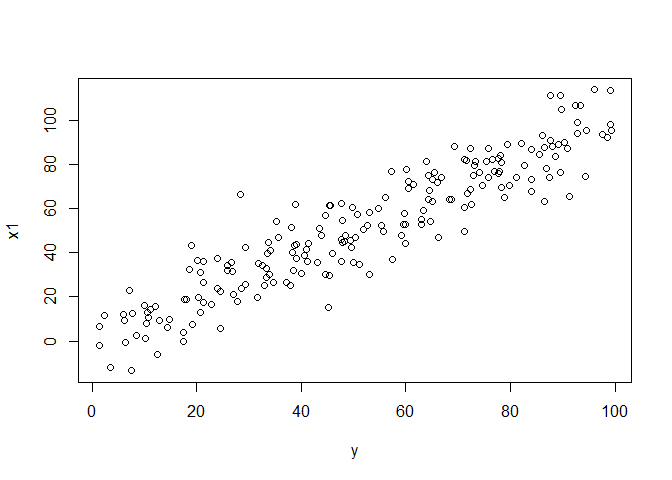
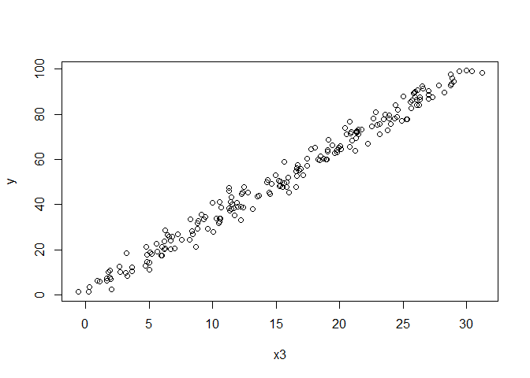
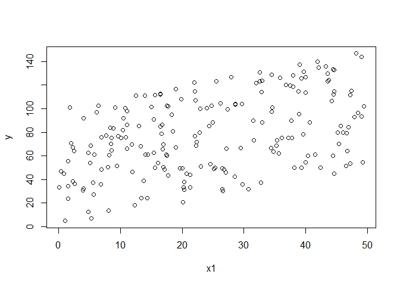
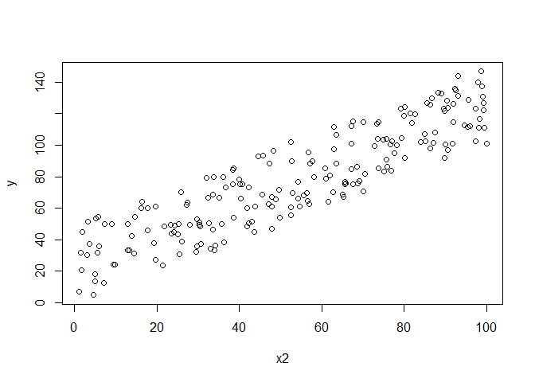
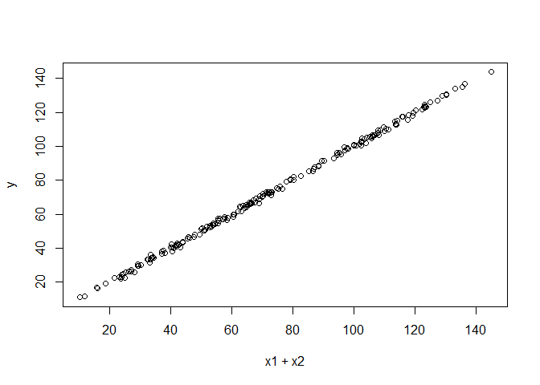
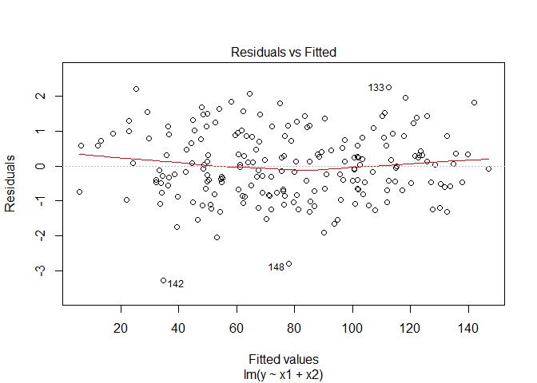
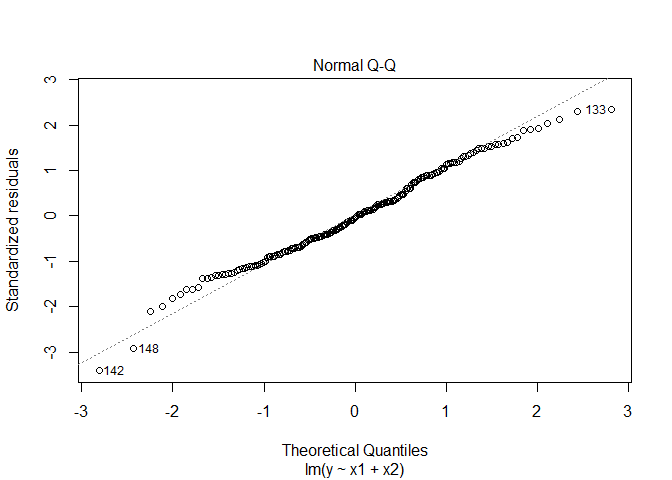
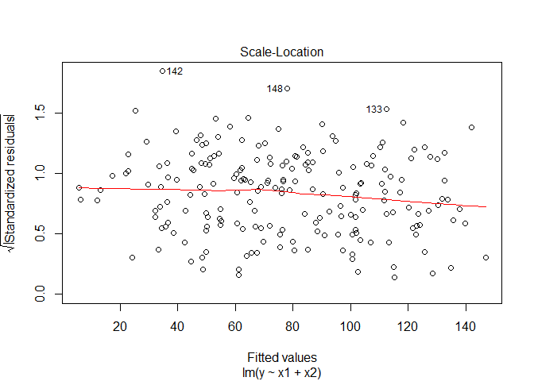
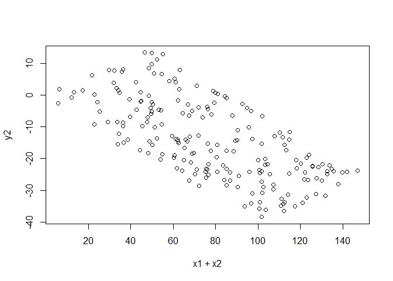
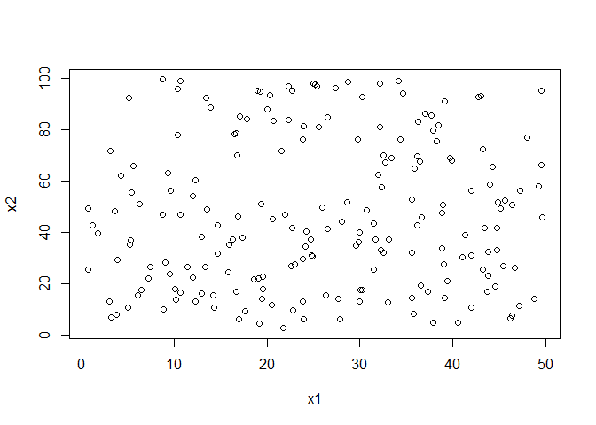

# Experiment 4
Rigel  
October 14, 2017  


## R Markdown

This is an R Markdown document. Markdown is a simple formatting syntax for authoring HTML, PDF, and MS Word documents. For more details on using R Markdown see <http://rmarkdown.rstudio.com>.

When you click the **Knit** button a document will be generated that includes both content as well as the output of any embedded R code chunks within the document. You can embed an R code chunk like this:


```r
set.seed(1)

y = runif(200,0,100)
x = rnorm(200,y,1)

plot(x,y)
```

<!-- -->

```r
linear = lm(y~x)
linear
```

```
## 
## Call:
## lm(formula = y ~ x)
## 
## Coefficients:
## (Intercept)            x  
##      0.0653       0.9988
```

```r
x1 = rnorm(200,y,10)
plot(y,x1)
```

<!-- -->

```r
linear1 =  lm(y~x)
linear1
```

```
## 
## Call:
## lm(formula = y ~ x)
## 
## Coefficients:
## (Intercept)            x  
##      0.0653       0.9988
```

```r
x2 = rnorm(200, rnorm(200,y,1),1)
plot(y,x2)
```

<!-- -->

```r
linear2 = lm(y~x2)
linear2
```

```
## 
## Call:
## lm(formula = y ~ x2)
## 
## Coefficients:
## (Intercept)           x2  
##      0.3724       0.9951
```

```r
x3 =  rnorm(200, 0.3*y, 1)

plot(x3,y)
```

<!-- -->

```r
linear3 = lm(y~x3)
linear3
```

```
## 
## Call:
## lm(formula = y ~ x3)
## 
## Coefficients:
## (Intercept)           x3  
##       1.551        3.234
```

## Multiplie Linear regression

You can also embed plots, for example:


```r
## The true underlying relationship y= x3+x4 with errors....

x1= runif(200,0,50)
x2=runif(200,0,100)

y=rnorm(200,x1+x2,1)
linear4 = lm(y~x1+x2)
linear4
```

```
## 
## Call:
## lm(formula = y ~ x1 + x2)
## 
## Coefficients:
## (Intercept)           x1           x2  
##    0.002888     1.001695     0.998284
```

```r
plot(x1,y)
```

<!-- -->

```r
plot(x2,y)
```

<!-- -->

```r
plot(x1+x2,y)
```

<!-- -->

```r
plot(linear4)
```

<!-- --><!-- --><!-- --><!-- -->

```r
#linear3 = lm(y~x3,x4)
#linear3

linear5 = lm(y~x1)
linear5
```

```
## 
## Call:
## lm(formula = y ~ x1)
## 
## Coefficients:
## (Intercept)           x1  
##      52.895        1.017
```

```r
linear6  = lm(y~x2)
linear6
```

```
## 
## Call:
## lm(formula = y ~ x2)
## 
## Coefficients:
## (Intercept)           x2  
##      24.046        1.002
```

```r
y2 = rnorm(200,0.3*x1-0.4*x2,1)
plot(x1+x2, y2)
```

<!-- -->

```r
linear7= lm(y2~x1+x2)
linear7
```

```
## 
## Call:
## lm(formula = y2 ~ x1 + x2)
## 
## Coefficients:
## (Intercept)           x1           x2  
##    -0.08235      0.30453     -0.40158
```

```r
plot(x1,x2)
```

<!-- -->

```r
cor(x1,x2)
```

```
## [1] 0.007420397
```

Note that the `echo = FALSE` parameter was added to the code chunk to prevent printing of the R code that generated the plot.

```

