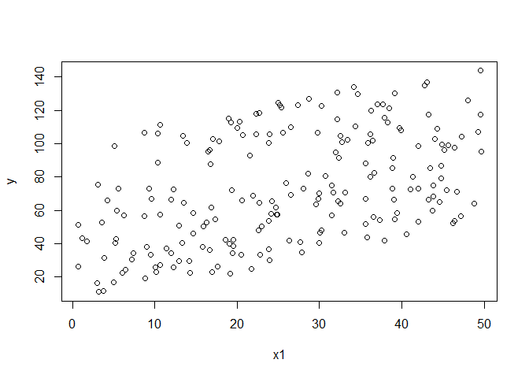

# Experiment 4
Rigel  
October 14, 2017  


## R Markdown

This is an R Markdown document. Markdown is a simple formatting syntax for authoring HTML, PDF, and MS Word documents. For more details on using R Markdown see <http://rmarkdown.rstudio.com>.

When you click the **Knit** button a document will be generated that includes both content as well as the output of any embedded R code chunks within the document. You can embed an R code chunk like this:


```r
set.seed(1)

y = runif(200,0,100)
x = rnorm(200,y,1)

plot(x,y)
```

<!-- -->

```r
linear = lm(y~x)
linear
```

```
## 
## Call:
## lm(formula = y ~ x)
## 
## Coefficients:
## (Intercept)            x  
##      0.0653       0.9988
```

```r
x1 = rnorm(200,y,10)
plot(y,x1)
```

<!-- -->

```r
linear1 =  lm(y~x)
linear1
```

```
## 
## Call:
## lm(formula = y ~ x)
## 
## Coefficients:
## (Intercept)            x  
##      0.0653       0.9988
```

```r
x2 = rnorm(200, rnorm(200,y,1),1)
plot(y,x2)
```

<!-- -->

```r
linear2 = lm(y~x2)
linear2
```

```
## 
## Call:
## lm(formula = y ~ x2)
## 
## Coefficients:
## (Intercept)           x2  
##      0.3724       0.9951
```

```r
x3 =  rnorm(200, 0.3*y, 1)

plot(x3,y)
```

<!-- -->

```r
linear3 = lm(y~x3)
linear3
```

```
## 
## Call:
## lm(formula = y ~ x3)
## 
## Coefficients:
## (Intercept)           x3  
##       1.551        3.234
```

## Multiplie Linear regression

You can also embed plots, for example:


```r
## The true underlying relationship y= x3+x4 with errors....
set.seed(1)
x1= runif(200,0,50)
x2=runif(200,0,100)

y=rnorm(200,x1+x2,1)
linear4 = lm(y~x1+x2)
linear4
```

```
## 
## Call:
## lm(formula = y ~ x1 + x2)
## 
## Coefficients:
## (Intercept)           x1           x2  
##    -0.08386      0.99996      1.00268
```

```r
plot(x1,y)
```

<!-- -->

```r
plot(x2,y)
```

<!-- -->

```r
plot(x1+x2,y)
```

<!-- -->

```r
plot(linear4)
```

<!-- --><!-- --><!-- --><!-- -->

```r
#linear3 = lm(y~x3,x4)
#linear3

linear5 = lm(y~x1)
linear5
```

```
## 
## Call:
## lm(formula = y ~ x1)
## 
## Coefficients:
## (Intercept)           x1  
##      43.175        1.146
```

```r
linear6  = lm(y~x2)
linear6
```

```
## 
## Call:
## lm(formula = y ~ x2)
## 
## Coefficients:
## (Intercept)           x2  
##      24.288        1.035
```

```r
y2 = rnorm(200,0.3*x1-0.4*x2,1)
plot(x1+x2, y2)
```

<!-- -->

```r
linear7= lm(y2~x1+x2)
linear7
```

```
## 
## Call:
## lm(formula = y2 ~ x1 + x2)
## 
## Coefficients:
## (Intercept)           x1           x2  
##     -0.1353       0.3044      -0.4004
```

```r
plot(x1,x2)
```

<!-- -->

```r
cor(x1,x2)
```

```
## [1] 0.06837504
```


```r
## does adding noise to the coefficient different than adding noise to the error term?
set.seed(1)
y=runif(200,0,100)
x=rnorm(200,y,1) + rnorm(1, mean = 0, sd = 1)
x
```

```
##   [1]  26.824173  38.148180  57.268088  91.872481  20.407282  92.499929
##   [7]  96.077908  67.883627  64.189263   8.754477  20.855395  18.087704
##  [13]  71.028241  38.653349  77.670435  50.270790  72.335532  99.805170
##  [19]  39.391380  78.460865  93.858239  23.450965  65.846471  13.269627
##  [25]  27.515550  40.217749   2.159143  39.094835  87.181098  34.604303
##  [31]  49.161846  60.261362  50.779301  17.997040  83.937563  66.203898
##  [37]  80.016684  11.159756  72.612674  41.964220  81.073944  66.776276
##  [43]  77.521977  55.733774  52.749712  79.078478   5.313960  48.634076
##  [49]  72.838747  68.526224  49.105823  86.996062  44.385316  24.444039
##  [55]   6.474118   9.765097  33.520873  52.135833  65.709754  43.445983
##  [61]  92.606367  30.015364  47.858729  35.019564  65.361477  28.901454
##  [67]  48.493171  76.100246   9.173966  88.633345  37.108946  84.943511
##  [73]  36.019021  34.194014  48.194797  90.078781  88.115260  41.967873
##  [79]  79.653136  98.163382  43.128299  73.129037  41.113035  31.961639
##  [85]  77.123411  21.004145  73.470383  12.296784  25.012313  14.298002
##  [91]  24.679511   7.189123  64.390751  89.350968  77.577059  79.576572
##  [97]  47.862277  40.886234  82.392673  61.005927  66.775468  37.902274
## [103]  29.506277  99.831172  61.957765  24.712149  14.497975  49.246804
## [109]  93.287721  61.279879  98.346367  74.493620  36.166118  42.670835
## [115]  16.702668   3.721176  72.141540   9.958808  46.164350  64.859069
## [121]  98.344317  50.455163  48.698326  17.896939  75.219196  48.086365
## [127]  51.679520  20.042672  23.956681  60.728049  57.395067   5.711191
## [133]   3.807250  65.743731  93.695470  60.604737  57.544569  52.309987
## [139] 100.499973  51.652512  69.879792  62.081903  25.004022  25.831559
## [145]  74.987601  44.150592  17.861560  75.307830  11.226317  88.368633
## [151]  62.494393  57.016795  33.701751  45.959154  51.633322  20.126538
## [157]  51.453638   8.993988  29.043991  21.738358  30.323735  90.013847
## [163]  45.232875  79.749572  90.675204  42.476150   6.852338  33.253310
## [169]  72.935235  33.715378  63.676153  85.349508  85.654983  42.678769
## [175]  39.099074  91.568424  63.036126  75.742540  60.107773  92.121639
## [181]  30.664819  19.612156  90.863027  50.526391  88.018814  18.811964
## [187]  76.035800  74.288748  95.699858  56.663492  71.677942  40.160554
## [193]  11.225151  92.197625  30.995353  60.085437  12.695333  85.899514
## [199]  32.639476  78.872992
```

```r
x1 = rnorm(200,rnorm(200,y,1),1)
x1
```

```
##   [1] 25.206700 38.000485 56.912997 93.466525 23.274373 88.549223 94.785137
##   [8] 66.214655 62.120189  4.693739 19.760633 16.234299 68.093991 37.970713
##  [15] 78.284800 48.863577 72.014959 97.530464 39.687932 78.315096 95.258231
##  [22] 21.144105 63.505594 12.989809 25.493682 38.113782  2.689736 38.056160
##  [29] 87.791563 32.515482 47.808158 59.668333 50.266792 19.929507 82.700490
##  [36] 68.096620 80.710122 11.044263 71.534377 41.448614 81.386308 65.465711
##  [43] 78.022384 54.357191 51.497276 79.151346  2.679167 46.324507 75.510822
##  [50] 71.243998 48.214356 85.383767 43.221918 27.607450  6.920624  6.441327
##  [57] 32.283774 49.443206 65.494362 36.875327 92.579036 29.426034 44.889112
##  [64] 32.463421 66.795905 26.232509 48.262575 75.432746  7.961835 86.149217
##  [71] 35.034458 83.926656 34.131907 33.058251 48.613585 89.924309 88.312913
##  [78] 36.872690 78.330701 95.447867 44.745059 71.912890 41.841668 34.178337
##  [85] 76.530867 17.994990 71.925940 10.640472 22.976641 15.361147 24.443737
##  [92]  8.378952 63.498442 85.402427 77.735433 80.507636 45.136349 41.197985
##  [99] 81.189161 61.226703 68.870472 35.245038 27.177338 98.715511 61.836935
## [106] 19.457555 12.418172 51.255343 91.931613 59.652302 98.602230 73.918816
## [113] 33.501826 45.315024 14.921091  2.026910 69.513100  8.640422 46.090252
## [120] 65.189664 96.686553 51.278953 48.439070 18.603557 75.993701 44.466778
## [127] 50.090940 19.793548 23.547327 56.310031 57.476964  5.443445  3.548812
## [134] 63.299670 91.959991 61.417183 56.529575 50.981210 99.715100 47.897710
## [141] 69.710934 60.848895 24.080645 25.985353 68.329627 44.738764 15.238186
## [148] 74.582980  7.900793 87.477113 60.036580 56.792807 29.892204 44.113388
## [155] 47.160655 18.598421 51.374843  5.438493 29.016198 21.147891 31.620744
## [162] 89.911817 44.248450 76.231842 88.018794 39.267714  7.697021 35.100244
## [169] 75.645777 31.790581 62.604223 83.424431 84.597428 41.059889 35.297401
## [176] 88.853742 63.931964 75.512727 59.503514 91.028713 27.027227 18.825228
## [183] 88.426058 51.618753 89.723662 18.096479 75.726032 72.033007 93.846357
## [190] 54.604658 73.383600 36.037697  9.442515 97.001635 27.359447 56.922571
## [197] 10.509485 85.053409 30.618595 77.654869
```

```r
plot(x,y)
```

<!-- -->

```r
plot (x1,y)
```

<!-- -->

```r
linear = lm(y~x)
linear
```

```
## 
## Call:
## lm(formula = y ~ x)
## 
## Coefficients:
## (Intercept)            x  
##     -0.8273       0.9988
```

```r
linear = lm(y~x1)
linear
```

```
## 
## Call:
## lm(formula = y ~ x1)
## 
## Coefficients:
## (Intercept)           x1  
##      0.6245       0.9903
```

```r
summary(x)
```

```
##    Min. 1st Qu.  Median    Mean 3rd Qu.    Max. 
##   2.159  30.910  51.540  52.660  75.240 100.500
```

```r
summary(x1)
```

```
##    Min. 1st Qu.  Median    Mean 3rd Qu.    Max. 
##   2.027  29.780  50.620  51.640  75.510  99.720
```

