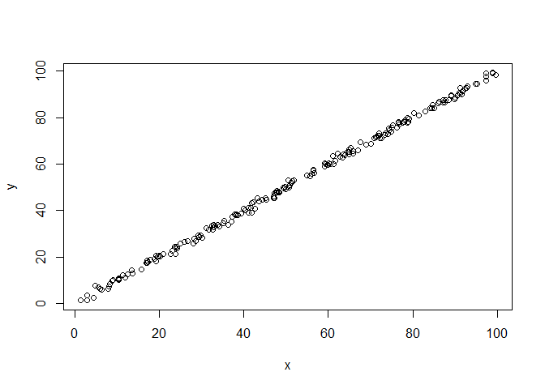

# Experiment 2
Rigel  
October 14, 2017  


## Simple linear regression

```r
set.seed(1)

y = runif(200,0,100)
x = rnorm(200,y,1)

plot (x,y)
```

<!-- -->

```r
linear = lm(y~x)
linear
```

```
## 
## Call:
## lm(formula = y ~ x)
## 
## Coefficients:
## (Intercept)            x  
##      0.0653       0.9988
```

```r
x1 = rnorm(200,y,10)
plot(y,x1)
```

<!-- -->

```r
linear1 =  lm(y~x)
linear1
```

```
## 
## Call:
## lm(formula = y ~ x)
## 
## Coefficients:
## (Intercept)            x  
##      0.0653       0.9988
```

```r
x2 = rnorm(200, rnorm(200,y,1),1)
plot(y,x2)
```

<!-- -->

```r
linear2 = lm(y~x2)
linear2
```

```
## 
## Call:
## lm(formula = y ~ x2)
## 
## Coefficients:
## (Intercept)           x2  
##      0.3724       0.9951
```

```r
x3 =  rnorm(200, 0.3*y, 1)

plot(x3,y)
```

<!-- -->

```r
linear3 = lm(y~x3)
linear3
```

```
## 
## Call:
## lm(formula = y ~ x3)
## 
## Coefficients:
## (Intercept)           x3  
##       1.551        3.234
```

