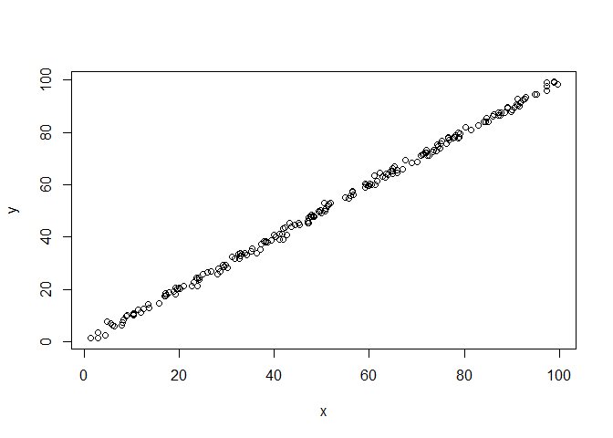

# Experiments
Rigel  
October 12, 2017  


```r
set.seed(1)

y = runif(200,0,100)
x = rnorm(200,y,1)

plot (x,y)
```

<!-- -->

```r
linear = lm(y~x)
linear
```

```
## 
## Call:
## lm(formula = y ~ x)
## 
## Coefficients:
## (Intercept)            x  
##      0.0653       0.9988
```

```r
x1 = rnorm(200,y,10)
plot(y,x1)
```

<!-- -->

```r
linear1 =  lm(y~x)
linear1
```

```
## 
## Call:
## lm(formula = y ~ x)
## 
## Coefficients:
## (Intercept)            x  
##      0.0653       0.9988
```

```r
x2 = rnorm(200, rnorm(200,y,1),1)
plot(y,x2)
```

<!-- -->

```r
linear2 = lm(y~x2)
linear2
```

```
## 
## Call:
## lm(formula = y ~ x2)
## 
## Coefficients:
## (Intercept)           x2  
##      0.3724       0.9951
```

## Including Plots

You can also embed plots, for example:


Note that the `echo = FALSE` parameter was added to the code chunk to prevent printing of the R code that generated the plot.
